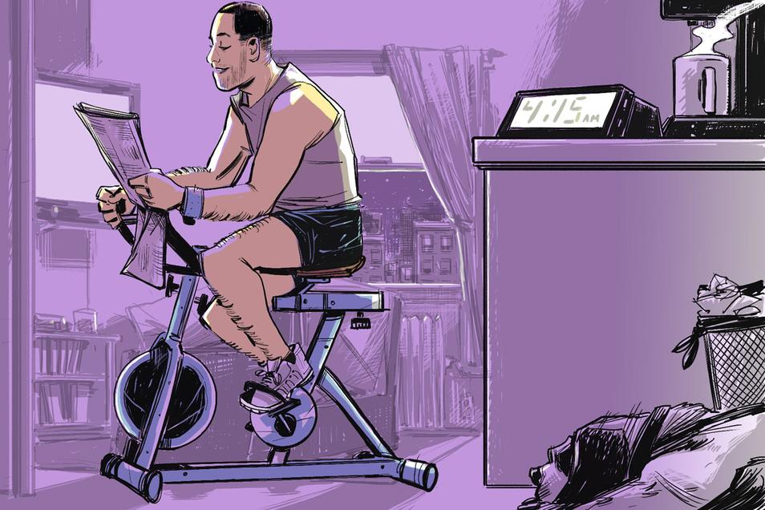

Why 4 a.m. Is the Most Productive Hour

- [Life](https://www.wsj.com/news/types/life-style)

# Why 4 a.m. Is the Most Productive Hour

## Tackle personal tasks before sunrise; find focus before distractions begin

Are Early Mornings the Secret to Success?

From Tim Cook to Michelle Obama, early risers are checking emails and working out before dawn…and then working a full day. WSJ contributor Hilary Potkewitz joins Tanya Rivero on Lunch Break to discuss. Photo: Getty

 .

 *By*
 *Hilary Potkewitz*

  August 23, 2016

 [ 177 COMMENTS](https://www.wsj.com/articles/why-4-a-m-is-the-most-productive-hour-1471971861?mod=djmc_pkt_email_092617#comments_sector)

Most people who wake up at 4 a.m. do it because they have to—farmers, flight attendants, currency traders and postal workers. Others rise before dawn because they want to.

Russ Perry, the 33-year-old Scottsdale, Ariz., resident and founder of graphic design firm [Design Pickle](http://designpickle.com/), says that 4 a.m. to 6 a.m. is “the most planned, most organized and most scheduled part of my day. It’s a crapshoot from there.”

Once he and his wife started a family, he says, each new addition required an earlier wake-up time to beat the daily chaos. Their third daughter was born in 2015, and he moved his alarm to 4 a.m.

–– ADVERTISEMENT ––

First, he prays. “I’m a Christian. I thank God for boring stuff, frankly, but it’s like a pep talk for me,” he says.

Then he deals with email, business finances and goes to the gym. By the time he gets home at 6:30 a.m. and makes a smoothie, one of his daughters is up. “And that ends my solitude,” he says.

#### Tips From the Early Birds

A defense of the 4 a.m. start:

- ‘I sleep in gym clothes and put sneakers on within 10 seconds of waking up. It’s very hard to go back to sleep once your shoes are on.’ -- Peter Shankman, entrepreneur/author

- ‘I have a programmable coffeemaker. The coffee starts making itself at 3:45am.’ -- Ruth Carter, lawyer/legal blogger

- ‘No client will get an email from me that early. I schedule my emails to go out between 7:30 a.m. and 8:00 a.m.’ -- Lauren Milligan, career coach

- ‘I go to the first gym class of the day, at 5:00 a.m. I’ve actually made some friends with similar schedules and lifestyles.’ -- Russ Perry, entrepreneur/creative consultant

 .

Even though he knows productivity experts say doing email first thing in the morning expends prime mental energy on busywork, Mr. Perry says clearing his inbox curbs his anxiety. “I feel I get a head start on everybody,” he says.

There are trade-offs. Mr. Perry says he’s exhausted by 10 p.m., in bed with an eye mask and earplugs, while his wife Mika is a night owl. He says he doesn’t really feel he’s giving anything up. “I’d probably just be watching TV or on my computer doing low brain activity stuff,” he says.

Executives have often touted the benefits of an early morning start. Apple chief executive Tim Cook, known for being among first in the office and the last to leave, starts his morning routine at 3:45 a.m. And Sallie Krawcheck, chief executive of Ellevest and former Wall Street executive, has written, “I’m never more productive than at 4 a.m.”

Nonexecutive early birds aren’t necessarily workaholic. They hope to avoid the distractions of technology and social media. Those who work from home want a jump start on their day before other demands intrude. Some are seeking solitude and quiet.

“When you have peace and quiet and you’re not concerned with people trying to get your attention, you’re dramatically more effective and can get important work done, so they have that part right,” says psychologist Josh Davis, director of research at the NeuroLeadership Institute and author of the book “[Two Awesome Hours](http://www.twoawesomehours.com/),” about using science-based tools to enhance productivity.

One of the most common challenges to productivity, Dr. Davis says, is that people booby trap their offices with distractions: Desk clutter, email pop-ups, cellphone, [Facebook](http://quotes.wsj.com/FB)  , news feeds. “By waking up at 4 a.m., they’ve essentially wiped a lot of those distractions off their plate. No one is expecting you to email or answer the phone at 4 a.m. No one will be posting on Facebook. You’ve removed the internal temptation and the external temptation.”

 

 Early birds seek solitude and the absence of distraction for a sense of accomplishment that comes before dawn.     Illustration:  Thomas Pitilli for the Wall Street Journal

 .

Peter Shankman, a 44-year-old entrepreneur and speaker based in New York City, is usually out of bed a few minutes after 4 a.m. Twice a week he meets a buddy for a 10-mile run in the dark around lower Manhattan.

The city’s streets are usually deserted, providing a nearly distraction-free space for thinking. “If I’m busy dodging people or noticing who’s passing me, my ideas won’t come,” Mr. Shankman says.

By 7 a.m., he claims he is “showered, fed, watered and sitting at his desk” answering emails, writing or working on [Faster Than Normal](http://fasterthannormal.com/), a podcast focused on harnessing the advantages of Attention Deficit Hyperactivity Disorder.

The flip side is that he is in bed by 8:30 p.m. “I’m exhausted, but in a good way, which means I won’t have the energy to do something stupid like eat two gallons of Ben & Jerry’s at 10:30 p.m.” He also says the early start gives him time to make his 3-year-old daughter an omelet for breakfast.

In suburban Chicago, Lauren Milligan

has been waking up at 4 a.m. since she founded her own career coaching business, [ResuMAYDAY](http://resumayday.com/), about 15 years ago. The 46-year-old says she loves drinking her coffee while watching the stars disappear.

But it can be hours before she sees another person in her neighborhood, which creates a feeling of isolation. Also, Ms. Milligan’s husband—a musician who performs four or five nights a week—is often coming home just when she’s waking up.

Early mornings are all about good decisions for Karen Schwalbe-Jones, the 48-year-old owner of [Harmony Studios](http://www.harmonystudiosla.com/), a Pilates-based gym in West Hollywood, Calif. She says she started waking up at 4 a.m. about 13 years ago, when her son was born, as a way to fit in her own workout before shifting into business-manager mode.

She used to sleep until 5 a.m. and hope to fit in a run or Pilates session in the afternoon, but says the day would inevitably slip away from her, and by 2 p.m. she was irritable. “It wasn’t good for anyone,” she recalls.

Ms. Schwalbe-Jones admits she struggles with some of the trade-offs. “I have so many wonderful friends who I don’t ever get to see because of the life I’ve chosen,” she says. “It works best for my family right now, but someday I’d like to be able to go out for dinner and not be looking at my watch and freaking out if it’s 9:30 p.m.”

#### Related Reading

- [What Teens Need Most From Their Parents](https://www.wsj.com/articles/what-teens-need-most-from-their-parents-1470765906)

- [Is Sitting Cross-Legged Bad for You?](https://www.wsj.com/articles/is-sitting-cross-legged-bad-for-you-1471893740)

- [The Mental Mistakes We Make With Retirement Spending](https://www.wsj.com/articles/the-mental-mistakes-we-make-with-retirement-spending-1492999921)

- [The Smarter Ways to Study](https://www.wsj.com/articles/the-smarter-ways-to-study-1502810531)

- [You’re Not Busy, You’re Just Rude](https://www.wsj.com/articles/youre-not-busy-youre-just-rude-1489354275)

- [The Boss Wants You Back in the Office](https://www.wsj.com/articles/the-boss-wants-you-back-in-the-office-1500975001)

 .

## Recommended Videos

- 1

 

#### [Investing in Tesla: 5 Things You Need to Know](http://www.barrons.com/video/investing-in-tesla-5-things-you-need-to-know/5CAB494F-2AA0-4266-BBDB-8C8C1AC2F369.html?mod=trending_now_video_1)

- 2

 

#### [Trump ​Addresses​ Military Action in North Korea​ and​​ NFL Tweets](http://www.wsj.com/video/trump-addresses-military-action-in-north-korea-and-nfl-tweets/5026DF86-C912-4FE1-B5BA-30EAC764A1A7.html?mod=trending_now_video_2)

- 3

 

#### [Inside Jim Belushi's $38.5 Million Mansion](http://www.wsj.com/video/inside-jim-belushi-385-million-mansion/2199DD05-8B71-497D-A44B-6B3A5177B24F.html?mod=trending_now_video_3)

- 4

 

#### [Trump's Simple Tax-Overhaul Pitch: Jobs](http://www.wsj.com/video/trump-simple-tax-overhaul-pitch-jobs/4FEE7E18-EE56-4142-BE76-DF8953565693.html?mod=trending_now_video_4)

- 5

 

#### [Blade Runner 2049: How a Dystopian Future Got Darker](http://www.wsj.com/video/blade-runner-2049-how-a-dystopian-future-got-darker/F627B82B-6C81-457D-8A8E-71B0B6E3233F.html?mod=trending_now_video_5)

## Most Popular Articles

- 1  

####   [DirecTV Allows Some NFL Refunds After Anthem Controversy](https://www.wsj.com/articles/directv-allows-some-nfl-refunds-after-anthem-controversy-1506453159?mod=trending_now_1)

- 2  

####   [Behind the NFL’s Frantic Scramble to Hit Back at Trump](https://www.wsj.com/articles/behind-the-nfls-frantic-scramble-to-hit-back-at-trump-1506439647?mod=trending_now_2)

- 3  

####   [Bribery, Kickbacks Alleged at Top NCAA Basketball Programs](https://www.wsj.com/articles/arrests-expected-in-probe-of-alleged-bribery-kickbacks-at-college-basketball-programs-1506431065?mod=trending_now_3)

- 4  

####   [Roy Moore Wins Alabama’s Republican Senate Primary](https://www.wsj.com/articles/roy-moore-wins-alabamas-gop-senate-primary-1506475781?mod=trending_now_4)

- 5  

####   [McConnell’s Stature Bruised by Health Bill, Alabama Runoff](https://www.wsj.com/articles/mitch-mcconnells-stature-left-bruised-by-alabama-runoff-health-bill-woes-1506423603?mod=trending_now_5)