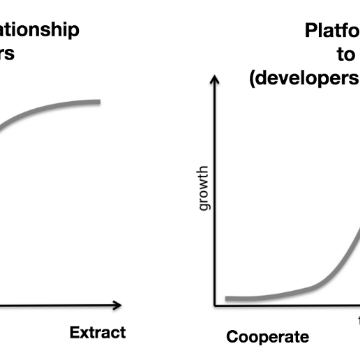

Why Decentralization Matters – Chris Dixon – Medium

Why Decentralization Matters – Chris Dixon – Medium

https://medium.com/@cdixon/why-decentralization-matters-5e3f79f7638e

Centralized platforms have been dominant for so long that many people have forgotten there is a better way to build internet services.