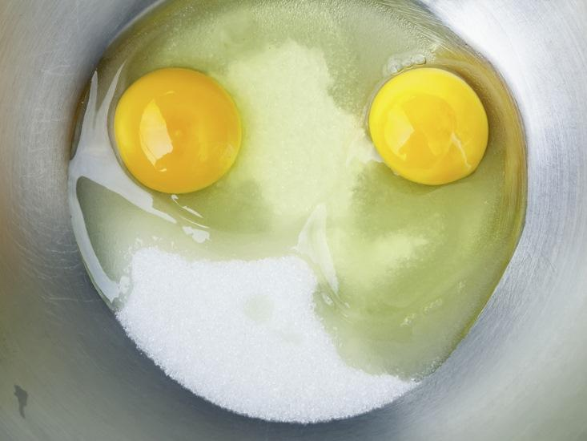
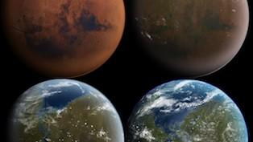

Why Facebook Is the Junk Food of Socializing - Facts So Romantic - Nautilus

Facts So Romantic On[Biology](http://nautil.us/term/l/Biology)

# Why Facebook Is the Junk Food of Socializing

Posted By Jim Davies on Jun 01, 2015

- [*c* Add a comment](http://nautil.us/blog/why-facebook-is-the-junk-food-of-socializing#com1072)

- [*f* Facebook](https://www.facebook.com/sharer/sharer.php?s=100&p%5Bsite_name%5D=Nautilus&p%5Btype%5D=website&p%5Burl%5D=http%3A%2F%2Fnautil.us%2Fblog%2Fwhy-facebook-is-the-junk-food-of-socializing&p%5Btitle%5D=Why+Facebook+Is+the+Junk+Food+of+Socializing+-+Facts+So+Romantic+-+Nautilus&p%5Bsummary%5D=Have+you+ever+been+walking+in+a+dark+alley+and+seen+something+that+you+thought+was+a+crouching+person%2C+but+it+turned+out+to+be+a+garbage%26%238230%3B&p%5Bimages%5D%5B0%5D=http%3A%2F%2Fstatic.nautil.us%2F6248_e6a4f65e7355bb8b7671c3a18003b146_314x177.jpg)

- [*t* Twitter](https://twitter.com/share?url=http%3A%2F%2Fnautil.us%2Fblog%2Fwhy-facebook-is-the-junk-food-of-socializing&text=Why+Facebook+Is+the+Junk+Food+of+Socializing&via=NautilusMag)

- [*m* Email](http://nautil.us/blog/why-facebook-is-the-junk-food-of-socializingmailto:?subject=Nautilus:%20Why%20Facebook%20Is%20the%20Junk%20Food%20of%20Socializing&body=I%20saw%20this%20blog%20post%20on%20Nautil.us%20and%20wanted%20to%20share%20it%20with%20you.%0D%0A---------------------------%0D%0AWhy%20Facebook%20Is%20the%20Junk%20Food%20of%20Socializing%0D%0A%0D%0AHave%20you%20ever%20been%20walking%20in%20a%20dark%20alley%20and%20seen%20something%20that%20you%20thought%20was%20a%20crouching%20person,%20but%20it%20turned%20out%20to%20be%20a%20garbage%20bag%20or%20something%20similarly%20innocuous?%20Me%20too.%0D%0A%0D%0Ahttp://nautil.us/blog/why-facebook-is-the-junk-food-of-socializing)

- [*U* Sharing]()
- [*X* Reddit](http://www.reddit.com/submit?title=Why+Facebook+Is+the+Junk+Food+of+Socializing&url=http%3A%2F%2Fnautil.us%2Fblog%2Fwhy-facebook-is-the-junk-food-of-socializing)

- [*Y* Stumbleupon](http://www.stumbleupon.com/badge/?url=http%3A%2F%2Fnautil.us%2Fblog%2Fwhy-facebook-is-the-junk-food-of-socializing)

- [*V* Tumblr](http://tumblr.com/share?s=&v=3&t=Why+Facebook+Is+the+Junk+Food+of+Socializing&u=http%3A%2F%2Fnautil.us%2Fblog%2Fwhy-facebook-is-the-junk-food-of-socializing)

- [*L* Pocket](https://getpocket.com/save?url=http%3A%2F%2Fnautil.us%2Fblog%2Fwhy-facebook-is-the-junk-food-of-socializing&title=Why+Facebook+Is+the+Junk+Food+of+Socializing)

Have you ever been walking in a dark alley and seen something that you thought was a crouching person, but it turned out to be a garbage bag or something similarly innocuous? Me too.

Have you ever seen a person crouching in a dark alley and mistaken it for a garbage bag? Me neither. Why does the error go one way and not the other?

[Klattistock via Shutterstock](http://www.shutterstock.com/pic-276648545/stock-photo-egg-and-white-sugar-in-stainless-bowl-for-make-a-cakes-but-look-like-face.html)

Human beings are intensely social animals. We live in hierarchical social environments in which our comfort, reproduction, and very survival depend on our relationships with other people. As a result, we are very good at thinking about things in social ways. In fact, some scientists have argued that the evolutionary arms race for strategic social thinking—either [for competition](http://www.sciencedirect.com/science/article/pii/S1090513804000595), [for cooperation](http://rspb.royalsocietypublishing.org/content/early/2012/04/04/rspb.2012.0206), or both—was a large part of why we became so intelligent as a species.

This affinity for social reasoning, however, has resulted in systematic quirks in human reasoning about the non-human. This happens in two ways. First, we tend to see humanlike agency where there isn’t any, a common form of [pareidolia](http://en.wikipedia.org/wiki/Pareidolia). Many people view the sun as happy, for instance, and in religions the world over, diseases are seen as curses cast by witches. This effect has been argued to be one of the main reasons religions exist at all: People imagine that there must be supernatural beings behind the scenes, making the world work the way it does.1 Second, we are more prone to believe in explanations when they are couched in terms of the everyday psychology people use to explain and predict people’s behavior. Teachers sometimes take advantage of this, using “anthropomorphic” glosses on natural phenomena to help their students learn ([e.g.](http://bit.ly/1JdUphX), “the water wants to find its level.”)

Why would we evolve to have a systematic error like this? Like most biases, it takes advantage of patterns in our environment to help us (or, more accurately, paleolithic people) reproduce and survive. In the environment where humans first evolved, mistaking a log for a lion is much safer than mistaking a lion for a log, favoring the survival of those who err on the side of seeing agency in many places. And for a hunter-gatherer at greater risk from wild animals and interpersonal violence than we face today, living things tend to be more dangerous than non-living things. We tend to see agency in everything, and children have it more than adults, [suggesting that it has an inborn element](http://www.ncbi.nlm.nih.gov/pubmed/16313665).

There are some interesting ramifications of this. In the 1990s, human-computer-interaction researchers Reeves and Nass replicated social psychology experiments, but rather than interacting with other people, [participants interacted with computers](http://humanityonline.com/docs/the%20media%20equation.pdf) (pdf). For example, the researchers put a blue ribbon around a participant’s arm and a blue piece of paper around a computer’s monitor. Participants were told that that computer was on their team, and that another computer, adorned with red paper, was on the other team. Participants believed that the spell checker on the “teammate” computer caught more errors. This is because we think about computers (or characters in fiction, or gods) using the same reasoning processes we do when we reason about other people. That experiment is just one of many fascinating (and often hilarious) examples.

The other interesting effect of this is that we treat virtual people as real people. Experiments show that, at some level, people tend to think of the characters on their favorite TV shows as personal friends—[even if those characters are wizards or vampires](http://www.ncbi.nlm.nih.gov/pubmed/21750250).

Similarly, when we interact with “friends” on social-networking sites or through texting, it can feel like we’re getting quality social contact, but we are not. It turns out that face-to-face interaction with other people—real people, right in front of us, not characters on TV or friends we communicate via text messages—is absolutely vital for longevity and happiness. In fact, it is a larger contributor than exercise or diet!2

We need to remind ourselves of our evolutionary history, where we evolved without exposure to realistic representations of people. Back then, if you saw something that looked like a person, by golly it was a person. When you look at a video of a person, most of your brain thinks it’s real—the fusiform face area of your brain area reacts identically whether you’re looking at a real face or a picture of one (in fact, most experiments investigating this part of the brain do not use real faces at all, but photos or videos of them).

The errors we make when we view non-human things as human satisfies our desire to interact with other people without giving us many of the benefits. In the moment, watching TV feels good; it satisfies your desire to be with other people. But it’s the visual equivalent of empty calories—delicious but not nutritious.

Get together with a friend instead. Your brain will thank you.

**References**

1. Bering, J. (2011). *The Belief Instinct: The Psychology of Souls, Destiny, and the Meaning of Life*. W.W. Norton & Company.

2. Pinker, S. (2014). *The Village Effect: How Face-to-Face Contact Can Make Us Happier and Healthier*. Random House Canada.

*Jim Davies is the author or *[Riveted: The Science of Why Jokes Make Us Laugh, Movies Make Us Cry, and Religion Makes Us Feel One with the Universe](http://www.amazon.com/Riveted-Science-Movies-Religion-Universe/dp/113727901X). *He teaches cognitive science at Carleton University.*

## Most Recent Entries

### [See All](http://nautil.us/blog)

-   [Culture](http://nautil.us/term/l/Culture)

#### [Why Nuclear Power Professionals Are Serious About Joking Around](http://nautil.us/blog/why-nuclear-power-professionals-are-serious-about-joking-around)

*Posted on Nov 22, 2017*

-   [Ideas](http://nautil.us/term/l/Ideas)

#### [A Modest Proposal for Thanksgiving](http://nautil.us/blog/a-modest-proposal-for-thanksgiving)

*Posted on Nov 22, 2017*

-   [Biology](http://nautil.us/term/l/Biology)

#### [Darwin’s Lost Beetle Is Back](http://nautil.us/blog/darwins-lost-beetle-is-back)

*Posted on Nov 21, 2017*

-   [Culture](http://nautil.us/term/l/Culture)

#### [Yes, It Matters What You Wear to an Exam](http://nautil.us/blog/-yes-it-matters-what-you-wear-to-an-exam)

*Posted on Nov 19, 2017*

-   [Matter](http://nautil.us/term/l/Matter)

#### [How to Give Mars an Atmosphere, Maybe](http://nautil.us/blog/how-to-give-mars-an-atmosphere-maybe)

*Posted on Nov 15, 2017*

## Current Issue

### [See Full Issue](http://nautil.us/issue/54/the-unspoken)

13 Comments - Join the Discussion