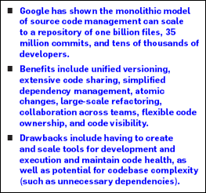

Why Google Stores Billions of Lines of Code in a Single Repository

 [Home](https://cacm.acm.org/) → [Magazine Archive](https://cacm.acm.org/magazines/decade) → [July 2016 (Vol. 59, No. 7)](https://cacm.acm.org/magazines/2016/7) → [Why Google Stores Billions of Lines of Code in a Single...](https://cacm.acm.org/magazines/2016/7/204032-why-google-stores-billions-of-lines-of-code-in-a-single-repository) → Full Text

Contributed articles

# Why Google Stores Billions of Lines of Code in a Single Repository

######

* * *

 By Rachel Potvin, Josh Levenberg
Communications of the ACM, Vol. 59 No. 7, Pages 78-87
10.1145/2854146

[Comments (3)](https://cacm.acm.org/magazines/2016/7/204032-why-google-stores-billions-of-lines-of-code-in-a-single-repository/fulltext#comments)

 View as:  [Print](https://cacm.acm.org/magazines/2016/7/204032-why-google-stores-billions-of-lines-of-code-in-a-single-repository/fulltext#)  [Mobile App](https://cacm.acm.org/about-communications/mobile-apps/)  [ACM Digital Library](http://dl.acm.org/citation.cfm?id=2963119.2854146&coll=portal&dl=ACM)  [Full Text (PDF)](https://cacm.acm.org/magazines/2016/7/204032-why-google-stores-billions-of-lines-of-code-in-a-single-repository/pdf)  [In the Digital Edition](http://dl.acm.org/ft_gateway.cfm?id=2854146&ftid=1749812&dwn=1)  Share:  [Send by email](#)  [Share on reddit](#)  [Share on StumbleUpon](#)

[(L)](https://plus.google.com/share?app=110&url=https%3A%2F%2Fcacm.acm.org%2Fmagazines%2F2016%2F7%2F204032-why-google-stores-billions-of-lines-of-code-in-a-single-repository%2Ffulltext)

 [Share on Tweeter](#)  [Share on Facebook](#)
 [Share](http://www.addthis.com/bookmark.php?v=250&pubid=xa-4dcbeff2515fc93c)

 

Early Google employees decided to work with a shared codebase managed through a centralized source control system. This approach has served Google well for more than 16 years, and today the vast majority of Google's software assets continues to be stored in a single, shared repository. Meanwhile, the number of Google software developers has steadily increased, and the size of the Google codebase has grown exponentially (see [Figure 1](https://cacm.acm.org/magazines/2016/7/204032-why-google-stores-billions-of-lines-of-code-in-a-single-repository/fulltext#F1)). As a result, the technology used to host the codebase has also evolved significantly.

[Back to Top](https://cacm.acm.org/magazines/2016/7/204032-why-google-stores-billions-of-lines-of-code-in-a-single-repository/fulltext#PageTop)

### Key Insights

This article outlines the scale of that codebase and details Google's custom-built monolithic source repository and the reasons the model was chosen. Google uses a homegrown version-control system to host one large codebase visible to, and used by, most of the software developers in the company. This centralized system is the foundation of many of Google's developer workflows. Here, we provide background on the systems and workflows that make feasible managing and working productively with such a large repository. We explain Google's "trunk-based development" strategy and the support systems that structure workflow and keep Google's codebase healthy, including software for static analysis, code cleanup, and streamlined code review.

[Back to Top](https://cacm.acm.org/magazines/2016/7/204032-why-google-stores-billions-of-lines-of-code-in-a-single-repository/fulltext#PageTop)

### Google-Scale

Google's monolithic software repository, which is used by 95% of its software developers worldwide, meets the definition of an ultra-large-scale[4](https://cacm.acm.org/magazines/2016/7/204032-why-google-stores-billions-of-lines-of-code-in-a-single-repository/fulltext#R4) system, providing evidence the single-source repository model can be scaled successfully.

The Google codebase includes approximately one billion files and has a history of approximately 35 million commits spanning Google's entire 18-year existence. The repository contains 86TB[a](https://cacm.acm.org/magazines/2016/7/204032-why-google-stores-billions-of-lines-of-code-in-a-single-repository/fulltext#FNA) of data, including approximately two billion lines of code in nine million unique source files. The total number of files also includes source files copied into release branches, files that are deleted at the latest revision, configuration files, documentation, and supporting data files; see the table here for a summary of Google's repository statistics from January 2015.

In 2014, approximately 15 million lines of code were changed[b](https://cacm.acm.org/magazines/2016/7/204032-why-google-stores-billions-of-lines-of-code-in-a-single-repository/fulltext#FNB) in approximately 250,000 files in the Google repository on a weekly basis. The Linux kernel is a prominent example of a large open source software repository containing approximately 15 million lines of code in 40,000 files.[14](https://cacm.acm.org/magazines/2016/7/204032-why-google-stores-billions-of-lines-of-code-in-a-single-repository/fulltext#R14)

Google's codebase is shared by more than 25,000 Google software developers from dozens of offices in countries around the world. On a typical workday, they commit 16,000 changes to the codebase, and another 24,000 changes are committed by automated systems. Each day the repository serves billions of file read requests, with approximately 800,000 queries per second during peak traffic and an average of approximately 500,000 queries per second each workday. Most of this traffic originates from Google's distributed build-and-test systems.[c](https://cacm.acm.org/magazines/2016/7/204032-why-google-stores-billions-of-lines-of-code-in-a-single-repository/fulltext#FNC)

[Figure 2](https://cacm.acm.org/magazines/2016/7/204032-why-google-stores-billions-of-lines-of-code-in-a-single-repository/fulltext#F2) reports the number of unique human committers per week to the main repository, January 2010-July 2015. [Figure 3](https://cacm.acm.org/magazines/2016/7/204032-why-google-stores-billions-of-lines-of-code-in-a-single-repository/fulltext#F3) reports commits per week to Google's main repository over the same time period. The line for total commits includes data for both the interactive use case, or human users, and automated use cases. Larger dips in both graphs occur during holidays affecting a significant number of employees (such as Christmas Day and New Year's Day, American Thanksgiving Day, and American Independence Day).

In October 2012, Google's central repository added support for Windows and Mac users (until then it was Linux-only), and the existing Windows and Mac repository was merged with the main repository. Google's tooling for repository merges attributes all historical changes being merged to their original authors, hence the corresponding bump in the graph in [Figure 2](https://cacm.acm.org/magazines/2016/7/204032-why-google-stores-billions-of-lines-of-code-in-a-single-repository/fulltext#F2). The effect of this merge is also apparent in [Figure 1](https://cacm.acm.org/magazines/2016/7/204032-why-google-stores-billions-of-lines-of-code-in-a-single-repository/fulltext#F1).

The commits-per-week graph shows the commit rate was dominated by human users until 2012, at which point Google switched to a custom-source-control implementation for hosting the central repository, as discussed later. Following this transition, automated commits to the repository began to increase. Growth in the commit rate continues primarily due to automation.

Managing this scale of repository and activity on it has been an ongoing challenge for Google. Despite several years of experimentation, Google was not able to find a commercially available or open source version-control system to support such scale in a single repository. The Google proprietary system that was built to store, version, and vend this codebase is code-named Piper.

[Back to Top](https://cacm.acm.org/magazines/2016/7/204032-why-google-stores-billions-of-lines-of-code-in-a-single-repository/fulltext#PageTop)

### Background

Before reviewing the advantages and disadvantages of working with a monolithic repository, some background on Google's tooling and workflows is needed.

**Piper and CitC**. Piper stores a single large repository and is implemented on top of standard Google infrastructure, originally Bigtable,[2](https://cacm.acm.org/magazines/2016/7/204032-why-google-stores-billions-of-lines-of-code-in-a-single-repository/fulltext#R2) now Spanner.[3](https://cacm.acm.org/magazines/2016/7/204032-why-google-stores-billions-of-lines-of-code-in-a-single-repository/fulltext#R3) Piper is distributed over 10 Google data centers around the world, relying on the Paxos[6](https://cacm.acm.org/magazines/2016/7/204032-why-google-stores-billions-of-lines-of-code-in-a-single-repository/fulltext#R6) algorithm to guarantee consistency across replicas. This architecture provides a high level of redundancy and helps optimize latency for Google software developers, no matter where they work. In addition, caching and asynchronous operations hide much of the network latency from developers. This is important because gaining the full benefit of Google's cloud-based toolchain requires developers to be online.

Google relied on one primary Perforce instance, hosted on a single machine, coupled with custom caching infrastructure[1](https://cacm.acm.org/magazines/2016/7/204032-why-google-stores-billions-of-lines-of-code-in-a-single-repository/fulltext#R1) for more than 10 years prior to the launch of Piper. Continued scaling of the Google repository was the main motivation for developing Piper.

Since Google's source code is one of the company's most important assets, security features are a key consideration in Piper's design. Piper supports file-level access control lists. Most of the repository is visible to all Piper users;[d](https://cacm.acm.org/magazines/2016/7/204032-why-google-stores-billions-of-lines-of-code-in-a-single-repository/fulltext#FND) however, important configuration files or files including business-critical algorithms can be more tightly controlled. In addition, read and write access to files in Piper is logged. If sensitive data is accidentally committed to Piper, the file in question can be purged. The read logs allow administrators to determine if anyone accessed the problematic file before it was removed.

In the Piper workflow (see [Figure 4](https://cacm.acm.org/magazines/2016/7/204032-why-google-stores-billions-of-lines-of-code-in-a-single-repository/fulltext#F4)), developers create a local copy of files in the repository before changing them. These files are stored in a workspace owned by the developer. A Piper workspace is comparable to a working copy in Apache Subversion, a local clone in Git, or a client in Perforce. Updates from the Piper repository can be pulled into a workspace and merged with ongoing work, as desired (see [Figure 5](https://cacm.acm.org/magazines/2016/7/204032-why-google-stores-billions-of-lines-of-code-in-a-single-repository/fulltext#F5)). A snapshot of the workspace can be shared with other developers for review. Files in a workspace are committed to the central repository only after going through the Google code-review process, as described later.

Most developers access Piper through a system called Clients in the Cloud, or CitC, which consists of a cloud-based storage backend and a Linux-only FUSE[13](https://cacm.acm.org/magazines/2016/7/204032-why-google-stores-billions-of-lines-of-code-in-a-single-repository/fulltext#R13) file system. Developers see their workspaces as directories in the file system, including their changes overlaid on top of the full Piper repository. CitC supports code browsing and normal Unix tools with no need to clone or sync state locally. Developers can browse and edit files anywhere across the Piper repository, and only modified files are stored in their workspace. This structure means CitC workspaces typically consume only a small amount of storage (an average workspace has fewer than 10 files) while presenting a seamless view of the entire Piper codebase to the developer.

All writes to files are stored as snapshots in CitC, making it possible to recover previous stages of work as needed. Snapshots may be explicitly named, restored, or tagged for review.

CitC workspaces are available on any machine that can connect to the cloud-based storage system, making it easy to switch machines and pick up work without interruption. It also makes it possible for developers to view each other's work in CitC workspaces. Storing all in-progress work in the cloud is an important element of the Google workflow process. Working state is thus available to other tools, including the cloud-based build system, the automated test infrastructure, and the code browsing, editing, and review tools.

Several workflows take advantage of the availability of uncommitted code in CitC to make software developers working with the large codebase more productive. For instance, when sending a change out for code review, developers can enable an auto-commit option, which is particularly useful when code authors and reviewers are in different time zones. When the review is marked as complete, the tests will run; if they pass, the code will be committed to the repository without further human intervention. The Google code-browsing tool CodeSearch supports simple edits using CitC workspaces. While browsing the repository, developers can click on a button to enter edit mode and make a simple change (such as fixing a typo or improving a comment). Then, without leaving the code browser, they can send their changes out to the appropriate reviewers with auto-commit enabled.

Piper can also be used without CitC. Developers can instead store Piper workspaces on their local machines. Piper also has limited interoperability with Git. Over 80% of Piper users today use CitC, with adoption continuing to grow due to the many benefits provided by CitC.

Piper and CitC make working productively with a single, monolithic source repository possible at the scale of the Google codebase. The design and architecture of these systems were both heavily influenced by the trunk-based development paradigm employed at Google, as described here.

**Trunk-based development**. Google practices trunk-based development on top of the Piper source repository. The vast majority of Piper users work at the "head," or most recent, version of a single copy of the code called "trunk" or "mainline." Changes are made to the repository in a single, serial ordering. The combination of trunk-based development with a central repository defines the monolithic codebase model. Immediately after any commit, the new code is visible to, and usable by, all other developers. The fact that Piper users work on a single consistent view of the Google codebase is key for providing the advantages described later in this article.

Trunk-based development is beneficial in part because it avoids the painful merges that often occur when it is time to reconcile long-lived branches. Development on branches is unusual and not well supported at Google, though branches are typically used for releases. Release branches are cut from a specific revision of the repository. Bug fixes and enhancements that must be added to a release are typically developed on mainline, then cherry-picked into the release branch (see [Figure 6](https://cacm.acm.org/magazines/2016/7/204032-why-google-stores-billions-of-lines-of-code-in-a-single-repository/fulltext#F6)). Due to the need to maintain stability and limit churn on the release branch, a release is typically a snapshot of head, with an optional small number of cherry-picks pulled in from head as needed. Use of long-lived branches with parallel development on the branch and mainline is exceedingly rare.

* * *

**>

*> Piper and CitC make working productively with a single, monolithic source repository possible at the scale of the Google codebase.*

>   **

* * *

When new features are developed, both new and old code paths commonly exist simultaneously, controlled through the use of conditional flags. This technique avoids the need for a development branch and makes it easy to turn on and off features through configuration updates rather than full binary releases. While some additional complexity is incurred for developers, the merge problems of a development branch are avoided. Flag flips make it much easier and faster to switch users off new implementations that have problems. This method is typically used in project-specific code, not common library code, and eventually flags are retired so old code can be deleted. Google uses a similar approach for routing live traffic through different code paths to perform experiments that can be tuned in real time through configuration changes. Such A/B experiments can measure everything from the performance characteristics of the code to user engagement related to subtle product changes.

**Google workflow**. Several best practices and supporting systems are required to avoid constant breakage in the trunk-based development model, where thousands of engineers commit thousands of changes to the repository on a daily basis. For instance, Google has an automated testing infrastructure that initiates a rebuild of all affected dependencies on almost every change committed to the repository. If a change creates widespread build breakage, a system is in place to automatically undo the change. To reduce the incidence of bad code being committed in the first place, the highly customizable Google "presubmit" infrastructure provides automated testing and analysis of changes before they are added to the codebase. A set of global presubmit analyses are run for all changes, and code owners can create custom analyses that run only on directories within the codebase they specify. A small set of very low-level core libraries uses a mechanism similar to a development branch to enforce additional testing before new versions are exposed to client code.

An important aspect of Google culture that encourages code quality is the expectation that all code is reviewed before being committed to the repository. Most developers can view and propose changes to files anywhere across the entire codebase—with the exception of a small set of highly confidential code that is more carefully controlled. The risk associated with developers changing code they are not deeply familiar with is mitigated through the code-review process and the concept of code ownership. The Google codebase is laid out in a tree structure. Each and every directory has a set of owners who control whether a change to files in their directory will be accepted. Owners are typically the developers who work on the projects in the directories in question. A change often receives a detailed code review from one developer, evaluating the quality of the change, and a commit approval from an owner, evaluating the appropriateness of the change to their area of the codebase.

Code reviewers comment on aspects of code quality, including design, functionality, complexity, testing, naming, comment quality, and code style, as documented by the various language-specific Google style guides.[e](https://cacm.acm.org/magazines/2016/7/204032-why-google-stores-billions-of-lines-of-code-in-a-single-repository/fulltext#FNE) Google has written a code-review tool called Critique that allows the reviewer to view the evolution of the code and comment on any line of the change. It encourages further revisions and a conversation leading to a final "Looks Good To Me" from the reviewer, indicating the review is complete.

Google's static analysis system (Tricorder[10](https://cacm.acm.org/magazines/2016/7/204032-why-google-stores-billions-of-lines-of-code-in-a-single-repository/fulltext#R10)) and presubmit infrastructure also provide data on code quality, test coverage, and test results automatically in the Google code-review tool. These computationally intensive checks are triggered periodically, as well as when a code change is sent for review. Tricorder also provides suggested fixes with one-click code editing for many errors. These systems provide important data to increase the effectiveness of code reviews and keep the Google codebase healthy.

A team of Google developers will occasionally undertake a set of wide-reaching code-cleanup changes to further maintain the health of the codebase. The developers who perform these changes commonly separate them into two phases. With this approach, a large backward-compatible change is made first. Once it is complete, a second smaller change can be made to remove the original pattern that is no longer referenced. A Google tool called Rosie[f](https://cacm.acm.org/magazines/2016/7/204032-why-google-stores-billions-of-lines-of-code-in-a-single-repository/fulltext#FNF) supports the first phase of such large-scale cleanups and code changes. With Rosie, developers create a large patch, either through a find-and-replace operation across the entire repository or through more complex refactoring tools. Rosie then takes care of splitting the large patch into smaller patches, testing them independently, sending them out for code review, and committing them automatically once they pass tests and a code review. Rosie splits patches along project directory lines, relying on the code-ownership hierarchy described earlier to send patches to the appropriate reviewers.

[Figure 7](https://cacm.acm.org/magazines/2016/7/204032-why-google-stores-billions-of-lines-of-code-in-a-single-repository/fulltext#F7) reports the number of changes committed through Rosie on a monthly basis, demonstrating the importance of Rosie as a tool for performing large-scale code changes at Google. Using Rosie is balanced against the cost incurred by teams needing to review the ongoing stream of simple changes Rosie generates. As Rosie's popularity and usage grew, it became clear some control had to be established to limit Rosie's use to high-value changes that would be distributed to many reviewers, rather than to single atomic changes or rejected. In 2013, Google adopted a formal large-scale change-review process that led to a decrease in the number of commits through Rosie from 2013 to 2014. In evaluating a Rosie change, the review committee balances the benefit of the change against the costs of reviewer time and repository churn. We later examine this and similar trade-offs more closely.

In sum, Google has developed a number of practices and tools to support its enormous monolithic codebase, including trunk-based development, the distributed source-code repository Piper, the workspace client CitC, and workflow-support-tools Critique, CodeSearch, Tricorder, and Rosie. We discuss the pros and cons of this model here.

[Back to Top](https://cacm.acm.org/magazines/2016/7/204032-why-google-stores-billions-of-lines-of-code-in-a-single-repository/fulltext#PageTop)

### Analysis

This section outlines and expands upon both the advantages of a monolithic codebase and the costs related to maintaining such a model at scale.

**Advantages**. Supporting the ultra-large-scale of Google's codebase while maintaining good performance for tens of thousands of users is a challenge, but Google has embraced the monolithic model due to its compelling advantages.

Most important, it supports:

- Unified versioning, one source of truth;

- Extensive code sharing and reuse;

- Simplified dependency management;

- Atomic changes;

- Large-scale refactoring;

- Collaboration across teams;

- Flexible team boundaries and code ownership; and

- Code visibility and clear tree structure providing implicit team namespacing.

A single repository provides unified versioning and a single source of truth. There is no confusion about which repository hosts the authoritative version of a file. If one team wants to depend on another team's code, it can depend on it directly. The Google codebase includes a wealth of useful libraries, and the monolithic repository leads to extensive code sharing and reuse.

The Google build system[5](https://cacm.acm.org/magazines/2016/7/204032-why-google-stores-billions-of-lines-of-code-in-a-single-repository/fulltext#R5) makes it easy to include code across directories, simplifying dependency management. Changes to the dependencies of a project trigger a rebuild of the dependent code. Since all code is versioned in the same repository, there is only ever one version of the truth, and no concern about independent versioning of dependencies.

Most notably, the model allows Google to avoid the "diamond dependency" problem (see [Figure 8](https://cacm.acm.org/magazines/2016/7/204032-why-google-stores-billions-of-lines-of-code-in-a-single-repository/fulltext#F8)) that occurs when A depends on B and C, both B and C depend on D, but B requires version D.1 and C requires version D.2. In most cases it is now impossible to build A. For the base library D, it can become very difficult to release a new version without causing breakage, since all its callers must be updated at the same time. Updating is difficult when the library callers are hosted in different repositories.

In the open source world, dependencies are commonly broken by library updates, and finding library versions that all work together can be a challenge. Updating the versions of dependencies can be painful for developers, and delays in updating create technical debt that can become very expensive. In contrast, with a monolithic source tree it makes sense, and is easier, for the person updating a library to update all affected dependencies at the same time. The technical debt incurred by dependent systems is paid down immediately as changes are made. Changes to base libraries are instantly propagated through the dependency chain into the final products that rely on the libraries, without requiring a separate sync or migration step.

Note the diamond-dependency problem can exist at the source/API level, as described here, as well as between binaries.[12](https://cacm.acm.org/magazines/2016/7/204032-why-google-stores-billions-of-lines-of-code-in-a-single-repository/fulltext#R12) At Google, the binary problem is avoided through use of static linking.

The ability to make atomic changes is also a very powerful feature of the monolithic model. A developer can make a major change touching hundreds or thousands of files across the repository in a single consistent operation. For instance, a developer can rename a class or function in a single commit and yet not break any builds or tests.

The availability of all source code in a single repository, or at least on a centralized server, makes it easier for the maintainers of core libraries to perform testing and performance benchmarking for high-impact changes before they are committed. This approach is useful for exploring and measuring the value of highly disruptive changes. One concrete example is an experiment to evaluate the feasibility of converting Google data centers to support non-x86 machine architectures.

With the monolithic structure of the Google repository, a developer never has to decide where the repository boundaries lie. Engineers never need to "fork" the development of a shared library or merge across repositories to update copied versions of code. Team boundaries are fluid. When project ownership changes or plans are made to consolidate systems, all code is already in the same repository. This environment makes it easy to do gradual refactoring and reorganization of the codebase. The change to move a project and update all dependencies can be applied atomically to the repository, and the development history of the affected code remains intact and available.

Another attribute of a monolithic repository is the layout of the codebase is easily understood, as it is organized in a single tree. Each team has a directory structure within the main tree that effectively serves as a project's own namespace. Each source file can be uniquely identified by a single string—a file path that optionally includes a revision number. Browsing the codebase, it is easy to understand how any source file fits into the big picture of the repository.

The Google codebase is constantly evolving. More complex codebase modernization efforts (such as updating it to C++11 or rolling out performance optimizations[9](https://cacm.acm.org/magazines/2016/7/204032-why-google-stores-billions-of-lines-of-code-in-a-single-repository/fulltext#R9)) are often managed centrally by dedicated codebase maintainers. Such efforts can touch half a million variable declarations or function-call sites spread across hundreds of thousands of files of source code. Because all projects are centrally stored, teams of specialists can do this work for the entire company, rather than require many individuals to develop their own tools, techniques, or expertise.

As an example of how these benefits play out, consider Google's Compiler team, which ensures developers at Google employ the most up-to-date toolchains and benefit from the latest improvements in generated code and "debuggability." The monolithic repository provides the team with full visibility of how various languages are used at Google and allows them to do codebase-wide cleanups to prevent changes from breaking builds or creating issues for developers. This greatly simplifies compiler validation, thus reducing compiler release cycles and making it possible for Google to safely do regular compiler releases (typically more than 20 per year for the C++ compilers).

Using the data generated by performance and regression tests run on nightly builds of the entire Google codebase, the Compiler team tunes default compiler settings to be optimal. For example, due to this centralized effort, Google's Java developers all saw their garbage collection (GC) CPU consumption decrease by more than 50% and their GC pause time decrease by 10%–40% from 2014 to 2015. In addition, when software errors are discovered, it is often possible for the team to add new warnings to prevent reoccurrence. In conjunction with this change, they scan the entire repository to find and fix other instances of the software issue being addressed, before turning to new compiler errors. Having the compiler-reject patterns that proved problematic in the past is a significant boost to Google's overall code health.

Storing all source code in a common version-control repository allows codebase maintainers to efficiently analyze and change Google's source code. Tools like Refaster[11](https://cacm.acm.org/magazines/2016/7/204032-why-google-stores-billions-of-lines-of-code-in-a-single-repository/fulltext#R11) and ClangMR[15](https://cacm.acm.org/magazines/2016/7/204032-why-google-stores-billions-of-lines-of-code-in-a-single-repository/fulltext#R15) (often used in conjunction with Rosie) make use of the monolithic view of Google's source to perform high-level transformations of source code. The monolithic codebase captures all dependency information. Old APIs can be removed with confidence, because it can be proven that all callers have been migrated to new APIs. A single common repository vastly simplifies these tools by ensuring atomicity of changes and a single global view of the entire repository at any given time.

* * *

**>

*> An important aspect of Google culture that encourages code quality is the expectation that all code is reviewed before being committed to the repository.*

>   **

* * *

**Costs and trade-offs**. While important to note a monolithic codebase in no way implies monolithic software design, working with this model involves some downsides, as well as trade-offs, that must be considered.

These costs and trade-offs fall into three categories:

- Tooling investments for both development and execution;

- Codebase complexity, including unnecessary dependencies and difficulties with code discovery; and

- Effort invested in code health.

In many ways the monolithic repository yields simpler tooling since there is only one system of reference for tools working with source. However, it is also necessary that tooling scale to the size of the repository. For instance, Google has written a custom plug-in for the Eclipse integrated development environment (IDE) to make working with a massive codebase possible from the IDE. Google's code-indexing system supports static analysis, cross-referencing in the code-browsing tool, and rich IDE functionality for Emacs, Vim, and other development environments. These tools require ongoing investment to manage the ever-increasing scale of the Google codebase.

Beyond the investment in building and maintaining scalable tooling, Google must also cover the cost of running these systems, some of which are very computationally intensive. Much of Google's internal suite of developer tools, including the automated test infrastructure and highly scalable build infrastructure, are critical for supporting the size of the monolithic codebase. It is thus necessary to make trade-offs concerning how frequently to run this tooling to balance the cost of execution vs. the benefit of the data provided to developers.

The monolithic model makes it easier to understand the structure of the codebase, as there is no crossing of repository boundaries between dependencies. However, as the scale increases, code discovery can become more difficult, as standard tools like `grep` bog down. Developers must be able to explore the codebase, find relevant libraries, and see how to use them and who wrote them. Library authors often need to see how their APIs are being used. This requires a significant investment in code search and browsing tools. However, Google has found this investment highly rewarding, improving the productivity of all developers, as described in more detail by Sadowski et al.[9](https://cacm.acm.org/magazines/2016/7/204032-why-google-stores-billions-of-lines-of-code-in-a-single-repository/fulltext#R9)

Access to the whole codebase encourages extensive code sharing and reuse. Some would argue this model, which relies on the extreme scalability of the Google build system, makes it too easy to add dependencies and reduces the incentive for software developers to produce stable and well-thought-out APIs.

Due to the ease of creating dependencies, it is common for teams to not think about their dependency graph, making code cleanup more error-prone. Unnecessary dependencies can increase project exposure to downstream build breakages, lead to binary size bloating, and create additional work in building and testing. In addition, lost productivity ensues when abandoned projects that remain in the repository continue to be updated and maintained.

Several efforts at Google have sought to rein in unnecessary dependencies. Tooling exists to help identify and remove unused dependencies, or dependencies linked into the product binary for historical or accidental reasons, that are not needed. Tooling also exists to identify underutilized dependencies, or dependencies on large libraries that are mostly unneeded, as candidates for refactoring.[7](https://cacm.acm.org/magazines/2016/7/204032-why-google-stores-billions-of-lines-of-code-in-a-single-repository/fulltext#R7) One such tool, Clipper, relies on a custom Java compiler to generate an accurate cross-reference index. It then uses the index to construct a reachability graph and determine what classes are never used. Clipper is useful in guiding dependency-refactoring efforts by finding targets that are relatively easy to remove or break up.

* * *

**>

*> A developer can make a major change touching hundreds or thousands of files across the repository in a single consistent operation.*

>   **

* * *

Dependency-refactoring and cleanup tools are helpful, but, ideally, code owners should be able to prevent unwanted dependencies from being created in the first place. In 2011, Google started relying on the concept of API visibility, setting the default visibility of new APIs to "private." This forces developers to explicitly mark APIs as appropriate for use by other teams. A lesson learned from Google's experience with a large monolithic repository is such mechanisms should be put in place as soon as possible to encourage more hygienic dependency structures.

The fact that most Google code is available to all Google developers has led to a culture where some teams expect other developers to read their code rather than providing them with separate user documentation. There are pros and cons to this approach. No effort goes toward writing or keeping documentation up to date, but developers sometimes read more than the API code and end up relying on underlying implementation details. This behavior can create a maintenance burden for teams that then have trouble deprecating features they never meant to expose to users.

This model also requires teams to collaborate with one another when using open source code. An area of the repository is reserved for storing open source code (developed at Google or externally). To prevent dependency conflicts, as outlined earlier, it is important that only one version of an open source project be available at any given time. Teams that use open source software are expected to occasionally spend time upgrading their codebase to work with newer versions of open source libraries when library upgrades are performed.

Google invests significant effort in maintaining code health to address some issues related to codebase complexity and dependency management. For instance, special tooling automatically detects and removes dead code, splits large refactorings and automatically assigns code reviews (as through Rosie), and marks APIs as deprecated. Human effort is required to run these tools and manage the corresponding large-scale code changes. A cost is also incurred by teams that need to review an ongoing stream of simple refactorings resulting from codebase-wide clean-ups and centralized modernization efforts.

[Back to Top](https://cacm.acm.org/magazines/2016/7/204032-why-google-stores-billions-of-lines-of-code-in-a-single-repository/fulltext#PageTop)

### Alternatives

As the popularity and use of distributed version control systems (DVCSs) like Git have grown, Google has considered whether to move from Piper to Git as its primary version-control system. A team at Google is focused on supporting Git, which is used by Google's Android and Chrome teams outside the main Google repository. The use of Git is important for these teams due to external partner and open source collaborations.

The Git community strongly suggests and prefers developers have more and smaller repositories. A Git-clone operation requires copying all content to one's local machine, a procedure incompatible with a large repository. To move to Git-based source hosting, it would be necessary to split Google's repository into thousands of separate repositories to achieve reasonable performance. Such reorganization would necessitate cultural and workflow changes for Google's developers. As a comparison, Google's Git-hosted Android codebase is divided into more than 800 separate repositories.

Given the value gained from the existing tools Google has built and the many advantages of the monolithic codebase structure, it is clear that moving to more and smaller repositories would not make sense for Google's main repository. The alternative of moving to Git or any other DVCS that would require repository splitting is not compelling for Google.

Current investment by the Google source team focuses primarily on the ongoing reliability, scalability, and security of the in-house source systems. The team is also pursuing an experimental effort with Mercurial,[g](https://cacm.acm.org/magazines/2016/7/204032-why-google-stores-billions-of-lines-of-code-in-a-single-repository/fulltext#FNG) an open source DVCS similar to Git. The goal is to add scalability features to the Mercurial client so it can efficiently support a codebase the size of Google's. This would provide Google's developers with an alternative of using popular DVCS-style workflows in conjunction with the central repository. This effort is in collaboration with the open source Mercurial community, including contributors from other companies that value the monolithic source model.

[Back to Top](https://cacm.acm.org/magazines/2016/7/204032-why-google-stores-billions-of-lines-of-code-in-a-single-repository/fulltext#PageTop)

### Conclusion

Google chose the monolithic-source-management strategy in 1999 when the existing Google codebase was migrated from CVS to Perforce. Early Google engineers maintained that a single repository was strictly better than splitting up the codebase, though at the time they did not anticipate the future scale of the codebase and all the supporting tooling that would be built to make the scaling feasible.

Over the years, as the investment required to continue scaling the centralized repository grew, Google leadership occasionally considered whether it would make sense to move from the monolithic model. Despite the effort required, Google repeatedly chose to stick with the central repository due to its advantages.

The monolithic model of source code management is not for everyone. It is best suited to organizations like Google, with an open and collaborative culture. It would not work well for organizations where large parts of the codebase are private or hidden between groups.

At Google, we have found, with some investment, the monolithic model of source management can scale successfully to a codebase with more than one billion files, 35 million commits, and thousands of users around the globe. As the scale and complexity of projects both inside and outside Google continue to grow, we hope the analysis and workflow described in this article can benefit others weighing decisions on the long-term structure for their codebases.

[Back to Top](https://cacm.acm.org/magazines/2016/7/204032-why-google-stores-billions-of-lines-of-code-in-a-single-repository/fulltext#PageTop)

### Acknowledgments

We would like to recognize all current and former members of the Google Developer Infrastructure teams for their dedication in building and maintaining the systems referenced in this article, as well as the many people who helped in reviewing the article; in particular: Jon Perkins and Ingo Walther, the current Tech Leads of Piper; Kyle Lippincott and Crutcher Dunnavant, the current and former Tech Leads of CitC; Hyrum Wright, Google's large-scale refactoring guru; and Chris Colohan, Caitlin Sadowski, Morgan Ames, Rob Siemborski, and the Piper and CitC development and support teams for their insightful review comments.

[Back to Top](https://cacm.acm.org/magazines/2016/7/204032-why-google-stores-billions-of-lines-of-code-in-a-single-repository/fulltext#PageTop)

### References

1. Bloch, D. *Still All on One Server: Perforce at Scale*. Google White Paper, 2011; http://info.perforce.com/rs/perforce/images/GoogleWhitePaper-StillAllonOneServer-PerforceatScale.pdf

2. Chang, F., Dean, J., Ghemawat, S., Hsieh, W.C., Wallach, D.A., Burrows, M., Chandra, T., Fikes, A., and Gruber, R.E. Bigtable: A distributed storage system for structured data. *ACM Transactions on Computer Systems 26*, 2 (June 2008).

3. Corbett, J.C., Dean, J., Epstein, M., Fikes, A., Frost, C., Furman, J., Ghemawat, S., Gubarev, A., Heiser, C., Hochschild, P. et al. Spanner: Google's globally distributed database. *ACM Transactions on Computer Systems 31*, 3 (Aug. 2013).

4. Gabriel, R.P., Northrop, L., Schmidt, D.C., and Sullivan, K. Ultra-large-scale systems. In *Companion to the 21st ACM SIGPLAN Symposium on Object-Oriented Programming Systems, Languages, and Applications* (Portland, OR, Oct. 22-26). ACM Press, New York, 2006, 632–634.

5. Kemper, C. Build in the Cloud: How the Build System works. Google Engineering Tools blog post, 2011; http://google-engtools.blogspot.com/2011/08/build-in-cloud-how-build-system-works.html

6. Lamport, L. Paxos made simple. *ACM Sigact News 32*, 4 (Nov. 2001), 18–25.

7. Morgenthaler, J.D., Gridnev, M., Sauciuc, R., and Bhansali, S. Searching for build debt: Experiences managing technical debt at Google. In *Proceedings of the Third International Workshop on Managing Technical Debt* (Zürich, Switzerland, June 2-9). IEEE Press Piscataway, NJ, 2012, 1–6.

8. Ren, G., Tune, E., Moseley, T., Shi, Y., Rus, S., and Hundt, R. Google-wide profiling: A continuous profiling infrastructure for data centers. *IEEE Micro 30*, 4 (2010), 65–79.

9. Sadowski, C., Stolee, K., and Elbaum, S. How developers search for code: A case study. In *Proceedings of the 10th Joint Meeting on Foundations of Software Engineering* (Bergamo, Italy, Aug. 30-Sept. 4). ACM Press, New York, 2015, 191–201.

10. Sadowski, C., van Gogh, J., Jaspan, C., Soederberg, E., and Winter, C. Tricorder: Building a program analysis ecosystem. In *Proceedings of the 37th International Conference on Software Engineering, Vol. 1* (Firenze, Italy, May 16-24). IEEE Press Piscataway, NJ, 2015, 598–608.

11. Wasserman, L. Scalable, example-based refactorings with Refaster. In *Proceedings of the 2013 ACM Workshop on Refactoring Tools* (Indianapolis, IN, Oct. 26-31). ACM Press, New York, 2013, 25–28.

12. Wikipedia. Dependency hell. Accessed Jan. 20, 2015; http://en.wikipedia.org/w/index.php?title=Dependency_hell&oldid=634636715

13. Wikipedia. Filesystem in userspace. Accessed June, 4, 2015; http://en.wikipedia.org/w/index.php?title=Filesystem_in_Userspace&oldid=664776514

14. Wikipedia. Linux kernel. Accessed Jan. 20, 2015; http://en.wikipedia.org/w/index.php?title=Linux_kernel&oldid=643170399

15. Wright, H.K., Jasper, D., Klimek, M., Carruth, C., and Wan, Z. Large-scale automated refactoring using ClangMR. In *Proceedings of the IEEE International Conference on Software Maintenance* (Eindhoven, The Netherlands, Sept. 22-28). IEEE Press, 2013, 548–551.

[Back to Top](https://cacm.acm.org/magazines/2016/7/204032-why-google-stores-billions-of-lines-of-code-in-a-single-repository/fulltext#PageTop)

### Authors

**Rachel Potvin** ([rpotvin@google.com](http://delivery.acm.org/10.1145/2860000/2854146/mailto:rpotvin@google.com)) is an engineering manager at Google, Mountain View, CA.

**Josh Levenberg** ([joshl@google.com](http://delivery.acm.org/10.1145/2860000/2854146/mailto:joshl@google.com)) is a software engineer at Google, Mountain View, CA.

[Back to Top](https://cacm.acm.org/magazines/2016/7/204032-why-google-stores-billions-of-lines-of-code-in-a-single-repository/fulltext#PageTop)

### Footnotes

a. Total size of uncompressed content, excluding release branches.

b. Includes only reviewed and committed code and excludes commits performed by automated systems, as well as commits to release branches, data files, generated files, open source files imported into the repository, and other non-source-code files.

c. Google open sourced a subset of its internal build system; see [http://www.bazel.io](http://www.bazel.io/)

d. Over 99% of files stored in Piper are visible to all full-time Google engineers.

e. https://github.com/google/styleguide

f. The project name was inspired by Rosie the robot maid from the TV series "The Jetsons."

g. http://mercurial.selenic.com/

[Back to Top](https://cacm.acm.org/magazines/2016/7/204032-why-google-stores-billions-of-lines-of-code-in-a-single-repository/fulltext#PageTop)

### Figures

Figure 1. Millions of changes committed to Google's central repository over time.

Figure 2. Human committers per week.

Figure 3. Commits per week.

Figure 4. Piper workflow.

Figure 5. Piper team logo "Piper is Piper expanded recursively;" design source: Kirrily Anderson.

[[F6](../_resources/c94fb20f469171edaee60ee5cad02cb9.jpg)](http://deliveryimages.acm.org/10.1145/2860000/2854146/figs/f6.jpg)Figure 6. Release branching model.

Figure 7. Rosie commits per month.

Figure 8. Diamond dependency problem.

[Back to Top](https://cacm.acm.org/magazines/2016/7/204032-why-google-stores-billions-of-lines-of-code-in-a-single-repository/fulltext#PageTop)

### Tables

Table. Google repository statistics, January 2015.

[Back to top](https://cacm.acm.org/magazines/2016/7/204032-why-google-stores-billions-of-lines-of-code-in-a-single-repository/fulltext#PageTop)

* * *

Copyright held by the authors

The Digital Library is published by the Association for Computing Machinery. Copyright © 2016 ACM, Inc.

* * *

## Comments

* * *

##### Robert Fink

 June 28, 2016 02:16

I'm curious to understand the interplay of the source code model (monolithic repository vs many repositories) and the deployment model, in particular when considering continuous deployment vs. explicit releases.

- My understanding is that Google services are compiled&deployed from trunk; what does this mean for database migrations (e.g., schema upgrades), in particular when different instances of the same service are maintained by different teams: How do you coordinate such distributed data migrations in the face of more or less continuous upgrades of binaries? There there isn't a notion of a released, stable version of a package, do you require effectively infinite backwards-compatibility?
- Similarly, when a service is deployed from today's trunk, but a dependent service is still running on last week's trunk, how is API compatibility guaranteed between those services?

It seems that stringent contracts for cross-service API and schema compatibility need to be in place to prevent breakages as a result from live upgrades?

Curious to hear your thoughts, thanks!
Robert

* * *

##### Ed Chi

 June 30, 2016 11:13

Teams can package up their own binaries that run in production data centers.

There is effectively a SLA between the team that publish the binary and the clients that uses them. If you don't like the SLA (including backwards compatibility), you are free to compile your own binary package to run in production.

Migration is usually done in a three step process: announce, new code and move over, then deprecate old code by deletion.

* * *

##### Kevin Schultz

 July 12, 2016 01:10

Section "Background", paragraph five, states: "Updates from the Piper repository can be pulled into a workspace and merged with ongoing work, as desired (see Figure 5)."

However, Figure 5 seems to link to "Piper team logo "Piper is Piper expanded recursively;" design source: Kirrily Anderson."

Please clarify; thank you.

* * *

Displaying **all 3** comments

 Sign In for Full Access

 User Name

 Password

 [» Forgot Password?](https://cacm.acm.org/accounts/forgot-password)  [**» Create an ACM Web Account**](https://cacm.acm.org/accounts/new)

###### Article Contents:

[Introduction](https://cacm.acm.org/magazines/2016/7/204032-why-google-stores-billions-of-lines-of-code-in-a-single-repository/fulltext#body-1)

[Key Insights](https://cacm.acm.org/magazines/2016/7/204032-why-google-stores-billions-of-lines-of-code-in-a-single-repository/fulltext#body-2)

[Google-Scale](https://cacm.acm.org/magazines/2016/7/204032-why-google-stores-billions-of-lines-of-code-in-a-single-repository/fulltext#body-3)

[Background](https://cacm.acm.org/magazines/2016/7/204032-why-google-stores-billions-of-lines-of-code-in-a-single-repository/fulltext#body-4)

[Analysis](https://cacm.acm.org/magazines/2016/7/204032-why-google-stores-billions-of-lines-of-code-in-a-single-repository/fulltext#body-5)

[Alternatives](https://cacm.acm.org/magazines/2016/7/204032-why-google-stores-billions-of-lines-of-code-in-a-single-repository/fulltext#body-6)

[Conclusion](https://cacm.acm.org/magazines/2016/7/204032-why-google-stores-billions-of-lines-of-code-in-a-single-repository/fulltext#body-7)

[Acknowledgments](https://cacm.acm.org/magazines/2016/7/204032-why-google-stores-billions-of-lines-of-code-in-a-single-repository/fulltext#body-8)

[References](https://cacm.acm.org/magazines/2016/7/204032-why-google-stores-billions-of-lines-of-code-in-a-single-repository/fulltext#references)

[Authors](https://cacm.acm.org/magazines/2016/7/204032-why-google-stores-billions-of-lines-of-code-in-a-single-repository/fulltext#authorinfo)

[Footnotes](https://cacm.acm.org/magazines/2016/7/204032-why-google-stores-billions-of-lines-of-code-in-a-single-repository/fulltext#footnotes)

[Figures](https://cacm.acm.org/magazines/2016/7/204032-why-google-stores-billions-of-lines-of-code-in-a-single-repository/fulltext#figures)

[Tables](https://cacm.acm.org/magazines/2016/7/204032-why-google-stores-billions-of-lines-of-code-in-a-single-repository/fulltext#tables)

More News & opinions [(L)](https://cacm.acm.org/news/217533-in-memoriam-alain-colmerauer-1941-2017)

##### [(L)](https://cacm.acm.org/news/217533-in-memoriam-alain-colmerauer-1941-2017)[In Memoriam Alain Colmerauer: 1941-2017](https://cacm.acm.org/news/217533-in-memoriam-alain-colmerauer-1941-2017)

Lawrence M. Fisher [(L)](https://cacm.acm.org/opinion/articles/219468-ai-could-revolutionize-war-as-much-as-nukes)

##### [(L)](https://cacm.acm.org/opinion/articles/219468-ai-could-revolutionize-war-as-much-as-nukes)[AI Could Revolutionize War As Much As Nukes](https://cacm.acm.org/opinion/articles/219468-ai-could-revolutionize-war-as-much-as-nukes)

Wired [(L)](https://cacm.acm.org/blogs/blog-cacm/217530-the-mythical-brooks-law)

##### [(L)](https://cacm.acm.org/blogs/blog-cacm/217530-the-mythical-brooks-law)[The Mythical Brooks Law](https://cacm.acm.org/blogs/blog-cacm/217530-the-mythical-brooks-law)

Bertrand Meyer

ACM Resources

##### [XML: Schema Design    ](https://pd.acm.org/ek_courses.cfm?crs=682)

Courses