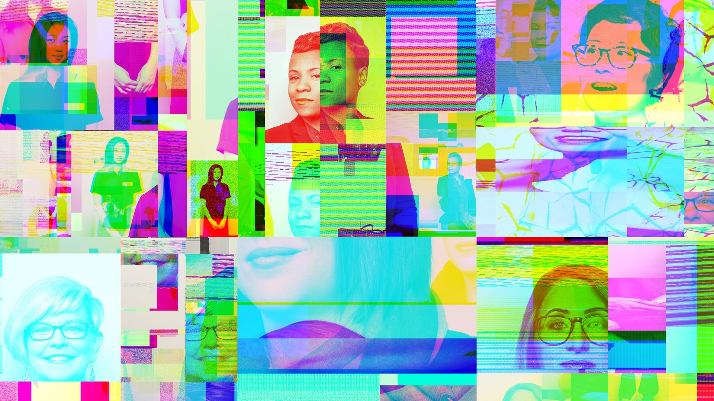
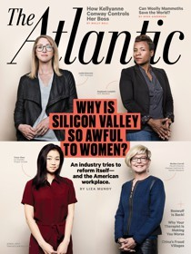

Why Is Silicon Valley So Awful to Women?

# Why Is Silicon Valley So Awful to Women?

Tech companies are spending hundreds of millions of dollars to improve conditions for female employees. Here’s why not much has changed—and what might actually work.

   

 Jason Madara / Erik Tanner / Paul Spella / The Atlantic

- [Liza Mundy](https://www.theatlantic.com/author/liza-mundy/)

- [April 2017 Issue](https://www.theatlantic.com/magazine/toc/2017/04/)

- [Technology](https://www.theatlantic.com/technology/)

-

- [Share](https://www.theatlantic.com/magazine/archive/2017/04/why-is-silicon-valley-so-awful-to-women/517788/#)

- [Tweet](https://www.theatlantic.com/magazine/archive/2017/04/why-is-silicon-valley-so-awful-to-women/517788/#)

-
   Text Size
 



One weekday morning in 2007, Bethanye Blount came into work early to interview a job applicant. A veteran software engineer then in her 30s, Blount held a senior position at the company that runs Second Life, the online virtual world. Good-natured and self-confident, she typically wore the kind of outfit—jeans, hoodie, sneakers—that signals coding gravitas. That day, she might even have been wearing what’s known as the “full-in start-up twin set”: a Second Life T-shirt paired with a Second Life hoodie.

In short, everything about her indicated that she was a serious technical person. So she was taken aback when the job applicant barely gave her the time of day. He knew her job title. He knew she would play a key role in deciding whether he got hired. Yet every time Blount asked him a question about his skills or tried to steer the conversation to the scope of the job, he blew her off with a flippant comment. Afterward, Blount spoke to another top woman—a vice president—who said he’d treated her the same way.

article continues after advertisement

*Listen to the audio version of this article:*

[SoundCloud cookie policyCookie policy](https://soundcloud.com/pages/cookies)

 [(L)](https://soundcloud.com/user-154380542)

 [TheAtlantic](https://soundcloud.com/user-154380542)
   Why Is Silicon Valley So Awful to Women? - The Atlantic - Liza Mundy

 [(L)](https://w.soundcloud.com/player/?url=https%3A//api.soundcloud.com/tracks/310550804%3Fsecret_token%3Ds-7yvfb&color=ff5500&auto_play=false&hide_related=false&show_comments=true&show_user=true&show_reposts=false)

- 2.4K plays2.4K

## Explore more music & audio like

## Why Is Silicon Valley So Awful to Women? - The Atlantic - Liza Mundy

##  on SoundCloud.

 [       Hear more onSoundCloud](https://soundcloud.com/user-154380542)

 [(L)](https://soundcloud.com/user-154380542)

*[Download the Audm app](https://goo.gl/kqioUS) for your iPhone to listen to more titles.*

Obviously Second Life wasn’t going to hire this bozo. But what the heck: He was here, and they had a new employee, a man, who needed practice giving interviews, so they sent him in. When the employee emerged, he had an odd look on his face. “I don’t know what just happened,” he said. “I went in there and told him I was new, and all he said was he was so glad I was there: ‘Finally, somebody who knows what’s going on!’ ”

All Blount could do was laugh—even now, as she looks back on the incident. In the hierarchy of sexist encounters, it didn’t rank very high. Still, it was a reminder that as a woman in tech, she should be prepared to have her authority questioned at any moment, even by some guy trying to get a job at her company.

One reason her career had gone so well, she thinks, is that she’d made a point of ignoring slights and oafish comments. Awkward silences, too. Over the years, she’s experienced—many times—the sensation of walking up to a group of male colleagues and noticing that they fell quiet, as though they’d been talking about something they didn’t want her to hear. She’s been asked to take notes in meetings. She’s found herself standing in elevators at tech conferences late at night when a guy would decide to get, as she puts it, handsy. When she and a male partner started a company, potential investors almost always directed their questions to him—even when the subject clearly fell in Blount’s area of expertise. It drove him crazy, and Blount had to urge him to curb his irritation. “I didn’t have time to be pissed,” she says.

[](https://www.theatlantic.com/magazine/archive/2017/04/why-is-silicon-valley-so-awful-to-women/517788/#)

Bethanye Blount, co-founder and CEO, Cathy Labs (Jason Madara)

But at some point, something inside her broke. Maybe it was being at tech conferences and hearing herself, the “elder stateswoman,” warning younger women to cover their drinks, because such conferences—known for alcohol, after-parties, and hot women at product booths—have been breeding grounds for unwanted sexual advances and assaults, and you never knew whether some jerk might put something in your cocktail. She couldn’t believe that women still had to worry about such things; that they still got asked to fetch coffee; that she still heard talk about how hiring women or people of color entailed “lowering the bar”; that women still, often, felt silenced or attacked when expressing opinions online.

“I am angry that things are no better for a 22-year-old at the beginning of her career than they were for me 25 years ago when I was just starting out,” Blount says. “I made decisions along the way that were easier for me and helped me succeed—don’t bring attention to being a woman, never talk about gender, never talk about ‘these things’ with men,” unless the behavior was particularly egregious. “It helped me get through. But in retrospect I feel I should have done more.”

#### From Our April 2017 Issue

Try 2 FREE issues of *The Atlantic*
[Subscribe](http://www.theatlantic.com/subscribe/coverstory/)

Blount decided it was never too late to start speaking out, and teamed up with other women who had undergone a similar awakening. This past May, they formed a group called [Project Include](http://projectinclude.org/), which aims to provide companies and investors with a template for how to be better. One of her collaborators on the effort, Susan Wu, an entrepreneur and investor, says that when she was teaching herself to code as a teenager, she was too naive to perceive the sexism of internet culture. But as she advanced in her career and moved into investing and big-money venture capitalism, she came to see the elaborate jiu-jitsu it takes for a woman to hold her own. At one party, the founder of a start-up told Wu she’d need to spend “intimate time” with him to get in on his deal. An angel investor leading a different deal told her something similar. She became a master of warm, but firm, self-extrication.

Looking back, Wu is struck by “the countless times I’ve had to move a man’s hand from my thigh (or back or shoulder or hair or arm) during a meeting (or networking event or professional lunch or brainstorming session or pitch meeting) without seeming confrontational (or bitchy or rejecting or demanding or aggressive).” In a land of grand ideas and grander funding proposals, she found that the ability to neatly reject a man’s advances without injuring his ego is “a pretty important skill that I would bet most successful women in our industry have.”

Wu learned how to calibrate the temperature of her demeanor: friendly and approachable, neither too intimate nor too distant. She learned the fine art of the three-quarters smile, as well as how to deflect conversation away from her personal life and return it to topics like sports and market strategy. She learned to distinguish between actual predators and well-meaning guys who were just a bit clueless. And yet to not be overly wary, because that, too, can affect career prospects.

The dozens of women I interviewed for this article love working in tech. They love the problem-solving, the camaraderie, the opportunity for swift advancement and high salaries, the fun of working with the technology itself. They appreciate their many male colleagues who are considerate and supportive. Yet all of them had stories about incidents that, no matter how quick or glancing, chipped away at their sense of belonging and expertise. Indeed, a recent survey called “[Elephant in the Valley](https://www.elephantinthevalley.com/)” found that nearly all of the 200-plus senior women in tech who responded had experienced sexist interactions. (And just as the print version of this article went to press, a former Uber engineer added to the evidence of Silicon Valley’s gender problem when she wrote a [blog post](https://www.susanjfowler.com/blog/2017/2/19/reflecting-on-one-very-strange-year-at-uber) detailing what she said was a pattern of sexist behavior at the company.)

As Bethanye Blount’s and Susan Wu’s examples show, succeeding in tech as a woman requires something more treacherous than the old adage about Ginger Rogers doing everything Fred Astaire did, only backwards and in high heels. It’s more like doing everything backwards and in heels while some guy is trying to yank at your dress, and another is telling you that a woman can’t dance as well as a man, oh, and could you stop dancing for a moment and bring him something to drink?

Such undermining is one reason women today hold only about a quarter of U.S. computing and mathematical jobs—a fraction that has actually fallen slightly over the past 15 years, even as women have made big strides in other fields. Women not only are hired in lower numbers than men are; they also leave tech at more than twice the rate men do. It’s not hard to see why. Studies show that women who work in tech are interrupted in meetings more often than men. They are evaluated on their personality in a way that men are not. They are less likely to get funding from venture capitalists, who, studies also show, find pitches delivered by men—especially handsome men—more persuasive. And in a particularly cruel irony, women’s contributions to open-source software are accepted more often than men’s are, but only if their gender is unknown.

[](https://www.theatlantic.com/magazine/archive/2017/04/why-is-silicon-valley-so-awful-to-women/517788/#)

Stephanie Lampkin, founder and CEO, Blendoor (Jason Madara)

For women of color, the cumulative effect of these slights is compounded by a striking lack of racial diversity—and all that attends it. Stephanie Lampkin, who was a full-stack developer (meaning she had mastered both front-end and back-end systems) by age 15 and majored in engineering at Stanford, has been told when applying for a job that she’s “not technical enough” and should consider sales or marketing—an experience many white women in the field can relate to. But she has also, for instance, been told by a white woman at a conference that her name ought to be Ebony because of the color of her skin.

In the past several years, Silicon Valley has begun to grapple with these problems, or at least to quantify them. In 2014, Google released data on the number of women and minorities it employed. Other companies followed, including LinkedIn, Yahoo, Facebook, Twitter, Pinterest, eBay, and Apple. The numbers were not good, and neither was the resulting news coverage, but the companies pledged to spend hundreds of millions of dollars changing their work climates, altering the composition of their leadership, and refining their hiring practices.

At long last, the industry that has transformed how we learn, think, buy, travel, cook, socialize, live, love, and work seemed ready to turn its disruptive instincts to its own gender inequities—and in the process develop tools and best practices that other, less forward-looking industries could copy, thus improving the lives of working women everywhere.

Three years in, Silicon Valley diversity conferences and training sessions abound; a cottage industry of consultants and software makers has sprung up to offer solutions. Some of those fixes have already started filtering out to workplaces beyond the tech world, because Silicon Valley is nothing if not evangelical. But the transformation hasn’t yet materialized: The industry’s diversity numbers have barely budged, and many women say that while sexism has become somewhat less overt, it’s just as pernicious as ever. Even so, there may be reason for hope as companies begin to figure out what works—and what doesn’t.

When Silicon Valley was emerging, after World War II, software programming was considered rote and unglamorous, somewhat secretarial—and therefore suitable for women. The glittering future, it was thought, lay in hardware. But once software revealed its potential—and profitability—the guys flooded in and coding became a male realm.

The advent of the home computer may have hastened this shift. Early models like the Commodore 64 and the Apple IIc were often marketed as toys. According to Jane Margolis, a researcher at UCLA, families bought them and put them in their sons’ rooms, even when they had technologically inclined daughters. By the time the children of the ’80s and ’90s reached college, many of the boys already knew how to code. Fewer girls did.

But that was a long time ago. Consider where we are today. More than half of college and university students are women, and the percentage of women entering many stem fields has risen. Computer science is a glaring exception: The percentage of female computer- and information-science majors peaked in 1984, at about 37 percent. It has declined, more or less steadily, ever since. Today it stands at 18 percent.

“Workplace conditions, a lack of access to key creative roles, and a sense of feeling stalled” are the main reasons women leave tech.

Claudia Goldin, a Harvard economist, told me that tech would seem to be an attractive field for women, since many companies promise the same advantages—flexibility and reasonable hours—that have drawn women in droves to other professions that were once nearly all male. The big tech companies also offer family-friendly perks like generous paid parental leave; new moms at Google, for instance, get 22 paid weeks. “These should be the best jobs for people who want predictability and flexibility,” Goldin said. “So what’s happening?”

A report by the Center for Talent Innovation found that when women drop out of tech, it’s usually not for family reasons. Nor do they drop out because they dislike the work—to the contrary, they enjoy it and in many cases take new jobs in sectors where they can use their technical skills. Rather, the report concludes that “workplace conditions, a lack of access to key creative roles, and a sense of feeling stalled in one’s career” are the main reasons women leave. “Undermining behavior from managers” is a major factor.

The hostility of the culture is such an open secret that tweets and essays complaining of sexism tend to begin with a disclaimer acknowledging how shopworn the subject feels. “My least favorite topic in the world is ‘Women in Tech,’ so I am going to make this short,” wrote one blogger, noting that after she started speaking at conferences and contributing to open-source projects, she began to get threatening and abusive emails, including from men who said they “jerked off to my conference talk video.” Another woman tweeted that, while waiting to make a presentation at Pubcon, a prestigious conference, she was told by a male attendee, “Don’t be nervous. You’re hot! No one expects you to do well.”

In the office, sexism typically takes a subtler form. The women I spoke with described a kind of gaslighting: They find themselves in enviably modern workspaces, surrounded by right-thinking colleagues and much talk of meritocracy, yet feel disparaged in ways that are hard to articulate, let alone prove.

Telle Whitney, the president and CEO of the Anita Borg Institute, a nonprofit that supports women in technology, says gender bias is a big problem in start-ups, which are frequently run by brotherhoods of young men—in many cases friends or roommates—straight out of elite colleges. In 2014, for instance, Snapchat CEO Evan Spiegel was two years out of Stanford and already leading a $10 billion company when his frat-boy-at-his-misogynistic-worst undergraduate emails were published and went viral. In them, his only slightly younger self joked about shooting lasers at “fat girls,” described a Stanford dean as “dean-julie-show-us-your-tits,” and for good measure, saluted another fraternity because it had decided to “stop being gay.”

But while start-ups may be the worst offenders, it’s notable how often the staid older companies also make missteps. Just last year, Microsoft hosted a party that featured “schoolgirl” dancers wearing short uniform-type skirts and bra tops, dancing on podiums. The event followed the Game Developers Conference in San Francisco—where, earlier that day, the company had sponsored a Women in Gaming Luncheon to promote a culture of inclusivity.

And then there are the public utterances that reveal what some leading men in tech think of women and their abilities. When Sir Michael Moritz, the chair of Sequoia Capital, one of Silicon Valley’s most venerable venture-capital firms, was asked by a Bloomberg reporter why the firm had no female investing partners in the U.S., he responded, “We look very hard,” adding that the firm had “hired a young woman from Stanford who’s every bit as good as her peers.” But, he added, “what we’re not prepared to do is to lower our standards.”

When Ellen Pao sued another prominent venture-capital firm, Kleiner Perkins Caufield & Byers, for gender discrimination, the 2015 trial sent a frisson through the tech world. Former Yahoo President Sue Decker wrote [an essay](http://www.recode.net/2015/3/26/11560742/a-fish-is-the-last-to-discover-water-impressions-from-the-ellen-pao) for *Recode*, the tech-industry website, saying that she had been obsessively following the trial because it resonated so deeply with her. She took her daughters out of school to hear the closing arguments. “I, and most women I know, have been a party to at least some sexist or discriminatory behavior in the workplace,” she wrote, explaining that she and many other women had witnessed things like “locker-room discussion during travel with colleagues,” which they tried to brush aside, since “any individual act seems silly to complain about.” The Pao trial, however, shifted her attitude.

Pao lost the case, but the trial was a watershed. Afterward, a group of seven senior women in tech conducted the “Elephant in the Valley” survey. Eighty-four percent of the respondents had been told they were too aggressive; 66 percent had felt excluded from key networking opportunities because of their gender; 90 percent had witnessed sexist behavior at conferences and company off-site meetings; 88 percent had had clients and colleagues direct questions to male peers that should have been addressed to them; and 60 percent had fended off unwanted sexual advances (in most cases from a superior). Of those women, one-third said they had feared for their personal safety.

Pao went on to co-found Project Include with Blount, Wu, and others, including Tracy Chou. A software engineer who graduated from Stanford, Chou told me about working at a start-up where a co-founder would often muse that a man they’d just hired would turn out to be better and faster than she was. When Chou discovered a significant flaw in the company’s code and pointed it out, her engineering team dismissed her concerns, saying that they had been using the code for long enough that any problems would have been discovered. Chou persisted, saying she could demonstrate the conditions under which the bug was triggered. Finally, a male co-worker saw that she was right and raised the alarm, whereupon people in the office began to listen. Chou told her team that she knew how to fix the flaw; skeptical, they told her to have two other engineers review the changes and sign off on them, an unusual precaution. Her co-workers rationalized their scrutiny by explaining that the bug was important, and so was the fix.

[](https://www.theatlantic.com/magazine/archive/2017/04/why-is-silicon-valley-so-awful-to-women/517788/#)

Tracy Chou, co-founder, Project Include (Erik Tanner)

“I knew it was important,” she told me recently. “That’s why I was trying to flag it.”

For Chou, even the open-office floor plan was stressful: It meant there was no way to escape a male co-worker who liked to pop up behind her and find fault with her work. She was called “emotional” when she raised technical concerns and was expected to be nice and never complain, even as people around her made excuses for male engineers who were difficult to work with. The company’s one other female engineer felt the same way Chou did—as if they were held to a different standard. It wasn’t overt sexism; it was more like being dismissed and disrespected, “not feeling like we were good enough to be there—even though, objectively speaking, we were.”

### Video: How Did Tech Become So Male Dominated?

That the tech industry would prove so hostile to women is more than a little counterintuitive. Silicon Valley is populated with progressive, hyper-educated people who talk a lot about making the world better. It’s also a young field, with none of the history of, say, law or medicine, where women were long denied spots in graduate schools intended for “breadwinning men.”

“We don’t have the same histories of exclusion,” says Joelle Emerson, the founder and CEO of Paradigm, a firm in San Francisco that advises companies on diversity and inclusion. But being new comes with its own problems: Because Silicon Valley is a place where a newcomer can unseat the most established player, many people there believe—despite evidence everywhere to the contrary—that tech is a meritocracy. Ironically enough, this very belief can perpetuate inequality. A 2010 study, “The Paradox of Meritocracy in Organizations,” found that in cultures that espouse meritocracy, managers may in fact “show greater bias in favor of men over equally performing women.” In a series of three experiments, the researchers presented participants with profiles of similarly performing individuals of both genders, and asked them to award bonuses. The researchers found that telling participants that their company valued merit-based decisions only increased the likelihood of their giving higher bonuses to the men.

Such bias may be particularly rife in Silicon Valley because of another of its foundational beliefs: that success in tech depends almost entirely on innate genius. Nobody thinks that of lawyers or accountants or even brain surgeons; while some people clearly have more aptitude than others, it’s accepted that law school is where you learn law and that preparing for and passing the CPA exam is how you become a certified accountant. Surgeons are trained, not born. In contrast, a 2015 study published in *Science* confirmed that computer science and certain other fields, including physics, math, and philosophy, fetishize “brilliance,” cultivating the idea that potential is inborn. The report concluded that these fields tend to be problematic for women, owing to a stubborn assumption that genius is a male trait.

The study authors considered several alternative explanations for the low numbers of women in those fields—including that women might not want to work long hours and that there might be more men at the high end of the aptitude spectrum, an idea notoriously put forward in 2005 by then–Harvard President Larry Summers.

But the data did not support these other theories.

“The more a field valued giftedness, the fewer the female PhDs,” the study found, pointing out that the same pattern held for African Americans. Because both groups still tend to be “stereotyped as lacking innate intellectual talent,” the study concluded, “the extent to which practitioners of a discipline believe that success depends on sheer brilliance is a strong predictor of women’s and African Americans’ representation.”

Women leave tech at more than twice the rate men do. It’s not hard to see why.

That may be why, for years, the tech industry’s gender disparity was considered almost a natural thing. When Tracy Chou was an intern at Google in 2007, she says, people would joke about the fact that the main Mountain View campus was populated mostly by male engineers, and that women tended to be relegated to other parts of the operation, such as marketing. But for all the joking, Chou says, it was strangely difficult to have a conversation about why that was, how women felt about it, and how it could be changed.

In October 2013, Chou attended the Grace Hopper conference, an annual gathering for women in computing, where Sheryl Sandberg, Facebook’s chief operating officer, warned that the number of women in tech was falling. Chou was startled. She realized that for such a data-driven industry, few reliable diversity statistics were available. That same month, she wrote [a post](https://medium.com/@triketora/where-are-the-numbers-cb997a57252#.ip2y6j5ub) on Medium in which she called on people to share data from their own companies, and she set up a spreadsheet where they could do so. “This thing that had been an open secret in Silicon Valley became open to everybody,” Chou told me.

At the time, some of the big tech firms were fighting a Freedom of Information Act request from the *San Jose Mercury News *asking the Department of Labor to release data on the makeup of their workforces. The companies contended that such statistics were a trade secret, and that exposing them would hurt their competitive edge. But Chou was not the only voice calling for transparency. Jesse Jackson and his Rainbow push Coalition were advocating on behalf of both women and people of color, and activist investors began pressuring companies to reveal information about salaries and gender pay gaps.

In January 2015, in a keynote speech at the International Consumer Electronics Show, in Las Vegas, Brian Krzanich, the CEO of Intel, announced that his company would devote $300 million to diversity efforts over the next five years. Two months later, Apple pledged $50 million to partner with nonprofits that work to improve the pipeline of women and minorities going into tech, and that spring Google announced that it would increase its annual budget for promoting diversity from $115 million to $150 million. This past June, 33 companies signed a pledge to make their workforces more diverse.

According to Nancy Lee, Google’s vice president of people operations until she retired in February, the company saw both a business imperative—it is, after all, designing a global product—and a moral one. She points to the “original vision” of Google’s founders, which was that “we’re going to build this company for the long haul. We’re not going to be evil.” Google released detailed information on its workforce, and because “our numbers weren’t great,” Lee told me, other companies felt safe releasing theirs. Google wanted to disclose its data, she said, because “then we’re on the hook. There’s no turning back.”

Indeed. At Google, the initial tally showed that just 17 percent of its technical employees were women. The female technical force was 10 percent at Twitter, 15 percent at Facebook, and 20 percent at Apple. Granted, women currently make up just 18 percent of computer-science majors, but these companies are so well funded and attractive that they should be able to get a disproportionate percentage of the pipeline. The firms resolved to do better, and began looking for new ways to attract and retain women. Their approaches include measures like recruiting from a broader array of colleges and creating more internships. But the flashiest—and most copied—approach is something called unconscious-bias training.

Lately, unconscious-bias training has emerged as a ubiquitous fix for Silicon Valley’s diversity deficit. It’s diversity training for the new millennium, in which people are made aware of their own hidden biases. It rests on a large body of social-psychology research—hundreds of studies showing how women and minorities are stereotyped. Google turned to it, Lee told me, in part because the company felt that its engineers would appreciate an approach grounded in social science: “That sort of discipline really, really resonated effectively with the hard scientists we have here.” Facebook put unconscious-bias training front and center in its diversity efforts, too; both companies have posted online videos of their training modules, to offer a model for other workplaces. Since then, talk of unconscious bias has spread through Silicon Valley like—well, like a virus.

On a Thursday morning last summer, Joelle Emerson, the diversity consultant, visited a midsize start-up to give a talk on unconscious bias. Emerson knows employees don’t like being dragged to diversity-training sessions, so she strives to keep her presentations upbeat and funny and full of intriguing findings, much like a ted Talk. “We as individuals become smarter, better versions of ourselves when we are working on teams that are diverse,” she told the audience, pointing out that when you’re in a meeting with people who don’t share your background or demographic profile, you sit up a little straighter, intellectually. Expecting more pushback, you become more persuasive. “Our brains just function a little bit differently; we’re more vigilant, we’re more careful,” she said, citing a study that found diverse juries demonstrate better recall of courtroom proceedings. Her talk then segued—as many training sessions do—into what’s known as an implicit-association test.

An implicit-association test is a popular way to demonstrate how unconscious bias works. It was pioneered by Anthony G. Greenwald, a psychology professor at the University of Washington, in 1995. The idea is to have people very quickly sort words and concepts, revealing the implicit, or hidden, associations their brains make and the stereotypes that underlie them.

[](https://www.theatlantic.com/magazine/archive/2017/04/why-is-silicon-valley-so-awful-to-women/517788/#)

Joelle Emerson, founder and CEO, Paradigm (Jason Madara)

Emerson started by having everybody practice raising his or her right hand and saying “right,” then raising his or her left hand and saying “left.” “I know it feels condescending that I make you practice, but the goal here is to be as quick as you can,” she said winningly. The audience obeyed, and there was clapping and laughter.

Then she gave the test, flashing a series of words on a screen and having the audience members raise their left hand if the word referred to a male—*son*, say, or *uncle*—and their right if it referred to a female. She then flashed words pertaining to science (right hand) or liberal arts (left hand). Next she upped the ante: They had to raise their right hand if the word pertained to a male or to science, and their left hand if it was female- or liberal-arts-related. The audience accomplished this without much trouble. But then came the revelatory moment. “This time we’re going to swap the categories,” Emerson said, instructing the group to raise their left hand if a word was male- or liberal-arts-oriented, and their right hand for a female- or science-leaning term. A series of words flashed on the screen—*chemistry*, *history*, *sister*, *son*, *English*, *grandpa*, *math*, *girl*, *physics*, *niece*, *boy*—and the room devolved into chaos and chagrined laughter: People’s brains just wouldn’t go there. They couldn’t keep up.

Emerson explained that regardless of what order the tasks are presented in, about three-quarters of the people who take the test are slower to respond when asked to link women with science and men with liberal arts. She talked about her own first time taking a version of the test, but with the categories of family and work. “I thought, *I’m going to nail this*,” she said, but confessed that even with a working mother, a career, and years of immersion in gender research, she had a tendency to associate women with family and men with work. Unconscious bias, revealed.

The idea that everyone holds biases and that there is nothing wrong with having them is a core tenet of the training. Presenters often point out that bias and stereotyping are a natural, evolutionary defense, a mechanism that goes back to our early human roots: When primitive man saw a snake, he didn’t have time to determine whether it was poisonous or harmless; his brain said *Snake!* and he reacted. Our brains today take in more than 11 million pieces of information at any given moment; because we can process only about 40 of those consciously, our nonconscious mind takes over, using biases and stereotypes and patterns to filter out the noise.

**The idea that everyone holds biases and that there is nothing wrong with
having them is a core tenet of unconscious-bias training. **

The message of these sessions is that snap judgments are usually biased. This is a problem in a field like tech, where hiring managers may have to fill hundreds of positions. Too many decisions are made on gut instinct, the training argues: A time-pressed hiring manager looks at a résumé and sees a certain fraternity or hobby, or a conventionally white or male name, and *bang*—thanks to the unconscious brain making shortcuts, that person gets an interview. People listen respectfully to that person, while others—women, people of color—are interrupted and scrutinized.

Shelley Correll, the faculty director of the Clayman Institute for Gender Research at Stanford, gave her first unconscious-bias talk, at Cornell University, in 2003, when, she says, the topic was mostly of interest to academic departments. Now, she says, demand has spiked as tech companies have adopted the training. “Virtually every company I know of is deploying unconscious-bias training,” says Telle Whitney of the Anita Borg Institute. “It’s a fast and feel-good kind of training that helps you feel like you’re making a difference.”

But there’s a problem. Unconscious-bias training may not work. Some think it could even backfire. Though the approach is much more congenial than the “sensitivity training” popular in the 1980s and ’90s—in which white men were usually cast as villains—it suffers from the same problem: People resent being made to sit in a chair and listen to somebody telling them how to act. Forcing them to do so can provoke the fundamental human urge to reply: No thanks, I’ll do the opposite.

Worse, repeatedly saying “I am biased and so are you” can make bias seem inescapable, even okay. People feel more accepting of their own bias, or throw their hands up, figuring that nothing can be done.

They may even become more biased. A 2015 study by Michelle M. Duguid of Cornell University and Melissa C. Thomas-Hunt of the University of Virginia demonstrates the peril of normalizing bad behavior. Stigmatizing certain behaviors, such as littering and alcohol abuse, makes people realize they are acting outside the norm and has proved to be a powerful way of changing these behaviors. Conversely, messages presenting good behavior as a social norm—“the majority of guests reuse their towels”—can make people embrace this behavior.

So what happens when you say that bias is natural and dwells within all of us? Duguid and Thomas-Hunt found that telling participants that many people hold stereotypes made them more likely to exhibit bias—in the case of the study, against women, overweight people, or the elderly. The researchers also suggest, provocatively, that even just talking too much about gender inequities can serve to normalize them: When you say over and over that women come up against a glass ceiling, people begin to accept that, yes, women come up against a glass ceiling—and that’s just the way it is.

I talked about all these issues with Maxine Williams, the global director of diversity at Facebook, who conducts part of the company’s online training module. Williams is originally from Trinidad and Tobago; in the module, she mentions a study that found that dark-skinned people of color are seen by white job interviewers as less smart than light-skinned people of color. She told me she finds such studies hard to talk about, and had to force herself to do so.

At Facebook, she says, “managing bias” sessions are “suggested,” not mandated, which she hopes cuts down on any resentment. The goal is to create a culture where, even if you opt out of training, you can’t avoid the lessons, because managers come around talking about bias, and people are encouraged to call out colleagues in meetings when, say, they interrupt someone. “Have you interrupted an interrupter recently?,” Williams likes to ask audiences. She believes that talking about the pervasiveness of bias serves to disabuse people of the meritocracy fallacy.

She also told me that if you are going to be serious about bias training, you have to create a workplace where people feel safe giving voice to their own biases—where they can admit to thinking that men are better at math, for instance, or that new moms are less committed to their work—a perilous task, she acknowledges. “Once you start going down that road and saying to people, ‘Be open!,’ all sorts of things are going to come out,” Williams said. “We’re going to have to go through this mud together. It means you have to be forgiving as well.” She added that it’s necessary to assume that people, no matter what bias they are confessing, are well intentioned. “Presuming good intent” is crucial.

When I mentioned this conversation to Bethanye Blount, who is a former Facebook employee (and thinks it’s a great place to work), she laughed at the “presuming good intent” part. “They’re catering to the engineers,” Blount said—engineers constituting a coveted and often sensitive cohort who like to think of themselves as “special snowflakes” and whom Facebook is smart to handle with care. One of the unspoken advantages of unconscious-bias training is that in an environment where companies are competing for talent, it promises to help attract talented women without scaring away talented men.

[](https://www.theatlantic.com/magazine/archive/2017/04/why-is-silicon-valley-so-awful-to-women/517788/#)

Bo Ren, product manager, Tumblr (Erik Tanner)

I also talked with Bo Ren, a former Facebook employee who’s now a product manager at Tumblr. Ren said the atmosphere at Facebook was tranquil and feel-good on the surface, but—as in all workplaces—there were power dynamics underneath. To succeed anywhere in Silicon Valley, she said, you need to have social credibility, to be able to bring people around to your point of view and get them on board with a new product or solution—to be able to “socialize” your ideas. “You would think all things are equal,” she said, “but these backdoor conversations are happening in settings that women are not invited to. The whole boys’-club thing still applies. If you party with the right people at Burning Man, you’re going to be part of this boys’ club.” As for calling people out in meetings, it sounds like a good idea, she said, but she never saw anyone do it. “It’s just—are you really going to be that person?”

Of late, the problems with unconscious-bias training have become more widely known. None other than Anthony Greenwald, the inventor of the implicit-association test, has expressed his doubts. “Understanding implicit bias does not actually provide you with the tools to do something about it,” he told *Forbes*. Kara Swisher, a co-founder of *Recode*, has said that talk about unconscious-bias training is “exhausting to listen to,” and an excuse for not trying hard enough. One tech executive, Mike Eynon, wrote in a Medium post that bias training makes “us white guys feel better” and lets the “privileged realize everyone has bias and they aren’t at fault,” while nothing changes for discriminated groups.

In 2016, Google reported incremental improvements: 31 percent of its overall workforce is now female, up one percentage point over the previous year. Nineteen percent of technical roles are held by women, also up a percentage point. At Facebook, women’s overall representation went up from 32 percent to 33 percent. In technical roles, women’s representation also increased a single percentage point, from 16 percent to 17 percent.

Telle Whitney points out that for a large workforce like Google’s, a one-percentage-point rise is not peanuts. But while the companies’ commitment seems genuine, the slow pace of change underscores how far they have to go. If they want to truly transform, they may need to take more-drastic measures.

### Anti-Bias Apps

A wealth of apps and software platforms now exists to circumvent unconscious bias. Here are a few of the offerings:

Textio uses data and machine learning to scan job postings and flag phrases that are likely to repel women. Some are obvious: *rock star*, *Ping-Pong*, *Nerf gun*. But Kieran Snyder, Textio’s co-founder, says that other words can exhibit a subtler masculine bias. Examples include language that is what she calls “turned all the way up”: phrases like *hard-driving* and *crush it* as well as superlatives like *flawless*, *relentless*, and *extremely*. The software suggests gender-neutral alternatives.

GapJumpers hides résumés and other identifying information, including gender, until job applicants perform a test devised to assess their skills. It’s an attempt to duplicate one of the most renowned studies in the gender-bias genre: In 2000, Claudia Goldin and Cecilia Rouse showed that when major U.S. orchestras allowed musicians to audition behind a screen that hid their gender, the percentage of women selected rose dramatically. They demonstrated that when people are assessed on pure ability, women are much more likely to make the cut.

Blendoor is “Tinder for recruiting,” as its founder, Stephanie Lampkin, calls it. The app lets job candidates and recruiters check each other out: Candidates can see how a company rates on diversity; recruiters can see a person’s skills, education, and work history, but not his or her race, age, and gender.

Interviewing.io offers a free platform that lets engineers do mock technical interviews, giving women (and anyone else who might feel out of place) a chance to practice. It also has software that companies can use to mask applicants’ voices during actual interviews.

Unitive is based on the philosophy of “nudges,” or small changes that have a big effect. It guides managers through the hiring process, finding ways to prevent them from acting on bias. Names and gender are masked during résumé evaluation, for instance, and during interviews the software guides the managers through questions designed to evaluate relevant skills.

Lately, a new fix has emerged. Trying to change people’s unconscious attitudes is messy and complicated. But if you can’t easily dispel bias, what you can do is engineer a set of structural changes that prevent people from acting on it. Joelle Emerson talks about this a lot in her presentations, and works with companies to embed the insights of anti-bias training into hiring and promotion processes. One way to head off bias in hiring is to make sure that the job interviewer writes down a defined skill set beforehand, asks every applicant the same questions, and assesses the quality of answers according to a rubric, rather than simply saying, after the fact, “I really liked that person who went to the same school I did and likes ice hockey just as much as I do.”

Google has been a proponent of such changes. In his 2015 book, *Work Rules!*, Laszlo Bock, who was the company’s senior vice president of people operations until last summer, cited a study from the University of Toledo that found that the first 20 seconds often predict the outcome of a 20-minute interview. The problem, he wrote, is that such quick impressions are meaningless. He added that Google strongly encourages interviewers to use a combination of skill assessments and standard questions rather than relying on subjective impressions.

“Until we see changes in the way we work, I don’t think we’re going to crack this nut,” says Shelley Correll.

Other experts say that what companies need is an anti-bias checklist. The idea is spreading—Pinterest, for one, has worked with Emerson to develop a six-point checklist that includes measures such as reserving plenty of time for evaluating an employee’s performance, to counteract cognitive shortcuts that can introduce bias. But it’s early days: At Emerson’s talk on unconscious bias last summer, someone in the audience asked her which Silicon Valley companies are managing bias well. “No one,” she said, “because the idea of embedding it into organizational design is pretty new.”

This being Silicon Valley, new companies have already cropped up to digitize the checklist idea, offering tech solutions to tech’s gender problem: software that masks an applicant’s gender, or that guides hiring managers through a more objective evaluation process. (See the “[Anti-Bias Apps](https://www.theatlantic.com/magazine/archive/2017/04/why-is-silicon-valley-so-awful-to-women/517788/#apps)” sidebar above.)

Even when they work, however, these bias interventions get you only so far. Diversity consultants and advocacy groups say they remain frustrated by tech companies’ unwillingness to change core parts of their culture. It is, for example, a hallowed tradition that in job interviews, engineers are expected to stand up and code on whiteboards, a high-pressure situation that works to the disadvantage of those who feel out of place. Indeed, whiteboard sessions are rife with opportunities for biased judgment. At Stanford, Shelley Correll works with a graduate student who, for his dissertation, sat in on a whiteboarding session in which a problem had an error in it; when one female job candidate sensed this and kept asking questions, evaluators felt that all her questions suggested she wasn’t competent.

“Until we see changes in the way we work, I don’t think we’re going to crack this nut,” Correll says. “I worked with one company that insisted that the best way for good ideas to emerge was to have people on teams screaming their ideas at each other. When you watch these teams work, they literally scream at each other and call each other names. They believe this dynamic is essential to scientific discovery—absolutely essential. I said, ‘Could you at least say you disagree with someone without saying you think they are an idiot?’ ”

There’s a term for the screaming-and-name-calling approach to scientific discovery. It’s called “constructive confrontation,” and it was pioneered by the company that helped give Silicon Valley its name. That would be Intel, maker of the silicon chip. Intel came into existence in a postwar America in which corporate offices were male as far as the eye could see. It and other early tech companies “were founded exclusively by men, and for better or worse they just had a male sensibility,” says Telle Whitney. As the former Intel CEO Andrew Grove put it in his book *Only the Paranoid Survive*: “From all the early bickering, we developed a style of ferociously arguing with one another while still remaining friends.”

Now, of course, the talk is of inclusion, not confrontation. And I was surprised to hear Intel—old-fashioned Intel—mentioned as one of the companies successfully innovating around gender. It had been releasing diversity numbers since 2000, though not with as much fanfare as some of its peers, and without much improvement. But in the past couple of years, Intel decided to try a few other approaches, including hiring quotas.

Well, not quotas. You can’t say quotas. At least not in the United States. In some European countries, like Norway, real, actual quotas—for example, a rule saying that 40 percent of a public company’s board members must be female—have worked well; qualified women have been found and the Earth has continued turning. However, in the U.S., hiring quotas are illegal. “We never use the word *quota* at Intel,” says Danielle Brown, the company’s chief diversity and inclusion officer. Rather, Intel set extremely firm hiring goals. For 2015, it wanted 40 percent of hires to be female or underrepresented minorities.

Now, it’s true that lots of companies have hiring goals. But to make its goals a little more, well, quota-like, Intel introduced money into the equation. In Intel’s annual performance-bonus plan, success in meeting diversity goals factors into whether the company gives employees an across-the-board bonus. (The amounts vary widely but can be substantial.) If diversity efforts succeed, everybody at the company gets a little bit richer.

Granted, Intel has further to go than some other companies, in part because most of its workforce is technical, unlike newer social-media companies. And with about 100,000 employees worldwide and decades of entrenched culture, it’s a slow and hulking ship to turn around.

But since it began linking bonuses to diversity hiring, Intel has met or exceeded its goals. In 2015, 43 percent of new hires were women and underrepresented minorities, three percentage points above its target. Last year, it upped its goal to 45 percent of new hires, and met it. These changes weren’t just happening at the entry level: 40 percent of new vice presidents were women and underrepresented minorities. Intel’s U.S. workforce in 2014 was just 23.5 percent female. By the middle of last year, the percentage had risen two points, to 25.4 percent.

Intel has also introduced efforts to improve retention, including a “warm line” employees can use to report a problem—feeling stuck in their career, or a conflict with a manager—and have someone look into it. A new initiative will take data from the warm line and from employee exit interviews to give managers customized playbooks. If a group is losing lots of women, for instance, the manager will get data on why they’re leaving and how to address the issue.

Intel isn’t perfect—its $300 million pledge for diversity efforts was seen by some as an effort to rehabilitate its image after the company got caught up in Gamergate, a complex scandal involving much gender-related ugliness. And women who have worked there say Intel’s not immune to the sexism that plagues the industry. But I was struck by how many people talk about the company’s genuine commitment.

Elizabeth Land, who worked at Intel for 18 years before leaving in 2015, says the hiring goals did foster some resentment among men. Still, she wishes more companies would adopt a similar approach, to force hiring managers to look beyond their immediate networks. “If you’re willing to spend the effort and the time to find the right senior-level females, you can.”

[](https://www.theatlantic.com/magazine/archive/2017/04/why-is-silicon-valley-so-awful-to-women/517788/#)

Shelley Correll, faculty director, Clayman Institute for Gender Research (Jason Madara)

Shelley Correll agrees. “Tying bonuses to diversity outcomes signals that diversity is something the company cares about and thinks is important,” she says. “Managers will take it seriously.” In fact, she points out, the idea has history: PepsiCo did something similar starting in the early 2000s. When, in the second year, the company didn’t meet its goal of 50 percent diversity hires, executive bonuses suffered. But eventually the company’s workforce did become more diverse. From 2001 to 2006, the representation of women and minorities among executives increased from 34 percent to 45 percent.

There are other reasons for hope: Venture-capital firms have formed specifically to invest in start-ups run by women, and certain colleges—notably Carnegie Mellon, Stanford, and Harvey Mudd—have dramatically increased the number of female students in their computer-science programs.

Perhaps most encouraging is that as new companies come along, some of them are preemptively adopting the lessons that places like Intel and Google have already learned. Among these is Slack, the group-messaging company, which is widely praised for having made diversity a priority from early on, rather than having to go back and try to reengineer it in. Last year, when Slack received the TechCrunch award for Fastest Rising Startup, the company sent four black female software engineers—rather than the CEO, Stewart Butterfield (who’s white)—onstage to accept the award. “We’re engineers,” one of the women, Kiné Camara, said, meaningfully. From September 2015 to February 2016, as Slack grew, its technical workforce went from 18 percent to 24 percent female. However slowly, the industry seems to be changing its mind about innate talent and where genius comes from.

*  *Have you worked in the tech industry and have a personal experience to share regarding this piece? Would you like to respond in general? Please send us a note—[hello@theatlantic.com](https://www.theatlantic.com/magazine/archive/2017/04/why-is-silicon-valley-so-awful-to-women/517788/mailto:hello@theatlantic.com)—and we’ll start a debate in our [Notes section](https://www.theatlantic.com/notes/).)*  *

- [Share](https://www.theatlantic.com/magazine/archive/2017/04/why-is-silicon-valley-so-awful-to-women/517788/#)

- [Tweet](https://www.theatlantic.com/magazine/archive/2017/04/why-is-silicon-valley-so-awful-to-women/517788/#)

- [Comments](https://www.theatlantic.com/magazine/archive/2017/04/why-is-silicon-valley-so-awful-to-women/517788/#article-comments)

##   [Latest Video](https://www.theatlantic.com/video/)

 [     ## Dark Matter, Animated](https://www.theatlantic.com/video/index/518970/dark-matter-animated/)

In a short film, a Columbia University astrophysicist explains the mysterious substance that makes up over 25 percent of the universe.

## About the Author

- [Liza Mundy](https://www.theatlantic.com/author/liza-mundy/)’s forthcoming book, [*Code Girls*](https://www.amazon.com/exec/obidos/ISBN=0316352535/theatla05-20/), about female code breakers during World War II, will be published in October. She is a senior fellow at New America.