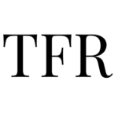

Why It Might Be A Good Time To Revisit Ray Dalio’s 1937 Analog

Why It Might Be A Good Time To Revisit Ray Dalio’s 1937 Analog

https://thefelderreport.com/2018/07/25/why-it-might-be-a-good-time-to-revisit-ray-dalios-1937-analog/

It was over three years ago that Ray Dalio first proposed his 1937 analog. After the presidential election, he refreshed it in the context of growing gl...