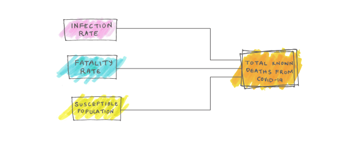
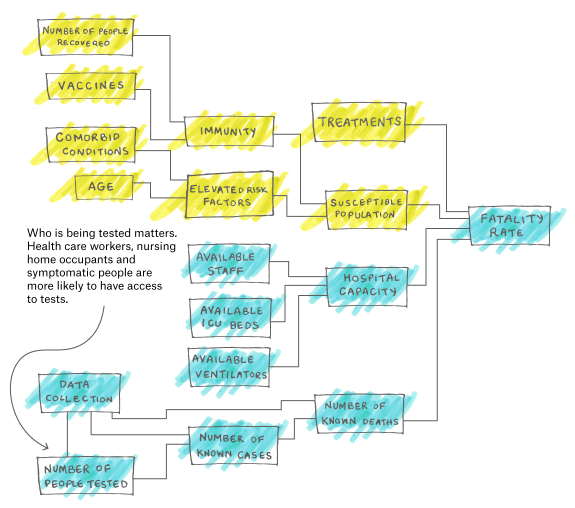
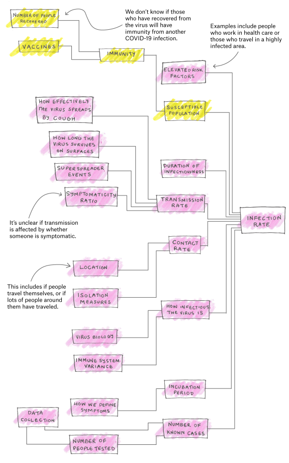
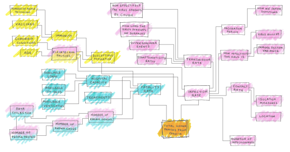

Why It’s So Freaking Hard To Make A Good COVID-19 Model  | FiveThirtyEight

Mar. 31, 2020, at12:16 PM

# Why It’s So Freaking Hard To Make A Good COVID-19 Model

By [Maggie Koerth](https://fivethirtyeight.com/contributors/maggie-koerth/), [Laura Bronner](https://fivethirtyeight.com/contributors/laura-bronner/) and [Jasmine Mithani](https://fivethirtyeight.com/contributors/jasmine-mithani/)

Filed under [Coronavirus](https://fivethirtyeight.com/tag/coronavirus/)

- [](https://fivethirtyeight.com/features/why-its-so-freaking-hard-to-make-a-good-covid-19-model/?share=facebook&nb=1)
- [](https://fivethirtyeight.com/features/why-its-so-freaking-hard-to-make-a-good-covid-19-model/?share=twitter&nb=1)
- [](https://fivethirtyeight.com/features/why-its-so-freaking-hard-to-make-a-good-covid-19-model/mailto:?subject=I%20thought%20you%E2%80%99d%20like%20this%20article%20from%20FiveThirtyEight&body=https%3A%2F%2Ffivethirtyeight.com%2Ffeatures%2Fwhy-its-so-freaking-hard-to-make-a-good-covid-19-model%2F?ex_cid=538email)

Here we are, in the middle of a pandemic, staring out our living room windows like aquarium fish. The question on everybody’s minds: How bad will this really get? Followed quickly by: Seriously, how long am I going to have to live cooped up like this?

We all want answers. And, given the volume of research and data being collected about the novel coronavirus, it seems like answers *ought* to exist.

There are certainly numbers out there. Trouble is, [they’re kind of all over the place](https://fivethirtyeight.com/features/experts-say-the-coronavirus-outlook-has-worsened-but-the-trajectory-is-still-unclear/). For example, the Centers for Disease Control and Prevention is using models that forecast a best-case scenario in which about 200,000 Americans die, [according to reporting by The New York Times](https://www.nytimes.com/2020/03/13/us/coronavirus-deaths-estimate.html). Meanwhile, a [report from Imperial College London](https://www.imperial.ac.uk/media/imperial-college/medicine/sph/ide/gida-fellowships/Imperial-College-COVID19-NPI-modelling-16-03-2020.pdf) that [made headlines for its dire, modeling-based forecasts](https://www.washingtonpost.com/world/europe/a-chilling-scientific-paper-helped-upend-us-and-uk-coronavirus-strategies/2020/03/17/aaa84116-6851-11ea-b199-3a9799c54512_story.html) predicted about 2.2 million U.S. deaths from the coronavirus, if nobody changes their everyday behavior.

That is, to put it mildly, a freaking huge spread — the difference between a death toll on par with [the number of people who die](https://www.cdc.gov/injury/wisqars/overview/key_data.html) from injury and violence annually in the U.S. and one that’s closer to the number of people murdered when the Chinese communists moved to [suppress counterrevolutionaries between 1950 and 1953](https://sites.tufts.edu/atrocityendings/2016/12/14/china-the-peoples-war-of-liberation-and-ccp-consolidation/). It is, in other words, the difference between a number we routinely live with, and one that changes a country forever.

So why is that gap so wide? Well, friends, that’s the nature of modeling this beast. (And one of the reasons why FiveThirtyEight doesn’t have a model of its own. Thanks for your emails asking for one, though.) Using a mathematical model to predict the future is valuable for experts, even if there are vast gulfs between possible outcomes. But it’s not always easy to make sense of the results [and how they change over time](https://twitter.com/neil_ferguson/status/1243294815200124928), and that confusion can hurt both your brain and your heart. That’s why we want to talk about what goes into a model of a pandemic. Hopefully, understanding the uncertainty can help you get the most out of all the numbers flying around.

So, imagine a simple mathematical model to predict coronavirus outcomes. It’s relatively easy to put together — the sort of thing people on our staff do while buzzed on a socially isolated conference call after work. The number of people who will die is a function of how many people could become infected, how the virus spreads and how many people the virus is capable of killing.

In other (more mathematical) words:
N(dead) = N(susceptible population) * infection rate * fatality rate

See? Easy. But then you start trying to fill in the blanks. That’s when you discover that there isn’t a single number to plug into … anything. Every variable is dependent on a number of choices and knowledge gaps. And if every individual piece of a model is wobbly, then the model is going to have as much trouble standing on its own as a data journalist who has spent too long on a conference call while socially isolated after work.

Consider something as basic as data entry. Different countries and regions collect data in different ways. There’s no single spreadsheet everyone is filling out that can easily allow us to compare cases and deaths around the world. Even within the United States, [doctors say we’re underreporting the total number of deaths due to COVID-19](https://www.buzzfeednews.com/article/nidhiprakash/coronavirus-update-dead-covid19-doctors-hospitals).

The same inconsistencies apply to who gets tested. Some countries are giving tests to anyone who wants one. [Others are … not](https://fivethirtyeight.com/features/how-coronavirus-tests-actually-work/). That affects how much we can know about how many people have actually contracted COVID-19, versus how many people have tested positive.

And the virus itself is an unpredictable contagion, [hurting some groups](https://www.vox.com/2020/3/23/21190033/coronavirus-covid-19-deaths-by-age) more [than others](https://www.cdc.gov/coronavirus/2019-ncov/specific-groups/high-risk-complications.html) — meaning that local demographics and health care access are going to be big determinants when it comes to the virus’ impact on communities.

“As public health people, we’re often working in a little bit of the dark, trying to make our best estimates with really uncertain information,” said Dr. Bill Miller, a professor of epidemiology at Ohio State University.

So let’s explore our super simple model to see why it’s so hard to make a good model for something this uncertain.

## **THE FATALITY RATE **

Some people die from COVID-19. That’s maybe the last absolute statement we can make here. But “some” is not a number and you can’t math with it.

The problem is, calculating the virus’ fatality rate is fuzzy from the very start. It can vary wildly from cohort to cohort. “Because age is a huge factor, you have to adjust case fatality rates for the demographic makeup of the U.S., and also the rate of comorbidities,” said Rae Wannier, a biostatistician at the University of California, San Francisco, in an email to FiveThirtyEight. (Comorbidities are other underlying diseases and conditions that can exacerbate the effects of COVID-19.)

In other words, [there is no single “fatality rate”](https://www.statnews.com/2020/03/26/covid-19-tracker/) — there are many. The fatality rate for the United States is [going to differ](https://www.npr.org/2020/03/25/820595489/why-germanys-coronavirus-death-rate-is-far-lower-than-in-other-countries) from the fatality rate in a country where, say, diabetes is less prevalent. The same could be said for the rates *within *the U.S. — if the virus spreads in a metro area with many elderly residents, the fatality rate calculated there will be higher than if the epicenter was in a city that skewed younger.

But let’s stay international for now. Does knowing the fatality rate of COVID-19 in China or Italy tell us what the fatality rate will be in the U.S.? It certainly helps — but that just lowers the uncertainty, it doesn’t make things certain.

Of course, we probably don’t know the actual fatality rate in those places, anyway. That’s true for a number of reasons, starting with the collection of basic data about coronavirus cases. Numbers aren’t facts. They’re the result of a lot of subjective choices that have to be documented transparently and in detail before you can even begin to consider treating the output as fact. How data is gathered — and whether it is gathered the same way each time — matters.

There’s also the issue of uncollected or inaccurate data. To determine the fatality rate, you have to divide the number of people who have died from the disease by the number of people infected with the disease. In this case, we don’t really have a reliable count for the number of people infected — so, to put it mathematically, we don’t know the denominator. (If we’re being honest, we probably don’t know exactly what the first number — the numerator — is, either, but we’re assuming it’s closer to correct.)

Thousands of passengers on the Diamond Princess cruise ship were tested for COVID-19. The data that emerged has something to tell us about infection and fatality rates for the rest of us, but it’s not a perfect parallel, since the rest of us don’t live on cruise ships.

CARL COURT / GETTY IMAGES

In an ideal world, we would test everyone in a population for signs of having been infected with the novel coronavirus so we could know for certain how many people have ever had the disease and how many of them died due to it. There are only a couple situations in which that has even gotten close to happening, though. Take the Diamond Princess, [one of the cruise ships](https://www.nature.com/articles/d41586-020-00885-w) that got quarantined after a COVID-19 outbreak. Nearly everyone on board was tested (3,063 samples from 3,711 people). The Diamond Princess became a living laboratory with the kind of data documentation conditions we don’t usually get in the real world. Researchers were able to capture not just how many people had the disease, but also how many were completely asymptomatic — and thus, would likely have gone untested, undiagnosed and uncounted had they been on land.

The results of this unusual setup suggest that there are a lot of people walking around with COVID-19 who don’t know it — and, consequently, that the death rates are lower than other data has suggested. In the Diamond Princess population, the fatality rate for people with a diagnosis and symptoms was 2.3 percent, but the fatality rate for all diagnosed cases — including those who were asymptomatic — [was 1.2 percent](https://www.researchgate.net/publication/339789318_Estimating_the_infection_and_case_fatality_ratio_for_COVID-19_using_age-adjusted_data_from_the_outbreak_on_the_Diamond_Princess_cruise_ship).[1](https://fivethirtyeight.com/features/why-its-so-freaking-hard-to-make-a-good-covid-19-model/#fn-1) In Iceland, a company called deCODE Genetics started offering free screenings to the general, asymptomatic population on March 13. As of March 29, deCODE identified 71 infected people [in a sample of 8,694 tests](https://www.covid.is/data), including asymptomatic infections.

Meanwhile, that symptomaticity ratio — how many people are symptomatic versus asymptomatic— is a big deal and we’re mostly just guessing at it right now. The Imperial College London report [assumes that two-thirds](https://www.imperial.ac.uk/media/imperial-college/medicine/sph/ide/gida-fellowships/Imperial-College-COVID19-NPI-modelling-16-03-2020.pdf#page=5) of cases will be symptomatic enough that the infected person will notice and self-isolate. Data from the Diamond Princess found something more like [half of the cases were symptomatic](https://www.sciencenews.org/article/coronavirus-outbreak-diamond-princess-cruise-ship-death-rate) at the time of diagnosis. What the symptomaticity ratio turns out to *actually* be will change fatality rate calculations.

The Diamond Princess data isn’t perfect — they didn’t test everyone, cruise ship demographics aren’t representative of the broader population and some sick passengers may still die, which would increase the fatality rate. But you’re not going to find more reliable stats on land. Iceland’s data hasn’t been published with the same level of methodological detail. In the U.S., [that kind of widespread testing is only just beginning](http://www.unitedbiomedical.com/COVID-19/covid-19.html), and that really matters. If you primarily test sick people, [as some states are doing](https://www.theatlantic.com/health/archive/2020/03/how-many-people-tested-sick-coronavirus-covid-each-state-america/608413/), the fatality rate isn’t going to reflect anything like the actual fatality rate of the virus. (The denominator problem rears its head again.) And testing in the U.S. has been hampered by additional issues, such as the overall lack of available tests and the fact that some [private labs don’t provide the number of tests that came up negative](https://khn.org/news/some-states-are-reporting-incomplete-covid-19-results-blurring-the-full-picture/).

The true fatality rate of the disease is also influenced by our ability to prevent death once someone is grievously ill. And that depends on hospital capacity. Given unlimited access to Intensive Care Unit beds and ventilators, many people with even severe symptoms could survive the infection. But [these resources are relatively scarce](https://fivethirtyeight.com/features/coronavirus-may-make-millions-of-americans-sick-but-we-only-have-about-100000-ventilators/), and if demand exceeds supply — as [it already has](https://www.nytimes.com/2020/03/26/health/coronavirus-ventilator-sharing.html) in [some parts of the country](https://www.nola.com/news/coronavirus/article_00c1ccfa-6eda-11ea-bf39-ef5c28cb31a1.html) — people who would have survived with a ventilator will likely die. This can have knock-on effects. People seeking treatment for unrelated accidents or emergencies could also suffer from the [lack of hospital resources](https://projects.propublica.org/graphics/covid-hospitals), and their potentially preventable deaths — even from causes unrelated to COVID-19 — will add to the overall death toll — even if those don’t get counted as COVID-19 deaths.

“Whether we end up seeing supply and personnel shortages will greatly impact fatality, and it is not yet clear the degree to which there is elasticity in our medical system,” Wannier said.

## **THEN THERE’S THE INFECTION RATE**

Pretty much everything we’ve already said about the fatality rate applies to the infection rate as well: The estimates are all going to be affected by data collection, sampling and symptomaticity ratios. But to know the infection rate, you also have to figure out how often the virus moves from one person to another. (You’ve probably heard the term [basic reproduction number, or R0](https://www.theatlantic.com/science/archive/2020/01/how-fast-and-far-will-new-coronavirus-spread/605632/), thrown around, which is the average number of new infections traced back to each infected person in a population where everyone is susceptible to the disease.)

Here’s the thing: Transmission is likely to be extremely variable, dependent on all kinds of social behaviors, local environmental details and political decisions. It’s not going to be the same from one country to another. It’s probably not going to be the same from one *state* to another. It’s going to change over time depending on what actions we take to combat the virus. Malaria, for example, [has a higher basic reproduction number](https://www.ncbi.nlm.nih.gov/pmc/articles/PMC2912605/) in places where there’s a lot of standing water.

Because of this, modeling potential outcomes for coronavirus means trying out a lot of different transmission scenarios. Even those scenarios aren’t exact, though; they’re more like a range of estimates. There are several variables that go into those estimates — and each of those is, itself, variable. (Seriously, you guys, this is [turtles all the way down](https://en.wikipedia.org/wiki/Turtles_all_the_way_down).)

The first variable is the rate of contact — basically how many people an infected person interacts with in a given period of time. This is the only thing that people can control and it’s why everyone is spending all this time indoors, talking about social distancing. Average rate of contact isn’t uniform — it differs from person to person, depending on factors like their living situation and job, and it changes based on public health interventions and location. “Imagine the difference in contact rate between the Appalachian part of Ohio and, you know, downtown Cleveland or Columbus,” Miller said.

Then comes the rate of transmission per contact. This is just a way of thinking about how many of the people an infected person meets will become infected themselves. It, too, is a moving target. Viruses don’t spread in an orderly, two-new-cases-per-person fashion. Instead, cases tend to happen in uneven rushes, like a hoard of suburbanites descending on a grocery store’s toilet paper aisle. Sam Scarpino, a professor at Northeastern University who models infectious diseases, described these as “superspreader events” — situations where some factor, usually something to do with the location rather than the people themselves, boosts the number of cases in a sudden burst. Think about that Biogen conference that was, at one point, responsible for [77 of the 95 cases then diagnosed](https://time.com/5801554/coronavirus-cluster-biotech-biogen-boston-cambridge/) in Massachusetts. Or the [woman who single-handedly broke](https://graphics.reuters.com/CHINA-HEALTH-SOUTHKOREA-CLUSTERS/0100B5G33SB/index.html) South Korea’s previously effective containment strategy.

And remember that symptomaticity ratio? Some assume that [asymptomatic carriers are less infectious](https://www.imperial.ac.uk/media/imperial-college/medicine/sph/ide/gida-fellowships/Imperial-College-COVID19-NPI-modelling-16-03-2020.pdf#page=4) than people who are showing symptoms, so that ratio plays into the transmission rate as well.

[Virus biology also matters](https://www.theatlantic.com/science/archive/2020/03/biography-new-coronavirus/608338/) when you’re trying to calculate transmissions per contact. This includes stuff like how long the virus can survive on a surface (and which surfaces it’s landing on) and how far it can be flung through the air. With the novel coronavirus, there are [currently competing estimates](https://www.newscientist.com/article/2238494-how-long-does-coronavirus-stay-on-surfaces-and-can-they-infect-you/) for [both those factors](https://www.statnews.com/2020/03/16/coronavirus-can-become-aerosol-doesnt-mean-doomed/). And then there’s differences in human bodies and behavior. Smokers, for instance, might be [at a greater risk of infection and complications](http://www.tobaccoinduceddiseases.org/COVID-19-and-smoking-A-systematic-review-of-the-evidence,119324,0,2.html) from the virus. And while a lot of that has to do with the impact of smoking on the lungs and what the virus does once it’s in the body, some of it is also likely tied up in the fact that current smokers are [putting their hands near their mouths](https://blogs.bmj.com/bmj/2020/03/20/covid-19-the-role-of-smoking-cessation-during-respiratory-virus-epidemics/) more often than the average person, increasing transmission risk.

Finally, there’s the duration of infectiousness — [how long a person can spread the virus](https://www.thelancet.com/journals/lancet/article/PIIS0140-6736(20)30566-3/fulltext#back-bib33) to other people, and [when during the disease’s progression are they infectious](https://www.sciencenews.org/article/coronavirus-most-contagious-before-during-first-week-symptoms)? This varies with virus biology and individual immune systems, said Mark Weir, a director of Ohio State University’s ecology, epidemiology and population health program.

All of these parameters are used to estimate R0, that basic reproduction number of the virus.

While the basic reproduction number assumes the entire population is susceptible, there’s also an *effective* reproduction number, which depends on how much of the population is susceptible. One of the reasons that so much of the population is seen as likely to be susceptible is that the novel coronavirus is just that — novel. Nobody has had it before.

A good model needs to also think about questions of reinfection: if people who have had the virus and recovered are immune to getting it again, the susceptible population shrinks. But so far, [we don’t know much](https://www.newscientist.com/article/mg24532754-600-can-you-catch-the-coronavirus-twice-we-dont-know-yet/) about [post-infection immunity](https://www.npr.org/sections/goatsandsoda/2020/03/27/822407626/mystery-in-wuhan-recovered-coronavirus-patients-test-negative-then-positive) with this virus.

And that doesn’t even get into how susceptibility changes if something like a vaccine is discovered. But we’ve gone on long enough.

## **MIX IT ALL UP IN A MODEL **

To make a model, then, you have to assemble all those variables (and others our editor wouldn’t let us mention), account for their uncertainty, how correlated they are to each other and all sorts of other stuff. It can get messy.

And all of these factors can be affected by all the interventions we’ve tried to reduce the virus’ spread — social distancing, hand-washing, school closing, reducing elective surgeries, and the like. This is the big unknown that [can drastically change the shape of the outbreak](https://www.nytimes.com/interactive/2020/03/25/opinion/coronavirus-trump-reopen-america.html) — and yet it also differs by country, state and even city.

Think of it like making a pie. If you have a normal recipe, you can do it pretty easily and expect a predictable result that makes sense. But if the recipe contains instructions like “add three to 15 chopped apples, or steaks, or brussels sprouts, depending on what you have on hand” … well, that’s going to affect how tasty this pie is, isn’t it? You can make assumptions about the correct ingredients and their quantity. But those are assumptions — not absolute facts. And if you make too many assumptions in your pie-baking process, you might very well end up with something entirely different than what you were meant to be making. And you wouldn’t necessarily know you got it wrong.

Over the next few months, you are going to see many different predictions about COVID-19 outcomes. They won’t all agree. But just because they’re based on assumptions doesn’t mean they’re worthless.

“All models are wrong, it’s striving to make them less wrong and useful in the moment,” Weir said.

We’re hungry, so somebody has to do some baking. But be sure to ask what ingredients went into that pie and in what quantities.

* * *

## Staying Home Saves Lives. Could It Also Protect The Economy?

00:00/06:53



* * *