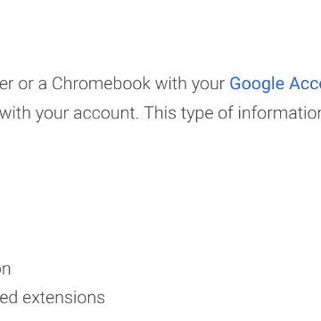

Why I’m done with Chrome

Why I’m done with Chrome

https://blog.cryptographyengineering.com/2018/09/23/why-im-leaving-chrome/

This blog is mainly reserved for cryptography, and I try to avoid filling it with random “someone is wrong on the Internet” posts. After all, that’s what Twitter is for! But from …