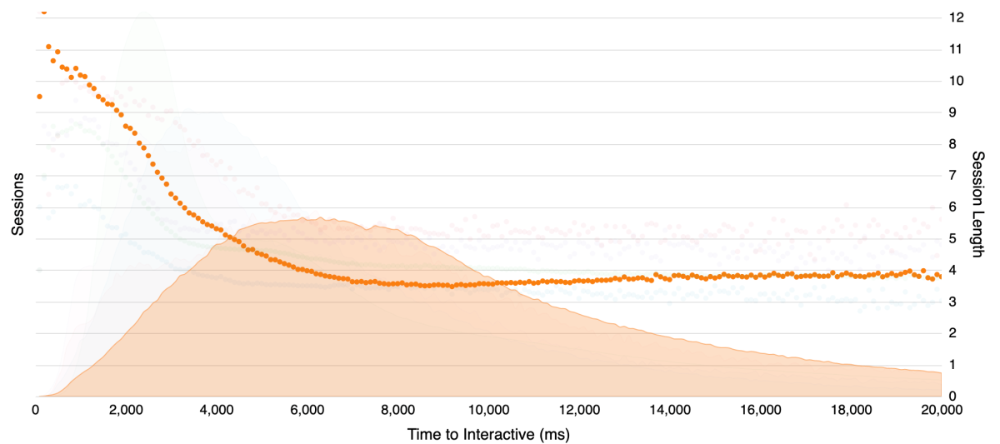

Why Site Speed is Critical for Online Publishers

 [Simon Hearne](https://simonhearne.com/)

- [Posts](https://simonhearne.com/)

- [About](https://simonhearne.com/about/)

- [Talks](https://simonhearne.com/talks/)

- [Tools](https://simonhearne.com/tools/)

 

 

### Simon Hearne

Web Performance Consultant

 [** Email](https://simonhearne.com/2019/site-speed-for-publishers/mailto:simon@hearne.me)  [** Twitter](http://twitter.com/SimonHearne)  [** LinkedIn](http://linkedin.com/in/simonhearne)  [** Github](http://github.com/simonhearne)

this loaded in 13,205ms

# [Why Site Speed is Critical for Online Publishers](https://simonhearne.com/2019/site-speed-for-publishers/)

Site speed is a critical factor in the success of an online publishing business, whether revenue is driven by adverts or subscriptions. This post demonstrates the relationship between speed and publishing revenue, and suggests some quick wins to improve both!

Published August 07, 2019

* * *

It has been well documented that site speed is a major factor in business success for e-commerce websites. If you can demonstrate that improving page load times by 500ms increases revenue by 5% there is a clear return on investment to make the speed improvements.

Digital publishing has not had so much documented evidence for the benefits for site speed. There are multiple factors behind this, based on the business model of the site. Subscription-based publishers have a captive audience - if you’ve already paid to access content, surely an article loading a second slower won’t stop you reading the content? For ad-driven publishers there is a conflict between AdOps teams piling on tens or hundreds of third-party tags (each promising a slice of ad revenue) and the development team trying to ship editorial content.

>

> Optimizely added artificial latency to the Telegraph and saw page views plummet: by 11% for a 4 second delay and 44% for a 20 second delay.

>

[source](https://wpostats.com/2016/07/04/optimizely-pageviews.html)

## Subscription-based Publishers

There are two angles to look at site speed for subscription-based publishers: acquisition and retention. When acquiring new subscribers, these sites can be viewed very much like an ecommerce player - you’re trying to convert users from paying nothing to purchasing a subscription.

The e-commerce model does not work when it comes to retention, however. Once a user has purchased a subscription they will have a choice of whether to renew or not. That decision will be based at least partly on their experience of the product over the previous period, there will be a calculation of the value of the content they consume versus the ongoing cost of subscription.

As the FT found out, slower pages result in fewer articles viewed. The drop in articles gets worse over time, presumably as subscribers get increasingly frustrated.

>

> Financial Times added a one second delay to every page view and saw a 4.9% drop in the number of articles users read over a 7 day window. A two-second delay resulted in a 4.4% drop, and a three second delay saw a 7.2% drop. After twenty-eight days the two and three second variants both resulted in further drops in engagement.

>

[source](https://wpostats.com/2016/04/13/ft-page-view.html)

Whilst the FT study clearly showed a direct correlation between speed and articles consumed, they did not continue to measure the effect on subscription renewal. It is fair to assume, though, that subscribers who have a poor experience (and thus consume less content) are less likely to renew their subscription. You may be missing out on critical business data if you’re not tracking subscriber views, performance and attrition.

>

> GQ cut load time by 80% and saw an 80% increase in traffic. Median time spent on the site also increased by 32%.

>

[source](https://digiday.com/media/gq-com-cut-page-load-time-80-percent/)

The interactive chart below shows the relationship between load time and the likelihood that a user will bounce or continue to a different page (retention) for a range of publishing websites.

'%3e%3cg class='mark-group role-frame root'%3e%3cg transform='translate(0%2c0)'%3e%3cpath class='background' d='M0%2c0h595v373.09999999999997h-595Z' style='fill: none%3b'%3e%3c/path%3e%3cg%3e%3cg class='mark-group role-axis'%3e%3cg transform='translate(0.5%2c373.59999999999997)'%3e%3cpath class='background' d='M0%2c0h0v0h0Z' style='pointer-events: none%3b fill: none%3b'%3e%3c/path%3e%3cg%3e%3cg class='mark-text role-axis-label' style='pointer-events: none%3b'%3e%3ctext text-anchor='middle' transform='translate(0%2c18)' style='font-size: 14px%3b fill: rgb(0%2c 0%2c 0)%3b opacity: 1%3b'%3e0%3c/text%3e%3ctext text-anchor='middle' transform='translate(297.5%2c18)' style='font-size: 14px%3b fill: rgb(0%2c 0%2c 0)%3b opacity: 1%3b'%3e10%2c000%3c/text%3e%3ctext text-anchor='middle' transform='translate(595%2c18)' style='font-size: 14px%3b fill: rgb(0%2c 0%2c 0)%3b opacity: 1%3b'%3e20%2c000%3c/text%3e%3ctext text-anchor='middle' transform='translate(148.75%2c18)' style='font-size: 14px%3b fill: rgb(0%2c 0%2c 0)%3b opacity: 1%3b'%3e5%2c000%3c/text%3e%3ctext text-anchor='middle' transform='translate(446.25%2c18)' style='font-size: 14px%3b fill: rgb(0%2c 0%2c 0)%3b opacity: 1%3b'%3e15%2c000%3c/text%3e%3c/g%3e%3cg class='mark-rule role-axis-domain' style='pointer-events: none%3b'%3e%3cline transform='translate(0%2c0)' x2='595' y2='0' style='fill: none%3b stroke: rgb(255%2c 255%2c 255)%3b stroke-opacity: 0.5%3b stroke-width: 1%3b opacity: 1%3b'%3e%3c/line%3e%3c/g%3e%3cg class='mark-text role-axis-title' style='pointer-events: none%3b'%3e%3ctext text-anchor='middle' transform='translate(297.5%2c44)' style='font-size: 16px%3b font-weight: 400%3b fill: rgb(0%2c 0%2c 0)%3b opacity: 1%3b'%3eDOM Ready (ms)%3c/text%3e%3c/g%3e%3c/g%3e%3c/g%3e%3c/g%3e%3cg class='mark-group role-axis'%3e%3cg transform='translate(595.5%2c0.5)'%3e%3cpath class='background' d='M0%2c0h0v0h0Z' style='pointer-events: none%3b fill: none%3b'%3e%3c/path%3e%3cg%3e%3cg class='mark-rule role-axis-grid' style='pointer-events: none%3b'%3e%3cline transform='translate(0%2c373)' x2='-595' y2='0' style='fill: none%3b stroke: rgb(136%2c 136%2c 136)%3b stroke-opacity: 0.25%3b stroke-width: 1%3b opacity: 1%3b'%3e%3c/line%3e%3cline transform='translate(0%2c336)' x2='-595' y2='0' style='fill: none%3b stroke: rgb(136%2c 136%2c 136)%3b stroke-opacity: 0.25%3b stroke-width: 1%3b opacity: 1%3b'%3e%3c/line%3e%3cline transform='translate(0%2c298)' x2='-595' y2='0' style='fill: none%3b stroke: rgb(136%2c 136%2c 136)%3b stroke-opacity: 0.25%3b stroke-width: 1%3b opacity: 1%3b'%3e%3c/line%3e%3cline transform='translate(0%2c261)' x2='-595' y2='0' style='fill: none%3b stroke: rgb(136%2c 136%2c 136)%3b stroke-opacity: 0.25%3b stroke-width: 1%3b opacity: 1%3b'%3e%3c/line%3e%3cline transform='translate(0%2c224)' x2='-595' y2='0' style='fill: none%3b stroke: rgb(136%2c 136%2c 136)%3b stroke-opacity: 0.25%3b stroke-width: 1%3b opacity: 1%3b'%3e%3c/line%3e%3cline transform='translate(0%2c187)' x2='-595' y2='0' style='fill: none%3b stroke: rgb(136%2c 136%2c 136)%3b stroke-opacity: 0.25%3b stroke-width: 1%3b opacity: 1%3b'%3e%3c/line%3e%3cline transform='translate(0%2c149)' x2='-595' y2='0' style='fill: none%3b stroke: rgb(136%2c 136%2c 136)%3b stroke-opacity: 0.25%3b stroke-width: 1%3b opacity: 1%3b'%3e%3c/line%3e%3cline transform='translate(0%2c112)' x2='-595' y2='0' style='fill: none%3b stroke: rgb(136%2c 136%2c 136)%3b stroke-opacity: 0.25%3b stroke-width: 1%3b opacity: 1%3b'%3e%3c/line%3e%3cline transform='translate(0%2c75)' x2='-595' y2='0' style='fill: none%3b stroke: rgb(136%2c 136%2c 136)%3b stroke-opacity: 0.25%3b stroke-width: 1%3b opacity: 1%3b'%3e%3c/line%3e%3cline transform='translate(0%2c37)' x2='-595' y2='0' style='fill: none%3b stroke: rgb(136%2c 136%2c 136)%3b stroke-opacity: 0.25%3b stroke-width: 1%3b opacity: 1%3b'%3e%3c/line%3e%3cline transform='translate(0%2c0)' x2='-595' y2='0' style='fill: none%3b stroke: rgb(136%2c 136%2c 136)%3b stroke-opacity: 0.25%3b stroke-width: 1%3b opacity: 1%3b'%3e%3c/line%3e%3c/g%3e%3cg class='mark-text role-axis-label' style='pointer-events: none%3b'%3e%3ctext text-anchor='start' transform='translate(7%2c377.09999999999997)' style='font-size: 14px%3b fill: rgb(0%2c 0%2c 0)%3b opacity: 1%3b'%3e0%25%3c/text%3e%3ctext text-anchor='start' transform='translate(7%2c339.78999999999996)' style='font-size: 14px%3b fill: rgb(0%2c 0%2c 0)%3b opacity: 1%3b'%3e10%25%3c/text%3e%3ctext text-anchor='start' transform='translate(7%2c302.47999999999996)' style='font-size: 14px%3b fill: rgb(0%2c 0%2c 0)%3b opacity: 1%3b'%3e20%25%3c/text%3e%3ctext text-anchor='start' transform='translate(7%2c265.16999999999996)' style='font-size: 14px%3b fill: rgb(0%2c 0%2c 0)%3b opacity: 1%3b'%3e30%25%3c/text%3e%3ctext text-anchor='start' transform='translate(7%2c227.85999999999999)' style='font-size: 14px%3b fill: rgb(0%2c 0%2c 0)%3b opacity: 1%3b'%3e40%25%3c/text%3e%3ctext text-anchor='start' transform='translate(7%2c190.54999999999998)' style='font-size: 14px%3b fill: rgb(0%2c 0%2c 0)%3b opacity: 1%3b'%3e50%25%3c/text%3e%3ctext text-anchor='start' transform='translate(7%2c153.23999999999998)' style='font-size: 14px%3b fill: rgb(0%2c 0%2c 0)%3b opacity: 1%3b'%3e60%25%3c/text%3e%3ctext text-anchor='start' transform='translate(7%2c115.93)' style='font-size: 14px%3b fill: rgb(0%2c 0%2c 0)%3b opacity: 1%3b'%3e70%25%3c/text%3e%3ctext text-anchor='start' transform='translate(7%2c78.62)' style='font-size: 14px%3b fill: rgb(0%2c 0%2c 0)%3b opacity: 1%3b'%3e80%25%3c/text%3e%3ctext text-anchor='start' transform='translate(7%2c41.31)' style='font-size: 14px%3b fill: rgb(0%2c 0%2c 0)%3b opacity: 1%3b'%3e90%25%3c/text%3e%3ctext text-anchor='start' transform='translate(7%2c4)' style='font-size: 14px%3b fill: rgb(0%2c 0%2c 0)%3b opacity: 1%3b'%3e100%25%3c/text%3e%3c/g%3e%3cg class='mark-rule role-axis-domain' style='pointer-events: none%3b'%3e%3cline transform='translate(0%2c373.09999999999997)' x2='0' y2='-373.09999999999997' style='fill: none%3b stroke: rgb(255%2c 255%2c 255)%3b stroke-opacity: 0.5%3b stroke-width: 1%3b opacity: 1%3b'%3e%3c/line%3e%3c/g%3e%3cg class='mark-text role-axis-title' style='pointer-events: none%3b'%3e%3ctext text-anchor='middle' transform='translate(45.1337890625%2c186.54999999999998) rotate(90) translate(0%2c-3)' style='font-size: 16px%3b font-weight: 400%3b fill: rgb(0%2c 0%2c 0)%3b opacity: 1%3b'%3eRetention / Bounce Rate%3c/text%3e%3c/g%3e%3c/g%3e%3c/g%3e%3c/g%3e%3cg class='mark-group role-axis'%3e%3cg transform='translate(0.5%2c0.5)'%3e%3cpath class='background' d='M0%2c0h0v0h0Z' style='pointer-events: none%3b fill: none%3b'%3e%3c/path%3e%3cg%3e%3cg class='mark-rule role-axis-domain' style='pointer-events: none%3b'%3e%3cline transform='translate(0%2c373.09999999999997)' x2='0' y2='-373.09999999999997' style='fill: none%3b stroke: rgb(255%2c 255%2c 255)%3b stroke-opacity: 0.5%3b stroke-width: 1%3b opacity: 1%3b'%3e%3c/line%3e%3c/g%3e%3cg class='mark-text role-axis-title' style='pointer-events: none%3b'%3e%3ctext text-anchor='middle' transform='translate(-10%2c186.54999999999998) rotate(-90) translate(0%2c-3)' style='font-size: 16px%3b font-weight: 400%3b fill: rgb(0%2c 0%2c 0)%3b opacity: 1%3b'%3eSessions%3c/text%3e%3c/g%3e%3c/g%3e%3c/g%3e%3c/g%3e%3cg class='mark-text role-mark'%3e%3ctext text-anchor='middle' transform='translate(297.5%2c-45)' style='font-size: 16px%3b fill: rgb(0%2c 0%2c 0)%3b'%3eInteractive Retention and Bounce Rate Chart%3c/text%3e%3c/g%3e%3cg class='mark-text role-mark resetLink'%3e%3ctext text-anchor='middle' transform='translate(297.5%2c-25)' style='font-size: 15px%3b fill: rgb(0%2c 0%2c 0)%3b'%3eFocusing on publisher 2 (click here to reset)%3c/text%3e%3c/g%3e%3cg class='mark-group role-scope' clip-path='url(%23clip2)'%3e%3cg transform='translate(0%2c0)'%3e%3cpath class='background' d='M0%2c0h0v0h0Z' style='fill: none%3b'%3e%3c/path%3e%3cg%3e%3cg class='mark-area role-mark'%3e%3cpath d='M2.975%2c373.09999999999997C2.975%2c373.09999999999997%2c4.958333820687037%2c373.10098315046883%2c5.95%2c373.09999999999997C6.941667154021329%2c373.09901684856476%2c7.933334795380072%2c373.0970505369975%2c8.924999999999999%2c373.09410108848977C9.916668128722028%2c373.09115163128513%2c10.908413706564584%2c373.09704759582723%2c11.9%2c373.0823032654694C12.891747065962928%2c373.0675565445146%2c13.883688588279187%2c373.0478658242764%2c14.875%2c373.0056174158369C15.867022431409628%2c372.9633387046593%2c16.860286658283474%2c372.9271050431226%2c17.849999999999998%2c372.82865007053124C18.84363550406421%2c372.72980492800866%2c19.83772147831104%2c372.598805857744%2c20.825000000000003%2c372.4127768090628C21.82113388331522%2c372.22507917906137%2c22.836444410394563%2c372.09219016679316%2c23.8%2c371.70490742783994C24.823376566631424%2c371.29358079138945%2c25.792674352101375%2c370.57644632051677%2c26.775%2c369.9588296208236C27.77637345198799%2c369.32923701281203%2c28.772881646513156%2c368.6760206419104%2c29.75%2c367.9590986188691C30.757122150147545%2c367.22016249433847%2c31.754756503073743%2c366.44163648963263%2c32.725%2c365.5818372802624C33.74011730735708%2c364.68227231430416%2c34.72170519935924%2c363.6748804505237%2c35.699999999999996%2c362.6618760827182C36.70580104430034%2c361.62038955907275%2c37.642926128762795%2c360.37024181203%2c38.675000000000004%2c359.41157584060335C39.63192929614438%2c358.5227096665424%2c40.690112703721844%2c357.9469683929154%2c41.650000000000006%2c357.0667585153027C42.67812498452033%2c356.1239751590649%2c43.60636840868074%2c354.87268021264566%2c44.625%2c353.89904303433053C45.59234849874541%2c352.97442370110724%2c46.64232353606806%2c352.3005225718485%2c47.6%2c351.3477638061732C48.63106601818578%2c350.32199234387485%2c49.54098041336535%2c348.93091264116134%2c50.575%2c347.91459730724245C51.530501646902195%2c346.97545554640595%2c52.58978017864193%2c346.3507453618565%2c53.55%2c345.4252566499421C54.57768786956445%2c344.43474020620954%2c55.51409925004217%2c343.1678065228486%2c56.525%2c342.12481565999065C57.49881783065675%2c341.1200848795401%2c58.52458919642192%2c340.2698289035263%2c59.5%2c339.26974248905856C60.50906357058154%2c338.23515197132895%2c61.49090162009722%2c337.11894213009936%2c62.474999999999994%2c336.0105938796784C63.474473284616586%2c334.88492952642883%2c64.37644046873446%2c333.44523298596295%2c65.45%2c332.5656295577273C66.38018664665107%2c331.80349635554825%2c67.43629936376045%2c331.45680062447445%2c68.425%2c330.884439777323C69.41966861215506%2c330.30862405654693%2c70.41169284302248%2c329.72168197140525%2c71.39999999999999%2c329.12066523577613C72.39507232686968%2c328.51553441446435%2c73.35294278102899%2c327.73828315382553%2c74.375%2c327.2654575658213C75.33959717241923%2c326.81921422761013%2c76.35776882895152%2c326.6285486190519%2c77.35000000000001%2c326.3157328126806C78.34110344473736%2c326.0032725389972%2c79.33099533170719%2c325.6817145771735%2c80.325%2c325.3896037055807C81.31435050791546%2c325.0988605648323%2c82.30692881731501%2c324.83003918883486%2c83.30000000000001%2c324.5667055499092C84.29027006280859%2c324.3041146866304%2c85.32927765508151%2c324.2742667219221%2c86.27499999999999%2c323.8116448766049C87.32309625503602%2c323.29894447761336%2c88.19343099730533%2c321.9094207439857%2c89.25%2c321.49632210885517C90.19026628691452%2c321.1286956511482%2c91.26756421215823%2c321.55345067780416%2c92.225%2c321.24561836967206C93.25638988934435%2c320.91400852778736%2c94.2010882238249%2c320.03207123748444%2c95.2%2c319.4700460051048C96.18462728647131%2c318.9160577624139%2c97.16166454723576%2c318.3038119029725%2c98.17500000000001%2c317.89503663188395C99.14674028154208%2c317.5030406783905%2c100.14995112123374%2c317.2390232482181%2c101.15%2c317.03969446290637C102.13355861174378%2c316.8436525018337%2c103.16490228222005%2c317.0162093147216%2c104.125%2c316.7005070510704C105.15284822139849%2c316.3625268599128%2c106.07287323801378%2c315.339272848876%2c107.1%2c314.98982271311525C108.06064818458198%2c314.66298998813454%2c109.08388290897372%2c314.58099287980207%2c110.075%2c314.58869673042227C111.0672174633%2c314.59640913412244%2c112.07446816668482%2c315.1554371435341%2c113.05%2c315.03701400519674C114.05892502085197%2c314.914537153867%2c115.01308435031402%2c314.009478582632%2c116.025%2c313.8100404110772C116.99794721389802%2c313.61828251760124%2c118.01092443651694%2c313.88664782722515%2c119%2c313.8159393225874C119.99428513700445%2c313.7448583882111%2c120.98097449432538%2c313.4772335209351%2c121.975%2c313.3823693265884C122.96433005976785%2c313.287953239147%2c123.97408181195088%2c313.09140973067554%2c124.94999999999999%2c313.246694361854C125.95848370650948%2c313.40716070250886%2c126.93034676323016%2c314.01357633407645%2c127.925%2c314.37043700454524C128.91371564684206%2c314.72516739257566%2c129.89525436938763%2c315.25754774788805%2c130.9%2c315.3821003285429C131.87924321618368%2c315.503491520451%2c132.91826639272296%2c314.9151873199346%2c133.875%2c315.1402449566251C134.90733901460575%2c315.38308766343846%2c135.83411743671465%2c316.45064708626927%2c136.85%2c316.93646351147805C137.81960670459515%2c317.40014984699457%2c138.84619076943798%2c317.5933495259003%2c139.825%2c318.01891377359794C140.8302275194464%2c318.45596409936223%2c141.7890517384104%2c319.1346658883292%2c142.79999999999998%2c319.5349340317169C143.77377692563033%2c319.92048480311144%2c144.8115785497854%2c319.9711954688728%2c145.775%2c320.39912456795975C146.7985473922081%2c320.8537601932334%2c147.73715957258943%2c321.7176729031264%2c148.75%2c322.23663550338404C149.7221596381816%2c322.7347539434093%2c150.7160331089013%2c323.188272211566%2c151.725%2c323.4724574647689C152.7004952443205%2c323.7472151059276%2c153.75000298174555%2c323.5578947214906%2c154.70000000000002%2c323.93847147407394C155.74177669233876%2c324.3558159318657%2c156.630193980929%2c325.63992266981575%2c157.675%2c326.00309050264053C158.62292522559278%2c326.332583196571%2c159.6886784667517%2c325.90926443962064%2c160.65%2c326.18890621521155C161.6762492486104%2c326.4874350134905%2c162.60343701920564%2c327.45783359138994%2c163.625%2c327.8288036150444C164.58998991744323%2c328.1792297162543%2c165.61236114173437%2c328.1805344083808%2c166.60000000000002%2c328.4098463987982C167.59576099519163%2c328.641044203417%2c168.5928038886981%2c328.8846955452807%2c169.575%2c329.21209836418404C170.57651340876131%2c329.5459403631748%2c171.5397550878578%2c330.1750709232321%2c172.54999999999998%2c330.40072903348744C173.5243839658985%2c330.61837689467933%2c174.5404134210877%2c330.42581523663966%2c175.52499999999998%2c330.5776963787931C176.52395490531998%2c330.73179396170707%2c177.50348507428814%2c331.1262917063187%2c178.5%2c331.3268581405873C179.48691140373717%2c331.5254916944653%2c180.49863039889482%2c331.51147174736536%2c181.475%2c331.77812487111686C182.4829699392542%2c332.05340826036354%2c183.4445132186568%2c332.67224650736284%2c184.45%2c332.97560390768547C185.42857640300772%2c333.2708423923098%2c186.4321829828781%2c333.39669002106467%2c187.425%2c333.5890907047453C188.41552162927115%2c333.7810465590322%2c189.4193201576166%2c333.8644471816286%2c190.4%2c334.1288411079277C191.40316303644155%2c334.39929656388813%2c192.3711432786757%2c334.9430238653222%2c193.375%2c335.2053924585374C194.35504798453263%2c335.4615383860618%2c195.35780034522404%2c335.69123480834094%2c196.35000000000002%2c335.6979515696383C197.34113482195366%2c335.7046611224793%2c198.3310325244777%2c335.28905277371257%2c199.32500000000002%2c335.24668483910875C200.31438701440433%2c335.20451214698716%2c201.33328319038554%2c335.18296014502386%2c202.3%2c335.44134891894504C203.3194105850782%2c335.71382194163476%2c204.25568159104907%2c336.6291343312253%2c205.27499999999998%2c336.90427897347223C206.2417913685598%2c337.1652449904635%2c207.26279368025598%2c336.9782510210191%2c208.25%2c337.113690332084C209.24620873302078%2c337.2503647250439%2c210.2341855526593%2c337.51255488705164%2c211.225%2c337.72422767338867C212.2175218256238%2c337.93626521572975%2c213.20235973105304%2c338.2639384358758%2c214.2%2c338.38490576253C215.18583361785855%2c338.504441491981%2c216.1933020110523%2c338.30023291930854%2c217.17499999999998%2c338.4527432448972C218.177053021535%2c338.60841579826086%2c219.14790841105724%2c339.174169515425%2c220.15%2c339.3257821484053C221.13166246668578%2c339.4743039331548%2c222.14058745012267%2c339.2424119952302%2c223.125%2c339.3700239847318C224.124139451457%2c339.4995450612417%2c225.10118413154362%2c340.0119817615902%2c226.1%2c340.1073879235056C227.08471785858805%2c340.20144745381987%2c228.09736078727855%2c339.8085866627285%2c229.07500000000002%2c339.95106676848553C230.0815356032452%2c340.0977582036617%2c231.04663454251536%2c340.75050356842917%2c232.05%2c341.0099213845647C233.03049511363088%2c341.26342612624404%2c234.02999838482955%2c341.41172410971075%2c235.025%2c341.50248049566557C236.01337598456084%2c341.5926325426126%2c237.01186236646294%2c341.46255807413235%2c238%2c341.5555706992573C238.99524666079193%2c341.6492524915758%2c239.98101455697207%2c341.9299948835646%2c240.97500000000002%2c342.06582654488875C241.9643693770804%2c342.20102740431247%2c242.96100440742282%2c342.23010847027473%2c243.95%2c342.36962048766355C244.94436683277613%2c342.5098901955433%2c245.93547693341776%2c342.7058973118848%2c246.92499999999998%2c342.90642143509086C247.91882896303562%2c343.10781813635015%2c248.90817628307096%2c343.35421249018583%2c249.89999999999998%2c343.5759478914975C250.8915097158294%2c343.7976130936814%2c251.8781906141948%2c344.0846463623785%2c252.875%2c344.2366259806388C253.86162846150512%2c344.38705335329354%2c254.8610352146768%2c344.36108504393843%2c255.85%2c344.4873297198219C256.84439831871975%2c344.6142680044898%2c257.8300468841269%2c344.88700737587584%2c258.825%2c344.99758556545333C259.81342321399677%2c345.1074380276412%2c260.80962963082095%2c345.0685628162455%2c261.8%2c345.1509572647183C262.7929697778254%2c345.23356797253035%2c263.78537243306266%2c345.35045919040925%2c264.775%2c345.49309413230935C265.7687226770301%2c345.63631930209885%2c266.7638598110528%2c345.78692353851943%2c267.75%2c346.009248889451C268.7473191517482%2c346.23409453806%2c269.72587775721473%2c346.63760762607865%2c270.725%2c346.8380459566327C271.70942876720676%2c347.0355365640865%2c272.7112707934182%2c347.0491400658253%2c273.7%2c347.2096773817747C274.69463934912574%2c347.37117431175665%2c275.68421837150555%2c347.5982233371862%2c276.675%2c347.80546744430393C277.66755487566036%2c348.0130824656726%2c278.657071856043%2c348.25060885521464%2c279.65%2c348.4543477104248C280.6404115756808%2c348.65757019116955%2c281.63900468505307%2c349.0736249853775%2c282.625%2c349.02654212691334C283.62247079838346%2c348.97891129570104%2c284.628552488204%2c348.0526655384479%2c285.59999999999997%2c348.15350322340515C286.613682133672%2c348.2587249244242%2c287.55202089165346%2c349.55720932801177%2c288.575%2c349.7491587869116C289.5388683289945%2c349.9300168344432%2c290.56487141491147%2c349.3181186441664%2c291.55%2c349.3863757290349C292.5483818495851%2c349.45555109930626%2c293.52474029884127%2c350.0421755454976%2c294.525%2c350.1768298714004C295.5083615176657%2c350.30920937456995%2c296.51611518857425%2c350.072156732782%2c297.5%2c350.2004255174412C298.4997007187698%2c350.33075621746866%2c299.4769102700727%2c350.78070658981375%2c300.475%2c350.9643345580108C301.4604058170962%2c351.14562894730005%2c302.45688836412705%2c351.2283214239643%2c303.45%2c351.3005725140917C304.44023007060235%2c351.37261396390807%2c305.4374437350973%2c351.28986541335524%2c306.425%2c351.3979045540098C307.420846368138%2c351.5068506360319%2c308.4044638059421%2c351.83296463247876%2c309.40000000000003%2c351.9553516917228C310.387856608236%2c352.0767946547797%2c311.3835788218106%2c352.0659763623461%2c312.375%2c352.13231903702854C313.36691239846897%2c352.1986945825714%2c314.36658452175766%2c352.1831205175039%2c315.35%2c352.35352821866064C316.3502019475469%2c352.52684470426107%2c317.3243571954891%2c353.0148110459255%2c318.32500000000005%2c353.1734769185771C319.3080041896086%2c353.32934594282955%2c320.3084175494361%2c353.2604905807565%2c321.3%2c353.3091518833115C322.291750911387%2c353.35782145297844%2c323.28693655185305%2c353.3508349478954%2c324.27500000000003%2c353.46547303833154C325.2703230274112%2c353.5809534069693%2c326.2574790051251%2c353.83353594407544%2c327.25%2c354.00227398575885C328.2408152723906%2c354.1707220383405%2c329.230329295318%2c354.3818618073964%2c330.225%2c354.47713636232913C331.21369859350017%2c354.5718388784634%2c332.2092936030061%2c354.51166669188336%2c333.20000000000005%2c354.5744684022473C334.1926306702727%2c354.63739209391014%2c335.18283366096864%2c354.7735281750189%2c336.17499999999995%2c354.85466669898136C337.1661679993587%2c354.9357235795699%2c338.15775462570707%2c355.020829107357%2c339.15%2c355.061128601838C340.1410893067621%2c355.1013811432787%2c341.13443116157583%2c355.04358216832856%2c342.125%2c355.09652207089914C343.1177693779575%2c355.1495795789748%2c344.11067642400025%2c355.2493918825541%2c345.09999999999997%2c355.37966982338827C346.0940321135872%2c355.51056780259626%2c347.08025149641117%2c355.7689908186405%2c348.075%2c355.88107730175443C349.06362266984377%2c355.992473536873%2c350.0584067702297%2c355.9926698133315%2c351.04999999999995%2c356.05214573554997C352.04174012532263%2c356.11163046858746%2c353.0336473147324%2c356.1672025274658%2c354.025%2c356.237961448121C355.0169810462211%2c356.30876521875075%2c356.01111468071747%2c356.35261167325297%2c357%2c356.4768673642837C357.9944795719492%2c356.6018259858943%2c358.98281937196583%2c356.82335019640925%2c359.97499999999997%2c356.9871232099151C360.9661537685996%2c357.15072672619516%2c361.9552829969558%2c357.37070237491986%2c362.95%2c357.45903613073034C363.9386534054336%2c357.54683142148093%2c364.93332858335174%2c357.5175338511763%2c365.925%2c357.5180252458323C366.916661916776%2c357.5185166357809%2c367.90890137810635%2c357.43648899310614%2c368.9%2c357.46198558648547C369.89223601597496%2c357.4875114399946%2c370.89105327776707%2c357.50756978076805%2c371.875%2c357.67139694509723C372.8746347468346%2c357.83783616608184%2c373.8497402988413%2c358.3352652875775%2c374.85%2c358.4618510874627C375.8333615176658%2c358.5862983726486%2c376.8335829532689%2c358.419593624133%2c377.825%2c358.438255441422C378.81691653819047%2c358.4569266608272%2c379.8116473103226%2c358.46705370566025%2c380.8%2c358.5739304061563C381.7950255432828%2c358.68152868365996%2c382.7814746783198%2c359.0586227981585%2c383.77500000000003%2c359.0841862517878C384.76482184252484%2c359.1096544147229%2c385.76135277483513%2c358.69200609373064%2c386.75%2c358.7302515611764C387.7447233364939%2c358.768732080835%2c388.7299964784362%2c359.16753813974304%2c389.725%2c359.32014271219543C390.7133741284553%2c359.47173052874797%2c391.7073484690838%2c359.6216245808948%2c392.70000000000005%2c359.64458284525585C393.6906856993741%2c359.6674956434298%2c394.6834462472602%2c359.455341383079%2c395.675%2c359.4587671326849C396.6667796320437%2c359.4621936626882%2c397.6607309400612%2c359.55363038436093%2c398.65000000000003%2c359.66522903554153C399.64408768726827%2c359.777371272216%2c400.63163352324983%2c360.00232022679734%2c401.625%2c360.1312430448466C402.61497843179137%2c360.25972614974467%2c403.60900188112555%2c360.44962243750405%2c404.6%2c360.4379864433765C405.59233702218296%2c360.42633472825946%2c406.5877570601416%2c360.0106612947189%2c407.57500000000005%2c360.0604561067243C408.57117076444007%2c360.1107012226304%2c409.5555500378122%2c360.72021057008305%2c410.54999999999995%2c360.7476792976615C411.538914271803%2c360.774995118229%2c412.5329695376427%2c360.2358274030832%2c413.525%2c360.2315245405198C414.51630340403176%2c360.2272248315208%2c415.50672890283425%2c360.58088301963284%2c416.5%2c360.7211341958656C417.4900725527457%2c360.8609337334485%2c418.48241499340236%2c360.97374775873817%2c419.47499999999997%2c361.07211943072195C420.4657517159249%2c361.17030941159857%2c421.45960666941625%2c361.3353046103957%2c422.45%2c361.31102534688466C423.4429465765639%2c361.2866834911387%2c424.4317221531913%2c360.9583127032538%2c425.42499999999995%2c360.92464664296716C426.41506588980536%2c360.8910894484311%2c427.40805088525155%2c361.0578560254431%2c428.4%2c361.10751289978305C429.391384540008%2c361.15714151156743%2c430.3904901080108%2c361.0825287740922%2c431.375%2c361.22254167423176C432.3740361937764%2c361.3646204445654%2c433.35078563530453%2c361.8454220742524%2c434.34999999999997%2c361.9628550687607C435.3343419776424%2c362.07854018112397%2c436.3352033155974%2c361.8771866313058%2c437.325%2c361.9333605112097C438.31855086105594%2c361.9897474517065%2c439.30780498725494%2c362.2928184968209%2c440.3%2c362.3020424805966C441.2911394441756%2c362.31125665123346%2c442.2870097034653%2c361.94156625693864%2c443.275%2c361.9894001705565C444.2703983752866%2c362.03759274903206%2c445.2532999494739%2c362.5092071986205%2c446.25%2c362.5969880561061C447.2367334432143%2c362.68389113964605%2c448.2337032564301%2c362.50313538486125%2c449.225%2c362.5203022064737C450.21703714256046%2c362.5374818499758%2c451.20807545317393%2c362.65056229211723%2c452.2%2c362.70021900753443C453.19140905447256%2c362.74984991689905%2c454.1837508650677%2c362.76366811806673%2c455.175%2c362.8181972377383C456.16708490277836%2c362.87277233342456%2c457.15800083705915%2c362.96909902275814%2c458.15000000000003%2c363.02760859635003C459.1413346157263%2c363.0860789739671%2c460.134287779169%2c363.0960583500464%2c461.125%2c363.16918247259457C462.11762480119484%2c363.2424477620305%2c463.1072036874813%2c363.43228239907813%2c464.1%2c363.4670775038592C465.0905421447669%2c363.50179360552335%2c466.08325892214344%2c363.3849813311587%2c467.07500000000005%2c363.37859383120633C468.06659227780443%2c363.3722072896294%2c469.0583570817367%2c363.4311914817204%2c470.05%2c363.42873457904295C471.0416904173452%2c363.42627755868136%2c472.0353708946722%2c363.31019603392366%2c473.02500000000003%2c363.36384655243086C474.0187211130273%2c363.4177189099419%2c475.00741511938924%2c363.6395455355782%2c476%2c363.75317471210343C476.99075184098376%2c363.866594045836%2c477.98241204989904%2c364.0197183631987%2c478.975%2c364.04517083185783C479.9657487941427%2c364.07057613990077%2c480.95937314805286%2c363.8787117895693%2c481.95000000000005%2c363.90654641136837C482.9427108609616%2c363.9344395896286%2c483.93230073644344%2c364.1385497299791%2c484.92499999999995%2c364.21328980989824C485.91563835280806%2c364.28787472436136%2c486.9081065497612%2c364.32094325729946%2c487.9%2c364.35486368614283C488.89144009035687%2c364.3887686111421%2c489.88342875843006%2c364.42367835975637%2c490.875%2c364.41680225699986C491.8667621285073%2c364.40992483052787%2c492.8591657556854%2c364.2866605690548%2c493.84999999999997%2c364.3135713055715C494.84250189343646%2c364.3405273348971%2c495.8327175993861%2c364.56189494210264%2c496.825%2c364.57902232353007C497.8160524581883%2c364.5961284754233%2c498.80878146090816%2c364.40359659775675%2c499.79999999999995%2c364.41680225699986C500.792115605732%2c364.4300198675492%2c501.78259180418297%2c364.6306954507846%2c502.775%2c364.65865762891764C503.7659273488483%2c364.68657808257996%2c504.7604489766656%2c364.5312995578407%2c505.75%2c364.58492123504027C506.74380051971735%2c364.63877318346175%2c507.73115415095674%2c364.92479719375285%2c508.72499999999997%2c364.9830977619781C509.7145064724435%2c365.04114377551394%2c510.7092404290589%2c364.90063898962075%2c511.7%2c364.93590646989657C512.6925770935319%2c364.97123864744503%2c513.6823917255485%2c365.1527338645204%2c514.675%2c365.19545857634495C515.665728621657%2c365.2381023825131%2c516.6583391813822%2c365.1895597286112%2c517.65%2c365.1925091205899C518.6416725148536%2c365.1954585473553%2c519.6358500362488%2c365.1389705956978%2c520.625%2c365.21315531087555C521.6192091798353%2c365.28771945942333%2c522.6070805247977%2c365.6204617631034%2c523.6%2c365.64082639536434C524.590420157184%2c365.6611397669807%2c525.5823874128818%2c365.3614885380958%2c526.575%2c365.33703245258954C527.5657243416383%2c365.31262288985914%2c528.5585372071403%2c365.43437945021293%2c529.55%2c365.49335360760955C530.5418707082667%2c365.5523520286171%2c531.5329725182386%2c365.67723591252906%2c532.525%2c365.69096714320096C533.5163063759352%2c365.7046883926268%2c534.5095841664054%2c365.54175522101565%2c535.5%2c365.57593836875225C536.492923842676%2c365.6102080777513%2c537.482057569713%2c365.8256575745021%2c538.475%2c365.8974290460576C539.4653974344465%2c365.9690165612315%2c540.4587284390577%2c365.95497614618034%2c541.45%2c366.0065589089961C542.4420624030776%2c366.05818282483574%2c543.4332692686878%2c366.20516385285805%2c544.4250000000001%2c366.2071219003426C545.4166026185721%2c366.2090796948846%2c546.4094614233638%2c365.9930254031366%2c547.4%2c366.0183567320165C548.3927999132924%2c366.0437458907114%2c549.3816997509073%2c366.30257640935605%2c550.375%2c366.36049359960754C551.3650437778732%2c366.41822091206194%2c552.3601266341994%2c366.30576105845336%2c553.35%2c366.36639251111774C554.3434730339019%2c366.42724444966814%2c555.3321958217111%2c366.70282418659343%2c556.325%2c366.72622611323936C557.3155343504376%2c366.74957453653985%2c558.3079967200279%2c366.5187426945732%2c559.3%2c366.5079663873623C560.2913305097841%2c366.49719738857294%2c561.2831990708769%2c366.6161085724386%2c562.275%2c366.66133808662727C563.2665324768823%2c366.7065553584757%2c564.2582481362027%2c366.7449038879756%2c565.25%2c366.77931631683106C566.2415814988043%2c366.8137228342549%2c567.2333484266113%2c366.83732277381654%2c568.225%2c366.8677999894839C569.2166817608637%2c366.8982781329269%2c570.2084132622574%2c366.96660061550944%2c571.1999999999999%2c366.96218257364694C572.1917466213683%2c366.9577638194187%2c573.1831290946308%2c366.86238911207%2c574.175%2c366.841254887688C575.1664625960814%2c366.8201293633295%2c576.1590520870988%2c366.79857083597113%2c577.15%2c366.8353559761779C578.1423875102848%2c366.87219455591566%2c579.1326473072287%2c367.03301299631613%2c580.125%2c367.0624640693202C581.1159825336712%2c367.0918744787014%2c582.1083869098024%2c367.0074101647238%2c583.1%2c367.01232332148356C584.0917202547167%2c367.01723700921264%2c585.0833206702026%2c367.0663963756877%2c586.075%2c367.09195862687113C587.0666540041826%2c367.1175202252431%2c588.0585375225147%2c367.12982202162664%2c589.05%2c367.1656950207485C590.041871024161%2c367.2015828018666%2c591.0345688438946%2c367.22879322746263%2c592.025%2c367.3072688969931C593.0179083653323%2c367.38594084533753%2c595%2c367.6376079415637%2c595%2c367.6376079415637L595%2c373.09999999999997C595%2c373.09999999999997%2c593.0166666666667%2c373.09999999999997%2c592.025%2c373.09999999999997C591.0333333333333%2c373.09999999999997%2c590.0416666666666%2c373.09999999999997%2c589.05%2c373.09999999999997C588.0583333333333%2c373.09999999999997%2c587.0666666666666%2c373.1%2c586.075%2c373.09999999999997C585.0833333333335%2c373.1%2c584.0916666666667%2c373.09999999999997%2c583.1%2c373.09999999999997C582.1083333333333%2c373.09999999999997%2c581.1166666666667%2c373.09999999999997%2c580.125%2c373.09999999999997C579.1333333333333%2c373.09999999999997%2c578.1416666666667%2c373.09999999999997%2c577.15%2c373.09999999999997C576.1583333333333%2c373.09999999999997%2c575.1666666666665%2c373.09999999999997%2c574.175%2c373.09999999999997C573.1833333333333%2c373.09999999999997%2c572.1916666666666%2c373.09999999999997%2c571.1999999999999%2c373.09999999999997C570.2083333333333%2c373.09999999999997%2c569.2166666666666%2c373.1%2c568.225%2c373.09999999999997C567.2333333333335%2c373.1%2c566.2416666666667%2c373.09999999999997%2c565.25%2c373.09999999999997C564.2583333333333%2c373.09999999999997%2c563.2666666666667%2c373.09999999999997%2c562.275%2c373.09999999999997C561.2833333333333%2c373.09999999999997%2c560.2916666666666%2c373.09999999999997%2c559.3%2c373.09999999999997C558.3083333333333%2c373.09999999999997%2c557.3166666666666%2c373.1%2c556.325%2c373.09999999999997C555.3333333333335%2c373.1%2c554.3416666666667%2c373.09999999999997%2c553.35%2c373.09999999999997C552.3583333333333%2c373.09999999999997%2c551.3666666666667%2c373.09999999999997%2c550.375%2c373.09999999999997C549.3833333333333%2c373.09999999999997%2c548.3916666666665%2c373.09999999999997%2c547.4%2c373.09999999999997C546.4083333333334%2c373.09999999999997%2c545.4166666666667%2c373.1%2c544.4250000000001%2c373.09999999999997C543.4333333333333%2c373.1%2c542.4416666666667%2c373.09999999999997%2c541.45%2c373.09999999999997C540.4583333333334%2c373.09999999999997%2c539.4666666666667%2c373.09999999999997%2c538.475%2c373.09999999999997C537.4833333333333%2c373.09999999999997%2c536.4916666666667%2c373.09999999999997%2c535.5%2c373.09999999999997C534.5083333333333%2c373.09999999999997%2c533.5166666666667%2c373.09999999999997%2c532.525%2c373.09999999999997C531.5333333333333%2c373.09999999999997%2c530.5416666666665%2c373.09999999999997%2c529.55%2c373.09999999999997C528.5583333333334%2c373.09999999999997%2c527.5666666666667%2c373.1%2c526.575%2c373.09999999999997C525.5833333333334%2c373.1%2c524.5916666666667%2c373.09999999999997%2c523.6%2c373.09999999999997C522.6083333333333%2c373.09999999999997%2c521.6166666666667%2c373.09999999999997%2c520.625%2c373.09999999999997C519.6333333333333%2c373.09999999999997%2c518.6416666666667%2c373.09999999999997%2c517.65%2c373.09999999999997C516.6583333333333%2c373.09999999999997%2c515.6666666666666%2c373.1%2c514.675%2c373.09999999999997C513.6833333333333%2c373.1%2c512.6916666666666%2c373.1%2c511.7%2c373.09999999999997C510.70833333333337%2c373.1%2c509.71666666666664%2c373.1%2c508.72499999999997%2c373.09999999999997C507.73333333333335%2c373.1%2c506.74166666666656%2c373.1%2c505.75%2c373.09999999999997C504.75833333333327%2c373.1%2c503.7666666666666%2c373.09999999999997%2c502.775%2c373.09999999999997C501.7833333333333%2c373.09999999999997%2c500.7916666666667%2c373.1%2c499.79999999999995%2c373.09999999999997C498.80833333333334%2c373.1%2c497.81666666666666%2c373.1%2c496.825%2c373.09999999999997C495.8333333333333%2c373.1%2c494.8416666666667%2c373.1%2c493.84999999999997%2c373.09999999999997C492.85833333333323%2c373.1%2c491.8666666666667%2c373.1%2c490.875%2c373.09999999999997C489.8833333333333%2c373.1%2c488.89166666666665%2c373.09999999999997%2c487.9%2c373.09999999999997C486.90833333333336%2c373.09999999999997%2c485.9166666666666%2c373.09999999999997%2c484.92499999999995%2c373.09999999999997C483.9333333333334%2c373.09999999999997%2c482.9416666666667%2c373.1%2c481.95000000000005%2c373.09999999999997C480.95833333333337%2c373.1%2c479.9666666666667%2c373.09999999999997%2c478.975%2c373.09999999999997C477.9833333333334%2c373.09999999999997%2c476.9916666666666%2c373.1%2c476%2c373.09999999999997C475.0083333333333%2c373.1%2c474.01666666666677%2c373.1%2c473.02500000000003%2c373.09999999999997C472.03333333333336%2c373.1%2c471.0416666666667%2c373.1%2c470.05%2c373.09999999999997C469.0583333333334%2c373.1%2c468.0666666666667%2c373.1%2c467.07500000000005%2c373.09999999999997C466.08333333333337%2c373.1%2c465.09166666666664%2c373.09999999999997%2c464.1%2c373.09999999999997C463.10833333333335%2c373.09999999999997%2c462.1166666666667%2c373.1%2c461.125%2c373.09999999999997C460.1333333333334%2c373.1%2c459.1416666666667%2c373.1%2c458.15000000000003%2c373.09999999999997C457.15833333333336%2c373.1%2c456.16666666666674%2c373.09999999999997%2c455.175%2c373.09999999999997C454.1833333333333%2c373.09999999999997%2c453.19166666666666%2c373.1%2c452.2%2c373.09999999999997C451.20833333333326%2c373.1%2c450.21666666666664%2c373.1%2c449.225%2c373.09999999999997C448.23333333333335%2c373.1%2c447.24166666666673%2c373.09999999999997%2c446.25%2c373.09999999999997C445.2583333333333%2c373.09999999999997%2c444.26666666666665%2c373.1%2c443.275%2c373.09999999999997C442.2833333333333%2c373.1%2c441.29166666666663%2c373.1%2c440.3%2c373.09999999999997C439.30833333333334%2c373.1%2c438.3166666666666%2c373.09999999999997%2c437.325%2c373.09999999999997C436.3333333333333%2c373.09999999999997%2c435.3416666666666%2c373.1%2c434.34999999999997%2c373.09999999999997C433.3583333333333%2c373.1%2c432.3666666666667%2c373.1%2c431.375%2c373.09999999999997C430.3833333333333%2c373.1%2c429.39166666666665%2c373.09999999999997%2c428.4%2c373.09999999999997C427.4083333333333%2c373.09999999999997%2c426.41666666666663%2c373.1%2c425.42499999999995%2c373.09999999999997C424.4333333333333%2c373.1%2c423.4416666666666%2c373.1%2c422.45%2c373.09999999999997C421.4583333333333%2c373.1%2c420.4666666666667%2c373.1%2c419.47499999999997%2c373.09999999999997C418.4833333333333%2c373.1%2c417.4916666666667%2c373.1%2c416.5%2c373.09999999999997C415.5083333333333%2c373.1%2c414.51666666666665%2c373.09999999999997%2c413.525%2c373.09999999999997C412.5333333333333%2c373.09999999999997%2c411.54166666666663%2c373.09999999999997%2c410.54999999999995%2c373.09999999999997C409.5583333333333%2c373.09999999999997%2c408.56666666666666%2c373.1%2c407.57500000000005%2c373.09999999999997C406.58333333333337%2c373.1%2c405.59166666666664%2c373.09999999999997%2c404.6%2c373.09999999999997C403.60833333333335%2c373.09999999999997%2c402.6166666666667%2c373.1%2c401.625%2c373.09999999999997C400.6333333333334%2c373.1%2c399.6416666666667%2c373.1%2c398.65000000000003%2c373.09999999999997C397.65833333333336%2c373.1%2c396.66666666666663%2c373.1%2c395.675%2c373.09999999999997C394.6833333333334%2c373.1%2c393.6916666666667%2c373.1%2c392.70000000000005%2c373.09999999999997C391.7083333333333%2c373.1%2c390.7166666666667%2c373.09999999999997%2c389.725%2c373.09999999999997C388.7333333333333%2c373.09999999999997%2c387.7416666666667%2c373.1%2c386.75%2c373.09999999999997C385.7583333333333%2c373.1%2c384.7666666666667%2c373.1%2c383.77500000000003%2c373.09999999999997C382.78333333333336%2c373.1%2c381.7916666666667%2c373.09999999999997%2c380.8%2c373.09999999999997C379.8083333333334%2c373.09999999999997%2c378.81666666666666%2c373.1%2c377.825%2c373.09999999999997C376.8333333333333%2c373.1%2c375.8416666666667%2c373.1%2c374.85%2c373.09999999999997C373.85833333333335%2c373.1%2c372.8666666666667%2c373.09999999999997%2c371.875%2c373.09999999999997C370.8833333333333%2c373.09999999999997%2c369.89166666666665%2c373.1%2c368.9%2c373.09999999999997C367.9083333333333%2c373.1%2c366.91666666666663%2c373.1%2c365.925%2c373.09999999999997C364.9333333333334%2c373.1%2c363.94166666666666%2c373.09999999999997%2c362.95%2c373.09999999999997C361.9583333333333%2c373.09999999999997%2c360.9666666666667%2c373.1%2c359.97499999999997%2c373.09999999999997C358.9833333333333%2c373.1%2c357.9916666666667%2c373.1%2c357%2c373.09999999999997C356.0083333333334%2c373.1%2c355.01666666666665%2c373.09999999999997%2c354.025%2c373.09999999999997C353.0333333333333%2c373.09999999999997%2c352.04166666666663%2c373.1%2c351.04999999999995%2c373.09999999999997C350.05833333333334%2c373.1%2c349.0666666666667%2c373.1%2c348.075%2c373.09999999999997C347.0833333333333%2c373.1%2c346.09166666666664%2c373.1%2c345.09999999999997%2c373.09999999999997C344.1083333333333%2c373.1%2c343.1166666666666%2c373.1%2c342.125%2c373.09999999999997C341.1333333333333%2c373.1%2c340.14166666666665%2c373.09999999999997%2c339.15%2c373.09999999999997C338.1583333333333%2c373.09999999999997%2c337.1666666666666%2c373.09999999999997%2c336.17499999999995%2c373.09999999999997C335.18333333333334%2c373.09999999999997%2c334.1916666666667%2c373.1%2c333.20000000000005%2c373.09999999999997C332.20833333333337%2c373.1%2c331.2166666666667%2c373.09999999999997%2c330.225%2c373.09999999999997C329.23333333333335%2c373.09999999999997%2c328.2416666666666%2c373.1%2c327.25%2c373.09999999999997C326.2583333333334%2c373.1%2c325.26666666666665%2c373.1%2c324.27500000000003%2c373.09999999999997C323.28333333333336%2c373.1%2c322.2916666666667%2c373.1%2c321.3%2c373.09999999999997C320.30833333333334%2c373.1%2c319.3166666666667%2c373.1%2c318.32500000000005%2c373.09999999999997C317.33333333333337%2c373.1%2c316.3416666666667%2c373.09999999999997%2c315.35%2c373.09999999999997C314.35833333333335%2c373.09999999999997%2c313.3666666666666%2c373.1%2c312.375%2c373.09999999999997C311.3833333333334%2c373.1%2c310.39166666666677%2c373.1%2c309.40000000000003%2c373.09999999999997C308.4083333333333%2c373.1%2c307.4166666666667%2c373.09999999999997%2c306.425%2c373.09999999999997C305.4333333333333%2c373.09999999999997%2c304.4416666666666%2c373.1%2c303.45%2c373.09999999999997C302.4583333333333%2c373.1%2c301.4666666666667%2c373.1%2c300.475%2c373.09999999999997C299.48333333333335%2c373.1%2c298.49166666666673%2c373.09999999999997%2c297.5%2c373.09999999999997C296.5083333333333%2c373.09999999999997%2c295.5166666666667%2c373.1%2c294.525%2c373.09999999999997C293.5333333333333%2c373.1%2c292.5416666666667%2c373.1%2c291.55%2c373.09999999999997C290.55833333333334%2c373.1%2c289.56666666666666%2c373.09999999999997%2c288.575%2c373.09999999999997C287.5833333333333%2c373.09999999999997%2c286.59166666666664%2c373.1%2c285.59999999999997%2c373.09999999999997C284.60833333333335%2c373.1%2c283.6166666666666%2c373.1%2c282.625%2c373.09999999999997C281.6333333333334%2c373.1%2c280.6416666666667%2c373.1%2c279.65%2c373.09999999999997C278.65833333333325%2c373.1%2c277.66666666666663%2c373.1%2c276.675%2c373.09999999999997C275.68333333333334%2c373.1%2c274.69166666666666%2c373.1%2c273.7%2c373.09999999999997C272.7083333333333%2c373.1%2c271.7166666666667%2c373.1%2c270.725%2c373.09999999999997C269.73333333333335%2c373.1%2c268.7416666666667%2c373.09999999999997%2c267.75%2c373.09999999999997C266.7583333333334%2c373.09999999999997%2c265.76666666666665%2c373.1%2c264.775%2c373.09999999999997C263.78333333333336%2c373.1%2c262.79166666666663%2c373.1%2c261.8%2c373.09999999999997C260.80833333333334%2c373.1%2c259.8166666666667%2c373.1%2c258.825%2c373.09999999999997C257.8333333333333%2c373.0999999999999%2c256.8416666666667%2c373.09999999999997%2c255.85%2c373.09999999999997C254.85833333333335%2c373.09999999999997%2c253.86666666666667%2c373.0999999999999%2c252.875%2c373.09999999999997C251.88333333333338%2c373.1%2c250.8916666666667%2c373.1%2c249.89999999999998%2c373.09999999999997C248.9083333333333%2c373.0999999999999%2c247.91666666666663%2c373.09999999999997%2c246.92499999999998%2c373.09999999999997C245.93333333333328%2c373.09999999999997%2c244.94166666666658%2c373.09999999999985%2c243.95%2c373.09999999999997C242.95833333333334%2c373.09999999999997%2c241.96666666666673%2c373.1%2c240.97500000000002%2c373.09999999999997C239.98333333333332%2c373.1%2c238.99166666666667%2c373.1%2c238%2c373.09999999999997C237.00833333333333%2c373.0999999999999%2c236.01666666666665%2c373.09999999999997%2c235.025%2c373.09999999999997C234.0333333333333%2c373.09999999999997%2c233.04166666666666%2c373.09999999999997%2c232.05%2c373.09999999999997C231.05833333333334%2c373.09999999999997%2c230.06666666666672%2c373.0999999999999%2c229.07500000000002%2c373.09999999999997C228.08333333333337%2c373.1%2c227.09166666666675%2c373.1%2c226.1%2c373.09999999999997C225.10833333333332%2c373.0999999999999%2c224.11666666666667%2c373.09999999999997%2c223.125%2c373.09999999999997C222.13333333333333%2c373.09999999999997%2c221.14166666666668%2c373.0999999999999%2c220.15%2c373.09999999999997C219.1583333333334%2c373.1%2c218.1666666666667%2c373.1%2c217.17499999999998%2c373.09999999999997C216.18333333333334%2c373.0999999999999%2c215.19166666666663%2c373.09999999999997%2c214.2%2c373.09999999999997C213.20833333333334%2c373.09999999999997%2c212.21666666666667%2c373.09999999999997%2c211.225%2c373.09999999999997C210.23333333333332%2c373.09999999999997%2c209.24166666666662%2c373.0999999999999%2c208.25%2c373.09999999999997C207.25833333333335%2c373.1%2c206.26666666666662%2c373.1%2c205.27499999999998%2c373.09999999999997C204.2833333333333%2c373.1%2c203.29166666666666%2c373.09999999999997%2c202.3%2c373.09999999999997C201.3083333333333%2c373.09999999999985%2c200.3166666666667%2c373.09999999999997%2c199.32500000000002%2c373.09999999999997C198.33333333333334%2c373.09999999999997%2c197.3416666666667%2c373.0999999999999%2c196.35000000000002%2c373.09999999999997C195.35833333333338%2c373.1%2c194.36666666666676%2c373.1%2c193.375%2c373.09999999999997C192.38333333333333%2c373.0999999999999%2c191.39166666666668%2c373.09999999999997%2c190.4%2c373.09999999999997C189.40833333333333%2c373.09999999999997%2c188.41666666666669%2c373.0999999999999%2c187.425%2c373.09999999999997C186.43333333333337%2c373.1%2c185.44166666666672%2c373.1%2c184.45%2c373.09999999999997C183.45833333333331%2c373.0999999999999%2c182.46666666666667%2c373.09999999999997%2c181.475%2c373.09999999999997C180.48333333333332%2c373.09999999999997%2c179.49166666666667%2c373.0999999999999%2c178.5%2c373.09999999999997C177.50833333333338%2c373.1%2c176.51666666666668%2c373.1%2c175.52499999999998%2c373.09999999999997C174.5333333333333%2c373.0999999999999%2c173.54166666666666%2c373.09999999999997%2c172.54999999999998%2c373.09999999999997C171.5583333333333%2c373.09999999999997%2c170.56666666666658%2c373.09999999999985%2c169.575%2c373.09999999999997C168.58333333333334%2c373.09999999999997%2c167.5916666666667%2c373.1%2c166.60000000000002%2c373.09999999999997C165.60833333333335%2c373.1%2c164.6166666666667%2c373.1%2c163.625%2c373.09999999999997C162.63333333333333%2c373.0999999999999%2c161.64166666666668%2c373.09999999999997%2c160.65%2c373.09999999999997C159.65833333333333%2c373.09999999999997%2c158.66666666666669%2c373.09999999999997%2c157.675%2c373.09999999999997C156.68333333333334%2c373.09999999999997%2c155.6916666666667%2c373.0999999999999%2c154.70000000000002%2c373.09999999999997C153.70833333333337%2c373.1%2c152.7166666666667%2c373.1%2c151.725%2c373.09999999999997C150.73333333333332%2c373.0999999999999%2c149.74166666666667%2c373.09999999999997%2c148.75%2c373.09999999999997C147.75833333333333%2c373.09999999999997%2c146.7666666666667%2c373.0999999999999%2c145.775%2c373.09999999999997C144.7833333333334%2c373.1%2c143.79166666666669%2c373.1%2c142.79999999999998%2c373.09999999999997C141.80833333333334%2c373.0999999999999%2c140.81666666666663%2c373.09999999999997%2c139.825%2c373.09999999999997C138.83333333333334%2c373.09999999999997%2c137.84166666666664%2c373.09999999999997%2c136.85%2c373.09999999999997C135.85833333333332%2c373.09999999999997%2c134.86666666666667%2c373.09999999999997%2c133.875%2c373.09999999999997C132.88333333333333%2c373.09999999999997%2c131.89166666666668%2c373.09999999999997%2c130.9%2c373.09999999999997C129.90833333333336%2c373.1%2c128.9166666666667%2c373.09999999999997%2c127.925%2c373.09999999999997C126.93333333333337%2c373.1000000000001%2c125.94166666666666%2c373.1%2c124.94999999999999%2c373.09999999999997C123.95833333333333%2c373.09999999999997%2c122.96666666666667%2c373.09999999999997%2c121.975%2c373.09999999999997C120.98333333333332%2c373.09999999999997%2c119.99166666666667%2c373.09999999999997%2c119%2c373.09999999999997C118.00833333333333%2c373.09999999999997%2c117.01666666666665%2c373.09999999999997%2c116.025%2c373.09999999999997C115.03333333333333%2c373.1%2c114.04166666666669%2c373.1%2c113.05%2c373.09999999999997C112.05833333333332%2c373.09999999999997%2c111.06666666666666%2c373.09999999999997%2c110.075%2c373.09999999999997C109.08333333333333%2c373.1%2c108.09166666666668%2c373.1%2c107.1%2c373.09999999999997C106.10833333333332%2c373.09999999999997%2c105.11666666666666%2c373.09999999999997%2c104.125%2c373.09999999999997C103.13333333333334%2c373.09999999999997%2c102.14166666666667%2c373.09999999999997%2c101.15%2c373.09999999999997C100.15833333333335%2c373.09999999999997%2c99.16666666666669%2c373.09999999999997%2c98.17500000000001%2c373.09999999999997C97.18333333333334%2c373.1%2c96.1916666666667%2c373.09999999999997%2c95.2%2c373.09999999999997C94.20833333333334%2c373.1000000000001%2c93.21666666666665%2c373.1%2c92.225%2c373.09999999999997C91.23333333333332%2c373.09999999999997%2c90.24166666666667%2c373.09999999999997%2c89.25%2c373.09999999999997C88.25833333333334%2c373.1%2c87.26666666666665%2c373.0999999999999%2c86.27499999999999%2c373.09999999999997C85.28333333333333%2c373.09999999999997%2c84.29166666666669%2c373.09999999999997%2c83.30000000000001%2c373.09999999999997C82.30833333333335%2c373.0999999999999%2c81.31666666666668%2c373.1%2c80.325%2c373.09999999999997C79.33333333333334%2c373.09999999999997%2c78.34166666666668%2c373.09999999999997%2c77.35000000000001%2c373.09999999999997C76.35833333333333%2c373.1%2c75.36666666666669%2c373.09999999999997%2c74.375%2c373.09999999999997C73.38333333333335%2c373.1000000000001%2c72.39166666666667%2c373.1%2c71.39999999999999%2c373.09999999999997C70.40833333333333%2c373.09999999999997%2c69.41666666666666%2c373.09999999999997%2c68.425%2c373.09999999999997C67.43333333333334%2c373.09999999999997%2c66.44166666666668%2c373.09999999999997%2c65.45%2c373.09999999999997C64.45833333333334%2c373.1%2c63.46666666666667%2c373.1%2c62.474999999999994%2c373.09999999999997C61.48333333333333%2c373.09999999999997%2c60.49166666666668%2c373.1000000000001%2c59.5%2c373.09999999999997C58.508333333333354%2c373.1000000000001%2c57.51666666666667%2c373.09999999999997%2c56.525%2c373.09999999999997C55.53333333333334%2c373.09999999999997%2c54.54166666666667%2c373.1000000000001%2c53.55%2c373.09999999999997C52.558333333333344%2c373.1000000000001%2c51.56666666666668%2c373.1000000000001%2c50.575%2c373.09999999999997C49.58333333333334%2c373.1000000000001%2c48.59166666666666%2c373.09999999999997%2c47.6%2c373.09999999999997C46.608333333333334%2c373.09999999999997%2c45.61666666666668%2c373.1000000000001%2c44.625%2c373.09999999999997C43.63333333333335%2c373.1000000000001%2c42.64166666666669%2c373.1000000000001%2c41.650000000000006%2c373.09999999999997C40.658333333333346%2c373.1000000000001%2c39.66666666666668%2c373.09999999999997%2c38.675000000000004%2c373.09999999999997C37.68333333333332%2c373.0999999999999%2c36.69166666666666%2c373.1%2c35.699999999999996%2c373.09999999999997C34.70833333333333%2c373.09999999999997%2c33.71666666666667%2c373.1000000000001%2c32.725%2c373.09999999999997C31.73333333333334%2c373.1000000000001%2c30.74166666666667%2c373.09999999999997%2c29.75%2c373.09999999999997C28.75833333333333%2c373.09999999999997%2c27.766666666666655%2c373.09999999999985%2c26.775%2c373.09999999999997C25.783333333333342%2c373.1000000000001%2c24.791666666666664%2c373.09999999999997%2c23.8%2c373.09999999999997C22.808333333333334%2c373.09999999999997%2c21.816666666666666%2c373.0999999999999%2c20.825000000000003%2c373.09999999999997C19.833333333333332%2c373.09999999999985%2c18.84166666666666%2c373.09999999999985%2c17.849999999999998%2c373.09999999999997C16.858333333333327%2c373.0999999999999%2c15.866666666666664%2c373.09999999999997%2c14.875%2c373.09999999999997C13.883333333333335%2c373.09999999999997%2c12.891666666666666%2c373.09999999999997%2c11.9%2c373.09999999999997C10.908333333333333%2c373.0999999999999%2c9.916666666666668%2c373.09999999999997%2c8.924999999999999%2c373.09999999999997C7.933333333333332%2c373.1%2c6.941666666666668%2c373.1%2c5.95%2c373.09999999999997C4.958333333333335%2c373.09999999999997%2c2.975%2c373.09999999999997%2c2.975%2c373.09999999999997Z' style='fill: rgb(31%2c 119%2c 180)%3b fill-opacity: 0.25%3b stroke: rgb(31%2c 119%2c 180)%3b stroke-opacity: 0.5%3b opacity: 0.05%3b'%3e%3c/path%3e%3c/g%3e%3cg class='mark-symbol role-mark'%3e%3cpath transform='translate(2.975%2c373.09999999999997)' d='M2.7386127875258306%2c0A2.7386127875258306%2c2.7386127875258306%2c0%2c1%2c1%2c-2.7386127875258306%2c0A2.7386127875258306%2c2.7386127875258306%2c0%2c1%2c1%2c2.7386127875258306%2c0' style='fill: rgb(31%2c 119%2c 180)%3b opacity: 0.05%3b'%3e%3c/path%3e%3cpath transform='translate(5.95%2c373.09999999999997)' d='M2.7386127875258306%2c0A2.7386127875258306%2c2.7386127875258306%2c0%2c1%2c1%2c-2.7386127875258306%2c0A2.7386127875258306%2c2.7386127875258306%2c0%2c1%2c1%2c2.7386127875258306%2c0' style='fill: rgb(31%2c 119%2c 180)%3b opacity: 0.05%3b'%3e%3c/path%3e%3cpath transform='translate(8.924999999999999%2c373.09999999999997)' d='M2.7386127875258306%2c0A2.7386127875258306%2c2.7386127875258306%2c0%2c1%2c1%2c-2.7386127875258306%2c0A2.7386127875258306%2c2.7386127875258306%2c0%2c1%2c1%2c2.7386127875258306%2c0' style='fill: rgb(31%2c 119%2c 180)%3b opacity: 0.05%3b'%3e%3c/path%3e%3cpath transform='translate(11.9%2c124.36666666666667)' d='M2.7386127875258306%2c0A2.7386127875258306%2c2.7386127875258306%2c0%2c1%2c1%2c-2.7386127875258306%2c0A2.7386127875258306%2c2.7386127875258306%2c0%2c1%2c1%2c2.7386127875258306%2c0' style='fill: rgb(31%2c 119%2c 180)%3b opacity: 0.05%3b'%3e%3c/path%3e%3cpath transform='translate(14.875%2c163.23125)' d='M2.7386127875258306%2c0A2.7386127875258306%2c2.7386127875258306%2c0%2c1%2c1%2c-2.7386127875258306%2c0A2.7386127875258306%2c2.7386127875258306%2c0%2c1%2c1%2c2.7386127875258306%2c0' style='fill: rgb(31%2c 119%2c 180)%3b opacity: 0.05%3b'%3e%3c/path%3e%3cpath transform='translate(17.849999999999998%2c190.60543478260868)' d='M2.7386127875258306%2c0A2.7386127875258306%2c2.7386127875258306%2c0%2c1%2c1%2c-2.7386127875258306%2c0A2.7386127875258306%2c2.7386127875258306%2c0%2c1%2c1%2c2.7386127875258306%2c0' style='fill: rgb(31%2c 119%2c 180)%3b opacity: 0.05%3b'%3e%3c/path%3e%3cpath transform='translate(20.825000000000003%2c126.50171673819739)' d='M2.7386127875258306%2c0A2.7386127875258306%2c2.7386127875258306%2c0%2c1%2c1%2c-2.7386127875258306%2c0A2.7386127875258306%2c2.7386127875258306%2c0%2c1%2c1%2c2.7386127875258306%2c0' style='fill: rgb(31%2c 119%2c 180)%3b opacity: 0.05%3b'%3e%3c/path%3e%3cpath transform='translate(23.8%2c134.88393234672301)' d='M2.7386127875258306%2c0A2.7386127875258306%2c2.7386127875258306%2c0%2c1%2c1%2c-2.7386127875258306%2c0A2.7386127875258306%2c2.7386127875258306%2c0%2c1%2c1%2c2.7386127875258306%2c0' style='fill: rgb(31%2c 119%2c 180)%3b opacity: 0.05%3b'%3e%3c/path%3e%3cpath transform='translate(26.775%2c125.06732394366196)' d='M2.7386127875258306%2c0A2.7386127875258306%2c2.7386127875258306%2c0%2c1%2c1%2c-2.7386127875258306%2c0A2.7386127875258306%2c2.7386127875258306%2c0%2c1%2c1%2c2.7386127875258306%2c0' style='fill: rgb(31%2c 119%2c 180)%3b opacity: 0.05%3b'%3e%3c/path%3e%3cpath transform='translate(29.75%2c121.15582329317266)' d='M2.7386127875258306%2c0A2.7386127875258306%2c2.7386127875258306%2c0%2c1%2c1%2c-2.7386127875258306%2c0A2.7386127875258306%2c2.7386127875258306%2c0%2c1%2c1%2c2.7386127875258306%2c0' style='fill: rgb(31%2c 119%2c 180)%3b opacity: 0.05%3b'%3e%3c/path%3e%3cpath transform='translate(32.725%2c123.53723028638683)' d='M2.7386127875258306%2c0A2.7386127875258306%2c2.7386127875258306%2c0%2c1%2c1%2c-2.7386127875258306%2c0A2.7386127875258306%2c2.7386127875258306%2c0%2c1%2c1%2c2.7386127875258306%2c0' style='fill: rgb(31%2c 119%2c 180)%3b opacity: 0.05%3b'%3e%3c/path%3e%3cpath transform='translate(35.699999999999996%2c122.50415371573891)' d='M2.7386127875258306%2c0A2.7386127875258306%2c2.7386127875258306%2c0%2c1%2c1%2c-2.7386127875258306%2c0A2.7386127875258306%2c2.7386127875258306%2c0%2c1%2c1%2c2.7386127875258306%2c0' style='fill: rgb(31%2c 119%2c 180)%3b opacity: 0.05%3b'%3e%3c/path%3e%3cpath transform='translate(38.675000000000004%2c124.68823529411765)' d='M2.7386127875258306%2c0A2.7386127875258306%2c2.7386127875258306%2c0%2c1%2c1%2c-2.7386127875258306%2c0A2.7386127875258306%2c2.7386127875258306%2c0%2c1%2c1%2c2.7386127875258306%2c0' style='fill: rgb(31%2c 119%2c 180)%3b opacity: 0.05%3b'%3e%3c/path%3e%3cpath transform='translate(41.650000000000006%2c122.2389808682855)' d='M2.7386127875258306%2c0A2.7386127875258306%2c2.7386127875258306%2c0%2c1%2c1%2c-2.7386127875258306%2c0A2.7386127875258306%2c2.7386127875258306%2c0%2c1%2c1%2c2.7386127875258306%2c0' style='fill: rgb(31%2c 119%2c 180)%3b opacity: 0.05%3b'%3e%3c/path%3e%3cpath transform='translate(44.625%2c121.78763440860214)' d='M2.7386127875258306%2c0A2.7386127875258306%2c2.7386127875258306%2c0%2c1%2c1%2c-2.7386127875258306%2c0A2.7386127875258306%2c2.7386127875258306%2c0%2c1%2c1%2c2.7386127875258306%2c0' style='fill: rgb(31%2c 119%2c 180)%3b opacity: 0.05%3b'%3e%3c/path%3e%3cpath transform='translate(47.6%2c126.98047457627115)' d='M2.7386127875258306%2c0A2.7386127875258306%2c2.7386127875258306%2c0%2c1%2c1%2c-2.7386127875258306%2c0A2.7386127875258306%2c2.7386127875258306%2c0%2c1%2c1%2c2.7386127875258306%2c0' style='fill: rgb(31%2c 119%2c 180)%3b opacity: 0.05%3b'%3e%3c/path%3e%3cpath transform='translate(50.575%2c128.459304368193)' d='M2.7386127875258306%2c0A2.7386127875258306%2c2.7386127875258306%2c0%2c1%2c1%2c-2.7386127875258306%2c0A2.7386127875258306%2c2.7386127875258306%2c0%2c1%2c1%2c2.7386127875258306%2c0' style='fill: rgb(31%2c 119%2c 180)%3b opacity: 0.05%3b'%3e%3c/path%3e%3cpath transform='translate(53.55%2c130.78182883939036)' d='M2.7386127875258306%2c0A2.7386127875258306%2c2.7386127875258306%2c0%2c1%2c1%2c-2.7386127875258306%2c0A2.7386127875258306%2c2.7386127875258306%2c0%2c1%2c1%2c2.7386127875258306%2c0' style='fill: rgb(31%2c 119%2c 180)%3b opacity: 0.05%3b'%3e%3c/path%3e%3cpath transform='translate(56.525%2c132.54961912016756)' d='M2.7386127875258306%2c0A2.7386127875258306%2c2.7386127875258306%2c0%2c1%2c1%2c-2.7386127875258306%2c0A2.7386127875258306%2c2.7386127875258306%2c0%2c1%2c1%2c2.7386127875258306%2c0' style='fill: rgb(31%2c 119%2c 180)%3b opacity: 0.05%3b'%3e%3c/path%3e%3cpath transform='translate(59.5%2c135.28534437663467)' d='M2.7386127875258306%2c0A2.7386127875258306%2c2.7386127875258306%2c0%2c1%2c1%2c-2.7386127875258306%2c0A2.7386127875258306%2c2.7386127875258306%2c0%2c1%2c1%2c2.7386127875258306%2c0' style='fill: rgb(31%2c 119%2c 180)%3b opacity: 0.05%3b'%3e%3c/path%3e%3cpath transform='translate(62.474999999999994%2c137.78738767395626)' d='M2.7386127875258306%2c0A2.7386127875258306%2c2.7386127875258306%2c0%2c1%2c1%2c-2.7386127875258306%2c0A2.7386127875258306%2c2.7386127875258306%2c0%2c1%2c1%2c2.7386127875258306%2c0' style='fill: rgb(31%2c 119%2c 180)%3b opacity: 0.05%3b'%3e%3c/path%3e%3cpath transform='translate(65.45%2c139.48830677435782)' d='M2.7386127875258306%2c0A2.7386127875258306%2c2.7386127875258306%2c0%2c1%2c1%2c-2.7386127875258306%2c0A2.7386127875258306%2c2.7386127875258306%2c0%2c1%2c1%2c2.7386127875258306%2c0' style='fill: rgb(31%2c 119%2c 180)%3b opacity: 0.05%3b'%3e%3c/path%3e%3cpath transform='translate(68.425%2c139.27711171662122)' d='M2.7386127875258306%2c0A2.7386127875258306%2c2.7386127875258306%2c0%2c1%2c1%2c-2.7386127875258306%2c0A2.7386127875258306%2c2.7386127875258306%2c0%2c1%2c1%2c2.7386127875258306%2c0' style='fill: rgb(31%2c 119%2c 180)%3b opacity: 0.05%3b'%3e%3c/path%3e%3cpath transform='translate(71.39999999999999%2c141.54829991281605)' d='M2.7386127875258306%2c0A2.7386127875258306%2c2.7386127875258306%2c0%2c1%2c1%2c-2.7386127875258306%2c0A2.7386127875258306%2c2.7386127875258306%2c0%2c1%2c1%2c2.7386127875258306%2c0' style='fill: rgb(31%2c 119%2c 180)%3b opacity: 0.05%3b'%3e%3c/path%3e%3cpath transform='translate(74.375%2c146.8871171171171)' d='M2.7386127875258306%2c0A2.7386127875258306%2c2.7386127875258306%2c0%2c1%2c1%2c-2.7386127875258306%2c0A2.7386127875258306%2c2.7386127875258306%2c0%2c1%2c1%2c2.7386127875258306%2c0' style='fill: rgb(31%2c 119%2c 180)%3b opacity: 0.05%3b'%3e%3c/path%3e%3cpath transform='translate(77.35000000000001%2c144.46981465136804)' d='M2.7386127875258306%2c0A2.7386127875258306%2c2.7386127875258306%2c0%2c1%2c1%2c-2.7386127875258306%2c0A2.7386127875258306%2c2.7386127875258306%2c0%2c1%2c1%2c2.7386127875258306%2c0' style='fill: rgb(31%2c 119%2c 180)%3b opacity: 0.05%3b'%3e%3c/path%3e%3cpath transform='translate(80.325%2c148.76947329376856)' d='M2.7386127875258306%2c0A2.7386127875258306%2c2.7386127875258306%2c0%2c1%2c1%2c-2.7386127875258306%2c0A2.7386127875258306%2c2.7386127875258306%2c0%2c1%2c1%2c2.7386127875258306%2c0' style='fill: rgb(31%2c 119%2c 180)%3b opacity: 0.05%3b'%3e%3c/path%3e%3cpath transform='translate(83.30000000000001%2c151.46204800972347)' d='M2.7386127875258306%2c0A2.7386127875258306%2c2.7386127875258306%2c0%2c1%2c1%2c-2.7386127875258306%2c0A2.7386127875258306%2c2.7386127875258306%2c0%2c1%2c1%2c2.7386127875258306%2c0' style='fill: rgb(31%2c 119%2c 180)%3b opacity: 0.05%3b'%3e%3c/path%3e%3cpath transform='translate(86.27499999999999%2c150.36972652743702)' d='M2.7386127875258306%2c0A2.7386127875258306%2c2.7386127875258306%2c0%2c1%2c1%2c-2.7386127875258306%2c0A2.7386127875258306%2c2.7386127875258306%2c0%2c1%2c1%2c2.7386127875258306%2c0' style='fill: rgb(31%2c 119%2c 180)%3b opacity: 0.05%3b'%3e%3c/path%3e%3cpath transform='translate(89.25%2c151.38528235025146)' d='M2.7386127875258306%2c0A2.7386127875258306%2c2.7386127875258306%2c0%2c1%2c1%2c-2.7386127875258306%2c0A2.7386127875258306%2c2.7386127875258306%2c0%2c1%2c1%2c2.7386127875258306%2c0' style='fill: rgb(31%2c 119%2c 180)%3b opacity: 0.05%3b'%3e%3c/path%3e%3cpath transform='translate(92.225%2c154.9401683635743)' d='M2.7386127875258306%2c0A2.7386127875258306%2c2.7386127875258306%2c0%2c1%2c1%2c-2.7386127875258306%2c0A2.7386127875258306%2c2.7386127875258306%2c0%2c1%2c1%2c2.7386127875258306%2c0' style='fill: rgb(31%2c 119%2c 180)%3b opacity: 0.05%3b'%3e%3c/path%3e%3cpath transform='translate(95.2%2c152.86778859374138)' d='M2.7386127875258306%2c0A2.7386127875258306%2c2.7386127875258306%2c0%2c1%2c1%2c-2.7386127875258306%2c0A2.7386127875258306%2c2.7386127875258306%2c0%2c1%2c1%2c2.7386127875258306%2c0' style='fill: rgb(31%2c 119%2c 180)%3b opacity: 0.05%3b'%3e%3c/path%3e%3cpath transform='translate(98.17500000000001%2c154.08788801624192)' d='M2.7386127875258306%2c0A2.7386127875258306%2c2.7386127875258306%2c0%2c1%2c1%2c-2.7386127875258306%2c0A2.7386127875258306%2c2.7386127875258306%2c0%2c1%2c1%2c2.7386127875258306%2c0' style='fill: rgb(31%2c 119%2c 180)%3b opacity: 0.05%3b'%3e%3c/path%3e%3cpath transform='translate(101.15%2c156.3891040143105)' d='M2.7386127875258306%2c0A2.7386127875258306%2c2.7386127875258306%2c0%2c1%2c1%2c-2.7386127875258306%2c0A2.7386127875258306%2c2.7386127875258306%2c0%2c1%2c1%2c2.7386127875258306%2c0' style='fill: rgb(31%2c 119%2c 180)%3b opacity: 0.05%3b'%3e%3c/path%3e%3cpath transform='translate(104.125%2c158.18019558623573)' d='M2.7386127875258306%2c0A2.7386127875258306%2c2.7386127875258306%2c0%2c1%2c1%2c-2.7386127875258306%2c0A2.7386127875258306%2c2.7386127875258306%2c0%2c1%2c1%2c2.7386127875258306%2c0' style='fill: rgb(31%2c 119%2c 180)%3b opacity: 0.05%3b'%3e%3c/path%3e%3cpath transform='translate(107.1%2c159.6213531621155)' d='M2.7386127875258306%2c0A2.7386127875258306%2c2.7386127875258306%2c0%2c1%2c1%2c-2.7386127875258306%2c0A2.7386127875258306%2c2.7386127875258306%2c0%2c1%2c1%2c2.7386127875258306%2c0' style='fill: rgb(31%2c 119%2c 180)%3b opacity: 0.05%3b'%3e%3c/path%3e%3cpath transform='translate(110.075%2c158.79036697247705)' d='M2.7386127875258306%2c0A2.7386127875258306%2c2.7386127875258306%2c0%2c1%2c1%2c-2.7386127875258306%2c0A2.7386127875258306%2c2.7386127875258306%2c0%2c1%2c1%2c2.7386127875258306%2c0' style='fill: rgb(31%2c 119%2c 180)%3b opacity: 0.05%3b'%3e%3c/path%3e%3cpath transform='translate(113.05%2c157.07877679569236)' d='M2.7386127875258306%2c0A2.7386127875258306%2c2.7386127875258306%2c0%2c1%2c1%2c-2.7386127875258306%2c0A2.7386127875258306%2c2.7386127875258306%2c0%2c1%2c1%2c2.7386127875258306%2c0' style='fill: rgb(31%2c 119%2c 180)%3b opacity: 0.05%3b'%3e%3c/path%3e%3cpath transform='translate(116.025%2c162.2916326733658)' d='M2.7386127875258306%2c0A2.7386127875258306%2c2.7386127875258306%2c0%2c1%2c1%2c-2.7386127875258306%2c0A2.7386127875258306%2c2.7386127875258306%2c0%2c1%2c1%2c2.7386127875258306%2c0' style='fill: rgb(31%2c 119%2c 180)%3b opacity: 0.05%3b'%3e%3c/path%3e%3cpath transform='translate(119%2c159.78332338308456)' d='M2.7386127875258306%2c0A2.7386127875258306%2c2.7386127875258306%2c0%2c1%2c1%2c-2.7386127875258306%2c0A2.7386127875258306%2c2.7386127875258306%2c0%2c1%2c1%2c2.7386127875258306%2c0' style='fill: rgb(31%2c 119%2c 180)%3b opacity: 0.05%3b'%3e%3c/path%3e%3cpath transform='translate(121.975%2c163.28538055020493)' d='M2.7386127875258306%2c0A2.7386127875258306%2c2.7386127875258306%2c0%2c1%2c1%2c-2.7386127875258306%2c0A2.7386127875258306%2c2.7386127875258306%2c0%2c1%2c1%2c2.7386127875258306%2c0' style='fill: rgb(31%2c 119%2c 180)%3b opacity: 0.05%3b'%3e%3c/path%3e%3cpath transform='translate(124.94999999999999%2c162.36367713004483)' d='M2.7386127875258306%2c0A2.7386127875258306%2c2.7386127875258306%2c0%2c1%2c1%2c-2.7386127875258306%2c0A2.7386127875258306%2c2.7386127875258306%2c0%2c1%2c1%2c2.7386127875258306%2c0' style='fill: rgb(31%2c 119%2c 180)%3b opacity: 0.05%3b'%3e%3c/path%3e%3cpath transform='translate(127.925%2c159.99904077942946)' d='M2.7386127875258306%2c0A2.7386127875258306%2c2.7386127875258306%2c0%2c1%2c1%2c-2.7386127875258306%2c0A2.7386127875258306%2c2.7386127875258306%2c0%2c1%2c1%2c2.7386127875258306%2c0' style='fill: rgb(31%2c 119%2c 180)%3b opacity: 0.05%3b'%3e%3c/path%3e%3cpath transform='translate(130.9%2c163.62329194133576)' d='M2.7386127875258306%2c0A2.7386127875258306%2c2.7386127875258306%2c0%2c1%2c1%2c-2.7386127875258306%2c0A2.7386127875258306%2c2.7386127875258306%2c0%2c1%2c1%2c2.7386127875258306%2c0' style='fill: rgb(31%2c 119%2c 180)%3b opacity: 0.05%3b'%3e%3c/path%3e%3cpath transform='translate(133.875%2c163.81389242277746)' d='M2.7386127875258306%2c0A2.7386127875258306%2c2.7386127875258306%2c0%2c1%2c1%2c-2.7386127875258306%2c0A2.7386127875258306%2c2.7386127875258306%2c0%2c1%2c1%2c2.7386127875258306%2c0' style='fill: rgb(31%2c 119%2c 180)%3b opacity: 0.05%3b'%3e%3c/path%3e%3cpath transform='translate(136.85%2c165.91801281378008)' d='M2.7386127875258306%2c0A2.7386127875258306%2c2.7386127875258306%2c0%2c1%2c1%2c-2.7386127875258306%2c0A2.7386127875258306%2c2.7386127875258306%2c0%2c1%2c1%2c2.7386127875258306%2c0' style='fill: rgb(31%2c 119%2c 180)%3b opacity: 0.05%3b'%3e%3c/path%3e%3cpath transform='translate(139.825%2c159.5089906291834)' d='M2.7386127875258306%2c0A2.7386127875258306%2c2.7386127875258306%2c0%2c1%2c1%2c-2.7386127875258306%2c0A2.7386127875258306%2c2.7386127875258306%2c0%2c1%2c1%2c2.7386127875258306%2c0' style='fill: rgb(31%2c 119%2c 180)%3b opacity: 0.05%3b'%3e%3c/path%3e%3cpath transform='translate(142.79999999999998%2c166.2627773801002)' d='M2.7386127875258306%2c0A2.7386127875258306%2c2.7386127875258306%2c0%2c1%2c1%2c-2.7386127875258306%2c0A2.7386127875258306%2c2.7386127875258306%2c0%2c1%2c1%2c2.7386127875258306%2c0' style='fill: rgb(31%2c 119%2c 180)%3b opacity: 0.05%3b'%3e%3c/path%3e%3cpath transform='translate(145.775%2c162.8292925901052)' d='M2.7386127875258306%2c0A2.7386127875258306%2c2.7386127875258306%2c0%2c1%2c1%2c-2.7386127875258306%2c0A2.7386127875258306%2c2.7386127875258306%2c0%2c1%2c1%2c2.7386127875258306%2c0' style='fill: rgb(31%2c 119%2c 180)%3b opacity: 0.05%3b'%3e%3c/path%3e%3cpath transform='translate(148.75%2c166.3534879675268)' d='M2.7386127875258306%2c0A2.7386127875258306%2c2.7386127875258306%2c0%2c1%2c1%2c-2.7386127875258306%2c0A2.7386127875258306%2c2.7386127875258306%2c0%2c1%2c1%2c2.7386127875258306%2c0' style='fill: rgb(31%2c 119%2c 180)%3b opacity: 0.05%3b'%3e%3c/path%3e%3cpath transform='translate(151.725%2c165.35164031855462)' d='M2.7386127875258306%2c0A2.7386127875258306%2c2.7386127875258306%2c0%2c1%2c1%2c-2.7386127875258306%2c0A2.7386127875258306%2c2.7386127875258306%2c0%2c1%2c1%2c2.7386127875258306%2c0' style='fill: rgb(31%2c 119%2c 180)%3b opacity: 0.05%3b'%3e%3c/path%3e%3cpath transform='translate(154.70000000000002%2c166.24752219822412)' d='M2.7386127875258306%2c0A2.7386127875258306%2c2.7386127875258306%2c0%2c1%2c1%2c-2.7386127875258306%2c0A2.7386127875258306%2c2.7386127875258306%2c0%2c1%2c1%2c2.7386127875258306%2c0' style='fill: rgb(31%2c 119%2c 180)%3b opacity: 0.05%3b'%3e%3c/path%3e%3cpath transform='translate(157.675%2c168.79223446893786)' d='M2.7386127875258306%2c0A2.7386127875258306%2c2.7386127875258306%2c0%2c1%2c1%2c-2.7386127875258306%2c0A2.7386127875258306%2c2.7386127875258306%2c0%2c1%2c1%2c2.7386127875258306%2c0' style='fill: rgb(31%2c 119%2c 180)%3b opacity: 0.05%3b'%3e%3c/path%3e%3cpath transform='translate(160.65%2c165.73099654196793)' d='M2.7386127875258306%2c0A2.7386127875258306%2c2.7386127875258306%2c0%2c1%2c1%2c-2.7386127875258306%2c0A2.7386127875258306%2c2.7386127875258306%2c0%2c1%2c1%2c2.7386127875258306%2c0' style='fill: rgb(31%2c 119%2c 180)%3b opacity: 0.05%3b'%3e%3c/path%3e%3cpath transform='translate(163.625%2c169.49809759593455)' d='M2.7386127875258306%2c0A2.7386127875258306%2c2.7386127875258306%2c0%2c1%2c1%2c-2.7386127875258306%2c0A2.7386127875258306%2c2.7386127875258306%2c0%2c1%2c1%2c2.7386127875258306%2c0' style='fill: rgb(31%2c 119%2c 180)%3b opacity: 0.05%3b'%3e%3c/path%3e%3cpath transform='translate(166.60000000000002%2c170.5937697993664)' d='M2.7386127875258306%2c0A2.7386127875258306%2c2.7386127875258306%2c0%2c1%2c1%2c-2.7386127875258306%2c0A2.7386127875258306%2c2.7386127875258306%2c0%2c1%2c1%2c2.7386127875258306%2c0' style='fill: rgb(31%2c 119%2c 180)%3b opacity: 0.05%3b'%3e%3c/path%3e%3cpath transform='translate(169.575%2c167.66933467741933)' d='M2.7386127875258306%2c0A2.7386127875258306%2c2.7386127875258306%2c0%2c1%2c1%2c-2.7386127875258306%2c0A2.7386127875258306%2c2.7386127875258306%2c0%2c1%2c1%2c2.7386127875258306%2c0' style='fill: rgb(31%2c 119%2c 180)%3b opacity: 0.05%3b'%3e%3c/path%3e%3cpath transform='translate(172.54999999999998%2c168.4194584513366)' d='M2.7386127875258306%2c0A2.7386127875258306%2c2.7386127875258306%2c0%2c1%2c1%2c-2.7386127875258306%2c0A2.7386127875258306%2c2.7386127875258306%2c0%2c1%2c1%2c2.7386127875258306%2c0' style='fill: rgb(31%2c 119%2c 180)%3b opacity: 0.05%3b'%3e%3c/path%3e%3cpath transform='translate(175.52499999999998%2c168.73219116321008)' d='M2.7386127875258306%2c0A2.7386127875258306%2c2.7386127875258306%2c0%2c1%2c1%2c-2.7386127875258306%2c0A2.7386127875258306%2c2.7386127875258306%2c0%2c1%2c1%2c2.7386127875258306%2c0' style='fill: rgb(31%2c 119%2c 180)%3b opacity: 0.05%3b'%3e%3c/path%3e%3cpath transform='translate(178.5%2c167.09548118336508)' d='M2.7386127875258306%2c0A2.7386127875258306%2c2.7386127875258306%2c0%2c1%2c1%2c-2.7386127875258306%2c0A2.7386127875258306%2c2.7386127875258306%2c0%2c1%2c1%2c2.7386127875258306%2c0' style='fill: rgb(31%2c 119%2c 180)%3b opacity: 0.05%3b'%3e%3c/path%3e%3cpath transform='translate(181.475%2c170.97087794432548)' d='M2.7386127875258306%2c0A2.7386127875258306%2c2.7386127875258306%2c0%2c1%2c1%2c-2.7386127875258306%2c0A2.7386127875258306%2c2.7386127875258306%2c0%2c1%2c1%2c2.7386127875258306%2c0' style='fill: rgb(31%2c 119%2c 180)%3b opacity: 0.05%3b'%3e%3c/path%3e%3cpath transform='translate(184.45%2c170.25910026462802)' d='M2.7386127875258306%2c0A2.7386127875258306%2c2.7386127875258306%2c0%2c1%2c1%2c-2.7386127875258306%2c0A2.7386127875258306%2c2.7386127875258306%2c0%2c1%2c1%2c2.7386127875258306%2c0' style='fill: rgb(31%2c 119%2c 180)%3b opacity: 0.05%3b'%3e%3c/path%3e%3cpath transform='translate(187.425%2c173.23693639892505)' d='M2.7386127875258306%2c0A2.7386127875258306%2c2.7386127875258306%2c0%2c1%2c1%2c-2.7386127875258306%2c0A2.7386127875258306%2c2.7386127875258306%2c0%2c1%2c1%2c2.7386127875258306%2c0' style='fill: rgb(31%2c 119%2c 180)%3b opacity: 0.05%3b'%3e%3c/path%3e%3cpath transform='translate(190.4%2c174.93033376220387)' d='M2.7386127875258306%2c0A2.7386127875258306%2c2.7386127875258306%2c0%2c1%2c1%2c-2.7386127875258306%2c0A2.7386127875258306%2c2.7386127875258306%2c0%2c1%2c1%2c2.7386127875258306%2c0' style='fill: rgb(31%2c 119%2c 180)%3b opacity: 0.05%3b'%3e%3c/path%3e%3cpath transform='translate(193.375%2c171.07192559153174)' d='M2.7386127875258306%2c0A2.7386127875258306%2c2.7386127875258306%2c0%2c1%2c1%2c-2.7386127875258306%2c0A2.7386127875258306%2c2.7386127875258306%2c0%2c1%2c1%2c2.7386127875258306%2c0' style='fill: rgb(31%2c 119%2c 180)%3b opacity: 0.05%3b'%3e%3c/path%3e%3cpath transform='translate(196.35000000000002%2c171.32413058907025)' d='M2.7386127875258306%2c0A2.7386127875258306%2c2.7386127875258306%2c0%2c1%2c1%2c-2.7386127875258306%2c0A2.7386127875258306%2c2.7386127875258306%2c0%2c1%2c1%2c2.7386127875258306%2c0' style='fill: rgb(31%2c 119%2c 180)%3b opacity: 0.05%3b'%3e%3c/path%3e%3cpath transform='translate(199.32500000000002%2c169.74683652797253)' d='M2.7386127875258306%2c0A2.7386127875258306%2c2.7386127875258306%2c0%2c1%2c1%2c-2.7386127875258306%2c0A2.7386127875258306%2c2.7386127875258306%2c0%2c1%2c1%2c2.7386127875258306%2c0' style='fill: rgb(31%2c 119%2c 180)%3b opacity: 0.05%3b'%3e%3c/path%3e%3cpath transform='translate(202.3%2c170.39051535087717)' d='M2.7386127875258306%2c0A2.7386127875258306%2c2.7386127875258306%2c0%2c1%2c1%2c-2.7386127875258306%2c0A2.7386127875258306%2c2.7386127875258306%2c0%2c1%2c1%2c2.7386127875258306%2c0' style='fill: rgb(31%2c 119%2c 180)%3b opacity: 0.05%3b'%3e%3c/path%3e%3cpath transform='translate(205.27499999999998%2c170.25423728813558)' d='M2.7386127875258306%2c0A2.7386127875258306%2c2.7386127875258306%2c0%2c1%2c1%2c-2.7386127875258306%2c0A2.7386127875258306%2c2.7386127875258306%2c0%2c1%2c1%2c2.7386127875258306%2c0' style='fill: rgb(31%2c 119%2c 180)%3b opacity: 0.05%3b'%3e%3c/path%3e%3cpath transform='translate(208.25%2c175.83189902467012)' d='M2.7386127875258306%2c0A2.7386127875258306%2c2.7386127875258306%2c0%2c1%2c1%2c-2.7386127875258306%2c0A2.7386127875258306%2c2.7386127875258306%2c0%2c1%2c1%2c2.7386127875258306%2c0' style='fill: rgb(31%2c 119%2c 180)%3b opacity: 0.05%3b'%3e%3c/path%3e%3cpath transform='translate(211.225%2c171.2452476238119)' d='M2.7386127875258306%2c0A2.7386127875258306%2c2.7386127875258306%2c0%2c1%2c1%2c-2.7386127875258306%2c0A2.7386127875258306%2c2.7386127875258306%2c0%2c1%2c1%2c2.7386127875258306%2c0' style='fill: rgb(31%2c 119%2c 180)%3b opacity: 0.05%3b'%3e%3c/path%3e%3cpath transform='translate(214.2%2c171.84155480033985)' d='M2.7386127875258306%2c0A2.7386127875258306%2c2.7386127875258306%2c0%2c1%2c1%2c-2.7386127875258306%2c0A2.7386127875258306%2c2.7386127875258306%2c0%2c1%2c1%2c2.7386127875258306%2c0' style='fill: rgb(31%2c 119%2c 180)%3b opacity: 0.05%3b'%3e%3c/path%3e%3cpath transform='translate(217.17499999999998%2c174.52834766323312)' d='M2.7386127875258306%2c0A2.7386127875258306%2c2.7386127875258306%2c0%2c1%2c1%2c-2.7386127875258306%2c0A2.7386127875258306%2c2.7386127875258306%2c0%2c1%2c1%2c2.7386127875258306%2c0' style='fill: rgb(31%2c 119%2c 180)%3b opacity: 0.05%3b'%3e%3c/path%3e%3cpath transform='translate(220.15%2c173.59853287922448)' d='M2.7386127875258306%2c0A2.7386127875258306%2c2.7386127875258306%2c0%2c1%2c1%2c-2.7386127875258306%2c0A2.7386127875258306%2c2.7386127875258306%2c0%2c1%2c1%2c2.7386127875258306%2c0' style='fill: rgb(31%2c 119%2c 180)%3b opacity: 0.05%3b'%3e%3c/path%3e%3cpath transform='translate(223.125%2c168.11685029730674)' d='M2.7386127875258306%2c0A2.7386127875258306%2c2.7386127875258306%2c0%2c1%2c1%2c-2.7386127875258306%2c0A2.7386127875258306%2c2.7386127875258306%2c0%2c1%2c1%2c2.7386127875258306%2c0' style='fill: rgb(31%2c 119%2c 180)%3b opacity: 0.05%3b'%3e%3c/path%3e%3cpath transform='translate(226.1%2c174.7092615769712)' d='M2.7386127875258306%2c0A2.7386127875258306%2c2.7386127875258306%2c0%2c1%2c1%2c-2.7386127875258306%2c0A2.7386127875258306%2c2.7386127875258306%2c0%2c1%2c1%2c2.7386127875258306%2c0' style='fill: rgb(31%2c 119%2c 180)%3b opacity: 0.05%3b'%3e%3c/path%3e%3cpath transform='translate(229.07500000000002%2c173.91857816531717)' d='M2.7386127875258306%2c0A2.7386127875258306%2c2.7386127875258306%2c0%2c1%2c1%2c-2.7386127875258306%2c0A2.7386127875258306%2c2.7386127875258306%2c0%2c1%2c1%2c2.7386127875258306%2c0' style='fill: rgb(31%2c 119%2c 180)%3b opacity: 0.05%3b'%3e%3c/path%3e%3cpath transform='translate(232.05%2c172.21582720588233)' d='M2.7386127875258306%2c0A2.7386127875258306%2c2.7386127875258306%2c0%2c1%2c1%2c-2.7386127875258306%2c0A2.7386127875258306%2c2.7386127875258306%2c0%2c1%2c1%2c2.7386127875258306%2c0' style='fill: rgb(31%2c 119%2c 180)%3b opacity: 0.05%3b'%3e%3c/path%3e%3cpath transform='translate(235.025%2c173.75113413609634)' d='M2.7386127875258306%2c0A2.7386127875258306%2c2.7386127875258306%2c0%2c1%2c1%2c-2.7386127875258306%2c0A2.7386127875258306%2c2.7386127875258306%2c0%2c1%2c1%2c2.7386127875258306%2c0' style='fill: rgb(31%2c 119%2c 180)%3b opacity: 0.05%3b'%3e%3c/path%3e%3cpath transform='translate(238%2c174.32264609630667)' d='M2.7386127875258306%2c0A2.7386127875258306%2c2.7386127875258306%2c0%2c1%2c1%2c-2.7386127875258306%2c0A2.7386127875258306%2c2.7386127875258306%2c0%2c1%2c1%2c2.7386127875258306%2c0' style='fill: rgb(31%2c 119%2c 180)%3b opacity: 0.05%3b'%3e%3c/path%3e%3cpath transform='translate(240.97500000000002%2c171.69266299182664)' d='M2.7386127875258306%2c0A2.7386127875258306%2c2.7386127875258306%2c0%2c1%2c1%2c-2.7386127875258306%2c0A2.7386127875258306%2c2.7386127875258306%2c0%2c1%2c1%2c2.7386127875258306%2c0' style='fill: rgb(31%2c 119%2c 180)%3b opacity: 0.05%3b'%3e%3c/path%3e%3cpath transform='translate(243.95%2c174.03455226029368)' d='M2.7386127875258306%2c0A2.7386127875258306%2c2.7386127875258306%2c0%2c1%2c1%2c-2.7386127875258306%2c0A2.7386127875258306%2c2.7386127875258306%2c0%2c1%2c1%2c2.7386127875258306%2c0' style='fill: rgb(31%2c 119%2c 180)%3b opacity: 0.05%3b'%3e%3c/path%3e%3cpath transform='translate(246.92499999999998%2c174.10361434013868)' d='M2.7386127875258306%2c0A2.7386127875258306%2c2.7386127875258306%2c0%2c1%2c1%2c-2.7386127875258306%2c0A2.7386127875258306%2c2.7386127875258306%2c0%2c1%2c1%2c2.7386127875258306%2c0' style='fill: rgb(31%2c 119%2c 180)%3b opacity: 0.05%3b'%3e%3c/path%3e%3cpath transform='translate(249.89999999999998%2c170.52272727272725)' d='M2.7386127875258306%2c0A2.7386127875258306%2c2.7386127875258306%2c0%2c1%2c1%2c-2.7386127875258306%2c0A2.7386127875258306%2c2.7386127875258306%2c0%2c1%2c1%2c2.7386127875258306%2c0' style='fill: rgb(31%2c 119%2c 180)%3b opacity: 0.05%3b'%3e%3c/path%3e%3cpath transform='translate(252.875%2c172.55779685264662)' d='M2.7386127875258306%2c0A2.7386127875258306%2c2.7386127875258306%2c0%2c1%2c1%2c-2.7386127875258306%2c0A2.7386127875258306%2c2.7386127875258306%2c0%2c1%2c1%2c2.7386127875258306%2c0' style='fill: rgb(31%2c 119%2c 180)%3b opacity: 0.05%3b'%3e%3c/path%3e%3cpath transform='translate(255.85%2c170.3006700340171)' d='M2.7386127875258306%2c0A2.7386127875258306%2c2.7386127875258306%2c0%2c1%2c1%2c-2.7386127875258306%2c0A2.7386127875258306%2c2.7386127875258306%2c0%2c1%2c1%2c2.7386127875258306%2c0' style='fill: rgb(31%2c 119%2c 180)%3b opacity: 0.05%3b'%3e%3c/path%3e%3cpath transform='translate(258.825%2c174.80251889168764)' d='M2.7386127875258306%2c0A2.7386127875258306%2c2.7386127875258306%2c0%2c1%2c1%2c-2.7386127875258306%2c0A2.7386127875258306%2c2.7386127875258306%2c0%2c1%2c1%2c2.7386127875258306%2c0' style='fill: rgb(31%2c 119%2c 180)%3b opacity: 0.05%3b'%3e%3c/path%3e%3cpath transform='translate(261.8%2c174.10808357956944)' d='M2.7386127875258306%2c0A2.7386127875258306%2c2.7386127875258306%2c0%2c1%2c1%2c-2.7386127875258306%2c0A2.7386127875258306%2c2.7386127875258306%2c0%2c1%2c1%2c2.7386127875258306%2c0' style='fill: rgb(31%2c 119%2c 180)%3b opacity: 0.05%3b'%3e%3c/path%3e%3cpath transform='translate(264.775%2c172.75805555555556)' d='M2.7386127875258306%2c0A2.7386127875258306%2c2.7386127875258306%2c0%2c1%2c1%2c-2.7386127875258306%2c0A2.7386127875258306%2c2.7386127875258306%2c0%2c1%2c1%2c2.7386127875258306%2c0' style='fill: rgb(31%2c 119%2c 180)%3b opacity: 0.05%3b'%3e%3c/path%3e%3cpath transform='translate(267.75%2c172.43434948285244)' d='M2.7386127875258306%2c0A2.7386127875258306%2c2.7386127875258306%2c0%2c1%2c1%2c-2.7386127875258306%2c0A2.7386127875258306%2c2.7386127875258306%2c0%2c1%2c1%2c2.7386127875258306%2c0' style='fill: rgb(31%2c 119%2c 180)%3b opacity: 0.05%3b'%3e%3c/path%3e%3cpath transform='translate(270.725%2c176.99622641509436)' d='M2.7386127875258306%2c0A2.7386127875258306%2c2.7386127875258306%2c0%2c1%2c1%2c-2.7386127875258306%2c0A2.7386127875258306%2c2.7386127875258306%2c0%2c1%2c1%2c2.7386127875258306%2c0' style='fill: rgb(31%2c 119%2c 180)%3b opacity: 0.05%3b'%3e%3c/path%3e%3cpath transform='translate(273.7%2c175.37145135566186)' d='M2.7386127875258306%2c0A2.7386127875258306%2c2.7386127875258306%2c0%2c1%2c1%2c-2.7386127875258306%2c0A2.7386127875258306%2c2.7386127875258306%2c0%2c1%2c1%2c2.7386127875258306%2c0' style='fill: rgb(31%2c 119%2c 180)%3b opacity: 0.05%3b'%3e%3c/path%3e%3cpath transform='translate(276.675%2c176.23928404850747)' d='M2.7386127875258306%2c0A2.7386127875258306%2c2.7386127875258306%2c0%2c1%2c1%2c-2.7386127875258306%2c0A2.7386127875258306%2c2.7386127875258306%2c0%2c1%2c1%2c2.7386127875258306%2c0' style='fill: rgb(31%2c 119%2c 180)%3b opacity: 0.05%3b'%3e%3c/path%3e%3cpath transform='translate(279.65%2c176.14642173288655)' d='M2.7386127875258306%2c0A2.7386127875258306%2c2.7386127875258306%2c0%2c1%2c1%2c-2.7386127875258306%2c0A2.7386127875258306%2c2.7386127875258306%2c0%2c1%2c1%2c2.7386127875258306%2c0' style='fill: rgb(31%2c 119%2c 180)%3b opacity: 0.05%3b'%3e%3c/path%3e%3cpath transform='translate(282.625%2c175.57915951972555)' d='M2.7386127875258306%2c0A2.7386127875258306%2c2.7386127875258306%2c0%2c1%2c1%2c-2.7386127875258306%2c0A2.7386127875258306%2c2.7386127875258306%2c0%2c1%2c1%2c2.7386127875258306%2c0' style='fill: rgb(31%2c 119%2c 180)%3b opacity: 0.05%3b'%3e%3c/path%3e%3cpath transform='translate(285.59999999999997%2c174.639737526602)' d='M2.7386127875258306%2c0A2.7386127875258306%2c2.7386127875258306%2c0%2c1%2c1%2c-2.7386127875258306%2c0A2.7386127875258306%2c2.7386127875258306%2c0%2c1%2c1%2c2.7386127875258306%2c0' style='fill: rgb(31%2c 119%2c 180)%3b opacity: 0.05%3b'%3e%3c/path%3e%3cpath transform='translate(288.575%2c175.4988505747126)' d='M2.7386127875258306%2c0A2.7386127875258306%2c2.7386127875258306%2c0%2c1%2c1%2c-2.7386127875258306%2c0A2.7386127875258306%2c2.7386127875258306%2c0%2c1%2c1%2c2.7386127875258306%2c0' style='fill: rgb(31%2c 119%2c 180)%3b opacity: 0.05%3b'%3e%3c/path%3e%3cpath transform='translate(291.55%2c177.91858208955222)' d='M2.7386127875258306%2c0A2.7386127875258306%2c2.7386127875258306%2c0%2c1%2c1%2c-2.7386127875258306%2c0A2.7386127875258306%2c2.7386127875258306%2c0%2c1%2c1%2c2.7386127875258306%2c0' style='fill: rgb(31%2c 119%2c 180)%3b opacity: 0.05%3b'%3e%3c/path%3e%3cpath transform='translate(294.525%2c176.66083376222335)' d='M2.7386127875258306%2c0A2.7386127875258306%2c2.7386127875258306%2c0%2c1%2c1%2c-2.7386127875258306%2c0A2.7386127875258306%2c2.7386127875258306%2c0%2c1%2c1%2c2.7386127875258306%2c0' style='fill: rgb(31%2c 119%2c 180)%3b opacity: 0.05%3b'%3e%3c/path%3e%3cpath transform='translate(297.5%2c177.035085007728)' d='M2.7386127875258306%2c0A2.7386127875258306%2c2.7386127875258306%2c0%2c1%2c1%2c-2.7386127875258306%2c0A2.7386127875258306%2c2.7386127875258306%2c0%2c1%2c1%2c2.7386127875258306%2c0' style='fill: rgb(31%2c 119%2c 180)%3b opacity: 0.05%3b'%3e%3c/path%3e%3cpath transform='translate(300.475%2c179.018401065956)' d='M2.7386127875258306%2c0A2.7386127875258306%2c2.7386127875258306%2c0%2c1%2c1%2c-2.7386127875258306%2c0A2.7386127875258306%2c2.7386127875258306%2c0%2c1%2c1%2c2.7386127875258306%2c0' style='fill: rgb(31%2c 119%2c 180)%3b opacity: 0.05%3b'%3e%3c/path%3e%3cpath transform='translate(303.45%2c177.79166553916926)' d='M2.7386127875258306%2c0A2.7386127875258306%2c2.7386127875258306%2c0%2c1%2c1%2c-2.7386127875258306%2c0A2.7386127875258306%2c2.7386127875258306%2c0%2c1%2c1%2c2.7386127875258306%2c0' style='fill: rgb(31%2c 119%2c 180)%3b opacity: 0.05%3b'%3e%3c/path%3e%3cpath transform='translate(306.425%2c180.1609540636042)' d='M2.7386127875258306%2c0A2.7386127875258306%2c2.7386127875258306%2c0%2c1%2c1%2c-2.7386127875258306%2c0A2.7386127875258306%2c2.7386127875258306%2c0%2c1%2c1%2c2.7386127875258306%2c0' style='fill: rgb(31%2c 119%2c 180)%3b opacity: 0.05%3b'%3e%3c/path%3e%3cpath transform='translate(309.40000000000003%2c178.92562421537173)' d='M2.7386127875258306%2c0A2.7386127875258306%2c2.7386127875258306%2c0%2c1%2c1%2c-2.7386127875258306%2c0A2.7386127875258306%2c2.7386127875258306%2c0%2c1%2c1%2c2.7386127875258306%2c0' style='fill: rgb(31%2c 119%2c 180)%3b opacity: 0.05%3b'%3e%3c/path%3e%3cpath transform='translate(312.375%2c179.80596427064285)' d='M2.7386127875258306%2c0A2.7386127875258306%2c2.7386127875258306%2c0%2c1%2c1%2c-2.7386127875258306%2c0A2.7386127875258306%2c2.7386127875258306%2c0%2c1%2c1%2c2.7386127875258306%2c0' style='fill: rgb(31%2c 119%2c 180)%3b opacity: 0.05%3b'%3e%3c/path%3e%3cpath transform='translate(315.35%2c172.33464600511797)' d='M2.7386127875258306%2c0A2.7386127875258306%2c2.7386127875258306%2c0%2c1%2c1%2c-2.7386127875258306%2c0A2.7386127875258306%2c2.7386127875258306%2c0%2c1%2c1%2c2.7386127875258306%2c0' style='fill: rgb(31%2c 119%2c 180)%3b opacity: 0.05%3b'%3e%3c/path%3e%3cpath transform='translate(318.32500000000005%2c180.3095766725873)' d='M2.7386127875258306%2c0A2.7386127875258306%2c2.7386127875258306%2c0%2c1%2c1%2c-2.7386127875258306%2c0A2.7386127875258306%2c2.7386127875258306%2c0%2c1%2c1%2c2.7386127875258306%2c0' style='fill: rgb(31%2c 119%2c 180)%3b opacity: 0.05%3b'%3e%3c/path%3e%3cpath transform='translate(321.3%2c174.6508345752608)' d='M2.7386127875258306%2c0A2.7386127875258306%2c2.7386127875258306%2c0%2c1%2c1%2c-2.7386127875258306%2c0A2.7386127875258306%2c2.7386127875258306%2c0%2c1%2c1%2c2.7386127875258306%2c0' style='fill: rgb(31%2c 119%2c 180)%3b opacity: 0.05%3b'%3e%3c/path%3e%3cpath transform='translate(324.27500000000003%2c178.7875920084122)' d='M2.7386127875258306%2c0A2.7386127875258306%2c2.7386127875258306%2c0%2c1%2c1%2c-2.7386127875258306%2c0A2.7386127875258306%2c2.7386127875258306%2c0%2c1%2c1%2c2.7386127875258306%2c0' style='fill: rgb(31%2c 119%2c 180)%3b opacity: 0.05%3b'%3e%3c/path%3e%3cpath transform='translate(327.25%2c178.16605405405403)' d='M2.7386127875258306%2c0A2.7386127875258306%2c2.7386127875258306%2c0%2c1%2c1%2c-2.7386127875258306%2c0A2.7386127875258306%2c2.7386127875258306%2c0%2c1%2c1%2c2.7386127875258306%2c0' style='fill: rgb(31%2c 119%2c 180)%3b opacity: 0.05%3b'%3e%3c/path%3e%3cpath transform='translate(330.225%2c178.51363636363632)' d='M2.7386127875258306%2c0A2.7386127875258306%2c2.7386127875258306%2c0%2c1%2c1%2c-2.7386127875258306%2c0A2.7386127875258306%2c2.7386127875258306%2c0%2c1%2c1%2c2.7386127875258306%2c0' style='fill: rgb(31%2c 119%2c 180)%3b opacity: 0.05%3b'%3e%3c/path%3e%3cpath transform='translate(333.20000000000005%2c181.05537334819294)' d='M2.7386127875258306%2c0A2.7386127875258306%2c2.7386127875258306%2c0%2c1%2c1%2c-2.7386127875258306%2c0A2.7386127875258306%2c2.7386127875258306%2c0%2c1%2c1%2c2.7386127875258306%2c0' style='fill: rgb(31%2c 119%2c 180)%3b opacity: 0.05%3b'%3e%3c/path%3e%3cpath transform='translate(336.17499999999995%2c181.7852247009376)' d='M2.7386127875258306%2c0A2.7386127875258306%2c2.7386127875258306%2c0%2c1%2c1%2c-2.7386127875258306%2c0A2.7386127875258306%2c2.7386127875258306%2c0%2c1%2c1%2c2.7386127875258306%2c0' style='fill: rgb(31%2c 119%2c 180)%3b opacity: 0.05%3b'%3e%3c/path%3e%3cpath transform='translate(339.15%2c177.46041530412032)' d='M2.7386127875258306%2c0A2.7386127875258306%2c2.7386127875258306%2c0%2c1%2c1%2c-2.7386127875258306%2c0A2.7386127875258306%2c2.7386127875258306%2c0%2c1%2c1%2c2.7386127875258306%2c0' style='fill: rgb(31%2c 119%2c 180)%3b opacity: 0.05%3b'%3e%3c/path%3e%3cpath transform='translate(342.125%2c181.10997706422017)' d='M2.7386127875258306%2c0A2.7386127875258306%2c2.7386127875258306%2c0%2c1%2c1%2c-2.7386127875258306%2c0A2.7386127875258306%2c2.7386127875258306%2c0%2c1%2c1%2c2.7386127875258306%2c0' style='fill: rgb(31%2c 119%2c 180)%3b opacity: 0.05%3b'%3e%3c/path%3e%3cpath transform='translate(345.09999999999997%2c177.17281957390145)' d='M2.7386127875258306%2c0A2.7386127875258306%2c2.7386127875258306%2c0%2c1%2c1%2c-2.7386127875258306%2c0A2.7386127875258306%2c2.7386127875258306%2c0%2c1%2c1%2c2.7386127875258306%2c0' style='fill: rgb(31%2c 119%2c 180)%3b opacity: 0.05%3b'%3e%3c/path%3e%3cpath transform='translate(348.075%2c175.55767386091125)' d='M2.7386127875258306%2c0A2.7386127875258306%2c2.7386127875258306%2c0%2c1%2c1%2c-2.7386127875258306%2c0A2.7386127875258306%2c2.7386127875258306%2c0%2c1%2c1%2c2.7386127875258306%2c0' style='fill: rgb(31%2c 119%2c 180)%3b opacity: 0.05%3b'%3e%3c/path%3e%3cpath transform='translate(351.04999999999995%2c177.44842560553633)' d='M2.7386127875258306%2c0A2.7386127875258306%2c2.7386127875258306%2c0%2c1%2c1%2c-2.7386127875258306%2c0A2.7386127875258306%2c2.7386127875258306%2c0%2c1%2c1%2c2.7386127875258306%2c0' style='fill: rgb(31%2c 119%2c 180)%3b opacity: 0.05%3b'%3e%3c/path%3e%3cpath transform='translate(354.025%2c181.42697218821058)' d='M2.7386127875258306%2c0A2.7386127875258306%2c2.7386127875258306%2c0%2c1%2c1%2c-2.7386127875258306%2c0A2.7386127875258306%2c2.7386127875258306%2c0%2c1%2c1%2c2.7386127875258306%2c0' style='fill: rgb(31%2c 119%2c 180)%3b opacity: 0.05%3b'%3e%3c/path%3e%3cpath transform='translate(357%2c178.5398687012065)' d='M2.7386127875258306%2c0A2.7386127875258306%2c2.7386127875258306%2c0%2c1%2c1%2c-2.7386127875258306%2c0A2.7386127875258306%2c2.7386127875258306%2c0%2c1%2c1%2c2.7386127875258306%2c0' style='fill: rgb(31%2c 119%2c 180)%3b opacity: 0.05%3b'%3e%3c/path%3e%3cpath transform='translate(359.97499999999997%2c179.1399048142046)' d='M2.7386127875258306%2c0A2.7386127875258306%2c2.7386127875258306%2c0%2c1%2c1%2c-2.7386127875258306%2c0A2.7386127875258306%2c2.7386127875258306%2c0%2c1%2c1%2c2.7386127875258306%2c0' style='fill: rgb(31%2c 119%2c 180)%3b opacity: 0.05%3b'%3e%3c/path%3e%3cpath transform='translate(362.95%2c177.2981331321893)' d='M2.7386127875258306%2c0A2.7386127875258306%2c2.7386127875258306%2c0%2c1%2c1%2c-2.7386127875258306%2c0A2.7386127875258306%2c2.7386127875258306%2c0%2c1%2c1%2c2.7386127875258306%2c0' style='fill: rgb(31%2c 119%2c 180)%3b opacity: 0.05%3b'%3e%3c/path%3e%3cpath transform='translate(365.925%2c179.805527162597)' d='M2.7386127875258306%2c0A2.7386127875258306%2c2.7386127875258306%2c0%2c1%2c1%2c-2.7386127875258306%2c0A2.7386127875258306%2c2.7386127875258306%2c0%2c1%2c1%2c2.7386127875258306%2c0' style='fill: rgb(31%2c 119%2c 180)%3b opacity: 0.05%3b'%3e%3c/path%3e%3cpath transform='translate(368.9%2c178.45748774047527)' d='M2.7386127875258306%2c0A2.7386127875258306%2c2.7386127875258306%2c0%2c1%2c1%2c-2.7386127875258306%2c0A2.7386127875258306%2c2.7386127875258306%2c0%2c1%2c1%2c2.7386127875258306%2c0' style='fill: rgb(31%2c 119%2c 180)%3b opacity: 0.05%3b'%3e%3c/path%3e%3cpath transform='translate(371.875%2c182.23484993309117)' d='M2.7386127875258306%2c0A2.7386127875258306%2c2.7386127875258306%2c0%2c1%2c1%2c-2.7386127875258306%2c0A2.7386127875258306%2c2.7386127875258306%2c0%2c1%2c1%2c2.7386127875258306%2c0' style='fill: rgb(31%2c 119%2c 180)%3b opacity: 0.05%3b'%3e%3c/path%3e%3cpath transform='translate(374.85%2c176.81466854724965)' d='M2.7386127875258306%2c0A2.7386127875258306%2c2.7386127875258306%2c0%2c1%2c1%2c-2.7386127875258306%2c0A2.7386127875258306%2c2.7386127875258306%2c0%2c1%2c1%2c2.7386127875258306%2c0' style='fill: rgb(31%2c 119%2c 180)%3b opacity: 0.05%3b'%3e%3c/path%3e%3cpath transform='translate(377.825%2c184.7861999597666)' d='M2.7386127875258306%2c0A2.7386127875258306%2c2.7386127875258306%2c0%2c1%2c1%2c-2.7386127875258306%2c0A2.7386127875258306%2c2.7386127875258306%2c0%2c1%2c1%2c2.7386127875258306%2c0' style='fill: rgb(31%2c 119%2c 180)%3b opacity: 0.05%3b'%3e%3c/path%3e%3cpath transform='translate(380.8%2c180.52737055837562)' d='M2.7386127875258306%2c0A2.7386127875258306%2c2.7386127875258306%2c0%2c1%2c1%2c-2.7386127875258306%2c0A2.7386127875258306%2c2.7386127875258306%2c0%2c1%2c1%2c2.7386127875258306%2c0' style='fill: rgb(31%2c 119%2c 180)%3b opacity: 0.05%3b'%3e%3c/path%3e%3cpath transform='translate(383.77500000000003%2c180.73994107744107)' d='M2.7386127875258306%2c0A2.7386127875258306%2c2.7386127875258306%2c0%2c1%2c1%2c-2.7386127875258306%2c0A2.7386127875258306%2c2.7386127875258306%2c0%2c1%2c1%2c2.7386127875258306%2c0' style='fill: rgb(31%2c 119%2c 180)%3b opacity: 0.05%3b'%3e%3c/path%3e%3cpath transform='translate(386.75%2c181.26594827586206)' d='M2.7386127875258306%2c0A2.7386127875258306%2c2.7386127875258306%2c0%2c1%2c1%2c-2.7386127875258306%2c0A2.7386127875258306%2c2.7386127875258306%2c0%2c1%2c1%2c2.7386127875258306%2c0' style='fill: rgb(31%2c 119%2c 180)%3b opacity: 0.05%3b'%3e%3c/path%3e%3cpath transform='translate(389.725%2c185.91113013698632)' d='M2.7386127875258306%2c0A2.7386127875258306%2c2.7386127875258306%2c0%2c1%2c1%2c-2.7386127875258306%2c0A2.7386127875258306%2c2.7386127875258306%2c0%2c1%2c1%2c2.7386127875258306%2c0' style='fill: rgb(31%2c 119%2c 180)%3b opacity: 0.05%3b'%3e%3c/path%3e%3cpath transform='translate(392.70000000000005%2c175.9998246383165)' d='M2.7386127875258306%2c0A2.7386127875258306%2c2.7386127875258306%2c0%2c1%2c1%2c-2.7386127875258306%2c0A2.7386127875258306%2c2.7386127875258306%2c0%2c1%2c1%2c2.7386127875258306%2c0' style='fill: rgb(31%2c 119%2c 180)%3b opacity: 0.05%3b'%3e%3c/path%3e%3cpath transform='translate(395.675%2c182.07279999999997)' d='M2.7386127875258306%2c0A2.7386127875258306%2c2.7386127875258306%2c0%2c1%2c1%2c-2.7386127875258306%2c0A2.7386127875258306%2c2.7386127875258306%2c0%2c1%2c1%2c2.7386127875258306%2c0' style='fill: rgb(31%2c 119%2c 180)%3b opacity: 0.05%3b'%3e%3c/path%3e%3cpath transform='translate(398.65000000000003%2c188.55679473106474)' d='M2.7386127875258306%2c0A2.7386127875258306%2c2.7386127875258306%2c0%2c1%2c1%2c-2.7386127875258306%2c0A2.7386127875258306%2c2.7386127875258306%2c0%2c1%2c1%2c2.7386127875258306%2c0' style='fill: rgb(31%2c 119%2c 180)%3b opacity: 0.05%3b'%3e%3c/path%3e%3cpath transform='translate(401.625%2c181.75578803729815)' d='M2.7386127875258306%2c0A2.7386127875258306%2c2.7386127875258306%2c0%2c1%2c1%2c-2.7386127875258306%2c0A2.7386127875258306%2c2.7386127875258306%2c0%2c1%2c1%2c2.7386127875258306%2c0' style='fill: rgb(31%2c 119%2c 180)%3b opacity: 0.05%3b'%3e%3c/path%3e%3cpath transform='translate(404.6%2c182.6825529932448)' d='M2.7386127875258306%2c0A2.7386127875258306%2c2.7386127875258306%2c0%2c1%2c1%2c-2.7386127875258306%2c0A2.7386127875258306%2c2.7386127875258306%2c0%2c1%2c1%2c2.7386127875258306%2c0' style='fill: rgb(31%2c 119%2c 180)%3b opacity: 0.05%3b'%3e%3c/path%3e%3cpath transform='translate(407.57500000000005%2c180.34713865641257)' d='M2.7386127875258306%2c0A2.7386127875258306%2c2.7386127875258306%2c0%2c1%2c1%2c-2.7386127875258306%2c0A2.7386127875258306%2c2.7386127875258306%2c0%2c1%2c1%2c2.7386127875258306%2c0' style='fill: rgb(31%2c 119%2c 180)%3b opacity: 0.05%3b'%3e%3c/path%3e%3cpath transform='translate(410.54999999999995%2c188.06449379178605)' d='M2.7386127875258306%2c0A2.7386127875258306%2c2.7386127875258306%2c0%2c1%2c1%2c-2.7386127875258306%2c0A2.7386127875258306%2c2.7386127875258306%2c0%2c1%2c1%2c2.7386127875258306%2c0' style='fill: rgb(31%2c 119%2c 180)%3b opacity: 0.05%3b'%3e%3c/path%3e%3cpath transform='translate(413.525%2c186.84930093972037)' d='M2.7386127875258306%2c0A2.7386127875258306%2c2.7386127875258306%2c0%2c1%2c1%2c-2.7386127875258306%2c0A2.7386127875258306%2c2.7386127875258306%2c0%2c1%2c1%2c2.7386127875258306%2c0' style='fill: rgb(31%2c 119%2c 180)%3b opacity: 0.05%3b'%3e%3c/path%3e%3cpath transform='translate(416.5%2c185.0832022873481)' d='M2.7386127875258306%2c0A2.7386127875258306%2c2.7386127875258306%2c0%2c1%2c1%2c-2.7386127875258306%2c0A2.7386127875258306%2c2.7386127875258306%2c0%2c1%2c1%2c2.7386127875258306%2c0' style='fill: rgb(31%2c 119%2c 180)%3b opacity: 0.05%3b'%3e%3c/path%3e%3cpath transform='translate(419.47499999999997%2c183.2563266307013)' d='M2.7386127875258306%2c0A2.7386127875258306%2c2.7386127875258306%2c0%2c1%2c1%2c-2.7386127875258306%2c0A2.7386127875258306%2c2.7386127875258306%2c0%2c1%2c1%2c2.7386127875258306%2c0' style='fill: rgb(31%2c 119%2c 180)%3b opacity: 0.05%3b'%3e%3c/path%3e%3cpath transform='translate(422.45%2c182.76952714535898)' d='M2.7386127875258306%2c0A2.7386127875258306%2c2.7386127875258306%2c0%2c1%2c1%2c-2.7386127875258306%2c0A2.7386127875258306%2c2.7386127875258306%2c0%2c1%2c1%2c2.7386127875258306%2c0' style='fill: rgb(31%2c 119%2c 180)%3b opacity: 0.05%3b'%3e%3c/path%3e%3cpath transform='translate(425.42499999999995%2c188.8095687984496)' d='M2.7386127875258306%2c0A2.7386127875258306%2c2.7386127875258306%2c0%2c1%2c1%2c-2.7386127875258306%2c0A2.7386127875258306%2c2.7386127875258306%2c0%2c1%2c1%2c2.7386127875258306%2c0' style='fill: rgb(31%2c 119%2c 180)%3b opacity: 0.05%3b'%3e%3c/path%3e%3cpath transform='translate(428.4%2c177.64918839153958)' d='M2.7386127875258306%2c0A2.7386127875258306%2c2.7386127875258306%2c0%2c1%2c1%2c-2.7386127875258306%2c0A2.7386127875258306%2c2.7386127875258306%2c0%2c1%2c1%2c2.7386127875258306%2c0' style='fill: rgb(31%2c 119%2c 180)%3b opacity: 0.05%3b'%3e%3c/path%3e%3cpath transform='translate(431.375%2c186.13307673205858)' d='M2.7386127875258306%2c0A2.7386127875258306%2c2.7386127875258306%2c0%2c1%2c1%2c-2.7386127875258306%2c0A2.7386127875258306%2c2.7386127875258306%2c0%2c1%2c1%2c2.7386127875258306%2c0' style='fill: rgb(31%2c 119%2c 180)%3b opacity: 0.05%3b'%3e%3c/path%3e%3cpath transform='translate(434.34999999999997%2c182.89409427966098)' d='M2.7386127875258306%2c0A2.7386127875258306%2c2.7386127875258306%2c0%2c1%2c1%2c-2.7386127875258306%2c0A2.7386127875258306%2c2.7386127875258306%2c0%2c1%2c1%2c2.7386127875258306%2c0' style='fill: rgb(31%2c 119%2c 180)%3b opacity: 0.05%3b'%3e%3c/path%3e%3cpath transform='translate(437.325%2c184.1848652931854)' d='M2.7386127875258306%2c0A2.7386127875258306%2c2.7386127875258306%2c0%2c1%2c1%2c-2.7386127875258306%2c0A2.7386127875258306%2c2.7386127875258306%2c0%2c1%2c1%2c2.7386127875258306%2c0' style='fill: rgb(31%2c 119%2c 180)%3b opacity: 0.05%3b'%3e%3c/path%3e%3cpath transform='translate(440.3%2c184.1550669216061)' d='M2.7386127875258306%2c0A2.7386127875258306%2c2.7386127875258306%2c0%2c1%2c1%2c-2.7386127875258306%2c0A2.7386127875258306%2c2.7386127875258306%2c0%2c1%2c1%2c2.7386127875258306%2c0' style='fill: rgb(31%2c 119%2c 180)%3b opacity: 0.05%3b'%3e%3c/path%3e%3cpath transform='translate(443.275%2c188.9765861428192)' d='M2.7386127875258306%2c0A2.7386127875258306%2c2.7386127875258306%2c0%2c1%2c1%2c-2.7386127875258306%2c0A2.7386127875258306%2c2.7386127875258306%2c0%2c1%2c1%2c2.7386127875258306%2c0' style='fill: rgb(31%2c 119%2c 180)%3b opacity: 0.05%3b'%3e%3c/path%3e%3cpath transform='translate(446.25%2c192.36495366470092)' d='M2.7386127875258306%2c0A2.7386127875258306%2c2.7386127875258306%2c0%2c1%2c1%2c-2.7386127875258306%2c0A2.7386127875258306%2c2.7386127875258306%2c0%2c1%2c1%2c2.7386127875258306%2c0' style='fill: rgb(31%2c 119%2c 180)%3b opacity: 0.05%3b'%3e%3c/path%3e%3cpath transform='translate(449.225%2c189.8264566490103)' d='M2.7386127875258306%2c0A2.7386127875258306%2c2.7386127875258306%2c0%2c1%2c1%2c-2.7386127875258306%2c0A2.7386127875258306%2c2.7386127875258306%2c0%2c1%2c1%2c2.7386127875258306%2c0' style='fill: rgb(31%2c 119%2c 180)%3b opacity: 0.05%3b'%3e%3c/path%3e%3cpath transform='translate(452.2%2c185.59767441860464)' d='M2.7386127875258306%2c0A2.7386127875258306%2c2.7386127875258306%2c0%2c1%2c1%2c-2.7386127875258306%2c0A2.7386127875258306%2c2.7386127875258306%2c0%2c1%2c1%2c2.7386127875258306%2c0' style='fill: rgb(31%2c 119%2c 180)%3b opacity: 0.05%3b'%3e%3c/path%3e%3cpath transform='translate(455.175%2c190.72409638554214)' d='M2.7386127875258306%2c0A2.7386127875258306%2c2.7386127875258306%2c0%2c1%2c1%2c-2.7386127875258306%2c0A2.7386127875258306%2c2.7386127875258306%2c0%2c1%2c1%2c2.7386127875258306%2c0' style='fill: rgb(31%2c 119%2c 180)%3b opacity: 0.05%3b'%3e%3c/path%3e%3cpath transform='translate(458.15000000000003%2c186.38612005856515)' d='M2.7386127875258306%2c0A2.7386127875258306%2c2.7386127875258306%2c0%2c1%2c1%2c-2.7386127875258306%2c0A2.7386127875258306%2c2.7386127875258306%2c0%2c1%2c1%2c2.7386127875258306%2c0' style='fill: rgb(31%2c 119%2c 180)%3b opacity: 0.05%3b'%3e%3c/path%3e%3cpath transform='translate(461.125%2c184.27837837837836)' d='M2.7386127875258306%2c0A2.7386127875258306%2c2.7386127875258306%2c0%2c1%2c1%2c-2.7386127875258306%2c0A2.7386127875258306%2c2.7386127875258306%2c0%2c1%2c1%2c2.7386127875258306%2c0' style='fill: rgb(31%2c 119%2c 180)%3b opacity: 0.05%3b'%3e%3c/path%3e%3cpath transform='translate(464.1%2c189.52017758726268)' d='M2.7386127875258306%2c0A2.7386127875258306%2c2.7386127875258306%2c0%2c1%2c1%2c-2.7386127875258306%2c0A2.7386127875258306%2c2.7386127875258306%2c0%2c1%2c1%2c2.7386127875258306%2c0' style='fill: rgb(31%2c 119%2c 180)%3b opacity: 0.05%3b'%3e%3c/path%3e%3cpath transform='translate(467.07500000000005%2c185.1916262135922)' d='M2.7386127875258306%2c0A2.7386127875258306%2c2.7386127875258306%2c0%2c1%2c1%2c-2.7386127875258306%2c0A2.7386127875258306%2c2.7386127875258306%2c0%2c1%2c1%2c2.7386127875258306%2c0' style='fill: rgb(31%2c 119%2c 180)%3b opacity: 0.05%3b'%3e%3c/path%3e%3cpath transform='translate(470.05%2c183.87605977432142)' d='M2.7386127875258306%2c0A2.7386127875258306%2c2.7386127875258306%2c0%2c1%2c1%2c-2.7386127875258306%2c0A2.7386127875258306%2c2.7386127875258306%2c0%2c1%2c1%2c2.7386127875258306%2c0' style='fill: rgb(31%2c 119%2c 180)%3b opacity: 0.05%3b'%3e%3c/path%3e%3cpath transform='translate(473.02500000000003%2c184.00690699787944)' d='M2.7386127875258306%2c0A2.7386127875258306%2c2.7386127875258306%2c0%2c1%2c1%2c-2.7386127875258306%2c0A2.7386127875258306%2c2.7386127875258306%2c0%2c1%2c1%2c2.7386127875258306%2c0' style='fill: rgb(31%2c 119%2c 180)%3b opacity: 0.05%3b'%3e%3c/path%3e%3cpath transform='translate(476%2c181.7817608078258)' d='M2.7386127875258306%2c0A2.7386127875258306%2c2.7386127875258306%2c0%2c1%2c1%2c-2.7386127875258306%2c0A2.7386127875258306%2c2.7386127875258306%2c0%2c1%2c1%2c2.7386127875258306%2c0' style='fill: rgb(31%2c 119%2c 180)%3b opacity: 0.05%3b'%3e%3c/path%3e%3cpath transform='translate(478.975%2c186.6715309446254)' d='M2.7386127875258306%2c0A2.7386127875258306%2c2.7386127875258306%2c0%2c1%2c1%2c-2.7386127875258306%2c0A2.7386127875258306%2c2.7386127875258306%2c0%2c1%2c1%2c2.7386127875258306%2c0' style='fill: rgb(31%2c 119%2c 180)%3b opacity: 0.05%3b'%3e%3c/path%3e%3cpath transform='translate(481.95000000000005%2c184.21588065447543)' d='M2.7386127875258306%2c0A2.7386127875258306%2c2.7386127875258306%2c0%2c1%2c1%2c-2.7386127875258306%2c0A2.7386127875258306%2c2.7386127875258306%2c0%2c1%2c1%2c2.7386127875258306%2c0' style='fill: rgb(31%2c 119%2c 180)%3b opacity: 0.05%3b'%3e%3c/path%3e%3cpath transform='translate(484.92499999999995%2c186.98340524394288)' d='M2.7386127875258306%2c0A2.7386127875258306%2c2.7386127875258306%2c0%2c1%2c1%2c-2.7386127875258306%2c0A2.7386127875258306%2c2.7386127875258306%2c0%2c1%2c1%2c2.7386127875258306%2c0' style='fill: rgb(31%2c 119%2c 180)%3b opacity: 0.05%3b'%3e%3c/path%3e%3cpath transform='translate(487.9%2c184.8512310286678)' d='M2.7386127875258306%2c0A2.7386127875258306%2c2.7386127875258306%2c0%2c1%2c1%2c-2.7386127875258306%2c0A2.7386127875258306%2c2.7386127875258306%2c0%2c1%2c1%2c2.7386127875258306%2c0' style='fill: rgb(31%2c 119%2c 180)%3b opacity: 0.05%3b'%3e%3c/path%3e%3cpath transform='translate(490.875%2c187.8173233695652)' d='M2.7386127875258306%2c0A2.7386127875258306%2c2.7386127875258306%2c0%2c1%2c1%2c-2.7386127875258306%2c0A2.7386127875258306%2c2.7386127875258306%2c0%2c1%2c1%2c2.7386127875258306%2c0' style='fill: rgb(31%2c 119%2c 180)%3b opacity: 0.05%3b'%3e%3c/path%3e%3cpath transform='translate(493.84999999999997%2c191.74759986572673)' d='M2.7386127875258306%2c0A2.7386127875258306%2c2.7386127875258306%2c0%2c1%2c1%2c-2.7386127875258306%2c0A2.7386127875258306%2c2.7386127875258306%2c0%2c1%2c1%2c2.7386127875258306%2c0' style='fill: rgb(31%2c 119%2c 180)%3b opacity: 0.05%3b'%3e%3c/path%3e%3cpath transform='translate(496.825%2c185.32312218760813)' d='M2.7386127875258306%2c0A2.7386127875258306%2c2.7386127875258306%2c0%2c1%2c1%2c-2.7386127875258306%2c0A2.7386127875258306%2c2.7386127875258306%2c0%2c1%2c1%2c2.7386127875258306%2c0' style='fill: rgb(31%2c 119%2c 180)%3b opacity: 0.05%3b'%3e%3c/path%3e%3cpath transform='translate(499.79999999999995%2c186.0430706521739)' d='M2.7386127875258306%2c0A2.7386127875258306%2c2.7386127875258306%2c0%2c1%2c1%2c-2.7386127875258306%2c0A2.7386127875258306%2c2.7386127875258306%2c0%2c1%2c1%2c2.7386127875258306%2c0' style='fill: rgb(31%2c 119%2c 180)%3b opacity: 0.05%3b'%3e%3c/path%3e%3cpath transform='translate(502.775%2c189.28763102725367)' d='M2.7386127875258306%2c0A2.7386127875258306%2c2.7386127875258306%2c0%2c1%2c1%2c-2.7386127875258306%2c0A2.7386127875258306%2c2.7386127875258306%2c0%2c1%2c1%2c2.7386127875258306%2c0' style='fill: rgb(31%2c 119%2c 180)%3b opacity: 0.05%3b'%3e%3c/path%3e%3cpath transform='translate(505.75%2c188.16543124350534)' d='M2.7386127875258306%2c0A2.7386127875258306%2c2.7386127875258306%2c0%2c1%2c1%2c-2.7386127875258306%2c0A2.7386127875258306%2c2.7386127875258306%2c0%2c1%2c1%2c2.7386127875258306%2c0' style='fill: rgb(31%2c 119%2c 180)%3b opacity: 0.05%3b'%3e%3c/path%3e%3cpath transform='translate(508.72499999999997%2c185.05868459302326)' d='M2.7386127875258306%2c0A2.7386127875258306%2c2.7386127875258306%2c0%2c1%2c1%2c-2.7386127875258306%2c0A2.7386127875258306%2c2.7386127875258306%2c0%2c1%2c1%2c2.7386127875258306%2c0' style='fill: rgb(31%2c 119%2c 180)%3b opacity: 0.05%3b'%3e%3c/path%3e%3cpath transform='translate(511.7%2c187.22395231213872)' d='M2.7386127875258306%2c0A2.7386127875258306%2c2.7386127875258306%2c0%2c1%2c1%2c-2.7386127875258306%2c0A2.7386127875258306%2c2.7386127875258306%2c0%2c1%2c1%2c2.7386127875258306%2c0' style='fill: rgb(31%2c 119%2c 180)%3b opacity: 0.05%3b'%3e%3c/path%3e%3cpath transform='translate(514.675%2c189.33432835820895)' d='M2.7386127875258306%2c0A2.7386127875258306%2c2.7386127875258306%2c0%2c1%2c1%2c-2.7386127875258306%2c0A2.7386127875258306%2c2.7386127875258306%2c0%2c1%2c1%2c2.7386127875258306%2c0' style='fill: rgb(31%2c 119%2c 180)%3b opacity: 0.05%3b'%3e%3c/path%3e%3cpath transform='translate(517.65%2c194.55195822454306)' d='M2.7386127875258306%2c0A2.7386127875258306%2c2.7386127875258306%2c0%2c1%2c1%2c-2.7386127875258306%2c0A2.7386127875258306%2c2.7386127875258306%2c0%2c1%2c1%2c2.7386127875258306%2c0' style='fill: rgb(31%2c 119%2c 180)%3b opacity: 0.05%3b'%3e%3c/path%3e%3cpath transform='translate(520.625%2c184.3175392670157)' d='M2.7386127875258306%2c0A2.7386127875258306%2c2.7386127875258306%2c0%2c1%2c1%2c-2.7386127875258306%2c0A2.7386127875258306%2c2.7386127875258306%2c0%2c1%2c1%2c2.7386127875258306%2c0' style='fill: rgb(31%2c 119%2c 180)%3b opacity: 0.05%3b'%3e%3c/path%3e%3cpath transform='translate(523.6%2c191.6397390272835)' d='M2.7386127875258306%2c0A2.7386127875258306%2c2.7386127875258306%2c0%2c1%2c1%2c-2.7386127875258306%2c0A2.7386127875258306%2c2.7386127875258306%2c0%2c1%2c1%2c2.7386127875258306%2c0' style='fill: rgb(31%2c 119%2c 180)%3b opacity: 0.05%3b'%3e%3c/path%3e%3cpath transform='translate(526.575%2c183.57313829787233)' d='M2.7386127875258306%2c0A2.7386127875258306%2c2.7386127875258306%2c0%2c1%2c1%2c-2.7386127875258306%2c0A2.7386127875258306%2c2.7386127875258306%2c0%2c1%2c1%2c2.7386127875258306%2c0' style='fill: rgb(31%2c 119%2c 180)%3b opacity: 0.05%3b'%3e%3c/path%3e%3cpath transform='translate(529.55%2c186.1883288096161)' d='M2.7386127875258306%2c0A2.7386127875258306%2c2.7386127875258306%2c0%2c1%2c1%2c-2.7386127875258306%2c0A2.7386127875258306%2c2.7386127875258306%2c0%2c1%2c1%2c2.7386127875258306%2c0' style='fill: rgb(31%2c 119%2c 180)%3b opacity: 0.05%3b'%3e%3c/path%3e%3cpath transform='translate(532.525%2c182.53976910828024)' d='M2.7386127875258306%2c0A2.7386127875258306%2c2.7386127875258306%2c0%2c1%2c1%2c-2.7386127875258306%2c0A2.7386127875258306%2c2.7386127875258306%2c0%2c1%2c1%2c2.7386127875258306%2c0' style='fill: rgb(31%2c 119%2c 180)%3b opacity: 0.05%3b'%3e%3c/path%3e%3cpath transform='translate(535.5%2c185.59933359466876)' d='M2.7386127875258306%2c0A2.7386127875258306%2c2.7386127875258306%2c0%2c1%2c1%2c-2.7386127875258306%2c0A2.7386127875258306%2c2.7386127875258306%2c0%2c1%2c1%2c2.7386127875258306%2c0' style='fill: rgb(31%2c 119%2c 180)%3b opacity: 0.05%3b'%3e%3c/path%3e%3cpath transform='translate(538.475%2c189.60569205569203)' d='M2.7386127875258306%2c0A2.7386127875258306%2c2.7386127875258306%2c0%2c1%2c1%2c-2.7386127875258306%2c0A2.7386127875258306%2c2.7386127875258306%2c0%2c1%2c1%2c2.7386127875258306%2c0' style='fill: rgb(31%2c 119%2c 180)%3b opacity: 0.05%3b'%3e%3c/path%3e%3cpath transform='translate(541.45%2c188.02378378378376)' d='M2.7386127875258306%2c0A2.7386127875258306%2c2.7386127875258306%2c0%2c1%2c1%2c-2.7386127875258306%2c0A2.7386127875258306%2c2.7386127875258306%2c0%2c1%2c1%2c2.7386127875258306%2c0' style='fill: rgb(31%2c 119%2c 180)%3b opacity: 0.05%3b'%3e%3c/path%3e%3cpath transform='translate(544.4250000000001%2c192.53684210526316)' d='M2.7386127875258306%2c0A2.7386127875258306%2c2.7386127875258306%2c0%2c1%2c1%2c-2.7386127875258306%2c0A2.7386127875258306%2c2.7386127875258306%2c0%2c1%2c1%2c2.7386127875258306%2c0' style='fill: rgb(31%2c 119%2c 180)%3b opacity: 0.05%3b'%3e%3c/path%3e%3cpath transform='translate(547.4%2c193.93119533527695)' d='M2.7386127875258306%2c0A2.7386127875258306%2c2.7386127875258306%2c0%2c1%2c1%2c-2.7386127875258306%2c0A2.7386127875258306%2c2.7386127875258306%2c0%2c1%2c1%2c2.7386127875258306%2c0' style='fill: rgb(31%2c 119%2c 180)%3b opacity: 0.05%3b'%3e%3c/path%3e%3cpath transform='translate(550.375%2c187.77461706783367)' d='M2.7386127875258306%2c0A2.7386127875258306%2c2.7386127875258306%2c0%2c1%2c1%2c-2.7386127875258306%2c0A2.7386127875258306%2c2.7386127875258306%2c0%2c1%2c1%2c2.7386127875258306%2c0' style='fill: rgb(31%2c 119%2c 180)%3b opacity: 0.05%3b'%3e%3c/path%3e%3cpath transform='translate(553.35%2c190.06364432763905)' d='M2.7386127875258306%2c0A2.7386127875258306%2c2.7386127875258306%2c0%2c1%2c1%2c-2.7386127875258306%2c0A2.7386127875258306%2c2.7386127875258306%2c0%2c1%2c1%2c2.7386127875258306%2c0' style='fill: rgb(31%2c 119%2c 180)%3b opacity: 0.05%3b'%3e%3c/path%3e%3cpath transform='translate(556.325%2c186.1183711244794)' d='M2.7386127875258306%2c0A2.7386127875258306%2c2.7386127875258306%2c0%2c1%2c1%2c-2.7386127875258306%2c0A2.7386127875258306%2c2.7386127875258306%2c0%2c1%2c1%2c2.7386127875258306%2c0' style='fill: rgb(31%2c 119%2c 180)%3b opacity: 0.05%3b'%3e%3c/path%3e%3cpath transform='translate(559.3%2c190.97378076062637)' d='M2.7386127875258306%2c0A2.7386127875258306%2c2.7386127875258306%2c0%2c1%2c1%2c-2.7386127875258306%2c0A2.7386127875258306%2c2.7386127875258306%2c0%2c1%2c1%2c2.7386127875258306%2c0' style='fill: rgb(31%2c 119%2c 180)%3b opacity: 0.05%3b'%3e%3c/path%3e%3cpath transform='translate(562.275%2c194.3264773247824)' d='M2.7386127875258306%2c0A2.7386127875258306%2c2.7386127875258306%2c0%2c1%2c1%2c-2.7386127875258306%2c0A2.7386127875258306%2c2.7386127875258306%2c0%2c1%2c1%2c2.7386127875258306%2c0' style='fill: rgb(31%2c 119%2c 180)%3b opacity: 0.05%3b'%3e%3c/path%3e%3cpath transform='translate(565.25%2c188.20396640223984)' d='M2.7386127875258306%2c0A2.7386127875258306%2c2.7386127875258306%2c0%2c1%2c1%2c-2.7386127875258306%2c0A2.7386127875258306%2c2.7386127875258306%2c0%2c1%2c1%2c2.7386127875258306%2c0' style='fill: rgb(31%2c 119%2c 180)%3b opacity: 0.05%3b'%3e%3c/path%3e%3cpath transform='translate(568.225%2c189.99318504495974)' d='M2.7386127875258306%2c0A2.7386127875258306%2c2.7386127875258306%2c0%2c1%2c1%2c-2.7386127875258306%2c0A2.7386127875258306%2c2.7386127875258306%2c0%2c1%2c1%2c2.7386127875258306%2c0' style='fill: rgb(31%2c 119%2c 180)%3b opacity: 0.05%3b'%3e%3c/path%3e%3cpath transform='translate(571.1999999999999%2c195.96266218164342)' d='M2.7386127875258306%2c0A2.7386127875258306%2c2.7386127875258306%2c0%2c1%2c1%2c-2.7386127875258306%2c0A2.7386127875258306%2c2.7386127875258306%2c0%2c1%2c1%2c2.7386127875258306%2c0' style='fill: rgb(31%2c 119%2c 180)%3b opacity: 0.05%3b'%3e%3c/path%3e%3cpath transform='translate(574.175%2c185.14340245051835)' d='M2.7386127875258306%2c0A2.7386127875258306%2c2.7386127875258306%2c0%2c1%2c1%2c-2.7386127875258306%2c0A2.7386127875258306%2c2.7386127875258306%2c0%2c1%2c1%2c2.7386127875258306%2c0' style='fill: rgb(31%2c 119%2c 180)%3b opacity: 0.05%3b'%3e%3c/path%3e%3cpath transform='translate(577.15%2c187.07697740112994)' d='M2.7386127875258306%2c0A2.7386127875258306%2c2.7386127875258306%2c0%2c1%2c1%2c-2.7386127875258306%2c0A2.7386127875258306%2c2.7386127875258306%2c0%2c1%2c1%2c2.7386127875258306%2c0' style='fill: rgb(31%2c 119%2c 180)%3b opacity: 0.05%3b'%3e%3c/path%3e%3cpath transform='translate(580.125%2c194.84313629702)' d='M2.7386127875258306%2c0A2.7386127875258306%2c2.7386127875258306%2c0%2c1%2c1%2c-2.7386127875258306%2c0A2.7386127875258306%2c2.7386127875258306%2c0%2c1%2c1%2c2.7386127875258306%2c0' style='fill: rgb(31%2c 119%2c 180)%3b opacity: 0.05%3b'%3e%3c/path%3e%3cpath transform='translate(583.1%2c193.4190891472868)' d='M2.7386127875258306%2c0A2.7386127875258306%2c2.7386127875258306%2c0%2c1%2c1%2c-2.7386127875258306%2c0A2.7386127875258306%2c2.7386127875258306%2c0%2c1%2c1%2c2.7386127875258306%2c0' style='fill: rgb(31%2c 119%2c 180)%3b opacity: 0.05%3b'%3e%3c/path%3e%3cpath transform='translate(586.075%2c191.95326460481098)' d='M2.7386127875258306%2c0A2.7386127875258306%2c2.7386127875258306%2c0%2c1%2c1%2c-2.7386127875258306%2c0A2.7386127875258306%2c2.7386127875258306%2c0%2c1%2c1%2c2.7386127875258306%2c0' style='fill: rgb(31%2c 119%2c 180)%3b opacity: 0.05%3b'%3e%3c/path%3e%3cpath transform='translate(589.05%2c189.14612326043735)' d='M2.7386127875258306%2c0A2.7386127875258306%2c2.7386127875258306%2c0%2c1%2c1%2c-2.7386127875258306%2c0A2.7386127875258306%2c2.7386127875258306%2c0%2c1%2c1%2c2.7386127875258306%2c0' style='fill: rgb(31%2c 119%2c 180)%3b opacity: 0.05%3b'%3e%3c/path%3e%3cpath transform='translate(592.025%2c189.20957230142565)' d='M2.7386127875258306%2c0A2.7386127875258306%2c2.7386127875258306%2c0%2c1%2c1%2c-2.7386127875258306%2c0A2.7386127875258306%2c2.7386127875258306%2c0%2c1%2c1%2c2.7386127875258306%2c0' style='fill: rgb(31%2c 119%2c 180)%3b opacity: 0.05%3b'%3e%3c/path%3e%3cpath transform='translate(595%2c191.3849892008639)' d='M2.7386127875258306%2c0A2.7386127875258306%2c2.7386127875258306%2c0%2c1%2c1%2c-2.7386127875258306%2c0A2.7386127875258306%2c2.7386127875258306%2c0%2c1%2c1%2c2.7386127875258306%2c0' style='fill: rgb(31%2c 119%2c 180)%3b opacity: 0.05%3b'%3e%3c/path%3e%3c/g%3e%3cg class='mark-symbol role-mark'%3e%3cpath transform='translate(2.975%2c373.09999999999997)' d='M0%2c2.3717082451262845L-2.7386127875258306%2c-2.3717082451262845L2.7386127875258306%2c-2.3717082451262845Z' style='fill: rgb(31%2c 119%2c 180)%3b opacity: 0.05%3b'%3e%3c/path%3e%3cpath transform='translate(5.95%2c373.09999999999997)' d='M0%2c2.3717082451262845L-2.7386127875258306%2c-2.3717082451262845L2.7386127875258306%2c-2.3717082451262845Z' style='fill: rgb(31%2c 119%2c 180)%3b opacity: 0.05%3b'%3e%3c/path%3e%3cpath transform='translate(8.924999999999999%2c373.09999999999997)' d='M0%2c2.3717082451262845L-2.7386127875258306%2c-2.3717082451262845L2.7386127875258306%2c-2.3717082451262845Z' style='fill: rgb(31%2c 119%2c 180)%3b opacity: 0.05%3b'%3e%3c/path%3e%3cpath transform='translate(11.9%2c310.90423)' d='M0%2c2.3717082451262845L-2.7386127875258306%2c-2.3717082451262845L2.7386127875258306%2c-2.3717082451262845Z' style='fill: rgb(31%2c 119%2c 180)%3b opacity: 0.05%3b'%3e%3c/path%3e%3cpath transform='translate(14.875%2c349.03504999999996)' d='M0%2c2.3717082451262845L-2.7386127875258306%2c-2.3717082451262845L2.7386127875258306%2c-2.3717082451262845Z' style='fill: rgb(31%2c 119%2c 180)%3b opacity: 0.05%3b'%3e%3c/path%3e%3cpath transform='translate(17.849999999999998%2c365.00372999999996)' d='M0%2c2.3717082451262845L-2.7386127875258306%2c-2.3717082451262845L2.7386127875258306%2c-2.3717082451262845Z' style='fill: rgb(31%2c 119%2c 180)%3b opacity: 0.05%3b'%3e%3c/path%3e%3cpath transform='translate(20.825000000000003%2c349.07235999999995)' d='M0%2c2.3717082451262845L-2.7386127875258306%2c-2.3717082451262845L2.7386127875258306%2c-2.3717082451262845Z' style='fill: rgb(31%2c 119%2c 180)%3b opacity: 0.05%3b'%3e%3c/path%3e%3cpath transform='translate(23.8%2c358.88489)' d='M0%2c2.3717082451262845L-2.7386127875258306%2c-2.3717082451262845L2.7386127875258306%2c-2.3717082451262845Z' style='fill: rgb(31%2c 119%2c 180)%3b opacity: 0.05%3b'%3e%3c/path%3e%3cpath transform='translate(26.775%2c360.11611999999997)' d='M0%2c2.3717082451262845L-2.7386127875258306%2c-2.3717082451262845L2.7386127875258306%2c-2.3717082451262845Z' style='fill: rgb(31%2c 119%2c 180)%3b opacity: 0.05%3b'%3e%3c/path%3e%3cpath transform='translate(29.75%2c362.39203)' d='M0%2c2.3717082451262845L-2.7386127875258306%2c-2.3717082451262845L2.7386127875258306%2c-2.3717082451262845Z' style='fill: rgb(31%2c 119%2c 180)%3b opacity: 0.05%3b'%3e%3c/path%3e%3cpath transform='translate(32.725%2c361.68314)' d='M0%2c2.3717082451262845L-2.7386127875258306%2c-2.3717082451262845L2.7386127875258306%2c-2.3717082451262845Z' style='fill: rgb(31%2c 119%2c 180)%3b opacity: 0.05%3b'%3e%3c/path%3e%3cpath transform='translate(35.699999999999996%2c361.34734999999995)' d='M0%2c2.3717082451262845L-2.7386127875258306%2c-2.3717082451262845L2.7386127875258306%2c-2.3717082451262845Z' style='fill: rgb(31%2c 119%2c 180)%3b opacity: 0.05%3b'%3e%3c/path%3e%3cpath transform='translate(38.675000000000004%2c358.36254999999994)' d='M0%2c2.3717082451262845L-2.7386127875258306%2c-2.3717082451262845L2.7386127875258306%2c-2.3717082451262845Z' style='fill: rgb(31%2c 119%2c 180)%3b opacity: 0.05%3b'%3e%3c/path%3e%3cpath transform='translate(41.650000000000006%2c356.72090999999995)' d='M0%2c2.3717082451262845L-2.7386127875258306%2c-2.3717082451262845L2.7386127875258306%2c-2.3717082451262845Z' style='fill: rgb(31%2c 119%2c 180)%3b opacity: 0.05%3b'%3e%3c/path%3e%3cpath transform='translate(44.625%2c353.3257)' d='M0%2c2.3717082451262845L-2.7386127875258306%2c-2.3717082451262845L2.7386127875258306%2c-2.3717082451262845Z' style='fill: rgb(31%2c 119%2c 180)%3b opacity: 0.05%3b'%3e%3c/path%3e%3cpath transform='translate(47.6%2c349.66931999999997)' d='M0%2c2.3717082451262845L-2.7386127875258306%2c-2.3717082451262845L2.7386127875258306%2c-2.3717082451262845Z' style='fill: rgb(31%2c 119%2c 180)%3b opacity: 0.05%3b'%3e%3c/path%3e%3cpath transform='translate(50.575%2c343.73702999999995)' d='M0%2c2.3717082451262845L-2.7386127875258306%2c-2.3717082451262845L2.7386127875258306%2c-2.3717082451262845Z' style='fill: rgb(31%2c 119%2c 180)%3b opacity: 0.05%3b'%3e%3c/path%3e%3cpath transform='translate(53.55%2c339.07327999999995)' d='M0%2c2.3717082451262845L-2.7386127875258306%2c-2.3717082451262845L2.7386127875258306%2c-2.3717082451262845Z' style='fill: rgb(31%2c 119%2c 180)%3b opacity: 0.05%3b'%3e%3c/path%3e%3cpath transform='translate(56.525%2c331.72321)' d='M0%2c2.3717082451262845L-2.7386127875258306%2c-2.3717082451262845L2.7386127875258306%2c-2.3717082451262845Z' style='fill: rgb(31%2c 119%2c 180)%3b opacity: 0.05%3b'%3e%3c/path%3e%3cpath transform='translate(59.5%2c324.29851999999994)' d='M0%2c2.3717082451262845L-2.7386127875258306%2c-2.3717082451262845L2.7386127875258306%2c-2.3717082451262845Z' style='fill: rgb(31%2c 119%2c 180)%3b opacity: 0.05%3b'%3e%3c/path%3e%3cpath transform='translate(62.474999999999994%2c318.29161)' d='M0%2c2.3717082451262845L-2.7386127875258306%2c-2.3717082451262845L2.7386127875258306%2c-2.3717082451262845Z' style='fill: rgb(31%2c 119%2c 180)%3b opacity: 0.05%3b'%3e%3c/path%3e%3cpath transform='translate(65.45%2c313.47862)' d='M0%2c2.3717082451262845L-2.7386127875258306%2c-2.3717082451262845L2.7386127875258306%2c-2.3717082451262845Z' style='fill: rgb(31%2c 119%2c 180)%3b opacity: 0.05%3b'%3e%3c/path%3e%3cpath transform='translate(68.425%2c310.00879)' d='M0%2c2.3717082451262845L-2.7386127875258306%2c-2.3717082451262845L2.7386127875258306%2c-2.3717082451262845Z' style='fill: rgb(31%2c 119%2c 180)%3b opacity: 0.05%3b'%3e%3c/path%3e%3cpath transform='translate(71.39999999999999%2c303.85263999999995)' d='M0%2c2.3717082451262845L-2.7386127875258306%2c-2.3717082451262845L2.7386127875258306%2c-2.3717082451262845Z' style='fill: rgb(31%2c 119%2c 180)%3b opacity: 0.05%3b'%3e%3c/path%3e%3cpath transform='translate(74.375%2c294.93555)' d='M0%2c2.3717082451262845L-2.7386127875258306%2c-2.3717082451262845L2.7386127875258306%2c-2.3717082451262845Z' style='fill: rgb(31%2c 119%2c 180)%3b opacity: 0.05%3b'%3e%3c/path%3e%3cpath transform='translate(77.35000000000001%2c295.8683)' d='M0%2c2.3717082451262845L-2.7386127875258306%2c-2.3717082451262845L2.7386127875258306%2c-2.3717082451262845Z' style='fill: rgb(31%2c 119%2c 180)%3b opacity: 0.05%3b'%3e%3c/path%3e%3cpath transform='translate(80.325%2c288.77939999999995)' d='M0%2c2.3717082451262845L-2.7386127875258306%2c-2.3717082451262845L2.7386127875258306%2c-2.3717082451262845Z' style='fill: rgb(31%2c 119%2c 180)%3b opacity: 0.05%3b'%3e%3c/path%3e%3cpath transform='translate(83.30000000000001%2c284.74992)' d='M0%2c2.3717082451262845L-2.7386127875258306%2c-2.3717082451262845L2.7386127875258306%2c-2.3717082451262845Z' style='fill: rgb(31%2c 119%2c 180)%3b opacity: 0.05%3b'%3e%3c/path%3e%3cpath transform='translate(86.27499999999999%2c281.72781)' d='M0%2c2.3717082451262845L-2.7386127875258306%2c-2.3717082451262845L2.7386127875258306%2c-2.3717082451262845Z' style='fill: rgb(31%2c 119%2c 180)%3b opacity: 0.05%3b'%3e%3c/path%3e%3cpath transform='translate(89.25%2c280.53389)' d='M0%2c2.3717082451262845L-2.7386127875258306%2c-2.3717082451262845L2.7386127875258306%2c-2.3717082451262845Z' style='fill: rgb(31%2c 119%2c 180)%3b opacity: 0.05%3b'%3e%3c/path%3e%3cpath transform='translate(92.225%2c274.11656999999997)' d='M0%2c2.3717082451262845L-2.7386127875258306%2c-2.3717082451262845L2.7386127875258306%2c-2.3717082451262845Z' style='fill: rgb(31%2c 119%2c 180)%3b opacity: 0.05%3b'%3e%3c/path%3e%3cpath transform='translate(95.2%2c274.26581)' d='M0%2c2.3717082451262845L-2.7386127875258306%2c-2.3717082451262845L2.7386127875258306%2c-2.3717082451262845Z' style='fill: rgb(31%2c 119%2c 180)%3b opacity: 0.05%3b'%3e%3c/path%3e%3cpath transform='translate(98.17500000000001%2c270.79598)' d='M0%2c2.3717082451262845L-2.7386127875258306%2c-2.3717082451262845L2.7386127875258306%2c-2.3717082451262845Z' style='fill: rgb(31%2c 119%2c 180)%3b opacity: 0.05%3b'%3e%3c/path%3e%3cpath transform='translate(101.15%2c267.69925)' d='M0%2c2.3717082451262845L-2.7386127875258306%2c-2.3717082451262845L2.7386127875258306%2c-2.3717082451262845Z' style='fill: rgb(31%2c 119%2c 180)%3b opacity: 0.05%3b'%3e%3c/path%3e%3cpath transform='translate(104.125%2c264.56521)' d='M0%2c2.3717082451262845L-2.7386127875258306%2c-2.3717082451262845L2.7386127875258306%2c-2.3717082451262845Z' style='fill: rgb(31%2c 119%2c 180)%3b opacity: 0.05%3b'%3e%3c/path%3e%3cpath transform='translate(107.1%2c262.81164)' d='M0%2c2.3717082451262845L-2.7386127875258306%2c-2.3717082451262845L2.7386127875258306%2c-2.3717082451262845Z' style='fill: rgb(31%2c 119%2c 180)%3b opacity: 0.05%3b'%3e%3c/path%3e%3cpath transform='translate(110.075%2c263.44590999999997)' d='M0%2c2.3717082451262845L-2.7386127875258306%2c-2.3717082451262845L2.7386127875258306%2c-2.3717082451262845Z' style='fill: rgb(31%2c 119%2c 180)%3b opacity: 0.05%3b'%3e%3c/path%3e%3cpath transform='translate(113.05%2c261.16999999999996)' d='M0%2c2.3717082451262845L-2.7386127875258306%2c-2.3717082451262845L2.7386127875258306%2c-2.3717082451262845Z' style='fill: rgb(31%2c 119%2c 180)%3b opacity: 0.05%3b'%3e%3c/path%3e%3cpath transform='translate(116.025%2c255.53618999999998)' d='M0%2c2.3717082451262845L-2.7386127875258306%2c-2.3717082451262845L2.7386127875258306%2c-2.3717082451262845Z' style='fill: rgb(31%2c 119%2c 180)%3b opacity: 0.05%3b'%3e%3c/path%3e%3cpath transform='translate(119%2c257.73747999999995)' d='M0%2c2.3717082451262845L-2.7386127875258306%2c-2.3717082451262845L2.7386127875258306%2c-2.3717082451262845Z' style='fill: rgb(31%2c 119%2c 180)%3b opacity: 0.05%3b'%3e%3c/path%3e%3cpath transform='translate(121.975%2c250.90974999999997)' d='M0%2c2.3717082451262845L-2.7386127875258306%2c-2.3717082451262845L2.7386127875258306%2c-2.3717082451262845Z' style='fill: rgb(31%2c 119%2c 180)%3b opacity: 0.05%3b'%3e%3c/path%3e%3cpath transform='translate(124.94999999999999%2c252.40214999999998)' d='M0%2c2.3717082451262845L-2.7386127875258306%2c-2.3717082451262845L2.7386127875258306%2c-2.3717082451262845Z' style='fill: rgb(31%2c 119%2c 180)%3b opacity: 0.05%3b'%3e%3c/path%3e%3cpath transform='translate(127.925%2c251.84249999999997)' d='M0%2c2.3717082451262845L-2.7386127875258306%2c-2.3717082451262845L2.7386127875258306%2c-2.3717082451262845Z' style='fill: rgb(31%2c 119%2c 180)%3b opacity: 0.05%3b'%3e%3c/path%3e%3cpath transform='translate(130.9%2c246.17137999999994)' d='M0%2c2.3717082451262845L-2.7386127875258306%2c-2.3717082451262845L2.7386127875258306%2c-2.3717082451262845Z' style='fill: rgb(31%2c 119%2c 180)%3b opacity: 0.05%3b'%3e%3c/path%3e%3cpath transform='translate(133.875%2c246.05944999999997)' d='M0%2c2.3717082451262845L-2.7386127875258306%2c-2.3717082451262845L2.7386127875258306%2c-2.3717082451262845Z' style='fill: rgb(31%2c 119%2c 180)%3b opacity: 0.05%3b'%3e%3c/path%3e%3cpath transform='translate(136.85%2c243.89546999999996)' d='M0%2c2.3717082451262845L-2.7386127875258306%2c-2.3717082451262845L2.7386127875258306%2c-2.3717082451262845Z' style='fill: rgb(31%2c 119%2c 180)%3b opacity: 0.05%3b'%3e%3c/path%3e%3cpath transform='translate(139.825%2c248.37266999999997)' d='M0%2c2.3717082451262845L-2.7386127875258306%2c-2.3717082451262845L2.7386127875258306%2c-2.3717082451262845Z' style='fill: rgb(31%2c 119%2c 180)%3b opacity: 0.05%3b'%3e%3c/path%3e%3cpath transform='translate(142.79999999999998%2c240.76142999999996)' d='M0%2c2.3717082451262845L-2.7386127875258306%2c-2.3717082451262845L2.7386127875258306%2c-2.3717082451262845Z' style='fill: rgb(31%2c 119%2c 180)%3b opacity: 0.05%3b'%3e%3c/path%3e%3cpath transform='translate(145.775%2c244.45511999999997)' d='M0%2c2.3717082451262845L-2.7386127875258306%2c-2.3717082451262845L2.7386127875258306%2c-2.3717082451262845Z' style='fill: rgb(31%2c 119%2c 180)%3b opacity: 0.05%3b'%3e%3c/path%3e%3cpath transform='translate(148.75%2c240.76142999999996)' d='M0%2c2.3717082451262845L-2.7386127875258306%2c-2.3717082451262845L2.7386127875258306%2c-2.3717082451262845Z' style='fill: rgb(31%2c 119%2c 180)%3b opacity: 0.05%3b'%3e%3c/path%3e%3cpath transform='translate(151.725%2c242.70154999999997)' d='M0%2c2.3717082451262845L-2.7386127875258306%2c-2.3717082451262845L2.7386127875258306%2c-2.3717082451262845Z' style='fill: rgb(31%2c 119%2c 180)%3b opacity: 0.05%3b'%3e%3c/path%3e%3cpath transform='translate(154.70000000000002%2c239.49288999999996)' d='M0%2c2.3717082451262845L-2.7386127875258306%2c-2.3717082451262845L2.7386127875258306%2c-2.3717082451262845Z' style='fill: rgb(31%2c 119%2c 180)%3b opacity: 0.05%3b'%3e%3c/path%3e%3cpath transform='translate(157.675%2c237.73931999999996)' d='M0%2c2.3717082451262845L-2.7386127875258306%2c-2.3717082451262845L2.7386127875258306%2c-2.3717082451262845Z' style='fill: rgb(31%2c 119%2c 180)%3b opacity: 0.05%3b'%3e%3c/path%3e%3cpath transform='translate(160.65%2c241.02259999999998)' d='M0%2c2.3717082451262845L-2.7386127875258306%2c-2.3717082451262845L2.7386127875258306%2c-2.3717082451262845Z' style='fill: rgb(31%2c 119%2c 180)%3b opacity: 0.05%3b'%3e%3c/path%3e%3cpath transform='translate(163.625%2c237.10504999999995)' d='M0%2c2.3717082451262845L-2.7386127875258306%2c-2.3717082451262845L2.7386127875258306%2c-2.3717082451262845Z' style='fill: rgb(31%2c 119%2c 180)%3b opacity: 0.05%3b'%3e%3c/path%3e%3cpath transform='translate(166.60000000000002%2c237.81393999999997)' d='M0%2c2.3717082451262845L-2.7386127875258306%2c-2.3717082451262845L2.7386127875258306%2c-2.3717082451262845Z' style='fill: rgb(31%2c 119%2c 180)%3b opacity: 0.05%3b'%3e%3c/path%3e%3cpath transform='translate(169.575%2c238.70937999999998)' d='M0%2c2.3717082451262845L-2.7386127875258306%2c-2.3717082451262845L2.7386127875258306%2c-2.3717082451262845Z' style='fill: rgb(31%2c 119%2c 180)%3b opacity: 0.05%3b'%3e%3c/path%3e%3cpath transform='translate(172.54999999999998%2c237.55276999999998)' d='M0%2c2.3717082451262845L-2.7386127875258306%2c-2.3717082451262845L2.7386127875258306%2c-2.3717082451262845Z' style='fill: rgb(31%2c 119%2c 180)%3b opacity: 0.05%3b'%3e%3c/path%3e%3cpath transform='translate(175.52499999999998%2c238.00048999999996)' d='M0%2c2.3717082451262845L-2.7386127875258306%2c-2.3717082451262845L2.7386127875258306%2c-2.3717082451262845Z' style='fill: rgb(31%2c 119%2c 180)%3b opacity: 0.05%3b'%3e%3c/path%3e%3cpath transform='translate(178.5%2c238.41089999999997)' d='M0%2c2.3717082451262845L-2.7386127875258306%2c-2.3717082451262845L2.7386127875258306%2c-2.3717082451262845Z' style='fill: rgb(31%2c 119%2c 180)%3b opacity: 0.05%3b'%3e%3c/path%3e%3cpath transform='translate(181.475%2c234.08293999999998)' d='M0%2c2.3717082451262845L-2.7386127875258306%2c-2.3717082451262845L2.7386127875258306%2c-2.3717082451262845Z' style='fill: rgb(31%2c 119%2c 180)%3b opacity: 0.05%3b'%3e%3c/path%3e%3cpath transform='translate(184.45%2c235.61264999999997)' d='M0%2c2.3717082451262845L-2.7386127875258306%2c-2.3717082451262845L2.7386127875258306%2c-2.3717082451262845Z' style='fill: rgb(31%2c 119%2c 180)%3b opacity: 0.05%3b'%3e%3c/path%3e%3cpath transform='translate(187.425%2c233.18749999999997)' d='M0%2c2.3717082451262845L-2.7386127875258306%2c-2.3717082451262845L2.7386127875258306%2c-2.3717082451262845Z' style='fill: rgb(31%2c 119%2c 180)%3b opacity: 0.05%3b'%3e%3c/path%3e%3cpath transform='translate(190.4%2c232.32936999999998)' d='M0%2c2.3717082451262845L-2.7386127875258306%2c-2.3717082451262845L2.7386127875258306%2c-2.3717082451262845Z' style='fill: rgb(31%2c 119%2c 180)%3b opacity: 0.05%3b'%3e%3c/path%3e%3cpath transform='translate(193.375%2c236.17229999999995)' d='M0%2c2.3717082451262845L-2.7386127875258306%2c-2.3717082451262845L2.7386127875258306%2c-2.3717082451262845Z' style='fill: rgb(31%2c 119%2c 180)%3b opacity: 0.05%3b'%3e%3c/path%3e%3cpath transform='translate(196.35000000000002%2c234.64258999999998)' d='M0%2c2.3717082451262845L-2.7386127875258306%2c-2.3717082451262845L2.7386127875258306%2c-2.3717082451262845Z' style='fill: rgb(31%2c 119%2c 180)%3b opacity: 0.05%3b'%3e%3c/path%3e%3cpath transform='translate(199.32500000000002%2c235.38878999999997)' d='M0%2c2.3717082451262845L-2.7386127875258306%2c-2.3717082451262845L2.7386127875258306%2c-2.3717082451262845Z' style='fill: rgb(31%2c 119%2c 180)%3b opacity: 0.05%3b'%3e%3c/path%3e%3cpath transform='translate(202.3%2c235.64995999999996)' d='M0%2c2.3717082451262845L-2.7386127875258306%2c-2.3717082451262845L2.7386127875258306%2c-2.3717082451262845Z' style='fill: rgb(31%2c 119%2c 180)%3b opacity: 0.05%3b'%3e%3c/path%3e%3cpath transform='translate(205.27499999999998%2c234.71720999999997)' d='M0%2c2.3717082451262845L-2.7386127875258306%2c-2.3717082451262845L2.7386127875258306%2c-2.3717082451262845Z' style='fill: rgb(31%2c 119%2c 180)%3b opacity: 0.05%3b'%3e%3c/path%3e%3cpath transform='translate(208.25%2c229.38187999999997)' d='M0%2c2.3717082451262845L-2.7386127875258306%2c-2.3717082451262845L2.7386127875258306%2c-2.3717082451262845Z' style='fill: rgb(31%2c 119%2c 180)%3b opacity: 0.05%3b'%3e%3c/path%3e%3cpath transform='translate(211.225%2c235.20224)' d='M0%2c2.3717082451262845L-2.7386127875258306%2c-2.3717082451262845L2.7386127875258306%2c-2.3717082451262845Z' style='fill: rgb(31%2c 119%2c 180)%3b opacity: 0.05%3b'%3e%3c/path%3e%3cpath transform='translate(214.2%2c230.72504)' d='M0%2c2.3717082451262845L-2.7386127875258306%2c-2.3717082451262845L2.7386127875258306%2c-2.3717082451262845Z' style='fill: rgb(31%2c 119%2c 180)%3b opacity: 0.05%3b'%3e%3c/path%3e%3cpath transform='translate(217.17499999999998%2c228.82222999999996)' d='M0%2c2.3717082451262845L-2.7386127875258306%2c-2.3717082451262845L2.7386127875258306%2c-2.3717082451262845Z' style='fill: rgb(31%2c 119%2c 180)%3b opacity: 0.05%3b'%3e%3c/path%3e%3cpath transform='translate(220.15%2c230.24000999999998)' d='M0%2c2.3717082451262845L-2.7386127875258306%2c-2.3717082451262845L2.7386127875258306%2c-2.3717082451262845Z' style='fill: rgb(31%2c 119%2c 180)%3b opacity: 0.05%3b'%3e%3c/path%3e%3cpath transform='translate(223.125%2c233.26211999999998)' d='M0%2c2.3717082451262845L-2.7386127875258306%2c-2.3717082451262845L2.7386127875258306%2c-2.3717082451262845Z' style='fill: rgb(31%2c 119%2c 180)%3b opacity: 0.05%3b'%3e%3c/path%3e%3cpath transform='translate(226.1%2c228.00140999999996)' d='M0%2c2.3717082451262845L-2.7386127875258306%2c-2.3717082451262845L2.7386127875258306%2c-2.3717082451262845Z' style='fill: rgb(31%2c 119%2c 180)%3b opacity: 0.05%3b'%3e%3c/path%3e%3cpath transform='translate(229.07500000000002%2c228.67298999999997)' d='M0%2c2.3717082451262845L-2.7386127875258306%2c-2.3717082451262845L2.7386127875258306%2c-2.3717082451262845Z' style='fill: rgb(31%2c 119%2c 180)%3b opacity: 0.05%3b'%3e%3c/path%3e%3cpath transform='translate(232.05%2c226.02398)' d='M0%2c2.3717082451262845L-2.7386127875258306%2c-2.3717082451262845L2.7386127875258306%2c-2.3717082451262845Z' style='fill: rgb(31%2c 119%2c 180)%3b opacity: 0.05%3b'%3e%3c/path%3e%3cpath transform='translate(235.025%2c226.84479999999996)' d='M0%2c2.3717082451262845L-2.7386127875258306%2c-2.3717082451262845L2.7386127875258306%2c-2.3717082451262845Z' style='fill: rgb(31%2c 119%2c 180)%3b opacity: 0.05%3b'%3e%3c/path%3e%3cpath transform='translate(238%2c226.99404)' d='M0%2c2.3717082451262845L-2.7386127875258306%2c-2.3717082451262845L2.7386127875258306%2c-2.3717082451262845Z' style='fill: rgb(31%2c 119%2c 180)%3b opacity: 0.05%3b'%3e%3c/path%3e%3cpath transform='translate(240.97500000000002%2c227.96409999999997)' d='M0%2c2.3717082451262845L-2.7386127875258306%2c-2.3717082451262845L2.7386127875258306%2c-2.3717082451262845Z' style='fill: rgb(31%2c 119%2c 180)%3b opacity: 0.05%3b'%3e%3c/path%3e%3cpath transform='translate(243.95%2c226.32245999999998)' d='M0%2c2.3717082451262845L-2.7386127875258306%2c-2.3717082451262845L2.7386127875258306%2c-2.3717082451262845Z' style='fill: rgb(31%2c 119%2c 180)%3b opacity: 0.05%3b'%3e%3c/path%3e%3cpath transform='translate(246.92499999999998%2c223.71076)' d='M0%2c2.3717082451262845L-2.7386127875258306%2c-2.3717082451262845L2.7386127875258306%2c-2.3717082451262845Z' style='fill: rgb(31%2c 119%2c 180)%3b opacity: 0.05%3b'%3e%3c/path%3e%3cpath transform='translate(249.89999999999998%2c227.55369)' d='M0%2c2.3717082451262845L-2.7386127875258306%2c-2.3717082451262845L2.7386127875258306%2c-2.3717082451262845Z' style='fill: rgb(31%2c 119%2c 180)%3b opacity: 0.05%3b'%3e%3c/path%3e%3cpath transform='translate(252.875%2c224.68081999999998)' d='M0%2c2.3717082451262845L-2.7386127875258306%2c-2.3717082451262845L2.7386127875258306%2c-2.3717082451262845Z' style='fill: rgb(31%2c 119%2c 180)%3b opacity: 0.05%3b'%3e%3c/path%3e%3cpath transform='translate(255.85%2c230.42655999999997)' d='M0%2c2.3717082451262845L-2.7386127875258306%2c-2.3717082451262845L2.7386127875258306%2c-2.3717082451262845Z' style='fill: rgb(31%2c 119%2c 180)%3b opacity: 0.05%3b'%3e%3c/path%3e%3cpath transform='translate(258.825%2c225.09122999999997)' d='M0%2c2.3717082451262845L-2.7386127875258306%2c-2.3717082451262845L2.7386127875258306%2c-2.3717082451262845Z' style='fill: rgb(31%2c 119%2c 180)%3b opacity: 0.05%3b'%3e%3c/path%3e%3cpath transform='translate(261.8%2c224.64351)' d='M0%2c2.3717082451262845L-2.7386127875258306%2c-2.3717082451262845L2.7386127875258306%2c-2.3717082451262845Z' style='fill: rgb(31%2c 119%2c 180)%3b opacity: 0.05%3b'%3e%3c/path%3e%3cpath transform='translate(264.775%2c223.22572999999997)' d='M0%2c2.3717082451262845L-2.7386127875258306%2c-2.3717082451262845L2.7386127875258306%2c-2.3717082451262845Z' style='fill: rgb(31%2c 119%2c 180)%3b opacity: 0.05%3b'%3e%3c/path%3e%3cpath transform='translate(267.75%2c225.76280999999997)' d='M0%2c2.3717082451262845L-2.7386127875258306%2c-2.3717082451262845L2.7386127875258306%2c-2.3717082451262845Z' style='fill: rgb(31%2c 119%2c 180)%3b opacity: 0.05%3b'%3e%3c/path%3e%3cpath transform='translate(270.725%2c220.42747999999997)' d='M0%2c2.3717082451262845L-2.7386127875258306%2c-2.3717082451262845L2.7386127875258306%2c-2.3717082451262845Z' style='fill: rgb(31%2c 119%2c 180)%3b opacity: 0.05%3b'%3e%3c/path%3e%3cpath transform='translate(273.7%2c220.05437999999998)' d='M0%2c2.3717082451262845L-2.7386127875258306%2c-2.3717082451262845L2.7386127875258306%2c-2.3717082451262845Z' style='fill: rgb(31%2c 119%2c 180)%3b opacity: 0.05%3b'%3e%3c/path%3e%3cpath transform='translate(276.675%2c221.50946999999996)' d='M0%2c2.3717082451262845L-2.7386127875258306%2c-2.3717082451262845L2.7386127875258306%2c-2.3717082451262845Z' style='fill: rgb(31%2c 119%2c 180)%3b opacity: 0.05%3b'%3e%3c/path%3e%3cpath transform='translate(279.65%2c222.36759999999998)' d='M0%2c2.3717082451262845L-2.7386127875258306%2c-2.3717082451262845L2.7386127875258306%2c-2.3717082451262845Z' style='fill: rgb(31%2c 119%2c 180)%3b opacity: 0.05%3b'%3e%3c/path%3e%3cpath transform='translate(282.625%2c220.57671999999997)' d='M0%2c2.3717082451262845L-2.7386127875258306%2c-2.3717082451262845L2.7386127875258306%2c-2.3717082451262845Z' style='fill: rgb(31%2c 119%2c 180)%3b opacity: 0.05%3b'%3e%3c/path%3e%3cpath transform='translate(285.59999999999997%2c219.94244999999998)' d='M0%2c2.3717082451262845L-2.7386127875258306%2c-2.3717082451262845L2.7386127875258306%2c-2.3717082451262845Z' style='fill: rgb(31%2c 119%2c 180)%3b opacity: 0.05%3b'%3e%3c/path%3e%3cpath transform='translate(288.575%2c219.68128)' d='M0%2c2.3717082451262845L-2.7386127875258306%2c-2.3717082451262845L2.7386127875258306%2c-2.3717082451262845Z' style='fill: rgb(31%2c 119%2c 180)%3b opacity: 0.05%3b'%3e%3c/path%3e%3cpath transform='translate(291.55%2c216.62185999999997)' d='M0%2c2.3717082451262845L-2.7386127875258306%2c-2.3717082451262845L2.7386127875258306%2c-2.3717082451262845Z' style='fill: rgb(31%2c 119%2c 180)%3b opacity: 0.05%3b'%3e%3c/path%3e%3cpath transform='translate(294.525%2c217.85308999999998)' d='M0%2c2.3717082451262845L-2.7386127875258306%2c-2.3717082451262845L2.7386127875258306%2c-2.3717082451262845Z' style='fill: rgb(31%2c 119%2c 180)%3b opacity: 0.05%3b'%3e%3c/path%3e%3cpath transform='translate(297.5%2c220.05437999999998)' d='M0%2c2.3717082451262845L-2.7386127875258306%2c-2.3717082451262845L2.7386127875258306%2c-2.3717082451262845Z' style='fill: rgb(31%2c 119%2c 180)%3b opacity: 0.05%3b'%3e%3c/path%3e%3cpath transform='translate(300.475%2c213.0401)' d='M0%2c2.3717082451262845L-2.7386127875258306%2c-2.3717082451262845L2.7386127875258306%2c-2.3717082451262845Z' style='fill: rgb(31%2c 119%2c 180)%3b opacity: 0.05%3b'%3e%3c/path%3e%3cpath transform='translate(303.45%2c217.25612999999998)' d='M0%2c2.3717082451262845L-2.7386127875258306%2c-2.3717082451262845L2.7386127875258306%2c-2.3717082451262845Z' style='fill: rgb(31%2c 119%2c 180)%3b opacity: 0.05%3b'%3e%3c/path%3e%3cpath transform='translate(306.425%2c214.19670999999997)' d='M0%2c2.3717082451262845L-2.7386127875258306%2c-2.3717082451262845L2.7386127875258306%2c-2.3717082451262845Z' style='fill: rgb(31%2c 119%2c 180)%3b opacity: 0.05%3b'%3e%3c/path%3e%3cpath transform='translate(309.40000000000003%2c215.46525)' d='M0%2c2.3717082451262845L-2.7386127875258306%2c-2.3717082451262845L2.7386127875258306%2c-2.3717082451262845Z' style='fill: rgb(31%2c 119%2c 180)%3b opacity: 0.05%3b'%3e%3c/path%3e%3cpath transform='translate(312.375%2c216.80840999999998)' d='M0%2c2.3717082451262845L-2.7386127875258306%2c-2.3717082451262845L2.7386127875258306%2c-2.3717082451262845Z' style='fill: rgb(31%2c 119%2c 180)%3b opacity: 0.05%3b'%3e%3c/path%3e%3cpath transform='translate(315.35%2c222.66607999999997)' d='M0%2c2.3717082451262845L-2.7386127875258306%2c-2.3717082451262845L2.7386127875258306%2c-2.3717082451262845Z' style='fill: rgb(31%2c 119%2c 180)%3b opacity: 0.05%3b'%3e%3c/path%3e%3cpath transform='translate(318.32500000000005%2c212.33120999999997)' d='M0%2c2.3717082451262845L-2.7386127875258306%2c-2.3717082451262845L2.7386127875258306%2c-2.3717082451262845Z' style='fill: rgb(31%2c 119%2c 180)%3b opacity: 0.05%3b'%3e%3c/path%3e%3cpath transform='translate(321.3%2c216.54723999999996)' d='M0%2c2.3717082451262845L-2.7386127875258306%2c-2.3717082451262845L2.7386127875258306%2c-2.3717082451262845Z' style='fill: rgb(31%2c 119%2c 180)%3b opacity: 0.05%3b'%3e%3c/path%3e%3cpath transform='translate(324.27500000000003%2c214.42056999999997)' d='M0%2c2.3717082451262845L-2.7386127875258306%2c-2.3717082451262845L2.7386127875258306%2c-2.3717082451262845Z' style='fill: rgb(31%2c 119%2c 180)%3b opacity: 0.05%3b'%3e%3c/path%3e%3cpath transform='translate(327.25%2c215.87565999999998)' d='M0%2c2.3717082451262845L-2.7386127875258306%2c-2.3717082451262845L2.7386127875258306%2c-2.3717082451262845Z' style='fill: rgb(31%2c 119%2c 180)%3b opacity: 0.05%3b'%3e%3c/path%3e%3cpath transform='translate(330.225%2c215.76372999999998)' d='M0%2c2.3717082451262845L-2.7386127875258306%2c-2.3717082451262845L2.7386127875258306%2c-2.3717082451262845Z' style='fill: rgb(31%2c 119%2c 180)%3b opacity: 0.05%3b'%3e%3c/path%3e%3cpath transform='translate(333.20000000000005%2c212.89085999999998)' d='M0%2c2.3717082451262845L-2.7386127875258306%2c-2.3717082451262845L2.7386127875258306%2c-2.3717082451262845Z' style='fill: rgb(31%2c 119%2c 180)%3b opacity: 0.05%3b'%3e%3c/path%3e%3cpath transform='translate(336.17499999999995%2c211.06266999999997)' d='M0%2c2.3717082451262845L-2.7386127875258306%2c-2.3717082451262845L2.7386127875258306%2c-2.3717082451262845Z' style='fill: rgb(31%2c 119%2c 180)%3b opacity: 0.05%3b'%3e%3c/path%3e%3cpath transform='translate(339.15%2c214.56981)' d='M0%2c2.3717082451262845L-2.7386127875258306%2c-2.3717082451262845L2.7386127875258306%2c-2.3717082451262845Z' style='fill: rgb(31%2c 119%2c 180)%3b opacity: 0.05%3b'%3e%3c/path%3e%3cpath transform='translate(342.125%2c212.03272999999996)' d='M0%2c2.3717082451262845L-2.7386127875258306%2c-2.3717082451262845L2.7386127875258306%2c-2.3717082451262845Z' style='fill: rgb(31%2c 119%2c 180)%3b opacity: 0.05%3b'%3e%3c/path%3e%3cpath transform='translate(345.09999999999997%2c216.69647999999998)' d='M0%2c2.3717082451262845L-2.7386127875258306%2c-2.3717082451262845L2.7386127875258306%2c-2.3717082451262845Z' style='fill: rgb(31%2c 119%2c 180)%3b opacity: 0.05%3b'%3e%3c/path%3e%3cpath transform='translate(348.075%2c214.68173999999996)' d='M0%2c2.3717082451262845L-2.7386127875258306%2c-2.3717082451262845L2.7386127875258306%2c-2.3717082451262845Z' style='fill: rgb(31%2c 119%2c 180)%3b opacity: 0.05%3b'%3e%3c/path%3e%3cpath transform='translate(351.04999999999995%2c214.60712)' d='M0%2c2.3717082451262845L-2.7386127875258306%2c-2.3717082451262845L2.7386127875258306%2c-2.3717082451262845Z' style='fill: rgb(31%2c 119%2c 180)%3b opacity: 0.05%3b'%3e%3c/path%3e%3cpath transform='translate(354.025%2c212.25659)' d='M0%2c2.3717082451262845L-2.7386127875258306%2c-2.3717082451262845L2.7386127875258306%2c-2.3717082451262845Z' style='fill: rgb(31%2c 119%2c 180)%3b opacity: 0.05%3b'%3e%3c/path%3e%3cpath transform='translate(357%2c216.28606999999997)' d='M0%2c2.3717082451262845L-2.7386127875258306%2c-2.3717082451262845L2.7386127875258306%2c-2.3717082451262845Z' style='fill: rgb(31%2c 119%2c 180)%3b opacity: 0.05%3b'%3e%3c/path%3e%3cpath transform='translate(359.97499999999997%2c216.69647999999998)' d='M0%2c2.3717082451262845L-2.7386127875258306%2c-2.3717082451262845L2.7386127875258306%2c-2.3717082451262845Z' style='fill: rgb(31%2c 119%2c 180)%3b opacity: 0.05%3b'%3e%3c/path%3e%3cpath transform='translate(362.95%2c216.99495999999996)' d='M0%2c2.3717082451262845L-2.7386127875258306%2c-2.3717082451262845L2.7386127875258306%2c-2.3717082451262845Z' style='fill: rgb(31%2c 119%2c 180)%3b opacity: 0.05%3b'%3e%3c/path%3e%3cpath transform='translate(365.925%2c212.96547999999996)' d='M0%2c2.3717082451262845L-2.7386127875258306%2c-2.3717082451262845L2.7386127875258306%2c-2.3717082451262845Z' style='fill: rgb(31%2c 119%2c 180)%3b opacity: 0.05%3b'%3e%3c/path%3e%3cpath transform='translate(368.9%2c214.38325999999998)' d='M0%2c2.3717082451262845L-2.7386127875258306%2c-2.3717082451262845L2.7386127875258306%2c-2.3717082451262845Z' style='fill: rgb(31%2c 119%2c 180)%3b opacity: 0.05%3b'%3e%3c/path%3e%3cpath transform='translate(371.875%2c207.85401)' d='M0%2c2.3717082451262845L-2.7386127875258306%2c-2.3717082451262845L2.7386127875258306%2c-2.3717082451262845Z' style='fill: rgb(31%2c 119%2c 180)%3b opacity: 0.05%3b'%3e%3c/path%3e%3cpath transform='translate(374.85%2c212.59237999999996)' d='M0%2c2.3717082451262845L-2.7386127875258306%2c-2.3717082451262845L2.7386127875258306%2c-2.3717082451262845Z' style='fill: rgb(31%2c 119%2c 180)%3b opacity: 0.05%3b'%3e%3c/path%3e%3cpath transform='translate(377.825%2c206.02581999999998)' d='M0%2c2.3717082451262845L-2.7386127875258306%2c-2.3717082451262845L2.7386127875258306%2c-2.3717082451262845Z' style='fill: rgb(31%2c 119%2c 180)%3b opacity: 0.05%3b'%3e%3c/path%3e%3cpath transform='translate(380.8%2c208.37634999999997)' d='M0%2c2.3717082451262845L-2.7386127875258306%2c-2.3717082451262845L2.7386127875258306%2c-2.3717082451262845Z' style='fill: rgb(31%2c 119%2c 180)%3b opacity: 0.05%3b'%3e%3c/path%3e%3cpath transform='translate(383.77500000000003%2c208.89869)' d='M0%2c2.3717082451262845L-2.7386127875258306%2c-2.3717082451262845L2.7386127875258306%2c-2.3717082451262845Z' style='fill: rgb(31%2c 119%2c 180)%3b opacity: 0.05%3b'%3e%3c/path%3e%3cpath transform='translate(386.75%2c210.54032999999998)' d='M0%2c2.3717082451262845L-2.7386127875258306%2c-2.3717082451262845L2.7386127875258306%2c-2.3717082451262845Z' style='fill: rgb(31%2c 119%2c 180)%3b opacity: 0.05%3b'%3e%3c/path%3e%3cpath transform='translate(389.725%2c207.29435999999998)' d='M0%2c2.3717082451262845L-2.7386127875258306%2c-2.3717082451262845L2.7386127875258306%2c-2.3717082451262845Z' style='fill: rgb(31%2c 119%2c 180)%3b opacity: 0.05%3b'%3e%3c/path%3e%3cpath transform='translate(392.70000000000005%2c215.39062999999996)' d='M0%2c2.3717082451262845L-2.7386127875258306%2c-2.3717082451262845L2.7386127875258306%2c-2.3717082451262845Z' style='fill: rgb(31%2c 119%2c 180)%3b opacity: 0.05%3b'%3e%3c/path%3e%3cpath transform='translate(395.675%2c208.71213999999998)' d='M0%2c2.3717082451262845L-2.7386127875258306%2c-2.3717082451262845L2.7386127875258306%2c-2.3717082451262845Z' style='fill: rgb(31%2c 119%2c 180)%3b opacity: 0.05%3b'%3e%3c/path%3e%3cpath transform='translate(398.65000000000003%2c199.75773999999998)' d='M0%2c2.3717082451262845L-2.7386127875258306%2c-2.3717082451262845L2.7386127875258306%2c-2.3717082451262845Z' style='fill: rgb(31%2c 119%2c 180)%3b opacity: 0.05%3b'%3e%3c/path%3e%3cpath transform='translate(401.625%2c208.93599999999998)' d='M0%2c2.3717082451262845L-2.7386127875258306%2c-2.3717082451262845L2.7386127875258306%2c-2.3717082451262845Z' style='fill: rgb(31%2c 119%2c 180)%3b opacity: 0.05%3b'%3e%3c/path%3e%3cpath transform='translate(404.6%2c211.51038999999997)' d='M0%2c2.3717082451262845L-2.7386127875258306%2c-2.3717082451262845L2.7386127875258306%2c-2.3717082451262845Z' style='fill: rgb(31%2c 119%2c 180)%3b opacity: 0.05%3b'%3e%3c/path%3e%3cpath transform='translate(407.57500000000005%2c210.83880999999997)' d='M0%2c2.3717082451262845L-2.7386127875258306%2c-2.3717082451262845L2.7386127875258306%2c-2.3717082451262845Z' style='fill: rgb(31%2c 119%2c 180)%3b opacity: 0.05%3b'%3e%3c/path%3e%3cpath transform='translate(410.54999999999995%2c203.37680999999998)' d='M0%2c2.3717082451262845L-2.7386127875258306%2c-2.3717082451262845L2.7386127875258306%2c-2.3717082451262845Z' style='fill: rgb(31%2c 119%2c 180)%3b opacity: 0.05%3b'%3e%3c/path%3e%3cpath transform='translate(413.525%2c200.69048999999998)' d='M0%2c2.3717082451262845L-2.7386127875258306%2c-2.3717082451262845L2.7386127875258306%2c-2.3717082451262845Z' style='fill: rgb(31%2c 119%2c 180)%3b opacity: 0.05%3b'%3e%3c/path%3e%3cpath transform='translate(416.5%2c203.19026)' d='M0%2c2.3717082451262845L-2.7386127875258306%2c-2.3717082451262845L2.7386127875258306%2c-2.3717082451262845Z' style='fill: rgb(31%2c 119%2c 180)%3b opacity: 0.05%3b'%3e%3c/path%3e%3cpath transform='translate(419.47499999999997%2c208.07787)' d='M0%2c2.3717082451262845L-2.7386127875258306%2c-2.3717082451262845L2.7386127875258306%2c-2.3717082451262845Z' style='fill: rgb(31%2c 119%2c 180)%3b opacity: 0.05%3b'%3e%3c/path%3e%3cpath transform='translate(422.45%2c204.90652)' d='M0%2c2.3717082451262845L-2.7386127875258306%2c-2.3717082451262845L2.7386127875258306%2c-2.3717082451262845Z' style='fill: rgb(31%2c 119%2c 180)%3b opacity: 0.05%3b'%3e%3c/path%3e%3cpath transform='translate(425.42499999999995%2c202.85446999999996)' d='M0%2c2.3717082451262845L-2.7386127875258306%2c-2.3717082451262845L2.7386127875258306%2c-2.3717082451262845Z' style='fill: rgb(31%2c 119%2c 180)%3b opacity: 0.05%3b'%3e%3c/path%3e%3cpath transform='translate(428.4%2c214.12209)' d='M0%2c2.3717082451262845L-2.7386127875258306%2c-2.3717082451262845L2.7386127875258306%2c-2.3717082451262845Z' style='fill: rgb(31%2c 119%2c 180)%3b opacity: 0.05%3b'%3e%3c/path%3e%3cpath transform='translate(431.375%2c202.74254)' d='M0%2c2.3717082451262845L-2.7386127875258306%2c-2.3717082451262845L2.7386127875258306%2c-2.3717082451262845Z' style='fill: rgb(31%2c 119%2c 180)%3b opacity: 0.05%3b'%3e%3c/path%3e%3cpath transform='translate(434.34999999999997%2c205.46616999999998)' d='M0%2c2.3717082451262845L-2.7386127875258306%2c-2.3717082451262845L2.7386127875258306%2c-2.3717082451262845Z' style='fill: rgb(31%2c 119%2c 180)%3b opacity: 0.05%3b'%3e%3c/path%3e%3cpath transform='translate(437.325%2c200.83972999999997)' d='M0%2c2.3717082451262845L-2.7386127875258306%2c-2.3717082451262845L2.7386127875258306%2c-2.3717082451262845Z' style='fill: rgb(31%2c 119%2c 180)%3b opacity: 0.05%3b'%3e%3c/path%3e%3cpath transform='translate(440.3%2c203.19026)' d='M0%2c2.3717082451262845L-2.7386127875258306%2c-2.3717082451262845L2.7386127875258306%2c-2.3717082451262845Z' style='fill: rgb(31%2c 119%2c 180)%3b opacity: 0.05%3b'%3e%3c/path%3e%3cpath transform='translate(443.275%2c199.94429)' d='M0%2c2.3717082451262845L-2.7386127875258306%2c-2.3717082451262845L2.7386127875258306%2c-2.3717082451262845Z' style='fill: rgb(31%2c 119%2c 180)%3b opacity: 0.05%3b'%3e%3c/path%3e%3cpath transform='translate(446.25%2c199.08615999999998)' d='M0%2c2.3717082451262845L-2.7386127875258306%2c-2.3717082451262845L2.7386127875258306%2c-2.3717082451262845Z' style='fill: rgb(31%2c 119%2c 180)%3b opacity: 0.05%3b'%3e%3c/path%3e%3cpath transform='translate(449.225%2c196.69832)' d='M0%2c2.3717082451262845L-2.7386127875258306%2c-2.3717082451262845L2.7386127875258306%2c-2.3717082451262845Z' style='fill: rgb(31%2c 119%2c 180)%3b opacity: 0.05%3b'%3e%3c/path%3e%3cpath transform='translate(452.2%2c197.10872999999998)' d='M0%2c2.3717082451262845L-2.7386127875258306%2c-2.3717082451262845L2.7386127875258306%2c-2.3717082451262845Z' style='fill: rgb(31%2c 119%2c 180)%3b opacity: 0.05%3b'%3e%3c/path%3e%3cpath transform='translate(455.175%2c197.07142)' d='M0%2c2.3717082451262845L-2.7386127875258306%2c-2.3717082451262845L2.7386127875258306%2c-2.3717082451262845Z' style='fill: rgb(31%2c 119%2c 180)%3b opacity: 0.05%3b'%3e%3c/path%3e%3cpath transform='translate(458.15000000000003%2c199.16078)' d='M0%2c2.3717082451262845L-2.7386127875258306%2c-2.3717082451262845L2.7386127875258306%2c-2.3717082451262845Z' style='fill: rgb(31%2c 119%2c 180)%3b opacity: 0.05%3b'%3e%3c/path%3e%3cpath transform='translate(461.125%2c203.48873999999998)' d='M0%2c2.3717082451262845L-2.7386127875258306%2c-2.3717082451262845L2.7386127875258306%2c-2.3717082451262845Z' style='fill: rgb(31%2c 119%2c 180)%3b opacity: 0.05%3b'%3e%3c/path%3e%3cpath transform='translate(464.1%2c200.80241999999998)' d='M0%2c2.3717082451262845L-2.7386127875258306%2c-2.3717082451262845L2.7386127875258306%2c-2.3717082451262845Z' style='fill: rgb(31%2c 119%2c 180)%3b opacity: 0.05%3b'%3e%3c/path%3e%3cpath transform='translate(467.07500000000005%2c203.63797999999997)' d='M0%2c2.3717082451262845L-2.7386127875258306%2c-2.3717082451262845L2.7386127875258306%2c-2.3717082451262845Z' style='fill: rgb(31%2c 119%2c 180)%3b opacity: 0.05%3b'%3e%3c/path%3e%3cpath transform='translate(470.05%2c200.20545999999996)' d='M0%2c2.3717082451262845L-2.7386127875258306%2c-2.3717082451262845L2.7386127875258306%2c-2.3717082451262845Z' style='fill: rgb(31%2c 119%2c 180)%3b opacity: 0.05%3b'%3e%3c/path%3e%3cpath transform='translate(473.02500000000003%2c201.13820999999996)' d='M0%2c2.3717082451262845L-2.7386127875258306%2c-2.3717082451262845L2.7386127875258306%2c-2.3717082451262845Z' style='fill: rgb(31%2c 119%2c 180)%3b opacity: 0.05%3b'%3e%3c/path%3e%3cpath transform='translate(476%2c205.01845)' d='M0%2c2.3717082451262845L-2.7386127875258306%2c-2.3717082451262845L2.7386127875258306%2c-2.3717082451262845Z' style='fill: rgb(31%2c 119%2c 180)%3b opacity: 0.05%3b'%3e%3c/path%3e%3cpath transform='translate(478.975%2c203.67529)' d='M0%2c2.3717082451262845L-2.7386127875258306%2c-2.3717082451262845L2.7386127875258306%2c-2.3717082451262845Z' style='fill: rgb(31%2c 119%2c 180)%3b opacity: 0.05%3b'%3e%3c/path%3e%3cpath transform='translate(481.95000000000005%2c199.49657)' d='M0%2c2.3717082451262845L-2.7386127875258306%2c-2.3717082451262845L2.7386127875258306%2c-2.3717082451262845Z' style='fill: rgb(31%2c 119%2c 180)%3b opacity: 0.05%3b'%3e%3c/path%3e%3cpath transform='translate(484.92499999999995%2c198.78767999999997)' d='M0%2c2.3717082451262845L-2.7386127875258306%2c-2.3717082451262845L2.7386127875258306%2c-2.3717082451262845Z' style='fill: rgb(31%2c 119%2c 180)%3b opacity: 0.05%3b'%3e%3c/path%3e%3cpath transform='translate(487.9%2c204.27224999999999)' d='M0%2c2.3717082451262845L-2.7386127875258306%2c-2.3717082451262845L2.7386127875258306%2c-2.3717082451262845Z' style='fill: rgb(31%2c 119%2c 180)%3b opacity: 0.05%3b'%3e%3c/path%3e%3cpath transform='translate(490.875%2c196.84755999999996)' d='M0%2c2.3717082451262845L-2.7386127875258306%2c-2.3717082451262845L2.7386127875258306%2c-2.3717082451262845Z' style='fill: rgb(31%2c 119%2c 180)%3b opacity: 0.05%3b'%3e%3c/path%3e%3cpath transform='translate(493.84999999999997%2c193.90006999999997)' d='M0%2c2.3717082451262845L-2.7386127875258306%2c-2.3717082451262845L2.7386127875258306%2c-2.3717082451262845Z' style='fill: rgb(31%2c 119%2c 180)%3b opacity: 0.05%3b'%3e%3c/path%3e%3cpath transform='translate(496.825%2c200.01890999999998)' d='M0%2c2.3717082451262845L-2.7386127875258306%2c-2.3717082451262845L2.7386127875258306%2c-2.3717082451262845Z' style='fill: rgb(31%2c 119%2c 180)%3b opacity: 0.05%3b'%3e%3c/path%3e%3cpath transform='translate(499.79999999999995%2c198.97422999999998)' d='M0%2c2.3717082451262845L-2.7386127875258306%2c-2.3717082451262845L2.7386127875258306%2c-2.3717082451262845Z' style='fill: rgb(31%2c 119%2c 180)%3b opacity: 0.05%3b'%3e%3c/path%3e%3cpath transform='translate(502.775%2c194.83281999999997)' d='M0%2c2.3717082451262845L-2.7386127875258306%2c-2.3717082451262845L2.7386127875258306%2c-2.3717082451262845Z' style='fill: rgb(31%2c 119%2c 180)%3b opacity: 0.05%3b'%3e%3c/path%3e%3cpath transform='translate(505.75%2c196.54907999999998)' d='M0%2c2.3717082451262845L-2.7386127875258306%2c-2.3717082451262845L2.7386127875258306%2c-2.3717082451262845Z' style='fill: rgb(31%2c 119%2c 180)%3b opacity: 0.05%3b'%3e%3c/path%3e%3cpath transform='translate(508.72499999999997%2c201.54862)' d='M0%2c2.3717082451262845L-2.7386127875258306%2c-2.3717082451262845L2.7386127875258306%2c-2.3717082451262845Z' style='fill: rgb(31%2c 119%2c 180)%3b opacity: 0.05%3b'%3e%3c/path%3e%3cpath transform='translate(511.7%2c201.47399999999996)' d='M0%2c2.3717082451262845L-2.7386127875258306%2c-2.3717082451262845L2.7386127875258306%2c-2.3717082451262845Z' style='fill: rgb(31%2c 119%2c 180)%3b opacity: 0.05%3b'%3e%3c/path%3e%3cpath transform='translate(514.675%2c193.37772999999999)' d='M0%2c2.3717082451262845L-2.7386127875258306%2c-2.3717082451262845L2.7386127875258306%2c-2.3717082451262845Z' style='fill: rgb(31%2c 119%2c 180)%3b opacity: 0.05%3b'%3e%3c/path%3e%3cpath transform='translate(517.65%2c191.0272)' d='M0%2c2.3717082451262845L-2.7386127875258306%2c-2.3717082451262845L2.7386127875258306%2c-2.3717082451262845Z' style='fill: rgb(31%2c 119%2c 180)%3b opacity: 0.05%3b'%3e%3c/path%3e%3cpath transform='translate(520.625%2c198.63844)' d='M0%2c2.3717082451262845L-2.7386127875258306%2c-2.3717082451262845L2.7386127875258306%2c-2.3717082451262845Z' style='fill: rgb(31%2c 119%2c 180)%3b opacity: 0.05%3b'%3e%3c/path%3e%3cpath transform='translate(523.6%2c190.98988999999997)' d='M0%2c2.3717082451262845L-2.7386127875258306%2c-2.3717082451262845L2.7386127875258306%2c-2.3717082451262845Z' style='fill: rgb(31%2c 119%2c 180)%3b opacity: 0.05%3b'%3e%3c/path%3e%3cpath transform='translate(526.575%2c202.92908999999997)' d='M0%2c2.3717082451262845L-2.7386127875258306%2c-2.3717082451262845L2.7386127875258306%2c-2.3717082451262845Z' style='fill: rgb(31%2c 119%2c 180)%3b opacity: 0.05%3b'%3e%3c/path%3e%3cpath transform='translate(529.55%2c195.16860999999997)' d='M0%2c2.3717082451262845L-2.7386127875258306%2c-2.3717082451262845L2.7386127875258306%2c-2.3717082451262845Z' style='fill: rgb(31%2c 119%2c 180)%3b opacity: 0.05%3b'%3e%3c/path%3e%3cpath transform='translate(532.525%2c198.04147999999998)' d='M0%2c2.3717082451262845L-2.7386127875258306%2c-2.3717082451262845L2.7386127875258306%2c-2.3717082451262845Z' style='fill: rgb(31%2c 119%2c 180)%3b opacity: 0.05%3b'%3e%3c/path%3e%3cpath transform='translate(535.5%2c199.01154)' d='M0%2c2.3717082451262845L-2.7386127875258306%2c-2.3717082451262845L2.7386127875258306%2c-2.3717082451262845Z' style='fill: rgb(31%2c 119%2c 180)%3b opacity: 0.05%3b'%3e%3c/path%3e%3cpath transform='translate(538.475%2c192.85538999999997)' d='M0%2c2.3717082451262845L-2.7386127875258306%2c-2.3717082451262845L2.7386127875258306%2c-2.3717082451262845Z' style='fill: rgb(31%2c 119%2c 180)%3b opacity: 0.05%3b'%3e%3c/path%3e%3cpath transform='translate(541.45%2c187.96778)' d='M0%2c2.3717082451262845L-2.7386127875258306%2c-2.3717082451262845L2.7386127875258306%2c-2.3717082451262845Z' style='fill: rgb(31%2c 119%2c 180)%3b opacity: 0.05%3b'%3e%3c/path%3e%3cpath transform='translate(544.4250000000001%2c192.25843)' d='M0%2c2.3717082451262845L-2.7386127875258306%2c-2.3717082451262845L2.7386127875258306%2c-2.3717082451262845Z' style='fill: rgb(31%2c 119%2c 180)%3b opacity: 0.05%3b'%3e%3c/path%3e%3cpath transform='translate(547.4%2c194.83281999999997)' d='M0%2c2.3717082451262845L-2.7386127875258306%2c-2.3717082451262845L2.7386127875258306%2c-2.3717082451262845Z' style='fill: rgb(31%2c 119%2c 180)%3b opacity: 0.05%3b'%3e%3c/path%3e%3cpath transform='translate(550.375%2c196.77294)' d='M0%2c2.3717082451262845L-2.7386127875258306%2c-2.3717082451262845L2.7386127875258306%2c-2.3717082451262845Z' style='fill: rgb(31%2c 119%2c 180)%3b opacity: 0.05%3b'%3e%3c/path%3e%3cpath transform='translate(553.35%2c195.95212)' d='M0%2c2.3717082451262845L-2.7386127875258306%2c-2.3717082451262845L2.7386127875258306%2c-2.3717082451262845Z' style='fill: rgb(31%2c 119%2c 180)%3b opacity: 0.05%3b'%3e%3c/path%3e%3cpath transform='translate(556.325%2c197.51913999999996)' d='M0%2c2.3717082451262845L-2.7386127875258306%2c-2.3717082451262845L2.7386127875258306%2c-2.3717082451262845Z' style='fill: rgb(31%2c 119%2c 180)%3b opacity: 0.05%3b'%3e%3c/path%3e%3cpath transform='translate(559.3%2c186.84847999999997)' d='M0%2c2.3717082451262845L-2.7386127875258306%2c-2.3717082451262845L2.7386127875258306%2c-2.3717082451262845Z' style='fill: rgb(31%2c 119%2c 180)%3b opacity: 0.05%3b'%3e%3c/path%3e%3cpath transform='translate(562.275%2c195.46708999999998)' d='M0%2c2.3717082451262845L-2.7386127875258306%2c-2.3717082451262845L2.7386127875258306%2c-2.3717082451262845Z' style='fill: rgb(31%2c 119%2c 180)%3b opacity: 0.05%3b'%3e%3c/path%3e%3cpath transform='translate(565.25%2c196.92217999999997)' d='M0%2c2.3717082451262845L-2.7386127875258306%2c-2.3717082451262845L2.7386127875258306%2c-2.3717082451262845Z' style='fill: rgb(31%2c 119%2c 180)%3b opacity: 0.05%3b'%3e%3c/path%3e%3cpath transform='translate(568.225%2c188.07970999999998)' d='M0%2c2.3717082451262845L-2.7386127875258306%2c-2.3717082451262845L2.7386127875258306%2c-2.3717082451262845Z' style='fill: rgb(31%2c 119%2c 180)%3b opacity: 0.05%3b'%3e%3c/path%3e%3cpath transform='translate(571.1999999999999%2c186.32613999999995)' d='M0%2c2.3717082451262845L-2.7386127875258306%2c-2.3717082451262845L2.7386127875258306%2c-2.3717082451262845Z' style='fill: rgb(31%2c 119%2c 180)%3b opacity: 0.05%3b'%3e%3c/path%3e%3cpath transform='translate(574.175%2c199.31001999999998)' d='M0%2c2.3717082451262845L-2.7386127875258306%2c-2.3717082451262845L2.7386127875258306%2c-2.3717082451262845Z' style='fill: rgb(31%2c 119%2c 180)%3b opacity: 0.05%3b'%3e%3c/path%3e%3cpath transform='translate(577.15%2c190.28099999999998)' d='M0%2c2.3717082451262845L-2.7386127875258306%2c-2.3717082451262845L2.7386127875258306%2c-2.3717082451262845Z' style='fill: rgb(31%2c 119%2c 180)%3b opacity: 0.05%3b'%3e%3c/path%3e%3cpath transform='translate(580.125%2c189.42287)' d='M0%2c2.3717082451262845L-2.7386127875258306%2c-2.3717082451262845L2.7386127875258306%2c-2.3717082451262845Z' style='fill: rgb(31%2c 119%2c 180)%3b opacity: 0.05%3b'%3e%3c/path%3e%3cpath transform='translate(583.1%2c186.54999999999998)' d='M0%2c2.3717082451262845L-2.7386127875258306%2c-2.3717082451262845L2.7386127875258306%2c-2.3717082451262845Z' style='fill: rgb(31%2c 119%2c 180)%3b opacity: 0.05%3b'%3e%3c/path%3e%3cpath transform='translate(586.075%2c189.79596999999998)' d='M0%2c2.3717082451262845L-2.7386127875258306%2c-2.3717082451262845L2.7386127875258306%2c-2.3717082451262845Z' style='fill: rgb(31%2c 119%2c 180)%3b opacity: 0.05%3b'%3e%3c/path%3e%3cpath transform='translate(589.05%2c192.81807999999998)' d='M0%2c2.3717082451262845L-2.7386127875258306%2c-2.3717082451262845L2.7386127875258306%2c-2.3717082451262845Z' style='fill: rgb(31%2c 119%2c 180)%3b opacity: 0.05%3b'%3e%3c/path%3e%3cpath transform='translate(592.025%2c193.19118)' d='M0%2c2.3717082451262845L-2.7386127875258306%2c-2.3717082451262845L2.7386127875258306%2c-2.3717082451262845Z' style='fill: rgb(31%2c 119%2c 180)%3b opacity: 0.05%3b'%3e%3c/path%3e%3cpath transform='translate(595%2c188.78859999999997)' d='M0%2c2.3717082451262845L-2.7386127875258306%2c-2.3717082451262845L2.7386127875258306%2c-2.3717082451262845Z' style='fill: rgb(31%2c 119%2c 180)%3b opacity: 0.05%3b'%3e%3c/path%3e%3c/g%3e%3c/g%3e%3c/g%3e%3cg transform='translate(0%2c0)'%3e%3cpath class='background' d='M0%2c0h0v0h0Z' style='fill: none%3b'%3e%3c/path%3e%3cg%3e%3cg class='mark-area role-mark'%3e%3cpath d='M2.975%2c373.0978955230091C2.975%2c373.0978955230091%2c4.9583689919155765%2c373.10455880465895%2c5.95%2c373.0957910460182C6.941702330378526%2c373.0870226567631%2c7.933434534422877%2c373.07018238787526%2c8.924999999999999%2c373.0452835982368C9.91676790908398%2c373.02037972512323%2c10.908521925066774%2c372.98827597277335%2c11.9%2c372.9463731796649C12.891855401972224%2c372.9044544396008%2c13.884018903887407%2c372.8640476521715%2c14.875%2c372.7937985978253C15.867354138305261%2c372.7234522107286%2c16.861770822042242%2c372.6635392096567%2c17.849999999999998%2c372.5244255429912C18.8451524886313%2c372.38433727736145%2c19.838832565796704%2c372.1912745153935%2c20.825000000000003%2c371.95411227845966C21.82229065307142%2c371.71427503180917%2c22.83876195948756%2c371.52630967030495%2c23.8%2c371.09022447369875C24.826357759886353%2c370.62459639132516%2c25.794693055463934%2c369.8620373437795%2c26.775%2c369.1867250354375C27.778571973660597%2c368.49538595037086%2c28.77738880494228%2c367.78068332705607%2c29.75%2c366.9843898644698C30.762309425288887%2c366.15559478009465%2c31.729428524026222%2c365.1798135830215%2c32.725%2c364.2959205086061C33.712822407258265%2c363.41890724979015%2c34.6975570757845%2c362.53108226528826%2c35.699999999999996%2c361.7011003788371C36.68133935963696%2c360.8885913837761%2c37.683588861607824%2c360.1439366070609%2c38.675000000000004%2c359.3640786804523C39.6669224585865%2c358.583818542197%2c40.66561353321881%2c357.8256173299601%2c41.650000000000006%2c357.0207435510948C42.649167133842745%2c356.2037845071904%2c43.649530467577904%2c355.3881256616316%2c44.625%2c354.49642340052065C45.633996322174724%2c353.5740734223499%2c46.57701314573683%2c352.444089299322%2c47.6%2c351.56804366769535C48.56386222558279%2c350.7426300382895%2c49.567418645992554%2c350.03691302127646%2c50.575%2c349.3583428272595C51.55171219455881%2c348.70056191386266%2c52.545578543077035%2c348.09817308280327%2c53.55%2c347.5484926150929C54.5295360683474%2c347.0124309444892%2c55.53371468681861%2c346.58006905786203%2c56.525%2c346.0932467758916C57.517048607666084%2c345.6060496384099%2c58.518547642500415%2c345.15858633600646%2c59.5%2c344.62642631324036C60.50231994562322%2c344.08295153221206%2c61.46394716117328%2c343.36138293699844%2c62.474999999999994%2c342.8607701178825C63.448686941440236%2c342.378658653504%2c64.45591954969058%2c342.0463320656214%2c65.45%2c341.65911375608357C66.43927615780059%2c341.2737668343426%2c67.42222136812043%2c340.8354552695515%2c68.425%2c340.5426887124157C69.4060314440189%2c340.2562713624877%2c70.41034193585337%2c340.13966918525745%2c71.39999999999999%2c339.9113456151483C72.3936916757284%2c339.6820914523122%2c73.37847680381941%2c339.36675740078095%2c74.375%2c339.16951747585915C75.36190344777049%2c338.9741815692897%2c76.35571552660538%2c338.79235995083366%2c77.35000000000001%2c338.73073402325826C78.33907621329544%2c338.6694309045652%2c79.3334342176375%2c338.8049101818628%2c80.325%2c338.7980772869668C81.31676759204025%2c338.7912430013972%2c82.30847245554078%2c338.6832207870942%2c83.30000000000001%2c338.6896967219359C84.29180586698847%2c338.69617447457745%2c85.28453681347452%2c338.75773624705135%2c86.27499999999999%2c338.8370101112983C87.26787601745718%2c338.9164770916897%2c88.25878371691036%2c339.04892117209965%2c89.25%2c339.1663607603728C90.24211786993277%2c339.28390716891255%2c91.23488996059254%2c339.3955208731136%2c92.225%2c339.5420099032469C93.21823312950828%2c339.6889610016571%2c94.20743917323468%2c339.89018033189905%2c95.2%2c340.0470843810608C96.19077571994475%2c340.2037062404758%2c97.18069718095013%2c340.40640972614915%2c98.17500000000001%2c340.4827111181753C99.16405825034127%2c340.55861004941664%2c100.16420605365346%2c340.3939815167787%2c101.15%2c340.50586036507514C102.1476818822381%2c340.61908838840066%2c103.12731678377364%2c341.05274311221746%2c104.125%2c341.16561390171955C105.11079267482063%2c341.2771394798617%2c106.10944170400302%2c341.13613022153%2c107.1%2c341.1866586716285C108.09278001483149%2c341.2373004517649%2c109.0853364787754%2c341.34365216747966%2c110.075%2c341.46971082690334C111.06868612926074%2c341.5962818671165%2c112.05567573050828%2c341.89755545601736%2c113.05%2c341.9453226268448C114.03903725070391%2c341.9928358101781%2c115.03390771867868%2c341.7442675726993%2c116.025%2c341.7590764131509C117.01724238586657%2c341.77390243839454%2c118.00747684576625%2c341.96863463669695%2c119%2c342.0347628989577C119.99081312785626%2c342.1007772282867%2c120.98314422775593%2c342.1412214146197%2c121.975%2c342.15577032593393C122.96647770522509%2c342.17031369161975%2c123.95832793738289%2c342.1322703767649%2c124.94999999999999%2c342.1220986940797C125.94166127083365%2c342.111927122087%2c126.93556681719232%2c342.0325971421454%2c127.925%2c342.09474049319806C128.91892045503272%2c342.15716567645325%2c129.90825238921957%2c342.4965418531262%2c130.9%2c342.49774783695375C131.8915857489723%2c342.49895362395426%2c132.8811822946659%2c342.1758470957059%2c133.875%2c342.1021061626662C134.8645341309432%2c342.0286830693779%2c135.85877015572575%2c342.03217611875874%2c136.85%2c342.05475543037113C137.84210426008693%2c342.0773546603779%2c138.83296868564835%2c342.1929447720333%2c139.825%2c342.2378449285787C140.81630255453524%2c342.2827121008529%2c141.8082886984134%2c342.32062313892095%2c142.79999999999998%2c342.3241284852052C143.79162203978134%2c342.3276335159808%2c144.78353544907745%2c342.2469804877444%2c145.775%2c342.25888969848756C146.76686894732148%2c342.27080376673354%2c147.75851881738885%2c342.34308124347416%2c148.75%2c342.3956807028955C149.74185228959988%2c342.44829985006015%2c150.73306994985984%2c342.5256248427465%2c151.725%2c342.57456124712127C152.71640356271143%2c342.6234716774855%2c153.70956175137053%2c342.6171754313523%2c154.70000000000002%2c342.6892552431249C155.69290120178982%2c342.7615142979754%2c156.68287507940028%2c342.91124157953453%2c157.675%2c343.0080835072449C158.6662092582163%2c343.10483605658317%2c159.66029433569219%2c343.15015351577864%2c160.65%2c343.2700908926109C161.64364330414224%2c343.3905054519123%2c162.63082072817855%2c343.68280712588876%2c163.625%2c343.72991911512065C164.6141792711223%2c343.776794165215%2c165.61042797436912%2c343.51367156180424%2c166.60000000000002%2c343.5552475248767C167.59377915614772%2c343.59700024668774%2c168.58081171109313%2c343.91797324089055%2c169.575%2c343.9824563540276C170.56417043438995%2c344.04661400881423%2c171.55962392702818%2c343.89901197057816%2c172.54999999999998%2c343.9435235296961C173.54296401404707%2c343.98815140149105%2c174.5320243895434%2c344.19523397238146%2c175.52499999999998%2c344.25077717036623C176.51536459751853%2c344.3061743184309%2c177.51140548732934%2c344.19450223596243%2c178.5%2c344.27708313275235C179.49477736848613%2c344.3601805059857%2c180.48036348314267%2c344.6545668415017%2c181.475%2c344.75059045570293C182.46373197216116%2c344.8460440368192%2c183.4586582765832%2c344.8058575172465%2c184.45%2c344.85370982825657C185.4419920363773%2c344.9015935300346%2c186.43289175220175%2c345.0152528648205%2c187.425%2c345.03785156495957C188.41622587066675%2c345.0604301659045%2c189.4084948404548%2c345.0171492576161%2c190.4%2c344.98944859416906C191.39182827907172%2c344.96173890341123%2c192.3832457317559%2c344.87667810997414%2c193.375%2c344.87159788267917C194.3665790960324%2c344.866518552698%2c195.35956568708042%2c344.8928175539863%2c196.35000000000002%2c344.95893367780116C197.3429051768576%2c345.02521474334293%2c198.33274550378965%2c345.2564659520009%2c199.32500000000002%2c345.2693440339576C200.31608022761574%2c345.28220687554284%2c201.3077583334316%2c345.05656110416584%2c202.3%2c345.0367993264641C203.29109299729237%2c345.0170604259984%2c204.28620965387194%2c345.2093276909058%2c205.27499999999998%2c345.1504410839723C206.26957675018022%2c345.09120987243944%2c207.2578887905512%2c344.68486812250427%2c208.25%2c344.6790382380126C209.24122291957366%2c344.67321357332617%2c210.2321822560868%2c344.9875897751694%2c211.225%2c345.11466497512714C212.21552090918%2c345.24144619289655%2c213.20850911406993%2c345.3289918343717%2c214.2%2c345.44085890871526C215.1918425721258%2c345.552765662804%2c216.18173253648087%2c345.7396652732297%2c217.17499999999998%2c345.7859931352215C218.16507613986556%2c345.8321721478778%2c219.15949615546856%2c345.6814824999097%2c220.15%2c345.71970211000837C221.14283496858357%2c345.75801166892745%2c222.13685105538522%2c346.06396277033394%2c223.125%2c346.0164333657241C224.12023502121488%2c345.9685631248429%2c225.10470423089419%2c345.5737877322082%2c226.1%2c345.4271798082745C227.08808992271432%2c345.28163331172004%2c228.08564865908681%2c345.2693952005486%2c229.07500000000002%2c345.1378142220269C230.0690038195124%2c345.00561447678274%2c231.05492611246927%2c344.70350365308843%2c232.05%2c344.6348442212039C233.03830563833722%2c344.5666517939814%2c234.03354501174036%2c344.6832602202121%2c235.025%2c344.7232322548213C236.01687852596527%2c344.7632213650054%2c237.01219952885438%2c344.9405661280915%2c238%2c344.8747545981655C238.99559411059343%2c344.80842382234863%2c239.98021309301186%2c344.4608546913769%2c240.97500000000002%2c344.32127714956107C241.96358520946194%2c344.1825697616342%2c242.9572163870608%2c344.08305978974187%2c243.95%2c344.0382249942862C244.94055473004133%2c343.9934908567256%2c245.93333375201473%2c344.04716902364476%2c246.92499999999998%2c344.051904094727C247.9166670853487%2c344.0566391698075%2c248.911506828427%2c344.14354670785036%2c249.89999999999998%2c344.06663543366324C250.8948813117417%2c343.98922712012956%2c251.8801212799211%2c343.66901440828%2c252.875%2c343.5857624412446C253.86349569733514%2c343.50304460886133%2c254.8588682419464%2c343.60184547616007%2c255.85%2c343.5657699098311C256.8422027319023%2c343.529655361815%2c257.8330041253207%2c343.4223242789677%2c258.825%2c343.3690013111828C259.816337895229%2c343.3157137119089%2c260.808125632923%2c343.26938697756196%2c261.8%2c343.2458894072156C262.79145914011855%2c343.22240167362366%2c263.7838409267553%2c343.19911535089665%2c264.775%2c343.22800135279306C265.76717530148596%2c343.2569169712986%2c266.75795162700496%2c343.40375608393384%2c267.75%2c343.4195087589642C268.7412855471313%2c343.4352493211297%2c269.73320213161094%2c343.33865956422073%2c270.725%2c343.3227028173832C271.71653553434174%2c343.30675029116173%2c272.70847610766884%2c343.3404082010031%2c273.7%2c343.3237550558786C274.69180952327275%2c343.307097113438%2c275.68391788268787%2c343.2015972771755%2c276.675%2c343.2227401603158C277.66725259755646%2c343.24390801346277%2c278.6580577248459%2c343.443044322077%2c279.65%2c343.45107591382754C280.6413913642324%2c343.4591030449439%2c281.6331929694312%2c343.27621413342354%2c282.625%2c343.2711431311063C283.61652638218993%2c343.266073563714%2c284.6080313407795%2c343.391101733828%2c285.59999999999997%2c343.4205609974596C286.59136504152895%2c343.4500023349877%2c287.5874279575092%2c343.35310609372004%2c288.575%2c343.4479191983412C289.57083005510395%2c343.5435251239214%2c290.5570777686493%2c343.98128224502034%2c291.55%2c343.9961354544684C292.5404174287116%2c344.01095119435735%2c293.53091957322636%2c343.58412416468394%2c294.525%2c343.539463947445C295.51427618088485%2c343.49501956653%2c296.5080865465933%2c343.6729143516615%2c297.5%2c343.72571016113886C298.4914201253443%2c343.7784797126254%2c299.4833732551578%2c343.8109434419687%2c300.475%2c343.8561877345741C301.4667065949207%2c343.9014356704458%2c302.4582392854432%2c343.95456882383024%2c303.45%2c343.99718769296385C304.4415726544403%2c344.0397984806023%2c305.43447078142793%2c344.04153668360084%2c306.425%2c344.1118816889674C307.4178093574633%2c344.18238862431997%2c308.4070060130001%2c344.36799146487596%2c309.40000000000003%2c344.420187568133C310.39034641483846%2c344.4722445034276%2c311.38527518230984%2c344.36250459726244%2c312.375%2c344.4254487606102C313.3686238456358%2c344.48864089293625%2c314.3569740271308%2c344.7031838481579%2c315.35%2c344.8000456649889C316.3403147727982%2c344.8966430257311%2c317.33364369195056%2c344.9295000910535%2c318.32500000000005%2c345.0062844100962C319.3169774142986%2c345.0831168361818%2c320.3075528051368%2c345.23434001883874%2c321.3%2c345.26092612599405C322.2908885881345%2c345.2874704805143%2c323.28377772975836%2c345.14838896787023%2c324.27500000000003%2c345.166224661404C325.26711186111334%2c345.18407636191273%2c326.25905926219764%2c345.28381168560895%2c327.25%2c345.3682544525295C328.24239472737855%2c345.45282112080776%2c329.2320408478192%2c345.61856219729657%2c330.225%2c345.67340361620876C331.21538088444413%2c345.72810263665394%2c332.2096637563879%2c345.7450927432868%2c333.20000000000005%2c345.69760510160404C334.19300426785367%2c345.64998952541407%2c335.18434930043225%2c345.3704481054939%2c336.17499999999995%2c345.3871947454476C337.16768681435417%2c345.4039758052842%2c338.1559630770616%2c345.72949986542545%2c339.15%2c345.79967223566223C340.13931885721803%2c345.86951154195856%2c341.1386979558123%2c345.70439052561176%2c342.125%2c345.80914238212125C343.1221499443165%2c345.91504635798844%2c344.1028503568044%2c346.33586415482745%2c345.09999999999997%2c346.43838100239776C346.08630233241735%2c346.53978263911364%2c347.0833320307443%2c346.4289108508709%2c348.075%2c346.4278586174433C349.06666536408443%2c346.4268063867801%2c350.06171720353245%2c346.34943689367077%2c351.04999999999995%2c346.4320675714251C352.0450973637731%2c346.515268017587%2c353.03054774687195%2c346.88207945400774%2c354.025%2c346.92872414127544C355.01391203147%2c346.9751089649792%2c356.01556663756867%2c346.6259485247236%2c357%2c346.7151197267C357.9991173670831%2c346.8056210241349%2c358.9753821402288%2c347.3731410164782%2c359.97499999999997%2c347.4822015898799C360.95896257488926%2c347.5895541362298%2c361.95819444337815%2c347.3903015269137%2c362.95%2c347.37802997883074C363.94152785447807%2c347.365761866739%2c364.933938289646%2c347.36844556985244%2c365.925%2c347.40854489519865C366.917273102781%2c347.4486932346662%2c367.9105912116063%2c347.50824651535976%2c368.9%2c347.6189925942878C369.89394529746886%2c347.7302464517984%2c370.88043141011786%2c347.99782761164033%2c371.875%2c348.0756641013112C372.8637983184299%2c348.1530490005348%2c373.85879427272107%2c348.05501149981524%2c374.85%2c348.0872387247611C375.84212846465323%2c348.1194959508098%2c376.83432109281864%2c348.1852276138261%2c377.825%2c348.2692759844732C378.8176583773691%2c348.3534922917169%2c379.8076073653147%2c348.50037352594245%2c380.8%2c348.59231320257504C381.7909428182759%2c348.6841185617539%2c382.7840571817242%2c348.728843596908%2c383.77500000000003%2c348.82064895608676C384.76739263468545%2c348.9125886327194%2c385.7570138030848%2c349.07336727019396%2c386.75%2c349.1436861741886C387.7403541224142%2c349.213818686273%2c388.73319673846936%2c349.2252365653464%2c389.725%2c349.24259659276044C390.71653014702105%2c349.25995183971486%2c391.7126242122323%2c349.15472015201533%2c392.70000000000005%2c349.24785778523767C393.6960331204826%2c349.34181205128516%2c394.67906243187707%2c349.7017708606607%2c395.675%2c349.80870090331024C396.6624680960012%2c349.9147216108326%2c397.658282570668%2c349.8678009049604%2c398.65000000000003%2c349.890775505955C399.6416159143933%2c349.91374775520603%2c400.6345140510036%2c349.8879598611004%2c401.625%2c349.9465441462136C402.6178530344913%2c350.00526843736293%2c403.6093350407371%2c350.12715560879883%2c404.6%2c350.2432754019293C405.5926724378938%2c350.3596304996409%2c406.58125191113476%2c350.5953248409671%2c407.57500000000005%2c350.6441782686941C408.56460257394906%2c350.6928278996886%2c409.56031756510896%2c350.4904551570448%2c410.54999999999995%2c350.53790218065404C411.54366690768387%2c350.58554022652254%2c412.5313696634162%2c350.84622089782795%2c413.525%2c350.93143937795077C414.51471842819365%2c351.0163223541391%2c415.51025900897383%2c350.9647517751525%2c416.5%2c351.04929008944066C417.4936074170091%2c351.1341586528929%2c418.4812297074476%2c351.38374025920496%2c419.47499999999997%2c351.44072280974643C420.4645807403899%2c351.4974651323704%2c421.45875278470226%2c351.3704396831255%2c422.45%2c351.3923198389559C423.4420868289101%2c351.4142185278792%2c424.43492449032306%2c351.4785128307606%2c425.42499999999995%2c351.57225262167714C426.4182681018738%2c351.66629468542254%2c427.4068623401935%2c351.8582295374937%2c428.4%2c351.95631967251484C429.3902043500811%2c352.05412009065327%2c430.3827625794726%2c352.13137004338193%2c431.375%2c352.16045394063127C432.3660972237781%2c352.18950441708387%2c433.36269141056044%2c352.0428203853294%2c434.34999999999997%2c352.1309912627588C435.3461027260223%2c352.21994749417695%2c436.32934519201905%2c352.63347093760933%2c437.325%2c352.69709557330856C438.31274166634773%2c352.76021454102977%2c439.30924852190674%2c352.4950629179027%2c440.3%2c352.51716279058735C441.2925852461948%2c352.5393035676182%2c442.2820673984458%2c352.7639235652966%2c443.275%2c352.83072986223016C444.2654071631819%2c352.8973662431134%2c445.25823473440846%2c352.8994763545079%2c446.25%2c352.91806565735214C447.24156810694006%2c352.93665126472325%2c448.2344562342629%2c352.8908644477219%2c449.225%2c352.9422671427474C450.2177946767532%2c352.99378664522396%2c451.20786191826676%2c353.14356625758995%2c452.2%2c353.22742377501316C453.1911961462976%2c353.31120167814805%2c454.18267537146295%2c353.4056202517062%2c455.175%2c353.4452371435704C456.166010446382%2c353.4848015689222%2c457.1587090963093%2c353.4343940559304%2c458.15000000000003%2c353.4652296749839C459.1420430000446%2c353.4960886891443%2c460.13758500481407%2c353.50687505135795%2c461.125%2c353.63043111876885C462.120992526294%2c353.7550604998493%2c463.10483128682915%2c354.1658242972551%2c464.1%2c354.21337124524575C465.0882134012507%2c354.26058588390055%2c466.08456990692633%2c353.90012644664813%2c467.07500000000005%2c353.9208489435119C468.06790943904383%2c353.9416233150506%2c469.0569815301851%2c354.2232725169796%2c470.05%2c354.3396398646992C471.04032219447004%2c354.4556912480938%2c472.0322921351368%2c354.5625579369773%2c473.02500000000003%2c354.61848306599234C474.0156298230018%2c354.6742911265693%2c475.01016651478704%2c354.6047764716672%2c476%2c354.6753039447464C476.9935135043229%2c354.7460936260179%2c477.98154339928266%2c354.99659927974477%2c478.975%2c355.0435874181524C479.9648895631705%2c355.0904068441534%2c480.9602071374396%2c354.90998667094686%2c481.95000000000005%2c354.9583561000213C482.9435547412726%2c355.00690936546437%2c483.9322833814893%2c355.2299385876804%2c484.92499999999995%2c355.3361097198863C485.91562114272574%2c355.4420567407673%2c486.9080169759132%2c355.5869405430546%2c487.9%2c355.5949603897659C488.8913507124242%2c355.60297512445163%2c489.883476460242%2c355.3806764057355%2c490.875%2c355.3845126906768C491.8668098762527%2c355.38835008347706%2c492.8579383357545%2c355.5521525888638%2c493.84999999999997%2c355.61810963666574C494.8412722974237%2c355.6840142035513%2c495.83298945759367%2c355.7600029327482%2c496.825%2c355.78015436496435C497.81632326724326%2c355.8002918360597%2c498.8089844135516%2c355.70938036138455%2c499.79999999999995%2c355.73911706364197C500.79231946125867%2c355.7688928903466%2c501.7827443106281%2c355.9092272705183%2c502.775%2c355.9590349091901C503.76607904009796%2c356.00878348433383%2c504.7590003146562%2c355.9861117437866%2c505.75%2c356.0379527963485C506.7423354472407%2c356.08986372512095%2c507.7325884439718%2c356.2365148597077%2c508.72499999999997%2c356.270497503842C509.7159240086932%2c356.3044292106496%2c510.711525996263%2c356.1671203925168%2c511.7%2c356.242087064465C512.694900981436%2c356.31754116362634%2c513.6803949112415%2c356.62003535004106%2c514.675%2c356.72506453387456C515.6637626644405%2c356.8294767642411%2c516.658466631742%2c356.87727318632807%2c517.65%2c356.87237792323697C518.6418000367852%2c356.86748134358646%2c519.6336787620179%2c356.6856571041879%2c520.625%2c356.6956018560021C521.6170125773176%2c356.70555354320487%2c522.6076112458062%2c356.88185263679395%2c523.6%2c356.93235551747733C524.5909466762008%2c356.98278501049634%2c525.5839337610334%2c356.95135507946134%2c526.575%2c356.99864654269044C527.5672685520694%2c357.04599537761055%2c528.5578345494398%2c357.16208524918477%2c529.55%2c357.2164599112477C530.5411688842626%2c357.2707799574644%2c531.5333430428182%2c357.3253658726239%2c532.525%2c357.3248404762786C533.5166763765317%2c357.3243150696447%2c534.5108268504725%2c357.1591876848126%2c535.5%2c357.21330319576134C536.4941855182859%2c357.26769292249986%2c537.4806411883205%2c357.58232925971186%2c538.475%2c357.6531388868576C539.4640034420139%2c357.7235671509334%2c540.4610596591889%2c357.5681760941163%2c541.45%2c357.63945978641686C542.4444233073793%2c357.71113869578534%2c543.4305753128731%2c358.0121705376501%2c544.4250000000001%2c358.0845566699904C545.4139389912502%2c358.156543487719%2c546.4086441733505%2c358.0517858211705%2c547.4%2c358.07508652353135C548.391977896907%2c358.09840184695315%2c549.3830644482492%2c358.19030582811456%2c550.375%2c358.22450438988466C551.3663980728935%2c358.25868442121316%2c552.3587212021989%2c358.2417216879308%2c553.35%2c358.28027303014323C554.342055143309%2c358.3188545648317%2c555.3329152124014%2c358.42145404672186%2c556.325%2c358.45599685888266C557.3162492497245%2c358.4905105789456%2c558.3096490471371%2c358.43094154182%2c559.3%2c358.48756401374607C560.2929894003373%2c358.54433733665854%2c561.282106503943%2c358.7602120425267%2c562.275%2c358.7969221314071C563.2654458784243%2c358.83354172492096%2c564.2586452302908%2c358.6943608232195%2c565.25%2c358.70853409778965C566.2419789565072%2c358.7227162962799%2c567.2350788592626%2c358.78757411151014%2c568.225%2c358.8821534495382C569.218424569637%2c358.977067513205%2c570.2061536888631%2c359.2095277569338%2c571.1999999999999%2c359.27779512382574C572.1895060183684%2c359.3457643557288%2c573.183406244694%2c359.30234446693913%2c574.175%2c359.292526462762C575.1667395994766%2c359.2827070145472%2c576.1591608335671%2c359.1888221615243%2c577.15%2c359.21886976808076C578.142496938196%2c359.2489676472499%2c579.1334643426766%2c359.3856619649054%2c580.125%2c359.47351148397865C581.116797745277%2c359.56138422390177%2c582.1073532000177%2c359.7113938880134%2c583.1%2c359.7460412542991C584.0906903930319%2c359.7806203341125%2c585.0836146877616%2c359.66662238089793%2c586.075%2c359.6818547060769C587.0669483407598%2c359.6970956820129%2c588.0579995040873%2c359.80830406582453%2c589.05%2c359.83758600340286C590.0413332863302%2c359.86684824624376%2c591.0337799478759%2c359.82429667723903%2c592.025%2c359.8575785348163C593.0171140872243%2c359.89089041110526%2c595%2c360.0375113175375%2c595%2c360.0375113175375L595%2c373.09999999999997C595%2c373.09999999999997%2c593.0166666666667%2c373.09999999999997%2c592.025%2c373.09999999999997C591.0333333333333%2c373.09999999999997%2c590.0416666666666%2c373.09999999999997%2c589.05%2c373.09999999999997C588.0583333333333%2c373.09999999999997%2c587.0666666666666%2c373.1%2c586.075%2c373.09999999999997C585.0833333333335%2c373.1%2c584.0916666666667%2c373.09999999999997%2c583.1%2c373.09999999999997C582.1083333333333%2c373.09999999999997%2c581.1166666666667%2c373.09999999999997%2c580.125%2c373.09999999999997C579.1333333333333%2c373.09999999999997%2c578.1416666666667%2c373.09999999999997%2c577.15%2c373.09999999999997C576.1583333333333%2c373.09999999999997%2c575.1666666666665%2c373.09999999999997%2c574.175%2c373.09999999999997C573.1833333333333%2c373.09999999999997%2c572.1916666666666%2c373.09999999999997%2c571.1999999999999%2c373.09999999999997C570.2083333333333%2c373.09999999999997%2c569.2166666666666%2c373.1%2c568.225%2c373.09999999999997C567.2333333333335%2c373.1%2c566.2416666666667%2c373.09999999999997%2c565.25%2c373.09999999999997C564.2583333333333%2c373.09999999999997%2c563.2666666666667%2c373.09999999999997%2c562.275%2c373.09999999999997C561.2833333333333%2c373.09999999999997%2c560.2916666666666%2c373.09999999999997%2c559.3%2c373.09999999999997C558.3083333333333%2c373.09999999999997%2c557.3166666666666%2c373.1%2c556.325%2c373.09999999999997C555.3333333333335%2c373.1%2c554.3416666666667%2c373.09999999999997%2c553.35%2c373.09999999999997C552.3583333333333%2c373.09999999999997%2c551.3666666666667%2c373.09999999999997%2c550.375%2c373.09999999999997C549.3833333333333%2c373.09999999999997%2c548.3916666666665%2c373.09999999999997%2c547.4%2c373.09999999999997C546.4083333333334%2c373.09999999999997%2c545.4166666666667%2c373.1%2c544.4250000000001%2c373.09999999999997C543.4333333333333%2c373.1%2c542.4416666666667%2c373.09999999999997%2c541.45%2c373.09999999999997C540.4583333333334%2c373.09999999999997%2c539.4666666666667%2c373.09999999999997%2c538.475%2c373.09999999999997C537.4833333333333%2c373.09999999999997%2c536.4916666666667%2c373.09999999999997%2c535.5%2c373.09999999999997C534.5083333333333%2c373.09999999999997%2c533.5166666666667%2c373.09999999999997%2c532.525%2c373.09999999999997C531.5333333333333%2c373.09999999999997%2c530.5416666666665%2c373.09999999999997%2c529.55%2c373.09999999999997C528.5583333333334%2c373.09999999999997%2c527.5666666666667%2c373.1%2c526.575%2c373.09999999999997C525.5833333333334%2c373.1%2c524.5916666666667%2c373.09999999999997%2c523.6%2c373.09999999999997C522.6083333333333%2c373.09999999999997%2c521.6166666666667%2c373.09999999999997%2c520.625%2c373.09999999999997C519.6333333333333%2c373.09999999999997%2c518.6416666666667%2c373.09999999999997%2c517.65%2c373.09999999999997C516.6583333333333%2c373.09999999999997%2c515.6666666666666%2c373.1%2c514.675%2c373.09999999999997C513.6833333333333%2c373.1%2c512.6916666666666%2c373.1%2c511.7%2c373.09999999999997C510.70833333333337%2c373.1%2c509.71666666666664%2c373.1%2c508.72499999999997%2c373.09999999999997C507.73333333333335%2c373.1%2c506.74166666666656%2c373.1%2c505.75%2c373.09999999999997C504.75833333333327%2c373.1%2c503.7666666666666%2c373.09999999999997%2c502.775%2c373.09999999999997C501.7833333333333%2c373.09999999999997%2c500.7916666666667%2c373.1%2c499.79999999999995%2c373.09999999999997C498.80833333333334%2c373.1%2c497.81666666666666%2c373.1%2c496.825%2c373.09999999999997C495.8333333333333%2c373.1%2c494.8416666666667%2c373.1%2c493.84999999999997%2c373.09999999999997C492.85833333333323%2c373.1%2c491.8666666666667%2c373.1%2c490.875%2c373.09999999999997C489.8833333333333%2c373.1%2c488.89166666666665%2c373.09999999999997%2c487.9%2c373.09999999999997C486.90833333333336%2c373.09999999999997%2c485.9166666666666%2c373.09999999999997%2c484.92499999999995%2c373.09999999999997C483.9333333333334%2c373.09999999999997%2c482.9416666666667%2c373.1%2c481.95000000000005%2c373.09999999999997C480.95833333333337%2c373.1%2c479.9666666666667%2c373.09999999999997%2c478.975%2c373.09999999999997C477.9833333333334%2c373.09999999999997%2c476.9916666666666%2c373.1%2c476%2c373.09999999999997C475.0083333333333%2c373.1%2c474.01666666666677%2c373.1%2c473.02500000000003%2c373.09999999999997C472.03333333333336%2c373.1%2c471.0416666666667%2c373.1%2c470.05%2c373.09999999999997C469.0583333333334%2c373.1%2c468.0666666666667%2c373.1%2c467.07500000000005%2c373.09999999999997C466.08333333333337%2c373.1%2c465.09166666666664%2c373.09999999999997%2c464.1%2c373.09999999999997C463.10833333333335%2c373.09999999999997%2c462.1166666666667%2c373.1%2c461.125%2c373.09999999999997C460.1333333333334%2c373.1%2c459.1416666666667%2c373.1%2c458.15000000000003%2c373.09999999999997C457.15833333333336%2c373.1%2c456.16666666666674%2c373.09999999999997%2c455.175%2c373.09999999999997C454.1833333333333%2c373.09999999999997%2c453.19166666666666%2c373.1%2c452.2%2c373.09999999999997C451.20833333333326%2c373.1%2c450.21666666666664%2c373.1%2c449.225%2c373.09999999999997C448.23333333333335%2c373.1%2c447.24166666666673%2c373.09999999999997%2c446.25%2c373.09999999999997C445.2583333333333%2c373.09999999999997%2c444.26666666666665%2c373.1%2c443.275%2c373.09999999999997C442.2833333333333%2c373.1%2c441.29166666666663%2c373.1%2c440.3%2c373.09999999999997C439.30833333333334%2c373.1%2c438.3166666666666%2c373.09999999999997%2c437.325%2c373.09999999999997C436.3333333333333%2c373.09999999999997%2c435.3416666666666%2c373.1%2c434.34999999999997%2c373.09999999999997C433.3583333333333%2c373.1%2c432.3666666666667%2c373.1%2c431.375%2c373.09999999999997C430.3833333333333%2c373.1%2c429.39166666666665%2c373.09999999999997%2c428.4%2c373.09999999999997C427.4083333333333%2c373.09999999999997%2c426.41666666666663%2c373.1%2c425.42499999999995%2c373.09999999999997C424.4333333333333%2c373.1%2c423.4416666666666%2c373.1%2c422.45%2c373.09999999999997C421.4583333333333%2c373.1%2c420.4666666666667%2c373.1%2c419.47499999999997%2c373.09999999999997C418.4833333333333%2c373.1%2c417.4916666666667%2c373.1%2c416.5%2c373.09999999999997C415.5083333333333%2c373.1%2c414.51666666666665%2c373.09999999999997%2c413.525%2c373.09999999999997C412.5333333333333%2c373.09999999999997%2c411.54166666666663%2c373.09999999999997%2c410.54999999999995%2c373.09999999999997C409.5583333333333%2c373.09999999999997%2c408.56666666666666%2c373.1%2c407.57500000000005%2c373.09999999999997C406.58333333333337%2c373.1%2c405.59166666666664%2c373.09999999999997%2c404.6%2c373.09999999999997C403.60833333333335%2c373.09999999999997%2c402.6166666666667%2c373.1%2c401.625%2c373.09999999999997C400.6333333333334%2c373.1%2c399.6416666666667%2c373.1%2c398.65000000000003%2c373.09999999999997C397.65833333333336%2c373.1%2c396.66666666666663%2c373.1%2c395.675%2c373.09999999999997C394.6833333333334%2c373.1%2c393.6916666666667%2c373.1%2c392.70000000000005%2c373.09999999999997C391.7083333333333%2c373.1%2c390.7166666666667%2c373.09999999999997%2c389.725%2c373.09999999999997C388.7333333333333%2c373.09999999999997%2c387.7416666666667%2c373.1%2c386.75%2c373.09999999999997C385.7583333333333%2c373.1%2c384.7666666666667%2c373.1%2c383.77500000000003%2c373.09999999999997C382.78333333333336%2c373.1%2c381.7916666666667%2c373.09999999999997%2c380.8%2c373.09999999999997C379.8083333333334%2c373.09999999999997%2c378.81666666666666%2c373.1%2c377.825%2c373.09999999999997C376.8333333333333%2c373.1%2c375.8416666666667%2c373.1%2c374.85%2c373.09999999999997C373.85833333333335%2c373.1%2c372.8666666666667%2c373.09999999999997%2c371.875%2c373.09999999999997C370.8833333333333%2c373.09999999999997%2c369.89166666666665%2c373.1%2c368.9%2c373.09999999999997C367.9083333333333%2c373.1%2c366.91666666666663%2c373.1%2c365.925%2c373.09999999999997C364.9333333333334%2c373.1%2c363.94166666666666%2c373.09999999999997%2c362.95%2c373.09999999999997C361.9583333333333%2c373.09999999999997%2c360.9666666666667%2c373.1%2c359.97499999999997%2c373.09999999999997C358.9833333333333%2c373.1%2c357.9916666666667%2c373.1%2c357%2c373.09999999999997C356.0083333333334%2c373.1%2c355.01666666666665%2c373.09999999999997%2c354.025%2c373.09999999999997C353.0333333333333%2c373.09999999999997%2c352.04166666666663%2c373.1%2c351.04999999999995%2c373.09999999999997C350.05833333333334%2c373.1%2c349.0666666666667%2c373.1%2c348.075%2c373.09999999999997C347.0833333333333%2c373.1%2c346.09166666666664%2c373.1%2c345.09999999999997%2c373.09999999999997C344.1083333333333%2c373.1%2c343.1166666666666%2c373.1%2c342.125%2c373.09999999999997C341.1333333333333%2c373.1%2c340.14166666666665%2c373.09999999999997%2c339.15%2c373.09999999999997C338.1583333333333%2c373.09999999999997%2c337.1666666666666%2c373.09999999999997%2c336.17499999999995%2c373.09999999999997C335.18333333333334%2c373.09999999999997%2c334.1916666666667%2c373.1%2c333.20000000000005%2c373.09999999999997C332.20833333333337%2c373.1%2c331.2166666666667%2c373.09999999999997%2c330.225%2c373.09999999999997C329.23333333333335%2c373.09999999999997%2c328.2416666666666%2c373.1%2c327.25%2c373.09999999999997C326.2583333333334%2c373.1%2c325.26666666666665%2c373.1%2c324.27500000000003%2c373.09999999999997C323.28333333333336%2c373.1%2c322.2916666666667%2c373.1%2c321.3%2c373.09999999999997C320.30833333333334%2c373.1%2c319.3166666666667%2c373.1%2c318.32500000000005%2c373.09999999999997C317.33333333333337%2c373.1%2c316.3416666666667%2c373.09999999999997%2c315.35%2c373.09999999999997C314.35833333333335%2c373.09999999999997%2c313.3666666666666%2c373.1%2c312.375%2c373.09999999999997C311.3833333333334%2c373.1%2c310.39166666666677%2c373.1%2c309.40000000000003%2c373.09999999999997C308.4083333333333%2c373.1%2c307.4166666666667%2c373.09999999999997%2c306.425%2c373.09999999999997C305.4333333333333%2c373.09999999999997%2c304.4416666666666%2c373.1%2c303.45%2c373.09999999999997C302.4583333333333%2c373.1%2c301.4666666666667%2c373.1%2c300.475%2c373.09999999999997C299.48333333333335%2c373.1%2c298.49166666666673%2c373.09999999999997%2c297.5%2c373.09999999999997C296.5083333333333%2c373.09999999999997%2c295.5166666666667%2c373.1%2c294.525%2c373.09999999999997C293.5333333333333%2c373.1%2c292.5416666666667%2c373.1%2c291.55%2c373.09999999999997C290.55833333333334%2c373.1%2c289.56666666666666%2c373.09999999999997%2c288.575%2c373.09999999999997C287.5833333333333%2c373.09999999999997%2c286.59166666666664%2c373.1%2c285.59999999999997%2c373.09999999999997C284.60833333333335%2c373.1%2c283.6166666666666%2c373.1%2c282.625%2c373.09999999999997C281.6333333333334%2c373.1%2c280.6416666666667%2c373.1%2c279.65%2c373.09999999999997C278.65833333333325%2c373.1%2c277.66666666666663%2c373.1%2c276.675%2c373.09999999999997C275.68333333333334%2c373.1%2c274.69166666666666%2c373.1%2c273.7%2c373.09999999999997C272.7083333333333%2c373.1%2c271.7166666666667%2c373.1%2c270.725%2c373.09999999999997C269.73333333333335%2c373.1%2c268.7416666666667%2c373.09999999999997%2c267.75%2c373.09999999999997C266.7583333333334%2c373.09999999999997%2c265.76666666666665%2c373.1%2c264.775%2c373.09999999999997C263.78333333333336%2c373.1%2c262.79166666666663%2c373.1%2c261.8%2c373.09999999999997C260.80833333333334%2c373.1%2c259.8166666666667%2c373.1%2c258.825%2c373.09999999999997C257.8333333333333%2c373.0999999999999%2c256.8416666666667%2c373.09999999999997%2c255.85%2c373.09999999999997C254.85833333333335%2c373.09999999999997%2c253.86666666666667%2c373.0999999999999%2c252.875%2c373.09999999999997C251.88333333333338%2c373.1%2c250.8916666666667%2c373.1%2c249.89999999999998%2c373.09999999999997C248.9083333333333%2c373.0999999999999%2c247.91666666666663%2c373.09999999999997%2c246.92499999999998%2c373.09999999999997C245.93333333333328%2c373.09999999999997%2c244.94166666666658%2c373.09999999999985%2c243.95%2c373.09999999999997C242.95833333333334%2c373.09999999999997%2c241.96666666666673%2c373.1%2c240.97500000000002%2c373.09999999999997C239.98333333333332%2c373.1%2c238.99166666666667%2c373.1%2c238%2c373.09999999999997C237.00833333333333%2c373.0999999999999%2c236.01666666666665%2c373.09999999999997%2c235.025%2c373.09999999999997C234.0333333333333%2c373.09999999999997%2c233.04166666666666%2c373.09999999999997%2c232.05%2c373.09999999999997C231.05833333333334%2c373.09999999999997%2c230.06666666666672%2c373.0999999999999%2c229.07500000000002%2c373.09999999999997C228.08333333333337%2c373.1%2c227.09166666666675%2c373.1%2c226.1%2c373.09999999999997C225.10833333333332%2c373.0999999999999%2c224.11666666666667%2c373.09999999999997%2c223.125%2c373.09999999999997C222.13333333333333%2c373.09999999999997%2c221.14166666666668%2c373.0999999999999%2c220.15%2c373.09999999999997C219.1583333333334%2c373.1%2c218.1666666666667%2c373.1%2c217.17499999999998%2c373.09999999999997C216.18333333333334%2c373.0999999999999%2c215.19166666666663%2c373.09999999999997%2c214.2%2c373.09999999999997C213.20833333333334%2c373.09999999999997%2c212.21666666666667%2c373.09999999999997%2c211.225%2c373.09999999999997C210.23333333333332%2c373.09999999999997%2c209.24166666666662%2c373.0999999999999%2c208.25%2c373.09999999999997C207.25833333333335%2c373.1%2c206.26666666666662%2c373.1%2c205.27499999999998%2c373.09999999999997C204.2833333333333%2c373.1%2c203.29166666666666%2c373.09999999999997%2c202.3%2c373.09999999999997C201.3083333333333%2c373.09999999999985%2c200.3166666666667%2c373.09999999999997%2c199.32500000000002%2c373.09999999999997C198.33333333333334%2c373.09999999999997%2c197.3416666666667%2c373.0999999999999%2c196.35000000000002%2c373.09999999999997C195.35833333333338%2c373.1%2c194.36666666666676%2c373.1%2c193.375%2c373.09999999999997C192.38333333333333%2c373.0999999999999%2c191.39166666666668%2c373.09999999999997%2c190.4%2c373.09999999999997C189.40833333333333%2c373.09999999999997%2c188.41666666666669%2c373.0999999999999%2c187.425%2c373.09999999999997C186.43333333333337%2c373.1%2c185.44166666666672%2c373.1%2c184.45%2c373.09999999999997C183.45833333333331%2c373.0999999999999%2c182.46666666666667%2c373.09999999999997%2c181.475%2c373.09999999999997C180.48333333333332%2c373.09999999999997%2c179.49166666666667%2c373.0999999999999%2c178.5%2c373.09999999999997C177.50833333333338%2c373.1%2c176.51666666666668%2c373.1%2c175.52499999999998%2c373.09999999999997C174.5333333333333%2c373.0999999999999%2c173.54166666666666%2c373.09999999999997%2c172.54999999999998%2c373.09999999999997C171.5583333333333%2c373.09999999999997%2c170.56666666666658%2c373.09999999999985%2c169.575%2c373.09999999999997C168.58333333333334%2c373.09999999999997%2c167.5916666666667%2c373.1%2c166.60000000000002%2c373.09999999999997C165.60833333333335%2c373.1%2c164.6166666666667%2c373.1%2c163.625%2c373.09999999999997C162.63333333333333%2c373.0999999999999%2c161.64166666666668%2c373.09999999999997%2c160.65%2c373.09999999999997C159.65833333333333%2c373.09999999999997%2c158.66666666666669%2c373.09999999999997%2c157.675%2c373.09999999999997C156.68333333333334%2c373.09999999999997%2c155.6916666666667%2c373.0999999999999%2c154.70000000000002%2c373.09999999999997C153.70833333333337%2c373.1%2c152.7166666666667%2c373.1%2c151.725%2c373.09999999999997C150.73333333333332%2c373.0999999999999%2c149.74166666666667%2c373.09999999999997%2c148.75%2c373.09999999999997C147.75833333333333%2c373.09999999999997%2c146.7666666666667%2c373.0999999999999%2c145.775%2c373.09999999999997C144.7833333333334%2c373.1%2c143.79166666666669%2c373.1%2c142.79999999999998%2c373.09999999999997C141.80833333333334%2c373.0999999999999%2c140.81666666666663%2c373.09999999999997%2c139.825%2c373.09999999999997C138.83333333333334%2c373.09999999999997%2c137.84166666666664%2c373.09999999999997%2c136.85%2c373.09999999999997C135.85833333333332%2c373.09999999999997%2c134.86666666666667%2c373.09999999999997%2c133.875%2c373.09999999999997C132.88333333333333%2c373.09999999999997%2c131.89166666666668%2c373.09999999999997%2c130.9%2c373.09999999999997C129.90833333333336%2c373.1%2c128.9166666666667%2c373.09999999999997%2c127.925%2c373.09999999999997C126.93333333333337%2c373.1000000000001%2c125.94166666666666%2c373.1%2c124.94999999999999%2c373.09999999999997C123.95833333333333%2c373.09999999999997%2c122.96666666666667%2c373.09999999999997%2c121.975%2c373.09999999999997C120.98333333333332%2c373.09999999999997%2c119.99166666666667%2c373.09999999999997%2c119%2c373.09999999999997C118.00833333333333%2c373.09999999999997%2c117.01666666666665%2c373.09999999999997%2c116.025%2c373.09999999999997C115.03333333333333%2c373.1%2c114.04166666666669%2c373.1%2c113.05%2c373.09999999999997C112.05833333333332%2c373.09999999999997%2c111.06666666666666%2c373.09999999999997%2c110.075%2c373.09999999999997C109.08333333333333%2c373.1%2c108.09166666666668%2c373.1%2c107.1%2c373.09999999999997C106.10833333333332%2c373.09999999999997%2c105.11666666666666%2c373.09999999999997%2c104.125%2c373.09999999999997C103.13333333333334%2c373.09999999999997%2c102.14166666666667%2c373.09999999999997%2c101.15%2c373.09999999999997C100.15833333333335%2c373.09999999999997%2c99.16666666666669%2c373.09999999999997%2c98.17500000000001%2c373.09999999999997C97.18333333333334%2c373.1%2c96.1916666666667%2c373.09999999999997%2c95.2%2c373.09999999999997C94.20833333333334%2c373.1000000000001%2c93.21666666666665%2c373.1%2c92.225%2c373.09999999999997C91.23333333333332%2c373.09999999999997%2c90.24166666666667%2c373.09999999999997%2c89.25%2c373.09999999999997C88.25833333333334%2c373.1%2c87.26666666666665%2c373.0999999999999%2c86.27499999999999%2c373.09999999999997C85.28333333333333%2c373.09999999999997%2c84.29166666666669%2c373.09999999999997%2c83.30000000000001%2c373.09999999999997C82.30833333333335%2c373.0999999999999%2c81.31666666666668%2c373.1%2c80.325%2c373.09999999999997C79.33333333333334%2c373.09999999999997%2c78.34166666666668%2c373.09999999999997%2c77.35000000000001%2c373.09999999999997C76.35833333333333%2c373.1%2c75.36666666666669%2c373.09999999999997%2c74.375%2c373.09999999999997C73.38333333333335%2c373.1000000000001%2c72.39166666666667%2c373.1%2c71.39999999999999%2c373.09999999999997C70.40833333333333%2c373.09999999999997%2c69.41666666666666%2c373.09999999999997%2c68.425%2c373.09999999999997C67.43333333333334%2c373.09999999999997%2c66.44166666666668%2c373.09999999999997%2c65.45%2c373.09999999999997C64.45833333333334%2c373.1%2c63.46666666666667%2c373.1%2c62.474999999999994%2c373.09999999999997C61.48333333333333%2c373.09999999999997%2c60.49166666666668%2c373.1000000000001%2c59.5%2c373.09999999999997C58.508333333333354%2c373.1000000000001%2c57.51666666666667%2c373.09999999999997%2c56.525%2c373.09999999999997C55.53333333333334%2c373.09999999999997%2c54.54166666666667%2c373.1000000000001%2c53.55%2c373.09999999999997C52.558333333333344%2c373.1000000000001%2c51.56666666666668%2c373.1000000000001%2c50.575%2c373.09999999999997C49.58333333333334%2c373.1000000000001%2c48.59166666666666%2c373.09999999999997%2c47.6%2c373.09999999999997C46.608333333333334%2c373.09999999999997%2c45.61666666666668%2c373.1000000000001%2c44.625%2c373.09999999999997C43.63333333333335%2c373.1000000000001%2c42.64166666666669%2c373.1000000000001%2c41.650000000000006%2c373.09999999999997C40.658333333333346%2c373.1000000000001%2c39.66666666666668%2c373.09999999999997%2c38.675000000000004%2c373.09999999999997C37.68333333333332%2c373.0999999999999%2c36.69166666666666%2c373.1%2c35.699999999999996%2c373.09999999999997C34.70833333333333%2c373.09999999999997%2c33.71666666666667%2c373.1000000000001%2c32.725%2c373.09999999999997C31.73333333333334%2c373.1000000000001%2c30.74166666666667%2c373.09999999999997%2c29.75%2c373.09999999999997C28.75833333333333%2c373.09999999999997%2c27.766666666666655%2c373.09999999999985%2c26.775%2c373.09999999999997C25.783333333333342%2c373.1000000000001%2c24.791666666666664%2c373.09999999999997%2c23.8%2c373.09999999999997C22.808333333333334%2c373.09999999999997%2c21.816666666666666%2c373.0999999999999%2c20.825000000000003%2c373.09999999999997C19.833333333333332%2c373.09999999999985%2c18.84166666666666%2c373.09999999999985%2c17.849999999999998%2c373.09999999999997C16.858333333333327%2c373.0999999999999%2c15.866666666666664%2c373.09999999999997%2c14.875%2c373.09999999999997C13.883333333333335%2c373.09999999999997%2c12.891666666666666%2c373.09999999999997%2c11.9%2c373.09999999999997C10.908333333333333%2c373.0999999999999%2c9.916666666666668%2c373.09999999999997%2c8.924999999999999%2c373.09999999999997C7.933333333333332%2c373.1%2c6.941666666666668%2c373.1%2c5.95%2c373.09999999999997C4.958333333333335%2c373.09999999999997%2c2.975%2c373.09999999999997%2c2.975%2c373.09999999999997Z' style='fill: rgb(255%2c 127%2c 14)%3b fill-opacity: 0.25%3b stroke: rgb(255%2c 127%2c 14)%3b stroke-opacity: 0.5%3b opacity: 1%3b'%3e%3c/path%3e%3c/g%3e%3cg class='mark-symbol role-mark'%3e%3cpath transform='translate(2.975%2c0)' d='M2.7386127875258306%2c0A2.7386127875258306%2c2.7386127875258306%2c0%2c1%2c1%2c-2.7386127875258306%2c0A2.7386127875258306%2c2.7386127875258306%2c0%2c1%2c1%2c2.7386127875258306%2c0' style='fill: rgb(255%2c 127%2c 14)%3b opacity: 1%3b'%3e%3c/path%3e%3cpath transform='translate(5.95%2c186.54999999999998)' d='M2.7386127875258306%2c0A2.7386127875258306%2c2.7386127875258306%2c0%2c1%2c1%2c-2.7386127875258306%2c0A2.7386127875258306%2c2.7386127875258306%2c0%2c1%2c1%2c2.7386127875258306%2c0' style='fill: rgb(255%2c 127%2c 14)%3b opacity: 1%3b'%3e%3c/path%3e%3cpath transform='translate(8.924999999999999%2c64.57499999999999)' d='M2.7386127875258306%2c0A2.7386127875258306%2c2.7386127875258306%2c0%2c1%2c1%2c-2.7386127875258306%2c0A2.7386127875258306%2c2.7386127875258306%2c0%2c1%2c1%2c2.7386127875258306%2c0' style='fill: rgb(255%2c 127%2c 14)%3b opacity: 1%3b'%3e%3c/path%3e%3cpath transform='translate(11.9%2c68.99794520547943)' d='M2.7386127875258306%2c0A2.7386127875258306%2c2.7386127875258306%2c0%2c1%2c1%2c-2.7386127875258306%2c0A2.7386127875258306%2c2.7386127875258306%2c0%2c1%2c1%2c2.7386127875258306%2c0' style='fill: rgb(255%2c 127%2c 14)%3b opacity: 1%3b'%3e%3c/path%3e%3cpath transform='translate(14.875%2c74.36357388316151)' d='M2.7386127875258306%2c0A2.7386127875258306%2c2.7386127875258306%2c0%2c1%2c1%2c-2.7386127875258306%2c0A2.7386127875258306%2c2.7386127875258306%2c0%2c1%2c1%2c2.7386127875258306%2c0' style='fill: rgb(255%2c 127%2c 14)%3b opacity: 1%3b'%3e%3c/path%3e%3cpath transform='translate(17.849999999999998%2c83.21425959780618)' d='M2.7386127875258306%2c0A2.7386127875258306%2c2.7386127875258306%2c0%2c1%2c1%2c-2.7386127875258306%2c0A2.7386127875258306%2c2.7386127875258306%2c0%2c1%2c1%2c2.7386127875258306%2c0' style='fill: rgb(255%2c 127%2c 14)%3b opacity: 1%3b'%3e%3c/path%3e%3cpath transform='translate(20.825000000000003%2c78.11460055096416)' d='M2.7386127875258306%2c0A2.7386127875258306%2c2.7386127875258306%2c0%2c1%2c1%2c-2.7386127875258306%2c0A2.7386127875258306%2c2.7386127875258306%2c0%2c1%2c1%2c2.7386127875258306%2c0' style='fill: rgb(255%2c 127%2c 14)%3b opacity: 1%3b'%3e%3c/path%3e%3cpath transform='translate(23.8%2c71.10387434554974)' d='M2.7386127875258306%2c0A2.7386127875258306%2c2.7386127875258306%2c0%2c1%2c1%2c-2.7386127875258306%2c0A2.7386127875258306%2c2.7386127875258306%2c0%2c1%2c1%2c2.7386127875258306%2c0' style='fill: rgb(255%2c 127%2c 14)%3b opacity: 1%3b'%3e%3c/path%3e%3cpath transform='translate(26.775%2c67.01554181231512)' d='M2.7386127875258306%2c0A2.7386127875258306%2c2.7386127875258306%2c0%2c1%2c1%2c-2.7386127875258306%2c0A2.7386127875258306%2c2.7386127875258306%2c0%2c1%2c1%2c2.7386127875258306%2c0' style='fill: rgb(255%2c 127%2c 14)%3b opacity: 1%3b'%3e%3c/path%3e%3cpath transform='translate(29.75%2c69.33035099793528)' d='M2.7386127875258306%2c0A2.7386127875258306%2c2.7386127875258306%2c0%2c1%2c1%2c-2.7386127875258306%2c0A2.7386127875258306%2c2.7386127875258306%2c0%2c1%2c1%2c2.7386127875258306%2c0' style='fill: rgb(255%2c 127%2c 14)%3b opacity: 1%3b'%3e%3c/path%3e%3cpath transform='translate(32.725%2c67.55665112943706)' d='M2.7386127875258306%2c0A2.7386127875258306%2c2.7386127875258306%2c0%2c1%2c1%2c-2.7386127875258306%2c0A2.7386127875258306%2c2.7386127875258306%2c0%2c1%2c1%2c2.7386127875258306%2c0' style='fill: rgb(255%2c 127%2c 14)%3b opacity: 1%3b'%3e%3c/path%3e%3cpath transform='translate(35.699999999999996%2c68.02109295670635)' d='M2.7386127875258306%2c0A2.7386127875258306%2c2.7386127875258306%2c0%2c1%2c1%2c-2.7386127875258306%2c0A2.7386127875258306%2c2.7386127875258306%2c0%2c1%2c1%2c2.7386127875258306%2c0' style='fill: rgb(255%2c 127%2c 14)%3b opacity: 1%3b'%3e%3c/path%3e%3cpath transform='translate(38.675000000000004%2c71.28170675654974)' d='M2.7386127875258306%2c0A2.7386127875258306%2c2.7386127875258306%2c0%2c1%2c1%2c-2.7386127875258306%2c0A2.7386127875258306%2c2.7386127875258306%2c0%2c1%2c1%2c2.7386127875258306%2c0' style='fill: rgb(255%2c 127%2c 14)%3b opacity: 1%3b'%3e%3c/path%3e%3cpath transform='translate(41.650000000000006%2c70.83064590013743)' d='M2.7386127875258306%2c0A2.7386127875258306%2c2.7386127875258306%2c0%2c1%2c1%2c-2.7386127875258306%2c0A2.7386127875258306%2c2.7386127875258306%2c0%2c1%2c1%2c2.7386127875258306%2c0' style='fill: rgb(255%2c 127%2c 14)%3b opacity: 1%3b'%3e%3c/path%3e%3cpath transform='translate(44.625%2c75.40080882352936)' d='M2.7386127875258306%2c0A2.7386127875258306%2c2.7386127875258306%2c0%2c1%2c1%2c-2.7386127875258306%2c0A2.7386127875258306%2c2.7386127875258306%2c0%2c1%2c1%2c2.7386127875258306%2c0' style='fill: rgb(255%2c 127%2c 14)%3b opacity: 1%3b'%3e%3c/path%3e%3cpath transform='translate(47.6%2c74.37203244881005)' d='M2.7386127875258306%2c0A2.7386127875258306%2c2.7386127875258306%2c0%2c1%2c1%2c-2.7386127875258306%2c0A2.7386127875258306%2c2.7386127875258306%2c0%2c1%2c1%2c2.7386127875258306%2c0' style='fill: rgb(255%2c 127%2c 14)%3b opacity: 1%3b'%3e%3c/path%3e%3cpath transform='translate(50.575%2c78.09915791339802)' d='M2.7386127875258306%2c0A2.7386127875258306%2c2.7386127875258306%2c0%2c1%2c1%2c-2.7386127875258306%2c0A2.7386127875258306%2c2.7386127875258306%2c0%2c1%2c1%2c2.7386127875258306%2c0' style='fill: rgb(255%2c 127%2c 14)%3b opacity: 1%3b'%3e%3c/path%3e%3cpath transform='translate(53.55%2c81.43268953588932)' d='M2.7386127875258306%2c0A2.7386127875258306%2c2.7386127875258306%2c0%2c1%2c1%2c-2.7386127875258306%2c0A2.7386127875258306%2c2.7386127875258306%2c0%2c1%2c1%2c2.7386127875258306%2c0' style='fill: rgb(255%2c 127%2c 14)%3b opacity: 1%3b'%3e%3c/path%3e%3cpath transform='translate(56.525%2c83.39728434504792)' d='M2.7386127875258306%2c0A2.7386127875258306%2c2.7386127875258306%2c0%2c1%2c1%2c-2.7386127875258306%2c0A2.7386127875258306%2c2.7386127875258306%2c0%2c1%2c1%2c2.7386127875258306%2c0' style='fill: rgb(255%2c 127%2c 14)%3b opacity: 1%3b'%3e%3c/path%3e%3cpath transform='translate(59.5%2c87.31863636363636)' d='M2.7386127875258306%2c0A2.7386127875258306%2c2.7386127875258306%2c0%2c1%2c1%2c-2.7386127875258306%2c0A2.7386127875258306%2c2.7386127875258306%2c0%2c1%2c1%2c2.7386127875258306%2c0' style='fill: rgb(255%2c 127%2c 14)%3b opacity: 1%3b'%3e%3c/path%3e%3cpath transform='translate(62.474999999999994%2c90.06175447143153)' d='M2.7386127875258306%2c0A2.7386127875258306%2c2.7386127875258306%2c0%2c1%2c1%2c-2.7386127875258306%2c0A2.7386127875258306%2c2.7386127875258306%2c0%2c1%2c1%2c2.7386127875258306%2c0' style='fill: rgb(255%2c 127%2c 14)%3b opacity: 1%3b'%3e%3c/path%3e%3cpath transform='translate(65.45%2c93.7869511378849)' d='M2.7386127875258306%2c0A2.7386127875258306%2c2.7386127875258306%2c0%2c1%2c1%2c-2.7386127875258306%2c0A2.7386127875258306%2c2.7386127875258306%2c0%2c1%2c1%2c2.7386127875258306%2c0' style='fill: rgb(255%2c 127%2c 14)%3b opacity: 1%3b'%3e%3c/path%3e%3cpath transform='translate(68.425%2c97.38391131508354)' d='M2.7386127875258306%2c0A2.7386127875258306%2c2.7386127875258306%2c0%2c1%2c1%2c-2.7386127875258306%2c0A2.7386127875258306%2c2.7386127875258306%2c0%2c1%2c1%2c2.7386127875258306%2c0' style='fill: rgb(255%2c 127%2c 14)%3b opacity: 1%3b'%3e%3c/path%3e%3cpath transform='translate(71.39999999999999%2c100.925436733141)' d='M2.7386127875258306%2c0A2.7386127875258306%2c2.7386127875258306%2c0%2c1%2c1%2c-2.7386127875258306%2c0A2.7386127875258306%2c2.7386127875258306%2c0%2c1%2c1%2c2.7386127875258306%2c0' style='fill: rgb(255%2c 127%2c 14)%3b opacity: 1%3b'%3e%3c/path%3e%3cpath transform='translate(74.375%2c104.89749426285431)' d='M2.7386127875258306%2c0A2.7386127875258306%2c2.7386127875258306%2c0%2c1%2c1%2c-2.7386127875258306%2c0A2.7386127875258306%2c2.7386127875258306%2c0%2c1%2c1%2c2.7386127875258306%2c0' style='fill: rgb(255%2c 127%2c 14)%3b opacity: 1%3b'%3e%3c/path%3e%3cpath transform='translate(77.35000000000001%2c108.55001990019286)' d='M2.7386127875258306%2c0A2.7386127875258306%2c2.7386127875258306%2c0%2c1%2c1%2c-2.7386127875258306%2c0A2.7386127875258306%2c2.7386127875258306%2c0%2c1%2c1%2c2.7386127875258306%2c0' style='fill: rgb(255%2c 127%2c 14)%3b opacity: 1%3b'%3e%3c/path%3e%3cpath transform='translate(80.325%2c113.16950826712474)' d='M2.7386127875258306%2c0A2.7386127875258306%2c2.7386127875258306%2c0%2c1%2c1%2c-2.7386127875258306%2c0A2.7386127875258306%2c2.7386127875258306%2c0%2c1%2c1%2c2.7386127875258306%2c0' style='fill: rgb(255%2c 127%2c 14)%3b opacity: 1%3b'%3e%3c/path%3e%3cpath transform='translate(83.30000000000001%2c118.55183475016815)' d='M2.7386127875258306%2c0A2.7386127875258306%2c2.7386127875258306%2c0%2c1%2c1%2c-2.7386127875258306%2c0A2.7386127875258306%2c2.7386127875258306%2c0%2c1%2c1%2c2.7386127875258306%2c0' style='fill: rgb(255%2c 127%2c 14)%3b opacity: 1%3b'%3e%3c/path%3e%3cpath transform='translate(86.27499999999999%2c121.03234752165099)' d='M2.7386127875258306%2c0A2.7386127875258306%2c2.7386127875258306%2c0%2c1%2c1%2c-2.7386127875258306%2c0A2.7386127875258306%2c2.7386127875258306%2c0%2c1%2c1%2c2.7386127875258306%2c0' style='fill: rgb(255%2c 127%2c 14)%3b opacity: 1%3b'%3e%3c/path%3e%3cpath transform='translate(89.25%2c123.78048621662688)' d='M2.7386127875258306%2c0A2.7386127875258306%2c2.7386127875258306%2c0%2c1%2c1%2c-2.7386127875258306%2c0A2.7386127875258306%2c2.7386127875258306%2c0%2c1%2c1%2c2.7386127875258306%2c0' style='fill: rgb(255%2c 127%2c 14)%3b opacity: 1%3b'%3e%3c/path%3e%3cpath transform='translate(92.225%2c129.05010974539067)' d='M2.7386127875258306%2c0A2.7386127875258306%2c2.7386127875258306%2c0%2c1%2c1%2c-2.7386127875258306%2c0A2.7386127875258306%2c2.7386127875258306%2c0%2c1%2c1%2c2.7386127875258306%2c0' style='fill: rgb(255%2c 127%2c 14)%3b opacity: 1%3b'%3e%3c/path%3e%3cpath transform='translate(95.2%2c131.49720170635425)' d='M2.7386127875258306%2c0A2.7386127875258306%2c2.7386127875258306%2c0%2c1%2c1%2c-2.7386127875258306%2c0A2.7386127875258306%2c2.7386127875258306%2c0%2c1%2c1%2c2.7386127875258306%2c0' style='fill: rgb(255%2c 127%2c 14)%3b opacity: 1%3b'%3e%3c/path%3e%3cpath transform='translate(98.17500000000001%2c135.9014162204013)' d='M2.7386127875258306%2c0A2.7386127875258306%2c2.7386127875258306%2c0%2c1%2c1%2c-2.7386127875258306%2c0A2.7386127875258306%2c2.7386127875258306%2c0%2c1%2c1%2c2.7386127875258306%2c0' style='fill: rgb(255%2c 127%2c 14)%3b opacity: 1%3b'%3e%3c/path%3e%3cpath transform='translate(101.15%2c139.22594589359505)' d='M2.7386127875258306%2c0A2.7386127875258306%2c2.7386127875258306%2c0%2c1%2c1%2c-2.7386127875258306%2c0A2.7386127875258306%2c2.7386127875258306%2c0%2c1%2c1%2c2.7386127875258306%2c0' style='fill: rgb(255%2c 127%2c 14)%3b opacity: 1%3b'%3e%3c/path%3e%3cpath transform='translate(104.125%2c140.84835414675933)' d='M2.7386127875258306%2c0A2.7386127875258306%2c2.7386127875258306%2c0%2c1%2c1%2c-2.7386127875258306%2c0A2.7386127875258306%2c2.7386127875258306%2c0%2c1%2c1%2c2.7386127875258306%2c0' style='fill: rgb(255%2c 127%2c 14)%3b opacity: 1%3b'%3e%3c/path%3e%3cpath transform='translate(107.1%2c144.98851264466353)' d='M2.7386127875258306%2c0A2.7386127875258306%2c2.7386127875258306%2c0%2c1%2c1%2c-2.7386127875258306%2c0A2.7386127875258306%2c2.7386127875258306%2c0%2c1%2c1%2c2.7386127875258306%2c0' style='fill: rgb(255%2c 127%2c 14)%3b opacity: 1%3b'%3e%3c/path%3e%3cpath transform='translate(110.075%2c149.00417498336657)' d='M2.7386127875258306%2c0A2.7386127875258306%2c2.7386127875258306%2c0%2c1%2c1%2c-2.7386127875258306%2c0A2.7386127875258306%2c2.7386127875258306%2c0%2c1%2c1%2c2.7386127875258306%2c0' style='fill: rgb(255%2c 127%2c 14)%3b opacity: 1%3b'%3e%3c/path%3e%3cpath transform='translate(113.05%2c151.20328627397998)' d='M2.7386127875258306%2c0A2.7386127875258306%2c2.7386127875258306%2c0%2c1%2c1%2c-2.7386127875258306%2c0A2.7386127875258306%2c2.7386127875258306%2c0%2c1%2c1%2c2.7386127875258306%2c0' style='fill: rgb(255%2c 127%2c 14)%3b opacity: 1%3b'%3e%3c/path%3e%3cpath transform='translate(116.025%2c155.65353701527616)' d='M2.7386127875258306%2c0A2.7386127875258306%2c2.7386127875258306%2c0%2c1%2c1%2c-2.7386127875258306%2c0A2.7386127875258306%2c2.7386127875258306%2c0%2c1%2c1%2c2.7386127875258306%2c0' style='fill: rgb(255%2c 127%2c 14)%3b opacity: 1%3b'%3e%3c/path%3e%3cpath transform='translate(119%2c158.58929986789957)' d='M2.7386127875258306%2c0A2.7386127875258306%2c2.7386127875258306%2c0%2c1%2c1%2c-2.7386127875258306%2c0A2.7386127875258306%2c2.7386127875258306%2c0%2c1%2c1%2c2.7386127875258306%2c0' style='fill: rgb(255%2c 127%2c 14)%3b opacity: 1%3b'%3e%3c/path%3e%3cpath transform='translate(121.975%2c159.55201305767136)' d='M2.7386127875258306%2c0A2.7386127875258306%2c2.7386127875258306%2c0%2c1%2c1%2c-2.7386127875258306%2c0A2.7386127875258306%2c2.7386127875258306%2c0%2c1%2c1%2c2.7386127875258306%2c0' style='fill: rgb(255%2c 127%2c 14)%3b opacity: 1%3b'%3e%3c/path%3e%3cpath transform='translate(124.94999999999999%2c162.0779857336956)' d='M2.7386127875258306%2c0A2.7386127875258306%2c2.7386127875258306%2c0%2c1%2c1%2c-2.7386127875258306%2c0A2.7386127875258306%2c2.7386127875258306%2c0%2c1%2c1%2c2.7386127875258306%2c0' style='fill: rgb(255%2c 127%2c 14)%3b opacity: 1%3b'%3e%3c/path%3e%3cpath transform='translate(127.925%2c166.9744688793864)' d='M2.7386127875258306%2c0A2.7386127875258306%2c2.7386127875258306%2c0%2c1%2c1%2c-2.7386127875258306%2c0A2.7386127875258306%2c2.7386127875258306%2c0%2c1%2c1%2c2.7386127875258306%2c0' style='fill: rgb(255%2c 127%2c 14)%3b opacity: 1%3b'%3e%3c/path%3e%3cpath transform='translate(130.9%2c167.08229549908881)' d='M2.7386127875258306%2c0A2.7386127875258306%2c2.7386127875258306%2c0%2c1%2c1%2c-2.7386127875258306%2c0A2.7386127875258306%2c2.7386127875258306%2c0%2c1%2c1%2c2.7386127875258306%2c0' style='fill: rgb(255%2c 127%2c 14)%3b opacity: 1%3b'%3e%3c/path%3e%3cpath transform='translate(133.875%2c170.68701245799244)' d='M2.7386127875258306%2c0A2.7386127875258306%2c2.7386127875258306%2c0%2c1%2c1%2c-2.7386127875258306%2c0A2.7386127875258306%2c2.7386127875258306%2c0%2c1%2c1%2c2.7386127875258306%2c0' style='fill: rgb(255%2c 127%2c 14)%3b opacity: 1%3b'%3e%3c/path%3e%3cpath transform='translate(136.85%2c171.38775420281993)' d='M2.7386127875258306%2c0A2.7386127875258306%2c2.7386127875258306%2c0%2c1%2c1%2c-2.7386127875258306%2c0A2.7386127875258306%2c2.7386127875258306%2c0%2c1%2c1%2c2.7386127875258306%2c0' style='fill: rgb(255%2c 127%2c 14)%3b opacity: 1%3b'%3e%3c/path%3e%3cpath transform='translate(139.825%2c175.1140334128878)' d='M2.7386127875258306%2c0A2.7386127875258306%2c2.7386127875258306%2c0%2c1%2c1%2c-2.7386127875258306%2c0A2.7386127875258306%2c2.7386127875258306%2c0%2c1%2c1%2c2.7386127875258306%2c0' style='fill: rgb(255%2c 127%2c 14)%3b opacity: 1%3b'%3e%3c/path%3e%3cpath transform='translate(142.79999999999998%2c176.54896061269145)' d='M2.7386127875258306%2c0A2.7386127875258306%2c2.7386127875258306%2c0%2c1%2c1%2c-2.7386127875258306%2c0A2.7386127875258306%2c2.7386127875258306%2c0%2c1%2c1%2c2.7386127875258306%2c0' style='fill: rgb(255%2c 127%2c 14)%3b opacity: 1%3b'%3e%3c/path%3e%3cpath transform='translate(145.775%2c176.87562265438416)' d='M2.7386127875258306%2c0A2.7386127875258306%2c2.7386127875258306%2c0%2c1%2c1%2c-2.7386127875258306%2c0A2.7386127875258306%2c2.7386127875258306%2c0%2c1%2c1%2c2.7386127875258306%2c0' style='fill: rgb(255%2c 127%2c 14)%3b opacity: 1%3b'%3e%3c/path%3e%3cpath transform='translate(148.75%2c181.7807642220699)' d='M2.7386127875258306%2c0A2.7386127875258306%2c2.7386127875258306%2c0%2c1%2c1%2c-2.7386127875258306%2c0A2.7386127875258306%2c2.7386127875258306%2c0%2c1%2c1%2c2.7386127875258306%2c0' style='fill: rgb(255%2c 127%2c 14)%3b opacity: 1%3b'%3e%3c/path%3e%3cpath transform='translate(151.725%2c182.25439848328162)' d='M2.7386127875258306%2c0A2.7386127875258306%2c2.7386127875258306%2c0%2c1%2c1%2c-2.7386127875258306%2c0A2.7386127875258306%2c2.7386127875258306%2c0%2c1%2c1%2c2.7386127875258306%2c0' style='fill: rgb(255%2c 127%2c 14)%3b opacity: 1%3b'%3e%3c/path%3e%3cpath transform='translate(154.70000000000002%2c183.94871803743814)' d='M2.7386127875258306%2c0A2.7386127875258306%2c2.7386127875258306%2c0%2c1%2c1%2c-2.7386127875258306%2c0A2.7386127875258306%2c2.7386127875258306%2c0%2c1%2c1%2c2.7386127875258306%2c0' style='fill: rgb(255%2c 127%2c 14)%3b opacity: 1%3b'%3e%3c/path%3e%3cpath transform='translate(157.675%2c184.48867403314915)' d='M2.7386127875258306%2c0A2.7386127875258306%2c2.7386127875258306%2c0%2c1%2c1%2c-2.7386127875258306%2c0A2.7386127875258306%2c2.7386127875258306%2c0%2c1%2c1%2c2.7386127875258306%2c0' style='fill: rgb(255%2c 127%2c 14)%3b opacity: 1%3b'%3e%3c/path%3e%3cpath transform='translate(160.65%2c187.8200324526438)' d='M2.7386127875258306%2c0A2.7386127875258306%2c2.7386127875258306%2c0%2c1%2c1%2c-2.7386127875258306%2c0A2.7386127875258306%2c2.7386127875258306%2c0%2c1%2c1%2c2.7386127875258306%2c0' style='fill: rgb(255%2c 127%2c 14)%3b opacity: 1%3b'%3e%3c/path%3e%3cpath transform='translate(163.625%2c189.16993407853252)' d='M2.7386127875258306%2c0A2.7386127875258306%2c2.7386127875258306%2c0%2c1%2c1%2c-2.7386127875258306%2c0A2.7386127875258306%2c2.7386127875258306%2c0%2c1%2c1%2c2.7386127875258306%2c0' style='fill: rgb(255%2c 127%2c 14)%3b opacity: 1%3b'%3e%3c/path%3e%3cpath transform='translate(166.60000000000002%2c191.21408219958684)' d='M2.7386127875258306%2c0A2.7386127875258306%2c2.7386127875258306%2c0%2c1%2c1%2c-2.7386127875258306%2c0A2.7386127875258306%2c2.7386127875258306%2c0%2c1%2c1%2c2.7386127875258306%2c0' style='fill: rgb(255%2c 127%2c 14)%3b opacity: 1%3b'%3e%3c/path%3e%3cpath transform='translate(169.575%2c192.14542136455623)' d='M2.7386127875258306%2c0A2.7386127875258306%2c2.7386127875258306%2c0%2c1%2c1%2c-2.7386127875258306%2c0A2.7386127875258306%2c2.7386127875258306%2c0%2c1%2c1%2c2.7386127875258306%2c0' style='fill: rgb(255%2c 127%2c 14)%3b opacity: 1%3b'%3e%3c/path%3e%3cpath transform='translate(172.54999999999998%2c194.63569598325452)' d='M2.7386127875258306%2c0A2.7386127875258306%2c2.7386127875258306%2c0%2c1%2c1%2c-2.7386127875258306%2c0A2.7386127875258306%2c2.7386127875258306%2c0%2c1%2c1%2c2.7386127875258306%2c0' style='fill: rgb(255%2c 127%2c 14)%3b opacity: 1%3b'%3e%3c/path%3e%3cpath transform='translate(175.52499999999998%2c193.68757705073492)' d='M2.7386127875258306%2c0A2.7386127875258306%2c2.7386127875258306%2c0%2c1%2c1%2c-2.7386127875258306%2c0A2.7386127875258306%2c2.7386127875258306%2c0%2c1%2c1%2c2.7386127875258306%2c0' style='fill: rgb(255%2c 127%2c 14)%3b opacity: 1%3b'%3e%3c/path%3e%3cpath transform='translate(178.5%2c197.54195750584108)' d='M2.7386127875258306%2c0A2.7386127875258306%2c2.7386127875258306%2c0%2c1%2c1%2c-2.7386127875258306%2c0A2.7386127875258306%2c2.7386127875258306%2c0%2c1%2c1%2c2.7386127875258306%2c0' style='fill: rgb(255%2c 127%2c 14)%3b opacity: 1%3b'%3e%3c/path%3e%3cpath transform='translate(181.475%2c195.84218692005044)' d='M2.7386127875258306%2c0A2.7386127875258306%2c2.7386127875258306%2c0%2c1%2c1%2c-2.7386127875258306%2c0A2.7386127875258306%2c2.7386127875258306%2c0%2c1%2c1%2c2.7386127875258306%2c0' style='fill: rgb(255%2c 127%2c 14)%3b opacity: 1%3b'%3e%3c/path%3e%3cpath transform='translate(184.45%2c198.3778982267918)' d='M2.7386127875258306%2c0A2.7386127875258306%2c2.7386127875258306%2c0%2c1%2c1%2c-2.7386127875258306%2c0A2.7386127875258306%2c2.7386127875258306%2c0%2c1%2c1%2c2.7386127875258306%2c0' style='fill: rgb(255%2c 127%2c 14)%3b opacity: 1%3b'%3e%3c/path%3e%3cpath transform='translate(187.425%2c200.50505080805428)' d='M2.7386127875258306%2c0A2.7386127875258306%2c2.7386127875258306%2c0%2c1%2c1%2c-2.7386127875258306%2c0A2.7386127875258306%2c2.7386127875258306%2c0%2c1%2c1%2c2.7386127875258306%2c0' style='fill: rgb(255%2c 127%2c 14)%3b opacity: 1%3b'%3e%3c/path%3e%3cpath transform='translate(190.4%2c199.40564476885643)' d='M2.7386127875258306%2c0A2.7386127875258306%2c2.7386127875258306%2c0%2c1%2c1%2c-2.7386127875258306%2c0A2.7386127875258306%2c2.7386127875258306%2c0%2c1%2c1%2c2.7386127875258306%2c0' style='fill: rgb(255%2c 127%2c 14)%3b opacity: 1%3b'%3e%3c/path%3e%3cpath transform='translate(193.375%2c199.9778171245387)' d='M2.7386127875258306%2c0A2.7386127875258306%2c2.7386127875258306%2c0%2c1%2c1%2c-2.7386127875258306%2c0A2.7386127875258306%2c2.7386127875258306%2c0%2c1%2c1%2c2.7386127875258306%2c0' style='fill: rgb(255%2c 127%2c 14)%3b opacity: 1%3b'%3e%3c/path%3e%3cpath transform='translate(196.35000000000002%2c202.2167402034101)' d='M2.7386127875258306%2c0A2.7386127875258306%2c2.7386127875258306%2c0%2c1%2c1%2c-2.7386127875258306%2c0A2.7386127875258306%2c2.7386127875258306%2c0%2c1%2c1%2c2.7386127875258306%2c0' style='fill: rgb(255%2c 127%2c 14)%3b opacity: 1%3b'%3e%3c/path%3e%3cpath transform='translate(199.32500000000002%2c202.70887368142462)' d='M2.7386127875258306%2c0A2.7386127875258306%2c2.7386127875258306%2c0%2c1%2c1%2c-2.7386127875258306%2c0A2.7386127875258306%2c2.7386127875258306%2c0%2c1%2c1%2c2.7386127875258306%2c0' style='fill: rgb(255%2c 127%2c 14)%3b opacity: 1%3b'%3e%3c/path%3e%3cpath transform='translate(202.3%2c202.1622834645669)' d='M2.7386127875258306%2c0A2.7386127875258306%2c2.7386127875258306%2c0%2c1%2c1%2c-2.7386127875258306%2c0A2.7386127875258306%2c2.7386127875258306%2c0%2c1%2c1%2c2.7386127875258306%2c0' style='fill: rgb(255%2c 127%2c 14)%3b opacity: 1%3b'%3e%3c/path%3e%3cpath transform='translate(205.27499999999998%2c203.8270499209397)' d='M2.7386127875258306%2c0A2.7386127875258306%2c2.7386127875258306%2c0%2c1%2c1%2c-2.7386127875258306%2c0A2.7386127875258306%2c2.7386127875258306%2c0%2c1%2c1%2c2.7386127875258306%2c0' style='fill: rgb(255%2c 127%2c 14)%3b opacity: 1%3b'%3e%3c/path%3e%3cpath transform='translate(208.25%2c205.39148093298775)' d='M2.7386127875258306%2c0A2.7386127875258306%2c2.7386127875258306%2c0%2c1%2c1%2c-2.7386127875258306%2c0A2.7386127875258306%2c2.7386127875258306%2c0%2c1%2c1%2c2.7386127875258306%2c0' style='fill: rgb(255%2c 127%2c 14)%3b opacity: 1%3b'%3e%3c/path%3e%3cpath transform='translate(211.225%2c208.15377500375993)' d='M2.7386127875258306%2c0A2.7386127875258306%2c2.7386127875258306%2c0%2c1%2c1%2c-2.7386127875258306%2c0A2.7386127875258306%2c2.7386127875258306%2c0%2c1%2c1%2c2.7386127875258306%2c0' style='fill: rgb(255%2c 127%2c 14)%3b opacity: 1%3b'%3e%3c/path%3e%3cpath transform='translate(214.2%2c207.04594460929772)' d='M2.7386127875258306%2c0A2.7386127875258306%2c2.7386127875258306%2c0%2c1%2c1%2c-2.7386127875258306%2c0A2.7386127875258306%2c2.7386127875258306%2c0%2c1%2c1%2c2.7386127875258306%2c0' style='fill: rgb(255%2c 127%2c 14)%3b opacity: 1%3b'%3e%3c/path%3e%3cpath transform='translate(217.17499999999998%2c208.914727636952)' d='M2.7386127875258306%2c0A2.7386127875258306%2c2.7386127875258306%2c0%2c1%2c1%2c-2.7386127875258306%2c0A2.7386127875258306%2c2.7386127875258306%2c0%2c1%2c1%2c2.7386127875258306%2c0' style='fill: rgb(255%2c 127%2c 14)%3b opacity: 1%3b'%3e%3c/path%3e%3cpath transform='translate(220.15%2c210.24423734675835)' d='M2.7386127875258306%2c0A2.7386127875258306%2c2.7386127875258306%2c0%2c1%2c1%2c-2.7386127875258306%2c0A2.7386127875258306%2c2.7386127875258306%2c0%2c1%2c1%2c2.7386127875258306%2c0' style='fill: rgb(255%2c 127%2c 14)%3b opacity: 1%3b'%3e%3c/path%3e%3cpath transform='translate(223.125%2c211.1271416915964)' d='M2.7386127875258306%2c0A2.7386127875258306%2c2.7386127875258306%2c0%2c1%2c1%2c-2.7386127875258306%2c0A2.7386127875258306%2c2.7386127875258306%2c0%2c1%2c1%2c2.7386127875258306%2c0' style='fill: rgb(255%2c 127%2c 14)%3b opacity: 1%3b'%3e%3c/path%3e%3cpath transform='translate(226.1%2c212.3062283737024)' d='M2.7386127875258306%2c0A2.7386127875258306%2c2.7386127875258306%2c0%2c1%2c1%2c-2.7386127875258306%2c0A2.7386127875258306%2c2.7386127875258306%2c0%2c1%2c1%2c2.7386127875258306%2c0' style='fill: rgb(255%2c 127%2c 14)%3b opacity: 1%3b'%3e%3c/path%3e%3cpath transform='translate(229.07500000000002%2c209.92666516143598)' d='M2.7386127875258306%2c0A2.7386127875258306%2c2.7386127875258306%2c0%2c1%2c1%2c-2.7386127875258306%2c0A2.7386127875258306%2c2.7386127875258306%2c0%2c1%2c1%2c2.7386127875258306%2c0' style='fill: rgb(255%2c 127%2c 14)%3b opacity: 1%3b'%3e%3c/path%3e%3cpath transform='translate(232.05%2c212.8512605352654)' d='M2.7386127875258306%2c0A2.7386127875258306%2c2.7386127875258306%2c0%2c1%2c1%2c-2.7386127875258306%2c0A2.7386127875258306%2c2.7386127875258306%2c0%2c1%2c1%2c2.7386127875258306%2c0' style='fill: rgb(255%2c 127%2c 14)%3b opacity: 1%3b'%3e%3c/path%3e%3cpath transform='translate(235.025%2c214.95308142984277)' d='M2.7386127875258306%2c0A2.7386127875258306%2c2.7386127875258306%2c0%2c1%2c1%2c-2.7386127875258306%2c0A2.7386127875258306%2c2.7386127875258306%2c0%2c1%2c1%2c2.7386127875258306%2c0' style='fill: rgb(255%2c 127%2c 14)%3b opacity: 1%3b'%3e%3c/path%3e%3cpath transform='translate(238%2c213.26954592901876)' d='M2.7386127875258306%2c0A2.7386127875258306%2c2.7386127875258306%2c0%2c1%2c1%2c-2.7386127875258306%2c0A2.7386127875258306%2c2.7386127875258306%2c0%2c1%2c1%2c2.7386127875258306%2c0' style='fill: rgb(255%2c 127%2c 14)%3b opacity: 1%3b'%3e%3c/path%3e%3cpath transform='translate(240.97500000000002%2c216.4389250457038)' d='M2.7386127875258306%2c0A2.7386127875258306%2c2.7386127875258306%2c0%2c1%2c1%2c-2.7386127875258306%2c0A2.7386127875258306%2c2.7386127875258306%2c0%2c1%2c1%2c2.7386127875258306%2c0' style='fill: rgb(255%2c 127%2c 14)%3b opacity: 1%3b'%3e%3c/path%3e%3cpath transform='translate(243.95%2c215.7628154531301)' d='M2.7386127875258306%2c0A2.7386127875258306%2c2.7386127875258306%2c0%2c1%2c1%2c-2.7386127875258306%2c0A2.7386127875258306%2c2.7386127875258306%2c0%2c1%2c1%2c2.7386127875258306%2c0' style='fill: rgb(255%2c 127%2c 14)%3b opacity: 1%3b'%3e%3c/path%3e%3cpath transform='translate(246.92499999999998%2c218.20254654785188)' d='M2.7386127875258306%2c0A2.7386127875258306%2c2.7386127875258306%2c0%2c1%2c1%2c-2.7386127875258306%2c0A2.7386127875258306%2c2.7386127875258306%2c0%2c1%2c1%2c2.7386127875258306%2c0' style='fill: rgb(255%2c 127%2c 14)%3b opacity: 1%3b'%3e%3c/path%3e%3cpath transform='translate(249.89999999999998%2c216.82583719918816)' d='M2.7386127875258306%2c0A2.7386127875258306%2c2.7386127875258306%2c0%2c1%2c1%2c-2.7386127875258306%2c0A2.7386127875258306%2c2.7386127875258306%2c0%2c1%2c1%2c2.7386127875258306%2c0' style='fill: rgb(255%2c 127%2c 14)%3b opacity: 1%3b'%3e%3c/path%3e%3cpath transform='translate(252.875%2c217.48315447966058)' d='M2.7386127875258306%2c0A2.7386127875258306%2c2.7386127875258306%2c0%2c1%2c1%2c-2.7386127875258306%2c0A2.7386127875258306%2c2.7386127875258306%2c0%2c1%2c1%2c2.7386127875258306%2c0' style='fill: rgb(255%2c 127%2c 14)%3b opacity: 1%3b'%3e%3c/path%3e%3cpath transform='translate(255.85%2c219.0241093059712)' d='M2.7386127875258306%2c0A2.7386127875258306%2c2.7386127875258306%2c0%2c1%2c1%2c-2.7386127875258306%2c0A2.7386127875258306%2c2.7386127875258306%2c0%2c1%2c1%2c2.7386127875258306%2c0' style='fill: rgb(255%2c 127%2c 14)%3b opacity: 1%3b'%3e%3c/path%3e%3cpath transform='translate(258.825%2c220.3343337462396)' d='M2.7386127875258306%2c0A2.7386127875258306%2c2.7386127875258306%2c0%2c1%2c1%2c-2.7386127875258306%2c0A2.7386127875258306%2c2.7386127875258306%2c0%2c1%2c1%2c2.7386127875258306%2c0' style='fill: rgb(255%2c 127%2c 14)%3b opacity: 1%3b'%3e%3c/path%3e%3cpath transform='translate(261.8%2c223.17355491329477)' d='M2.7386127875258306%2c0A2.7386127875258306%2c2.7386127875258306%2c0%2c1%2c1%2c-2.7386127875258306%2c0A2.7386127875258306%2c2.7386127875258306%2c0%2c1%2c1%2c2.7386127875258306%2c0' style='fill: rgb(255%2c 127%2c 14)%3b opacity: 1%3b'%3e%3c/path%3e%3cpath transform='translate(264.775%2c223.86788544858922)' d='M2.7386127875258306%2c0A2.7386127875258306%2c2.7386127875258306%2c0%2c1%2c1%2c-2.7386127875258306%2c0A2.7386127875258306%2c2.7386127875258306%2c0%2c1%2c1%2c2.7386127875258306%2c0' style='fill: rgb(255%2c 127%2c 14)%3b opacity: 1%3b'%3e%3c/path%3e%3cpath transform='translate(267.75%2c223.53990144290424)' d='M2.7386127875258306%2c0A2.7386127875258306%2c2.7386127875258306%2c0%2c1%2c1%2c-2.7386127875258306%2c0A2.7386127875258306%2c2.7386127875258306%2c0%2c1%2c1%2c2.7386127875258306%2c0' style='fill: rgb(255%2c 127%2c 14)%3b opacity: 1%3b'%3e%3c/path%3e%3cpath transform='translate(270.725%2c222.07485776882572)' d='M2.7386127875258306%2c0A2.7386127875258306%2c2.7386127875258306%2c0%2c1%2c1%2c-2.7386127875258306%2c0A2.7386127875258306%2c2.7386127875258306%2c0%2c1%2c1%2c2.7386127875258306%2c0' style='fill: rgb(255%2c 127%2c 14)%3b opacity: 1%3b'%3e%3c/path%3e%3cpath transform='translate(273.7%2c221.63442646123397)' d='M2.7386127875258306%2c0A2.7386127875258306%2c2.7386127875258306%2c0%2c1%2c1%2c-2.7386127875258306%2c0A2.7386127875258306%2c2.7386127875258306%2c0%2c1%2c1%2c2.7386127875258306%2c0' style='fill: rgb(255%2c 127%2c 14)%3b opacity: 1%3b'%3e%3c/path%3e%3cpath transform='translate(276.675%2c225.8257589631612)' d='M2.7386127875258306%2c0A2.7386127875258306%2c2.7386127875258306%2c0%2c1%2c1%2c-2.7386127875258306%2c0A2.7386127875258306%2c2.7386127875258306%2c0%2c1%2c1%2c2.7386127875258306%2c0' style='fill: rgb(255%2c 127%2c 14)%3b opacity: 1%3b'%3e%3c/path%3e%3cpath transform='translate(279.65%2c225.57872023281396)' d='M2.7386127875258306%2c0A2.7386127875258306%2c2.7386127875258306%2c0%2c1%2c1%2c-2.7386127875258306%2c0A2.7386127875258306%2c2.7386127875258306%2c0%2c1%2c1%2c2.7386127875258306%2c0' style='fill: rgb(255%2c 127%2c 14)%3b opacity: 1%3b'%3e%3c/path%3e%3cpath transform='translate(282.625%2c225.65258572033298)' d='M2.7386127875258306%2c0A2.7386127875258306%2c2.7386127875258306%2c0%2c1%2c1%2c-2.7386127875258306%2c0A2.7386127875258306%2c2.7386127875258306%2c0%2c1%2c1%2c2.7386127875258306%2c0' style='fill: rgb(255%2c 127%2c 14)%3b opacity: 1%3b'%3e%3c/path%3e%3cpath transform='translate(285.59999999999997%2c225.09546550379352)' d='M2.7386127875258306%2c0A2.7386127875258306%2c2.7386127875258306%2c0%2c1%2c1%2c-2.7386127875258306%2c0A2.7386127875258306%2c2.7386127875258306%2c0%2c1%2c1%2c2.7386127875258306%2c0' style='fill: rgb(255%2c 127%2c 14)%3b opacity: 1%3b'%3e%3c/path%3e%3cpath transform='translate(288.575%2c229.39427253371184)' d='M2.7386127875258306%2c0A2.7386127875258306%2c2.7386127875258306%2c0%2c1%2c1%2c-2.7386127875258306%2c0A2.7386127875258306%2c2.7386127875258306%2c0%2c1%2c1%2c2.7386127875258306%2c0' style='fill: rgb(255%2c 127%2c 14)%3b opacity: 1%3b'%3e%3c/path%3e%3cpath transform='translate(291.55%2c228.10372753895655)' d='M2.7386127875258306%2c0A2.7386127875258306%2c2.7386127875258306%2c0%2c1%2c1%2c-2.7386127875258306%2c0A2.7386127875258306%2c2.7386127875258306%2c0%2c1%2c1%2c2.7386127875258306%2c0' style='fill: rgb(255%2c 127%2c 14)%3b opacity: 1%3b'%3e%3c/path%3e%3cpath transform='translate(294.525%2c229.70624710782042)' d='M2.7386127875258306%2c0A2.7386127875258306%2c2.7386127875258306%2c0%2c1%2c1%2c-2.7386127875258306%2c0A2.7386127875258306%2c2.7386127875258306%2c0%2c1%2c1%2c2.7386127875258306%2c0' style='fill: rgb(255%2c 127%2c 14)%3b opacity: 1%3b'%3e%3c/path%3e%3cpath transform='translate(297.5%2c230.88202106318957)' d='M2.7386127875258306%2c0A2.7386127875258306%2c2.7386127875258306%2c0%2c1%2c1%2c-2.7386127875258306%2c0A2.7386127875258306%2c2.7386127875258306%2c0%2c1%2c1%2c2.7386127875258306%2c0' style='fill: rgb(255%2c 127%2c 14)%3b opacity: 1%3b'%3e%3c/path%3e%3cpath transform='translate(300.475%2c232.15379605641908)' d='M2.7386127875258306%2c0A2.7386127875258306%2c2.7386127875258306%2c0%2c1%2c1%2c-2.7386127875258306%2c0A2.7386127875258306%2c2.7386127875258306%2c0%2c1%2c1%2c2.7386127875258306%2c0' style='fill: rgb(255%2c 127%2c 14)%3b opacity: 1%3b'%3e%3c/path%3e%3cpath transform='translate(303.45%2c232.72547545014098)' d='M2.7386127875258306%2c0A2.7386127875258306%2c2.7386127875258306%2c0%2c1%2c1%2c-2.7386127875258306%2c0A2.7386127875258306%2c2.7386127875258306%2c0%2c1%2c1%2c2.7386127875258306%2c0' style='fill: rgb(255%2c 127%2c 14)%3b opacity: 1%3b'%3e%3c/path%3e%3cpath transform='translate(306.425%2c232.63053831355037)' d='M2.7386127875258306%2c0A2.7386127875258306%2c2.7386127875258306%2c0%2c1%2c1%2c-2.7386127875258306%2c0A2.7386127875258306%2c2.7386127875258306%2c0%2c1%2c1%2c2.7386127875258306%2c0' style='fill: rgb(255%2c 127%2c 14)%3b opacity: 1%3b'%3e%3c/path%3e%3cpath transform='translate(309.40000000000003%2c234.13202230701495)' d='M2.7386127875258306%2c0A2.7386127875258306%2c2.7386127875258306%2c0%2c1%2c1%2c-2.7386127875258306%2c0A2.7386127875258306%2c2.7386127875258306%2c0%2c1%2c1%2c2.7386127875258306%2c0' style='fill: rgb(255%2c 127%2c 14)%3b opacity: 1%3b'%3e%3c/path%3e%3cpath transform='translate(312.375%2c233.57256614436167)' d='M2.7386127875258306%2c0A2.7386127875258306%2c2.7386127875258306%2c0%2c1%2c1%2c-2.7386127875258306%2c0A2.7386127875258306%2c2.7386127875258306%2c0%2c1%2c1%2c2.7386127875258306%2c0' style='fill: rgb(255%2c 127%2c 14)%3b opacity: 1%3b'%3e%3c/path%3e%3cpath transform='translate(315.35%2c236.3174753671686)' d='M2.7386127875258306%2c0A2.7386127875258306%2c2.7386127875258306%2c0%2c1%2c1%2c-2.7386127875258306%2c0A2.7386127875258306%2c2.7386127875258306%2c0%2c1%2c1%2c2.7386127875258306%2c0' style='fill: rgb(255%2c 127%2c 14)%3b opacity: 1%3b'%3e%3c/path%3e%3cpath transform='translate(318.32500000000005%2c236.82256638825422)' d='M2.7386127875258306%2c0A2.7386127875258306%2c2.7386127875258306%2c0%2c1%2c1%2c-2.7386127875258306%2c0A2.7386127875258306%2c2.7386127875258306%2c0%2c1%2c1%2c2.7386127875258306%2c0' style='fill: rgb(255%2c 127%2c 14)%3b opacity: 1%3b'%3e%3c/path%3e%3cpath transform='translate(321.3%2c237.02856710889367)' d='M2.7386127875258306%2c0A2.7386127875258306%2c2.7386127875258306%2c0%2c1%2c1%2c-2.7386127875258306%2c0A2.7386127875258306%2c2.7386127875258306%2c0%2c1%2c1%2c2.7386127875258306%2c0' style='fill: rgb(255%2c 127%2c 14)%3b opacity: 1%3b'%3e%3c/path%3e%3cpath transform='translate(324.27500000000003%2c237.138520360116)' d='M2.7386127875258306%2c0A2.7386127875258306%2c2.7386127875258306%2c0%2c1%2c1%2c-2.7386127875258306%2c0A2.7386127875258306%2c2.7386127875258306%2c0%2c1%2c1%2c2.7386127875258306%2c0' style='fill: rgb(255%2c 127%2c 14)%3b opacity: 1%3b'%3e%3c/path%3e%3cpath transform='translate(327.25%2c238.384780876494)' d='M2.7386127875258306%2c0A2.7386127875258306%2c2.7386127875258306%2c0%2c1%2c1%2c-2.7386127875258306%2c0A2.7386127875258306%2c2.7386127875258306%2c0%2c1%2c1%2c2.7386127875258306%2c0' style='fill: rgb(255%2c 127%2c 14)%3b opacity: 1%3b'%3e%3c/path%3e%3cpath transform='translate(330.225%2c236.2990523690773)' d='M2.7386127875258306%2c0A2.7386127875258306%2c2.7386127875258306%2c0%2c1%2c1%2c-2.7386127875258306%2c0A2.7386127875258306%2c2.7386127875258306%2c0%2c1%2c1%2c2.7386127875258306%2c0' style='fill: rgb(255%2c 127%2c 14)%3b opacity: 1%3b'%3e%3c/path%3e%3cpath transform='translate(333.20000000000005%2c239.0722563551186)' d='M2.7386127875258306%2c0A2.7386127875258306%2c2.7386127875258306%2c0%2c1%2c1%2c-2.7386127875258306%2c0A2.7386127875258306%2c2.7386127875258306%2c0%2c1%2c1%2c2.7386127875258306%2c0' style='fill: rgb(255%2c 127%2c 14)%3b opacity: 1%3b'%3e%3c/path%3e%3cpath transform='translate(336.17499999999995%2c239.35518851805443)' d='M2.7386127875258306%2c0A2.7386127875258306%2c2.7386127875258306%2c0%2c1%2c1%2c-2.7386127875258306%2c0A2.7386127875258306%2c2.7386127875258306%2c0%2c1%2c1%2c2.7386127875258306%2c0' style='fill: rgb(255%2c 127%2c 14)%3b opacity: 1%3b'%3e%3c/path%3e%3cpath transform='translate(339.15%2c237.8809096164964)' d='M2.7386127875258306%2c0A2.7386127875258306%2c2.7386127875258306%2c0%2c1%2c1%2c-2.7386127875258306%2c0A2.7386127875258306%2c2.7386127875258306%2c0%2c1%2c1%2c2.7386127875258306%2c0' style='fill: rgb(255%2c 127%2c 14)%3b opacity: 1%3b'%3e%3c/path%3e%3cpath transform='translate(342.125%2c239.20060148056754)' d='M2.7386127875258306%2c0A2.7386127875258306%2c2.7386127875258306%2c0%2c1%2c1%2c-2.7386127875258306%2c0A2.7386127875258306%2c2.7386127875258306%2c0%2c1%2c1%2c2.7386127875258306%2c0' style='fill: rgb(255%2c 127%2c 14)%3b opacity: 1%3b'%3e%3c/path%3e%3cpath transform='translate(345.09999999999997%2c239.70695792880255)' d='M2.7386127875258306%2c0A2.7386127875258306%2c2.7386127875258306%2c0%2c1%2c1%2c-2.7386127875258306%2c0A2.7386127875258306%2c2.7386127875258306%2c0%2c1%2c1%2c2.7386127875258306%2c0' style='fill: rgb(255%2c 127%2c 14)%3b opacity: 1%3b'%3e%3c/path%3e%3cpath transform='translate(348.075%2c238.89115512071956)' d='M2.7386127875258306%2c0A2.7386127875258306%2c2.7386127875258306%2c0%2c1%2c1%2c-2.7386127875258306%2c0A2.7386127875258306%2c2.7386127875258306%2c0%2c1%2c1%2c2.7386127875258306%2c0' style='fill: rgb(255%2c 127%2c 14)%3b opacity: 1%3b'%3e%3c/path%3e%3cpath transform='translate(351.04999999999995%2c239.29689472853534)' d='M2.7386127875258306%2c0A2.7386127875258306%2c2.7386127875258306%2c0%2c1%2c1%2c-2.7386127875258306%2c0A2.7386127875258306%2c2.7386127875258306%2c0%2c1%2c1%2c2.7386127875258306%2c0' style='fill: rgb(255%2c 127%2c 14)%3b opacity: 1%3b'%3e%3c/path%3e%3cpath transform='translate(354.025%2c240.2528787391444)' d='M2.7386127875258306%2c0A2.7386127875258306%2c2.7386127875258306%2c0%2c1%2c1%2c-2.7386127875258306%2c0A2.7386127875258306%2c2.7386127875258306%2c0%2c1%2c1%2c2.7386127875258306%2c0' style='fill: rgb(255%2c 127%2c 14)%3b opacity: 1%3b'%3e%3c/path%3e%3cpath transform='translate(357%2c239.45357128614157)' d='M2.7386127875258306%2c0A2.7386127875258306%2c2.7386127875258306%2c0%2c1%2c1%2c-2.7386127875258306%2c0A2.7386127875258306%2c2.7386127875258306%2c0%2c1%2c1%2c2.7386127875258306%2c0' style='fill: rgb(255%2c 127%2c 14)%3b opacity: 1%3b'%3e%3c/path%3e%3cpath transform='translate(359.97499999999997%2c240.89209315698676)' d='M2.7386127875258306%2c0A2.7386127875258306%2c2.7386127875258306%2c0%2c1%2c1%2c-2.7386127875258306%2c0A2.7386127875258306%2c2.7386127875258306%2c0%2c1%2c1%2c2.7386127875258306%2c0' style='fill: rgb(255%2c 127%2c 14)%3b opacity: 1%3b'%3e%3c/path%3e%3cpath transform='translate(362.95%2c240.4507015749642)' d='M2.7386127875258306%2c0A2.7386127875258306%2c2.7386127875258306%2c0%2c1%2c1%2c-2.7386127875258306%2c0A2.7386127875258306%2c2.7386127875258306%2c0%2c1%2c1%2c2.7386127875258306%2c0' style='fill: rgb(255%2c 127%2c 14)%3b opacity: 1%3b'%3e%3c/path%3e%3cpath transform='translate(365.925%2c241.25584862385318)' d='M2.7386127875258306%2c0A2.7386127875258306%2c2.7386127875258306%2c0%2c1%2c1%2c-2.7386127875258306%2c0A2.7386127875258306%2c2.7386127875258306%2c0%2c1%2c1%2c2.7386127875258306%2c0' style='fill: rgb(255%2c 127%2c 14)%3b opacity: 1%3b'%3e%3c/path%3e%3cpath transform='translate(368.9%2c242.5550586389164)' d='M2.7386127875258306%2c0A2.7386127875258306%2c2.7386127875258306%2c0%2c1%2c1%2c-2.7386127875258306%2c0A2.7386127875258306%2c2.7386127875258306%2c0%2c1%2c1%2c2.7386127875258306%2c0' style='fill: rgb(255%2c 127%2c 14)%3b opacity: 1%3b'%3e%3c/path%3e%3cpath transform='translate(371.875%2c243.13782692792867)' d='M2.7386127875258306%2c0A2.7386127875258306%2c2.7386127875258306%2c0%2c1%2c1%2c-2.7386127875258306%2c0A2.7386127875258306%2c2.7386127875258306%2c0%2c1%2c1%2c2.7386127875258306%2c0' style='fill: rgb(255%2c 127%2c 14)%3b opacity: 1%3b'%3e%3c/path%3e%3cpath transform='translate(374.85%2c242.43416768331159)' d='M2.7386127875258306%2c0A2.7386127875258306%2c2.7386127875258306%2c0%2c1%2c1%2c-2.7386127875258306%2c0A2.7386127875258306%2c2.7386127875258306%2c0%2c1%2c1%2c2.7386127875258306%2c0' style='fill: rgb(255%2c 127%2c 14)%3b opacity: 1%3b'%3e%3c/path%3e%3cpath transform='translate(377.825%2c240.5117891346724)' d='M2.7386127875258306%2c0A2.7386127875258306%2c2.7386127875258306%2c0%2c1%2c1%2c-2.7386127875258306%2c0A2.7386127875258306%2c2.7386127875258306%2c0%2c1%2c1%2c2.7386127875258306%2c0' style='fill: rgb(255%2c 127%2c 14)%3b opacity: 1%3b'%3e%3c/path%3e%3cpath transform='translate(380.8%2c243.13734060366662)' d='M2.7386127875258306%2c0A2.7386127875258306%2c2.7386127875258306%2c0%2c1%2c1%2c-2.7386127875258306%2c0A2.7386127875258306%2c2.7386127875258306%2c0%2c1%2c1%2c2.7386127875258306%2c0' style='fill: rgb(255%2c 127%2c 14)%3b opacity: 1%3b'%3e%3c/path%3e%3cpath transform='translate(383.77500000000003%2c241.88276415012567)' d='M2.7386127875258306%2c0A2.7386127875258306%2c2.7386127875258306%2c0%2c1%2c1%2c-2.7386127875258306%2c0A2.7386127875258306%2c2.7386127875258306%2c0%2c1%2c1%2c2.7386127875258306%2c0' style='fill: rgb(255%2c 127%2c 14)%3b opacity: 1%3b'%3e%3c/path%3e%3cpath transform='translate(386.75%2c244.39057846883645)' d='M2.7386127875258306%2c0A2.7386127875258306%2c2.7386127875258306%2c0%2c1%2c1%2c-2.7386127875258306%2c0A2.7386127875258306%2c2.7386127875258306%2c0%2c1%2c1%2c2.7386127875258306%2c0' style='fill: rgb(255%2c 127%2c 14)%3b opacity: 1%3b'%3e%3c/path%3e%3cpath transform='translate(389.725%2c241.68481012658225)' d='M2.7386127875258306%2c0A2.7386127875258306%2c2.7386127875258306%2c0%2c1%2c1%2c-2.7386127875258306%2c0A2.7386127875258306%2c2.7386127875258306%2c0%2c1%2c1%2c2.7386127875258306%2c0' style='fill: rgb(255%2c 127%2c 14)%3b opacity: 1%3b'%3e%3c/path%3e%3cpath transform='translate(392.70000000000005%2c244.53620522322214)' d='M2.7386127875258306%2c0A2.7386127875258306%2c2.7386127875258306%2c0%2c1%2c1%2c-2.7386127875258306%2c0A2.7386127875258306%2c2.7386127875258306%2c0%2c1%2c1%2c2.7386127875258306%2c0' style='fill: rgb(255%2c 127%2c 14)%3b opacity: 1%3b'%3e%3c/path%3e%3cpath transform='translate(395.675%2c242.92374971764173)' d='M2.7386127875258306%2c0A2.7386127875258306%2c2.7386127875258306%2c0%2c1%2c1%2c-2.7386127875258306%2c0A2.7386127875258306%2c2.7386127875258306%2c0%2c1%2c1%2c2.7386127875258306%2c0' style='fill: rgb(255%2c 127%2c 14)%3b opacity: 1%3b'%3e%3c/path%3e%3cpath transform='translate(398.65000000000003%2c243.93503649635034)' d='M2.7386127875258306%2c0A2.7386127875258306%2c2.7386127875258306%2c0%2c1%2c1%2c-2.7386127875258306%2c0A2.7386127875258306%2c2.7386127875258306%2c0%2c1%2c1%2c2.7386127875258306%2c0' style='fill: rgb(255%2c 127%2c 14)%3b opacity: 1%3b'%3e%3c/path%3e%3cpath transform='translate(401.625%2c242.75916651517903)' d='M2.7386127875258306%2c0A2.7386127875258306%2c2.7386127875258306%2c0%2c1%2c1%2c-2.7386127875258306%2c0A2.7386127875258306%2c2.7386127875258306%2c0%2c1%2c1%2c2.7386127875258306%2c0' style='fill: rgb(255%2c 127%2c 14)%3b opacity: 1%3b'%3e%3c/path%3e%3cpath transform='translate(404.6%2c241.96021084614674)' d='M2.7386127875258306%2c0A2.7386127875258306%2c2.7386127875258306%2c0%2c1%2c1%2c-2.7386127875258306%2c0A2.7386127875258306%2c2.7386127875258306%2c0%2c1%2c1%2c2.7386127875258306%2c0' style='fill: rgb(255%2c 127%2c 14)%3b opacity: 1%3b'%3e%3c/path%3e%3cpath transform='translate(407.57500000000005%2c244.6365353076238)' d='M2.7386127875258306%2c0A2.7386127875258306%2c2.7386127875258306%2c0%2c1%2c1%2c-2.7386127875258306%2c0A2.7386127875258306%2c2.7386127875258306%2c0%2c1%2c1%2c2.7386127875258306%2c0' style='fill: rgb(255%2c 127%2c 14)%3b opacity: 1%3b'%3e%3c/path%3e%3cpath transform='translate(410.54999999999995%2c244.4760283555638)' d='M2.7386127875258306%2c0A2.7386127875258306%2c2.7386127875258306%2c0%2c1%2c1%2c-2.7386127875258306%2c0A2.7386127875258306%2c2.7386127875258306%2c0%2c1%2c1%2c2.7386127875258306%2c0' style='fill: rgb(255%2c 127%2c 14)%3b opacity: 1%3b'%3e%3c/path%3e%3cpath transform='translate(413.525%2c244.0698784887032)' d='M2.7386127875258306%2c0A2.7386127875258306%2c2.7386127875258306%2c0%2c1%2c1%2c-2.7386127875258306%2c0A2.7386127875258306%2c2.7386127875258306%2c0%2c1%2c1%2c2.7386127875258306%2c0' style='fill: rgb(255%2c 127%2c 14)%3b opacity: 1%3b'%3e%3c/path%3e%3cpath transform='translate(416.5%2c244.28827543424316)' d='M2.7386127875258306%2c0A2.7386127875258306%2c2.7386127875258306%2c0%2c1%2c1%2c-2.7386127875258306%2c0A2.7386127875258306%2c2.7386127875258306%2c0%2c1%2c1%2c2.7386127875258306%2c0' style='fill: rgb(255%2c 127%2c 14)%3b opacity: 1%3b'%3e%3c/path%3e%3cpath transform='translate(419.47499999999997%2c242.30474154683247)' d='M2.7386127875258306%2c0A2.7386127875258306%2c2.7386127875258306%2c0%2c1%2c1%2c-2.7386127875258306%2c0A2.7386127875258306%2c2.7386127875258306%2c0%2c1%2c1%2c2.7386127875258306%2c0' style='fill: rgb(255%2c 127%2c 14)%3b opacity: 1%3b'%3e%3c/path%3e%3cpath transform='translate(422.45%2c245.50811924381966)' d='M2.7386127875258306%2c0A2.7386127875258306%2c2.7386127875258306%2c0%2c1%2c1%2c-2.7386127875258306%2c0A2.7386127875258306%2c2.7386127875258306%2c0%2c1%2c1%2c2.7386127875258306%2c0' style='fill: rgb(255%2c 127%2c 14)%3b opacity: 1%3b'%3e%3c/path%3e%3cpath transform='translate(425.42499999999995%2c243.20160320641278)' d='M2.7386127875258306%2c0A2.7386127875258306%2c2.7386127875258306%2c0%2c1%2c1%2c-2.7386127875258306%2c0A2.7386127875258306%2c2.7386127875258306%2c0%2c1%2c1%2c2.7386127875258306%2c0' style='fill: rgb(255%2c 127%2c 14)%3b opacity: 1%3b'%3e%3c/path%3e%3cpath transform='translate(428.4%2c241.54762118045184)' d='M2.7386127875258306%2c0A2.7386127875258306%2c2.7386127875258306%2c0%2c1%2c1%2c-2.7386127875258306%2c0A2.7386127875258306%2c2.7386127875258306%2c0%2c1%2c1%2c2.7386127875258306%2c0' style='fill: rgb(255%2c 127%2c 14)%3b opacity: 1%3b'%3e%3c/path%3e%3cpath transform='translate(431.375%2c245.21481909547737)' d='M2.7386127875258306%2c0A2.7386127875258306%2c2.7386127875258306%2c0%2c1%2c1%2c-2.7386127875258306%2c0A2.7386127875258306%2c2.7386127875258306%2c0%2c1%2c1%2c2.7386127875258306%2c0' style='fill: rgb(255%2c 127%2c 14)%3b opacity: 1%3b'%3e%3c/path%3e%3cpath transform='translate(434.34999999999997%2c244.55199718988356)' d='M2.7386127875258306%2c0A2.7386127875258306%2c2.7386127875258306%2c0%2c1%2c1%2c-2.7386127875258306%2c0A2.7386127875258306%2c2.7386127875258306%2c0%2c1%2c1%2c2.7386127875258306%2c0' style='fill: rgb(255%2c 127%2c 14)%3b opacity: 1%3b'%3e%3c/path%3e%3cpath transform='translate(437.325%2c244.66046931407942)' d='M2.7386127875258306%2c0A2.7386127875258306%2c2.7386127875258306%2c0%2c1%2c1%2c-2.7386127875258306%2c0A2.7386127875258306%2c2.7386127875258306%2c0%2c1%2c1%2c2.7386127875258306%2c0' style='fill: rgb(255%2c 127%2c 14)%3b opacity: 1%3b'%3e%3c/path%3e%3cpath transform='translate(440.3%2c243.57072746792085)' d='M2.7386127875258306%2c0A2.7386127875258306%2c2.7386127875258306%2c0%2c1%2c1%2c-2.7386127875258306%2c0A2.7386127875258306%2c2.7386127875258306%2c0%2c1%2c1%2c2.7386127875258306%2c0' style='fill: rgb(255%2c 127%2c 14)%3b opacity: 1%3b'%3e%3c/path%3e%3cpath transform='translate(443.275%2c244.3172610704459)' d='M2.7386127875258306%2c0A2.7386127875258306%2c2.7386127875258306%2c0%2c1%2c1%2c-2.7386127875258306%2c0A2.7386127875258306%2c2.7386127875258306%2c0%2c1%2c1%2c2.7386127875258306%2c0' style='fill: rgb(255%2c 127%2c 14)%3b opacity: 1%3b'%3e%3c/path%3e%3cpath transform='translate(446.25%2c246.8529197080292)' d='M2.7386127875258306%2c0A2.7386127875258306%2c2.7386127875258306%2c0%2c1%2c1%2c-2.7386127875258306%2c0A2.7386127875258306%2c2.7386127875258306%2c0%2c1%2c1%2c2.7386127875258306%2c0' style='fill: rgb(255%2c 127%2c 14)%3b opacity: 1%3b'%3e%3c/path%3e%3cpath transform='translate(449.225%2c246.0002140209845)' d='M2.7386127875258306%2c0A2.7386127875258306%2c2.7386127875258306%2c0%2c1%2c1%2c-2.7386127875258306%2c0A2.7386127875258306%2c2.7386127875258306%2c0%2c1%2c1%2c2.7386127875258306%2c0' style='fill: rgb(255%2c 127%2c 14)%3b opacity: 1%3b'%3e%3c/path%3e%3cpath transform='translate(452.2%2c244.23569310600442)' d='M2.7386127875258306%2c0A2.7386127875258306%2c2.7386127875258306%2c0%2c1%2c1%2c-2.7386127875258306%2c0A2.7386127875258306%2c2.7386127875258306%2c0%2c1%2c1%2c2.7386127875258306%2c0' style='fill: rgb(255%2c 127%2c 14)%3b opacity: 1%3b'%3e%3c/path%3e%3cpath transform='translate(455.175%2c242.64782911290752)' d='M2.7386127875258306%2c0A2.7386127875258306%2c2.7386127875258306%2c0%2c1%2c1%2c-2.7386127875258306%2c0A2.7386127875258306%2c2.7386127875258306%2c0%2c1%2c1%2c2.7386127875258306%2c0' style='fill: rgb(255%2c 127%2c 14)%3b opacity: 1%3b'%3e%3c/path%3e%3cpath transform='translate(458.15000000000003%2c248.63336012861734)' d='M2.7386127875258306%2c0A2.7386127875258306%2c2.7386127875258306%2c0%2c1%2c1%2c-2.7386127875258306%2c0A2.7386127875258306%2c2.7386127875258306%2c0%2c1%2c1%2c2.7386127875258306%2c0' style='fill: rgb(255%2c 127%2c 14)%3b opacity: 1%3b'%3e%3c/path%3e%3cpath transform='translate(461.125%2c246.8110036210344)' d='M2.7386127875258306%2c0A2.7386127875258306%2c2.7386127875258306%2c0%2c1%2c1%2c-2.7386127875258306%2c0A2.7386127875258306%2c2.7386127875258306%2c0%2c1%2c1%2c2.7386127875258306%2c0' style='fill: rgb(255%2c 127%2c 14)%3b opacity: 1%3b'%3e%3c/path%3e%3cpath transform='translate(464.1%2c246.52994595799208)' d='M2.7386127875258306%2c0A2.7386127875258306%2c2.7386127875258306%2c0%2c1%2c1%2c-2.7386127875258306%2c0A2.7386127875258306%2c2.7386127875258306%2c0%2c1%2c1%2c2.7386127875258306%2c0' style='fill: rgb(255%2c 127%2c 14)%3b opacity: 1%3b'%3e%3c/path%3e%3cpath transform='translate(467.07500000000005%2c247.6620892083173)' d='M2.7386127875258306%2c0A2.7386127875258306%2c2.7386127875258306%2c0%2c1%2c1%2c-2.7386127875258306%2c0A2.7386127875258306%2c2.7386127875258306%2c0%2c1%2c1%2c2.7386127875258306%2c0' style='fill: rgb(255%2c 127%2c 14)%3b opacity: 1%3b'%3e%3c/path%3e%3cpath transform='translate(470.05%2c246.47326266195523)' d='M2.7386127875258306%2c0A2.7386127875258306%2c2.7386127875258306%2c0%2c1%2c1%2c-2.7386127875258306%2c0A2.7386127875258306%2c2.7386127875258306%2c0%2c1%2c1%2c2.7386127875258306%2c0' style='fill: rgb(255%2c 127%2c 14)%3b opacity: 1%3b'%3e%3c/path%3e%3cpath transform='translate(473.02500000000003%2c245.07257458437712)' d='M2.7386127875258306%2c0A2.7386127875258306%2c2.7386127875258306%2c0%2c1%2c1%2c-2.7386127875258306%2c0A2.7386127875258306%2c2.7386127875258306%2c0%2c1%2c1%2c2.7386127875258306%2c0' style='fill: rgb(255%2c 127%2c 14)%3b opacity: 1%3b'%3e%3c/path%3e%3cpath transform='translate(476%2c246.93637350085663)' d='M2.7386127875258306%2c0A2.7386127875258306%2c2.7386127875258306%2c0%2c1%2c1%2c-2.7386127875258306%2c0A2.7386127875258306%2c2.7386127875258306%2c0%2c1%2c1%2c2.7386127875258306%2c0' style='fill: rgb(255%2c 127%2c 14)%3b opacity: 1%3b'%3e%3c/path%3e%3cpath transform='translate(478.975%2c247.55924242424243)' d='M2.7386127875258306%2c0A2.7386127875258306%2c2.7386127875258306%2c0%2c1%2c1%2c-2.7386127875258306%2c0A2.7386127875258306%2c2.7386127875258306%2c0%2c1%2c1%2c2.7386127875258306%2c0' style='fill: rgb(255%2c 127%2c 14)%3b opacity: 1%3b'%3e%3c/path%3e%3cpath transform='translate(481.95000000000005%2c245.50893219650828)' d='M2.7386127875258306%2c0A2.7386127875258306%2c2.7386127875258306%2c0%2c1%2c1%2c-2.7386127875258306%2c0A2.7386127875258306%2c2.7386127875258306%2c0%2c1%2c1%2c2.7386127875258306%2c0' style='fill: rgb(255%2c 127%2c 14)%3b opacity: 1%3b'%3e%3c/path%3e%3cpath transform='translate(484.92499999999995%2c246.70745764719817)' d='M2.7386127875258306%2c0A2.7386127875258306%2c2.7386127875258306%2c0%2c1%2c1%2c-2.7386127875258306%2c0A2.7386127875258306%2c2.7386127875258306%2c0%2c1%2c1%2c2.7386127875258306%2c0' style='fill: rgb(255%2c 127%2c 14)%3b opacity: 1%3b'%3e%3c/path%3e%3cpath transform='translate(487.9%2c247.70915484491462)' d='M2.7386127875258306%2c0A2.7386127875258306%2c2.7386127875258306%2c0%2c1%2c1%2c-2.7386127875258306%2c0A2.7386127875258306%2c2.7386127875258306%2c0%2c1%2c1%2c2.7386127875258306%2c0' style='fill: rgb(255%2c 127%2c 14)%3b opacity: 1%3b'%3e%3c/path%3e%3cpath transform='translate(490.875%2c246.9383048229983)' d='M2.7386127875258306%2c0A2.7386127875258306%2c2.7386127875258306%2c0%2c1%2c1%2c-2.7386127875258306%2c0A2.7386127875258306%2c2.7386127875258306%2c0%2c1%2c1%2c2.7386127875258306%2c0' style='fill: rgb(255%2c 127%2c 14)%3b opacity: 1%3b'%3e%3c/path%3e%3cpath transform='translate(493.84999999999997%2c247.43082942097024)' d='M2.7386127875258306%2c0A2.7386127875258306%2c2.7386127875258306%2c0%2c1%2c1%2c-2.7386127875258306%2c0A2.7386127875258306%2c2.7386127875258306%2c0%2c1%2c1%2c2.7386127875258306%2c0' style='fill: rgb(255%2c 127%2c 14)%3b opacity: 1%3b'%3e%3c/path%3e%3cpath transform='translate(496.825%2c246.64040704738758)' d='M2.7386127875258306%2c0A2.7386127875258306%2c2.7386127875258306%2c0%2c1%2c1%2c-2.7386127875258306%2c0A2.7386127875258306%2c2.7386127875258306%2c0%2c1%2c1%2c2.7386127875258306%2c0' style='fill: rgb(255%2c 127%2c 14)%3b opacity: 1%3b'%3e%3c/path%3e%3cpath transform='translate(499.79999999999995%2c248.99715740347898)' d='M2.7386127875258306%2c0A2.7386127875258306%2c2.7386127875258306%2c0%2c1%2c1%2c-2.7386127875258306%2c0A2.7386127875258306%2c2.7386127875258306%2c0%2c1%2c1%2c2.7386127875258306%2c0' style='fill: rgb(255%2c 127%2c 14)%3b opacity: 1%3b'%3e%3c/path%3e%3cpath transform='translate(502.775%2c246.3742602823818)' d='M2.7386127875258306%2c0A2.7386127875258306%2c2.7386127875258306%2c0%2c1%2c1%2c-2.7386127875258306%2c0A2.7386127875258306%2c2.7386127875258306%2c0%2c1%2c1%2c2.7386127875258306%2c0' style='fill: rgb(255%2c 127%2c 14)%3b opacity: 1%3b'%3e%3c/path%3e%3cpath transform='translate(505.75%2c246.70849213691025)' d='M2.7386127875258306%2c0A2.7386127875258306%2c2.7386127875258306%2c0%2c1%2c1%2c-2.7386127875258306%2c0A2.7386127875258306%2c2.7386127875258306%2c0%2c1%2c1%2c2.7386127875258306%2c0' style='fill: rgb(255%2c 127%2c 14)%3b opacity: 1%3b'%3e%3c/path%3e%3cpath transform='translate(508.72499999999997%2c248.13459422283353)' d='M2.7386127875258306%2c0A2.7386127875258306%2c2.7386127875258306%2c0%2c1%2c1%2c-2.7386127875258306%2c0A2.7386127875258306%2c2.7386127875258306%2c0%2c1%2c1%2c2.7386127875258306%2c0' style='fill: rgb(255%2c 127%2c 14)%3b opacity: 1%3b'%3e%3c/path%3e%3cpath transform='translate(511.7%2c245.87664939766552)' d='M2.7386127875258306%2c0A2.7386127875258306%2c2.7386127875258306%2c0%2c1%2c1%2c-2.7386127875258306%2c0A2.7386127875258306%2c2.7386127875258306%2c0%2c1%2c1%2c2.7386127875258306%2c0' style='fill: rgb(255%2c 127%2c 14)%3b opacity: 1%3b'%3e%3c/path%3e%3cpath transform='translate(514.675%2c246.19996787045366)' d='M2.7386127875258306%2c0A2.7386127875258306%2c2.7386127875258306%2c0%2c1%2c1%2c-2.7386127875258306%2c0A2.7386127875258306%2c2.7386127875258306%2c0%2c1%2c1%2c2.7386127875258306%2c0' style='fill: rgb(255%2c 127%2c 14)%3b opacity: 1%3b'%3e%3c/path%3e%3cpath transform='translate(517.65%2c250.99938399688756)' d='M2.7386127875258306%2c0A2.7386127875258306%2c2.7386127875258306%2c0%2c1%2c1%2c-2.7386127875258306%2c0A2.7386127875258306%2c2.7386127875258306%2c0%2c1%2c1%2c2.7386127875258306%2c0' style='fill: rgb(255%2c 127%2c 14)%3b opacity: 1%3b'%3e%3c/path%3e%3cpath transform='translate(520.625%2c249.08433611289286)' d='M2.7386127875258306%2c0A2.7386127875258306%2c2.7386127875258306%2c0%2c1%2c1%2c-2.7386127875258306%2c0A2.7386127875258306%2c2.7386127875258306%2c0%2c1%2c1%2c2.7386127875258306%2c0' style='fill: rgb(255%2c 127%2c 14)%3b opacity: 1%3b'%3e%3c/path%3e%3cpath transform='translate(523.6%2c249.4051480637813)' d='M2.7386127875258306%2c0A2.7386127875258306%2c2.7386127875258306%2c0%2c1%2c1%2c-2.7386127875258306%2c0A2.7386127875258306%2c2.7386127875258306%2c0%2c1%2c1%2c2.7386127875258306%2c0' style='fill: rgb(255%2c 127%2c 14)%3b opacity: 1%3b'%3e%3c/path%3e%3cpath transform='translate(526.575%2c246.72584629460198)' d='M2.7386127875258306%2c0A2.7386127875258306%2c2.7386127875258306%2c0%2c1%2c1%2c-2.7386127875258306%2c0A2.7386127875258306%2c2.7386127875258306%2c0%2c1%2c1%2c2.7386127875258306%2c0' style='fill: rgb(255%2c 127%2c 14)%3b opacity: 1%3b'%3e%3c/path%3e%3cpath transform='translate(529.55%2c248.2554753229546)' d='M2.7386127875258306%2c0A2.7386127875258306%2c2.7386127875258306%2c0%2c1%2c1%2c-2.7386127875258306%2c0A2.7386127875258306%2c2.7386127875258306%2c0%2c1%2c1%2c2.7386127875258306%2c0' style='fill: rgb(255%2c 127%2c 14)%3b opacity: 1%3b'%3e%3c/path%3e%3cpath transform='translate(532.525%2c249.7370931163287)' d='M2.7386127875258306%2c0A2.7386127875258306%2c2.7386127875258306%2c0%2c1%2c1%2c-2.7386127875258306%2c0A2.7386127875258306%2c2.7386127875258306%2c0%2c1%2c1%2c2.7386127875258306%2c0' style='fill: rgb(255%2c 127%2c 14)%3b opacity: 1%3b'%3e%3c/path%3e%3cpath transform='translate(535.5%2c248.03316333289175)' d='M2.7386127875258306%2c0A2.7386127875258306%2c2.7386127875258306%2c0%2c1%2c1%2c-2.7386127875258306%2c0A2.7386127875258306%2c2.7386127875258306%2c0%2c1%2c1%2c2.7386127875258306%2c0' style='fill: rgb(255%2c 127%2c 14)%3b opacity: 1%3b'%3e%3c/path%3e%3cpath transform='translate(538.475%2c246.55606948228882)' d='M2.7386127875258306%2c0A2.7386127875258306%2c2.7386127875258306%2c0%2c1%2c1%2c-2.7386127875258306%2c0A2.7386127875258306%2c2.7386127875258306%2c0%2c1%2c1%2c2.7386127875258306%2c0' style='fill: rgb(255%2c 127%2c 14)%3b opacity: 1%3b'%3e%3c/path%3e%3cpath transform='translate(541.45%2c249.81676989042398)' d='M2.7386127875258306%2c0A2.7386127875258306%2c2.7386127875258306%2c0%2c1%2c1%2c-2.7386127875258306%2c0A2.7386127875258306%2c2.7386127875258306%2c0%2c1%2c1%2c2.7386127875258306%2c0' style='fill: rgb(255%2c 127%2c 14)%3b opacity: 1%3b'%3e%3c/path%3e%3cpath transform='translate(544.4250000000001%2c249.66586545199718)' d='M2.7386127875258306%2c0A2.7386127875258306%2c2.7386127875258306%2c0%2c1%2c1%2c-2.7386127875258306%2c0A2.7386127875258306%2c2.7386127875258306%2c0%2c1%2c1%2c2.7386127875258306%2c0' style='fill: rgb(255%2c 127%2c 14)%3b opacity: 1%3b'%3e%3c/path%3e%3cpath transform='translate(547.4%2c249.45624343441415)' d='M2.7386127875258306%2c0A2.7386127875258306%2c2.7386127875258306%2c0%2c1%2c1%2c-2.7386127875258306%2c0A2.7386127875258306%2c2.7386127875258306%2c0%2c1%2c1%2c2.7386127875258306%2c0' style='fill: rgb(255%2c 127%2c 14)%3b opacity: 1%3b'%3e%3c/path%3e%3cpath transform='translate(550.375%2c248.02955365353324)' d='M2.7386127875258306%2c0A2.7386127875258306%2c2.7386127875258306%2c0%2c1%2c1%2c-2.7386127875258306%2c0A2.7386127875258306%2c2.7386127875258306%2c0%2c1%2c1%2c2.7386127875258306%2c0' style='fill: rgb(255%2c 127%2c 14)%3b opacity: 1%3b'%3e%3c/path%3e%3cpath transform='translate(553.35%2c249.3602882703777)' d='M2.7386127875258306%2c0A2.7386127875258306%2c2.7386127875258306%2c0%2c1%2c1%2c-2.7386127875258306%2c0A2.7386127875258306%2c2.7386127875258306%2c0%2c1%2c1%2c2.7386127875258306%2c0' style='fill: rgb(255%2c 127%2c 14)%3b opacity: 1%3b'%3e%3c/path%3e%3cpath transform='translate(556.325%2c248.9209959042897)' d='M2.7386127875258306%2c0A2.7386127875258306%2c2.7386127875258306%2c0%2c1%2c1%2c-2.7386127875258306%2c0A2.7386127875258306%2c2.7386127875258306%2c0%2c1%2c1%2c2.7386127875258306%2c0' style='fill: rgb(255%2c 127%2c 14)%3b opacity: 1%3b'%3e%3c/path%3e%3cpath transform='translate(559.3%2c250.21101029740043)' d='M2.7386127875258306%2c0A2.7386127875258306%2c2.7386127875258306%2c0%2c1%2c1%2c-2.7386127875258306%2c0A2.7386127875258306%2c2.7386127875258306%2c0%2c1%2c1%2c2.7386127875258306%2c0' style='fill: rgb(255%2c 127%2c 14)%3b opacity: 1%3b'%3e%3c/path%3e%3cpath transform='translate(562.275%2c249.1450526006032)' d='M2.7386127875258306%2c0A2.7386127875258306%2c2.7386127875258306%2c0%2c1%2c1%2c-2.7386127875258306%2c0A2.7386127875258306%2c2.7386127875258306%2c0%2c1%2c1%2c2.7386127875258306%2c0' style='fill: rgb(255%2c 127%2c 14)%3b opacity: 1%3b'%3e%3c/path%3e%3cpath transform='translate(565.25%2c249.2789208159684)' d='M2.7386127875258306%2c0A2.7386127875258306%2c2.7386127875258306%2c0%2c1%2c1%2c-2.7386127875258306%2c0A2.7386127875258306%2c2.7386127875258306%2c0%2c1%2c1%2c2.7386127875258306%2c0' style='fill: rgb(255%2c 127%2c 14)%3b opacity: 1%3b'%3e%3c/path%3e%3cpath transform='translate(568.225%2c251.3012951450562)' d='M2.7386127875258306%2c0A2.7386127875258306%2c2.7386127875258306%2c0%2c1%2c1%2c-2.7386127875258306%2c0A2.7386127875258306%2c2.7386127875258306%2c0%2c1%2c1%2c2.7386127875258306%2c0' style='fill: rgb(255%2c 127%2c 14)%3b opacity: 1%3b'%3e%3c/path%3e%3cpath transform='translate(571.1999999999999%2c249.8883830694275)' d='M2.7386127875258306%2c0A2.7386127875258306%2c2.7386127875258306%2c0%2c1%2c1%2c-2.7386127875258306%2c0A2.7386127875258306%2c2.7386127875258306%2c0%2c1%2c1%2c2.7386127875258306%2c0' style='fill: rgb(255%2c 127%2c 14)%3b opacity: 1%3b'%3e%3c/path%3e%3cpath transform='translate(574.175%2c251.09328608443832)' d='M2.7386127875258306%2c0A2.7386127875258306%2c2.7386127875258306%2c0%2c1%2c1%2c-2.7386127875258306%2c0A2.7386127875258306%2c2.7386127875258306%2c0%2c1%2c1%2c2.7386127875258306%2c0' style='fill: rgb(255%2c 127%2c 14)%3b opacity: 1%3b'%3e%3c/path%3e%3cpath transform='translate(577.15%2c253.0133869011522)' d='M2.7386127875258306%2c0A2.7386127875258306%2c2.7386127875258306%2c0%2c1%2c1%2c-2.7386127875258306%2c0A2.7386127875258306%2c2.7386127875258306%2c0%2c1%2c1%2c2.7386127875258306%2c0' style='fill: rgb(255%2c 127%2c 14)%3b opacity: 1%3b'%3e%3c/path%3e%3cpath transform='translate(580.125%2c251.40313513513513)' d='M2.7386127875258306%2c0A2.7386127875258306%2c2.7386127875258306%2c0%2c1%2c1%2c-2.7386127875258306%2c0A2.7386127875258306%2c2.7386127875258306%2c0%2c1%2c1%2c2.7386127875258306%2c0' style='fill: rgb(255%2c 127%2c 14)%3b opacity: 1%3b'%3e%3c/path%3e%3cpath transform='translate(583.1%2c254.65228902371757)' d='M2.7386127875258306%2c0A2.7386127875258306%2c2.7386127875258306%2c0%2c1%2c1%2c-2.7386127875258306%2c0A2.7386127875258306%2c2.7386127875258306%2c0%2c1%2c1%2c2.7386127875258306%2c0' style='fill: rgb(255%2c 127%2c 14)%3b opacity: 1%3b'%3e%3c/path%3e%3cpath transform='translate(586.075%2c251.56162170639897)' d='M2.7386127875258306%2c0A2.7386127875258306%2c2.7386127875258306%2c0%2c1%2c1%2c-2.7386127875258306%2c0A2.7386127875258306%2c2.7386127875258306%2c0%2c1%2c1%2c2.7386127875258306%2c0' style='fill: rgb(255%2c 127%2c 14)%3b opacity: 1%3b'%3e%3c/path%3e%3cpath transform='translate(589.05%2c250.16408283084732)' d='M2.7386127875258306%2c0A2.7386127875258306%2c2.7386127875258306%2c0%2c1%2c1%2c-2.7386127875258306%2c0A2.7386127875258306%2c2.7386127875258306%2c0%2c1%2c1%2c2.7386127875258306%2c0' style='fill: rgb(255%2c 127%2c 14)%3b opacity: 1%3b'%3e%3c/path%3e%3cpath transform='translate(592.025%2c248.3182836710369)' d='M2.7386127875258306%2c0A2.7386127875258306%2c2.7386127875258306%2c0%2c1%2c1%2c-2.7386127875258306%2c0A2.7386127875258306%2c2.7386127875258306%2c0%2c1%2c1%2c2.7386127875258306%2c0' style='fill: rgb(255%2c 127%2c 14)%3b opacity: 1%3b'%3e%3c/path%3e%3cpath transform='translate(595%2c252.55028999516674)' d='M2.7386127875258306%2c0A2.7386127875258306%2c2.7386127875258306%2c0%2c1%2c1%2c-2.7386127875258306%2c0A2.7386127875258306%2c2.7386127875258306%2c0%2c1%2c1%2c2.7386127875258306%2c0' style='fill: rgb(255%2c 127%2c 14)%3b opacity: 1%3b'%3e%3c/path%3e%3c/g%3e%3cg class='mark-symbol role-mark'%3e%3cpath transform='translate(2.975%2c373.09999999999997)' d='M0%2c2.3717082451262845L-2.7386127875258306%2c-2.3717082451262845L2.7386127875258306%2c-2.3717082451262845Z' style='fill: rgb(255%2c 127%2c 14)%3b opacity: 1%3b'%3e%3c/path%3e%3cpath transform='translate(5.95%2c279.825)' d='M0%2c2.3717082451262845L-2.7386127875258306%2c-2.3717082451262845L2.7386127875258306%2c-2.3717082451262845Z' style='fill: rgb(255%2c 127%2c 14)%3b opacity: 1%3b'%3e%3c/path%3e%3cpath transform='translate(8.924999999999999%2c365.93647999999996)' d='M0%2c2.3717082451262845L-2.7386127875258306%2c-2.3717082451262845L2.7386127875258306%2c-2.3717082451262845Z' style='fill: rgb(255%2c 127%2c 14)%3b opacity: 1%3b'%3e%3c/path%3e%3cpath transform='translate(11.9%2c370.56291999999996)' d='M0%2c2.3717082451262845L-2.7386127875258306%2c-2.3717082451262845L2.7386127875258306%2c-2.3717082451262845Z' style='fill: rgb(255%2c 127%2c 14)%3b opacity: 1%3b'%3e%3c/path%3e%3cpath transform='translate(14.875%2c370.52561)' d='M0%2c2.3717082451262845L-2.7386127875258306%2c-2.3717082451262845L2.7386127875258306%2c-2.3717082451262845Z' style='fill: rgb(255%2c 127%2c 14)%3b opacity: 1%3b'%3e%3c/path%3e%3cpath transform='translate(17.849999999999998%2c371.04794999999996)' d='M0%2c2.3717082451262845L-2.7386127875258306%2c-2.3717082451262845L2.7386127875258306%2c-2.3717082451262845Z' style='fill: rgb(255%2c 127%2c 14)%3b opacity: 1%3b'%3e%3c/path%3e%3cpath transform='translate(20.825000000000003%2c369.92864999999995)' d='M0%2c2.3717082451262845L-2.7386127875258306%2c-2.3717082451262845L2.7386127875258306%2c-2.3717082451262845Z' style='fill: rgb(255%2c 127%2c 14)%3b opacity: 1%3b'%3e%3c/path%3e%3cpath transform='translate(23.8%2c370.71216)' d='M0%2c2.3717082451262845L-2.7386127875258306%2c-2.3717082451262845L2.7386127875258306%2c-2.3717082451262845Z' style='fill: rgb(255%2c 127%2c 14)%3b opacity: 1%3b'%3e%3c/path%3e%3cpath transform='translate(26.775%2c370.22713)' d='M0%2c2.3717082451262845L-2.7386127875258306%2c-2.3717082451262845L2.7386127875258306%2c-2.3717082451262845Z' style='fill: rgb(255%2c 127%2c 14)%3b opacity: 1%3b'%3e%3c/path%3e%3cpath transform='translate(29.75%2c369.77941)' d='M0%2c2.3717082451262845L-2.7386127875258306%2c-2.3717082451262845L2.7386127875258306%2c-2.3717082451262845Z' style='fill: rgb(255%2c 127%2c 14)%3b opacity: 1%3b'%3e%3c/path%3e%3cpath transform='translate(32.725%2c370.45099)' d='M0%2c2.3717082451262845L-2.7386127875258306%2c-2.3717082451262845L2.7386127875258306%2c-2.3717082451262845Z' style='fill: rgb(255%2c 127%2c 14)%3b opacity: 1%3b'%3e%3c/path%3e%3cpath transform='translate(35.699999999999996%2c369.40630999999996)' d='M0%2c2.3717082451262845L-2.7386127875258306%2c-2.3717082451262845L2.7386127875258306%2c-2.3717082451262845Z' style='fill: rgb(255%2c 127%2c 14)%3b opacity: 1%3b'%3e%3c/path%3e%3cpath transform='translate(38.675000000000004%2c369.85402999999997)' d='M0%2c2.3717082451262845L-2.7386127875258306%2c-2.3717082451262845L2.7386127875258306%2c-2.3717082451262845Z' style='fill: rgb(255%2c 127%2c 14)%3b opacity: 1%3b'%3e%3c/path%3e%3cpath transform='translate(41.650000000000006%2c369.59286)' d='M0%2c2.3717082451262845L-2.7386127875258306%2c-2.3717082451262845L2.7386127875258306%2c-2.3717082451262845Z' style='fill: rgb(255%2c 127%2c 14)%3b opacity: 1%3b'%3e%3c/path%3e%3cpath transform='translate(44.625%2c369.07052)' d='M0%2c2.3717082451262845L-2.7386127875258306%2c-2.3717082451262845L2.7386127875258306%2c-2.3717082451262845Z' style='fill: rgb(255%2c 127%2c 14)%3b opacity: 1%3b'%3e%3c/path%3e%3cpath transform='translate(47.6%2c369.18244999999996)' d='M0%2c2.3717082451262845L-2.7386127875258306%2c-2.3717082451262845L2.7386127875258306%2c-2.3717082451262845Z' style='fill: rgb(255%2c 127%2c 14)%3b opacity: 1%3b'%3e%3c/path%3e%3cpath transform='translate(50.575%2c368.02583999999996)' d='M0%2c2.3717082451262845L-2.7386127875258306%2c-2.3717082451262845L2.7386127875258306%2c-2.3717082451262845Z' style='fill: rgb(255%2c 127%2c 14)%3b opacity: 1%3b'%3e%3c/path%3e%3cpath transform='translate(53.55%2c367.01847)' d='M0%2c2.3717082451262845L-2.7386127875258306%2c-2.3717082451262845L2.7386127875258306%2c-2.3717082451262845Z' style='fill: rgb(255%2c 127%2c 14)%3b opacity: 1%3b'%3e%3c/path%3e%3cpath transform='translate(56.525%2c365.45144999999997)' d='M0%2c2.3717082451262845L-2.7386127875258306%2c-2.3717082451262845L2.7386127875258306%2c-2.3717082451262845Z' style='fill: rgb(255%2c 127%2c 14)%3b opacity: 1%3b'%3e%3c/path%3e%3cpath transform='translate(59.5%2c364.18291)' d='M0%2c2.3717082451262845L-2.7386127875258306%2c-2.3717082451262845L2.7386127875258306%2c-2.3717082451262845Z' style='fill: rgb(255%2c 127%2c 14)%3b opacity: 1%3b'%3e%3c/path%3e%3cpath transform='translate(62.474999999999994%2c362.54126999999994)' d='M0%2c2.3717082451262845L-2.7386127875258306%2c-2.3717082451262845L2.7386127875258306%2c-2.3717082451262845Z' style='fill: rgb(255%2c 127%2c 14)%3b opacity: 1%3b'%3e%3c/path%3e%3cpath transform='translate(65.45%2c359.36992)' d='M0%2c2.3717082451262845L-2.7386127875258306%2c-2.3717082451262845L2.7386127875258306%2c-2.3717082451262845Z' style='fill: rgb(255%2c 127%2c 14)%3b opacity: 1%3b'%3e%3c/path%3e%3cpath transform='translate(68.425%2c356.60898)' d='M0%2c2.3717082451262845L-2.7386127875258306%2c-2.3717082451262845L2.7386127875258306%2c-2.3717082451262845Z' style='fill: rgb(255%2c 127%2c 14)%3b opacity: 1%3b'%3e%3c/path%3e%3cpath transform='translate(71.39999999999999%2c353.92265999999995)' d='M0%2c2.3717082451262845L-2.7386127875258306%2c-2.3717082451262845L2.7386127875258306%2c-2.3717082451262845Z' style='fill: rgb(255%2c 127%2c 14)%3b opacity: 1%3b'%3e%3c/path%3e%3cpath transform='translate(74.375%2c350.19165999999996)' d='M0%2c2.3717082451262845L-2.7386127875258306%2c-2.3717082451262845L2.7386127875258306%2c-2.3717082451262845Z' style='fill: rgb(255%2c 127%2c 14)%3b opacity: 1%3b'%3e%3c/path%3e%3cpath transform='translate(77.35000000000001%2c347.43071999999995)' d='M0%2c2.3717082451262845L-2.7386127875258306%2c-2.3717082451262845L2.7386127875258306%2c-2.3717082451262845Z' style='fill: rgb(255%2c 127%2c 14)%3b opacity: 1%3b'%3e%3c/path%3e%3cpath transform='translate(80.325%2c343.47585999999995)' d='M0%2c2.3717082451262845L-2.7386127875258306%2c-2.3717082451262845L2.7386127875258306%2c-2.3717082451262845Z' style='fill: rgb(255%2c 127%2c 14)%3b opacity: 1%3b'%3e%3c/path%3e%3cpath transform='translate(83.30000000000001%2c339.63293)' d='M0%2c2.3717082451262845L-2.7386127875258306%2c-2.3717082451262845L2.7386127875258306%2c-2.3717082451262845Z' style='fill: rgb(255%2c 127%2c 14)%3b opacity: 1%3b'%3e%3c/path%3e%3cpath transform='translate(86.27499999999999%2c334.48415)' d='M0%2c2.3717082451262845L-2.7386127875258306%2c-2.3717082451262845L2.7386127875258306%2c-2.3717082451262845Z' style='fill: rgb(255%2c 127%2c 14)%3b opacity: 1%3b'%3e%3c/path%3e%3cpath transform='translate(89.25%2c331.38741999999996)' d='M0%2c2.3717082451262845L-2.7386127875258306%2c-2.3717082451262845L2.7386127875258306%2c-2.3717082451262845Z' style='fill: rgb(255%2c 127%2c 14)%3b opacity: 1%3b'%3e%3c/path%3e%3cpath transform='translate(92.225%2c328.81302999999997)' d='M0%2c2.3717082451262845L-2.7386127875258306%2c-2.3717082451262845L2.7386127875258306%2c-2.3717082451262845Z' style='fill: rgb(255%2c 127%2c 14)%3b opacity: 1%3b'%3e%3c/path%3e%3cpath transform='translate(95.2%2c324.26121)' d='M0%2c2.3717082451262845L-2.7386127875258306%2c-2.3717082451262845L2.7386127875258306%2c-2.3717082451262845Z' style='fill: rgb(255%2c 127%2c 14)%3b opacity: 1%3b'%3e%3c/path%3e%3cpath transform='translate(98.17500000000001%2c321.53758)' d='M0%2c2.3717082451262845L-2.7386127875258306%2c-2.3717082451262845L2.7386127875258306%2c-2.3717082451262845Z' style='fill: rgb(255%2c 127%2c 14)%3b opacity: 1%3b'%3e%3c/path%3e%3cpath transform='translate(101.15%2c316.68728)' d='M0%2c2.3717082451262845L-2.7386127875258306%2c-2.3717082451262845L2.7386127875258306%2c-2.3717082451262845Z' style='fill: rgb(255%2c 127%2c 14)%3b opacity: 1%3b'%3e%3c/path%3e%3cpath transform='translate(104.125%2c313.62786)' d='M0%2c2.3717082451262845L-2.7386127875258306%2c-2.3717082451262845L2.7386127875258306%2c-2.3717082451262845Z' style='fill: rgb(255%2c 127%2c 14)%3b opacity: 1%3b'%3e%3c/path%3e%3cpath transform='translate(107.1%2c310.19534)' d='M0%2c2.3717082451262845L-2.7386127875258306%2c-2.3717082451262845L2.7386127875258306%2c-2.3717082451262845Z' style='fill: rgb(255%2c 127%2c 14)%3b opacity: 1%3b'%3e%3c/path%3e%3cpath transform='translate(110.075%2c304.82269999999994)' d='M0%2c2.3717082451262845L-2.7386127875258306%2c-2.3717082451262845L2.7386127875258306%2c-2.3717082451262845Z' style='fill: rgb(255%2c 127%2c 14)%3b opacity: 1%3b'%3e%3c/path%3e%3cpath transform='translate(113.05%2c302.47217)' d='M0%2c2.3717082451262845L-2.7386127875258306%2c-2.3717082451262845L2.7386127875258306%2c-2.3717082451262845Z' style='fill: rgb(255%2c 127%2c 14)%3b opacity: 1%3b'%3e%3c/path%3e%3cpath transform='translate(116.025%2c298.03227999999996)' d='M0%2c2.3717082451262845L-2.7386127875258306%2c-2.3717082451262845L2.7386127875258306%2c-2.3717082451262845Z' style='fill: rgb(255%2c 127%2c 14)%3b opacity: 1%3b'%3e%3c/path%3e%3cpath transform='translate(119%2c293.03274)' d='M0%2c2.3717082451262845L-2.7386127875258306%2c-2.3717082451262845L2.7386127875258306%2c-2.3717082451262845Z' style='fill: rgb(255%2c 127%2c 14)%3b opacity: 1%3b'%3e%3c/path%3e%3cpath transform='translate(121.975%2c290.94338)' d='M0%2c2.3717082451262845L-2.7386127875258306%2c-2.3717082451262845L2.7386127875258306%2c-2.3717082451262845Z' style='fill: rgb(255%2c 127%2c 14)%3b opacity: 1%3b'%3e%3c/path%3e%3cpath transform='translate(124.94999999999999%2c286.61542)' d='M0%2c2.3717082451262845L-2.7386127875258306%2c-2.3717082451262845L2.7386127875258306%2c-2.3717082451262845Z' style='fill: rgb(255%2c 127%2c 14)%3b opacity: 1%3b'%3e%3c/path%3e%3cpath transform='translate(127.925%2c282.4367)' d='M0%2c2.3717082451262845L-2.7386127875258306%2c-2.3717082451262845L2.7386127875258306%2c-2.3717082451262845Z' style='fill: rgb(255%2c 127%2c 14)%3b opacity: 1%3b'%3e%3c/path%3e%3cpath transform='translate(130.9%2c280.04886)' d='M0%2c2.3717082451262845L-2.7386127875258306%2c-2.3717082451262845L2.7386127875258306%2c-2.3717082451262845Z' style='fill: rgb(255%2c 127%2c 14)%3b opacity: 1%3b'%3e%3c/path%3e%3cpath transform='translate(133.875%2c276.72826999999995)' d='M0%2c2.3717082451262845L-2.7386127875258306%2c-2.3717082451262845L2.7386127875258306%2c-2.3717082451262845Z' style='fill: rgb(255%2c 127%2c 14)%3b opacity: 1%3b'%3e%3c/path%3e%3cpath transform='translate(136.85%2c273.44498999999996)' d='M0%2c2.3717082451262845L-2.7386127875258306%2c-2.3717082451262845L2.7386127875258306%2c-2.3717082451262845Z' style='fill: rgb(255%2c 127%2c 14)%3b opacity: 1%3b'%3e%3c/path%3e%3cpath transform='translate(139.825%2c269.60206)' d='M0%2c2.3717082451262845L-2.7386127875258306%2c-2.3717082451262845L2.7386127875258306%2c-2.3717082451262845Z' style='fill: rgb(255%2c 127%2c 14)%3b opacity: 1%3b'%3e%3c/path%3e%3cpath transform='translate(142.79999999999998%2c267.40076999999997)' d='M0%2c2.3717082451262845L-2.7386127875258306%2c-2.3717082451262845L2.7386127875258306%2c-2.3717082451262845Z' style='fill: rgb(255%2c 127%2c 14)%3b opacity: 1%3b'%3e%3c/path%3e%3cpath transform='translate(145.775%2c264.22942)' d='M0%2c2.3717082451262845L-2.7386127875258306%2c-2.3717082451262845L2.7386127875258306%2c-2.3717082451262845Z' style='fill: rgb(255%2c 127%2c 14)%3b opacity: 1%3b'%3e%3c/path%3e%3cpath transform='translate(148.75%2c260.61035)' d='M0%2c2.3717082451262845L-2.7386127875258306%2c-2.3717082451262845L2.7386127875258306%2c-2.3717082451262845Z' style='fill: rgb(255%2c 127%2c 14)%3b opacity: 1%3b'%3e%3c/path%3e%3cpath transform='translate(151.725%2c259.52835999999996)' d='M0%2c2.3717082451262845L-2.7386127875258306%2c-2.3717082451262845L2.7386127875258306%2c-2.3717082451262845Z' style='fill: rgb(255%2c 127%2c 14)%3b opacity: 1%3b'%3e%3c/path%3e%3cpath transform='translate(154.70000000000002%2c255.05115999999998)' d='M0%2c2.3717082451262845L-2.7386127875258306%2c-2.3717082451262845L2.7386127875258306%2c-2.3717082451262845Z' style='fill: rgb(255%2c 127%2c 14)%3b opacity: 1%3b'%3e%3c/path%3e%3cpath transform='translate(157.675%2c252.66331999999997)' d='M0%2c2.3717082451262845L-2.7386127875258306%2c-2.3717082451262845L2.7386127875258306%2c-2.3717082451262845Z' style='fill: rgb(255%2c 127%2c 14)%3b opacity: 1%3b'%3e%3c/path%3e%3cpath transform='translate(160.65%2c250.68588999999997)' d='M0%2c2.3717082451262845L-2.7386127875258306%2c-2.3717082451262845L2.7386127875258306%2c-2.3717082451262845Z' style='fill: rgb(255%2c 127%2c 14)%3b opacity: 1%3b'%3e%3c/path%3e%3cpath transform='translate(163.625%2c248.4846)' d='M0%2c2.3717082451262845L-2.7386127875258306%2c-2.3717082451262845L2.7386127875258306%2c-2.3717082451262845Z' style='fill: rgb(255%2c 127%2c 14)%3b opacity: 1%3b'%3e%3c/path%3e%3cpath transform='translate(166.60000000000002%2c244.97745999999995)' d='M0%2c2.3717082451262845L-2.7386127875258306%2c-2.3717082451262845L2.7386127875258306%2c-2.3717082451262845Z' style='fill: rgb(255%2c 127%2c 14)%3b opacity: 1%3b'%3e%3c/path%3e%3cpath transform='translate(169.575%2c244.23126)' d='M0%2c2.3717082451262845L-2.7386127875258306%2c-2.3717082451262845L2.7386127875258306%2c-2.3717082451262845Z' style='fill: rgb(255%2c 127%2c 14)%3b opacity: 1%3b'%3e%3c/path%3e%3cpath transform='translate(172.54999999999998%2c241.65687)' d='M0%2c2.3717082451262845L-2.7386127875258306%2c-2.3717082451262845L2.7386127875258306%2c-2.3717082451262845Z' style='fill: rgb(255%2c 127%2c 14)%3b opacity: 1%3b'%3e%3c/path%3e%3cpath transform='translate(175.52499999999998%2c239.97791999999998)' d='M0%2c2.3717082451262845L-2.7386127875258306%2c-2.3717082451262845L2.7386127875258306%2c-2.3717082451262845Z' style='fill: rgb(255%2c 127%2c 14)%3b opacity: 1%3b'%3e%3c/path%3e%3cpath transform='translate(178.5%2c237.03043)' d='M0%2c2.3717082451262845L-2.7386127875258306%2c-2.3717082451262845L2.7386127875258306%2c-2.3717082451262845Z' style='fill: rgb(255%2c 127%2c 14)%3b opacity: 1%3b'%3e%3c/path%3e%3cpath transform='translate(181.475%2c235.09031)' d='M0%2c2.3717082451262845L-2.7386127875258306%2c-2.3717082451262845L2.7386127875258306%2c-2.3717082451262845Z' style='fill: rgb(255%2c 127%2c 14)%3b opacity: 1%3b'%3e%3c/path%3e%3cpath transform='translate(184.45%2c233.48597999999996)' d='M0%2c2.3717082451262845L-2.7386127875258306%2c-2.3717082451262845L2.7386127875258306%2c-2.3717082451262845Z' style='fill: rgb(255%2c 127%2c 14)%3b opacity: 1%3b'%3e%3c/path%3e%3cpath transform='translate(187.425%2c231.06082999999998)' d='M0%2c2.3717082451262845L-2.7386127875258306%2c-2.3717082451262845L2.7386127875258306%2c-2.3717082451262845Z' style='fill: rgb(255%2c 127%2c 14)%3b opacity: 1%3b'%3e%3c/path%3e%3cpath transform='translate(190.4%2c231.54586)' d='M0%2c2.3717082451262845L-2.7386127875258306%2c-2.3717082451262845L2.7386127875258306%2c-2.3717082451262845Z' style='fill: rgb(255%2c 127%2c 14)%3b opacity: 1%3b'%3e%3c/path%3e%3cpath transform='translate(193.375%2c230.91159)' d='M0%2c2.3717082451262845L-2.7386127875258306%2c-2.3717082451262845L2.7386127875258306%2c-2.3717082451262845Z' style='fill: rgb(255%2c 127%2c 14)%3b opacity: 1%3b'%3e%3c/path%3e%3cpath transform='translate(196.35000000000002%2c228.56105999999997)' d='M0%2c2.3717082451262845L-2.7386127875258306%2c-2.3717082451262845L2.7386127875258306%2c-2.3717082451262845Z' style='fill: rgb(255%2c 127%2c 14)%3b opacity: 1%3b'%3e%3c/path%3e%3cpath transform='translate(199.32500000000002%2c227.59099999999998)' d='M0%2c2.3717082451262845L-2.7386127875258306%2c-2.3717082451262845L2.7386127875258306%2c-2.3717082451262845Z' style='fill: rgb(255%2c 127%2c 14)%3b opacity: 1%3b'%3e%3c/path%3e%3cpath transform='translate(202.3%2c225.87473999999997)' d='M0%2c2.3717082451262845L-2.7386127875258306%2c-2.3717082451262845L2.7386127875258306%2c-2.3717082451262845Z' style='fill: rgb(255%2c 127%2c 14)%3b opacity: 1%3b'%3e%3c/path%3e%3cpath transform='translate(205.27499999999998%2c221.77064)' d='M0%2c2.3717082451262845L-2.7386127875258306%2c-2.3717082451262845L2.7386127875258306%2c-2.3717082451262845Z' style='fill: rgb(255%2c 127%2c 14)%3b opacity: 1%3b'%3e%3c/path%3e%3cpath transform='translate(208.25%2c223.26304)' d='M0%2c2.3717082451262845L-2.7386127875258306%2c-2.3717082451262845L2.7386127875258306%2c-2.3717082451262845Z' style='fill: rgb(255%2c 127%2c 14)%3b opacity: 1%3b'%3e%3c/path%3e%3cpath transform='translate(211.225%2c219.71858999999998)' d='M0%2c2.3717082451262845L-2.7386127875258306%2c-2.3717082451262845L2.7386127875258306%2c-2.3717082451262845Z' style='fill: rgb(255%2c 127%2c 14)%3b opacity: 1%3b'%3e%3c/path%3e%3cpath transform='translate(214.2%2c219.04700999999997)' d='M0%2c2.3717082451262845L-2.7386127875258306%2c-2.3717082451262845L2.7386127875258306%2c-2.3717082451262845Z' style='fill: rgb(255%2c 127%2c 14)%3b opacity: 1%3b'%3e%3c/path%3e%3cpath transform='translate(217.17499999999998%2c217.21881999999997)' d='M0%2c2.3717082451262845L-2.7386127875258306%2c-2.3717082451262845L2.7386127875258306%2c-2.3717082451262845Z' style='fill: rgb(255%2c 127%2c 14)%3b opacity: 1%3b'%3e%3c/path%3e%3cpath transform='translate(220.15%2c216.36068999999998)' d='M0%2c2.3717082451262845L-2.7386127875258306%2c-2.3717082451262845L2.7386127875258306%2c-2.3717082451262845Z' style='fill: rgb(255%2c 127%2c 14)%3b opacity: 1%3b'%3e%3c/path%3e%3cpath transform='translate(223.125%2c213.63706)' d='M0%2c2.3717082451262845L-2.7386127875258306%2c-2.3717082451262845L2.7386127875258306%2c-2.3717082451262845Z' style='fill: rgb(255%2c 127%2c 14)%3b opacity: 1%3b'%3e%3c/path%3e%3cpath transform='translate(226.1%2c214.04746999999998)' d='M0%2c2.3717082451262845L-2.7386127875258306%2c-2.3717082451262845L2.7386127875258306%2c-2.3717082451262845Z' style='fill: rgb(255%2c 127%2c 14)%3b opacity: 1%3b'%3e%3c/path%3e%3cpath transform='translate(229.07500000000002%2c213.18934)' d='M0%2c2.3717082451262845L-2.7386127875258306%2c-2.3717082451262845L2.7386127875258306%2c-2.3717082451262845Z' style='fill: rgb(255%2c 127%2c 14)%3b opacity: 1%3b'%3e%3c/path%3e%3cpath transform='translate(232.05%2c209.60757999999998)' d='M0%2c2.3717082451262845L-2.7386127875258306%2c-2.3717082451262845L2.7386127875258306%2c-2.3717082451262845Z' style='fill: rgb(255%2c 127%2c 14)%3b opacity: 1%3b'%3e%3c/path%3e%3cpath transform='translate(235.025%2c208.30172999999996)' d='M0%2c2.3717082451262845L-2.7386127875258306%2c-2.3717082451262845L2.7386127875258306%2c-2.3717082451262845Z' style='fill: rgb(255%2c 127%2c 14)%3b opacity: 1%3b'%3e%3c/path%3e%3cpath transform='translate(238%2c208.07787)' d='M0%2c2.3717082451262845L-2.7386127875258306%2c-2.3717082451262845L2.7386127875258306%2c-2.3717082451262845Z' style='fill: rgb(255%2c 127%2c 14)%3b opacity: 1%3b'%3e%3c/path%3e%3cpath transform='translate(240.97500000000002%2c205.20499999999998)' d='M0%2c2.3717082451262845L-2.7386127875258306%2c-2.3717082451262845L2.7386127875258306%2c-2.3717082451262845Z' style='fill: rgb(255%2c 127%2c 14)%3b opacity: 1%3b'%3e%3c/path%3e%3cpath transform='translate(243.95%2c205.27962)' d='M0%2c2.3717082451262845L-2.7386127875258306%2c-2.3717082451262845L2.7386127875258306%2c-2.3717082451262845Z' style='fill: rgb(255%2c 127%2c 14)%3b opacity: 1%3b'%3e%3c/path%3e%3cpath transform='translate(246.92499999999998%2c202.25751)' d='M0%2c2.3717082451262845L-2.7386127875258306%2c-2.3717082451262845L2.7386127875258306%2c-2.3717082451262845Z' style='fill: rgb(255%2c 127%2c 14)%3b opacity: 1%3b'%3e%3c/path%3e%3cpath transform='translate(249.89999999999998%2c203.41412)' d='M0%2c2.3717082451262845L-2.7386127875258306%2c-2.3717082451262845L2.7386127875258306%2c-2.3717082451262845Z' style='fill: rgb(255%2c 127%2c 14)%3b opacity: 1%3b'%3e%3c/path%3e%3cpath transform='translate(252.875%2c202.36943999999997)' d='M0%2c2.3717082451262845L-2.7386127875258306%2c-2.3717082451262845L2.7386127875258306%2c-2.3717082451262845Z' style='fill: rgb(255%2c 127%2c 14)%3b opacity: 1%3b'%3e%3c/path%3e%3cpath transform='translate(255.85%2c200.50394)' d='M0%2c2.3717082451262845L-2.7386127875258306%2c-2.3717082451262845L2.7386127875258306%2c-2.3717082451262845Z' style='fill: rgb(255%2c 127%2c 14)%3b opacity: 1%3b'%3e%3c/path%3e%3cpath transform='translate(258.825%2c199.04885)' d='M0%2c2.3717082451262845L-2.7386127875258306%2c-2.3717082451262845L2.7386127875258306%2c-2.3717082451262845Z' style='fill: rgb(255%2c 127%2c 14)%3b opacity: 1%3b'%3e%3c/path%3e%3cpath transform='translate(261.8%2c196.2506)' d='M0%2c2.3717082451262845L-2.7386127875258306%2c-2.3717082451262845L2.7386127875258306%2c-2.3717082451262845Z' style='fill: rgb(255%2c 127%2c 14)%3b opacity: 1%3b'%3e%3c/path%3e%3cpath transform='translate(264.775%2c192.8927)' d='M0%2c2.3717082451262845L-2.7386127875258306%2c-2.3717082451262845L2.7386127875258306%2c-2.3717082451262845Z' style='fill: rgb(255%2c 127%2c 14)%3b opacity: 1%3b'%3e%3c/path%3e%3cpath transform='translate(267.75%2c194.012)' d='M0%2c2.3717082451262845L-2.7386127875258306%2c-2.3717082451262845L2.7386127875258306%2c-2.3717082451262845Z' style='fill: rgb(255%2c 127%2c 14)%3b opacity: 1%3b'%3e%3c/path%3e%3cpath transform='translate(270.725%2c194.23585999999997)' d='M0%2c2.3717082451262845L-2.7386127875258306%2c-2.3717082451262845L2.7386127875258306%2c-2.3717082451262845Z' style='fill: rgb(255%2c 127%2c 14)%3b opacity: 1%3b'%3e%3c/path%3e%3cpath transform='translate(273.7%2c192.59421999999998)' d='M0%2c2.3717082451262845L-2.7386127875258306%2c-2.3717082451262845L2.7386127875258306%2c-2.3717082451262845Z' style='fill: rgb(255%2c 127%2c 14)%3b opacity: 1%3b'%3e%3c/path%3e%3cpath transform='translate(276.675%2c190.24369)' d='M0%2c2.3717082451262845L-2.7386127875258306%2c-2.3717082451262845L2.7386127875258306%2c-2.3717082451262845Z' style='fill: rgb(255%2c 127%2c 14)%3b opacity: 1%3b'%3e%3c/path%3e%3cpath transform='translate(279.65%2c191.66146999999998)' d='M0%2c2.3717082451262845L-2.7386127875258306%2c-2.3717082451262845L2.7386127875258306%2c-2.3717082451262845Z' style='fill: rgb(255%2c 127%2c 14)%3b opacity: 1%3b'%3e%3c/path%3e%3cpath transform='translate(282.625%2c187.37081999999998)' d='M0%2c2.3717082451262845L-2.7386127875258306%2c-2.3717082451262845L2.7386127875258306%2c-2.3717082451262845Z' style='fill: rgb(255%2c 127%2c 14)%3b opacity: 1%3b'%3e%3c/path%3e%3cpath transform='translate(285.59999999999997%2c188.49012)' d='M0%2c2.3717082451262845L-2.7386127875258306%2c-2.3717082451262845L2.7386127875258306%2c-2.3717082451262845Z' style='fill: rgb(255%2c 127%2c 14)%3b opacity: 1%3b'%3e%3c/path%3e%3cpath transform='translate(288.575%2c187.81853999999998)' d='M0%2c2.3717082451262845L-2.7386127875258306%2c-2.3717082451262845L2.7386127875258306%2c-2.3717082451262845Z' style='fill: rgb(255%2c 127%2c 14)%3b opacity: 1%3b'%3e%3c/path%3e%3cpath transform='translate(291.55%2c186.58730999999997)' d='M0%2c2.3717082451262845L-2.7386127875258306%2c-2.3717082451262845L2.7386127875258306%2c-2.3717082451262845Z' style='fill: rgb(255%2c 127%2c 14)%3b opacity: 1%3b'%3e%3c/path%3e%3cpath transform='translate(294.525%2c185.09490999999997)' d='M0%2c2.3717082451262845L-2.7386127875258306%2c-2.3717082451262845L2.7386127875258306%2c-2.3717082451262845Z' style='fill: rgb(255%2c 127%2c 14)%3b opacity: 1%3b'%3e%3c/path%3e%3cpath transform='translate(297.5%2c182.40858999999998)' d='M0%2c2.3717082451262845L-2.7386127875258306%2c-2.3717082451262845L2.7386127875258306%2c-2.3717082451262845Z' style='fill: rgb(255%2c 127%2c 14)%3b opacity: 1%3b'%3e%3c/path%3e%3cpath transform='translate(300.475%2c182.59513999999996)' d='M0%2c2.3717082451262845L-2.7386127875258306%2c-2.3717082451262845L2.7386127875258306%2c-2.3717082451262845Z' style='fill: rgb(255%2c 127%2c 14)%3b opacity: 1%3b'%3e%3c/path%3e%3cpath transform='translate(303.45%2c180.84157)' d='M0%2c2.3717082451262845L-2.7386127875258306%2c-2.3717082451262845L2.7386127875258306%2c-2.3717082451262845Z' style='fill: rgb(255%2c 127%2c 14)%3b opacity: 1%3b'%3e%3c/path%3e%3cpath transform='translate(306.425%2c179.79689)' d='M0%2c2.3717082451262845L-2.7386127875258306%2c-2.3717082451262845L2.7386127875258306%2c-2.3717082451262845Z' style='fill: rgb(255%2c 127%2c 14)%3b opacity: 1%3b'%3e%3c/path%3e%3cpath transform='translate(309.40000000000003%2c179.57303000000002)' d='M0%2c2.3717082451262845L-2.7386127875258306%2c-2.3717082451262845L2.7386127875258306%2c-2.3717082451262845Z' style='fill: rgb(255%2c 127%2c 14)%3b opacity: 1%3b'%3e%3c/path%3e%3cpath transform='translate(312.375%2c179.64765)' d='M0%2c2.3717082451262845L-2.7386127875258306%2c-2.3717082451262845L2.7386127875258306%2c-2.3717082451262845Z' style='fill: rgb(255%2c 127%2c 14)%3b opacity: 1%3b'%3e%3c/path%3e%3cpath transform='translate(315.35%2c177.18518999999998)' d='M0%2c2.3717082451262845L-2.7386127875258306%2c-2.3717082451262845L2.7386127875258306%2c-2.3717082451262845Z' style='fill: rgb(255%2c 127%2c 14)%3b opacity: 1%3b'%3e%3c/path%3e%3cpath transform='translate(318.32500000000005%2c174.64811)' d='M0%2c2.3717082451262845L-2.7386127875258306%2c-2.3717082451262845L2.7386127875258306%2c-2.3717082451262845Z' style='fill: rgb(255%2c 127%2c 14)%3b opacity: 1%3b'%3e%3c/path%3e%3cpath transform='translate(321.3%2c173.93921999999998)' d='M0%2c2.3717082451262845L-2.7386127875258306%2c-2.3717082451262845L2.7386127875258306%2c-2.3717082451262845Z' style='fill: rgb(255%2c 127%2c 14)%3b opacity: 1%3b'%3e%3c/path%3e%3cpath transform='translate(324.27500000000003%2c175.31968999999998)' d='M0%2c2.3717082451262845L-2.7386127875258306%2c-2.3717082451262845L2.7386127875258306%2c-2.3717082451262845Z' style='fill: rgb(255%2c 127%2c 14)%3b opacity: 1%3b'%3e%3c/path%3e%3cpath transform='translate(327.25%2c173.78997999999999)' d='M0%2c2.3717082451262845L-2.7386127875258306%2c-2.3717082451262845L2.7386127875258306%2c-2.3717082451262845Z' style='fill: rgb(255%2c 127%2c 14)%3b opacity: 1%3b'%3e%3c/path%3e%3cpath transform='translate(330.225%2c175.87934)' d='M0%2c2.3717082451262845L-2.7386127875258306%2c-2.3717082451262845L2.7386127875258306%2c-2.3717082451262845Z' style='fill: rgb(255%2c 127%2c 14)%3b opacity: 1%3b'%3e%3c/path%3e%3cpath transform='translate(333.20000000000005%2c174.01384)' d='M0%2c2.3717082451262845L-2.7386127875258306%2c-2.3717082451262845L2.7386127875258306%2c-2.3717082451262845Z' style='fill: rgb(255%2c 127%2c 14)%3b opacity: 1%3b'%3e%3c/path%3e%3cpath transform='translate(336.17499999999995%2c172.89454)' d='M0%2c2.3717082451262845L-2.7386127875258306%2c-2.3717082451262845L2.7386127875258306%2c-2.3717082451262845Z' style='fill: rgb(255%2c 127%2c 14)%3b opacity: 1%3b'%3e%3c/path%3e%3cpath transform='translate(339.15%2c172.18564999999998)' d='M0%2c2.3717082451262845L-2.7386127875258306%2c-2.3717082451262845L2.7386127875258306%2c-2.3717082451262845Z' style='fill: rgb(255%2c 127%2c 14)%3b opacity: 1%3b'%3e%3c/path%3e%3cpath transform='translate(342.125%2c170.87979999999996)' d='M0%2c2.3717082451262845L-2.7386127875258306%2c-2.3717082451262845L2.7386127875258306%2c-2.3717082451262845Z' style='fill: rgb(255%2c 127%2c 14)%3b opacity: 1%3b'%3e%3c/path%3e%3cpath transform='translate(345.09999999999997%2c170.39477)' d='M0%2c2.3717082451262845L-2.7386127875258306%2c-2.3717082451262845L2.7386127875258306%2c-2.3717082451262845Z' style='fill: rgb(255%2c 127%2c 14)%3b opacity: 1%3b'%3e%3c/path%3e%3cpath transform='translate(348.075%2c172.59606)' d='M0%2c2.3717082451262845L-2.7386127875258306%2c-2.3717082451262845L2.7386127875258306%2c-2.3717082451262845Z' style='fill: rgb(255%2c 127%2c 14)%3b opacity: 1%3b'%3e%3c/path%3e%3cpath transform='translate(351.04999999999995%2c171.47675999999998)' d='M0%2c2.3717082451262845L-2.7386127875258306%2c-2.3717082451262845L2.7386127875258306%2c-2.3717082451262845Z' style='fill: rgb(255%2c 127%2c 14)%3b opacity: 1%3b'%3e%3c/path%3e%3cpath transform='translate(354.025%2c168.90237)' d='M0%2c2.3717082451262845L-2.7386127875258306%2c-2.3717082451262845L2.7386127875258306%2c-2.3717082451262845Z' style='fill: rgb(255%2c 127%2c 14)%3b opacity: 1%3b'%3e%3c/path%3e%3cpath transform='translate(357%2c171.73793)' d='M0%2c2.3717082451262845L-2.7386127875258306%2c-2.3717082451262845L2.7386127875258306%2c-2.3717082451262845Z' style='fill: rgb(255%2c 127%2c 14)%3b opacity: 1%3b'%3e%3c/path%3e%3cpath transform='translate(359.97499999999997%2c168.08155)' d='M0%2c2.3717082451262845L-2.7386127875258306%2c-2.3717082451262845L2.7386127875258306%2c-2.3717082451262845Z' style='fill: rgb(255%2c 127%2c 14)%3b opacity: 1%3b'%3e%3c/path%3e%3cpath transform='translate(362.95%2c169.42470999999998)' d='M0%2c2.3717082451262845L-2.7386127875258306%2c-2.3717082451262845L2.7386127875258306%2c-2.3717082451262845Z' style='fill: rgb(255%2c 127%2c 14)%3b opacity: 1%3b'%3e%3c/path%3e%3cpath transform='translate(365.925%2c166.06680999999998)' d='M0%2c2.3717082451262845L-2.7386127875258306%2c-2.3717082451262845L2.7386127875258306%2c-2.3717082451262845Z' style='fill: rgb(255%2c 127%2c 14)%3b opacity: 1%3b'%3e%3c/path%3e%3cpath transform='translate(368.9%2c167.48458999999997)' d='M0%2c2.3717082451262845L-2.7386127875258306%2c-2.3717082451262845L2.7386127875258306%2c-2.3717082451262845Z' style='fill: rgb(255%2c 127%2c 14)%3b opacity: 1%3b'%3e%3c/path%3e%3cpath transform='translate(371.875%2c166.66376999999997)' d='M0%2c2.3717082451262845L-2.7386127875258306%2c-2.3717082451262845L2.7386127875258306%2c-2.3717082451262845Z' style='fill: rgb(255%2c 127%2c 14)%3b opacity: 1%3b'%3e%3c/path%3e%3cpath transform='translate(374.85%2c167.67113999999998)' d='M0%2c2.3717082451262845L-2.7386127875258306%2c-2.3717082451262845L2.7386127875258306%2c-2.3717082451262845Z' style='fill: rgb(255%2c 127%2c 14)%3b opacity: 1%3b'%3e%3c/path%3e%3cpath transform='translate(377.825%2c169.27546999999998)' d='M0%2c2.3717082451262845L-2.7386127875258306%2c-2.3717082451262845L2.7386127875258306%2c-2.3717082451262845Z' style='fill: rgb(255%2c 127%2c 14)%3b opacity: 1%3b'%3e%3c/path%3e%3cpath transform='translate(380.8%2c166.32797999999997)' d='M0%2c2.3717082451262845L-2.7386127875258306%2c-2.3717082451262845L2.7386127875258306%2c-2.3717082451262845Z' style='fill: rgb(255%2c 127%2c 14)%3b opacity: 1%3b'%3e%3c/path%3e%3cpath transform='translate(383.77500000000003%2c168.49195999999998)' d='M0%2c2.3717082451262845L-2.7386127875258306%2c-2.3717082451262845L2.7386127875258306%2c-2.3717082451262845Z' style='fill: rgb(255%2c 127%2c 14)%3b opacity: 1%3b'%3e%3c/path%3e%3cpath transform='translate(386.75%2c164.49979000000002)' d='M0%2c2.3717082451262845L-2.7386127875258306%2c-2.3717082451262845L2.7386127875258306%2c-2.3717082451262845Z' style='fill: rgb(255%2c 127%2c 14)%3b opacity: 1%3b'%3e%3c/path%3e%3cpath transform='translate(389.725%2c166.4026)' d='M0%2c2.3717082451262845L-2.7386127875258306%2c-2.3717082451262845L2.7386127875258306%2c-2.3717082451262845Z' style='fill: rgb(255%2c 127%2c 14)%3b opacity: 1%3b'%3e%3c/path%3e%3cpath transform='translate(392.70000000000005%2c165.73102)' d='M0%2c2.3717082451262845L-2.7386127875258306%2c-2.3717082451262845L2.7386127875258306%2c-2.3717082451262845Z' style='fill: rgb(255%2c 127%2c 14)%3b opacity: 1%3b'%3e%3c/path%3e%3cpath transform='translate(395.675%2c168.30540999999997)' d='M0%2c2.3717082451262845L-2.7386127875258306%2c-2.3717082451262845L2.7386127875258306%2c-2.3717082451262845Z' style='fill: rgb(255%2c 127%2c 14)%3b opacity: 1%3b'%3e%3c/path%3e%3cpath transform='translate(398.65000000000003%2c165.88026)' d='M0%2c2.3717082451262845L-2.7386127875258306%2c-2.3717082451262845L2.7386127875258306%2c-2.3717082451262845Z' style='fill: rgb(255%2c 127%2c 14)%3b opacity: 1%3b'%3e%3c/path%3e%3cpath transform='translate(401.625%2c167.63383)' d='M0%2c2.3717082451262845L-2.7386127875258306%2c-2.3717082451262845L2.7386127875258306%2c-2.3717082451262845Z' style='fill: rgb(255%2c 127%2c 14)%3b opacity: 1%3b'%3e%3c/path%3e%3cpath transform='translate(404.6%2c168.34271999999996)' d='M0%2c2.3717082451262845L-2.7386127875258306%2c-2.3717082451262845L2.7386127875258306%2c-2.3717082451262845Z' style='fill: rgb(255%2c 127%2c 14)%3b opacity: 1%3b'%3e%3c/path%3e%3cpath transform='translate(407.57500000000005%2c165.39523)' d='M0%2c2.3717082451262845L-2.7386127875258306%2c-2.3717082451262845L2.7386127875258306%2c-2.3717082451262845Z' style='fill: rgb(255%2c 127%2c 14)%3b opacity: 1%3b'%3e%3c/path%3e%3cpath transform='translate(410.54999999999995%2c165.91756999999998)' d='M0%2c2.3717082451262845L-2.7386127875258306%2c-2.3717082451262845L2.7386127875258306%2c-2.3717082451262845Z' style='fill: rgb(255%2c 127%2c 14)%3b opacity: 1%3b'%3e%3c/path%3e%3cpath transform='translate(413.525%2c163.79089999999997)' d='M0%2c2.3717082451262845L-2.7386127875258306%2c-2.3717082451262845L2.7386127875258306%2c-2.3717082451262845Z' style='fill: rgb(255%2c 127%2c 14)%3b opacity: 1%3b'%3e%3c/path%3e%3cpath transform='translate(416.5%2c166.81301)' d='M0%2c2.3717082451262845L-2.7386127875258306%2c-2.3717082451262845L2.7386127875258306%2c-2.3717082451262845Z' style='fill: rgb(255%2c 127%2c 14)%3b opacity: 1%3b'%3e%3c/path%3e%3cpath transform='translate(419.47499999999997%2c167.63383)' d='M0%2c2.3717082451262845L-2.7386127875258306%2c-2.3717082451262845L2.7386127875258306%2c-2.3717082451262845Z' style='fill: rgb(255%2c 127%2c 14)%3b opacity: 1%3b'%3e%3c/path%3e%3cpath transform='translate(422.45%2c165.28329999999997)' d='M0%2c2.3717082451262845L-2.7386127875258306%2c-2.3717082451262845L2.7386127875258306%2c-2.3717082451262845Z' style='fill: rgb(255%2c 127%2c 14)%3b opacity: 1%3b'%3e%3c/path%3e%3cpath transform='translate(425.42499999999995%2c165.35792)' d='M0%2c2.3717082451262845L-2.7386127875258306%2c-2.3717082451262845L2.7386127875258306%2c-2.3717082451262845Z' style='fill: rgb(255%2c 127%2c 14)%3b opacity: 1%3b'%3e%3c/path%3e%3cpath transform='translate(428.4%2c166.81301)' d='M0%2c2.3717082451262845L-2.7386127875258306%2c-2.3717082451262845L2.7386127875258306%2c-2.3717082451262845Z' style='fill: rgb(255%2c 127%2c 14)%3b opacity: 1%3b'%3e%3c/path%3e%3cpath transform='translate(431.375%2c164.35055)' d='M0%2c2.3717082451262845L-2.7386127875258306%2c-2.3717082451262845L2.7386127875258306%2c-2.3717082451262845Z' style='fill: rgb(255%2c 127%2c 14)%3b opacity: 1%3b'%3e%3c/path%3e%3cpath transform='translate(434.34999999999997%2c163.82820999999996)' d='M0%2c2.3717082451262845L-2.7386127875258306%2c-2.3717082451262845L2.7386127875258306%2c-2.3717082451262845Z' style='fill: rgb(255%2c 127%2c 14)%3b opacity: 1%3b'%3e%3c/path%3e%3cpath transform='translate(437.325%2c165.91756999999998)' d='M0%2c2.3717082451262845L-2.7386127875258306%2c-2.3717082451262845L2.7386127875258306%2c-2.3717082451262845Z' style='fill: rgb(255%2c 127%2c 14)%3b opacity: 1%3b'%3e%3c/path%3e%3cpath transform='translate(440.3%2c164.23862)' d='M0%2c2.3717082451262845L-2.7386127875258306%2c-2.3717082451262845L2.7386127875258306%2c-2.3717082451262845Z' style='fill: rgb(255%2c 127%2c 14)%3b opacity: 1%3b'%3e%3c/path%3e%3cpath transform='translate(443.275%2c164.38786)' d='M0%2c2.3717082451262845L-2.7386127875258306%2c-2.3717082451262845L2.7386127875258306%2c-2.3717082451262845Z' style='fill: rgb(255%2c 127%2c 14)%3b opacity: 1%3b'%3e%3c/path%3e%3cpath transform='translate(446.25%2c163.23125)' d='M0%2c2.3717082451262845L-2.7386127875258306%2c-2.3717082451262845L2.7386127875258306%2c-2.3717082451262845Z' style='fill: rgb(255%2c 127%2c 14)%3b opacity: 1%3b'%3e%3c/path%3e%3cpath transform='translate(449.225%2c162.6716)' d='M0%2c2.3717082451262845L-2.7386127875258306%2c-2.3717082451262845L2.7386127875258306%2c-2.3717082451262845Z' style='fill: rgb(255%2c 127%2c 14)%3b opacity: 1%3b'%3e%3c/path%3e%3cpath transform='translate(452.2%2c164.31323999999998)' d='M0%2c2.3717082451262845L-2.7386127875258306%2c-2.3717082451262845L2.7386127875258306%2c-2.3717082451262845Z' style='fill: rgb(255%2c 127%2c 14)%3b opacity: 1%3b'%3e%3c/path%3e%3cpath transform='translate(455.175%2c166.25336)' d='M0%2c2.3717082451262845L-2.7386127875258306%2c-2.3717082451262845L2.7386127875258306%2c-2.3717082451262845Z' style='fill: rgb(255%2c 127%2c 14)%3b opacity: 1%3b'%3e%3c/path%3e%3cpath transform='translate(458.15000000000003%2c161.29112999999998)' d='M0%2c2.3717082451262845L-2.7386127875258306%2c-2.3717082451262845L2.7386127875258306%2c-2.3717082451262845Z' style='fill: rgb(255%2c 127%2c 14)%3b opacity: 1%3b'%3e%3c/path%3e%3cpath transform='translate(461.125%2c163.56704)' d='M0%2c2.3717082451262845L-2.7386127875258306%2c-2.3717082451262845L2.7386127875258306%2c-2.3717082451262845Z' style='fill: rgb(255%2c 127%2c 14)%3b opacity: 1%3b'%3e%3c/path%3e%3cpath transform='translate(464.1%2c163.67896999999996)' d='M0%2c2.3717082451262845L-2.7386127875258306%2c-2.3717082451262845L2.7386127875258306%2c-2.3717082451262845Z' style='fill: rgb(255%2c 127%2c 14)%3b opacity: 1%3b'%3e%3c/path%3e%3cpath transform='translate(467.07500000000005%2c162.11194999999998)' d='M0%2c2.3717082451262845L-2.7386127875258306%2c-2.3717082451262845L2.7386127875258306%2c-2.3717082451262845Z' style='fill: rgb(255%2c 127%2c 14)%3b opacity: 1%3b'%3e%3c/path%3e%3cpath transform='translate(470.05%2c161.40305999999998)' d='M0%2c2.3717082451262845L-2.7386127875258306%2c-2.3717082451262845L2.7386127875258306%2c-2.3717082451262845Z' style='fill: rgb(255%2c 127%2c 14)%3b opacity: 1%3b'%3e%3c/path%3e%3cpath transform='translate(473.02500000000003%2c162.70891)' d='M0%2c2.3717082451262845L-2.7386127875258306%2c-2.3717082451262845L2.7386127875258306%2c-2.3717082451262845Z' style='fill: rgb(255%2c 127%2c 14)%3b opacity: 1%3b'%3e%3c/path%3e%3cpath transform='translate(476%2c162.37312)' d='M0%2c2.3717082451262845L-2.7386127875258306%2c-2.3717082451262845L2.7386127875258306%2c-2.3717082451262845Z' style='fill: rgb(255%2c 127%2c 14)%3b opacity: 1%3b'%3e%3c/path%3e%3cpath transform='translate(478.975%2c160.76879)' d='M0%2c2.3717082451262845L-2.7386127875258306%2c-2.3717082451262845L2.7386127875258306%2c-2.3717082451262845Z' style='fill: rgb(255%2c 127%2c 14)%3b opacity: 1%3b'%3e%3c/path%3e%3cpath transform='translate(481.95000000000005%2c160.47030999999996)' d='M0%2c2.3717082451262845L-2.7386127875258306%2c-2.3717082451262845L2.7386127875258306%2c-2.3717082451262845Z' style='fill: rgb(255%2c 127%2c 14)%3b opacity: 1%3b'%3e%3c/path%3e%3cpath transform='translate(484.92499999999995%2c161.29112999999998)' d='M0%2c2.3717082451262845L-2.7386127875258306%2c-2.3717082451262845L2.7386127875258306%2c-2.3717082451262845Z' style='fill: rgb(255%2c 127%2c 14)%3b opacity: 1%3b'%3e%3c/path%3e%3cpath transform='translate(487.9%2c160.24644999999998)' d='M0%2c2.3717082451262845L-2.7386127875258306%2c-2.3717082451262845L2.7386127875258306%2c-2.3717082451262845Z' style='fill: rgb(255%2c 127%2c 14)%3b opacity: 1%3b'%3e%3c/path%3e%3cpath transform='translate(490.875%2c160.47030999999996)' d='M0%2c2.3717082451262845L-2.7386127875258306%2c-2.3717082451262845L2.7386127875258306%2c-2.3717082451262845Z' style='fill: rgb(255%2c 127%2c 14)%3b opacity: 1%3b'%3e%3c/path%3e%3cpath transform='translate(493.84999999999997%2c162.37312)' d='M0%2c2.3717082451262845L-2.7386127875258306%2c-2.3717082451262845L2.7386127875258306%2c-2.3717082451262845Z' style='fill: rgb(255%2c 127%2c 14)%3b opacity: 1%3b'%3e%3c/path%3e%3cpath transform='translate(496.825%2c161.81346999999997)' d='M0%2c2.3717082451262845L-2.7386127875258306%2c-2.3717082451262845L2.7386127875258306%2c-2.3717082451262845Z' style='fill: rgb(255%2c 127%2c 14)%3b opacity: 1%3b'%3e%3c/path%3e%3cpath transform='translate(499.79999999999995%2c162.29850000000002)' d='M0%2c2.3717082451262845L-2.7386127875258306%2c-2.3717082451262845L2.7386127875258306%2c-2.3717082451262845Z' style='fill: rgb(255%2c 127%2c 14)%3b opacity: 1%3b'%3e%3c/path%3e%3cpath transform='translate(502.775%2c159.98528000000002)' d='M0%2c2.3717082451262845L-2.7386127875258306%2c-2.3717082451262845L2.7386127875258306%2c-2.3717082451262845Z' style='fill: rgb(255%2c 127%2c 14)%3b opacity: 1%3b'%3e%3c/path%3e%3cpath transform='translate(505.75%2c161.29112999999998)' d='M0%2c2.3717082451262845L-2.7386127875258306%2c-2.3717082451262845L2.7386127875258306%2c-2.3717082451262845Z' style='fill: rgb(255%2c 127%2c 14)%3b opacity: 1%3b'%3e%3c/path%3e%3cpath transform='translate(508.72499999999997%2c163.45511)' d='M0%2c2.3717082451262845L-2.7386127875258306%2c-2.3717082451262845L2.7386127875258306%2c-2.3717082451262845Z' style='fill: rgb(255%2c 127%2c 14)%3b opacity: 1%3b'%3e%3c/path%3e%3cpath transform='translate(511.7%2c161.10457999999997)' d='M0%2c2.3717082451262845L-2.7386127875258306%2c-2.3717082451262845L2.7386127875258306%2c-2.3717082451262845Z' style='fill: rgb(255%2c 127%2c 14)%3b opacity: 1%3b'%3e%3c/path%3e%3cpath transform='translate(514.675%2c160.61954999999998)' d='M0%2c2.3717082451262845L-2.7386127875258306%2c-2.3717082451262845L2.7386127875258306%2c-2.3717082451262845Z' style='fill: rgb(255%2c 127%2c 14)%3b opacity: 1%3b'%3e%3c/path%3e%3cpath transform='translate(517.65%2c159.50025)' d='M0%2c2.3717082451262845L-2.7386127875258306%2c-2.3717082451262845L2.7386127875258306%2c-2.3717082451262845Z' style='fill: rgb(255%2c 127%2c 14)%3b opacity: 1%3b'%3e%3c/path%3e%3cpath transform='translate(520.625%2c158.79135999999997)' d='M0%2c2.3717082451262845L-2.7386127875258306%2c-2.3717082451262845L2.7386127875258306%2c-2.3717082451262845Z' style='fill: rgb(255%2c 127%2c 14)%3b opacity: 1%3b'%3e%3c/path%3e%3cpath transform='translate(523.6%2c158.71674)' d='M0%2c2.3717082451262845L-2.7386127875258306%2c-2.3717082451262845L2.7386127875258306%2c-2.3717082451262845Z' style='fill: rgb(255%2c 127%2c 14)%3b opacity: 1%3b'%3e%3c/path%3e%3cpath transform='translate(526.575%2c161.55229999999997)' d='M0%2c2.3717082451262845L-2.7386127875258306%2c-2.3717082451262845L2.7386127875258306%2c-2.3717082451262845Z' style='fill: rgb(255%2c 127%2c 14)%3b opacity: 1%3b'%3e%3c/path%3e%3cpath transform='translate(529.55%2c157.22433999999998)' d='M0%2c2.3717082451262845L-2.7386127875258306%2c-2.3717082451262845L2.7386127875258306%2c-2.3717082451262845Z' style='fill: rgb(255%2c 127%2c 14)%3b opacity: 1%3b'%3e%3c/path%3e%3cpath transform='translate(532.525%2c158.34364)' d='M0%2c2.3717082451262845L-2.7386127875258306%2c-2.3717082451262845L2.7386127875258306%2c-2.3717082451262845Z' style='fill: rgb(255%2c 127%2c 14)%3b opacity: 1%3b'%3e%3c/path%3e%3cpath transform='translate(535.5%2c158.67943)' d='M0%2c2.3717082451262845L-2.7386127875258306%2c-2.3717082451262845L2.7386127875258306%2c-2.3717082451262845Z' style='fill: rgb(255%2c 127%2c 14)%3b opacity: 1%3b'%3e%3c/path%3e%3cpath transform='translate(538.475%2c161.44037000000003)' d='M0%2c2.3717082451262845L-2.7386127875258306%2c-2.3717082451262845L2.7386127875258306%2c-2.3717082451262845Z' style='fill: rgb(255%2c 127%2c 14)%3b opacity: 1%3b'%3e%3c/path%3e%3cpath transform='translate(541.45%2c160.24644999999998)' d='M0%2c2.3717082451262845L-2.7386127875258306%2c-2.3717082451262845L2.7386127875258306%2c-2.3717082451262845Z' style='fill: rgb(255%2c 127%2c 14)%3b opacity: 1%3b'%3e%3c/path%3e%3cpath transform='translate(544.4250000000001%2c158.00785)' d='M0%2c2.3717082451262845L-2.7386127875258306%2c-2.3717082451262845L2.7386127875258306%2c-2.3717082451262845Z' style='fill: rgb(255%2c 127%2c 14)%3b opacity: 1%3b'%3e%3c/path%3e%3cpath transform='translate(547.4%2c156.59006999999997)' d='M0%2c2.3717082451262845L-2.7386127875258306%2c-2.3717082451262845L2.7386127875258306%2c-2.3717082451262845Z' style='fill: rgb(255%2c 127%2c 14)%3b opacity: 1%3b'%3e%3c/path%3e%3cpath transform='translate(550.375%2c158.00785)' d='M0%2c2.3717082451262845L-2.7386127875258306%2c-2.3717082451262845L2.7386127875258306%2c-2.3717082451262845Z' style='fill: rgb(255%2c 127%2c 14)%3b opacity: 1%3b'%3e%3c/path%3e%3cpath transform='translate(553.35%2c158.82866999999996)' d='M0%2c2.3717082451262845L-2.7386127875258306%2c-2.3717082451262845L2.7386127875258306%2c-2.3717082451262845Z' style='fill: rgb(255%2c 127%2c 14)%3b opacity: 1%3b'%3e%3c/path%3e%3cpath transform='translate(556.325%2c157.78398999999996)' d='M0%2c2.3717082451262845L-2.7386127875258306%2c-2.3717082451262845L2.7386127875258306%2c-2.3717082451262845Z' style='fill: rgb(255%2c 127%2c 14)%3b opacity: 1%3b'%3e%3c/path%3e%3cpath transform='translate(559.3%2c156.3289)' d='M0%2c2.3717082451262845L-2.7386127875258306%2c-2.3717082451262845L2.7386127875258306%2c-2.3717082451262845Z' style='fill: rgb(255%2c 127%2c 14)%3b opacity: 1%3b'%3e%3c/path%3e%3cpath transform='translate(562.275%2c158.9406)' d='M0%2c2.3717082451262845L-2.7386127875258306%2c-2.3717082451262845L2.7386127875258306%2c-2.3717082451262845Z' style='fill: rgb(255%2c 127%2c 14)%3b opacity: 1%3b'%3e%3c/path%3e%3cpath transform='translate(565.25%2c155.09766999999997)' d='M0%2c2.3717082451262845L-2.7386127875258306%2c-2.3717082451262845L2.7386127875258306%2c-2.3717082451262845Z' style='fill: rgb(255%2c 127%2c 14)%3b opacity: 1%3b'%3e%3c/path%3e%3cpath transform='translate(568.225%2c154.72456999999997)' d='M0%2c2.3717082451262845L-2.7386127875258306%2c-2.3717082451262845L2.7386127875258306%2c-2.3717082451262845Z' style='fill: rgb(255%2c 127%2c 14)%3b opacity: 1%3b'%3e%3c/path%3e%3cpath transform='translate(571.1999999999999%2c153.64257999999995)' d='M0%2c2.3717082451262845L-2.7386127875258306%2c-2.3717082451262845L2.7386127875258306%2c-2.3717082451262845Z' style='fill: rgb(255%2c 127%2c 14)%3b opacity: 1%3b'%3e%3c/path%3e%3cpath transform='translate(574.175%2c154.12761)' d='M0%2c2.3717082451262845L-2.7386127875258306%2c-2.3717082451262845L2.7386127875258306%2c-2.3717082451262845Z' style='fill: rgb(255%2c 127%2c 14)%3b opacity: 1%3b'%3e%3c/path%3e%3cpath transform='translate(577.15%2c156.17965999999998)' d='M0%2c2.3717082451262845L-2.7386127875258306%2c-2.3717082451262845L2.7386127875258306%2c-2.3717082451262845Z' style='fill: rgb(255%2c 127%2c 14)%3b opacity: 1%3b'%3e%3c/path%3e%3cpath transform='translate(580.125%2c155.99311)' d='M0%2c2.3717082451262845L-2.7386127875258306%2c-2.3717082451262845L2.7386127875258306%2c-2.3717082451262845Z' style='fill: rgb(255%2c 127%2c 14)%3b opacity: 1%3b'%3e%3c/path%3e%3cpath transform='translate(583.1%2c152.70982999999998)' d='M0%2c2.3717082451262845L-2.7386127875258306%2c-2.3717082451262845L2.7386127875258306%2c-2.3717082451262845Z' style='fill: rgb(255%2c 127%2c 14)%3b opacity: 1%3b'%3e%3c/path%3e%3cpath transform='translate(586.075%2c154.61263999999997)' d='M0%2c2.3717082451262845L-2.7386127875258306%2c-2.3717082451262845L2.7386127875258306%2c-2.3717082451262845Z' style='fill: rgb(255%2c 127%2c 14)%3b opacity: 1%3b'%3e%3c/path%3e%3cpath transform='translate(589.05%2c157.26164999999997)' d='M0%2c2.3717082451262845L-2.7386127875258306%2c-2.3717082451262845L2.7386127875258306%2c-2.3717082451262845Z' style='fill: rgb(255%2c 127%2c 14)%3b opacity: 1%3b'%3e%3c/path%3e%3cpath transform='translate(592.025%2c157.97053999999997)' d='M0%2c2.3717082451262845L-2.7386127875258306%2c-2.3717082451262845L2.7386127875258306%2c-2.3717082451262845Z' style='fill: rgb(255%2c 127%2c 14)%3b opacity: 1%3b'%3e%3c/path%3e%3cpath transform='translate(595%2c158.45556999999997)' d='M0%2c2.3717082451262845L-2.7386127875258306%2c-2.3717082451262845L2.7386127875258306%2c-2.3717082451262845Z' style='fill: rgb(255%2c 127%2c 14)%3b opacity: 1%3b'%3e%3c/path%3e%3c/g%3e%3c/g%3e%3c/g%3e%3cg transform='translate(0%2c0)'%3e%3cpath class='background' d='M0%2c0h0v0h0Z' style='fill: none%3b'%3e%3c/path%3e%3cg%3e%3cg class='mark-area role-mark'%3e%3cpath d='M2.975%2c373.0997632336052C2.975%2c373.0997632336052%2c4.958333133125111%2c373.0965668871244%2c5.95%2c373.09597497128885C6.941666466458605%2c373.09538305569237%2c7.93333418755102%2c373.09747448838993%2c8.924999999999999%2c373.09621173768363C9.916667520887296%2c373.094948984802%2c10.908505732488424%2c373.10823791518123%2c11.9%2c373.0883984466562C12.891839185790106%2c373.0685520764318%2c13.88942625252996%2c373.10728591992137%2c14.875%2c372.977118241114C15.872913107333874%2c372.84532086606555%2c16.888527952588394%2c372.6843775086687%2c17.849999999999998%2c372.2954677905694C18.876053844643582%2c371.8804351200414%2c19.914062924308713%2c371.34862665138064%2c20.825000000000003%2c370.49793732147083C21.936957442908618%2c369.4595227512018%2c22.859593234954314%2c367.81920888654037%2c23.8%2c366.25839825670806C24.856344833817364%2c364.5051630539492%2c25.834367555039364%2c362.53994901988506%2c26.775%2c360.43986410522C27.830985388373804%2c358.0822386627727%2c28.750636305445354%2c355.2942771336995%2c29.75%2c352.7598725580453C30.734201424466086%2c350.2639197761666%2c31.75488411044543%2c347.89063038205177%2c32.725%2c345.34647997138234C33.74027031159576%2c342.6839110886351%2c34.52897684659805%2c339.317029825474%2c35.699999999999996%2c337.1188477531032C36.588430273686704%2c335.4511339299427%2c37.80414526744069%2c334.79056863399956%2c38.675000000000004%2c333.05569965244456C39.909400746851624%2c330.5965942627%2c40.673652904855224%2c326.669219822833%2c41.650000000000006%2c323.3849762580384C42.65799550668008%2c319.99427353293333%2c43.59500121855399%2c316.3269075542859%2c44.625%2c313.01886996219105C45.58347343628302%2c309.9405496618532%2c46.457020448118136%2c306.63862153974804%2c47.6%2c304.166647994507C48.49821988987075%2c302.2240272346571%2c49.512808688161094%2c300.67196843228743%2c50.575%2c299.22580686843366C51.51180897764377%2c297.9503519470446%2c52.54370551384586%2c296.9442488604109%2c53.55%2c295.86798585779667C54.52785400284092%2c294.82214082962986%2c55.566929422079845%2c293.954755190938%2c56.525%2c292.85229228760323C57.55553725426057%2c291.666441141028%2c58.471445633062274%2c290.14900331588%2c59.5%2c288.95724832723175C60.45956165408971%2c287.8454331184921%2c61.43365867007353%2c286.7571405067029%2c62.474999999999994%2c285.9001206379535C63.425298277978385%2c285.11802884724034%2c64.41190775656372%2c284.32734022415553%2c65.45%2c283.95863620083435C66.40257503428968%2c283.6203057202063%2c67.43219378503024%2c283.6781740222261%2c68.425%2c283.6470516253162C69.41553233233518%2c283.6160005098677%2c70.40820389863924%2c283.7635090427162%2c71.39999999999999%2c283.771117216176C72.39153729951386%2c283.7787234043393%2c73.38466436505954%2c283.65280829647844%2c74.375%2c283.6927475395069C75.3680048831126%2c283.73279443063734%2c76.37139367795605%2c283.7884173717492%2c77.35000000000001%2c284.01214540605247C78.35545343659912%2c284.24201120181397%2c79.34933648935915%2c284.64018690271547%2c80.325%2c285.07309562101966C81.33377444675251%2c285.5206958930795%2c82.31948582758218%2c286.0932718242077%2c83.30000000000001%2c286.6700849537475C84.30334455872843%2c287.26032865568186%2c85.30795146746664%2c287.8592845834165%2c86.27499999999999%2c288.5805529931516C87.29400095526478%2c289.3405698628293%2c88.26124837535255%2c290.27888823426906%2c89.25%2c291.14189185178026C90.24461639231369%2c292.01001436425526%2c91.2382985824544%2c292.8813370832528%2c92.225%2c293.77426062884C93.22173339427545%2c294.67626269410056%2c94.2131124487931%2c295.595199171525%2c95.2%2c296.5276170336276C96.19653972276211%2c297.46915433102475%2c97.19298244223134%2c298.4116133010904%2c98.17500000000001%2c299.3969889718528C99.17670657508319%2c300.4021209886085%2c100.14376703224919%2c301.511365820955%2c101.15%2c302.50265377205903C102.12790886746542%2c303.4660383049302%2c103.14290183872616%2c304.31739972503135%2c104.125%2c305.2683220293747C105.12661933914553%2c306.2381458286777%2c106.10830373678016%2c307.2684552360003%2c107.1%2c308.26838901751324C108.09163707364637%2c309.26826311779496%2c109.0809942132592%2c310.27498048189557%2c110.075%2c311.2677457064675C111.0643494102732%2c312.25586036593086%2c112.0463813866765%2c313.2667201535284%2c113.05%2c314.2112255262559C114.03026448981414%2c315.133752335775%2c115.04238175049464%2c315.95848403813807%2c116.025%2c316.8739004018463C117.02605787194082%2c317.8064952905071%2c117.98470587938378%2c318.8717088377021%2c119%2c319.7584253893368C119.97009604551437%2c320.6056677822218%2c121.0037235995319%2c321.2516499062307%2c121.975%2c322.09530970572285C122.98888516801192%2c322.97597988070174%2c123.92035725217534%2c324.12300396703534%2c124.94999999999999%2c324.9488182954984C125.90874064244997%2c325.71776632284866%2c126.9465640416901%2c326.22313184460586%2c127.925%2c326.92960595414945C128.93064342061066%2c327.65572505684634%2c129.8840206140545%2c328.56792817444193%2c130.9%2c329.2544151844022C131.86952639150073%2c329.9095143751791%2c132.89545349837599%2c330.35756890915565%2c133.875%2c330.9780745383323C134.87940992264149%2c331.6143302035473%2c135.8459230789765%2c332.39419149659744%2c136.85%2c333.0317862465727C137.82984811558578%2c333.6539955626019%2c138.83245967027418%2c334.1902596242779%2c139.825%2c334.76420595710937C140.8157960716035%2c335.33714365530614%2c141.80061141522492%2c335.9359681770059%2c142.79999999999998%2c336.4724754953794C143.78417801310985%2c337.0008172381806%2c144.78491459765917%2c337.4582923316515%2c145.775%2c337.9617361184866C146.76825808139432%2c338.46679316570646%2c147.74722581796718%2c339.0396640800816%2c148.75%2c339.49811325415317C149.7310355202553%2c339.9466239278964%2c150.73253540294243%2c340.2967336764242%2c151.725%2c340.68952175263894C152.71587129621125%2c341.08167924759545%2c153.71492903142507%2c341.43151401911643%2c154.70000000000002%2c341.8529918165418C155.6984426444282%2c342.28019089158715%2c156.66954185982274%2c342.85398696472845%2c157.675%2c343.23831199234473C158.65360210123058%2c343.6123716021406%2c159.66247939319908%2c343.813290852586%2c160.65%2c344.1403919564208C161.64588324415314%2c344.47026305603083%2c162.62648770931165%2c344.8999969183715%2c163.625%2c345.210576060784C164.6100049971972%2c345.516953869204%2c165.6123255847981%2c345.7051344227409%2c166.60000000000002%2c345.99498312665906C167.5957242594323%2c346.2871941848926%2c168.576689861105%2c346.68799313730085%2c169.575%2c346.95814882058596C170.56019658215854%2c347.2247558051829%2c171.55648716404%2c347.41110154858836%2c172.54999999999998%2c347.6092564062052C173.5398341437298%2c347.80667755338703%2c174.53418014144853%2c347.9575188162722%2c175.52499999999998%2c348.14529552396584C176.51751637713713%2c348.33339374991715%2c177.50669150224775%2c348.5582984642497%2c178.5%2c348.7369747444977C179.4900356371231%2c348.91506230274825%2c180.48228584240005%2c349.07077187106734%2c181.475%2c349.2159531611186C182.465623582948%2c349.3608287112722%2c183.4585367938313%2c349.47382042596115%2c184.45%2c349.60732801167444C185.44187029427798%2c349.74089041470256%2c186.43262598767933%2c349.8918480802932%2c187.425%2c350.0171706410224C188.41596133344152%2c350.1423148007331%2c189.4075493890267%2c350.26090905186993%2c190.4%2c350.3588245486764C191.39088519348007%2c350.45658560088884%2c192.38481526313373%2c350.4954075558725%2c193.375%2c350.60435130005357C194.368157508039%2c350.7136221193854%2c195.35639648606116%2c350.9175219522872%2c196.35000000000002%2c351.01395716300675C197.33974483375786%2c351.11001786555363%2c198.333899525399%2c351.11085365809737%2c199.32500000000002%2c351.18277160247817C200.31723415476202%2c351.2547718109168%2c201.30879237435468%2c351.34871966709545%2c202.3%2c351.4458190670683C203.29212655922254%2c351.54300848642436%2c204.28251094346572%2c351.67768973884625%2c205.27499999999998%2c351.76569046640344C206.26584699581528%2c351.8535455978586%2c207.25836248454982%2c351.90345115714433%2c208.25%2c351.9735713610121C209.24169582131128%2c352.0436956877765%2c210.23432480754312%2c352.0941025594259%2c211.225%2c352.18642434991085C212.21766212192875%2c352.27893130389623%2c213.20799841198675%2c352.4205541405381%2c214.2%2c352.52831502395964C215.19133219716943%2c352.63600319162197%2c216.18271808518406%2c352.74531405355737%2c217.17499999999998%2c352.83279660763463C218.16605294158308%2c352.92017081174026%2c219.15765733040806%2c353.0183717164213%2c220.15%2c353.05298935477134C221.1409925020103%2c353.08755989284595%2c222.13478759752275%2c352.988987485538%2c223.125%2c353.0406775022433C224.11812951183597%2c353.0925197947947%2c225.10693202757133%2c353.2994128525241%2c226.1%2c353.36457393028945C227.09027323703856%2c353.4295516288954%2c228.08395082384615%2c353.3838532867952%2c229.07500000000002%2c353.43181558640435C230.06728569901512%2c353.4798377281298%2c231.05881062471326%2c353.5678895645522%2c232.05%2c353.65271863272534C233.04214487870487%2c353.73762947585146%2c234.03279935908918%2c353.85772721573954%2c235.025%2c353.94110010155595C236.01613384004924%2c354.0243833459603%2c237.0078892851307%2c354.0984610716709%2c238%2c354.1527692584809C238.99122341238527%2c354.20702887431156%2c239.98333484796302%2c354.2287713296653%2c240.97500000000002%2c354.26689066076034C241.96666818130552%2c354.30501010829954%2c242.958914449443%2c354.3234168769187%2c243.95%2c354.3814855958293C244.942249148112%2c354.43962249111405%2c245.93272237636657%2c354.5590519638241%2c246.92499999999998%2c354.61564756025746C247.91605721161977%2c354.6721735492099%2c248.9086496407535%2c354.6728503480434%2c249.89999999999998%2c354.72100860593036C250.89198337816708%2c354.7691976148916%2c251.88292264510187%2c354.8630673901747%2c252.875%2c354.9047393282724C253.86625665763896%2c354.94637679320607%2c254.8584363557874%2c354.9419161372983%2c255.85%2c354.97103391880813C256.84176973194985%2c355.0001577521914%2c257.8331753453575%2c355.0577704848841%2c258.825%2c355.0794729276131C259.8165087793064%2c355.10116845856965%2c260.80973080418386%2c355.04484793643906%2c261.8%2c355.101255435932C262.7930720595318%2c355.15782259154116%2c263.781960514222%2c355.35747332574056%2c264.775%2c355.41923270410894C265.7653014075849%2c355.4808217951831%2c266.75908207083035%2c355.42369601383564%2c267.75%2c355.4720316101428C268.74241767229034%2c355.52044036183037%2c269.7326268329356%2c355.6572625568353%2c270.725%2c355.7097450704925C271.71596217389794%2c355.76215296255504%2c272.70838182636453%2c355.7902426420133%2c273.7%2c355.7869309151877C274.6917151691851%2c355.7836188644241%2c275.684484444884%2c355.65560245047595%2c276.675%2c355.68985669333176C277.66782314792783%2c355.7241907379072%2c278.65745015488943%2c355.9146357394427%2c279.65%2c355.9936279778225C280.6407866232922%2c356.0724798899115%2c281.63299320988807%2c356.12400544038405%2c282.625%2c356.1636262492678C283.6163270092066%2c356.20321990766274%2c284.60827811190524%2c356.2158331623617%2c285.59999999999997%2c356.2313414381722C286.5916114575359%2c356.2468479870998%2c287.58368980290817%2c356.2255287533453%2c288.575%2c356.25667544241264C289.5670236495331%2c356.2878445479562%2c290.55827785365096%2c356.366611313652%2c291.55%2c356.41838689004095C292.54161119939687%2c356.4701566741398%2c293.53317982150475%2c356.52484849585636%2c294.525%2c356.5673129523517C295.5165132498349%2c356.6097642677969%2c296.50845884983516%2c356.63183855286394%2c297.5%2c356.67314753081416C298.49179224674793%2c356.7144669697959%2c299.4833418564648%2c356.7674993552774%2c300.475%2c356.8152073676765C301.46667519009105%2c356.8629162001741%2c302.45836566359327%2c356.91003400311513%2c303.45%2c356.9593981020918C304.4416990011434%2c357.0087654201144%2c305.43328315045954%2c357.06278384194934%2c306.425%2c357.1114021275346C307.4166164939488%2c357.160015493251%2c308.408345482243%2c357.2040178382663%2c309.40000000000003%2c357.25109430044927C310.3916788161717%2c357.2981719161423%2c311.3834715656398%2c357.34107434267827%2c312.375%2c357.39386443649596C313.3668049760912%2c357.4466692537078%2c314.3580371801659%2c357.52297545548277%2c315.35%2c357.5678877366523C316.3413708668521%2c357.61277321645576%2c317.3335210024311%2c357.62239466348296%2c318.32500000000005%2c357.6633045937449C319.3168544779346%2c357.70423001689744%2c320.3081055970021%2c357.77521284018883%2c321.3%2c357.8134144880295C322.291439139342%2c357.8515986019252%2c323.28359444537523%2c357.85301125955175%2c324.27500000000003%2c357.8924944638829C325.2669280540084%2c357.931998477004%2c326.2580019715373%2c358.0181808152014%2c327.25%2c358.05041764919486C328.24133574717285%2c358.0826329611174%2c329.2339747266037%2c358.0438546767918%2c330.225%2c358.0859326084105C331.2173097236113%2c358.1280650764874%2c332.2078213941703%2c358.2498854429036%2c333.20000000000005%2c358.3032841588099C334.19115578246175%2c358.35662782670954%2c335.18336411414424%2c358.37025081109323%2c336.17499999999995%2c358.4062775405351C337.1666974512996%2c358.4423065066866%2c338.1583172222124%2c358.4825946711993%2c339.15%2c358.5194518772355C340.1416505565927%2c358.5563078857281%2c341.1333855691056%2c358.5887478285051%2c342.125%2c358.62741735325085C343.11671891344724%2c358.66609095245377%2c344.1086691563893%2c358.6977241473358%2c345.09999999999997%2c358.7514829441107C346.0920029452391%2c358.8052781882282%2c347.083993983442%2c358.86792985333096%2c348.075%2c358.95012994932324C349.06732908198524%2c359.0324397884486%2c350.05712256553613%2c359.19924031955594%2c351.04999999999995%2c359.2451408772074C352.0404617832508%2c359.29092975970747%2c353.03346987773745%2c359.21239556113574%2c354.025%2c359.225962799231C355.0168032863164%2c359.2395337750664%2c356.00860345173555%2c359.28122710338477%2c357%2c359.32658851700853C357.9919370796982%2c359.3719746626833%2c358.98306225375876%2c359.4528974863666%2c359.97499999999997%2c359.49824415321723C360.96639588317504%2c359.5435660486705%2c361.95851037571595%2c359.5567753902267%2c362.95%2c359.59863310459997C363.9418438355692%2c359.64050577271%2c364.93330505402207%2c359.7003229354099%2c365.925%2c359.74945329806883C366.9166383905808%2c359.79858085887105%2c367.9081149282986%2c359.8574951051511%2c368.9%2c359.8934072660894C369.89144845386903%2c359.92930361885567%2c370.8838787151162%2c359.91800332361726%2c371.875%2c359.96491071731015C372.86721325085836%2c360.0118697911342%2c373.8578583794634%2c360.12326053843645%2c374.85%2c360.17515927586646C375.84119262096436%2c360.22700837131123%2c376.8333606410233%2c360.241020849814%2c377.825%2c360.2762585264335C378.81669397736493%2c360.31149814390477%2c379.808863029936%2c360.33092264943735%2c380.8%2c360.3865916663966C381.792197497438%2c360.44232024981153%2c382.78263223283653%2c360.57429702528503%2c383.77500000000003%2c360.6105726758496C384.76596754326965%2c360.64679714172803%2c385.75852495598866%2c360.585921032907%2c386.75%2c360.6044167495856C387.74185843754776%2c360.62291961837394%2c388.7337891537054%2c360.66621386360794%2c389.725%2c360.72161611499706C390.7171233266555%2c360.77706936811467%2c391.70807214092%2c360.8734103721192%2c392.70000000000005%2c360.9370735342383C393.6914057491428%2c361.00070318669304%2c394.683175450583%2c361.0544249636187%2c395.675%2c361.1035203097621C396.6665088843982%2c361.1526000304772%2c397.6583265996991%2c361.1892294611786%2c398.65000000000003%2c361.23161092933293C399.64165993321524%2c361.27399182194006%2c400.6332430245008%2c361.32055365601445%2c401.625%2c361.3578074177457C402.61657639071893%2c361.3950543960989%2c403.6087610703854%2c361.4055520559289%2c404.6%2c361.4551184059964C405.59209514298016%2c361.504727570536%2c406.58297726196105%2c361.6018643721591%2c407.57500000000005%2c361.6554227759724C408.5663111059699%2c361.7089427594187%2c409.5585552699804%2c361.72713857338294%2c410.54999999999995%2c361.77641040370014C411.54188880217083%2c361.82570430307186%2c412.53323567515906%2c361.896446279168%2c413.525%2c361.9511440030409C414.5165690469463%2c362.0058309569597%2c415.50825269095606%2c362.05677793558647%2c416.5%2c362.10456862685226C417.49158605051224%2c362.1523515473315%2c418.48319328313215%2c362.2009689284358%2c419.47499999999997%2c362.2378681071081C420.4665266955364%2c362.27475686786624%2c421.45839219266037%2c362.29303705207496%2c422.45%2c362.3259452059628C423.4417255399712%2c362.35885726700377%2c424.4333421395452%2c362.3983960591685%2c425.42499999999995%2c362.4353312803468C426.41667547319133%2c362.47226715752794%2c427.4084421871414%2c362.5050647663938%2c428.4%2c362.54755855146806C429.3917755682908%2c362.5900616685776%2c430.38322146991555%2c362.6479833715483%2c431.375%2c362.69032868751475C432.36655485370045%2c362.73266445331774%2c433.3581798189904%2c362.77678783932265%2c434.34999999999997%2c362.80160889305694C435.34151324732363%2c362.8264222655424%2c436.3338474736926%2c362.80043305865286%2c437.325%2c362.8392547498255C438.31718187548876%2c362.87811675878464%2c439.30792277765767%2c362.98651742953484%2c440.3%2c363.03482379190604C441.2912567897567%2c363.0830902056594%2c442.28332716816186%2c363.098040231388%2c443.275%2c363.1290568170247C444.26666050164874%2c363.1600730170097%2c445.25850789121773%2c363.18151061116197%2c446.25%2c363.22092217819574C447.2418413475436%2c363.2603476273842%2c448.23345141040164%2c363.31291325720827%2c449.225%2c363.3655864454006C450.2167847999991%2c363.4182721815961%2c451.2079293752465%2c363.5122400226358%2c452.2%2c363.5370053152145C453.1912633657229%2c363.56175045599605%2c454.18395683322774%2c363.48269721954597%2c455.175%2c363.5142757413165C456.16729173859113%2c363.54589404748174%2c457.1577042315469%2c363.6889480658366%2c458.15000000000003%2c363.72689196382055C459.1410391572197%2c363.76478781088053%2c460.1340064080824%2c363.7028937568992%2c461.125%2c363.7420450130859C462.1173415737375%2c363.78124952408876%2c463.1076554858446%2c363.9248127230039%2c464.1%2c363.96223776022254C465.0909906674787%2c363.9996117388001%2c466.08336444919547%2c363.9580950677126%2c467.07500000000005%2c363.9667363217232C468.0666977864347%2c363.975378118064%2c469.05839916601496%2c363.99230933483875%2c470.05%2c364.0140896006773C471.0417325168344%2c364.03587275889697%2c472.03326012214825%2c364.07663488589094%2c473.02500000000003%2c364.09743137163656C474.01659347709506%2c364.11822478740254%2c475.0083856897136%2c364.11964953717705%2c476%2c364.13886549072146C476.99171903410615%2c364.1580834736518%2c477.98368818758917%2c364.17117167371805%2c478.975%2c364.21273660588986C479.96702202956936%2c364.25433131691403%2c480.95795749462883%2c364.3486001676619%2c481.95000000000005%2c364.38841727080967C482.94129139686663%2c364.42820422709923%2c483.9332995300314%2c364.43446801578915%2c484.92499999999995%2c364.4516338982134C485.91663286797314%2c364.468798610478%2c486.90847073126787%2c364.4669907321423%2c487.9%2c364.4914106525349C488.8918041407908%2c364.5158373426257%2c489.8834058600779%2c364.5589319445544%2c490.875%2c364.5981922965764C491.86673921463483%2c364.63745839256563%2c492.85853845504795%2c364.67606283156874%2c493.84999999999997%2c364.7269932153317C494.84187195823563%2c364.7779446816127%2c495.83291860522695%2c364.8811489196269%2c496.825%2c364.9038577122253C497.81625263118093%2c364.92654753438376%2c498.8086506733696%2c364.84414078985714%2c499.79999999999995%2c364.86337065871953C500.7919844134275%2c364.8826128467872%2c501.783065226667%2c364.98139600529026%2c502.775%2c365.0193997128734C503.76639884962793%2c365.05738288776786%2c504.75831183760636%2c365.06931756677574%2c505.75%2c365.09137669688363C506.74164517280315%2c365.1134348707304%2c507.733738197775%2c365.1116135382986%2c508.72499999999997%2c365.15175212755014C509.71707219336065%2c365.19192353149987%2c510.7080024319599%2c365.2865059098782%2c511.7%2c365.3324048867601C512.691336206368%2c365.3782732629378%2c513.683207971265%2c365.4106579207325%2c514.675%2c365.4271114446684C515.6665413679572%2c365.44356081021925%2c516.6583890587104%2c365.41993126924586%2c517.65%2c365.43113647337947C518.6417224045723%2c365.44234293704824%2c519.633409273401%2c365.46764086935553%2c520.625%2c365.49435310078326C521.6167426300029%2c365.52106942430134%2c522.6085235262983%2c365.5499651939765%2c523.6%2c365.5914273226392C524.5918570056532%2c365.63290536460414%2c525.5830310707555%2c365.7115882009432%2c526.575%2c365.7431945816872C527.5663647721617%2c365.7747817126157%2c528.5583351301864%2c365.76817346071755%2c529.55%2c365.7810772048505C530.5416684635327%2c365.79398099574564%2c531.5334165531524%2c365.79958752786166%2c532.525%2c365.82061719277715C533.5167499144302%2c365.84165038816445%2c534.50834152588%2c365.87783599050675%2c535.5%2c365.9072736932632C536.4916748594842%2c365.9367118824246%2c537.4832367281854%2c365.9764881795303%2c538.475%2c365.99724492327607C539.4665700991479%2c366.0179976240857%2c540.4584341106187%2c366.0107841393906%2c541.45%2c366.0318128169126C542.4417674849343%2c366.0528457697812%2c543.4332591410019%2c366.0988956898622%2c544.4250000000001%2c366.1234414116888C545.4165924965317%2c366.1479834615242%2c546.4090150185872%2c366.1318791774525%2c547.4%2c366.1790815144599C548.3923502314885%2c366.22634888070127%2c549.3828818020511%2c366.3457109815625%2c550.375%2c366.407087552624C551.3662159562648%2c366.4684083072506%2c552.3580619602595%2c366.52658425168715%2c553.35%2c366.5472532583282C554.3413955903167%2c366.5679109619541%2c555.3334280352507%2c366.51987153731005%2c556.325%2c366.53115314348383C557.3167614047729%2c366.5424369050108%2c558.3085033251573%2c366.5779239839517%2c559.3%2c366.6149684472326C560.291836775131%2c366.652025617397%2c561.2830770675154%2c366.7254615705117%2c562.275%2c366.75347678817343C563.2664106654713%2c366.7814775377032%2c564.25856780645%2c366.756016834935%2c565.25%2c366.78307258751977C566.241901361752%2c366.81014114350035%2c567.2332209519893%2c366.8774209502863%2c568.225%2c366.91589853498607C569.2165543362422%2c366.95436740164917%2c570.208324395204%2c366.9817982353055%2c571.1999999999999%2c367.0139198224211C572.1916577288597%2c367.0460408305131%2c573.1832688679565%2c367.0818311956001%2c574.175%2c367.1086263803294C575.1666022180485%2c367.13541808198323%2c576.1582822527082%2c367.1592153446858%2c577.15%2c367.17468420447034C578.141615596564%2c367.190151470903%2c579.1336909067934%2c367.1699765147865%2c580.125%2c367.20143880707946C581.1170247566046%2c367.23292381318697%2c582.1080097307678%2c367.3272008465822%2c583.1%2c367.3636237874973C584.0913434859449%2c367.40002298044806%2c585.0833576381029%2c367.3989026089695%2c586.075%2c367.4199741894527C587.0666909738192%2c367.4410468028991%2c588.058267380077%2c367.4760092072364%2c589.05%2c367.49005704230484C590.0416007309512%2c367.5041030091737%2c591.0336843045164%2c367.47540484953987%2c592.025%2c367.50426302599107C593.0170181354182%2c367.53314165116075%2c595%2c367.6633700432769%2c595%2c367.6633700432769L595%2c373.09999999999997C595%2c373.09999999999997%2c593.0166666666667%2c373.09999999999997%2c592.025%2c373.09999999999997C591.0333333333333%2c373.09999999999997%2c590.0416666666666%2c373.09999999999997%2c589.05%2c373.09999999999997C588.0583333333333%2c373.09999999999997%2c587.0666666666666%2c373.1%2c586.075%2c373.09999999999997C585.0833333333335%2c373.1%2c584.0916666666667%2c373.09999999999997%2c583.1%2c373.09999999999997C582.1083333333333%2c373.09999999999997%2c581.1166666666667%2c373.09999999999997%2c580.125%2c373.09999999999997C579.1333333333333%2c373.09999999999997%2c578.1416666666667%2c373.09999999999997%2c577.15%2c373.09999999999997C576.1583333333333%2c373.09999999999997%2c575.1666666666665%2c373.09999999999997%2c574.175%2c373.09999999999997C573.1833333333333%2c373.09999999999997%2c572.1916666666666%2c373.09999999999997%2c571.1999999999999%2c373.09999999999997C570.2083333333333%2c373.09999999999997%2c569.2166666666666%2c373.1%2c568.225%2c373.09999999999997C567.2333333333335%2c373.1%2c566.2416666666667%2c373.09999999999997%2c565.25%2c373.09999999999997C564.2583333333333%2c373.09999999999997%2c563.2666666666667%2c373.09999999999997%2c562.275%2c373.09999999999997C561.2833333333333%2c373.09999999999997%2c560.2916666666666%2c373.09999999999997%2c559.3%2c373.09999999999997C558.3083333333333%2c373.09999999999997%2c557.3166666666666%2c373.1%2c556.325%2c373.09999999999997C555.3333333333335%2c373.1%2c554.3416666666667%2c373.09999999999997%2c553.35%2c373.09999999999997C552.3583333333333%2c373.09999999999997%2c551.3666666666667%2c373.09999999999997%2c550.375%2c373.09999999999997C549.3833333333333%2c373.09999999999997%2c548.3916666666665%2c373.09999999999997%2c547.4%2c373.09999999999997C546.4083333333334%2c373.09999999999997%2c545.4166666666667%2c373.1%2c544.4250000000001%2c373.09999999999997C543.4333333333333%2c373.1%2c542.4416666666667%2c373.09999999999997%2c541.45%2c373.09999999999997C540.4583333333334%2c373.09999999999997%2c539.4666666666667%2c373.09999999999997%2c538.475%2c373.09999999999997C537.4833333333333%2c373.09999999999997%2c536.4916666666667%2c373.09999999999997%2c535.5%2c373.09999999999997C534.5083333333333%2c373.09999999999997%2c533.5166666666667%2c373.09999999999997%2c532.525%2c373.09999999999997C531.5333333333333%2c373.09999999999997%2c530.5416666666665%2c373.09999999999997%2c529.55%2c373.09999999999997C528.5583333333334%2c373.09999999999997%2c527.5666666666667%2c373.1%2c526.575%2c373.09999999999997C525.5833333333334%2c373.1%2c524.5916666666667%2c373.09999999999997%2c523.6%2c373.09999999999997C522.6083333333333%2c373.09999999999997%2c521.6166666666667%2c373.09999999999997%2c520.625%2c373.09999999999997C519.6333333333333%2c373.09999999999997%2c518.6416666666667%2c373.09999999999997%2c517.65%2c373.09999999999997C516.6583333333333%2c373.09999999999997%2c515.6666666666666%2c373.1%2c514.675%2c373.09999999999997C513.6833333333333%2c373.1%2c512.6916666666666%2c373.1%2c511.7%2c373.09999999999997C510.70833333333337%2c373.1%2c509.71666666666664%2c373.1%2c508.72499999999997%2c373.09999999999997C507.73333333333335%2c373.1%2c506.74166666666656%2c373.1%2c505.75%2c373.09999999999997C504.75833333333327%2c373.1%2c503.7666666666666%2c373.09999999999997%2c502.775%2c373.09999999999997C501.7833333333333%2c373.09999999999997%2c500.7916666666667%2c373.1%2c499.79999999999995%2c373.09999999999997C498.80833333333334%2c373.1%2c497.81666666666666%2c373.1%2c496.825%2c373.09999999999997C495.8333333333333%2c373.1%2c494.8416666666667%2c373.1%2c493.84999999999997%2c373.09999999999997C492.85833333333323%2c373.1%2c491.8666666666667%2c373.1%2c490.875%2c373.09999999999997C489.8833333333333%2c373.1%2c488.89166666666665%2c373.09999999999997%2c487.9%2c373.09999999999997C486.90833333333336%2c373.09999999999997%2c485.9166666666666%2c373.09999999999997%2c484.92499999999995%2c373.09999999999997C483.9333333333334%2c373.09999999999997%2c482.9416666666667%2c373.1%2c481.95000000000005%2c373.09999999999997C480.95833333333337%2c373.1%2c479.9666666666667%2c373.09999999999997%2c478.975%2c373.09999999999997C477.9833333333334%2c373.09999999999997%2c476.9916666666666%2c373.1%2c476%2c373.09999999999997C475.0083333333333%2c373.1%2c474.01666666666677%2c373.1%2c473.02500000000003%2c373.09999999999997C472.03333333333336%2c373.1%2c471.0416666666667%2c373.1%2c470.05%2c373.09999999999997C469.0583333333334%2c373.1%2c468.0666666666667%2c373.1%2c467.07500000000005%2c373.09999999999997C466.08333333333337%2c373.1%2c465.09166666666664%2c373.09999999999997%2c464.1%2c373.09999999999997C463.10833333333335%2c373.09999999999997%2c462.1166666666667%2c373.1%2c461.125%2c373.09999999999997C460.1333333333334%2c373.1%2c459.1416666666667%2c373.1%2c458.15000000000003%2c373.09999999999997C457.15833333333336%2c373.1%2c456.16666666666674%2c373.09999999999997%2c455.175%2c373.09999999999997C454.1833333333333%2c373.09999999999997%2c453.19166666666666%2c373.1%2c452.2%2c373.09999999999997C451.20833333333326%2c373.1%2c450.21666666666664%2c373.1%2c449.225%2c373.09999999999997C448.23333333333335%2c373.1%2c447.24166666666673%2c373.09999999999997%2c446.25%2c373.09999999999997C445.2583333333333%2c373.09999999999997%2c444.26666666666665%2c373.1%2c443.275%2c373.09999999999997C442.2833333333333%2c373.1%2c441.29166666666663%2c373.1%2c440.3%2c373.09999999999997C439.30833333333334%2c373.1%2c438.3166666666666%2c373.09999999999997%2c437.325%2c373.09999999999997C436.3333333333333%2c373.09999999999997%2c435.3416666666666%2c373.1%2c434.34999999999997%2c373.09999999999997C433.3583333333333%2c373.1%2c432.3666666666667%2c373.1%2c431.375%2c373.09999999999997C430.3833333333333%2c373.1%2c429.39166666666665%2c373.09999999999997%2c428.4%2c373.09999999999997C427.4083333333333%2c373.09999999999997%2c426.41666666666663%2c373.1%2c425.42499999999995%2c373.09999999999997C424.4333333333333%2c373.1%2c423.4416666666666%2c373.1%2c422.45%2c373.09999999999997C421.4583333333333%2c373.1%2c420.4666666666667%2c373.1%2c419.47499999999997%2c373.09999999999997C418.4833333333333%2c373.1%2c417.4916666666667%2c373.1%2c416.5%2c373.09999999999997C415.5083333333333%2c373.1%2c414.51666666666665%2c373.09999999999997%2c413.525%2c373.09999999999997C412.5333333333333%2c373.09999999999997%2c411.54166666666663%2c373.09999999999997%2c410.54999999999995%2c373.09999999999997C409.5583333333333%2c373.09999999999997%2c408.56666666666666%2c373.1%2c407.57500000000005%2c373.09999999999997C406.58333333333337%2c373.1%2c405.59166666666664%2c373.09999999999997%2c404.6%2c373.09999999999997C403.60833333333335%2c373.09999999999997%2c402.6166666666667%2c373.1%2c401.625%2c373.09999999999997C400.6333333333334%2c373.1%2c399.6416666666667%2c373.1%2c398.65000000000003%2c373.09999999999997C397.65833333333336%2c373.1%2c396.66666666666663%2c373.1%2c395.675%2c373.09999999999997C394.6833333333334%2c373.1%2c393.6916666666667%2c373.1%2c392.70000000000005%2c373.09999999999997C391.7083333333333%2c373.1%2c390.7166666666667%2c373.09999999999997%2c389.725%2c373.09999999999997C388.7333333333333%2c373.09999999999997%2c387.7416666666667%2c373.1%2c386.75%2c373.09999999999997C385.7583333333333%2c373.1%2c384.7666666666667%2c373.1%2c383.77500000000003%2c373.09999999999997C382.78333333333336%2c373.1%2c381.7916666666667%2c373.09999999999997%2c380.8%2c373.09999999999997C379.8083333333334%2c373.09999999999997%2c378.81666666666666%2c373.1%2c377.825%2c373.09999999999997C376.8333333333333%2c373.1%2c375.8416666666667%2c373.1%2c374.85%2c373.09999999999997C373.85833333333335%2c373.1%2c372.8666666666667%2c373.09999999999997%2c371.875%2c373.09999999999997C370.8833333333333%2c373.09999999999997%2c369.89166666666665%2c373.1%2c368.9%2c373.09999999999997C367.9083333333333%2c373.1%2c366.91666666666663%2c373.1%2c365.925%2c373.09999999999997C364.9333333333334%2c373.1%2c363.94166666666666%2c373.09999999999997%2c362.95%2c373.09999999999997C361.9583333333333%2c373.09999999999997%2c360.9666666666667%2c373.1%2c359.97499999999997%2c373.09999999999997C358.9833333333333%2c373.1%2c357.9916666666667%2c373.1%2c357%2c373.09999999999997C356.0083333333334%2c373.1%2c355.01666666666665%2c373.09999999999997%2c354.025%2c373.09999999999997C353.0333333333333%2c373.09999999999997%2c352.04166666666663%2c373.1%2c351.04999999999995%2c373.09999999999997C350.05833333333334%2c373.1%2c349.0666666666667%2c373.1%2c348.075%2c373.09999999999997C347.0833333333333%2c373.1%2c346.09166666666664%2c373.1%2c345.09999999999997%2c373.09999999999997C344.1083333333333%2c373.1%2c343.1166666666666%2c373.1%2c342.125%2c373.09999999999997C341.1333333333333%2c373.1%2c340.14166666666665%2c373.09999999999997%2c339.15%2c373.09999999999997C338.1583333333333%2c373.09999999999997%2c337.1666666666666%2c373.09999999999997%2c336.17499999999995%2c373.09999999999997C335.18333333333334%2c373.09999999999997%2c334.1916666666667%2c373.1%2c333.20000000000005%2c373.09999999999997C332.20833333333337%2c373.1%2c331.2166666666667%2c373.09999999999997%2c330.225%2c373.09999999999997C329.23333333333335%2c373.09999999999997%2c328.2416666666666%2c373.1%2c327.25%2c373.09999999999997C326.2583333333334%2c373.1%2c325.26666666666665%2c373.1%2c324.27500000000003%2c373.09999999999997C323.28333333333336%2c373.1%2c322.2916666666667%2c373.1%2c321.3%2c373.09999999999997C320.30833333333334%2c373.1%2c319.3166666666667%2c373.1%2c318.32500000000005%2c373.09999999999997C317.33333333333337%2c373.1%2c316.3416666666667%2c373.09999999999997%2c315.35%2c373.09999999999997C314.35833333333335%2c373.09999999999997%2c313.3666666666666%2c373.1%2c312.375%2c373.09999999999997C311.3833333333334%2c373.1%2c310.39166666666677%2c373.1%2c309.40000000000003%2c373.09999999999997C308.4083333333333%2c373.1%2c307.4166666666667%2c373.09999999999997%2c306.425%2c373.09999999999997C305.4333333333333%2c373.09999999999997%2c304.4416666666666%2c373.1%2c303.45%2c373.09999999999997C302.4583333333333%2c373.1%2c301.4666666666667%2c373.1%2c300.475%2c373.09999999999997C299.48333333333335%2c373.1%2c298.49166666666673%2c373.09999999999997%2c297.5%2c373.09999999999997C296.5083333333333%2c373.09999999999997%2c295.5166666666667%2c373.1%2c294.525%2c373.09999999999997C293.5333333333333%2c373.1%2c292.5416666666667%2c373.1%2c291.55%2c373.09999999999997C290.55833333333334%2c373.1%2c289.56666666666666%2c373.09999999999997%2c288.575%2c373.09999999999997C287.5833333333333%2c373.09999999999997%2c286.59166666666664%2c373.1%2c285.59999999999997%2c373.09999999999997C284.60833333333335%2c373.1%2c283.6166666666666%2c373.1%2c282.625%2c373.09999999999997C281.6333333333334%2c373.1%2c280.6416666666667%2c373.1%2c279.65%2c373.09999999999997C278.65833333333325%2c373.1%2c277.66666666666663%2c373.1%2c276.675%2c373.09999999999997C275.68333333333334%2c373.1%2c274.69166666666666%2c373.1%2c273.7%2c373.09999999999997C272.7083333333333%2c373.1%2c271.7166666666667%2c373.1%2c270.725%2c373.09999999999997C269.73333333333335%2c373.1%2c268.7416666666667%2c373.09999999999997%2c267.75%2c373.09999999999997C266.7583333333334%2c373.09999999999997%2c265.76666666666665%2c373.1%2c264.775%2c373.09999999999997C263.78333333333336%2c373.1%2c262.79166666666663%2c373.1%2c261.8%2c373.09999999999997C260.80833333333334%2c373.1%2c259.8166666666667%2c373.1%2c258.825%2c373.09999999999997C257.8333333333333%2c373.0999999999999%2c256.8416666666667%2c373.09999999999997%2c255.85%2c373.09999999999997C254.85833333333335%2c373.09999999999997%2c253.86666666666667%2c373.0999999999999%2c252.875%2c373.09999999999997C251.88333333333338%2c373.1%2c250.8916666666667%2c373.1%2c249.89999999999998%2c373.09999999999997C248.9083333333333%2c373.0999999999999%2c247.91666666666663%2c373.09999999999997%2c246.92499999999998%2c373.09999999999997C245.93333333333328%2c373.09999999999997%2c244.94166666666658%2c373.09999999999985%2c243.95%2c373.09999999999997C242.95833333333334%2c373.09999999999997%2c241.96666666666673%2c373.1%2c240.97500000000002%2c373.09999999999997C239.98333333333332%2c373.1%2c238.99166666666667%2c373.1%2c238%2c373.09999999999997C237.00833333333333%2c373.0999999999999%2c236.01666666666665%2c373.09999999999997%2c235.025%2c373.09999999999997C234.0333333333333%2c373.09999999999997%2c233.04166666666666%2c373.09999999999997%2c232.05%2c373.09999999999997C231.05833333333334%2c373.09999999999997%2c230.06666666666672%2c373.0999999999999%2c229.07500000000002%2c373.09999999999997C228.08333333333337%2c373.1%2c227.09166666666675%2c373.1%2c226.1%2c373.09999999999997C225.10833333333332%2c373.0999999999999%2c224.11666666666667%2c373.09999999999997%2c223.125%2c373.09999999999997C222.13333333333333%2c373.09999999999997%2c221.14166666666668%2c373.0999999999999%2c220.15%2c373.09999999999997C219.1583333333334%2c373.1%2c218.1666666666667%2c373.1%2c217.17499999999998%2c373.09999999999997C216.18333333333334%2c373.0999999999999%2c215.19166666666663%2c373.09999999999997%2c214.2%2c373.09999999999997C213.20833333333334%2c373.09999999999997%2c212.21666666666667%2c373.09999999999997%2c211.225%2c373.09999999999997C210.23333333333332%2c373.09999999999997%2c209.24166666666662%2c373.0999999999999%2c208.25%2c373.09999999999997C207.25833333333335%2c373.1%2c206.26666666666662%2c373.1%2c205.27499999999998%2c373.09999999999997C204.2833333333333%2c373.1%2c203.29166666666666%2c373.09999999999997%2c202.3%2c373.09999999999997C201.3083333333333%2c373.09999999999985%2c200.3166666666667%2c373.09999999999997%2c199.32500000000002%2c373.09999999999997C198.33333333333334%2c373.09999999999997%2c197.3416666666667%2c373.0999999999999%2c196.35000000000002%2c373.09999999999997C195.35833333333338%2c373.1%2c194.36666666666676%2c373.1%2c193.375%2c373.09999999999997C192.38333333333333%2c373.0999999999999%2c191.39166666666668%2c373.09999999999997%2c190.4%2c373.09999999999997C189.40833333333333%2c373.09999999999997%2c188.41666666666669%2c373.0999999999999%2c187.425%2c373.09999999999997C186.43333333333337%2c373.1%2c185.44166666666672%2c373.1%2c184.45%2c373.09999999999997C183.45833333333331%2c373.0999999999999%2c182.46666666666667%2c373.09999999999997%2c181.475%2c373.09999999999997C180.48333333333332%2c373.09999999999997%2c179.49166666666667%2c373.0999999999999%2c178.5%2c373.09999999999997C177.50833333333338%2c373.1%2c176.51666666666668%2c373.1%2c175.52499999999998%2c373.09999999999997C174.5333333333333%2c373.0999999999999%2c173.54166666666666%2c373.09999999999997%2c172.54999999999998%2c373.09999999999997C171.5583333333333%2c373.09999999999997%2c170.56666666666658%2c373.09999999999985%2c169.575%2c373.09999999999997C168.58333333333334%2c373.09999999999997%2c167.5916666666667%2c373.1%2c166.60000000000002%2c373.09999999999997C165.60833333333335%2c373.1%2c164.6166666666667%2c373.1%2c163.625%2c373.09999999999997C162.63333333333333%2c373.0999999999999%2c161.64166666666668%2c373.09999999999997%2c160.65%2c373.09999999999997C159.65833333333333%2c373.09999999999997%2c158.66666666666669%2c373.09999999999997%2c157.675%2c373.09999999999997C156.68333333333334%2c373.09999999999997%2c155.6916666666667%2c373.0999999999999%2c154.70000000000002%2c373.09999999999997C153.70833333333337%2c373.1%2c152.7166666666667%2c373.1%2c151.725%2c373.09999999999997C150.73333333333332%2c373.0999999999999%2c149.74166666666667%2c373.09999999999997%2c148.75%2c373.09999999999997C147.75833333333333%2c373.09999999999997%2c146.7666666666667%2c373.0999999999999%2c145.775%2c373.09999999999997C144.7833333333334%2c373.1%2c143.79166666666669%2c373.1%2c142.79999999999998%2c373.09999999999997C141.80833333333334%2c373.0999999999999%2c140.81666666666663%2c373.09999999999997%2c139.825%2c373.09999999999997C138.83333333333334%2c373.09999999999997%2c137.84166666666664%2c373.09999999999997%2c136.85%2c373.09999999999997C135.85833333333332%2c373.09999999999997%2c134.86666666666667%2c373.09999999999997%2c133.875%2c373.09999999999997C132.88333333333333%2c373.09999999999997%2c131.89166666666668%2c373.09999999999997%2c130.9%2c373.09999999999997C129.90833333333336%2c373.1%2c128.9166666666667%2c373.09999999999997%2c127.925%2c373.09999999999997C126.93333333333337%2c373.1000000000001%2c125.94166666666666%2c373.1%2c124.94999999999999%2c373.09999999999997C123.95833333333333%2c373.09999999999997%2c122.96666666666667%2c373.09999999999997%2c121.975%2c373.09999999999997C120.98333333333332%2c373.09999999999997%2c119.99166666666667%2c373.09999999999997%2c119%2c373.09999999999997C118.00833333333333%2c373.09999999999997%2c117.01666666666665%2c373.09999999999997%2c116.025%2c373.09999999999997C115.03333333333333%2c373.1%2c114.04166666666669%2c373.1%2c113.05%2c373.09999999999997C112.05833333333332%2c373.09999999999997%2c111.06666666666666%2c373.09999999999997%2c110.075%2c373.09999999999997C109.08333333333333%2c373.1%2c108.09166666666668%2c373.1%2c107.1%2c373.09999999999997C106.10833333333332%2c373.09999999999997%2c105.11666666666666%2c373.09999999999997%2c104.125%2c373.09999999999997C103.13333333333334%2c373.09999999999997%2c102.14166666666667%2c373.09999999999997%2c101.15%2c373.09999999999997C100.15833333333335%2c373.09999999999997%2c99.16666666666669%2c373.09999999999997%2c98.17500000000001%2c373.09999999999997C97.18333333333334%2c373.1%2c96.1916666666667%2c373.09999999999997%2c95.2%2c373.09999999999997C94.20833333333334%2c373.1000000000001%2c93.21666666666665%2c373.1%2c92.225%2c373.09999999999997C91.23333333333332%2c373.09999999999997%2c90.24166666666667%2c373.09999999999997%2c89.25%2c373.09999999999997C88.25833333333334%2c373.1%2c87.26666666666665%2c373.0999999999999%2c86.27499999999999%2c373.09999999999997C85.28333333333333%2c373.09999999999997%2c84.29166666666669%2c373.09999999999997%2c83.30000000000001%2c373.09999999999997C82.30833333333335%2c373.0999999999999%2c81.31666666666668%2c373.1%2c80.325%2c373.09999999999997C79.33333333333334%2c373.09999999999997%2c78.34166666666668%2c373.09999999999997%2c77.35000000000001%2c373.09999999999997C76.35833333333333%2c373.1%2c75.36666666666669%2c373.09999999999997%2c74.375%2c373.09999999999997C73.38333333333335%2c373.1000000000001%2c72.39166666666667%2c373.1%2c71.39999999999999%2c373.09999999999997C70.40833333333333%2c373.09999999999997%2c69.41666666666666%2c373.09999999999997%2c68.425%2c373.09999999999997C67.43333333333334%2c373.09999999999997%2c66.44166666666668%2c373.09999999999997%2c65.45%2c373.09999999999997C64.45833333333334%2c373.1%2c63.46666666666667%2c373.1%2c62.474999999999994%2c373.09999999999997C61.48333333333333%2c373.09999999999997%2c60.49166666666668%2c373.1000000000001%2c59.5%2c373.09999999999997C58.508333333333354%2c373.1000000000001%2c57.51666666666667%2c373.09999999999997%2c56.525%2c373.09999999999997C55.53333333333334%2c373.09999999999997%2c54.54166666666667%2c373.1000000000001%2c53.55%2c373.09999999999997C52.558333333333344%2c373.1000000000001%2c51.56666666666668%2c373.1000000000001%2c50.575%2c373.09999999999997C49.58333333333334%2c373.1000000000001%2c48.59166666666666%2c373.09999999999997%2c47.6%2c373.09999999999997C46.608333333333334%2c373.09999999999997%2c45.61666666666668%2c373.1000000000001%2c44.625%2c373.09999999999997C43.63333333333335%2c373.1000000000001%2c42.64166666666669%2c373.1000000000001%2c41.650000000000006%2c373.09999999999997C40.658333333333346%2c373.1000000000001%2c39.66666666666668%2c373.09999999999997%2c38.675000000000004%2c373.09999999999997C37.68333333333332%2c373.0999999999999%2c36.69166666666666%2c373.1%2c35.699999999999996%2c373.09999999999997C34.70833333333333%2c373.09999999999997%2c33.71666666666667%2c373.1000000000001%2c32.725%2c373.09999999999997C31.73333333333334%2c373.1000000000001%2c30.74166666666667%2c373.09999999999997%2c29.75%2c373.09999999999997C28.75833333333333%2c373.09999999999997%2c27.766666666666655%2c373.09999999999985%2c26.775%2c373.09999999999997C25.783333333333342%2c373.1000000000001%2c24.791666666666664%2c373.09999999999997%2c23.8%2c373.09999999999997C22.808333333333334%2c373.09999999999997%2c21.816666666666666%2c373.0999999999999%2c20.825000000000003%2c373.09999999999997C19.833333333333332%2c373.09999999999985%2c18.84166666666666%2c373.09999999999985%2c17.849999999999998%2c373.09999999999997C16.858333333333327%2c373.0999999999999%2c15.866666666666664%2c373.09999999999997%2c14.875%2c373.09999999999997C13.883333333333335%2c373.09999999999997%2c12.891666666666666%2c373.09999999999997%2c11.9%2c373.09999999999997C10.908333333333333%2c373.0999999999999%2c9.916666666666668%2c373.09999999999997%2c8.924999999999999%2c373.09999999999997C7.933333333333332%2c373.1%2c6.941666666666668%2c373.1%2c5.95%2c373.09999999999997C4.958333333333335%2c373.09999999999997%2c2.975%2c373.09999999999997%2c2.975%2c373.09999999999997Z' style='fill: rgb(44%2c 160%2c 44)%3b fill-opacity: 0.25%3b stroke: rgb(44%2c 160%2c 44)%3b stroke-opacity: 0.5%3b opacity: 0.05%3b'%3e%3c/path%3e%3c/g%3e%3cg class='mark-symbol role-mark'%3e%3cpath transform='translate(2.975%2c373.09999999999997)' d='M2.7386127875258306%2c0A2.7386127875258306%2c2.7386127875258306%2c0%2c1%2c1%2c-2.7386127875258306%2c0A2.7386127875258306%2c2.7386127875258306%2c0%2c1%2c1%2c2.7386127875258306%2c0' style='fill: rgb(44%2c 160%2c 44)%3b opacity: 0.05%3b'%3e%3c/path%3e%3cpath transform='translate(5.95%2c153.62941176470585)' d='M2.7386127875258306%2c0A2.7386127875258306%2c2.7386127875258306%2c0%2c1%2c1%2c-2.7386127875258306%2c0A2.7386127875258306%2c2.7386127875258306%2c0%2c1%2c1%2c2.7386127875258306%2c0' style='fill: rgb(44%2c 160%2c 44)%3b opacity: 0.05%3b'%3e%3c/path%3e%3cpath transform='translate(8.924999999999999%2c69.95625000000001)' d='M2.7386127875258306%2c0A2.7386127875258306%2c2.7386127875258306%2c0%2c1%2c1%2c-2.7386127875258306%2c0A2.7386127875258306%2c2.7386127875258306%2c0%2c1%2c1%2c2.7386127875258306%2c0' style='fill: rgb(44%2c 160%2c 44)%3b opacity: 0.05%3b'%3e%3c/path%3e%3cpath transform='translate(11.9%2c152.28571428571428)' d='M2.7386127875258306%2c0A2.7386127875258306%2c2.7386127875258306%2c0%2c1%2c1%2c-2.7386127875258306%2c0A2.7386127875258306%2c2.7386127875258306%2c0%2c1%2c1%2c2.7386127875258306%2c0' style='fill: rgb(44%2c 160%2c 44)%3b opacity: 0.05%3b'%3e%3c/path%3e%3cpath transform='translate(14.875%2c135.1499036608863)' d='M2.7386127875258306%2c0A2.7386127875258306%2c2.7386127875258306%2c0%2c1%2c1%2c-2.7386127875258306%2c0A2.7386127875258306%2c2.7386127875258306%2c0%2c1%2c1%2c2.7386127875258306%2c0' style='fill: rgb(44%2c 160%2c 44)%3b opacity: 0.05%3b'%3e%3c/path%3e%3cpath transform='translate(17.849999999999998%2c118.47407298410829)' d='M2.7386127875258306%2c0A2.7386127875258306%2c2.7386127875258306%2c0%2c1%2c1%2c-2.7386127875258306%2c0A2.7386127875258306%2c2.7386127875258306%2c0%2c1%2c1%2c2.7386127875258306%2c0' style='fill: rgb(44%2c 160%2c 44)%3b opacity: 0.05%3b'%3e%3c/path%3e%3cpath transform='translate(20.825000000000003%2c111.62445859872611)' d='M2.7386127875258306%2c0A2.7386127875258306%2c2.7386127875258306%2c0%2c1%2c1%2c-2.7386127875258306%2c0A2.7386127875258306%2c2.7386127875258306%2c0%2c1%2c1%2c2.7386127875258306%2c0' style='fill: rgb(44%2c 160%2c 44)%3b opacity: 0.05%3b'%3e%3c/path%3e%3cpath transform='translate(23.8%2c110.62848837209299)' d='M2.7386127875258306%2c0A2.7386127875258306%2c2.7386127875258306%2c0%2c1%2c1%2c-2.7386127875258306%2c0A2.7386127875258306%2c2.7386127875258306%2c0%2c1%2c1%2c2.7386127875258306%2c0' style='fill: rgb(44%2c 160%2c 44)%3b opacity: 0.05%3b'%3e%3c/path%3e%3cpath transform='translate(26.775%2c108.55074152344264)' d='M2.7386127875258306%2c0A2.7386127875258306%2c2.7386127875258306%2c0%2c1%2c1%2c-2.7386127875258306%2c0A2.7386127875258306%2c2.7386127875258306%2c0%2c1%2c1%2c2.7386127875258306%2c0' style='fill: rgb(44%2c 160%2c 44)%3b opacity: 0.05%3b'%3e%3c/path%3e%3cpath transform='translate(29.75%2c108.41041812171159)' d='M2.7386127875258306%2c0A2.7386127875258306%2c2.7386127875258306%2c0%2c1%2c1%2c-2.7386127875258306%2c0A2.7386127875258306%2c2.7386127875258306%2c0%2c1%2c1%2c2.7386127875258306%2c0' style='fill: rgb(44%2c 160%2c 44)%3b opacity: 0.05%3b'%3e%3c/path%3e%3cpath transform='translate(32.725%2c109.50556138509967)' d='M2.7386127875258306%2c0A2.7386127875258306%2c2.7386127875258306%2c0%2c1%2c1%2c-2.7386127875258306%2c0A2.7386127875258306%2c2.7386127875258306%2c0%2c1%2c1%2c2.7386127875258306%2c0' style='fill: rgb(44%2c 160%2c 44)%3b opacity: 0.05%3b'%3e%3c/path%3e%3cpath transform='translate(35.699999999999996%2c109.22766485270023)' d='M2.7386127875258306%2c0A2.7386127875258306%2c2.7386127875258306%2c0%2c1%2c1%2c-2.7386127875258306%2c0A2.7386127875258306%2c2.7386127875258306%2c0%2c1%2c1%2c2.7386127875258306%2c0' style='fill: rgb(44%2c 160%2c 44)%3b opacity: 0.05%3b'%3e%3c/path%3e%3cpath transform='translate(38.675000000000004%2c112.09765564950038)' d='M2.7386127875258306%2c0A2.7386127875258306%2c2.7386127875258306%2c0%2c1%2c1%2c-2.7386127875258306%2c0A2.7386127875258306%2c2.7386127875258306%2c0%2c1%2c1%2c2.7386127875258306%2c0' style='fill: rgb(44%2c 160%2c 44)%3b opacity: 0.05%3b'%3e%3c/path%3e%3cpath transform='translate(41.650000000000006%2c114.0045052982498)' d='M2.7386127875258306%2c0A2.7386127875258306%2c2.7386127875258306%2c0%2c1%2c1%2c-2.7386127875258306%2c0A2.7386127875258306%2c2.7386127875258306%2c0%2c1%2c1%2c2.7386127875258306%2c0' style='fill: rgb(44%2c 160%2c 44)%3b opacity: 0.05%3b'%3e%3c/path%3e%3cpath transform='translate(44.625%2c114.83664450635843)' d='M2.7386127875258306%2c0A2.7386127875258306%2c2.7386127875258306%2c0%2c1%2c1%2c-2.7386127875258306%2c0A2.7386127875258306%2c2.7386127875258306%2c0%2c1%2c1%2c2.7386127875258306%2c0' style='fill: rgb(44%2c 160%2c 44)%3b opacity: 0.05%3b'%3e%3c/path%3e%3cpath transform='translate(47.6%2c115.76999089800614)' d='M2.7386127875258306%2c0A2.7386127875258306%2c2.7386127875258306%2c0%2c1%2c1%2c-2.7386127875258306%2c0A2.7386127875258306%2c2.7386127875258306%2c0%2c1%2c1%2c2.7386127875258306%2c0' style='fill: rgb(44%2c 160%2c 44)%3b opacity: 0.05%3b'%3e%3c/path%3e%3cpath transform='translate(50.575%2c118.2199408357985)' d='M2.7386127875258306%2c0A2.7386127875258306%2c2.7386127875258306%2c0%2c1%2c1%2c-2.7386127875258306%2c0A2.7386127875258306%2c2.7386127875258306%2c0%2c1%2c1%2c2.7386127875258306%2c0' style='fill: rgb(44%2c 160%2c 44)%3b opacity: 0.05%3b'%3e%3c/path%3e%3cpath transform='translate(53.55%2c121.1895872101044)' d='M2.7386127875258306%2c0A2.7386127875258306%2c2.7386127875258306%2c0%2c1%2c1%2c-2.7386127875258306%2c0A2.7386127875258306%2c2.7386127875258306%2c0%2c1%2c1%2c2.7386127875258306%2c0' style='fill: rgb(44%2c 160%2c 44)%3b opacity: 0.05%3b'%3e%3c/path%3e%3cpath transform='translate(56.525%2c121.90929006408362)' d='M2.7386127875258306%2c0A2.7386127875258306%2c2.7386127875258306%2c0%2c1%2c1%2c-2.7386127875258306%2c0A2.7386127875258306%2c2.7386127875258306%2c0%2c1%2c1%2c2.7386127875258306%2c0' style='fill: rgb(44%2c 160%2c 44)%3b opacity: 0.05%3b'%3e%3c/path%3e%3cpath transform='translate(59.5%2c124.82230298016506)' d='M2.7386127875258306%2c0A2.7386127875258306%2c2.7386127875258306%2c0%2c1%2c1%2c-2.7386127875258306%2c0A2.7386127875258306%2c2.7386127875258306%2c0%2c1%2c1%2c2.7386127875258306%2c0' style='fill: rgb(44%2c 160%2c 44)%3b opacity: 0.05%3b'%3e%3c/path%3e%3cpath transform='translate(62.474999999999994%2c126.36844676142766)' d='M2.7386127875258306%2c0A2.7386127875258306%2c2.7386127875258306%2c0%2c1%2c1%2c-2.7386127875258306%2c0A2.7386127875258306%2c2.7386127875258306%2c0%2c1%2c1%2c2.7386127875258306%2c0' style='fill: rgb(44%2c 160%2c 44)%3b opacity: 0.05%3b'%3e%3c/path%3e%3cpath transform='translate(65.45%2c128.43035604722505)' d='M2.7386127875258306%2c0A2.7386127875258306%2c2.7386127875258306%2c0%2c1%2c1%2c-2.7386127875258306%2c0A2.7386127875258306%2c2.7386127875258306%2c0%2c1%2c1%2c2.7386127875258306%2c0' style='fill: rgb(44%2c 160%2c 44)%3b opacity: 0.05%3b'%3e%3c/path%3e%3cpath transform='translate(68.425%2c130.09730791321587)' d='M2.7386127875258306%2c0A2.7386127875258306%2c2.7386127875258306%2c0%2c1%2c1%2c-2.7386127875258306%2c0A2.7386127875258306%2c2.7386127875258306%2c0%2c1%2c1%2c2.7386127875258306%2c0' style='fill: rgb(44%2c 160%2c 44)%3b opacity: 0.05%3b'%3e%3c/path%3e%3cpath transform='translate(71.39999999999999%2c131.6110356307002)' d='M2.7386127875258306%2c0A2.7386127875258306%2c2.7386127875258306%2c0%2c1%2c1%2c-2.7386127875258306%2c0A2.7386127875258306%2c2.7386127875258306%2c0%2c1%2c1%2c2.7386127875258306%2c0' style='fill: rgb(44%2c 160%2c 44)%3b opacity: 0.05%3b'%3e%3c/path%3e%3cpath transform='translate(74.375%2c133.14173953572129)' d='M2.7386127875258306%2c0A2.7386127875258306%2c2.7386127875258306%2c0%2c1%2c1%2c-2.7386127875258306%2c0A2.7386127875258306%2c2.7386127875258306%2c0%2c1%2c1%2c2.7386127875258306%2c0' style='fill: rgb(44%2c 160%2c 44)%3b opacity: 0.05%3b'%3e%3c/path%3e%3cpath transform='translate(77.35000000000001%2c135.11735354227957)' d='M2.7386127875258306%2c0A2.7386127875258306%2c2.7386127875258306%2c0%2c1%2c1%2c-2.7386127875258306%2c0A2.7386127875258306%2c2.7386127875258306%2c0%2c1%2c1%2c2.7386127875258306%2c0' style='fill: rgb(44%2c 160%2c 44)%3b opacity: 0.05%3b'%3e%3c/path%3e%3cpath transform='translate(80.325%2c136.24108954565503)' d='M2.7386127875258306%2c0A2.7386127875258306%2c2.7386127875258306%2c0%2c1%2c1%2c-2.7386127875258306%2c0A2.7386127875258306%2c2.7386127875258306%2c0%2c1%2c1%2c2.7386127875258306%2c0' style='fill: rgb(44%2c 160%2c 44)%3b opacity: 0.05%3b'%3e%3c/path%3e%3cpath transform='translate(83.30000000000001%2c137.42465052062357)' d='M2.7386127875258306%2c0A2.7386127875258306%2c2.7386127875258306%2c0%2c1%2c1%2c-2.7386127875258306%2c0A2.7386127875258306%2c2.7386127875258306%2c0%2c1%2c1%2c2.7386127875258306%2c0' style='fill: rgb(44%2c 160%2c 44)%3b opacity: 0.05%3b'%3e%3c/path%3e%3cpath transform='translate(86.27499999999999%2c138.73850812664224)' d='M2.7386127875258306%2c0A2.7386127875258306%2c2.7386127875258306%2c0%2c1%2c1%2c-2.7386127875258306%2c0A2.7386127875258306%2c2.7386127875258306%2c0%2c1%2c1%2c2.7386127875258306%2c0' style='fill: rgb(44%2c 160%2c 44)%3b opacity: 0.05%3b'%3e%3c/path%3e%3cpath transform='translate(89.25%2c139.90980540565525)' d='M2.7386127875258306%2c0A2.7386127875258306%2c2.7386127875258306%2c0%2c1%2c1%2c-2.7386127875258306%2c0A2.7386127875258306%2c2.7386127875258306%2c0%2c1%2c1%2c2.7386127875258306%2c0' style='fill: rgb(44%2c 160%2c 44)%3b opacity: 0.05%3b'%3e%3c/path%3e%3cpath transform='translate(92.225%2c141.69621684704418)' d='M2.7386127875258306%2c0A2.7386127875258306%2c2.7386127875258306%2c0%2c1%2c1%2c-2.7386127875258306%2c0A2.7386127875258306%2c2.7386127875258306%2c0%2c1%2c1%2c2.7386127875258306%2c0' style='fill: rgb(44%2c 160%2c 44)%3b opacity: 0.05%3b'%3e%3c/path%3e%3cpath transform='translate(95.2%2c142.99345998410678)' d='M2.7386127875258306%2c0A2.7386127875258306%2c2.7386127875258306%2c0%2c1%2c1%2c-2.7386127875258306%2c0A2.7386127875258306%2c2.7386127875258306%2c0%2c1%2c1%2c2.7386127875258306%2c0' style='fill: rgb(44%2c 160%2c 44)%3b opacity: 0.05%3b'%3e%3c/path%3e%3cpath transform='translate(98.17500000000001%2c143.76017989655946)' d='M2.7386127875258306%2c0A2.7386127875258306%2c2.7386127875258306%2c0%2c1%2c1%2c-2.7386127875258306%2c0A2.7386127875258306%2c2.7386127875258306%2c0%2c1%2c1%2c2.7386127875258306%2c0' style='fill: rgb(44%2c 160%2c 44)%3b opacity: 0.05%3b'%3e%3c/path%3e%3cpath transform='translate(101.15%2c144.60498267784138)' d='M2.7386127875258306%2c0A2.7386127875258306%2c2.7386127875258306%2c0%2c1%2c1%2c-2.7386127875258306%2c0A2.7386127875258306%2c2.7386127875258306%2c0%2c1%2c1%2c2.7386127875258306%2c0' style='fill: rgb(44%2c 160%2c 44)%3b opacity: 0.05%3b'%3e%3c/path%3e%3cpath transform='translate(104.125%2c146.11212354969769)' d='M2.7386127875258306%2c0A2.7386127875258306%2c2.7386127875258306%2c0%2c1%2c1%2c-2.7386127875258306%2c0A2.7386127875258306%2c2.7386127875258306%2c0%2c1%2c1%2c2.7386127875258306%2c0' style='fill: rgb(44%2c 160%2c 44)%3b opacity: 0.05%3b'%3e%3c/path%3e%3cpath transform='translate(107.1%2c147.88097370179787)' d='M2.7386127875258306%2c0A2.7386127875258306%2c2.7386127875258306%2c0%2c1%2c1%2c-2.7386127875258306%2c0A2.7386127875258306%2c2.7386127875258306%2c0%2c1%2c1%2c2.7386127875258306%2c0' style='fill: rgb(44%2c 160%2c 44)%3b opacity: 0.05%3b'%3e%3c/path%3e%3cpath transform='translate(110.075%2c148.11392670197162)' d='M2.7386127875258306%2c0A2.7386127875258306%2c2.7386127875258306%2c0%2c1%2c1%2c-2.7386127875258306%2c0A2.7386127875258306%2c2.7386127875258306%2c0%2c1%2c1%2c2.7386127875258306%2c0' style='fill: rgb(44%2c 160%2c 44)%3b opacity: 0.05%3b'%3e%3c/path%3e%3cpath transform='translate(113.05%2c148.9378850197611)' d='M2.7386127875258306%2c0A2.7386127875258306%2c2.7386127875258306%2c0%2c1%2c1%2c-2.7386127875258306%2c0A2.7386127875258306%2c2.7386127875258306%2c0%2c1%2c1%2c2.7386127875258306%2c0' style='fill: rgb(44%2c 160%2c 44)%3b opacity: 0.05%3b'%3e%3c/path%3e%3cpath transform='translate(116.025%2c149.994134119381)' d='M2.7386127875258306%2c0A2.7386127875258306%2c2.7386127875258306%2c0%2c1%2c1%2c-2.7386127875258306%2c0A2.7386127875258306%2c2.7386127875258306%2c0%2c1%2c1%2c2.7386127875258306%2c0' style='fill: rgb(44%2c 160%2c 44)%3b opacity: 0.05%3b'%3e%3c/path%3e%3cpath transform='translate(119%2c151.13653480816006)' d='M2.7386127875258306%2c0A2.7386127875258306%2c2.7386127875258306%2c0%2c1%2c1%2c-2.7386127875258306%2c0A2.7386127875258306%2c2.7386127875258306%2c0%2c1%2c1%2c2.7386127875258306%2c0' style='fill: rgb(44%2c 160%2c 44)%3b opacity: 0.05%3b'%3e%3c/path%3e%3cpath transform='translate(121.975%2c151.79497172990688)' d='M2.7386127875258306%2c0A2.7386127875258306%2c2.7386127875258306%2c0%2c1%2c1%2c-2.7386127875258306%2c0A2.7386127875258306%2c2.7386127875258306%2c0%2c1%2c1%2c2.7386127875258306%2c0' style='fill: rgb(44%2c 160%2c 44)%3b opacity: 0.05%3b'%3e%3c/path%3e%3cpath transform='translate(124.94999999999999%2c152.4468584353641)' d='M2.7386127875258306%2c0A2.7386127875258306%2c2.7386127875258306%2c0%2c1%2c1%2c-2.7386127875258306%2c0A2.7386127875258306%2c2.7386127875258306%2c0%2c1%2c1%2c2.7386127875258306%2c0' style='fill: rgb(44%2c 160%2c 44)%3b opacity: 0.05%3b'%3e%3c/path%3e%3cpath transform='translate(127.925%2c153.73317983220855)' d='M2.7386127875258306%2c0A2.7386127875258306%2c2.7386127875258306%2c0%2c1%2c1%2c-2.7386127875258306%2c0A2.7386127875258306%2c2.7386127875258306%2c0%2c1%2c1%2c2.7386127875258306%2c0' style='fill: rgb(44%2c 160%2c 44)%3b opacity: 0.05%3b'%3e%3c/path%3e%3cpath transform='translate(130.9%2c153.41656019656017)' d='M2.7386127875258306%2c0A2.7386127875258306%2c2.7386127875258306%2c0%2c1%2c1%2c-2.7386127875258306%2c0A2.7386127875258306%2c2.7386127875258306%2c0%2c1%2c1%2c2.7386127875258306%2c0' style='fill: rgb(44%2c 160%2c 44)%3b opacity: 0.05%3b'%3e%3c/path%3e%3cpath transform='translate(133.875%2c154.77447570332478)' d='M2.7386127875258306%2c0A2.7386127875258306%2c2.7386127875258306%2c0%2c1%2c1%2c-2.7386127875258306%2c0A2.7386127875258306%2c2.7386127875258306%2c0%2c1%2c1%2c2.7386127875258306%2c0' style='fill: rgb(44%2c 160%2c 44)%3b opacity: 0.05%3b'%3e%3c/path%3e%3cpath transform='translate(136.85%2c155.95236511041122)' d='M2.7386127875258306%2c0A2.7386127875258306%2c2.7386127875258306%2c0%2c1%2c1%2c-2.7386127875258306%2c0A2.7386127875258306%2c2.7386127875258306%2c0%2c1%2c1%2c2.7386127875258306%2c0' style='fill: rgb(44%2c 160%2c 44)%3b opacity: 0.05%3b'%3e%3c/path%3e%3cpath transform='translate(139.825%2c155.96950603406748)' d='M2.7386127875258306%2c0A2.7386127875258306%2c2.7386127875258306%2c0%2c1%2c1%2c-2.7386127875258306%2c0A2.7386127875258306%2c2.7386127875258306%2c0%2c1%2c1%2c2.7386127875258306%2c0' style='fill: rgb(44%2c 160%2c 44)%3b opacity: 0.05%3b'%3e%3c/path%3e%3cpath transform='translate(142.79999999999998%2c155.9698317377617)' d='M2.7386127875258306%2c0A2.7386127875258306%2c2.7386127875258306%2c0%2c1%2c1%2c-2.7386127875258306%2c0A2.7386127875258306%2c2.7386127875258306%2c0%2c1%2c1%2c2.7386127875258306%2c0' style='fill: rgb(44%2c 160%2c 44)%3b opacity: 0.05%3b'%3e%3c/path%3e%3cpath transform='translate(145.775%2c156.70003908118778)' d='M2.7386127875258306%2c0A2.7386127875258306%2c2.7386127875258306%2c0%2c1%2c1%2c-2.7386127875258306%2c0A2.7386127875258306%2c2.7386127875258306%2c0%2c1%2c1%2c2.7386127875258306%2c0' style='fill: rgb(44%2c 160%2c 44)%3b opacity: 0.05%3b'%3e%3c/path%3e%3cpath transform='translate(148.75%2c158.21522125140925)' d='M2.7386127875258306%2c0A2.7386127875258306%2c2.7386127875258306%2c0%2c1%2c1%2c-2.7386127875258306%2c0A2.7386127875258306%2c2.7386127875258306%2c0%2c1%2c1%2c2.7386127875258306%2c0' style='fill: rgb(44%2c 160%2c 44)%3b opacity: 0.05%3b'%3e%3c/path%3e%3cpath transform='translate(151.725%2c157.6833199403892)' d='M2.7386127875258306%2c0A2.7386127875258306%2c2.7386127875258306%2c0%2c1%2c1%2c-2.7386127875258306%2c0A2.7386127875258306%2c2.7386127875258306%2c0%2c1%2c1%2c2.7386127875258306%2c0' style='fill: rgb(44%2c 160%2c 44)%3b opacity: 0.05%3b'%3e%3c/path%3e%3cpath transform='translate(154.70000000000002%2c157.73365511388604)' d='M2.7386127875258306%2c0A2.7386127875258306%2c2.7386127875258306%2c0%2c1%2c1%2c-2.7386127875258306%2c0A2.7386127875258306%2c2.7386127875258306%2c0%2c1%2c1%2c2.7386127875258306%2c0' style='fill: rgb(44%2c 160%2c 44)%3b opacity: 0.05%3b'%3e%3c/path%3e%3cpath transform='translate(157.675%2c158.09632898043972)' d='M2.7386127875258306%2c0A2.7386127875258306%2c2.7386127875258306%2c0%2c1%2c1%2c-2.7386127875258306%2c0A2.7386127875258306%2c2.7386127875258306%2c0%2c1%2c1%2c2.7386127875258306%2c0' style='fill: rgb(44%2c 160%2c 44)%3b opacity: 0.05%3b'%3e%3c/path%3e%3cpath transform='translate(160.65%2c158.4667615053183)' d='M2.7386127875258306%2c0A2.7386127875258306%2c2.7386127875258306%2c0%2c1%2c1%2c-2.7386127875258306%2c0A2.7386127875258306%2c2.7386127875258306%2c0%2c1%2c1%2c2.7386127875258306%2c0' style='fill: rgb(44%2c 160%2c 44)%3b opacity: 0.05%3b'%3e%3c/path%3e%3cpath transform='translate(163.625%2c160.2841628959276)' d='M2.7386127875258306%2c0A2.7386127875258306%2c2.7386127875258306%2c0%2c1%2c1%2c-2.7386127875258306%2c0A2.7386127875258306%2c2.7386127875258306%2c0%2c1%2c1%2c2.7386127875258306%2c0' style='fill: rgb(44%2c 160%2c 44)%3b opacity: 0.05%3b'%3e%3c/path%3e%3cpath transform='translate(166.60000000000002%2c160.19704227812716)' d='M2.7386127875258306%2c0A2.7386127875258306%2c2.7386127875258306%2c0%2c1%2c1%2c-2.7386127875258306%2c0A2.7386127875258306%2c2.7386127875258306%2c0%2c1%2c1%2c2.7386127875258306%2c0' style='fill: rgb(44%2c 160%2c 44)%3b opacity: 0.05%3b'%3e%3c/path%3e%3cpath transform='translate(169.575%2c161.32455801905587)' d='M2.7386127875258306%2c0A2.7386127875258306%2c2.7386127875258306%2c0%2c1%2c1%2c-2.7386127875258306%2c0A2.7386127875258306%2c2.7386127875258306%2c0%2c1%2c1%2c2.7386127875258306%2c0' style='fill: rgb(44%2c 160%2c 44)%3b opacity: 0.05%3b'%3e%3c/path%3e%3cpath transform='translate(172.54999999999998%2c160.3787306570563)' d='M2.7386127875258306%2c0A2.7386127875258306%2c2.7386127875258306%2c0%2c1%2c1%2c-2.7386127875258306%2c0A2.7386127875258306%2c2.7386127875258306%2c0%2c1%2c1%2c2.7386127875258306%2c0' style='fill: rgb(44%2c 160%2c 44)%3b opacity: 0.05%3b'%3e%3c/path%3e%3cpath transform='translate(175.52499999999998%2c162.0042268354238)' d='M2.7386127875258306%2c0A2.7386127875258306%2c2.7386127875258306%2c0%2c1%2c1%2c-2.7386127875258306%2c0A2.7386127875258306%2c2.7386127875258306%2c0%2c1%2c1%2c2.7386127875258306%2c0' style='fill: rgb(44%2c 160%2c 44)%3b opacity: 0.05%3b'%3e%3c/path%3e%3cpath transform='translate(178.5%2c161.39179292315765)' d='M2.7386127875258306%2c0A2.7386127875258306%2c2.7386127875258306%2c0%2c1%2c1%2c-2.7386127875258306%2c0A2.7386127875258306%2c2.7386127875258306%2c0%2c1%2c1%2c2.7386127875258306%2c0' style='fill: rgb(44%2c 160%2c 44)%3b opacity: 0.05%3b'%3e%3c/path%3e%3cpath transform='translate(181.475%2c162.28718228319917)' d='M2.7386127875258306%2c0A2.7386127875258306%2c2.7386127875258306%2c0%2c1%2c1%2c-2.7386127875258306%2c0A2.7386127875258306%2c2.7386127875258306%2c0%2c1%2c1%2c2.7386127875258306%2c0' style='fill: rgb(44%2c 160%2c 44)%3b opacity: 0.05%3b'%3e%3c/path%3e%3cpath transform='translate(184.45%2c162.60681898350177)' d='M2.7386127875258306%2c0A2.7386127875258306%2c2.7386127875258306%2c0%2c1%2c1%2c-2.7386127875258306%2c0A2.7386127875258306%2c2.7386127875258306%2c0%2c1%2c1%2c2.7386127875258306%2c0' style='fill: rgb(44%2c 160%2c 44)%3b opacity: 0.05%3b'%3e%3c/path%3e%3cpath transform='translate(187.425%2c164.25401058548394)' d='M2.7386127875258306%2c0A2.7386127875258306%2c2.7386127875258306%2c0%2c1%2c1%2c-2.7386127875258306%2c0A2.7386127875258306%2c2.7386127875258306%2c0%2c1%2c1%2c2.7386127875258306%2c0' style='fill: rgb(44%2c 160%2c 44)%3b opacity: 0.05%3b'%3e%3c/path%3e%3cpath transform='translate(190.4%2c164.34051057272848)' d='M2.7386127875258306%2c0A2.7386127875258306%2c2.7386127875258306%2c0%2c1%2c1%2c-2.7386127875258306%2c0A2.7386127875258306%2c2.7386127875258306%2c0%2c1%2c1%2c2.7386127875258306%2c0' style='fill: rgb(44%2c 160%2c 44)%3b opacity: 0.05%3b'%3e%3c/path%3e%3cpath transform='translate(193.375%2c164.1825348377047)' d='M2.7386127875258306%2c0A2.7386127875258306%2c2.7386127875258306%2c0%2c1%2c1%2c-2.7386127875258306%2c0A2.7386127875258306%2c2.7386127875258306%2c0%2c1%2c1%2c2.7386127875258306%2c0' style='fill: rgb(44%2c 160%2c 44)%3b opacity: 0.05%3b'%3e%3c/path%3e%3cpath transform='translate(196.35000000000002%2c164.43565961278702)' d='M2.7386127875258306%2c0A2.7386127875258306%2c2.7386127875258306%2c0%2c1%2c1%2c-2.7386127875258306%2c0A2.7386127875258306%2c2.7386127875258306%2c0%2c1%2c1%2c2.7386127875258306%2c0' style='fill: rgb(44%2c 160%2c 44)%3b opacity: 0.05%3b'%3e%3c/path%3e%3cpath transform='translate(199.32500000000002%2c165.67398913243093)' d='M2.7386127875258306%2c0A2.7386127875258306%2c2.7386127875258306%2c0%2c1%2c1%2c-2.7386127875258306%2c0A2.7386127875258306%2c2.7386127875258306%2c0%2c1%2c1%2c2.7386127875258306%2c0' style='fill: rgb(44%2c 160%2c 44)%3b opacity: 0.05%3b'%3e%3c/path%3e%3cpath transform='translate(202.3%2c163.72129611406328)' d='M2.7386127875258306%2c0A2.7386127875258306%2c2.7386127875258306%2c0%2c1%2c1%2c-2.7386127875258306%2c0A2.7386127875258306%2c2.7386127875258306%2c0%2c1%2c1%2c2.7386127875258306%2c0' style='fill: rgb(44%2c 160%2c 44)%3b opacity: 0.05%3b'%3e%3c/path%3e%3cpath transform='translate(205.27499999999998%2c165.97726591718734)' d='M2.7386127875258306%2c0A2.7386127875258306%2c2.7386127875258306%2c0%2c1%2c1%2c-2.7386127875258306%2c0A2.7386127875258306%2c2.7386127875258306%2c0%2c1%2c1%2c2.7386127875258306%2c0' style='fill: rgb(44%2c 160%2c 44)%3b opacity: 0.05%3b'%3e%3c/path%3e%3cpath transform='translate(208.25%2c167.38466305797442)' d='M2.7386127875258306%2c0A2.7386127875258306%2c2.7386127875258306%2c0%2c1%2c1%2c-2.7386127875258306%2c0A2.7386127875258306%2c2.7386127875258306%2c0%2c1%2c1%2c2.7386127875258306%2c0' style='fill: rgb(44%2c 160%2c 44)%3b opacity: 0.05%3b'%3e%3c/path%3e%3cpath transform='translate(211.225%2c167.42403147288576)' d='M2.7386127875258306%2c0A2.7386127875258306%2c2.7386127875258306%2c0%2c1%2c1%2c-2.7386127875258306%2c0A2.7386127875258306%2c2.7386127875258306%2c0%2c1%2c1%2c2.7386127875258306%2c0' style='fill: rgb(44%2c 160%2c 44)%3b opacity: 0.05%3b'%3e%3c/path%3e%3cpath transform='translate(214.2%2c167.7502877333517)' d='M2.7386127875258306%2c0A2.7386127875258306%2c2.7386127875258306%2c0%2c1%2c1%2c-2.7386127875258306%2c0A2.7386127875258306%2c2.7386127875258306%2c0%2c1%2c1%2c2.7386127875258306%2c0' style='fill: rgb(44%2c 160%2c 44)%3b opacity: 0.05%3b'%3e%3c/path%3e%3cpath transform='translate(217.17499999999998%2c168.1303668224299)' d='M2.7386127875258306%2c0A2.7386127875258306%2c2.7386127875258306%2c0%2c1%2c1%2c-2.7386127875258306%2c0A2.7386127875258306%2c2.7386127875258306%2c0%2c1%2c1%2c2.7386127875258306%2c0' style='fill: rgb(44%2c 160%2c 44)%3b opacity: 0.05%3b'%3e%3c/path%3e%3cpath transform='translate(220.15%2c168.01617928428013)' d='M2.7386127875258306%2c0A2.7386127875258306%2c2.7386127875258306%2c0%2c1%2c1%2c-2.7386127875258306%2c0A2.7386127875258306%2c2.7386127875258306%2c0%2c1%2c1%2c2.7386127875258306%2c0' style='fill: rgb(44%2c 160%2c 44)%3b opacity: 0.05%3b'%3e%3c/path%3e%3cpath transform='translate(223.125%2c170.07532872217365)' d='M2.7386127875258306%2c0A2.7386127875258306%2c2.7386127875258306%2c0%2c1%2c1%2c-2.7386127875258306%2c0A2.7386127875258306%2c2.7386127875258306%2c0%2c1%2c1%2c2.7386127875258306%2c0' style='fill: rgb(44%2c 160%2c 44)%3b opacity: 0.05%3b'%3e%3c/path%3e%3cpath transform='translate(226.1%2c169.31705377066484)' d='M2.7386127875258306%2c0A2.7386127875258306%2c2.7386127875258306%2c0%2c1%2c1%2c-2.7386127875258306%2c0A2.7386127875258306%2c2.7386127875258306%2c0%2c1%2c1%2c2.7386127875258306%2c0' style='fill: rgb(44%2c 160%2c 44)%3b opacity: 0.05%3b'%3e%3c/path%3e%3cpath transform='translate(229.07500000000002%2c168.46316118935837)' d='M2.7386127875258306%2c0A2.7386127875258306%2c2.7386127875258306%2c0%2c1%2c1%2c-2.7386127875258306%2c0A2.7386127875258306%2c2.7386127875258306%2c0%2c1%2c1%2c2.7386127875258306%2c0' style='fill: rgb(44%2c 160%2c 44)%3b opacity: 0.05%3b'%3e%3c/path%3e%3cpath transform='translate(232.05%2c169.51823051730645)' d='M2.7386127875258306%2c0A2.7386127875258306%2c2.7386127875258306%2c0%2c1%2c1%2c-2.7386127875258306%2c0A2.7386127875258306%2c2.7386127875258306%2c0%2c1%2c1%2c2.7386127875258306%2c0' style='fill: rgb(44%2c 160%2c 44)%3b opacity: 0.05%3b'%3e%3c/path%3e%3cpath transform='translate(235.025%2c169.6768373311583)' d='M2.7386127875258306%2c0A2.7386127875258306%2c2.7386127875258306%2c0%2c1%2c1%2c-2.7386127875258306%2c0A2.7386127875258306%2c2.7386127875258306%2c0%2c1%2c1%2c2.7386127875258306%2c0' style='fill: rgb(44%2c 160%2c 44)%3b opacity: 0.05%3b'%3e%3c/path%3e%3cpath transform='translate(238%2c169.94058106841612)' d='M2.7386127875258306%2c0A2.7386127875258306%2c2.7386127875258306%2c0%2c1%2c1%2c-2.7386127875258306%2c0A2.7386127875258306%2c2.7386127875258306%2c0%2c1%2c1%2c2.7386127875258306%2c0' style='fill: rgb(44%2c 160%2c 44)%3b opacity: 0.05%3b'%3e%3c/path%3e%3cpath transform='translate(240.97500000000002%2c170.3371321172196)' d='M2.7386127875258306%2c0A2.7386127875258306%2c2.7386127875258306%2c0%2c1%2c1%2c-2.7386127875258306%2c0A2.7386127875258306%2c2.7386127875258306%2c0%2c1%2c1%2c2.7386127875258306%2c0' style='fill: rgb(44%2c 160%2c 44)%3b opacity: 0.05%3b'%3e%3c/path%3e%3cpath transform='translate(243.95%2c171.99344160690114)' d='M2.7386127875258306%2c0A2.7386127875258306%2c2.7386127875258306%2c0%2c1%2c1%2c-2.7386127875258306%2c0A2.7386127875258306%2c2.7386127875258306%2c0%2c1%2c1%2c2.7386127875258306%2c0' style='fill: rgb(44%2c 160%2c 44)%3b opacity: 0.05%3b'%3e%3c/path%3e%3cpath transform='translate(246.92499999999998%2c171.71106699116174)' d='M2.7386127875258306%2c0A2.7386127875258306%2c2.7386127875258306%2c0%2c1%2c1%2c-2.7386127875258306%2c0A2.7386127875258306%2c2.7386127875258306%2c0%2c1%2c1%2c2.7386127875258306%2c0' style='fill: rgb(44%2c 160%2c 44)%3b opacity: 0.05%3b'%3e%3c/path%3e%3cpath transform='translate(249.89999999999998%2c171.53227439613528)' d='M2.7386127875258306%2c0A2.7386127875258306%2c2.7386127875258306%2c0%2c1%2c1%2c-2.7386127875258306%2c0A2.7386127875258306%2c2.7386127875258306%2c0%2c1%2c1%2c2.7386127875258306%2c0' style='fill: rgb(44%2c 160%2c 44)%3b opacity: 0.05%3b'%3e%3c/path%3e%3cpath transform='translate(252.875%2c171.78359249957708)' d='M2.7386127875258306%2c0A2.7386127875258306%2c2.7386127875258306%2c0%2c1%2c1%2c-2.7386127875258306%2c0A2.7386127875258306%2c2.7386127875258306%2c0%2c1%2c1%2c2.7386127875258306%2c0' style='fill: rgb(44%2c 160%2c 44)%3b opacity: 0.05%3b'%3e%3c/path%3e%3cpath transform='translate(255.85%2c171.93912157661717)' d='M2.7386127875258306%2c0A2.7386127875258306%2c2.7386127875258306%2c0%2c1%2c1%2c-2.7386127875258306%2c0A2.7386127875258306%2c2.7386127875258306%2c0%2c1%2c1%2c2.7386127875258306%2c0' style='fill: rgb(44%2c 160%2c 44)%3b opacity: 0.05%3b'%3e%3c/path%3e%3cpath transform='translate(258.825%2c172.01296790214292)' d='M2.7386127875258306%2c0A2.7386127875258306%2c2.7386127875258306%2c0%2c1%2c1%2c-2.7386127875258306%2c0A2.7386127875258306%2c2.7386127875258306%2c0%2c1%2c1%2c2.7386127875258306%2c0' style='fill: rgb(44%2c 160%2c 44)%3b opacity: 0.05%3b'%3e%3c/path%3e%3cpath transform='translate(261.8%2c172.78556018890012)' d='M2.7386127875258306%2c0A2.7386127875258306%2c2.7386127875258306%2c0%2c1%2c1%2c-2.7386127875258306%2c0A2.7386127875258306%2c2.7386127875258306%2c0%2c1%2c1%2c2.7386127875258306%2c0' style='fill: rgb(44%2c 160%2c 44)%3b opacity: 0.05%3b'%3e%3c/path%3e%3cpath transform='translate(264.775%2c171.59622234720658)' d='M2.7386127875258306%2c0A2.7386127875258306%2c2.7386127875258306%2c0%2c1%2c1%2c-2.7386127875258306%2c0A2.7386127875258306%2c2.7386127875258306%2c0%2c1%2c1%2c2.7386127875258306%2c0' style='fill: rgb(44%2c 160%2c 44)%3b opacity: 0.05%3b'%3e%3c/path%3e%3cpath transform='translate(267.75%2c172.11519482089372)' d='M2.7386127875258306%2c0A2.7386127875258306%2c2.7386127875258306%2c0%2c1%2c1%2c-2.7386127875258306%2c0A2.7386127875258306%2c2.7386127875258306%2c0%2c1%2c1%2c2.7386127875258306%2c0' style='fill: rgb(44%2c 160%2c 44)%3b opacity: 0.05%3b'%3e%3c/path%3e%3cpath transform='translate(270.725%2c173.18272951299542)' d='M2.7386127875258306%2c0A2.7386127875258306%2c2.7386127875258306%2c0%2c1%2c1%2c-2.7386127875258306%2c0A2.7386127875258306%2c2.7386127875258306%2c0%2c1%2c1%2c2.7386127875258306%2c0' style='fill: rgb(44%2c 160%2c 44)%3b opacity: 0.05%3b'%3e%3c/path%3e%3cpath transform='translate(273.7%2c172.59759172900453)' d='M2.7386127875258306%2c0A2.7386127875258306%2c2.7386127875258306%2c0%2c1%2c1%2c-2.7386127875258306%2c0A2.7386127875258306%2c2.7386127875258306%2c0%2c1%2c1%2c2.7386127875258306%2c0' style='fill: rgb(44%2c 160%2c 44)%3b opacity: 0.05%3b'%3e%3c/path%3e%3cpath transform='translate(276.675%2c174.3954428623883)' d='M2.7386127875258306%2c0A2.7386127875258306%2c2.7386127875258306%2c0%2c1%2c1%2c-2.7386127875258306%2c0A2.7386127875258306%2c2.7386127875258306%2c0%2c1%2c1%2c2.7386127875258306%2c0' style='fill: rgb(44%2c 160%2c 44)%3b opacity: 0.05%3b'%3e%3c/path%3e%3cpath transform='translate(279.65%2c174.7863764705882)' d='M2.7386127875258306%2c0A2.7386127875258306%2c2.7386127875258306%2c0%2c1%2c1%2c-2.7386127875258306%2c0A2.7386127875258306%2c2.7386127875258306%2c0%2c1%2c1%2c2.7386127875258306%2c0' style='fill: rgb(44%2c 160%2c 44)%3b opacity: 0.05%3b'%3e%3c/path%3e%3cpath transform='translate(282.625%2c173.7868212827825)' d='M2.7386127875258306%2c0A2.7386127875258306%2c2.7386127875258306%2c0%2c1%2c1%2c-2.7386127875258306%2c0A2.7386127875258306%2c2.7386127875258306%2c0%2c1%2c1%2c2.7386127875258306%2c0' style='fill: rgb(44%2c 160%2c 44)%3b opacity: 0.05%3b'%3e%3c/path%3e%3cpath transform='translate(285.59999999999997%2c175.2123599921399)' d='M2.7386127875258306%2c0A2.7386127875258306%2c2.7386127875258306%2c0%2c1%2c1%2c-2.7386127875258306%2c0A2.7386127875258306%2c2.7386127875258306%2c0%2c1%2c1%2c2.7386127875258306%2c0' style='fill: rgb(44%2c 160%2c 44)%3b opacity: 0.05%3b'%3e%3c/path%3e%3cpath transform='translate(288.575%2c174.22242230000418)' d='M2.7386127875258306%2c0A2.7386127875258306%2c2.7386127875258306%2c0%2c1%2c1%2c-2.7386127875258306%2c0A2.7386127875258306%2c2.7386127875258306%2c0%2c1%2c1%2c2.7386127875258306%2c0' style='fill: rgb(44%2c 160%2c 44)%3b opacity: 0.05%3b'%3e%3c/path%3e%3cpath transform='translate(291.55%2c173.96258799818327)' d='M2.7386127875258306%2c0A2.7386127875258306%2c2.7386127875258306%2c0%2c1%2c1%2c-2.7386127875258306%2c0A2.7386127875258306%2c2.7386127875258306%2c0%2c1%2c1%2c2.7386127875258306%2c0' style='fill: rgb(44%2c 160%2c 44)%3b opacity: 0.05%3b'%3e%3c/path%3e%3cpath transform='translate(294.525%2c174.4823707161986)' d='M2.7386127875258306%2c0A2.7386127875258306%2c2.7386127875258306%2c0%2c1%2c1%2c-2.7386127875258306%2c0A2.7386127875258306%2c2.7386127875258306%2c0%2c1%2c1%2c2.7386127875258306%2c0' style='fill: rgb(44%2c 160%2c 44)%3b opacity: 0.05%3b'%3e%3c/path%3e%3cpath transform='translate(297.5%2c175.27848659556065)' d='M2.7386127875258306%2c0A2.7386127875258306%2c2.7386127875258306%2c0%2c1%2c1%2c-2.7386127875258306%2c0A2.7386127875258306%2c2.7386127875258306%2c0%2c1%2c1%2c2.7386127875258306%2c0' style='fill: rgb(44%2c 160%2c 44)%3b opacity: 0.05%3b'%3e%3c/path%3e%3cpath transform='translate(300.475%2c176.8780415818552)' d='M2.7386127875258306%2c0A2.7386127875258306%2c2.7386127875258306%2c0%2c1%2c1%2c-2.7386127875258306%2c0A2.7386127875258306%2c2.7386127875258306%2c0%2c1%2c1%2c2.7386127875258306%2c0' style='fill: rgb(44%2c 160%2c 44)%3b opacity: 0.05%3b'%3e%3c/path%3e%3cpath transform='translate(303.45%2c177.0680245265582)' d='M2.7386127875258306%2c0A2.7386127875258306%2c2.7386127875258306%2c0%2c1%2c1%2c-2.7386127875258306%2c0A2.7386127875258306%2c2.7386127875258306%2c0%2c1%2c1%2c2.7386127875258306%2c0' style='fill: rgb(44%2c 160%2c 44)%3b opacity: 0.05%3b'%3e%3c/path%3e%3cpath transform='translate(306.425%2c176.96130403234167)' d='M2.7386127875258306%2c0A2.7386127875258306%2c2.7386127875258306%2c0%2c1%2c1%2c-2.7386127875258306%2c0A2.7386127875258306%2c2.7386127875258306%2c0%2c1%2c1%2c2.7386127875258306%2c0' style='fill: rgb(44%2c 160%2c 44)%3b opacity: 0.05%3b'%3e%3c/path%3e%3cpath transform='translate(309.40000000000003%2c177.2335081193325)' d='M2.7386127875258306%2c0A2.7386127875258306%2c2.7386127875258306%2c0%2c1%2c1%2c-2.7386127875258306%2c0A2.7386127875258306%2c2.7386127875258306%2c0%2c1%2c1%2c2.7386127875258306%2c0' style='fill: rgb(44%2c 160%2c 44)%3b opacity: 0.05%3b'%3e%3c/path%3e%3cpath transform='translate(312.375%2c177.5903355643994)' d='M2.7386127875258306%2c0A2.7386127875258306%2c2.7386127875258306%2c0%2c1%2c1%2c-2.7386127875258306%2c0A2.7386127875258306%2c2.7386127875258306%2c0%2c1%2c1%2c2.7386127875258306%2c0' style='fill: rgb(44%2c 160%2c 44)%3b opacity: 0.05%3b'%3e%3c/path%3e%3cpath transform='translate(315.35%2c177.42454535754027)' d='M2.7386127875258306%2c0A2.7386127875258306%2c2.7386127875258306%2c0%2c1%2c1%2c-2.7386127875258306%2c0A2.7386127875258306%2c2.7386127875258306%2c0%2c1%2c1%2c2.7386127875258306%2c0' style='fill: rgb(44%2c 160%2c 44)%3b opacity: 0.05%3b'%3e%3c/path%3e%3cpath transform='translate(318.32500000000005%2c178.70435902941804)' d='M2.7386127875258306%2c0A2.7386127875258306%2c2.7386127875258306%2c0%2c1%2c1%2c-2.7386127875258306%2c0A2.7386127875258306%2c2.7386127875258306%2c0%2c1%2c1%2c2.7386127875258306%2c0' style='fill: rgb(44%2c 160%2c 44)%3b opacity: 0.05%3b'%3e%3c/path%3e%3cpath transform='translate(321.3%2c180.37828201474505)' d='M2.7386127875258306%2c0A2.7386127875258306%2c2.7386127875258306%2c0%2c1%2c1%2c-2.7386127875258306%2c0A2.7386127875258306%2c2.7386127875258306%2c0%2c1%2c1%2c2.7386127875258306%2c0' style='fill: rgb(44%2c 160%2c 44)%3b opacity: 0.05%3b'%3e%3c/path%3e%3cpath transform='translate(324.27500000000003%2c179.66655768332552)' d='M2.7386127875258306%2c0A2.7386127875258306%2c2.7386127875258306%2c0%2c1%2c1%2c-2.7386127875258306%2c0A2.7386127875258306%2c2.7386127875258306%2c0%2c1%2c1%2c2.7386127875258306%2c0' style='fill: rgb(44%2c 160%2c 44)%3b opacity: 0.05%3b'%3e%3c/path%3e%3cpath transform='translate(327.25%2c178.5348331576546)' d='M2.7386127875258306%2c0A2.7386127875258306%2c2.7386127875258306%2c0%2c1%2c1%2c-2.7386127875258306%2c0A2.7386127875258306%2c2.7386127875258306%2c0%2c1%2c1%2c2.7386127875258306%2c0' style='fill: rgb(44%2c 160%2c 44)%3b opacity: 0.05%3b'%3e%3c/path%3e%3cpath transform='translate(330.225%2c179.95736836295393)' d='M2.7386127875258306%2c0A2.7386127875258306%2c2.7386127875258306%2c0%2c1%2c1%2c-2.7386127875258306%2c0A2.7386127875258306%2c2.7386127875258306%2c0%2c1%2c1%2c2.7386127875258306%2c0' style='fill: rgb(44%2c 160%2c 44)%3b opacity: 0.05%3b'%3e%3c/path%3e%3cpath transform='translate(333.20000000000005%2c180.84559084726774)' d='M2.7386127875258306%2c0A2.7386127875258306%2c2.7386127875258306%2c0%2c1%2c1%2c-2.7386127875258306%2c0A2.7386127875258306%2c2.7386127875258306%2c0%2c1%2c1%2c2.7386127875258306%2c0' style='fill: rgb(44%2c 160%2c 44)%3b opacity: 0.05%3b'%3e%3c/path%3e%3cpath transform='translate(336.17499999999995%2c179.40783435385111)' d='M2.7386127875258306%2c0A2.7386127875258306%2c2.7386127875258306%2c0%2c1%2c1%2c-2.7386127875258306%2c0A2.7386127875258306%2c2.7386127875258306%2c0%2c1%2c1%2c2.7386127875258306%2c0' style='fill: rgb(44%2c 160%2c 44)%3b opacity: 0.05%3b'%3e%3c/path%3e%3cpath transform='translate(339.15%2c180.65499334221036)' d='M2.7386127875258306%2c0A2.7386127875258306%2c2.7386127875258306%2c0%2c1%2c1%2c-2.7386127875258306%2c0A2.7386127875258306%2c2.7386127875258306%2c0%2c1%2c1%2c2.7386127875258306%2c0' style='fill: rgb(44%2c 160%2c 44)%3b opacity: 0.05%3b'%3e%3c/path%3e%3cpath transform='translate(342.125%2c179.2437686091025)' d='M2.7386127875258306%2c0A2.7386127875258306%2c2.7386127875258306%2c0%2c1%2c1%2c-2.7386127875258306%2c0A2.7386127875258306%2c2.7386127875258306%2c0%2c1%2c1%2c2.7386127875258306%2c0' style='fill: rgb(44%2c 160%2c 44)%3b opacity: 0.05%3b'%3e%3c/path%3e%3cpath transform='translate(345.09999999999997%2c179.85781657371044)' d='M2.7386127875258306%2c0A2.7386127875258306%2c2.7386127875258306%2c0%2c1%2c1%2c-2.7386127875258306%2c0A2.7386127875258306%2c2.7386127875258306%2c0%2c1%2c1%2c2.7386127875258306%2c0' style='fill: rgb(44%2c 160%2c 44)%3b opacity: 0.05%3b'%3e%3c/path%3e%3cpath transform='translate(348.075%2c181.59618493047537)' d='M2.7386127875258306%2c0A2.7386127875258306%2c2.7386127875258306%2c0%2c1%2c1%2c-2.7386127875258306%2c0A2.7386127875258306%2c2.7386127875258306%2c0%2c1%2c1%2c2.7386127875258306%2c0' style='fill: rgb(44%2c 160%2c 44)%3b opacity: 0.05%3b'%3e%3c/path%3e%3cpath transform='translate(351.04999999999995%2c181.05076473503425)' d='M2.7386127875258306%2c0A2.7386127875258306%2c2.7386127875258306%2c0%2c1%2c1%2c-2.7386127875258306%2c0A2.7386127875258306%2c2.7386127875258306%2c0%2c1%2c1%2c2.7386127875258306%2c0' style='fill: rgb(44%2c 160%2c 44)%3b opacity: 0.05%3b'%3e%3c/path%3e%3cpath transform='translate(354.025%2c181.67279258677772)' d='M2.7386127875258306%2c0A2.7386127875258306%2c2.7386127875258306%2c0%2c1%2c1%2c-2.7386127875258306%2c0A2.7386127875258306%2c2.7386127875258306%2c0%2c1%2c1%2c2.7386127875258306%2c0' style='fill: rgb(44%2c 160%2c 44)%3b opacity: 0.05%3b'%3e%3c/path%3e%3cpath transform='translate(357%2c181.01824557784536)' d='M2.7386127875258306%2c0A2.7386127875258306%2c2.7386127875258306%2c0%2c1%2c1%2c-2.7386127875258306%2c0A2.7386127875258306%2c2.7386127875258306%2c0%2c1%2c1%2c2.7386127875258306%2c0' style='fill: rgb(44%2c 160%2c 44)%3b opacity: 0.05%3b'%3e%3c/path%3e%3cpath transform='translate(359.97499999999997%2c182.679236875087)' d='M2.7386127875258306%2c0A2.7386127875258306%2c2.7386127875258306%2c0%2c1%2c1%2c-2.7386127875258306%2c0A2.7386127875258306%2c2.7386127875258306%2c0%2c1%2c1%2c2.7386127875258306%2c0' style='fill: rgb(44%2c 160%2c 44)%3b opacity: 0.05%3b'%3e%3c/path%3e%3cpath transform='translate(362.95%2c181.5119984567901)' d='M2.7386127875258306%2c0A2.7386127875258306%2c2.7386127875258306%2c0%2c1%2c1%2c-2.7386127875258306%2c0A2.7386127875258306%2c2.7386127875258306%2c0%2c1%2c1%2c2.7386127875258306%2c0' style='fill: rgb(44%2c 160%2c 44)%3b opacity: 0.05%3b'%3e%3c/path%3e%3cpath transform='translate(365.925%2c182.71557983223082)' d='M2.7386127875258306%2c0A2.7386127875258306%2c2.7386127875258306%2c0%2c1%2c1%2c-2.7386127875258306%2c0A2.7386127875258306%2c2.7386127875258306%2c0%2c1%2c1%2c2.7386127875258306%2c0' style='fill: rgb(44%2c 160%2c 44)%3b opacity: 0.05%3b'%3e%3c/path%3e%3cpath transform='translate(368.9%2c182.32596138331627)' d='M2.7386127875258306%2c0A2.7386127875258306%2c2.7386127875258306%2c0%2c1%2c1%2c-2.7386127875258306%2c0A2.7386127875258306%2c2.7386127875258306%2c0%2c1%2c1%2c2.7386127875258306%2c0' style='fill: rgb(44%2c 160%2c 44)%3b opacity: 0.05%3b'%3e%3c/path%3e%3cpath transform='translate(371.875%2c182.7132108801846)' d='M2.7386127875258306%2c0A2.7386127875258306%2c2.7386127875258306%2c0%2c1%2c1%2c-2.7386127875258306%2c0A2.7386127875258306%2c2.7386127875258306%2c0%2c1%2c1%2c2.7386127875258306%2c0' style='fill: rgb(44%2c 160%2c 44)%3b opacity: 0.05%3b'%3e%3c/path%3e%3cpath transform='translate(374.85%2c182.63029364890363)' d='M2.7386127875258306%2c0A2.7386127875258306%2c2.7386127875258306%2c0%2c1%2c1%2c-2.7386127875258306%2c0A2.7386127875258306%2c2.7386127875258306%2c0%2c1%2c1%2c2.7386127875258306%2c0' style='fill: rgb(44%2c 160%2c 44)%3b opacity: 0.05%3b'%3e%3c/path%3e%3cpath transform='translate(377.825%2c182.95415420405448)' d='M2.7386127875258306%2c0A2.7386127875258306%2c2.7386127875258306%2c0%2c1%2c1%2c-2.7386127875258306%2c0A2.7386127875258306%2c2.7386127875258306%2c0%2c1%2c1%2c2.7386127875258306%2c0' style='fill: rgb(44%2c 160%2c 44)%3b opacity: 0.05%3b'%3e%3c/path%3e%3cpath transform='translate(380.8%2c184.0138427443385)' d='M2.7386127875258306%2c0A2.7386127875258306%2c2.7386127875258306%2c0%2c1%2c1%2c-2.7386127875258306%2c0A2.7386127875258306%2c2.7386127875258306%2c0%2c1%2c1%2c2.7386127875258306%2c0' style='fill: rgb(44%2c 160%2c 44)%3b opacity: 0.05%3b'%3e%3c/path%3e%3cpath transform='translate(383.77500000000003%2c183.89055734597153)' d='M2.7386127875258306%2c0A2.7386127875258306%2c2.7386127875258306%2c0%2c1%2c1%2c-2.7386127875258306%2c0A2.7386127875258306%2c2.7386127875258306%2c0%2c1%2c1%2c2.7386127875258306%2c0' style='fill: rgb(44%2c 160%2c 44)%3b opacity: 0.05%3b'%3e%3c/path%3e%3cpath transform='translate(386.75%2c184.48570562376838)' d='M2.7386127875258306%2c0A2.7386127875258306%2c2.7386127875258306%2c0%2c1%2c1%2c-2.7386127875258306%2c0A2.7386127875258306%2c2.7386127875258306%2c0%2c1%2c1%2c2.7386127875258306%2c0' style='fill: rgb(44%2c 160%2c 44)%3b opacity: 0.05%3b'%3e%3c/path%3e%3cpath transform='translate(389.725%2c183.9487691513169)' d='M2.7386127875258306%2c0A2.7386127875258306%2c2.7386127875258306%2c0%2c1%2c1%2c-2.7386127875258306%2c0A2.7386127875258306%2c2.7386127875258306%2c0%2c1%2c1%2c2.7386127875258306%2c0' style='fill: rgb(44%2c 160%2c 44)%3b opacity: 0.05%3b'%3e%3c/path%3e%3cpath transform='translate(392.70000000000005%2c184.14962722158413)' d='M2.7386127875258306%2c0A2.7386127875258306%2c2.7386127875258306%2c0%2c1%2c1%2c-2.7386127875258306%2c0A2.7386127875258306%2c2.7386127875258306%2c0%2c1%2c1%2c2.7386127875258306%2c0' style='fill: rgb(44%2c 160%2c 44)%3b opacity: 0.05%3b'%3e%3c/path%3e%3cpath transform='translate(395.675%2c183.16273387542432)' d='M2.7386127875258306%2c0A2.7386127875258306%2c2.7386127875258306%2c0%2c1%2c1%2c-2.7386127875258306%2c0A2.7386127875258306%2c2.7386127875258306%2c0%2c1%2c1%2c2.7386127875258306%2c0' style='fill: rgb(44%2c 160%2c 44)%3b opacity: 0.05%3b'%3e%3c/path%3e%3cpath transform='translate(398.65000000000003%2c184.78970814132103)' d='M2.7386127875258306%2c0A2.7386127875258306%2c2.7386127875258306%2c0%2c1%2c1%2c-2.7386127875258306%2c0A2.7386127875258306%2c2.7386127875258306%2c0%2c1%2c1%2c2.7386127875258306%2c0' style='fill: rgb(44%2c 160%2c 44)%3b opacity: 0.05%3b'%3e%3c/path%3e%3cpath transform='translate(401.625%2c186.82083114892927)' d='M2.7386127875258306%2c0A2.7386127875258306%2c2.7386127875258306%2c0%2c1%2c1%2c-2.7386127875258306%2c0A2.7386127875258306%2c2.7386127875258306%2c0%2c1%2c1%2c2.7386127875258306%2c0' style='fill: rgb(44%2c 160%2c 44)%3b opacity: 0.05%3b'%3e%3c/path%3e%3cpath transform='translate(404.6%2c185.8179553910904)' d='M2.7386127875258306%2c0A2.7386127875258306%2c2.7386127875258306%2c0%2c1%2c1%2c-2.7386127875258306%2c0A2.7386127875258306%2c2.7386127875258306%2c0%2c1%2c1%2c2.7386127875258306%2c0' style='fill: rgb(44%2c 160%2c 44)%3b opacity: 0.05%3b'%3e%3c/path%3e%3cpath transform='translate(407.57500000000005%2c183.86774313672754)' d='M2.7386127875258306%2c0A2.7386127875258306%2c2.7386127875258306%2c0%2c1%2c1%2c-2.7386127875258306%2c0A2.7386127875258306%2c2.7386127875258306%2c0%2c1%2c1%2c2.7386127875258306%2c0' style='fill: rgb(44%2c 160%2c 44)%3b opacity: 0.05%3b'%3e%3c/path%3e%3cpath transform='translate(410.54999999999995%2c186.22234976790867)' d='M2.7386127875258306%2c0A2.7386127875258306%2c2.7386127875258306%2c0%2c1%2c1%2c-2.7386127875258306%2c0A2.7386127875258306%2c2.7386127875258306%2c0%2c1%2c1%2c2.7386127875258306%2c0' style='fill: rgb(44%2c 160%2c 44)%3b opacity: 0.05%3b'%3e%3c/path%3e%3cpath transform='translate(413.525%2c185.5754141182467)' d='M2.7386127875258306%2c0A2.7386127875258306%2c2.7386127875258306%2c0%2c1%2c1%2c-2.7386127875258306%2c0A2.7386127875258306%2c2.7386127875258306%2c0%2c1%2c1%2c2.7386127875258306%2c0' style='fill: rgb(44%2c 160%2c 44)%3b opacity: 0.05%3b'%3e%3c/path%3e%3cpath transform='translate(416.5%2c185.07173987941428)' d='M2.7386127875258306%2c0A2.7386127875258306%2c2.7386127875258306%2c0%2c1%2c1%2c-2.7386127875258306%2c0A2.7386127875258306%2c2.7386127875258306%2c0%2c1%2c1%2c2.7386127875258306%2c0' style='fill: rgb(44%2c 160%2c 44)%3b opacity: 0.05%3b'%3e%3c/path%3e%3cpath transform='translate(419.47499999999997%2c186.45647492207422)' d='M2.7386127875258306%2c0A2.7386127875258306%2c2.7386127875258306%2c0%2c1%2c1%2c-2.7386127875258306%2c0A2.7386127875258306%2c2.7386127875258306%2c0%2c1%2c1%2c2.7386127875258306%2c0' style='fill: rgb(44%2c 160%2c 44)%3b opacity: 0.05%3b'%3e%3c/path%3e%3cpath transform='translate(422.45%2c186.849267113504)' d='M2.7386127875258306%2c0A2.7386127875258306%2c2.7386127875258306%2c0%2c1%2c1%2c-2.7386127875258306%2c0A2.7386127875258306%2c2.7386127875258306%2c0%2c1%2c1%2c2.7386127875258306%2c0' style='fill: rgb(44%2c 160%2c 44)%3b opacity: 0.05%3b'%3e%3c/path%3e%3cpath transform='translate(425.42499999999995%2c186.25594653997288)' d='M2.7386127875258306%2c0A2.7386127875258306%2c2.7386127875258306%2c0%2c1%2c1%2c-2.7386127875258306%2c0A2.7386127875258306%2c2.7386127875258306%2c0%2c1%2c1%2c2.7386127875258306%2c0' style='fill: rgb(44%2c 160%2c 44)%3b opacity: 0.05%3b'%3e%3c/path%3e%3cpath transform='translate(428.4%2c187.04809172294642)' d='M2.7386127875258306%2c0A2.7386127875258306%2c2.7386127875258306%2c0%2c1%2c1%2c-2.7386127875258306%2c0A2.7386127875258306%2c2.7386127875258306%2c0%2c1%2c1%2c2.7386127875258306%2c0' style='fill: rgb(44%2c 160%2c 44)%3b opacity: 0.05%3b'%3e%3c/path%3e%3cpath transform='translate(431.375%2c185.54863985807214)' d='M2.7386127875258306%2c0A2.7386127875258306%2c2.7386127875258306%2c0%2c1%2c1%2c-2.7386127875258306%2c0A2.7386127875258306%2c2.7386127875258306%2c0%2c1%2c1%2c2.7386127875258306%2c0' style='fill: rgb(44%2c 160%2c 44)%3b opacity: 0.05%3b'%3e%3c/path%3e%3cpath transform='translate(434.34999999999997%2c186.10395438661024)' d='M2.7386127875258306%2c0A2.7386127875258306%2c2.7386127875258306%2c0%2c1%2c1%2c-2.7386127875258306%2c0A2.7386127875258306%2c2.7386127875258306%2c0%2c1%2c1%2c2.7386127875258306%2c0' style='fill: rgb(44%2c 160%2c 44)%3b opacity: 0.05%3b'%3e%3c/path%3e%3cpath transform='translate(437.325%2c186.8298013245033)' d='M2.7386127875258306%2c0A2.7386127875258306%2c2.7386127875258306%2c0%2c1%2c1%2c-2.7386127875258306%2c0A2.7386127875258306%2c2.7386127875258306%2c0%2c1%2c1%2c2.7386127875258306%2c0' style='fill: rgb(44%2c 160%2c 44)%3b opacity: 0.05%3b'%3e%3c/path%3e%3cpath transform='translate(440.3%2c186.92300345792853)' d='M2.7386127875258306%2c0A2.7386127875258306%2c2.7386127875258306%2c0%2c1%2c1%2c-2.7386127875258306%2c0A2.7386127875258306%2c2.7386127875258306%2c0%2c1%2c1%2c2.7386127875258306%2c0' style='fill: rgb(44%2c 160%2c 44)%3b opacity: 0.05%3b'%3e%3c/path%3e%3cpath transform='translate(443.275%2c187.48467694061213)' d='M2.7386127875258306%2c0A2.7386127875258306%2c2.7386127875258306%2c0%2c1%2c1%2c-2.7386127875258306%2c0A2.7386127875258306%2c2.7386127875258306%2c0%2c1%2c1%2c2.7386127875258306%2c0' style='fill: rgb(44%2c 160%2c 44)%3b opacity: 0.05%3b'%3e%3c/path%3e%3cpath transform='translate(446.25%2c186.80484361893346)' d='M2.7386127875258306%2c0A2.7386127875258306%2c2.7386127875258306%2c0%2c1%2c1%2c-2.7386127875258306%2c0A2.7386127875258306%2c2.7386127875258306%2c0%2c1%2c1%2c2.7386127875258306%2c0' style='fill: rgb(44%2c 160%2c 44)%3b opacity: 0.05%3b'%3e%3c/path%3e%3cpath transform='translate(449.225%2c187.40302816558835)' d='M2.7386127875258306%2c0A2.7386127875258306%2c2.7386127875258306%2c0%2c1%2c1%2c-2.7386127875258306%2c0A2.7386127875258306%2c2.7386127875258306%2c0%2c1%2c1%2c2.7386127875258306%2c0' style='fill: rgb(44%2c 160%2c 44)%3b opacity: 0.05%3b'%3e%3c/path%3e%3cpath transform='translate(452.2%2c188.00951473136914)' d='M2.7386127875258306%2c0A2.7386127875258306%2c2.7386127875258306%2c0%2c1%2c1%2c-2.7386127875258306%2c0A2.7386127875258306%2c2.7386127875258306%2c0%2c1%2c1%2c2.7386127875258306%2c0' style='fill: rgb(44%2c 160%2c 44)%3b opacity: 0.05%3b'%3e%3c/path%3e%3cpath transform='translate(455.175%2c188.36545966506938)' d='M2.7386127875258306%2c0A2.7386127875258306%2c2.7386127875258306%2c0%2c1%2c1%2c-2.7386127875258306%2c0A2.7386127875258306%2c2.7386127875258306%2c0%2c1%2c1%2c2.7386127875258306%2c0' style='fill: rgb(44%2c 160%2c 44)%3b opacity: 0.05%3b'%3e%3c/path%3e%3cpath transform='translate(458.15000000000003%2c187.36993785995753)' d='M2.7386127875258306%2c0A2.7386127875258306%2c2.7386127875258306%2c0%2c1%2c1%2c-2.7386127875258306%2c0A2.7386127875258306%2c2.7386127875258306%2c0%2c1%2c1%2c2.7386127875258306%2c0' style='fill: rgb(44%2c 160%2c 44)%3b opacity: 0.05%3b'%3e%3c/path%3e%3cpath transform='translate(461.125%2c188.11701244813275)' d='M2.7386127875258306%2c0A2.7386127875258306%2c2.7386127875258306%2c0%2c1%2c1%2c-2.7386127875258306%2c0A2.7386127875258306%2c2.7386127875258306%2c0%2c1%2c1%2c2.7386127875258306%2c0' style='fill: rgb(44%2c 160%2c 44)%3b opacity: 0.05%3b'%3e%3c/path%3e%3cpath transform='translate(464.1%2c187.85508628284188)' d='M2.7386127875258306%2c0A2.7386127875258306%2c2.7386127875258306%2c0%2c1%2c1%2c-2.7386127875258306%2c0A2.7386127875258306%2c2.7386127875258306%2c0%2c1%2c1%2c2.7386127875258306%2c0' style='fill: rgb(44%2c 160%2c 44)%3b opacity: 0.05%3b'%3e%3c/path%3e%3cpath transform='translate(467.07500000000005%2c188.12171095268954)' d='M2.7386127875258306%2c0A2.7386127875258306%2c2.7386127875258306%2c0%2c1%2c1%2c-2.7386127875258306%2c0A2.7386127875258306%2c2.7386127875258306%2c0%2c1%2c1%2c2.7386127875258306%2c0' style='fill: rgb(44%2c 160%2c 44)%3b opacity: 0.05%3b'%3e%3c/path%3e%3cpath transform='translate(470.05%2c188.63547100977195)' d='M2.7386127875258306%2c0A2.7386127875258306%2c2.7386127875258306%2c0%2c1%2c1%2c-2.7386127875258306%2c0A2.7386127875258306%2c2.7386127875258306%2c0%2c1%2c1%2c2.7386127875258306%2c0' style='fill: rgb(44%2c 160%2c 44)%3b opacity: 0.05%3b'%3e%3c/path%3e%3cpath transform='translate(473.02500000000003%2c188.22302816716197)' d='M2.7386127875258306%2c0A2.7386127875258306%2c2.7386127875258306%2c0%2c1%2c1%2c-2.7386127875258306%2c0A2.7386127875258306%2c2.7386127875258306%2c0%2c1%2c1%2c2.7386127875258306%2c0' style='fill: rgb(44%2c 160%2c 44)%3b opacity: 0.05%3b'%3e%3c/path%3e%3cpath transform='translate(476%2c188.4624233777214)' d='M2.7386127875258306%2c0A2.7386127875258306%2c2.7386127875258306%2c0%2c1%2c1%2c-2.7386127875258306%2c0A2.7386127875258306%2c2.7386127875258306%2c0%2c1%2c1%2c2.7386127875258306%2c0' style='fill: rgb(44%2c 160%2c 44)%3b opacity: 0.05%3b'%3e%3c/path%3e%3cpath transform='translate(478.975%2c187.02710997442455)' d='M2.7386127875258306%2c0A2.7386127875258306%2c2.7386127875258306%2c0%2c1%2c1%2c-2.7386127875258306%2c0A2.7386127875258306%2c2.7386127875258306%2c0%2c1%2c1%2c2.7386127875258306%2c0' style='fill: rgb(44%2c 160%2c 44)%3b opacity: 0.05%3b'%3e%3c/path%3e%3cpath transform='translate(481.95000000000005%2c189.5717915964559)' d='M2.7386127875258306%2c0A2.7386127875258306%2c2.7386127875258306%2c0%2c1%2c1%2c-2.7386127875258306%2c0A2.7386127875258306%2c2.7386127875258306%2c0%2c1%2c1%2c2.7386127875258306%2c0' style='fill: rgb(44%2c 160%2c 44)%3b opacity: 0.05%3b'%3e%3c/path%3e%3cpath transform='translate(484.92499999999995%2c188.12811892572614)' d='M2.7386127875258306%2c0A2.7386127875258306%2c2.7386127875258306%2c0%2c1%2c1%2c-2.7386127875258306%2c0A2.7386127875258306%2c2.7386127875258306%2c0%2c1%2c1%2c2.7386127875258306%2c0' style='fill: rgb(44%2c 160%2c 44)%3b opacity: 0.05%3b'%3e%3c/path%3e%3cpath transform='translate(487.9%2c190.59818476855796)' d='M2.7386127875258306%2c0A2.7386127875258306%2c2.7386127875258306%2c0%2c1%2c1%2c-2.7386127875258306%2c0A2.7386127875258306%2c2.7386127875258306%2c0%2c1%2c1%2c2.7386127875258306%2c0' style='fill: rgb(44%2c 160%2c 44)%3b opacity: 0.05%3b'%3e%3c/path%3e%3cpath transform='translate(490.875%2c191.29843210426642)' d='M2.7386127875258306%2c0A2.7386127875258306%2c2.7386127875258306%2c0%2c1%2c1%2c-2.7386127875258306%2c0A2.7386127875258306%2c2.7386127875258306%2c0%2c1%2c1%2c2.7386127875258306%2c0' style='fill: rgb(44%2c 160%2c 44)%3b opacity: 0.05%3b'%3e%3c/path%3e%3cpath transform='translate(493.84999999999997%2c190.12654394299287)' d='M2.7386127875258306%2c0A2.7386127875258306%2c2.7386127875258306%2c0%2c1%2c1%2c-2.7386127875258306%2c0A2.7386127875258306%2c2.7386127875258306%2c0%2c1%2c1%2c2.7386127875258306%2c0' style='fill: rgb(44%2c 160%2c 44)%3b opacity: 0.05%3b'%3e%3c/path%3e%3cpath transform='translate(496.825%2c189.29298610509287)' d='M2.7386127875258306%2c0A2.7386127875258306%2c2.7386127875258306%2c0%2c1%2c1%2c-2.7386127875258306%2c0A2.7386127875258306%2c2.7386127875258306%2c0%2c1%2c1%2c2.7386127875258306%2c0' style='fill: rgb(44%2c 160%2c 44)%3b opacity: 0.05%3b'%3e%3c/path%3e%3cpath transform='translate(499.79999999999995%2c191.02230941704033)' d='M2.7386127875258306%2c0A2.7386127875258306%2c2.7386127875258306%2c0%2c1%2c1%2c-2.7386127875258306%2c0A2.7386127875258306%2c2.7386127875258306%2c0%2c1%2c1%2c2.7386127875258306%2c0' style='fill: rgb(44%2c 160%2c 44)%3b opacity: 0.05%3b'%3e%3c/path%3e%3cpath transform='translate(502.775%2c188.85119692929766)' d='M2.7386127875258306%2c0A2.7386127875258306%2c2.7386127875258306%2c0%2c1%2c1%2c-2.7386127875258306%2c0A2.7386127875258306%2c2.7386127875258306%2c0%2c1%2c1%2c2.7386127875258306%2c0' style='fill: rgb(44%2c 160%2c 44)%3b opacity: 0.05%3b'%3e%3c/path%3e%3cpath transform='translate(505.75%2c190.7801212121212)' d='M2.7386127875258306%2c0A2.7386127875258306%2c2.7386127875258306%2c0%2c1%2c1%2c-2.7386127875258306%2c0A2.7386127875258306%2c2.7386127875258306%2c0%2c1%2c1%2c2.7386127875258306%2c0' style='fill: rgb(44%2c 160%2c 44)%3b opacity: 0.05%3b'%3e%3c/path%3e%3cpath transform='translate(508.72499999999997%2c191.0289782543938)' d='M2.7386127875258306%2c0A2.7386127875258306%2c2.7386127875258306%2c0%2c1%2c1%2c-2.7386127875258306%2c0A2.7386127875258306%2c2.7386127875258306%2c0%2c1%2c1%2c2.7386127875258306%2c0' style='fill: rgb(44%2c 160%2c 44)%3b opacity: 0.05%3b'%3e%3c/path%3e%3cpath transform='translate(511.7%2c188.18196421495412)' d='M2.7386127875258306%2c0A2.7386127875258306%2c2.7386127875258306%2c0%2c1%2c1%2c-2.7386127875258306%2c0A2.7386127875258306%2c2.7386127875258306%2c0%2c1%2c1%2c2.7386127875258306%2c0' style='fill: rgb(44%2c 160%2c 44)%3b opacity: 0.05%3b'%3e%3c/path%3e%3cpath transform='translate(514.675%2c189.90602339000833)' d='M2.7386127875258306%2c0A2.7386127875258306%2c2.7386127875258306%2c0%2c1%2c1%2c-2.7386127875258306%2c0A2.7386127875258306%2c2.7386127875258306%2c0%2c1%2c1%2c2.7386127875258306%2c0' style='fill: rgb(44%2c 160%2c 44)%3b opacity: 0.05%3b'%3e%3c/path%3e%3cpath transform='translate(517.65%2c189.74075949367085)' d='M2.7386127875258306%2c0A2.7386127875258306%2c2.7386127875258306%2c0%2c1%2c1%2c-2.7386127875258306%2c0A2.7386127875258306%2c2.7386127875258306%2c0%2c1%2c1%2c2.7386127875258306%2c0' style='fill: rgb(44%2c 160%2c 44)%3b opacity: 0.05%3b'%3e%3c/path%3e%3cpath transform='translate(520.625%2c192.88583569405097)' d='M2.7386127875258306%2c0A2.7386127875258306%2c2.7386127875258306%2c0%2c1%2c1%2c-2.7386127875258306%2c0A2.7386127875258306%2c2.7386127875258306%2c0%2c1%2c1%2c2.7386127875258306%2c0' style='fill: rgb(44%2c 160%2c 44)%3b opacity: 0.05%3b'%3e%3c/path%3e%3cpath transform='translate(523.6%2c189.39122126572695)' d='M2.7386127875258306%2c0A2.7386127875258306%2c2.7386127875258306%2c0%2c1%2c1%2c-2.7386127875258306%2c0A2.7386127875258306%2c2.7386127875258306%2c0%2c1%2c1%2c2.7386127875258306%2c0' style='fill: rgb(44%2c 160%2c 44)%3b opacity: 0.05%3b'%3e%3c/path%3e%3cpath transform='translate(526.575%2c190.83671150875384)' d='M2.7386127875258306%2c0A2.7386127875258306%2c2.7386127875258306%2c0%2c1%2c1%2c-2.7386127875258306%2c0A2.7386127875258306%2c2.7386127875258306%2c0%2c1%2c1%2c2.7386127875258306%2c0' style='fill: rgb(44%2c 160%2c 44)%3b opacity: 0.05%3b'%3e%3c/path%3e%3cpath transform='translate(529.55%2c191.22099184782607)' d='M2.7386127875258306%2c0A2.7386127875258306%2c2.7386127875258306%2c0%2c1%2c1%2c-2.7386127875258306%2c0A2.7386127875258306%2c2.7386127875258306%2c0%2c1%2c1%2c2.7386127875258306%2c0' style='fill: rgb(44%2c 160%2c 44)%3b opacity: 0.05%3b'%3e%3c/path%3e%3cpath transform='translate(532.525%2c192.58731501057082)' d='M2.7386127875258306%2c0A2.7386127875258306%2c2.7386127875258306%2c0%2c1%2c1%2c-2.7386127875258306%2c0A2.7386127875258306%2c2.7386127875258306%2c0%2c1%2c1%2c2.7386127875258306%2c0' style='fill: rgb(44%2c 160%2c 44)%3b opacity: 0.05%3b'%3e%3c/path%3e%3cpath transform='translate(535.5%2c192.5986437999934)' d='M2.7386127875258306%2c0A2.7386127875258306%2c2.7386127875258306%2c0%2c1%2c1%2c-2.7386127875258306%2c0A2.7386127875258306%2c2.7386127875258306%2c0%2c1%2c1%2c2.7386127875258306%2c0' style='fill: rgb(44%2c 160%2c 44)%3b opacity: 0.05%3b'%3e%3c/path%3e%3cpath transform='translate(538.475%2c191.73004433481114)' d='M2.7386127875258306%2c0A2.7386127875258306%2c2.7386127875258306%2c0%2c1%2c1%2c-2.7386127875258306%2c0A2.7386127875258306%2c2.7386127875258306%2c0%2c1%2c1%2c2.7386127875258306%2c0' style='fill: rgb(44%2c 160%2c 44)%3b opacity: 0.05%3b'%3e%3c/path%3e%3cpath transform='translate(541.45%2c189.35577998861083)' d='M2.7386127875258306%2c0A2.7386127875258306%2c2.7386127875258306%2c0%2c1%2c1%2c-2.7386127875258306%2c0A2.7386127875258306%2c2.7386127875258306%2c0%2c1%2c1%2c2.7386127875258306%2c0' style='fill: rgb(44%2c 160%2c 44)%3b opacity: 0.05%3b'%3e%3c/path%3e%3cpath transform='translate(544.4250000000001%2c192.79239123057081)' d='M2.7386127875258306%2c0A2.7386127875258306%2c2.7386127875258306%2c0%2c1%2c1%2c-2.7386127875258306%2c0A2.7386127875258306%2c2.7386127875258306%2c0%2c1%2c1%2c2.7386127875258306%2c0' style='fill: rgb(44%2c 160%2c 44)%3b opacity: 0.05%3b'%3e%3c/path%3e%3cpath transform='translate(547.4%2c191.85337826280318)' d='M2.7386127875258306%2c0A2.7386127875258306%2c2.7386127875258306%2c0%2c1%2c1%2c-2.7386127875258306%2c0A2.7386127875258306%2c2.7386127875258306%2c0%2c1%2c1%2c2.7386127875258306%2c0' style='fill: rgb(44%2c 160%2c 44)%3b opacity: 0.05%3b'%3e%3c/path%3e%3cpath transform='translate(550.375%2c192.02744799773595)' d='M2.7386127875258306%2c0A2.7386127875258306%2c2.7386127875258306%2c0%2c1%2c1%2c-2.7386127875258306%2c0A2.7386127875258306%2c2.7386127875258306%2c0%2c1%2c1%2c2.7386127875258306%2c0' style='fill: rgb(44%2c 160%2c 44)%3b opacity: 0.05%3b'%3e%3c/path%3e%3cpath transform='translate(553.35%2c193.10176326058678)' d='M2.7386127875258306%2c0A2.7386127875258306%2c2.7386127875258306%2c0%2c1%2c1%2c-2.7386127875258306%2c0A2.7386127875258306%2c2.7386127875258306%2c0%2c1%2c1%2c2.7386127875258306%2c0' style='fill: rgb(44%2c 160%2c 44)%3b opacity: 0.05%3b'%3e%3c/path%3e%3cpath transform='translate(556.325%2c191.63332612456745)' d='M2.7386127875258306%2c0A2.7386127875258306%2c2.7386127875258306%2c0%2c1%2c1%2c-2.7386127875258306%2c0A2.7386127875258306%2c2.7386127875258306%2c0%2c1%2c1%2c2.7386127875258306%2c0' style='fill: rgb(44%2c 160%2c 44)%3b opacity: 0.05%3b'%3e%3c/path%3e%3cpath transform='translate(559.3%2c191.50832055494703)' d='M2.7386127875258306%2c0A2.7386127875258306%2c2.7386127875258306%2c0%2c1%2c1%2c-2.7386127875258306%2c0A2.7386127875258306%2c2.7386127875258306%2c0%2c1%2c1%2c2.7386127875258306%2c0' style='fill: rgb(44%2c 160%2c 44)%3b opacity: 0.05%3b'%3e%3c/path%3e%3cpath transform='translate(562.275%2c194.93622458496546)' d='M2.7386127875258306%2c0A2.7386127875258306%2c2.7386127875258306%2c0%2c1%2c1%2c-2.7386127875258306%2c0A2.7386127875258306%2c2.7386127875258306%2c0%2c1%2c1%2c2.7386127875258306%2c0' style='fill: rgb(44%2c 160%2c 44)%3b opacity: 0.05%3b'%3e%3c/path%3e%3cpath transform='translate(565.25%2c192.87088455772113)' d='M2.7386127875258306%2c0A2.7386127875258306%2c2.7386127875258306%2c0%2c1%2c1%2c-2.7386127875258306%2c0A2.7386127875258306%2c2.7386127875258306%2c0%2c1%2c1%2c2.7386127875258306%2c0' style='fill: rgb(44%2c 160%2c 44)%3b opacity: 0.05%3b'%3e%3c/path%3e%3cpath transform='translate(568.225%2c192.17099812397103)' d='M2.7386127875258306%2c0A2.7386127875258306%2c2.7386127875258306%2c0%2c1%2c1%2c-2.7386127875258306%2c0A2.7386127875258306%2c2.7386127875258306%2c0%2c1%2c1%2c2.7386127875258306%2c0' style='fill: rgb(44%2c 160%2c 44)%3b opacity: 0.05%3b'%3e%3c/path%3e%3cpath transform='translate(571.1999999999999%2c193.1904687803929)' d='M2.7386127875258306%2c0A2.7386127875258306%2c2.7386127875258306%2c0%2c1%2c1%2c-2.7386127875258306%2c0A2.7386127875258306%2c2.7386127875258306%2c0%2c1%2c1%2c2.7386127875258306%2c0' style='fill: rgb(44%2c 160%2c 44)%3b opacity: 0.05%3b'%3e%3c/path%3e%3cpath transform='translate(574.175%2c192.77939142461963)' d='M2.7386127875258306%2c0A2.7386127875258306%2c2.7386127875258306%2c0%2c1%2c1%2c-2.7386127875258306%2c0A2.7386127875258306%2c2.7386127875258306%2c0%2c1%2c1%2c2.7386127875258306%2c0' style='fill: rgb(44%2c 160%2c 44)%3b opacity: 0.05%3b'%3e%3c/path%3e%3cpath transform='translate(577.15%2c192.36431311436107)' d='M2.7386127875258306%2c0A2.7386127875258306%2c2.7386127875258306%2c0%2c1%2c1%2c-2.7386127875258306%2c0A2.7386127875258306%2c2.7386127875258306%2c0%2c1%2c1%2c2.7386127875258306%2c0' style='fill: rgb(44%2c 160%2c 44)%3b opacity: 0.05%3b'%3e%3c/path%3e%3cpath transform='translate(580.125%2c195.07889856701317)' d='M2.7386127875258306%2c0A2.7386127875258306%2c2.7386127875258306%2c0%2c1%2c1%2c-2.7386127875258306%2c0A2.7386127875258306%2c2.7386127875258306%2c0%2c1%2c1%2c2.7386127875258306%2c0' style='fill: rgb(44%2c 160%2c 44)%3b opacity: 0.05%3b'%3e%3c/path%3e%3cpath transform='translate(583.1%2c192.58661878817895)' d='M2.7386127875258306%2c0A2.7386127875258306%2c2.7386127875258306%2c0%2c1%2c1%2c-2.7386127875258306%2c0A2.7386127875258306%2c2.7386127875258306%2c0%2c1%2c1%2c2.7386127875258306%2c0' style='fill: rgb(44%2c 160%2c 44)%3b opacity: 0.05%3b'%3e%3c/path%3e%3cpath transform='translate(586.075%2c195.33705710712795)' d='M2.7386127875258306%2c0A2.7386127875258306%2c2.7386127875258306%2c0%2c1%2c1%2c-2.7386127875258306%2c0A2.7386127875258306%2c2.7386127875258306%2c0%2c1%2c1%2c2.7386127875258306%2c0' style='fill: rgb(44%2c 160%2c 44)%3b opacity: 0.05%3b'%3e%3c/path%3e%3cpath transform='translate(589.05%2c193.80918375960155)' d='M2.7386127875258306%2c0A2.7386127875258306%2c2.7386127875258306%2c0%2c1%2c1%2c-2.7386127875258306%2c0A2.7386127875258306%2c2.7386127875258306%2c0%2c1%2c1%2c2.7386127875258306%2c0' style='fill: rgb(44%2c 160%2c 44)%3b opacity: 0.05%3b'%3e%3c/path%3e%3cpath transform='translate(592.025%2c194.49064906490648)' d='M2.7386127875258306%2c0A2.7386127875258306%2c2.7386127875258306%2c0%2c1%2c1%2c-2.7386127875258306%2c0A2.7386127875258306%2c2.7386127875258306%2c0%2c1%2c1%2c2.7386127875258306%2c0' style='fill: rgb(44%2c 160%2c 44)%3b opacity: 0.05%3b'%3e%3c/path%3e%3cpath transform='translate(595%2c193.86186307812906)' d='M2.7386127875258306%2c0A2.7386127875258306%2c2.7386127875258306%2c0%2c1%2c1%2c-2.7386127875258306%2c0A2.7386127875258306%2c2.7386127875258306%2c0%2c1%2c1%2c2.7386127875258306%2c0' style='fill: rgb(44%2c 160%2c 44)%3b opacity: 0.05%3b'%3e%3c/path%3e%3c/g%3e%3cg class='mark-symbol role-mark'%3e%3cpath transform='translate(2.975%2c373.09999999999997)' d='M0%2c2.3717082451262845L-2.7386127875258306%2c-2.3717082451262845L2.7386127875258306%2c-2.3717082451262845Z' style='fill: rgb(44%2c 160%2c 44)%3b opacity: 0.05%3b'%3e%3c/path%3e%3cpath transform='translate(5.95%2c329.22344)' d='M0%2c2.3717082451262845L-2.7386127875258306%2c-2.3717082451262845L2.7386127875258306%2c-2.3717082451262845Z' style='fill: rgb(44%2c 160%2c 44)%3b opacity: 0.05%3b'%3e%3c/path%3e%3cpath transform='translate(8.924999999999999%2c373.09999999999997)' d='M0%2c2.3717082451262845L-2.7386127875258306%2c-2.3717082451262845L2.7386127875258306%2c-2.3717082451262845Z' style='fill: rgb(44%2c 160%2c 44)%3b opacity: 0.05%3b'%3e%3c/path%3e%3cpath transform='translate(11.9%2c373.09999999999997)' d='M0%2c2.3717082451262845L-2.7386127875258306%2c-2.3717082451262845L2.7386127875258306%2c-2.3717082451262845Z' style='fill: rgb(44%2c 160%2c 44)%3b opacity: 0.05%3b'%3e%3c/path%3e%3cpath transform='translate(14.875%2c363.73519)' d='M0%2c2.3717082451262845L-2.7386127875258306%2c-2.3717082451262845L2.7386127875258306%2c-2.3717082451262845Z' style='fill: rgb(44%2c 160%2c 44)%3b opacity: 0.05%3b'%3e%3c/path%3e%3cpath transform='translate(17.849999999999998%2c366.16033999999996)' d='M0%2c2.3717082451262845L-2.7386127875258306%2c-2.3717082451262845L2.7386127875258306%2c-2.3717082451262845Z' style='fill: rgb(44%2c 160%2c 44)%3b opacity: 0.05%3b'%3e%3c/path%3e%3cpath transform='translate(20.825000000000003%2c366.57075)' d='M0%2c2.3717082451262845L-2.7386127875258306%2c-2.3717082451262845L2.7386127875258306%2c-2.3717082451262845Z' style='fill: rgb(44%2c 160%2c 44)%3b opacity: 0.05%3b'%3e%3c/path%3e%3cpath transform='translate(23.8%2c367.69005)' d='M0%2c2.3717082451262845L-2.7386127875258306%2c-2.3717082451262845L2.7386127875258306%2c-2.3717082451262845Z' style='fill: rgb(44%2c 160%2c 44)%3b opacity: 0.05%3b'%3e%3c/path%3e%3cpath transform='translate(26.775%2c367.65274)' d='M0%2c2.3717082451262845L-2.7386127875258306%2c-2.3717082451262845L2.7386127875258306%2c-2.3717082451262845Z' style='fill: rgb(44%2c 160%2c 44)%3b opacity: 0.05%3b'%3e%3c/path%3e%3cpath transform='translate(29.75%2c367.09308999999996)' d='M0%2c2.3717082451262845L-2.7386127875258306%2c-2.3717082451262845L2.7386127875258306%2c-2.3717082451262845Z' style='fill: rgb(44%2c 160%2c 44)%3b opacity: 0.05%3b'%3e%3c/path%3e%3cpath transform='translate(32.725%2c365.78723999999994)' d='M0%2c2.3717082451262845L-2.7386127875258306%2c-2.3717082451262845L2.7386127875258306%2c-2.3717082451262845Z' style='fill: rgb(44%2c 160%2c 44)%3b opacity: 0.05%3b'%3e%3c/path%3e%3cpath transform='translate(35.699999999999996%2c364.18291)' d='M0%2c2.3717082451262845L-2.7386127875258306%2c-2.3717082451262845L2.7386127875258306%2c-2.3717082451262845Z' style='fill: rgb(44%2c 160%2c 44)%3b opacity: 0.05%3b'%3e%3c/path%3e%3cpath transform='translate(38.675000000000004%2c360.63845999999995)' d='M0%2c2.3717082451262845L-2.7386127875258306%2c-2.3717082451262845L2.7386127875258306%2c-2.3717082451262845Z' style='fill: rgb(44%2c 160%2c 44)%3b opacity: 0.05%3b'%3e%3c/path%3e%3cpath transform='translate(41.650000000000006%2c358.47447999999997)' d='M0%2c2.3717082451262845L-2.7386127875258306%2c-2.3717082451262845L2.7386127875258306%2c-2.3717082451262845Z' style='fill: rgb(44%2c 160%2c 44)%3b opacity: 0.05%3b'%3e%3c/path%3e%3cpath transform='translate(44.625%2c355.56429999999995)' d='M0%2c2.3717082451262845L-2.7386127875258306%2c-2.3717082451262845L2.7386127875258306%2c-2.3717082451262845Z' style='fill: rgb(44%2c 160%2c 44)%3b opacity: 0.05%3b'%3e%3c/path%3e%3cpath transform='translate(47.6%2c352.13178)' d='M0%2c2.3717082451262845L-2.7386127875258306%2c-2.3717082451262845L2.7386127875258306%2c-2.3717082451262845Z' style='fill: rgb(44%2c 160%2c 44)%3b opacity: 0.05%3b'%3e%3c/path%3e%3cpath transform='translate(50.575%2c348.84849999999994)' d='M0%2c2.3717082451262845L-2.7386127875258306%2c-2.3717082451262845L2.7386127875258306%2c-2.3717082451262845Z' style='fill: rgb(44%2c 160%2c 44)%3b opacity: 0.05%3b'%3e%3c/path%3e%3cpath transform='translate(53.55%2c344.81901999999997)' d='M0%2c2.3717082451262845L-2.7386127875258306%2c-2.3717082451262845L2.7386127875258306%2c-2.3717082451262845Z' style='fill: rgb(44%2c 160%2c 44)%3b opacity: 0.05%3b'%3e%3c/path%3e%3cpath transform='translate(56.525%2c341.16263999999995)' d='M0%2c2.3717082451262845L-2.7386127875258306%2c-2.3717082451262845L2.7386127875258306%2c-2.3717082451262845Z' style='fill: rgb(44%2c 160%2c 44)%3b opacity: 0.05%3b'%3e%3c/path%3e%3cpath transform='translate(59.5%2c336.64813)' d='M0%2c2.3717082451262845L-2.7386127875258306%2c-2.3717082451262845L2.7386127875258306%2c-2.3717082451262845Z' style='fill: rgb(44%2c 160%2c 44)%3b opacity: 0.05%3b'%3e%3c/path%3e%3cpath transform='translate(62.474999999999994%2c332.32016999999996)' d='M0%2c2.3717082451262845L-2.7386127875258306%2c-2.3717082451262845L2.7386127875258306%2c-2.3717082451262845Z' style='fill: rgb(44%2c 160%2c 44)%3b opacity: 0.05%3b'%3e%3c/path%3e%3cpath transform='translate(65.45%2c327.99221)' d='M0%2c2.3717082451262845L-2.7386127875258306%2c-2.3717082451262845L2.7386127875258306%2c-2.3717082451262845Z' style='fill: rgb(44%2c 160%2c 44)%3b opacity: 0.05%3b'%3e%3c/path%3e%3cpath transform='translate(68.425%2c323.8508)' d='M0%2c2.3717082451262845L-2.7386127875258306%2c-2.3717082451262845L2.7386127875258306%2c-2.3717082451262845Z' style='fill: rgb(44%2c 160%2c 44)%3b opacity: 0.05%3b'%3e%3c/path%3e%3cpath transform='translate(71.39999999999999%2c320.00786999999997)' d='M0%2c2.3717082451262845L-2.7386127875258306%2c-2.3717082451262845L2.7386127875258306%2c-2.3717082451262845Z' style='fill: rgb(44%2c 160%2c 44)%3b opacity: 0.05%3b'%3e%3c/path%3e%3cpath transform='translate(74.375%2c316.09031999999996)' d='M0%2c2.3717082451262845L-2.7386127875258306%2c-2.3717082451262845L2.7386127875258306%2c-2.3717082451262845Z' style='fill: rgb(44%2c 160%2c 44)%3b opacity: 0.05%3b'%3e%3c/path%3e%3cpath transform='translate(77.35000000000001%2c312.47124999999994)' d='M0%2c2.3717082451262845L-2.7386127875258306%2c-2.3717082451262845L2.7386127875258306%2c-2.3717082451262845Z' style='fill: rgb(44%2c 160%2c 44)%3b opacity: 0.05%3b'%3e%3c/path%3e%3cpath transform='translate(80.325%2c308.74024999999995)' d='M0%2c2.3717082451262845L-2.7386127875258306%2c-2.3717082451262845L2.7386127875258306%2c-2.3717082451262845Z' style='fill: rgb(44%2c 160%2c 44)%3b opacity: 0.05%3b'%3e%3c/path%3e%3cpath transform='translate(83.30000000000001%2c305.83007)' d='M0%2c2.3717082451262845L-2.7386127875258306%2c-2.3717082451262845L2.7386127875258306%2c-2.3717082451262845Z' style='fill: rgb(44%2c 160%2c 44)%3b opacity: 0.05%3b'%3e%3c/path%3e%3cpath transform='translate(86.27499999999999%2c301.98713999999995)' d='M0%2c2.3717082451262845L-2.7386127875258306%2c-2.3717082451262845L2.7386127875258306%2c-2.3717082451262845Z' style='fill: rgb(44%2c 160%2c 44)%3b opacity: 0.05%3b'%3e%3c/path%3e%3cpath transform='translate(89.25%2c299.48736999999994)' d='M0%2c2.3717082451262845L-2.7386127875258306%2c-2.3717082451262845L2.7386127875258306%2c-2.3717082451262845Z' style='fill: rgb(44%2c 160%2c 44)%3b opacity: 0.05%3b'%3e%3c/path%3e%3cpath transform='translate(92.225%2c296.09216)' d='M0%2c2.3717082451262845L-2.7386127875258306%2c-2.3717082451262845L2.7386127875258306%2c-2.3717082451262845Z' style='fill: rgb(44%2c 160%2c 44)%3b opacity: 0.05%3b'%3e%3c/path%3e%3cpath transform='translate(95.2%2c293.40584)' d='M0%2c2.3717082451262845L-2.7386127875258306%2c-2.3717082451262845L2.7386127875258306%2c-2.3717082451262845Z' style='fill: rgb(44%2c 160%2c 44)%3b opacity: 0.05%3b'%3e%3c/path%3e%3cpath transform='translate(98.17500000000001%2c290.75683)' d='M0%2c2.3717082451262845L-2.7386127875258306%2c-2.3717082451262845L2.7386127875258306%2c-2.3717082451262845Z' style='fill: rgb(44%2c 160%2c 44)%3b opacity: 0.05%3b'%3e%3c/path%3e%3cpath transform='translate(101.15%2c288.77939999999995)' d='M0%2c2.3717082451262845L-2.7386127875258306%2c-2.3717082451262845L2.7386127875258306%2c-2.3717082451262845Z' style='fill: rgb(44%2c 160%2c 44)%3b opacity: 0.05%3b'%3e%3c/path%3e%3cpath transform='translate(104.125%2c286.16769999999997)' d='M0%2c2.3717082451262845L-2.7386127875258306%2c-2.3717082451262845L2.7386127875258306%2c-2.3717082451262845Z' style='fill: rgb(44%2c 160%2c 44)%3b opacity: 0.05%3b'%3e%3c/path%3e%3cpath transform='translate(107.1%2c283.14558999999997)' d='M0%2c2.3717082451262845L-2.7386127875258306%2c-2.3717082451262845L2.7386127875258306%2c-2.3717082451262845Z' style='fill: rgb(44%2c 160%2c 44)%3b opacity: 0.05%3b'%3e%3c/path%3e%3cpath transform='translate(110.075%2c282.17553)' d='M0%2c2.3717082451262845L-2.7386127875258306%2c-2.3717082451262845L2.7386127875258306%2c-2.3717082451262845Z' style='fill: rgb(44%2c 160%2c 44)%3b opacity: 0.05%3b'%3e%3c/path%3e%3cpath transform='translate(113.05%2c281.01892)' d='M0%2c2.3717082451262845L-2.7386127875258306%2c-2.3717082451262845L2.7386127875258306%2c-2.3717082451262845Z' style='fill: rgb(44%2c 160%2c 44)%3b opacity: 0.05%3b'%3e%3c/path%3e%3cpath transform='translate(116.025%2c279.04148999999995)' d='M0%2c2.3717082451262845L-2.7386127875258306%2c-2.3717082451262845L2.7386127875258306%2c-2.3717082451262845Z' style='fill: rgb(44%2c 160%2c 44)%3b opacity: 0.05%3b'%3e%3c/path%3e%3cpath transform='translate(119%2c278.18336)' d='M0%2c2.3717082451262845L-2.7386127875258306%2c-2.3717082451262845L2.7386127875258306%2c-2.3717082451262845Z' style='fill: rgb(44%2c 160%2c 44)%3b opacity: 0.05%3b'%3e%3c/path%3e%3cpath transform='translate(121.975%2c276.57903)' d='M0%2c2.3717082451262845L-2.7386127875258306%2c-2.3717082451262845L2.7386127875258306%2c-2.3717082451262845Z' style='fill: rgb(44%2c 160%2c 44)%3b opacity: 0.05%3b'%3e%3c/path%3e%3cpath transform='translate(124.94999999999999%2c275.83282999999994)' d='M0%2c2.3717082451262845L-2.7386127875258306%2c-2.3717082451262845L2.7386127875258306%2c-2.3717082451262845Z' style='fill: rgb(44%2c 160%2c 44)%3b opacity: 0.05%3b'%3e%3c/path%3e%3cpath transform='translate(127.925%2c275.16125)' d='M0%2c2.3717082451262845L-2.7386127875258306%2c-2.3717082451262845L2.7386127875258306%2c-2.3717082451262845Z' style='fill: rgb(44%2c 160%2c 44)%3b opacity: 0.05%3b'%3e%3c/path%3e%3cpath transform='translate(130.9%2c275.27317999999997)' d='M0%2c2.3717082451262845L-2.7386127875258306%2c-2.3717082451262845L2.7386127875258306%2c-2.3717082451262845Z' style='fill: rgb(44%2c 160%2c 44)%3b opacity: 0.05%3b'%3e%3c/path%3e%3cpath transform='translate(133.875%2c274.37773999999996)' d='M0%2c2.3717082451262845L-2.7386127875258306%2c-2.3717082451262845L2.7386127875258306%2c-2.3717082451262845Z' style='fill: rgb(44%2c 160%2c 44)%3b opacity: 0.05%3b'%3e%3c/path%3e%3cpath transform='translate(136.85%2c272.92265)' d='M0%2c2.3717082451262845L-2.7386127875258306%2c-2.3717082451262845L2.7386127875258306%2c-2.3717082451262845Z' style='fill: rgb(44%2c 160%2c 44)%3b opacity: 0.05%3b'%3e%3c/path%3e%3cpath transform='translate(139.825%2c273.48229999999995)' d='M0%2c2.3717082451262845L-2.7386127875258306%2c-2.3717082451262845L2.7386127875258306%2c-2.3717082451262845Z' style='fill: rgb(44%2c 160%2c 44)%3b opacity: 0.05%3b'%3e%3c/path%3e%3cpath transform='translate(142.79999999999998%2c273.81809)' d='M0%2c2.3717082451262845L-2.7386127875258306%2c-2.3717082451262845L2.7386127875258306%2c-2.3717082451262845Z' style='fill: rgb(44%2c 160%2c 44)%3b opacity: 0.05%3b'%3e%3c/path%3e%3cpath transform='translate(145.775%2c272.99726999999996)' d='M0%2c2.3717082451262845L-2.7386127875258306%2c-2.3717082451262845L2.7386127875258306%2c-2.3717082451262845Z' style='fill: rgb(44%2c 160%2c 44)%3b opacity: 0.05%3b'%3e%3c/path%3e%3cpath transform='translate(148.75%2c272.21376)' d='M0%2c2.3717082451262845L-2.7386127875258306%2c-2.3717082451262845L2.7386127875258306%2c-2.3717082451262845Z' style='fill: rgb(44%2c 160%2c 44)%3b opacity: 0.05%3b'%3e%3c/path%3e%3cpath transform='translate(151.725%2c272.81071999999995)' d='M0%2c2.3717082451262845L-2.7386127875258306%2c-2.3717082451262845L2.7386127875258306%2c-2.3717082451262845Z' style='fill: rgb(44%2c 160%2c 44)%3b opacity: 0.05%3b'%3e%3c/path%3e%3cpath transform='translate(154.70000000000002%2c272.88534)' d='M0%2c2.3717082451262845L-2.7386127875258306%2c-2.3717082451262845L2.7386127875258306%2c-2.3717082451262845Z' style='fill: rgb(44%2c 160%2c 44)%3b opacity: 0.05%3b'%3e%3c/path%3e%3cpath transform='translate(157.675%2c273.14651)' d='M0%2c2.3717082451262845L-2.7386127875258306%2c-2.3717082451262845L2.7386127875258306%2c-2.3717082451262845Z' style='fill: rgb(44%2c 160%2c 44)%3b opacity: 0.05%3b'%3e%3c/path%3e%3cpath transform='translate(160.65%2c272.92265)' d='M0%2c2.3717082451262845L-2.7386127875258306%2c-2.3717082451262845L2.7386127875258306%2c-2.3717082451262845Z' style='fill: rgb(44%2c 160%2c 44)%3b opacity: 0.05%3b'%3e%3c/path%3e%3cpath transform='translate(163.625%2c271.20638999999994)' d='M0%2c2.3717082451262845L-2.7386127875258306%2c-2.3717082451262845L2.7386127875258306%2c-2.3717082451262845Z' style='fill: rgb(44%2c 160%2c 44)%3b opacity: 0.05%3b'%3e%3c/path%3e%3cpath transform='translate(166.60000000000002%2c272.28837999999996)' d='M0%2c2.3717082451262845L-2.7386127875258306%2c-2.3717082451262845L2.7386127875258306%2c-2.3717082451262845Z' style='fill: rgb(44%2c 160%2c 44)%3b opacity: 0.05%3b'%3e%3c/path%3e%3cpath transform='translate(169.575%2c271.57948999999996)' d='M0%2c2.3717082451262845L-2.7386127875258306%2c-2.3717082451262845L2.7386127875258306%2c-2.3717082451262845Z' style='fill: rgb(44%2c 160%2c 44)%3b opacity: 0.05%3b'%3e%3c/path%3e%3cpath transform='translate(172.54999999999998%2c271.31831999999997)' d='M0%2c2.3717082451262845L-2.7386127875258306%2c-2.3717082451262845L2.7386127875258306%2c-2.3717082451262845Z' style='fill: rgb(44%2c 160%2c 44)%3b opacity: 0.05%3b'%3e%3c/path%3e%3cpath transform='translate(175.52499999999998%2c269.93784999999997)' d='M0%2c2.3717082451262845L-2.7386127875258306%2c-2.3717082451262845L2.7386127875258306%2c-2.3717082451262845Z' style='fill: rgb(44%2c 160%2c 44)%3b opacity: 0.05%3b'%3e%3c/path%3e%3cpath transform='translate(178.5%2c270.08709)' d='M0%2c2.3717082451262845L-2.7386127875258306%2c-2.3717082451262845L2.7386127875258306%2c-2.3717082451262845Z' style='fill: rgb(44%2c 160%2c 44)%3b opacity: 0.05%3b'%3e%3c/path%3e%3cpath transform='translate(181.475%2c269.3782)' d='M0%2c2.3717082451262845L-2.7386127875258306%2c-2.3717082451262845L2.7386127875258306%2c-2.3717082451262845Z' style='fill: rgb(44%2c 160%2c 44)%3b opacity: 0.05%3b'%3e%3c/path%3e%3cpath transform='translate(184.45%2c267.96042)' d='M0%2c2.3717082451262845L-2.7386127875258306%2c-2.3717082451262845L2.7386127875258306%2c-2.3717082451262845Z' style='fill: rgb(44%2c 160%2c 44)%3b opacity: 0.05%3b'%3e%3c/path%3e%3cpath transform='translate(187.425%2c267.73656)' d='M0%2c2.3717082451262845L-2.7386127875258306%2c-2.3717082451262845L2.7386127875258306%2c-2.3717082451262845Z' style='fill: rgb(44%2c 160%2c 44)%3b opacity: 0.05%3b'%3e%3c/path%3e%3cpath transform='translate(190.4%2c265.79643999999996)' d='M0%2c2.3717082451262845L-2.7386127875258306%2c-2.3717082451262845L2.7386127875258306%2c-2.3717082451262845Z' style='fill: rgb(44%2c 160%2c 44)%3b opacity: 0.05%3b'%3e%3c/path%3e%3cpath transform='translate(193.375%2c265.75912999999997)' d='M0%2c2.3717082451262845L-2.7386127875258306%2c-2.3717082451262845L2.7386127875258306%2c-2.3717082451262845Z' style='fill: rgb(44%2c 160%2c 44)%3b opacity: 0.05%3b'%3e%3c/path%3e%3cpath transform='translate(196.35000000000002%2c265.57257999999996)' d='M0%2c2.3717082451262845L-2.7386127875258306%2c-2.3717082451262845L2.7386127875258306%2c-2.3717082451262845Z' style='fill: rgb(44%2c 160%2c 44)%3b opacity: 0.05%3b'%3e%3c/path%3e%3cpath transform='translate(199.32500000000002%2c263.74438999999995)' d='M0%2c2.3717082451262845L-2.7386127875258306%2c-2.3717082451262845L2.7386127875258306%2c-2.3717082451262845Z' style='fill: rgb(44%2c 160%2c 44)%3b opacity: 0.05%3b'%3e%3c/path%3e%3cpath transform='translate(202.3%2c263.93093999999996)' d='M0%2c2.3717082451262845L-2.7386127875258306%2c-2.3717082451262845L2.7386127875258306%2c-2.3717082451262845Z' style='fill: rgb(44%2c 160%2c 44)%3b opacity: 0.05%3b'%3e%3c/path%3e%3cpath transform='translate(205.27499999999998%2c262.17737)' d='M0%2c2.3717082451262845L-2.7386127875258306%2c-2.3717082451262845L2.7386127875258306%2c-2.3717082451262845Z' style='fill: rgb(44%2c 160%2c 44)%3b opacity: 0.05%3b'%3e%3c/path%3e%3cpath transform='translate(208.25%2c260.49841999999995)' d='M0%2c2.3717082451262845L-2.7386127875258306%2c-2.3717082451262845L2.7386127875258306%2c-2.3717082451262845Z' style='fill: rgb(44%2c 160%2c 44)%3b opacity: 0.05%3b'%3e%3c/path%3e%3cpath transform='translate(211.225%2c259.08064)' d='M0%2c2.3717082451262845L-2.7386127875258306%2c-2.3717082451262845L2.7386127875258306%2c-2.3717082451262845Z' style='fill: rgb(44%2c 160%2c 44)%3b opacity: 0.05%3b'%3e%3c/path%3e%3cpath transform='translate(214.2%2c259.08064)' d='M0%2c2.3717082451262845L-2.7386127875258306%2c-2.3717082451262845L2.7386127875258306%2c-2.3717082451262845Z' style='fill: rgb(44%2c 160%2c 44)%3b opacity: 0.05%3b'%3e%3c/path%3e%3cpath transform='translate(217.17499999999998%2c257.28976)' d='M0%2c2.3717082451262845L-2.7386127875258306%2c-2.3717082451262845L2.7386127875258306%2c-2.3717082451262845Z' style='fill: rgb(44%2c 160%2c 44)%3b opacity: 0.05%3b'%3e%3c/path%3e%3cpath transform='translate(220.15%2c258.63291999999996)' d='M0%2c2.3717082451262845L-2.7386127875258306%2c-2.3717082451262845L2.7386127875258306%2c-2.3717082451262845Z' style='fill: rgb(44%2c 160%2c 44)%3b opacity: 0.05%3b'%3e%3c/path%3e%3cpath transform='translate(223.125%2c256.13315)' d='M0%2c2.3717082451262845L-2.7386127875258306%2c-2.3717082451262845L2.7386127875258306%2c-2.3717082451262845Z' style='fill: rgb(44%2c 160%2c 44)%3b opacity: 0.05%3b'%3e%3c/path%3e%3cpath transform='translate(226.1%2c255.87197999999995)' d='M0%2c2.3717082451262845L-2.7386127875258306%2c-2.3717082451262845L2.7386127875258306%2c-2.3717082451262845Z' style='fill: rgb(44%2c 160%2c 44)%3b opacity: 0.05%3b'%3e%3c/path%3e%3cpath transform='translate(229.07500000000002%2c256.39432)' d='M0%2c2.3717082451262845L-2.7386127875258306%2c-2.3717082451262845L2.7386127875258306%2c-2.3717082451262845Z' style='fill: rgb(44%2c 160%2c 44)%3b opacity: 0.05%3b'%3e%3c/path%3e%3cpath transform='translate(232.05%2c255.49887999999999)' d='M0%2c2.3717082451262845L-2.7386127875258306%2c-2.3717082451262845L2.7386127875258306%2c-2.3717082451262845Z' style='fill: rgb(44%2c 160%2c 44)%3b opacity: 0.05%3b'%3e%3c/path%3e%3cpath transform='translate(235.025%2c255.16308999999998)' d='M0%2c2.3717082451262845L-2.7386127875258306%2c-2.3717082451262845L2.7386127875258306%2c-2.3717082451262845Z' style='fill: rgb(44%2c 160%2c 44)%3b opacity: 0.05%3b'%3e%3c/path%3e%3cpath transform='translate(238%2c254.82729999999998)' d='M0%2c2.3717082451262845L-2.7386127875258306%2c-2.3717082451262845L2.7386127875258306%2c-2.3717082451262845Z' style='fill: rgb(44%2c 160%2c 44)%3b opacity: 0.05%3b'%3e%3c/path%3e%3cpath transform='translate(240.97500000000002%2c253.96917)' d='M0%2c2.3717082451262845L-2.7386127875258306%2c-2.3717082451262845L2.7386127875258306%2c-2.3717082451262845Z' style='fill: rgb(44%2c 160%2c 44)%3b opacity: 0.05%3b'%3e%3c/path%3e%3cpath transform='translate(243.95%2c252.21559999999997)' d='M0%2c2.3717082451262845L-2.7386127875258306%2c-2.3717082451262845L2.7386127875258306%2c-2.3717082451262845Z' style='fill: rgb(44%2c 160%2c 44)%3b opacity: 0.05%3b'%3e%3c/path%3e%3cpath transform='translate(246.92499999999998%2c251.91711999999998)' d='M0%2c2.3717082451262845L-2.7386127875258306%2c-2.3717082451262845L2.7386127875258306%2c-2.3717082451262845Z' style='fill: rgb(44%2c 160%2c 44)%3b opacity: 0.05%3b'%3e%3c/path%3e%3cpath transform='translate(249.89999999999998%2c252.25290999999999)' d='M0%2c2.3717082451262845L-2.7386127875258306%2c-2.3717082451262845L2.7386127875258306%2c-2.3717082451262845Z' style='fill: rgb(44%2c 160%2c 44)%3b opacity: 0.05%3b'%3e%3c/path%3e%3cpath transform='translate(252.875%2c252.17829)' d='M0%2c2.3717082451262845L-2.7386127875258306%2c-2.3717082451262845L2.7386127875258306%2c-2.3717082451262845Z' style='fill: rgb(44%2c 160%2c 44)%3b opacity: 0.05%3b'%3e%3c/path%3e%3cpath transform='translate(255.85%2c251.54402)' d='M0%2c2.3717082451262845L-2.7386127875258306%2c-2.3717082451262845L2.7386127875258306%2c-2.3717082451262845Z' style='fill: rgb(44%2c 160%2c 44)%3b opacity: 0.05%3b'%3e%3c/path%3e%3cpath transform='translate(258.825%2c250.94705999999996)' d='M0%2c2.3717082451262845L-2.7386127875258306%2c-2.3717082451262845L2.7386127875258306%2c-2.3717082451262845Z' style='fill: rgb(44%2c 160%2c 44)%3b opacity: 0.05%3b'%3e%3c/path%3e%3cpath transform='translate(261.8%2c250.76050999999998)' d='M0%2c2.3717082451262845L-2.7386127875258306%2c-2.3717082451262845L2.7386127875258306%2c-2.3717082451262845Z' style='fill: rgb(44%2c 160%2c 44)%3b opacity: 0.05%3b'%3e%3c/path%3e%3cpath transform='translate(264.775%2c250.87243999999998)' d='M0%2c2.3717082451262845L-2.7386127875258306%2c-2.3717082451262845L2.7386127875258306%2c-2.3717082451262845Z' style='fill: rgb(44%2c 160%2c 44)%3b opacity: 0.05%3b'%3e%3c/path%3e%3cpath transform='translate(267.75%2c250.79781999999994)' d='M0%2c2.3717082451262845L-2.7386127875258306%2c-2.3717082451262845L2.7386127875258306%2c-2.3717082451262845Z' style='fill: rgb(44%2c 160%2c 44)%3b opacity: 0.05%3b'%3e%3c/path%3e%3cpath transform='translate(270.725%2c249.71582999999998)' d='M0%2c2.3717082451262845L-2.7386127875258306%2c-2.3717082451262845L2.7386127875258306%2c-2.3717082451262845Z' style='fill: rgb(44%2c 160%2c 44)%3b opacity: 0.05%3b'%3e%3c/path%3e%3cpath transform='translate(273.7%2c249.11887)' d='M0%2c2.3717082451262845L-2.7386127875258306%2c-2.3717082451262845L2.7386127875258306%2c-2.3717082451262845Z' style='fill: rgb(44%2c 160%2c 44)%3b opacity: 0.05%3b'%3e%3c/path%3e%3cpath transform='translate(276.675%2c248.52190999999996)' d='M0%2c2.3717082451262845L-2.7386127875258306%2c-2.3717082451262845L2.7386127875258306%2c-2.3717082451262845Z' style='fill: rgb(44%2c 160%2c 44)%3b opacity: 0.05%3b'%3e%3c/path%3e%3cpath transform='translate(279.65%2c247.47722999999996)' d='M0%2c2.3717082451262845L-2.7386127875258306%2c-2.3717082451262845L2.7386127875258306%2c-2.3717082451262845Z' style='fill: rgb(44%2c 160%2c 44)%3b opacity: 0.05%3b'%3e%3c/path%3e%3cpath transform='translate(282.625%2c247.32798999999997)' d='M0%2c2.3717082451262845L-2.7386127875258306%2c-2.3717082451262845L2.7386127875258306%2c-2.3717082451262845Z' style='fill: rgb(44%2c 160%2c 44)%3b opacity: 0.05%3b'%3e%3c/path%3e%3cpath transform='translate(285.59999999999997%2c246.43254999999996)' d='M0%2c2.3717082451262845L-2.7386127875258306%2c-2.3717082451262845L2.7386127875258306%2c-2.3717082451262845Z' style='fill: rgb(44%2c 160%2c 44)%3b opacity: 0.05%3b'%3e%3c/path%3e%3cpath transform='translate(288.575%2c246.84295999999995)' d='M0%2c2.3717082451262845L-2.7386127875258306%2c-2.3717082451262845L2.7386127875258306%2c-2.3717082451262845Z' style='fill: rgb(44%2c 160%2c 44)%3b opacity: 0.05%3b'%3e%3c/path%3e%3cpath transform='translate(291.55%2c247.62646999999996)' d='M0%2c2.3717082451262845L-2.7386127875258306%2c-2.3717082451262845L2.7386127875258306%2c-2.3717082451262845Z' style='fill: rgb(44%2c 160%2c 44)%3b opacity: 0.05%3b'%3e%3c/path%3e%3cpath transform='translate(294.525%2c245.53710999999998)' d='M0%2c2.3717082451262845L-2.7386127875258306%2c-2.3717082451262845L2.7386127875258306%2c-2.3717082451262845Z' style='fill: rgb(44%2c 160%2c 44)%3b opacity: 0.05%3b'%3e%3c/path%3e%3cpath transform='translate(297.5%2c245.68635)' d='M0%2c2.3717082451262845L-2.7386127875258306%2c-2.3717082451262845L2.7386127875258306%2c-2.3717082451262845Z' style='fill: rgb(44%2c 160%2c 44)%3b opacity: 0.05%3b'%3e%3c/path%3e%3cpath transform='translate(300.475%2c243.63429999999997)' d='M0%2c2.3717082451262845L-2.7386127875258306%2c-2.3717082451262845L2.7386127875258306%2c-2.3717082451262845Z' style='fill: rgb(44%2c 160%2c 44)%3b opacity: 0.05%3b'%3e%3c/path%3e%3cpath transform='translate(303.45%2c243.85815999999997)' d='M0%2c2.3717082451262845L-2.7386127875258306%2c-2.3717082451262845L2.7386127875258306%2c-2.3717082451262845Z' style='fill: rgb(44%2c 160%2c 44)%3b opacity: 0.05%3b'%3e%3c/path%3e%3cpath transform='translate(306.425%2c243.63429999999997)' d='M0%2c2.3717082451262845L-2.7386127875258306%2c-2.3717082451262845L2.7386127875258306%2c-2.3717082451262845Z' style='fill: rgb(44%2c 160%2c 44)%3b opacity: 0.05%3b'%3e%3c/path%3e%3cpath transform='translate(309.40000000000003%2c243.22388999999998)' d='M0%2c2.3717082451262845L-2.7386127875258306%2c-2.3717082451262845L2.7386127875258306%2c-2.3717082451262845Z' style='fill: rgb(44%2c 160%2c 44)%3b opacity: 0.05%3b'%3e%3c/path%3e%3cpath transform='translate(312.375%2c241.50762999999998)' d='M0%2c2.3717082451262845L-2.7386127875258306%2c-2.3717082451262845L2.7386127875258306%2c-2.3717082451262845Z' style='fill: rgb(44%2c 160%2c 44)%3b opacity: 0.05%3b'%3e%3c/path%3e%3cpath transform='translate(315.35%2c243.14926999999997)' d='M0%2c2.3717082451262845L-2.7386127875258306%2c-2.3717082451262845L2.7386127875258306%2c-2.3717082451262845Z' style='fill: rgb(44%2c 160%2c 44)%3b opacity: 0.05%3b'%3e%3c/path%3e%3cpath transform='translate(318.32500000000005%2c240.38832999999997)' d='M0%2c2.3717082451262845L-2.7386127875258306%2c-2.3717082451262845L2.7386127875258306%2c-2.3717082451262845Z' style='fill: rgb(44%2c 160%2c 44)%3b opacity: 0.05%3b'%3e%3c/path%3e%3cpath transform='translate(321.3%2c239.82868)' d='M0%2c2.3717082451262845L-2.7386127875258306%2c-2.3717082451262845L2.7386127875258306%2c-2.3717082451262845Z' style='fill: rgb(44%2c 160%2c 44)%3b opacity: 0.05%3b'%3e%3c/path%3e%3cpath transform='translate(324.27500000000003%2c239.94061)' d='M0%2c2.3717082451262845L-2.7386127875258306%2c-2.3717082451262845L2.7386127875258306%2c-2.3717082451262845Z' style='fill: rgb(44%2c 160%2c 44)%3b opacity: 0.05%3b'%3e%3c/path%3e%3cpath transform='translate(327.25%2c239.15709999999999)' d='M0%2c2.3717082451262845L-2.7386127875258306%2c-2.3717082451262845L2.7386127875258306%2c-2.3717082451262845Z' style='fill: rgb(44%2c 160%2c 44)%3b opacity: 0.05%3b'%3e%3c/path%3e%3cpath transform='translate(330.225%2c239.08247999999998)' d='M0%2c2.3717082451262845L-2.7386127875258306%2c-2.3717082451262845L2.7386127875258306%2c-2.3717082451262845Z' style='fill: rgb(44%2c 160%2c 44)%3b opacity: 0.05%3b'%3e%3c/path%3e%3cpath transform='translate(333.20000000000005%2c237.59007999999997)' d='M0%2c2.3717082451262845L-2.7386127875258306%2c-2.3717082451262845L2.7386127875258306%2c-2.3717082451262845Z' style='fill: rgb(44%2c 160%2c 44)%3b opacity: 0.05%3b'%3e%3c/path%3e%3cpath transform='translate(336.17499999999995%2c238.85862)' d='M0%2c2.3717082451262845L-2.7386127875258306%2c-2.3717082451262845L2.7386127875258306%2c-2.3717082451262845Z' style='fill: rgb(44%2c 160%2c 44)%3b opacity: 0.05%3b'%3e%3c/path%3e%3cpath transform='translate(339.15%2c236.80656999999997)' d='M0%2c2.3717082451262845L-2.7386127875258306%2c-2.3717082451262845L2.7386127875258306%2c-2.3717082451262845Z' style='fill: rgb(44%2c 160%2c 44)%3b opacity: 0.05%3b'%3e%3c/path%3e%3cpath transform='translate(342.125%2c238.03779999999998)' d='M0%2c2.3717082451262845L-2.7386127875258306%2c-2.3717082451262845L2.7386127875258306%2c-2.3717082451262845Z' style='fill: rgb(44%2c 160%2c 44)%3b opacity: 0.05%3b'%3e%3c/path%3e%3cpath transform='translate(345.09999999999997%2c237.14235999999997)' d='M0%2c2.3717082451262845L-2.7386127875258306%2c-2.3717082451262845L2.7386127875258306%2c-2.3717082451262845Z' style='fill: rgb(44%2c 160%2c 44)%3b opacity: 0.05%3b'%3e%3c/path%3e%3cpath transform='translate(348.075%2c235.35147999999998)' d='M0%2c2.3717082451262845L-2.7386127875258306%2c-2.3717082451262845L2.7386127875258306%2c-2.3717082451262845Z' style='fill: rgb(44%2c 160%2c 44)%3b opacity: 0.05%3b'%3e%3c/path%3e%3cpath transform='translate(351.04999999999995%2c234.67989999999998)' d='M0%2c2.3717082451262845L-2.7386127875258306%2c-2.3717082451262845L2.7386127875258306%2c-2.3717082451262845Z' style='fill: rgb(44%2c 160%2c 44)%3b opacity: 0.05%3b'%3e%3c/path%3e%3cpath transform='translate(354.025%2c235.20224)' d='M0%2c2.3717082451262845L-2.7386127875258306%2c-2.3717082451262845L2.7386127875258306%2c-2.3717082451262845Z' style='fill: rgb(44%2c 160%2c 44)%3b opacity: 0.05%3b'%3e%3c/path%3e%3cpath transform='translate(357%2c235.27686)' d='M0%2c2.3717082451262845L-2.7386127875258306%2c-2.3717082451262845L2.7386127875258306%2c-2.3717082451262845Z' style='fill: rgb(44%2c 160%2c 44)%3b opacity: 0.05%3b'%3e%3c/path%3e%3cpath transform='translate(359.97499999999997%2c232.59053999999998)' d='M0%2c2.3717082451262845L-2.7386127875258306%2c-2.3717082451262845L2.7386127875258306%2c-2.3717082451262845Z' style='fill: rgb(44%2c 160%2c 44)%3b opacity: 0.05%3b'%3e%3c/path%3e%3cpath transform='translate(362.95%2c233.11287999999996)' d='M0%2c2.3717082451262845L-2.7386127875258306%2c-2.3717082451262845L2.7386127875258306%2c-2.3717082451262845Z' style='fill: rgb(44%2c 160%2c 44)%3b opacity: 0.05%3b'%3e%3c/path%3e%3cpath transform='translate(365.925%2c233.18749999999997)' d='M0%2c2.3717082451262845L-2.7386127875258306%2c-2.3717082451262845L2.7386127875258306%2c-2.3717082451262845Z' style='fill: rgb(44%2c 160%2c 44)%3b opacity: 0.05%3b'%3e%3c/path%3e%3cpath transform='translate(368.9%2c232.59053999999998)' d='M0%2c2.3717082451262845L-2.7386127875258306%2c-2.3717082451262845L2.7386127875258306%2c-2.3717082451262845Z' style='fill: rgb(44%2c 160%2c 44)%3b opacity: 0.05%3b'%3e%3c/path%3e%3cpath transform='translate(371.875%2c231.76971999999998)' d='M0%2c2.3717082451262845L-2.7386127875258306%2c-2.3717082451262845L2.7386127875258306%2c-2.3717082451262845Z' style='fill: rgb(44%2c 160%2c 44)%3b opacity: 0.05%3b'%3e%3c/path%3e%3cpath transform='translate(374.85%2c232.73978)' d='M0%2c2.3717082451262845L-2.7386127875258306%2c-2.3717082451262845L2.7386127875258306%2c-2.3717082451262845Z' style='fill: rgb(44%2c 160%2c 44)%3b opacity: 0.05%3b'%3e%3c/path%3e%3cpath transform='translate(377.825%2c231.24737999999996)' d='M0%2c2.3717082451262845L-2.7386127875258306%2c-2.3717082451262845L2.7386127875258306%2c-2.3717082451262845Z' style='fill: rgb(44%2c 160%2c 44)%3b opacity: 0.05%3b'%3e%3c/path%3e%3cpath transform='translate(380.8%2c230.09077)' d='M0%2c2.3717082451262845L-2.7386127875258306%2c-2.3717082451262845L2.7386127875258306%2c-2.3717082451262845Z' style='fill: rgb(44%2c 160%2c 44)%3b opacity: 0.05%3b'%3e%3c/path%3e%3cpath transform='translate(383.77500000000003%2c230.53848999999997)' d='M0%2c2.3717082451262845L-2.7386127875258306%2c-2.3717082451262845L2.7386127875258306%2c-2.3717082451262845Z' style='fill: rgb(44%2c 160%2c 44)%3b opacity: 0.05%3b'%3e%3c/path%3e%3cpath transform='translate(386.75%2c229.23263999999998)' d='M0%2c2.3717082451262845L-2.7386127875258306%2c-2.3717082451262845L2.7386127875258306%2c-2.3717082451262845Z' style='fill: rgb(44%2c 160%2c 44)%3b opacity: 0.05%3b'%3e%3c/path%3e%3cpath transform='translate(389.725%2c230.12807999999998)' d='M0%2c2.3717082451262845L-2.7386127875258306%2c-2.3717082451262845L2.7386127875258306%2c-2.3717082451262845Z' style='fill: rgb(44%2c 160%2c 44)%3b opacity: 0.05%3b'%3e%3c/path%3e%3cpath transform='translate(392.70000000000005%2c230.68772999999996)' d='M0%2c2.3717082451262845L-2.7386127875258306%2c-2.3717082451262845L2.7386127875258306%2c-2.3717082451262845Z' style='fill: rgb(44%2c 160%2c 44)%3b opacity: 0.05%3b'%3e%3c/path%3e%3cpath transform='translate(395.675%2c229.64305)' d='M0%2c2.3717082451262845L-2.7386127875258306%2c-2.3717082451262845L2.7386127875258306%2c-2.3717082451262845Z' style='fill: rgb(44%2c 160%2c 44)%3b opacity: 0.05%3b'%3e%3c/path%3e%3cpath transform='translate(398.65000000000003%2c228.74760999999998)' d='M0%2c2.3717082451262845L-2.7386127875258306%2c-2.3717082451262845L2.7386127875258306%2c-2.3717082451262845Z' style='fill: rgb(44%2c 160%2c 44)%3b opacity: 0.05%3b'%3e%3c/path%3e%3cpath transform='translate(401.625%2c226.80748999999997)' d='M0%2c2.3717082451262845L-2.7386127875258306%2c-2.3717082451262845L2.7386127875258306%2c-2.3717082451262845Z' style='fill: rgb(44%2c 160%2c 44)%3b opacity: 0.05%3b'%3e%3c/path%3e%3cpath transform='translate(404.6%2c226.99404)' d='M0%2c2.3717082451262845L-2.7386127875258306%2c-2.3717082451262845L2.7386127875258306%2c-2.3717082451262845Z' style='fill: rgb(44%2c 160%2c 44)%3b opacity: 0.05%3b'%3e%3c/path%3e%3cpath transform='translate(407.57500000000005%2c229.41919)' d='M0%2c2.3717082451262845L-2.7386127875258306%2c-2.3717082451262845L2.7386127875258306%2c-2.3717082451262845Z' style='fill: rgb(44%2c 160%2c 44)%3b opacity: 0.05%3b'%3e%3c/path%3e%3cpath transform='translate(410.54999999999995%2c227.25520999999998)' d='M0%2c2.3717082451262845L-2.7386127875258306%2c-2.3717082451262845L2.7386127875258306%2c-2.3717082451262845Z' style='fill: rgb(44%2c 160%2c 44)%3b opacity: 0.05%3b'%3e%3c/path%3e%3cpath transform='translate(413.525%2c227.36713999999998)' d='M0%2c2.3717082451262845L-2.7386127875258306%2c-2.3717082451262845L2.7386127875258306%2c-2.3717082451262845Z' style='fill: rgb(44%2c 160%2c 44)%3b opacity: 0.05%3b'%3e%3c/path%3e%3cpath transform='translate(416.5%2c227.88948)' d='M0%2c2.3717082451262845L-2.7386127875258306%2c-2.3717082451262845L2.7386127875258306%2c-2.3717082451262845Z' style='fill: rgb(44%2c 160%2c 44)%3b opacity: 0.05%3b'%3e%3c/path%3e%3cpath transform='translate(419.47499999999997%2c227.03135)' d='M0%2c2.3717082451262845L-2.7386127875258306%2c-2.3717082451262845L2.7386127875258306%2c-2.3717082451262845Z' style='fill: rgb(44%2c 160%2c 44)%3b opacity: 0.05%3b'%3e%3c/path%3e%3cpath transform='translate(422.45%2c226.69555999999997)' d='M0%2c2.3717082451262845L-2.7386127875258306%2c-2.3717082451262845L2.7386127875258306%2c-2.3717082451262845Z' style='fill: rgb(44%2c 160%2c 44)%3b opacity: 0.05%3b'%3e%3c/path%3e%3cpath transform='translate(425.42499999999995%2c227.18058999999997)' d='M0%2c2.3717082451262845L-2.7386127875258306%2c-2.3717082451262845L2.7386127875258306%2c-2.3717082451262845Z' style='fill: rgb(44%2c 160%2c 44)%3b opacity: 0.05%3b'%3e%3c/path%3e%3cpath transform='translate(428.4%2c225.94935999999998)' d='M0%2c2.3717082451262845L-2.7386127875258306%2c-2.3717082451262845L2.7386127875258306%2c-2.3717082451262845Z' style='fill: rgb(44%2c 160%2c 44)%3b opacity: 0.05%3b'%3e%3c/path%3e%3cpath transform='translate(431.375%2c227.06865999999997)' d='M0%2c2.3717082451262845L-2.7386127875258306%2c-2.3717082451262845L2.7386127875258306%2c-2.3717082451262845Z' style='fill: rgb(44%2c 160%2c 44)%3b opacity: 0.05%3b'%3e%3c/path%3e%3cpath transform='translate(434.34999999999997%2c224.71812999999995)' d='M0%2c2.3717082451262845L-2.7386127875258306%2c-2.3717082451262845L2.7386127875258306%2c-2.3717082451262845Z' style='fill: rgb(44%2c 160%2c 44)%3b opacity: 0.05%3b'%3e%3c/path%3e%3cpath transform='translate(437.325%2c226.0986)' d='M0%2c2.3717082451262845L-2.7386127875258306%2c-2.3717082451262845L2.7386127875258306%2c-2.3717082451262845Z' style='fill: rgb(44%2c 160%2c 44)%3b opacity: 0.05%3b'%3e%3c/path%3e%3cpath transform='translate(440.3%2c226.35977)' d='M0%2c2.3717082451262845L-2.7386127875258306%2c-2.3717082451262845L2.7386127875258306%2c-2.3717082451262845Z' style='fill: rgb(44%2c 160%2c 44)%3b opacity: 0.05%3b'%3e%3c/path%3e%3cpath transform='translate(443.275%2c224.86737)' d='M0%2c2.3717082451262845L-2.7386127875258306%2c-2.3717082451262845L2.7386127875258306%2c-2.3717082451262845Z' style='fill: rgb(44%2c 160%2c 44)%3b opacity: 0.05%3b'%3e%3c/path%3e%3cpath transform='translate(446.25%2c223.78537999999995)' d='M0%2c2.3717082451262845L-2.7386127875258306%2c-2.3717082451262845L2.7386127875258306%2c-2.3717082451262845Z' style='fill: rgb(44%2c 160%2c 44)%3b opacity: 0.05%3b'%3e%3c/path%3e%3cpath transform='translate(449.225%2c224.00923999999998)' d='M0%2c2.3717082451262845L-2.7386127875258306%2c-2.3717082451262845L2.7386127875258306%2c-2.3717082451262845Z' style='fill: rgb(44%2c 160%2c 44)%3b opacity: 0.05%3b'%3e%3c/path%3e%3cpath transform='translate(452.2%2c224.83005999999997)' d='M0%2c2.3717082451262845L-2.7386127875258306%2c-2.3717082451262845L2.7386127875258306%2c-2.3717082451262845Z' style='fill: rgb(44%2c 160%2c 44)%3b opacity: 0.05%3b'%3e%3c/path%3e%3cpath transform='translate(455.175%2c225.20315999999997)' d='M0%2c2.3717082451262845L-2.7386127875258306%2c-2.3717082451262845L2.7386127875258306%2c-2.3717082451262845Z' style='fill: rgb(44%2c 160%2c 44)%3b opacity: 0.05%3b'%3e%3c/path%3e%3cpath transform='translate(458.15000000000003%2c224.45695999999998)' d='M0%2c2.3717082451262845L-2.7386127875258306%2c-2.3717082451262845L2.7386127875258306%2c-2.3717082451262845Z' style='fill: rgb(44%2c 160%2c 44)%3b opacity: 0.05%3b'%3e%3c/path%3e%3cpath transform='translate(461.125%2c225.91204999999997)' d='M0%2c2.3717082451262845L-2.7386127875258306%2c-2.3717082451262845L2.7386127875258306%2c-2.3717082451262845Z' style='fill: rgb(44%2c 160%2c 44)%3b opacity: 0.05%3b'%3e%3c/path%3e%3cpath transform='translate(464.1%2c224.71812999999995)' d='M0%2c2.3717082451262845L-2.7386127875258306%2c-2.3717082451262845L2.7386127875258306%2c-2.3717082451262845Z' style='fill: rgb(44%2c 160%2c 44)%3b opacity: 0.05%3b'%3e%3c/path%3e%3cpath transform='translate(467.07500000000005%2c224.41964999999996)' d='M0%2c2.3717082451262845L-2.7386127875258306%2c-2.3717082451262845L2.7386127875258306%2c-2.3717082451262845Z' style='fill: rgb(44%2c 160%2c 44)%3b opacity: 0.05%3b'%3e%3c/path%3e%3cpath transform='translate(470.05%2c223.22572999999997)' d='M0%2c2.3717082451262845L-2.7386127875258306%2c-2.3717082451262845L2.7386127875258306%2c-2.3717082451262845Z' style='fill: rgb(44%2c 160%2c 44)%3b opacity: 0.05%3b'%3e%3c/path%3e%3cpath transform='translate(473.02500000000003%2c224.23309999999998)' d='M0%2c2.3717082451262845L-2.7386127875258306%2c-2.3717082451262845L2.7386127875258306%2c-2.3717082451262845Z' style='fill: rgb(44%2c 160%2c 44)%3b opacity: 0.05%3b'%3e%3c/path%3e%3cpath transform='translate(476%2c222.36759999999998)' d='M0%2c2.3717082451262845L-2.7386127875258306%2c-2.3717082451262845L2.7386127875258306%2c-2.3717082451262845Z' style='fill: rgb(44%2c 160%2c 44)%3b opacity: 0.05%3b'%3e%3c/path%3e%3cpath transform='translate(478.975%2c223.59883)' d='M0%2c2.3717082451262845L-2.7386127875258306%2c-2.3717082451262845L2.7386127875258306%2c-2.3717082451262845Z' style='fill: rgb(44%2c 160%2c 44)%3b opacity: 0.05%3b'%3e%3c/path%3e%3cpath transform='translate(481.95000000000005%2c222.70338999999998)' d='M0%2c2.3717082451262845L-2.7386127875258306%2c-2.3717082451262845L2.7386127875258306%2c-2.3717082451262845Z' style='fill: rgb(44%2c 160%2c 44)%3b opacity: 0.05%3b'%3e%3c/path%3e%3cpath transform='translate(484.92499999999995%2c222.92724999999996)' d='M0%2c2.3717082451262845L-2.7386127875258306%2c-2.3717082451262845L2.7386127875258306%2c-2.3717082451262845Z' style='fill: rgb(44%2c 160%2c 44)%3b opacity: 0.05%3b'%3e%3c/path%3e%3cpath transform='translate(487.9%2c220.20362)' d='M0%2c2.3717082451262845L-2.7386127875258306%2c-2.3717082451262845L2.7386127875258306%2c-2.3717082451262845Z' style='fill: rgb(44%2c 160%2c 44)%3b opacity: 0.05%3b'%3e%3c/path%3e%3cpath transform='translate(490.875%2c221.28561)' d='M0%2c2.3717082451262845L-2.7386127875258306%2c-2.3717082451262845L2.7386127875258306%2c-2.3717082451262845Z' style='fill: rgb(44%2c 160%2c 44)%3b opacity: 0.05%3b'%3e%3c/path%3e%3cpath transform='translate(493.84999999999997%2c221.24829999999997)' d='M0%2c2.3717082451262845L-2.7386127875258306%2c-2.3717082451262845L2.7386127875258306%2c-2.3717082451262845Z' style='fill: rgb(44%2c 160%2c 44)%3b opacity: 0.05%3b'%3e%3c/path%3e%3cpath transform='translate(496.825%2c221.91987999999998)' d='M0%2c2.3717082451262845L-2.7386127875258306%2c-2.3717082451262845L2.7386127875258306%2c-2.3717082451262845Z' style='fill: rgb(44%2c 160%2c 44)%3b opacity: 0.05%3b'%3e%3c/path%3e%3cpath transform='translate(499.79999999999995%2c221.06175)' d='M0%2c2.3717082451262845L-2.7386127875258306%2c-2.3717082451262845L2.7386127875258306%2c-2.3717082451262845Z' style='fill: rgb(44%2c 160%2c 44)%3b opacity: 0.05%3b'%3e%3c/path%3e%3cpath transform='translate(502.775%2c221.84526)' d='M0%2c2.3717082451262845L-2.7386127875258306%2c-2.3717082451262845L2.7386127875258306%2c-2.3717082451262845Z' style='fill: rgb(44%2c 160%2c 44)%3b opacity: 0.05%3b'%3e%3c/path%3e%3cpath transform='translate(505.75%2c221.09905999999995)' d='M0%2c2.3717082451262845L-2.7386127875258306%2c-2.3717082451262845L2.7386127875258306%2c-2.3717082451262845Z' style='fill: rgb(44%2c 160%2c 44)%3b opacity: 0.05%3b'%3e%3c/path%3e%3cpath transform='translate(508.72499999999997%2c219.94244999999998)' d='M0%2c2.3717082451262845L-2.7386127875258306%2c-2.3717082451262845L2.7386127875258306%2c-2.3717082451262845Z' style='fill: rgb(44%2c 160%2c 44)%3b opacity: 0.05%3b'%3e%3c/path%3e%3cpath transform='translate(511.7%2c222.44221999999996)' d='M0%2c2.3717082451262845L-2.7386127875258306%2c-2.3717082451262845L2.7386127875258306%2c-2.3717082451262845Z' style='fill: rgb(44%2c 160%2c 44)%3b opacity: 0.05%3b'%3e%3c/path%3e%3cpath transform='translate(514.675%2c220.31554999999997)' d='M0%2c2.3717082451262845L-2.7386127875258306%2c-2.3717082451262845L2.7386127875258306%2c-2.3717082451262845Z' style='fill: rgb(44%2c 160%2c 44)%3b opacity: 0.05%3b'%3e%3c/path%3e%3cpath transform='translate(517.65%2c221.13636999999997)' d='M0%2c2.3717082451262845L-2.7386127875258306%2c-2.3717082451262845L2.7386127875258306%2c-2.3717082451262845Z' style='fill: rgb(44%2c 160%2c 44)%3b opacity: 0.05%3b'%3e%3c/path%3e%3cpath transform='translate(520.625%2c218.59929)' d='M0%2c2.3717082451262845L-2.7386127875258306%2c-2.3717082451262845L2.7386127875258306%2c-2.3717082451262845Z' style='fill: rgb(44%2c 160%2c 44)%3b opacity: 0.05%3b'%3e%3c/path%3e%3cpath transform='translate(523.6%2c219.27087)' d='M0%2c2.3717082451262845L-2.7386127875258306%2c-2.3717082451262845L2.7386127875258306%2c-2.3717082451262845Z' style='fill: rgb(44%2c 160%2c 44)%3b opacity: 0.05%3b'%3e%3c/path%3e%3cpath transform='translate(526.575%2c220.31554999999997)' d='M0%2c2.3717082451262845L-2.7386127875258306%2c-2.3717082451262845L2.7386127875258306%2c-2.3717082451262845Z' style='fill: rgb(44%2c 160%2c 44)%3b opacity: 0.05%3b'%3e%3c/path%3e%3cpath transform='translate(529.55%2c219.83051999999998)' d='M0%2c2.3717082451262845L-2.7386127875258306%2c-2.3717082451262845L2.7386127875258306%2c-2.3717082451262845Z' style='fill: rgb(44%2c 160%2c 44)%3b opacity: 0.05%3b'%3e%3c/path%3e%3cpath transform='translate(532.525%2c217.29344)' d='M0%2c2.3717082451262845L-2.7386127875258306%2c-2.3717082451262845L2.7386127875258306%2c-2.3717082451262845Z' style='fill: rgb(44%2c 160%2c 44)%3b opacity: 0.05%3b'%3e%3c/path%3e%3cpath transform='translate(535.5%2c216.65917)' d='M0%2c2.3717082451262845L-2.7386127875258306%2c-2.3717082451262845L2.7386127875258306%2c-2.3717082451262845Z' style='fill: rgb(44%2c 160%2c 44)%3b opacity: 0.05%3b'%3e%3c/path%3e%3cpath transform='translate(538.475%2c217.89039999999997)' d='M0%2c2.3717082451262845L-2.7386127875258306%2c-2.3717082451262845L2.7386127875258306%2c-2.3717082451262845Z' style='fill: rgb(44%2c 160%2c 44)%3b opacity: 0.05%3b'%3e%3c/path%3e%3cpath transform='translate(541.45%2c220.16630999999995)' d='M0%2c2.3717082451262845L-2.7386127875258306%2c-2.3717082451262845L2.7386127875258306%2c-2.3717082451262845Z' style='fill: rgb(44%2c 160%2c 44)%3b opacity: 0.05%3b'%3e%3c/path%3e%3cpath transform='translate(544.4250000000001%2c216.02489999999997)' d='M0%2c2.3717082451262845L-2.7386127875258306%2c-2.3717082451262845L2.7386127875258306%2c-2.3717082451262845Z' style='fill: rgb(44%2c 160%2c 44)%3b opacity: 0.05%3b'%3e%3c/path%3e%3cpath transform='translate(547.4%2c218.82314999999997)' d='M0%2c2.3717082451262845L-2.7386127875258306%2c-2.3717082451262845L2.7386127875258306%2c-2.3717082451262845Z' style='fill: rgb(44%2c 160%2c 44)%3b opacity: 0.05%3b'%3e%3c/path%3e%3cpath transform='translate(550.375%2c218.67390999999998)' d='M0%2c2.3717082451262845L-2.7386127875258306%2c-2.3717082451262845L2.7386127875258306%2c-2.3717082451262845Z' style='fill: rgb(44%2c 160%2c 44)%3b opacity: 0.05%3b'%3e%3c/path%3e%3cpath transform='translate(553.35%2c217.06957999999997)' d='M0%2c2.3717082451262845L-2.7386127875258306%2c-2.3717082451262845L2.7386127875258306%2c-2.3717082451262845Z' style='fill: rgb(44%2c 160%2c 44)%3b opacity: 0.05%3b'%3e%3c/path%3e%3cpath transform='translate(556.325%2c218.82314999999997)' d='M0%2c2.3717082451262845L-2.7386127875258306%2c-2.3717082451262845L2.7386127875258306%2c-2.3717082451262845Z' style='fill: rgb(44%2c 160%2c 44)%3b opacity: 0.05%3b'%3e%3c/path%3e%3cpath transform='translate(559.3%2c218.71121999999997)' d='M0%2c2.3717082451262845L-2.7386127875258306%2c-2.3717082451262845L2.7386127875258306%2c-2.3717082451262845Z' style='fill: rgb(44%2c 160%2c 44)%3b opacity: 0.05%3b'%3e%3c/path%3e%3cpath transform='translate(562.275%2c216.36068999999998)' d='M0%2c2.3717082451262845L-2.7386127875258306%2c-2.3717082451262845L2.7386127875258306%2c-2.3717082451262845Z' style='fill: rgb(44%2c 160%2c 44)%3b opacity: 0.05%3b'%3e%3c/path%3e%3cpath transform='translate(565.25%2c215.65179999999995)' d='M0%2c2.3717082451262845L-2.7386127875258306%2c-2.3717082451262845L2.7386127875258306%2c-2.3717082451262845Z' style='fill: rgb(44%2c 160%2c 44)%3b opacity: 0.05%3b'%3e%3c/path%3e%3cpath transform='translate(568.225%2c217.62922999999998)' d='M0%2c2.3717082451262845L-2.7386127875258306%2c-2.3717082451262845L2.7386127875258306%2c-2.3717082451262845Z' style='fill: rgb(44%2c 160%2c 44)%3b opacity: 0.05%3b'%3e%3c/path%3e%3cpath transform='translate(571.1999999999999%2c216.47262)' d='M0%2c2.3717082451262845L-2.7386127875258306%2c-2.3717082451262845L2.7386127875258306%2c-2.3717082451262845Z' style='fill: rgb(44%2c 160%2c 44)%3b opacity: 0.05%3b'%3e%3c/path%3e%3cpath transform='translate(574.175%2c217.10688999999996)' d='M0%2c2.3717082451262845L-2.7386127875258306%2c-2.3717082451262845L2.7386127875258306%2c-2.3717082451262845Z' style='fill: rgb(44%2c 160%2c 44)%3b opacity: 0.05%3b'%3e%3c/path%3e%3cpath transform='translate(577.15%2c218.07694999999998)' d='M0%2c2.3717082451262845L-2.7386127875258306%2c-2.3717082451262845L2.7386127875258306%2c-2.3717082451262845Z' style='fill: rgb(44%2c 160%2c 44)%3b opacity: 0.05%3b'%3e%3c/path%3e%3cpath transform='translate(580.125%2c216.13682999999997)' d='M0%2c2.3717082451262845L-2.7386127875258306%2c-2.3717082451262845L2.7386127875258306%2c-2.3717082451262845Z' style='fill: rgb(44%2c 160%2c 44)%3b opacity: 0.05%3b'%3e%3c/path%3e%3cpath transform='translate(583.1%2c218.41273999999999)' d='M0%2c2.3717082451262845L-2.7386127875258306%2c-2.3717082451262845L2.7386127875258306%2c-2.3717082451262845Z' style='fill: rgb(44%2c 160%2c 44)%3b opacity: 0.05%3b'%3e%3c/path%3e%3cpath transform='translate(586.075%2c214.12209)' d='M0%2c2.3717082451262845L-2.7386127875258306%2c-2.3717082451262845L2.7386127875258306%2c-2.3717082451262845Z' style='fill: rgb(44%2c 160%2c 44)%3b opacity: 0.05%3b'%3e%3c/path%3e%3cpath transform='translate(589.05%2c215.76372999999998)' d='M0%2c2.3717082451262845L-2.7386127875258306%2c-2.3717082451262845L2.7386127875258306%2c-2.3717082451262845Z' style='fill: rgb(44%2c 160%2c 44)%3b opacity: 0.05%3b'%3e%3c/path%3e%3cpath transform='translate(592.025%2c213.89822999999998)' d='M0%2c2.3717082451262845L-2.7386127875258306%2c-2.3717082451262845L2.7386127875258306%2c-2.3717082451262845Z' style='fill: rgb(44%2c 160%2c 44)%3b opacity: 0.05%3b'%3e%3c/path%3e%3cpath transform='translate(595%2c215.12945999999997)' d='M0%2c2.3717082451262845L-2.7386127875258306%2c-2.3717082451262845L2.7386127875258306%2c-2.3717082451262845Z' style='fill: rgb(44%2c 160%2c 44)%3b opacity: 0.05%3b'%3e%3c/path%3e%3c/g%3e%3c/g%3e%3c/g%3e%3cg transform='translate(0%2c0)'%3e%3cpath class='background' d='M0%2c0h0v0h0Z' style='fill: none%3b'%3e%3c/path%3e%3cg%3e%3cg class='mark-area role-mark'%3e%3cpath d='M2.975%2c372.92837623568914C2.975%2c372.92837623568914%2c4.95810139313094%2c373.03564610365777%2c5.95%2c373.05709405892225C6.941434943254773%2c373.07853198832686%2c7.933391325156844%2c373.06781866229113%2c8.924999999999999%2c373.05709405892225C9.916724672058603%2c373.046368201002%2c10.908281774995586%2c372.9998850221883%2c11.9%2c372.99273514730567C12.891615119049096%2c372.98558601577406%2c13.883642137569641%2c373.03561658788965%2c14.875%2c373.0141881178445C15.866975856028326%2c372.9927462896996%2c16.860559693378907%2c372.9601297764013%2c17.849999999999998%2c372.86401732407256C18.843913201315623%2c372.76747038279575%2c19.831417010898615%2c372.542292125286%2c20.825000000000003%2c372.4349579132955C21.81476504327226%2c372.32803614416224%2c22.816090332009818%2c372.38563959192373%2c23.8%2c372.22042820790693C24.79967422761517%2c372.05256974682726%2c25.788774904272366%2c371.72848365277804%2c26.775%2c371.4266682979693C27.7722303599469%2c371.12148499223383%2c28.74873855624911%2c370.6662431217607%2c29.75%2c370.39692571210423C30.732429418298093%2c370.1326737050408%2c31.772807807205048%2c370.21630697951076%2c32.725%2c369.81769550755513C33.763633558326816%2c369.38289751756963%2c34.65737049542179%2c368.16098431965514%2c35.699999999999996%2c367.7796633063639C36.64940946830263%2c367.4324356680785%2c37.68333333333334%2c367.4793217188199%2c38.675000000000004%2c367.4793217188199C39.666666666666664%2c367.4793217188198%2c40.65833333333334%2c367.7796633063639%2c41.650000000000006%2c367.7796633063639C42.64166666666667%2c367.7796633063639%2c43.63770679016463%2c367.6354428278518%2c44.625%2c367.4793217188199C45.6211186619642%2c367.32180503716546%2c46.60989480376064%2c367.0641588610296%2c47.6%2c366.8357326026543C48.59323803416963%2c366.60658357012386%2c49.62271633153125%2c366.540554913598%2c50.575%2c366.1063316043332C51.61350403432259%2c365.6327934419142%2c52.504566153244085%2c364.3992041590071%2c53.55%2c364.0039404915254C54.49750111998452%2c363.6457037950665%2c55.55060461437777%2c363.9297709079298%2c56.525%2c363.6821459334426C57.535231716189536%2c363.42541380330425%2c58.52406782844795%2c362.9387440989647%2c59.5%2c362.45932661272786C60.50846776141689%2c361.9639263244471%2c61.45153800088002%2c361.13787570911916%2c62.474999999999994%2c360.7430889696194C63.438488483851955%2c360.37143620927037%2c64.51488545382377%2c360.568922873223%2c65.45%2c360.0994998534538C66.51502292690145%2c359.56486344926793%2c67.35270797594592%2c357.9190166702641%2c68.425%2c357.5036904182523C69.35590171431774%2c357.14312826603447%2c70.4515751719078%2c357.7443168285401%2c71.39999999999999%2c357.43933150663577C72.44406981802608%2c357.10358959002883%2c73.39828391176312%2c356.1318188240436%2c74.375%2c355.4012993054445C75.38257694419711%2c354.64769789241257%2c76.30692295192787%2c353.5760595982474%2c77.35000000000001%2c352.97711363455386C78.29910248678286%2c352.4321288660358%2c79.35622065954772%2c352.33783880601123%2c80.325%2c351.8615591665334C81.34188332741863%2c351.36163023086084%2c82.26535435670233%2c350.35207939149944%2c83.30000000000001%2c350.01660370019187C84.2550463808228%2c349.7069374420745%2c85.30933632154547%2c350.0690419170532%2c86.27499999999999%2c349.8020739948033C87.29571920183648%2c349.5198853916749%2c88.28940489782205%2c348.917748366343%2c89.25%2c348.30036605708347C90.27719617276176%2c347.6401786963897%2c91.17352596482063%2c346.14747879174627%2c92.225%2c345.9190863272706C93.16851058502228%2c345.71414478752496%2c94.24524908052814%2c346.8404222617924%2c95.2%2c346.6699402961305C96.23505340574351%2c346.4851193804576%2c97.1685254163439%2c345.25418184749543%2c98.17500000000001%2c344.63190809493926C99.15269353242667%2c344.02742882327897%2c100.12458313292116%2c343.18362388896645%2c101.15%2c342.9800293634474C102.1119641520219%2c342.789033251149%2c103.18077037929194%2c343.5764703373266%2c104.125%2c343.3232768920691C105.17536760353848%2c343.04162274090265%2c106.05851504549719%2c341.3092700408861%2c107.1%2c341.113620926567C108.05019879486555%2c340.9351204577521%2c109.13529539528368%2c342.1377689710306%2c110.075%2c341.9288338070435C111.13246859541795%2c341.69371484169426%2c112.03951279279939%2c340.1779054119373%2c113.05%2c339.3973832834586C114.02417448596874%2c338.6449098846075%2c114.980150634081%2c337.7001225776516%2c116.025%2c337.31644514118966C116.97289588663043%2c336.9683698341858%2c118.04525950220317%2c337.3612586811252%2c119%2c337.03755652418454C120.03506780963225%2c336.6866196116612%2c120.97150800556057%2c335.21201772926014%2c121.975%2c335.1711480873041C122.95537978280198%2c335.13121974614535%2c123.95192461648183%2c336.6895738539476%2c124.94999999999999%2c336.7157619661017C125.9354194487626%2c336.74161800410155%2c126.92064148434388%2c335.4307798722764%2c127.925%2c335.36422482215386C128.9045930127963%2c335.2993108884836%2c129.90735933246114%2c336.2586669422465%2c130.9%2c336.26524958478575C131.89069647742232%2c336.2718193345342%2c132.8810712435784%2c335.6758232235199%2c133.875%2c335.4071307632315C134.8644250305916%2c335.1396558119105%2c135.8605749694084%2c334.92375174569275%2c136.85%2c334.65627679437165C137.8439287564217%2c334.3875843340834%2c138.85157146223062%2c334.18358231643685%2c139.825%2c333.7981579728174C140.836353605242%2c333.3977173812967%2c141.83953629119097%2c332.17562485042976%2c142.79999999999998%2c332.2749970645587C143.8273681305786%2c332.3812913939798%2c144.71953307440373%2c334.42322166043624%2c145.775%2c334.6777297649105C146.71595889901022%2c334.9046261838959%2c147.79443600022776%2c334.452229735025%2c148.75%2c334.0555936192837C149.78393405406484%2c333.62642761131906%2c150.70983275730336%2c332.1879919745744%2c151.725%2c332.1033733002479C152.6952018343911%2c332.02250269134487%2c153.68938208632616%2c333.28858892029234%2c154.70000000000002%2c333.41200450311806C155.6740616399266%2c333.5309558727437%2c156.68197673665236%2c333.0510409774418%2c157.675%2c332.89713321018553C158.6653174528792%2c332.7436448140187%2c159.65710954372432%2c332.6040309264021%2c160.65%2c332.48952676994725C161.64044888837867%2c332.37530418500984%2c162.6322528514383%2c332.25348188092954%2c163.625%2c332.2106381529421C164.61559087334945%2c332.16788748275786%2c165.6089689808031%2c332.1928271677293%2c166.60000000000002%2c332.232091123481C167.59230394809876%2c332.27140551178525%2c168.58377461152165%2c332.4572693202385%2c169.575%2c332.4466208288695C170.56710873170687%2c332.43596284796087%2c171.57094130407313%2c332.049800209825%2c172.54999999999998%2c332.1677322118644C173.55495030072285%2c332.28878297358835%2c174.5282297808098%2c333.1646847784826%2c175.52499999999998%2c333.19747479772946C176.51166605813222%2c333.22993242779654%2c177.53776299885183%2c332.24290578440554%2c178.5%2c332.382261917253C179.5250649371282%2c332.53071711632083%2c180.47935226818282%2c334.21404332152326%2c181.475%2c334.2272173835945C182.46274852041196%2c334.2402869260671%2c183.42063977395182%2c332.82452130004185%2c184.45%2c332.48952676994725C185.4089531549171%2c332.1774454854902%2c186.4324867563096%2c332.2678766292525%2c187.425%2c332.18918518240326C188.41582297066816%2c332.11062774890905%2c189.47209867327285%2c331.6893705456904%2c190.4%2c332.01756141809244C191.4776788112016%2c332.3987273233777%2c192.31291524303617%2c334.1045164748593%2c193.375%2c334.7206357059882C194.31187334179714%2c335.2641193396892%2c195.3676679872241%2c335.3116719294728%2c196.35000000000002%2c335.68601938023664C197.351366579027%2c336.06762053062533%2c198.3562950209829%2c337.08028277466343%2c199.32500000000002%2c336.9946505831068C200.34197363544922%2c336.9047515085225%2c201.29448162597308%2c335.04450245739133%2c202.3%2c334.9995243229933C203.27854806307172%2c334.95575260540704%2c204.27386027405308%2c336.5924316639385%2c205.27499999999998%2c336.6299500839463C206.25754228661086%2c336.6667715517486%2c207.23762713707146%2c335.4118305263224%2c208.25%2c335.2784129399984C209.22255715444103%2c335.15024254659977%2c210.25432502440881%2c335.4670045984832%2c211.225%2c335.7718312623921C212.23960123291621%2c336.09045234236714%2c213.18675738472118%2c337.0594228025916%2c214.2%2c337.1877273179565C215.17181881038354%2c337.3107864349028%2c216.18476169778125%2c336.59481400050163%2c217.17499999999998%2c336.60849711340745C218.16810330829958%2c336.6222198149675%2c219.1525376488316%2c337.13787359099587%2c220.15%2c337.27353920011194C221.1360033803483%2c337.4076462659363%2c222.13608365350976%2c337.3206065354689%2c223.125%2c337.4237099938839C224.1194478406722%2c337.5273901605132%2c225.13609860980185%2c337.56623034217256%2c226.1%2c337.89567534573877C227.12293715746364%2c338.2452977645002%2c228.06015569795062%2c339.4171612885644%2c229.07500000000002%2c339.5261011066917C230.045471545497%2c339.6302776719548%2c231.048395427146%2c338.7548611878575%2c232.05%2c338.64652931459864C233.0321118103042%2c338.5403057458935%2c234.03346788522597%2c338.78598478127816%2c235.025%2c338.86105901998724C236.01680129162432%2c338.93615363952586%2c237.00787084690103%2c339.08279304804324%2c238%2c339.09704169591464C238.99120504139256%2c339.1112770719834%2c239.98792789234977%2c338.87329844826553%2c240.97500000000002%2c338.9468709021426C241.97134798493082%2c339.02113474325284%2c242.95942233034467%2c339.5578049547619%2c243.95%2c339.5475540772306C244.94276046830916%2c339.53728061126185%2c245.9902735544622%2c338.64304674111673%2c246.92499999999998%2c338.8825119905261C247.99067876423845%2c339.1555255896243%2c248.85987131708148%2c341.36081993658155%2c249.89999999999998%2c341.4997743962664C250.85114212029788%2c341.6268408271609%2c251.85635530157302%2c340.2276135387764%2c252.875%2c340.04097239962425C253.84233784041%2c339.8637319577333%2c254.9382495944189%2c339.8636177802578%2c255.85%2c340.3198610166294C256.9601462850312%2c340.8753822764261%2c257.75980740319335%2c343.4291133654686%2c258.825%2c343.6021655090742C259.7600139861986%2c343.7540687189708%2c260.77221131951995%2c342.170528870383%2c261.8%2c341.9288338070435C262.7601430403773%2c341.70304631067734%2c263.7842730860796%2c342.0040378401166%2c264.775%2c342.0790046008155C265.7676099951966%2c342.1541138513382%2c266.75962484452094%2c342.25799363182335%2c267.75%2c342.3793461883595C268.74296494117095%2c342.50101607627545%2c269.7347419859089%2c342.64778773507476%2c270.725%2c342.80840559913656C271.718083368904%2c342.9694817300831%2c272.70579781395935%2c343.2015267566875%2c273.7%2c343.34472986260795C274.6891568164624%2c343.4872062425122%2c275.68191317879916%2c343.6057868981553%2c276.675%2c343.66652442069073C277.6652546009619%2c343.727088723688%2c278.6684806088749%2c343.84426814461864%2c279.65%2c343.70943036176845C280.65224704641423%2c343.57174508440306%2c281.6889948258372%2c342.617542770006%2c282.625%2c342.8298585696754C283.6885281786741%2c343.0711006503382%2c284.5763060939988%2c345.4304858435998%2c285.59999999999997%2c345.5114798870323C286.5633065325625%2c345.58769611795816%2c287.5519840233401%2c344.0805091572%2c288.575%2c343.58071253853535C289.5388392815721%2c343.10982681939066%2c290.5577846817459%2c342.55417177821954%2c291.55%2c342.5509699526703C292.5411192265911%2c342.54777166414993%2c293.52045818522066%2c343.3487753775691%2c294.525%2c343.5592595679965C295.50442725436113%2c343.7644814409774%2c296.5134005657067%2c343.66443240793575%2c297.5%2c343.81669521446275C298.49683963345404%2c343.97053840043185%2c299.48493830914225%2c344.2461829242135%2c300.475%2c344.48173730116724C301.46828210058334%2c344.71805787442315%2c302.46915927111%2c344.9124311623639%2c303.45%2c345.23259127002717C304.45298699831517%2c345.55998022922023%2c305.48390852543315%2c346.60408221167137%2c306.425%2c346.4339576202031C307.48025687425036%2c346.24319492658867%2c308.32504986021377%2c344.02852502517635%2c309.40000000000003%2c343.70943036176845C310.3294086088063%2c343.4335391215902%2c311.37997280800465%2c344.1136655804302%2c312.375%2c344.2028486841621C313.3633510847595%2c344.2914334163431%2c314.36427946910214%2c344.129721832807%2c315.35%2c344.24575462523984C316.34775892711%2c344.3632045016079%2c317.33156497621997%2c344.70669371215996%2c318.32500000000005%2c344.9107967119444C319.3149108337193%2c345.11417566058714%2c320.3310615551745%2c345.140582463089%2c321.3%2c345.4685739459546C322.3166903046268%2c345.8127297201531%2c323.27570639338245%2c346.9376904098446%2c324.27500000000003%2c346.97028188367443C325.2592673726056%2c347.00238328420716%2c326.2381984632195%2c345.9644587491425%2c327.25%2c345.704556621882C328.22304477429464%2c345.45460996973156%2c329.2323900048033%2c345.42912459311975%2c330.225%2c345.40421503433805C331.2157269139204%2c345.3793527315017%2c332.21820273160716%2c345.3869146969517%2c333.20000000000005%2c345.55438582811C334.201945292438%2c345.7252937302659%2c335.1731550587329%2c346.25935810806976%2c336.17499999999995%2c346.4339576202031C337.15688982319847%2c346.60507939467885%2c338.15823691085274%2c346.6020159704121%2c339.15%2c346.6055813845139C340.1415702816731%2c346.60914610546786%2c341.14719599584487%2c346.313018802871%2c342.125%2c346.4554105907419C343.13135057364497%2c346.601959445929%2c344.11620975740595%2c347.5463625683846%2c345.09999999999997%2c347.5066061471458C346.0998015566971%2c347.46620268498265%2c347.0794401901689%2c346.19475931417225%2c348.075%2c346.17652197373684C349.0628337149227%2c346.15842616515283%2c350.03891705895%2c347.1738700010947%2c351.04999999999995%2c347.3778883239127C352.0236610528549%2c347.5743555838493%2c353.03456148039925%2c347.463505191985%2c354.025%2c347.42079426499043C355.01790092811353%2c347.3779771509402%2c356.01234913272395%2c347.068287747972%2c357%2c347.12045267744645C357.9957485868471%2c347.1730453055989%2c358.9787635904718%2c347.59950041773305%2c359.97499999999997%2c347.7425888230732C360.96217963311767%2c347.8843764129828%2c361.9659599441096%2c347.80970879871285%2c362.95%2c347.9785714990006C363.94953535510246%2c348.1500932150988%2c364.9476348169985%2c348.42266015430494%2c365.925%2c348.77233140893827C366.93184386547864%2c349.13254923108394%2c367.91891436182425%2c350.1660517135074%2c368.9%2c350.12386855288617C369.9027194830214%2c350.0807552145959%2c370.8500472056169%2c348.80312864895893%2c371.875%2c348.4505368508554C372.83732408904774%2c348.1194898184698%2c373.8720272014803%2c347.89460122290086%2c374.85%2c348.0000244695395C375.85616131977747%2c348.10848637475175%2c376.81595930802894%2c348.9356948002118%2c377.825%2c349.13703190809883C378.8004307803971%2c349.3316627231214%2c379.8229291839812%2c349.03752503113657%2c380.8%2c349.2228437902542C381.8071758133489%2c349.4138724945027%2c382.76839678596474%2c350.0819775856372%2c383.77500000000003%2c350.295492317197C384.75257905501195%2c350.5028506154807%2c385.7636764522042%2c350.5831144895033%2c386.75%2c350.51002202258553C387.74712748091395%2c350.43612891968405%2c388.73007806560037%2c350.0312820276846%2c389.725%2c349.84497993588104C390.7134535886763%2c349.65988906105565%2c391.7343513162362%2c349.23155900830625%2c392.70000000000005%2c349.3944675545651C393.72073792428984%2c349.566669861836%2c394.652953315208%2c350.6447028491756%2c395.675%2c350.9605344039015C396.6396055287564%2c351.2586155663156%2c397.6714799284007%2c351.0741954533364%2c398.65000000000003%2c351.3037819325232C399.6555495857477%2c351.5397102448185%2c400.64196400554334%2c352.4188933610404%2c401.625%2c352.37643045946595C402.6256086590608%2c352.33320849481373%2c403.59106396293464%2c351.1005712224395%2c404.6%2c351.0034403449792C405.5755222054964%2c350.9095262371261%2c406.6094353592975%2c351.34815757481215%2c407.57500000000005%2c351.73284134330027C408.59584290799756%2c352.13954813467274%2c409.55006914746053%2c353.3966568484819%2c410.54999999999995%2c353.42762601586986C411.533669094047%2c353.4580915353111%2c412.5069685041923%2c352.26750813578707%2c413.525%2c351.96882401922767C414.49283757486944%2c351.684866487252%2c415.508998563395%2c351.6150252097459%2c416.5%2c351.625576490606C417.4923336865308%2c351.63614195605015%2c418.481043251451%2c351.9726051435785%2c419.47499999999997%2c352.03318293084425C420.46439754546%2c352.0934828524631%2c421.4597453990381%2c352.05084129276366%2c422.45%2c351.9902769897665C423.4430868212008%2c351.9295394672311%2c424.45060461437754%2c351.53005918695726%2c425.42499999999995%2c351.66848243168374C426.43523171618943%2c351.81199660893026%2c427.38846573703796%2c352.6687010818199%2c428.4%2c352.8913017523985C429.37327360520203%2c353.10548269031347%2c430.3831078447062%2c352.99499354718114%2c431.375%2c353.0200195756316C432.36644138294287%2c353.04503423082775%2c433.3595807186551%2c352.9880246649391%2c434.34999999999997%2c353.04147254617044C435.3429203599187%2c353.0950553978665%2c436.35019552772667%2c353.10098383264796%2c437.325%2c353.3418141337144C438.33475986203496%2c353.5912803379591%2c439.29064961924206%2c354.28616852349813%2c440.3%2c354.5431804838903C441.2751606632588%2c354.79148668017194%2c442.2964799284007%2c355.0000399310489%2c443.275%2c354.886428012512C444.2805495857476%2c354.76967780887634%2c445.24987079021645%2c353.8700587567609%2c446.25%2c353.8137794855692C447.2334834734744%2c353.75843690325604%2c448.2268337831998%2c354.37533559205343%2c449.225%2c354.52172751335144C450.21033316677824%2c354.6662373284258%2c451.20955768956804%2c354.7217077656449%2c452.2%2c354.69335127766226C453.19289709950124%2c354.6649245087596%2c454.1910079580352%2c354.27157174789437%2c455.175%2c354.3501037490406C456.17458647585346%2c354.4298803355573%2c457.15416889218454%2c355.15289807822114%2c458.15000000000003%2c355.186769600056C459.13757102427104%2c355.22036016902854%2c460.13742897572894%2c354.5310428854566%2c461.125%2c354.56463345442916C462.12083110781543%2c354.598504976264%2c463.09872338729804%2c355.2595020656312%2c464.1%2c355.4012993054445C465.08241535968637%2c355.54042548155473%2c466.10613010857173%2c355.2063003130187%2c467.07500000000005%2c355.4227522759834C468.09177343889905%2c355.6499062093311%2c469.04340479477185%2c356.7159376488593%2c470.05%2c356.7957423904701C471.0275861793496%2c356.87324724251%2c472.0258586571599%2c356.1632923573869%2c473.02500000000003%2c355.9590765394547C474.0094107675848%2c355.7578715232433%2c475.0075179368624%2c355.6874094906156%2c476%2c355.57292306975535C476.9908539432402%2c355.4586244584553%2c477.98845336524585%2c355.435537011035%2c478.975%2c355.27258148221136C479.97189467147365%2c355.10791668822327%2c480.9831116191898%2c354.45251482127867%2c481.95000000000005%2c354.586086424968C482.9691985667534%2c354.726884463026%2c483.9071555474143%2c356.086487437338%2c484.92499999999995%2c356.216512185921C485.8929904539806%2c356.34016832521587%2c486.94172559102225%2c355.3068577229988%2c487.9%2c355.46565821706105C488.93026455256086%2c355.6363885615518%2c489.8358210426636%2c357.09690244176426%2c490.875%2c357.39642556555805C491.82680789702914%2c357.6707656804701%2c492.8595614803992%2c357.4105502884105%2c493.84999999999997%2c357.3535196244803C494.84290092811335%2c357.2963471720499%2c495.84684142024656%2c356.9325362362235%2c496.825%2c357.05317803693634C497.8309533355398%2c357.17724792125233%2c498.8258400857301%2c358.20432876306467%2c499.79999999999995%2c358.1258265638791C500.8105040779857%2c358.0443955880755%2c501.76964208188343%2c356.5296685409224%2c502.775%2c356.47394783238724C503.7536920695957%2c356.4197050452436%2c504.74212928130095%2c357.41665177667556%2c505.75%2c357.71822012364083C506.7264569822326%2c358.01038906212796%2c507.74184054823905%2c358.3424379701879%2c508.72499999999997%2c358.2759973576511C509.7254762022069%2c358.208386502073%2c510.6953841221893%2c357.4255390720385%2c511.7%2c357.28916071286375C512.6793603448808%2c357.156210836373%2c513.6961509470044%2c357.25249723873293%2c514.675%2c357.43933150663577C515.68018322721%2c357.6311922146675%2c516.648010337795%2c358.36607414710517%2c517.65%2c358.44762112196196C518.631756368697%2c358.52752140929374%2c519.6432436313031%2c357.8743025122367%2c520.625%2c357.9542027995683C521.626989662205%2c358.0357497744251%2c522.6330526630521%2c359.07081015860956%2c523.6%2c358.9624924148944C524.6191257875487%2c358.8483296247908%2c525.5479532891567%2c357.30636604827544%2c526.575%2c357.1389899190918C527.5357094367929%2c356.9824246673823%2c528.5872137105885%2c357.4404951940462%2c529.55%2c357.82548497633513C530.5743591225828%2c358.2350959148434%2c531.5006408774171%2c359.4260276598295%2c532.525%2c359.58462856052125C533.4877862894117%2c359.73369617685614%2c534.5018782200661%2c359.0227491447375%2c535.5%2c358.8981335032779C536.4853753693877%2c358.7751092529276%2c537.483378420507%2c358.85880159420213%2c538.475%2c358.8337745916613C539.4667117620418%2c358.8087453130517%2c540.4703381543504%2c358.6074371720141%2c541.45%2c358.7479627095059C542.4542824746194%2c358.89201990145045%2c543.4265004926128%2c359.6630148804838%2c544.4250000000001%2c359.71334638375436C545.4100171032844%2c359.7629982776099%2c546.4181861894028%2c359.0012318726662%2c547.4%2c359.0697572675887C548.4019273510684%2c359.1396864809229%2c549.3709703546001%2c360.0727227758865%2c550.375%2c360.16385876507036C551.3548909977789%2c360.25280368396204%2c552.3546741578547%2c359.7272550686989%2c553.35%2c359.64898747213783C554.3380607146696%2c359.5712911699631%2c555.343480608875%2c359.8267311960657%2c556.325%2c359.69189341321555C557.3272470464142%2c359.5542081358501%2c558.3189797537353%2c358.752956581869%2c559.3%2c358.81232162112246C560.3027908567592%2c358.8730040777805%2c561.2619782676552%2c359.8475658526762%2c562.275%2c360.0994998534538C563.2470058678109%2c360.34123339108487%2c564.2575610810853%2c360.2997665079874%2c565.25%2c360.3354825293812C566.2408968124905%2c360.37114305324747%2c567.2449350331239%2c360.4694034239575%2c568.225%2c360.3140295588423C569.2288380287139%2c360.1548868491831%2c570.2099167825479%2c359.3604302374284%2c571.1999999999999%2c359.3700988551327C572.1932602944429%2c359.3797984984542%2c573.1708072923186%2c360.16047279868354%2c574.175%2c360.3783884704589C575.1547431550588%2c360.59099844678%2c576.165067188535%2c360.75441205735314%2c577.15%2c360.6787300580029C578.1485885411346%2c360.60199875568304%2c579.1329034609389%2c359.9097801698806%2c580.125%2c359.9064231186041C581.1162375383549%2c359.90306897400984%2c582.1228229447108%2c360.742114826484%2c583.1%2c360.657277087464C584.1070559141646%2c360.5698452895498%2c585.0643409346324%2c359.446542258267%2c586.075%2c359.327192914055C587.0490261343415%2c359.212169574966%2c588.0689646095999%2c359.61800601336444%2c589.05%2c359.88497014806524C590.0527743237876%2c360.1578499873349%2c591.0206837353024%2c360.703133101881%2c592.025%2c360.957618675008C593.0046312536814%2c361.2058492671127%2c595%2c361.40813105632395%2c595%2c361.40813105632395L595%2c373.09999999999997C595%2c373.09999999999997%2c593.0166666666667%2c373.09999999999997%2c592.025%2c373.09999999999997C591.0333333333333%2c373.09999999999997%2c590.0416666666666%2c373.09999999999997%2c589.05%2c373.09999999999997C588.0583333333333%2c373.09999999999997%2c587.0666666666666%2c373.1%2c586.075%2c373.09999999999997C585.0833333333335%2c373.1%2c584.0916666666667%2c373.09999999999997%2c583.1%2c373.09999999999997C582.1083333333333%2c373.09999999999997%2c581.1166666666667%2c373.09999999999997%2c580.125%2c373.09999999999997C579.1333333333333%2c373.09999999999997%2c578.1416666666667%2c373.09999999999997%2c577.15%2c373.09999999999997C576.1583333333333%2c373.09999999999997%2c575.1666666666665%2c373.09999999999997%2c574.175%2c373.09999999999997C573.1833333333333%2c373.09999999999997%2c572.1916666666666%2c373.09999999999997%2c571.1999999999999%2c373.09999999999997C570.2083333333333%2c373.09999999999997%2c569.2166666666666%2c373.1%2c568.225%2c373.09999999999997C567.2333333333335%2c373.1%2c566.2416666666667%2c373.09999999999997%2c565.25%2c373.09999999999997C564.2583333333333%2c373.09999999999997%2c563.2666666666667%2c373.09999999999997%2c562.275%2c373.09999999999997C561.2833333333333%2c373.09999999999997%2c560.2916666666666%2c373.09999999999997%2c559.3%2c373.09999999999997C558.3083333333333%2c373.09999999999997%2c557.3166666666666%2c373.1%2c556.325%2c373.09999999999997C555.3333333333335%2c373.1%2c554.3416666666667%2c373.09999999999997%2c553.35%2c373.09999999999997C552.3583333333333%2c373.09999999999997%2c551.3666666666667%2c373.09999999999997%2c550.375%2c373.09999999999997C549.3833333333333%2c373.09999999999997%2c548.3916666666665%2c373.09999999999997%2c547.4%2c373.09999999999997C546.4083333333334%2c373.09999999999997%2c545.4166666666667%2c373.1%2c544.4250000000001%2c373.09999999999997C543.4333333333333%2c373.1%2c542.4416666666667%2c373.09999999999997%2c541.45%2c373.09999999999997C540.4583333333334%2c373.09999999999997%2c539.4666666666667%2c373.09999999999997%2c538.475%2c373.09999999999997C537.4833333333333%2c373.09999999999997%2c536.4916666666667%2c373.09999999999997%2c535.5%2c373.09999999999997C534.5083333333333%2c373.09999999999997%2c533.5166666666667%2c373.09999999999997%2c532.525%2c373.09999999999997C531.5333333333333%2c373.09999999999997%2c530.5416666666665%2c373.09999999999997%2c529.55%2c373.09999999999997C528.5583333333334%2c373.09999999999997%2c527.5666666666667%2c373.1%2c526.575%2c373.09999999999997C525.5833333333334%2c373.1%2c524.5916666666667%2c373.09999999999997%2c523.6%2c373.09999999999997C522.6083333333333%2c373.09999999999997%2c521.6166666666667%2c373.09999999999997%2c520.625%2c373.09999999999997C519.6333333333333%2c373.09999999999997%2c518.6416666666667%2c373.09999999999997%2c517.65%2c373.09999999999997C516.6583333333333%2c373.09999999999997%2c515.6666666666666%2c373.1%2c514.675%2c373.09999999999997C513.6833333333333%2c373.1%2c512.6916666666666%2c373.1%2c511.7%2c373.09999999999997C510.70833333333337%2c373.1%2c509.71666666666664%2c373.1%2c508.72499999999997%2c373.09999999999997C507.73333333333335%2c373.1%2c506.74166666666656%2c373.1%2c505.75%2c373.09999999999997C504.75833333333327%2c373.1%2c503.7666666666666%2c373.09999999999997%2c502.775%2c373.09999999999997C501.7833333333333%2c373.09999999999997%2c500.7916666666667%2c373.1%2c499.79999999999995%2c373.09999999999997C498.80833333333334%2c373.1%2c497.81666666666666%2c373.1%2c496.825%2c373.09999999999997C495.8333333333333%2c373.1%2c494.8416666666667%2c373.1%2c493.84999999999997%2c373.09999999999997C492.85833333333323%2c373.1%2c491.8666666666667%2c373.1%2c490.875%2c373.09999999999997C489.8833333333333%2c373.1%2c488.89166666666665%2c373.09999999999997%2c487.9%2c373.09999999999997C486.90833333333336%2c373.09999999999997%2c485.9166666666666%2c373.09999999999997%2c484.92499999999995%2c373.09999999999997C483.9333333333334%2c373.09999999999997%2c482.9416666666667%2c373.1%2c481.95000000000005%2c373.09999999999997C480.95833333333337%2c373.1%2c479.9666666666667%2c373.09999999999997%2c478.975%2c373.09999999999997C477.9833333333334%2c373.09999999999997%2c476.9916666666666%2c373.1%2c476%2c373.09999999999997C475.0083333333333%2c373.1%2c474.01666666666677%2c373.1%2c473.02500000000003%2c373.09999999999997C472.03333333333336%2c373.1%2c471.0416666666667%2c373.1%2c470.05%2c373.09999999999997C469.0583333333334%2c373.1%2c468.0666666666667%2c373.1%2c467.07500000000005%2c373.09999999999997C466.08333333333337%2c373.1%2c465.09166666666664%2c373.09999999999997%2c464.1%2c373.09999999999997C463.10833333333335%2c373.09999999999997%2c462.1166666666667%2c373.1%2c461.125%2c373.09999999999997C460.1333333333334%2c373.1%2c459.1416666666667%2c373.1%2c458.15000000000003%2c373.09999999999997C457.15833333333336%2c373.1%2c456.16666666666674%2c373.09999999999997%2c455.175%2c373.09999999999997C454.1833333333333%2c373.09999999999997%2c453.19166666666666%2c373.1%2c452.2%2c373.09999999999997C451.20833333333326%2c373.1%2c450.21666666666664%2c373.1%2c449.225%2c373.09999999999997C448.23333333333335%2c373.1%2c447.24166666666673%2c373.09999999999997%2c446.25%2c373.09999999999997C445.2583333333333%2c373.09999999999997%2c444.26666666666665%2c373.1%2c443.275%2c373.09999999999997C442.2833333333333%2c373.1%2c441.29166666666663%2c373.1%2c440.3%2c373.09999999999997C439.30833333333334%2c373.1%2c438.3166666666666%2c373.09999999999997%2c437.325%2c373.09999999999997C436.3333333333333%2c373.09999999999997%2c435.3416666666666%2c373.1%2c434.34999999999997%2c373.09999999999997C433.3583333333333%2c373.1%2c432.3666666666667%2c373.1%2c431.375%2c373.09999999999997C430.3833333333333%2c373.1%2c429.39166666666665%2c373.09999999999997%2c428.4%2c373.09999999999997C427.4083333333333%2c373.09999999999997%2c426.41666666666663%2c373.1%2c425.42499999999995%2c373.09999999999997C424.4333333333333%2c373.1%2c423.4416666666666%2c373.1%2c422.45%2c373.09999999999997C421.4583333333333%2c373.1%2c420.4666666666667%2c373.1%2c419.47499999999997%2c373.09999999999997C418.4833333333333%2c373.1%2c417.4916666666667%2c373.1%2c416.5%2c373.09999999999997C415.5083333333333%2c373.1%2c414.51666666666665%2c373.09999999999997%2c413.525%2c373.09999999999997C412.5333333333333%2c373.09999999999997%2c411.54166666666663%2c373.09999999999997%2c410.54999999999995%2c373.09999999999997C409.5583333333333%2c373.09999999999997%2c408.56666666666666%2c373.1%2c407.57500000000005%2c373.09999999999997C406.58333333333337%2c373.1%2c405.59166666666664%2c373.09999999999997%2c404.6%2c373.09999999999997C403.60833333333335%2c373.09999999999997%2c402.6166666666667%2c373.1%2c401.625%2c373.09999999999997C400.6333333333334%2c373.1%2c399.6416666666667%2c373.1%2c398.65000000000003%2c373.09999999999997C397.65833333333336%2c373.1%2c396.66666666666663%2c373.1%2c395.675%2c373.09999999999997C394.6833333333334%2c373.1%2c393.6916666666667%2c373.1%2c392.70000000000005%2c373.09999999999997C391.7083333333333%2c373.1%2c390.7166666666667%2c373.09999999999997%2c389.725%2c373.09999999999997C388.7333333333333%2c373.09999999999997%2c387.7416666666667%2c373.1%2c386.75%2c373.09999999999997C385.7583333333333%2c373.1%2c384.7666666666667%2c373.1%2c383.77500000000003%2c373.09999999999997C382.78333333333336%2c373.1%2c381.7916666666667%2c373.09999999999997%2c380.8%2c373.09999999999997C379.8083333333334%2c373.09999999999997%2c378.81666666666666%2c373.1%2c377.825%2c373.09999999999997C376.8333333333333%2c373.1%2c375.8416666666667%2c373.1%2c374.85%2c373.09999999999997C373.85833333333335%2c373.1%2c372.8666666666667%2c373.09999999999997%2c371.875%2c373.09999999999997C370.8833333333333%2c373.09999999999997%2c369.89166666666665%2c373.1%2c368.9%2c373.09999999999997C367.9083333333333%2c373.1%2c366.91666666666663%2c373.1%2c365.925%2c373.09999999999997C364.9333333333334%2c373.1%2c363.94166666666666%2c373.09999999999997%2c362.95%2c373.09999999999997C361.9583333333333%2c373.09999999999997%2c360.9666666666667%2c373.1%2c359.97499999999997%2c373.09999999999997C358.9833333333333%2c373.1%2c357.9916666666667%2c373.1%2c357%2c373.09999999999997C356.0083333333334%2c373.1%2c355.01666666666665%2c373.09999999999997%2c354.025%2c373.09999999999997C353.0333333333333%2c373.09999999999997%2c352.04166666666663%2c373.1%2c351.04999999999995%2c373.09999999999997C350.05833333333334%2c373.1%2c349.0666666666667%2c373.1%2c348.075%2c373.09999999999997C347.0833333333333%2c373.1%2c346.09166666666664%2c373.1%2c345.09999999999997%2c373.09999999999997C344.1083333333333%2c373.1%2c343.1166666666666%2c373.1%2c342.125%2c373.09999999999997C341.1333333333333%2c373.1%2c340.14166666666665%2c373.09999999999997%2c339.15%2c373.09999999999997C338.1583333333333%2c373.09999999999997%2c337.1666666666666%2c373.09999999999997%2c336.17499999999995%2c373.09999999999997C335.18333333333334%2c373.09999999999997%2c334.1916666666667%2c373.1%2c333.20000000000005%2c373.09999999999997C332.20833333333337%2c373.1%2c331.2166666666667%2c373.09999999999997%2c330.225%2c373.09999999999997C329.23333333333335%2c373.09999999999997%2c328.2416666666666%2c373.1%2c327.25%2c373.09999999999997C326.2583333333334%2c373.1%2c325.26666666666665%2c373.1%2c324.27500000000003%2c373.09999999999997C323.28333333333336%2c373.1%2c322.2916666666667%2c373.1%2c321.3%2c373.09999999999997C320.30833333333334%2c373.1%2c319.3166666666667%2c373.1%2c318.32500000000005%2c373.09999999999997C317.33333333333337%2c373.1%2c316.3416666666667%2c373.09999999999997%2c315.35%2c373.09999999999997C314.35833333333335%2c373.09999999999997%2c313.3666666666666%2c373.1%2c312.375%2c373.09999999999997C311.3833333333334%2c373.1%2c310.39166666666677%2c373.1%2c309.40000000000003%2c373.09999999999997C308.4083333333333%2c373.1%2c307.4166666666667%2c373.09999999999997%2c306.425%2c373.09999999999997C305.4333333333333%2c373.09999999999997%2c304.4416666666666%2c373.1%2c303.45%2c373.09999999999997C302.4583333333333%2c373.1%2c301.4666666666667%2c373.1%2c300.475%2c373.09999999999997C299.48333333333335%2c373.1%2c298.49166666666673%2c373.09999999999997%2c297.5%2c373.09999999999997C296.5083333333333%2c373.09999999999997%2c295.5166666666667%2c373.1%2c294.525%2c373.09999999999997C293.5333333333333%2c373.1%2c292.5416666666667%2c373.1%2c291.55%2c373.09999999999997C290.55833333333334%2c373.1%2c289.56666666666666%2c373.09999999999997%2c288.575%2c373.09999999999997C287.5833333333333%2c373.09999999999997%2c286.59166666666664%2c373.1%2c285.59999999999997%2c373.09999999999997C284.60833333333335%2c373.1%2c283.6166666666666%2c373.1%2c282.625%2c373.09999999999997C281.6333333333334%2c373.1%2c280.6416666666667%2c373.1%2c279.65%2c373.09999999999997C278.65833333333325%2c373.1%2c277.66666666666663%2c373.1%2c276.675%2c373.09999999999997C275.68333333333334%2c373.1%2c274.69166666666666%2c373.1%2c273.7%2c373.09999999999997C272.7083333333333%2c373.1%2c271.7166666666667%2c373.1%2c270.725%2c373.09999999999997C269.73333333333335%2c373.1%2c268.7416666666667%2c373.09999999999997%2c267.75%2c373.09999999999997C266.7583333333334%2c373.09999999999997%2c265.76666666666665%2c373.1%2c264.775%2c373.09999999999997C263.78333333333336%2c373.1%2c262.79166666666663%2c373.1%2c261.8%2c373.09999999999997C260.80833333333334%2c373.1%2c259.8166666666667%2c373.1%2c258.825%2c373.09999999999997C257.8333333333333%2c373.0999999999999%2c256.8416666666667%2c373.09999999999997%2c255.85%2c373.09999999999997C254.85833333333335%2c373.09999999999997%2c253.86666666666667%2c373.0999999999999%2c252.875%2c373.09999999999997C251.88333333333338%2c373.1%2c250.8916666666667%2c373.1%2c249.89999999999998%2c373.09999999999997C248.9083333333333%2c373.0999999999999%2c247.91666666666663%2c373.09999999999997%2c246.92499999999998%2c373.09999999999997C245.93333333333328%2c373.09999999999997%2c244.94166666666658%2c373.09999999999985%2c243.95%2c373.09999999999997C242.95833333333334%2c373.09999999999997%2c241.96666666666673%2c373.1%2c240.97500000000002%2c373.09999999999997C239.98333333333332%2c373.1%2c238.99166666666667%2c373.1%2c238%2c373.09999999999997C237.00833333333333%2c373.0999999999999%2c236.01666666666665%2c373.09999999999997%2c235.025%2c373.09999999999997C234.0333333333333%2c373.09999999999997%2c233.04166666666666%2c373.09999999999997%2c232.05%2c373.09999999999997C231.05833333333334%2c373.09999999999997%2c230.06666666666672%2c373.0999999999999%2c229.07500000000002%2c373.09999999999997C228.08333333333337%2c373.1%2c227.09166666666675%2c373.1%2c226.1%2c373.09999999999997C225.10833333333332%2c373.0999999999999%2c224.11666666666667%2c373.09999999999997%2c223.125%2c373.09999999999997C222.13333333333333%2c373.09999999999997%2c221.14166666666668%2c373.0999999999999%2c220.15%2c373.09999999999997C219.1583333333334%2c373.1%2c218.1666666666667%2c373.1%2c217.17499999999998%2c373.09999999999997C216.18333333333334%2c373.0999999999999%2c215.19166666666663%2c373.09999999999997%2c214.2%2c373.09999999999997C213.20833333333334%2c373.09999999999997%2c212.21666666666667%2c373.09999999999997%2c211.225%2c373.09999999999997C210.23333333333332%2c373.09999999999997%2c209.24166666666662%2c373.0999999999999%2c208.25%2c373.09999999999997C207.25833333333335%2c373.1%2c206.26666666666662%2c373.1%2c205.27499999999998%2c373.09999999999997C204.2833333333333%2c373.1%2c203.29166666666666%2c373.09999999999997%2c202.3%2c373.09999999999997C201.3083333333333%2c373.09999999999985%2c200.3166666666667%2c373.09999999999997%2c199.32500000000002%2c373.09999999999997C198.33333333333334%2c373.09999999999997%2c197.3416666666667%2c373.0999999999999%2c196.35000000000002%2c373.09999999999997C195.35833333333338%2c373.1%2c194.36666666666676%2c373.1%2c193.375%2c373.09999999999997C192.38333333333333%2c373.0999999999999%2c191.39166666666668%2c373.09999999999997%2c190.4%2c373.09999999999997C189.40833333333333%2c373.09999999999997%2c188.41666666666669%2c373.0999999999999%2c187.425%2c373.09999999999997C186.43333333333337%2c373.1%2c185.44166666666672%2c373.1%2c184.45%2c373.09999999999997C183.45833333333331%2c373.0999999999999%2c182.46666666666667%2c373.09999999999997%2c181.475%2c373.09999999999997C180.48333333333332%2c373.09999999999997%2c179.49166666666667%2c373.0999999999999%2c178.5%2c373.09999999999997C177.50833333333338%2c373.1%2c176.51666666666668%2c373.1%2c175.52499999999998%2c373.09999999999997C174.5333333333333%2c373.0999999999999%2c173.54166666666666%2c373.09999999999997%2c172.54999999999998%2c373.09999999999997C171.5583333333333%2c373.09999999999997%2c170.56666666666658%2c373.09999999999985%2c169.575%2c373.09999999999997C168.58333333333334%2c373.09999999999997%2c167.5916666666667%2c373.1%2c166.60000000000002%2c373.09999999999997C165.60833333333335%2c373.1%2c164.6166666666667%2c373.1%2c163.625%2c373.09999999999997C162.63333333333333%2c373.0999999999999%2c161.64166666666668%2c373.09999999999997%2c160.65%2c373.09999999999997C159.65833333333333%2c373.09999999999997%2c158.66666666666669%2c373.09999999999997%2c157.675%2c373.09999999999997C156.68333333333334%2c373.09999999999997%2c155.6916666666667%2c373.0999999999999%2c154.70000000000002%2c373.09999999999997C153.70833333333337%2c373.1%2c152.7166666666667%2c373.1%2c151.725%2c373.09999999999997C150.73333333333332%2c373.0999999999999%2c149.74166666666667%2c373.09999999999997%2c148.75%2c373.09999999999997C147.75833333333333%2c373.09999999999997%2c146.7666666666667%2c373.0999999999999%2c145.775%2c373.09999999999997C144.7833333333334%2c373.1%2c143.79166666666669%2c373.1%2c142.79999999999998%2c373.09999999999997C141.80833333333334%2c373.0999999999999%2c140.81666666666663%2c373.09999999999997%2c139.825%2c373.09999999999997C138.83333333333334%2c373.09999999999997%2c137.84166666666664%2c373.09999999999997%2c136.85%2c373.09999999999997C135.85833333333332%2c373.09999999999997%2c134.86666666666667%2c373.09999999999997%2c133.875%2c373.09999999999997C132.88333333333333%2c373.09999999999997%2c131.89166666666668%2c373.09999999999997%2c130.9%2c373.09999999999997C129.90833333333336%2c373.1%2c128.9166666666667%2c373.09999999999997%2c127.925%2c373.09999999999997C126.93333333333337%2c373.1000000000001%2c125.94166666666666%2c373.1%2c124.94999999999999%2c373.09999999999997C123.95833333333333%2c373.09999999999997%2c122.96666666666667%2c373.09999999999997%2c121.975%2c373.09999999999997C120.98333333333332%2c373.09999999999997%2c119.99166666666667%2c373.09999999999997%2c119%2c373.09999999999997C118.00833333333333%2c373.09999999999997%2c117.01666666666665%2c373.09999999999997%2c116.025%2c373.09999999999997C115.03333333333333%2c373.1%2c114.04166666666669%2c373.1%2c113.05%2c373.09999999999997C112.05833333333332%2c373.09999999999997%2c111.06666666666666%2c373.09999999999997%2c110.075%2c373.09999999999997C109.08333333333333%2c373.1%2c108.09166666666668%2c373.1%2c107.1%2c373.09999999999997C106.10833333333332%2c373.09999999999997%2c105.11666666666666%2c373.09999999999997%2c104.125%2c373.09999999999997C103.13333333333334%2c373.09999999999997%2c102.14166666666667%2c373.09999999999997%2c101.15%2c373.09999999999997C100.15833333333335%2c373.09999999999997%2c99.16666666666669%2c373.09999999999997%2c98.17500000000001%2c373.09999999999997C97.18333333333334%2c373.1%2c96.1916666666667%2c373.09999999999997%2c95.2%2c373.09999999999997C94.20833333333334%2c373.1000000000001%2c93.21666666666665%2c373.1%2c92.225%2c373.09999999999997C91.23333333333332%2c373.09999999999997%2c90.24166666666667%2c373.09999999999997%2c89.25%2c373.09999999999997C88.25833333333334%2c373.1%2c87.26666666666665%2c373.0999999999999%2c86.27499999999999%2c373.09999999999997C85.28333333333333%2c373.09999999999997%2c84.29166666666669%2c373.09999999999997%2c83.30000000000001%2c373.09999999999997C82.30833333333335%2c373.0999999999999%2c81.31666666666668%2c373.1%2c80.325%2c373.09999999999997C79.33333333333334%2c373.09999999999997%2c78.34166666666668%2c373.09999999999997%2c77.35000000000001%2c373.09999999999997C76.35833333333333%2c373.1%2c75.36666666666669%2c373.09999999999997%2c74.375%2c373.09999999999997C73.38333333333335%2c373.1000000000001%2c72.39166666666667%2c373.1%2c71.39999999999999%2c373.09999999999997C70.40833333333333%2c373.09999999999997%2c69.41666666666666%2c373.09999999999997%2c68.425%2c373.09999999999997C67.43333333333334%2c373.09999999999997%2c66.44166666666668%2c373.09999999999997%2c65.45%2c373.09999999999997C64.45833333333334%2c373.1%2c63.46666666666667%2c373.1%2c62.474999999999994%2c373.09999999999997C61.48333333333333%2c373.09999999999997%2c60.49166666666668%2c373.1000000000001%2c59.5%2c373.09999999999997C58.508333333333354%2c373.1000000000001%2c57.51666666666667%2c373.09999999999997%2c56.525%2c373.09999999999997C55.53333333333334%2c373.09999999999997%2c54.54166666666667%2c373.1000000000001%2c53.55%2c373.09999999999997C52.558333333333344%2c373.1000000000001%2c51.56666666666668%2c373.1000000000001%2c50.575%2c373.09999999999997C49.58333333333334%2c373.1000000000001%2c48.59166666666666%2c373.09999999999997%2c47.6%2c373.09999999999997C46.608333333333334%2c373.09999999999997%2c45.61666666666668%2c373.1000000000001%2c44.625%2c373.09999999999997C43.63333333333335%2c373.1000000000001%2c42.64166666666669%2c373.1000000000001%2c41.650000000000006%2c373.09999999999997C40.658333333333346%2c373.1000000000001%2c39.66666666666668%2c373.09999999999997%2c38.675000000000004%2c373.09999999999997C37.68333333333332%2c373.0999999999999%2c36.69166666666666%2c373.1%2c35.699999999999996%2c373.09999999999997C34.70833333333333%2c373.09999999999997%2c33.71666666666667%2c373.1000000000001%2c32.725%2c373.09999999999997C31.73333333333334%2c373.1000000000001%2c30.74166666666667%2c373.09999999999997%2c29.75%2c373.09999999999997C28.75833333333333%2c373.09999999999997%2c27.766666666666655%2c373.09999999999985%2c26.775%2c373.09999999999997C25.783333333333342%2c373.1000000000001%2c24.791666666666664%2c373.09999999999997%2c23.8%2c373.09999999999997C22.808333333333334%2c373.09999999999997%2c21.816666666666666%2c373.0999999999999%2c20.825000000000003%2c373.09999999999997C19.833333333333332%2c373.09999999999985%2c18.84166666666666%2c373.09999999999985%2c17.849999999999998%2c373.09999999999997C16.858333333333327%2c373.0999999999999%2c15.866666666666664%2c373.09999999999997%2c14.875%2c373.09999999999997C13.883333333333335%2c373.09999999999997%2c12.891666666666666%2c373.09999999999997%2c11.9%2c373.09999999999997C10.908333333333333%2c373.0999999999999%2c9.916666666666668%2c373.09999999999997%2c8.924999999999999%2c373.09999999999997C7.933333333333332%2c373.1%2c6.941666666666668%2c373.1%2c5.95%2c373.09999999999997C4.958333333333335%2c373.09999999999997%2c2.975%2c373.09999999999997%2c2.975%2c373.09999999999997Z' style='fill: rgb(214%2c 39%2c 40)%3b fill-opacity: 0.25%3b stroke: rgb(214%2c 39%2c 40)%3b stroke-opacity: 0.5%3b opacity: 0.05%3b'%3e%3c/path%3e%3c/g%3e%3cg class='mark-symbol role-mark'%3e%3cpath transform='translate(2.975%2c373.09999999999997)' d='M2.7386127875258306%2c0A2.7386127875258306%2c2.7386127875258306%2c0%2c1%2c1%2c-2.7386127875258306%2c0A2.7386127875258306%2c2.7386127875258306%2c0%2c1%2c1%2c2.7386127875258306%2c0' style='fill: rgb(214%2c 39%2c 40)%3b opacity: 0.05%3b'%3e%3c/path%3e%3cpath transform='translate(5.95%2c186.54999999999998)' d='M2.7386127875258306%2c0A2.7386127875258306%2c2.7386127875258306%2c0%2c1%2c1%2c-2.7386127875258306%2c0A2.7386127875258306%2c2.7386127875258306%2c0%2c1%2c1%2c2.7386127875258306%2c0' style='fill: rgb(214%2c 39%2c 40)%3b opacity: 0.05%3b'%3e%3c/path%3e%3cpath transform='translate(8.924999999999999%2c186.54999999999998)' d='M2.7386127875258306%2c0A2.7386127875258306%2c2.7386127875258306%2c0%2c1%2c1%2c-2.7386127875258306%2c0A2.7386127875258306%2c2.7386127875258306%2c0%2c1%2c1%2c2.7386127875258306%2c0' style='fill: rgb(214%2c 39%2c 40)%3b opacity: 0.05%3b'%3e%3c/path%3e%3cpath transform='translate(11.9%2c223.85999999999999)' d='M2.7386127875258306%2c0A2.7386127875258306%2c2.7386127875258306%2c0%2c1%2c1%2c-2.7386127875258306%2c0A2.7386127875258306%2c2.7386127875258306%2c0%2c1%2c1%2c2.7386127875258306%2c0' style='fill: rgb(214%2c 39%2c 40)%3b opacity: 0.05%3b'%3e%3c/path%3e%3cpath transform='translate(14.875%2c0)' d='M2.7386127875258306%2c0A2.7386127875258306%2c2.7386127875258306%2c0%2c1%2c1%2c-2.7386127875258306%2c0A2.7386127875258306%2c2.7386127875258306%2c0%2c1%2c1%2c2.7386127875258306%2c0' style='fill: rgb(214%2c 39%2c 40)%3b opacity: 0.05%3b'%3e%3c/path%3e%3cpath transform='translate(17.849999999999998%2c135.67272727272726)' d='M2.7386127875258306%2c0A2.7386127875258306%2c2.7386127875258306%2c0%2c1%2c1%2c-2.7386127875258306%2c0A2.7386127875258306%2c2.7386127875258306%2c0%2c1%2c1%2c2.7386127875258306%2c0' style='fill: rgb(214%2c 39%2c 40)%3b opacity: 0.05%3b'%3e%3c/path%3e%3cpath transform='translate(20.825000000000003%2c96.2838709677419)' d='M2.7386127875258306%2c0A2.7386127875258306%2c2.7386127875258306%2c0%2c1%2c1%2c-2.7386127875258306%2c0A2.7386127875258306%2c2.7386127875258306%2c0%2c1%2c1%2c2.7386127875258306%2c0' style='fill: rgb(214%2c 39%2c 40)%3b opacity: 0.05%3b'%3e%3c/path%3e%3cpath transform='translate(23.8%2c163.79999999999995)' d='M2.7386127875258306%2c0A2.7386127875258306%2c2.7386127875258306%2c0%2c1%2c1%2c-2.7386127875258306%2c0A2.7386127875258306%2c2.7386127875258306%2c0%2c1%2c1%2c2.7386127875258306%2c0' style='fill: rgb(214%2c 39%2c 40)%3b opacity: 0.05%3b'%3e%3c/path%3e%3cpath transform='translate(26.775%2c86.09999999999997)' d='M2.7386127875258306%2c0A2.7386127875258306%2c2.7386127875258306%2c0%2c1%2c1%2c-2.7386127875258306%2c0A2.7386127875258306%2c2.7386127875258306%2c0%2c1%2c1%2c2.7386127875258306%2c0' style='fill: rgb(214%2c 39%2c 40)%3b opacity: 0.05%3b'%3e%3c/path%3e%3cpath transform='translate(29.75%2c103.63888888888886)' d='M2.7386127875258306%2c0A2.7386127875258306%2c2.7386127875258306%2c0%2c1%2c1%2c-2.7386127875258306%2c0A2.7386127875258306%2c2.7386127875258306%2c0%2c1%2c1%2c2.7386127875258306%2c0' style='fill: rgb(214%2c 39%2c 40)%3b opacity: 0.05%3b'%3e%3c/path%3e%3cpath transform='translate(32.725%2c87.78823529411767)' d='M2.7386127875258306%2c0A2.7386127875258306%2c2.7386127875258306%2c0%2c1%2c1%2c-2.7386127875258306%2c0A2.7386127875258306%2c2.7386127875258306%2c0%2c1%2c1%2c2.7386127875258306%2c0' style='fill: rgb(214%2c 39%2c 40)%3b opacity: 0.05%3b'%3e%3c/path%3e%3cpath transform='translate(35.699999999999996%2c97.78830645161287)' d='M2.7386127875258306%2c0A2.7386127875258306%2c2.7386127875258306%2c0%2c1%2c1%2c-2.7386127875258306%2c0A2.7386127875258306%2c2.7386127875258306%2c0%2c1%2c1%2c2.7386127875258306%2c0' style='fill: rgb(214%2c 39%2c 40)%3b opacity: 0.05%3b'%3e%3c/path%3e%3cpath transform='translate(38.675000000000004%2c93.98702290076335)' d='M2.7386127875258306%2c0A2.7386127875258306%2c2.7386127875258306%2c0%2c1%2c1%2c-2.7386127875258306%2c0A2.7386127875258306%2c2.7386127875258306%2c0%2c1%2c1%2c2.7386127875258306%2c0' style='fill: rgb(214%2c 39%2c 40)%3b opacity: 0.05%3b'%3e%3c/path%3e%3cpath transform='translate(41.650000000000006%2c99.29274193548383)' d='M2.7386127875258306%2c0A2.7386127875258306%2c2.7386127875258306%2c0%2c1%2c1%2c-2.7386127875258306%2c0A2.7386127875258306%2c2.7386127875258306%2c0%2c1%2c1%2c2.7386127875258306%2c0' style='fill: rgb(214%2c 39%2c 40)%3b opacity: 0.05%3b'%3e%3c/path%3e%3cpath transform='translate(44.625%2c106.80343511450377)' d='M2.7386127875258306%2c0A2.7386127875258306%2c2.7386127875258306%2c0%2c1%2c1%2c-2.7386127875258306%2c0A2.7386127875258306%2c2.7386127875258306%2c0%2c1%2c1%2c2.7386127875258306%2c0' style='fill: rgb(214%2c 39%2c 40)%3b opacity: 0.05%3b'%3e%3c/path%3e%3cpath transform='translate(47.6%2c94.55273972602737)' d='M2.7386127875258306%2c0A2.7386127875258306%2c2.7386127875258306%2c0%2c1%2c1%2c-2.7386127875258306%2c0A2.7386127875258306%2c2.7386127875258306%2c0%2c1%2c1%2c2.7386127875258306%2c0' style='fill: rgb(214%2c 39%2c 40)%3b opacity: 0.05%3b'%3e%3c/path%3e%3cpath transform='translate(50.575%2c92.7027607361963)' d='M2.7386127875258306%2c0A2.7386127875258306%2c2.7386127875258306%2c0%2c1%2c1%2c-2.7386127875258306%2c0A2.7386127875258306%2c2.7386127875258306%2c0%2c1%2c1%2c2.7386127875258306%2c0' style='fill: rgb(214%2c 39%2c 40)%3b opacity: 0.05%3b'%3e%3c/path%3e%3cpath transform='translate(53.55%2c95.91485849056602)' d='M2.7386127875258306%2c0A2.7386127875258306%2c2.7386127875258306%2c0%2c1%2c1%2c-2.7386127875258306%2c0A2.7386127875258306%2c2.7386127875258306%2c0%2c1%2c1%2c2.7386127875258306%2c0' style='fill: rgb(214%2c 39%2c 40)%3b opacity: 0.05%3b'%3e%3c/path%3e%3cpath transform='translate(56.525%2c83.28883826879269)' d='M2.7386127875258306%2c0A2.7386127875258306%2c2.7386127875258306%2c0%2c1%2c1%2c-2.7386127875258306%2c0A2.7386127875258306%2c2.7386127875258306%2c0%2c1%2c1%2c2.7386127875258306%2c0' style='fill: rgb(214%2c 39%2c 40)%3b opacity: 0.05%3b'%3e%3c/path%3e%3cpath transform='translate(59.5%2c88.00947580645158)' d='M2.7386127875258306%2c0A2.7386127875258306%2c2.7386127875258306%2c0%2c1%2c1%2c-2.7386127875258306%2c0A2.7386127875258306%2c2.7386127875258306%2c0%2c1%2c1%2c2.7386127875258306%2c0' style='fill: rgb(214%2c 39%2c 40)%3b opacity: 0.05%3b'%3e%3c/path%3e%3cpath transform='translate(62.474999999999994%2c91.33177083333334)' d='M2.7386127875258306%2c0A2.7386127875258306%2c2.7386127875258306%2c0%2c1%2c1%2c-2.7386127875258306%2c0A2.7386127875258306%2c2.7386127875258306%2c0%2c1%2c1%2c2.7386127875258306%2c0' style='fill: rgb(214%2c 39%2c 40)%3b opacity: 0.05%3b'%3e%3c/path%3e%3cpath transform='translate(65.45%2c91.12013201320127)' d='M2.7386127875258306%2c0A2.7386127875258306%2c2.7386127875258306%2c0%2c1%2c1%2c-2.7386127875258306%2c0A2.7386127875258306%2c2.7386127875258306%2c0%2c1%2c1%2c2.7386127875258306%2c0' style='fill: rgb(214%2c 39%2c 40)%3b opacity: 0.05%3b'%3e%3c/path%3e%3cpath transform='translate(68.425%2c87.75804676753779)' d='M2.7386127875258306%2c0A2.7386127875258306%2c2.7386127875258306%2c0%2c1%2c1%2c-2.7386127875258306%2c0A2.7386127875258306%2c2.7386127875258306%2c0%2c1%2c1%2c2.7386127875258306%2c0' style='fill: rgb(214%2c 39%2c 40)%3b opacity: 0.05%3b'%3e%3c/path%3e%3cpath transform='translate(71.39999999999999%2c84.84191780821914)' d='M2.7386127875258306%2c0A2.7386127875258306%2c2.7386127875258306%2c0%2c1%2c1%2c-2.7386127875258306%2c0A2.7386127875258306%2c2.7386127875258306%2c0%2c1%2c1%2c2.7386127875258306%2c0' style='fill: rgb(214%2c 39%2c 40)%3b opacity: 0.05%3b'%3e%3c/path%3e%3cpath transform='translate(74.375%2c106.72921212121207)' d='M2.7386127875258306%2c0A2.7386127875258306%2c2.7386127875258306%2c0%2c1%2c1%2c-2.7386127875258306%2c0A2.7386127875258306%2c2.7386127875258306%2c0%2c1%2c1%2c2.7386127875258306%2c0' style='fill: rgb(214%2c 39%2c 40)%3b opacity: 0.05%3b'%3e%3c/path%3e%3cpath transform='translate(77.35000000000001%2c92.28059701492538)' d='M2.7386127875258306%2c0A2.7386127875258306%2c2.7386127875258306%2c0%2c1%2c1%2c-2.7386127875258306%2c0A2.7386127875258306%2c2.7386127875258306%2c0%2c1%2c1%2c2.7386127875258306%2c0' style='fill: rgb(214%2c 39%2c 40)%3b opacity: 0.05%3b'%3e%3c/path%3e%3cpath transform='translate(80.325%2c82.5342424242424)' d='M2.7386127875258306%2c0A2.7386127875258306%2c2.7386127875258306%2c0%2c1%2c1%2c-2.7386127875258306%2c0A2.7386127875258306%2c2.7386127875258306%2c0%2c1%2c1%2c2.7386127875258306%2c0' style='fill: rgb(214%2c 39%2c 40)%3b opacity: 0.05%3b'%3e%3c/path%3e%3cpath transform='translate(83.30000000000001%2c93.62174721189587)' d='M2.7386127875258306%2c0A2.7386127875258306%2c2.7386127875258306%2c0%2c1%2c1%2c-2.7386127875258306%2c0A2.7386127875258306%2c2.7386127875258306%2c0%2c1%2c1%2c2.7386127875258306%2c0' style='fill: rgb(214%2c 39%2c 40)%3b opacity: 0.05%3b'%3e%3c/path%3e%3cpath transform='translate(86.27499999999999%2c86.9192449355433)' d='M2.7386127875258306%2c0A2.7386127875258306%2c2.7386127875258306%2c0%2c1%2c1%2c-2.7386127875258306%2c0A2.7386127875258306%2c2.7386127875258306%2c0%2c1%2c1%2c2.7386127875258306%2c0' style='fill: rgb(214%2c 39%2c 40)%3b opacity: 0.05%3b'%3e%3c/path%3e%3cpath transform='translate(89.25%2c90.37024221453288)' d='M2.7386127875258306%2c0A2.7386127875258306%2c2.7386127875258306%2c0%2c1%2c1%2c-2.7386127875258306%2c0A2.7386127875258306%2c2.7386127875258306%2c0%2c1%2c1%2c2.7386127875258306%2c0' style='fill: rgb(214%2c 39%2c 40)%3b opacity: 0.05%3b'%3e%3c/path%3e%3cpath transform='translate(92.225%2c94.52651933701657)' d='M2.7386127875258306%2c0A2.7386127875258306%2c2.7386127875258306%2c0%2c1%2c1%2c-2.7386127875258306%2c0A2.7386127875258306%2c2.7386127875258306%2c0%2c1%2c1%2c2.7386127875258306%2c0' style='fill: rgb(214%2c 39%2c 40)%3b opacity: 0.05%3b'%3e%3c/path%3e%3cpath transform='translate(95.2%2c93.57784090909092)' d='M2.7386127875258306%2c0A2.7386127875258306%2c2.7386127875258306%2c0%2c1%2c1%2c-2.7386127875258306%2c0A2.7386127875258306%2c2.7386127875258306%2c0%2c1%2c1%2c2.7386127875258306%2c0' style='fill: rgb(214%2c 39%2c 40)%3b opacity: 0.05%3b'%3e%3c/path%3e%3cpath transform='translate(98.17500000000001%2c102.9047475508666)' d='M2.7386127875258306%2c0A2.7386127875258306%2c2.7386127875258306%2c0%2c1%2c1%2c-2.7386127875258306%2c0A2.7386127875258306%2c2.7386127875258306%2c0%2c1%2c1%2c2.7386127875258306%2c0' style='fill: rgb(214%2c 39%2c 40)%3b opacity: 0.05%3b'%3e%3c/path%3e%3cpath transform='translate(101.15%2c107.09351851851852)' d='M2.7386127875258306%2c0A2.7386127875258306%2c2.7386127875258306%2c0%2c1%2c1%2c-2.7386127875258306%2c0A2.7386127875258306%2c2.7386127875258306%2c0%2c1%2c1%2c2.7386127875258306%2c0' style='fill: rgb(214%2c 39%2c 40)%3b opacity: 0.05%3b'%3e%3c/path%3e%3cpath transform='translate(104.125%2c97.57586455331409)' d='M2.7386127875258306%2c0A2.7386127875258306%2c2.7386127875258306%2c0%2c1%2c1%2c-2.7386127875258306%2c0A2.7386127875258306%2c2.7386127875258306%2c0%2c1%2c1%2c2.7386127875258306%2c0' style='fill: rgb(214%2c 39%2c 40)%3b opacity: 0.05%3b'%3e%3c/path%3e%3cpath transform='translate(107.1%2c102.84647887323945)' d='M2.7386127875258306%2c0A2.7386127875258306%2c2.7386127875258306%2c0%2c1%2c1%2c-2.7386127875258306%2c0A2.7386127875258306%2c2.7386127875258306%2c0%2c1%2c1%2c2.7386127875258306%2c0' style='fill: rgb(214%2c 39%2c 40)%3b opacity: 0.05%3b'%3e%3c/path%3e%3cpath transform='translate(110.075%2c101.94129387474192)' d='M2.7386127875258306%2c0A2.7386127875258306%2c2.7386127875258306%2c0%2c1%2c1%2c-2.7386127875258306%2c0A2.7386127875258306%2c2.7386127875258306%2c0%2c1%2c1%2c2.7386127875258306%2c0' style='fill: rgb(214%2c 39%2c 40)%3b opacity: 0.05%3b'%3e%3c/path%3e%3cpath transform='translate(113.05%2c102.59656269891786)' d='M2.7386127875258306%2c0A2.7386127875258306%2c2.7386127875258306%2c0%2c1%2c1%2c-2.7386127875258306%2c0A2.7386127875258306%2c2.7386127875258306%2c0%2c1%2c1%2c2.7386127875258306%2c0' style='fill: rgb(214%2c 39%2c 40)%3b opacity: 0.05%3b'%3e%3c/path%3e%3cpath transform='translate(116.025%2c100.6564748201439)' d='M2.7386127875258306%2c0A2.7386127875258306%2c2.7386127875258306%2c0%2c1%2c1%2c-2.7386127875258306%2c0A2.7386127875258306%2c2.7386127875258306%2c0%2c1%2c1%2c2.7386127875258306%2c0' style='fill: rgb(214%2c 39%2c 40)%3b opacity: 0.05%3b'%3e%3c/path%3e%3cpath transform='translate(119%2c104.76097560975609)' d='M2.7386127875258306%2c0A2.7386127875258306%2c2.7386127875258306%2c0%2c1%2c1%2c-2.7386127875258306%2c0A2.7386127875258306%2c2.7386127875258306%2c0%2c1%2c1%2c2.7386127875258306%2c0' style='fill: rgb(214%2c 39%2c 40)%3b opacity: 0.05%3b'%3e%3c/path%3e%3cpath transform='translate(121.975%2c99.81691176470588)' d='M2.7386127875258306%2c0A2.7386127875258306%2c2.7386127875258306%2c0%2c1%2c1%2c-2.7386127875258306%2c0A2.7386127875258306%2c2.7386127875258306%2c0%2c1%2c1%2c2.7386127875258306%2c0' style='fill: rgb(214%2c 39%2c 40)%3b opacity: 0.05%3b'%3e%3c/path%3e%3cpath transform='translate(124.94999999999999%2c114.1738797169811)' d='M2.7386127875258306%2c0A2.7386127875258306%2c2.7386127875258306%2c0%2c1%2c1%2c-2.7386127875258306%2c0A2.7386127875258306%2c2.7386127875258306%2c0%2c1%2c1%2c2.7386127875258306%2c0' style='fill: rgb(214%2c 39%2c 40)%3b opacity: 0.05%3b'%3e%3c/path%3e%3cpath transform='translate(127.925%2c105.84246731097215)' d='M2.7386127875258306%2c0A2.7386127875258306%2c2.7386127875258306%2c0%2c1%2c1%2c-2.7386127875258306%2c0A2.7386127875258306%2c2.7386127875258306%2c0%2c1%2c1%2c2.7386127875258306%2c0' style='fill: rgb(214%2c 39%2c 40)%3b opacity: 0.05%3b'%3e%3c/path%3e%3cpath transform='translate(130.9%2c103.43366336633665)' d='M2.7386127875258306%2c0A2.7386127875258306%2c2.7386127875258306%2c0%2c1%2c1%2c-2.7386127875258306%2c0A2.7386127875258306%2c2.7386127875258306%2c0%2c1%2c1%2c2.7386127875258306%2c0' style='fill: rgb(214%2c 39%2c 40)%3b opacity: 0.05%3b'%3e%3c/path%3e%3cpath transform='translate(133.875%2c111.69641434262945)' d='M2.7386127875258306%2c0A2.7386127875258306%2c2.7386127875258306%2c0%2c1%2c1%2c-2.7386127875258306%2c0A2.7386127875258306%2c2.7386127875258306%2c0%2c1%2c1%2c2.7386127875258306%2c0' style='fill: rgb(214%2c 39%2c 40)%3b opacity: 0.05%3b'%3e%3c/path%3e%3cpath transform='translate(136.85%2c111.388671875)' d='M2.7386127875258306%2c0A2.7386127875258306%2c2.7386127875258306%2c0%2c1%2c1%2c-2.7386127875258306%2c0A2.7386127875258306%2c2.7386127875258306%2c0%2c1%2c1%2c2.7386127875258306%2c0' style='fill: rgb(214%2c 39%2c 40)%3b opacity: 0.05%3b'%3e%3c/path%3e%3cpath transform='translate(139.825%2c110.3822052401747)' d='M2.7386127875258306%2c0A2.7386127875258306%2c2.7386127875258306%2c0%2c1%2c1%2c-2.7386127875258306%2c0A2.7386127875258306%2c2.7386127875258306%2c0%2c1%2c1%2c2.7386127875258306%2c0' style='fill: rgb(214%2c 39%2c 40)%3b opacity: 0.05%3b'%3e%3c/path%3e%3cpath transform='translate(142.79999999999998%2c106.45995796111401)' d='M2.7386127875258306%2c0A2.7386127875258306%2c2.7386127875258306%2c0%2c1%2c1%2c-2.7386127875258306%2c0A2.7386127875258306%2c2.7386127875258306%2c0%2c1%2c1%2c2.7386127875258306%2c0' style='fill: rgb(214%2c 39%2c 40)%3b opacity: 0.05%3b'%3e%3c/path%3e%3cpath transform='translate(145.775%2c106.86783919597991)' d='M2.7386127875258306%2c0A2.7386127875258306%2c2.7386127875258306%2c0%2c1%2c1%2c-2.7386127875258306%2c0A2.7386127875258306%2c2.7386127875258306%2c0%2c1%2c1%2c2.7386127875258306%2c0' style='fill: rgb(214%2c 39%2c 40)%3b opacity: 0.05%3b'%3e%3c/path%3e%3cpath transform='translate(148.75%2c110.08499999999998)' d='M2.7386127875258306%2c0A2.7386127875258306%2c2.7386127875258306%2c0%2c1%2c1%2c-2.7386127875258306%2c0A2.7386127875258306%2c2.7386127875258306%2c0%2c1%2c1%2c2.7386127875258306%2c0' style='fill: rgb(214%2c 39%2c 40)%3b opacity: 0.05%3b'%3e%3c/path%3e%3cpath transform='translate(151.725%2c115.77619047619044)' d='M2.7386127875258306%2c0A2.7386127875258306%2c2.7386127875258306%2c0%2c1%2c1%2c-2.7386127875258306%2c0A2.7386127875258306%2c2.7386127875258306%2c0%2c1%2c1%2c2.7386127875258306%2c0' style='fill: rgb(214%2c 39%2c 40)%3b opacity: 0.05%3b'%3e%3c/path%3e%3cpath transform='translate(154.70000000000002%2c106.0814054054054)' d='M2.7386127875258306%2c0A2.7386127875258306%2c2.7386127875258306%2c0%2c1%2c1%2c-2.7386127875258306%2c0A2.7386127875258306%2c2.7386127875258306%2c0%2c1%2c1%2c2.7386127875258306%2c0' style='fill: rgb(214%2c 39%2c 40)%3b opacity: 0.05%3b'%3e%3c/path%3e%3cpath transform='translate(157.675%2c116.6684098185699)' d='M2.7386127875258306%2c0A2.7386127875258306%2c2.7386127875258306%2c0%2c1%2c1%2c-2.7386127875258306%2c0A2.7386127875258306%2c2.7386127875258306%2c0%2c1%2c1%2c2.7386127875258306%2c0' style='fill: rgb(214%2c 39%2c 40)%3b opacity: 0.05%3b'%3e%3c/path%3e%3cpath transform='translate(160.65%2c122.00153195985209)' d='M2.7386127875258306%2c0A2.7386127875258306%2c2.7386127875258306%2c0%2c1%2c1%2c-2.7386127875258306%2c0A2.7386127875258306%2c2.7386127875258306%2c0%2c1%2c1%2c2.7386127875258306%2c0' style='fill: rgb(214%2c 39%2c 40)%3b opacity: 0.05%3b'%3e%3c/path%3e%3cpath transform='translate(163.625%2c116.47140608604406)' d='M2.7386127875258306%2c0A2.7386127875258306%2c2.7386127875258306%2c0%2c1%2c1%2c-2.7386127875258306%2c0A2.7386127875258306%2c2.7386127875258306%2c0%2c1%2c1%2c2.7386127875258306%2c0' style='fill: rgb(214%2c 39%2c 40)%3b opacity: 0.05%3b'%3e%3c/path%3e%3cpath transform='translate(166.60000000000002%2c118.68692913385826)' d='M2.7386127875258306%2c0A2.7386127875258306%2c2.7386127875258306%2c0%2c1%2c1%2c-2.7386127875258306%2c0A2.7386127875258306%2c2.7386127875258306%2c0%2c1%2c1%2c2.7386127875258306%2c0' style='fill: rgb(214%2c 39%2c 40)%3b opacity: 0.05%3b'%3e%3c/path%3e%3cpath transform='translate(169.575%2c113.60353562005275)' d='M2.7386127875258306%2c0A2.7386127875258306%2c2.7386127875258306%2c0%2c1%2c1%2c-2.7386127875258306%2c0A2.7386127875258306%2c2.7386127875258306%2c0%2c1%2c1%2c2.7386127875258306%2c0' style='fill: rgb(214%2c 39%2c 40)%3b opacity: 0.05%3b'%3e%3c/path%3e%3cpath transform='translate(172.54999999999998%2c119.08694968553456)' d='M2.7386127875258306%2c0A2.7386127875258306%2c2.7386127875258306%2c0%2c1%2c1%2c-2.7386127875258306%2c0A2.7386127875258306%2c2.7386127875258306%2c0%2c1%2c1%2c2.7386127875258306%2c0' style='fill: rgb(214%2c 39%2c 40)%3b opacity: 0.05%3b'%3e%3c/path%3e%3cpath transform='translate(175.52499999999998%2c115.13946236559138)' d='M2.7386127875258306%2c0A2.7386127875258306%2c2.7386127875258306%2c0%2c1%2c1%2c-2.7386127875258306%2c0A2.7386127875258306%2c2.7386127875258306%2c0%2c1%2c1%2c2.7386127875258306%2c0' style='fill: rgb(214%2c 39%2c 40)%3b opacity: 0.05%3b'%3e%3c/path%3e%3cpath transform='translate(178.5%2c126.39794520547943)' d='M2.7386127875258306%2c0A2.7386127875258306%2c2.7386127875258306%2c0%2c1%2c1%2c-2.7386127875258306%2c0A2.7386127875258306%2c2.7386127875258306%2c0%2c1%2c1%2c2.7386127875258306%2c0' style='fill: rgb(214%2c 39%2c 40)%3b opacity: 0.05%3b'%3e%3c/path%3e%3cpath transform='translate(181.475%2c114.89503311258278)' d='M2.7386127875258306%2c0A2.7386127875258306%2c2.7386127875258306%2c0%2c1%2c1%2c-2.7386127875258306%2c0A2.7386127875258306%2c2.7386127875258306%2c0%2c1%2c1%2c2.7386127875258306%2c0' style='fill: rgb(214%2c 39%2c 40)%3b opacity: 0.05%3b'%3e%3c/path%3e%3cpath transform='translate(184.45%2c118.0596407818278)' d='M2.7386127875258306%2c0A2.7386127875258306%2c2.7386127875258306%2c0%2c1%2c1%2c-2.7386127875258306%2c0A2.7386127875258306%2c2.7386127875258306%2c0%2c1%2c1%2c2.7386127875258306%2c0' style='fill: rgb(214%2c 39%2c 40)%3b opacity: 0.05%3b'%3e%3c/path%3e%3cpath transform='translate(187.425%2c118.56245411641322)' d='M2.7386127875258306%2c0A2.7386127875258306%2c2.7386127875258306%2c0%2c1%2c1%2c-2.7386127875258306%2c0A2.7386127875258306%2c2.7386127875258306%2c0%2c1%2c1%2c2.7386127875258306%2c0' style='fill: rgb(214%2c 39%2c 40)%3b opacity: 0.05%3b'%3e%3c/path%3e%3cpath transform='translate(190.4%2c118.06715404699739)' d='M2.7386127875258306%2c0A2.7386127875258306%2c2.7386127875258306%2c0%2c1%2c1%2c-2.7386127875258306%2c0A2.7386127875258306%2c2.7386127875258306%2c0%2c1%2c1%2c2.7386127875258306%2c0' style='fill: rgb(214%2c 39%2c 40)%3b opacity: 0.05%3b'%3e%3c/path%3e%3cpath transform='translate(193.375%2c117.20637227501399)' d='M2.7386127875258306%2c0A2.7386127875258306%2c2.7386127875258306%2c0%2c1%2c1%2c-2.7386127875258306%2c0A2.7386127875258306%2c2.7386127875258306%2c0%2c1%2c1%2c2.7386127875258306%2c0' style='fill: rgb(214%2c 39%2c 40)%3b opacity: 0.05%3b'%3e%3c/path%3e%3cpath transform='translate(196.35000000000002%2c120.87241972477062)' d='M2.7386127875258306%2c0A2.7386127875258306%2c2.7386127875258306%2c0%2c1%2c1%2c-2.7386127875258306%2c0A2.7386127875258306%2c2.7386127875258306%2c0%2c1%2c1%2c2.7386127875258306%2c0' style='fill: rgb(214%2c 39%2c 40)%3b opacity: 0.05%3b'%3e%3c/path%3e%3cpath transform='translate(199.32500000000002%2c124.81004159239453)' d='M2.7386127875258306%2c0A2.7386127875258306%2c2.7386127875258306%2c0%2c1%2c1%2c-2.7386127875258306%2c0A2.7386127875258306%2c2.7386127875258306%2c0%2c1%2c1%2c2.7386127875258306%2c0' style='fill: rgb(214%2c 39%2c 40)%3b opacity: 0.05%3b'%3e%3c/path%3e%3cpath transform='translate(202.3%2c124.15658783783783)' d='M2.7386127875258306%2c0A2.7386127875258306%2c2.7386127875258306%2c0%2c1%2c1%2c-2.7386127875258306%2c0A2.7386127875258306%2c2.7386127875258306%2c0%2c1%2c1%2c2.7386127875258306%2c0' style='fill: rgb(214%2c 39%2c 40)%3b opacity: 0.05%3b'%3e%3c/path%3e%3cpath transform='translate(205.27499999999998%2c124.43982352941174)' d='M2.7386127875258306%2c0A2.7386127875258306%2c2.7386127875258306%2c0%2c1%2c1%2c-2.7386127875258306%2c0A2.7386127875258306%2c2.7386127875258306%2c0%2c1%2c1%2c2.7386127875258306%2c0' style='fill: rgb(214%2c 39%2c 40)%3b opacity: 0.05%3b'%3e%3c/path%3e%3cpath transform='translate(208.25%2c126.55348837209303)' d='M2.7386127875258306%2c0A2.7386127875258306%2c2.7386127875258306%2c0%2c1%2c1%2c-2.7386127875258306%2c0A2.7386127875258306%2c2.7386127875258306%2c0%2c1%2c1%2c2.7386127875258306%2c0' style='fill: rgb(214%2c 39%2c 40)%3b opacity: 0.05%3b'%3e%3c/path%3e%3cpath transform='translate(211.225%2c119.86373563218388)' d='M2.7386127875258306%2c0A2.7386127875258306%2c2.7386127875258306%2c0%2c1%2c1%2c-2.7386127875258306%2c0A2.7386127875258306%2c2.7386127875258306%2c0%2c1%2c1%2c2.7386127875258306%2c0' style='fill: rgb(214%2c 39%2c 40)%3b opacity: 0.05%3b'%3e%3c/path%3e%3cpath transform='translate(214.2%2c129.93864994026282)' d='M2.7386127875258306%2c0A2.7386127875258306%2c2.7386127875258306%2c0%2c1%2c1%2c-2.7386127875258306%2c0A2.7386127875258306%2c2.7386127875258306%2c0%2c1%2c1%2c2.7386127875258306%2c0' style='fill: rgb(214%2c 39%2c 40)%3b opacity: 0.05%3b'%3e%3c/path%3e%3cpath transform='translate(217.17499999999998%2c132.26296296296297)' d='M2.7386127875258306%2c0A2.7386127875258306%2c2.7386127875258306%2c0%2c1%2c1%2c-2.7386127875258306%2c0A2.7386127875258306%2c2.7386127875258306%2c0%2c1%2c1%2c2.7386127875258306%2c0' style='fill: rgb(214%2c 39%2c 40)%3b opacity: 0.05%3b'%3e%3c/path%3e%3cpath transform='translate(220.15%2c131.59035928143712)' d='M2.7386127875258306%2c0A2.7386127875258306%2c2.7386127875258306%2c0%2c1%2c1%2c-2.7386127875258306%2c0A2.7386127875258306%2c2.7386127875258306%2c0%2c1%2c1%2c2.7386127875258306%2c0' style='fill: rgb(214%2c 39%2c 40)%3b opacity: 0.05%3b'%3e%3c/path%3e%3cpath transform='translate(223.125%2c120.02916416115454)' d='M2.7386127875258306%2c0A2.7386127875258306%2c2.7386127875258306%2c0%2c1%2c1%2c-2.7386127875258306%2c0A2.7386127875258306%2c2.7386127875258306%2c0%2c1%2c1%2c2.7386127875258306%2c0' style='fill: rgb(214%2c 39%2c 40)%3b opacity: 0.05%3b'%3e%3c/path%3e%3cpath transform='translate(226.1%2c126.41291895185861)' d='M2.7386127875258306%2c0A2.7386127875258306%2c2.7386127875258306%2c0%2c1%2c1%2c-2.7386127875258306%2c0A2.7386127875258306%2c2.7386127875258306%2c0%2c1%2c1%2c2.7386127875258306%2c0' style='fill: rgb(214%2c 39%2c 40)%3b opacity: 0.05%3b'%3e%3c/path%3e%3cpath transform='translate(229.07500000000002%2c132.07501597444087)' d='M2.7386127875258306%2c0A2.7386127875258306%2c2.7386127875258306%2c0%2c1%2c1%2c-2.7386127875258306%2c0A2.7386127875258306%2c2.7386127875258306%2c0%2c1%2c1%2c2.7386127875258306%2c0' style='fill: rgb(214%2c 39%2c 40)%3b opacity: 0.05%3b'%3e%3c/path%3e%3cpath transform='translate(232.05%2c122.66301369863012)' d='M2.7386127875258306%2c0A2.7386127875258306%2c2.7386127875258306%2c0%2c1%2c1%2c-2.7386127875258306%2c0A2.7386127875258306%2c2.7386127875258306%2c0%2c1%2c1%2c2.7386127875258306%2c0' style='fill: rgb(214%2c 39%2c 40)%3b opacity: 0.05%3b'%3e%3c/path%3e%3cpath transform='translate(235.025%2c131.14605263157893)' d='M2.7386127875258306%2c0A2.7386127875258306%2c2.7386127875258306%2c0%2c1%2c1%2c-2.7386127875258306%2c0A2.7386127875258306%2c2.7386127875258306%2c0%2c1%2c1%2c2.7386127875258306%2c0' style='fill: rgb(214%2c 39%2c 40)%3b opacity: 0.05%3b'%3e%3c/path%3e%3cpath transform='translate(238%2c124.52359621451103)' d='M2.7386127875258306%2c0A2.7386127875258306%2c2.7386127875258306%2c0%2c1%2c1%2c-2.7386127875258306%2c0A2.7386127875258306%2c2.7386127875258306%2c0%2c1%2c1%2c2.7386127875258306%2c0' style='fill: rgb(214%2c 39%2c 40)%3b opacity: 0.05%3b'%3e%3c/path%3e%3cpath transform='translate(240.97500000000002%2c120.46067839195979)' d='M2.7386127875258306%2c0A2.7386127875258306%2c2.7386127875258306%2c0%2c1%2c1%2c-2.7386127875258306%2c0A2.7386127875258306%2c2.7386127875258306%2c0%2c1%2c1%2c2.7386127875258306%2c0' style='fill: rgb(214%2c 39%2c 40)%3b opacity: 0.05%3b'%3e%3c/path%3e%3cpath transform='translate(243.95%2c132.63657289002558)' d='M2.7386127875258306%2c0A2.7386127875258306%2c2.7386127875258306%2c0%2c1%2c1%2c-2.7386127875258306%2c0A2.7386127875258306%2c2.7386127875258306%2c0%2c1%2c1%2c2.7386127875258306%2c0' style='fill: rgb(214%2c 39%2c 40)%3b opacity: 0.05%3b'%3e%3c/path%3e%3cpath transform='translate(246.92499999999998%2c128.4212539184953)' d='M2.7386127875258306%2c0A2.7386127875258306%2c2.7386127875258306%2c0%2c1%2c1%2c-2.7386127875258306%2c0A2.7386127875258306%2c2.7386127875258306%2c0%2c1%2c1%2c2.7386127875258306%2c0' style='fill: rgb(214%2c 39%2c 40)%3b opacity: 0.05%3b'%3e%3c/path%3e%3cpath transform='translate(249.89999999999998%2c130.6989816700611)' d='M2.7386127875258306%2c0A2.7386127875258306%2c2.7386127875258306%2c0%2c1%2c1%2c-2.7386127875258306%2c0A2.7386127875258306%2c2.7386127875258306%2c0%2c1%2c1%2c2.7386127875258306%2c0' style='fill: rgb(214%2c 39%2c 40)%3b opacity: 0.05%3b'%3e%3c/path%3e%3cpath transform='translate(252.875%2c131.95295262816353)' d='M2.7386127875258306%2c0A2.7386127875258306%2c2.7386127875258306%2c0%2c1%2c1%2c-2.7386127875258306%2c0A2.7386127875258306%2c2.7386127875258306%2c0%2c1%2c1%2c2.7386127875258306%2c0' style='fill: rgb(214%2c 39%2c 40)%3b opacity: 0.05%3b'%3e%3c/path%3e%3cpath transform='translate(255.85%2c129.90130890052356)' d='M2.7386127875258306%2c0A2.7386127875258306%2c2.7386127875258306%2c0%2c1%2c1%2c-2.7386127875258306%2c0A2.7386127875258306%2c2.7386127875258306%2c0%2c1%2c1%2c2.7386127875258306%2c0' style='fill: rgb(214%2c 39%2c 40)%3b opacity: 0.05%3b'%3e%3c/path%3e%3cpath transform='translate(258.825%2c118.84930909090909)' d='M2.7386127875258306%2c0A2.7386127875258306%2c2.7386127875258306%2c0%2c1%2c1%2c-2.7386127875258306%2c0A2.7386127875258306%2c2.7386127875258306%2c0%2c1%2c1%2c2.7386127875258306%2c0' style='fill: rgb(214%2c 39%2c 40)%3b opacity: 0.05%3b'%3e%3c/path%3e%3cpath transform='translate(261.8%2c128.13275980729526)' d='M2.7386127875258306%2c0A2.7386127875258306%2c2.7386127875258306%2c0%2c1%2c1%2c-2.7386127875258306%2c0A2.7386127875258306%2c2.7386127875258306%2c0%2c1%2c1%2c2.7386127875258306%2c0' style='fill: rgb(214%2c 39%2c 40)%3b opacity: 0.05%3b'%3e%3c/path%3e%3cpath transform='translate(264.775%2c134.17150760719227)' d='M2.7386127875258306%2c0A2.7386127875258306%2c2.7386127875258306%2c0%2c1%2c1%2c-2.7386127875258306%2c0A2.7386127875258306%2c2.7386127875258306%2c0%2c1%2c1%2c2.7386127875258306%2c0' style='fill: rgb(214%2c 39%2c 40)%3b opacity: 0.05%3b'%3e%3c/path%3e%3cpath transform='translate(267.75%2c133.91997206703908)' d='M2.7386127875258306%2c0A2.7386127875258306%2c2.7386127875258306%2c0%2c1%2c1%2c-2.7386127875258306%2c0A2.7386127875258306%2c2.7386127875258306%2c0%2c1%2c1%2c2.7386127875258306%2c0' style='fill: rgb(214%2c 39%2c 40)%3b opacity: 0.05%3b'%3e%3c/path%3e%3cpath transform='translate(270.725%2c125.51168555240793)' d='M2.7386127875258306%2c0A2.7386127875258306%2c2.7386127875258306%2c0%2c1%2c1%2c-2.7386127875258306%2c0A2.7386127875258306%2c2.7386127875258306%2c0%2c1%2c1%2c2.7386127875258306%2c0' style='fill: rgb(214%2c 39%2c 40)%3b opacity: 0.05%3b'%3e%3c/path%3e%3cpath transform='translate(273.7%2c124.81499639509732)' d='M2.7386127875258306%2c0A2.7386127875258306%2c2.7386127875258306%2c0%2c1%2c1%2c-2.7386127875258306%2c0A2.7386127875258306%2c2.7386127875258306%2c0%2c1%2c1%2c2.7386127875258306%2c0' style='fill: rgb(214%2c 39%2c 40)%3b opacity: 0.05%3b'%3e%3c/path%3e%3cpath transform='translate(276.675%2c126.17959183673469)' d='M2.7386127875258306%2c0A2.7386127875258306%2c2.7386127875258306%2c0%2c1%2c1%2c-2.7386127875258306%2c0A2.7386127875258306%2c2.7386127875258306%2c0%2c1%2c1%2c2.7386127875258306%2c0' style='fill: rgb(214%2c 39%2c 40)%3b opacity: 0.05%3b'%3e%3c/path%3e%3cpath transform='translate(279.65%2c125.00211678832113)' d='M2.7386127875258306%2c0A2.7386127875258306%2c2.7386127875258306%2c0%2c1%2c1%2c-2.7386127875258306%2c0A2.7386127875258306%2c2.7386127875258306%2c0%2c1%2c1%2c2.7386127875258306%2c0' style='fill: rgb(214%2c 39%2c 40)%3b opacity: 0.05%3b'%3e%3c/path%3e%3cpath transform='translate(282.625%2c129.83139617292696)' d='M2.7386127875258306%2c0A2.7386127875258306%2c2.7386127875258306%2c0%2c1%2c1%2c-2.7386127875258306%2c0A2.7386127875258306%2c2.7386127875258306%2c0%2c1%2c1%2c2.7386127875258306%2c0' style='fill: rgb(214%2c 39%2c 40)%3b opacity: 0.05%3b'%3e%3c/path%3e%3cpath transform='translate(285.59999999999997%2c128.2349922239502)' d='M2.7386127875258306%2c0A2.7386127875258306%2c2.7386127875258306%2c0%2c1%2c1%2c-2.7386127875258306%2c0A2.7386127875258306%2c2.7386127875258306%2c0%2c1%2c1%2c2.7386127875258306%2c0' style='fill: rgb(214%2c 39%2c 40)%3b opacity: 0.05%3b'%3e%3c/path%3e%3cpath transform='translate(288.575%2c126.35508720930233)' d='M2.7386127875258306%2c0A2.7386127875258306%2c2.7386127875258306%2c0%2c1%2c1%2c-2.7386127875258306%2c0A2.7386127875258306%2c2.7386127875258306%2c0%2c1%2c1%2c2.7386127875258306%2c0' style='fill: rgb(214%2c 39%2c 40)%3b opacity: 0.05%3b'%3e%3c/path%3e%3cpath transform='translate(291.55%2c134.93433988764042)' d='M2.7386127875258306%2c0A2.7386127875258306%2c2.7386127875258306%2c0%2c1%2c1%2c-2.7386127875258306%2c0A2.7386127875258306%2c2.7386127875258306%2c0%2c1%2c1%2c2.7386127875258306%2c0' style='fill: rgb(214%2c 39%2c 40)%3b opacity: 0.05%3b'%3e%3c/path%3e%3cpath transform='translate(294.525%2c131.68235294117645)' d='M2.7386127875258306%2c0A2.7386127875258306%2c2.7386127875258306%2c0%2c1%2c1%2c-2.7386127875258306%2c0A2.7386127875258306%2c2.7386127875258306%2c0%2c1%2c1%2c2.7386127875258306%2c0' style='fill: rgb(214%2c 39%2c 40)%3b opacity: 0.05%3b'%3e%3c/path%3e%3cpath transform='translate(297.5%2c129.01333333333332)' d='M2.7386127875258306%2c0A2.7386127875258306%2c2.7386127875258306%2c0%2c1%2c1%2c-2.7386127875258306%2c0A2.7386127875258306%2c2.7386127875258306%2c0%2c1%2c1%2c2.7386127875258306%2c0' style='fill: rgb(214%2c 39%2c 40)%3b opacity: 0.05%3b'%3e%3c/path%3e%3cpath transform='translate(300.475%2c124.45989505247377)' d='M2.7386127875258306%2c0A2.7386127875258306%2c2.7386127875258306%2c0%2c1%2c1%2c-2.7386127875258306%2c0A2.7386127875258306%2c2.7386127875258306%2c0%2c1%2c1%2c2.7386127875258306%2c0' style='fill: rgb(214%2c 39%2c 40)%3b opacity: 0.05%3b'%3e%3c/path%3e%3cpath transform='translate(303.45%2c133.27051578137028)' d='M2.7386127875258306%2c0A2.7386127875258306%2c2.7386127875258306%2c0%2c1%2c1%2c-2.7386127875258306%2c0A2.7386127875258306%2c2.7386127875258306%2c0%2c1%2c1%2c2.7386127875258306%2c0' style='fill: rgb(214%2c 39%2c 40)%3b opacity: 0.05%3b'%3e%3c/path%3e%3cpath transform='translate(306.425%2c139.5748189863234)' d='M2.7386127875258306%2c0A2.7386127875258306%2c2.7386127875258306%2c0%2c1%2c1%2c-2.7386127875258306%2c0A2.7386127875258306%2c2.7386127875258306%2c0%2c1%2c1%2c2.7386127875258306%2c0' style='fill: rgb(214%2c 39%2c 40)%3b opacity: 0.05%3b'%3e%3c/path%3e%3cpath transform='translate(309.40000000000003%2c133.1721897810219)' d='M2.7386127875258306%2c0A2.7386127875258306%2c2.7386127875258306%2c0%2c1%2c1%2c-2.7386127875258306%2c0A2.7386127875258306%2c2.7386127875258306%2c0%2c1%2c1%2c2.7386127875258306%2c0' style='fill: rgb(214%2c 39%2c 40)%3b opacity: 0.05%3b'%3e%3c/path%3e%3cpath transform='translate(312.375%2c135.16911655530808)' d='M2.7386127875258306%2c0A2.7386127875258306%2c2.7386127875258306%2c0%2c1%2c1%2c-2.7386127875258306%2c0A2.7386127875258306%2c2.7386127875258306%2c0%2c1%2c1%2c2.7386127875258306%2c0' style='fill: rgb(214%2c 39%2c 40)%3b opacity: 0.05%3b'%3e%3c/path%3e%3cpath transform='translate(315.35%2c127.04817843866172)' d='M2.7386127875258306%2c0A2.7386127875258306%2c2.7386127875258306%2c0%2c1%2c1%2c-2.7386127875258306%2c0A2.7386127875258306%2c2.7386127875258306%2c0%2c1%2c1%2c2.7386127875258306%2c0' style='fill: rgb(214%2c 39%2c 40)%3b opacity: 0.05%3b'%3e%3c/path%3e%3cpath transform='translate(318.32500000000005%2c132.31704718417046)' d='M2.7386127875258306%2c0A2.7386127875258306%2c2.7386127875258306%2c0%2c1%2c1%2c-2.7386127875258306%2c0A2.7386127875258306%2c2.7386127875258306%2c0%2c1%2c1%2c2.7386127875258306%2c0' style='fill: rgb(214%2c 39%2c 40)%3b opacity: 0.05%3b'%3e%3c/path%3e%3cpath transform='translate(321.3%2c126.00815217391306)' d='M2.7386127875258306%2c0A2.7386127875258306%2c2.7386127875258306%2c0%2c1%2c1%2c-2.7386127875258306%2c0A2.7386127875258306%2c2.7386127875258306%2c0%2c1%2c1%2c2.7386127875258306%2c0' style='fill: rgb(214%2c 39%2c 40)%3b opacity: 0.05%3b'%3e%3c/path%3e%3cpath transform='translate(324.27500000000003%2c124.36666666666667)' d='M2.7386127875258306%2c0A2.7386127875258306%2c2.7386127875258306%2c0%2c1%2c1%2c-2.7386127875258306%2c0A2.7386127875258306%2c2.7386127875258306%2c0%2c1%2c1%2c2.7386127875258306%2c0' style='fill: rgb(214%2c 39%2c 40)%3b opacity: 0.05%3b'%3e%3c/path%3e%3cpath transform='translate(327.25%2c134.6899765074393)' d='M2.7386127875258306%2c0A2.7386127875258306%2c2.7386127875258306%2c0%2c1%2c1%2c-2.7386127875258306%2c0A2.7386127875258306%2c2.7386127875258306%2c0%2c1%2c1%2c2.7386127875258306%2c0' style='fill: rgb(214%2c 39%2c 40)%3b opacity: 0.05%3b'%3e%3c/path%3e%3cpath transform='translate(330.225%2c140.74337722695583)' d='M2.7386127875258306%2c0A2.7386127875258306%2c2.7386127875258306%2c0%2c1%2c1%2c-2.7386127875258306%2c0A2.7386127875258306%2c2.7386127875258306%2c0%2c1%2c1%2c2.7386127875258306%2c0' style='fill: rgb(214%2c 39%2c 40)%3b opacity: 0.05%3b'%3e%3c/path%3e%3cpath transform='translate(333.20000000000005%2c136.28029595015576)' d='M2.7386127875258306%2c0A2.7386127875258306%2c2.7386127875258306%2c0%2c1%2c1%2c-2.7386127875258306%2c0A2.7386127875258306%2c2.7386127875258306%2c0%2c1%2c1%2c2.7386127875258306%2c0' style='fill: rgb(214%2c 39%2c 40)%3b opacity: 0.05%3b'%3e%3c/path%3e%3cpath transform='translate(336.17499999999995%2c134.171922767498)' d='M2.7386127875258306%2c0A2.7386127875258306%2c2.7386127875258306%2c0%2c1%2c1%2c-2.7386127875258306%2c0A2.7386127875258306%2c2.7386127875258306%2c0%2c1%2c1%2c2.7386127875258306%2c0' style='fill: rgb(214%2c 39%2c 40)%3b opacity: 0.05%3b'%3e%3c/path%3e%3cpath transform='translate(339.15%2c128.39473684210526)' d='M2.7386127875258306%2c0A2.7386127875258306%2c2.7386127875258306%2c0%2c1%2c1%2c-2.7386127875258306%2c0A2.7386127875258306%2c2.7386127875258306%2c0%2c1%2c1%2c2.7386127875258306%2c0' style='fill: rgb(214%2c 39%2c 40)%3b opacity: 0.05%3b'%3e%3c/path%3e%3cpath transform='translate(342.125%2c129.4735104669887)' d='M2.7386127875258306%2c0A2.7386127875258306%2c2.7386127875258306%2c0%2c1%2c1%2c-2.7386127875258306%2c0A2.7386127875258306%2c2.7386127875258306%2c0%2c1%2c1%2c2.7386127875258306%2c0' style='fill: rgb(214%2c 39%2c 40)%3b opacity: 0.05%3b'%3e%3c/path%3e%3cpath transform='translate(345.09999999999997%2c135.72958927074598)' d='M2.7386127875258306%2c0A2.7386127875258306%2c2.7386127875258306%2c0%2c1%2c1%2c-2.7386127875258306%2c0A2.7386127875258306%2c2.7386127875258306%2c0%2c1%2c1%2c2.7386127875258306%2c0' style='fill: rgb(214%2c 39%2c 40)%3b opacity: 0.05%3b'%3e%3c/path%3e%3cpath transform='translate(348.075%2c134.37545816733063)' d='M2.7386127875258306%2c0A2.7386127875258306%2c2.7386127875258306%2c0%2c1%2c1%2c-2.7386127875258306%2c0A2.7386127875258306%2c2.7386127875258306%2c0%2c1%2c1%2c2.7386127875258306%2c0' style='fill: rgb(214%2c 39%2c 40)%3b opacity: 0.05%3b'%3e%3c/path%3e%3cpath transform='translate(351.04999999999995%2c135.67272727272726)' d='M2.7386127875258306%2c0A2.7386127875258306%2c2.7386127875258306%2c0%2c1%2c1%2c-2.7386127875258306%2c0A2.7386127875258306%2c2.7386127875258306%2c0%2c1%2c1%2c2.7386127875258306%2c0' style='fill: rgb(214%2c 39%2c 40)%3b opacity: 0.05%3b'%3e%3c/path%3e%3cpath transform='translate(354.025%2c140.26315789473682)' d='M2.7386127875258306%2c0A2.7386127875258306%2c2.7386127875258306%2c0%2c1%2c1%2c-2.7386127875258306%2c0A2.7386127875258306%2c2.7386127875258306%2c0%2c1%2c1%2c2.7386127875258306%2c0' style='fill: rgb(214%2c 39%2c 40)%3b opacity: 0.05%3b'%3e%3c/path%3e%3cpath transform='translate(357%2c138.02543352601157)' d='M2.7386127875258306%2c0A2.7386127875258306%2c2.7386127875258306%2c0%2c1%2c1%2c-2.7386127875258306%2c0A2.7386127875258306%2c2.7386127875258306%2c0%2c1%2c1%2c2.7386127875258306%2c0' style='fill: rgb(214%2c 39%2c 40)%3b opacity: 0.05%3b'%3e%3c/path%3e%3cpath transform='translate(359.97499999999997%2c141.096192893401)' d='M2.7386127875258306%2c0A2.7386127875258306%2c2.7386127875258306%2c0%2c1%2c1%2c-2.7386127875258306%2c0A2.7386127875258306%2c2.7386127875258306%2c0%2c1%2c1%2c2.7386127875258306%2c0' style='fill: rgb(214%2c 39%2c 40)%3b opacity: 0.05%3b'%3e%3c/path%3e%3cpath transform='translate(362.95%2c139.55405636208368)' d='M2.7386127875258306%2c0A2.7386127875258306%2c2.7386127875258306%2c0%2c1%2c1%2c-2.7386127875258306%2c0A2.7386127875258306%2c2.7386127875258306%2c0%2c1%2c1%2c2.7386127875258306%2c0' style='fill: rgb(214%2c 39%2c 40)%3b opacity: 0.05%3b'%3e%3c/path%3e%3cpath transform='translate(365.925%2c132.26296296296297)' d='M2.7386127875258306%2c0A2.7386127875258306%2c2.7386127875258306%2c0%2c1%2c1%2c-2.7386127875258306%2c0A2.7386127875258306%2c2.7386127875258306%2c0%2c1%2c1%2c2.7386127875258306%2c0' style='fill: rgb(214%2c 39%2c 40)%3b opacity: 0.05%3b'%3e%3c/path%3e%3cpath transform='translate(368.9%2c141.08823529411762)' d='M2.7386127875258306%2c0A2.7386127875258306%2c2.7386127875258306%2c0%2c1%2c1%2c-2.7386127875258306%2c0A2.7386127875258306%2c2.7386127875258306%2c0%2c1%2c1%2c2.7386127875258306%2c0' style='fill: rgb(214%2c 39%2c 40)%3b opacity: 0.05%3b'%3e%3c/path%3e%3cpath transform='translate(371.875%2c139.62837249782416)' d='M2.7386127875258306%2c0A2.7386127875258306%2c2.7386127875258306%2c0%2c1%2c1%2c-2.7386127875258306%2c0A2.7386127875258306%2c2.7386127875258306%2c0%2c1%2c1%2c2.7386127875258306%2c0' style='fill: rgb(214%2c 39%2c 40)%3b opacity: 0.05%3b'%3e%3c/path%3e%3cpath transform='translate(374.85%2c134.89000000000001)' d='M2.7386127875258306%2c0A2.7386127875258306%2c2.7386127875258306%2c0%2c1%2c1%2c-2.7386127875258306%2c0A2.7386127875258306%2c2.7386127875258306%2c0%2c1%2c1%2c2.7386127875258306%2c0' style='fill: rgb(214%2c 39%2c 40)%3b opacity: 0.05%3b'%3e%3c/path%3e%3cpath transform='translate(377.825%2c148.97278424350938)' d='M2.7386127875258306%2c0A2.7386127875258306%2c2.7386127875258306%2c0%2c1%2c1%2c-2.7386127875258306%2c0A2.7386127875258306%2c2.7386127875258306%2c0%2c1%2c1%2c2.7386127875258306%2c0' style='fill: rgb(214%2c 39%2c 40)%3b opacity: 0.05%3b'%3e%3c/path%3e%3cpath transform='translate(380.8%2c128.72452830188678)' d='M2.7386127875258306%2c0A2.7386127875258306%2c2.7386127875258306%2c0%2c1%2c1%2c-2.7386127875258306%2c0A2.7386127875258306%2c2.7386127875258306%2c0%2c1%2c1%2c2.7386127875258306%2c0' style='fill: rgb(214%2c 39%2c 40)%3b opacity: 0.05%3b'%3e%3c/path%3e%3cpath transform='translate(383.77500000000003%2c131.62041392285983)' d='M2.7386127875258306%2c0A2.7386127875258306%2c2.7386127875258306%2c0%2c1%2c1%2c-2.7386127875258306%2c0A2.7386127875258306%2c2.7386127875258306%2c0%2c1%2c1%2c2.7386127875258306%2c0' style='fill: rgb(214%2c 39%2c 40)%3b opacity: 0.05%3b'%3e%3c/path%3e%3cpath transform='translate(386.75%2c145.98024691358023)' d='M2.7386127875258306%2c0A2.7386127875258306%2c2.7386127875258306%2c0%2c1%2c1%2c-2.7386127875258306%2c0A2.7386127875258306%2c2.7386127875258306%2c0%2c1%2c1%2c2.7386127875258306%2c0' style='fill: rgb(214%2c 39%2c 40)%3b opacity: 0.05%3b'%3e%3c/path%3e%3cpath transform='translate(389.725%2c129.7589483394834)' d='M2.7386127875258306%2c0A2.7386127875258306%2c2.7386127875258306%2c0%2c1%2c1%2c-2.7386127875258306%2c0A2.7386127875258306%2c2.7386127875258306%2c0%2c1%2c1%2c2.7386127875258306%2c0' style='fill: rgb(214%2c 39%2c 40)%3b opacity: 0.05%3b'%3e%3c/path%3e%3cpath transform='translate(392.70000000000005%2c142.14941176470586)' d='M2.7386127875258306%2c0A2.7386127875258306%2c2.7386127875258306%2c0%2c1%2c1%2c-2.7386127875258306%2c0A2.7386127875258306%2c2.7386127875258306%2c0%2c1%2c1%2c2.7386127875258306%2c0' style='fill: rgb(214%2c 39%2c 40)%3b opacity: 0.05%3b'%3e%3c/path%3e%3cpath transform='translate(395.675%2c136.65872093023253)' d='M2.7386127875258306%2c0A2.7386127875258306%2c2.7386127875258306%2c0%2c1%2c1%2c-2.7386127875258306%2c0A2.7386127875258306%2c2.7386127875258306%2c0%2c1%2c1%2c2.7386127875258306%2c0' style='fill: rgb(214%2c 39%2c 40)%3b opacity: 0.05%3b'%3e%3c/path%3e%3cpath transform='translate(398.65000000000003%2c150.1947834645669)' d='M2.7386127875258306%2c0A2.7386127875258306%2c2.7386127875258306%2c0%2c1%2c1%2c-2.7386127875258306%2c0A2.7386127875258306%2c2.7386127875258306%2c0%2c1%2c1%2c2.7386127875258306%2c0' style='fill: rgb(214%2c 39%2c 40)%3b opacity: 0.05%3b'%3e%3c/path%3e%3cpath transform='translate(401.625%2c142.90579710144928)' d='M2.7386127875258306%2c0A2.7386127875258306%2c2.7386127875258306%2c0%2c1%2c1%2c-2.7386127875258306%2c0A2.7386127875258306%2c2.7386127875258306%2c0%2c1%2c1%2c2.7386127875258306%2c0' style='fill: rgb(214%2c 39%2c 40)%3b opacity: 0.05%3b'%3e%3c/path%3e%3cpath transform='translate(404.6%2c146.34213592233007)' d='M2.7386127875258306%2c0A2.7386127875258306%2c2.7386127875258306%2c0%2c1%2c1%2c-2.7386127875258306%2c0A2.7386127875258306%2c2.7386127875258306%2c0%2c1%2c1%2c2.7386127875258306%2c0' style='fill: rgb(214%2c 39%2c 40)%3b opacity: 0.05%3b'%3e%3c/path%3e%3cpath transform='translate(407.57500000000005%2c141.22359437751004)' d='M2.7386127875258306%2c0A2.7386127875258306%2c2.7386127875258306%2c0%2c1%2c1%2c-2.7386127875258306%2c0A2.7386127875258306%2c2.7386127875258306%2c0%2c1%2c1%2c2.7386127875258306%2c0' style='fill: rgb(214%2c 39%2c 40)%3b opacity: 0.05%3b'%3e%3c/path%3e%3cpath transform='translate(410.54999999999995%2c146.06641221374042)' d='M2.7386127875258306%2c0A2.7386127875258306%2c2.7386127875258306%2c0%2c1%2c1%2c-2.7386127875258306%2c0A2.7386127875258306%2c2.7386127875258306%2c0%2c1%2c1%2c2.7386127875258306%2c0' style='fill: rgb(214%2c 39%2c 40)%3b opacity: 0.05%3b'%3e%3c/path%3e%3cpath transform='translate(413.525%2c131.81604060913705)' d='M2.7386127875258306%2c0A2.7386127875258306%2c2.7386127875258306%2c0%2c1%2c1%2c-2.7386127875258306%2c0A2.7386127875258306%2c2.7386127875258306%2c0%2c1%2c1%2c2.7386127875258306%2c0' style='fill: rgb(214%2c 39%2c 40)%3b opacity: 0.05%3b'%3e%3c/path%3e%3cpath transform='translate(416.5%2c144.24545454545455)' d='M2.7386127875258306%2c0A2.7386127875258306%2c2.7386127875258306%2c0%2c1%2c1%2c-2.7386127875258306%2c0A2.7386127875258306%2c2.7386127875258306%2c0%2c1%2c1%2c2.7386127875258306%2c0' style='fill: rgb(214%2c 39%2c 40)%3b opacity: 0.05%3b'%3e%3c/path%3e%3cpath transform='translate(419.47499999999997%2c138.2977596741344)' d='M2.7386127875258306%2c0A2.7386127875258306%2c2.7386127875258306%2c0%2c1%2c1%2c-2.7386127875258306%2c0A2.7386127875258306%2c2.7386127875258306%2c0%2c1%2c1%2c2.7386127875258306%2c0' style='fill: rgb(214%2c 39%2c 40)%3b opacity: 0.05%3b'%3e%3c/path%3e%3cpath transform='translate(422.45%2c138.77499999999998)' d='M2.7386127875258306%2c0A2.7386127875258306%2c2.7386127875258306%2c0%2c1%2c1%2c-2.7386127875258306%2c0A2.7386127875258306%2c2.7386127875258306%2c0%2c1%2c1%2c2.7386127875258306%2c0' style='fill: rgb(214%2c 39%2c 40)%3b opacity: 0.05%3b'%3e%3c/path%3e%3cpath transform='translate(425.42499999999995%2c140.426026026026)' d='M2.7386127875258306%2c0A2.7386127875258306%2c2.7386127875258306%2c0%2c1%2c1%2c-2.7386127875258306%2c0A2.7386127875258306%2c2.7386127875258306%2c0%2c1%2c1%2c2.7386127875258306%2c0' style='fill: rgb(214%2c 39%2c 40)%3b opacity: 0.05%3b'%3e%3c/path%3e%3cpath transform='translate(428.4%2c140.20955414012738)' d='M2.7386127875258306%2c0A2.7386127875258306%2c2.7386127875258306%2c0%2c1%2c1%2c-2.7386127875258306%2c0A2.7386127875258306%2c2.7386127875258306%2c0%2c1%2c1%2c2.7386127875258306%2c0' style='fill: rgb(214%2c 39%2c 40)%3b opacity: 0.05%3b'%3e%3c/path%3e%3cpath transform='translate(431.375%2c146.2902777777778)' d='M2.7386127875258306%2c0A2.7386127875258306%2c2.7386127875258306%2c0%2c1%2c1%2c-2.7386127875258306%2c0A2.7386127875258306%2c2.7386127875258306%2c0%2c1%2c1%2c2.7386127875258306%2c0' style='fill: rgb(214%2c 39%2c 40)%3b opacity: 0.05%3b'%3e%3c/path%3e%3cpath transform='translate(434.34999999999997%2c146.4467379679144)' d='M2.7386127875258306%2c0A2.7386127875258306%2c2.7386127875258306%2c0%2c1%2c1%2c-2.7386127875258306%2c0A2.7386127875258306%2c2.7386127875258306%2c0%2c1%2c1%2c2.7386127875258306%2c0' style='fill: rgb(214%2c 39%2c 40)%3b opacity: 0.05%3b'%3e%3c/path%3e%3cpath transform='translate(437.325%2c145.43203040173722)' d='M2.7386127875258306%2c0A2.7386127875258306%2c2.7386127875258306%2c0%2c1%2c1%2c-2.7386127875258306%2c0A2.7386127875258306%2c2.7386127875258306%2c0%2c1%2c1%2c2.7386127875258306%2c0' style='fill: rgb(214%2c 39%2c 40)%3b opacity: 0.05%3b'%3e%3c/path%3e%3cpath transform='translate(440.3%2c138.02543352601157)' d='M2.7386127875258306%2c0A2.7386127875258306%2c2.7386127875258306%2c0%2c1%2c1%2c-2.7386127875258306%2c0A2.7386127875258306%2c2.7386127875258306%2c0%2c1%2c1%2c2.7386127875258306%2c0' style='fill: rgb(214%2c 39%2c 40)%3b opacity: 0.05%3b'%3e%3c/path%3e%3cpath transform='translate(443.275%2c134.03474676089516)' d='M2.7386127875258306%2c0A2.7386127875258306%2c2.7386127875258306%2c0%2c1%2c1%2c-2.7386127875258306%2c0A2.7386127875258306%2c2.7386127875258306%2c0%2c1%2c1%2c2.7386127875258306%2c0' style='fill: rgb(214%2c 39%2c 40)%3b opacity: 0.05%3b'%3e%3c/path%3e%3cpath transform='translate(446.25%2c144.8408231368187)' d='M2.7386127875258306%2c0A2.7386127875258306%2c2.7386127875258306%2c0%2c1%2c1%2c-2.7386127875258306%2c0A2.7386127875258306%2c2.7386127875258306%2c0%2c1%2c1%2c2.7386127875258306%2c0' style='fill: rgb(214%2c 39%2c 40)%3b opacity: 0.05%3b'%3e%3c/path%3e%3cpath transform='translate(449.225%2c138.2968822170901)' d='M2.7386127875258306%2c0A2.7386127875258306%2c2.7386127875258306%2c0%2c1%2c1%2c-2.7386127875258306%2c0A2.7386127875258306%2c2.7386127875258306%2c0%2c1%2c1%2c2.7386127875258306%2c0' style='fill: rgb(214%2c 39%2c 40)%3b opacity: 0.05%3b'%3e%3c/path%3e%3cpath transform='translate(452.2%2c132.1939393939394)' d='M2.7386127875258306%2c0A2.7386127875258306%2c2.7386127875258306%2c0%2c1%2c1%2c-2.7386127875258306%2c0A2.7386127875258306%2c2.7386127875258306%2c0%2c1%2c1%2c2.7386127875258306%2c0' style='fill: rgb(214%2c 39%2c 40)%3b opacity: 0.05%3b'%3e%3c/path%3e%3cpath transform='translate(455.175%2c142.58054919908466)' d='M2.7386127875258306%2c0A2.7386127875258306%2c2.7386127875258306%2c0%2c1%2c1%2c-2.7386127875258306%2c0A2.7386127875258306%2c2.7386127875258306%2c0%2c1%2c1%2c2.7386127875258306%2c0' style='fill: rgb(214%2c 39%2c 40)%3b opacity: 0.05%3b'%3e%3c/path%3e%3cpath transform='translate(458.15000000000003%2c153.26143712574847)' d='M2.7386127875258306%2c0A2.7386127875258306%2c2.7386127875258306%2c0%2c1%2c1%2c-2.7386127875258306%2c0A2.7386127875258306%2c2.7386127875258306%2c0%2c1%2c1%2c2.7386127875258306%2c0' style='fill: rgb(214%2c 39%2c 40)%3b opacity: 0.05%3b'%3e%3c/path%3e%3cpath transform='translate(461.125%2c151.14004629629628)' d='M2.7386127875258306%2c0A2.7386127875258306%2c2.7386127875258306%2c0%2c1%2c1%2c-2.7386127875258306%2c0A2.7386127875258306%2c2.7386127875258306%2c0%2c1%2c1%2c2.7386127875258306%2c0' style='fill: rgb(214%2c 39%2c 40)%3b opacity: 0.05%3b'%3e%3c/path%3e%3cpath transform='translate(464.1%2c138.3861818181818)' d='M2.7386127875258306%2c0A2.7386127875258306%2c2.7386127875258306%2c0%2c1%2c1%2c-2.7386127875258306%2c0A2.7386127875258306%2c2.7386127875258306%2c0%2c1%2c1%2c2.7386127875258306%2c0' style='fill: rgb(214%2c 39%2c 40)%3b opacity: 0.05%3b'%3e%3c/path%3e%3cpath transform='translate(467.07500000000005%2c126.32876213592232)' d='M2.7386127875258306%2c0A2.7386127875258306%2c2.7386127875258306%2c0%2c1%2c1%2c-2.7386127875258306%2c0A2.7386127875258306%2c2.7386127875258306%2c0%2c1%2c1%2c2.7386127875258306%2c0' style='fill: rgb(214%2c 39%2c 40)%3b opacity: 0.05%3b'%3e%3c/path%3e%3cpath transform='translate(470.05%2c143.34894736842102)' d='M2.7386127875258306%2c0A2.7386127875258306%2c2.7386127875258306%2c0%2c1%2c1%2c-2.7386127875258306%2c0A2.7386127875258306%2c2.7386127875258306%2c0%2c1%2c1%2c2.7386127875258306%2c0' style='fill: rgb(214%2c 39%2c 40)%3b opacity: 0.05%3b'%3e%3c/path%3e%3cpath transform='translate(473.02500000000003%2c133.55018773466833)' d='M2.7386127875258306%2c0A2.7386127875258306%2c2.7386127875258306%2c0%2c1%2c1%2c-2.7386127875258306%2c0A2.7386127875258306%2c2.7386127875258306%2c0%2c1%2c1%2c2.7386127875258306%2c0' style='fill: rgb(214%2c 39%2c 40)%3b opacity: 0.05%3b'%3e%3c/path%3e%3cpath transform='translate(476%2c149.33133414932678)' d='M2.7386127875258306%2c0A2.7386127875258306%2c2.7386127875258306%2c0%2c1%2c1%2c-2.7386127875258306%2c0A2.7386127875258306%2c2.7386127875258306%2c0%2c1%2c1%2c2.7386127875258306%2c0' style='fill: rgb(214%2c 39%2c 40)%3b opacity: 0.05%3b'%3e%3c/path%3e%3cpath transform='translate(478.975%2c136.04007220216604)' d='M2.7386127875258306%2c0A2.7386127875258306%2c2.7386127875258306%2c0%2c1%2c1%2c-2.7386127875258306%2c0A2.7386127875258306%2c2.7386127875258306%2c0%2c1%2c1%2c2.7386127875258306%2c0' style='fill: rgb(214%2c 39%2c 40)%3b opacity: 0.05%3b'%3e%3c/path%3e%3cpath transform='translate(481.95000000000005%2c139.6422943221321)' d='M2.7386127875258306%2c0A2.7386127875258306%2c2.7386127875258306%2c0%2c1%2c1%2c-2.7386127875258306%2c0A2.7386127875258306%2c2.7386127875258306%2c0%2c1%2c1%2c2.7386127875258306%2c0' style='fill: rgb(214%2c 39%2c 40)%3b opacity: 0.05%3b'%3e%3c/path%3e%3cpath transform='translate(484.92499999999995%2c153.60152477763657)' d='M2.7386127875258306%2c0A2.7386127875258306%2c2.7386127875258306%2c0%2c1%2c1%2c-2.7386127875258306%2c0A2.7386127875258306%2c2.7386127875258306%2c0%2c1%2c1%2c2.7386127875258306%2c0' style='fill: rgb(214%2c 39%2c 40)%3b opacity: 0.05%3b'%3e%3c/path%3e%3cpath transform='translate(487.9%2c147.0613138686131)' d='M2.7386127875258306%2c0A2.7386127875258306%2c2.7386127875258306%2c0%2c1%2c1%2c-2.7386127875258306%2c0A2.7386127875258306%2c2.7386127875258306%2c0%2c1%2c1%2c2.7386127875258306%2c0' style='fill: rgb(214%2c 39%2c 40)%3b opacity: 0.05%3b'%3e%3c/path%3e%3cpath transform='translate(490.875%2c155.45833333333331)' d='M2.7386127875258306%2c0A2.7386127875258306%2c2.7386127875258306%2c0%2c1%2c1%2c-2.7386127875258306%2c0A2.7386127875258306%2c2.7386127875258306%2c0%2c1%2c1%2c2.7386127875258306%2c0' style='fill: rgb(214%2c 39%2c 40)%3b opacity: 0.05%3b'%3e%3c/path%3e%3cpath transform='translate(493.84999999999997%2c141.31035422343325)' d='M2.7386127875258306%2c0A2.7386127875258306%2c2.7386127875258306%2c0%2c1%2c1%2c-2.7386127875258306%2c0A2.7386127875258306%2c2.7386127875258306%2c0%2c1%2c1%2c2.7386127875258306%2c0' style='fill: rgb(214%2c 39%2c 40)%3b opacity: 0.05%3b'%3e%3c/path%3e%3cpath transform='translate(496.825%2c139.66310160427807)' d='M2.7386127875258306%2c0A2.7386127875258306%2c2.7386127875258306%2c0%2c1%2c1%2c-2.7386127875258306%2c0A2.7386127875258306%2c2.7386127875258306%2c0%2c1%2c1%2c2.7386127875258306%2c0' style='fill: rgb(214%2c 39%2c 40)%3b opacity: 0.05%3b'%3e%3c/path%3e%3cpath transform='translate(499.79999999999995%2c142.71876790830945)' d='M2.7386127875258306%2c0A2.7386127875258306%2c2.7386127875258306%2c0%2c1%2c1%2c-2.7386127875258306%2c0A2.7386127875258306%2c2.7386127875258306%2c0%2c1%2c1%2c2.7386127875258306%2c0' style='fill: rgb(214%2c 39%2c 40)%3b opacity: 0.05%3b'%3e%3c/path%3e%3cpath transform='translate(502.775%2c159.83122580645158)' d='M2.7386127875258306%2c0A2.7386127875258306%2c2.7386127875258306%2c0%2c1%2c1%2c-2.7386127875258306%2c0A2.7386127875258306%2c2.7386127875258306%2c0%2c1%2c1%2c2.7386127875258306%2c0' style='fill: rgb(214%2c 39%2c 40)%3b opacity: 0.05%3b'%3e%3c/path%3e%3cpath transform='translate(505.75%2c144.66080892608088)' d='M2.7386127875258306%2c0A2.7386127875258306%2c2.7386127875258306%2c0%2c1%2c1%2c-2.7386127875258306%2c0A2.7386127875258306%2c2.7386127875258306%2c0%2c1%2c1%2c2.7386127875258306%2c0' style='fill: rgb(214%2c 39%2c 40)%3b opacity: 0.05%3b'%3e%3c/path%3e%3cpath transform='translate(508.72499999999997%2c139.84500723589002)' d='M2.7386127875258306%2c0A2.7386127875258306%2c2.7386127875258306%2c0%2c1%2c1%2c-2.7386127875258306%2c0A2.7386127875258306%2c2.7386127875258306%2c0%2c1%2c1%2c2.7386127875258306%2c0' style='fill: rgb(214%2c 39%2c 40)%3b opacity: 0.05%3b'%3e%3c/path%3e%3cpath transform='translate(511.7%2c143.2663500678426)' d='M2.7386127875258306%2c0A2.7386127875258306%2c2.7386127875258306%2c0%2c1%2c1%2c-2.7386127875258306%2c0A2.7386127875258306%2c2.7386127875258306%2c0%2c1%2c1%2c2.7386127875258306%2c0' style='fill: rgb(214%2c 39%2c 40)%3b opacity: 0.05%3b'%3e%3c/path%3e%3cpath transform='translate(514.675%2c150.26219178082192)' d='M2.7386127875258306%2c0A2.7386127875258306%2c2.7386127875258306%2c0%2c1%2c1%2c-2.7386127875258306%2c0A2.7386127875258306%2c2.7386127875258306%2c0%2c1%2c1%2c2.7386127875258306%2c0' style='fill: rgb(214%2c 39%2c 40)%3b opacity: 0.05%3b'%3e%3c/path%3e%3cpath transform='translate(517.65%2c155.68594436310394)' d='M2.7386127875258306%2c0A2.7386127875258306%2c2.7386127875258306%2c0%2c1%2c1%2c-2.7386127875258306%2c0A2.7386127875258306%2c2.7386127875258306%2c0%2c1%2c1%2c2.7386127875258306%2c0' style='fill: rgb(214%2c 39%2c 40)%3b opacity: 0.05%3b'%3e%3c/path%3e%3cpath transform='translate(520.625%2c150.085552407932)' d='M2.7386127875258306%2c0A2.7386127875258306%2c2.7386127875258306%2c0%2c1%2c1%2c-2.7386127875258306%2c0A2.7386127875258306%2c2.7386127875258306%2c0%2c1%2c1%2c2.7386127875258306%2c0' style='fill: rgb(214%2c 39%2c 40)%3b opacity: 0.05%3b'%3e%3c/path%3e%3cpath transform='translate(523.6%2c151.73110773899847)' d='M2.7386127875258306%2c0A2.7386127875258306%2c2.7386127875258306%2c0%2c1%2c1%2c-2.7386127875258306%2c0A2.7386127875258306%2c2.7386127875258306%2c0%2c1%2c1%2c2.7386127875258306%2c0' style='fill: rgb(214%2c 39%2c 40)%3b opacity: 0.05%3b'%3e%3c/path%3e%3cpath transform='translate(526.575%2c161.97755376344082)' d='M2.7386127875258306%2c0A2.7386127875258306%2c2.7386127875258306%2c0%2c1%2c1%2c-2.7386127875258306%2c0A2.7386127875258306%2c2.7386127875258306%2c0%2c1%2c1%2c2.7386127875258306%2c0' style='fill: rgb(214%2c 39%2c 40)%3b opacity: 0.05%3b'%3e%3c/path%3e%3cpath transform='translate(529.55%2c160.87317415730337)' d='M2.7386127875258306%2c0A2.7386127875258306%2c2.7386127875258306%2c0%2c1%2c1%2c-2.7386127875258306%2c0A2.7386127875258306%2c2.7386127875258306%2c0%2c1%2c1%2c2.7386127875258306%2c0' style='fill: rgb(214%2c 39%2c 40)%3b opacity: 0.05%3b'%3e%3c/path%3e%3cpath transform='translate(532.525%2c149.23999999999998)' d='M2.7386127875258306%2c0A2.7386127875258306%2c2.7386127875258306%2c0%2c1%2c1%2c-2.7386127875258306%2c0A2.7386127875258306%2c2.7386127875258306%2c0%2c1%2c1%2c2.7386127875258306%2c0' style='fill: rgb(214%2c 39%2c 40)%3b opacity: 0.05%3b'%3e%3c/path%3e%3cpath transform='translate(535.5%2c154.98867069486406)' d='M2.7386127875258306%2c0A2.7386127875258306%2c2.7386127875258306%2c0%2c1%2c1%2c-2.7386127875258306%2c0A2.7386127875258306%2c2.7386127875258306%2c0%2c1%2c1%2c2.7386127875258306%2c0' style='fill: rgb(214%2c 39%2c 40)%3b opacity: 0.05%3b'%3e%3c/path%3e%3cpath transform='translate(538.475%2c153.16736842105263)' d='M2.7386127875258306%2c0A2.7386127875258306%2c2.7386127875258306%2c0%2c1%2c1%2c-2.7386127875258306%2c0A2.7386127875258306%2c2.7386127875258306%2c0%2c1%2c1%2c2.7386127875258306%2c0' style='fill: rgb(214%2c 39%2c 40)%3b opacity: 0.05%3b'%3e%3c/path%3e%3cpath transform='translate(541.45%2c145.5591928251121)' d='M2.7386127875258306%2c0A2.7386127875258306%2c2.7386127875258306%2c0%2c1%2c1%2c-2.7386127875258306%2c0A2.7386127875258306%2c2.7386127875258306%2c0%2c1%2c1%2c2.7386127875258306%2c0' style='fill: rgb(214%2c 39%2c 40)%3b opacity: 0.05%3b'%3e%3c/path%3e%3cpath transform='translate(544.4250000000001%2c146.48958333333334)' d='M2.7386127875258306%2c0A2.7386127875258306%2c2.7386127875258306%2c0%2c1%2c1%2c-2.7386127875258306%2c0A2.7386127875258306%2c2.7386127875258306%2c0%2c1%2c1%2c2.7386127875258306%2c0' style='fill: rgb(214%2c 39%2c 40)%3b opacity: 0.05%3b'%3e%3c/path%3e%3cpath transform='translate(547.4%2c143.19281345565747)' d='M2.7386127875258306%2c0A2.7386127875258306%2c2.7386127875258306%2c0%2c1%2c1%2c-2.7386127875258306%2c0A2.7386127875258306%2c2.7386127875258306%2c0%2c1%2c1%2c2.7386127875258306%2c0' style='fill: rgb(214%2c 39%2c 40)%3b opacity: 0.05%3b'%3e%3c/path%3e%3cpath transform='translate(550.375%2c150.97247097844112)' d='M2.7386127875258306%2c0A2.7386127875258306%2c2.7386127875258306%2c0%2c1%2c1%2c-2.7386127875258306%2c0A2.7386127875258306%2c2.7386127875258306%2c0%2c1%2c1%2c2.7386127875258306%2c0' style='fill: rgb(214%2c 39%2c 40)%3b opacity: 0.05%3b'%3e%3c/path%3e%3cpath transform='translate(553.35%2c142.21834130781497)' d='M2.7386127875258306%2c0A2.7386127875258306%2c2.7386127875258306%2c0%2c1%2c1%2c-2.7386127875258306%2c0A2.7386127875258306%2c2.7386127875258306%2c0%2c1%2c1%2c2.7386127875258306%2c0' style='fill: rgb(214%2c 39%2c 40)%3b opacity: 0.05%3b'%3e%3c/path%3e%3cpath transform='translate(556.325%2c141.47951999999998)' d='M2.7386127875258306%2c0A2.7386127875258306%2c2.7386127875258306%2c0%2c1%2c1%2c-2.7386127875258306%2c0A2.7386127875258306%2c2.7386127875258306%2c0%2c1%2c1%2c2.7386127875258306%2c0' style='fill: rgb(214%2c 39%2c 40)%3b opacity: 0.05%3b'%3e%3c/path%3e%3cpath transform='translate(559.3%2c152.9373873873874)' d='M2.7386127875258306%2c0A2.7386127875258306%2c2.7386127875258306%2c0%2c1%2c1%2c-2.7386127875258306%2c0A2.7386127875258306%2c2.7386127875258306%2c0%2c1%2c1%2c2.7386127875258306%2c0' style='fill: rgb(214%2c 39%2c 40)%3b opacity: 0.05%3b'%3e%3c/path%3e%3cpath transform='translate(562.275%2c150.2250825082508)' d='M2.7386127875258306%2c0A2.7386127875258306%2c2.7386127875258306%2c0%2c1%2c1%2c-2.7386127875258306%2c0A2.7386127875258306%2c2.7386127875258306%2c0%2c1%2c1%2c2.7386127875258306%2c0' style='fill: rgb(214%2c 39%2c 40)%3b opacity: 0.05%3b'%3e%3c/path%3e%3cpath transform='translate(565.25%2c144.22352941176467)' d='M2.7386127875258306%2c0A2.7386127875258306%2c2.7386127875258306%2c0%2c1%2c1%2c-2.7386127875258306%2c0A2.7386127875258306%2c2.7386127875258306%2c0%2c1%2c1%2c2.7386127875258306%2c0' style='fill: rgb(214%2c 39%2c 40)%3b opacity: 0.05%3b'%3e%3c/path%3e%3cpath transform='translate(568.225%2c162.76174496644296)' d='M2.7386127875258306%2c0A2.7386127875258306%2c2.7386127875258306%2c0%2c1%2c1%2c-2.7386127875258306%2c0A2.7386127875258306%2c2.7386127875258306%2c0%2c1%2c1%2c2.7386127875258306%2c0' style='fill: rgb(214%2c 39%2c 40)%3b opacity: 0.05%3b'%3e%3c/path%3e%3cpath transform='translate(571.1999999999999%2c159.15046874999996)' d='M2.7386127875258306%2c0A2.7386127875258306%2c2.7386127875258306%2c0%2c1%2c1%2c-2.7386127875258306%2c0A2.7386127875258306%2c2.7386127875258306%2c0%2c1%2c1%2c2.7386127875258306%2c0' style='fill: rgb(214%2c 39%2c 40)%3b opacity: 0.05%3b'%3e%3c/path%3e%3cpath transform='translate(574.175%2c156.0350758853288)' d='M2.7386127875258306%2c0A2.7386127875258306%2c2.7386127875258306%2c0%2c1%2c1%2c-2.7386127875258306%2c0A2.7386127875258306%2c2.7386127875258306%2c0%2c1%2c1%2c2.7386127875258306%2c0' style='fill: rgb(214%2c 39%2c 40)%3b opacity: 0.05%3b'%3e%3c/path%3e%3cpath transform='translate(577.15%2c146.27582037996544)' d='M2.7386127875258306%2c0A2.7386127875258306%2c2.7386127875258306%2c0%2c1%2c1%2c-2.7386127875258306%2c0A2.7386127875258306%2c2.7386127875258306%2c0%2c1%2c1%2c2.7386127875258306%2c0' style='fill: rgb(214%2c 39%2c 40)%3b opacity: 0.05%3b'%3e%3c/path%3e%3cpath transform='translate(580.125%2c142.56666666666663)' d='M2.7386127875258306%2c0A2.7386127875258306%2c2.7386127875258306%2c0%2c1%2c1%2c-2.7386127875258306%2c0A2.7386127875258306%2c2.7386127875258306%2c0%2c1%2c1%2c2.7386127875258306%2c0' style='fill: rgb(214%2c 39%2c 40)%3b opacity: 0.05%3b'%3e%3c/path%3e%3cpath transform='translate(583.1%2c154.38620689655173)' d='M2.7386127875258306%2c0A2.7386127875258306%2c2.7386127875258306%2c0%2c1%2c1%2c-2.7386127875258306%2c0A2.7386127875258306%2c2.7386127875258306%2c0%2c1%2c1%2c2.7386127875258306%2c0' style='fill: rgb(214%2c 39%2c 40)%3b opacity: 0.05%3b'%3e%3c/path%3e%3cpath transform='translate(586.075%2c145.28816199376948)' d='M2.7386127875258306%2c0A2.7386127875258306%2c2.7386127875258306%2c0%2c1%2c1%2c-2.7386127875258306%2c0A2.7386127875258306%2c2.7386127875258306%2c0%2c1%2c1%2c2.7386127875258306%2c0' style='fill: rgb(214%2c 39%2c 40)%3b opacity: 0.05%3b'%3e%3c/path%3e%3cpath transform='translate(589.05%2c144.1522727272727)' d='M2.7386127875258306%2c0A2.7386127875258306%2c2.7386127875258306%2c0%2c1%2c1%2c-2.7386127875258306%2c0A2.7386127875258306%2c2.7386127875258306%2c0%2c1%2c1%2c2.7386127875258306%2c0' style='fill: rgb(214%2c 39%2c 40)%3b opacity: 0.05%3b'%3e%3c/path%3e%3cpath transform='translate(592.025%2c157.54575971731447)' d='M2.7386127875258306%2c0A2.7386127875258306%2c2.7386127875258306%2c0%2c1%2c1%2c-2.7386127875258306%2c0A2.7386127875258306%2c2.7386127875258306%2c0%2c1%2c1%2c2.7386127875258306%2c0' style='fill: rgb(214%2c 39%2c 40)%3b opacity: 0.05%3b'%3e%3c/path%3e%3cpath transform='translate(595%2c167.72385321100916)' d='M2.7386127875258306%2c0A2.7386127875258306%2c2.7386127875258306%2c0%2c1%2c1%2c-2.7386127875258306%2c0A2.7386127875258306%2c2.7386127875258306%2c0%2c1%2c1%2c2.7386127875258306%2c0' style='fill: rgb(214%2c 39%2c 40)%3b opacity: 0.05%3b'%3e%3c/path%3e%3c/g%3e%3cg class='mark-symbol role-mark'%3e%3cpath transform='translate(2.975%2c0)' d='M0%2c2.3717082451262845L-2.7386127875258306%2c-2.3717082451262845L2.7386127875258306%2c-2.3717082451262845Z' style='fill: rgb(214%2c 39%2c 40)%3b opacity: 0.05%3b'%3e%3c/path%3e%3cpath transform='translate(5.95%2c373.09999999999997)' d='M0%2c2.3717082451262845L-2.7386127875258306%2c-2.3717082451262845L2.7386127875258306%2c-2.3717082451262845Z' style='fill: rgb(214%2c 39%2c 40)%3b opacity: 0.05%3b'%3e%3c/path%3e%3cpath transform='translate(8.924999999999999%2c373.09999999999997)' d='M0%2c2.3717082451262845L-2.7386127875258306%2c-2.3717082451262845L2.7386127875258306%2c-2.3717082451262845Z' style='fill: rgb(214%2c 39%2c 40)%3b opacity: 0.05%3b'%3e%3c/path%3e%3cpath transform='translate(11.9%2c373.09999999999997)' d='M0%2c2.3717082451262845L-2.7386127875258306%2c-2.3717082451262845L2.7386127875258306%2c-2.3717082451262845Z' style='fill: rgb(214%2c 39%2c 40)%3b opacity: 0.05%3b'%3e%3c/path%3e%3cpath transform='translate(14.875%2c373.09999999999997)' d='M0%2c2.3717082451262845L-2.7386127875258306%2c-2.3717082451262845L2.7386127875258306%2c-2.3717082451262845Z' style='fill: rgb(214%2c 39%2c 40)%3b opacity: 0.05%3b'%3e%3c/path%3e%3cpath transform='translate(17.849999999999998%2c373.09999999999997)' d='M0%2c2.3717082451262845L-2.7386127875258306%2c-2.3717082451262845L2.7386127875258306%2c-2.3717082451262845Z' style='fill: rgb(214%2c 39%2c 40)%3b opacity: 0.05%3b'%3e%3c/path%3e%3cpath transform='translate(20.825000000000003%2c361.04886999999997)' d='M0%2c2.3717082451262845L-2.7386127875258306%2c-2.3717082451262845L2.7386127875258306%2c-2.3717082451262845Z' style='fill: rgb(214%2c 39%2c 40)%3b opacity: 0.05%3b'%3e%3c/path%3e%3cpath transform='translate(23.8%2c373.09999999999997)' d='M0%2c2.3717082451262845L-2.7386127875258306%2c-2.3717082451262845L2.7386127875258306%2c-2.3717082451262845Z' style='fill: rgb(214%2c 39%2c 40)%3b opacity: 0.05%3b'%3e%3c/path%3e%3cpath transform='translate(26.775%2c358.54909999999995)' d='M0%2c2.3717082451262845L-2.7386127875258306%2c-2.3717082451262845L2.7386127875258306%2c-2.3717082451262845Z' style='fill: rgb(214%2c 39%2c 40)%3b opacity: 0.05%3b'%3e%3c/path%3e%3cpath transform='translate(29.75%2c369.96595999999994)' d='M0%2c2.3717082451262845L-2.7386127875258306%2c-2.3717082451262845L2.7386127875258306%2c-2.3717082451262845Z' style='fill: rgb(214%2c 39%2c 40)%3b opacity: 0.05%3b'%3e%3c/path%3e%3cpath transform='translate(32.725%2c370.63753999999994)' d='M0%2c2.3717082451262845L-2.7386127875258306%2c-2.3717082451262845L2.7386127875258306%2c-2.3717082451262845Z' style='fill: rgb(214%2c 39%2c 40)%3b opacity: 0.05%3b'%3e%3c/path%3e%3cpath transform='translate(35.699999999999996%2c366.98116)' d='M0%2c2.3717082451262845L-2.7386127875258306%2c-2.3717082451262845L2.7386127875258306%2c-2.3717082451262845Z' style='fill: rgb(214%2c 39%2c 40)%3b opacity: 0.05%3b'%3e%3c/path%3e%3cpath transform='translate(38.675000000000004%2c364.44408)' d='M0%2c2.3717082451262845L-2.7386127875258306%2c-2.3717082451262845L2.7386127875258306%2c-2.3717082451262845Z' style='fill: rgb(214%2c 39%2c 40)%3b opacity: 0.05%3b'%3e%3c/path%3e%3cpath transform='translate(41.650000000000006%2c370.04058)' d='M0%2c2.3717082451262845L-2.7386127875258306%2c-2.3717082451262845L2.7386127875258306%2c-2.3717082451262845Z' style='fill: rgb(214%2c 39%2c 40)%3b opacity: 0.05%3b'%3e%3c/path%3e%3cpath transform='translate(44.625%2c360.19073999999995)' d='M0%2c2.3717082451262845L-2.7386127875258306%2c-2.3717082451262845L2.7386127875258306%2c-2.3717082451262845Z' style='fill: rgb(214%2c 39%2c 40)%3b opacity: 0.05%3b'%3e%3c/path%3e%3cpath transform='translate(47.6%2c365.41414)' d='M0%2c2.3717082451262845L-2.7386127875258306%2c-2.3717082451262845L2.7386127875258306%2c-2.3717082451262845Z' style='fill: rgb(214%2c 39%2c 40)%3b opacity: 0.05%3b'%3e%3c/path%3e%3cpath transform='translate(50.575%2c363.80980999999997)' d='M0%2c2.3717082451262845L-2.7386127875258306%2c-2.3717082451262845L2.7386127875258306%2c-2.3717082451262845Z' style='fill: rgb(214%2c 39%2c 40)%3b opacity: 0.05%3b'%3e%3c/path%3e%3cpath transform='translate(53.55%2c360.63845999999995)' d='M0%2c2.3717082451262845L-2.7386127875258306%2c-2.3717082451262845L2.7386127875258306%2c-2.3717082451262845Z' style='fill: rgb(214%2c 39%2c 40)%3b opacity: 0.05%3b'%3e%3c/path%3e%3cpath transform='translate(56.525%2c365.19028)' d='M0%2c2.3717082451262845L-2.7386127875258306%2c-2.3717082451262845L2.7386127875258306%2c-2.3717082451262845Z' style='fill: rgb(214%2c 39%2c 40)%3b opacity: 0.05%3b'%3e%3c/path%3e%3cpath transform='translate(59.5%2c369.29438)' d='M0%2c2.3717082451262845L-2.7386127875258306%2c-2.3717082451262845L2.7386127875258306%2c-2.3717082451262845Z' style='fill: rgb(214%2c 39%2c 40)%3b opacity: 0.05%3b'%3e%3c/path%3e%3cpath transform='translate(62.474999999999994%2c362.46664999999996)' d='M0%2c2.3717082451262845L-2.7386127875258306%2c-2.3717082451262845L2.7386127875258306%2c-2.3717082451262845Z' style='fill: rgb(214%2c 39%2c 40)%3b opacity: 0.05%3b'%3e%3c/path%3e%3cpath transform='translate(65.45%2c358.62372)' d='M0%2c2.3717082451262845L-2.7386127875258306%2c-2.3717082451262845L2.7386127875258306%2c-2.3717082451262845Z' style='fill: rgb(214%2c 39%2c 40)%3b opacity: 0.05%3b'%3e%3c/path%3e%3cpath transform='translate(68.425%2c362.16817)' d='M0%2c2.3717082451262845L-2.7386127875258306%2c-2.3717082451262845L2.7386127875258306%2c-2.3717082451262845Z' style='fill: rgb(214%2c 39%2c 40)%3b opacity: 0.05%3b'%3e%3c/path%3e%3cpath transform='translate(71.39999999999999%2c362.20547999999997)' d='M0%2c2.3717082451262845L-2.7386127875258306%2c-2.3717082451262845L2.7386127875258306%2c-2.3717082451262845Z' style='fill: rgb(214%2c 39%2c 40)%3b opacity: 0.05%3b'%3e%3c/path%3e%3cpath transform='translate(74.375%2c362.54126999999994)' d='M0%2c2.3717082451262845L-2.7386127875258306%2c-2.3717082451262845L2.7386127875258306%2c-2.3717082451262845Z' style='fill: rgb(214%2c 39%2c 40)%3b opacity: 0.05%3b'%3e%3c/path%3e%3cpath transform='translate(77.35000000000001%2c360.97425)' d='M0%2c2.3717082451262845L-2.7386127875258306%2c-2.3717082451262845L2.7386127875258306%2c-2.3717082451262845Z' style='fill: rgb(214%2c 39%2c 40)%3b opacity: 0.05%3b'%3e%3c/path%3e%3cpath transform='translate(80.325%2c358.99681999999996)' d='M0%2c2.3717082451262845L-2.7386127875258306%2c-2.3717082451262845L2.7386127875258306%2c-2.3717082451262845Z' style='fill: rgb(214%2c 39%2c 40)%3b opacity: 0.05%3b'%3e%3c/path%3e%3cpath transform='translate(83.30000000000001%2c357.57903999999996)' d='M0%2c2.3717082451262845L-2.7386127875258306%2c-2.3717082451262845L2.7386127875258306%2c-2.3717082451262845Z' style='fill: rgb(214%2c 39%2c 40)%3b opacity: 0.05%3b'%3e%3c/path%3e%3cpath transform='translate(86.27499999999999%2c356.08664)' d='M0%2c2.3717082451262845L-2.7386127875258306%2c-2.3717082451262845L2.7386127875258306%2c-2.3717082451262845Z' style='fill: rgb(214%2c 39%2c 40)%3b opacity: 0.05%3b'%3e%3c/path%3e%3cpath transform='translate(89.25%2c355.75084999999996)' d='M0%2c2.3717082451262845L-2.7386127875258306%2c-2.3717082451262845L2.7386127875258306%2c-2.3717082451262845Z' style='fill: rgb(214%2c 39%2c 40)%3b opacity: 0.05%3b'%3e%3c/path%3e%3cpath transform='translate(92.225%2c351.04979)' d='M0%2c2.3717082451262845L-2.7386127875258306%2c-2.3717082451262845L2.7386127875258306%2c-2.3717082451262845Z' style='fill: rgb(214%2c 39%2c 40)%3b opacity: 0.05%3b'%3e%3c/path%3e%3cpath transform='translate(95.2%2c348.62464)' d='M0%2c2.3717082451262845L-2.7386127875258306%2c-2.3717082451262845L2.7386127875258306%2c-2.3717082451262845Z' style='fill: rgb(214%2c 39%2c 40)%3b opacity: 0.05%3b'%3e%3c/path%3e%3cpath transform='translate(98.17500000000001%2c345.82638999999995)' d='M0%2c2.3717082451262845L-2.7386127875258306%2c-2.3717082451262845L2.7386127875258306%2c-2.3717082451262845Z' style='fill: rgb(214%2c 39%2c 40)%3b opacity: 0.05%3b'%3e%3c/path%3e%3cpath transform='translate(101.15%2c345.15480999999994)' d='M0%2c2.3717082451262845L-2.7386127875258306%2c-2.3717082451262845L2.7386127875258306%2c-2.3717082451262845Z' style='fill: rgb(214%2c 39%2c 40)%3b opacity: 0.05%3b'%3e%3c/path%3e%3cpath transform='translate(104.125%2c341.27457)' d='M0%2c2.3717082451262845L-2.7386127875258306%2c-2.3717082451262845L2.7386127875258306%2c-2.3717082451262845Z' style='fill: rgb(214%2c 39%2c 40)%3b opacity: 0.05%3b'%3e%3c/path%3e%3cpath transform='translate(107.1%2c345.60252999999994)' d='M0%2c2.3717082451262845L-2.7386127875258306%2c-2.3717082451262845L2.7386127875258306%2c-2.3717082451262845Z' style='fill: rgb(214%2c 39%2c 40)%3b opacity: 0.05%3b'%3e%3c/path%3e%3cpath transform='translate(110.075%2c340.11796)' d='M0%2c2.3717082451262845L-2.7386127875258306%2c-2.3717082451262845L2.7386127875258306%2c-2.3717082451262845Z' style='fill: rgb(214%2c 39%2c 40)%3b opacity: 0.05%3b'%3e%3c/path%3e%3cpath transform='translate(113.05%2c337.69280999999995)' d='M0%2c2.3717082451262845L-2.7386127875258306%2c-2.3717082451262845L2.7386127875258306%2c-2.3717082451262845Z' style='fill: rgb(214%2c 39%2c 40)%3b opacity: 0.05%3b'%3e%3c/path%3e%3cpath transform='translate(116.025%2c335.08110999999997)' d='M0%2c2.3717082451262845L-2.7386127875258306%2c-2.3717082451262845L2.7386127875258306%2c-2.3717082451262845Z' style='fill: rgb(214%2c 39%2c 40)%3b opacity: 0.05%3b'%3e%3c/path%3e%3cpath transform='translate(119%2c333.55139999999994)' d='M0%2c2.3717082451262845L-2.7386127875258306%2c-2.3717082451262845L2.7386127875258306%2c-2.3717082451262845Z' style='fill: rgb(214%2c 39%2c 40)%3b opacity: 0.05%3b'%3e%3c/path%3e%3cpath transform='translate(121.975%2c333.77526)' d='M0%2c2.3717082451262845L-2.7386127875258306%2c-2.3717082451262845L2.7386127875258306%2c-2.3717082451262845Z' style='fill: rgb(214%2c 39%2c 40)%3b opacity: 0.05%3b'%3e%3c/path%3e%3cpath transform='translate(124.94999999999999%2c328.58916999999997)' d='M0%2c2.3717082451262845L-2.7386127875258306%2c-2.3717082451262845L2.7386127875258306%2c-2.3717082451262845Z' style='fill: rgb(214%2c 39%2c 40)%3b opacity: 0.05%3b'%3e%3c/path%3e%3cpath transform='translate(127.925%2c325.90284999999994)' d='M0%2c2.3717082451262845L-2.7386127875258306%2c-2.3717082451262845L2.7386127875258306%2c-2.3717082451262845Z' style='fill: rgb(214%2c 39%2c 40)%3b opacity: 0.05%3b'%3e%3c/path%3e%3cpath transform='translate(130.9%2c327.5818)' d='M0%2c2.3717082451262845L-2.7386127875258306%2c-2.3717082451262845L2.7386127875258306%2c-2.3717082451262845Z' style='fill: rgb(214%2c 39%2c 40)%3b opacity: 0.05%3b'%3e%3c/path%3e%3cpath transform='translate(133.875%2c324.93278999999995)' d='M0%2c2.3717082451262845L-2.7386127875258306%2c-2.3717082451262845L2.7386127875258306%2c-2.3717082451262845Z' style='fill: rgb(214%2c 39%2c 40)%3b opacity: 0.05%3b'%3e%3c/path%3e%3cpath transform='translate(136.85%2c319.67208)' d='M0%2c2.3717082451262845L-2.7386127875258306%2c-2.3717082451262845L2.7386127875258306%2c-2.3717082451262845Z' style='fill: rgb(214%2c 39%2c 40)%3b opacity: 0.05%3b'%3e%3c/path%3e%3cpath transform='translate(139.825%2c323.44039)' d='M0%2c2.3717082451262845L-2.7386127875258306%2c-2.3717082451262845L2.7386127875258306%2c-2.3717082451262845Z' style='fill: rgb(214%2c 39%2c 40)%3b opacity: 0.05%3b'%3e%3c/path%3e%3cpath transform='translate(142.79999999999998%2c321.27640999999994)' d='M0%2c2.3717082451262845L-2.7386127875258306%2c-2.3717082451262845L2.7386127875258306%2c-2.3717082451262845Z' style='fill: rgb(214%2c 39%2c 40)%3b opacity: 0.05%3b'%3e%3c/path%3e%3cpath transform='translate(145.775%2c323.81349)' d='M0%2c2.3717082451262845L-2.7386127875258306%2c-2.3717082451262845L2.7386127875258306%2c-2.3717082451262845Z' style='fill: rgb(214%2c 39%2c 40)%3b opacity: 0.05%3b'%3e%3c/path%3e%3cpath transform='translate(148.75%2c317.43348)' d='M0%2c2.3717082451262845L-2.7386127875258306%2c-2.3717082451262845L2.7386127875258306%2c-2.3717082451262845Z' style='fill: rgb(214%2c 39%2c 40)%3b opacity: 0.05%3b'%3e%3c/path%3e%3cpath transform='translate(151.725%2c310.68037)' d='M0%2c2.3717082451262845L-2.7386127875258306%2c-2.3717082451262845L2.7386127875258306%2c-2.3717082451262845Z' style='fill: rgb(214%2c 39%2c 40)%3b opacity: 0.05%3b'%3e%3c/path%3e%3cpath transform='translate(154.70000000000002%2c318.17967999999996)' d='M0%2c2.3717082451262845L-2.7386127875258306%2c-2.3717082451262845L2.7386127875258306%2c-2.3717082451262845Z' style='fill: rgb(214%2c 39%2c 40)%3b opacity: 0.05%3b'%3e%3c/path%3e%3cpath transform='translate(157.675%2c313.404)' d='M0%2c2.3717082451262845L-2.7386127875258306%2c-2.3717082451262845L2.7386127875258306%2c-2.3717082451262845Z' style='fill: rgb(214%2c 39%2c 40)%3b opacity: 0.05%3b'%3e%3c/path%3e%3cpath transform='translate(160.65%2c302.62140999999997)' d='M0%2c2.3717082451262845L-2.7386127875258306%2c-2.3717082451262845L2.7386127875258306%2c-2.3717082451262845Z' style='fill: rgb(214%2c 39%2c 40)%3b opacity: 0.05%3b'%3e%3c/path%3e%3cpath transform='translate(163.625%2c306.72551)' d='M0%2c2.3717082451262845L-2.7386127875258306%2c-2.3717082451262845L2.7386127875258306%2c-2.3717082451262845Z' style='fill: rgb(214%2c 39%2c 40)%3b opacity: 0.05%3b'%3e%3c/path%3e%3cpath transform='translate(166.60000000000002%2c304.74807999999996)' d='M0%2c2.3717082451262845L-2.7386127875258306%2c-2.3717082451262845L2.7386127875258306%2c-2.3717082451262845Z' style='fill: rgb(214%2c 39%2c 40)%3b opacity: 0.05%3b'%3e%3c/path%3e%3cpath transform='translate(169.575%2c311.01615999999996)' d='M0%2c2.3717082451262845L-2.7386127875258306%2c-2.3717082451262845L2.7386127875258306%2c-2.3717082451262845Z' style='fill: rgb(214%2c 39%2c 40)%3b opacity: 0.05%3b'%3e%3c/path%3e%3cpath transform='translate(172.54999999999998%2c302.47217)' d='M0%2c2.3717082451262845L-2.7386127875258306%2c-2.3717082451262845L2.7386127875258306%2c-2.3717082451262845Z' style='fill: rgb(214%2c 39%2c 40)%3b opacity: 0.05%3b'%3e%3c/path%3e%3cpath transform='translate(175.52499999999998%2c304.30035999999996)' d='M0%2c2.3717082451262845L-2.7386127875258306%2c-2.3717082451262845L2.7386127875258306%2c-2.3717082451262845Z' style='fill: rgb(214%2c 39%2c 40)%3b opacity: 0.05%3b'%3e%3c/path%3e%3cpath transform='translate(178.5%2c298.33075999999994)' d='M0%2c2.3717082451262845L-2.7386127875258306%2c-2.3717082451262845L2.7386127875258306%2c-2.3717082451262845Z' style='fill: rgb(214%2c 39%2c 40)%3b opacity: 0.05%3b'%3e%3c/path%3e%3cpath transform='translate(181.475%2c303.51685)' d='M0%2c2.3717082451262845L-2.7386127875258306%2c-2.3717082451262845L2.7386127875258306%2c-2.3717082451262845Z' style='fill: rgb(214%2c 39%2c 40)%3b opacity: 0.05%3b'%3e%3c/path%3e%3cpath transform='translate(184.45%2c306.57626999999997)' d='M0%2c2.3717082451262845L-2.7386127875258306%2c-2.3717082451262845L2.7386127875258306%2c-2.3717082451262845Z' style='fill: rgb(214%2c 39%2c 40)%3b opacity: 0.05%3b'%3e%3c/path%3e%3cpath transform='translate(187.425%2c300.42012)' d='M0%2c2.3717082451262845L-2.7386127875258306%2c-2.3717082451262845L2.7386127875258306%2c-2.3717082451262845Z' style='fill: rgb(214%2c 39%2c 40)%3b opacity: 0.05%3b'%3e%3c/path%3e%3cpath transform='translate(190.4%2c299.52468)' d='M0%2c2.3717082451262845L-2.7386127875258306%2c-2.3717082451262845L2.7386127875258306%2c-2.3717082451262845Z' style='fill: rgb(214%2c 39%2c 40)%3b opacity: 0.05%3b'%3e%3c/path%3e%3cpath transform='translate(193.375%2c298.33075999999994)' d='M0%2c2.3717082451262845L-2.7386127875258306%2c-2.3717082451262845L2.7386127875258306%2c-2.3717082451262845Z' style='fill: rgb(214%2c 39%2c 40)%3b opacity: 0.05%3b'%3e%3c/path%3e%3cpath transform='translate(196.35000000000002%2c301.68865999999997)' d='M0%2c2.3717082451262845L-2.7386127875258306%2c-2.3717082451262845L2.7386127875258306%2c-2.3717082451262845Z' style='fill: rgb(214%2c 39%2c 40)%3b opacity: 0.05%3b'%3e%3c/path%3e%3cpath transform='translate(199.32500000000002%2c296.61449999999996)' d='M0%2c2.3717082451262845L-2.7386127875258306%2c-2.3717082451262845L2.7386127875258306%2c-2.3717082451262845Z' style='fill: rgb(214%2c 39%2c 40)%3b opacity: 0.05%3b'%3e%3c/path%3e%3cpath transform='translate(202.3%2c296.09216)' d='M0%2c2.3717082451262845L-2.7386127875258306%2c-2.3717082451262845L2.7386127875258306%2c-2.3717082451262845Z' style='fill: rgb(214%2c 39%2c 40)%3b opacity: 0.05%3b'%3e%3c/path%3e%3cpath transform='translate(205.27499999999998%2c294.22666)' d='M0%2c2.3717082451262845L-2.7386127875258306%2c-2.3717082451262845L2.7386127875258306%2c-2.3717082451262845Z' style='fill: rgb(214%2c 39%2c 40)%3b opacity: 0.05%3b'%3e%3c/path%3e%3cpath transform='translate(208.25%2c295.90560999999997)' d='M0%2c2.3717082451262845L-2.7386127875258306%2c-2.3717082451262845L2.7386127875258306%2c-2.3717082451262845Z' style='fill: rgb(214%2c 39%2c 40)%3b opacity: 0.05%3b'%3e%3c/path%3e%3cpath transform='translate(211.225%2c288.33168)' d='M0%2c2.3717082451262845L-2.7386127875258306%2c-2.3717082451262845L2.7386127875258306%2c-2.3717082451262845Z' style='fill: rgb(214%2c 39%2c 40)%3b opacity: 0.05%3b'%3e%3c/path%3e%3cpath transform='translate(214.2%2c287.06314)' d='M0%2c2.3717082451262845L-2.7386127875258306%2c-2.3717082451262845L2.7386127875258306%2c-2.3717082451262845Z' style='fill: rgb(214%2c 39%2c 40)%3b opacity: 0.05%3b'%3e%3c/path%3e%3cpath transform='translate(217.17499999999998%2c285.49611999999996)' d='M0%2c2.3717082451262845L-2.7386127875258306%2c-2.3717082451262845L2.7386127875258306%2c-2.3717082451262845Z' style='fill: rgb(214%2c 39%2c 40)%3b opacity: 0.05%3b'%3e%3c/path%3e%3cpath transform='translate(220.15%2c283.48137999999994)' d='M0%2c2.3717082451262845L-2.7386127875258306%2c-2.3717082451262845L2.7386127875258306%2c-2.3717082451262845Z' style='fill: rgb(214%2c 39%2c 40)%3b opacity: 0.05%3b'%3e%3c/path%3e%3cpath transform='translate(223.125%2c292.77157)' d='M0%2c2.3717082451262845L-2.7386127875258306%2c-2.3717082451262845L2.7386127875258306%2c-2.3717082451262845Z' style='fill: rgb(214%2c 39%2c 40)%3b opacity: 0.05%3b'%3e%3c/path%3e%3cpath transform='translate(226.1%2c282.28745999999995)' d='M0%2c2.3717082451262845L-2.7386127875258306%2c-2.3717082451262845L2.7386127875258306%2c-2.3717082451262845Z' style='fill: rgb(214%2c 39%2c 40)%3b opacity: 0.05%3b'%3e%3c/path%3e%3cpath transform='translate(229.07500000000002%2c285.16033)' d='M0%2c2.3717082451262845L-2.7386127875258306%2c-2.3717082451262845L2.7386127875258306%2c-2.3717082451262845Z' style='fill: rgb(214%2c 39%2c 40)%3b opacity: 0.05%3b'%3e%3c/path%3e%3cpath transform='translate(232.05%2c289.41366999999997)' d='M0%2c2.3717082451262845L-2.7386127875258306%2c-2.3717082451262845L2.7386127875258306%2c-2.3717082451262845Z' style='fill: rgb(214%2c 39%2c 40)%3b opacity: 0.05%3b'%3e%3c/path%3e%3cpath transform='translate(235.025%2c286.83928)' d='M0%2c2.3717082451262845L-2.7386127875258306%2c-2.3717082451262845L2.7386127875258306%2c-2.3717082451262845Z' style='fill: rgb(214%2c 39%2c 40)%3b opacity: 0.05%3b'%3e%3c/path%3e%3cpath transform='translate(238%2c288.55553999999995)' d='M0%2c2.3717082451262845L-2.7386127875258306%2c-2.3717082451262845L2.7386127875258306%2c-2.3717082451262845Z' style='fill: rgb(214%2c 39%2c 40)%3b opacity: 0.05%3b'%3e%3c/path%3e%3cpath transform='translate(240.97500000000002%2c289.5256)' d='M0%2c2.3717082451262845L-2.7386127875258306%2c-2.3717082451262845L2.7386127875258306%2c-2.3717082451262845Z' style='fill: rgb(214%2c 39%2c 40)%3b opacity: 0.05%3b'%3e%3c/path%3e%3cpath transform='translate(243.95%2c278.89225)' d='M0%2c2.3717082451262845L-2.7386127875258306%2c-2.3717082451262845L2.7386127875258306%2c-2.3717082451262845Z' style='fill: rgb(214%2c 39%2c 40)%3b opacity: 0.05%3b'%3e%3c/path%3e%3cpath transform='translate(246.92499999999998%2c287.39892999999995)' d='M0%2c2.3717082451262845L-2.7386127875258306%2c-2.3717082451262845L2.7386127875258306%2c-2.3717082451262845Z' style='fill: rgb(214%2c 39%2c 40)%3b opacity: 0.05%3b'%3e%3c/path%3e%3cpath transform='translate(249.89999999999998%2c283.63061999999996)' d='M0%2c2.3717082451262845L-2.7386127875258306%2c-2.3717082451262845L2.7386127875258306%2c-2.3717082451262845Z' style='fill: rgb(214%2c 39%2c 40)%3b opacity: 0.05%3b'%3e%3c/path%3e%3cpath transform='translate(252.875%2c279.22803999999996)' d='M0%2c2.3717082451262845L-2.7386127875258306%2c-2.3717082451262845L2.7386127875258306%2c-2.3717082451262845Z' style='fill: rgb(214%2c 39%2c 40)%3b opacity: 0.05%3b'%3e%3c/path%3e%3cpath transform='translate(255.85%2c284.04103)' d='M0%2c2.3717082451262845L-2.7386127875258306%2c-2.3717082451262845L2.7386127875258306%2c-2.3717082451262845Z' style='fill: rgb(214%2c 39%2c 40)%3b opacity: 0.05%3b'%3e%3c/path%3e%3cpath transform='translate(258.825%2c288.96594999999996)' d='M0%2c2.3717082451262845L-2.7386127875258306%2c-2.3717082451262845L2.7386127875258306%2c-2.3717082451262845Z' style='fill: rgb(214%2c 39%2c 40)%3b opacity: 0.05%3b'%3e%3c/path%3e%3cpath transform='translate(261.8%2c284.71261)' d='M0%2c2.3717082451262845L-2.7386127875258306%2c-2.3717082451262845L2.7386127875258306%2c-2.3717082451262845Z' style='fill: rgb(214%2c 39%2c 40)%3b opacity: 0.05%3b'%3e%3c/path%3e%3cpath transform='translate(264.775%2c276.13131)' d='M0%2c2.3717082451262845L-2.7386127875258306%2c-2.3717082451262845L2.7386127875258306%2c-2.3717082451262845Z' style='fill: rgb(214%2c 39%2c 40)%3b opacity: 0.05%3b'%3e%3c/path%3e%3cpath transform='translate(267.75%2c279.3772799999999)' d='M0%2c2.3717082451262845L-2.7386127875258306%2c-2.3717082451262845L2.7386127875258306%2c-2.3717082451262845Z' style='fill: rgb(214%2c 39%2c 40)%3b opacity: 0.05%3b'%3e%3c/path%3e%3cpath transform='translate(270.725%2c282.32476999999994)' d='M0%2c2.3717082451262845L-2.7386127875258306%2c-2.3717082451262845L2.7386127875258306%2c-2.3717082451262845Z' style='fill: rgb(214%2c 39%2c 40)%3b opacity: 0.05%3b'%3e%3c/path%3e%3cpath transform='translate(273.7%2c283.29483)' d='M0%2c2.3717082451262845L-2.7386127875258306%2c-2.3717082451262845L2.7386127875258306%2c-2.3717082451262845Z' style='fill: rgb(214%2c 39%2c 40)%3b opacity: 0.05%3b'%3e%3c/path%3e%3cpath transform='translate(276.675%2c285.60805)' d='M0%2c2.3717082451262845L-2.7386127875258306%2c-2.3717082451262845L2.7386127875258306%2c-2.3717082451262845Z' style='fill: rgb(214%2c 39%2c 40)%3b opacity: 0.05%3b'%3e%3c/path%3e%3cpath transform='translate(279.65%2c282.02628999999996)' d='M0%2c2.3717082451262845L-2.7386127875258306%2c-2.3717082451262845L2.7386127875258306%2c-2.3717082451262845Z' style='fill: rgb(214%2c 39%2c 40)%3b opacity: 0.05%3b'%3e%3c/path%3e%3cpath transform='translate(282.625%2c276.50440999999995)' d='M0%2c2.3717082451262845L-2.7386127875258306%2c-2.3717082451262845L2.7386127875258306%2c-2.3717082451262845Z' style='fill: rgb(214%2c 39%2c 40)%3b opacity: 0.05%3b'%3e%3c/path%3e%3cpath transform='translate(285.59999999999997%2c280.98161)' d='M0%2c2.3717082451262845L-2.7386127875258306%2c-2.3717082451262845L2.7386127875258306%2c-2.3717082451262845Z' style='fill: rgb(214%2c 39%2c 40)%3b opacity: 0.05%3b'%3e%3c/path%3e%3cpath transform='translate(288.575%2c279.11610999999994)' d='M0%2c2.3717082451262845L-2.7386127875258306%2c-2.3717082451262845L2.7386127875258306%2c-2.3717082451262845Z' style='fill: rgb(214%2c 39%2c 40)%3b opacity: 0.05%3b'%3e%3c/path%3e%3cpath transform='translate(291.55%2c274.19119)' d='M0%2c2.3717082451262845L-2.7386127875258306%2c-2.3717082451262845L2.7386127875258306%2c-2.3717082451262845Z' style='fill: rgb(214%2c 39%2c 40)%3b opacity: 0.05%3b'%3e%3c/path%3e%3cpath transform='translate(294.525%2c272.62417)' d='M0%2c2.3717082451262845L-2.7386127875258306%2c-2.3717082451262845L2.7386127875258306%2c-2.3717082451262845Z' style='fill: rgb(214%2c 39%2c 40)%3b opacity: 0.05%3b'%3e%3c/path%3e%3cpath transform='translate(297.5%2c281.46664)' d='M0%2c2.3717082451262845L-2.7386127875258306%2c-2.3717082451262845L2.7386127875258306%2c-2.3717082451262845Z' style='fill: rgb(214%2c 39%2c 40)%3b opacity: 0.05%3b'%3e%3c/path%3e%3cpath transform='translate(300.475%2c281.28009)' d='M0%2c2.3717082451262845L-2.7386127875258306%2c-2.3717082451262845L2.7386127875258306%2c-2.3717082451262845Z' style='fill: rgb(214%2c 39%2c 40)%3b opacity: 0.05%3b'%3e%3c/path%3e%3cpath transform='translate(303.45%2c278.66839)' d='M0%2c2.3717082451262845L-2.7386127875258306%2c-2.3717082451262845L2.7386127875258306%2c-2.3717082451262845Z' style='fill: rgb(214%2c 39%2c 40)%3b opacity: 0.05%3b'%3e%3c/path%3e%3cpath transform='translate(306.425%2c268.07235)' d='M0%2c2.3717082451262845L-2.7386127875258306%2c-2.3717082451262845L2.7386127875258306%2c-2.3717082451262845Z' style='fill: rgb(214%2c 39%2c 40)%3b opacity: 0.05%3b'%3e%3c/path%3e%3cpath transform='translate(309.40000000000003%2c275.90745)' d='M0%2c2.3717082451262845L-2.7386127875258306%2c-2.3717082451262845L2.7386127875258306%2c-2.3717082451262845Z' style='fill: rgb(214%2c 39%2c 40)%3b opacity: 0.05%3b'%3e%3c/path%3e%3cpath transform='translate(312.375%2c276.09399999999994)' d='M0%2c2.3717082451262845L-2.7386127875258306%2c-2.3717082451262845L2.7386127875258306%2c-2.3717082451262845Z' style='fill: rgb(214%2c 39%2c 40)%3b opacity: 0.05%3b'%3e%3c/path%3e%3cpath transform='translate(315.35%2c280.9443)' d='M0%2c2.3717082451262845L-2.7386127875258306%2c-2.3717082451262845L2.7386127875258306%2c-2.3717082451262845Z' style='fill: rgb(214%2c 39%2c 40)%3b opacity: 0.05%3b'%3e%3c/path%3e%3cpath transform='translate(318.32500000000005%2c275.68359)' d='M0%2c2.3717082451262845L-2.7386127875258306%2c-2.3717082451262845L2.7386127875258306%2c-2.3717082451262845Z' style='fill: rgb(214%2c 39%2c 40)%3b opacity: 0.05%3b'%3e%3c/path%3e%3cpath transform='translate(321.3%2c278.59377)' d='M0%2c2.3717082451262845L-2.7386127875258306%2c-2.3717082451262845L2.7386127875258306%2c-2.3717082451262845Z' style='fill: rgb(214%2c 39%2c 40)%3b opacity: 0.05%3b'%3e%3c/path%3e%3cpath transform='translate(324.27500000000003%2c275.53434999999996)' d='M0%2c2.3717082451262845L-2.7386127875258306%2c-2.3717082451262845L2.7386127875258306%2c-2.3717082451262845Z' style='fill: rgb(214%2c 39%2c 40)%3b opacity: 0.05%3b'%3e%3c/path%3e%3cpath transform='translate(327.25%2c269.82592)' d='M0%2c2.3717082451262845L-2.7386127875258306%2c-2.3717082451262845L2.7386127875258306%2c-2.3717082451262845Z' style='fill: rgb(214%2c 39%2c 40)%3b opacity: 0.05%3b'%3e%3c/path%3e%3cpath transform='translate(330.225%2c269.78860999999995)' d='M0%2c2.3717082451262845L-2.7386127875258306%2c-2.3717082451262845L2.7386127875258306%2c-2.3717082451262845Z' style='fill: rgb(214%2c 39%2c 40)%3b opacity: 0.05%3b'%3e%3c/path%3e%3cpath transform='translate(333.20000000000005%2c270.01247)' d='M0%2c2.3717082451262845L-2.7386127875258306%2c-2.3717082451262845L2.7386127875258306%2c-2.3717082451262845Z' style='fill: rgb(214%2c 39%2c 40)%3b opacity: 0.05%3b'%3e%3c/path%3e%3cpath transform='translate(336.17499999999995%2c271.76604)' d='M0%2c2.3717082451262845L-2.7386127875258306%2c-2.3717082451262845L2.7386127875258306%2c-2.3717082451262845Z' style='fill: rgb(214%2c 39%2c 40)%3b opacity: 0.05%3b'%3e%3c/path%3e%3cpath transform='translate(339.15%2c279.56383)' d='M0%2c2.3717082451262845L-2.7386127875258306%2c-2.3717082451262845L2.7386127875258306%2c-2.3717082451262845Z' style='fill: rgb(214%2c 39%2c 40)%3b opacity: 0.05%3b'%3e%3c/path%3e%3cpath transform='translate(342.125%2c273.89270999999997)' d='M0%2c2.3717082451262845L-2.7386127875258306%2c-2.3717082451262845L2.7386127875258306%2c-2.3717082451262845Z' style='fill: rgb(214%2c 39%2c 40)%3b opacity: 0.05%3b'%3e%3c/path%3e%3cpath transform='translate(345.09999999999997%2c269.34088999999994)' d='M0%2c2.3717082451262845L-2.7386127875258306%2c-2.3717082451262845L2.7386127875258306%2c-2.3717082451262845Z' style='fill: rgb(214%2c 39%2c 40)%3b opacity: 0.05%3b'%3e%3c/path%3e%3cpath transform='translate(348.075%2c269.00509999999997)' d='M0%2c2.3717082451262845L-2.7386127875258306%2c-2.3717082451262845L2.7386127875258306%2c-2.3717082451262845Z' style='fill: rgb(214%2c 39%2c 40)%3b opacity: 0.05%3b'%3e%3c/path%3e%3cpath transform='translate(351.04999999999995%2c264.11749)' d='M0%2c2.3717082451262845L-2.7386127875258306%2c-2.3717082451262845L2.7386127875258306%2c-2.3717082451262845Z' style='fill: rgb(214%2c 39%2c 40)%3b opacity: 0.05%3b'%3e%3c/path%3e%3cpath transform='translate(354.025%2c259.41643)' d='M0%2c2.3717082451262845L-2.7386127875258306%2c-2.3717082451262845L2.7386127875258306%2c-2.3717082451262845Z' style='fill: rgb(214%2c 39%2c 40)%3b opacity: 0.05%3b'%3e%3c/path%3e%3cpath transform='translate(357%2c265.46065)' d='M0%2c2.3717082451262845L-2.7386127875258306%2c-2.3717082451262845L2.7386127875258306%2c-2.3717082451262845Z' style='fill: rgb(214%2c 39%2c 40)%3b opacity: 0.05%3b'%3e%3c/path%3e%3cpath transform='translate(359.97499999999997%2c262.73702)' d='M0%2c2.3717082451262845L-2.7386127875258306%2c-2.3717082451262845L2.7386127875258306%2c-2.3717082451262845Z' style='fill: rgb(214%2c 39%2c 40)%3b opacity: 0.05%3b'%3e%3c/path%3e%3cpath transform='translate(362.95%2c262.21468)' d='M0%2c2.3717082451262845L-2.7386127875258306%2c-2.3717082451262845L2.7386127875258306%2c-2.3717082451262845Z' style='fill: rgb(214%2c 39%2c 40)%3b opacity: 0.05%3b'%3e%3c/path%3e%3cpath transform='translate(365.925%2c265.75912999999997)' d='M0%2c2.3717082451262845L-2.7386127875258306%2c-2.3717082451262845L2.7386127875258306%2c-2.3717082451262845Z' style='fill: rgb(214%2c 39%2c 40)%3b opacity: 0.05%3b'%3e%3c/path%3e%3cpath transform='translate(368.9%2c261.69234)' d='M0%2c2.3717082451262845L-2.7386127875258306%2c-2.3717082451262845L2.7386127875258306%2c-2.3717082451262845Z' style='fill: rgb(214%2c 39%2c 40)%3b opacity: 0.05%3b'%3e%3c/path%3e%3cpath transform='translate(371.875%2c258.70754)' d='M0%2c2.3717082451262845L-2.7386127875258306%2c-2.3717082451262845L2.7386127875258306%2c-2.3717082451262845Z' style='fill: rgb(214%2c 39%2c 40)%3b opacity: 0.05%3b'%3e%3c/path%3e%3cpath transform='translate(374.85%2c271.72873)' d='M0%2c2.3717082451262845L-2.7386127875258306%2c-2.3717082451262845L2.7386127875258306%2c-2.3717082451262845Z' style='fill: rgb(214%2c 39%2c 40)%3b opacity: 0.05%3b'%3e%3c/path%3e%3cpath transform='translate(377.825%2c253.37220999999997)' d='M0%2c2.3717082451262845L-2.7386127875258306%2c-2.3717082451262845L2.7386127875258306%2c-2.3717082451262845Z' style='fill: rgb(214%2c 39%2c 40)%3b opacity: 0.05%3b'%3e%3c/path%3e%3cpath transform='translate(380.8%2c268.48276)' d='M0%2c2.3717082451262845L-2.7386127875258306%2c-2.3717082451262845L2.7386127875258306%2c-2.3717082451262845Z' style='fill: rgb(214%2c 39%2c 40)%3b opacity: 0.05%3b'%3e%3c/path%3e%3cpath transform='translate(383.77500000000003%2c263.59515)' d='M0%2c2.3717082451262845L-2.7386127875258306%2c-2.3717082451262845L2.7386127875258306%2c-2.3717082451262845Z' style='fill: rgb(214%2c 39%2c 40)%3b opacity: 0.05%3b'%3e%3c/path%3e%3cpath transform='translate(386.75%2c253.29758999999996)' d='M0%2c2.3717082451262845L-2.7386127875258306%2c-2.3717082451262845L2.7386127875258306%2c-2.3717082451262845Z' style='fill: rgb(214%2c 39%2c 40)%3b opacity: 0.05%3b'%3e%3c/path%3e%3cpath transform='translate(389.725%2c270.90790999999996)' d='M0%2c2.3717082451262845L-2.7386127875258306%2c-2.3717082451262845L2.7386127875258306%2c-2.3717082451262845Z' style='fill: rgb(214%2c 39%2c 40)%3b opacity: 0.05%3b'%3e%3c/path%3e%3cpath transform='translate(392.70000000000005%2c255.68543)' d='M0%2c2.3717082451262845L-2.7386127875258306%2c-2.3717082451262845L2.7386127875258306%2c-2.3717082451262845Z' style='fill: rgb(214%2c 39%2c 40)%3b opacity: 0.05%3b'%3e%3c/path%3e%3cpath transform='translate(395.675%2c258.11057999999997)' d='M0%2c2.3717082451262845L-2.7386127875258306%2c-2.3717082451262845L2.7386127875258306%2c-2.3717082451262845Z' style='fill: rgb(214%2c 39%2c 40)%3b opacity: 0.05%3b'%3e%3c/path%3e%3cpath transform='translate(398.65000000000003%2c251.24554)' d='M0%2c2.3717082451262845L-2.7386127875258306%2c-2.3717082451262845L2.7386127875258306%2c-2.3717082451262845Z' style='fill: rgb(214%2c 39%2c 40)%3b opacity: 0.05%3b'%3e%3c/path%3e%3cpath transform='translate(401.625%2c262.21468)' d='M0%2c2.3717082451262845L-2.7386127875258306%2c-2.3717082451262845L2.7386127875258306%2c-2.3717082451262845Z' style='fill: rgb(214%2c 39%2c 40)%3b opacity: 0.05%3b'%3e%3c/path%3e%3cpath transform='translate(404.6%2c252.62601)' d='M0%2c2.3717082451262845L-2.7386127875258306%2c-2.3717082451262845L2.7386127875258306%2c-2.3717082451262845Z' style='fill: rgb(214%2c 39%2c 40)%3b opacity: 0.05%3b'%3e%3c/path%3e%3cpath transform='translate(407.57500000000005%2c262.62509)' d='M0%2c2.3717082451262845L-2.7386127875258306%2c-2.3717082451262845L2.7386127875258306%2c-2.3717082451262845Z' style='fill: rgb(214%2c 39%2c 40)%3b opacity: 0.05%3b'%3e%3c/path%3e%3cpath transform='translate(410.54999999999995%2c257.02859)' d='M0%2c2.3717082451262845L-2.7386127875258306%2c-2.3717082451262845L2.7386127875258306%2c-2.3717082451262845Z' style='fill: rgb(214%2c 39%2c 40)%3b opacity: 0.05%3b'%3e%3c/path%3e%3cpath transform='translate(413.525%2c266.76649999999995)' d='M0%2c2.3717082451262845L-2.7386127875258306%2c-2.3717082451262845L2.7386127875258306%2c-2.3717082451262845Z' style='fill: rgb(214%2c 39%2c 40)%3b opacity: 0.05%3b'%3e%3c/path%3e%3cpath transform='translate(416.5%2c259.64029)' d='M0%2c2.3717082451262845L-2.7386127875258306%2c-2.3717082451262845L2.7386127875258306%2c-2.3717082451262845Z' style='fill: rgb(214%2c 39%2c 40)%3b opacity: 0.05%3b'%3e%3c/path%3e%3cpath transform='translate(419.47499999999997%2c267.81118)' d='M0%2c2.3717082451262845L-2.7386127875258306%2c-2.3717082451262845L2.7386127875258306%2c-2.3717082451262845Z' style='fill: rgb(214%2c 39%2c 40)%3b opacity: 0.05%3b'%3e%3c/path%3e%3cpath transform='translate(422.45%2c262.10275)' d='M0%2c2.3717082451262845L-2.7386127875258306%2c-2.3717082451262845L2.7386127875258306%2c-2.3717082451262845Z' style='fill: rgb(214%2c 39%2c 40)%3b opacity: 0.05%3b'%3e%3c/path%3e%3cpath transform='translate(425.42499999999995%2c267.32615)' d='M0%2c2.3717082451262845L-2.7386127875258306%2c-2.3717082451262845L2.7386127875258306%2c-2.3717082451262845Z' style='fill: rgb(214%2c 39%2c 40)%3b opacity: 0.05%3b'%3e%3c/path%3e%3cpath transform='translate(428.4%2c256.6928)' d='M0%2c2.3717082451262845L-2.7386127875258306%2c-2.3717082451262845L2.7386127875258306%2c-2.3717082451262845Z' style='fill: rgb(214%2c 39%2c 40)%3b opacity: 0.05%3b'%3e%3c/path%3e%3cpath transform='translate(431.375%2c251.84249999999997)' d='M0%2c2.3717082451262845L-2.7386127875258306%2c-2.3717082451262845L2.7386127875258306%2c-2.3717082451262845Z' style='fill: rgb(214%2c 39%2c 40)%3b opacity: 0.05%3b'%3e%3c/path%3e%3cpath transform='translate(434.34999999999997%2c256.24508)' d='M0%2c2.3717082451262845L-2.7386127875258306%2c-2.3717082451262845L2.7386127875258306%2c-2.3717082451262845Z' style='fill: rgb(214%2c 39%2c 40)%3b opacity: 0.05%3b'%3e%3c/path%3e%3cpath transform='translate(437.325%2c253.03642)' d='M0%2c2.3717082451262845L-2.7386127875258306%2c-2.3717082451262845L2.7386127875258306%2c-2.3717082451262845Z' style='fill: rgb(214%2c 39%2c 40)%3b opacity: 0.05%3b'%3e%3c/path%3e%3cpath transform='translate(440.3%2c258.9314)' d='M0%2c2.3717082451262845L-2.7386127875258306%2c-2.3717082451262845L2.7386127875258306%2c-2.3717082451262845Z' style='fill: rgb(214%2c 39%2c 40)%3b opacity: 0.05%3b'%3e%3c/path%3e%3cpath transform='translate(443.275%2c255.68543)' d='M0%2c2.3717082451262845L-2.7386127875258306%2c-2.3717082451262845L2.7386127875258306%2c-2.3717082451262845Z' style='fill: rgb(214%2c 39%2c 40)%3b opacity: 0.05%3b'%3e%3c/path%3e%3cpath transform='translate(446.25%2c256.73010999999997)' d='M0%2c2.3717082451262845L-2.7386127875258306%2c-2.3717082451262845L2.7386127875258306%2c-2.3717082451262845Z' style='fill: rgb(214%2c 39%2c 40)%3b opacity: 0.05%3b'%3e%3c/path%3e%3cpath transform='translate(449.225%2c267.17690999999996)' d='M0%2c2.3717082451262845L-2.7386127875258306%2c-2.3717082451262845L2.7386127875258306%2c-2.3717082451262845Z' style='fill: rgb(214%2c 39%2c 40)%3b opacity: 0.05%3b'%3e%3c/path%3e%3cpath transform='translate(452.2%2c259.41643)' d='M0%2c2.3717082451262845L-2.7386127875258306%2c-2.3717082451262845L2.7386127875258306%2c-2.3717082451262845Z' style='fill: rgb(214%2c 39%2c 40)%3b opacity: 0.05%3b'%3e%3c/path%3e%3cpath transform='translate(455.175%2c248.55921999999998)' d='M0%2c2.3717082451262845L-2.7386127875258306%2c-2.3717082451262845L2.7386127875258306%2c-2.3717082451262845Z' style='fill: rgb(214%2c 39%2c 40)%3b opacity: 0.05%3b'%3e%3c/path%3e%3cpath transform='translate(458.15000000000003%2c250.20085999999998)' d='M0%2c2.3717082451262845L-2.7386127875258306%2c-2.3717082451262845L2.7386127875258306%2c-2.3717082451262845Z' style='fill: rgb(214%2c 39%2c 40)%3b opacity: 0.05%3b'%3e%3c/path%3e%3cpath transform='translate(461.125%2c246.43254999999996)' d='M0%2c2.3717082451262845L-2.7386127875258306%2c-2.3717082451262845L2.7386127875258306%2c-2.3717082451262845Z' style='fill: rgb(214%2c 39%2c 40)%3b opacity: 0.05%3b'%3e%3c/path%3e%3cpath transform='translate(464.1%2c258.67022999999995)' d='M0%2c2.3717082451262845L-2.7386127875258306%2c-2.3717082451262845L2.7386127875258306%2c-2.3717082451262845Z' style='fill: rgb(214%2c 39%2c 40)%3b opacity: 0.05%3b'%3e%3c/path%3e%3cpath transform='translate(467.07500000000005%2c266.72918999999996)' d='M0%2c2.3717082451262845L-2.7386127875258306%2c-2.3717082451262845L2.7386127875258306%2c-2.3717082451262845Z' style='fill: rgb(214%2c 39%2c 40)%3b opacity: 0.05%3b'%3e%3c/path%3e%3cpath transform='translate(470.05%2c256.87935)' d='M0%2c2.3717082451262845L-2.7386127875258306%2c-2.3717082451262845L2.7386127875258306%2c-2.3717082451262845Z' style='fill: rgb(214%2c 39%2c 40)%3b opacity: 0.05%3b'%3e%3c/path%3e%3cpath transform='translate(473.02500000000003%2c266.16954)' d='M0%2c2.3717082451262845L-2.7386127875258306%2c-2.3717082451262845L2.7386127875258306%2c-2.3717082451262845Z' style='fill: rgb(214%2c 39%2c 40)%3b opacity: 0.05%3b'%3e%3c/path%3e%3cpath transform='translate(476%2c249.30541999999997)' d='M0%2c2.3717082451262845L-2.7386127875258306%2c-2.3717082451262845L2.7386127875258306%2c-2.3717082451262845Z' style='fill: rgb(214%2c 39%2c 40)%3b opacity: 0.05%3b'%3e%3c/path%3e%3cpath transform='translate(478.975%2c264.82638)' d='M0%2c2.3717082451262845L-2.7386127875258306%2c-2.3717082451262845L2.7386127875258306%2c-2.3717082451262845Z' style='fill: rgb(214%2c 39%2c 40)%3b opacity: 0.05%3b'%3e%3c/path%3e%3cpath transform='translate(481.95000000000005%2c266.87843)' d='M0%2c2.3717082451262845L-2.7386127875258306%2c-2.3717082451262845L2.7386127875258306%2c-2.3717082451262845Z' style='fill: rgb(214%2c 39%2c 40)%3b opacity: 0.05%3b'%3e%3c/path%3e%3cpath transform='translate(484.92499999999995%2c241.13452999999998)' d='M0%2c2.3717082451262845L-2.7386127875258306%2c-2.3717082451262845L2.7386127875258306%2c-2.3717082451262845Z' style='fill: rgb(214%2c 39%2c 40)%3b opacity: 0.05%3b'%3e%3c/path%3e%3cpath transform='translate(487.9%2c250.90974999999997)' d='M0%2c2.3717082451262845L-2.7386127875258306%2c-2.3717082451262845L2.7386127875258306%2c-2.3717082451262845Z' style='fill: rgb(214%2c 39%2c 40)%3b opacity: 0.05%3b'%3e%3c/path%3e%3cpath transform='translate(490.875%2c250.16355)' d='M0%2c2.3717082451262845L-2.7386127875258306%2c-2.3717082451262845L2.7386127875258306%2c-2.3717082451262845Z' style='fill: rgb(214%2c 39%2c 40)%3b opacity: 0.05%3b'%3e%3c/path%3e%3cpath transform='translate(493.84999999999997%2c255.42425999999998)' d='M0%2c2.3717082451262845L-2.7386127875258306%2c-2.3717082451262845L2.7386127875258306%2c-2.3717082451262845Z' style='fill: rgb(214%2c 39%2c 40)%3b opacity: 0.05%3b'%3e%3c/path%3e%3cpath transform='translate(496.825%2c248.11149999999998)' d='M0%2c2.3717082451262845L-2.7386127875258306%2c-2.3717082451262845L2.7386127875258306%2c-2.3717082451262845Z' style='fill: rgb(214%2c 39%2c 40)%3b opacity: 0.05%3b'%3e%3c/path%3e%3cpath transform='translate(499.79999999999995%2c260.42379999999997)' d='M0%2c2.3717082451262845L-2.7386127875258306%2c-2.3717082451262845L2.7386127875258306%2c-2.3717082451262845Z' style='fill: rgb(214%2c 39%2c 40)%3b opacity: 0.05%3b'%3e%3c/path%3e%3cpath transform='translate(502.775%2c233.78445999999997)' d='M0%2c2.3717082451262845L-2.7386127875258306%2c-2.3717082451262845L2.7386127875258306%2c-2.3717082451262845Z' style='fill: rgb(214%2c 39%2c 40)%3b opacity: 0.05%3b'%3e%3c/path%3e%3cpath transform='translate(505.75%2c249.38004)' d='M0%2c2.3717082451262845L-2.7386127875258306%2c-2.3717082451262845L2.7386127875258306%2c-2.3717082451262845Z' style='fill: rgb(214%2c 39%2c 40)%3b opacity: 0.05%3b'%3e%3c/path%3e%3cpath transform='translate(508.72499999999997%2c250.53664999999995)' d='M0%2c2.3717082451262845L-2.7386127875258306%2c-2.3717082451262845L2.7386127875258306%2c-2.3717082451262845Z' style='fill: rgb(214%2c 39%2c 40)%3b opacity: 0.05%3b'%3e%3c/path%3e%3cpath transform='translate(511.7%2c259.08064)' d='M0%2c2.3717082451262845L-2.7386127875258306%2c-2.3717082451262845L2.7386127875258306%2c-2.3717082451262845Z' style='fill: rgb(214%2c 39%2c 40)%3b opacity: 0.05%3b'%3e%3c/path%3e%3cpath transform='translate(514.675%2c247.70108999999997)' d='M0%2c2.3717082451262845L-2.7386127875258306%2c-2.3717082451262845L2.7386127875258306%2c-2.3717082451262845Z' style='fill: rgb(214%2c 39%2c 40)%3b opacity: 0.05%3b'%3e%3c/path%3e%3cpath transform='translate(517.65%2c237.96318)' d='M0%2c2.3717082451262845L-2.7386127875258306%2c-2.3717082451262845L2.7386127875258306%2c-2.3717082451262845Z' style='fill: rgb(214%2c 39%2c 40)%3b opacity: 0.05%3b'%3e%3c/path%3e%3cpath transform='translate(520.625%2c253.22296999999998)' d='M0%2c2.3717082451262845L-2.7386127875258306%2c-2.3717082451262845L2.7386127875258306%2c-2.3717082451262845Z' style='fill: rgb(214%2c 39%2c 40)%3b opacity: 0.05%3b'%3e%3c/path%3e%3cpath transform='translate(523.6%2c246.02213999999998)' d='M0%2c2.3717082451262845L-2.7386127875258306%2c-2.3717082451262845L2.7386127875258306%2c-2.3717082451262845Z' style='fill: rgb(214%2c 39%2c 40)%3b opacity: 0.05%3b'%3e%3c/path%3e%3cpath transform='translate(526.575%2c230.27731999999997)' d='M0%2c2.3717082451262845L-2.7386127875258306%2c-2.3717082451262845L2.7386127875258306%2c-2.3717082451262845Z' style='fill: rgb(214%2c 39%2c 40)%3b opacity: 0.05%3b'%3e%3c/path%3e%3cpath transform='translate(529.55%2c231.13545)' d='M0%2c2.3717082451262845L-2.7386127875258306%2c-2.3717082451262845L2.7386127875258306%2c-2.3717082451262845Z' style='fill: rgb(214%2c 39%2c 40)%3b opacity: 0.05%3b'%3e%3c/path%3e%3cpath transform='translate(532.525%2c249.71582999999998)' d='M0%2c2.3717082451262845L-2.7386127875258306%2c-2.3717082451262845L2.7386127875258306%2c-2.3717082451262845Z' style='fill: rgb(214%2c 39%2c 40)%3b opacity: 0.05%3b'%3e%3c/path%3e%3cpath transform='translate(535.5%2c244.49242999999998)' d='M0%2c2.3717082451262845L-2.7386127875258306%2c-2.3717082451262845L2.7386127875258306%2c-2.3717082451262845Z' style='fill: rgb(214%2c 39%2c 40)%3b opacity: 0.05%3b'%3e%3c/path%3e%3cpath transform='translate(538.475%2c250.57395999999997)' d='M0%2c2.3717082451262845L-2.7386127875258306%2c-2.3717082451262845L2.7386127875258306%2c-2.3717082451262845Z' style='fill: rgb(214%2c 39%2c 40)%3b opacity: 0.05%3b'%3e%3c/path%3e%3cpath transform='translate(541.45%2c257.17783)' d='M0%2c2.3717082451262845L-2.7386127875258306%2c-2.3717082451262845L2.7386127875258306%2c-2.3717082451262845Z' style='fill: rgb(214%2c 39%2c 40)%3b opacity: 0.05%3b'%3e%3c/path%3e%3cpath transform='translate(544.4250000000001%2c251.39477999999997)' d='M0%2c2.3717082451262845L-2.7386127875258306%2c-2.3717082451262845L2.7386127875258306%2c-2.3717082451262845Z' style='fill: rgb(214%2c 39%2c 40)%3b opacity: 0.05%3b'%3e%3c/path%3e%3cpath transform='translate(547.4%2c255.31232999999997)' d='M0%2c2.3717082451262845L-2.7386127875258306%2c-2.3717082451262845L2.7386127875258306%2c-2.3717082451262845Z' style='fill: rgb(214%2c 39%2c 40)%3b opacity: 0.05%3b'%3e%3c/path%3e%3cpath transform='translate(550.375%2c240.23908999999998)' d='M0%2c2.3717082451262845L-2.7386127875258306%2c-2.3717082451262845L2.7386127875258306%2c-2.3717082451262845Z' style='fill: rgb(214%2c 39%2c 40)%3b opacity: 0.05%3b'%3e%3c/path%3e%3cpath transform='translate(553.35%2c256.24508)' d='M0%2c2.3717082451262845L-2.7386127875258306%2c-2.3717082451262845L2.7386127875258306%2c-2.3717082451262845Z' style='fill: rgb(214%2c 39%2c 40)%3b opacity: 0.05%3b'%3e%3c/path%3e%3cpath transform='translate(556.325%2c252.84986999999998)' d='M0%2c2.3717082451262845L-2.7386127875258306%2c-2.3717082451262845L2.7386127875258306%2c-2.3717082451262845Z' style='fill: rgb(214%2c 39%2c 40)%3b opacity: 0.05%3b'%3e%3c/path%3e%3cpath transform='translate(559.3%2c234.64258999999998)' d='M0%2c2.3717082451262845L-2.7386127875258306%2c-2.3717082451262845L2.7386127875258306%2c-2.3717082451262845Z' style='fill: rgb(214%2c 39%2c 40)%3b opacity: 0.05%3b'%3e%3c/path%3e%3cpath transform='translate(562.275%2c235.91112999999996)' d='M0%2c2.3717082451262845L-2.7386127875258306%2c-2.3717082451262845L2.7386127875258306%2c-2.3717082451262845Z' style='fill: rgb(214%2c 39%2c 40)%3b opacity: 0.05%3b'%3e%3c/path%3e%3cpath transform='translate(565.25%2c243.93278)' d='M0%2c2.3717082451262845L-2.7386127875258306%2c-2.3717082451262845L2.7386127875258306%2c-2.3717082451262845Z' style='fill: rgb(214%2c 39%2c 40)%3b opacity: 0.05%3b'%3e%3c/path%3e%3cpath transform='translate(568.225%2c237.14235999999997)' d='M0%2c2.3717082451262845L-2.7386127875258306%2c-2.3717082451262845L2.7386127875258306%2c-2.3717082451262845Z' style='fill: rgb(214%2c 39%2c 40)%3b opacity: 0.05%3b'%3e%3c/path%3e%3cpath transform='translate(571.1999999999999%2c235.50071999999997)' d='M0%2c2.3717082451262845L-2.7386127875258306%2c-2.3717082451262845L2.7386127875258306%2c-2.3717082451262845Z' style='fill: rgb(214%2c 39%2c 40)%3b opacity: 0.05%3b'%3e%3c/path%3e%3cpath transform='translate(574.175%2c236.50808999999998)' d='M0%2c2.3717082451262845L-2.7386127875258306%2c-2.3717082451262845L2.7386127875258306%2c-2.3717082451262845Z' style='fill: rgb(214%2c 39%2c 40)%3b opacity: 0.05%3b'%3e%3c/path%3e%3cpath transform='translate(577.15%2c248.4846)' d='M0%2c2.3717082451262845L-2.7386127875258306%2c-2.3717082451262845L2.7386127875258306%2c-2.3717082451262845Z' style='fill: rgb(214%2c 39%2c 40)%3b opacity: 0.05%3b'%3e%3c/path%3e%3cpath transform='translate(580.125%2c248.4846)' d='M0%2c2.3717082451262845L-2.7386127875258306%2c-2.3717082451262845L2.7386127875258306%2c-2.3717082451262845Z' style='fill: rgb(214%2c 39%2c 40)%3b opacity: 0.05%3b'%3e%3c/path%3e%3cpath transform='translate(583.1%2c236.02306)' d='M0%2c2.3717082451262845L-2.7386127875258306%2c-2.3717082451262845L2.7386127875258306%2c-2.3717082451262845Z' style='fill: rgb(214%2c 39%2c 40)%3b opacity: 0.05%3b'%3e%3c/path%3e%3cpath transform='translate(586.075%2c256.76741999999996)' d='M0%2c2.3717082451262845L-2.7386127875258306%2c-2.3717082451262845L2.7386127875258306%2c-2.3717082451262845Z' style='fill: rgb(214%2c 39%2c 40)%3b opacity: 0.05%3b'%3e%3c/path%3e%3cpath transform='translate(589.05%2c250.49933999999996)' d='M0%2c2.3717082451262845L-2.7386127875258306%2c-2.3717082451262845L2.7386127875258306%2c-2.3717082451262845Z' style='fill: rgb(214%2c 39%2c 40)%3b opacity: 0.05%3b'%3e%3c/path%3e%3cpath transform='translate(592.025%2c235.53803)' d='M0%2c2.3717082451262845L-2.7386127875258306%2c-2.3717082451262845L2.7386127875258306%2c-2.3717082451262845Z' style='fill: rgb(214%2c 39%2c 40)%3b opacity: 0.05%3b'%3e%3c/path%3e%3cpath transform='translate(595%2c233.52328999999997)' d='M0%2c2.3717082451262845L-2.7386127875258306%2c-2.3717082451262845L2.7386127875258306%2c-2.3717082451262845Z' style='fill: rgb(214%2c 39%2c 40)%3b opacity: 0.05%3b'%3e%3c/path%3e%3c/g%3e%3c/g%3e%3c/g%3e%3cg transform='translate(0%2c0)'%3e%3cpath class='background' d='M0%2c0h0v0h0Z' style='fill: none%3b'%3e%3c/path%3e%3cg%3e%3cg class='mark-area role-mark'%3e%3cpath d='M2.975%2c228.8186234405499C2.975%2c228.8186234405499%2c4.5326705668383065%2c101.6056093365268%2c5.95%2c59.59847407281677C6.791586941064818%2c34.65532702293211%2c7.863604997625313%2c0.007482634879646705%2c8.924999999999999%2c0C9.862291053642899%2c-0.006607725412949849%2c10.966492893757156%2c29.91374814376212%2c11.9%2c46.43880675549525C12.967757250632935%2c65.34037807917635%2c13.385808572164771%2c92.76053841568928%2c14.875%2c107.2468556394806C15.710180923541095%2c115.3711945065547%2c16.94701837327492%2c119.12592758081028%2c17.849999999999998%2c126.16308580157855C18.980729037344506%2c134.97513568732103%2c19.82698411065837%2c146.14625533382608%2c20.825000000000003%2c156.0414834931681C21.810475995340358%2c165.81237985222342%2c22.835199900015255%2c175.1741084712925%2c23.8%2c185.16627174743272C24.821801630453503%2c195.7487838424035%2c25.73930020244683%2c207.4225464590038%2c26.775%2c217.86912161588728C27.72928425624566%2c227.4944997683718%2c28.656395901227526%2c237.17141725425844%2c29.75%2c245.58801663413388C30.669588964578992%2c252.6653601789353%2c31.54520976764872%2c259.5744587464129%2c32.725%2c265.0742035135364C33.610653206849086%2c269.2027904913647%2c34.68406912894421%2c272.3064061401157%2c35.699999999999996%2c275.77672409403374C36.66956662678416%2c279.08866644002444%2c37.61915233024852%2c282.45222960105343%2c38.675000000000004%2c285.4469897309683C39.61571905276035%2c288.1152040893153%2c40.62607404102433%2c290.5233707498246%2c41.650000000000006%2c292.90708987524397C42.613124769757036%2c295.14926267466365%2c43.485522558807325%2c297.6372377387139%2c44.625%2c299.36026648561483C45.524548762188196%2c300.72049383234236%2c46.571160548612795%2c301.6608601279354%2c47.6%2c302.6406840363235C48.55934599259267%2c303.5543252644969%2c49.62386341281694%2c304.14781836945065%2c50.575%2c305.0851650683187C51.61513660174123%2c306.1102214305195%2c52.49123438730541%2c307.6379636700318%2c53.55%2c308.5998981583637C54.48890053941461%2c309.45293002788%2c55.576703228462584%2c309.8384673756221%2c56.525%2c310.66440804548927C57.569258170827766%2c311.57392848151204%2c58.54568942954038%2c312.71074938164554%2c59.5%2c313.8941627768819C60.53566327176431%2c315.17845934311384%2c61.389777238629016%2c316.9938940209945%2c62.474999999999994%2c318.12450818976487C63.398863508456024%2c319.08701396263547%2c64.52164292166847%2c319.4544677161738%2c65.45%2c320.40433505898324C66.52684887637092%2c321.50613479173705%2c67.39293530312567%2c323.2350170599878%2c68.425%2c324.4763591615038C69.38193607377171%2c325.6273383980089%2c70.43025436104911%2c326.51547939003996%2c71.39999999999999%2c327.6301196639226C72.4157152319212%2c328.79759808178915%2c73.30982645869605%2c330.3300558931983%2c74.375%2c331.3411711788169C75.3100252745972%2c332.2287433076061%2c76.37223738594376%2c332.72158167980075%2c77.35000000000001%2c333.4816752949164C78.3563970223567%2c334.2640287414154%2c79.2852469116941%2c335.3300472159398%2c80.325%2c335.97681914622757C81.27640490322817%2c336.5686346384505%2c82.29692217739337%2c336.916681270054%2c83.30000000000001%2c337.2877195960281C84.2807576945586%2c337.6505017102109%2c85.32074144140074%2c337.71667417466773%2c86.27499999999999%2c338.1869846388865C87.31073547641523%2c338.6974513549888%2c88.27001723176606%2c339.57030751312357%2c89.25%2c340.3211559025715C90.2539285304609%2c341.0903511829904%2c91.20853669715066%2c342.02977209889224%2c92.225%2c342.75297122973774C93.19412584647422%2c343.4424904360735%2c94.18702180862002%2c344.06776042075256%2c95.2%2c344.5831655775269C96.17204277731815%2c345.07774272074505%2c97.17853964620076%2c345.424932959521%2c98.17500000000001%2c345.80540609352454C99.16196391349378%2c346.18225325245425%2c100.15123279509253%2c346.5554786986357%2c101.15%2c346.8566595943308C102.13476384091487%2c347.15361773852857%2c103.14340901694545%2c347.28882858451595%2c104.125%2c347.60393617924126C105.12716923544868%2c347.9256497470526%2c106.12629748757676%2c348.3022980036206%2c107.1%2c348.7755138759229C108.11103473677484%2c349.2668730731998%2c109.05628489889615%2c350.07237460808113%2c110.075%2c350.51704828990916C111.04228060836684%2c350.9392705864249%2c112.0713159705317%2c351.043445637867%2c113.05%2c351.4163133327675C114.05536687145049%2c351.79934689273136%2c115.00936823386915%2c352.5178106164527%2c116.025%2c352.7968751591275C116.99481500428715%2c353.063350657114%2c118.03147829431784%2c352.8283720798795%2c119%2c353.1008520750233C120.01719646728219%2c353.3870260315172%2c120.97104445716697%2c354.11603021803506%2c121.975%2c354.5257438682848C122.9549582452081%2c354.92566423587755%2c123.95411296980086%2c355.229740286283%2c124.94999999999999%2c355.53900025460405C125.93751694638807%2c355.8456610005476%2c126.93780111765196%2c356.06631167144684%2c127.925%2c356.3749367733175C128.9212164456805%2c356.68638100966234%2c129.8941093173907%2c357.24656312586615%2c130.9%2c357.4008588644657C131.87821460212274%2c357.5509093094624%2c132.90132522661526%2c357.1430261295581%2c133.875%2c357.3185317830773C134.88606698651427%2c357.5007774127991%2c135.84402472565512%2c358.2205771771881%2c136.85%2c358.5217737418314C137.82813896906845%2c358.8146359072748%2c138.82883555757485%2c358.98940870795593%2c139.825%2c359.117061868794C140.812249038415%2c359.24357256815324%2c141.81435014057524%2c359.1464319076496%2c142.79999999999998%2c359.28804888398537C143.79783313653903%2c359.43141633880015%2c144.7798473378034%2c359.78475763094036%2c145.775%2c359.9783297971654C146.76322900917245%2c360.17055520870133%2c147.75771717795777%2c360.29911299356195%2c148.75%2c360.44696087583804C149.74105203884625%2c360.59462537421894%2c150.73189315135298%2c360.75084571431796%2c151.725%2c360.86492913519476C152.71523480259887%2c360.97868262899624%2c153.7084786453182%2c361.0390969603026%2c154.70000000000002%2c361.13090893660353C155.69181206387358%2c361.2227478317252%2c156.68273899374574%2c361.40119787846015%2c157.675%2c361.41588729525586C158.66607374850366%2c361.43055913590587%2c159.67473492280604%2c361.0693917456223%2c160.65%2c361.2195688704065C161.65923058454462%2c361.37497620629443%2c162.61543309211362%2c362.1664563401959%2c163.625%2c362.37848086225915C164.59997217821734%2c362.58323996093475%2c165.60944769133752%2c362.5355484404313%2c166.60000000000002%2c362.5051379105491C167.59278605620946%2c362.4746588033227%2c168.5866350498824%2c362.15058813650546%2c169.575%2c362.1948281422388C170.57001294899675%2c362.23936571771964%2c171.5536291329569%2c362.677591804568%2c172.54999999999998%2c362.7774505643724C173.5370500678453%2c362.8763751705609%2c174.53539231363146%2c362.72929369073444%2c175.52499999999998%2c362.79644912161586C176.51874289034856%2c362.8638851701693%2c177.50820065540836%2c363.0560796895855%2c178.5%2c363.18275311890005C179.49153405970918%2c363.3093926658109%2c180.48594570417424%2c363.58924129535797%2c181.475%2c363.5563914113553C182.46930685817722%2c363.52336707174925%2c183.45748608135585%2c362.98929749021426%2c184.45%2c362.9801018416362C185.44082230030236%2c362.97092186591425%2c186.42961282124216%2c363.40569777945086%2c187.425%2c363.49939573962484C188.41300116393225%2c363.59239843815817%2c189.40969838197134%2c363.48377154350976%2c190.4%2c363.54372570652635C191.39303927299736%2c363.60384561077694%2c192.38225777991084%2c363.8330654443288%2c193.375%2c363.8603683272511C194.3655957592388%2c363.8876121771554%2c195.35823467351287%2c363.7548245673839%2c196.35000000000002%2c363.7083798693032C197.34156804609276%2c363.6619444099285%2c198.3342898923081%2c363.55444145173544%2c199.32500000000002%2c363.5817228210133C200.31762693071724%2c363.60905697420486%2c201.3072158857506%2c363.8128873021898%2c202.3%2c363.87303403208006C203.29055423321896%2c363.9330456670891%2c204.28330132806914%2c363.9395301746529%2c205.27499999999998%2c363.9426954086395C206.26663466553373%2c363.945860438335%2c207.25952911056103%2c363.85105885325476%2c208.25%2c363.89203258932355C209.2428682394526%2c363.9331054988136%2c210.23263635740895%2c364.17289282039457%2c211.225%2c364.18967665280485C212.21597164468037%2c364.20643694237395%2c213.210356846089%2c363.95481263674117%2c214.2%2c363.99335822795547C215.19370683145647%2c364.0320620952644%2c216.1816083307444%2c364.31096617591635%2c217.17499999999998%2c364.4239921921412C218.16495358373373%2c364.5366270302216%2c219.15812946683926%2c364.5939100614751%2c220.15%2c364.6709734363065C221.1414629676782%2c364.74800514534024%2c222.13431095090905%2c364.907195802999%2c223.125%2c364.88629041839937C224.1176481545782%2c364.8653436930241%2c225.1073142513505%2c364.636191604162%2c226.1%2c364.5443163880166C227.09065175656025%2c364.45262942224474%2c228.08313187078298%2c364.34164067145326%2c229.07500000000002%2c364.33533225833827C230.06646536769628%2c364.32902640684%2c231.05853463230372%2c364.4430061760179%2c232.05%2c364.50631927352964C233.041868129217%2c364.56965809062797%2c234.03290463735638%2c364.6614645698866%2c235.025%2c364.715303403208C236.01623871070865%2c364.7690957479129%2c237.0102169210082%2c364.74624330909654%2c238%2c364.8292947466689C238.99356467482338%2c364.9126634931311%2c239.9812797613166%2c365.1439133591298%2c240.97500000000002%2c365.21559874395314C241.96462996536164%2c365.2869890630168%2c242.95933801835034%2c365.29778028760126%2c243.95%2c365.2599287108546C244.94267543975187%2c365.2220002031613%2c245.9327379609499%2c365.0033677644325%2c246.92499999999998%2c364.9876160570313C247.91607272064638%2c364.97188322951746%2c248.90798839527764%2c365.1491283810563%2c249.89999999999998%2c365.1649359246372C250.89132220787278%2c365.18073248279137%2c251.88537058423506%2c365.0313227200666%2c252.875%2c365.0826088432487C253.86872079742395%2c365.1341069964093%2c254.8656402016869%2c365.54657638039924%2c255.85%2c365.47524569294745C256.8491954436999%2c365.4028399547001%2c257.8370319318562%2c364.608987585611%2c258.825%2c364.6329763218195C259.8204212799932%2c364.6571460285864%2c260.79746460549563%2c365.54379629866105%2c261.8%2c365.6335670033098C262.7812544648611%2c365.72143213528744%2c263.78075510250727%2c365.2820039451593%2c264.775%2c365.19660018670965C265.7641149725815%2c365.11163707911885%2c266.7585491626952%2c365.10901433887915%2c267.75%2c365.1206059577357C268.7418826840874%2c365.13220262556%2c269.73364653576135%2c365.20718027785347%2c270.725%2c365.2662615632691C271.71698026527554%2c365.3253802038888%2c272.70826175843666%2c365.40769069634814%2c273.7%2c365.47524569294745C274.69159511242805%2c365.54279093990937%2c275.68413476368465%2c365.5872250582887%2c276.675%2c365.6715641177968C277.66747069617384%2c365.75603982855637%2c278.6573405690322%2c365.90374118296995%2c279.65%2c365.98187388610705C280.6406778619661%2c366.0598506189913%2c281.63359281579375%2c366.1486047451226%2c282.625%2c366.14019519646945C283.61692642099956%2c366.1317812434231%2c284.60774266885755%2c365.9723651976086%2c285.59999999999997%2c365.9312110667911C286.5910774061118%2c365.890105873671%2c287.58641372570855%2c365.8211451715481%2c288.575%2c365.8932139523041C289.5697858151907%2c365.9657346848678%2c290.5552079293974%2c366.2945923291627%2c291.55%2c366.3681778833913C292.5385801735171%2c366.44130393869204%2c293.5364198264829%2c366.2633875660181%2c294.525%2c366.33651362131883C295.5197920706026%2c366.4100991755474%2c296.50526250634505%2c366.7208426578041%2c297.5%2c366.81147755240596C298.4886334115369%2c366.9015562773221%2c299.4856056273645%2c366.80136840589614%2c300.475%2c366.8811389289654C301.4689599803033%2c366.9612775569298%2c302.4564148135203%2c367.2540252685271%2c303.45%2c367.2927743359076C304.43976287949357%2c367.33137433621977%2c305.43290235756547%2c367.1407675424265%2c306.425%2c367.1154544683018C307.4162364388026%2c367.0901633675296%2c308.40835186584474%2c367.1291759838601%2c309.40000000000003%2c367.14078587795973C310.3916852005636%2c367.15239620602074%2c311.3834006943012%2c367.1640086311211%2c312.375%2c367.18511584486123C313.36673404594194%2c367.20622592668633%2c314.3589239121024%2c367.21683795275084%2c315.35%2c367.26744292624966C316.34225865565264%2c367.318108282408%2c317.3326918203329%2c367.46169269454924%2c318.32500000000005%2c367.489092760757C319.3160268093715%2c367.5164574451836%2c320.30841414819685%2c367.4257688817527%2c321.3%2c367.4320970890265C322.2917475078826%2c367.4384263279742%2c323.2863905988899%2c367.43173594779864%2c324.27500000000003%2c367.527089875244C325.269762105002%2c367.62303724685427%2c326.25552373550505%2c367.8996569170828%2c327.25%2c368.0083866587456C328.23888855298276%2c368.11650547539097%2c329.23426412604226%2c368.20242161194506%2c330.225%2c368.179373673937C331.21760096717065%2c368.15628234741945%2c332.2090635515595%2c367.85657863832796%2c333.20000000000005%2c367.8690639056267C334.19239904204557%2c367.88156760081984%2c335.1821987355612%2c368.14763448537616%2c336.17499999999995%2c368.25536790291096C337.16553723776525%2c368.36285564053003%2c338.1574861485653%2c368.4855335934012%2c339.15%2c368.5150148519053C340.1408223670548%2c368.54444586719296%2c341.13342028366475%2c368.42741659453264%2c342.125%2c368.4326877705168C343.1167536475043%2c368.4379598711082%2c344.1082323147528%2c368.54035206691157%2c345.09999999999997%2c368.54667911397775C346.09156568923146%2c368.55300487239725%2c347.08345505195706%2c368.46330549716464%2c348.075%2c368.4706848850038C349.06678844507945%2c368.47806608502407%2c350.0600646479243%2c368.5089734073349%2c351.04999999999995%2c368.5910090808792C352.0434101568784%2c368.6733327105529%2c353.0318283760513%2c368.87278081844977%2c354.025%2c368.96464737333446C355.01517078999893%2c369.0562363565789%2c356.0078939176809%2c369.1113701353399%2c357%2c369.1419672409403C357.9912280284713%2c369.1725372668696%2c358.9836041862322%2c369.1240429006683%2c359.97499999999997%2c369.1483000933548C360.9669378158004%2c369.1725705475939%2c361.9585331777024%2c369.2338074272684%2c362.95%2c369.2876228464737C363.94186667225915%2c369.34145996897036%2c364.9328619599368%2c369.4417382954627%2c365.925%2c369.47127556649406C366.9161961878096%2c369.50078479732923%2c367.9094624366441%2c369.51333342654306%2c368.9%2c369.4649427140796C369.89280093586154%2c369.41644142912276%2c370.882496460192%2c369.2030833739782%2c371.875%2c369.1799643554273C372.86583260899135%2c369.1568842589345%2c373.85864653576135%2c369.26653867554506%2c374.85%2c369.3256199609607C375.8419802652756%2c369.3847386015804%2c376.8327679973207%2c369.49027771757557%2c377.825%2c369.53460409063905C378.81610261688354%2c369.5788800102038%2c379.8088973831164%2c369.54732384280464%2c380.8%2c369.59159976236947C381.7922320026795%2c369.63592613543307%2c382.78286642334837%2c369.74885813508604%2c383.77500000000003%2c369.8005838920478C384.76620063437645%2c369.8522610092432%2c385.7581901431236%2c369.8839684294279%2c386.75%2c369.90190953067975C387.7415235591121%2c369.91984545301835%2c388.7334764408879%2c369.8903064607556%2c389.725%2c369.90824238309426C390.71680985687635%2c369.9261834843461%2c391.70819014312366%2c369.99373878561374%2c392.70000000000005%2c370.0095680217262C393.69152355911217%2c370.0253926885405%2c394.68560192848554%2c369.93720695359275%2c395.675%2c370.00323516931167C396.668956212732%2c370.06956757597277%2c397.6595078137092%2c370.4239931642146%2c398.65000000000003%2c370.4085377238394C399.6428467375179%2c370.39304554352145%2c400.6304334893696%2c369.9573115872578%2c401.625%2c369.90824238309426C402.6138003498628%2c369.85945766560604%2c403.607763890373%2c370.07396594104836%2c404.6%2c370.1108936603581C405.59109852867016%2c370.14777904269783%2c406.5837071214832%2c370.15413591814814%2c407.57500000000005%2c370.1298922176016C408.5670410192341%2c370.1056302200412%2c409.55995466468835%2c369.92970786391396%2c410.54999999999995%2c369.96523805482474C411.5432986710719%2c370.000884999622%2c412.53156876303177%2c370.2597097984779%2c413.525%2c370.34520919969447C414.51491456713836%2c370.43040593963593%2c415.5081807161941%2c370.46976504171727%2c416.5%2c370.47819910039885C417.4915141434205%2c370.48663056428126%2c418.48325865133796%2c370.40325788294524%2c419.47499999999997%2c370.3958720190104C420.4665920071615%2c370.3884872672769%2c421.45832210050315%2c370.4233143077391%2c422.45%2c370.43386913349735C423.4416554343454%2c370.4444237201501%2c424.4338283489962%2c370.42335970376763%2c425.42499999999995%2c370.45920054315536C426.41716267270596%2c370.4950772179604%2c427.40820792961256%2c370.5900730862248%2c428.4%2c370.6491861155902C429.3915413263467%2c370.70828420004904%2c430.383116336656%2c370.7684490611713%2c431.375%2c370.8138402783671C432.3664498597561%2c370.8592116435646%2c433.3583737126111%2c370.9236065397589%2c434.34999999999997%2c370.9214987694135C435.34170705252217%2c370.9193908273964%2c436.33318684063465%2c370.831785075729%2c437.325%2c370.8011745735381C438.3165202604785%2c370.7705731111365%2c439.3087812687543%2c370.78002691624%2c440.3%2c370.73784604939317C441.2921154128818%2c370.695627024663%2c442.28305315232393%2c370.55838840056924%2c443.275%2c370.5478604769583C444.26638680194407%2c370.5373384973339%2c445.2582907107625%2c370.63440791753465%2c446.25%2c370.6745175252482C447.24162405142226%2c370.7146236855247%2c448.2335305245809%2c370.7420805444414%2c449.225%2c370.78850886870913C450.21686401488375%2c370.83495566838803%2c451.20827731638974%2c370.9510579232368%2c452.2%2c370.953163031486C453.19161066237723%2c370.9552679019502%2c454.183192033982%2c370.8074956972344%2c455.175%2c370.8011745735381C456.1665254478025%2c370.7948552504249%2c457.1581654624052%2c370.90145063157195%2c458.15000000000003%2c370.91516591699906C459.1414989093316%2c370.92887656129176%2c460.13338723235876%2c370.8771709825638%2c461.125%2c370.88350165492653C462.1167205774126%2c370.88983301557045%2c463.10915947643707%2c370.9836565547885%2c464.1%2c370.953163031486C465.0924955719683%2c370.9226185733903%2c466.0832462938197%2c370.70194562040894%2c467.07500000000005%2c370.6998489349062C468.0665796577003%2c370.69775261736265%2c469.05761875048915%2c370.8866672932277%2c470.05%2c370.940497326657C471.04095413758245%2c370.99424994882656%2c472.0333821489788%2c370.9922174398747%2c473.02500000000003%2c371.02282440804544C474.01671549192605%2c371.05343438997%2c475.00887520320083%2c371.0703721426936%2c476%2c371.12415004667736C476.99220972349025%2c371.177986818206%2c477.98289423167626%2c371.33106900325583%2c478.975%2c371.34579988118475C479.96622834135667%2c371.3605177309971%2c480.95809474510355%2c371.23919458215494%2c481.95000000000005%2c371.2128099804803C482.9414283078268%2c371.1864380655602%2c483.9333602883397%2c371.1832574725353%2c484.92499999999995%2c371.18747857082235C485.91669362460425%2c371.19169989859995%2c486.90842369057947%2c371.2455246204743%2c487.9%2c371.2381413901383C488.891757056857%2c371.23075681396546%2c489.8832749559429%2c371.14736752330407%2c490.875%2c371.14314860392085C491.8666083030193%2c371.13893018116823%2c492.85851278219263%2c371.22335059862536%2c493.84999999999997%2c371.2128099804803C494.84184624551%2c371.20226554546923%2c495.8338936840964%2c371.06195755264673%2c496.825%2c371.0798200797759C497.8172282868255%2c371.09770282798104%2c498.8075241323441%2c371.2814511389813%2c499.79999999999995%2c371.32046847152674C500.7908600983214%2c371.3594222831227%2c501.78333333333325%2c371.31413561911216%2c502.775%2c371.3141356191122C503.76666666666654%2c371.31413561911216%2c504.75836871238045%2c371.31097005900057%2c505.75%2c371.32046847152674C506.7417020507632%2c371.3299675618629%2c507.7333535460169%2c371.37324142412757%2c508.72499999999997%2c371.3711312908427C509.71668688099845%2c371.3690210715328%2c510.708304694904%2c371.32574618383694%2c511.7%2c371.30780276669776C512.691638031545%2c371.2898603858479%2c513.684386269087%2c371.22457610713917%2c514.675%2c371.26347279979626C515.6677240934605%2c371.3024523563598%2c516.6574966863975%2c371.51793755581883%2c517.65%2c371.54211830603407C518.6408328336777%2c371.5662583576873%2c519.633113295447%2c371.4386817180513%2c520.625%2c371.4091284053297C521.6164468239014%2c371.3795881988734%2c522.6084006943012%2c371.35846888419263%2c523.6%2c371.36479843842824C524.5917340459421%2c371.3711288527347%2c525.5833647582053%2c371.4175732788542%2c526.575%2c371.44712551981667C527.5666980955224%2c371.476679633916%2c528.559239602409%2c371.57153261482557%2c529.55%2c371.54211830603407C530.5425762608021%2c371.51265008677%2c531.533866356059%2c371.25936555547753%2c532.525%2c371.2698056522108C533.5172008378648%2c371.280256990221%2c534.5072345505221%2c371.5802789364623%2c535.5%2c371.60544683017906C536.49057273225%2c371.6305591356658%2c537.4828636481996%2c371.4502744639381%2c538.475%2c371.42179411015866C539.4661978696822%2c371.3933406965299%2c540.4585554616016%2c371.41125307046593%2c541.45%2c371.43445981498763C542.441888994136%2c371.45767696288567%2c543.4331649583509%2c371.5505710678817%2c544.4250000000001%2c371.56111686327756C545.4164984059598%2c371.5716590793573%2c546.4083720636532%2c371.494623932898%2c547.4%2c371.4977883391326C548.3917054030381%2c371.50095299257293%2c549.3835614529914%2c371.54107715694346%2c550.375%2c371.58011542052105C551.3668949964217%2c371.6191716569649%2c552.3585487418517%2c371.739465376335%2c553.35%2c371.73210387846893C554.3418822625107%2c371.7247391804076%2c555.3331177374894%2c371.54315015168095%2c556.325%2c371.5357854536196C557.3164512581484%2c371.5284239557536%2c558.3081920339819%2c371.68145278787125%2c559.3%2c371.6877739115675C560.2915254478023%2c371.6940932346807%2c561.283207602535%2c371.5822199488706%2c562.275%2c371.57378256810654C563.2665409996004%2c371.56534732603575%2c564.2584393775174%2c371.6086178841265%2c565.25%2c371.63711109225153C566.2417727562299%2c371.6656103961925%2c567.2339787133892%2c371.7668445326609%2c568.225%2c371.74476958329797C569.2173137311704%2c371.72266584479723%2c570.2080633579636%2c371.5114718877043%2c571.1999999999999%2c371.5041211915471C572.191396984974%2c371.49677449449115%2c573.1827963826406%2c371.669851954864%2c574.175%2c371.70043961639647C575.1661308764164%2c371.73099420746206%2c576.1583361417095%2c371.686718469045%2c577.15%2c371.6877739115675C578.1416694750745%2c371.688829360068%2c579.1333423195975%2c371.6983287803659%2c580.125%2c371.706772468811C581.1166756532565%2c371.7152163102899%2c582.1083243467433%2c371.73632591398484%2c583.1%2c371.73843673088345C584.0916576804026%2c371.7405475095262%2c585.0837071214831%2c371.7500171154396%2c586.075%2c371.71943817363996C587.067041019234%2c371.68883615354315%2c588.0587204903711%2c371.5432302551338%2c589.05%2c371.5547840108631C590.0420544292508%2c371.5663467985879%2c591.0326337096899%2c371.7617092642719%2c592.025%2c371.7890995501994C593.0159690118141%2c371.8164512698657%2c595%2c371.71943817363996%2c595%2c371.71943817363996L595%2c373.09999999999997C595%2c373.09999999999997%2c593.0166666666667%2c373.09999999999997%2c592.025%2c373.09999999999997C591.0333333333333%2c373.09999999999997%2c590.0416666666666%2c373.09999999999997%2c589.05%2c373.09999999999997C588.0583333333333%2c373.09999999999997%2c587.0666666666666%2c373.1%2c586.075%2c373.09999999999997C585.0833333333335%2c373.1%2c584.0916666666667%2c373.09999999999997%2c583.1%2c373.09999999999997C582.1083333333333%2c373.09999999999997%2c581.1166666666667%2c373.09999999999997%2c580.125%2c373.09999999999997C579.1333333333333%2c373.09999999999997%2c578.1416666666667%2c373.09999999999997%2c577.15%2c373.09999999999997C576.1583333333333%2c373.09999999999997%2c575.1666666666665%2c373.09999999999997%2c574.175%2c373.09999999999997C573.1833333333333%2c373.09999999999997%2c572.1916666666666%2c373.09999999999997%2c571.1999999999999%2c373.09999999999997C570.2083333333333%2c373.09999999999997%2c569.2166666666666%2c373.1%2c568.225%2c373.09999999999997C567.2333333333335%2c373.1%2c566.2416666666667%2c373.09999999999997%2c565.25%2c373.09999999999997C564.2583333333333%2c373.09999999999997%2c563.2666666666667%2c373.09999999999997%2c562.275%2c373.09999999999997C561.2833333333333%2c373.09999999999997%2c560.2916666666666%2c373.09999999999997%2c559.3%2c373.09999999999997C558.3083333333333%2c373.09999999999997%2c557.3166666666666%2c373.1%2c556.325%2c373.09999999999997C555.3333333333335%2c373.1%2c554.3416666666667%2c373.09999999999997%2c553.35%2c373.09999999999997C552.3583333333333%2c373.09999999999997%2c551.3666666666667%2c373.09999999999997%2c550.375%2c373.09999999999997C549.3833333333333%2c373.09999999999997%2c548.3916666666665%2c373.09999999999997%2c547.4%2c373.09999999999997C546.4083333333334%2c373.09999999999997%2c545.4166666666667%2c373.1%2c544.4250000000001%2c373.09999999999997C543.4333333333333%2c373.1%2c542.4416666666667%2c373.09999999999997%2c541.45%2c373.09999999999997C540.4583333333334%2c373.09999999999997%2c539.4666666666667%2c373.09999999999997%2c538.475%2c373.09999999999997C537.4833333333333%2c373.09999999999997%2c536.4916666666667%2c373.09999999999997%2c535.5%2c373.09999999999997C534.5083333333333%2c373.09999999999997%2c533.5166666666667%2c373.09999999999997%2c532.525%2c373.09999999999997C531.5333333333333%2c373.09999999999997%2c530.5416666666665%2c373.09999999999997%2c529.55%2c373.09999999999997C528.5583333333334%2c373.09999999999997%2c527.5666666666667%2c373.1%2c526.575%2c373.09999999999997C525.5833333333334%2c373.1%2c524.5916666666667%2c373.09999999999997%2c523.6%2c373.09999999999997C522.6083333333333%2c373.09999999999997%2c521.6166666666667%2c373.09999999999997%2c520.625%2c373.09999999999997C519.6333333333333%2c373.09999999999997%2c518.6416666666667%2c373.09999999999997%2c517.65%2c373.09999999999997C516.6583333333333%2c373.09999999999997%2c515.6666666666666%2c373.1%2c514.675%2c373.09999999999997C513.6833333333333%2c373.1%2c512.6916666666666%2c373.1%2c511.7%2c373.09999999999997C510.70833333333337%2c373.1%2c509.71666666666664%2c373.1%2c508.72499999999997%2c373.09999999999997C507.73333333333335%2c373.1%2c506.74166666666656%2c373.1%2c505.75%2c373.09999999999997C504.75833333333327%2c373.1%2c503.7666666666666%2c373.09999999999997%2c502.775%2c373.09999999999997C501.7833333333333%2c373.09999999999997%2c500.7916666666667%2c373.1%2c499.79999999999995%2c373.09999999999997C498.80833333333334%2c373.1%2c497.81666666666666%2c373.1%2c496.825%2c373.09999999999997C495.8333333333333%2c373.1%2c494.8416666666667%2c373.1%2c493.84999999999997%2c373.09999999999997C492.85833333333323%2c373.1%2c491.8666666666667%2c373.1%2c490.875%2c373.09999999999997C489.8833333333333%2c373.1%2c488.89166666666665%2c373.09999999999997%2c487.9%2c373.09999999999997C486.90833333333336%2c373.09999999999997%2c485.9166666666666%2c373.09999999999997%2c484.92499999999995%2c373.09999999999997C483.9333333333334%2c373.09999999999997%2c482.9416666666667%2c373.1%2c481.95000000000005%2c373.09999999999997C480.95833333333337%2c373.1%2c479.9666666666667%2c373.09999999999997%2c478.975%2c373.09999999999997C477.9833333333334%2c373.09999999999997%2c476.9916666666666%2c373.1%2c476%2c373.09999999999997C475.0083333333333%2c373.1%2c474.01666666666677%2c373.1%2c473.02500000000003%2c373.09999999999997C472.03333333333336%2c373.1%2c471.0416666666667%2c373.1%2c470.05%2c373.09999999999997C469.0583333333334%2c373.1%2c468.0666666666667%2c373.1%2c467.07500000000005%2c373.09999999999997C466.08333333333337%2c373.1%2c465.09166666666664%2c373.09999999999997%2c464.1%2c373.09999999999997C463.10833333333335%2c373.09999999999997%2c462.1166666666667%2c373.1%2c461.125%2c373.09999999999997C460.1333333333334%2c373.1%2c459.1416666666667%2c373.1%2c458.15000000000003%2c373.09999999999997C457.15833333333336%2c373.1%2c456.16666666666674%2c373.09999999999997%2c455.175%2c373.09999999999997C454.1833333333333%2c373.09999999999997%2c453.19166666666666%2c373.1%2c452.2%2c373.09999999999997C451.20833333333326%2c373.1%2c450.21666666666664%2c373.1%2c449.225%2c373.09999999999997C448.23333333333335%2c373.1%2c447.24166666666673%2c373.09999999999997%2c446.25%2c373.09999999999997C445.2583333333333%2c373.09999999999997%2c444.26666666666665%2c373.1%2c443.275%2c373.09999999999997C442.2833333333333%2c373.1%2c441.29166666666663%2c373.1%2c440.3%2c373.09999999999997C439.30833333333334%2c373.1%2c438.3166666666666%2c373.09999999999997%2c437.325%2c373.09999999999997C436.3333333333333%2c373.09999999999997%2c435.3416666666666%2c373.1%2c434.34999999999997%2c373.09999999999997C433.3583333333333%2c373.1%2c432.3666666666667%2c373.1%2c431.375%2c373.09999999999997C430.3833333333333%2c373.1%2c429.39166666666665%2c373.09999999999997%2c428.4%2c373.09999999999997C427.4083333333333%2c373.09999999999997%2c426.41666666666663%2c373.1%2c425.42499999999995%2c373.09999999999997C424.4333333333333%2c373.1%2c423.4416666666666%2c373.1%2c422.45%2c373.09999999999997C421.4583333333333%2c373.1%2c420.4666666666667%2c373.1%2c419.47499999999997%2c373.09999999999997C418.4833333333333%2c373.1%2c417.4916666666667%2c373.1%2c416.5%2c373.09999999999997C415.5083333333333%2c373.1%2c414.51666666666665%2c373.09999999999997%2c413.525%2c373.09999999999997C412.5333333333333%2c373.09999999999997%2c411.54166666666663%2c373.09999999999997%2c410.54999999999995%2c373.09999999999997C409.5583333333333%2c373.09999999999997%2c408.56666666666666%2c373.1%2c407.57500000000005%2c373.09999999999997C406.58333333333337%2c373.1%2c405.59166666666664%2c373.09999999999997%2c404.6%2c373.09999999999997C403.60833333333335%2c373.09999999999997%2c402.6166666666667%2c373.1%2c401.625%2c373.09999999999997C400.6333333333334%2c373.1%2c399.6416666666667%2c373.1%2c398.65000000000003%2c373.09999999999997C397.65833333333336%2c373.1%2c396.66666666666663%2c373.1%2c395.675%2c373.09999999999997C394.6833333333334%2c373.1%2c393.6916666666667%2c373.1%2c392.70000000000005%2c373.09999999999997C391.7083333333333%2c373.1%2c390.7166666666667%2c373.09999999999997%2c389.725%2c373.09999999999997C388.7333333333333%2c373.09999999999997%2c387.7416666666667%2c373.1%2c386.75%2c373.09999999999997C385.7583333333333%2c373.1%2c384.7666666666667%2c373.1%2c383.77500000000003%2c373.09999999999997C382.78333333333336%2c373.1%2c381.7916666666667%2c373.09999999999997%2c380.8%2c373.09999999999997C379.8083333333334%2c373.09999999999997%2c378.81666666666666%2c373.1%2c377.825%2c373.09999999999997C376.8333333333333%2c373.1%2c375.8416666666667%2c373.1%2c374.85%2c373.09999999999997C373.85833333333335%2c373.1%2c372.8666666666667%2c373.09999999999997%2c371.875%2c373.09999999999997C370.8833333333333%2c373.09999999999997%2c369.89166666666665%2c373.1%2c368.9%2c373.09999999999997C367.9083333333333%2c373.1%2c366.91666666666663%2c373.1%2c365.925%2c373.09999999999997C364.9333333333334%2c373.1%2c363.94166666666666%2c373.09999999999997%2c362.95%2c373.09999999999997C361.9583333333333%2c373.09999999999997%2c360.9666666666667%2c373.1%2c359.97499999999997%2c373.09999999999997C358.9833333333333%2c373.1%2c357.9916666666667%2c373.1%2c357%2c373.09999999999997C356.0083333333334%2c373.1%2c355.01666666666665%2c373.09999999999997%2c354.025%2c373.09999999999997C353.0333333333333%2c373.09999999999997%2c352.04166666666663%2c373.1%2c351.04999999999995%2c373.09999999999997C350.05833333333334%2c373.1%2c349.0666666666667%2c373.1%2c348.075%2c373.09999999999997C347.0833333333333%2c373.1%2c346.09166666666664%2c373.1%2c345.09999999999997%2c373.09999999999997C344.1083333333333%2c373.1%2c343.1166666666666%2c373.1%2c342.125%2c373.09999999999997C341.1333333333333%2c373.1%2c340.14166666666665%2c373.09999999999997%2c339.15%2c373.09999999999997C338.1583333333333%2c373.09999999999997%2c337.1666666666666%2c373.09999999999997%2c336.17499999999995%2c373.09999999999997C335.18333333333334%2c373.09999999999997%2c334.1916666666667%2c373.1%2c333.20000000000005%2c373.09999999999997C332.20833333333337%2c373.1%2c331.2166666666667%2c373.09999999999997%2c330.225%2c373.09999999999997C329.23333333333335%2c373.09999999999997%2c328.2416666666666%2c373.1%2c327.25%2c373.09999999999997C326.2583333333334%2c373.1%2c325.26666666666665%2c373.1%2c324.27500000000003%2c373.09999999999997C323.28333333333336%2c373.1%2c322.2916666666667%2c373.1%2c321.3%2c373.09999999999997C320.30833333333334%2c373.1%2c319.3166666666667%2c373.1%2c318.32500000000005%2c373.09999999999997C317.33333333333337%2c373.1%2c316.3416666666667%2c373.09999999999997%2c315.35%2c373.09999999999997C314.35833333333335%2c373.09999999999997%2c313.3666666666666%2c373.1%2c312.375%2c373.09999999999997C311.3833333333334%2c373.1%2c310.39166666666677%2c373.1%2c309.40000000000003%2c373.09999999999997C308.4083333333333%2c373.1%2c307.4166666666667%2c373.09999999999997%2c306.425%2c373.09999999999997C305.4333333333333%2c373.09999999999997%2c304.4416666666666%2c373.1%2c303.45%2c373.09999999999997C302.4583333333333%2c373.1%2c301.4666666666667%2c373.1%2c300.475%2c373.09999999999997C299.48333333333335%2c373.1%2c298.49166666666673%2c373.09999999999997%2c297.5%2c373.09999999999997C296.5083333333333%2c373.09999999999997%2c295.5166666666667%2c373.1%2c294.525%2c373.09999999999997C293.5333333333333%2c373.1%2c292.5416666666667%2c373.1%2c291.55%2c373.09999999999997C290.55833333333334%2c373.1%2c289.56666666666666%2c373.09999999999997%2c288.575%2c373.09999999999997C287.5833333333333%2c373.09999999999997%2c286.59166666666664%2c373.1%2c285.59999999999997%2c373.09999999999997C284.60833333333335%2c373.1%2c283.6166666666666%2c373.1%2c282.625%2c373.09999999999997C281.6333333333334%2c373.1%2c280.6416666666667%2c373.1%2c279.65%2c373.09999999999997C278.65833333333325%2c373.1%2c277.66666666666663%2c373.1%2c276.675%2c373.09999999999997C275.68333333333334%2c373.1%2c274.69166666666666%2c373.1%2c273.7%2c373.09999999999997C272.7083333333333%2c373.1%2c271.7166666666667%2c373.1%2c270.725%2c373.09999999999997C269.73333333333335%2c373.1%2c268.7416666666667%2c373.09999999999997%2c267.75%2c373.09999999999997C266.7583333333334%2c373.09999999999997%2c265.76666666666665%2c373.1%2c264.775%2c373.09999999999997C263.78333333333336%2c373.1%2c262.79166666666663%2c373.1%2c261.8%2c373.09999999999997C260.80833333333334%2c373.1%2c259.8166666666667%2c373.1%2c258.825%2c373.09999999999997C257.8333333333333%2c373.0999999999999%2c256.8416666666667%2c373.09999999999997%2c255.85%2c373.09999999999997C254.85833333333335%2c373.09999999999997%2c253.86666666666667%2c373.0999999999999%2c252.875%2c373.09999999999997C251.88333333333338%2c373.1%2c250.8916666666667%2c373.1%2c249.89999999999998%2c373.09999999999997C248.9083333333333%2c373.0999999999999%2c247.91666666666663%2c373.09999999999997%2c246.92499999999998%2c373.09999999999997C245.93333333333328%2c373.09999999999997%2c244.94166666666658%2c373.09999999999985%2c243.95%2c373.09999999999997C242.95833333333334%2c373.09999999999997%2c241.96666666666673%2c373.1%2c240.97500000000002%2c373.09999999999997C239.98333333333332%2c373.1%2c238.99166666666667%2c373.1%2c238%2c373.09999999999997C237.00833333333333%2c373.0999999999999%2c236.01666666666665%2c373.09999999999997%2c235.025%2c373.09999999999997C234.0333333333333%2c373.09999999999997%2c233.04166666666666%2c373.09999999999997%2c232.05%2c373.09999999999997C231.05833333333334%2c373.09999999999997%2c230.06666666666672%2c373.0999999999999%2c229.07500000000002%2c373.09999999999997C228.08333333333337%2c373.1%2c227.09166666666675%2c373.1%2c226.1%2c373.09999999999997C225.10833333333332%2c373.0999999999999%2c224.11666666666667%2c373.09999999999997%2c223.125%2c373.09999999999997C222.13333333333333%2c373.09999999999997%2c221.14166666666668%2c373.0999999999999%2c220.15%2c373.09999999999997C219.1583333333334%2c373.1%2c218.1666666666667%2c373.1%2c217.17499999999998%2c373.09999999999997C216.18333333333334%2c373.0999999999999%2c215.19166666666663%2c373.09999999999997%2c214.2%2c373.09999999999997C213.20833333333334%2c373.09999999999997%2c212.21666666666667%2c373.09999999999997%2c211.225%2c373.09999999999997C210.23333333333332%2c373.09999999999997%2c209.24166666666662%2c373.0999999999999%2c208.25%2c373.09999999999997C207.25833333333335%2c373.1%2c206.26666666666662%2c373.1%2c205.27499999999998%2c373.09999999999997C204.2833333333333%2c373.1%2c203.29166666666666%2c373.09999999999997%2c202.3%2c373.09999999999997C201.3083333333333%2c373.09999999999985%2c200.3166666666667%2c373.09999999999997%2c199.32500000000002%2c373.09999999999997C198.33333333333334%2c373.09999999999997%2c197.3416666666667%2c373.0999999999999%2c196.35000000000002%2c373.09999999999997C195.35833333333338%2c373.1%2c194.36666666666676%2c373.1%2c193.375%2c373.09999999999997C192.38333333333333%2c373.0999999999999%2c191.39166666666668%2c373.09999999999997%2c190.4%2c373.09999999999997C189.40833333333333%2c373.09999999999997%2c188.41666666666669%2c373.0999999999999%2c187.425%2c373.09999999999997C186.43333333333337%2c373.1%2c185.44166666666672%2c373.1%2c184.45%2c373.09999999999997C183.45833333333331%2c373.0999999999999%2c182.46666666666667%2c373.09999999999997%2c181.475%2c373.09999999999997C180.48333333333332%2c373.09999999999997%2c179.49166666666667%2c373.0999999999999%2c178.5%2c373.09999999999997C177.50833333333338%2c373.1%2c176.51666666666668%2c373.1%2c175.52499999999998%2c373.09999999999997C174.5333333333333%2c373.0999999999999%2c173.54166666666666%2c373.09999999999997%2c172.54999999999998%2c373.09999999999997C171.5583333333333%2c373.09999999999997%2c170.56666666666658%2c373.09999999999985%2c169.575%2c373.09999999999997C168.58333333333334%2c373.09999999999997%2c167.5916666666667%2c373.1%2c166.60000000000002%2c373.09999999999997C165.60833333333335%2c373.1%2c164.6166666666667%2c373.1%2c163.625%2c373.09999999999997C162.63333333333333%2c373.0999999999999%2c161.64166666666668%2c373.09999999999997%2c160.65%2c373.09999999999997C159.65833333333333%2c373.09999999999997%2c158.66666666666669%2c373.09999999999997%2c157.675%2c373.09999999999997C156.68333333333334%2c373.09999999999997%2c155.6916666666667%2c373.0999999999999%2c154.70000000000002%2c373.09999999999997C153.70833333333337%2c373.1%2c152.7166666666667%2c373.1%2c151.725%2c373.09999999999997C150.73333333333332%2c373.0999999999999%2c149.74166666666667%2c373.09999999999997%2c148.75%2c373.09999999999997C147.75833333333333%2c373.09999999999997%2c146.7666666666667%2c373.0999999999999%2c145.775%2c373.09999999999997C144.7833333333334%2c373.1%2c143.79166666666669%2c373.1%2c142.79999999999998%2c373.09999999999997C141.80833333333334%2c373.0999999999999%2c140.81666666666663%2c373.09999999999997%2c139.825%2c373.09999999999997C138.83333333333334%2c373.09999999999997%2c137.84166666666664%2c373.09999999999997%2c136.85%2c373.09999999999997C135.85833333333332%2c373.09999999999997%2c134.86666666666667%2c373.09999999999997%2c133.875%2c373.09999999999997C132.88333333333333%2c373.09999999999997%2c131.89166666666668%2c373.09999999999997%2c130.9%2c373.09999999999997C129.90833333333336%2c373.1%2c128.9166666666667%2c373.09999999999997%2c127.925%2c373.09999999999997C126.93333333333337%2c373.1000000000001%2c125.94166666666666%2c373.1%2c124.94999999999999%2c373.09999999999997C123.95833333333333%2c373.09999999999997%2c122.96666666666667%2c373.09999999999997%2c121.975%2c373.09999999999997C120.98333333333332%2c373.09999999999997%2c119.99166666666667%2c373.09999999999997%2c119%2c373.09999999999997C118.00833333333333%2c373.09999999999997%2c117.01666666666665%2c373.09999999999997%2c116.025%2c373.09999999999997C115.03333333333333%2c373.1%2c114.04166666666669%2c373.1%2c113.05%2c373.09999999999997C112.05833333333332%2c373.09999999999997%2c111.06666666666666%2c373.09999999999997%2c110.075%2c373.09999999999997C109.08333333333333%2c373.1%2c108.09166666666668%2c373.1%2c107.1%2c373.09999999999997C106.10833333333332%2c373.09999999999997%2c105.11666666666666%2c373.09999999999997%2c104.125%2c373.09999999999997C103.13333333333334%2c373.09999999999997%2c102.14166666666667%2c373.09999999999997%2c101.15%2c373.09999999999997C100.15833333333335%2c373.09999999999997%2c99.16666666666669%2c373.09999999999997%2c98.17500000000001%2c373.09999999999997C97.18333333333334%2c373.1%2c96.1916666666667%2c373.09999999999997%2c95.2%2c373.09999999999997C94.20833333333334%2c373.1000000000001%2c93.21666666666665%2c373.1%2c92.225%2c373.09999999999997C91.23333333333332%2c373.09999999999997%2c90.24166666666667%2c373.09999999999997%2c89.25%2c373.09999999999997C88.25833333333334%2c373.1%2c87.26666666666665%2c373.0999999999999%2c86.27499999999999%2c373.09999999999997C85.28333333333333%2c373.09999999999997%2c84.29166666666669%2c373.09999999999997%2c83.30000000000001%2c373.09999999999997C82.30833333333335%2c373.0999999999999%2c81.31666666666668%2c373.1%2c80.325%2c373.09999999999997C79.33333333333334%2c373.09999999999997%2c78.34166666666668%2c373.09999999999997%2c77.35000000000001%2c373.09999999999997C76.35833333333333%2c373.1%2c75.36666666666669%2c373.09999999999997%2c74.375%2c373.09999999999997C73.38333333333335%2c373.1000000000001%2c72.39166666666667%2c373.1%2c71.39999999999999%2c373.09999999999997C70.40833333333333%2c373.09999999999997%2c69.41666666666666%2c373.09999999999997%2c68.425%2c373.09999999999997C67.43333333333334%2c373.09999999999997%2c66.44166666666668%2c373.09999999999997%2c65.45%2c373.09999999999997C64.45833333333334%2c373.1%2c63.46666666666667%2c373.1%2c62.474999999999994%2c373.09999999999997C61.48333333333333%2c373.09999999999997%2c60.49166666666668%2c373.1000000000001%2c59.5%2c373.09999999999997C58.508333333333354%2c373.1000000000001%2c57.51666666666667%2c373.09999999999997%2c56.525%2c373.09999999999997C55.53333333333334%2c373.09999999999997%2c54.54166666666667%2c373.1000000000001%2c53.55%2c373.09999999999997C52.558333333333344%2c373.1000000000001%2c51.56666666666668%2c373.1000000000001%2c50.575%2c373.09999999999997C49.58333333333334%2c373.1000000000001%2c48.59166666666666%2c373.09999999999997%2c47.6%2c373.09999999999997C46.608333333333334%2c373.09999999999997%2c45.61666666666668%2c373.1000000000001%2c44.625%2c373.09999999999997C43.63333333333335%2c373.1000000000001%2c42.64166666666669%2c373.1000000000001%2c41.650000000000006%2c373.09999999999997C40.658333333333346%2c373.1000000000001%2c39.66666666666668%2c373.09999999999997%2c38.675000000000004%2c373.09999999999997C37.68333333333332%2c373.0999999999999%2c36.69166666666666%2c373.1%2c35.699999999999996%2c373.09999999999997C34.70833333333333%2c373.09999999999997%2c33.71666666666667%2c373.1000000000001%2c32.725%2c373.09999999999997C31.73333333333334%2c373.1000000000001%2c30.74166666666667%2c373.09999999999997%2c29.75%2c373.09999999999997C28.75833333333333%2c373.09999999999997%2c27.766666666666655%2c373.09999999999985%2c26.775%2c373.09999999999997C25.783333333333342%2c373.1000000000001%2c24.791666666666664%2c373.09999999999997%2c23.8%2c373.09999999999997C22.808333333333334%2c373.09999999999997%2c21.816666666666666%2c373.0999999999999%2c20.825000000000003%2c373.09999999999997C19.833333333333332%2c373.09999999999985%2c18.84166666666666%2c373.09999999999985%2c17.849999999999998%2c373.09999999999997C16.858333333333327%2c373.0999999999999%2c15.866666666666664%2c373.09999999999997%2c14.875%2c373.09999999999997C13.883333333333335%2c373.09999999999997%2c12.891666666666666%2c373.09999999999997%2c11.9%2c373.09999999999997C10.908333333333333%2c373.0999999999999%2c9.916666666666668%2c373.09999999999997%2c8.924999999999999%2c373.09999999999997C7.933333333333332%2c373.1%2c6.941666666666668%2c373.1%2c5.95%2c373.09999999999997C4.958333333333335%2c373.09999999999997%2c2.975%2c373.09999999999997%2c2.975%2c373.09999999999997Z' style='fill: rgb(148%2c 103%2c 189)%3b fill-opacity: 0.25%3b stroke: rgb(148%2c 103%2c 189)%3b stroke-opacity: 0.5%3b opacity: 0.05%3b'%3e%3c/path%3e%3c/g%3e%3cg class='mark-symbol role-mark'%3e%3cpath transform='translate(2.975%2c174.7836676469297)' d='M2.7386127875258306%2c0A2.7386127875258306%2c2.7386127875258306%2c0%2c1%2c1%2c-2.7386127875258306%2c0A2.7386127875258306%2c2.7386127875258306%2c0%2c1%2c1%2c2.7386127875258306%2c0' style='fill: rgb(148%2c 103%2c 189)%3b opacity: 0.05%3b'%3e%3c/path%3e%3cpath transform='translate(5.95%2c174.65698529411762)' d='M2.7386127875258306%2c0A2.7386127875258306%2c2.7386127875258306%2c0%2c1%2c1%2c-2.7386127875258306%2c0A2.7386127875258306%2c2.7386127875258306%2c0%2c1%2c1%2c2.7386127875258306%2c0' style='fill: rgb(148%2c 103%2c 189)%3b opacity: 0.05%3b'%3e%3c/path%3e%3cpath transform='translate(8.924999999999999%2c151.77947381821267)' d='M2.7386127875258306%2c0A2.7386127875258306%2c2.7386127875258306%2c0%2c1%2c1%2c-2.7386127875258306%2c0A2.7386127875258306%2c2.7386127875258306%2c0%2c1%2c1%2c2.7386127875258306%2c0' style='fill: rgb(148%2c 103%2c 189)%3b opacity: 0.05%3b'%3e%3c/path%3e%3cpath transform='translate(11.9%2c145.98653212360898)' d='M2.7386127875258306%2c0A2.7386127875258306%2c2.7386127875258306%2c0%2c1%2c1%2c-2.7386127875258306%2c0A2.7386127875258306%2c2.7386127875258306%2c0%2c1%2c1%2c2.7386127875258306%2c0' style='fill: rgb(148%2c 103%2c 189)%3b opacity: 0.05%3b'%3e%3c/path%3e%3cpath transform='translate(14.875%2c145.2850333492139)' d='M2.7386127875258306%2c0A2.7386127875258306%2c2.7386127875258306%2c0%2c1%2c1%2c-2.7386127875258306%2c0A2.7386127875258306%2c2.7386127875258306%2c0%2c1%2c1%2c2.7386127875258306%2c0' style='fill: rgb(148%2c 103%2c 189)%3b opacity: 0.05%3b'%3e%3c/path%3e%3cpath transform='translate(17.849999999999998%2c138.25358141204833)' d='M2.7386127875258306%2c0A2.7386127875258306%2c2.7386127875258306%2c0%2c1%2c1%2c-2.7386127875258306%2c0A2.7386127875258306%2c2.7386127875258306%2c0%2c1%2c1%2c2.7386127875258306%2c0' style='fill: rgb(148%2c 103%2c 189)%3b opacity: 0.05%3b'%3e%3c/path%3e%3cpath transform='translate(20.825000000000003%2c126.54376367614879)' d='M2.7386127875258306%2c0A2.7386127875258306%2c2.7386127875258306%2c0%2c1%2c1%2c-2.7386127875258306%2c0A2.7386127875258306%2c2.7386127875258306%2c0%2c1%2c1%2c2.7386127875258306%2c0' style='fill: rgb(148%2c 103%2c 189)%3b opacity: 0.05%3b'%3e%3c/path%3e%3cpath transform='translate(23.8%2c118.40732578514624)' d='M2.7386127875258306%2c0A2.7386127875258306%2c2.7386127875258306%2c0%2c1%2c1%2c-2.7386127875258306%2c0A2.7386127875258306%2c2.7386127875258306%2c0%2c1%2c1%2c2.7386127875258306%2c0' style='fill: rgb(148%2c 103%2c 189)%3b opacity: 0.05%3b'%3e%3c/path%3e%3cpath transform='translate(26.775%2c109.04407637075718)' d='M2.7386127875258306%2c0A2.7386127875258306%2c2.7386127875258306%2c0%2c1%2c1%2c-2.7386127875258306%2c0A2.7386127875258306%2c2.7386127875258306%2c0%2c1%2c1%2c2.7386127875258306%2c0' style='fill: rgb(148%2c 103%2c 189)%3b opacity: 0.05%3b'%3e%3c/path%3e%3cpath transform='translate(29.75%2c107.2326645145269)' d='M2.7386127875258306%2c0A2.7386127875258306%2c2.7386127875258306%2c0%2c1%2c1%2c-2.7386127875258306%2c0A2.7386127875258306%2c2.7386127875258306%2c0%2c1%2c1%2c2.7386127875258306%2c0' style='fill: rgb(148%2c 103%2c 189)%3b opacity: 0.05%3b'%3e%3c/path%3e%3cpath transform='translate(32.725%2c105.66573455270253)' d='M2.7386127875258306%2c0A2.7386127875258306%2c2.7386127875258306%2c0%2c1%2c1%2c-2.7386127875258306%2c0A2.7386127875258306%2c2.7386127875258306%2c0%2c1%2c1%2c2.7386127875258306%2c0' style='fill: rgb(148%2c 103%2c 189)%3b opacity: 0.05%3b'%3e%3c/path%3e%3cpath transform='translate(35.699999999999996%2c105.29247136907861)' d='M2.7386127875258306%2c0A2.7386127875258306%2c2.7386127875258306%2c0%2c1%2c1%2c-2.7386127875258306%2c0A2.7386127875258306%2c2.7386127875258306%2c0%2c1%2c1%2c2.7386127875258306%2c0' style='fill: rgb(148%2c 103%2c 189)%3b opacity: 0.05%3b'%3e%3c/path%3e%3cpath transform='translate(38.675000000000004%2c103.18812224550248)' d='M2.7386127875258306%2c0A2.7386127875258306%2c2.7386127875258306%2c0%2c1%2c1%2c-2.7386127875258306%2c0A2.7386127875258306%2c2.7386127875258306%2c0%2c1%2c1%2c2.7386127875258306%2c0' style='fill: rgb(148%2c 103%2c 189)%3b opacity: 0.05%3b'%3e%3c/path%3e%3cpath transform='translate(41.650000000000006%2c101.0902708678828)' d='M2.7386127875258306%2c0A2.7386127875258306%2c2.7386127875258306%2c0%2c1%2c1%2c-2.7386127875258306%2c0A2.7386127875258306%2c2.7386127875258306%2c0%2c1%2c1%2c2.7386127875258306%2c0' style='fill: rgb(148%2c 103%2c 189)%3b opacity: 0.05%3b'%3e%3c/path%3e%3cpath transform='translate(44.625%2c101.57394366197184)' d='M2.7386127875258306%2c0A2.7386127875258306%2c2.7386127875258306%2c0%2c1%2c1%2c-2.7386127875258306%2c0A2.7386127875258306%2c2.7386127875258306%2c0%2c1%2c1%2c2.7386127875258306%2c0' style='fill: rgb(148%2c 103%2c 189)%3b opacity: 0.05%3b'%3e%3c/path%3e%3cpath transform='translate(47.6%2c99.26083048714719)' d='M2.7386127875258306%2c0A2.7386127875258306%2c2.7386127875258306%2c0%2c1%2c1%2c-2.7386127875258306%2c0A2.7386127875258306%2c2.7386127875258306%2c0%2c1%2c1%2c2.7386127875258306%2c0' style='fill: rgb(148%2c 103%2c 189)%3b opacity: 0.05%3b'%3e%3c/path%3e%3cpath transform='translate(50.575%2c97.23527932960894)' d='M2.7386127875258306%2c0A2.7386127875258306%2c2.7386127875258306%2c0%2c1%2c1%2c-2.7386127875258306%2c0A2.7386127875258306%2c2.7386127875258306%2c0%2c1%2c1%2c2.7386127875258306%2c0' style='fill: rgb(148%2c 103%2c 189)%3b opacity: 0.05%3b'%3e%3c/path%3e%3cpath transform='translate(53.55%2c100.33587628865979)' d='M2.7386127875258306%2c0A2.7386127875258306%2c2.7386127875258306%2c0%2c1%2c1%2c-2.7386127875258306%2c0A2.7386127875258306%2c2.7386127875258306%2c0%2c1%2c1%2c2.7386127875258306%2c0' style='fill: rgb(148%2c 103%2c 189)%3b opacity: 0.05%3b'%3e%3c/path%3e%3cpath transform='translate(56.525%2c96.65254082564155)' d='M2.7386127875258306%2c0A2.7386127875258306%2c2.7386127875258306%2c0%2c1%2c1%2c-2.7386127875258306%2c0A2.7386127875258306%2c2.7386127875258306%2c0%2c1%2c1%2c2.7386127875258306%2c0' style='fill: rgb(148%2c 103%2c 189)%3b opacity: 0.05%3b'%3e%3c/path%3e%3cpath transform='translate(59.5%2c97.2957321638678)' d='M2.7386127875258306%2c0A2.7386127875258306%2c2.7386127875258306%2c0%2c1%2c1%2c-2.7386127875258306%2c0A2.7386127875258306%2c2.7386127875258306%2c0%2c1%2c1%2c2.7386127875258306%2c0' style='fill: rgb(148%2c 103%2c 189)%3b opacity: 0.05%3b'%3e%3c/path%3e%3cpath transform='translate(62.474999999999994%2c98.07789425181431)' d='M2.7386127875258306%2c0A2.7386127875258306%2c2.7386127875258306%2c0%2c1%2c1%2c-2.7386127875258306%2c0A2.7386127875258306%2c2.7386127875258306%2c0%2c1%2c1%2c2.7386127875258306%2c0' style='fill: rgb(148%2c 103%2c 189)%3b opacity: 0.05%3b'%3e%3c/path%3e%3cpath transform='translate(65.45%2c93.44314385290232)' d='M2.7386127875258306%2c0A2.7386127875258306%2c2.7386127875258306%2c0%2c1%2c1%2c-2.7386127875258306%2c0A2.7386127875258306%2c2.7386127875258306%2c0%2c1%2c1%2c2.7386127875258306%2c0' style='fill: rgb(148%2c 103%2c 189)%3b opacity: 0.05%3b'%3e%3c/path%3e%3cpath transform='translate(68.425%2c96.60364678301642)' d='M2.7386127875258306%2c0A2.7386127875258306%2c2.7386127875258306%2c0%2c1%2c1%2c-2.7386127875258306%2c0A2.7386127875258306%2c2.7386127875258306%2c0%2c1%2c1%2c2.7386127875258306%2c0' style='fill: rgb(148%2c 103%2c 189)%3b opacity: 0.05%3b'%3e%3c/path%3e%3cpath transform='translate(71.39999999999999%2c96.70461002785515)' d='M2.7386127875258306%2c0A2.7386127875258306%2c2.7386127875258306%2c0%2c1%2c1%2c-2.7386127875258306%2c0A2.7386127875258306%2c2.7386127875258306%2c0%2c1%2c1%2c2.7386127875258306%2c0' style='fill: rgb(148%2c 103%2c 189)%3b opacity: 0.05%3b'%3e%3c/path%3e%3cpath transform='translate(74.375%2c93.98227176220809)' d='M2.7386127875258306%2c0A2.7386127875258306%2c2.7386127875258306%2c0%2c1%2c1%2c-2.7386127875258306%2c0A2.7386127875258306%2c2.7386127875258306%2c0%2c1%2c1%2c2.7386127875258306%2c0' style='fill: rgb(148%2c 103%2c 189)%3b opacity: 0.05%3b'%3e%3c/path%3e%3cpath transform='translate(77.35000000000001%2c99.00031969309464)' d='M2.7386127875258306%2c0A2.7386127875258306%2c2.7386127875258306%2c0%2c1%2c1%2c-2.7386127875258306%2c0A2.7386127875258306%2c2.7386127875258306%2c0%2c1%2c1%2c2.7386127875258306%2c0' style='fill: rgb(148%2c 103%2c 189)%3b opacity: 0.05%3b'%3e%3c/path%3e%3cpath transform='translate(80.325%2c99.41695667007843)' d='M2.7386127875258306%2c0A2.7386127875258306%2c2.7386127875258306%2c0%2c1%2c1%2c-2.7386127875258306%2c0A2.7386127875258306%2c2.7386127875258306%2c0%2c1%2c1%2c2.7386127875258306%2c0' style='fill: rgb(148%2c 103%2c 189)%3b opacity: 0.05%3b'%3e%3c/path%3e%3cpath transform='translate(83.30000000000001%2c100.61494252873564)' d='M2.7386127875258306%2c0A2.7386127875258306%2c2.7386127875258306%2c0%2c1%2c1%2c-2.7386127875258306%2c0A2.7386127875258306%2c2.7386127875258306%2c0%2c1%2c1%2c2.7386127875258306%2c0' style='fill: rgb(148%2c 103%2c 189)%3b opacity: 0.05%3b'%3e%3c/path%3e%3cpath transform='translate(86.27499999999999%2c101.17621984400506)' d='M2.7386127875258306%2c0A2.7386127875258306%2c2.7386127875258306%2c0%2c1%2c1%2c-2.7386127875258306%2c0A2.7386127875258306%2c2.7386127875258306%2c0%2c1%2c1%2c2.7386127875258306%2c0' style='fill: rgb(148%2c 103%2c 189)%3b opacity: 0.05%3b'%3e%3c/path%3e%3cpath transform='translate(89.25%2c102.14117078825348)' d='M2.7386127875258306%2c0A2.7386127875258306%2c2.7386127875258306%2c0%2c1%2c1%2c-2.7386127875258306%2c0A2.7386127875258306%2c2.7386127875258306%2c0%2c1%2c1%2c2.7386127875258306%2c0' style='fill: rgb(148%2c 103%2c 189)%3b opacity: 0.05%3b'%3e%3c/path%3e%3cpath transform='translate(92.225%2c102.85164858096823)' d='M2.7386127875258306%2c0A2.7386127875258306%2c2.7386127875258306%2c0%2c1%2c1%2c-2.7386127875258306%2c0A2.7386127875258306%2c2.7386127875258306%2c0%2c1%2c1%2c2.7386127875258306%2c0' style='fill: rgb(148%2c 103%2c 189)%3b opacity: 0.05%3b'%3e%3c/path%3e%3cpath transform='translate(95.2%2c101.33273373306685)' d='M2.7386127875258306%2c0A2.7386127875258306%2c2.7386127875258306%2c0%2c1%2c1%2c-2.7386127875258306%2c0A2.7386127875258306%2c2.7386127875258306%2c0%2c1%2c1%2c2.7386127875258306%2c0' style='fill: rgb(148%2c 103%2c 189)%3b opacity: 0.05%3b'%3e%3c/path%3e%3cpath transform='translate(98.17500000000001%2c103.70621809744779)' d='M2.7386127875258306%2c0A2.7386127875258306%2c2.7386127875258306%2c0%2c1%2c1%2c-2.7386127875258306%2c0A2.7386127875258306%2c2.7386127875258306%2c0%2c1%2c1%2c2.7386127875258306%2c0' style='fill: rgb(148%2c 103%2c 189)%3b opacity: 0.05%3b'%3e%3c/path%3e%3cpath transform='translate(101.15%2c113.53260135135133)' d='M2.7386127875258306%2c0A2.7386127875258306%2c2.7386127875258306%2c0%2c1%2c1%2c-2.7386127875258306%2c0A2.7386127875258306%2c2.7386127875258306%2c0%2c1%2c1%2c2.7386127875258306%2c0' style='fill: rgb(148%2c 103%2c 189)%3b opacity: 0.05%3b'%3e%3c/path%3e%3cpath transform='translate(104.125%2c107.77826626924985)' d='M2.7386127875258306%2c0A2.7386127875258306%2c2.7386127875258306%2c0%2c1%2c1%2c-2.7386127875258306%2c0A2.7386127875258306%2c2.7386127875258306%2c0%2c1%2c1%2c2.7386127875258306%2c0' style='fill: rgb(148%2c 103%2c 189)%3b opacity: 0.05%3b'%3e%3c/path%3e%3cpath transform='translate(107.1%2c106.65550637854722)' d='M2.7386127875258306%2c0A2.7386127875258306%2c2.7386127875258306%2c0%2c1%2c1%2c-2.7386127875258306%2c0A2.7386127875258306%2c2.7386127875258306%2c0%2c1%2c1%2c2.7386127875258306%2c0' style='fill: rgb(148%2c 103%2c 189)%3b opacity: 0.05%3b'%3e%3c/path%3e%3cpath transform='translate(110.075%2c112.16017947279869)' d='M2.7386127875258306%2c0A2.7386127875258306%2c2.7386127875258306%2c0%2c1%2c1%2c-2.7386127875258306%2c0A2.7386127875258306%2c2.7386127875258306%2c0%2c1%2c1%2c2.7386127875258306%2c0' style='fill: rgb(148%2c 103%2c 189)%3b opacity: 0.05%3b'%3e%3c/path%3e%3cpath transform='translate(113.05%2c112.12613901869156)' d='M2.7386127875258306%2c0A2.7386127875258306%2c2.7386127875258306%2c0%2c1%2c1%2c-2.7386127875258306%2c0A2.7386127875258306%2c2.7386127875258306%2c0%2c1%2c1%2c2.7386127875258306%2c0' style='fill: rgb(148%2c 103%2c 189)%3b opacity: 0.05%3b'%3e%3c/path%3e%3cpath transform='translate(116.025%2c113.11703056768556)' d='M2.7386127875258306%2c0A2.7386127875258306%2c2.7386127875258306%2c0%2c1%2c1%2c-2.7386127875258306%2c0A2.7386127875258306%2c2.7386127875258306%2c0%2c1%2c1%2c2.7386127875258306%2c0' style='fill: rgb(148%2c 103%2c 189)%3b opacity: 0.05%3b'%3e%3c/path%3e%3cpath transform='translate(119%2c116.60851804939836)' d='M2.7386127875258306%2c0A2.7386127875258306%2c2.7386127875258306%2c0%2c1%2c1%2c-2.7386127875258306%2c0A2.7386127875258306%2c2.7386127875258306%2c0%2c1%2c1%2c2.7386127875258306%2c0' style='fill: rgb(148%2c 103%2c 189)%3b opacity: 0.05%3b'%3e%3c/path%3e%3cpath transform='translate(121.975%2c118.81193317422435)' d='M2.7386127875258306%2c0A2.7386127875258306%2c2.7386127875258306%2c0%2c1%2c1%2c-2.7386127875258306%2c0A2.7386127875258306%2c2.7386127875258306%2c0%2c1%2c1%2c2.7386127875258306%2c0' style='fill: rgb(148%2c 103%2c 189)%3b opacity: 0.05%3b'%3e%3c/path%3e%3cpath transform='translate(124.94999999999999%2c122.30360620266856)' d='M2.7386127875258306%2c0A2.7386127875258306%2c2.7386127875258306%2c0%2c1%2c1%2c-2.7386127875258306%2c0A2.7386127875258306%2c2.7386127875258306%2c0%2c1%2c1%2c2.7386127875258306%2c0' style='fill: rgb(148%2c 103%2c 189)%3b opacity: 0.05%3b'%3e%3c/path%3e%3cpath transform='translate(127.925%2c121.77667550170389)' d='M2.7386127875258306%2c0A2.7386127875258306%2c2.7386127875258306%2c0%2c1%2c1%2c-2.7386127875258306%2c0A2.7386127875258306%2c2.7386127875258306%2c0%2c1%2c1%2c2.7386127875258306%2c0' style='fill: rgb(148%2c 103%2c 189)%3b opacity: 0.05%3b'%3e%3c/path%3e%3cpath transform='translate(130.9%2c124.6175070592981)' d='M2.7386127875258306%2c0A2.7386127875258306%2c2.7386127875258306%2c0%2c1%2c1%2c-2.7386127875258306%2c0A2.7386127875258306%2c2.7386127875258306%2c0%2c1%2c1%2c2.7386127875258306%2c0' style='fill: rgb(148%2c 103%2c 189)%3b opacity: 0.05%3b'%3e%3c/path%3e%3cpath transform='translate(133.875%2c129.8064606741573)' d='M2.7386127875258306%2c0A2.7386127875258306%2c2.7386127875258306%2c0%2c1%2c1%2c-2.7386127875258306%2c0A2.7386127875258306%2c2.7386127875258306%2c0%2c1%2c1%2c2.7386127875258306%2c0' style='fill: rgb(148%2c 103%2c 189)%3b opacity: 0.05%3b'%3e%3c/path%3e%3cpath transform='translate(136.85%2c126.74378801042573)' d='M2.7386127875258306%2c0A2.7386127875258306%2c2.7386127875258306%2c0%2c1%2c1%2c-2.7386127875258306%2c0A2.7386127875258306%2c2.7386127875258306%2c0%2c1%2c1%2c2.7386127875258306%2c0' style='fill: rgb(148%2c 103%2c 189)%3b opacity: 0.05%3b'%3e%3c/path%3e%3cpath transform='translate(139.825%2c130.4498188405797)' d='M2.7386127875258306%2c0A2.7386127875258306%2c2.7386127875258306%2c0%2c1%2c1%2c-2.7386127875258306%2c0A2.7386127875258306%2c2.7386127875258306%2c0%2c1%2c1%2c2.7386127875258306%2c0' style='fill: rgb(148%2c 103%2c 189)%3b opacity: 0.05%3b'%3e%3c/path%3e%3cpath transform='translate(142.79999999999998%2c122.14277854195319)' d='M2.7386127875258306%2c0A2.7386127875258306%2c2.7386127875258306%2c0%2c1%2c1%2c-2.7386127875258306%2c0A2.7386127875258306%2c2.7386127875258306%2c0%2c1%2c1%2c2.7386127875258306%2c0' style='fill: rgb(148%2c 103%2c 189)%3b opacity: 0.05%3b'%3e%3c/path%3e%3cpath transform='translate(145.775%2c128.56824324324324)' d='M2.7386127875258306%2c0A2.7386127875258306%2c2.7386127875258306%2c0%2c1%2c1%2c-2.7386127875258306%2c0A2.7386127875258306%2c2.7386127875258306%2c0%2c1%2c1%2c2.7386127875258306%2c0' style='fill: rgb(148%2c 103%2c 189)%3b opacity: 0.05%3b'%3e%3c/path%3e%3cpath transform='translate(148.75%2c136.13108108108108)' d='M2.7386127875258306%2c0A2.7386127875258306%2c2.7386127875258306%2c0%2c1%2c1%2c-2.7386127875258306%2c0A2.7386127875258306%2c2.7386127875258306%2c0%2c1%2c1%2c2.7386127875258306%2c0' style='fill: rgb(148%2c 103%2c 189)%3b opacity: 0.05%3b'%3e%3c/path%3e%3cpath transform='translate(151.725%2c129.1945652173913)' d='M2.7386127875258306%2c0A2.7386127875258306%2c2.7386127875258306%2c0%2c1%2c1%2c-2.7386127875258306%2c0A2.7386127875258306%2c2.7386127875258306%2c0%2c1%2c1%2c2.7386127875258306%2c0' style='fill: rgb(148%2c 103%2c 189)%3b opacity: 0.05%3b'%3e%3c/path%3e%3cpath transform='translate(154.70000000000002%2c141.14629629629627)' d='M2.7386127875258306%2c0A2.7386127875258306%2c2.7386127875258306%2c0%2c1%2c1%2c-2.7386127875258306%2c0A2.7386127875258306%2c2.7386127875258306%2c0%2c1%2c1%2c2.7386127875258306%2c0' style='fill: rgb(148%2c 103%2c 189)%3b opacity: 0.05%3b'%3e%3c/path%3e%3cpath transform='translate(157.675%2c133.26444444444445)' d='M2.7386127875258306%2c0A2.7386127875258306%2c2.7386127875258306%2c0%2c1%2c1%2c-2.7386127875258306%2c0A2.7386127875258306%2c2.7386127875258306%2c0%2c1%2c1%2c2.7386127875258306%2c0' style='fill: rgb(148%2c 103%2c 189)%3b opacity: 0.05%3b'%3e%3c/path%3e%3cpath transform='translate(160.65%2c136.2332089552239)' d='M2.7386127875258306%2c0A2.7386127875258306%2c2.7386127875258306%2c0%2c1%2c1%2c-2.7386127875258306%2c0A2.7386127875258306%2c2.7386127875258306%2c0%2c1%2c1%2c2.7386127875258306%2c0' style='fill: rgb(148%2c 103%2c 189)%3b opacity: 0.05%3b'%3e%3c/path%3e%3cpath transform='translate(163.625%2c143.24571766095687)' d='M2.7386127875258306%2c0A2.7386127875258306%2c2.7386127875258306%2c0%2c1%2c1%2c-2.7386127875258306%2c0A2.7386127875258306%2c2.7386127875258306%2c0%2c1%2c1%2c2.7386127875258306%2c0' style='fill: rgb(148%2c 103%2c 189)%3b opacity: 0.05%3b'%3e%3c/path%3e%3cpath transform='translate(166.60000000000002%2c138.936820083682)' d='M2.7386127875258306%2c0A2.7386127875258306%2c2.7386127875258306%2c0%2c1%2c1%2c-2.7386127875258306%2c0A2.7386127875258306%2c2.7386127875258306%2c0%2c1%2c1%2c2.7386127875258306%2c0' style='fill: rgb(148%2c 103%2c 189)%3b opacity: 0.05%3b'%3e%3c/path%3e%3cpath transform='translate(169.575%2c136.28333333333333)' d='M2.7386127875258306%2c0A2.7386127875258306%2c2.7386127875258306%2c0%2c1%2c1%2c-2.7386127875258306%2c0A2.7386127875258306%2c2.7386127875258306%2c0%2c1%2c1%2c2.7386127875258306%2c0' style='fill: rgb(148%2c 103%2c 189)%3b opacity: 0.05%3b'%3e%3c/path%3e%3cpath transform='translate(172.54999999999998%2c142.6020245398773)' d='M2.7386127875258306%2c0A2.7386127875258306%2c2.7386127875258306%2c0%2c1%2c1%2c-2.7386127875258306%2c0A2.7386127875258306%2c2.7386127875258306%2c0%2c1%2c1%2c2.7386127875258306%2c0' style='fill: rgb(148%2c 103%2c 189)%3b opacity: 0.05%3b'%3e%3c/path%3e%3cpath transform='translate(175.52499999999998%2c141.25974185617702)' d='M2.7386127875258306%2c0A2.7386127875258306%2c2.7386127875258306%2c0%2c1%2c1%2c-2.7386127875258306%2c0A2.7386127875258306%2c2.7386127875258306%2c0%2c1%2c1%2c2.7386127875258306%2c0' style='fill: rgb(148%2c 103%2c 189)%3b opacity: 0.05%3b'%3e%3c/path%3e%3cpath transform='translate(178.5%2c143.18844189016602)' d='M2.7386127875258306%2c0A2.7386127875258306%2c2.7386127875258306%2c0%2c1%2c1%2c-2.7386127875258306%2c0A2.7386127875258306%2c2.7386127875258306%2c0%2c1%2c1%2c2.7386127875258306%2c0' style='fill: rgb(148%2c 103%2c 189)%3b opacity: 0.05%3b'%3e%3c/path%3e%3cpath transform='translate(181.475%2c148.5467816854678)' d='M2.7386127875258306%2c0A2.7386127875258306%2c2.7386127875258306%2c0%2c1%2c1%2c-2.7386127875258306%2c0A2.7386127875258306%2c2.7386127875258306%2c0%2c1%2c1%2c2.7386127875258306%2c0' style='fill: rgb(148%2c 103%2c 189)%3b opacity: 0.05%3b'%3e%3c/path%3e%3cpath transform='translate(184.45%2c145.2241551939925)' d='M2.7386127875258306%2c0A2.7386127875258306%2c2.7386127875258306%2c0%2c1%2c1%2c-2.7386127875258306%2c0A2.7386127875258306%2c2.7386127875258306%2c0%2c1%2c1%2c2.7386127875258306%2c0' style='fill: rgb(148%2c 103%2c 189)%3b opacity: 0.05%3b'%3e%3c/path%3e%3cpath transform='translate(187.425%2c150.61820580474935)' d='M2.7386127875258306%2c0A2.7386127875258306%2c2.7386127875258306%2c0%2c1%2c1%2c-2.7386127875258306%2c0A2.7386127875258306%2c2.7386127875258306%2c0%2c1%2c1%2c2.7386127875258306%2c0' style='fill: rgb(148%2c 103%2c 189)%3b opacity: 0.05%3b'%3e%3c/path%3e%3cpath transform='translate(190.4%2c144.1466534128562)' d='M2.7386127875258306%2c0A2.7386127875258306%2c2.7386127875258306%2c0%2c1%2c1%2c-2.7386127875258306%2c0A2.7386127875258306%2c2.7386127875258306%2c0%2c1%2c1%2c2.7386127875258306%2c0' style='fill: rgb(148%2c 103%2c 189)%3b opacity: 0.05%3b'%3e%3c/path%3e%3cpath transform='translate(193.375%2c149.59801233721726)' d='M2.7386127875258306%2c0A2.7386127875258306%2c2.7386127875258306%2c0%2c1%2c1%2c-2.7386127875258306%2c0A2.7386127875258306%2c2.7386127875258306%2c0%2c1%2c1%2c2.7386127875258306%2c0' style='fill: rgb(148%2c 103%2c 189)%3b opacity: 0.05%3b'%3e%3c/path%3e%3cpath transform='translate(196.35000000000002%2c141.89372892784897)' d='M2.7386127875258306%2c0A2.7386127875258306%2c2.7386127875258306%2c0%2c1%2c1%2c-2.7386127875258306%2c0A2.7386127875258306%2c2.7386127875258306%2c0%2c1%2c1%2c2.7386127875258306%2c0' style='fill: rgb(148%2c 103%2c 189)%3b opacity: 0.05%3b'%3e%3c/path%3e%3cpath transform='translate(199.32500000000002%2c146.45974717232204)' d='M2.7386127875258306%2c0A2.7386127875258306%2c2.7386127875258306%2c0%2c1%2c1%2c-2.7386127875258306%2c0A2.7386127875258306%2c2.7386127875258306%2c0%2c1%2c1%2c2.7386127875258306%2c0' style='fill: rgb(148%2c 103%2c 189)%3b opacity: 0.05%3b'%3e%3c/path%3e%3cpath transform='translate(202.3%2c142.63328757721345)' d='M2.7386127875258306%2c0A2.7386127875258306%2c2.7386127875258306%2c0%2c1%2c1%2c-2.7386127875258306%2c0A2.7386127875258306%2c2.7386127875258306%2c0%2c1%2c1%2c2.7386127875258306%2c0' style='fill: rgb(148%2c 103%2c 189)%3b opacity: 0.05%3b'%3e%3c/path%3e%3cpath transform='translate(205.27499999999998%2c148.36272475795298)' d='M2.7386127875258306%2c0A2.7386127875258306%2c2.7386127875258306%2c0%2c1%2c1%2c-2.7386127875258306%2c0A2.7386127875258306%2c2.7386127875258306%2c0%2c1%2c1%2c2.7386127875258306%2c0' style='fill: rgb(148%2c 103%2c 189)%3b opacity: 0.05%3b'%3e%3c/path%3e%3cpath transform='translate(208.25%2c143.184181568088)' d='M2.7386127875258306%2c0A2.7386127875258306%2c2.7386127875258306%2c0%2c1%2c1%2c-2.7386127875258306%2c0A2.7386127875258306%2c2.7386127875258306%2c0%2c1%2c1%2c2.7386127875258306%2c0' style='fill: rgb(148%2c 103%2c 189)%3b opacity: 0.05%3b'%3e%3c/path%3e%3cpath transform='translate(211.225%2c148.76268656716414)' d='M2.7386127875258306%2c0A2.7386127875258306%2c2.7386127875258306%2c0%2c1%2c1%2c-2.7386127875258306%2c0A2.7386127875258306%2c2.7386127875258306%2c0%2c1%2c1%2c2.7386127875258306%2c0' style='fill: rgb(148%2c 103%2c 189)%3b opacity: 0.05%3b'%3e%3c/path%3e%3cpath transform='translate(214.2%2c151.52322670375523)' d='M2.7386127875258306%2c0A2.7386127875258306%2c2.7386127875258306%2c0%2c1%2c1%2c-2.7386127875258306%2c0A2.7386127875258306%2c2.7386127875258306%2c0%2c1%2c1%2c2.7386127875258306%2c0' style='fill: rgb(148%2c 103%2c 189)%3b opacity: 0.05%3b'%3e%3c/path%3e%3cpath transform='translate(217.17499999999998%2c146.78897810218976)' d='M2.7386127875258306%2c0A2.7386127875258306%2c2.7386127875258306%2c0%2c1%2c1%2c-2.7386127875258306%2c0A2.7386127875258306%2c2.7386127875258306%2c0%2c1%2c1%2c2.7386127875258306%2c0' style='fill: rgb(148%2c 103%2c 189)%3b opacity: 0.05%3b'%3e%3c/path%3e%3cpath transform='translate(220.15%2c146.32471825694964)' d='M2.7386127875258306%2c0A2.7386127875258306%2c2.7386127875258306%2c0%2c1%2c1%2c-2.7386127875258306%2c0A2.7386127875258306%2c2.7386127875258306%2c0%2c1%2c1%2c2.7386127875258306%2c0' style='fill: rgb(148%2c 103%2c 189)%3b opacity: 0.05%3b'%3e%3c/path%3e%3cpath transform='translate(223.125%2c147.85921356977641)' d='M2.7386127875258306%2c0A2.7386127875258306%2c2.7386127875258306%2c0%2c1%2c1%2c-2.7386127875258306%2c0A2.7386127875258306%2c2.7386127875258306%2c0%2c1%2c1%2c2.7386127875258306%2c0' style='fill: rgb(148%2c 103%2c 189)%3b opacity: 0.05%3b'%3e%3c/path%3e%3cpath transform='translate(226.1%2c151.89119170984455)' d='M2.7386127875258306%2c0A2.7386127875258306%2c2.7386127875258306%2c0%2c1%2c1%2c-2.7386127875258306%2c0A2.7386127875258306%2c2.7386127875258306%2c0%2c1%2c1%2c2.7386127875258306%2c0' style='fill: rgb(148%2c 103%2c 189)%3b opacity: 0.05%3b'%3e%3c/path%3e%3cpath transform='translate(229.07500000000002%2c145.03453757225435)' d='M2.7386127875258306%2c0A2.7386127875258306%2c2.7386127875258306%2c0%2c1%2c1%2c-2.7386127875258306%2c0A2.7386127875258306%2c2.7386127875258306%2c0%2c1%2c1%2c2.7386127875258306%2c0' style='fill: rgb(148%2c 103%2c 189)%3b opacity: 0.05%3b'%3e%3c/path%3e%3cpath transform='translate(232.05%2c150.3947678703021)' d='M2.7386127875258306%2c0A2.7386127875258306%2c2.7386127875258306%2c0%2c1%2c1%2c-2.7386127875258306%2c0A2.7386127875258306%2c2.7386127875258306%2c0%2c1%2c1%2c2.7386127875258306%2c0' style='fill: rgb(148%2c 103%2c 189)%3b opacity: 0.05%3b'%3e%3c/path%3e%3cpath transform='translate(235.025%2c153.2978851963746)' d='M2.7386127875258306%2c0A2.7386127875258306%2c2.7386127875258306%2c0%2c1%2c1%2c-2.7386127875258306%2c0A2.7386127875258306%2c2.7386127875258306%2c0%2c1%2c1%2c2.7386127875258306%2c0' style='fill: rgb(148%2c 103%2c 189)%3b opacity: 0.05%3b'%3e%3c/path%3e%3cpath transform='translate(238%2c149.9827718223583)' d='M2.7386127875258306%2c0A2.7386127875258306%2c2.7386127875258306%2c0%2c1%2c1%2c-2.7386127875258306%2c0A2.7386127875258306%2c2.7386127875258306%2c0%2c1%2c1%2c2.7386127875258306%2c0' style='fill: rgb(148%2c 103%2c 189)%3b opacity: 0.05%3b'%3e%3c/path%3e%3cpath transform='translate(240.97500000000002%2c158.82971887550198)' d='M2.7386127875258306%2c0A2.7386127875258306%2c2.7386127875258306%2c0%2c1%2c1%2c-2.7386127875258306%2c0A2.7386127875258306%2c2.7386127875258306%2c0%2c1%2c1%2c2.7386127875258306%2c0' style='fill: rgb(148%2c 103%2c 189)%3b opacity: 0.05%3b'%3e%3c/path%3e%3cpath transform='translate(243.95%2c153.39894991922455)' d='M2.7386127875258306%2c0A2.7386127875258306%2c2.7386127875258306%2c0%2c1%2c1%2c-2.7386127875258306%2c0A2.7386127875258306%2c2.7386127875258306%2c0%2c1%2c1%2c2.7386127875258306%2c0' style='fill: rgb(148%2c 103%2c 189)%3b opacity: 0.05%3b'%3e%3c/path%3e%3cpath transform='translate(246.92499999999998%2c142.7158469945355)' d='M2.7386127875258306%2c0A2.7386127875258306%2c2.7386127875258306%2c0%2c1%2c1%2c-2.7386127875258306%2c0A2.7386127875258306%2c2.7386127875258306%2c0%2c1%2c1%2c2.7386127875258306%2c0' style='fill: rgb(148%2c 103%2c 189)%3b opacity: 0.05%3b'%3e%3c/path%3e%3cpath transform='translate(249.89999999999998%2c152.15810055865919)' d='M2.7386127875258306%2c0A2.7386127875258306%2c2.7386127875258306%2c0%2c1%2c1%2c-2.7386127875258306%2c0A2.7386127875258306%2c2.7386127875258306%2c0%2c1%2c1%2c2.7386127875258306%2c0' style='fill: rgb(148%2c 103%2c 189)%3b opacity: 0.05%3b'%3e%3c/path%3e%3cpath transform='translate(252.875%2c158.84747235387047)' d='M2.7386127875258306%2c0A2.7386127875258306%2c2.7386127875258306%2c0%2c1%2c1%2c-2.7386127875258306%2c0A2.7386127875258306%2c2.7386127875258306%2c0%2c1%2c1%2c2.7386127875258306%2c0' style='fill: rgb(148%2c 103%2c 189)%3b opacity: 0.05%3b'%3e%3c/path%3e%3cpath transform='translate(255.85%2c144.40581395348838)' d='M2.7386127875258306%2c0A2.7386127875258306%2c2.7386127875258306%2c0%2c1%2c1%2c-2.7386127875258306%2c0A2.7386127875258306%2c2.7386127875258306%2c0%2c1%2c1%2c2.7386127875258306%2c0' style='fill: rgb(148%2c 103%2c 189)%3b opacity: 0.05%3b'%3e%3c/path%3e%3cpath transform='translate(258.825%2c145.38900523560207)' d='M2.7386127875258306%2c0A2.7386127875258306%2c2.7386127875258306%2c0%2c1%2c1%2c-2.7386127875258306%2c0A2.7386127875258306%2c2.7386127875258306%2c0%2c1%2c1%2c2.7386127875258306%2c0' style='fill: rgb(148%2c 103%2c 189)%3b opacity: 0.05%3b'%3e%3c/path%3e%3cpath transform='translate(261.8%2c144.6197625106022)' d='M2.7386127875258306%2c0A2.7386127875258306%2c2.7386127875258306%2c0%2c1%2c1%2c-2.7386127875258306%2c0A2.7386127875258306%2c2.7386127875258306%2c0%2c1%2c1%2c2.7386127875258306%2c0' style='fill: rgb(148%2c 103%2c 189)%3b opacity: 0.05%3b'%3e%3c/path%3e%3cpath transform='translate(264.775%2c160.24166666666667)' d='M2.7386127875258306%2c0A2.7386127875258306%2c2.7386127875258306%2c0%2c1%2c1%2c-2.7386127875258306%2c0A2.7386127875258306%2c2.7386127875258306%2c0%2c1%2c1%2c2.7386127875258306%2c0' style='fill: rgb(148%2c 103%2c 189)%3b opacity: 0.05%3b'%3e%3c/path%3e%3cpath transform='translate(267.75%2c159.01166666666666)' d='M2.7386127875258306%2c0A2.7386127875258306%2c2.7386127875258306%2c0%2c1%2c1%2c-2.7386127875258306%2c0A2.7386127875258306%2c2.7386127875258306%2c0%2c1%2c1%2c2.7386127875258306%2c0' style='fill: rgb(148%2c 103%2c 189)%3b opacity: 0.05%3b'%3e%3c/path%3e%3cpath transform='translate(270.725%2c146.28415521422795)' d='M2.7386127875258306%2c0A2.7386127875258306%2c2.7386127875258306%2c0%2c1%2c1%2c-2.7386127875258306%2c0A2.7386127875258306%2c2.7386127875258306%2c0%2c1%2c1%2c2.7386127875258306%2c0' style='fill: rgb(148%2c 103%2c 189)%3b opacity: 0.05%3b'%3e%3c/path%3e%3cpath transform='translate(273.7%2c146.26511627906976)' d='M2.7386127875258306%2c0A2.7386127875258306%2c2.7386127875258306%2c0%2c1%2c1%2c-2.7386127875258306%2c0A2.7386127875258306%2c2.7386127875258306%2c0%2c1%2c1%2c2.7386127875258306%2c0' style='fill: rgb(148%2c 103%2c 189)%3b opacity: 0.05%3b'%3e%3c/path%3e%3cpath transform='translate(276.675%2c152.9932651321398)' d='M2.7386127875258306%2c0A2.7386127875258306%2c2.7386127875258306%2c0%2c1%2c1%2c-2.7386127875258306%2c0A2.7386127875258306%2c2.7386127875258306%2c0%2c1%2c1%2c2.7386127875258306%2c0' style='fill: rgb(148%2c 103%2c 189)%3b opacity: 0.05%3b'%3e%3c/path%3e%3cpath transform='translate(279.65%2c151.3644128113879)' d='M2.7386127875258306%2c0A2.7386127875258306%2c2.7386127875258306%2c0%2c1%2c1%2c-2.7386127875258306%2c0A2.7386127875258306%2c2.7386127875258306%2c0%2c1%2c1%2c2.7386127875258306%2c0' style='fill: rgb(148%2c 103%2c 189)%3b opacity: 0.05%3b'%3e%3c/path%3e%3cpath transform='translate(282.625%2c154.46815286624204)' d='M2.7386127875258306%2c0A2.7386127875258306%2c2.7386127875258306%2c0%2c1%2c1%2c-2.7386127875258306%2c0A2.7386127875258306%2c2.7386127875258306%2c0%2c1%2c1%2c2.7386127875258306%2c0' style='fill: rgb(148%2c 103%2c 189)%3b opacity: 0.05%3b'%3e%3c/path%3e%3cpath transform='translate(285.59999999999997%2c145.02120141342755)' d='M2.7386127875258306%2c0A2.7386127875258306%2c2.7386127875258306%2c0%2c1%2c1%2c-2.7386127875258306%2c0A2.7386127875258306%2c2.7386127875258306%2c0%2c1%2c1%2c2.7386127875258306%2c0' style='fill: rgb(148%2c 103%2c 189)%3b opacity: 0.05%3b'%3e%3c/path%3e%3cpath transform='translate(288.575%2c145.56801405975392)' d='M2.7386127875258306%2c0A2.7386127875258306%2c2.7386127875258306%2c0%2c1%2c1%2c-2.7386127875258306%2c0A2.7386127875258306%2c2.7386127875258306%2c0%2c1%2c1%2c2.7386127875258306%2c0' style='fill: rgb(148%2c 103%2c 189)%3b opacity: 0.05%3b'%3e%3c/path%3e%3cpath transform='translate(291.55%2c154.08363123236123)' d='M2.7386127875258306%2c0A2.7386127875258306%2c2.7386127875258306%2c0%2c1%2c1%2c-2.7386127875258306%2c0A2.7386127875258306%2c2.7386127875258306%2c0%2c1%2c1%2c2.7386127875258306%2c0' style='fill: rgb(148%2c 103%2c 189)%3b opacity: 0.05%3b'%3e%3c/path%3e%3cpath transform='translate(294.525%2c147.77275280898877)' d='M2.7386127875258306%2c0A2.7386127875258306%2c2.7386127875258306%2c0%2c1%2c1%2c-2.7386127875258306%2c0A2.7386127875258306%2c2.7386127875258306%2c0%2c1%2c1%2c2.7386127875258306%2c0' style='fill: rgb(148%2c 103%2c 189)%3b opacity: 0.05%3b'%3e%3c/path%3e%3cpath transform='translate(297.5%2c156.67945619335345)' d='M2.7386127875258306%2c0A2.7386127875258306%2c2.7386127875258306%2c0%2c1%2c1%2c-2.7386127875258306%2c0A2.7386127875258306%2c2.7386127875258306%2c0%2c1%2c1%2c2.7386127875258306%2c0' style='fill: rgb(148%2c 103%2c 189)%3b opacity: 0.05%3b'%3e%3c/path%3e%3cpath transform='translate(300.475%2c142.0971486761711)' d='M2.7386127875258306%2c0A2.7386127875258306%2c2.7386127875258306%2c0%2c1%2c1%2c-2.7386127875258306%2c0A2.7386127875258306%2c2.7386127875258306%2c0%2c1%2c1%2c2.7386127875258306%2c0' style='fill: rgb(148%2c 103%2c 189)%3b opacity: 0.05%3b'%3e%3c/path%3e%3cpath transform='translate(303.45%2c145.25267175572517)' d='M2.7386127875258306%2c0A2.7386127875258306%2c2.7386127875258306%2c0%2c1%2c1%2c-2.7386127875258306%2c0A2.7386127875258306%2c2.7386127875258306%2c0%2c1%2c1%2c2.7386127875258306%2c0' style='fill: rgb(148%2c 103%2c 189)%3b opacity: 0.05%3b'%3e%3c/path%3e%3cpath transform='translate(306.425%2c153.18814814814814)' d='M2.7386127875258306%2c0A2.7386127875258306%2c2.7386127875258306%2c0%2c1%2c1%2c-2.7386127875258306%2c0A2.7386127875258306%2c2.7386127875258306%2c0%2c1%2c1%2c2.7386127875258306%2c0' style='fill: rgb(148%2c 103%2c 189)%3b opacity: 0.05%3b'%3e%3c/path%3e%3cpath transform='translate(309.40000000000003%2c151.8568544102019)' d='M2.7386127875258306%2c0A2.7386127875258306%2c2.7386127875258306%2c0%2c1%2c1%2c-2.7386127875258306%2c0A2.7386127875258306%2c2.7386127875258306%2c0%2c1%2c1%2c2.7386127875258306%2c0' style='fill: rgb(148%2c 103%2c 189)%3b opacity: 0.05%3b'%3e%3c/path%3e%3cpath transform='translate(312.375%2c141.80995717344751)' d='M2.7386127875258306%2c0A2.7386127875258306%2c2.7386127875258306%2c0%2c1%2c1%2c-2.7386127875258306%2c0A2.7386127875258306%2c2.7386127875258306%2c0%2c1%2c1%2c2.7386127875258306%2c0' style='fill: rgb(148%2c 103%2c 189)%3b opacity: 0.05%3b'%3e%3c/path%3e%3cpath transform='translate(315.35%2c143.40651465798044)' d='M2.7386127875258306%2c0A2.7386127875258306%2c2.7386127875258306%2c0%2c1%2c1%2c-2.7386127875258306%2c0A2.7386127875258306%2c2.7386127875258306%2c0%2c1%2c1%2c2.7386127875258306%2c0' style='fill: rgb(148%2c 103%2c 189)%3b opacity: 0.05%3b'%3e%3c/path%3e%3cpath transform='translate(318.32500000000005%2c150.33487584650112)' d='M2.7386127875258306%2c0A2.7386127875258306%2c2.7386127875258306%2c0%2c1%2c1%2c-2.7386127875258306%2c0A2.7386127875258306%2c2.7386127875258306%2c0%2c1%2c1%2c2.7386127875258306%2c0' style='fill: rgb(148%2c 103%2c 189)%3b opacity: 0.05%3b'%3e%3c/path%3e%3cpath transform='translate(321.3%2c155.4930726256983)' d='M2.7386127875258306%2c0A2.7386127875258306%2c2.7386127875258306%2c0%2c1%2c1%2c-2.7386127875258306%2c0A2.7386127875258306%2c2.7386127875258306%2c0%2c1%2c1%2c2.7386127875258306%2c0' style='fill: rgb(148%2c 103%2c 189)%3b opacity: 0.05%3b'%3e%3c/path%3e%3cpath transform='translate(324.27500000000003%2c143.30431818181816)' d='M2.7386127875258306%2c0A2.7386127875258306%2c2.7386127875258306%2c0%2c1%2c1%2c-2.7386127875258306%2c0A2.7386127875258306%2c2.7386127875258306%2c0%2c1%2c1%2c2.7386127875258306%2c0' style='fill: rgb(148%2c 103%2c 189)%3b opacity: 0.05%3b'%3e%3c/path%3e%3cpath transform='translate(327.25%2c133.64776119402984)' d='M2.7386127875258306%2c0A2.7386127875258306%2c2.7386127875258306%2c0%2c1%2c1%2c-2.7386127875258306%2c0A2.7386127875258306%2c2.7386127875258306%2c0%2c1%2c1%2c2.7386127875258306%2c0' style='fill: rgb(148%2c 103%2c 189)%3b opacity: 0.05%3b'%3e%3c/path%3e%3cpath transform='translate(330.225%2c146.9351351351351)' d='M2.7386127875258306%2c0A2.7386127875258306%2c2.7386127875258306%2c0%2c1%2c1%2c-2.7386127875258306%2c0A2.7386127875258306%2c2.7386127875258306%2c0%2c1%2c1%2c2.7386127875258306%2c0' style='fill: rgb(148%2c 103%2c 189)%3b opacity: 0.05%3b'%3e%3c/path%3e%3cpath transform='translate(333.20000000000005%2c138.67033898305084)' d='M2.7386127875258306%2c0A2.7386127875258306%2c2.7386127875258306%2c0%2c1%2c1%2c-2.7386127875258306%2c0A2.7386127875258306%2c2.7386127875258306%2c0%2c1%2c1%2c2.7386127875258306%2c0' style='fill: rgb(148%2c 103%2c 189)%3b opacity: 0.05%3b'%3e%3c/path%3e%3cpath transform='translate(336.17499999999995%2c148.75228758169933)' d='M2.7386127875258306%2c0A2.7386127875258306%2c2.7386127875258306%2c0%2c1%2c1%2c-2.7386127875258306%2c0A2.7386127875258306%2c2.7386127875258306%2c0%2c1%2c1%2c2.7386127875258306%2c0' style='fill: rgb(148%2c 103%2c 189)%3b opacity: 0.05%3b'%3e%3c/path%3e%3cpath transform='translate(339.15%2c156.14544198895024)' d='M2.7386127875258306%2c0A2.7386127875258306%2c2.7386127875258306%2c0%2c1%2c1%2c-2.7386127875258306%2c0A2.7386127875258306%2c2.7386127875258306%2c0%2c1%2c1%2c2.7386127875258306%2c0' style='fill: rgb(148%2c 103%2c 189)%3b opacity: 0.05%3b'%3e%3c/path%3e%3cpath transform='translate(342.125%2c140.7351424694708)' d='M2.7386127875258306%2c0A2.7386127875258306%2c2.7386127875258306%2c0%2c1%2c1%2c-2.7386127875258306%2c0A2.7386127875258306%2c2.7386127875258306%2c0%2c1%2c1%2c2.7386127875258306%2c0' style='fill: rgb(148%2c 103%2c 189)%3b opacity: 0.05%3b'%3e%3c/path%3e%3cpath transform='translate(345.09999999999997%2c162.93936022253126)' d='M2.7386127875258306%2c0A2.7386127875258306%2c2.7386127875258306%2c0%2c1%2c1%2c-2.7386127875258306%2c0A2.7386127875258306%2c2.7386127875258306%2c0%2c1%2c1%2c2.7386127875258306%2c0' style='fill: rgb(148%2c 103%2c 189)%3b opacity: 0.05%3b'%3e%3c/path%3e%3cpath transform='translate(348.075%2c137.80711354309165)' d='M2.7386127875258306%2c0A2.7386127875258306%2c2.7386127875258306%2c0%2c1%2c1%2c-2.7386127875258306%2c0A2.7386127875258306%2c2.7386127875258306%2c0%2c1%2c1%2c2.7386127875258306%2c0' style='fill: rgb(148%2c 103%2c 189)%3b opacity: 0.05%3b'%3e%3c/path%3e%3cpath transform='translate(351.04999999999995%2c157.72907303370783)' d='M2.7386127875258306%2c0A2.7386127875258306%2c2.7386127875258306%2c0%2c1%2c1%2c-2.7386127875258306%2c0A2.7386127875258306%2c2.7386127875258306%2c0%2c1%2c1%2c2.7386127875258306%2c0' style='fill: rgb(148%2c 103%2c 189)%3b opacity: 0.05%3b'%3e%3c/path%3e%3cpath transform='translate(354.025%2c130.842113323124)' d='M2.7386127875258306%2c0A2.7386127875258306%2c2.7386127875258306%2c0%2c1%2c1%2c-2.7386127875258306%2c0A2.7386127875258306%2c2.7386127875258306%2c0%2c1%2c1%2c2.7386127875258306%2c0' style='fill: rgb(148%2c 103%2c 189)%3b opacity: 0.05%3b'%3e%3c/path%3e%3cpath transform='translate(357%2c154.01567999999997)' d='M2.7386127875258306%2c0A2.7386127875258306%2c2.7386127875258306%2c0%2c1%2c1%2c-2.7386127875258306%2c0A2.7386127875258306%2c2.7386127875258306%2c0%2c1%2c1%2c2.7386127875258306%2c0' style='fill: rgb(148%2c 103%2c 189)%3b opacity: 0.05%3b'%3e%3c/path%3e%3cpath transform='translate(359.97499999999997%2c156.65416666666664)' d='M2.7386127875258306%2c0A2.7386127875258306%2c2.7386127875258306%2c0%2c1%2c1%2c-2.7386127875258306%2c0A2.7386127875258306%2c2.7386127875258306%2c0%2c1%2c1%2c2.7386127875258306%2c0' style='fill: rgb(148%2c 103%2c 189)%3b opacity: 0.05%3b'%3e%3c/path%3e%3cpath transform='translate(362.95%2c152.46279069767442)' d='M2.7386127875258306%2c0A2.7386127875258306%2c2.7386127875258306%2c0%2c1%2c1%2c-2.7386127875258306%2c0A2.7386127875258306%2c2.7386127875258306%2c0%2c1%2c1%2c2.7386127875258306%2c0' style='fill: rgb(148%2c 103%2c 189)%3b opacity: 0.05%3b'%3e%3c/path%3e%3cpath transform='translate(365.925%2c149.1097731239092)' d='M2.7386127875258306%2c0A2.7386127875258306%2c2.7386127875258306%2c0%2c1%2c1%2c-2.7386127875258306%2c0A2.7386127875258306%2c2.7386127875258306%2c0%2c1%2c1%2c2.7386127875258306%2c0' style='fill: rgb(148%2c 103%2c 189)%3b opacity: 0.05%3b'%3e%3c/path%3e%3cpath transform='translate(368.9%2c160.54999999999998)' d='M2.7386127875258306%2c0A2.7386127875258306%2c2.7386127875258306%2c0%2c1%2c1%2c-2.7386127875258306%2c0A2.7386127875258306%2c2.7386127875258306%2c0%2c1%2c1%2c2.7386127875258306%2c0' style='fill: rgb(148%2c 103%2c 189)%3b opacity: 0.05%3b'%3e%3c/path%3e%3cpath transform='translate(371.875%2c156.71405492730207)' d='M2.7386127875258306%2c0A2.7386127875258306%2c2.7386127875258306%2c0%2c1%2c1%2c-2.7386127875258306%2c0A2.7386127875258306%2c2.7386127875258306%2c0%2c1%2c1%2c2.7386127875258306%2c0' style='fill: rgb(148%2c 103%2c 189)%3b opacity: 0.05%3b'%3e%3c/path%3e%3cpath transform='translate(374.85%2c160.88372483221474)' d='M2.7386127875258306%2c0A2.7386127875258306%2c2.7386127875258306%2c0%2c1%2c1%2c-2.7386127875258306%2c0A2.7386127875258306%2c2.7386127875258306%2c0%2c1%2c1%2c2.7386127875258306%2c0' style='fill: rgb(148%2c 103%2c 189)%3b opacity: 0.05%3b'%3e%3c/path%3e%3cpath transform='translate(377.825%2c167.66305506216696)' d='M2.7386127875258306%2c0A2.7386127875258306%2c2.7386127875258306%2c0%2c1%2c1%2c-2.7386127875258306%2c0A2.7386127875258306%2c2.7386127875258306%2c0%2c1%2c1%2c2.7386127875258306%2c0' style='fill: rgb(148%2c 103%2c 189)%3b opacity: 0.05%3b'%3e%3c/path%3e%3cpath transform='translate(380.8%2c154.22364620938626)' d='M2.7386127875258306%2c0A2.7386127875258306%2c2.7386127875258306%2c0%2c1%2c1%2c-2.7386127875258306%2c0A2.7386127875258306%2c2.7386127875258306%2c0%2c1%2c1%2c2.7386127875258306%2c0' style='fill: rgb(148%2c 103%2c 189)%3b opacity: 0.05%3b'%3e%3c/path%3e%3cpath transform='translate(383.77500000000003%2c149.66967370441458)' d='M2.7386127875258306%2c0A2.7386127875258306%2c2.7386127875258306%2c0%2c1%2c1%2c-2.7386127875258306%2c0A2.7386127875258306%2c2.7386127875258306%2c0%2c1%2c1%2c2.7386127875258306%2c0' style='fill: rgb(148%2c 103%2c 189)%3b opacity: 0.05%3b'%3e%3c/path%3e%3cpath transform='translate(386.75%2c151.45643564356436)' d='M2.7386127875258306%2c0A2.7386127875258306%2c2.7386127875258306%2c0%2c1%2c1%2c-2.7386127875258306%2c0A2.7386127875258306%2c2.7386127875258306%2c0%2c1%2c1%2c2.7386127875258306%2c0' style='fill: rgb(148%2c 103%2c 189)%3b opacity: 0.05%3b'%3e%3c/path%3e%3cpath transform='translate(389.725%2c148.79583333333332)' d='M2.7386127875258306%2c0A2.7386127875258306%2c2.7386127875258306%2c0%2c1%2c1%2c-2.7386127875258306%2c0A2.7386127875258306%2c2.7386127875258306%2c0%2c1%2c1%2c2.7386127875258306%2c0' style='fill: rgb(148%2c 103%2c 189)%3b opacity: 0.05%3b'%3e%3c/path%3e%3cpath transform='translate(392.70000000000005%2c143.73524590163933)' d='M2.7386127875258306%2c0A2.7386127875258306%2c2.7386127875258306%2c0%2c1%2c1%2c-2.7386127875258306%2c0A2.7386127875258306%2c2.7386127875258306%2c0%2c1%2c1%2c2.7386127875258306%2c0' style='fill: rgb(148%2c 103%2c 189)%3b opacity: 0.05%3b'%3e%3c/path%3e%3cpath transform='translate(395.675%2c158.7010224948875)' d='M2.7386127875258306%2c0A2.7386127875258306%2c2.7386127875258306%2c0%2c1%2c1%2c-2.7386127875258306%2c0A2.7386127875258306%2c2.7386127875258306%2c0%2c1%2c1%2c2.7386127875258306%2c0' style='fill: rgb(148%2c 103%2c 189)%3b opacity: 0.05%3b'%3e%3c/path%3e%3cpath transform='translate(398.65000000000003%2c160.65247058823527)' d='M2.7386127875258306%2c0A2.7386127875258306%2c2.7386127875258306%2c0%2c1%2c1%2c-2.7386127875258306%2c0A2.7386127875258306%2c2.7386127875258306%2c0%2c1%2c1%2c2.7386127875258306%2c0' style='fill: rgb(148%2c 103%2c 189)%3b opacity: 0.05%3b'%3e%3c/path%3e%3cpath transform='translate(401.625%2c153.23749999999998)' d='M2.7386127875258306%2c0A2.7386127875258306%2c2.7386127875258306%2c0%2c1%2c1%2c-2.7386127875258306%2c0A2.7386127875258306%2c2.7386127875258306%2c0%2c1%2c1%2c2.7386127875258306%2c0' style='fill: rgb(148%2c 103%2c 189)%3b opacity: 0.05%3b'%3e%3c/path%3e%3cpath transform='translate(404.6%2c150.1885593220339)' d='M2.7386127875258306%2c0A2.7386127875258306%2c2.7386127875258306%2c0%2c1%2c1%2c-2.7386127875258306%2c0A2.7386127875258306%2c2.7386127875258306%2c0%2c1%2c1%2c2.7386127875258306%2c0' style='fill: rgb(148%2c 103%2c 189)%3b opacity: 0.05%3b'%3e%3c/path%3e%3cpath transform='translate(407.57500000000005%2c160.6955223880597)' d='M2.7386127875258306%2c0A2.7386127875258306%2c2.7386127875258306%2c0%2c1%2c1%2c-2.7386127875258306%2c0A2.7386127875258306%2c2.7386127875258306%2c0%2c1%2c1%2c2.7386127875258306%2c0' style='fill: rgb(148%2c 103%2c 189)%3b opacity: 0.05%3b'%3e%3c/path%3e%3cpath transform='translate(410.54999999999995%2c156.02363636363637)' d='M2.7386127875258306%2c0A2.7386127875258306%2c2.7386127875258306%2c0%2c1%2c1%2c-2.7386127875258306%2c0A2.7386127875258306%2c2.7386127875258306%2c0%2c1%2c1%2c2.7386127875258306%2c0' style='fill: rgb(148%2c 103%2c 189)%3b opacity: 0.05%3b'%3e%3c/path%3e%3cpath transform='translate(413.525%2c166.39402298850572)' d='M2.7386127875258306%2c0A2.7386127875258306%2c2.7386127875258306%2c0%2c1%2c1%2c-2.7386127875258306%2c0A2.7386127875258306%2c2.7386127875258306%2c0%2c1%2c1%2c2.7386127875258306%2c0' style='fill: rgb(148%2c 103%2c 189)%3b opacity: 0.05%3b'%3e%3c/path%3e%3cpath transform='translate(416.5%2c141.48961352657005)' d='M2.7386127875258306%2c0A2.7386127875258306%2c2.7386127875258306%2c0%2c1%2c1%2c-2.7386127875258306%2c0A2.7386127875258306%2c2.7386127875258306%2c0%2c1%2c1%2c2.7386127875258306%2c0' style='fill: rgb(148%2c 103%2c 189)%3b opacity: 0.05%3b'%3e%3c/path%3e%3cpath transform='translate(419.47499999999997%2c162.52131147540985)' d='M2.7386127875258306%2c0A2.7386127875258306%2c2.7386127875258306%2c0%2c1%2c1%2c-2.7386127875258306%2c0A2.7386127875258306%2c2.7386127875258306%2c0%2c1%2c1%2c2.7386127875258306%2c0' style='fill: rgb(148%2c 103%2c 189)%3b opacity: 0.05%3b'%3e%3c/path%3e%3cpath transform='translate(422.45%2c168.38242280285033)' d='M2.7386127875258306%2c0A2.7386127875258306%2c2.7386127875258306%2c0%2c1%2c1%2c-2.7386127875258306%2c0A2.7386127875258306%2c2.7386127875258306%2c0%2c1%2c1%2c2.7386127875258306%2c0' style='fill: rgb(148%2c 103%2c 189)%3b opacity: 0.05%3b'%3e%3c/path%3e%3cpath transform='translate(425.42499999999995%2c152.1031175059952)' d='M2.7386127875258306%2c0A2.7386127875258306%2c2.7386127875258306%2c0%2c1%2c1%2c-2.7386127875258306%2c0A2.7386127875258306%2c2.7386127875258306%2c0%2c1%2c1%2c2.7386127875258306%2c0' style='fill: rgb(148%2c 103%2c 189)%3b opacity: 0.05%3b'%3e%3c/path%3e%3cpath transform='translate(428.4%2c149.4328165374677)' d='M2.7386127875258306%2c0A2.7386127875258306%2c2.7386127875258306%2c0%2c1%2c1%2c-2.7386127875258306%2c0A2.7386127875258306%2c2.7386127875258306%2c0%2c1%2c1%2c2.7386127875258306%2c0' style='fill: rgb(148%2c 103%2c 189)%3b opacity: 0.05%3b'%3e%3c/path%3e%3cpath transform='translate(431.375%2c146.7595567867036)' d='M2.7386127875258306%2c0A2.7386127875258306%2c2.7386127875258306%2c0%2c1%2c1%2c-2.7386127875258306%2c0A2.7386127875258306%2c2.7386127875258306%2c0%2c1%2c1%2c2.7386127875258306%2c0' style='fill: rgb(148%2c 103%2c 189)%3b opacity: 0.05%3b'%3e%3c/path%3e%3cpath transform='translate(434.34999999999997%2c161.60436046511626)' d='M2.7386127875258306%2c0A2.7386127875258306%2c2.7386127875258306%2c0%2c1%2c1%2c-2.7386127875258306%2c0A2.7386127875258306%2c2.7386127875258306%2c0%2c1%2c1%2c2.7386127875258306%2c0' style='fill: rgb(148%2c 103%2c 189)%3b opacity: 0.05%3b'%3e%3c/path%3e%3cpath transform='translate(437.325%2c153.1457300275482)' d='M2.7386127875258306%2c0A2.7386127875258306%2c2.7386127875258306%2c0%2c1%2c1%2c-2.7386127875258306%2c0A2.7386127875258306%2c2.7386127875258306%2c0%2c1%2c1%2c2.7386127875258306%2c0' style='fill: rgb(148%2c 103%2c 189)%3b opacity: 0.05%3b'%3e%3c/path%3e%3cpath transform='translate(440.3%2c147.03941018766756)' d='M2.7386127875258306%2c0A2.7386127875258306%2c2.7386127875258306%2c0%2c1%2c1%2c-2.7386127875258306%2c0A2.7386127875258306%2c2.7386127875258306%2c0%2c1%2c1%2c2.7386127875258306%2c0' style='fill: rgb(148%2c 103%2c 189)%3b opacity: 0.05%3b'%3e%3c/path%3e%3cpath transform='translate(443.275%2c163.86774193548388)' d='M2.7386127875258306%2c0A2.7386127875258306%2c2.7386127875258306%2c0%2c1%2c1%2c-2.7386127875258306%2c0A2.7386127875258306%2c2.7386127875258306%2c0%2c1%2c1%2c2.7386127875258306%2c0' style='fill: rgb(148%2c 103%2c 189)%3b opacity: 0.05%3b'%3e%3c/path%3e%3cpath transform='translate(446.25%2c180.21801566579632)' d='M2.7386127875258306%2c0A2.7386127875258306%2c2.7386127875258306%2c0%2c1%2c1%2c-2.7386127875258306%2c0A2.7386127875258306%2c2.7386127875258306%2c0%2c1%2c1%2c2.7386127875258306%2c0' style='fill: rgb(148%2c 103%2c 189)%3b opacity: 0.05%3b'%3e%3c/path%3e%3cpath transform='translate(449.225%2c158.43972602739726)' d='M2.7386127875258306%2c0A2.7386127875258306%2c2.7386127875258306%2c0%2c1%2c1%2c-2.7386127875258306%2c0A2.7386127875258306%2c2.7386127875258306%2c0%2c1%2c1%2c2.7386127875258306%2c0' style='fill: rgb(148%2c 103%2c 189)%3b opacity: 0.05%3b'%3e%3c/path%3e%3cpath transform='translate(452.2%2c144.1772861356932)' d='M2.7386127875258306%2c0A2.7386127875258306%2c2.7386127875258306%2c0%2c1%2c1%2c-2.7386127875258306%2c0A2.7386127875258306%2c2.7386127875258306%2c0%2c1%2c1%2c2.7386127875258306%2c0' style='fill: rgb(148%2c 103%2c 189)%3b opacity: 0.05%3b'%3e%3c/path%3e%3cpath transform='translate(455.175%2c148.0066115702479)' d='M2.7386127875258306%2c0A2.7386127875258306%2c2.7386127875258306%2c0%2c1%2c1%2c-2.7386127875258306%2c0A2.7386127875258306%2c2.7386127875258306%2c0%2c1%2c1%2c2.7386127875258306%2c0' style='fill: rgb(148%2c 103%2c 189)%3b opacity: 0.05%3b'%3e%3c/path%3e%3cpath transform='translate(458.15000000000003%2c160.05449275362318)' d='M2.7386127875258306%2c0A2.7386127875258306%2c2.7386127875258306%2c0%2c1%2c1%2c-2.7386127875258306%2c0A2.7386127875258306%2c2.7386127875258306%2c0%2c1%2c1%2c2.7386127875258306%2c0' style='fill: rgb(148%2c 103%2c 189)%3b opacity: 0.05%3b'%3e%3c/path%3e%3cpath transform='translate(461.125%2c151.37199999999999)' d='M2.7386127875258306%2c0A2.7386127875258306%2c2.7386127875258306%2c0%2c1%2c1%2c-2.7386127875258306%2c0A2.7386127875258306%2c2.7386127875258306%2c0%2c1%2c1%2c2.7386127875258306%2c0' style='fill: rgb(148%2c 103%2c 189)%3b opacity: 0.05%3b'%3e%3c/path%3e%3cpath transform='translate(464.1%2c135.37256637168142)' d='M2.7386127875258306%2c0A2.7386127875258306%2c2.7386127875258306%2c0%2c1%2c1%2c-2.7386127875258306%2c0A2.7386127875258306%2c2.7386127875258306%2c0%2c1%2c1%2c2.7386127875258306%2c0' style='fill: rgb(148%2c 103%2c 189)%3b opacity: 0.05%3b'%3e%3c/path%3e%3cpath transform='translate(467.07500000000005%2c151.6026385224274)' d='M2.7386127875258306%2c0A2.7386127875258306%2c2.7386127875258306%2c0%2c1%2c1%2c-2.7386127875258306%2c0A2.7386127875258306%2c2.7386127875258306%2c0%2c1%2c1%2c2.7386127875258306%2c0' style='fill: rgb(148%2c 103%2c 189)%3b opacity: 0.05%3b'%3e%3c/path%3e%3cpath transform='translate(470.05%2c167.4026392961877)' d='M2.7386127875258306%2c0A2.7386127875258306%2c2.7386127875258306%2c0%2c1%2c1%2c-2.7386127875258306%2c0A2.7386127875258306%2c2.7386127875258306%2c0%2c1%2c1%2c2.7386127875258306%2c0' style='fill: rgb(148%2c 103%2c 189)%3b opacity: 0.05%3b'%3e%3c/path%3e%3cpath transform='translate(473.02500000000003%2c150.15)' d='M2.7386127875258306%2c0A2.7386127875258306%2c2.7386127875258306%2c0%2c1%2c1%2c-2.7386127875258306%2c0A2.7386127875258306%2c2.7386127875258306%2c0%2c1%2c1%2c2.7386127875258306%2c0' style='fill: rgb(148%2c 103%2c 189)%3b opacity: 0.05%3b'%3e%3c/path%3e%3cpath transform='translate(476%2c161.4375)' d='M2.7386127875258306%2c0A2.7386127875258306%2c2.7386127875258306%2c0%2c1%2c1%2c-2.7386127875258306%2c0A2.7386127875258306%2c2.7386127875258306%2c0%2c1%2c1%2c2.7386127875258306%2c0' style='fill: rgb(148%2c 103%2c 189)%3b opacity: 0.05%3b'%3e%3c/path%3e%3cpath transform='translate(478.975%2c142.77472924187725)' d='M2.7386127875258306%2c0A2.7386127875258306%2c2.7386127875258306%2c0%2c1%2c1%2c-2.7386127875258306%2c0A2.7386127875258306%2c2.7386127875258306%2c0%2c1%2c1%2c2.7386127875258306%2c0' style='fill: rgb(148%2c 103%2c 189)%3b opacity: 0.05%3b'%3e%3c/path%3e%3cpath transform='translate(481.95000000000005%2c148.98959731543624)' d='M2.7386127875258306%2c0A2.7386127875258306%2c2.7386127875258306%2c0%2c1%2c1%2c-2.7386127875258306%2c0A2.7386127875258306%2c2.7386127875258306%2c0%2c1%2c1%2c2.7386127875258306%2c0' style='fill: rgb(148%2c 103%2c 189)%3b opacity: 0.05%3b'%3e%3c/path%3e%3cpath transform='translate(484.92499999999995%2c149.48708609271523)' d='M2.7386127875258306%2c0A2.7386127875258306%2c2.7386127875258306%2c0%2c1%2c1%2c-2.7386127875258306%2c0A2.7386127875258306%2c2.7386127875258306%2c0%2c1%2c1%2c2.7386127875258306%2c0' style='fill: rgb(148%2c 103%2c 189)%3b opacity: 0.05%3b'%3e%3c/path%3e%3cpath transform='translate(487.9%2c162.43809523809523)' d='M2.7386127875258306%2c0A2.7386127875258306%2c2.7386127875258306%2c0%2c1%2c1%2c-2.7386127875258306%2c0A2.7386127875258306%2c2.7386127875258306%2c0%2c1%2c1%2c2.7386127875258306%2c0' style='fill: rgb(148%2c 103%2c 189)%3b opacity: 0.05%3b'%3e%3c/path%3e%3cpath transform='translate(490.875%2c166.6271844660194)' d='M2.7386127875258306%2c0A2.7386127875258306%2c2.7386127875258306%2c0%2c1%2c1%2c-2.7386127875258306%2c0A2.7386127875258306%2c2.7386127875258306%2c0%2c1%2c1%2c2.7386127875258306%2c0' style='fill: rgb(148%2c 103%2c 189)%3b opacity: 0.05%3b'%3e%3c/path%3e%3cpath transform='translate(493.84999999999997%2c166.5177852348993)' d='M2.7386127875258306%2c0A2.7386127875258306%2c2.7386127875258306%2c0%2c1%2c1%2c-2.7386127875258306%2c0A2.7386127875258306%2c2.7386127875258306%2c0%2c1%2c1%2c2.7386127875258306%2c0' style='fill: rgb(148%2c 103%2c 189)%3b opacity: 0.05%3b'%3e%3c/path%3e%3cpath transform='translate(496.825%2c139.18150470219433)' d='M2.7386127875258306%2c0A2.7386127875258306%2c2.7386127875258306%2c0%2c1%2c1%2c-2.7386127875258306%2c0A2.7386127875258306%2c2.7386127875258306%2c0%2c1%2c1%2c2.7386127875258306%2c0' style='fill: rgb(148%2c 103%2c 189)%3b opacity: 0.05%3b'%3e%3c/path%3e%3cpath transform='translate(499.79999999999995%2c148.70889679715302)' d='M2.7386127875258306%2c0A2.7386127875258306%2c2.7386127875258306%2c0%2c1%2c1%2c-2.7386127875258306%2c0A2.7386127875258306%2c2.7386127875258306%2c0%2c1%2c1%2c2.7386127875258306%2c0' style='fill: rgb(148%2c 103%2c 189)%3b opacity: 0.05%3b'%3e%3c/path%3e%3cpath transform='translate(502.775%2c161.4120567375886)' d='M2.7386127875258306%2c0A2.7386127875258306%2c2.7386127875258306%2c0%2c1%2c1%2c-2.7386127875258306%2c0A2.7386127875258306%2c2.7386127875258306%2c0%2c1%2c1%2c2.7386127875258306%2c0' style='fill: rgb(148%2c 103%2c 189)%3b opacity: 0.05%3b'%3e%3c/path%3e%3cpath transform='translate(505.75%2c156.67544483985762)' d='M2.7386127875258306%2c0A2.7386127875258306%2c2.7386127875258306%2c0%2c1%2c1%2c-2.7386127875258306%2c0A2.7386127875258306%2c2.7386127875258306%2c0%2c1%2c1%2c2.7386127875258306%2c0' style='fill: rgb(148%2c 103%2c 189)%3b opacity: 0.05%3b'%3e%3c/path%3e%3cpath transform='translate(508.72499999999997%2c147.6)' d='M2.7386127875258306%2c0A2.7386127875258306%2c2.7386127875258306%2c0%2c1%2c1%2c-2.7386127875258306%2c0A2.7386127875258306%2c2.7386127875258306%2c0%2c1%2c1%2c2.7386127875258306%2c0' style='fill: rgb(148%2c 103%2c 189)%3b opacity: 0.05%3b'%3e%3c/path%3e%3cpath transform='translate(511.7%2c155.56819787985862)' d='M2.7386127875258306%2c0A2.7386127875258306%2c2.7386127875258306%2c0%2c1%2c1%2c-2.7386127875258306%2c0A2.7386127875258306%2c2.7386127875258306%2c0%2c1%2c1%2c2.7386127875258306%2c0' style='fill: rgb(148%2c 103%2c 189)%3b opacity: 0.05%3b'%3e%3c/path%3e%3cpath transform='translate(514.675%2c165.96517241379308)' d='M2.7386127875258306%2c0A2.7386127875258306%2c2.7386127875258306%2c0%2c1%2c1%2c-2.7386127875258306%2c0A2.7386127875258306%2c2.7386127875258306%2c0%2c1%2c1%2c2.7386127875258306%2c0' style='fill: rgb(148%2c 103%2c 189)%3b opacity: 0.05%3b'%3e%3c/path%3e%3cpath transform='translate(517.65%2c162.2833333333333)' d='M2.7386127875258306%2c0A2.7386127875258306%2c2.7386127875258306%2c0%2c1%2c1%2c-2.7386127875258306%2c0A2.7386127875258306%2c2.7386127875258306%2c0%2c1%2c1%2c2.7386127875258306%2c0' style='fill: rgb(148%2c 103%2c 189)%3b opacity: 0.05%3b'%3e%3c/path%3e%3cpath transform='translate(520.625%2c135.54569288389513)' d='M2.7386127875258306%2c0A2.7386127875258306%2c2.7386127875258306%2c0%2c1%2c1%2c-2.7386127875258306%2c0A2.7386127875258306%2c2.7386127875258306%2c0%2c1%2c1%2c2.7386127875258306%2c0' style='fill: rgb(148%2c 103%2c 189)%3b opacity: 0.05%3b'%3e%3c/path%3e%3cpath transform='translate(523.6%2c178.37992700729927)' d='M2.7386127875258306%2c0A2.7386127875258306%2c2.7386127875258306%2c0%2c1%2c1%2c-2.7386127875258306%2c0A2.7386127875258306%2c2.7386127875258306%2c0%2c1%2c1%2c2.7386127875258306%2c0' style='fill: rgb(148%2c 103%2c 189)%3b opacity: 0.05%3b'%3e%3c/path%3e%3cpath transform='translate(526.575%2c147.23869731800764)' d='M2.7386127875258306%2c0A2.7386127875258306%2c2.7386127875258306%2c0%2c1%2c1%2c-2.7386127875258306%2c0A2.7386127875258306%2c2.7386127875258306%2c0%2c1%2c1%2c2.7386127875258306%2c0' style='fill: rgb(148%2c 103%2c 189)%3b opacity: 0.05%3b'%3e%3c/path%3e%3cpath transform='translate(529.55%2c148.6333333333333)' d='M2.7386127875258306%2c0A2.7386127875258306%2c2.7386127875258306%2c0%2c1%2c1%2c-2.7386127875258306%2c0A2.7386127875258306%2c2.7386127875258306%2c0%2c1%2c1%2c2.7386127875258306%2c0' style='fill: rgb(148%2c 103%2c 189)%3b opacity: 0.05%3b'%3e%3c/path%3e%3cpath transform='translate(532.525%2c162.66643598615917)' d='M2.7386127875258306%2c0A2.7386127875258306%2c2.7386127875258306%2c0%2c1%2c1%2c-2.7386127875258306%2c0A2.7386127875258306%2c2.7386127875258306%2c0%2c1%2c1%2c2.7386127875258306%2c0' style='fill: rgb(148%2c 103%2c 189)%3b opacity: 0.05%3b'%3e%3c/path%3e%3cpath transform='translate(535.5%2c153.35042372881355)' d='M2.7386127875258306%2c0A2.7386127875258306%2c2.7386127875258306%2c0%2c1%2c1%2c-2.7386127875258306%2c0A2.7386127875258306%2c2.7386127875258306%2c0%2c1%2c1%2c2.7386127875258306%2c0' style='fill: rgb(148%2c 103%2c 189)%3b opacity: 0.05%3b'%3e%3c/path%3e%3cpath transform='translate(538.475%2c161.91132075471697)' d='M2.7386127875258306%2c0A2.7386127875258306%2c2.7386127875258306%2c0%2c1%2c1%2c-2.7386127875258306%2c0A2.7386127875258306%2c2.7386127875258306%2c0%2c1%2c1%2c2.7386127875258306%2c0' style='fill: rgb(148%2c 103%2c 189)%3b opacity: 0.05%3b'%3e%3c/path%3e%3cpath transform='translate(541.45%2c163.14258555133077)' d='M2.7386127875258306%2c0A2.7386127875258306%2c2.7386127875258306%2c0%2c1%2c1%2c-2.7386127875258306%2c0A2.7386127875258306%2c2.7386127875258306%2c0%2c1%2c1%2c2.7386127875258306%2c0' style='fill: rgb(148%2c 103%2c 189)%3b opacity: 0.05%3b'%3e%3c/path%3e%3cpath transform='translate(544.4250000000001%2c188.85308641975308)' d='M2.7386127875258306%2c0A2.7386127875258306%2c2.7386127875258306%2c0%2c1%2c1%2c-2.7386127875258306%2c0A2.7386127875258306%2c2.7386127875258306%2c0%2c1%2c1%2c2.7386127875258306%2c0' style='fill: rgb(148%2c 103%2c 189)%3b opacity: 0.05%3b'%3e%3c/path%3e%3cpath transform='translate(547.4%2c168.1162055335968)' d='M2.7386127875258306%2c0A2.7386127875258306%2c2.7386127875258306%2c0%2c1%2c1%2c-2.7386127875258306%2c0A2.7386127875258306%2c2.7386127875258306%2c0%2c1%2c1%2c2.7386127875258306%2c0' style='fill: rgb(148%2c 103%2c 189)%3b opacity: 0.05%3b'%3e%3c/path%3e%3cpath transform='translate(550.375%2c158.5675)' d='M2.7386127875258306%2c0A2.7386127875258306%2c2.7386127875258306%2c0%2c1%2c1%2c-2.7386127875258306%2c0A2.7386127875258306%2c2.7386127875258306%2c0%2c1%2c1%2c2.7386127875258306%2c0' style='fill: rgb(148%2c 103%2c 189)%3b opacity: 0.05%3b'%3e%3c/path%3e%3cpath transform='translate(553.35%2c153.7310185185185)' d='M2.7386127875258306%2c0A2.7386127875258306%2c2.7386127875258306%2c0%2c1%2c1%2c-2.7386127875258306%2c0A2.7386127875258306%2c2.7386127875258306%2c0%2c1%2c1%2c2.7386127875258306%2c0' style='fill: rgb(148%2c 103%2c 189)%3b opacity: 0.05%3b'%3e%3c/path%3e%3cpath transform='translate(556.325%2c154.0736842105263)' d='M2.7386127875258306%2c0A2.7386127875258306%2c2.7386127875258306%2c0%2c1%2c1%2c-2.7386127875258306%2c0A2.7386127875258306%2c2.7386127875258306%2c0%2c1%2c1%2c2.7386127875258306%2c0' style='fill: rgb(148%2c 103%2c 189)%3b opacity: 0.05%3b'%3e%3c/path%3e%3cpath transform='translate(559.3%2c147.2322869955157)' d='M2.7386127875258306%2c0A2.7386127875258306%2c2.7386127875258306%2c0%2c1%2c1%2c-2.7386127875258306%2c0A2.7386127875258306%2c2.7386127875258306%2c0%2c1%2c1%2c2.7386127875258306%2c0' style='fill: rgb(148%2c 103%2c 189)%3b opacity: 0.05%3b'%3e%3c/path%3e%3cpath transform='translate(562.275%2c147.07261410788382)' d='M2.7386127875258306%2c0A2.7386127875258306%2c2.7386127875258306%2c0%2c1%2c1%2c-2.7386127875258306%2c0A2.7386127875258306%2c2.7386127875258306%2c0%2c1%2c1%2c2.7386127875258306%2c0' style='fill: rgb(148%2c 103%2c 189)%3b opacity: 0.05%3b'%3e%3c/path%3e%3cpath transform='translate(565.25%2c151.8242424242424)' d='M2.7386127875258306%2c0A2.7386127875258306%2c2.7386127875258306%2c0%2c1%2c1%2c-2.7386127875258306%2c0A2.7386127875258306%2c2.7386127875258306%2c0%2c1%2c1%2c2.7386127875258306%2c0' style='fill: rgb(148%2c 103%2c 189)%3b opacity: 0.05%3b'%3e%3c/path%3e%3cpath transform='translate(568.225%2c172.60233644859812)' d='M2.7386127875258306%2c0A2.7386127875258306%2c2.7386127875258306%2c0%2c1%2c1%2c-2.7386127875258306%2c0A2.7386127875258306%2c2.7386127875258306%2c0%2c1%2c1%2c2.7386127875258306%2c0' style='fill: rgb(148%2c 103%2c 189)%3b opacity: 0.05%3b'%3e%3c/path%3e%3cpath transform='translate(571.1999999999999%2c143.61388888888885)' d='M2.7386127875258306%2c0A2.7386127875258306%2c2.7386127875258306%2c0%2c1%2c1%2c-2.7386127875258306%2c0A2.7386127875258306%2c2.7386127875258306%2c0%2c1%2c1%2c2.7386127875258306%2c0' style='fill: rgb(148%2c 103%2c 189)%3b opacity: 0.05%3b'%3e%3c/path%3e%3cpath transform='translate(574.175%2c143.49999999999997)' d='M2.7386127875258306%2c0A2.7386127875258306%2c2.7386127875258306%2c0%2c1%2c1%2c-2.7386127875258306%2c0A2.7386127875258306%2c2.7386127875258306%2c0%2c1%2c1%2c2.7386127875258306%2c0' style='fill: rgb(148%2c 103%2c 189)%3b opacity: 0.05%3b'%3e%3c/path%3e%3cpath transform='translate(577.15%2c167.3094170403587)' d='M2.7386127875258306%2c0A2.7386127875258306%2c2.7386127875258306%2c0%2c1%2c1%2c-2.7386127875258306%2c0A2.7386127875258306%2c2.7386127875258306%2c0%2c1%2c1%2c2.7386127875258306%2c0' style='fill: rgb(148%2c 103%2c 189)%3b opacity: 0.05%3b'%3e%3c/path%3e%3cpath transform='translate(580.125%2c167.89499999999998)' d='M2.7386127875258306%2c0A2.7386127875258306%2c2.7386127875258306%2c0%2c1%2c1%2c-2.7386127875258306%2c0A2.7386127875258306%2c2.7386127875258306%2c0%2c1%2c1%2c2.7386127875258306%2c0' style='fill: rgb(148%2c 103%2c 189)%3b opacity: 0.05%3b'%3e%3c/path%3e%3cpath transform='translate(583.1%2c156.18139534883719)' d='M2.7386127875258306%2c0A2.7386127875258306%2c2.7386127875258306%2c0%2c1%2c1%2c-2.7386127875258306%2c0A2.7386127875258306%2c2.7386127875258306%2c0%2c1%2c1%2c2.7386127875258306%2c0' style='fill: rgb(148%2c 103%2c 189)%3b opacity: 0.05%3b'%3e%3c/path%3e%3cpath transform='translate(586.075%2c157.45504587155963)' d='M2.7386127875258306%2c0A2.7386127875258306%2c2.7386127875258306%2c0%2c1%2c1%2c-2.7386127875258306%2c0A2.7386127875258306%2c2.7386127875258306%2c0%2c1%2c1%2c2.7386127875258306%2c0' style='fill: rgb(148%2c 103%2c 189)%3b opacity: 0.05%3b'%3e%3c/path%3e%3cpath transform='translate(589.05%2c163.6135245901639)' d='M2.7386127875258306%2c0A2.7386127875258306%2c2.7386127875258306%2c0%2c1%2c1%2c-2.7386127875258306%2c0A2.7386127875258306%2c2.7386127875258306%2c0%2c1%2c1%2c2.7386127875258306%2c0' style='fill: rgb(148%2c 103%2c 189)%3b opacity: 0.05%3b'%3e%3c/path%3e%3cpath transform='translate(592.025%2c153.20531400966183)' d='M2.7386127875258306%2c0A2.7386127875258306%2c2.7386127875258306%2c0%2c1%2c1%2c-2.7386127875258306%2c0A2.7386127875258306%2c2.7386127875258306%2c0%2c1%2c1%2c2.7386127875258306%2c0' style='fill: rgb(148%2c 103%2c 189)%3b opacity: 0.05%3b'%3e%3c/path%3e%3cpath transform='translate(595%2c198.53027522935778)' d='M2.7386127875258306%2c0A2.7386127875258306%2c2.7386127875258306%2c0%2c1%2c1%2c-2.7386127875258306%2c0A2.7386127875258306%2c2.7386127875258306%2c0%2c1%2c1%2c2.7386127875258306%2c0' style='fill: rgb(148%2c 103%2c 189)%3b opacity: 0.05%3b'%3e%3c/path%3e%3c/g%3e%3cg class='mark-symbol role-mark'%3e%3cpath transform='translate(2.975%2c310.68037)' d='M0%2c2.3717082451262845L-2.7386127875258306%2c-2.3717082451262845L2.7386127875258306%2c-2.3717082451262845Z' style='fill: rgb(148%2c 103%2c 189)%3b opacity: 0.05%3b'%3e%3c/path%3e%3cpath transform='translate(5.95%2c286.31693999999993)' d='M0%2c2.3717082451262845L-2.7386127875258306%2c-2.3717082451262845L2.7386127875258306%2c-2.3717082451262845Z' style='fill: rgb(148%2c 103%2c 189)%3b opacity: 0.05%3b'%3e%3c/path%3e%3cpath transform='translate(8.924999999999999%2c278.36991)' d='M0%2c2.3717082451262845L-2.7386127875258306%2c-2.3717082451262845L2.7386127875258306%2c-2.3717082451262845Z' style='fill: rgb(148%2c 103%2c 189)%3b opacity: 0.05%3b'%3e%3c/path%3e%3cpath transform='translate(11.9%2c280.31003)' d='M0%2c2.3717082451262845L-2.7386127875258306%2c-2.3717082451262845L2.7386127875258306%2c-2.3717082451262845Z' style='fill: rgb(148%2c 103%2c 189)%3b opacity: 0.05%3b'%3e%3c/path%3e%3cpath transform='translate(14.875%2c284.45144)' d='M0%2c2.3717082451262845L-2.7386127875258306%2c-2.3717082451262845L2.7386127875258306%2c-2.3717082451262845Z' style='fill: rgb(148%2c 103%2c 189)%3b opacity: 0.05%3b'%3e%3c/path%3e%3cpath transform='translate(17.849999999999998%2c298.1069)' d='M0%2c2.3717082451262845L-2.7386127875258306%2c-2.3717082451262845L2.7386127875258306%2c-2.3717082451262845Z' style='fill: rgb(148%2c 103%2c 189)%3b opacity: 0.05%3b'%3e%3c/path%3e%3cpath transform='translate(20.825000000000003%2c309.63568999999995)' d='M0%2c2.3717082451262845L-2.7386127875258306%2c-2.3717082451262845L2.7386127875258306%2c-2.3717082451262845Z' style='fill: rgb(148%2c 103%2c 189)%3b opacity: 0.05%3b'%3e%3c/path%3e%3cpath transform='translate(23.8%2c312.24739)' d='M0%2c2.3717082451262845L-2.7386127875258306%2c-2.3717082451262845L2.7386127875258306%2c-2.3717082451262845Z' style='fill: rgb(148%2c 103%2c 189)%3b opacity: 0.05%3b'%3e%3c/path%3e%3cpath transform='translate(26.775%2c317.50809999999996)' d='M0%2c2.3717082451262845L-2.7386127875258306%2c-2.3717082451262845L2.7386127875258306%2c-2.3717082451262845Z' style='fill: rgb(148%2c 103%2c 189)%3b opacity: 0.05%3b'%3e%3c/path%3e%3cpath transform='translate(29.75%2c318.81395)' d='M0%2c2.3717082451262845L-2.7386127875258306%2c-2.3717082451262845L2.7386127875258306%2c-2.3717082451262845Z' style='fill: rgb(148%2c 103%2c 189)%3b opacity: 0.05%3b'%3e%3c/path%3e%3cpath transform='translate(32.725%2c320.60483)' d='M0%2c2.3717082451262845L-2.7386127875258306%2c-2.3717082451262845L2.7386127875258306%2c-2.3717082451262845Z' style='fill: rgb(148%2c 103%2c 189)%3b opacity: 0.05%3b'%3e%3c/path%3e%3cpath transform='translate(35.699999999999996%2c323.58963)' d='M0%2c2.3717082451262845L-2.7386127875258306%2c-2.3717082451262845L2.7386127875258306%2c-2.3717082451262845Z' style='fill: rgb(148%2c 103%2c 189)%3b opacity: 0.05%3b'%3e%3c/path%3e%3cpath transform='translate(38.675000000000004%2c326.12670999999995)' d='M0%2c2.3717082451262845L-2.7386127875258306%2c-2.3717082451262845L2.7386127875258306%2c-2.3717082451262845Z' style='fill: rgb(148%2c 103%2c 189)%3b opacity: 0.05%3b'%3e%3c/path%3e%3cpath transform='translate(41.650000000000006%2c330.52928999999995)' d='M0%2c2.3717082451262845L-2.7386127875258306%2c-2.3717082451262845L2.7386127875258306%2c-2.3717082451262845Z' style='fill: rgb(148%2c 103%2c 189)%3b opacity: 0.05%3b'%3e%3c/path%3e%3cpath transform='translate(44.625%2c331.79783)' d='M0%2c2.3717082451262845L-2.7386127875258306%2c-2.3717082451262845L2.7386127875258306%2c-2.3717082451262845Z' style='fill: rgb(148%2c 103%2c 189)%3b opacity: 0.05%3b'%3e%3c/path%3e%3cpath transform='translate(47.6%2c334.2976)' d='M0%2c2.3717082451262845L-2.7386127875258306%2c-2.3717082451262845L2.7386127875258306%2c-2.3717082451262845Z' style='fill: rgb(148%2c 103%2c 189)%3b opacity: 0.05%3b'%3e%3c/path%3e%3cpath transform='translate(50.575%2c333.92449999999997)' d='M0%2c2.3717082451262845L-2.7386127875258306%2c-2.3717082451262845L2.7386127875258306%2c-2.3717082451262845Z' style='fill: rgb(148%2c 103%2c 189)%3b opacity: 0.05%3b'%3e%3c/path%3e%3cpath transform='translate(53.55%2c334.18566999999996)' d='M0%2c2.3717082451262845L-2.7386127875258306%2c-2.3717082451262845L2.7386127875258306%2c-2.3717082451262845Z' style='fill: rgb(148%2c 103%2c 189)%3b opacity: 0.05%3b'%3e%3c/path%3e%3cpath transform='translate(56.525%2c334.67069999999995)' d='M0%2c2.3717082451262845L-2.7386127875258306%2c-2.3717082451262845L2.7386127875258306%2c-2.3717082451262845Z' style='fill: rgb(148%2c 103%2c 189)%3b opacity: 0.05%3b'%3e%3c/path%3e%3cpath transform='translate(59.5%2c336.38696)' d='M0%2c2.3717082451262845L-2.7386127875258306%2c-2.3717082451262845L2.7386127875258306%2c-2.3717082451262845Z' style='fill: rgb(148%2c 103%2c 189)%3b opacity: 0.05%3b'%3e%3c/path%3e%3cpath transform='translate(62.474999999999994%2c335.23035)' d='M0%2c2.3717082451262845L-2.7386127875258306%2c-2.3717082451262845L2.7386127875258306%2c-2.3717082451262845Z' style='fill: rgb(148%2c 103%2c 189)%3b opacity: 0.05%3b'%3e%3c/path%3e%3cpath transform='translate(65.45%2c334.11105)' d='M0%2c2.3717082451262845L-2.7386127875258306%2c-2.3717082451262845L2.7386127875258306%2c-2.3717082451262845Z' style='fill: rgb(148%2c 103%2c 189)%3b opacity: 0.05%3b'%3e%3c/path%3e%3cpath transform='translate(68.425%2c332.02169)' d='M0%2c2.3717082451262845L-2.7386127875258306%2c-2.3717082451262845L2.7386127875258306%2c-2.3717082451262845Z' style='fill: rgb(148%2c 103%2c 189)%3b opacity: 0.05%3b'%3e%3c/path%3e%3cpath transform='translate(71.39999999999999%2c329.29805999999996)' d='M0%2c2.3717082451262845L-2.7386127875258306%2c-2.3717082451262845L2.7386127875258306%2c-2.3717082451262845Z' style='fill: rgb(148%2c 103%2c 189)%3b opacity: 0.05%3b'%3e%3c/path%3e%3cpath transform='translate(74.375%2c331.57397)' d='M0%2c2.3717082451262845L-2.7386127875258306%2c-2.3717082451262845L2.7386127875258306%2c-2.3717082451262845Z' style='fill: rgb(148%2c 103%2c 189)%3b opacity: 0.05%3b'%3e%3c/path%3e%3cpath transform='translate(77.35000000000001%2c327.80566)' d='M0%2c2.3717082451262845L-2.7386127875258306%2c-2.3717082451262845L2.7386127875258306%2c-2.3717082451262845Z' style='fill: rgb(148%2c 103%2c 189)%3b opacity: 0.05%3b'%3e%3c/path%3e%3cpath transform='translate(80.325%2c326.31325999999996)' d='M0%2c2.3717082451262845L-2.7386127875258306%2c-2.3717082451262845L2.7386127875258306%2c-2.3717082451262845Z' style='fill: rgb(148%2c 103%2c 189)%3b opacity: 0.05%3b'%3e%3c/path%3e%3cpath transform='translate(83.30000000000001%2c321.68681999999995)' d='M0%2c2.3717082451262845L-2.7386127875258306%2c-2.3717082451262845L2.7386127875258306%2c-2.3717082451262845Z' style='fill: rgb(148%2c 103%2c 189)%3b opacity: 0.05%3b'%3e%3c/path%3e%3cpath transform='translate(86.27499999999999%2c322.50764)' d='M0%2c2.3717082451262845L-2.7386127875258306%2c-2.3717082451262845L2.7386127875258306%2c-2.3717082451262845Z' style='fill: rgb(148%2c 103%2c 189)%3b opacity: 0.05%3b'%3e%3c/path%3e%3cpath transform='translate(89.25%2c320.53020999999995)' d='M0%2c2.3717082451262845L-2.7386127875258306%2c-2.3717082451262845L2.7386127875258306%2c-2.3717082451262845Z' style='fill: rgb(148%2c 103%2c 189)%3b opacity: 0.05%3b'%3e%3c/path%3e%3cpath transform='translate(92.225%2c318.70201999999995)' d='M0%2c2.3717082451262845L-2.7386127875258306%2c-2.3717082451262845L2.7386127875258306%2c-2.3717082451262845Z' style='fill: rgb(148%2c 103%2c 189)%3b opacity: 0.05%3b'%3e%3c/path%3e%3cpath transform='translate(95.2%2c313.81440999999995)' d='M0%2c2.3717082451262845L-2.7386127875258306%2c-2.3717082451262845L2.7386127875258306%2c-2.3717082451262845Z' style='fill: rgb(148%2c 103%2c 189)%3b opacity: 0.05%3b'%3e%3c/path%3e%3cpath transform='translate(98.17500000000001%2c313.73978999999997)' d='M0%2c2.3717082451262845L-2.7386127875258306%2c-2.3717082451262845L2.7386127875258306%2c-2.3717082451262845Z' style='fill: rgb(148%2c 103%2c 189)%3b opacity: 0.05%3b'%3e%3c/path%3e%3cpath transform='translate(101.15%2c306.83743999999996)' d='M0%2c2.3717082451262845L-2.7386127875258306%2c-2.3717082451262845L2.7386127875258306%2c-2.3717082451262845Z' style='fill: rgb(148%2c 103%2c 189)%3b opacity: 0.05%3b'%3e%3c/path%3e%3cpath transform='translate(104.125%2c305.12118)' d='M0%2c2.3717082451262845L-2.7386127875258306%2c-2.3717082451262845L2.7386127875258306%2c-2.3717082451262845Z' style='fill: rgb(148%2c 103%2c 189)%3b opacity: 0.05%3b'%3e%3c/path%3e%3cpath transform='translate(107.1%2c308.96410999999995)' d='M0%2c2.3717082451262845L-2.7386127875258306%2c-2.3717082451262845L2.7386127875258306%2c-2.3717082451262845Z' style='fill: rgb(148%2c 103%2c 189)%3b opacity: 0.05%3b'%3e%3c/path%3e%3cpath transform='translate(110.075%2c306.20317)' d='M0%2c2.3717082451262845L-2.7386127875258306%2c-2.3717082451262845L2.7386127875258306%2c-2.3717082451262845Z' style='fill: rgb(148%2c 103%2c 189)%3b opacity: 0.05%3b'%3e%3c/path%3e%3cpath transform='translate(113.05%2c307.73287999999997)' d='M0%2c2.3717082451262845L-2.7386127875258306%2c-2.3717082451262845L2.7386127875258306%2c-2.3717082451262845Z' style='fill: rgb(148%2c 103%2c 189)%3b opacity: 0.05%3b'%3e%3c/path%3e%3cpath transform='translate(116.025%2c301.35286999999994)' d='M0%2c2.3717082451262845L-2.7386127875258306%2c-2.3717082451262845L2.7386127875258306%2c-2.3717082451262845Z' style='fill: rgb(148%2c 103%2c 189)%3b opacity: 0.05%3b'%3e%3c/path%3e%3cpath transform='translate(119%2c300.75591)' d='M0%2c2.3717082451262845L-2.7386127875258306%2c-2.3717082451262845L2.7386127875258306%2c-2.3717082451262845Z' style='fill: rgb(148%2c 103%2c 189)%3b opacity: 0.05%3b'%3e%3c/path%3e%3cpath transform='translate(121.975%2c299.48736999999994)' d='M0%2c2.3717082451262845L-2.7386127875258306%2c-2.3717082451262845L2.7386127875258306%2c-2.3717082451262845Z' style='fill: rgb(148%2c 103%2c 189)%3b opacity: 0.05%3b'%3e%3c/path%3e%3cpath transform='translate(124.94999999999999%2c298.36807)' d='M0%2c2.3717082451262845L-2.7386127875258306%2c-2.3717082451262845L2.7386127875258306%2c-2.3717082451262845Z' style='fill: rgb(148%2c 103%2c 189)%3b opacity: 0.05%3b'%3e%3c/path%3e%3cpath transform='translate(127.925%2c297.02491)' d='M0%2c2.3717082451262845L-2.7386127875258306%2c-2.3717082451262845L2.7386127875258306%2c-2.3717082451262845Z' style='fill: rgb(148%2c 103%2c 189)%3b opacity: 0.05%3b'%3e%3c/path%3e%3cpath transform='translate(130.9%2c293.44314999999995)' d='M0%2c2.3717082451262845L-2.7386127875258306%2c-2.3717082451262845L2.7386127875258306%2c-2.3717082451262845Z' style='fill: rgb(148%2c 103%2c 189)%3b opacity: 0.05%3b'%3e%3c/path%3e%3cpath transform='translate(133.875%2c287.95858)' d='M0%2c2.3717082451262845L-2.7386127875258306%2c-2.3717082451262845L2.7386127875258306%2c-2.3717082451262845Z' style='fill: rgb(148%2c 103%2c 189)%3b opacity: 0.05%3b'%3e%3c/path%3e%3cpath transform='translate(136.85%2c292.51039999999995)' d='M0%2c2.3717082451262845L-2.7386127875258306%2c-2.3717082451262845L2.7386127875258306%2c-2.3717082451262845Z' style='fill: rgb(148%2c 103%2c 189)%3b opacity: 0.05%3b'%3e%3c/path%3e%3cpath transform='translate(139.825%2c282.99635)' d='M0%2c2.3717082451262845L-2.7386127875258306%2c-2.3717082451262845L2.7386127875258306%2c-2.3717082451262845Z' style='fill: rgb(148%2c 103%2c 189)%3b opacity: 0.05%3b'%3e%3c/path%3e%3cpath transform='translate(142.79999999999998%2c290.30911)' d='M0%2c2.3717082451262845L-2.7386127875258306%2c-2.3717082451262845L2.7386127875258306%2c-2.3717082451262845Z' style='fill: rgb(148%2c 103%2c 189)%3b opacity: 0.05%3b'%3e%3c/path%3e%3cpath transform='translate(145.775%2c287.32430999999997)' d='M0%2c2.3717082451262845L-2.7386127875258306%2c-2.3717082451262845L2.7386127875258306%2c-2.3717082451262845Z' style='fill: rgb(148%2c 103%2c 189)%3b opacity: 0.05%3b'%3e%3c/path%3e%3cpath transform='translate(148.75%2c281.24278)' d='M0%2c2.3717082451262845L-2.7386127875258306%2c-2.3717082451262845L2.7386127875258306%2c-2.3717082451262845Z' style='fill: rgb(148%2c 103%2c 189)%3b opacity: 0.05%3b'%3e%3c/path%3e%3cpath transform='translate(151.725%2c285.16033)' d='M0%2c2.3717082451262845L-2.7386127875258306%2c-2.3717082451262845L2.7386127875258306%2c-2.3717082451262845Z' style='fill: rgb(148%2c 103%2c 189)%3b opacity: 0.05%3b'%3e%3c/path%3e%3cpath transform='translate(154.70000000000002%2c277.43715999999995)' d='M0%2c2.3717082451262845L-2.7386127875258306%2c-2.3717082451262845L2.7386127875258306%2c-2.3717082451262845Z' style='fill: rgb(148%2c 103%2c 189)%3b opacity: 0.05%3b'%3e%3c/path%3e%3cpath transform='translate(157.675%2c281.61587999999995)' d='M0%2c2.3717082451262845L-2.7386127875258306%2c-2.3717082451262845L2.7386127875258306%2c-2.3717082451262845Z' style='fill: rgb(148%2c 103%2c 189)%3b opacity: 0.05%3b'%3e%3c/path%3e%3cpath transform='translate(160.65%2c276.46709999999996)' d='M0%2c2.3717082451262845L-2.7386127875258306%2c-2.3717082451262845L2.7386127875258306%2c-2.3717082451262845Z' style='fill: rgb(148%2c 103%2c 189)%3b opacity: 0.05%3b'%3e%3c/path%3e%3cpath transform='translate(163.625%2c270.90790999999996)' d='M0%2c2.3717082451262845L-2.7386127875258306%2c-2.3717082451262845L2.7386127875258306%2c-2.3717082451262845Z' style='fill: rgb(148%2c 103%2c 189)%3b opacity: 0.05%3b'%3e%3c/path%3e%3cpath transform='translate(166.60000000000002%2c281.13085)' d='M0%2c2.3717082451262845L-2.7386127875258306%2c-2.3717082451262845L2.7386127875258306%2c-2.3717082451262845Z' style='fill: rgb(148%2c 103%2c 189)%3b opacity: 0.05%3b'%3e%3c/path%3e%3cpath transform='translate(169.575%2c277.77295)' d='M0%2c2.3717082451262845L-2.7386127875258306%2c-2.3717082451262845L2.7386127875258306%2c-2.3717082451262845Z' style='fill: rgb(148%2c 103%2c 189)%3b opacity: 0.05%3b'%3e%3c/path%3e%3cpath transform='translate(172.54999999999998%2c271.69142)' d='M0%2c2.3717082451262845L-2.7386127875258306%2c-2.3717082451262845L2.7386127875258306%2c-2.3717082451262845Z' style='fill: rgb(148%2c 103%2c 189)%3b opacity: 0.05%3b'%3e%3c/path%3e%3cpath transform='translate(175.52499999999998%2c267.5127)' d='M0%2c2.3717082451262845L-2.7386127875258306%2c-2.3717082451262845L2.7386127875258306%2c-2.3717082451262845Z' style='fill: rgb(148%2c 103%2c 189)%3b opacity: 0.05%3b'%3e%3c/path%3e%3cpath transform='translate(178.5%2c269.56474999999995)' d='M0%2c2.3717082451262845L-2.7386127875258306%2c-2.3717082451262845L2.7386127875258306%2c-2.3717082451262845Z' style='fill: rgb(148%2c 103%2c 189)%3b opacity: 0.05%3b'%3e%3c/path%3e%3cpath transform='translate(181.475%2c269.3782)' d='M0%2c2.3717082451262845L-2.7386127875258306%2c-2.3717082451262845L2.7386127875258306%2c-2.3717082451262845Z' style='fill: rgb(148%2c 103%2c 189)%3b opacity: 0.05%3b'%3e%3c/path%3e%3cpath transform='translate(184.45%2c271.61679999999996)' d='M0%2c2.3717082451262845L-2.7386127875258306%2c-2.3717082451262845L2.7386127875258306%2c-2.3717082451262845Z' style='fill: rgb(148%2c 103%2c 189)%3b opacity: 0.05%3b'%3e%3c/path%3e%3cpath transform='translate(187.425%2c261.72965)' d='M0%2c2.3717082451262845L-2.7386127875258306%2c-2.3717082451262845L2.7386127875258306%2c-2.3717082451262845Z' style='fill: rgb(148%2c 103%2c 189)%3b opacity: 0.05%3b'%3e%3c/path%3e%3cpath transform='translate(190.4%2c267.5127)' d='M0%2c2.3717082451262845L-2.7386127875258306%2c-2.3717082451262845L2.7386127875258306%2c-2.3717082451262845Z' style='fill: rgb(148%2c 103%2c 189)%3b opacity: 0.05%3b'%3e%3c/path%3e%3cpath transform='translate(193.375%2c268.59468999999996)' d='M0%2c2.3717082451262845L-2.7386127875258306%2c-2.3717082451262845L2.7386127875258306%2c-2.3717082451262845Z' style='fill: rgb(148%2c 103%2c 189)%3b opacity: 0.05%3b'%3e%3c/path%3e%3cpath transform='translate(196.35000000000002%2c268.93048)' d='M0%2c2.3717082451262845L-2.7386127875258306%2c-2.3717082451262845L2.7386127875258306%2c-2.3717082451262845Z' style='fill: rgb(148%2c 103%2c 189)%3b opacity: 0.05%3b'%3e%3c/path%3e%3cpath transform='translate(199.32500000000002%2c260.0507)' d='M0%2c2.3717082451262845L-2.7386127875258306%2c-2.3717082451262845L2.7386127875258306%2c-2.3717082451262845Z' style='fill: rgb(148%2c 103%2c 189)%3b opacity: 0.05%3b'%3e%3c/path%3e%3cpath transform='translate(202.3%2c262.99818999999997)' d='M0%2c2.3717082451262845L-2.7386127875258306%2c-2.3717082451262845L2.7386127875258306%2c-2.3717082451262845Z' style='fill: rgb(148%2c 103%2c 189)%3b opacity: 0.05%3b'%3e%3c/path%3e%3cpath transform='translate(205.27499999999998%2c263.37128999999993)' d='M0%2c2.3717082451262845L-2.7386127875258306%2c-2.3717082451262845L2.7386127875258306%2c-2.3717082451262845Z' style='fill: rgb(148%2c 103%2c 189)%3b opacity: 0.05%3b'%3e%3c/path%3e%3cpath transform='translate(208.25%2c268.03504)' d='M0%2c2.3717082451262845L-2.7386127875258306%2c-2.3717082451262845L2.7386127875258306%2c-2.3717082451262845Z' style='fill: rgb(148%2c 103%2c 189)%3b opacity: 0.05%3b'%3e%3c/path%3e%3cpath transform='translate(211.225%2c257.17783)' d='M0%2c2.3717082451262845L-2.7386127875258306%2c-2.3717082451262845L2.7386127875258306%2c-2.3717082451262845Z' style='fill: rgb(148%2c 103%2c 189)%3b opacity: 0.05%3b'%3e%3c/path%3e%3cpath transform='translate(214.2%2c258.29713)' d='M0%2c2.3717082451262845L-2.7386127875258306%2c-2.3717082451262845L2.7386127875258306%2c-2.3717082451262845Z' style='fill: rgb(148%2c 103%2c 189)%3b opacity: 0.05%3b'%3e%3c/path%3e%3cpath transform='translate(217.17499999999998%2c266.54264)' d='M0%2c2.3717082451262845L-2.7386127875258306%2c-2.3717082451262845L2.7386127875258306%2c-2.3717082451262845Z' style='fill: rgb(148%2c 103%2c 189)%3b opacity: 0.05%3b'%3e%3c/path%3e%3cpath transform='translate(220.15%2c261.31924)' d='M0%2c2.3717082451262845L-2.7386127875258306%2c-2.3717082451262845L2.7386127875258306%2c-2.3717082451262845Z' style='fill: rgb(148%2c 103%2c 189)%3b opacity: 0.05%3b'%3e%3c/path%3e%3cpath transform='translate(223.125%2c261.58041)' d='M0%2c2.3717082451262845L-2.7386127875258306%2c-2.3717082451262845L2.7386127875258306%2c-2.3717082451262845Z' style='fill: rgb(148%2c 103%2c 189)%3b opacity: 0.05%3b'%3e%3c/path%3e%3cpath transform='translate(226.1%2c252.29021999999998)' d='M0%2c2.3717082451262845L-2.7386127875258306%2c-2.3717082451262845L2.7386127875258306%2c-2.3717082451262845Z' style='fill: rgb(148%2c 103%2c 189)%3b opacity: 0.05%3b'%3e%3c/path%3e%3cpath transform='translate(229.07500000000002%2c259.78952999999996)' d='M0%2c2.3717082451262845L-2.7386127875258306%2c-2.3717082451262845L2.7386127875258306%2c-2.3717082451262845Z' style='fill: rgb(148%2c 103%2c 189)%3b opacity: 0.05%3b'%3e%3c/path%3e%3cpath transform='translate(232.05%2c254.90192)' d='M0%2c2.3717082451262845L-2.7386127875258306%2c-2.3717082451262845L2.7386127875258306%2c-2.3717082451262845Z' style='fill: rgb(148%2c 103%2c 189)%3b opacity: 0.05%3b'%3e%3c/path%3e%3cpath transform='translate(235.025%2c254.71536999999995)' d='M0%2c2.3717082451262845L-2.7386127875258306%2c-2.3717082451262845L2.7386127875258306%2c-2.3717082451262845Z' style='fill: rgb(148%2c 103%2c 189)%3b opacity: 0.05%3b'%3e%3c/path%3e%3cpath transform='translate(238%2c255.12577999999996)' d='M0%2c2.3717082451262845L-2.7386127875258306%2c-2.3717082451262845L2.7386127875258306%2c-2.3717082451262845Z' style='fill: rgb(148%2c 103%2c 189)%3b opacity: 0.05%3b'%3e%3c/path%3e%3cpath transform='translate(240.97500000000002%2c251.39477999999997)' d='M0%2c2.3717082451262845L-2.7386127875258306%2c-2.3717082451262845L2.7386127875258306%2c-2.3717082451262845Z' style='fill: rgb(148%2c 103%2c 189)%3b opacity: 0.05%3b'%3e%3c/path%3e%3cpath transform='translate(243.95%2c253.07372999999995)' d='M0%2c2.3717082451262845L-2.7386127875258306%2c-2.3717082451262845L2.7386127875258306%2c-2.3717082451262845Z' style='fill: rgb(148%2c 103%2c 189)%3b opacity: 0.05%3b'%3e%3c/path%3e%3cpath transform='translate(246.92499999999998%2c261.69234)' d='M0%2c2.3717082451262845L-2.7386127875258306%2c-2.3717082451262845L2.7386127875258306%2c-2.3717082451262845Z' style='fill: rgb(148%2c 103%2c 189)%3b opacity: 0.05%3b'%3e%3c/path%3e%3cpath transform='translate(249.89999999999998%2c249.56658999999996)' d='M0%2c2.3717082451262845L-2.7386127875258306%2c-2.3717082451262845L2.7386127875258306%2c-2.3717082451262845Z' style='fill: rgb(148%2c 103%2c 189)%3b opacity: 0.05%3b'%3e%3c/path%3e%3cpath transform='translate(252.875%2c248.52190999999996)' d='M0%2c2.3717082451262845L-2.7386127875258306%2c-2.3717082451262845L2.7386127875258306%2c-2.3717082451262845Z' style='fill: rgb(148%2c 103%2c 189)%3b opacity: 0.05%3b'%3e%3c/path%3e%3cpath transform='translate(255.85%2c258.85677999999996)' d='M0%2c2.3717082451262845L-2.7386127875258306%2c-2.3717082451262845L2.7386127875258306%2c-2.3717082451262845Z' style='fill: rgb(148%2c 103%2c 189)%3b opacity: 0.05%3b'%3e%3c/path%3e%3cpath transform='translate(258.825%2c261.76696)' d='M0%2c2.3717082451262845L-2.7386127875258306%2c-2.3717082451262845L2.7386127875258306%2c-2.3717082451262845Z' style='fill: rgb(148%2c 103%2c 189)%3b opacity: 0.05%3b'%3e%3c/path%3e%3cpath transform='translate(261.8%2c257.84941)' d='M0%2c2.3717082451262845L-2.7386127875258306%2c-2.3717082451262845L2.7386127875258306%2c-2.3717082451262845Z' style='fill: rgb(148%2c 103%2c 189)%3b opacity: 0.05%3b'%3e%3c/path%3e%3cpath transform='translate(264.775%2c243.78354)' d='M0%2c2.3717082451262845L-2.7386127875258306%2c-2.3717082451262845L2.7386127875258306%2c-2.3717082451262845Z' style='fill: rgb(148%2c 103%2c 189)%3b opacity: 0.05%3b'%3e%3c/path%3e%3cpath transform='translate(267.75%2c245.76096999999996)' d='M0%2c2.3717082451262845L-2.7386127875258306%2c-2.3717082451262845L2.7386127875258306%2c-2.3717082451262845Z' style='fill: rgb(148%2c 103%2c 189)%3b opacity: 0.05%3b'%3e%3c/path%3e%3cpath transform='translate(270.725%2c255.20039999999997)' d='M0%2c2.3717082451262845L-2.7386127875258306%2c-2.3717082451262845L2.7386127875258306%2c-2.3717082451262845Z' style='fill: rgb(148%2c 103%2c 189)%3b opacity: 0.05%3b'%3e%3c/path%3e%3cpath transform='translate(273.7%2c252.36483999999996)' d='M0%2c2.3717082451262845L-2.7386127875258306%2c-2.3717082451262845L2.7386127875258306%2c-2.3717082451262845Z' style='fill: rgb(148%2c 103%2c 189)%3b opacity: 0.05%3b'%3e%3c/path%3e%3cpath transform='translate(276.675%2c249.49196999999998)' d='M0%2c2.3717082451262845L-2.7386127875258306%2c-2.3717082451262845L2.7386127875258306%2c-2.3717082451262845Z' style='fill: rgb(148%2c 103%2c 189)%3b opacity: 0.05%3b'%3e%3c/path%3e%3cpath transform='translate(279.65%2c251.95443)' d='M0%2c2.3717082451262845L-2.7386127875258306%2c-2.3717082451262845L2.7386127875258306%2c-2.3717082451262845Z' style='fill: rgb(148%2c 103%2c 189)%3b opacity: 0.05%3b'%3e%3c/path%3e%3cpath transform='translate(282.625%2c245.68635)' d='M0%2c2.3717082451262845L-2.7386127875258306%2c-2.3717082451262845L2.7386127875258306%2c-2.3717082451262845Z' style='fill: rgb(148%2c 103%2c 189)%3b opacity: 0.05%3b'%3e%3c/path%3e%3cpath transform='translate(285.59999999999997%2c254.67806)' d='M0%2c2.3717082451262845L-2.7386127875258306%2c-2.3717082451262845L2.7386127875258306%2c-2.3717082451262845Z' style='fill: rgb(148%2c 103%2c 189)%3b opacity: 0.05%3b'%3e%3c/path%3e%3cpath transform='translate(288.575%2c253.18565999999998)' d='M0%2c2.3717082451262845L-2.7386127875258306%2c-2.3717082451262845L2.7386127875258306%2c-2.3717082451262845Z' style='fill: rgb(148%2c 103%2c 189)%3b opacity: 0.05%3b'%3e%3c/path%3e%3cpath transform='translate(291.55%2c249.56658999999996)' d='M0%2c2.3717082451262845L-2.7386127875258306%2c-2.3717082451262845L2.7386127875258306%2c-2.3717082451262845Z' style='fill: rgb(148%2c 103%2c 189)%3b opacity: 0.05%3b'%3e%3c/path%3e%3cpath transform='translate(294.525%2c250.05161999999999)' d='M0%2c2.3717082451262845L-2.7386127875258306%2c-2.3717082451262845L2.7386127875258306%2c-2.3717082451262845Z' style='fill: rgb(148%2c 103%2c 189)%3b opacity: 0.05%3b'%3e%3c/path%3e%3cpath transform='translate(297.5%2c249.64120999999997)' d='M0%2c2.3717082451262845L-2.7386127875258306%2c-2.3717082451262845L2.7386127875258306%2c-2.3717082451262845Z' style='fill: rgb(148%2c 103%2c 189)%3b opacity: 0.05%3b'%3e%3c/path%3e%3cpath transform='translate(300.475%2c257.14052)' d='M0%2c2.3717082451262845L-2.7386127875258306%2c-2.3717082451262845L2.7386127875258306%2c-2.3717082451262845Z' style='fill: rgb(148%2c 103%2c 189)%3b opacity: 0.05%3b'%3e%3c/path%3e%3cpath transform='translate(303.45%2c249.30541999999997)' d='M0%2c2.3717082451262845L-2.7386127875258306%2c-2.3717082451262845L2.7386127875258306%2c-2.3717082451262845Z' style='fill: rgb(148%2c 103%2c 189)%3b opacity: 0.05%3b'%3e%3c/path%3e%3cpath transform='translate(306.425%2c249.52927999999997)' d='M0%2c2.3717082451262845L-2.7386127875258306%2c-2.3717082451262845L2.7386127875258306%2c-2.3717082451262845Z' style='fill: rgb(148%2c 103%2c 189)%3b opacity: 0.05%3b'%3e%3c/path%3e%3cpath transform='translate(309.40000000000003%2c252.10366999999997)' d='M0%2c2.3717082451262845L-2.7386127875258306%2c-2.3717082451262845L2.7386127875258306%2c-2.3717082451262845Z' style='fill: rgb(148%2c 103%2c 189)%3b opacity: 0.05%3b'%3e%3c/path%3e%3cpath transform='translate(312.375%2c256.17046)' d='M0%2c2.3717082451262845L-2.7386127875258306%2c-2.3717082451262845L2.7386127875258306%2c-2.3717082451262845Z' style='fill: rgb(148%2c 103%2c 189)%3b opacity: 0.05%3b'%3e%3c/path%3e%3cpath transform='translate(315.35%2c248.8577)' d='M0%2c2.3717082451262845L-2.7386127875258306%2c-2.3717082451262845L2.7386127875258306%2c-2.3717082451262845Z' style='fill: rgb(148%2c 103%2c 189)%3b opacity: 0.05%3b'%3e%3c/path%3e%3cpath transform='translate(318.32500000000005%2c250.76050999999998)' d='M0%2c2.3717082451262845L-2.7386127875258306%2c-2.3717082451262845L2.7386127875258306%2c-2.3717082451262845Z' style='fill: rgb(148%2c 103%2c 189)%3b opacity: 0.05%3b'%3e%3c/path%3e%3cpath transform='translate(321.3%2c251.17091999999997)' d='M0%2c2.3717082451262845L-2.7386127875258306%2c-2.3717082451262845L2.7386127875258306%2c-2.3717082451262845Z' style='fill: rgb(148%2c 103%2c 189)%3b opacity: 0.05%3b'%3e%3c/path%3e%3cpath transform='translate(324.27500000000003%2c262.96088)' d='M0%2c2.3717082451262845L-2.7386127875258306%2c-2.3717082451262845L2.7386127875258306%2c-2.3717082451262845Z' style='fill: rgb(148%2c 103%2c 189)%3b opacity: 0.05%3b'%3e%3c/path%3e%3cpath transform='translate(327.25%2c266.28146999999996)' d='M0%2c2.3717082451262845L-2.7386127875258306%2c-2.3717082451262845L2.7386127875258306%2c-2.3717082451262845Z' style='fill: rgb(148%2c 103%2c 189)%3b opacity: 0.05%3b'%3e%3c/path%3e%3cpath transform='translate(330.225%2c256.46894)' d='M0%2c2.3717082451262845L-2.7386127875258306%2c-2.3717082451262845L2.7386127875258306%2c-2.3717082451262845Z' style='fill: rgb(148%2c 103%2c 189)%3b opacity: 0.05%3b'%3e%3c/path%3e%3cpath transform='translate(333.20000000000005%2c261.58041)' d='M0%2c2.3717082451262845L-2.7386127875258306%2c-2.3717082451262845L2.7386127875258306%2c-2.3717082451262845Z' style='fill: rgb(148%2c 103%2c 189)%3b opacity: 0.05%3b'%3e%3c/path%3e%3cpath transform='translate(336.17499999999995%2c257.84941)' d='M0%2c2.3717082451262845L-2.7386127875258306%2c-2.3717082451262845L2.7386127875258306%2c-2.3717082451262845Z' style='fill: rgb(148%2c 103%2c 189)%3b opacity: 0.05%3b'%3e%3c/path%3e%3cpath transform='translate(339.15%2c250.31279)' d='M0%2c2.3717082451262845L-2.7386127875258306%2c-2.3717082451262845L2.7386127875258306%2c-2.3717082451262845Z' style='fill: rgb(148%2c 103%2c 189)%3b opacity: 0.05%3b'%3e%3c/path%3e%3cpath transform='translate(342.125%2c261.95351)' d='M0%2c2.3717082451262845L-2.7386127875258306%2c-2.3717082451262845L2.7386127875258306%2c-2.3717082451262845Z' style='fill: rgb(148%2c 103%2c 189)%3b opacity: 0.05%3b'%3e%3c/path%3e%3cpath transform='translate(345.09999999999997%2c233.33674)' d='M0%2c2.3717082451262845L-2.7386127875258306%2c-2.3717082451262845L2.7386127875258306%2c-2.3717082451262845Z' style='fill: rgb(148%2c 103%2c 189)%3b opacity: 0.05%3b'%3e%3c/path%3e%3cpath transform='translate(348.075%2c262.36392)' d='M0%2c2.3717082451262845L-2.7386127875258306%2c-2.3717082451262845L2.7386127875258306%2c-2.3717082451262845Z' style='fill: rgb(148%2c 103%2c 189)%3b opacity: 0.05%3b'%3e%3c/path%3e%3cpath transform='translate(351.04999999999995%2c244.19395)' d='M0%2c2.3717082451262845L-2.7386127875258306%2c-2.3717082451262845L2.7386127875258306%2c-2.3717082451262845Z' style='fill: rgb(148%2c 103%2c 189)%3b opacity: 0.05%3b'%3e%3c/path%3e%3cpath transform='translate(354.025%2c265.75912999999997)' d='M0%2c2.3717082451262845L-2.7386127875258306%2c-2.3717082451262845L2.7386127875258306%2c-2.3717082451262845Z' style='fill: rgb(148%2c 103%2c 189)%3b opacity: 0.05%3b'%3e%3c/path%3e%3cpath transform='translate(357%2c250.98436999999998)' d='M0%2c2.3717082451262845L-2.7386127875258306%2c-2.3717082451262845L2.7386127875258306%2c-2.3717082451262845Z' style='fill: rgb(148%2c 103%2c 189)%3b opacity: 0.05%3b'%3e%3c/path%3e%3cpath transform='translate(359.97499999999997%2c248.11149999999998)' d='M0%2c2.3717082451262845L-2.7386127875258306%2c-2.3717082451262845L2.7386127875258306%2c-2.3717082451262845Z' style='fill: rgb(148%2c 103%2c 189)%3b opacity: 0.05%3b'%3e%3c/path%3e%3cpath transform='translate(362.95%2c248.07419)' d='M0%2c2.3717082451262845L-2.7386127875258306%2c-2.3717082451262845L2.7386127875258306%2c-2.3717082451262845Z' style='fill: rgb(148%2c 103%2c 189)%3b opacity: 0.05%3b'%3e%3c/path%3e%3cpath transform='translate(365.925%2c252.5887)' d='M0%2c2.3717082451262845L-2.7386127875258306%2c-2.3717082451262845L2.7386127875258306%2c-2.3717082451262845Z' style='fill: rgb(148%2c 103%2c 189)%3b opacity: 0.05%3b'%3e%3c/path%3e%3cpath transform='translate(368.9%2c243.18657999999996)' d='M0%2c2.3717082451262845L-2.7386127875258306%2c-2.3717082451262845L2.7386127875258306%2c-2.3717082451262845Z' style='fill: rgb(148%2c 103%2c 189)%3b opacity: 0.05%3b'%3e%3c/path%3e%3cpath transform='translate(371.875%2c248.52190999999996)' d='M0%2c2.3717082451262845L-2.7386127875258306%2c-2.3717082451262845L2.7386127875258306%2c-2.3717082451262845Z' style='fill: rgb(148%2c 103%2c 189)%3b opacity: 0.05%3b'%3e%3c/path%3e%3cpath transform='translate(374.85%2c243.78354)' d='M0%2c2.3717082451262845L-2.7386127875258306%2c-2.3717082451262845L2.7386127875258306%2c-2.3717082451262845Z' style='fill: rgb(148%2c 103%2c 189)%3b opacity: 0.05%3b'%3e%3c/path%3e%3cpath transform='translate(377.825%2c239.34364999999997)' d='M0%2c2.3717082451262845L-2.7386127875258306%2c-2.3717082451262845L2.7386127875258306%2c-2.3717082451262845Z' style='fill: rgb(148%2c 103%2c 189)%3b opacity: 0.05%3b'%3e%3c/path%3e%3cpath transform='translate(380.8%2c249.45465999999996)' d='M0%2c2.3717082451262845L-2.7386127875258306%2c-2.3717082451262845L2.7386127875258306%2c-2.3717082451262845Z' style='fill: rgb(148%2c 103%2c 189)%3b opacity: 0.05%3b'%3e%3c/path%3e%3cpath transform='translate(383.77500000000003%2c253.96917)' d='M0%2c2.3717082451262845L-2.7386127875258306%2c-2.3717082451262845L2.7386127875258306%2c-2.3717082451262845Z' style='fill: rgb(148%2c 103%2c 189)%3b opacity: 0.05%3b'%3e%3c/path%3e%3cpath transform='translate(386.75%2c240.79873999999998)' d='M0%2c2.3717082451262845L-2.7386127875258306%2c-2.3717082451262845L2.7386127875258306%2c-2.3717082451262845Z' style='fill: rgb(148%2c 103%2c 189)%3b opacity: 0.05%3b'%3e%3c/path%3e%3cpath transform='translate(389.725%2c257.40169)' d='M0%2c2.3717082451262845L-2.7386127875258306%2c-2.3717082451262845L2.7386127875258306%2c-2.3717082451262845Z' style='fill: rgb(148%2c 103%2c 189)%3b opacity: 0.05%3b'%3e%3c/path%3e%3cpath transform='translate(392.70000000000005%2c252.70062999999996)' d='M0%2c2.3717082451262845L-2.7386127875258306%2c-2.3717082451262845L2.7386127875258306%2c-2.3717082451262845Z' style='fill: rgb(148%2c 103%2c 189)%3b opacity: 0.05%3b'%3e%3c/path%3e%3cpath transform='translate(395.675%2c247.10412999999994)' d='M0%2c2.3717082451262845L-2.7386127875258306%2c-2.3717082451262845L2.7386127875258306%2c-2.3717082451262845Z' style='fill: rgb(148%2c 103%2c 189)%3b opacity: 0.05%3b'%3e%3c/path%3e%3cpath transform='translate(398.65000000000003%2c253.89454999999998)' d='M0%2c2.3717082451262845L-2.7386127875258306%2c-2.3717082451262845L2.7386127875258306%2c-2.3717082451262845Z' style='fill: rgb(148%2c 103%2c 189)%3b opacity: 0.05%3b'%3e%3c/path%3e%3cpath transform='translate(401.625%2c253.40952)' d='M0%2c2.3717082451262845L-2.7386127875258306%2c-2.3717082451262845L2.7386127875258306%2c-2.3717082451262845Z' style='fill: rgb(148%2c 103%2c 189)%3b opacity: 0.05%3b'%3e%3c/path%3e%3cpath transform='translate(404.6%2c261.76696)' d='M0%2c2.3717082451262845L-2.7386127875258306%2c-2.3717082451262845L2.7386127875258306%2c-2.3717082451262845Z' style='fill: rgb(148%2c 103%2c 189)%3b opacity: 0.05%3b'%3e%3c/path%3e%3cpath transform='translate(407.57500000000005%2c242.21651999999997)' d='M0%2c2.3717082451262845L-2.7386127875258306%2c-2.3717082451262845L2.7386127875258306%2c-2.3717082451262845Z' style='fill: rgb(148%2c 103%2c 189)%3b opacity: 0.05%3b'%3e%3c/path%3e%3cpath transform='translate(410.54999999999995%2c246.91758)' d='M0%2c2.3717082451262845L-2.7386127875258306%2c-2.3717082451262845L2.7386127875258306%2c-2.3717082451262845Z' style='fill: rgb(148%2c 103%2c 189)%3b opacity: 0.05%3b'%3e%3c/path%3e%3cpath transform='translate(413.525%2c241.32107999999997)' d='M0%2c2.3717082451262845L-2.7386127875258306%2c-2.3717082451262845L2.7386127875258306%2c-2.3717082451262845Z' style='fill: rgb(148%2c 103%2c 189)%3b opacity: 0.05%3b'%3e%3c/path%3e%3cpath transform='translate(416.5%2c263.85632)' d='M0%2c2.3717082451262845L-2.7386127875258306%2c-2.3717082451262845L2.7386127875258306%2c-2.3717082451262845Z' style='fill: rgb(148%2c 103%2c 189)%3b opacity: 0.05%3b'%3e%3c/path%3e%3cpath transform='translate(419.47499999999997%2c238.89593)' d='M0%2c2.3717082451262845L-2.7386127875258306%2c-2.3717082451262845L2.7386127875258306%2c-2.3717082451262845Z' style='fill: rgb(148%2c 103%2c 189)%3b opacity: 0.05%3b'%3e%3c/path%3e%3cpath transform='translate(422.45%2c241.24645999999996)' d='M0%2c2.3717082451262845L-2.7386127875258306%2c-2.3717082451262845L2.7386127875258306%2c-2.3717082451262845Z' style='fill: rgb(148%2c 103%2c 189)%3b opacity: 0.05%3b'%3e%3c/path%3e%3cpath transform='translate(425.42499999999995%2c244.71629)' d='M0%2c2.3717082451262845L-2.7386127875258306%2c-2.3717082451262845L2.7386127875258306%2c-2.3717082451262845Z' style='fill: rgb(148%2c 103%2c 189)%3b opacity: 0.05%3b'%3e%3c/path%3e%3cpath transform='translate(428.4%2c249.75313999999997)' d='M0%2c2.3717082451262845L-2.7386127875258306%2c-2.3717082451262845L2.7386127875258306%2c-2.3717082451262845Z' style='fill: rgb(148%2c 103%2c 189)%3b opacity: 0.05%3b'%3e%3c/path%3e%3cpath transform='translate(431.375%2c257.47630999999996)' d='M0%2c2.3717082451262845L-2.7386127875258306%2c-2.3717082451262845L2.7386127875258306%2c-2.3717082451262845Z' style='fill: rgb(148%2c 103%2c 189)%3b opacity: 0.05%3b'%3e%3c/path%3e%3cpath transform='translate(434.34999999999997%2c249.49196999999998)' d='M0%2c2.3717082451262845L-2.7386127875258306%2c-2.3717082451262845L2.7386127875258306%2c-2.3717082451262845Z' style='fill: rgb(148%2c 103%2c 189)%3b opacity: 0.05%3b'%3e%3c/path%3e%3cpath transform='translate(437.325%2c253.78261999999995)' d='M0%2c2.3717082451262845L-2.7386127875258306%2c-2.3717082451262845L2.7386127875258306%2c-2.3717082451262845Z' style='fill: rgb(148%2c 103%2c 189)%3b opacity: 0.05%3b'%3e%3c/path%3e%3cpath transform='translate(440.3%2c249.41735)' d='M0%2c2.3717082451262845L-2.7386127875258306%2c-2.3717082451262845L2.7386127875258306%2c-2.3717082451262845Z' style='fill: rgb(148%2c 103%2c 189)%3b opacity: 0.05%3b'%3e%3c/path%3e%3cpath transform='translate(443.275%2c242.62693)' d='M0%2c2.3717082451262845L-2.7386127875258306%2c-2.3717082451262845L2.7386127875258306%2c-2.3717082451262845Z' style='fill: rgb(148%2c 103%2c 189)%3b opacity: 0.05%3b'%3e%3c/path%3e%3cpath transform='translate(446.25%2c221.84526)' d='M0%2c2.3717082451262845L-2.7386127875258306%2c-2.3717082451262845L2.7386127875258306%2c-2.3717082451262845Z' style='fill: rgb(148%2c 103%2c 189)%3b opacity: 0.05%3b'%3e%3c/path%3e%3cpath transform='translate(449.225%2c238.59744999999998)' d='M0%2c2.3717082451262845L-2.7386127875258306%2c-2.3717082451262845L2.7386127875258306%2c-2.3717082451262845Z' style='fill: rgb(148%2c 103%2c 189)%3b opacity: 0.05%3b'%3e%3c/path%3e%3cpath transform='translate(452.2%2c259.60297999999995)' d='M0%2c2.3717082451262845L-2.7386127875258306%2c-2.3717082451262845L2.7386127875258306%2c-2.3717082451262845Z' style='fill: rgb(148%2c 103%2c 189)%3b opacity: 0.05%3b'%3e%3c/path%3e%3cpath transform='translate(455.175%2c243.74622999999997)' d='M0%2c2.3717082451262845L-2.7386127875258306%2c-2.3717082451262845L2.7386127875258306%2c-2.3717082451262845Z' style='fill: rgb(148%2c 103%2c 189)%3b opacity: 0.05%3b'%3e%3c/path%3e%3cpath transform='translate(458.15000000000003%2c244.30587999999997)' d='M0%2c2.3717082451262845L-2.7386127875258306%2c-2.3717082451262845L2.7386127875258306%2c-2.3717082451262845Z' style='fill: rgb(148%2c 103%2c 189)%3b opacity: 0.05%3b'%3e%3c/path%3e%3cpath transform='translate(461.125%2c258.89409)' d='M0%2c2.3717082451262845L-2.7386127875258306%2c-2.3717082451262845L2.7386127875258306%2c-2.3717082451262845Z' style='fill: rgb(148%2c 103%2c 189)%3b opacity: 0.05%3b'%3e%3c/path%3e%3cpath transform='translate(464.1%2c272.28837999999996)' d='M0%2c2.3717082451262845L-2.7386127875258306%2c-2.3717082451262845L2.7386127875258306%2c-2.3717082451262845Z' style='fill: rgb(148%2c 103%2c 189)%3b opacity: 0.05%3b'%3e%3c/path%3e%3cpath transform='translate(467.07500000000005%2c247.32798999999997)' d='M0%2c2.3717082451262845L-2.7386127875258306%2c-2.3717082451262845L2.7386127875258306%2c-2.3717082451262845Z' style='fill: rgb(148%2c 103%2c 189)%3b opacity: 0.05%3b'%3e%3c/path%3e%3cpath transform='translate(470.05%2c232.32936999999998)' d='M0%2c2.3717082451262845L-2.7386127875258306%2c-2.3717082451262845L2.7386127875258306%2c-2.3717082451262845Z' style='fill: rgb(148%2c 103%2c 189)%3b opacity: 0.05%3b'%3e%3c/path%3e%3cpath transform='translate(473.02500000000003%2c249.52927999999997)' d='M0%2c2.3717082451262845L-2.7386127875258306%2c-2.3717082451262845L2.7386127875258306%2c-2.3717082451262845Z' style='fill: rgb(148%2c 103%2c 189)%3b opacity: 0.05%3b'%3e%3c/path%3e%3cpath transform='translate(476%2c244.04470999999995)' d='M0%2c2.3717082451262845L-2.7386127875258306%2c-2.3717082451262845L2.7386127875258306%2c-2.3717082451262845Z' style='fill: rgb(148%2c 103%2c 189)%3b opacity: 0.05%3b'%3e%3c/path%3e%3cpath transform='translate(478.975%2c269.93784999999997)' d='M0%2c2.3717082451262845L-2.7386127875258306%2c-2.3717082451262845L2.7386127875258306%2c-2.3717082451262845Z' style='fill: rgb(148%2c 103%2c 189)%3b opacity: 0.05%3b'%3e%3c/path%3e%3cpath transform='translate(481.95000000000005%2c245.20131999999998)' d='M0%2c2.3717082451262845L-2.7386127875258306%2c-2.3717082451262845L2.7386127875258306%2c-2.3717082451262845Z' style='fill: rgb(148%2c 103%2c 189)%3b opacity: 0.05%3b'%3e%3c/path%3e%3cpath transform='translate(484.92499999999995%2c256.91666)' d='M0%2c2.3717082451262845L-2.7386127875258306%2c-2.3717082451262845L2.7386127875258306%2c-2.3717082451262845Z' style='fill: rgb(148%2c 103%2c 189)%3b opacity: 0.05%3b'%3e%3c/path%3e%3cpath transform='translate(487.9%2c246.13406999999998)' d='M0%2c2.3717082451262845L-2.7386127875258306%2c-2.3717082451262845L2.7386127875258306%2c-2.3717082451262845Z' style='fill: rgb(148%2c 103%2c 189)%3b opacity: 0.05%3b'%3e%3c/path%3e%3cpath transform='translate(490.875%2c242.06727999999998)' d='M0%2c2.3717082451262845L-2.7386127875258306%2c-2.3717082451262845L2.7386127875258306%2c-2.3717082451262845Z' style='fill: rgb(148%2c 103%2c 189)%3b opacity: 0.05%3b'%3e%3c/path%3e%3cpath transform='translate(493.84999999999997%2c235.76188999999997)' d='M0%2c2.3717082451262845L-2.7386127875258306%2c-2.3717082451262845L2.7386127875258306%2c-2.3717082451262845Z' style='fill: rgb(148%2c 103%2c 189)%3b opacity: 0.05%3b'%3e%3c/path%3e%3cpath transform='translate(496.825%2c255.61081)' d='M0%2c2.3717082451262845L-2.7386127875258306%2c-2.3717082451262845L2.7386127875258306%2c-2.3717082451262845Z' style='fill: rgb(148%2c 103%2c 189)%3b opacity: 0.05%3b'%3e%3c/path%3e%3cpath transform='translate(499.79999999999995%2c255.57349999999997)' d='M0%2c2.3717082451262845L-2.7386127875258306%2c-2.3717082451262845L2.7386127875258306%2c-2.3717082451262845Z' style='fill: rgb(148%2c 103%2c 189)%3b opacity: 0.05%3b'%3e%3c/path%3e%3cpath transform='translate(502.775%2c237.2916)' d='M0%2c2.3717082451262845L-2.7386127875258306%2c-2.3717082451262845L2.7386127875258306%2c-2.3717082451262845Z' style='fill: rgb(148%2c 103%2c 189)%3b opacity: 0.05%3b'%3e%3c/path%3e%3cpath transform='translate(505.75%2c249.19348999999997)' d='M0%2c2.3717082451262845L-2.7386127875258306%2c-2.3717082451262845L2.7386127875258306%2c-2.3717082451262845Z' style='fill: rgb(148%2c 103%2c 189)%3b opacity: 0.05%3b'%3e%3c/path%3e%3cpath transform='translate(508.72499999999997%2c248.26073999999997)' d='M0%2c2.3717082451262845L-2.7386127875258306%2c-2.3717082451262845L2.7386127875258306%2c-2.3717082451262845Z' style='fill: rgb(148%2c 103%2c 189)%3b opacity: 0.05%3b'%3e%3c/path%3e%3cpath transform='translate(511.7%2c259.6776)' d='M0%2c2.3717082451262845L-2.7386127875258306%2c-2.3717082451262845L2.7386127875258306%2c-2.3717082451262845Z' style='fill: rgb(148%2c 103%2c 189)%3b opacity: 0.05%3b'%3e%3c/path%3e%3cpath transform='translate(514.675%2c238.52282999999997)' d='M0%2c2.3717082451262845L-2.7386127875258306%2c-2.3717082451262845L2.7386127875258306%2c-2.3717082451262845Z' style='fill: rgb(148%2c 103%2c 189)%3b opacity: 0.05%3b'%3e%3c/path%3e%3cpath transform='translate(517.65%2c243.52237)' d='M0%2c2.3717082451262845L-2.7386127875258306%2c-2.3717082451262845L2.7386127875258306%2c-2.3717082451262845Z' style='fill: rgb(148%2c 103%2c 189)%3b opacity: 0.05%3b'%3e%3c/path%3e%3cpath transform='translate(520.625%2c263.18474)' d='M0%2c2.3717082451262845L-2.7386127875258306%2c-2.3717082451262845L2.7386127875258306%2c-2.3717082451262845Z' style='fill: rgb(148%2c 103%2c 189)%3b opacity: 0.05%3b'%3e%3c/path%3e%3cpath transform='translate(523.6%2c228.93415999999996)' d='M0%2c2.3717082451262845L-2.7386127875258306%2c-2.3717082451262845L2.7386127875258306%2c-2.3717082451262845Z' style='fill: rgb(148%2c 103%2c 189)%3b opacity: 0.05%3b'%3e%3c/path%3e%3cpath transform='translate(526.575%2c273.1092)' d='M0%2c2.3717082451262845L-2.7386127875258306%2c-2.3717082451262845L2.7386127875258306%2c-2.3717082451262845Z' style='fill: rgb(148%2c 103%2c 189)%3b opacity: 0.05%3b'%3e%3c/path%3e%3cpath transform='translate(529.55%2c255.20039999999997)' d='M0%2c2.3717082451262845L-2.7386127875258306%2c-2.3717082451262845L2.7386127875258306%2c-2.3717082451262845Z' style='fill: rgb(148%2c 103%2c 189)%3b opacity: 0.05%3b'%3e%3c/path%3e%3cpath transform='translate(532.525%2c235.20224)' d='M0%2c2.3717082451262845L-2.7386127875258306%2c-2.3717082451262845L2.7386127875258306%2c-2.3717082451262845Z' style='fill: rgb(148%2c 103%2c 189)%3b opacity: 0.05%3b'%3e%3c/path%3e%3cpath transform='translate(535.5%2c254.23033999999998)' d='M0%2c2.3717082451262845L-2.7386127875258306%2c-2.3717082451262845L2.7386127875258306%2c-2.3717082451262845Z' style='fill: rgb(148%2c 103%2c 189)%3b opacity: 0.05%3b'%3e%3c/path%3e%3cpath transform='translate(538.475%2c232.44129999999998)' d='M0%2c2.3717082451262845L-2.7386127875258306%2c-2.3717082451262845L2.7386127875258306%2c-2.3717082451262845Z' style='fill: rgb(148%2c 103%2c 189)%3b opacity: 0.05%3b'%3e%3c/path%3e%3cpath transform='translate(541.45%2c246.76833999999997)' d='M0%2c2.3717082451262845L-2.7386127875258306%2c-2.3717082451262845L2.7386127875258306%2c-2.3717082451262845Z' style='fill: rgb(148%2c 103%2c 189)%3b opacity: 0.05%3b'%3e%3c/path%3e%3cpath transform='translate(544.4250000000001%2c214.34595)' d='M0%2c2.3717082451262845L-2.7386127875258306%2c-2.3717082451262845L2.7386127875258306%2c-2.3717082451262845Z' style='fill: rgb(148%2c 103%2c 189)%3b opacity: 0.05%3b'%3e%3c/path%3e%3cpath transform='translate(547.4%2c228.67298999999997)' d='M0%2c2.3717082451262845L-2.7386127875258306%2c-2.3717082451262845L2.7386127875258306%2c-2.3717082451262845Z' style='fill: rgb(148%2c 103%2c 189)%3b opacity: 0.05%3b'%3e%3c/path%3e%3cpath transform='translate(550.375%2c243.26119999999997)' d='M0%2c2.3717082451262845L-2.7386127875258306%2c-2.3717082451262845L2.7386127875258306%2c-2.3717082451262845Z' style='fill: rgb(148%2c 103%2c 189)%3b opacity: 0.05%3b'%3e%3c/path%3e%3cpath transform='translate(553.35%2c266.50532999999996)' d='M0%2c2.3717082451262845L-2.7386127875258306%2c-2.3717082451262845L2.7386127875258306%2c-2.3717082451262845Z' style='fill: rgb(148%2c 103%2c 189)%3b opacity: 0.05%3b'%3e%3c/path%3e%3cpath transform='translate(556.325%2c246.13406999999998)' d='M0%2c2.3717082451262845L-2.7386127875258306%2c-2.3717082451262845L2.7386127875258306%2c-2.3717082451262845Z' style='fill: rgb(148%2c 103%2c 189)%3b opacity: 0.05%3b'%3e%3c/path%3e%3cpath transform='translate(559.3%2c251.61863999999997)' d='M0%2c2.3717082451262845L-2.7386127875258306%2c-2.3717082451262845L2.7386127875258306%2c-2.3717082451262845Z' style='fill: rgb(148%2c 103%2c 189)%3b opacity: 0.05%3b'%3e%3c/path%3e%3cpath transform='translate(562.275%2c258.9314)' d='M0%2c2.3717082451262845L-2.7386127875258306%2c-2.3717082451262845L2.7386127875258306%2c-2.3717082451262845Z' style='fill: rgb(148%2c 103%2c 189)%3b opacity: 0.05%3b'%3e%3c/path%3e%3cpath transform='translate(565.25%2c268.89317)' d='M0%2c2.3717082451262845L-2.7386127875258306%2c-2.3717082451262845L2.7386127875258306%2c-2.3717082451262845Z' style='fill: rgb(148%2c 103%2c 189)%3b opacity: 0.05%3b'%3e%3c/path%3e%3cpath transform='translate(568.225%2c227.40445)' d='M0%2c2.3717082451262845L-2.7386127875258306%2c-2.3717082451262845L2.7386127875258306%2c-2.3717082451262845Z' style='fill: rgb(148%2c 103%2c 189)%3b opacity: 0.05%3b'%3e%3c/path%3e%3cpath transform='translate(571.1999999999999%2c259.75221999999997)' d='M0%2c2.3717082451262845L-2.7386127875258306%2c-2.3717082451262845L2.7386127875258306%2c-2.3717082451262845Z' style='fill: rgb(148%2c 103%2c 189)%3b opacity: 0.05%3b'%3e%3c/path%3e%3cpath transform='translate(574.175%2c257.62555)' d='M0%2c2.3717082451262845L-2.7386127875258306%2c-2.3717082451262845L2.7386127875258306%2c-2.3717082451262845Z' style='fill: rgb(148%2c 103%2c 189)%3b opacity: 0.05%3b'%3e%3c/path%3e%3cpath transform='translate(577.15%2c247.58915999999996)' d='M0%2c2.3717082451262845L-2.7386127875258306%2c-2.3717082451262845L2.7386127875258306%2c-2.3717082451262845Z' style='fill: rgb(148%2c 103%2c 189)%3b opacity: 0.05%3b'%3e%3c/path%3e%3cpath transform='translate(580.125%2c245.79827999999998)' d='M0%2c2.3717082451262845L-2.7386127875258306%2c-2.3717082451262845L2.7386127875258306%2c-2.3717082451262845Z' style='fill: rgb(148%2c 103%2c 189)%3b opacity: 0.05%3b'%3e%3c/path%3e%3cpath transform='translate(583.1%2c233.41136)' d='M0%2c2.3717082451262845L-2.7386127875258306%2c-2.3717082451262845L2.7386127875258306%2c-2.3717082451262845Z' style='fill: rgb(148%2c 103%2c 189)%3b opacity: 0.05%3b'%3e%3c/path%3e%3cpath transform='translate(586.075%2c232.51591999999997)' d='M0%2c2.3717082451262845L-2.7386127875258306%2c-2.3717082451262845L2.7386127875258306%2c-2.3717082451262845Z' style='fill: rgb(148%2c 103%2c 189)%3b opacity: 0.05%3b'%3e%3c/path%3e%3cpath transform='translate(589.05%2c248.74577)' d='M0%2c2.3717082451262845L-2.7386127875258306%2c-2.3717082451262845L2.7386127875258306%2c-2.3717082451262845Z' style='fill: rgb(148%2c 103%2c 189)%3b opacity: 0.05%3b'%3e%3c/path%3e%3cpath transform='translate(592.025%2c242.06727999999998)' d='M0%2c2.3717082451262845L-2.7386127875258306%2c-2.3717082451262845L2.7386127875258306%2c-2.3717082451262845Z' style='fill: rgb(148%2c 103%2c 189)%3b opacity: 0.05%3b'%3e%3c/path%3e%3cpath transform='translate(595%2c210.95074)' d='M0%2c2.3717082451262845L-2.7386127875258306%2c-2.3717082451262845L2.7386127875258306%2c-2.3717082451262845Z' style='fill: rgb(148%2c 103%2c 189)%3b opacity: 0.05%3b'%3e%3c/path%3e%3c/g%3e%3c/g%3e%3c/g%3e%3c/g%3e%3cg class='mark-group role-legend'%3e%3cg transform='translate(227%2c18)'%3e%3cpath class='background' d='M0%2c0h160v29h-160Z' style='pointer-events: none%3b fill: rgba(255%2c 255%2c 255%2c 0.667)%3b'%3e%3c/path%3e%3cg%3e%3cg class='mark-group role-legend-entry'%3e%3cg transform='translate(0%2c16)'%3e%3cpath class='background' d='M0%2c0h0v0h0Z' style='pointer-events: none%3b fill: none%3b'%3e%3c/path%3e%3cg%3e%3cg class='mark-group role-scope'%3e%3cg transform='translate(0%2c0.25)'%3e%3cpath class='background' d='M0%2c0h23.11767578125v12.5h-23.11767578125Z' style='pointer-events: none%3b fill: none%3b opacity: 1%3b'%3e%3c/path%3e%3cg%3e%3cg class='mark-symbol role-legend-symbol legendSymbol'%3e%3cpath transform='translate(6.5%2c6.5)' d='M5.477225575051661%2c0A5.477225575051661%2c5.477225575051661%2c0%2c1%2c1%2c-5.477225575051661%2c0A5.477225575051661%2c5.477225575051661%2c0%2c1%2c1%2c5.477225575051661%2c0' style='fill: rgb(31%2c 119%2c 180)%3b stroke-width: 1.5%3b opacity: 0.1%3b'%3e%3c/path%3e%3c/g%3e%3cg class='mark-text role-legend-label legendLabel'%3e%3ctext text-anchor='start' transform='translate(17%2c10.5)' style='font-size: 12px%3b font-weight: 400%3b fill: rgb(0%2c 0%2c 0)%3b opacity: 1%3b'%3e1%3c/text%3e%3c/g%3e%3c/g%3e%3c/g%3e%3cg transform='translate(34%2c0.25)'%3e%3cpath class='background' d='M0%2c0h23.11767578125v12.5h-23.11767578125Z' style='pointer-events: none%3b fill: none%3b opacity: 1%3b'%3e%3c/path%3e%3cg%3e%3cg class='mark-symbol role-legend-symbol legendSymbol'%3e%3cpath transform='translate(6.5%2c6.5)' d='M5.477225575051661%2c0A5.477225575051661%2c5.477225575051661%2c0%2c1%2c1%2c-5.477225575051661%2c0A5.477225575051661%2c5.477225575051661%2c0%2c1%2c1%2c5.477225575051661%2c0' style='fill: rgb(255%2c 127%2c 14)%3b stroke-width: 1.5%3b opacity: 1%3b'%3e%3c/path%3e%3c/g%3e%3cg class='mark-text role-legend-label legendLabel'%3e%3ctext text-anchor='start' transform='translate(17%2c10.5)' style='font-size: 12px%3b font-weight: 400%3b fill: rgb(0%2c 0%2c 0)%3b opacity: 1%3b'%3e2%3c/text%3e%3c/g%3e%3c/g%3e%3c/g%3e%3cg transform='translate(68%2c0.25)'%3e%3cpath class='background' d='M0%2c0h23.11767578125v12.5h-23.11767578125Z' style='pointer-events: none%3b fill: none%3b opacity: 1%3b'%3e%3c/path%3e%3cg%3e%3cg class='mark-symbol role-legend-symbol legendSymbol'%3e%3cpath transform='translate(6.5%2c6.5)' d='M5.477225575051661%2c0A5.477225575051661%2c5.477225575051661%2c0%2c1%2c1%2c-5.477225575051661%2c0A5.477225575051661%2c5.477225575051661%2c0%2c1%2c1%2c5.477225575051661%2c0' style='fill: rgb(44%2c 160%2c 44)%3b stroke-width: 1.5%3b opacity: 0.1%3b'%3e%3c/path%3e%3c/g%3e%3cg class='mark-text role-legend-label legendLabel'%3e%3ctext text-anchor='start' transform='translate(17%2c10.5)' style='font-size: 12px%3b font-weight: 400%3b fill: rgb(0%2c 0%2c 0)%3b opacity: 1%3b'%3e3%3c/text%3e%3c/g%3e%3c/g%3e%3c/g%3e%3cg transform='translate(102%2c0.25)'%3e%3cpath class='background' d='M0%2c0h23.11767578125v12.5h-23.11767578125Z' style='pointer-events: none%3b fill: none%3b opacity: 1%3b'%3e%3c/path%3e%3cg%3e%3cg class='mark-symbol role-legend-symbol legendSymbol'%3e%3cpath transform='translate(6.5%2c6.5)' d='M5.477225575051661%2c0A5.477225575051661%2c5.477225575051661%2c0%2c1%2c1%2c-5.477225575051661%2c0A5.477225575051661%2c5.477225575051661%2c0%2c1%2c1%2c5.477225575051661%2c0' style='fill: rgb(214%2c 39%2c 40)%3b stroke-width: 1.5%3b opacity: 0.1%3b'%3e%3c/path%3e%3c/g%3e%3cg class='mark-text role-legend-label legendLabel'%3e%3ctext text-anchor='start' transform='translate(17%2c10.5)' style='font-size: 12px%3b font-weight: 400%3b fill: rgb(0%2c 0%2c 0)%3b opacity: 1%3b'%3e4%3c/text%3e%3c/g%3e%3c/g%3e%3c/g%3e%3cg transform='translate(136%2c0.25)'%3e%3cpath class='background' d='M0%2c0h23.11767578125v12.5h-23.11767578125Z' style='pointer-events: none%3b fill: none%3b opacity: 1%3b'%3e%3c/path%3e%3cg%3e%3cg class='mark-symbol role-legend-symbol legendSymbol'%3e%3cpath transform='translate(6.5%2c6.5)' d='M5.477225575051661%2c0A5.477225575051661%2c5.477225575051661%2c0%2c1%2c1%2c-5.477225575051661%2c0A5.477225575051661%2c5.477225575051661%2c0%2c1%2c1%2c5.477225575051661%2c0' style='fill: rgb(148%2c 103%2c 189)%3b stroke-width: 1.5%3b opacity: 0.1%3b'%3e%3c/path%3e%3c/g%3e%3cg class='mark-text role-legend-label legendLabel'%3e%3ctext text-anchor='start' transform='translate(17%2c10.5)' style='font-size: 12px%3b font-weight: 400%3b fill: rgb(0%2c 0%2c 0)%3b opacity: 1%3b'%3e5%3c/text%3e%3c/g%3e%3c/g%3e%3c/g%3e%3c/g%3e%3c/g%3e%3c/g%3e%3c/g%3e%3cg class='mark-text role-legend-title' style='pointer-events: none%3b'%3e%3ctext text-anchor='start' transform='translate(0%2c9)' style='font-family: sans-serif%3b font-size: 11px%3b font-weight: bold%3b fill: rgb(0%2c 0%2c 0)%3b opacity: 1%3b'%3ePublisher%3c/text%3e%3c/g%3e%3c/g%3e%3c/g%3e%3c/g%3e%3cg class='mark-group role-legend'%3e%3cg transform='translate(395%2c18)'%3e%3cpath class='background' d='M0%2c0h182v28h-182Z' style='pointer-events: none%3b fill: rgba(255%2c 255%2c 255%2c 0.667)%3b'%3e%3c/path%3e%3cg%3e%3cg class='mark-group role-legend-entry'%3e%3cg transform='translate(0%2c16)'%3e%3cpath class='background' d='M0%2c0h0v0h0Z' style='pointer-events: none%3b fill: none%3b'%3e%3c/path%3e%3cg%3e%3cg class='mark-group role-scope'%3e%3cg transform='translate(0%2c0)'%3e%3cpath class='background' d='M0%2c0h89.35302734375v12h-89.35302734375Z' style='pointer-events: none%3b fill: none%3b opacity: 1%3b'%3e%3c/path%3e%3cg%3e%3cg class='mark-symbol role-legend-symbol' style='pointer-events: none%3b'%3e%3cpath transform='translate(6%2c6)' d='M2.7386127875258306%2c0A2.7386127875258306%2c2.7386127875258306%2c0%2c1%2c1%2c-2.7386127875258306%2c0A2.7386127875258306%2c2.7386127875258306%2c0%2c1%2c1%2c2.7386127875258306%2c0' style='fill: rgb(255%2c 127%2c 14)%3b stroke: transparent%3b stroke-width: 1.5%3b opacity: 1%3b'%3e%3c/path%3e%3c/g%3e%3cg class='mark-text role-legend-label' style='pointer-events: none%3b'%3e%3ctext text-anchor='start' transform='translate(16%2c10)' style='font-size: 12px%3b font-weight: 400%3b fill: rgb(0%2c 0%2c 0)%3b opacity: 1%3b'%3eretention_rate%3c/text%3e%3c/g%3e%3c/g%3e%3c/g%3e%3cg transform='translate(100%2c0)'%3e%3cpath class='background' d='M0%2c0h81.4091796875v12h-81.4091796875Z' style='pointer-events: none%3b fill: none%3b opacity: 1%3b'%3e%3c/path%3e%3cg%3e%3cg class='mark-symbol role-legend-symbol' style='pointer-events: none%3b'%3e%3cpath transform='translate(6%2c6)' d='M0%2c2.3717082451262845L-2.7386127875258306%2c-2.3717082451262845L2.7386127875258306%2c-2.3717082451262845Z' style='fill: rgb(255%2c 127%2c 14)%3b stroke: transparent%3b stroke-width: 1.5%3b opacity: 1%3b'%3e%3c/path%3e%3c/g%3e%3cg class='mark-text role-legend-label' style='pointer-events: none%3b'%3e%3ctext text-anchor='start' transform='translate(16%2c10)' style='font-size: 12px%3b font-weight: 400%3b fill: rgb(0%2c 0%2c 0)%3b opacity: 1%3b'%3ebounce_rate%3c/text%3e%3c/g%3e%3c/g%3e%3c/g%3e%3c/g%3e%3c/g%3e%3c/g%3e%3c/g%3e%3cg class='mark-text role-legend-title' style='pointer-events: none%3b'%3e%3ctext text-anchor='start' transform='translate(0%2c9)' style='font-family: sans-serif%3b font-size: 11px%3b font-weight: bold%3b fill: rgb(0%2c 0%2c 0)%3b opacity: 1%3b'%3eKey%3c/text%3e%3c/g%3e%3c/g%3e%3c/g%3e%3c/g%3e%3c/g%3e%3c/g%3e%3c/g%3e%3c/g%3e%3c/svg%3e)

Page TimerTime to First Byte\a First Paint\a DOM Ready\a Page Load Time\a Time to Interactive\a

Device TypeMobile\a Desktop\a Tablet\a
Page typehomepage\a article\a

## Ad-driven Publishers

The standard e-commerce model again does not work for publishers who make the majority of their revenue from advertising. Success is measured by ads viewed and interactions. There are a number of ways that performance impacts these key metrics:

- Slow pages lead to higher bounce rates

- Slow pages lead to lower interaction rates

- Slow pages lead to [poorer organic SEO rankings](https://webmasters.googleblog.com/2010/04/using-site-speed-in-web-search-ranking.html)

- Slow pages lead to [higher ad costs](https://www.synapsesem.com/slow-site-load-times-crippling-digital-marketing-programs/)

At the most basic level, we know that faster pages lead to an increase in page views. This increase comes from a number of factors: reducing bounce rate (is this page ever going to load?), increasing session length (I’ve only got a minute to catch up on the news) and favourable rankings from search engines which include speed as a ranking factor. Assuming that there is a near-linear relationship between page views and ad revenue, there is an obvious benefit to improving site speed.

>

> Tokopedia reduced render time from 14s to 2s for 3G connections and saw a 19% increase in visitors, 35% increase in total sessions, 7% increase in new users, 17% increase in active users and 16% increase in sessions per user.

>

[source](https://wpostats.com/2018/05/30/tokopedia-new-users.html)

The interactive chart below shows the relationship between first-page load time and session length (pages viewed per session) for a range of publishing websites. Session length can drop by over 60% when comparing the fastest page loads with the slowest!

'%3e%3cg class='mark-group role-frame root'%3e%3cg transform='translate(0%2c0)'%3e%3cpath class='background' d='M0%2c0h611v373.09999999999997h-611Z' style='fill: none%3b'%3e%3c/path%3e%3cg%3e%3cg class='mark-group role-axis'%3e%3cg transform='translate(0.5%2c373.59999999999997)'%3e%3cpath class='background' d='M0%2c0h0v0h0Z' style='pointer-events: none%3b fill: none%3b'%3e%3c/path%3e%3cg%3e%3cg class='mark-text role-axis-label' style='pointer-events: none%3b'%3e%3ctext text-anchor='middle' transform='translate(0%2c18)' style='font-size: 14px%3b fill: rgb(0%2c 0%2c 0)%3b opacity: 1%3b'%3e0%3c/text%3e%3ctext text-anchor='middle' transform='translate(61.1%2c18)' style='font-size: 14px%3b fill: rgb(0%2c 0%2c 0)%3b opacity: 1%3b'%3e2%2c000%3c/text%3e%3ctext text-anchor='middle' transform='translate(122.2%2c18)' style='font-size: 14px%3b fill: rgb(0%2c 0%2c 0)%3b opacity: 1%3b'%3e4%2c000%3c/text%3e%3ctext text-anchor='middle' transform='translate(183.29999999999998%2c18)' style='font-size: 14px%3b fill: rgb(0%2c 0%2c 0)%3b opacity: 1%3b'%3e6%2c000%3c/text%3e%3ctext text-anchor='middle' transform='translate(244.4%2c18)' style='font-size: 14px%3b fill: rgb(0%2c 0%2c 0)%3b opacity: 1%3b'%3e8%2c000%3c/text%3e%3ctext text-anchor='middle' transform='translate(305.5%2c18)' style='font-size: 14px%3b fill: rgb(0%2c 0%2c 0)%3b opacity: 1%3b'%3e10%2c000%3c/text%3e%3ctext text-anchor='middle' transform='translate(366.59999999999997%2c18)' style='font-size: 14px%3b fill: rgb(0%2c 0%2c 0)%3b opacity: 1%3b'%3e12%2c000%3c/text%3e%3ctext text-anchor='middle' transform='translate(427.7%2c18)' style='font-size: 14px%3b fill: rgb(0%2c 0%2c 0)%3b opacity: 1%3b'%3e14%2c000%3c/text%3e%3ctext text-anchor='middle' transform='translate(488.8%2c18)' style='font-size: 14px%3b fill: rgb(0%2c 0%2c 0)%3b opacity: 1%3b'%3e16%2c000%3c/text%3e%3ctext text-anchor='middle' transform='translate(549.9%2c18)' style='font-size: 14px%3b fill: rgb(0%2c 0%2c 0)%3b opacity: 1%3b'%3e18%2c000%3c/text%3e%3ctext text-anchor='middle' transform='translate(611%2c18)' style='font-size: 14px%3b fill: rgb(0%2c 0%2c 0)%3b opacity: 1%3b'%3e20%2c000%3c/text%3e%3c/g%3e%3cg class='mark-rule role-axis-domain' style='pointer-events: none%3b'%3e%3cline transform='translate(0%2c0)' x2='611' y2='0' style='fill: none%3b stroke: rgb(255%2c 255%2c 255)%3b stroke-opacity: 0.5%3b stroke-width: 1%3b opacity: 1%3b'%3e%3c/line%3e%3c/g%3e%3cg class='mark-text role-axis-title' style='pointer-events: none%3b'%3e%3ctext text-anchor='middle' transform='translate(305.5%2c44)' style='font-size: 16px%3b font-weight: 400%3b fill: rgb(0%2c 0%2c 0)%3b opacity: 1%3b'%3eDOM Ready (ms)%3c/text%3e%3c/g%3e%3c/g%3e%3c/g%3e%3c/g%3e%3cg class='mark-group role-axis'%3e%3cg transform='translate(611.5%2c0.5)'%3e%3cpath class='background' d='M0%2c0h0v0h0Z' style='pointer-events: none%3b fill: none%3b'%3e%3c/path%3e%3cg%3e%3cg class='mark-rule role-axis-grid' style='pointer-events: none%3b'%3e%3cline transform='translate(0%2c373)' x2='-611' y2='0' style='fill: none%3b stroke: rgb(136%2c 136%2c 136)%3b stroke-opacity: 0.25%3b stroke-width: 1%3b opacity: 1%3b'%3e%3c/line%3e%3cline transform='translate(0%2c345)' x2='-611' y2='0' style='fill: none%3b stroke: rgb(136%2c 136%2c 136)%3b stroke-opacity: 0.25%3b stroke-width: 1%3b opacity: 1%3b'%3e%3c/line%3e%3cline transform='translate(0%2c316)' x2='-611' y2='0' style='fill: none%3b stroke: rgb(136%2c 136%2c 136)%3b stroke-opacity: 0.25%3b stroke-width: 1%3b opacity: 1%3b'%3e%3c/line%3e%3cline transform='translate(0%2c288)' x2='-611' y2='0' style='fill: none%3b stroke: rgb(136%2c 136%2c 136)%3b stroke-opacity: 0.25%3b stroke-width: 1%3b opacity: 1%3b'%3e%3c/line%3e%3cline transform='translate(0%2c259)' x2='-611' y2='0' style='fill: none%3b stroke: rgb(136%2c 136%2c 136)%3b stroke-opacity: 0.25%3b stroke-width: 1%3b opacity: 1%3b'%3e%3c/line%3e%3cline transform='translate(0%2c231)' x2='-611' y2='0' style='fill: none%3b stroke: rgb(136%2c 136%2c 136)%3b stroke-opacity: 0.25%3b stroke-width: 1%3b opacity: 1%3b'%3e%3c/line%3e%3cline transform='translate(0%2c202)' x2='-611' y2='0' style='fill: none%3b stroke: rgb(136%2c 136%2c 136)%3b stroke-opacity: 0.25%3b stroke-width: 1%3b opacity: 1%3b'%3e%3c/line%3e%3cline transform='translate(0%2c174)' x2='-611' y2='0' style='fill: none%3b stroke: rgb(136%2c 136%2c 136)%3b stroke-opacity: 0.25%3b stroke-width: 1%3b opacity: 1%3b'%3e%3c/line%3e%3cline transform='translate(0%2c145)' x2='-611' y2='0' style='fill: none%3b stroke: rgb(136%2c 136%2c 136)%3b stroke-opacity: 0.25%3b stroke-width: 1%3b opacity: 1%3b'%3e%3c/line%3e%3cline transform='translate(0%2c117)' x2='-611' y2='0' style='fill: none%3b stroke: rgb(136%2c 136%2c 136)%3b stroke-opacity: 0.25%3b stroke-width: 1%3b opacity: 1%3b'%3e%3c/line%3e%3cline transform='translate(0%2c88)' x2='-611' y2='0' style='fill: none%3b stroke: rgb(136%2c 136%2c 136)%3b stroke-opacity: 0.25%3b stroke-width: 1%3b opacity: 1%3b'%3e%3c/line%3e%3cline transform='translate(0%2c60)' x2='-611' y2='0' style='fill: none%3b stroke: rgb(136%2c 136%2c 136)%3b stroke-opacity: 0.25%3b stroke-width: 1%3b opacity: 1%3b'%3e%3c/line%3e%3cline transform='translate(0%2c31)' x2='-611' y2='0' style='fill: none%3b stroke: rgb(136%2c 136%2c 136)%3b stroke-opacity: 0.25%3b stroke-width: 1%3b opacity: 1%3b'%3e%3c/line%3e%3cline transform='translate(0%2c3)' x2='-611' y2='0' style='fill: none%3b stroke: rgb(136%2c 136%2c 136)%3b stroke-opacity: 0.25%3b stroke-width: 1%3b opacity: 1%3b'%3e%3c/line%3e%3c/g%3e%3cg class='mark-text role-axis-label' style='pointer-events: none%3b'%3e%3ctext text-anchor='start' transform='translate(7%2c377.09999999999997)' style='font-size: 14px%3b fill: rgb(0%2c 0%2c 0)%3b opacity: 1%3b'%3e0%3c/text%3e%3ctext text-anchor='start' transform='translate(7%2c348.608209240168)' style='font-size: 14px%3b fill: rgb(0%2c 0%2c 0)%3b opacity: 1%3b'%3e1%3c/text%3e%3ctext text-anchor='start' transform='translate(7%2c320.116418480336)' style='font-size: 14px%3b fill: rgb(0%2c 0%2c 0)%3b opacity: 1%3b'%3e2%3c/text%3e%3ctext text-anchor='start' transform='translate(7%2c291.624627720504)' style='font-size: 14px%3b fill: rgb(0%2c 0%2c 0)%3b opacity: 1%3b'%3e3%3c/text%3e%3ctext text-anchor='start' transform='translate(7%2c263.13283696067197)' style='font-size: 14px%3b fill: rgb(0%2c 0%2c 0)%3b opacity: 1%3b'%3e4%3c/text%3e%3ctext text-anchor='start' transform='translate(7%2c234.64104620084)' style='font-size: 14px%3b fill: rgb(0%2c 0%2c 0)%3b opacity: 1%3b'%3e5%3c/text%3e%3ctext text-anchor='start' transform='translate(7%2c206.149255441008)' style='font-size: 14px%3b fill: rgb(0%2c 0%2c 0)%3b opacity: 1%3b'%3e6%3c/text%3e%3ctext text-anchor='start' transform='translate(7%2c177.657464681176)' style='font-size: 14px%3b fill: rgb(0%2c 0%2c 0)%3b opacity: 1%3b'%3e7%3c/text%3e%3ctext text-anchor='start' transform='translate(7%2c149.165673921344)' style='font-size: 14px%3b fill: rgb(0%2c 0%2c 0)%3b opacity: 1%3b'%3e8%3c/text%3e%3ctext text-anchor='start' transform='translate(7%2c120.67388316151204)' style='font-size: 14px%3b fill: rgb(0%2c 0%2c 0)%3b opacity: 1%3b'%3e9%3c/text%3e%3ctext text-anchor='start' transform='translate(7%2c92.18209240168005)' style='font-size: 14px%3b fill: rgb(0%2c 0%2c 0)%3b opacity: 1%3b'%3e10%3c/text%3e%3ctext text-anchor='start' transform='translate(7%2c63.69030164184801)' style='font-size: 14px%3b fill: rgb(0%2c 0%2c 0)%3b opacity: 1%3b'%3e11%3c/text%3e%3ctext text-anchor='start' transform='translate(7%2c35.19851088201602)' style='font-size: 14px%3b fill: rgb(0%2c 0%2c 0)%3b opacity: 1%3b'%3e12%3c/text%3e%3ctext text-anchor='start' transform='translate(7%2c6.706720122184038)' style='font-size: 14px%3b fill: rgb(0%2c 0%2c 0)%3b opacity: 1%3b'%3e13%3c/text%3e%3c/g%3e%3cg class='mark-rule role-axis-domain' style='pointer-events: none%3b'%3e%3cline transform='translate(0%2c373.09999999999997)' x2='0' y2='-373.09999999999997' style='fill: none%3b stroke: rgb(255%2c 255%2c 255)%3b stroke-opacity: 0.5%3b stroke-width: 1%3b opacity: 1%3b'%3e%3c/line%3e%3c/g%3e%3cg class='mark-text role-axis-title' style='pointer-events: none%3b'%3e%3ctext text-anchor='middle' transform='translate(29.2353515625%2c186.54999999999998) rotate(90) translate(0%2c-3)' style='font-size: 16px%3b font-weight: 400%3b fill: rgb(0%2c 0%2c 0)%3b opacity: 1%3b'%3eSession Length%3c/text%3e%3c/g%3e%3c/g%3e%3c/g%3e%3c/g%3e%3cg class='mark-group role-axis'%3e%3cg transform='translate(0.5%2c0.5)'%3e%3cpath class='background' d='M0%2c0h0v0h0Z' style='pointer-events: none%3b fill: none%3b'%3e%3c/path%3e%3cg%3e%3cg class='mark-rule role-axis-domain' style='pointer-events: none%3b'%3e%3cline transform='translate(0%2c373.09999999999997)' x2='0' y2='-373.09999999999997' style='fill: none%3b stroke: rgb(255%2c 255%2c 255)%3b stroke-opacity: 0.5%3b stroke-width: 1%3b opacity: 1%3b'%3e%3c/line%3e%3c/g%3e%3cg class='mark-text role-axis-title' style='pointer-events: none%3b'%3e%3ctext text-anchor='middle' transform='translate(-10%2c186.54999999999998) rotate(-90) translate(0%2c-3)' style='font-size: 16px%3b font-weight: 400%3b fill: rgb(0%2c 0%2c 0)%3b opacity: 1%3b'%3eSessions%3c/text%3e%3c/g%3e%3c/g%3e%3c/g%3e%3c/g%3e%3cg class='mark-text role-mark'%3e%3ctext text-anchor='middle' transform='translate(305.5%2c-45)' style='font-size: 16px%3b fill: rgb(0%2c 0%2c 0)%3b'%3eInteractive Session Length Chart%3c/text%3e%3c/g%3e%3cg class='mark-text role-mark resetLink'%3e%3ctext text-anchor='middle' transform='translate(305.5%2c-25)' style='font-size: 15px%3b fill: rgb(0%2c 0%2c 0)%3b'%3eFocusing on publisher 2 (click here to reset)%3c/text%3e%3c/g%3e%3cg class='mark-group role-scope' clip-path='url(%23clip1)'%3e%3cg transform='translate(0%2c0)'%3e%3cpath class='background' d='M0%2c0h0v0h0Z' style='fill: none%3b'%3e%3c/path%3e%3cg%3e%3cg class='mark-area role-mark'%3e%3cpath d='M3.055%2c373.09999999999997C3.055%2c373.09999999999997%2c5.0916671412583145%2c373.1009831505437%2c6.11%2c373.09999999999997C7.1283338079258645%2c373.09901684853975%2c8.146668090428344%2c373.097050537372%2c9.165%2c373.09410108848977C10.183334757102969%2c373.09115163135993%2c11.201744937228696%2c373.0970477481579%2c12.22%2c373.0823032654694C13.23841162796671%2c373.06755651569404%2c14.25701266897725%2c373.04786722272075%2c15.275%2c373.0056174158369C16.293679806533117%2c372.9633388689526%2c17.31357034422839%2c372.927122977928%2c18.33%2c372.82865007053124C19.350251353170073%2c372.72980691256976%2c20.370949884846294%2c372.5988683531208%2c21.385%2c372.4127768090628C22.407689848697572%2c372.2250997601748%2c23.44934232145612%2c372.09309924774914%2c24.44%2c371.70490742783994C25.48938769597789%2c371.29370209595305%2c26.485905313118955%2c370.5766929964689%2c27.494999999999997%2c369.9588296208236C28.522919899091303%2c369.32943966663754%2c29.54611097829207%2c368.67643848505753%2c30.55%2c367.9590986188691C31.58364666377286%2c367.22049510449324%2c32.608045041194636%2c366.44229027434136%2c33.605%2c365.5818372802624C34.64667253702792%2c364.6827893890623%2c35.6550560846179%2c363.6752638833097%2c36.66%2c362.6618760827182C37.69246618235161%2c361.6207347635824%2c38.65642730255676%2c360.3694395720877%2c39.715%2c359.41157584060335C40.698592506174556%2c358.52155894285033%2c41.783431750086784%2c357.9480036216336%2c42.77%2c357.0667585153027C43.82463262360515%2c356.1247153889294%2c44.77977859849987%2c354.87208364240286%2c45.824999999999996%2c353.89904303433053C46.81901526251262%2c352.9736723768982%2c47.8957143025596%2c352.30162863564436%2c48.88%2c351.3477638061732C49.9376452931289%2c350.3228066724925%2c50.87442630138873%2c348.93005878873123%2c51.935%2c347.91459730724245C52.91711172334734%2c346.9742603680145%2c54.00313641507691%2c346.3517593588297%2c54.989999999999995%2c345.4252566499421C56.04424735703884%2c344.4354916539927%2c57.00744084706799%2c343.167351031157%2c58.045%2c342.12481565999065C59.045457892521085%2c341.11955948990317%2c60.09794256291038%2c340.2703033869048%2c61.1%2c339.26974248905856C62.13572116320134%2c338.23556814074885%2c63.144258933977255%2c337.1191502145298%2c64.155%2c336.0105938796784C65.18115899340648%2c334.8851275352845%2c66.11047990650879%2c333.4442711018887%2c67.21%2c332.5656295577273C68.16684884742432%2c331.8009985575237%2c69.24959369834266%2c331.4568708122401%2c70.265%2c330.884439777323C71.28629440980303%2c330.3086893461858%2c72.30498538598653%2c329.72176359148284%2c73.32%2c329.12066523577613C74.34169588699118%2c328.5156101861012%2c75.32685075373395%2c327.73803491574364%2c76.375%2c327.2654575658213C77.36664541644458%2c326.8183560059667%2c78.41111439319128%2c326.628540415019%2c79.43%2c326.3157328126806C80.44778225532451%2c326.00326394977463%2c81.46438097880349%2c325.68168547933686%2c82.485%2c325.3896037055807C83.5010679842204%2c325.09882435214473%2c84.52029444988578%2c324.83002264486163%2c85.54%2c324.5667055499092C86.55696847322933%2c324.3040952463771%2c87.6221374051966%2c324.27609881238044%2c88.595%2c323.8116448766049C89.6687208323563%2c323.2990402506527%2c90.56808222216092%2c321.90999790115063%2c91.64999999999999%2c321.49632210885517C92.61748774122786%2c321.1263991201713%2c93.72035992067367%2c321.55472022808544%2c94.705%2c321.24561836967206C95.762173440975%2c320.9137465698829%2c96.73452636235703%2c320.0319263246137%2c97.76%2c319.4700460051048C98.77138783877764%2c318.9158836150253%2c99.77543992148888%2c318.3036362862999%2c100.815%2c317.89503663188395C101.81374083433275%2c317.5024810035995%2c102.84349165241302%2c317.2390106010611%2c103.87%2c317.03969446290637C104.88041267789282%2c316.84350360544903%2c105.93772308891222%2c317.0173216789094%2c106.925%2c316.7005070510704C107.97870989133108%2c316.3623742503098%2c108.92698917754663%2c315.339372024209%2c109.97999999999999%2c314.98982271311525C110.96781682684556%2c314.66191469550694%2c112.01720243564377%2c314.580984702303%2c113.035%2c314.58869673042227C114.053870232211%2c314.5964168863313%2c115.08747389656823%2c315.1559660714632%2c116.09%2c315.03701400519674C117.12518730524671%2c314.91418661096685%2c118.10690857577892%2c314.0096742249653%2c119.14500000000001%2c313.8100404110772C120.1449986831413%2c313.6177321554258%2c121.18419195931732%2c313.8866769012608%2c122.2%2c313.8159393225874C123.22088392627974%2c313.74484827569705%2c124.23436879110646%2c313.4772340057272%2c125.255%2c313.3823693265884C126.27105601302712%2c313.2879298984943%2c127.30707899272723%2c313.09096327949527%2c128.31%2c313.246694361854C129.3447390969541%2c313.4073660781298%2c130.34374182579802%2c314.0136207954772%2c131.365%2c314.37043700454524C132.38044171379093%2c314.72522100725587%2c133.3889092291455%2c315.2573630484847%2c134.42%2c315.3821003285429C135.42618476432918%2c315.5038245785178%2c136.49105746913017%2c314.9137409974137%2c137.475%2c315.1402449566251C138.53310367168177%2c315.38382083974113%2c139.4878917793358%2c316.4509174985737%2c140.53%2c316.93646351147805C141.52659001198754%2c317.40080137699493%2c142.57930812481467%2c317.5930287677844%2c143.58499999999998%2c318.01891377359794C144.61663542014043%2c318.4557852127979%2c145.6027809119354%2c319.134833821201%2c146.64%2c319.5349340317169C147.640752216286%2c319.9209673944053%2c148.70450482859948%2c319.9702841872479%2c149.695%2c320.39912456795975C150.74459249026089%2c320.85355146080303%2c151.71085217723387%2c321.71796410594993%2c152.75%2c322.23663550338404C153.7490925589445%2c322.73531405744615%2c154.76977026280076%2c323.1883022108786%2c155.805%2c323.4724574647689C156.80748878548718%2c323.74762581158734%2c157.88279864951016%2c323.5562520805404%2c158.86%2c323.93847147407394C159.92740987629398%2c324.3559747402784%2c160.8446603347056%2c325.6394246087324%2c161.91500000000002%2c326.00309050264053C162.89016464267797%2c326.33441908270356%2c163.98149696982665%2c325.90818940550474%2c164.97%2c326.18890621521155C166.02212722224425%2c326.4876911336375%2c166.97741699863903%2c327.4578842673189%2c168.025%2c327.8288036150444C169.01709991523123%2c328.1800779798996%2c170.06560122813482%2c328.1804740636665%2c171.08%2c328.4098463987982C172.10232965856858%2c328.64101203854864%2c173.12594712412005%2c328.884493274176%2c174.135%2c329.21209836418404C175.16296492648206%2c329.5458435526823%2c176.15353845097414%2c330.1749793212496%2c177.19%2c330.40072903348744C178.1914105047554%2c330.6188443446564%2c179.23357775354665%2c330.42569248108094%2c180.245%2c330.5776963787931C181.27043727769757%2c330.7318065574213%2c182.27693756590227%2c331.12631662676904%2c183.29999999999998%2c331.3268581405873C184.31369047933543%2c331.5255625563626%2c185.35164959709144%2c331.511093041368%2c186.355%2c331.77812487111686C187.3892534202911%2c332.05338123464026%2c188.378162051037%2c332.67232218464426%2c189.41%2c332.97560390768547C190.41550910476354%2c333.2711469569916%2c191.4455444616791%2c333.3966997492851%2c192.465%2c333.5890907047453C193.4822160533292%2c333.78105902612174%2c194.51241887778318%2c333.86421170710275%2c195.52%2c334.1288411079277C196.54955974189915%2c334.399242936232%2c197.54476520598433%2c334.94306701348467%2c198.57500000000002%2c335.2053924585374C199.58196346931035%2c335.4617923993791%2c200.61114700339783%2c335.69122645961284%2c201.63%2c335.6979515696383C202.6478147286564%2c335.7046698264021%2c203.6644250824424%2c335.2890731770864%2c204.685%2c335.24668483910875C205.70111131389197%2c335.20448189148067%2c206.74615426184448%2c335.18215622281656%2c207.74%2c335.44134891894504C208.7854288304325%2c335.7139943675969%2c209.74966052718642%2c336.62897221081454%2c210.795%2c336.90427897347223C211.78891873625412%2c337.1660432679808%2c212.83601733348198%2c336.97818978673376%2c213.85%2c337.113690332084C214.87275964438652%2c337.2503637626589%2c215.8874985195105%2c337.51254517015764%2c216.905%2c337.72422767338867C217.92416791317459%2c337.93625686372434%2c218.9358457760933%2c338.26391568603617%2c219.95999999999998%2c338.38490576253C220.97264256286599%2c338.50453589076864%2c222.00640460814597%2c338.30002194240996%2c223.015%2c338.4527432448972C224.04345860854747%2c338.60847223148596%2c225.04150390882688%2c339.1741066675194%2c226.07%2c339.3257821484053C227.07856072727714%2c339.4745176998822%2c228.1137468485744%2c339.2422798371938%2c229.125%2c339.3700239847318C230.15061606433827%2c339.49958249305934%2c231.1546986145628%2c340.0119095279216%2c232.18%2c340.1073879235056C233.19155092698307%2c340.20158584514263%2c234.23038795216732%2c339.8082058855905%2c235.235%2c339.95106676848553C236.26783644342296%2c340.09794130230375%2c237.26024537193177%2c340.7505465560276%2c238.29000000000002%2c341.0099213845647C239.29740248497217%2c341.263666150245%2c240.32341787751622%2c341.4117146814159%2c241.345%2c341.50248049566557C242.36012548064792%2c341.59267264839497%2c243.38510712579122%2c341.46251350863315%2c244.4%2c341.5555706992573C245.42182092458492%2c341.64926313417266%2c246.43440686879507%2c341.9300028860992%2c247.455%2c342.06582654488875C248.47109341806902%2c342.2010513680767%2c249.49427133147904%2c342.2300788527046%2c250.51%2c342.36962048766355C251.53096492234582%2c342.50988148345425%2c252.54875889851573%2c342.70587103306354%2c253.565%2c342.90642143509086C254.5854429022405%2c343.10780104273664%2c255.6015133541783%2c343.3542142003141%2c256.62%2c343.5759478914975C257.6381801131157%2c343.7976148477573%2c258.6516541624744%2c344.084650736589%2c259.675%2c344.2366259806388C260.6884176172252%2c344.3871268026039%2c261.7143009594203%2c344.3610555982892%2c262.73%2c344.4873297198219C263.7509951695367%2c344.61426226870833%2c264.7634647560915%2c344.8870060854765%2c265.785%2c344.99758556545333C266.8001711935769%2c345.1074761476359%2c267.82292970162155%2c345.06855307186987%2c268.84%2c345.1509572647183C269.8596026656903%2c345.23356663284767%2c270.87865495968975%2c345.3504383091127%2c271.895%2c345.49309413230935C272.915337277196%2c345.6363103122912%2c273.9370655886507%2c345.78683417040605%2c274.95%2c346.009248889451C275.973849233798%2c346.234060226817%2c276.979395106888%2c346.6376264467729%2c278.005%2c346.8380459566327C279.0162637103202%2c347.03566297125735%2c280.04453206466474%2c347.0491050007946%2c281.06%2c347.2096773817747C282.0812313494766%2c347.3711611112071%2c283.0975304800118%2c347.598213381492%2c284.115%2c347.80546744430393C285.13420008761904%2c348.0130740161252%2c286.15043579812277%2c348.25062013576627%2c287.16999999999996%2c348.4543477104248C288.18710838721097%2c348.65758456839785%2c289.2122091514285%2c349.0737734737435%2c290.22499999999997%2c349.02654212691334C291.2489991717075%2c348.97878808164245%2c292.2815513463103%2c348.05182088498094%2c293.28%2c348.15350322340515C294.3199034847758%2c348.25940733542615%2c295.28606090067393%2c349.5565828239076%2c296.335%2c349.7491587869116C297.32601446575677%2c349.93110029830785%2c298.3780511541548%2c349.31796959110164%2c299.39%2c349.3863757290349C300.41488205754916%2c349.4556561315789%2c301.41829131057233%2c350.04212452231985%2c302.445%2c350.1768298714004C303.45522475312566%2c350.30937250926917%2c304.4892631117872%2c350.0720087084711%2c305.5%2c350.2004255174412C306.5261634321137%2c350.33080230982966%2c307.5304036548793%2c350.7807204947882%2c308.555%2c350.9643345580108C309.5672207040634%2c351.1457308290752%2c310.59025924760584%2c351.2283208875705%2c311.61%2c351.3005725140917C312.6269336521777%2c351.37262524932027%2c313.650674778583%2c351.28981028928433%2c314.665%2c351.3979045540098C315.68740555860415%2c351.5068599213566%2c316.6978962833991%2c351.83296393889043%2c317.72%2c351.9553516917228C318.73461797532104%2c352.0768430941764%2c319.75690578850873%2c352.06597532935643%2c320.77500000000003%2c352.13231903702854C321.79357267998586%2c352.1986939239114%2c322.8197245866142%2c352.18296704034475%2c323.83000000000004%2c352.35352821866064C324.8566546517229%2c352.52685464509966%2c325.8579166847433%2c353.0147812267522%2c326.885%2c353.1734769185771C327.8948741139636%2c353.3295135991373%2c328.9217486883924%2c353.2604903375211%2c329.94%2c353.3091518833115C330.95841538149335%2c353.3578212698914%2c331.98017996328974%2c353.35079032140794%2c332.995%2c353.46547303833154C334.0168957931476%2c353.5809553718799%2c335.0308335683887%2c353.83354236836107%2c336.05%2c354.00227398575885C337.06750295239516%2c354.17073020011156%2c338.08374022499333%2c354.38185718134434%2c339.105%2c354.47713636232913C340.1204401491547%2c354.5718725970448%2c341.14260212221797%2c354.511660526364%2c342.16%2c354.5744684022473C343.1792722388557%2c354.63739198963367%2c344.19617993323226%2c354.77352963983844%2c345.215%2c354.85466669898136C346.23284752870046%2c354.93572630688305%2c347.2511030753542%2c355.0208286057936%2c348.27%2c355.061128601838C349.2877709869322%2c355.1013840641477%2c350.30773612108777%2c355.0435744446285%2c351.325%2c355.09652207089914C352.3444072992787%2c355.14958126017996%2c353.36395111489963%2c355.2493675305427%2c354.38%2c355.37966982338827C355.40063846628107%2c355.5105607030232%2c356.4136640682634%2c355.76899123639794%2c357.435%2c355.88107730175443C358.450365735575%2c355.992508170543%2c359.4717381943231%2c355.992669567715%2c360.49%2c356.05214573554997C361.5084048810919%2c356.1116302603491%2c362.5269725173049%2c356.1672010871655%2c363.54499999999996%2c356.237961448121C364.5636395518556%2c356.30876435236297%2c365.58437841538216%2c356.3525810730486%2c366.59999999999997%2c356.4768673642837C367.62107427801544%2c356.6018209267248%2c368.6361655022345%2c356.8233541414128%2c369.655%2c356.9871232099151C370.672833153539%2c357.1507313207629%2c371.6886952117346%2c357.3706947361337%2c372.71%2c357.45903613073034C373.7253961608852%2c357.5468664375606%2c374.7466620409836%2c357.5175338418084%2c375.765%2c357.5180252458323C376.78332870773426%2c357.5185166453917%2c377.80221994463125%2c357.43648562571315%2c378.82%2c357.46198558648547C379.8388878163387%2c357.48751330164464%2c380.86420434482517%2c357.5074306668618%2c381.875%2c357.67139694509723C382.90110100905247%2c357.83784598223605%2c383.90329131057234%2c358.3352039792508%2c384.93%2c358.4618510874627C385.94022475312556%2c358.586464860527%2c386.9669097696721%2c358.4195926914129%2c387.985%2c358.438255441422C389.00357666870104%2c358.4569271083988%2c390.02489753915427%2c358.46701424319485%2c391.04%2c358.5739304061563C392.06160573572987%2c358.6815315297244%2c393.0748550324017%2c359.05859793981307%2c394.095%2c359.0841862517878C395.11153449974444%2c359.1096840023416%2c396.1346118980716%2c358.691951791781%2c397.15000000000003%2c358.7302515611764C398.171313036713%2c358.7687748152034%2c399.18341410946334%2c359.16754915851635%2c400.20500000000004%2c359.32014271219543C401.22012180701046%2c359.47177073034226%2c402.2407073021217%2c359.62161709458974%2c403.26%2c359.64458284525585C404.27737757046106%2c359.66750544606043%2c405.296776649723%2c359.45534059652476%2c406.315%2c359.4587671326849C407.3334433639241%2c359.4621944092374%2c408.3540038071898%2c359.5536059679032%2c409.37%2c359.66522903554153C410.39069212831663%2c359.7773680251197%2c411.4050101791587%2c360.0023268607911%2c412.425%2c360.1312430448466C413.4416875543799%2c360.2597418565105%2c414.4623181964209%2c360.44963069180307%2c415.48%2c360.4379864433765C416.49898653476146%2c360.42632726630126%2c417.52098394035295%2c360.0105706104128%2c418.535%2c360.0604561067243C419.55772508455254%2c360.1107700519007%2c420.56895139643973%2c360.7201585972372%2c421.59%2c360.7476792976615C422.6056467175321%2c360.77505439905485%2c423.6263119009003%2c360.2358335104175%2c424.645%2c360.2315245405198C425.66297906125055%2c360.227218569796%2c426.6801028843863%2c360.58089075726906%2c427.7%2c360.7211341958656C428.71677909799143%2c360.8609488838497%2c429.7357719937438%2c360.9737506567726%2c430.755%2c361.07211943072195C431.77244179351885%2c361.1703158118839%2c432.79290755975825%2c361.33531990284445%2c433.81%2c361.31102534688466C434.8295803044353%2c361.2866713651013%2c435.8450971110764%2c360.9583256529554%2c436.865%2c360.92464664296716C437.8817733950875%2c360.89107097443934%2c438.90139158562914%2c361.057856422875%2c439.91999999999996%2c361.10751289978305C440.93805854920413%2c361.1571425711332%2c441.96365207077054%2c361.08240229439843%2c442.97499999999997%2c361.22254167423176C444.0005158242959%2c361.3646442558187%2c445.00431091870234%2c361.8453699344691%2c446.03%2c361.9628550687607C447.04118415895374%2c362.07867877096675%2c448.06848875324636%2c361.8771683370109%2c449.085%2c361.9333605112097C450.1051685548786%2c361.9897548593598%2c451.12115183749347%2c362.2928125744015%2c452.14%2c362.3020424805966C453.15781954316856%2c362.3112630683668%2c454.18025285334403%2c361.9414997688694%2c455.195%2c361.9894001705565C456.2169707592346%2c362.03764155762633%2c457.22676238763745%2c362.5091715163864%2c458.25%2c362.5969880561061C459.2635217465508%2c362.68397075849833%2c460.287026956746%2c362.5031334081895%2c461.305%2c362.5203022064737C462.3236941340231%2c362.5374831664374%2c463.34141551238736%2c362.650562681319%2c464.36%2c362.70021900753443C465.3780824265813%2c362.7498508581108%2c466.39707335067646%2c362.763666273966%2c467.415%2c362.8181972377383C468.43374066803983%2c362.87277180899946%2c469.45134282832424%2c362.96909964318445%2c470.47%2c363.02760859635003C471.48800990640075%2c363.0860803723233%2c472.5075965040791%2c363.0960521566929%2c473.52500000000003%2c363.16918247259457C474.5442665793262%2c363.24244670574586%2c475.56056642309454%2c363.43227690408395%2c476.58000000000004%2c363.4670775038592C477.5972378242745%2c363.50180314680523%2c478.61659420242586%2c363.3849814854995%2c479.635%2c363.37859383120633C480.65326088971295%2c363.37220708580566%2c481.67168979369177%2c363.4311915322058%2c482.69%2c363.42873457904295C483.7083564624595%2c363.42627751427443%2c484.72865218209984%2c363.3101744121284%2c485.745%2c363.36384655243086C486.7653344557372%2c363.4177292224177%2c487.78077197177123%2c363.63954937829595%2c488.8%2c363.75317471210343C489.81744177169975%2c363.86660091089027%2c490.8357693222482%2c364.0197127319678%2c491.855%2c364.04517083185783C492.87243914072917%2c364.07058418316495%2c493.89267969400515%2c363.8787022852956%2c494.91%2c363.90654641136837C495.92935040777587%2c363.9344461014651%2c496.94566088480315%2c364.1385507898718%2c497.965%2c364.21328980989824C498.98233150937756%2c364.2878816301466%2c500.0014458116189%2c364.3209433445244%2c501.02%2c364.35486368614283C502.0381126697148%2c364.38876932411154%2c503.0567595977595%2c364.42367866757786%2c504.075%2c364.41680225699986C505.09342629836135%2c364.4099245910228%2c506.1124775517957%2c364.2866540936997%2c507.13%2c364.3135713055715C508.1491468095045%2c364.34053148777514%2c509.1660669264785%2c364.56189094069316%2c510.185%2c364.57902232353007C511.202735002676%2c364.5961335631299%2c512.2221031871663%2c364.40359315753955%2c513.24%2c364.41680225699986C514.2587706035974%2c364.43002269551636%2c515.2759444770422%2c364.6306924797401%2c516.295%2c364.65865762891764C517.3126131865872%2c364.6865831971785%2c518.3337283343475%2c364.5312764730752%2c519.35%2c364.58492123504027C520.3704118331988%2c364.6387845392613%2c521.3845440430337%2c364.92478709197337%2c522.405%2c364.9830977619781C523.4212282611056%2c365.0411668539151%2c524.4425502705187%2c364.9006325088091%2c525.46%2c364.93590646989657C526.4792200146674%2c364.9712418049949%2c527.4957496265581%2c365.15273168092506%2c528.515%2c365.19545857634495C529.5324195846614%2c365.23810872524325%2c530.551672361586%2c365.1895597253149%2c531.57%2c365.1925091205899C532.5883390283801%2c365.1954585488537%2c533.6091193974136%2c365.1389433085552%2c534.625%2c365.21315531087555C535.6458099244273%2c365.2877274094936%2c536.660445856496%2c365.62044740573594%2c537.68%2c365.64082639536434C538.6971183494153%2c365.66115669800257%2c539.7157452951608%2c365.36149484603317%2c540.735%2c365.33703245258954C541.7524152843736%2c365.3126142057432%2c542.7718652425996%2c365.4343786799802%2c543.79%2c365.49335360760955C544.808532064277%2c365.55235154903363%2c545.8263152597881%2c365.6772342164613%2c546.845%2c365.69096714320096C547.8629824108407%2c365.70469060181233%2c548.8828853141333%2c365.54174356858545%2c549.9%2c365.57593836875225C550.9195578423264%2c365.6102153064086%2c551.9354240602102%2c365.82565765132426%2c552.955%2c365.8974290460576C553.9720967625161%2c365.96902592312745%2c554.9920515001212%2c365.95497446108044%2c556.01%2c366.0065589089961C557.0287187493907%2c366.058182389236%2c558.0466042663072%2c366.2051634278102%2c559.065%2c366.2071219003426C560.083270948265%2c366.20908013290074%2c561.1027658294768%2c365.99301359389744%2c562.12%2c366.0183567320165C563.1394372623593%2c366.0437547574588%2c564.1550755922076%2c366.3025718499206%2c565.1750000000001%2c366.36049359960754C566.1917521409076%2c366.41823519550366%2c567.2134139856765%2c366.30574446669596%2c568.23%2c366.36639251111774C569.2500927278888%2c366.42724976097526%2c570.2655585056785%2c366.70281425845457%2c571.2850000000001%2c366.72622611323936C572.302229975095%2c366.7495871796589%2c573.3213388117306%2c366.5187446705501%2c574.3399999999999%2c366.5079663873623C575.358005900069%2c366.4971950376689%2c576.3765359076459%2c366.61610880597516%2c577.395%2c366.66133808662727C578.4132026414386%2c366.7065557564264%2c579.4315836960311%2c366.744903997019%2c580.4499999999999%2c366.77931631683106C581.4682503897297%2c366.8137230303957%2c582.4866813654442%2c366.83732274831675%2c583.505%2c366.8677999894839C584.5233480329596%2c366.8982781105154%2c585.5417445085146%2c366.96660093253627%2c586.56%2c366.96218257364694C587.5784111989896%2c366.95776353912%2c588.5964677720048%2c366.862389294988%2c589.615%2c366.841254887688C590.6331345939377%2c366.82012873124154%2c591.6523667561236%2c366.7985665586938%2c592.67%2c366.8353559761779C593.6890353533056%2c366.87219608264%2c594.7059985477628%2c367.0330107544157%2c595.725%2c367.0624640693202C596.7426669632266%2c367.0918788120274%2c597.7617188417911%2c367.00741003026155%2c598.78%2c367.01232332148356C599.7983855191528%2c367.01723711625584%2c600.8166543347323%2c367.06639639125194%2c601.835%2c367.09195862687113C602.8533210019963%2c367.1175202433996%2c603.8718655278304%2c367.12982140004965%2c604.89%2c367.1656950207485C605.9085323499535%2c367.2015826605352%2c606.9278704275142%2c367.22878418471157%2c607.945%2c367.3072688969931C608.9645428130403%2c367.3859398220205%2c611%2c367.6376079415637%2c611%2c367.6376079415637L611%2c373.09999999999997C611%2c373.09999999999997%2c608.9633333333334%2c373.1%2c607.945%2c373.09999999999997C606.9266666666667%2c373.1%2c605.9083333333333%2c373.1%2c604.89%2c373.09999999999997C603.8716666666667%2c373.1%2c602.8533333333332%2c373.1%2c601.835%2c373.09999999999997C600.8166666666667%2c373.1%2c599.7983333333334%2c373.1%2c598.78%2c373.09999999999997C597.7616666666667%2c373.1%2c596.7433333333333%2c373.1%2c595.725%2c373.09999999999997C594.7066666666667%2c373.1%2c593.6883333333334%2c373.1%2c592.67%2c373.09999999999997C591.6516666666666%2c373.1%2c590.6333333333333%2c373.1%2c589.615%2c373.09999999999997C588.5966666666667%2c373.1%2c587.5783333333333%2c373.1%2c586.56%2c373.09999999999997C585.5416666666666%2c373.1%2c584.5233333333333%2c373.1%2c583.505%2c373.09999999999997C582.4866666666668%2c373.1%2c581.4683333333334%2c373.1%2c580.4499999999999%2c373.09999999999997C579.4316666666666%2c373.1%2c578.4133333333333%2c373.1%2c577.395%2c373.09999999999997C576.3766666666667%2c373.1%2c575.3583333333331%2c373.0999999999999%2c574.3399999999999%2c373.09999999999997C573.3216666666666%2c373.09999999999997%2c572.3033333333335%2c373.09999999999997%2c571.2850000000001%2c373.09999999999997C570.2666666666665%2c373.0999999999999%2c569.2483333333333%2c373.1%2c568.23%2c373.09999999999997C567.2116666666667%2c373.1%2c566.1933333333335%2c373.1%2c565.1750000000001%2c373.09999999999997C564.1566666666669%2c373.1%2c563.1383333333334%2c373.1%2c562.12%2c373.09999999999997C561.1016666666667%2c373.1%2c560.0833333333334%2c373.1%2c559.065%2c373.09999999999997C558.0466666666667%2c373.1%2c557.0283333333333%2c373.1%2c556.01%2c373.09999999999997C554.9916666666668%2c373.1%2c553.9733333333335%2c373.1%2c552.955%2c373.09999999999997C551.9366666666666%2c373.1%2c550.9183333333333%2c373.1%2c549.9%2c373.09999999999997C548.8816666666667%2c373.1%2c547.8633333333333%2c373.1%2c546.845%2c373.09999999999997C545.8266666666667%2c373.1%2c544.8083333333333%2c373.1%2c543.79%2c373.09999999999997C542.7716666666666%2c373.1%2c541.7533333333334%2c373.1%2c540.735%2c373.09999999999997C539.7166666666667%2c373.1%2c538.6983333333333%2c373.1%2c537.68%2c373.09999999999997C536.6616666666666%2c373.1%2c535.6433333333334%2c373.0999999999999%2c534.625%2c373.09999999999997C533.6066666666667%2c373.09999999999997%2c532.5883333333335%2c373.1%2c531.57%2c373.09999999999997C530.5516666666667%2c373.1%2c529.5333333333333%2c373.1%2c528.515%2c373.09999999999997C527.4966666666667%2c373.1%2c526.4783333333334%2c373.1%2c525.46%2c373.09999999999997C524.4416666666667%2c373.1%2c523.4233333333333%2c373.1%2c522.405%2c373.09999999999997C521.3866666666665%2c373.1%2c520.3683333333333%2c373.1%2c519.35%2c373.09999999999997C518.3316666666666%2c373.1%2c517.3133333333333%2c373.1%2c516.295%2c373.09999999999997C515.2766666666666%2c373.1%2c514.2583333333334%2c373.09999999999997%2c513.24%2c373.09999999999997C512.2216666666667%2c373.09999999999997%2c511.20333333333343%2c373.09999999999997%2c510.185%2c373.09999999999997C509.1666666666667%2c373.09999999999997%2c508.14833333333326%2c373.09999999999997%2c507.13%2c373.09999999999997C506.1116666666666%2c373.09999999999997%2c505.0933333333333%2c373.09999999999997%2c504.075%2c373.09999999999997C503.0566666666667%2c373.09999999999997%2c502.03833333333324%2c373.09999999999997%2c501.02%2c373.09999999999997C500.0016666666666%2c373.09999999999997%2c498.9833333333334%2c373.1%2c497.965%2c373.09999999999997C496.94666666666666%2c373.1%2c495.9283333333332%2c373.09999999999997%2c494.91%2c373.09999999999997C493.8916666666667%2c373.09999999999997%2c492.8733333333334%2c373.09999999999997%2c491.855%2c373.09999999999997C490.8366666666667%2c373.09999999999997%2c489.8183333333333%2c373.09999999999997%2c488.8%2c373.09999999999997C487.78166666666664%2c373.09999999999997%2c486.7633333333333%2c373.09999999999997%2c485.745%2c373.09999999999997C484.7266666666667%2c373.09999999999997%2c483.70833333333326%2c373.09999999999997%2c482.69%2c373.09999999999997C481.6716666666666%2c373.09999999999997%2c480.65333333333325%2c373.1%2c479.635%2c373.09999999999997C478.6166666666666%2c373.1%2c477.5983333333334%2c373.09999999999997%2c476.58000000000004%2c373.09999999999997C475.5616666666667%2c373.09999999999997%2c474.5433333333334%2c373.09999999999997%2c473.52500000000003%2c373.09999999999997C472.5066666666668%2c373.09999999999997%2c471.48833333333334%2c373.09999999999997%2c470.47%2c373.09999999999997C469.4516666666667%2c373.09999999999997%2c468.4333333333334%2c373.09999999999997%2c467.415%2c373.09999999999997C466.3966666666667%2c373.09999999999997%2c465.3783333333334%2c373.09999999999997%2c464.36%2c373.09999999999997C463.34166666666664%2c373.09999999999997%2c462.3233333333333%2c373.09999999999997%2c461.305%2c373.09999999999997C460.2866666666667%2c373.09999999999997%2c459.2683333333334%2c373.09999999999997%2c458.25%2c373.09999999999997C457.2316666666666%2c373.09999999999997%2c456.2133333333333%2c373.09999999999997%2c455.195%2c373.09999999999997C454.1766666666667%2c373.09999999999997%2c453.15833333333336%2c373.09999999999997%2c452.14%2c373.09999999999997C451.1216666666667%2c373.09999999999997%2c450.1033333333333%2c373.09999999999997%2c449.085%2c373.09999999999997C448.06666666666666%2c373.09999999999997%2c447.04833333333335%2c373.09999999999997%2c446.03%2c373.09999999999997C445.01166666666666%2c373.09999999999997%2c443.9933333333333%2c373.09999999999997%2c442.97499999999997%2c373.09999999999997C441.95666666666665%2c373.09999999999997%2c440.93833333333333%2c373.1%2c439.91999999999996%2c373.09999999999997C438.9016666666667%2c373.1%2c437.88333333333327%2c373.09999999999997%2c436.865%2c373.09999999999997C435.8466666666667%2c373.09999999999997%2c434.82833333333326%2c373.09999999999997%2c433.81%2c373.09999999999997C432.7916666666667%2c373.09999999999997%2c431.7733333333333%2c373.09999999999997%2c430.755%2c373.09999999999997C429.7366666666667%2c373.09999999999997%2c428.7183333333333%2c373.09999999999997%2c427.7%2c373.09999999999997C426.6816666666666%2c373.09999999999997%2c425.66333333333336%2c373.09999999999997%2c424.645%2c373.09999999999997C423.6266666666666%2c373.09999999999997%2c422.60833333333335%2c373.1%2c421.59%2c373.09999999999997C420.5716666666666%2c373.1%2c419.5533333333334%2c373.09999999999997%2c418.535%2c373.09999999999997C417.5166666666667%2c373.09999999999997%2c416.49833333333333%2c373.09999999999997%2c415.48%2c373.09999999999997C414.4616666666667%2c373.09999999999997%2c413.4433333333334%2c373.09999999999997%2c412.425%2c373.09999999999997C411.4066666666667%2c373.09999999999997%2c410.3883333333333%2c373.09999999999997%2c409.37%2c373.09999999999997C408.3516666666667%2c373.09999999999997%2c407.3333333333333%2c373.09999999999997%2c406.315%2c373.09999999999997C405.2966666666667%2c373.09999999999997%2c404.27833333333336%2c373.1%2c403.26%2c373.09999999999997C402.2416666666667%2c373.1%2c401.22333333333336%2c373.09999999999997%2c400.20500000000004%2c373.09999999999997C399.1866666666668%2c373.09999999999997%2c398.16833333333335%2c373.09999999999997%2c397.15000000000003%2c373.09999999999997C396.1316666666667%2c373.09999999999997%2c395.11333333333334%2c373.09999999999997%2c394.095%2c373.09999999999997C393.0766666666667%2c373.09999999999997%2c392.0583333333334%2c373.09999999999997%2c391.04%2c373.09999999999997C390.0216666666667%2c373.09999999999997%2c389.00333333333333%2c373.09999999999997%2c387.985%2c373.09999999999997C386.9666666666667%2c373.09999999999997%2c385.9483333333334%2c373.09999999999997%2c384.93%2c373.09999999999997C383.9116666666667%2c373.09999999999997%2c382.8933333333333%2c373.09999999999997%2c381.875%2c373.09999999999997C380.8566666666667%2c373.09999999999997%2c379.83833333333337%2c373.09999999999997%2c378.82%2c373.09999999999997C377.8016666666666%2c373.09999999999997%2c376.78333333333336%2c373.09999999999997%2c375.765%2c373.09999999999997C374.7466666666666%2c373.09999999999997%2c373.7283333333333%2c373.09999999999997%2c372.71%2c373.09999999999997C371.69166666666666%2c373.09999999999997%2c370.6733333333333%2c373.09999999999997%2c369.655%2c373.09999999999997C368.63666666666666%2c373.09999999999997%2c367.6183333333333%2c373.09999999999997%2c366.59999999999997%2c373.09999999999997C365.58166666666665%2c373.09999999999997%2c364.5633333333333%2c373.1%2c363.54499999999996%2c373.09999999999997C362.52666666666664%2c373.1%2c361.5083333333334%2c373.09999999999997%2c360.49%2c373.09999999999997C359.47166666666664%2c373.09999999999997%2c358.4533333333333%2c373.09999999999997%2c357.435%2c373.09999999999997C356.4166666666667%2c373.09999999999997%2c355.39833333333337%2c373.09999999999997%2c354.38%2c373.09999999999997C353.3616666666666%2c373.09999999999997%2c352.3433333333333%2c373.09999999999997%2c351.325%2c373.09999999999997C350.3066666666667%2c373.09999999999997%2c349.2883333333333%2c373.09999999999997%2c348.27%2c373.09999999999997C347.25166666666667%2c373.09999999999997%2c346.23333333333335%2c373.1%2c345.215%2c373.09999999999997C344.19666666666666%2c373.1%2c343.17833333333334%2c373.09999999999997%2c342.16%2c373.09999999999997C341.1416666666667%2c373.09999999999997%2c340.12333333333333%2c373.09999999999997%2c339.105%2c373.09999999999997C338.0866666666667%2c373.09999999999997%2c337.0683333333333%2c373.09999999999997%2c336.05%2c373.09999999999997C335.0316666666667%2c373.09999999999997%2c334.0133333333333%2c373.09999999999997%2c332.995%2c373.09999999999997C331.9766666666667%2c373.09999999999997%2c330.95833333333337%2c373.09999999999997%2c329.94%2c373.09999999999997C328.9216666666666%2c373.09999999999997%2c327.90333333333336%2c373.1%2c326.885%2c373.09999999999997C325.8666666666666%2c373.1%2c324.84833333333336%2c373.09999999999997%2c323.83000000000004%2c373.09999999999997C322.8116666666667%2c373.09999999999997%2c321.79333333333335%2c373.09999999999997%2c320.77500000000003%2c373.09999999999997C319.7566666666667%2c373.09999999999997%2c318.73833333333334%2c373.09999999999997%2c317.72%2c373.09999999999997C316.7016666666667%2c373.09999999999997%2c315.68333333333334%2c373.09999999999997%2c314.665%2c373.09999999999997C313.6466666666667%2c373.09999999999997%2c312.62833333333333%2c373.09999999999997%2c311.61%2c373.09999999999997C310.5916666666667%2c373.09999999999997%2c309.5733333333333%2c373.09999999999997%2c308.555%2c373.09999999999997C307.5366666666667%2c373.09999999999997%2c306.5183333333334%2c373.09999999999997%2c305.5%2c373.09999999999997C304.4816666666666%2c373.09999999999997%2c303.4633333333333%2c373.09999999999997%2c302.445%2c373.09999999999997C301.4266666666667%2c373.09999999999997%2c300.4083333333333%2c373.09999999999997%2c299.39%2c373.09999999999997C298.37166666666667%2c373.09999999999997%2c297.3533333333333%2c373.09999999999997%2c296.335%2c373.09999999999997C295.31666666666666%2c373.09999999999997%2c294.2983333333333%2c373.09999999999997%2c293.28%2c373.09999999999997C292.26166666666666%2c373.09999999999997%2c291.2433333333333%2c373.09999999999997%2c290.22499999999997%2c373.09999999999997C289.20666666666665%2c373.09999999999997%2c288.1883333333333%2c373.1%2c287.16999999999996%2c373.09999999999997C286.15166666666664%2c373.1%2c285.1333333333334%2c373.09999999999997%2c284.115%2c373.09999999999997C283.0966666666667%2c373.09999999999997%2c282.0783333333334%2c373.09999999999997%2c281.06%2c373.09999999999997C280.04166666666663%2c373.09999999999997%2c279.02333333333337%2c373.09999999999997%2c278.005%2c373.09999999999997C276.9866666666666%2c373.09999999999997%2c275.9683333333333%2c373.09999999999997%2c274.95%2c373.09999999999997C273.9316666666667%2c373.09999999999997%2c272.9133333333333%2c373.09999999999997%2c271.895%2c373.09999999999997C270.87666666666667%2c373.09999999999997%2c269.8583333333333%2c373.1%2c268.84%2c373.09999999999997C267.82166666666666%2c373.1%2c266.80333333333334%2c373.09999999999997%2c265.785%2c373.09999999999997C264.7666666666667%2c373.09999999999997%2c263.74833333333333%2c373.09999999999997%2c262.73%2c373.09999999999997C261.7116666666667%2c373.09999999999997%2c260.6933333333333%2c373.09999999999997%2c259.675%2c373.09999999999997C258.6566666666667%2c373.09999999999997%2c257.6383333333334%2c373.09999999999997%2c256.62%2c373.09999999999997C255.60166666666663%2c373.09999999999997%2c254.58333333333331%2c373.09999999999997%2c253.565%2c373.09999999999997C252.54666666666665%2c373.09999999999997%2c251.5283333333333%2c373.09999999999997%2c250.51%2c373.09999999999997C249.49166666666667%2c373.09999999999997%2c248.47333333333336%2c373.09999999999997%2c247.455%2c373.09999999999997C246.43666666666667%2c373.09999999999997%2c245.41833333333332%2c373.09999999999997%2c244.4%2c373.09999999999997C243.38166666666666%2c373.09999999999997%2c242.36333333333332%2c373.09999999999997%2c241.345%2c373.09999999999997C240.32666666666668%2c373.09999999999997%2c239.30833333333334%2c373.09999999999997%2c238.29000000000002%2c373.09999999999997C237.27166666666668%2c373.09999999999997%2c236.25333333333333%2c373.09999999999997%2c235.235%2c373.09999999999997C234.2166666666667%2c373.09999999999997%2c233.19833333333335%2c373.09999999999997%2c232.18%2c373.09999999999997C231.16166666666663%2c373.09999999999997%2c230.14333333333335%2c373.09999999999997%2c229.125%2c373.09999999999997C228.10666666666665%2c373.09999999999997%2c227.08833333333334%2c373.09999999999997%2c226.07%2c373.09999999999997C225.0516666666667%2c373.09999999999997%2c224.03333333333333%2c373.09999999999997%2c223.015%2c373.09999999999997C221.99666666666664%2c373.09999999999997%2c220.97833333333332%2c373.09999999999997%2c219.95999999999998%2c373.09999999999997C218.94166666666666%2c373.09999999999997%2c217.92333333333337%2c373.09999999999997%2c216.905%2c373.09999999999997C215.88666666666666%2c373.09999999999997%2c214.8683333333333%2c373.09999999999997%2c213.85%2c373.09999999999997C212.83166666666665%2c373.09999999999997%2c211.81333333333333%2c373.09999999999997%2c210.795%2c373.09999999999997C209.77666666666664%2c373.09999999999997%2c208.75833333333335%2c373.09999999999997%2c207.74%2c373.09999999999997C206.72166666666666%2c373.09999999999997%2c205.70333333333335%2c373.09999999999997%2c204.685%2c373.09999999999997C203.66666666666666%2c373.09999999999997%2c202.64833333333337%2c373.09999999999997%2c201.63%2c373.09999999999997C200.61166666666668%2c373.09999999999997%2c199.59333333333333%2c373.09999999999997%2c198.57500000000002%2c373.09999999999997C197.55666666666667%2c373.09999999999997%2c196.53833333333336%2c373.09999999999997%2c195.52%2c373.09999999999997C194.50166666666667%2c373.09999999999997%2c193.48333333333335%2c373.09999999999997%2c192.465%2c373.09999999999997C191.44666666666666%2c373.09999999999997%2c190.42833333333334%2c373.09999999999997%2c189.41%2c373.09999999999997C188.39166666666665%2c373.09999999999997%2c187.3733333333333%2c373.09999999999997%2c186.355%2c373.09999999999997C185.33666666666667%2c373.09999999999997%2c184.3183333333333%2c373.09999999999997%2c183.29999999999998%2c373.09999999999997C182.28166666666667%2c373.09999999999997%2c181.26333333333332%2c373.09999999999997%2c180.245%2c373.09999999999997C179.22666666666666%2c373.09999999999997%2c178.20833333333334%2c373.09999999999997%2c177.19%2c373.09999999999997C176.17166666666665%2c373.09999999999997%2c175.1533333333333%2c373.09999999999997%2c174.135%2c373.09999999999997C173.11666666666665%2c373.09999999999997%2c172.09833333333336%2c373.09999999999997%2c171.08%2c373.09999999999997C170.06166666666667%2c373.09999999999997%2c169.04333333333335%2c373.09999999999997%2c168.025%2c373.09999999999997C167.00666666666666%2c373.09999999999997%2c165.98833333333334%2c373.09999999999997%2c164.97%2c373.09999999999997C163.95166666666665%2c373.09999999999997%2c162.93333333333334%2c373.09999999999997%2c161.91500000000002%2c373.09999999999997C160.8966666666667%2c373.09999999999997%2c159.87833333333333%2c373.09999999999997%2c158.86%2c373.09999999999997C157.8416666666667%2c373.09999999999997%2c156.82333333333335%2c373.09999999999997%2c155.805%2c373.09999999999997C154.78666666666666%2c373.09999999999997%2c153.76833333333335%2c373.09999999999997%2c152.75%2c373.09999999999997C151.73166666666665%2c373.09999999999997%2c150.71333333333334%2c373.09999999999997%2c149.695%2c373.09999999999997C148.67666666666665%2c373.09999999999997%2c147.6583333333333%2c373.09999999999997%2c146.64%2c373.09999999999997C145.62166666666667%2c373.09999999999997%2c144.60333333333332%2c373.09999999999997%2c143.58499999999998%2c373.09999999999997C142.56666666666663%2c373.09999999999997%2c141.54833333333332%2c373.09999999999997%2c140.53%2c373.09999999999997C139.51166666666666%2c373.09999999999997%2c138.4933333333333%2c373.09999999999997%2c137.475%2c373.09999999999997C136.45666666666665%2c373.09999999999997%2c135.43833333333333%2c373.09999999999997%2c134.42%2c373.09999999999997C133.40166666666667%2c373.09999999999997%2c132.38333333333335%2c373.09999999999997%2c131.365%2c373.09999999999997C130.3466666666667%2c373.09999999999997%2c129.32833333333335%2c373.09999999999997%2c128.31%2c373.09999999999997C127.29166666666666%2c373.09999999999997%2c126.27333333333333%2c373.09999999999997%2c125.255%2c373.09999999999997C124.23666666666668%2c373.09999999999997%2c123.21833333333329%2c373.09999999999985%2c122.2%2c373.09999999999997C121.18166666666664%2c373.09999999999985%2c120.16333333333334%2c373.09999999999997%2c119.14500000000001%2c373.09999999999997C118.12666666666668%2c373.09999999999997%2c117.10833333333335%2c373.09999999999997%2c116.09%2c373.09999999999997C115.07166666666664%2c373.09999999999997%2c114.05333333333336%2c373.09999999999997%2c113.035%2c373.09999999999997C112.0166666666667%2c373.09999999999997%2c110.9983333333333%2c373.09999999999997%2c109.97999999999999%2c373.09999999999997C108.96166666666666%2c373.09999999999997%2c107.94333333333331%2c373.09999999999985%2c106.925%2c373.09999999999997C105.90666666666664%2c373.09999999999985%2c104.88833333333334%2c373.09999999999997%2c103.87%2c373.09999999999997C102.85166666666666%2c373.09999999999997%2c101.83333333333334%2c373.09999999999997%2c100.815%2c373.09999999999997C99.79666666666665%2c373.09999999999997%2c98.77833333333334%2c373.09999999999997%2c97.76%2c373.09999999999997C96.74166666666666%2c373.09999999999997%2c95.72333333333333%2c373.09999999999997%2c94.705%2c373.09999999999997C93.68666666666667%2c373.09999999999997%2c92.66833333333332%2c373.09999999999997%2c91.64999999999999%2c373.09999999999997C90.63166666666666%2c373.09999999999997%2c89.6133333333333%2c373.09999999999985%2c88.595%2c373.09999999999997C87.57666666666665%2c373.09999999999985%2c86.55833333333335%2c373.09999999999997%2c85.54%2c373.09999999999997C84.52166666666668%2c373.09999999999997%2c83.50333333333333%2c373.09999999999997%2c82.485%2c373.09999999999997C81.46666666666665%2c373.09999999999997%2c80.44833333333334%2c373.09999999999997%2c79.43%2c373.09999999999997C78.41166666666668%2c373.09999999999997%2c77.39333333333333%2c373.09999999999997%2c76.375%2c373.09999999999997C75.35666666666667%2c373.09999999999997%2c74.33833333333332%2c373.09999999999997%2c73.32%2c373.09999999999997C72.30166666666666%2c373.09999999999997%2c71.28333333333333%2c373.09999999999997%2c70.265%2c373.09999999999997C69.24666666666667%2c373.09999999999997%2c68.22833333333334%2c373.09999999999997%2c67.21%2c373.09999999999997C66.19166666666665%2c373.09999999999997%2c65.17333333333335%2c373.1000000000001%2c64.155%2c373.09999999999997C63.13666666666666%2c373.09999999999997%2c62.11833333333334%2c373.09999999999997%2c61.1%2c373.09999999999997C60.08166666666667%2c373.09999999999997%2c59.06333333333334%2c373.09999999999997%2c58.045%2c373.09999999999997C57.026666666666664%2c373.09999999999997%2c56.00833333333332%2c373.09999999999997%2c54.989999999999995%2c373.09999999999997C53.97166666666666%2c373.09999999999997%2c52.95333333333335%2c373.1000000000001%2c51.935%2c373.09999999999997C50.91666666666667%2c373.09999999999997%2c49.89833333333333%2c373.09999999999997%2c48.88%2c373.09999999999997C47.861666666666665%2c373.09999999999997%2c46.84333333333333%2c373.09999999999997%2c45.824999999999996%2c373.09999999999997C44.806666666666665%2c373.09999999999997%2c43.78833333333334%2c373.1000000000001%2c42.77%2c373.09999999999997C41.751666666666665%2c373.09999999999997%2c40.733333333333334%2c373.09999999999997%2c39.715%2c373.09999999999997C38.69666666666667%2c373.09999999999997%2c37.678333333333335%2c373.09999999999997%2c36.66%2c373.09999999999997C35.64166666666666%2c373.09999999999997%2c34.62333333333334%2c373.1%2c33.605%2c373.09999999999997C32.586666666666666%2c373.0999999999999%2c31.56833333333334%2c373.09999999999997%2c30.55%2c373.09999999999997C29.53166666666667%2c373.09999999999997%2c28.51333333333334%2c373.09999999999997%2c27.494999999999997%2c373.09999999999997C26.47666666666667%2c373.09999999999997%2c25.458333333333332%2c373.0999999999999%2c24.44%2c373.09999999999997C23.421666666666674%2c373.1%2c22.403333333333332%2c373.1%2c21.385%2c373.09999999999997C20.366666666666664%2c373.0999999999999%2c19.348333333333333%2c373.09999999999985%2c18.33%2c373.09999999999997C17.31166666666666%2c373.09999999999997%2c16.293333333333333%2c373.09999999999997%2c15.275%2c373.09999999999997C14.256666666666668%2c373.0999999999999%2c13.238333333333333%2c373.1%2c12.22%2c373.09999999999997C11.20166666666667%2c373.09999999999997%2c10.183333333333332%2c373.0999999999999%2c9.165%2c373.09999999999997C8.146666666666665%2c373.09999999999997%2c7.128333333333333%2c373.0999999999999%2c6.11%2c373.09999999999997C5.091666666666666%2c373.09999999999997%2c3.055%2c373.09999999999997%2c3.055%2c373.09999999999997Z' style='fill: rgb(31%2c 119%2c 180)%3b fill-opacity: 0.25%3b stroke: rgb(31%2c 119%2c 180)%3b stroke-opacity: 0.5%3b opacity: 0.05%3b'%3e%3c/path%3e%3c/g%3e%3cg class='mark-symbol role-mark'%3e%3cpath transform='translate(3.055%2c373.09999999999997)' d='M2.7386127875258306%2c0A2.7386127875258306%2c2.7386127875258306%2c0%2c1%2c1%2c-2.7386127875258306%2c0A2.7386127875258306%2c2.7386127875258306%2c0%2c1%2c1%2c2.7386127875258306%2c0' style='fill: rgb(31%2c 119%2c 180)%3b opacity: 0.05%3b'%3e%3c/path%3e%3cpath transform='translate(6.11%2c373.09999999999997)' d='M2.7386127875258306%2c0A2.7386127875258306%2c2.7386127875258306%2c0%2c1%2c1%2c-2.7386127875258306%2c0A2.7386127875258306%2c2.7386127875258306%2c0%2c1%2c1%2c2.7386127875258306%2c0' style='fill: rgb(31%2c 119%2c 180)%3b opacity: 0.05%3b'%3e%3c/path%3e%3cpath transform='translate(9.165%2c230.64104620084)' d='M2.7386127875258306%2c0A2.7386127875258306%2c2.7386127875258306%2c0%2c1%2c1%2c-2.7386127875258306%2c0A2.7386127875258306%2c2.7386127875258306%2c0%2c1%2c1%2c2.7386127875258306%2c0' style='fill: rgb(31%2c 119%2c 180)%3b opacity: 0.05%3b'%3e%3c/path%3e%3cpath transform='translate(12.22%2c230.64104620084)' d='M2.7386127875258306%2c0A2.7386127875258306%2c2.7386127875258306%2c0%2c1%2c1%2c-2.7386127875258306%2c0A2.7386127875258306%2c2.7386127875258306%2c0%2c1%2c1%2c2.7386127875258306%2c0' style='fill: rgb(31%2c 119%2c 180)%3b opacity: 0.05%3b'%3e%3c/path%3e%3cpath transform='translate(15.275%2c182.57539518900344)' d='M2.7386127875258306%2c0A2.7386127875258306%2c2.7386127875258306%2c0%2c1%2c1%2c-2.7386127875258306%2c0A2.7386127875258306%2c2.7386127875258306%2c0%2c1%2c1%2c2.7386127875258306%2c0' style='fill: rgb(31%2c 119%2c 180)%3b opacity: 0.05%3b'%3e%3c/path%3e%3cpath transform='translate(18.33%2c179.86867506681938)' d='M2.7386127875258306%2c0A2.7386127875258306%2c2.7386127875258306%2c0%2c1%2c1%2c-2.7386127875258306%2c0A2.7386127875258306%2c2.7386127875258306%2c0%2c1%2c1%2c2.7386127875258306%2c0' style='fill: rgb(31%2c 119%2c 180)%3b opacity: 0.05%3b'%3e%3c/path%3e%3cpath transform='translate(21.385%2c194.71289805269186)' d='M2.7386127875258306%2c0A2.7386127875258306%2c2.7386127875258306%2c0%2c1%2c1%2c-2.7386127875258306%2c0A2.7386127875258306%2c2.7386127875258306%2c0%2c1%2c1%2c2.7386127875258306%2c0' style='fill: rgb(31%2c 119%2c 180)%3b opacity: 0.05%3b'%3e%3c/path%3e%3cpath transform='translate(24.44%2c180.78041237113402)' d='M2.7386127875258306%2c0A2.7386127875258306%2c2.7386127875258306%2c0%2c1%2c1%2c-2.7386127875258306%2c0A2.7386127875258306%2c2.7386127875258306%2c0%2c1%2c1%2c2.7386127875258306%2c0' style='fill: rgb(31%2c 119%2c 180)%3b opacity: 0.05%3b'%3e%3c/path%3e%3cpath transform='translate(27.494999999999997%2c173.25857961053836)' d='M2.7386127875258306%2c0A2.7386127875258306%2c2.7386127875258306%2c0%2c1%2c1%2c-2.7386127875258306%2c0A2.7386127875258306%2c2.7386127875258306%2c0%2c1%2c1%2c2.7386127875258306%2c0' style='fill: rgb(31%2c 119%2c 180)%3b opacity: 0.05%3b'%3e%3c/path%3e%3cpath transform='translate(30.55%2c166.705467735777)' d='M2.7386127875258306%2c0A2.7386127875258306%2c2.7386127875258306%2c0%2c1%2c1%2c-2.7386127875258306%2c0A2.7386127875258306%2c2.7386127875258306%2c0%2c1%2c1%2c2.7386127875258306%2c0' style='fill: rgb(31%2c 119%2c 180)%3b opacity: 0.05%3b'%3e%3c/path%3e%3cpath transform='translate(33.605%2c167.8451393661703)' d='M2.7386127875258306%2c0A2.7386127875258306%2c2.7386127875258306%2c0%2c1%2c1%2c-2.7386127875258306%2c0A2.7386127875258306%2c2.7386127875258306%2c0%2c1%2c1%2c2.7386127875258306%2c0' style='fill: rgb(31%2c 119%2c 180)%3b opacity: 0.05%3b'%3e%3c/path%3e%3cpath transform='translate(36.66%2c173.97087437953417)' d='M2.7386127875258306%2c0A2.7386127875258306%2c2.7386127875258306%2c0%2c1%2c1%2c-2.7386127875258306%2c0A2.7386127875258306%2c2.7386127875258306%2c0%2c1%2c1%2c2.7386127875258306%2c0' style='fill: rgb(31%2c 119%2c 180)%3b opacity: 0.05%3b'%3e%3c/path%3e%3cpath transform='translate(39.715%2c176.64910271095837)' d='M2.7386127875258306%2c0A2.7386127875258306%2c2.7386127875258306%2c0%2c1%2c1%2c-2.7386127875258306%2c0A2.7386127875258306%2c2.7386127875258306%2c0%2c1%2c1%2c2.7386127875258306%2c0' style='fill: rgb(31%2c 119%2c 180)%3b opacity: 0.05%3b'%3e%3c/path%3e%3cpath transform='translate(42.77%2c176.4781519663994)' d='M2.7386127875258306%2c0A2.7386127875258306%2c2.7386127875258306%2c0%2c1%2c1%2c-2.7386127875258306%2c0A2.7386127875258306%2c2.7386127875258306%2c0%2c1%2c1%2c2.7386127875258306%2c0' style='fill: rgb(31%2c 119%2c 180)%3b opacity: 0.05%3b'%3e%3c/path%3e%3cpath transform='translate(45.824999999999996%2c180.29605192821685)' d='M2.7386127875258306%2c0A2.7386127875258306%2c2.7386127875258306%2c0%2c1%2c1%2c-2.7386127875258306%2c0A2.7386127875258306%2c2.7386127875258306%2c0%2c1%2c1%2c2.7386127875258306%2c0' style='fill: rgb(31%2c 119%2c 180)%3b opacity: 0.05%3b'%3e%3c/path%3e%3cpath transform='translate(48.88%2c186.4502787323406)' d='M2.7386127875258306%2c0A2.7386127875258306%2c2.7386127875258306%2c0%2c1%2c1%2c-2.7386127875258306%2c0A2.7386127875258306%2c2.7386127875258306%2c0%2c1%2c1%2c2.7386127875258306%2c0' style='fill: rgb(31%2c 119%2c 180)%3b opacity: 0.05%3b'%3e%3c/path%3e%3cpath transform='translate(51.935%2c190.5815883925162)' d='M2.7386127875258306%2c0A2.7386127875258306%2c2.7386127875258306%2c0%2c1%2c1%2c-2.7386127875258306%2c0A2.7386127875258306%2c2.7386127875258306%2c0%2c1%2c1%2c2.7386127875258306%2c0' style='fill: rgb(31%2c 119%2c 180)%3b opacity: 0.05%3b'%3e%3c/path%3e%3cpath transform='translate(54.989999999999995%2c193.28830851470025)' d='M2.7386127875258306%2c0A2.7386127875258306%2c2.7386127875258306%2c0%2c1%2c1%2c-2.7386127875258306%2c0A2.7386127875258306%2c2.7386127875258306%2c0%2c1%2c1%2c2.7386127875258306%2c0' style='fill: rgb(31%2c 119%2c 180)%3b opacity: 0.05%3b'%3e%3c/path%3e%3cpath transform='translate(58.045%2c197.22017563955708)' d='M2.7386127875258306%2c0A2.7386127875258306%2c2.7386127875258306%2c0%2c1%2c1%2c-2.7386127875258306%2c0A2.7386127875258306%2c2.7386127875258306%2c0%2c1%2c1%2c2.7386127875258306%2c0' style='fill: rgb(31%2c 119%2c 180)%3b opacity: 0.05%3b'%3e%3c/path%3e%3cpath transform='translate(61.1%2c202.9470255822833)' d='M2.7386127875258306%2c0A2.7386127875258306%2c2.7386127875258306%2c0%2c1%2c1%2c-2.7386127875258306%2c0A2.7386127875258306%2c2.7386127875258306%2c0%2c1%2c1%2c2.7386127875258306%2c0' style='fill: rgb(31%2c 119%2c 180)%3b opacity: 0.05%3b'%3e%3c/path%3e%3cpath transform='translate(64.155%2c209.75656357388317)' d='M2.7386127875258306%2c0A2.7386127875258306%2c2.7386127875258306%2c0%2c1%2c1%2c-2.7386127875258306%2c0A2.7386127875258306%2c2.7386127875258306%2c0%2c1%2c1%2c2.7386127875258306%2c0' style='fill: rgb(31%2c 119%2c 180)%3b opacity: 0.05%3b'%3e%3c/path%3e%3cpath transform='translate(67.21%2c213.77390607101947)' d='M2.7386127875258306%2c0A2.7386127875258306%2c2.7386127875258306%2c0%2c1%2c1%2c-2.7386127875258306%2c0A2.7386127875258306%2c2.7386127875258306%2c0%2c1%2c1%2c2.7386127875258306%2c0' style='fill: rgb(31%2c 119%2c 180)%3b opacity: 0.05%3b'%3e%3c/path%3e%3cpath transform='translate(70.265%2c219.38678885070638)' d='M2.7386127875258306%2c0A2.7386127875258306%2c2.7386127875258306%2c0%2c1%2c1%2c-2.7386127875258306%2c0A2.7386127875258306%2c2.7386127875258306%2c0%2c1%2c1%2c2.7386127875258306%2c0' style='fill: rgb(31%2c 119%2c 180)%3b opacity: 0.05%3b'%3e%3c/path%3e%3cpath transform='translate(73.32%2c222.29295150820923)' d='M2.7386127875258306%2c0A2.7386127875258306%2c2.7386127875258306%2c0%2c1%2c1%2c-2.7386127875258306%2c0A2.7386127875258306%2c2.7386127875258306%2c0%2c1%2c1%2c2.7386127875258306%2c0' style='fill: rgb(31%2c 119%2c 180)%3b opacity: 0.05%3b'%3e%3c/path%3e%3cpath transform='translate(76.375%2c228.81757159221075)' d='M2.7386127875258306%2c0A2.7386127875258306%2c2.7386127875258306%2c0%2c1%2c1%2c-2.7386127875258306%2c0A2.7386127875258306%2c2.7386127875258306%2c0%2c1%2c1%2c2.7386127875258306%2c0' style='fill: rgb(31%2c 119%2c 180)%3b opacity: 0.05%3b'%3e%3c/path%3e%3cpath transform='translate(79.43%2c230.7265215731195)' d='M2.7386127875258306%2c0A2.7386127875258306%2c2.7386127875258306%2c0%2c1%2c1%2c-2.7386127875258306%2c0A2.7386127875258306%2c2.7386127875258306%2c0%2c1%2c1%2c2.7386127875258306%2c0' style='fill: rgb(31%2c 119%2c 180)%3b opacity: 0.05%3b'%3e%3c/path%3e%3cpath transform='translate(82.485%2c231.80920962199312)' d='M2.7386127875258306%2c0A2.7386127875258306%2c2.7386127875258306%2c0%2c1%2c1%2c-2.7386127875258306%2c0A2.7386127875258306%2c2.7386127875258306%2c0%2c1%2c1%2c2.7386127875258306%2c0' style='fill: rgb(31%2c 119%2c 180)%3b opacity: 0.05%3b'%3e%3c/path%3e%3cpath transform='translate(85.54%2c237.934944635357)' d='M2.7386127875258306%2c0A2.7386127875258306%2c2.7386127875258306%2c0%2c1%2c1%2c-2.7386127875258306%2c0A2.7386127875258306%2c2.7386127875258306%2c0%2c1%2c1%2c2.7386127875258306%2c0' style='fill: rgb(31%2c 119%2c 180)%3b opacity: 0.05%3b'%3e%3c/path%3e%3cpath transform='translate(88.595%2c240.15730431462387)' d='M2.7386127875258306%2c0A2.7386127875258306%2c2.7386127875258306%2c0%2c1%2c1%2c-2.7386127875258306%2c0A2.7386127875258306%2c2.7386127875258306%2c0%2c1%2c1%2c2.7386127875258306%2c0' style='fill: rgb(31%2c 119%2c 180)%3b opacity: 0.05%3b'%3e%3c/path%3e%3cpath transform='translate(91.64999999999999%2c242.60759831996944)' d='M2.7386127875258306%2c0A2.7386127875258306%2c2.7386127875258306%2c0%2c1%2c1%2c-2.7386127875258306%2c0A2.7386127875258306%2c2.7386127875258306%2c0%2c1%2c1%2c2.7386127875258306%2c0' style='fill: rgb(31%2c 119%2c 180)%3b opacity: 0.05%3b'%3e%3c/path%3e%3cpath transform='translate(94.705%2c245.057892325315)' d='M2.7386127875258306%2c0A2.7386127875258306%2c2.7386127875258306%2c0%2c1%2c1%2c-2.7386127875258306%2c0A2.7386127875258306%2c2.7386127875258306%2c0%2c1%2c1%2c2.7386127875258306%2c0' style='fill: rgb(31%2c 119%2c 180)%3b opacity: 0.05%3b'%3e%3c/path%3e%3cpath transform='translate(97.76%2c247.67913707521953)' d='M2.7386127875258306%2c0A2.7386127875258306%2c2.7386127875258306%2c0%2c1%2c1%2c-2.7386127875258306%2c0A2.7386127875258306%2c2.7386127875258306%2c0%2c1%2c1%2c2.7386127875258306%2c0' style='fill: rgb(31%2c 119%2c 180)%3b opacity: 0.05%3b'%3e%3c/path%3e%3cpath transform='translate(100.815%2c247.87857961053837)' d='M2.7386127875258306%2c0A2.7386127875258306%2c2.7386127875258306%2c0%2c1%2c1%2c-2.7386127875258306%2c0A2.7386127875258306%2c2.7386127875258306%2c0%2c1%2c1%2c2.7386127875258306%2c0' style='fill: rgb(31%2c 119%2c 180)%3b opacity: 0.05%3b'%3e%3c/path%3e%3cpath transform='translate(103.87%2c249.13221840397097)' d='M2.7386127875258306%2c0A2.7386127875258306%2c2.7386127875258306%2c0%2c1%2c1%2c-2.7386127875258306%2c0A2.7386127875258306%2c2.7386127875258306%2c0%2c1%2c1%2c2.7386127875258306%2c0' style='fill: rgb(31%2c 119%2c 180)%3b opacity: 0.05%3b'%3e%3c/path%3e%3cpath transform='translate(106.925%2c251.2975945017182)' d='M2.7386127875258306%2c0A2.7386127875258306%2c2.7386127875258306%2c0%2c1%2c1%2c-2.7386127875258306%2c0A2.7386127875258306%2c2.7386127875258306%2c0%2c1%2c1%2c2.7386127875258306%2c0' style='fill: rgb(31%2c 119%2c 180)%3b opacity: 0.05%3b'%3e%3c/path%3e%3cpath transform='translate(109.97999999999999%2c253.63392134402443)' d='M2.7386127875258306%2c0A2.7386127875258306%2c2.7386127875258306%2c0%2c1%2c1%2c-2.7386127875258306%2c0A2.7386127875258306%2c2.7386127875258306%2c0%2c1%2c1%2c2.7386127875258306%2c0' style='fill: rgb(31%2c 119%2c 180)%3b opacity: 0.05%3b'%3e%3c/path%3e%3cpath transform='translate(113.035%2c253.63392134402443)' d='M2.7386127875258306%2c0A2.7386127875258306%2c2.7386127875258306%2c0%2c1%2c1%2c-2.7386127875258306%2c0A2.7386127875258306%2c2.7386127875258306%2c0%2c1%2c1%2c2.7386127875258306%2c0' style='fill: rgb(31%2c 119%2c 180)%3b opacity: 0.05%3b'%3e%3c/path%3e%3cpath transform='translate(116.09%2c254.1467735777014)' d='M2.7386127875258306%2c0A2.7386127875258306%2c2.7386127875258306%2c0%2c1%2c1%2c-2.7386127875258306%2c0A2.7386127875258306%2c2.7386127875258306%2c0%2c1%2c1%2c2.7386127875258306%2c0' style='fill: rgb(31%2c 119%2c 180)%3b opacity: 0.05%3b'%3e%3c/path%3e%3cpath transform='translate(119.14500000000001%2c257.7652310042001)' d='M2.7386127875258306%2c0A2.7386127875258306%2c2.7386127875258306%2c0%2c1%2c1%2c-2.7386127875258306%2c0A2.7386127875258306%2c2.7386127875258306%2c0%2c1%2c1%2c2.7386127875258306%2c0' style='fill: rgb(31%2c 119%2c 180)%3b opacity: 0.05%3b'%3e%3c/path%3e%3cpath transform='translate(122.2%2c258.0501489117984)' d='M2.7386127875258306%2c0A2.7386127875258306%2c2.7386127875258306%2c0%2c1%2c1%2c-2.7386127875258306%2c0A2.7386127875258306%2c2.7386127875258306%2c0%2c1%2c1%2c2.7386127875258306%2c0' style='fill: rgb(31%2c 119%2c 180)%3b opacity: 0.05%3b'%3e%3c/path%3e%3cpath transform='translate(125.255%2c259.7311645666284)' d='M2.7386127875258306%2c0A2.7386127875258306%2c2.7386127875258306%2c0%2c1%2c1%2c-2.7386127875258306%2c0A2.7386127875258306%2c2.7386127875258306%2c0%2c1%2c1%2c2.7386127875258306%2c0' style='fill: rgb(31%2c 119%2c 180)%3b opacity: 0.05%3b'%3e%3c/path%3e%3cpath transform='translate(128.31%2c261.4691638029782)' d='M2.7386127875258306%2c0A2.7386127875258306%2c2.7386127875258306%2c0%2c1%2c1%2c-2.7386127875258306%2c0A2.7386127875258306%2c2.7386127875258306%2c0%2c1%2c1%2c2.7386127875258306%2c0' style='fill: rgb(31%2c 119%2c 180)%3b opacity: 0.05%3b'%3e%3c/path%3e%3cpath transform='translate(131.365%2c261.32670484917907)' d='M2.7386127875258306%2c0A2.7386127875258306%2c2.7386127875258306%2c0%2c1%2c1%2c-2.7386127875258306%2c0A2.7386127875258306%2c2.7386127875258306%2c0%2c1%2c1%2c2.7386127875258306%2c0' style='fill: rgb(31%2c 119%2c 180)%3b opacity: 0.05%3b'%3e%3c/path%3e%3cpath transform='translate(134.42%2c262.4948682703322)' d='M2.7386127875258306%2c0A2.7386127875258306%2c2.7386127875258306%2c0%2c1%2c1%2c-2.7386127875258306%2c0A2.7386127875258306%2c2.7386127875258306%2c0%2c1%2c1%2c2.7386127875258306%2c0' style='fill: rgb(31%2c 119%2c 180)%3b opacity: 0.05%3b'%3e%3c/path%3e%3cpath transform='translate(137.475%2c263.54906452844597)' d='M2.7386127875258306%2c0A2.7386127875258306%2c2.7386127875258306%2c0%2c1%2c1%2c-2.7386127875258306%2c0A2.7386127875258306%2c2.7386127875258306%2c0%2c1%2c1%2c2.7386127875258306%2c0' style='fill: rgb(31%2c 119%2c 180)%3b opacity: 0.05%3b'%3e%3c/path%3e%3cpath transform='translate(140.53%2c264.51778541428024)' d='M2.7386127875258306%2c0A2.7386127875258306%2c2.7386127875258306%2c0%2c1%2c1%2c-2.7386127875258306%2c0A2.7386127875258306%2c2.7386127875258306%2c0%2c1%2c1%2c2.7386127875258306%2c0' style='fill: rgb(31%2c 119%2c 180)%3b opacity: 0.05%3b'%3e%3c/path%3e%3cpath transform='translate(143.58499999999998%2c262.7228025964108)' d='M2.7386127875258306%2c0A2.7386127875258306%2c2.7386127875258306%2c0%2c1%2c1%2c-2.7386127875258306%2c0A2.7386127875258306%2c2.7386127875258306%2c0%2c1%2c1%2c2.7386127875258306%2c0' style='fill: rgb(31%2c 119%2c 180)%3b opacity: 0.05%3b'%3e%3c/path%3e%3cpath transform='translate(146.64%2c266.2842764413898)' d='M2.7386127875258306%2c0A2.7386127875258306%2c2.7386127875258306%2c0%2c1%2c1%2c-2.7386127875258306%2c0A2.7386127875258306%2c2.7386127875258306%2c0%2c1%2c1%2c2.7386127875258306%2c0' style='fill: rgb(31%2c 119%2c 180)%3b opacity: 0.05%3b'%3e%3c/path%3e%3cpath transform='translate(149.695%2c266.51221076746845)' d='M2.7386127875258306%2c0A2.7386127875258306%2c2.7386127875258306%2c0%2c1%2c1%2c-2.7386127875258306%2c0A2.7386127875258306%2c2.7386127875258306%2c0%2c1%2c1%2c2.7386127875258306%2c0' style='fill: rgb(31%2c 119%2c 180)%3b opacity: 0.05%3b'%3e%3c/path%3e%3cpath transform='translate(152.75%2c269.33289805269186)' d='M2.7386127875258306%2c0A2.7386127875258306%2c2.7386127875258306%2c0%2c1%2c1%2c-2.7386127875258306%2c0A2.7386127875258306%2c2.7386127875258306%2c0%2c1%2c1%2c2.7386127875258306%2c0' style='fill: rgb(31%2c 119%2c 180)%3b opacity: 0.05%3b'%3e%3c/path%3e%3cpath transform='translate(155.805%2c267.39545628102326)' d='M2.7386127875258306%2c0A2.7386127875258306%2c2.7386127875258306%2c0%2c1%2c1%2c-2.7386127875258306%2c0A2.7386127875258306%2c2.7386127875258306%2c0%2c1%2c1%2c2.7386127875258306%2c0' style='fill: rgb(31%2c 119%2c 180)%3b opacity: 0.05%3b'%3e%3c/path%3e%3cpath transform='translate(158.86%2c268.96250477281404)' d='M2.7386127875258306%2c0A2.7386127875258306%2c2.7386127875258306%2c0%2c1%2c1%2c-2.7386127875258306%2c0A2.7386127875258306%2c2.7386127875258306%2c0%2c1%2c1%2c2.7386127875258306%2c0' style='fill: rgb(31%2c 119%2c 180)%3b opacity: 0.05%3b'%3e%3c/path%3e%3cpath transform='translate(161.91500000000002%2c270.2446353570065)' d='M2.7386127875258306%2c0A2.7386127875258306%2c2.7386127875258306%2c0%2c1%2c1%2c-2.7386127875258306%2c0A2.7386127875258306%2c2.7386127875258306%2c0%2c1%2c1%2c2.7386127875258306%2c0' style='fill: rgb(31%2c 119%2c 180)%3b opacity: 0.05%3b'%3e%3c/path%3e%3cpath transform='translate(164.97%2c267.4809316533028)' d='M2.7386127875258306%2c0A2.7386127875258306%2c2.7386127875258306%2c0%2c1%2c1%2c-2.7386127875258306%2c0A2.7386127875258306%2c2.7386127875258306%2c0%2c1%2c1%2c2.7386127875258306%2c0' style='fill: rgb(31%2c 119%2c 180)%3b opacity: 0.05%3b'%3e%3c/path%3e%3cpath transform='translate(168.025%2c268.16473463153875)' d='M2.7386127875258306%2c0A2.7386127875258306%2c2.7386127875258306%2c0%2c1%2c1%2c-2.7386127875258306%2c0A2.7386127875258306%2c2.7386127875258306%2c0%2c1%2c1%2c2.7386127875258306%2c0' style='fill: rgb(31%2c 119%2c 180)%3b opacity: 0.05%3b'%3e%3c/path%3e%3cpath transform='translate(171.08%2c269.2759144711722)' d='M2.7386127875258306%2c0A2.7386127875258306%2c2.7386127875258306%2c0%2c1%2c1%2c-2.7386127875258306%2c0A2.7386127875258306%2c2.7386127875258306%2c0%2c1%2c1%2c2.7386127875258306%2c0' style='fill: rgb(31%2c 119%2c 180)%3b opacity: 0.05%3b'%3e%3c/path%3e%3cpath transform='translate(174.135%2c268.8485376097747)' d='M2.7386127875258306%2c0A2.7386127875258306%2c2.7386127875258306%2c0%2c1%2c1%2c-2.7386127875258306%2c0A2.7386127875258306%2c2.7386127875258306%2c0%2c1%2c1%2c2.7386127875258306%2c0' style='fill: rgb(31%2c 119%2c 180)%3b opacity: 0.05%3b'%3e%3c/path%3e%3cpath transform='translate(177.19%2c268.67758686521574)' d='M2.7386127875258306%2c0A2.7386127875258306%2c2.7386127875258306%2c0%2c1%2c1%2c-2.7386127875258306%2c0A2.7386127875258306%2c2.7386127875258306%2c0%2c1%2c1%2c2.7386127875258306%2c0' style='fill: rgb(31%2c 119%2c 180)%3b opacity: 0.05%3b'%3e%3c/path%3e%3cpath transform='translate(180.245%2c269.76027491408934)' d='M2.7386127875258306%2c0A2.7386127875258306%2c2.7386127875258306%2c0%2c1%2c1%2c-2.7386127875258306%2c0A2.7386127875258306%2c2.7386127875258306%2c0%2c1%2c1%2c2.7386127875258306%2c0' style='fill: rgb(31%2c 119%2c 180)%3b opacity: 0.05%3b'%3e%3c/path%3e%3cpath transform='translate(183.29999999999998%2c268.47814432989685)' d='M2.7386127875258306%2c0A2.7386127875258306%2c2.7386127875258306%2c0%2c1%2c1%2c-2.7386127875258306%2c0A2.7386127875258306%2c2.7386127875258306%2c0%2c1%2c1%2c2.7386127875258306%2c0' style='fill: rgb(31%2c 119%2c 180)%3b opacity: 0.05%3b'%3e%3c/path%3e%3cpath transform='translate(186.355%2c267.8798167239404)' d='M2.7386127875258306%2c0A2.7386127875258306%2c2.7386127875258306%2c0%2c1%2c1%2c-2.7386127875258306%2c0A2.7386127875258306%2c2.7386127875258306%2c0%2c1%2c1%2c2.7386127875258306%2c0' style='fill: rgb(31%2c 119%2c 180)%3b opacity: 0.05%3b'%3e%3c/path%3e%3cpath transform='translate(189.41%2c268.9055211912944)' d='M2.7386127875258306%2c0A2.7386127875258306%2c2.7386127875258306%2c0%2c1%2c1%2c-2.7386127875258306%2c0A2.7386127875258306%2c2.7386127875258306%2c0%2c1%2c1%2c2.7386127875258306%2c0' style='fill: rgb(31%2c 119%2c 180)%3b opacity: 0.05%3b'%3e%3c/path%3e%3cpath transform='translate(192.465%2c269.87424207712866)' d='M2.7386127875258306%2c0A2.7386127875258306%2c2.7386127875258306%2c0%2c1%2c1%2c-2.7386127875258306%2c0A2.7386127875258306%2c2.7386127875258306%2c0%2c1%2c1%2c2.7386127875258306%2c0' style='fill: rgb(31%2c 119%2c 180)%3b opacity: 0.05%3b'%3e%3c/path%3e%3cpath transform='translate(195.52%2c269.5893241695303)' d='M2.7386127875258306%2c0A2.7386127875258306%2c2.7386127875258306%2c0%2c1%2c1%2c-2.7386127875258306%2c0A2.7386127875258306%2c2.7386127875258306%2c0%2c1%2c1%2c2.7386127875258306%2c0' style='fill: rgb(31%2c 119%2c 180)%3b opacity: 0.05%3b'%3e%3c/path%3e%3cpath transform='translate(198.57500000000002%2c267.4524398625429)' d='M2.7386127875258306%2c0A2.7386127875258306%2c2.7386127875258306%2c0%2c1%2c1%2c-2.7386127875258306%2c0A2.7386127875258306%2c2.7386127875258306%2c0%2c1%2c1%2c2.7386127875258306%2c0' style='fill: rgb(31%2c 119%2c 180)%3b opacity: 0.05%3b'%3e%3c/path%3e%3cpath transform='translate(201.63%2c265.9993585337915)' d='M2.7386127875258306%2c0A2.7386127875258306%2c2.7386127875258306%2c0%2c1%2c1%2c-2.7386127875258306%2c0A2.7386127875258306%2c2.7386127875258306%2c0%2c1%2c1%2c2.7386127875258306%2c0' style='fill: rgb(31%2c 119%2c 180)%3b opacity: 0.05%3b'%3e%3c/path%3e%3cpath transform='translate(204.685%2c268.59211149293617)' d='M2.7386127875258306%2c0A2.7386127875258306%2c2.7386127875258306%2c0%2c1%2c1%2c-2.7386127875258306%2c0A2.7386127875258306%2c2.7386127875258306%2c0%2c1%2c1%2c2.7386127875258306%2c0' style='fill: rgb(31%2c 119%2c 180)%3b opacity: 0.05%3b'%3e%3c/path%3e%3cpath transform='translate(207.74%2c267.08204658266516)' d='M2.7386127875258306%2c0A2.7386127875258306%2c2.7386127875258306%2c0%2c1%2c1%2c-2.7386127875258306%2c0A2.7386127875258306%2c2.7386127875258306%2c0%2c1%2c1%2c2.7386127875258306%2c0' style='fill: rgb(31%2c 119%2c 180)%3b opacity: 0.05%3b'%3e%3c/path%3e%3cpath transform='translate(210.795%2c266.88260404734626)' d='M2.7386127875258306%2c0A2.7386127875258306%2c2.7386127875258306%2c0%2c1%2c1%2c-2.7386127875258306%2c0A2.7386127875258306%2c2.7386127875258306%2c0%2c1%2c1%2c2.7386127875258306%2c0' style='fill: rgb(31%2c 119%2c 180)%3b opacity: 0.05%3b'%3e%3c/path%3e%3cpath transform='translate(213.85%2c267.8228331424208)' d='M2.7386127875258306%2c0A2.7386127875258306%2c2.7386127875258306%2c0%2c1%2c1%2c-2.7386127875258306%2c0A2.7386127875258306%2c2.7386127875258306%2c0%2c1%2c1%2c2.7386127875258306%2c0' style='fill: rgb(31%2c 119%2c 180)%3b opacity: 0.05%3b'%3e%3c/path%3e%3cpath transform='translate(216.905%2c268.47814432989685)' d='M2.7386127875258306%2c0A2.7386127875258306%2c2.7386127875258306%2c0%2c1%2c1%2c-2.7386127875258306%2c0A2.7386127875258306%2c2.7386127875258306%2c0%2c1%2c1%2c2.7386127875258306%2c0' style='fill: rgb(31%2c 119%2c 180)%3b opacity: 0.05%3b'%3e%3c/path%3e%3cpath transform='translate(219.95999999999998%2c268.96250477281404)' d='M2.7386127875258306%2c0A2.7386127875258306%2c2.7386127875258306%2c0%2c1%2c1%2c-2.7386127875258306%2c0A2.7386127875258306%2c2.7386127875258306%2c0%2c1%2c1%2c2.7386127875258306%2c0' style='fill: rgb(31%2c 119%2c 180)%3b opacity: 0.05%3b'%3e%3c/path%3e%3cpath transform='translate(223.015%2c267.2245055364643)' d='M2.7386127875258306%2c0A2.7386127875258306%2c2.7386127875258306%2c0%2c1%2c1%2c-2.7386127875258306%2c0A2.7386127875258306%2c2.7386127875258306%2c0%2c1%2c1%2c2.7386127875258306%2c0' style='fill: rgb(31%2c 119%2c 180)%3b opacity: 0.05%3b'%3e%3c/path%3e%3cpath transform='translate(226.07%2c266.88260404734626)' d='M2.7386127875258306%2c0A2.7386127875258306%2c2.7386127875258306%2c0%2c1%2c1%2c-2.7386127875258306%2c0A2.7386127875258306%2c2.7386127875258306%2c0%2c1%2c1%2c2.7386127875258306%2c0' style='fill: rgb(31%2c 119%2c 180)%3b opacity: 0.05%3b'%3e%3c/path%3e%3cpath transform='translate(229.125%2c266.426735395189)' d='M2.7386127875258306%2c0A2.7386127875258306%2c2.7386127875258306%2c0%2c1%2c1%2c-2.7386127875258306%2c0A2.7386127875258306%2c2.7386127875258306%2c0%2c1%2c1%2c2.7386127875258306%2c0' style='fill: rgb(31%2c 119%2c 180)%3b opacity: 0.05%3b'%3e%3c/path%3e%3cpath transform='translate(232.18%2c268.5066361206567)' d='M2.7386127875258306%2c0A2.7386127875258306%2c2.7386127875258306%2c0%2c1%2c1%2c-2.7386127875258306%2c0A2.7386127875258306%2c2.7386127875258306%2c0%2c1%2c1%2c2.7386127875258306%2c0' style='fill: rgb(31%2c 119%2c 180)%3b opacity: 0.05%3b'%3e%3c/path%3e%3cpath transform='translate(235.235%2c269.36138984345166)' d='M2.7386127875258306%2c0A2.7386127875258306%2c2.7386127875258306%2c0%2c1%2c1%2c-2.7386127875258306%2c0A2.7386127875258306%2c2.7386127875258306%2c0%2c1%2c1%2c2.7386127875258306%2c0' style='fill: rgb(31%2c 119%2c 180)%3b opacity: 0.05%3b'%3e%3c/path%3e%3cpath transform='translate(238.29000000000002%2c267.90830851470025)' d='M2.7386127875258306%2c0A2.7386127875258306%2c2.7386127875258306%2c0%2c1%2c1%2c-2.7386127875258306%2c0A2.7386127875258306%2c2.7386127875258306%2c0%2c1%2c1%2c2.7386127875258306%2c0' style='fill: rgb(31%2c 119%2c 180)%3b opacity: 0.05%3b'%3e%3c/path%3e%3cpath transform='translate(241.345%2c268.2217182130584)' d='M2.7386127875258306%2c0A2.7386127875258306%2c2.7386127875258306%2c0%2c1%2c1%2c-2.7386127875258306%2c0A2.7386127875258306%2c2.7386127875258306%2c0%2c1%2c1%2c2.7386127875258306%2c0' style='fill: rgb(31%2c 119%2c 180)%3b opacity: 0.05%3b'%3e%3c/path%3e%3cpath transform='translate(244.4%2c267.0535547919053)' d='M2.7386127875258306%2c0A2.7386127875258306%2c2.7386127875258306%2c0%2c1%2c1%2c-2.7386127875258306%2c0A2.7386127875258306%2c2.7386127875258306%2c0%2c1%2c1%2c2.7386127875258306%2c0' style='fill: rgb(31%2c 119%2c 180)%3b opacity: 0.05%3b'%3e%3c/path%3e%3cpath transform='translate(247.455%2c268.30719358533787)' d='M2.7386127875258306%2c0A2.7386127875258306%2c2.7386127875258306%2c0%2c1%2c1%2c-2.7386127875258306%2c0A2.7386127875258306%2c2.7386127875258306%2c0%2c1%2c1%2c2.7386127875258306%2c0' style='fill: rgb(31%2c 119%2c 180)%3b opacity: 0.05%3b'%3e%3c/path%3e%3cpath transform='translate(250.51%2c269.07647193585336)' d='M2.7386127875258306%2c0A2.7386127875258306%2c2.7386127875258306%2c0%2c1%2c1%2c-2.7386127875258306%2c0A2.7386127875258306%2c2.7386127875258306%2c0%2c1%2c1%2c2.7386127875258306%2c0' style='fill: rgb(31%2c 119%2c 180)%3b opacity: 0.05%3b'%3e%3c/path%3e%3cpath transform='translate(253.565%2c267.9652920962199)' d='M2.7386127875258306%2c0A2.7386127875258306%2c2.7386127875258306%2c0%2c1%2c1%2c-2.7386127875258306%2c0A2.7386127875258306%2c2.7386127875258306%2c0%2c1%2c1%2c2.7386127875258306%2c0' style='fill: rgb(31%2c 119%2c 180)%3b opacity: 0.05%3b'%3e%3c/path%3e%3cpath transform='translate(256.62%2c267.36696449026346)' d='M2.7386127875258306%2c0A2.7386127875258306%2c2.7386127875258306%2c0%2c1%2c1%2c-2.7386127875258306%2c0A2.7386127875258306%2c2.7386127875258306%2c0%2c1%2c1%2c2.7386127875258306%2c0' style='fill: rgb(31%2c 119%2c 180)%3b opacity: 0.05%3b'%3e%3c/path%3e%3cpath transform='translate(259.675%2c268.9340129820542)' d='M2.7386127875258306%2c0A2.7386127875258306%2c2.7386127875258306%2c0%2c1%2c1%2c-2.7386127875258306%2c0A2.7386127875258306%2c2.7386127875258306%2c0%2c1%2c1%2c2.7386127875258306%2c0' style='fill: rgb(31%2c 119%2c 180)%3b opacity: 0.05%3b'%3e%3c/path%3e%3cpath transform='translate(262.73%2c266.31276823214966)' d='M2.7386127875258306%2c0A2.7386127875258306%2c2.7386127875258306%2c0%2c1%2c1%2c-2.7386127875258306%2c0A2.7386127875258306%2c2.7386127875258306%2c0%2c1%2c1%2c2.7386127875258306%2c0' style='fill: rgb(31%2c 119%2c 180)%3b opacity: 0.05%3b'%3e%3c/path%3e%3cpath transform='translate(265.785%2c270.33011072928593)' d='M2.7386127875258306%2c0A2.7386127875258306%2c2.7386127875258306%2c0%2c1%2c1%2c-2.7386127875258306%2c0A2.7386127875258306%2c2.7386127875258306%2c0%2c1%2c1%2c2.7386127875258306%2c0' style='fill: rgb(31%2c 119%2c 180)%3b opacity: 0.05%3b'%3e%3c/path%3e%3cpath transform='translate(268.84%2c268.67758686521574)' d='M2.7386127875258306%2c0A2.7386127875258306%2c2.7386127875258306%2c0%2c1%2c1%2c-2.7386127875258306%2c0A2.7386127875258306%2c2.7386127875258306%2c0%2c1%2c1%2c2.7386127875258306%2c0' style='fill: rgb(31%2c 119%2c 180)%3b opacity: 0.05%3b'%3e%3c/path%3e%3cpath transform='translate(271.895%2c268.0222756777396)' d='M2.7386127875258306%2c0A2.7386127875258306%2c2.7386127875258306%2c0%2c1%2c1%2c-2.7386127875258306%2c0A2.7386127875258306%2c2.7386127875258306%2c0%2c1%2c1%2c2.7386127875258306%2c0' style='fill: rgb(31%2c 119%2c 180)%3b opacity: 0.05%3b'%3e%3c/path%3e%3cpath transform='translate(274.95%2c269.07647193585336)' d='M2.7386127875258306%2c0A2.7386127875258306%2c2.7386127875258306%2c0%2c1%2c1%2c-2.7386127875258306%2c0A2.7386127875258306%2c2.7386127875258306%2c0%2c1%2c1%2c2.7386127875258306%2c0' style='fill: rgb(31%2c 119%2c 180)%3b opacity: 0.05%3b'%3e%3c/path%3e%3cpath transform='translate(278.005%2c270.13066819396715)' d='M2.7386127875258306%2c0A2.7386127875258306%2c2.7386127875258306%2c0%2c1%2c1%2c-2.7386127875258306%2c0A2.7386127875258306%2c2.7386127875258306%2c0%2c1%2c1%2c2.7386127875258306%2c0' style='fill: rgb(31%2c 119%2c 180)%3b opacity: 0.05%3b'%3e%3c/path%3e%3cpath transform='translate(281.06%2c270.5865368461245)' d='M2.7386127875258306%2c0A2.7386127875258306%2c2.7386127875258306%2c0%2c1%2c1%2c-2.7386127875258306%2c0A2.7386127875258306%2c2.7386127875258306%2c0%2c1%2c1%2c2.7386127875258306%2c0' style='fill: rgb(31%2c 119%2c 180)%3b opacity: 0.05%3b'%3e%3c/path%3e%3cpath transform='translate(284.115%2c270.30161893852613)' d='M2.7386127875258306%2c0A2.7386127875258306%2c2.7386127875258306%2c0%2c1%2c1%2c-2.7386127875258306%2c0A2.7386127875258306%2c2.7386127875258306%2c0%2c1%2c1%2c2.7386127875258306%2c0' style='fill: rgb(31%2c 119%2c 180)%3b opacity: 0.05%3b'%3e%3c/path%3e%3cpath transform='translate(287.16999999999996%2c268.53512791141657)' d='M2.7386127875258306%2c0A2.7386127875258306%2c2.7386127875258306%2c0%2c1%2c1%2c-2.7386127875258306%2c0A2.7386127875258306%2c2.7386127875258306%2c0%2c1%2c1%2c2.7386127875258306%2c0' style='fill: rgb(31%2c 119%2c 180)%3b opacity: 0.05%3b'%3e%3c/path%3e%3cpath transform='translate(290.22499999999997%2c271.8686674303169)' d='M2.7386127875258306%2c0A2.7386127875258306%2c2.7386127875258306%2c0%2c1%2c1%2c-2.7386127875258306%2c0A2.7386127875258306%2c2.7386127875258306%2c0%2c1%2c1%2c2.7386127875258306%2c0' style='fill: rgb(31%2c 119%2c 180)%3b opacity: 0.05%3b'%3e%3c/path%3e%3cpath transform='translate(293.28%2c271.32732340588007)' d='M2.7386127875258306%2c0A2.7386127875258306%2c2.7386127875258306%2c0%2c1%2c1%2c-2.7386127875258306%2c0A2.7386127875258306%2c2.7386127875258306%2c0%2c1%2c1%2c2.7386127875258306%2c0' style='fill: rgb(31%2c 119%2c 180)%3b opacity: 0.05%3b'%3e%3c/path%3e%3cpath transform='translate(296.335%2c268.7345704467354)' d='M2.7386127875258306%2c0A2.7386127875258306%2c2.7386127875258306%2c0%2c1%2c1%2c-2.7386127875258306%2c0A2.7386127875258306%2c2.7386127875258306%2c0%2c1%2c1%2c2.7386127875258306%2c0' style='fill: rgb(31%2c 119%2c 180)%3b opacity: 0.05%3b'%3e%3c/path%3e%3cpath transform='translate(299.39%2c271.46978235967924)' d='M2.7386127875258306%2c0A2.7386127875258306%2c2.7386127875258306%2c0%2c1%2c1%2c-2.7386127875258306%2c0A2.7386127875258306%2c2.7386127875258306%2c0%2c1%2c1%2c2.7386127875258306%2c0' style='fill: rgb(31%2c 119%2c 180)%3b opacity: 0.05%3b'%3e%3c/path%3e%3cpath transform='translate(302.445%2c272.03961817487584)' d='M2.7386127875258306%2c0A2.7386127875258306%2c2.7386127875258306%2c0%2c1%2c1%2c-2.7386127875258306%2c0A2.7386127875258306%2c2.7386127875258306%2c0%2c1%2c1%2c2.7386127875258306%2c0' style='fill: rgb(31%2c 119%2c 180)%3b opacity: 0.05%3b'%3e%3c/path%3e%3cpath transform='translate(305.5%2c267.8798167239404)' d='M2.7386127875258306%2c0A2.7386127875258306%2c2.7386127875258306%2c0%2c1%2c1%2c-2.7386127875258306%2c0A2.7386127875258306%2c2.7386127875258306%2c0%2c1%2c1%2c2.7386127875258306%2c0' style='fill: rgb(31%2c 119%2c 180)%3b opacity: 0.05%3b'%3e%3c/path%3e%3cpath transform='translate(308.555%2c270.1876517754868)' d='M2.7386127875258306%2c0A2.7386127875258306%2c2.7386127875258306%2c0%2c1%2c1%2c-2.7386127875258306%2c0A2.7386127875258306%2c2.7386127875258306%2c0%2c1%2c1%2c2.7386127875258306%2c0' style='fill: rgb(31%2c 119%2c 180)%3b opacity: 0.05%3b'%3e%3c/path%3e%3cpath transform='translate(311.61%2c271.0993890798014)' d='M2.7386127875258306%2c0A2.7386127875258306%2c2.7386127875258306%2c0%2c1%2c1%2c-2.7386127875258306%2c0A2.7386127875258306%2c2.7386127875258306%2c0%2c1%2c1%2c2.7386127875258306%2c0' style='fill: rgb(31%2c 119%2c 180)%3b opacity: 0.05%3b'%3e%3c/path%3e%3cpath transform='translate(314.665%2c271.1848644520809)' d='M2.7386127875258306%2c0A2.7386127875258306%2c2.7386127875258306%2c0%2c1%2c1%2c-2.7386127875258306%2c0A2.7386127875258306%2c2.7386127875258306%2c0%2c1%2c1%2c2.7386127875258306%2c0' style='fill: rgb(31%2c 119%2c 180)%3b opacity: 0.05%3b'%3e%3c/path%3e%3cpath transform='translate(317.72%2c270.78597938144327)' d='M2.7386127875258306%2c0A2.7386127875258306%2c2.7386127875258306%2c0%2c1%2c1%2c-2.7386127875258306%2c0A2.7386127875258306%2c2.7386127875258306%2c0%2c1%2c1%2c2.7386127875258306%2c0' style='fill: rgb(31%2c 119%2c 180)%3b opacity: 0.05%3b'%3e%3c/path%3e%3cpath transform='translate(320.77500000000003%2c268.16473463153875)' d='M2.7386127875258306%2c0A2.7386127875258306%2c2.7386127875258306%2c0%2c1%2c1%2c-2.7386127875258306%2c0A2.7386127875258306%2c2.7386127875258306%2c0%2c1%2c1%2c2.7386127875258306%2c0' style='fill: rgb(31%2c 119%2c 180)%3b opacity: 0.05%3b'%3e%3c/path%3e%3cpath transform='translate(323.83000000000004%2c267.90830851470025)' d='M2.7386127875258306%2c0A2.7386127875258306%2c2.7386127875258306%2c0%2c1%2c1%2c-2.7386127875258306%2c0A2.7386127875258306%2c2.7386127875258306%2c0%2c1%2c1%2c2.7386127875258306%2c0' style='fill: rgb(31%2c 119%2c 180)%3b opacity: 0.05%3b'%3e%3c/path%3e%3cpath transform='translate(326.885%2c271.6122413134784)' d='M2.7386127875258306%2c0A2.7386127875258306%2c2.7386127875258306%2c0%2c1%2c1%2c-2.7386127875258306%2c0A2.7386127875258306%2c2.7386127875258306%2c0%2c1%2c1%2c2.7386127875258306%2c0' style='fill: rgb(31%2c 119%2c 180)%3b opacity: 0.05%3b'%3e%3c/path%3e%3cpath transform='translate(329.94%2c269.87424207712866)' d='M2.7386127875258306%2c0A2.7386127875258306%2c2.7386127875258306%2c0%2c1%2c1%2c-2.7386127875258306%2c0A2.7386127875258306%2c2.7386127875258306%2c0%2c1%2c1%2c2.7386127875258306%2c0' style='fill: rgb(31%2c 119%2c 180)%3b opacity: 0.05%3b'%3e%3c/path%3e%3cpath transform='translate(332.995%2c270.2161435662466)' d='M2.7386127875258306%2c0A2.7386127875258306%2c2.7386127875258306%2c0%2c1%2c1%2c-2.7386127875258306%2c0A2.7386127875258306%2c2.7386127875258306%2c0%2c1%2c1%2c2.7386127875258306%2c0' style='fill: rgb(31%2c 119%2c 180)%3b opacity: 0.05%3b'%3e%3c/path%3e%3cpath transform='translate(336.05%2c270.92843833524245)' d='M2.7386127875258306%2c0A2.7386127875258306%2c2.7386127875258306%2c0%2c1%2c1%2c-2.7386127875258306%2c0A2.7386127875258306%2c2.7386127875258306%2c0%2c1%2c1%2c2.7386127875258306%2c0' style='fill: rgb(31%2c 119%2c 180)%3b opacity: 0.05%3b'%3e%3c/path%3e%3cpath transform='translate(339.105%2c269.8457502863688)' d='M2.7386127875258306%2c0A2.7386127875258306%2c2.7386127875258306%2c0%2c1%2c1%2c-2.7386127875258306%2c0A2.7386127875258306%2c2.7386127875258306%2c0%2c1%2c1%2c2.7386127875258306%2c0' style='fill: rgb(31%2c 119%2c 180)%3b opacity: 0.05%3b'%3e%3c/path%3e%3cpath transform='translate(342.16%2c268.96250477281404)' d='M2.7386127875258306%2c0A2.7386127875258306%2c2.7386127875258306%2c0%2c1%2c1%2c-2.7386127875258306%2c0A2.7386127875258306%2c2.7386127875258306%2c0%2c1%2c1%2c2.7386127875258306%2c0' style='fill: rgb(31%2c 119%2c 180)%3b opacity: 0.05%3b'%3e%3c/path%3e%3cpath transform='translate(345.215%2c269.988209240168)' d='M2.7386127875258306%2c0A2.7386127875258306%2c2.7386127875258306%2c0%2c1%2c1%2c-2.7386127875258306%2c0A2.7386127875258306%2c2.7386127875258306%2c0%2c1%2c1%2c2.7386127875258306%2c0' style='fill: rgb(31%2c 119%2c 180)%3b opacity: 0.05%3b'%3e%3c/path%3e%3cpath transform='translate(348.27%2c269.87424207712866)' d='M2.7386127875258306%2c0A2.7386127875258306%2c2.7386127875258306%2c0%2c1%2c1%2c-2.7386127875258306%2c0A2.7386127875258306%2c2.7386127875258306%2c0%2c1%2c1%2c2.7386127875258306%2c0' style='fill: rgb(31%2c 119%2c 180)%3b opacity: 0.05%3b'%3e%3c/path%3e%3cpath transform='translate(351.325%2c271.3843069873998)' d='M2.7386127875258306%2c0A2.7386127875258306%2c2.7386127875258306%2c0%2c1%2c1%2c-2.7386127875258306%2c0A2.7386127875258306%2c2.7386127875258306%2c0%2c1%2c1%2c2.7386127875258306%2c0' style='fill: rgb(31%2c 119%2c 180)%3b opacity: 0.05%3b'%3e%3c/path%3e%3cpath transform='translate(354.38%2c272.35302787323405)' d='M2.7386127875258306%2c0A2.7386127875258306%2c2.7386127875258306%2c0%2c1%2c1%2c-2.7386127875258306%2c0A2.7386127875258306%2c2.7386127875258306%2c0%2c1%2c1%2c2.7386127875258306%2c0' style='fill: rgb(31%2c 119%2c 180)%3b opacity: 0.05%3b'%3e%3c/path%3e%3cpath transform='translate(357.435%2c270.44407789232525)' d='M2.7386127875258306%2c0A2.7386127875258306%2c2.7386127875258306%2c0%2c1%2c1%2c-2.7386127875258306%2c0A2.7386127875258306%2c2.7386127875258306%2c0%2c1%2c1%2c2.7386127875258306%2c0' style='fill: rgb(31%2c 119%2c 180)%3b opacity: 0.05%3b'%3e%3c/path%3e%3cpath transform='translate(360.49%2c270.27312714776633)' d='M2.7386127875258306%2c0A2.7386127875258306%2c2.7386127875258306%2c0%2c1%2c1%2c-2.7386127875258306%2c0A2.7386127875258306%2c2.7386127875258306%2c0%2c1%2c1%2c2.7386127875258306%2c0' style='fill: rgb(31%2c 119%2c 180)%3b opacity: 0.05%3b'%3e%3c/path%3e%3cpath transform='translate(363.54499999999996%2c271.1563726613211)' d='M2.7386127875258306%2c0A2.7386127875258306%2c2.7386127875258306%2c0%2c1%2c1%2c-2.7386127875258306%2c0A2.7386127875258306%2c2.7386127875258306%2c0%2c1%2c1%2c2.7386127875258306%2c0' style='fill: rgb(31%2c 119%2c 180)%3b opacity: 0.05%3b'%3e%3c/path%3e%3cpath transform='translate(366.59999999999997%2c269.87424207712866)' d='M2.7386127875258306%2c0A2.7386127875258306%2c2.7386127875258306%2c0%2c1%2c1%2c-2.7386127875258306%2c0A2.7386127875258306%2c2.7386127875258306%2c0%2c1%2c1%2c2.7386127875258306%2c0' style='fill: rgb(31%2c 119%2c 180)%3b opacity: 0.05%3b'%3e%3c/path%3e%3cpath transform='translate(369.655%2c269.7317831233295)' d='M2.7386127875258306%2c0A2.7386127875258306%2c2.7386127875258306%2c0%2c1%2c1%2c-2.7386127875258306%2c0A2.7386127875258306%2c2.7386127875258306%2c0%2c1%2c1%2c2.7386127875258306%2c0' style='fill: rgb(31%2c 119%2c 180)%3b opacity: 0.05%3b'%3e%3c/path%3e%3cpath transform='translate(372.71%2c267.4524398625429)' d='M2.7386127875258306%2c0A2.7386127875258306%2c2.7386127875258306%2c0%2c1%2c1%2c-2.7386127875258306%2c0A2.7386127875258306%2c2.7386127875258306%2c0%2c1%2c1%2c2.7386127875258306%2c0' style='fill: rgb(31%2c 119%2c 180)%3b opacity: 0.05%3b'%3e%3c/path%3e%3cpath transform='translate(375.765%2c269.61781596029016)' d='M2.7386127875258306%2c0A2.7386127875258306%2c2.7386127875258306%2c0%2c1%2c1%2c-2.7386127875258306%2c0A2.7386127875258306%2c2.7386127875258306%2c0%2c1%2c1%2c2.7386127875258306%2c0' style='fill: rgb(31%2c 119%2c 180)%3b opacity: 0.05%3b'%3e%3c/path%3e%3cpath transform='translate(378.82%2c270.2446353570065)' d='M2.7386127875258306%2c0A2.7386127875258306%2c2.7386127875258306%2c0%2c1%2c1%2c-2.7386127875258306%2c0A2.7386127875258306%2c2.7386127875258306%2c0%2c1%2c1%2c2.7386127875258306%2c0' style='fill: rgb(31%2c 119%2c 180)%3b opacity: 0.05%3b'%3e%3c/path%3e%3cpath transform='translate(381.875%2c271.07089728904157)' d='M2.7386127875258306%2c0A2.7386127875258306%2c2.7386127875258306%2c0%2c1%2c1%2c-2.7386127875258306%2c0A2.7386127875258306%2c2.7386127875258306%2c0%2c1%2c1%2c2.7386127875258306%2c0' style='fill: rgb(31%2c 119%2c 180)%3b opacity: 0.05%3b'%3e%3c/path%3e%3cpath transform='translate(384.93%2c271.29883161512026)' d='M2.7386127875258306%2c0A2.7386127875258306%2c2.7386127875258306%2c0%2c1%2c1%2c-2.7386127875258306%2c0A2.7386127875258306%2c2.7386127875258306%2c0%2c1%2c1%2c2.7386127875258306%2c0' style='fill: rgb(31%2c 119%2c 180)%3b opacity: 0.05%3b'%3e%3c/path%3e%3cpath transform='translate(387.985%2c269.4468652157312)' d='M2.7386127875258306%2c0A2.7386127875258306%2c2.7386127875258306%2c0%2c1%2c1%2c-2.7386127875258306%2c0A2.7386127875258306%2c2.7386127875258306%2c0%2c1%2c1%2c2.7386127875258306%2c0' style='fill: rgb(31%2c 119%2c 180)%3b opacity: 0.05%3b'%3e%3c/path%3e%3cpath transform='translate(391.04%2c270.2161435662466)' d='M2.7386127875258306%2c0A2.7386127875258306%2c2.7386127875258306%2c0%2c1%2c1%2c-2.7386127875258306%2c0A2.7386127875258306%2c2.7386127875258306%2c0%2c1%2c1%2c2.7386127875258306%2c0' style='fill: rgb(31%2c 119%2c 180)%3b opacity: 0.05%3b'%3e%3c/path%3e%3cpath transform='translate(394.095%2c269.2189308896525)' d='M2.7386127875258306%2c0A2.7386127875258306%2c2.7386127875258306%2c0%2c1%2c1%2c-2.7386127875258306%2c0A2.7386127875258306%2c2.7386127875258306%2c0%2c1%2c1%2c2.7386127875258306%2c0' style='fill: rgb(31%2c 119%2c 180)%3b opacity: 0.05%3b'%3e%3c/path%3e%3cpath transform='translate(397.15000000000003%2c273.720633829706)' d='M2.7386127875258306%2c0A2.7386127875258306%2c2.7386127875258306%2c0%2c1%2c1%2c-2.7386127875258306%2c0A2.7386127875258306%2c2.7386127875258306%2c0%2c1%2c1%2c2.7386127875258306%2c0' style='fill: rgb(31%2c 119%2c 180)%3b opacity: 0.05%3b'%3e%3c/path%3e%3cpath transform='translate(400.20500000000004%2c273.378732340588)' d='M2.7386127875258306%2c0A2.7386127875258306%2c2.7386127875258306%2c0%2c1%2c1%2c-2.7386127875258306%2c0A2.7386127875258306%2c2.7386127875258306%2c0%2c1%2c1%2c2.7386127875258306%2c0' style='fill: rgb(31%2c 119%2c 180)%3b opacity: 0.05%3b'%3e%3c/path%3e%3cpath transform='translate(403.26%2c270.8144711722031)' d='M2.7386127875258306%2c0A2.7386127875258306%2c2.7386127875258306%2c0%2c1%2c1%2c-2.7386127875258306%2c0A2.7386127875258306%2c2.7386127875258306%2c0%2c1%2c1%2c2.7386127875258306%2c0' style='fill: rgb(31%2c 119%2c 180)%3b opacity: 0.05%3b'%3e%3c/path%3e%3cpath transform='translate(406.315%2c273.378732340588)' d='M2.7386127875258306%2c0A2.7386127875258306%2c2.7386127875258306%2c0%2c1%2c1%2c-2.7386127875258306%2c0A2.7386127875258306%2c2.7386127875258306%2c0%2c1%2c1%2c2.7386127875258306%2c0' style='fill: rgb(31%2c 119%2c 180)%3b opacity: 0.05%3b'%3e%3c/path%3e%3cpath transform='translate(409.37%2c274.74633829705994)' d='M2.7386127875258306%2c0A2.7386127875258306%2c2.7386127875258306%2c0%2c1%2c1%2c-2.7386127875258306%2c0A2.7386127875258306%2c2.7386127875258306%2c0%2c1%2c1%2c2.7386127875258306%2c0' style='fill: rgb(31%2c 119%2c 180)%3b opacity: 0.05%3b'%3e%3c/path%3e%3cpath transform='translate(412.425%2c271.6977166857579)' d='M2.7386127875258306%2c0A2.7386127875258306%2c2.7386127875258306%2c0%2c1%2c1%2c-2.7386127875258306%2c0A2.7386127875258306%2c2.7386127875258306%2c0%2c1%2c1%2c2.7386127875258306%2c0' style='fill: rgb(31%2c 119%2c 180)%3b opacity: 0.05%3b'%3e%3c/path%3e%3cpath transform='translate(415.48%2c271.75470026727754)' d='M2.7386127875258306%2c0A2.7386127875258306%2c2.7386127875258306%2c0%2c1%2c1%2c-2.7386127875258306%2c0A2.7386127875258306%2c2.7386127875258306%2c0%2c1%2c1%2c2.7386127875258306%2c0' style='fill: rgb(31%2c 119%2c 180)%3b opacity: 0.05%3b'%3e%3c/path%3e%3cpath transform='translate(418.535%2c271.6977166857579)' d='M2.7386127875258306%2c0A2.7386127875258306%2c2.7386127875258306%2c0%2c1%2c1%2c-2.7386127875258306%2c0A2.7386127875258306%2c2.7386127875258306%2c0%2c1%2c1%2c2.7386127875258306%2c0' style='fill: rgb(31%2c 119%2c 180)%3b opacity: 0.05%3b'%3e%3c/path%3e%3cpath transform='translate(421.59%2c274.06253531882396)' d='M2.7386127875258306%2c0A2.7386127875258306%2c2.7386127875258306%2c0%2c1%2c1%2c-2.7386127875258306%2c0A2.7386127875258306%2c2.7386127875258306%2c0%2c1%2c1%2c2.7386127875258306%2c0' style='fill: rgb(31%2c 119%2c 180)%3b opacity: 0.05%3b'%3e%3c/path%3e%3cpath transform='translate(424.645%2c272.4100114547537)' d='M2.7386127875258306%2c0A2.7386127875258306%2c2.7386127875258306%2c0%2c1%2c1%2c-2.7386127875258306%2c0A2.7386127875258306%2c2.7386127875258306%2c0%2c1%2c1%2c2.7386127875258306%2c0' style='fill: rgb(31%2c 119%2c 180)%3b opacity: 0.05%3b'%3e%3c/path%3e%3cpath transform='translate(427.7%2c273.69214203894614)' d='M2.7386127875258306%2c0A2.7386127875258306%2c2.7386127875258306%2c0%2c1%2c1%2c-2.7386127875258306%2c0A2.7386127875258306%2c2.7386127875258306%2c0%2c1%2c1%2c2.7386127875258306%2c0' style='fill: rgb(31%2c 119%2c 180)%3b opacity: 0.05%3b'%3e%3c/path%3e%3cpath transform='translate(430.755%2c273.43571592210765)' d='M2.7386127875258306%2c0A2.7386127875258306%2c2.7386127875258306%2c0%2c1%2c1%2c-2.7386127875258306%2c0A2.7386127875258306%2c2.7386127875258306%2c0%2c1%2c1%2c2.7386127875258306%2c0' style='fill: rgb(31%2c 119%2c 180)%3b opacity: 0.05%3b'%3e%3c/path%3e%3cpath transform='translate(433.81%2c274.1195189003436)' d='M2.7386127875258306%2c0A2.7386127875258306%2c2.7386127875258306%2c0%2c1%2c1%2c-2.7386127875258306%2c0A2.7386127875258306%2c2.7386127875258306%2c0%2c1%2c1%2c2.7386127875258306%2c0' style='fill: rgb(31%2c 119%2c 180)%3b opacity: 0.05%3b'%3e%3c/path%3e%3cpath transform='translate(436.865%2c274.1480106911035)' d='M2.7386127875258306%2c0A2.7386127875258306%2c2.7386127875258306%2c0%2c1%2c1%2c-2.7386127875258306%2c0A2.7386127875258306%2c2.7386127875258306%2c0%2c1%2c1%2c2.7386127875258306%2c0' style='fill: rgb(31%2c 119%2c 180)%3b opacity: 0.05%3b'%3e%3c/path%3e%3cpath transform='translate(439.91999999999996%2c271.32732340588007)' d='M2.7386127875258306%2c0A2.7386127875258306%2c2.7386127875258306%2c0%2c1%2c1%2c-2.7386127875258306%2c0A2.7386127875258306%2c2.7386127875258306%2c0%2c1%2c1%2c2.7386127875258306%2c0' style='fill: rgb(31%2c 119%2c 180)%3b opacity: 0.05%3b'%3e%3c/path%3e%3cpath transform='translate(442.97499999999997%2c276.1139442535319)' d='M2.7386127875258306%2c0A2.7386127875258306%2c2.7386127875258306%2c0%2c1%2c1%2c-2.7386127875258306%2c0A2.7386127875258306%2c2.7386127875258306%2c0%2c1%2c1%2c2.7386127875258306%2c0' style='fill: rgb(31%2c 119%2c 180)%3b opacity: 0.05%3b'%3e%3c/path%3e%3cpath transform='translate(446.03%2c274.23348606338294)' d='M2.7386127875258306%2c0A2.7386127875258306%2c2.7386127875258306%2c0%2c1%2c1%2c-2.7386127875258306%2c0A2.7386127875258306%2c2.7386127875258306%2c0%2c1%2c1%2c2.7386127875258306%2c0' style='fill: rgb(31%2c 119%2c 180)%3b opacity: 0.05%3b'%3e%3c/path%3e%3cpath transform='translate(449.085%2c276.74076365024814)' d='M2.7386127875258306%2c0A2.7386127875258306%2c2.7386127875258306%2c0%2c1%2c1%2c-2.7386127875258306%2c0A2.7386127875258306%2c2.7386127875258306%2c0%2c1%2c1%2c2.7386127875258306%2c0' style='fill: rgb(31%2c 119%2c 180)%3b opacity: 0.05%3b'%3e%3c/path%3e%3cpath transform='translate(452.14%2c272.1250935471554)' d='M2.7386127875258306%2c0A2.7386127875258306%2c2.7386127875258306%2c0%2c1%2c1%2c-2.7386127875258306%2c0A2.7386127875258306%2c2.7386127875258306%2c0%2c1%2c1%2c2.7386127875258306%2c0' style='fill: rgb(31%2c 119%2c 180)%3b opacity: 0.05%3b'%3e%3c/path%3e%3cpath transform='translate(455.195%2c275.1737151584574)' d='M2.7386127875258306%2c0A2.7386127875258306%2c2.7386127875258306%2c0%2c1%2c1%2c-2.7386127875258306%2c0A2.7386127875258306%2c2.7386127875258306%2c0%2c1%2c1%2c2.7386127875258306%2c0' style='fill: rgb(31%2c 119%2c 180)%3b opacity: 0.05%3b'%3e%3c/path%3e%3cpath transform='translate(458.25%2c275.20220694921727)' d='M2.7386127875258306%2c0A2.7386127875258306%2c2.7386127875258306%2c0%2c1%2c1%2c-2.7386127875258306%2c0A2.7386127875258306%2c2.7386127875258306%2c0%2c1%2c1%2c2.7386127875258306%2c0' style='fill: rgb(31%2c 119%2c 180)%3b opacity: 0.05%3b'%3e%3c/path%3e%3cpath transform='translate(461.305%2c275.48712485681557)' d='M2.7386127875258306%2c0A2.7386127875258306%2c2.7386127875258306%2c0%2c1%2c1%2c-2.7386127875258306%2c0A2.7386127875258306%2c2.7386127875258306%2c0%2c1%2c1%2c2.7386127875258306%2c0' style='fill: rgb(31%2c 119%2c 180)%3b opacity: 0.05%3b'%3e%3c/path%3e%3cpath transform='translate(464.36%2c274.4329285987018)' d='M2.7386127875258306%2c0A2.7386127875258306%2c2.7386127875258306%2c0%2c1%2c1%2c-2.7386127875258306%2c0A2.7386127875258306%2c2.7386127875258306%2c0%2c1%2c1%2c2.7386127875258306%2c0' style='fill: rgb(31%2c 119%2c 180)%3b opacity: 0.05%3b'%3e%3c/path%3e%3cpath transform='translate(467.415%2c277.1396487208858)' d='M2.7386127875258306%2c0A2.7386127875258306%2c2.7386127875258306%2c0%2c1%2c1%2c-2.7386127875258306%2c0A2.7386127875258306%2c2.7386127875258306%2c0%2c1%2c1%2c2.7386127875258306%2c0' style='fill: rgb(31%2c 119%2c 180)%3b opacity: 0.05%3b'%3e%3c/path%3e%3cpath transform='translate(470.47%2c277.79495990836193)' d='M2.7386127875258306%2c0A2.7386127875258306%2c2.7386127875258306%2c0%2c1%2c1%2c-2.7386127875258306%2c0A2.7386127875258306%2c2.7386127875258306%2c0%2c1%2c1%2c2.7386127875258306%2c0' style='fill: rgb(31%2c 119%2c 180)%3b opacity: 0.05%3b'%3e%3c/path%3e%3cpath transform='translate(473.52500000000003%2c272.89437189767085)' d='M2.7386127875258306%2c0A2.7386127875258306%2c2.7386127875258306%2c0%2c1%2c1%2c-2.7386127875258306%2c0A2.7386127875258306%2c2.7386127875258306%2c0%2c1%2c1%2c2.7386127875258306%2c0' style='fill: rgb(31%2c 119%2c 180)%3b opacity: 0.05%3b'%3e%3c/path%3e%3cpath transform='translate(476.58000000000004%2c279.6754180985109)' d='M2.7386127875258306%2c0A2.7386127875258306%2c2.7386127875258306%2c0%2c1%2c1%2c-2.7386127875258306%2c0A2.7386127875258306%2c2.7386127875258306%2c0%2c1%2c1%2c2.7386127875258306%2c0' style='fill: rgb(31%2c 119%2c 180)%3b opacity: 0.05%3b'%3e%3c/path%3e%3cpath transform='translate(479.635%2c272.52397861779303)' d='M2.7386127875258306%2c0A2.7386127875258306%2c2.7386127875258306%2c0%2c1%2c1%2c-2.7386127875258306%2c0A2.7386127875258306%2c2.7386127875258306%2c0%2c1%2c1%2c2.7386127875258306%2c0' style='fill: rgb(31%2c 119%2c 180)%3b opacity: 0.05%3b'%3e%3c/path%3e%3cpath transform='translate(482.69%2c270.8999465444826)' d='M2.7386127875258306%2c0A2.7386127875258306%2c2.7386127875258306%2c0%2c1%2c1%2c-2.7386127875258306%2c0A2.7386127875258306%2c2.7386127875258306%2c0%2c1%2c1%2c2.7386127875258306%2c0' style='fill: rgb(31%2c 119%2c 180)%3b opacity: 0.05%3b'%3e%3c/path%3e%3cpath transform='translate(485.745%2c273.15079801450935)' d='M2.7386127875258306%2c0A2.7386127875258306%2c2.7386127875258306%2c0%2c1%2c1%2c-2.7386127875258306%2c0A2.7386127875258306%2c2.7386127875258306%2c0%2c1%2c1%2c2.7386127875258306%2c0' style='fill: rgb(31%2c 119%2c 180)%3b opacity: 0.05%3b'%3e%3c/path%3e%3cpath transform='translate(488.8%2c273.43571592210765)' d='M2.7386127875258306%2c0A2.7386127875258306%2c2.7386127875258306%2c0%2c1%2c1%2c-2.7386127875258306%2c0A2.7386127875258306%2c2.7386127875258306%2c0%2c1%2c1%2c2.7386127875258306%2c0' style='fill: rgb(31%2c 119%2c 180)%3b opacity: 0.05%3b'%3e%3c/path%3e%3cpath transform='translate(491.855%2c273.4926995036273)' d='M2.7386127875258306%2c0A2.7386127875258306%2c2.7386127875258306%2c0%2c1%2c1%2c-2.7386127875258306%2c0A2.7386127875258306%2c2.7386127875258306%2c0%2c1%2c1%2c2.7386127875258306%2c0' style='fill: rgb(31%2c 119%2c 180)%3b opacity: 0.05%3b'%3e%3c/path%3e%3cpath transform='translate(494.91%2c274.60387934326076)' d='M2.7386127875258306%2c0A2.7386127875258306%2c2.7386127875258306%2c0%2c1%2c1%2c-2.7386127875258306%2c0A2.7386127875258306%2c2.7386127875258306%2c0%2c1%2c1%2c2.7386127875258306%2c0' style='fill: rgb(31%2c 119%2c 180)%3b opacity: 0.05%3b'%3e%3c/path%3e%3cpath transform='translate(497.965%2c275.9714852997327)' d='M2.7386127875258306%2c0A2.7386127875258306%2c2.7386127875258306%2c0%2c1%2c1%2c-2.7386127875258306%2c0A2.7386127875258306%2c2.7386127875258306%2c0%2c1%2c1%2c2.7386127875258306%2c0' style='fill: rgb(31%2c 119%2c 180)%3b opacity: 0.05%3b'%3e%3c/path%3e%3cpath transform='translate(501.02%2c272.89437189767085)' d='M2.7386127875258306%2c0A2.7386127875258306%2c2.7386127875258306%2c0%2c1%2c1%2c-2.7386127875258306%2c0A2.7386127875258306%2c2.7386127875258306%2c0%2c1%2c1%2c2.7386127875258306%2c0' style='fill: rgb(31%2c 119%2c 180)%3b opacity: 0.05%3b'%3e%3c/path%3e%3cpath transform='translate(504.075%2c272.7519129438717)' d='M2.7386127875258306%2c0A2.7386127875258306%2c2.7386127875258306%2c0%2c1%2c1%2c-2.7386127875258306%2c0A2.7386127875258306%2c2.7386127875258306%2c0%2c1%2c1%2c2.7386127875258306%2c0' style='fill: rgb(31%2c 119%2c 180)%3b opacity: 0.05%3b'%3e%3c/path%3e%3cpath transform='translate(507.13%2c274.34745322642226)' d='M2.7386127875258306%2c0A2.7386127875258306%2c2.7386127875258306%2c0%2c1%2c1%2c-2.7386127875258306%2c0A2.7386127875258306%2c2.7386127875258306%2c0%2c1%2c1%2c2.7386127875258306%2c0' style='fill: rgb(31%2c 119%2c 180)%3b opacity: 0.05%3b'%3e%3c/path%3e%3cpath transform='translate(510.185%2c274.5753875525009)' d='M2.7386127875258306%2c0A2.7386127875258306%2c2.7386127875258306%2c0%2c1%2c1%2c-2.7386127875258306%2c0A2.7386127875258306%2c2.7386127875258306%2c0%2c1%2c1%2c2.7386127875258306%2c0' style='fill: rgb(31%2c 119%2c 180)%3b opacity: 0.05%3b'%3e%3c/path%3e%3cpath transform='translate(513.24%2c274.63237113402056)' d='M2.7386127875258306%2c0A2.7386127875258306%2c2.7386127875258306%2c0%2c1%2c1%2c-2.7386127875258306%2c0A2.7386127875258306%2c2.7386127875258306%2c0%2c1%2c1%2c2.7386127875258306%2c0' style='fill: rgb(31%2c 119%2c 180)%3b opacity: 0.05%3b'%3e%3c/path%3e%3cpath transform='translate(516.295%2c275.1737151584574)' d='M2.7386127875258306%2c0A2.7386127875258306%2c2.7386127875258306%2c0%2c1%2c1%2c-2.7386127875258306%2c0A2.7386127875258306%2c2.7386127875258306%2c0%2c1%2c1%2c2.7386127875258306%2c0' style='fill: rgb(31%2c 119%2c 180)%3b opacity: 0.05%3b'%3e%3c/path%3e%3cpath transform='translate(519.35%2c275.9714852997327)' d='M2.7386127875258306%2c0A2.7386127875258306%2c2.7386127875258306%2c0%2c1%2c1%2c-2.7386127875258306%2c0A2.7386127875258306%2c2.7386127875258306%2c0%2c1%2c1%2c2.7386127875258306%2c0' style='fill: rgb(31%2c 119%2c 180)%3b opacity: 0.05%3b'%3e%3c/path%3e%3cpath transform='translate(522.405%2c274.06253531882396)' d='M2.7386127875258306%2c0A2.7386127875258306%2c2.7386127875258306%2c0%2c1%2c1%2c-2.7386127875258306%2c0A2.7386127875258306%2c2.7386127875258306%2c0%2c1%2c1%2c2.7386127875258306%2c0' style='fill: rgb(31%2c 119%2c 180)%3b opacity: 0.05%3b'%3e%3c/path%3e%3cpath transform='translate(525.46%2c274.0340435280641)' d='M2.7386127875258306%2c0A2.7386127875258306%2c2.7386127875258306%2c0%2c1%2c1%2c-2.7386127875258306%2c0A2.7386127875258306%2c2.7386127875258306%2c0%2c1%2c1%2c2.7386127875258306%2c0' style='fill: rgb(31%2c 119%2c 180)%3b opacity: 0.05%3b'%3e%3c/path%3e%3cpath transform='translate(528.515%2c273.17928980526915)' d='M2.7386127875258306%2c0A2.7386127875258306%2c2.7386127875258306%2c0%2c1%2c1%2c-2.7386127875258306%2c0A2.7386127875258306%2c2.7386127875258306%2c0%2c1%2c1%2c2.7386127875258306%2c0' style='fill: rgb(31%2c 119%2c 180)%3b opacity: 0.05%3b'%3e%3c/path%3e%3cpath transform='translate(531.57%2c275.2306987399771)' d='M2.7386127875258306%2c0A2.7386127875258306%2c2.7386127875258306%2c0%2c1%2c1%2c-2.7386127875258306%2c0A2.7386127875258306%2c2.7386127875258306%2c0%2c1%2c1%2c2.7386127875258306%2c0' style='fill: rgb(31%2c 119%2c 180)%3b opacity: 0.05%3b'%3e%3c/path%3e%3cpath transform='translate(534.625%2c276.19941962581134)' d='M2.7386127875258306%2c0A2.7386127875258306%2c2.7386127875258306%2c0%2c1%2c1%2c-2.7386127875258306%2c0A2.7386127875258306%2c2.7386127875258306%2c0%2c1%2c1%2c2.7386127875258306%2c0' style='fill: rgb(31%2c 119%2c 180)%3b opacity: 0.05%3b'%3e%3c/path%3e%3cpath transform='translate(537.68%2c276.28489499809086)' d='M2.7386127875258306%2c0A2.7386127875258306%2c2.7386127875258306%2c0%2c1%2c1%2c-2.7386127875258306%2c0A2.7386127875258306%2c2.7386127875258306%2c0%2c1%2c1%2c2.7386127875258306%2c0' style='fill: rgb(31%2c 119%2c 180)%3b opacity: 0.05%3b'%3e%3c/path%3e%3cpath transform='translate(540.735%2c273.378732340588)' d='M2.7386127875258306%2c0A2.7386127875258306%2c2.7386127875258306%2c0%2c1%2c1%2c-2.7386127875258306%2c0A2.7386127875258306%2c2.7386127875258306%2c0%2c1%2c1%2c2.7386127875258306%2c0' style='fill: rgb(31%2c 119%2c 180)%3b opacity: 0.05%3b'%3e%3c/path%3e%3cpath transform='translate(543.79%2c274.51840397098124)' d='M2.7386127875258306%2c0A2.7386127875258306%2c2.7386127875258306%2c0%2c1%2c1%2c-2.7386127875258306%2c0A2.7386127875258306%2c2.7386127875258306%2c0%2c1%2c1%2c2.7386127875258306%2c0' style='fill: rgb(31%2c 119%2c 180)%3b opacity: 0.05%3b'%3e%3c/path%3e%3cpath transform='translate(546.845%2c271.72620847651774)' d='M2.7386127875258306%2c0A2.7386127875258306%2c2.7386127875258306%2c0%2c1%2c1%2c-2.7386127875258306%2c0A2.7386127875258306%2c2.7386127875258306%2c0%2c1%2c1%2c2.7386127875258306%2c0' style='fill: rgb(31%2c 119%2c 180)%3b opacity: 0.05%3b'%3e%3c/path%3e%3cpath transform='translate(549.9%2c270.41558610156545)' d='M2.7386127875258306%2c0A2.7386127875258306%2c2.7386127875258306%2c0%2c1%2c1%2c-2.7386127875258306%2c0A2.7386127875258306%2c2.7386127875258306%2c0%2c1%2c1%2c2.7386127875258306%2c0' style='fill: rgb(31%2c 119%2c 180)%3b opacity: 0.05%3b'%3e%3c/path%3e%3cpath transform='translate(552.955%2c279.73240168003053)' d='M2.7386127875258306%2c0A2.7386127875258306%2c2.7386127875258306%2c0%2c1%2c1%2c-2.7386127875258306%2c0A2.7386127875258306%2c2.7386127875258306%2c0%2c1%2c1%2c2.7386127875258306%2c0' style='fill: rgb(31%2c 119%2c 180)%3b opacity: 0.05%3b'%3e%3c/path%3e%3cpath transform='translate(556.01%2c273.9200763650248)' d='M2.7386127875258306%2c0A2.7386127875258306%2c2.7386127875258306%2c0%2c1%2c1%2c-2.7386127875258306%2c0A2.7386127875258306%2c2.7386127875258306%2c0%2c1%2c1%2c2.7386127875258306%2c0' style='fill: rgb(31%2c 119%2c 180)%3b opacity: 0.05%3b'%3e%3c/path%3e%3cpath transform='translate(559.065%2c276.99718976708664)' d='M2.7386127875258306%2c0A2.7386127875258306%2c2.7386127875258306%2c0%2c1%2c1%2c-2.7386127875258306%2c0A2.7386127875258306%2c2.7386127875258306%2c0%2c1%2c1%2c2.7386127875258306%2c0' style='fill: rgb(31%2c 119%2c 180)%3b opacity: 0.05%3b'%3e%3c/path%3e%3cpath transform='translate(562.12%2c277.2251240931653)' d='M2.7386127875258306%2c0A2.7386127875258306%2c2.7386127875258306%2c0%2c1%2c1%2c-2.7386127875258306%2c0A2.7386127875258306%2c2.7386127875258306%2c0%2c1%2c1%2c2.7386127875258306%2c0' style='fill: rgb(31%2c 119%2c 180)%3b opacity: 0.05%3b'%3e%3c/path%3e%3cpath transform='translate(565.1750000000001%2c277.76646811760213)' d='M2.7386127875258306%2c0A2.7386127875258306%2c2.7386127875258306%2c0%2c1%2c1%2c-2.7386127875258306%2c0A2.7386127875258306%2c2.7386127875258306%2c0%2c1%2c1%2c2.7386127875258306%2c0' style='fill: rgb(31%2c 119%2c 180)%3b opacity: 0.05%3b'%3e%3c/path%3e%3cpath transform='translate(568.23%2c275.2591905307369)' d='M2.7386127875258306%2c0A2.7386127875258306%2c2.7386127875258306%2c0%2c1%2c1%2c-2.7386127875258306%2c0A2.7386127875258306%2c2.7386127875258306%2c0%2c1%2c1%2c2.7386127875258306%2c0' style='fill: rgb(31%2c 119%2c 180)%3b opacity: 0.05%3b'%3e%3c/path%3e%3cpath transform='translate(571.2850000000001%2c273.378732340588)' d='M2.7386127875258306%2c0A2.7386127875258306%2c2.7386127875258306%2c0%2c1%2c1%2c-2.7386127875258306%2c0A2.7386127875258306%2c2.7386127875258306%2c0%2c1%2c1%2c2.7386127875258306%2c0' style='fill: rgb(31%2c 119%2c 180)%3b opacity: 0.05%3b'%3e%3c/path%3e%3cpath transform='translate(574.3399999999999%2c277.08266513936616)' d='M2.7386127875258306%2c0A2.7386127875258306%2c2.7386127875258306%2c0%2c1%2c1%2c-2.7386127875258306%2c0A2.7386127875258306%2c2.7386127875258306%2c0%2c1%2c1%2c2.7386127875258306%2c0' style='fill: rgb(31%2c 119%2c 180)%3b opacity: 0.05%3b'%3e%3c/path%3e%3cpath transform='translate(577.395%2c273.94856815578464)' d='M2.7386127875258306%2c0A2.7386127875258306%2c2.7386127875258306%2c0%2c1%2c1%2c-2.7386127875258306%2c0A2.7386127875258306%2c2.7386127875258306%2c0%2c1%2c1%2c2.7386127875258306%2c0' style='fill: rgb(31%2c 119%2c 180)%3b opacity: 0.05%3b'%3e%3c/path%3e%3cpath transform='translate(580.4499999999999%2c277.36758304696446)' d='M2.7386127875258306%2c0A2.7386127875258306%2c2.7386127875258306%2c0%2c1%2c1%2c-2.7386127875258306%2c0A2.7386127875258306%2c2.7386127875258306%2c0%2c1%2c1%2c2.7386127875258306%2c0' style='fill: rgb(31%2c 119%2c 180)%3b opacity: 0.05%3b'%3e%3c/path%3e%3cpath transform='translate(583.505%2c276.54132111492936)' d='M2.7386127875258306%2c0A2.7386127875258306%2c2.7386127875258306%2c0%2c1%2c1%2c-2.7386127875258306%2c0A2.7386127875258306%2c2.7386127875258306%2c0%2c1%2c1%2c2.7386127875258306%2c0' style='fill: rgb(31%2c 119%2c 180)%3b opacity: 0.05%3b'%3e%3c/path%3e%3cpath transform='translate(586.56%2c278.07987781596023)' d='M2.7386127875258306%2c0A2.7386127875258306%2c2.7386127875258306%2c0%2c1%2c1%2c-2.7386127875258306%2c0A2.7386127875258306%2c2.7386127875258306%2c0%2c1%2c1%2c2.7386127875258306%2c0' style='fill: rgb(31%2c 119%2c 180)%3b opacity: 0.05%3b'%3e%3c/path%3e%3cpath transform='translate(589.615%2c276.02846888125237)' d='M2.7386127875258306%2c0A2.7386127875258306%2c2.7386127875258306%2c0%2c1%2c1%2c-2.7386127875258306%2c0A2.7386127875258306%2c2.7386127875258306%2c0%2c1%2c1%2c2.7386127875258306%2c0' style='fill: rgb(31%2c 119%2c 180)%3b opacity: 0.05%3b'%3e%3c/path%3e%3cpath transform='translate(592.67%2c276.3418785796105)' d='M2.7386127875258306%2c0A2.7386127875258306%2c2.7386127875258306%2c0%2c1%2c1%2c-2.7386127875258306%2c0A2.7386127875258306%2c2.7386127875258306%2c0%2c1%2c1%2c2.7386127875258306%2c0' style='fill: rgb(31%2c 119%2c 180)%3b opacity: 0.05%3b'%3e%3c/path%3e%3cpath transform='translate(595.725%2c279.3905001909126)' d='M2.7386127875258306%2c0A2.7386127875258306%2c2.7386127875258306%2c0%2c1%2c1%2c-2.7386127875258306%2c0A2.7386127875258306%2c2.7386127875258306%2c0%2c1%2c1%2c2.7386127875258306%2c0' style='fill: rgb(31%2c 119%2c 180)%3b opacity: 0.05%3b'%3e%3c/path%3e%3cpath transform='translate(598.78%2c279.3620084001527)' d='M2.7386127875258306%2c0A2.7386127875258306%2c2.7386127875258306%2c0%2c1%2c1%2c-2.7386127875258306%2c0A2.7386127875258306%2c2.7386127875258306%2c0%2c1%2c1%2c2.7386127875258306%2c0' style='fill: rgb(31%2c 119%2c 180)%3b opacity: 0.05%3b'%3e%3c/path%3e%3cpath transform='translate(601.835%2c278.7351890034364)' d='M2.7386127875258306%2c0A2.7386127875258306%2c2.7386127875258306%2c0%2c1%2c1%2c-2.7386127875258306%2c0A2.7386127875258306%2c2.7386127875258306%2c0%2c1%2c1%2c2.7386127875258306%2c0' style='fill: rgb(31%2c 119%2c 180)%3b opacity: 0.05%3b'%3e%3c/path%3e%3cpath transform='translate(604.89%2c273.97705994654444)' d='M2.7386127875258306%2c0A2.7386127875258306%2c2.7386127875258306%2c0%2c1%2c1%2c-2.7386127875258306%2c0A2.7386127875258306%2c2.7386127875258306%2c0%2c1%2c1%2c2.7386127875258306%2c0' style='fill: rgb(31%2c 119%2c 180)%3b opacity: 0.05%3b'%3e%3c/path%3e%3cpath transform='translate(607.945%2c275.4586330660557)' d='M2.7386127875258306%2c0A2.7386127875258306%2c2.7386127875258306%2c0%2c1%2c1%2c-2.7386127875258306%2c0A2.7386127875258306%2c2.7386127875258306%2c0%2c1%2c1%2c2.7386127875258306%2c0' style='fill: rgb(31%2c 119%2c 180)%3b opacity: 0.05%3b'%3e%3c/path%3e%3cpath transform='translate(611%2c273.0938144329897)' d='M2.7386127875258306%2c0A2.7386127875258306%2c2.7386127875258306%2c0%2c1%2c1%2c-2.7386127875258306%2c0A2.7386127875258306%2c2.7386127875258306%2c0%2c1%2c1%2c2.7386127875258306%2c0' style='fill: rgb(31%2c 119%2c 180)%3b opacity: 0.05%3b'%3e%3c/path%3e%3c/g%3e%3c/g%3e%3c/g%3e%3cg transform='translate(0%2c0)'%3e%3cpath class='background' d='M0%2c0h0v0h0Z' style='fill: none%3b'%3e%3c/path%3e%3cg%3e%3cg class='mark-area role-mark'%3e%3cpath d='M3.055%2c373.0978955230091C3.055%2c373.0978955230091%2c5.091701391860738%2c373.10455885093586%2c6.11%2c373.0957910460182C7.1283680632645705%2c373.0870226430745%2c8.146765222231629%2c373.07018260417016%2c9.165%2c373.0452835982368C10.183431927066387%2c373.0203797713901%2c11.201850341129052%2c372.98827655942756%2c12.22%2c372.9463731796649C13.238517140407174%2c372.90445467568327%2c14.257334517743152%2c372.8640515331239%2c15.275%2c372.7937985978253C16.294002940999253%2c372.72345333316684%2c17.315019110941368%2c372.6635812037614%2c18.33%2c372.5244255429912C19.351730513379717%2c372.3843444968837%2c20.37204060538002%2c372.19136517924153%2c21.385%2c371.95411227845966C22.408823158755833%2c371.7143148931029%2c23.451674773940727%2c371.52732167965485%2c24.44%2c371.09022447369875C25.492355652883735%2c370.62480913933393%2c26.487926025729266%2c369.8623506987034%2c27.494999999999997%2c369.1867250354375C28.525113767783935%2c368.49564243834993%2c29.550642043627523%2c367.7812557959504%2c30.55%2c366.9843898644698C31.588837567678077%2c366.1560437641099%2c32.5827763430834%2c365.1797138963573%2c33.605%2c364.2959205086061C34.619501564389836%2c363.4188034820098%2c35.630954094244444%2c362.5308261743701%2c36.66%2c361.7011003788371C37.668053375593004%2c360.8883009844413%2c38.696920523207716%2c360.143943168861%2c39.715%2c359.3640786804523C40.73358744325891%2c358.58382508194194%2c41.75890966649141%2c357.82581693822993%2c42.77%2c357.0207435510948C43.79578844518015%2c356.20396689852856%2c44.8228363683215%2c355.38860220348124%2c45.824999999999996%2c354.49642340052065C46.86060001270509%2c353.5744777716081%2c47.83053461355136%2c352.4434519940749%2c48.88%2c351.56804366769535C49.870596002505046%2c350.74174105698637%2c50.9009308332154%2c350.0365909061952%2c51.935%2c349.3583428272595C52.93851370908213%2c348.70013613545075%2c53.95910756128142%2c348.0979462590665%2c54.989999999999995%2c347.5484926150929C55.99636474782311%2c347.01211194423934%2c57.0270418137368%2c346.58007699278187%2c58.045%2c346.0932467758916C59.06370903402586%2c345.6060574721703%2c60.09174095639806%2c345.15884714909214%2c61.1%2c344.62642631324036C62.12882274915415%2c344.0831466159007%2c63.1176187566868%2c343.3611185850941%2c64.155%2c342.8607701178825C65.15561178062863%2c342.3781562534634%2c66.18930047624374%2c342.0462925073547%2c67.21%2c341.65911375608357C68.22598893274176%2c341.27372185853807%2c69.23580985076477%2c340.8353829351388%2c70.265%2c340.5426887124157C71.27292062047027%2c340.25604338959135%2c72.30362821676563%2c340.1396955684578%2c73.32%2c339.9113456151483C74.3403101144755%2c339.68211083035317%2c75.35192978650545%2c339.3667336382188%2c76.375%2c339.16951747585915C77.3886829813347%2c338.9741108803085%2c78.40911665365013%2c338.7923743275467%2c79.43%2c338.73073402325826C80.44580860916574%2c338.66940012845845%2c81.46676491485458%2c338.8049105255231%2c82.485%2c338.7980772869668C83.5034316194516%2c338.7912427294954%2c84.52180216090814%2c338.6832201232019%2c85.54%2c338.6896967219359C86.55846889972592%2c338.69617504484455%2c87.57783921972788%2c338.757727529413%2c88.595%2c338.8370101112983C89.61451131190374%2c338.9164759053367%2c90.63210559196573%2c339.0489180950392%2c91.64999999999999%2c339.1663607603728C92.66877301668748%2c339.28390479785395%2c93.68818448855414%2c339.3955058179167%2c94.705%2c339.5420099032469C95.7248602587468%2c339.68895267968014%2c96.74079489635554%2c339.89018642726455%2c97.76%2c340.0470843810608C98.77746453804217%2c340.2037143895922%2c99.79409883790011%2c340.406401479277%2c100.815%2c340.4827111181753C101.83079114623843%2c340.5586387970174%2c102.85739607994482%2c340.39388433430724%2c103.87%2c340.50586036507514C104.89419466040269%2c340.6191181261149%2c105.90080404209708%2c341.05271304412827%2c106.925%2c341.16561390171955C107.93760268030832%2c341.27723679001923%2c108.96274638952158%2c341.1361222882341%2c109.97999999999999%2c341.1866586716285C110.99941765495021%2c341.23730256310137%2c112.01861947205133%2c341.3436326341425%2c113.035%2c341.46971082690334C114.05530123373896%2c341.59627536851355%2c115.06907742593759%2c341.89753194133095%2c116.09%2c341.9453226268448C117.10577016151943%2c341.9928721213676%2c118.12722622379752%2c341.74426254678536%2c119.14500000000001%2c341.7590764131509C120.16389412304282%2c341.7739065863508%2c121.180832462191%2c341.96863528826754%2c122.2%2c342.0347628989577C123.21750185340657%2c342.1007824334722%2c124.23648250827047%2c342.14122105025655%2c125.255%2c342.15577032593393C126.27314930805582%2c342.1703143421966%2c127.29166141199177%2c342.13227037449616%2c128.31%2c342.1220986940797C129.3283280787669%2c342.1119271186347%2c130.34884318953368%2c342.032573389432%2c131.365%2c342.09474049319806C132.3855286246076%2c342.15717505865956%2c133.40158777067938%2c342.4965407539392%2c134.42%2c342.49774783695375C135.43825446178852%2c342.49895473297283%2c136.4545714621832%2c342.1758517595058%2c137.475%2c342.1021061626662C138.49125523156582%2c342.02866216750556%2c139.51209211382388%2c342.0321738595074%2c140.53%2c342.05475543037113C141.54875949266727%2c342.07735589352626%2c142.56631153895668%2c342.1929450121001%2c143.58499999999998%2c342.2378449285787C144.6029787003141%2c342.2827135615012%2c145.6216231993006%2c342.32062302964727%2c146.64%2c342.3241284852052C147.6582898733876%2c342.3276336415421%2c148.6768635070144%2c342.2469796537456%2c149.695%2c342.25888969848756C150.71353032599316%2c342.27080435024317%2c151.73184732368438%2c342.34308060112176%2c152.75%2c342.3956807028955C153.76851411863967%2c342.44829947760843%2c154.7864101536016%2c342.5256252201572%2c155.805%2c342.57456124712127C156.82307707846553%2c342.62347263921833%2c157.84286346697476%2c342.61716651375326%2c158.86%2c342.6892552431249C159.8795357864003%2c342.76151401763957%2c160.89622021409616%2c342.91124342456277%2c161.91500000000002%2c343.0080835072449C162.93288766231834%2c343.1048387891458%2c163.9535782385766%2c343.1501348050881%2c164.97%2c343.2700908926109C165.9902593671689%2c343.39049988677954%2c167.0042187891303%2c343.682785957936%2c168.025%2c343.72991911512065C169.0409087686794%2c343.7768272940424%2c170.06370814867554%2c343.5136453766639%2c171.08%2c343.5552475248767C172.1003913182141%2c343.5970174857399%2c173.11421041456398%2c343.91796148284755%2c174.135%2c343.9824563540276C175.15090055313595%2c344.04664232951257%2c176.1729239819885%2c343.899001261691%2c177.19%2c343.9435235296961C178.20959688901%2c343.9881561482476%2c179.22539182121636%2c344.19523139899707%2c180.245%2c344.25077717036623C181.26206483997018%2c344.3061843868286%2c182.28466125174197%2c344.19446554125983%2c183.29999999999998%2c344.27708313275235C184.32136356236822%2c344.3601909602689%2c185.33377352040063%2c344.6545627446092%2c186.355%2c344.75059045570293C187.37047269629446%2c344.84607712849424%2c188.39198315250692%2c344.8058562524731%2c189.41%2c344.85370982825657C190.42865021310342%2c344.90159317644435%2c191.44623662338725%2c345.0152516043576%2c192.465%2c345.03785156495957C193.48290401526%2c345.0604324617306%2c194.5018239545615%2c345.0171496853%2c195.52%2c344.98944859416906C196.53849071846466%2c344.96173894186035%2c197.55658135449977%2c344.87667839870466%2c198.57500000000002%2c344.87159788267917C199.5932480497454%2c344.86651821769306%2c200.6128672644652%2c344.89280857935853%2c201.63%2c344.95893367780116C202.64953961990585%2c345.0252152508713%2c203.66609401580104%2c345.256460846214%2c204.685%2c345.2693440339576C205.7027619676781%2c345.2822127565986%2c206.72110664840852%2c345.0565639576629%2c207.74%2c345.0367993264641C208.75777454426864%2c345.0170563980413%2c209.77947038857025%2c345.20936535021184%2c210.795%2c345.1504410839723C211.8161682766587%2c345.0911896443963%2c212.83123327507667%2c344.6848748411915%2c213.85%2c344.6790382380126C214.86790067827658%2c344.6732065964902%2c215.88554491087748%2c344.98759513624935%2c216.905%2c345.11466497512714C217.9222164985943%2c345.24145578519745%2c218.94183795878433%2c345.32899076467777%2c219.95999999999998%2c345.44085890871526C220.9785047407796%2c345.55276470605617%2c221.99510749037992%2c345.73965777045004%2c223.015%2c345.7859931352215C224.03178364799876%2c345.83218725938576%2c225.05279947879842%2c345.6814728902887%2c226.07%2c345.71970211000837C227.08947120864235%2c345.7580166684662%2c228.11009774297798%2c346.0640243783294%2c229.125%2c346.0164333657241C230.14681128329065%2c345.96851837358867%2c231.1581295730484%2c345.57377894882154%2c232.18%2c345.4271798082745C233.19484471002883%2c345.2815885881403%2c234.21892407100415%2c345.2694192273465%2c235.235%2c345.1378142220269C236.25561093337512%2c345.0056218302155%2c237.268347351749%2c344.70352599376616%2c238.29000000000002%2c344.6348442212039C239.3050567398288%2c344.5666058661601%2c240.3268728249703%2c344.68325954815055%2c241.345%2c344.7232322548213C242.36353965871663%2c344.76322115602056%2c243.385436653125%2c344.9406258480377%2c244.4%2c344.8747545981655C245.4221599874242%2c344.8083901309804%2c246.43362575342283%2c344.46084670470935%2c247.455%2c344.32127714956107C248.47032831435803%2c344.1825337637362%2c249.49057884196566%2c344.08306291503243%2c250.51%2c344.0382249942862C251.5272501370931%2c343.9934825630873%2c252.54666707438474%2c344.04716902353374%2c253.565%2c344.051904094727C254.58333374105194%2c344.0566391697118%2c255.60476012317713%2c344.14358632295153%2c256.62%2c344.06663543366324C257.6414648413304%2c343.9892127183902%2c258.65353768081894%2c343.6690259214389%2c259.675%2c343.5857624412446C260.69024233807403%2c343.5030059765946%2c261.71218765617164%2c343.6018481197338%2c262.73%2c343.5657699098311C263.74885539119856%2c343.529654727217%2c264.76634604018074%2c343.4223237862959%2c265.785%2c343.3690013111828C266.8030131101419%2c343.31571238199626%2c267.8214644004652%2c343.2693871026568%2c268.84%2c343.2458894072156C269.8581312277045%2c343.22240104066395%2c270.877161047313%2c343.1991127445504%2c271.895%2c343.22800135279306C272.9138286758959%2c343.2569180516544%2c273.931294920838%2c343.40375449012953%2c274.95%2c343.4195087589642C275.9679621295413%2c343.4352515380868%2c276.98653889892086%2c343.33865967806645%2c278.005%2c343.3227028173832C279.02320562967816%2c343.30674995932844%2c280.0418057084389%2c343.340408577929%2c281.06%2c343.3237550558786C282.07847245108536%2c343.3070969842684%2c283.0972360464707%2c343.2015932996804%2c284.115%2c343.2227401603158C285.1339039894196%2c343.2439107083495%2c286.1513982171726%2c343.4430424913863%2c287.16999999999996%2c343.45107591382754C288.18806516661203%2c343.4591051041295%2c289.2065299586411%2c343.27621489713994%2c290.22499999999997%2c343.2711431311063C291.2431966986788%2c343.26607272626154%2c292.2613725717302%2c343.3911015576553%2c293.28%2c343.4205609974596C294.2980395777437%2c343.4500034362028%2c295.3206591756325%2c343.35304962263564%2c296.335%2c343.4479191983412C297.35738945349004%2c343.5435415486679%2c298.3704423681802%2c343.9812618816246%2c299.39%2c343.9961354544684C300.40711489436285%2c344.0109733920206%2c301.4243150549264%2c343.5841451544387%2c302.445%2c343.539463947445C303.4610032449664%2c343.4949876851921%2c304.48142631240955%2c343.6729147906533%2c305.5%2c343.72571016113886C306.51809320578263%2c343.7784806269804%2c307.5367055474178%2c343.8109433407296%2c308.555%2c343.8561877345741C309.5733722200233%2c343.90143558374604%2c310.59157507364665%2c343.9545689894908%2c311.61%2c343.99718769296385C312.62824177325444%2c344.03979873190764%2c313.6477748070486%2c344.0415287326869%2c314.665%2c344.1118816889674C315.68444631827845%2c344.18238826190435%2c316.70037392593173%2c344.36798811859575%2c317.72%2c344.420187568133C318.73704712381186%2c344.4722549890891%2c319.7585588124288%2c344.362485891624%2c320.77500000000003%2c344.4254487606102C321.79523964748876%2c344.4886469230271%2c322.8103424426816%2c344.7031867207487%2c323.83000000000004%2c344.8000456649889C324.8470159617137%2c344.8966536797286%2c325.86696900198916%2c344.9294985968183%2c326.885%2c345.0062844100962C327.9036360281269%2c345.0831158582611%2c328.9209064764106%2c345.2343363820802%2c329.94%2c345.26092612599405C330.957575406262%2c345.2874762598526%2c331.9770995085844%2c345.14838626998875%2c332.995%2c345.166224661404C334.01376691242115%2c345.1840782365795%2c335.03237391345414%2c345.28380722311016%2c336.05%2c345.3682544525295C337.06904255036665%2c345.45281922654294%2c338.0854078536723%2c345.61855960882167%2c339.105%2c345.67340361620876C340.122080714051%2c345.72811253329456%2c341.1429627934576%2c345.74510372081977%2c342.16%2c345.69760510160404C343.1796360927032%2c345.64998510678544%2c344.1976568911887%2c345.37043463796397%2c345.215%2c345.3871947454476C346.23432742446505%2c345.4039875433219%2c347.2493579115968%2c345.7294920691929%2c348.27%2c345.79967223566223C349.286045327742%2c345.86953632519135%2c350.31189954373167%2c345.7043050754694%2c351.325%2c345.80914238212125C352.3486760307554%2c345.91507406666886%2c353.35632426215835%2c346.3358336402861%2c354.38%2c346.43838100239776C355.39310073726404%2c346.53986900716274%2c356.41666539818755%2c346.4289108511327%2c357.435%2c346.4278586174433C358.45333206486055%2c346.4268063863751%2c359.47496540449913%2c346.349393873331%2c360.49%2c346.4320675714251C361.51167537580403%2c346.51528215538485%2c362.5239525279853%2c346.8820523919219%2c363.54499999999996%2c346.92872414127544C364.5606478253258%2c346.97514907452705%2c365.58872820694233%2c346.6257960398696%2c366.59999999999997%2c346.7151197267C367.62559634228444%2c346.80570867333284%2c368.62891692894334%2c347.37306942933964%2c369.655%2c347.4822015898799C370.6658125477224%2c347.5897096078423%2c371.6915314110716%2c347.3903017628768%2c372.71%2c347.37802997883074C373.728198149559%2c347.3657614533766%2c374.7472558958441%2c347.36844242138426%2c375.765%2c347.40854489519865C376.7839239294368%2c347.4486938580198%2c377.80386752811586%2c347.50822412926385%2c378.82%2c347.6189925942878C379.84055338713824%2c347.73024298269297%2c380.85383988482636%2c347.99781715915583%2c381.875%2c348.0756641013112C382.8905375943906%2c348.1530824171975%2c383.9121156006633%2c348.0550093638955%2c384.93%2c348.0872387247611C385.94878306038186%2c348.11949654000824%2c386.96762904154036%2c348.18522091757524%2c387.985%2c348.2692759844732C389.0042993599803%2c348.3534903756741%2c390.02095944209856%2c348.5003757945499%2c391.04%2c348.59231320257504C392.05762806797134%2c348.68412317635637%2c393.07737193202865%2c348.72883898230543%2c394.095%2c348.82064895608676C395.11404055790155%2c348.91258636411203%2c396.130381441146%2c349.073366982927%2c397.15000000000003%2c349.1436861741886C398.1670545634993%2c349.2138285364997%2c399.18653364684025%2c349.22523646679423%2c400.20500000000004%2c349.24259659276044C401.2232003829734%2c349.2599521851689%2c402.24585077381096%2c349.1546588199106%2c403.26%2c349.24785778523767C404.2825873570598%2c349.3418322035713%2c405.2925056138066%2c349.7017595805532%2c406.315%2c349.80870090331024C407.3292391984112%2c349.9147788269983%2c408.35161723214276%2c349.86780094253123%2c409.37%2c349.890775505955C410.3882839084067%2c349.91374783912426%2c411.407816910347%2c349.88795135184847%2c412.425%2c349.9465441462136C413.444488797572%2c350.00526975626485%2c414.4626429423647%2c350.1271478402001%2c415.48%2c350.2432754019293C416.499313367267%2c350.3596262691989%2c417.5146391795586%2c350.59531196845603%2c418.535%2c350.6441782686941C419.5513218655029%2c350.69285113854886%2c420.57360026156977%2c350.49043318682317%2c421.59%2c350.53790218065404C422.610281726601%2c350.58555247527204%2c423.62475387495874%2c350.84622025509856%2c424.645%2c350.93143937795077C425.6614348061093%2c351.01634014893835%2c426.6835431935922%2c350.96473428910895%2c427.7%2c351.04929008944066C428.7202237948478%2c351.13415925352814%2c429.7346176530795%2c351.38373055977934%2c430.755%2c351.44072280974643C431.7713006796223%2c351.4974870830107%2c432.7920751931793%2c351.3704375441853%2c433.81%2c351.3923198389559C434.828742516457%2c351.41421971200276%2c435.84821721634415%2c351.4784995428256%2c436.865%2c351.57225262167714C437.8848933845856%2c351.66629251539104%2c438.9002336289307%2c351.8582324472745%2c439.91999999999996%2c351.95631967251484C440.93690831696387%2c352.05413199302734%2c441.95611082306726%2c352.1313685973256%2c442.97499999999997%2c352.16045394063127C443.9927787006896%2c352.1895075841373%2c445.0159164090207%2c352.0427562271008%2c446.03%2c352.1309912627588C447.0526552219595%2c352.21997211283673%2c448.06278063808577%2c352.63343343803854%2c449.085%2c352.69709557330856C450.0995057311415%2c352.76027731638095%2c451.122558311591%2c352.49505407198336%2c452.14%2c352.51716279058735C453.1592281121061%2c352.5393103276703%2c454.1754336654379%2c352.76392301238604%2c455.195%2c352.83072986223016C456.2121062750177%2c352.8973755172377%2c457.23157064839546%2c352.8994763419143%2c458.25%2c352.91806565735214C459.2682373512626%2c352.93665146822195%2c460.28776055008876%2c352.8908563805268%2c461.305%2c352.9422671427474C462.32443193719774%2c352.9937887121556%2c463.3412074473779%2c353.14356775729897%2c464.36%2c353.22742377501316C465.3778749408965%2c353.31120426482426%2c466.3960258892088%2c353.4056193536489%2c467.415%2c353.4452371435704C468.4326941646415%2c353.48480516908955%2c469.4520326335378%2c353.4343925061332%2c470.47%2c353.4652296749839C471.48869982704394%2c353.49608903217904%2c472.51081313368843%2c353.5068178954431%2c473.52500000000003%2c353.63043111876885C474.54754845431813%2c353.75506348647514%2c475.55825341591895%2c354.16578091671056%2c476.58000000000004%2c354.21337124524575C477.594965239804%2c354.26064571620225%2c478.6178719162141%2c353.9001100396674%2c479.635%2c353.9208489435119C480.65454431592804%2c353.94163711352735%2c481.67034948645795%2c354.2232773780311%2c482.69%2c354.3396398646992C483.7070229329727%2c354.45570249194986%2c484.7256526050886%2c354.5625569671359%2c485.745%2c354.61848306599234C486.76232329496486%2c354.67429811339156%2c487.78345289885436%2c354.6047599274349%2c488.8%2c354.6753039447464C489.82013218685%2c354.74609675165914%2c490.83492320762474%2c354.99658966704%2c491.855%2c355.0435874181524C492.87160173281853%2c355.09042506368706%2c493.8934925467663%2c354.9099670096598%2c494.91%2c354.9583561000213C495.93017240334666%2c355.0069196540345%2c496.94564370141137%2c355.22994219633046%2c497.965%2c355.3361097198863C498.98231446210457%2c355.44206458303745%2c500.00135850415546%2c355.5869381112568%2c501.02%2c355.5949603897659C502.03802554338915%2c355.60297781736114%2c503.05680608766033%2c355.3806752787262%2c504.075%2c355.3845126906768C505.09347283072196%2c355.3883511538268%2c506.1112819381238%2c355.5521534526979%2c507.13%2c355.61810963666574C508.14794918531834%2c355.684016040262%2c509.1663317805734%2c355.7600020824493%2c510.185%2c355.78015436496435C511.20299888717994%2c355.80029340609985%2c512.2223008325741%2c355.70937640951587%2c513.24%2c355.73911706364197C514.2589690828906%2c355.768894829046%2c515.2760930124634%2c355.9092273581723%2c516.295%2c355.9590349091901C517.312760968843%2c356.00878643901535%2c518.3323163409719%2c355.98610817268474%2c519.35%2c356.0379527963485C520.3689846697927%2c356.0898636983817%2c521.385941223788%2c356.2365128114543%2c522.405%2c356.270497503842C523.4226099517534%2c356.30443387923884%2c524.4447788366675%2c356.16707999429013%2c525.46%2c356.242087064465C526.4814840194592%2c356.31755685006175%2c527.4938039626587%2c356.62003440769206%2c528.515%2c356.72506453387456C529.5305024617733%2c356.82950907517585%2c530.5517964962578%2c356.8772739687857%2c531.57%2c356.87237792323697C532.5884632291675%2c356.86748062879485%2c533.6070031471551%2c356.68565445489514%2c534.625%2c356.6956018560021C535.6436702591336%2c356.7055558373283%2c536.6609634173055%2c356.8818524026366%2c537.68%2c356.93235551747733C538.6976320212458%2c356.9827890227187%2c539.7172514959159%2c356.9513520270753%2c540.735%2c356.99864654269044C541.753919509147%2c357.04599547461464%2c542.7711808857498%2c357.16208571412767%2c543.79%2c357.2164599112477C544.8078484775898%2c357.2707823056596%2c545.8266761225697%2c357.32536590994005%2c546.845%2c357.3248404762786C547.8633427895877%2c357.3243150328588%2c548.8840969512877%2c357.15915705376153%2c549.9%2c357.21330319576134C550.920787041497%2c357.2677096474109%2c551.9340442867249%2c357.5823181817593%2c552.955%2c357.6531388868576C553.9707376904387%2c357.7235976330074%2c554.9943238617153%2c357.5681445292615%2c556.01%2c357.63945978641686C557.0310185553848%2c357.71115015905934%2c558.0439801017541%2c358.0121593684708%2c559.065%2c358.0845566699904C560.0806748233167%2c358.1565749691008%2c561.1019693964244%2c358.05178458689136%2c562.12%2c358.07508652353135C563.1386364235012%2c358.0984023269229%2c564.1564048106773%2c358.19030587009263%2c565.1750000000001%2c358.22450438988466C566.1930717464038%2c358.2586853354988%2c567.212044431221%2c358.2417201030316%2c568.23%2c358.28027303014323C569.2487116592683%2c358.3188545925927%2c570.2662594747982%2c358.4214537535567%2c571.2850000000001%2c358.45599685888266C572.3029267917057%2c358.4905123724115%2c573.3229484605567%2c358.4309313571253%2c574.3399999999999%2c358.48756401374607C575.3596216135564%2c358.54433978024775%2c576.3754717571416%2c358.7602059592904%2c577.395%2c358.7969221314071C578.4121440060295%2c358.83355244023323%2c579.4319704395517%2c358.69435917596843%2c580.4499999999999%2c358.70853409778965C581.4686374691179%2c358.72271748405836%2c582.4883677054997%2c358.7875589261674%2c583.505%2c358.8821534495382C584.5250458144119%2c358.97706559048896%2c585.5395436176436%2c359.20952119110996%2c586.56%2c359.27779512382574C587.5762278427221%2c359.3457861448606%2c588.5967376704368%2c359.3023446161774%2c589.615%2c359.292526462762C590.6334043569124%2c359.28270693990936%2c591.6524727313234%2c359.18881616499016%2c592.67%2c359.21886976808076C593.6891419582691%2c359.24897106251257%2c594.7067942984935%2c359.3856613291183%2c595.725%2c359.47351148397865C596.7434610291787%2c359.5613836683517%2c597.7607120795266%2c359.71138994818097%2c598.78%2c359.7460412542991C599.797382312151%2c359.78062777811584%2c600.8169406840669%2c359.6666210842176%2c601.835%2c359.6818547060769C602.8536076459865%2c359.6970965328143%2c603.8713415672063%2c359.80830378884673%2c604.89%2c359.83758600340286C605.908008648491%2c359.8668495393493%2c606.927101647642%2c359.8242946647003%2c607.945%2c359.8575785348163C608.963769058789%2c359.89089087582994%2c611%2c360.0375113175375%2c611%2c360.0375113175375L611%2c373.09999999999997C611%2c373.09999999999997%2c608.9633333333334%2c373.1%2c607.945%2c373.09999999999997C606.9266666666667%2c373.1%2c605.9083333333333%2c373.1%2c604.89%2c373.09999999999997C603.8716666666667%2c373.1%2c602.8533333333332%2c373.1%2c601.835%2c373.09999999999997C600.8166666666667%2c373.1%2c599.7983333333334%2c373.1%2c598.78%2c373.09999999999997C597.7616666666667%2c373.1%2c596.7433333333333%2c373.1%2c595.725%2c373.09999999999997C594.7066666666667%2c373.1%2c593.6883333333334%2c373.1%2c592.67%2c373.09999999999997C591.6516666666666%2c373.1%2c590.6333333333333%2c373.1%2c589.615%2c373.09999999999997C588.5966666666667%2c373.1%2c587.5783333333333%2c373.1%2c586.56%2c373.09999999999997C585.5416666666666%2c373.1%2c584.5233333333333%2c373.1%2c583.505%2c373.09999999999997C582.4866666666668%2c373.1%2c581.4683333333334%2c373.1%2c580.4499999999999%2c373.09999999999997C579.4316666666666%2c373.1%2c578.4133333333333%2c373.1%2c577.395%2c373.09999999999997C576.3766666666667%2c373.1%2c575.3583333333331%2c373.0999999999999%2c574.3399999999999%2c373.09999999999997C573.3216666666666%2c373.09999999999997%2c572.3033333333335%2c373.09999999999997%2c571.2850000000001%2c373.09999999999997C570.2666666666665%2c373.0999999999999%2c569.2483333333333%2c373.1%2c568.23%2c373.09999999999997C567.2116666666667%2c373.1%2c566.1933333333335%2c373.1%2c565.1750000000001%2c373.09999999999997C564.1566666666669%2c373.1%2c563.1383333333334%2c373.1%2c562.12%2c373.09999999999997C561.1016666666667%2c373.1%2c560.0833333333334%2c373.1%2c559.065%2c373.09999999999997C558.0466666666667%2c373.1%2c557.0283333333333%2c373.1%2c556.01%2c373.09999999999997C554.9916666666668%2c373.1%2c553.9733333333335%2c373.1%2c552.955%2c373.09999999999997C551.9366666666666%2c373.1%2c550.9183333333333%2c373.1%2c549.9%2c373.09999999999997C548.8816666666667%2c373.1%2c547.8633333333333%2c373.1%2c546.845%2c373.09999999999997C545.8266666666667%2c373.1%2c544.8083333333333%2c373.1%2c543.79%2c373.09999999999997C542.7716666666666%2c373.1%2c541.7533333333334%2c373.1%2c540.735%2c373.09999999999997C539.7166666666667%2c373.1%2c538.6983333333333%2c373.1%2c537.68%2c373.09999999999997C536.6616666666666%2c373.1%2c535.6433333333334%2c373.0999999999999%2c534.625%2c373.09999999999997C533.6066666666667%2c373.09999999999997%2c532.5883333333335%2c373.1%2c531.57%2c373.09999999999997C530.5516666666667%2c373.1%2c529.5333333333333%2c373.1%2c528.515%2c373.09999999999997C527.4966666666667%2c373.1%2c526.4783333333334%2c373.1%2c525.46%2c373.09999999999997C524.4416666666667%2c373.1%2c523.4233333333333%2c373.1%2c522.405%2c373.09999999999997C521.3866666666665%2c373.1%2c520.3683333333333%2c373.1%2c519.35%2c373.09999999999997C518.3316666666666%2c373.1%2c517.3133333333333%2c373.1%2c516.295%2c373.09999999999997C515.2766666666666%2c373.1%2c514.2583333333334%2c373.09999999999997%2c513.24%2c373.09999999999997C512.2216666666667%2c373.09999999999997%2c511.20333333333343%2c373.09999999999997%2c510.185%2c373.09999999999997C509.1666666666667%2c373.09999999999997%2c508.14833333333326%2c373.09999999999997%2c507.13%2c373.09999999999997C506.1116666666666%2c373.09999999999997%2c505.0933333333333%2c373.09999999999997%2c504.075%2c373.09999999999997C503.0566666666667%2c373.09999999999997%2c502.03833333333324%2c373.09999999999997%2c501.02%2c373.09999999999997C500.0016666666666%2c373.09999999999997%2c498.9833333333334%2c373.1%2c497.965%2c373.09999999999997C496.94666666666666%2c373.1%2c495.9283333333332%2c373.09999999999997%2c494.91%2c373.09999999999997C493.8916666666667%2c373.09999999999997%2c492.8733333333334%2c373.09999999999997%2c491.855%2c373.09999999999997C490.8366666666667%2c373.09999999999997%2c489.8183333333333%2c373.09999999999997%2c488.8%2c373.09999999999997C487.78166666666664%2c373.09999999999997%2c486.7633333333333%2c373.09999999999997%2c485.745%2c373.09999999999997C484.7266666666667%2c373.09999999999997%2c483.70833333333326%2c373.09999999999997%2c482.69%2c373.09999999999997C481.6716666666666%2c373.09999999999997%2c480.65333333333325%2c373.1%2c479.635%2c373.09999999999997C478.6166666666666%2c373.1%2c477.5983333333334%2c373.09999999999997%2c476.58000000000004%2c373.09999999999997C475.5616666666667%2c373.09999999999997%2c474.5433333333334%2c373.09999999999997%2c473.52500000000003%2c373.09999999999997C472.5066666666668%2c373.09999999999997%2c471.48833333333334%2c373.09999999999997%2c470.47%2c373.09999999999997C469.4516666666667%2c373.09999999999997%2c468.4333333333334%2c373.09999999999997%2c467.415%2c373.09999999999997C466.3966666666667%2c373.09999999999997%2c465.3783333333334%2c373.09999999999997%2c464.36%2c373.09999999999997C463.34166666666664%2c373.09999999999997%2c462.3233333333333%2c373.09999999999997%2c461.305%2c373.09999999999997C460.2866666666667%2c373.09999999999997%2c459.2683333333334%2c373.09999999999997%2c458.25%2c373.09999999999997C457.2316666666666%2c373.09999999999997%2c456.2133333333333%2c373.09999999999997%2c455.195%2c373.09999999999997C454.1766666666667%2c373.09999999999997%2c453.15833333333336%2c373.09999999999997%2c452.14%2c373.09999999999997C451.1216666666667%2c373.09999999999997%2c450.1033333333333%2c373.09999999999997%2c449.085%2c373.09999999999997C448.06666666666666%2c373.09999999999997%2c447.04833333333335%2c373.09999999999997%2c446.03%2c373.09999999999997C445.01166666666666%2c373.09999999999997%2c443.9933333333333%2c373.09999999999997%2c442.97499999999997%2c373.09999999999997C441.95666666666665%2c373.09999999999997%2c440.93833333333333%2c373.1%2c439.91999999999996%2c373.09999999999997C438.9016666666667%2c373.1%2c437.88333333333327%2c373.09999999999997%2c436.865%2c373.09999999999997C435.8466666666667%2c373.09999999999997%2c434.82833333333326%2c373.09999999999997%2c433.81%2c373.09999999999997C432.7916666666667%2c373.09999999999997%2c431.7733333333333%2c373.09999999999997%2c430.755%2c373.09999999999997C429.7366666666667%2c373.09999999999997%2c428.7183333333333%2c373.09999999999997%2c427.7%2c373.09999999999997C426.6816666666666%2c373.09999999999997%2c425.66333333333336%2c373.09999999999997%2c424.645%2c373.09999999999997C423.6266666666666%2c373.09999999999997%2c422.60833333333335%2c373.1%2c421.59%2c373.09999999999997C420.5716666666666%2c373.1%2c419.5533333333334%2c373.09999999999997%2c418.535%2c373.09999999999997C417.5166666666667%2c373.09999999999997%2c416.49833333333333%2c373.09999999999997%2c415.48%2c373.09999999999997C414.4616666666667%2c373.09999999999997%2c413.4433333333334%2c373.09999999999997%2c412.425%2c373.09999999999997C411.4066666666667%2c373.09999999999997%2c410.3883333333333%2c373.09999999999997%2c409.37%2c373.09999999999997C408.3516666666667%2c373.09999999999997%2c407.3333333333333%2c373.09999999999997%2c406.315%2c373.09999999999997C405.2966666666667%2c373.09999999999997%2c404.27833333333336%2c373.1%2c403.26%2c373.09999999999997C402.2416666666667%2c373.1%2c401.22333333333336%2c373.09999999999997%2c400.20500000000004%2c373.09999999999997C399.1866666666668%2c373.09999999999997%2c398.16833333333335%2c373.09999999999997%2c397.15000000000003%2c373.09999999999997C396.1316666666667%2c373.09999999999997%2c395.11333333333334%2c373.09999999999997%2c394.095%2c373.09999999999997C393.0766666666667%2c373.09999999999997%2c392.0583333333334%2c373.09999999999997%2c391.04%2c373.09999999999997C390.0216666666667%2c373.09999999999997%2c389.00333333333333%2c373.09999999999997%2c387.985%2c373.09999999999997C386.9666666666667%2c373.09999999999997%2c385.9483333333334%2c373.09999999999997%2c384.93%2c373.09999999999997C383.9116666666667%2c373.09999999999997%2c382.8933333333333%2c373.09999999999997%2c381.875%2c373.09999999999997C380.8566666666667%2c373.09999999999997%2c379.83833333333337%2c373.09999999999997%2c378.82%2c373.09999999999997C377.8016666666666%2c373.09999999999997%2c376.78333333333336%2c373.09999999999997%2c375.765%2c373.09999999999997C374.7466666666666%2c373.09999999999997%2c373.7283333333333%2c373.09999999999997%2c372.71%2c373.09999999999997C371.69166666666666%2c373.09999999999997%2c370.6733333333333%2c373.09999999999997%2c369.655%2c373.09999999999997C368.63666666666666%2c373.09999999999997%2c367.6183333333333%2c373.09999999999997%2c366.59999999999997%2c373.09999999999997C365.58166666666665%2c373.09999999999997%2c364.5633333333333%2c373.1%2c363.54499999999996%2c373.09999999999997C362.52666666666664%2c373.1%2c361.5083333333334%2c373.09999999999997%2c360.49%2c373.09999999999997C359.47166666666664%2c373.09999999999997%2c358.4533333333333%2c373.09999999999997%2c357.435%2c373.09999999999997C356.4166666666667%2c373.09999999999997%2c355.39833333333337%2c373.09999999999997%2c354.38%2c373.09999999999997C353.3616666666666%2c373.09999999999997%2c352.3433333333333%2c373.09999999999997%2c351.325%2c373.09999999999997C350.3066666666667%2c373.09999999999997%2c349.2883333333333%2c373.09999999999997%2c348.27%2c373.09999999999997C347.25166666666667%2c373.09999999999997%2c346.23333333333335%2c373.1%2c345.215%2c373.09999999999997C344.19666666666666%2c373.1%2c343.17833333333334%2c373.09999999999997%2c342.16%2c373.09999999999997C341.1416666666667%2c373.09999999999997%2c340.12333333333333%2c373.09999999999997%2c339.105%2c373.09999999999997C338.0866666666667%2c373.09999999999997%2c337.0683333333333%2c373.09999999999997%2c336.05%2c373.09999999999997C335.0316666666667%2c373.09999999999997%2c334.0133333333333%2c373.09999999999997%2c332.995%2c373.09999999999997C331.9766666666667%2c373.09999999999997%2c330.95833333333337%2c373.09999999999997%2c329.94%2c373.09999999999997C328.9216666666666%2c373.09999999999997%2c327.90333333333336%2c373.1%2c326.885%2c373.09999999999997C325.8666666666666%2c373.1%2c324.84833333333336%2c373.09999999999997%2c323.83000000000004%2c373.09999999999997C322.8116666666667%2c373.09999999999997%2c321.79333333333335%2c373.09999999999997%2c320.77500000000003%2c373.09999999999997C319.7566666666667%2c373.09999999999997%2c318.73833333333334%2c373.09999999999997%2c317.72%2c373.09999999999997C316.7016666666667%2c373.09999999999997%2c315.68333333333334%2c373.09999999999997%2c314.665%2c373.09999999999997C313.6466666666667%2c373.09999999999997%2c312.62833333333333%2c373.09999999999997%2c311.61%2c373.09999999999997C310.5916666666667%2c373.09999999999997%2c309.5733333333333%2c373.09999999999997%2c308.555%2c373.09999999999997C307.5366666666667%2c373.09999999999997%2c306.5183333333334%2c373.09999999999997%2c305.5%2c373.09999999999997C304.4816666666666%2c373.09999999999997%2c303.4633333333333%2c373.09999999999997%2c302.445%2c373.09999999999997C301.4266666666667%2c373.09999999999997%2c300.4083333333333%2c373.09999999999997%2c299.39%2c373.09999999999997C298.37166666666667%2c373.09999999999997%2c297.3533333333333%2c373.09999999999997%2c296.335%2c373.09999999999997C295.31666666666666%2c373.09999999999997%2c294.2983333333333%2c373.09999999999997%2c293.28%2c373.09999999999997C292.26166666666666%2c373.09999999999997%2c291.2433333333333%2c373.09999999999997%2c290.22499999999997%2c373.09999999999997C289.20666666666665%2c373.09999999999997%2c288.1883333333333%2c373.1%2c287.16999999999996%2c373.09999999999997C286.15166666666664%2c373.1%2c285.1333333333334%2c373.09999999999997%2c284.115%2c373.09999999999997C283.0966666666667%2c373.09999999999997%2c282.0783333333334%2c373.09999999999997%2c281.06%2c373.09999999999997C280.04166666666663%2c373.09999999999997%2c279.02333333333337%2c373.09999999999997%2c278.005%2c373.09999999999997C276.9866666666666%2c373.09999999999997%2c275.9683333333333%2c373.09999999999997%2c274.95%2c373.09999999999997C273.9316666666667%2c373.09999999999997%2c272.9133333333333%2c373.09999999999997%2c271.895%2c373.09999999999997C270.87666666666667%2c373.09999999999997%2c269.8583333333333%2c373.1%2c268.84%2c373.09999999999997C267.82166666666666%2c373.1%2c266.80333333333334%2c373.09999999999997%2c265.785%2c373.09999999999997C264.7666666666667%2c373.09999999999997%2c263.74833333333333%2c373.09999999999997%2c262.73%2c373.09999999999997C261.7116666666667%2c373.09999999999997%2c260.6933333333333%2c373.09999999999997%2c259.675%2c373.09999999999997C258.6566666666667%2c373.09999999999997%2c257.6383333333334%2c373.09999999999997%2c256.62%2c373.09999999999997C255.60166666666663%2c373.09999999999997%2c254.58333333333331%2c373.09999999999997%2c253.565%2c373.09999999999997C252.54666666666665%2c373.09999999999997%2c251.5283333333333%2c373.09999999999997%2c250.51%2c373.09999999999997C249.49166666666667%2c373.09999999999997%2c248.47333333333336%2c373.09999999999997%2c247.455%2c373.09999999999997C246.43666666666667%2c373.09999999999997%2c245.41833333333332%2c373.09999999999997%2c244.4%2c373.09999999999997C243.38166666666666%2c373.09999999999997%2c242.36333333333332%2c373.09999999999997%2c241.345%2c373.09999999999997C240.32666666666668%2c373.09999999999997%2c239.30833333333334%2c373.09999999999997%2c238.29000000000002%2c373.09999999999997C237.27166666666668%2c373.09999999999997%2c236.25333333333333%2c373.09999999999997%2c235.235%2c373.09999999999997C234.2166666666667%2c373.09999999999997%2c233.19833333333335%2c373.09999999999997%2c232.18%2c373.09999999999997C231.16166666666663%2c373.09999999999997%2c230.14333333333335%2c373.09999999999997%2c229.125%2c373.09999999999997C228.10666666666665%2c373.09999999999997%2c227.08833333333334%2c373.09999999999997%2c226.07%2c373.09999999999997C225.0516666666667%2c373.09999999999997%2c224.03333333333333%2c373.09999999999997%2c223.015%2c373.09999999999997C221.99666666666664%2c373.09999999999997%2c220.97833333333332%2c373.09999999999997%2c219.95999999999998%2c373.09999999999997C218.94166666666666%2c373.09999999999997%2c217.92333333333337%2c373.09999999999997%2c216.905%2c373.09999999999997C215.88666666666666%2c373.09999999999997%2c214.8683333333333%2c373.09999999999997%2c213.85%2c373.09999999999997C212.83166666666665%2c373.09999999999997%2c211.81333333333333%2c373.09999999999997%2c210.795%2c373.09999999999997C209.77666666666664%2c373.09999999999997%2c208.75833333333335%2c373.09999999999997%2c207.74%2c373.09999999999997C206.72166666666666%2c373.09999999999997%2c205.70333333333335%2c373.09999999999997%2c204.685%2c373.09999999999997C203.66666666666666%2c373.09999999999997%2c202.64833333333337%2c373.09999999999997%2c201.63%2c373.09999999999997C200.61166666666668%2c373.09999999999997%2c199.59333333333333%2c373.09999999999997%2c198.57500000000002%2c373.09999999999997C197.55666666666667%2c373.09999999999997%2c196.53833333333336%2c373.09999999999997%2c195.52%2c373.09999999999997C194.50166666666667%2c373.09999999999997%2c193.48333333333335%2c373.09999999999997%2c192.465%2c373.09999999999997C191.44666666666666%2c373.09999999999997%2c190.42833333333334%2c373.09999999999997%2c189.41%2c373.09999999999997C188.39166666666665%2c373.09999999999997%2c187.3733333333333%2c373.09999999999997%2c186.355%2c373.09999999999997C185.33666666666667%2c373.09999999999997%2c184.3183333333333%2c373.09999999999997%2c183.29999999999998%2c373.09999999999997C182.28166666666667%2c373.09999999999997%2c181.26333333333332%2c373.09999999999997%2c180.245%2c373.09999999999997C179.22666666666666%2c373.09999999999997%2c178.20833333333334%2c373.09999999999997%2c177.19%2c373.09999999999997C176.17166666666665%2c373.09999999999997%2c175.1533333333333%2c373.09999999999997%2c174.135%2c373.09999999999997C173.11666666666665%2c373.09999999999997%2c172.09833333333336%2c373.09999999999997%2c171.08%2c373.09999999999997C170.06166666666667%2c373.09999999999997%2c169.04333333333335%2c373.09999999999997%2c168.025%2c373.09999999999997C167.00666666666666%2c373.09999999999997%2c165.98833333333334%2c373.09999999999997%2c164.97%2c373.09999999999997C163.95166666666665%2c373.09999999999997%2c162.93333333333334%2c373.09999999999997%2c161.91500000000002%2c373.09999999999997C160.8966666666667%2c373.09999999999997%2c159.87833333333333%2c373.09999999999997%2c158.86%2c373.09999999999997C157.8416666666667%2c373.09999999999997%2c156.82333333333335%2c373.09999999999997%2c155.805%2c373.09999999999997C154.78666666666666%2c373.09999999999997%2c153.76833333333335%2c373.09999999999997%2c152.75%2c373.09999999999997C151.73166666666665%2c373.09999999999997%2c150.71333333333334%2c373.09999999999997%2c149.695%2c373.09999999999997C148.67666666666665%2c373.09999999999997%2c147.6583333333333%2c373.09999999999997%2c146.64%2c373.09999999999997C145.62166666666667%2c373.09999999999997%2c144.60333333333332%2c373.09999999999997%2c143.58499999999998%2c373.09999999999997C142.56666666666663%2c373.09999999999997%2c141.54833333333332%2c373.09999999999997%2c140.53%2c373.09999999999997C139.51166666666666%2c373.09999999999997%2c138.4933333333333%2c373.09999999999997%2c137.475%2c373.09999999999997C136.45666666666665%2c373.09999999999997%2c135.43833333333333%2c373.09999999999997%2c134.42%2c373.09999999999997C133.40166666666667%2c373.09999999999997%2c132.38333333333335%2c373.09999999999997%2c131.365%2c373.09999999999997C130.3466666666667%2c373.09999999999997%2c129.32833333333335%2c373.09999999999997%2c128.31%2c373.09999999999997C127.29166666666666%2c373.09999999999997%2c126.27333333333333%2c373.09999999999997%2c125.255%2c373.09999999999997C124.23666666666668%2c373.09999999999997%2c123.21833333333329%2c373.09999999999985%2c122.2%2c373.09999999999997C121.18166666666664%2c373.09999999999985%2c120.16333333333334%2c373.09999999999997%2c119.14500000000001%2c373.09999999999997C118.12666666666668%2c373.09999999999997%2c117.10833333333335%2c373.09999999999997%2c116.09%2c373.09999999999997C115.07166666666664%2c373.09999999999997%2c114.05333333333336%2c373.09999999999997%2c113.035%2c373.09999999999997C112.0166666666667%2c373.09999999999997%2c110.9983333333333%2c373.09999999999997%2c109.97999999999999%2c373.09999999999997C108.96166666666666%2c373.09999999999997%2c107.94333333333331%2c373.09999999999985%2c106.925%2c373.09999999999997C105.90666666666664%2c373.09999999999985%2c104.88833333333334%2c373.09999999999997%2c103.87%2c373.09999999999997C102.85166666666666%2c373.09999999999997%2c101.83333333333334%2c373.09999999999997%2c100.815%2c373.09999999999997C99.79666666666665%2c373.09999999999997%2c98.77833333333334%2c373.09999999999997%2c97.76%2c373.09999999999997C96.74166666666666%2c373.09999999999997%2c95.72333333333333%2c373.09999999999997%2c94.705%2c373.09999999999997C93.68666666666667%2c373.09999999999997%2c92.66833333333332%2c373.09999999999997%2c91.64999999999999%2c373.09999999999997C90.63166666666666%2c373.09999999999997%2c89.6133333333333%2c373.09999999999985%2c88.595%2c373.09999999999997C87.57666666666665%2c373.09999999999985%2c86.55833333333335%2c373.09999999999997%2c85.54%2c373.09999999999997C84.52166666666668%2c373.09999999999997%2c83.50333333333333%2c373.09999999999997%2c82.485%2c373.09999999999997C81.46666666666665%2c373.09999999999997%2c80.44833333333334%2c373.09999999999997%2c79.43%2c373.09999999999997C78.41166666666668%2c373.09999999999997%2c77.39333333333333%2c373.09999999999997%2c76.375%2c373.09999999999997C75.35666666666667%2c373.09999999999997%2c74.33833333333332%2c373.09999999999997%2c73.32%2c373.09999999999997C72.30166666666666%2c373.09999999999997%2c71.28333333333333%2c373.09999999999997%2c70.265%2c373.09999999999997C69.24666666666667%2c373.09999999999997%2c68.22833333333334%2c373.09999999999997%2c67.21%2c373.09999999999997C66.19166666666665%2c373.09999999999997%2c65.17333333333335%2c373.1000000000001%2c64.155%2c373.09999999999997C63.13666666666666%2c373.09999999999997%2c62.11833333333334%2c373.09999999999997%2c61.1%2c373.09999999999997C60.08166666666667%2c373.09999999999997%2c59.06333333333334%2c373.09999999999997%2c58.045%2c373.09999999999997C57.026666666666664%2c373.09999999999997%2c56.00833333333332%2c373.09999999999997%2c54.989999999999995%2c373.09999999999997C53.97166666666666%2c373.09999999999997%2c52.95333333333335%2c373.1000000000001%2c51.935%2c373.09999999999997C50.91666666666667%2c373.09999999999997%2c49.89833333333333%2c373.09999999999997%2c48.88%2c373.09999999999997C47.861666666666665%2c373.09999999999997%2c46.84333333333333%2c373.09999999999997%2c45.824999999999996%2c373.09999999999997C44.806666666666665%2c373.09999999999997%2c43.78833333333334%2c373.1000000000001%2c42.77%2c373.09999999999997C41.751666666666665%2c373.09999999999997%2c40.733333333333334%2c373.09999999999997%2c39.715%2c373.09999999999997C38.69666666666667%2c373.09999999999997%2c37.678333333333335%2c373.09999999999997%2c36.66%2c373.09999999999997C35.64166666666666%2c373.09999999999997%2c34.62333333333334%2c373.1%2c33.605%2c373.09999999999997C32.586666666666666%2c373.0999999999999%2c31.56833333333334%2c373.09999999999997%2c30.55%2c373.09999999999997C29.53166666666667%2c373.09999999999997%2c28.51333333333334%2c373.09999999999997%2c27.494999999999997%2c373.09999999999997C26.47666666666667%2c373.09999999999997%2c25.458333333333332%2c373.0999999999999%2c24.44%2c373.09999999999997C23.421666666666674%2c373.1%2c22.403333333333332%2c373.1%2c21.385%2c373.09999999999997C20.366666666666664%2c373.0999999999999%2c19.348333333333333%2c373.09999999999985%2c18.33%2c373.09999999999997C17.31166666666666%2c373.09999999999997%2c16.293333333333333%2c373.09999999999997%2c15.275%2c373.09999999999997C14.256666666666668%2c373.0999999999999%2c13.238333333333333%2c373.1%2c12.22%2c373.09999999999997C11.20166666666667%2c373.09999999999997%2c10.183333333333332%2c373.0999999999999%2c9.165%2c373.09999999999997C8.146666666666665%2c373.09999999999997%2c7.128333333333333%2c373.0999999999999%2c6.11%2c373.09999999999997C5.091666666666666%2c373.09999999999997%2c3.055%2c373.09999999999997%2c3.055%2c373.09999999999997Z' style='fill: rgb(255%2c 127%2c 14)%3b fill-opacity: 0.25%3b stroke: rgb(255%2c 127%2c 14)%3b stroke-opacity: 0.5%3b opacity: 1%3b'%3e%3c/path%3e%3c/g%3e%3cg class='mark-symbol role-mark'%3e%3cpath transform='translate(3.055%2c259.13283696067197)' d='M2.7386127875258306%2c0A2.7386127875258306%2c2.7386127875258306%2c0%2c1%2c1%2c-2.7386127875258306%2c0A2.7386127875258306%2c2.7386127875258306%2c0%2c1%2c1%2c2.7386127875258306%2c0' style='fill: rgb(255%2c 127%2c 14)%3b opacity: 1%3b'%3e%3c/path%3e%3cpath transform='translate(6.11%2c187.903360061092)' d='M2.7386127875258306%2c0A2.7386127875258306%2c2.7386127875258306%2c0%2c1%2c1%2c-2.7386127875258306%2c0A2.7386127875258306%2c2.7386127875258306%2c0%2c1%2c1%2c2.7386127875258306%2c0' style='fill: rgb(255%2c 127%2c 14)%3b opacity: 1%3b'%3e%3c/path%3e%3cpath transform='translate(9.165%2c27.380610920198535)' d='M2.7386127875258306%2c0A2.7386127875258306%2c2.7386127875258306%2c0%2c1%2c1%2c-2.7386127875258306%2c0A2.7386127875258306%2c2.7386127875258306%2c0%2c1%2c1%2c2.7386127875258306%2c0' style='fill: rgb(255%2c 127%2c 14)%3b opacity: 1%3b'%3e%3c/path%3e%3cpath transform='translate(12.22%2c0)' d='M2.7386127875258306%2c0A2.7386127875258306%2c2.7386127875258306%2c0%2c1%2c1%2c-2.7386127875258306%2c0A2.7386127875258306%2c2.7386127875258306%2c0%2c1%2c1%2c2.7386127875258306%2c0' style='fill: rgb(255%2c 127%2c 14)%3b opacity: 1%3b'%3e%3c/path%3e%3cpath transform='translate(15.275%2c48.74945399007254)' d='M2.7386127875258306%2c0A2.7386127875258306%2c2.7386127875258306%2c0%2c1%2c1%2c-2.7386127875258306%2c0A2.7386127875258306%2c2.7386127875258306%2c0%2c1%2c1%2c2.7386127875258306%2c0' style='fill: rgb(255%2c 127%2c 14)%3b opacity: 1%3b'%3e%3c/path%3e%3cpath transform='translate(18.33%2c51.99751813669343)' d='M2.7386127875258306%2c0A2.7386127875258306%2c2.7386127875258306%2c0%2c1%2c1%2c-2.7386127875258306%2c0A2.7386127875258306%2c2.7386127875258306%2c0%2c1%2c1%2c2.7386127875258306%2c0' style='fill: rgb(255%2c 127%2c 14)%3b opacity: 1%3b'%3e%3c/path%3e%3cpath transform='translate(21.385%2c72.54009927453228)' d='M2.7386127875258306%2c0A2.7386127875258306%2c2.7386127875258306%2c0%2c1%2c1%2c-2.7386127875258306%2c0A2.7386127875258306%2c2.7386127875258306%2c0%2c1%2c1%2c2.7386127875258306%2c0' style='fill: rgb(255%2c 127%2c 14)%3b opacity: 1%3b'%3e%3c/path%3e%3cpath transform='translate(24.44%2c77.668621611302)' d='M2.7386127875258306%2c0A2.7386127875258306%2c2.7386127875258306%2c0%2c1%2c1%2c-2.7386127875258306%2c0A2.7386127875258306%2c2.7386127875258306%2c0%2c1%2c1%2c2.7386127875258306%2c0' style='fill: rgb(255%2c 127%2c 14)%3b opacity: 1%3b'%3e%3c/path%3e%3cpath transform='translate(27.494999999999997%2c79.72003054600992)' d='M2.7386127875258306%2c0A2.7386127875258306%2c2.7386127875258306%2c0%2c1%2c1%2c-2.7386127875258306%2c0A2.7386127875258306%2c2.7386127875258306%2c0%2c1%2c1%2c2.7386127875258306%2c0' style='fill: rgb(255%2c 127%2c 14)%3b opacity: 1%3b'%3e%3c/path%3e%3cpath transform='translate(30.55%2c78.29544100801832)' d='M2.7386127875258306%2c0A2.7386127875258306%2c2.7386127875258306%2c0%2c1%2c1%2c-2.7386127875258306%2c0A2.7386127875258306%2c2.7386127875258306%2c0%2c1%2c1%2c2.7386127875258306%2c0' style='fill: rgb(255%2c 127%2c 14)%3b opacity: 1%3b'%3e%3c/path%3e%3cpath transform='translate(33.605%2c77.6401298205422)' d='M2.7386127875258306%2c0A2.7386127875258306%2c2.7386127875258306%2c0%2c1%2c1%2c-2.7386127875258306%2c0A2.7386127875258306%2c2.7386127875258306%2c0%2c1%2c1%2c2.7386127875258306%2c0' style='fill: rgb(255%2c 127%2c 14)%3b opacity: 1%3b'%3e%3c/path%3e%3cpath transform='translate(36.66%2c79.8339977090493)' d='M2.7386127875258306%2c0A2.7386127875258306%2c2.7386127875258306%2c0%2c1%2c1%2c-2.7386127875258306%2c0A2.7386127875258306%2c2.7386127875258306%2c0%2c1%2c1%2c2.7386127875258306%2c0' style='fill: rgb(255%2c 127%2c 14)%3b opacity: 1%3b'%3e%3c/path%3e%3cpath transform='translate(39.715%2c84.42117602138222)' d='M2.7386127875258306%2c0A2.7386127875258306%2c2.7386127875258306%2c0%2c1%2c1%2c-2.7386127875258306%2c0A2.7386127875258306%2c2.7386127875258306%2c0%2c1%2c1%2c2.7386127875258306%2c0' style='fill: rgb(255%2c 127%2c 14)%3b opacity: 1%3b'%3e%3c/path%3e%3cpath transform='translate(42.77%2c89.97707521954948)' d='M2.7386127875258306%2c0A2.7386127875258306%2c2.7386127875258306%2c0%2c1%2c1%2c-2.7386127875258306%2c0A2.7386127875258306%2c2.7386127875258306%2c0%2c1%2c1%2c2.7386127875258306%2c0' style='fill: rgb(255%2c 127%2c 14)%3b opacity: 1%3b'%3e%3c/path%3e%3cpath transform='translate(45.824999999999996%2c93.16815578465065)' d='M2.7386127875258306%2c0A2.7386127875258306%2c2.7386127875258306%2c0%2c1%2c1%2c-2.7386127875258306%2c0A2.7386127875258306%2c2.7386127875258306%2c0%2c1%2c1%2c2.7386127875258306%2c0' style='fill: rgb(255%2c 127%2c 14)%3b opacity: 1%3b'%3e%3c/path%3e%3cpath transform='translate(48.88%2c100.46205421916761)' d='M2.7386127875258306%2c0A2.7386127875258306%2c2.7386127875258306%2c0%2c1%2c1%2c-2.7386127875258306%2c0A2.7386127875258306%2c2.7386127875258306%2c0%2c1%2c1%2c2.7386127875258306%2c0' style='fill: rgb(255%2c 127%2c 14)%3b opacity: 1%3b'%3e%3c/path%3e%3cpath transform='translate(51.935%2c104.59336387934326)' d='M2.7386127875258306%2c0A2.7386127875258306%2c2.7386127875258306%2c0%2c1%2c1%2c-2.7386127875258306%2c0A2.7386127875258306%2c2.7386127875258306%2c0%2c1%2c1%2c2.7386127875258306%2c0' style='fill: rgb(255%2c 127%2c 14)%3b opacity: 1%3b'%3e%3c/path%3e%3cpath transform='translate(54.989999999999995%2c110.26323024054983)' d='M2.7386127875258306%2c0A2.7386127875258306%2c2.7386127875258306%2c0%2c1%2c1%2c-2.7386127875258306%2c0A2.7386127875258306%2c2.7386127875258306%2c0%2c1%2c1%2c2.7386127875258306%2c0' style='fill: rgb(255%2c 127%2c 14)%3b opacity: 1%3b'%3e%3c/path%3e%3cpath transform='translate(58.045%2c113.11240931653305)' d='M2.7386127875258306%2c0A2.7386127875258306%2c2.7386127875258306%2c0%2c1%2c1%2c-2.7386127875258306%2c0A2.7386127875258306%2c2.7386127875258306%2c0%2c1%2c1%2c2.7386127875258306%2c0' style='fill: rgb(255%2c 127%2c 14)%3b opacity: 1%3b'%3e%3c/path%3e%3cpath transform='translate(61.1%2c119.2381443298969)' d='M2.7386127875258306%2c0A2.7386127875258306%2c2.7386127875258306%2c0%2c1%2c1%2c-2.7386127875258306%2c0A2.7386127875258306%2c2.7386127875258306%2c0%2c1%2c1%2c2.7386127875258306%2c0' style='fill: rgb(255%2c 127%2c 14)%3b opacity: 1%3b'%3e%3c/path%3e%3cpath transform='translate(64.155%2c123.19850324551354)' d='M2.7386127875258306%2c0A2.7386127875258306%2c2.7386127875258306%2c0%2c1%2c1%2c-2.7386127875258306%2c0A2.7386127875258306%2c2.7386127875258306%2c0%2c1%2c1%2c2.7386127875258306%2c0' style='fill: rgb(255%2c 127%2c 14)%3b opacity: 1%3b'%3e%3c/path%3e%3cpath transform='translate(67.21%2c128.64043528064144)' d='M2.7386127875258306%2c0A2.7386127875258306%2c2.7386127875258306%2c0%2c1%2c1%2c-2.7386127875258306%2c0A2.7386127875258306%2c2.7386127875258306%2c0%2c1%2c1%2c2.7386127875258306%2c0' style='fill: rgb(255%2c 127%2c 14)%3b opacity: 1%3b'%3e%3c/path%3e%3cpath transform='translate(70.265%2c133.4555479190531)' d='M2.7386127875258306%2c0A2.7386127875258306%2c2.7386127875258306%2c0%2c1%2c1%2c-2.7386127875258306%2c0A2.7386127875258306%2c2.7386127875258306%2c0%2c1%2c1%2c2.7386127875258306%2c0' style='fill: rgb(255%2c 127%2c 14)%3b opacity: 1%3b'%3e%3c/path%3e%3cpath transform='translate(73.32%2c136.87456281023287)' d='M2.7386127875258306%2c0A2.7386127875258306%2c2.7386127875258306%2c0%2c1%2c1%2c-2.7386127875258306%2c0A2.7386127875258306%2c2.7386127875258306%2c0%2c1%2c1%2c2.7386127875258306%2c0' style='fill: rgb(255%2c 127%2c 14)%3b opacity: 1%3b'%3e%3c/path%3e%3cpath transform='translate(76.375%2c141.4047575410462)' d='M2.7386127875258306%2c0A2.7386127875258306%2c2.7386127875258306%2c0%2c1%2c1%2c-2.7386127875258306%2c0A2.7386127875258306%2c2.7386127875258306%2c0%2c1%2c1%2c2.7386127875258306%2c0' style='fill: rgb(255%2c 127%2c 14)%3b opacity: 1%3b'%3e%3c/path%3e%3cpath transform='translate(79.43%2c146.16288659793815)' d='M2.7386127875258306%2c0A2.7386127875258306%2c2.7386127875258306%2c0%2c1%2c1%2c-2.7386127875258306%2c0A2.7386127875258306%2c2.7386127875258306%2c0%2c1%2c1%2c2.7386127875258306%2c0' style='fill: rgb(255%2c 127%2c 14)%3b opacity: 1%3b'%3e%3c/path%3e%3cpath transform='translate(82.485%2c151.7472775868652)' d='M2.7386127875258306%2c0A2.7386127875258306%2c2.7386127875258306%2c0%2c1%2c1%2c-2.7386127875258306%2c0A2.7386127875258306%2c2.7386127875258306%2c0%2c1%2c1%2c2.7386127875258306%2c0' style='fill: rgb(255%2c 127%2c 14)%3b opacity: 1%3b'%3e%3c/path%3e%3cpath transform='translate(85.54%2c155.67914471172202)' d='M2.7386127875258306%2c0A2.7386127875258306%2c2.7386127875258306%2c0%2c1%2c1%2c-2.7386127875258306%2c0A2.7386127875258306%2c2.7386127875258306%2c0%2c1%2c1%2c2.7386127875258306%2c0' style='fill: rgb(255%2c 127%2c 14)%3b opacity: 1%3b'%3e%3c/path%3e%3cpath transform='translate(88.595%2c159.78196258113786)' d='M2.7386127875258306%2c0A2.7386127875258306%2c2.7386127875258306%2c0%2c1%2c1%2c-2.7386127875258306%2c0A2.7386127875258306%2c2.7386127875258306%2c0%2c1%2c1%2c2.7386127875258306%2c0' style='fill: rgb(255%2c 127%2c 14)%3b opacity: 1%3b'%3e%3c/path%3e%3cpath transform='translate(91.64999999999999%2c164.85350133638795)' d='M2.7386127875258306%2c0A2.7386127875258306%2c2.7386127875258306%2c0%2c1%2c1%2c-2.7386127875258306%2c0A2.7386127875258306%2c2.7386127875258306%2c0%2c1%2c1%2c2.7386127875258306%2c0' style='fill: rgb(255%2c 127%2c 14)%3b opacity: 1%3b'%3e%3c/path%3e%3cpath transform='translate(94.705%2c169.49766323024056)' d='M2.7386127875258306%2c0A2.7386127875258306%2c2.7386127875258306%2c0%2c1%2c1%2c-2.7386127875258306%2c0A2.7386127875258306%2c2.7386127875258306%2c0%2c1%2c1%2c2.7386127875258306%2c0' style='fill: rgb(255%2c 127%2c 14)%3b opacity: 1%3b'%3e%3c/path%3e%3cpath transform='translate(97.76%2c172.4038258877434)' d='M2.7386127875258306%2c0A2.7386127875258306%2c2.7386127875258306%2c0%2c1%2c1%2c-2.7386127875258306%2c0A2.7386127875258306%2c2.7386127875258306%2c0%2c1%2c1%2c2.7386127875258306%2c0' style='fill: rgb(255%2c 127%2c 14)%3b opacity: 1%3b'%3e%3c/path%3e%3cpath transform='translate(100.815%2c175.59490645284458)' d='M2.7386127875258306%2c0A2.7386127875258306%2c2.7386127875258306%2c0%2c1%2c1%2c-2.7386127875258306%2c0A2.7386127875258306%2c2.7386127875258306%2c0%2c1%2c1%2c2.7386127875258306%2c0' style='fill: rgb(255%2c 127%2c 14)%3b opacity: 1%3b'%3e%3c/path%3e%3cpath transform='translate(103.87%2c178.58654448262695)' d='M2.7386127875258306%2c0A2.7386127875258306%2c2.7386127875258306%2c0%2c1%2c1%2c-2.7386127875258306%2c0A2.7386127875258306%2c2.7386127875258306%2c0%2c1%2c1%2c2.7386127875258306%2c0' style='fill: rgb(255%2c 127%2c 14)%3b opacity: 1%3b'%3e%3c/path%3e%3cpath transform='translate(106.925%2c182.9172966781214)' d='M2.7386127875258306%2c0A2.7386127875258306%2c2.7386127875258306%2c0%2c1%2c1%2c-2.7386127875258306%2c0A2.7386127875258306%2c2.7386127875258306%2c0%2c1%2c1%2c2.7386127875258306%2c0' style='fill: rgb(255%2c 127%2c 14)%3b opacity: 1%3b'%3e%3c/path%3e%3cpath transform='translate(109.97999999999999%2c185.28211531118748)' d='M2.7386127875258306%2c0A2.7386127875258306%2c2.7386127875258306%2c0%2c1%2c1%2c-2.7386127875258306%2c0A2.7386127875258306%2c2.7386127875258306%2c0%2c1%2c1%2c2.7386127875258306%2c0' style='fill: rgb(255%2c 127%2c 14)%3b opacity: 1%3b'%3e%3c/path%3e%3cpath transform='translate(113.035%2c187.30503245513555)' d='M2.7386127875258306%2c0A2.7386127875258306%2c2.7386127875258306%2c0%2c1%2c1%2c-2.7386127875258306%2c0A2.7386127875258306%2c2.7386127875258306%2c0%2c1%2c1%2c2.7386127875258306%2c0' style='fill: rgb(255%2c 127%2c 14)%3b opacity: 1%3b'%3e%3c/path%3e%3cpath transform='translate(116.09%2c191.32237495227187)' d='M2.7386127875258306%2c0A2.7386127875258306%2c2.7386127875258306%2c0%2c1%2c1%2c-2.7386127875258306%2c0A2.7386127875258306%2c2.7386127875258306%2c0%2c1%2c1%2c2.7386127875258306%2c0' style='fill: rgb(255%2c 127%2c 14)%3b opacity: 1%3b'%3e%3c/path%3e%3cpath transform='translate(119.14500000000001%2c196.0805040091638)' d='M2.7386127875258306%2c0A2.7386127875258306%2c2.7386127875258306%2c0%2c1%2c1%2c-2.7386127875258306%2c0A2.7386127875258306%2c2.7386127875258306%2c0%2c1%2c1%2c2.7386127875258306%2c0' style='fill: rgb(255%2c 127%2c 14)%3b opacity: 1%3b'%3e%3c/path%3e%3cpath transform='translate(122.2%2c199.01515845742648)' d='M2.7386127875258306%2c0A2.7386127875258306%2c2.7386127875258306%2c0%2c1%2c1%2c-2.7386127875258306%2c0A2.7386127875258306%2c2.7386127875258306%2c0%2c1%2c1%2c2.7386127875258306%2c0' style='fill: rgb(255%2c 127%2c 14)%3b opacity: 1%3b'%3e%3c/path%3e%3cpath transform='translate(125.255%2c200.72466590301642)' d='M2.7386127875258306%2c0A2.7386127875258306%2c2.7386127875258306%2c0%2c1%2c1%2c-2.7386127875258306%2c0A2.7386127875258306%2c2.7386127875258306%2c0%2c1%2c1%2c2.7386127875258306%2c0' style='fill: rgb(255%2c 127%2c 14)%3b opacity: 1%3b'%3e%3c/path%3e%3cpath transform='translate(128.31%2c201.72187857961052)' d='M2.7386127875258306%2c0A2.7386127875258306%2c2.7386127875258306%2c0%2c1%2c1%2c-2.7386127875258306%2c0A2.7386127875258306%2c2.7386127875258306%2c0%2c1%2c1%2c2.7386127875258306%2c0' style='fill: rgb(255%2c 127%2c 14)%3b opacity: 1%3b'%3e%3c/path%3e%3cpath transform='translate(131.365%2c206.2520733104238)' d='M2.7386127875258306%2c0A2.7386127875258306%2c2.7386127875258306%2c0%2c1%2c1%2c-2.7386127875258306%2c0A2.7386127875258306%2c2.7386127875258306%2c0%2c1%2c1%2c2.7386127875258306%2c0' style='fill: rgb(255%2c 127%2c 14)%3b opacity: 1%3b'%3e%3c/path%3e%3cpath transform='translate(134.42%2c205.31184421534934)' d='M2.7386127875258306%2c0A2.7386127875258306%2c2.7386127875258306%2c0%2c1%2c1%2c-2.7386127875258306%2c0A2.7386127875258306%2c2.7386127875258306%2c0%2c1%2c1%2c2.7386127875258306%2c0' style='fill: rgb(255%2c 127%2c 14)%3b opacity: 1%3b'%3e%3c/path%3e%3cpath transform='translate(137.475%2c209.38617029400532)' d='M2.7386127875258306%2c0A2.7386127875258306%2c2.7386127875258306%2c0%2c1%2c1%2c-2.7386127875258306%2c0A2.7386127875258306%2c2.7386127875258306%2c0%2c1%2c1%2c2.7386127875258306%2c0' style='fill: rgb(255%2c 127%2c 14)%3b opacity: 1%3b'%3e%3c/path%3e%3cpath transform='translate(140.53%2c212.40630011454752)' d='M2.7386127875258306%2c0A2.7386127875258306%2c2.7386127875258306%2c0%2c1%2c1%2c-2.7386127875258306%2c0A2.7386127875258306%2c2.7386127875258306%2c0%2c1%2c1%2c2.7386127875258306%2c0' style='fill: rgb(255%2c 127%2c 14)%3b opacity: 1%3b'%3e%3c/path%3e%3cpath transform='translate(143.58499999999998%2c213.54597174494083)' d='M2.7386127875258306%2c0A2.7386127875258306%2c2.7386127875258306%2c0%2c1%2c1%2c-2.7386127875258306%2c0A2.7386127875258306%2c2.7386127875258306%2c0%2c1%2c1%2c2.7386127875258306%2c0' style='fill: rgb(255%2c 127%2c 14)%3b opacity: 1%3b'%3e%3c/path%3e%3cpath transform='translate(146.64%2c215.59738067964872)' d='M2.7386127875258306%2c0A2.7386127875258306%2c2.7386127875258306%2c0%2c1%2c1%2c-2.7386127875258306%2c0A2.7386127875258306%2c2.7386127875258306%2c0%2c1%2c1%2c2.7386127875258306%2c0' style='fill: rgb(255%2c 127%2c 14)%3b opacity: 1%3b'%3e%3c/path%3e%3cpath transform='translate(149.695%2c217.24990454371897)' d='M2.7386127875258306%2c0A2.7386127875258306%2c2.7386127875258306%2c0%2c1%2c1%2c-2.7386127875258306%2c0A2.7386127875258306%2c2.7386127875258306%2c0%2c1%2c1%2c2.7386127875258306%2c0' style='fill: rgb(255%2c 127%2c 14)%3b opacity: 1%3b'%3e%3c/path%3e%3cpath transform='translate(152.75%2c219.47226422298584)' d='M2.7386127875258306%2c0A2.7386127875258306%2c2.7386127875258306%2c0%2c1%2c1%2c-2.7386127875258306%2c0A2.7386127875258306%2c2.7386127875258306%2c0%2c1%2c1%2c2.7386127875258306%2c0' style='fill: rgb(255%2c 127%2c 14)%3b opacity: 1%3b'%3e%3c/path%3e%3cpath transform='translate(155.805%2c220.6689194348988)' d='M2.7386127875258306%2c0A2.7386127875258306%2c2.7386127875258306%2c0%2c1%2c1%2c-2.7386127875258306%2c0A2.7386127875258306%2c2.7386127875258306%2c0%2c1%2c1%2c2.7386127875258306%2c0' style='fill: rgb(255%2c 127%2c 14)%3b opacity: 1%3b'%3e%3c/path%3e%3cpath transform='translate(158.86%2c220.81137838869796)' d='M2.7386127875258306%2c0A2.7386127875258306%2c2.7386127875258306%2c0%2c1%2c1%2c-2.7386127875258306%2c0A2.7386127875258306%2c2.7386127875258306%2c0%2c1%2c1%2c2.7386127875258306%2c0' style='fill: rgb(255%2c 127%2c 14)%3b opacity: 1%3b'%3e%3c/path%3e%3cpath transform='translate(161.91500000000002%2c223.2616723940435)' d='M2.7386127875258306%2c0A2.7386127875258306%2c2.7386127875258306%2c0%2c1%2c1%2c-2.7386127875258306%2c0A2.7386127875258306%2c2.7386127875258306%2c0%2c1%2c1%2c2.7386127875258306%2c0' style='fill: rgb(255%2c 127%2c 14)%3b opacity: 1%3b'%3e%3c/path%3e%3cpath transform='translate(164.97%2c225.14213058419242)' d='M2.7386127875258306%2c0A2.7386127875258306%2c2.7386127875258306%2c0%2c1%2c1%2c-2.7386127875258306%2c0A2.7386127875258306%2c2.7386127875258306%2c0%2c1%2c1%2c2.7386127875258306%2c0' style='fill: rgb(255%2c 127%2c 14)%3b opacity: 1%3b'%3e%3c/path%3e%3cpath transform='translate(168.025%2c227.10806414662085)' d='M2.7386127875258306%2c0A2.7386127875258306%2c2.7386127875258306%2c0%2c1%2c1%2c-2.7386127875258306%2c0A2.7386127875258306%2c2.7386127875258306%2c0%2c1%2c1%2c2.7386127875258306%2c0' style='fill: rgb(255%2c 127%2c 14)%3b opacity: 1%3b'%3e%3c/path%3e%3cpath transform='translate(171.08%2c228.24773577701413)' d='M2.7386127875258306%2c0A2.7386127875258306%2c2.7386127875258306%2c0%2c1%2c1%2c-2.7386127875258306%2c0A2.7386127875258306%2c2.7386127875258306%2c0%2c1%2c1%2c2.7386127875258306%2c0' style='fill: rgb(255%2c 127%2c 14)%3b opacity: 1%3b'%3e%3c/path%3e%3cpath transform='translate(174.135%2c229.72930889652537)' d='M2.7386127875258306%2c0A2.7386127875258306%2c2.7386127875258306%2c0%2c1%2c1%2c-2.7386127875258306%2c0A2.7386127875258306%2c2.7386127875258306%2c0%2c1%2c1%2c2.7386127875258306%2c0' style='fill: rgb(255%2c 127%2c 14)%3b opacity: 1%3b'%3e%3c/path%3e%3cpath transform='translate(177.19%2c229.44439098892707)' d='M2.7386127875258306%2c0A2.7386127875258306%2c2.7386127875258306%2c0%2c1%2c1%2c-2.7386127875258306%2c0A2.7386127875258306%2c2.7386127875258306%2c0%2c1%2c1%2c2.7386127875258306%2c0' style='fill: rgb(255%2c 127%2c 14)%3b opacity: 1%3b'%3e%3c/path%3e%3cpath transform='translate(180.245%2c230.9259641084383)' d='M2.7386127875258306%2c0A2.7386127875258306%2c2.7386127875258306%2c0%2c1%2c1%2c-2.7386127875258306%2c0A2.7386127875258306%2c2.7386127875258306%2c0%2c1%2c1%2c2.7386127875258306%2c0' style='fill: rgb(255%2c 127%2c 14)%3b opacity: 1%3b'%3e%3c/path%3e%3cpath transform='translate(183.29999999999998%2c231.9801603665521)' d='M2.7386127875258306%2c0A2.7386127875258306%2c2.7386127875258306%2c0%2c1%2c1%2c-2.7386127875258306%2c0A2.7386127875258306%2c2.7386127875258306%2c0%2c1%2c1%2c2.7386127875258306%2c0' style='fill: rgb(255%2c 127%2c 14)%3b opacity: 1%3b'%3e%3c/path%3e%3cpath transform='translate(186.355%2c232.2365864833906)' d='M2.7386127875258306%2c0A2.7386127875258306%2c2.7386127875258306%2c0%2c1%2c1%2c-2.7386127875258306%2c0A2.7386127875258306%2c2.7386127875258306%2c0%2c1%2c1%2c2.7386127875258306%2c0' style='fill: rgb(255%2c 127%2c 14)%3b opacity: 1%3b'%3e%3c/path%3e%3cpath transform='translate(189.41%2c235.05727376861395)' d='M2.7386127875258306%2c0A2.7386127875258306%2c2.7386127875258306%2c0%2c1%2c1%2c-2.7386127875258306%2c0A2.7386127875258306%2c2.7386127875258306%2c0%2c1%2c1%2c2.7386127875258306%2c0' style='fill: rgb(255%2c 127%2c 14)%3b opacity: 1%3b'%3e%3c/path%3e%3cpath transform='translate(192.465%2c233.4902252768232)' d='M2.7386127875258306%2c0A2.7386127875258306%2c2.7386127875258306%2c0%2c1%2c1%2c-2.7386127875258306%2c0A2.7386127875258306%2c2.7386127875258306%2c0%2c1%2c1%2c2.7386127875258306%2c0' style='fill: rgb(255%2c 127%2c 14)%3b opacity: 1%3b'%3e%3c/path%3e%3cpath transform='translate(195.52%2c234.14553646429934)' d='M2.7386127875258306%2c0A2.7386127875258306%2c2.7386127875258306%2c0%2c1%2c1%2c-2.7386127875258306%2c0A2.7386127875258306%2c2.7386127875258306%2c0%2c1%2c1%2c2.7386127875258306%2c0' style='fill: rgb(255%2c 127%2c 14)%3b opacity: 1%3b'%3e%3c/path%3e%3cpath transform='translate(198.57500000000002%2c235.05727376861395)' d='M2.7386127875258306%2c0A2.7386127875258306%2c2.7386127875258306%2c0%2c1%2c1%2c-2.7386127875258306%2c0A2.7386127875258306%2c2.7386127875258306%2c0%2c1%2c1%2c2.7386127875258306%2c0' style='fill: rgb(255%2c 127%2c 14)%3b opacity: 1%3b'%3e%3c/path%3e%3cpath transform='translate(201.63%2c234.60140511645668)' d='M2.7386127875258306%2c0A2.7386127875258306%2c2.7386127875258306%2c0%2c1%2c1%2c-2.7386127875258306%2c0A2.7386127875258306%2c2.7386127875258306%2c0%2c1%2c1%2c2.7386127875258306%2c0' style='fill: rgb(255%2c 127%2c 14)%3b opacity: 1%3b'%3e%3c/path%3e%3cpath transform='translate(204.685%2c236.48186330660556)' d='M2.7386127875258306%2c0A2.7386127875258306%2c2.7386127875258306%2c0%2c1%2c1%2c-2.7386127875258306%2c0A2.7386127875258306%2c2.7386127875258306%2c0%2c1%2c1%2c2.7386127875258306%2c0' style='fill: rgb(255%2c 127%2c 14)%3b opacity: 1%3b'%3e%3c/path%3e%3cpath transform='translate(207.74%2c235.62710958381058)' d='M2.7386127875258306%2c0A2.7386127875258306%2c2.7386127875258306%2c0%2c1%2c1%2c-2.7386127875258306%2c0A2.7386127875258306%2c2.7386127875258306%2c0%2c1%2c1%2c2.7386127875258306%2c0' style='fill: rgb(255%2c 127%2c 14)%3b opacity: 1%3b'%3e%3c/path%3e%3cpath transform='translate(210.795%2c237.33661702940051)' d='M2.7386127875258306%2c0A2.7386127875258306%2c2.7386127875258306%2c0%2c1%2c1%2c-2.7386127875258306%2c0A2.7386127875258306%2c2.7386127875258306%2c0%2c1%2c1%2c2.7386127875258306%2c0' style='fill: rgb(255%2c 127%2c 14)%3b opacity: 1%3b'%3e%3c/path%3e%3cpath transform='translate(213.85%2c236.6243222604047)' d='M2.7386127875258306%2c0A2.7386127875258306%2c2.7386127875258306%2c0%2c1%2c1%2c-2.7386127875258306%2c0A2.7386127875258306%2c2.7386127875258306%2c0%2c1%2c1%2c2.7386127875258306%2c0' style='fill: rgb(255%2c 127%2c 14)%3b opacity: 1%3b'%3e%3c/path%3e%3cpath transform='translate(216.905%2c239.10310805651008)' d='M2.7386127875258306%2c0A2.7386127875258306%2c2.7386127875258306%2c0%2c1%2c1%2c-2.7386127875258306%2c0A2.7386127875258306%2c2.7386127875258306%2c0%2c1%2c1%2c2.7386127875258306%2c0' style='fill: rgb(255%2c 127%2c 14)%3b opacity: 1%3b'%3e%3c/path%3e%3cpath transform='translate(219.95999999999998%2c240.12881252386407)' d='M2.7386127875258306%2c0A2.7386127875258306%2c2.7386127875258306%2c0%2c1%2c1%2c-2.7386127875258306%2c0A2.7386127875258306%2c2.7386127875258306%2c0%2c1%2c1%2c2.7386127875258306%2c0' style='fill: rgb(255%2c 127%2c 14)%3b opacity: 1%3b'%3e%3c/path%3e%3cpath transform='translate(223.015%2c240.21428789614356)' d='M2.7386127875258306%2c0A2.7386127875258306%2c2.7386127875258306%2c0%2c1%2c1%2c-2.7386127875258306%2c0A2.7386127875258306%2c2.7386127875258306%2c0%2c1%2c1%2c2.7386127875258306%2c0' style='fill: rgb(255%2c 127%2c 14)%3b opacity: 1%3b'%3e%3c/path%3e%3cpath transform='translate(226.07%2c241.09753340969834)' d='M2.7386127875258306%2c0A2.7386127875258306%2c2.7386127875258306%2c0%2c1%2c1%2c-2.7386127875258306%2c0A2.7386127875258306%2c2.7386127875258306%2c0%2c1%2c1%2c2.7386127875258306%2c0' style='fill: rgb(255%2c 127%2c 14)%3b opacity: 1%3b'%3e%3c/path%3e%3cpath transform='translate(229.125%2c242.49363115693012)' d='M2.7386127875258306%2c0A2.7386127875258306%2c2.7386127875258306%2c0%2c1%2c1%2c-2.7386127875258306%2c0A2.7386127875258306%2c2.7386127875258306%2c0%2c1%2c1%2c2.7386127875258306%2c0' style='fill: rgb(255%2c 127%2c 14)%3b opacity: 1%3b'%3e%3c/path%3e%3cpath transform='translate(232.18%2c244.17464681176017)' d='M2.7386127875258306%2c0A2.7386127875258306%2c2.7386127875258306%2c0%2c1%2c1%2c-2.7386127875258306%2c0A2.7386127875258306%2c2.7386127875258306%2c0%2c1%2c1%2c2.7386127875258306%2c0' style='fill: rgb(255%2c 127%2c 14)%3b opacity: 1%3b'%3e%3c/path%3e%3cpath transform='translate(235.235%2c241.7813363879343)' d='M2.7386127875258306%2c0A2.7386127875258306%2c2.7386127875258306%2c0%2c1%2c1%2c-2.7386127875258306%2c0A2.7386127875258306%2c2.7386127875258306%2c0%2c1%2c1%2c2.7386127875258306%2c0' style='fill: rgb(255%2c 127%2c 14)%3b opacity: 1%3b'%3e%3c/path%3e%3cpath transform='translate(238.29000000000002%2c242.55061473844978)' d='M2.7386127875258306%2c0A2.7386127875258306%2c2.7386127875258306%2c0%2c1%2c1%2c-2.7386127875258306%2c0A2.7386127875258306%2c2.7386127875258306%2c0%2c1%2c1%2c2.7386127875258306%2c0' style='fill: rgb(255%2c 127%2c 14)%3b opacity: 1%3b'%3e%3c/path%3e%3cpath transform='translate(241.345%2c244.37408934707904)' d='M2.7386127875258306%2c0A2.7386127875258306%2c2.7386127875258306%2c0%2c1%2c1%2c-2.7386127875258306%2c0A2.7386127875258306%2c2.7386127875258306%2c0%2c1%2c1%2c2.7386127875258306%2c0' style='fill: rgb(255%2c 127%2c 14)%3b opacity: 1%3b'%3e%3c/path%3e%3cpath transform='translate(244.4%2c243.9182206949217)' d='M2.7386127875258306%2c0A2.7386127875258306%2c2.7386127875258306%2c0%2c1%2c1%2c-2.7386127875258306%2c0A2.7386127875258306%2c2.7386127875258306%2c0%2c1%2c1%2c2.7386127875258306%2c0' style='fill: rgb(255%2c 127%2c 14)%3b opacity: 1%3b'%3e%3c/path%3e%3cpath transform='translate(247.455%2c244.48805651011833)' d='M2.7386127875258306%2c0A2.7386127875258306%2c2.7386127875258306%2c0%2c1%2c1%2c-2.7386127875258306%2c0A2.7386127875258306%2c2.7386127875258306%2c0%2c1%2c1%2c2.7386127875258306%2c0' style='fill: rgb(255%2c 127%2c 14)%3b opacity: 1%3b'%3e%3c/path%3e%3cpath transform='translate(250.51%2c246.42549828178693)' d='M2.7386127875258306%2c0A2.7386127875258306%2c2.7386127875258306%2c0%2c1%2c1%2c-2.7386127875258306%2c0A2.7386127875258306%2c2.7386127875258306%2c0%2c1%2c1%2c2.7386127875258306%2c0' style='fill: rgb(255%2c 127%2c 14)%3b opacity: 1%3b'%3e%3c/path%3e%3cpath transform='translate(253.565%2c245.22884306987396)' d='M2.7386127875258306%2c0A2.7386127875258306%2c2.7386127875258306%2c0%2c1%2c1%2c-2.7386127875258306%2c0A2.7386127875258306%2c2.7386127875258306%2c0%2c1%2c1%2c2.7386127875258306%2c0' style='fill: rgb(255%2c 127%2c 14)%3b opacity: 1%3b'%3e%3c/path%3e%3cpath transform='translate(256.62%2c245.5992363497518)' d='M2.7386127875258306%2c0A2.7386127875258306%2c2.7386127875258306%2c0%2c1%2c1%2c-2.7386127875258306%2c0A2.7386127875258306%2c2.7386127875258306%2c0%2c1%2c1%2c2.7386127875258306%2c0' style='fill: rgb(255%2c 127%2c 14)%3b opacity: 1%3b'%3e%3c/path%3e%3cpath transform='translate(259.675%2c246.2260557464681)' d='M2.7386127875258306%2c0A2.7386127875258306%2c2.7386127875258306%2c0%2c1%2c1%2c-2.7386127875258306%2c0A2.7386127875258306%2c2.7386127875258306%2c0%2c1%2c1%2c2.7386127875258306%2c0' style='fill: rgb(255%2c 127%2c 14)%3b opacity: 1%3b'%3e%3c/path%3e%3cpath transform='translate(262.73%2c247.82159602901868)' d='M2.7386127875258306%2c0A2.7386127875258306%2c2.7386127875258306%2c0%2c1%2c1%2c-2.7386127875258306%2c0A2.7386127875258306%2c2.7386127875258306%2c0%2c1%2c1%2c2.7386127875258306%2c0' style='fill: rgb(255%2c 127%2c 14)%3b opacity: 1%3b'%3e%3c/path%3e%3cpath transform='translate(265.785%2c249.13221840397097)' d='M2.7386127875258306%2c0A2.7386127875258306%2c2.7386127875258306%2c0%2c1%2c1%2c-2.7386127875258306%2c0A2.7386127875258306%2c2.7386127875258306%2c0%2c1%2c1%2c2.7386127875258306%2c0' style='fill: rgb(255%2c 127%2c 14)%3b opacity: 1%3b'%3e%3c/path%3e%3cpath transform='translate(268.84%2c250.24339824360442)' d='M2.7386127875258306%2c0A2.7386127875258306%2c2.7386127875258306%2c0%2c1%2c1%2c-2.7386127875258306%2c0A2.7386127875258306%2c2.7386127875258306%2c0%2c1%2c1%2c2.7386127875258306%2c0' style='fill: rgb(255%2c 127%2c 14)%3b opacity: 1%3b'%3e%3c/path%3e%3cpath transform='translate(271.895%2c250.49982436044291)' d='M2.7386127875258306%2c0A2.7386127875258306%2c2.7386127875258306%2c0%2c1%2c1%2c-2.7386127875258306%2c0A2.7386127875258306%2c2.7386127875258306%2c0%2c1%2c1%2c2.7386127875258306%2c0' style='fill: rgb(255%2c 127%2c 14)%3b opacity: 1%3b'%3e%3c/path%3e%3cpath transform='translate(274.95%2c251.4685452462772)' d='M2.7386127875258306%2c0A2.7386127875258306%2c2.7386127875258306%2c0%2c1%2c1%2c-2.7386127875258306%2c0A2.7386127875258306%2c2.7386127875258306%2c0%2c1%2c1%2c2.7386127875258306%2c0' style='fill: rgb(255%2c 127%2c 14)%3b opacity: 1%3b'%3e%3c/path%3e%3cpath transform='translate(278.005%2c250.1294310805651)' d='M2.7386127875258306%2c0A2.7386127875258306%2c2.7386127875258306%2c0%2c1%2c1%2c-2.7386127875258306%2c0A2.7386127875258306%2c2.7386127875258306%2c0%2c1%2c1%2c2.7386127875258306%2c0' style='fill: rgb(255%2c 127%2c 14)%3b opacity: 1%3b'%3e%3c/path%3e%3cpath transform='translate(281.06%2c250.2149064528446)' d='M2.7386127875258306%2c0A2.7386127875258306%2c2.7386127875258306%2c0%2c1%2c1%2c-2.7386127875258306%2c0A2.7386127875258306%2c2.7386127875258306%2c0%2c1%2c1%2c2.7386127875258306%2c0' style='fill: rgb(255%2c 127%2c 14)%3b opacity: 1%3b'%3e%3c/path%3e%3cpath transform='translate(284.115%2c253.94733104238256)' d='M2.7386127875258306%2c0A2.7386127875258306%2c2.7386127875258306%2c0%2c1%2c1%2c-2.7386127875258306%2c0A2.7386127875258306%2c2.7386127875258306%2c0%2c1%2c1%2c2.7386127875258306%2c0' style='fill: rgb(255%2c 127%2c 14)%3b opacity: 1%3b'%3e%3c/path%3e%3cpath transform='translate(287.16999999999996%2c253.63392134402443)' d='M2.7386127875258306%2c0A2.7386127875258306%2c2.7386127875258306%2c0%2c1%2c1%2c-2.7386127875258306%2c0A2.7386127875258306%2c2.7386127875258306%2c0%2c1%2c1%2c2.7386127875258306%2c0' style='fill: rgb(255%2c 127%2c 14)%3b opacity: 1%3b'%3e%3c/path%3e%3cpath transform='translate(290.22499999999997%2c254.03280641466205)' d='M2.7386127875258306%2c0A2.7386127875258306%2c2.7386127875258306%2c0%2c1%2c1%2c-2.7386127875258306%2c0A2.7386127875258306%2c2.7386127875258306%2c0%2c1%2c1%2c2.7386127875258306%2c0' style='fill: rgb(255%2c 127%2c 14)%3b opacity: 1%3b'%3e%3c/path%3e%3cpath transform='translate(293.28%2c253.9758228331424)' d='M2.7386127875258306%2c0A2.7386127875258306%2c2.7386127875258306%2c0%2c1%2c1%2c-2.7386127875258306%2c0A2.7386127875258306%2c2.7386127875258306%2c0%2c1%2c1%2c2.7386127875258306%2c0' style='fill: rgb(255%2c 127%2c 14)%3b opacity: 1%3b'%3e%3c/path%3e%3cpath transform='translate(296.335%2c256.36913325696827)' d='M2.7386127875258306%2c0A2.7386127875258306%2c2.7386127875258306%2c0%2c1%2c1%2c-2.7386127875258306%2c0A2.7386127875258306%2c2.7386127875258306%2c0%2c1%2c1%2c2.7386127875258306%2c0' style='fill: rgb(255%2c 127%2c 14)%3b opacity: 1%3b'%3e%3c/path%3e%3cpath transform='translate(299.39%2c255.7708056510118)' d='M2.7386127875258306%2c0A2.7386127875258306%2c2.7386127875258306%2c0%2c1%2c1%2c-2.7386127875258306%2c0A2.7386127875258306%2c2.7386127875258306%2c0%2c1%2c1%2c2.7386127875258306%2c0' style='fill: rgb(255%2c 127%2c 14)%3b opacity: 1%3b'%3e%3c/path%3e%3cpath transform='translate(302.445%2c257.82221458571973)' d='M2.7386127875258306%2c0A2.7386127875258306%2c2.7386127875258306%2c0%2c1%2c1%2c-2.7386127875258306%2c0A2.7386127875258306%2c2.7386127875258306%2c0%2c1%2c1%2c2.7386127875258306%2c0' style='fill: rgb(255%2c 127%2c 14)%3b opacity: 1%3b'%3e%3c/path%3e%3cpath transform='translate(305.5%2c258.1071324933181)' d='M2.7386127875258306%2c0A2.7386127875258306%2c2.7386127875258306%2c0%2c1%2c1%2c-2.7386127875258306%2c0A2.7386127875258306%2c2.7386127875258306%2c0%2c1%2c1%2c2.7386127875258306%2c0' style='fill: rgb(255%2c 127%2c 14)%3b opacity: 1%3b'%3e%3c/path%3e%3cpath transform='translate(308.555%2c258.76244368079415)' d='M2.7386127875258306%2c0A2.7386127875258306%2c2.7386127875258306%2c0%2c1%2c1%2c-2.7386127875258306%2c0A2.7386127875258306%2c2.7386127875258306%2c0%2c1%2c1%2c2.7386127875258306%2c0' style='fill: rgb(255%2c 127%2c 14)%3b opacity: 1%3b'%3e%3c/path%3e%3cpath transform='translate(311.61%2c258.6769683085147)' d='M2.7386127875258306%2c0A2.7386127875258306%2c2.7386127875258306%2c0%2c1%2c1%2c-2.7386127875258306%2c0A2.7386127875258306%2c2.7386127875258306%2c0%2c1%2c1%2c2.7386127875258306%2c0' style='fill: rgb(255%2c 127%2c 14)%3b opacity: 1%3b'%3e%3c/path%3e%3cpath transform='translate(314.665%2c259.13283696067197)' d='M2.7386127875258306%2c0A2.7386127875258306%2c2.7386127875258306%2c0%2c1%2c1%2c-2.7386127875258306%2c0A2.7386127875258306%2c2.7386127875258306%2c0%2c1%2c1%2c2.7386127875258306%2c0' style='fill: rgb(255%2c 127%2c 14)%3b opacity: 1%3b'%3e%3c/path%3e%3cpath transform='translate(317.72%2c260.0160824742268)' d='M2.7386127875258306%2c0A2.7386127875258306%2c2.7386127875258306%2c0%2c1%2c1%2c-2.7386127875258306%2c0A2.7386127875258306%2c2.7386127875258306%2c0%2c1%2c1%2c2.7386127875258306%2c0' style='fill: rgb(255%2c 127%2c 14)%3b opacity: 1%3b'%3e%3c/path%3e%3cpath transform='translate(320.77500000000003%2c261.1557541046201)' d='M2.7386127875258306%2c0A2.7386127875258306%2c2.7386127875258306%2c0%2c1%2c1%2c-2.7386127875258306%2c0A2.7386127875258306%2c2.7386127875258306%2c0%2c1%2c1%2c2.7386127875258306%2c0' style='fill: rgb(255%2c 127%2c 14)%3b opacity: 1%3b'%3e%3c/path%3e%3cpath transform='translate(323.83000000000004%2c263.9479495990836)' d='M2.7386127875258306%2c0A2.7386127875258306%2c2.7386127875258306%2c0%2c1%2c1%2c-2.7386127875258306%2c0A2.7386127875258306%2c2.7386127875258306%2c0%2c1%2c1%2c2.7386127875258306%2c0' style='fill: rgb(255%2c 127%2c 14)%3b opacity: 1%3b'%3e%3c/path%3e%3cpath transform='translate(326.885%2c263.1501794578083)' d='M2.7386127875258306%2c0A2.7386127875258306%2c2.7386127875258306%2c0%2c1%2c1%2c-2.7386127875258306%2c0A2.7386127875258306%2c2.7386127875258306%2c0%2c1%2c1%2c2.7386127875258306%2c0' style='fill: rgb(255%2c 127%2c 14)%3b opacity: 1%3b'%3e%3c/path%3e%3cpath transform='translate(329.94%2c264.34683466972126)' d='M2.7386127875258306%2c0A2.7386127875258306%2c2.7386127875258306%2c0%2c1%2c1%2c-2.7386127875258306%2c0A2.7386127875258306%2c2.7386127875258306%2c0%2c1%2c1%2c2.7386127875258306%2c0' style='fill: rgb(255%2c 127%2c 14)%3b opacity: 1%3b'%3e%3c/path%3e%3cpath transform='translate(332.995%2c263.80549064528446)' d='M2.7386127875258306%2c0A2.7386127875258306%2c2.7386127875258306%2c0%2c1%2c1%2c-2.7386127875258306%2c0A2.7386127875258306%2c2.7386127875258306%2c0%2c1%2c1%2c2.7386127875258306%2c0' style='fill: rgb(255%2c 127%2c 14)%3b opacity: 1%3b'%3e%3c/path%3e%3cpath transform='translate(336.05%2c265.6574570446735)' d='M2.7386127875258306%2c0A2.7386127875258306%2c2.7386127875258306%2c0%2c1%2c1%2c-2.7386127875258306%2c0A2.7386127875258306%2c2.7386127875258306%2c0%2c1%2c1%2c2.7386127875258306%2c0' style='fill: rgb(255%2c 127%2c 14)%3b opacity: 1%3b'%3e%3c/path%3e%3cpath transform='translate(339.105%2c262.92224513172965)' d='M2.7386127875258306%2c0A2.7386127875258306%2c2.7386127875258306%2c0%2c1%2c1%2c-2.7386127875258306%2c0A2.7386127875258306%2c2.7386127875258306%2c0%2c1%2c1%2c2.7386127875258306%2c0' style='fill: rgb(255%2c 127%2c 14)%3b opacity: 1%3b'%3e%3c/path%3e%3cpath transform='translate(342.16%2c266.084833906071)' d='M2.7386127875258306%2c0A2.7386127875258306%2c2.7386127875258306%2c0%2c1%2c1%2c-2.7386127875258306%2c0A2.7386127875258306%2c2.7386127875258306%2c0%2c1%2c1%2c2.7386127875258306%2c0' style='fill: rgb(255%2c 127%2c 14)%3b opacity: 1%3b'%3e%3c/path%3e%3cpath transform='translate(345.215%2c265.94237495227185)' d='M2.7386127875258306%2c0A2.7386127875258306%2c2.7386127875258306%2c0%2c1%2c1%2c-2.7386127875258306%2c0A2.7386127875258306%2c2.7386127875258306%2c0%2c1%2c1%2c2.7386127875258306%2c0' style='fill: rgb(255%2c 127%2c 14)%3b opacity: 1%3b'%3e%3c/path%3e%3cpath transform='translate(348.27%2c264.7457197403589)' d='M2.7386127875258306%2c0A2.7386127875258306%2c2.7386127875258306%2c0%2c1%2c1%2c-2.7386127875258306%2c0A2.7386127875258306%2c2.7386127875258306%2c0%2c1%2c1%2c2.7386127875258306%2c0' style='fill: rgb(255%2c 127%2c 14)%3b opacity: 1%3b'%3e%3c/path%3e%3cpath transform='translate(351.325%2c267.4524398625429)' d='M2.7386127875258306%2c0A2.7386127875258306%2c2.7386127875258306%2c0%2c1%2c1%2c-2.7386127875258306%2c0A2.7386127875258306%2c2.7386127875258306%2c0%2c1%2c1%2c2.7386127875258306%2c0' style='fill: rgb(255%2c 127%2c 14)%3b opacity: 1%3b'%3e%3c/path%3e%3cpath transform='translate(354.38%2c265.0876212294769)' d='M2.7386127875258306%2c0A2.7386127875258306%2c2.7386127875258306%2c0%2c1%2c1%2c-2.7386127875258306%2c0A2.7386127875258306%2c2.7386127875258306%2c0%2c1%2c1%2c2.7386127875258306%2c0' style='fill: rgb(255%2c 127%2c 14)%3b opacity: 1%3b'%3e%3c/path%3e%3cpath transform='translate(357.435%2c266.2272928598702)' d='M2.7386127875258306%2c0A2.7386127875258306%2c2.7386127875258306%2c0%2c1%2c1%2c-2.7386127875258306%2c0A2.7386127875258306%2c2.7386127875258306%2c0%2c1%2c1%2c2.7386127875258306%2c0' style='fill: rgb(255%2c 127%2c 14)%3b opacity: 1%3b'%3e%3c/path%3e%3cpath transform='translate(360.49%2c266.1703092783505)' d='M2.7386127875258306%2c0A2.7386127875258306%2c2.7386127875258306%2c0%2c1%2c1%2c-2.7386127875258306%2c0A2.7386127875258306%2c2.7386127875258306%2c0%2c1%2c1%2c2.7386127875258306%2c0' style='fill: rgb(255%2c 127%2c 14)%3b opacity: 1%3b'%3e%3c/path%3e%3cpath transform='translate(363.54499999999996%2c266.76863688430694)' d='M2.7386127875258306%2c0A2.7386127875258306%2c2.7386127875258306%2c0%2c1%2c1%2c-2.7386127875258306%2c0A2.7386127875258306%2c2.7386127875258306%2c0%2c1%2c1%2c2.7386127875258306%2c0' style='fill: rgb(255%2c 127%2c 14)%3b opacity: 1%3b'%3e%3c/path%3e%3cpath transform='translate(366.59999999999997%2c265.9708667430317)' d='M2.7386127875258306%2c0A2.7386127875258306%2c2.7386127875258306%2c0%2c1%2c1%2c-2.7386127875258306%2c0A2.7386127875258306%2c2.7386127875258306%2c0%2c1%2c1%2c2.7386127875258306%2c0' style='fill: rgb(255%2c 127%2c 14)%3b opacity: 1%3b'%3e%3c/path%3e%3cpath transform='translate(369.655%2c266.7116533027873)' d='M2.7386127875258306%2c0A2.7386127875258306%2c2.7386127875258306%2c0%2c1%2c1%2c-2.7386127875258306%2c0A2.7386127875258306%2c2.7386127875258306%2c0%2c1%2c1%2c2.7386127875258306%2c0' style='fill: rgb(255%2c 127%2c 14)%3b opacity: 1%3b'%3e%3c/path%3e%3cpath transform='translate(372.71%2c267.08204658266516)' d='M2.7386127875258306%2c0A2.7386127875258306%2c2.7386127875258306%2c0%2c1%2c1%2c-2.7386127875258306%2c0A2.7386127875258306%2c2.7386127875258306%2c0%2c1%2c1%2c2.7386127875258306%2c0' style='fill: rgb(255%2c 127%2c 14)%3b opacity: 1%3b'%3e%3c/path%3e%3cpath transform='translate(375.765%2c267.4809316533028)' d='M2.7386127875258306%2c0A2.7386127875258306%2c2.7386127875258306%2c0%2c1%2c1%2c-2.7386127875258306%2c0A2.7386127875258306%2c2.7386127875258306%2c0%2c1%2c1%2c2.7386127875258306%2c0' style='fill: rgb(255%2c 127%2c 14)%3b opacity: 1%3b'%3e%3c/path%3e%3cpath transform='translate(378.82%2c267.9368003054601)' d='M2.7386127875258306%2c0A2.7386127875258306%2c2.7386127875258306%2c0%2c1%2c1%2c-2.7386127875258306%2c0A2.7386127875258306%2c2.7386127875258306%2c0%2c1%2c1%2c2.7386127875258306%2c0' style='fill: rgb(255%2c 127%2c 14)%3b opacity: 1%3b'%3e%3c/path%3e%3cpath transform='translate(381.875%2c270.0736846124475)' d='M2.7386127875258306%2c0A2.7386127875258306%2c2.7386127875258306%2c0%2c1%2c1%2c-2.7386127875258306%2c0A2.7386127875258306%2c2.7386127875258306%2c0%2c1%2c1%2c2.7386127875258306%2c0' style='fill: rgb(255%2c 127%2c 14)%3b opacity: 1%3b'%3e%3c/path%3e%3cpath transform='translate(384.93%2c267.4239480717831)' d='M2.7386127875258306%2c0A2.7386127875258306%2c2.7386127875258306%2c0%2c1%2c1%2c-2.7386127875258306%2c0A2.7386127875258306%2c2.7386127875258306%2c0%2c1%2c1%2c2.7386127875258306%2c0' style='fill: rgb(255%2c 127%2c 14)%3b opacity: 1%3b'%3e%3c/path%3e%3cpath transform='translate(387.985%2c266.74014509354714)' d='M2.7386127875258306%2c0A2.7386127875258306%2c2.7386127875258306%2c0%2c1%2c1%2c-2.7386127875258306%2c0A2.7386127875258306%2c2.7386127875258306%2c0%2c1%2c1%2c2.7386127875258306%2c0' style='fill: rgb(255%2c 127%2c 14)%3b opacity: 1%3b'%3e%3c/path%3e%3cpath transform='translate(391.04%2c268.70607865597555)' d='M2.7386127875258306%2c0A2.7386127875258306%2c2.7386127875258306%2c0%2c1%2c1%2c-2.7386127875258306%2c0A2.7386127875258306%2c2.7386127875258306%2c0%2c1%2c1%2c2.7386127875258306%2c0' style='fill: rgb(255%2c 127%2c 14)%3b opacity: 1%3b'%3e%3c/path%3e%3cpath transform='translate(394.095%2c267.5094234440626)' d='M2.7386127875258306%2c0A2.7386127875258306%2c2.7386127875258306%2c0%2c1%2c1%2c-2.7386127875258306%2c0A2.7386127875258306%2c2.7386127875258306%2c0%2c1%2c1%2c2.7386127875258306%2c0' style='fill: rgb(255%2c 127%2c 14)%3b opacity: 1%3b'%3e%3c/path%3e%3cpath transform='translate(397.15000000000003%2c268.620603283696)' d='M2.7386127875258306%2c0A2.7386127875258306%2c2.7386127875258306%2c0%2c1%2c1%2c-2.7386127875258306%2c0A2.7386127875258306%2c2.7386127875258306%2c0%2c1%2c1%2c2.7386127875258306%2c0' style='fill: rgb(255%2c 127%2c 14)%3b opacity: 1%3b'%3e%3c/path%3e%3cpath transform='translate(400.20500000000004%2c267.9937838869797)' d='M2.7386127875258306%2c0A2.7386127875258306%2c2.7386127875258306%2c0%2c1%2c1%2c-2.7386127875258306%2c0A2.7386127875258306%2c2.7386127875258306%2c0%2c1%2c1%2c2.7386127875258306%2c0' style='fill: rgb(255%2c 127%2c 14)%3b opacity: 1%3b'%3e%3c/path%3e%3cpath transform='translate(403.26%2c268.99099656357384)' d='M2.7386127875258306%2c0A2.7386127875258306%2c2.7386127875258306%2c0%2c1%2c1%2c-2.7386127875258306%2c0A2.7386127875258306%2c2.7386127875258306%2c0%2c1%2c1%2c2.7386127875258306%2c0' style='fill: rgb(255%2c 127%2c 14)%3b opacity: 1%3b'%3e%3c/path%3e%3cpath transform='translate(406.315%2c268.6490950744559)' d='M2.7386127875258306%2c0A2.7386127875258306%2c2.7386127875258306%2c0%2c1%2c1%2c-2.7386127875258306%2c0A2.7386127875258306%2c2.7386127875258306%2c0%2c1%2c1%2c2.7386127875258306%2c0' style='fill: rgb(255%2c 127%2c 14)%3b opacity: 1%3b'%3e%3c/path%3e%3cpath transform='translate(409.37%2c269.9027338678885)' d='M2.7386127875258306%2c0A2.7386127875258306%2c2.7386127875258306%2c0%2c1%2c1%2c-2.7386127875258306%2c0A2.7386127875258306%2c2.7386127875258306%2c0%2c1%2c1%2c2.7386127875258306%2c0' style='fill: rgb(255%2c 127%2c 14)%3b opacity: 1%3b'%3e%3c/path%3e%3cpath transform='translate(412.425%2c267.90830851470025)' d='M2.7386127875258306%2c0A2.7386127875258306%2c2.7386127875258306%2c0%2c1%2c1%2c-2.7386127875258306%2c0A2.7386127875258306%2c2.7386127875258306%2c0%2c1%2c1%2c2.7386127875258306%2c0' style='fill: rgb(255%2c 127%2c 14)%3b opacity: 1%3b'%3e%3c/path%3e%3cpath transform='translate(415.48%2c267.4239480717831)' d='M2.7386127875258306%2c0A2.7386127875258306%2c2.7386127875258306%2c0%2c1%2c1%2c-2.7386127875258306%2c0A2.7386127875258306%2c2.7386127875258306%2c0%2c1%2c1%2c2.7386127875258306%2c0' style='fill: rgb(255%2c 127%2c 14)%3b opacity: 1%3b'%3e%3c/path%3e%3cpath transform='translate(418.535%2c269.76027491408934)' d='M2.7386127875258306%2c0A2.7386127875258306%2c2.7386127875258306%2c0%2c1%2c1%2c-2.7386127875258306%2c0A2.7386127875258306%2c2.7386127875258306%2c0%2c1%2c1%2c2.7386127875258306%2c0' style='fill: rgb(255%2c 127%2c 14)%3b opacity: 1%3b'%3e%3c/path%3e%3cpath transform='translate(421.59%2c270.6150286368843)' d='M2.7386127875258306%2c0A2.7386127875258306%2c2.7386127875258306%2c0%2c1%2c1%2c-2.7386127875258306%2c0A2.7386127875258306%2c2.7386127875258306%2c0%2c1%2c1%2c2.7386127875258306%2c0' style='fill: rgb(255%2c 127%2c 14)%3b opacity: 1%3b'%3e%3c/path%3e%3cpath transform='translate(424.645%2c269.5893241695303)' d='M2.7386127875258306%2c0A2.7386127875258306%2c2.7386127875258306%2c0%2c1%2c1%2c-2.7386127875258306%2c0A2.7386127875258306%2c2.7386127875258306%2c0%2c1%2c1%2c2.7386127875258306%2c0' style='fill: rgb(255%2c 127%2c 14)%3b opacity: 1%3b'%3e%3c/path%3e%3cpath transform='translate(427.7%2c270.52955326460483)' d='M2.7386127875258306%2c0A2.7386127875258306%2c2.7386127875258306%2c0%2c1%2c1%2c-2.7386127875258306%2c0A2.7386127875258306%2c2.7386127875258306%2c0%2c1%2c1%2c2.7386127875258306%2c0' style='fill: rgb(255%2c 127%2c 14)%3b opacity: 1%3b'%3e%3c/path%3e%3cpath transform='translate(430.755%2c269.5608323787705)' d='M2.7386127875258306%2c0A2.7386127875258306%2c2.7386127875258306%2c0%2c1%2c1%2c-2.7386127875258306%2c0A2.7386127875258306%2c2.7386127875258306%2c0%2c1%2c1%2c2.7386127875258306%2c0' style='fill: rgb(255%2c 127%2c 14)%3b opacity: 1%3b'%3e%3c/path%3e%3cpath transform='translate(433.81%2c269.988209240168)' d='M2.7386127875258306%2c0A2.7386127875258306%2c2.7386127875258306%2c0%2c1%2c1%2c-2.7386127875258306%2c0A2.7386127875258306%2c2.7386127875258306%2c0%2c1%2c1%2c2.7386127875258306%2c0' style='fill: rgb(255%2c 127%2c 14)%3b opacity: 1%3b'%3e%3c/path%3e%3cpath transform='translate(436.865%2c269.9312256586483)' d='M2.7386127875258306%2c0A2.7386127875258306%2c2.7386127875258306%2c0%2c1%2c1%2c-2.7386127875258306%2c0A2.7386127875258306%2c2.7386127875258306%2c0%2c1%2c1%2c2.7386127875258306%2c0' style='fill: rgb(255%2c 127%2c 14)%3b opacity: 1%3b'%3e%3c/path%3e%3cpath transform='translate(439.91999999999996%2c267.7088659793814)' d='M2.7386127875258306%2c0A2.7386127875258306%2c2.7386127875258306%2c0%2c1%2c1%2c-2.7386127875258306%2c0A2.7386127875258306%2c2.7386127875258306%2c0%2c1%2c1%2c2.7386127875258306%2c0' style='fill: rgb(255%2c 127%2c 14)%3b opacity: 1%3b'%3e%3c/path%3e%3cpath transform='translate(442.97499999999997%2c272.52397861779303)' d='M2.7386127875258306%2c0A2.7386127875258306%2c2.7386127875258306%2c0%2c1%2c1%2c-2.7386127875258306%2c0A2.7386127875258306%2c2.7386127875258306%2c0%2c1%2c1%2c2.7386127875258306%2c0' style='fill: rgb(255%2c 127%2c 14)%3b opacity: 1%3b'%3e%3c/path%3e%3cpath transform='translate(446.03%2c269.36138984345166)' d='M2.7386127875258306%2c0A2.7386127875258306%2c2.7386127875258306%2c0%2c1%2c1%2c-2.7386127875258306%2c0A2.7386127875258306%2c2.7386127875258306%2c0%2c1%2c1%2c2.7386127875258306%2c0' style='fill: rgb(255%2c 127%2c 14)%3b opacity: 1%3b'%3e%3c/path%3e%3cpath transform='translate(449.085%2c270.8144711722031)' d='M2.7386127875258306%2c0A2.7386127875258306%2c2.7386127875258306%2c0%2c1%2c1%2c-2.7386127875258306%2c0A2.7386127875258306%2c2.7386127875258306%2c0%2c1%2c1%2c2.7386127875258306%2c0' style='fill: rgb(255%2c 127%2c 14)%3b opacity: 1%3b'%3e%3c/path%3e%3cpath transform='translate(452.14%2c269.7317831233295)' d='M2.7386127875258306%2c0A2.7386127875258306%2c2.7386127875258306%2c0%2c1%2c1%2c-2.7386127875258306%2c0A2.7386127875258306%2c2.7386127875258306%2c0%2c1%2c1%2c2.7386127875258306%2c0' style='fill: rgb(255%2c 127%2c 14)%3b opacity: 1%3b'%3e%3c/path%3e%3cpath transform='translate(455.195%2c269.9027338678885)' d='M2.7386127875258306%2c0A2.7386127875258306%2c2.7386127875258306%2c0%2c1%2c1%2c-2.7386127875258306%2c0A2.7386127875258306%2c2.7386127875258306%2c0%2c1%2c1%2c2.7386127875258306%2c0' style='fill: rgb(255%2c 127%2c 14)%3b opacity: 1%3b'%3e%3c/path%3e%3cpath transform='translate(458.25%2c269.988209240168)' d='M2.7386127875258306%2c0A2.7386127875258306%2c2.7386127875258306%2c0%2c1%2c1%2c-2.7386127875258306%2c0A2.7386127875258306%2c2.7386127875258306%2c0%2c1%2c1%2c2.7386127875258306%2c0' style='fill: rgb(255%2c 127%2c 14)%3b opacity: 1%3b'%3e%3c/path%3e%3cpath transform='translate(461.305%2c270.9854219167621)' d='M2.7386127875258306%2c0A2.7386127875258306%2c2.7386127875258306%2c0%2c1%2c1%2c-2.7386127875258306%2c0A2.7386127875258306%2c2.7386127875258306%2c0%2c1%2c1%2c2.7386127875258306%2c0' style='fill: rgb(255%2c 127%2c 14)%3b opacity: 1%3b'%3e%3c/path%3e%3cpath transform='translate(464.36%2c270.0736846124475)' d='M2.7386127875258306%2c0A2.7386127875258306%2c2.7386127875258306%2c0%2c1%2c1%2c-2.7386127875258306%2c0A2.7386127875258306%2c2.7386127875258306%2c0%2c1%2c1%2c2.7386127875258306%2c0' style='fill: rgb(255%2c 127%2c 14)%3b opacity: 1%3b'%3e%3c/path%3e%3cpath transform='translate(467.415%2c269.304406261932)' d='M2.7386127875258306%2c0A2.7386127875258306%2c2.7386127875258306%2c0%2c1%2c1%2c-2.7386127875258306%2c0A2.7386127875258306%2c2.7386127875258306%2c0%2c1%2c1%2c2.7386127875258306%2c0' style='fill: rgb(255%2c 127%2c 14)%3b opacity: 1%3b'%3e%3c/path%3e%3cpath transform='translate(470.47%2c270.7005040091638)' d='M2.7386127875258306%2c0A2.7386127875258306%2c2.7386127875258306%2c0%2c1%2c1%2c-2.7386127875258306%2c0A2.7386127875258306%2c2.7386127875258306%2c0%2c1%2c1%2c2.7386127875258306%2c0' style='fill: rgb(255%2c 127%2c 14)%3b opacity: 1%3b'%3e%3c/path%3e%3cpath transform='translate(473.52500000000003%2c270.7289957999236)' d='M2.7386127875258306%2c0A2.7386127875258306%2c2.7386127875258306%2c0%2c1%2c1%2c-2.7386127875258306%2c0A2.7386127875258306%2c2.7386127875258306%2c0%2c1%2c1%2c2.7386127875258306%2c0' style='fill: rgb(255%2c 127%2c 14)%3b opacity: 1%3b'%3e%3c/path%3e%3cpath transform='translate(476.58000000000004%2c272.52397861779303)' d='M2.7386127875258306%2c0A2.7386127875258306%2c2.7386127875258306%2c0%2c1%2c1%2c-2.7386127875258306%2c0A2.7386127875258306%2c2.7386127875258306%2c0%2c1%2c1%2c2.7386127875258306%2c0' style='fill: rgb(255%2c 127%2c 14)%3b opacity: 1%3b'%3e%3c/path%3e%3cpath transform='translate(479.635%2c271.8116838487972)' d='M2.7386127875258306%2c0A2.7386127875258306%2c2.7386127875258306%2c0%2c1%2c1%2c-2.7386127875258306%2c0A2.7386127875258306%2c2.7386127875258306%2c0%2c1%2c1%2c2.7386127875258306%2c0' style='fill: rgb(255%2c 127%2c 14)%3b opacity: 1%3b'%3e%3c/path%3e%3cpath transform='translate(482.69%2c270.7005040091638)' d='M2.7386127875258306%2c0A2.7386127875258306%2c2.7386127875258306%2c0%2c1%2c1%2c-2.7386127875258306%2c0A2.7386127875258306%2c2.7386127875258306%2c0%2c1%2c1%2c2.7386127875258306%2c0' style='fill: rgb(255%2c 127%2c 14)%3b opacity: 1%3b'%3e%3c/path%3e%3cpath transform='translate(485.745%2c271.07089728904157)' d='M2.7386127875258306%2c0A2.7386127875258306%2c2.7386127875258306%2c0%2c1%2c1%2c-2.7386127875258306%2c0A2.7386127875258306%2c2.7386127875258306%2c0%2c1%2c1%2c2.7386127875258306%2c0' style='fill: rgb(255%2c 127%2c 14)%3b opacity: 1%3b'%3e%3c/path%3e%3cpath transform='translate(488.8%2c271.46978235967924)' d='M2.7386127875258306%2c0A2.7386127875258306%2c2.7386127875258306%2c0%2c1%2c1%2c-2.7386127875258306%2c0A2.7386127875258306%2c2.7386127875258306%2c0%2c1%2c1%2c2.7386127875258306%2c0' style='fill: rgb(255%2c 127%2c 14)%3b opacity: 1%3b'%3e%3c/path%3e%3cpath transform='translate(491.855%2c272.1820771286751)' d='M2.7386127875258306%2c0A2.7386127875258306%2c2.7386127875258306%2c0%2c1%2c1%2c-2.7386127875258306%2c0A2.7386127875258306%2c2.7386127875258306%2c0%2c1%2c1%2c2.7386127875258306%2c0' style='fill: rgb(255%2c 127%2c 14)%3b opacity: 1%3b'%3e%3c/path%3e%3cpath transform='translate(494.91%2c271.4127987781596)' d='M2.7386127875258306%2c0A2.7386127875258306%2c2.7386127875258306%2c0%2c1%2c1%2c-2.7386127875258306%2c0A2.7386127875258306%2c2.7386127875258306%2c0%2c1%2c1%2c2.7386127875258306%2c0' style='fill: rgb(255%2c 127%2c 14)%3b opacity: 1%3b'%3e%3c/path%3e%3cpath transform='translate(497.965%2c271.8116838487972)' d='M2.7386127875258306%2c0A2.7386127875258306%2c2.7386127875258306%2c0%2c1%2c1%2c-2.7386127875258306%2c0A2.7386127875258306%2c2.7386127875258306%2c0%2c1%2c1%2c2.7386127875258306%2c0' style='fill: rgb(255%2c 127%2c 14)%3b opacity: 1%3b'%3e%3c/path%3e%3cpath transform='translate(501.02%2c273.12230622374955)' d='M2.7386127875258306%2c0A2.7386127875258306%2c2.7386127875258306%2c0%2c1%2c1%2c-2.7386127875258306%2c0A2.7386127875258306%2c2.7386127875258306%2c0%2c1%2c1%2c2.7386127875258306%2c0' style='fill: rgb(255%2c 127%2c 14)%3b opacity: 1%3b'%3e%3c/path%3e%3cpath transform='translate(504.075%2c272.7519129438717)' d='M2.7386127875258306%2c0A2.7386127875258306%2c2.7386127875258306%2c0%2c1%2c1%2c-2.7386127875258306%2c0A2.7386127875258306%2c2.7386127875258306%2c0%2c1%2c1%2c2.7386127875258306%2c0' style='fill: rgb(255%2c 127%2c 14)%3b opacity: 1%3b'%3e%3c/path%3e%3cpath transform='translate(507.13%2c271.29883161512026)' d='M2.7386127875258306%2c0A2.7386127875258306%2c2.7386127875258306%2c0%2c1%2c1%2c-2.7386127875258306%2c0A2.7386127875258306%2c2.7386127875258306%2c0%2c1%2c1%2c2.7386127875258306%2c0' style='fill: rgb(255%2c 127%2c 14)%3b opacity: 1%3b'%3e%3c/path%3e%3cpath transform='translate(510.185%2c270.38709431080565)' d='M2.7386127875258306%2c0A2.7386127875258306%2c2.7386127875258306%2c0%2c1%2c1%2c-2.7386127875258306%2c0A2.7386127875258306%2c2.7386127875258306%2c0%2c1%2c1%2c2.7386127875258306%2c0' style='fill: rgb(255%2c 127%2c 14)%3b opacity: 1%3b'%3e%3c/path%3e%3cpath transform='translate(513.24%2c273.378732340588)' d='M2.7386127875258306%2c0A2.7386127875258306%2c2.7386127875258306%2c0%2c1%2c1%2c-2.7386127875258306%2c0A2.7386127875258306%2c2.7386127875258306%2c0%2c1%2c1%2c2.7386127875258306%2c0' style='fill: rgb(255%2c 127%2c 14)%3b opacity: 1%3b'%3e%3c/path%3e%3cpath transform='translate(516.295%2c271.6692248949981)' d='M2.7386127875258306%2c0A2.7386127875258306%2c2.7386127875258306%2c0%2c1%2c1%2c-2.7386127875258306%2c0A2.7386127875258306%2c2.7386127875258306%2c0%2c1%2c1%2c2.7386127875258306%2c0' style='fill: rgb(255%2c 127%2c 14)%3b opacity: 1%3b'%3e%3c/path%3e%3cpath transform='translate(519.35%2c271.72620847651774)' d='M2.7386127875258306%2c0A2.7386127875258306%2c2.7386127875258306%2c0%2c1%2c1%2c-2.7386127875258306%2c0A2.7386127875258306%2c2.7386127875258306%2c0%2c1%2c1%2c2.7386127875258306%2c0' style='fill: rgb(255%2c 127%2c 14)%3b opacity: 1%3b'%3e%3c/path%3e%3cpath transform='translate(522.405%2c274.4329285987018)' d='M2.7386127875258306%2c0A2.7386127875258306%2c2.7386127875258306%2c0%2c1%2c1%2c-2.7386127875258306%2c0A2.7386127875258306%2c2.7386127875258306%2c0%2c1%2c1%2c2.7386127875258306%2c0' style='fill: rgb(255%2c 127%2c 14)%3b opacity: 1%3b'%3e%3c/path%3e%3cpath transform='translate(525.46%2c270.1021764032073)' d='M2.7386127875258306%2c0A2.7386127875258306%2c2.7386127875258306%2c0%2c1%2c1%2c-2.7386127875258306%2c0A2.7386127875258306%2c2.7386127875258306%2c0%2c1%2c1%2c2.7386127875258306%2c0' style='fill: rgb(255%2c 127%2c 14)%3b opacity: 1%3b'%3e%3c/path%3e%3cpath transform='translate(528.515%2c272.01112638411604)' d='M2.7386127875258306%2c0A2.7386127875258306%2c2.7386127875258306%2c0%2c1%2c1%2c-2.7386127875258306%2c0A2.7386127875258306%2c2.7386127875258306%2c0%2c1%2c1%2c2.7386127875258306%2c0' style='fill: rgb(255%2c 127%2c 14)%3b opacity: 1%3b'%3e%3c/path%3e%3cpath transform='translate(531.57%2c273.80610920198546)' d='M2.7386127875258306%2c0A2.7386127875258306%2c2.7386127875258306%2c0%2c1%2c1%2c-2.7386127875258306%2c0A2.7386127875258306%2c2.7386127875258306%2c0%2c1%2c1%2c2.7386127875258306%2c0' style='fill: rgb(255%2c 127%2c 14)%3b opacity: 1%3b'%3e%3c/path%3e%3cpath transform='translate(534.625%2c271.9256510118365)' d='M2.7386127875258306%2c0A2.7386127875258306%2c2.7386127875258306%2c0%2c1%2c1%2c-2.7386127875258306%2c0A2.7386127875258306%2c2.7386127875258306%2c0%2c1%2c1%2c2.7386127875258306%2c0' style='fill: rgb(255%2c 127%2c 14)%3b opacity: 1%3b'%3e%3c/path%3e%3cpath transform='translate(537.68%2c273.12230622374955)' d='M2.7386127875258306%2c0A2.7386127875258306%2c2.7386127875258306%2c0%2c1%2c1%2c-2.7386127875258306%2c0A2.7386127875258306%2c2.7386127875258306%2c0%2c1%2c1%2c2.7386127875258306%2c0' style='fill: rgb(255%2c 127%2c 14)%3b opacity: 1%3b'%3e%3c/path%3e%3cpath transform='translate(540.735%2c272.49548682703323)' d='M2.7386127875258306%2c0A2.7386127875258306%2c2.7386127875258306%2c0%2c1%2c1%2c-2.7386127875258306%2c0A2.7386127875258306%2c2.7386127875258306%2c0%2c1%2c1%2c2.7386127875258306%2c0' style='fill: rgb(255%2c 127%2c 14)%3b opacity: 1%3b'%3e%3c/path%3e%3cpath transform='translate(543.79%2c273.06532264222983)' d='M2.7386127875258306%2c0A2.7386127875258306%2c2.7386127875258306%2c0%2c1%2c1%2c-2.7386127875258306%2c0A2.7386127875258306%2c2.7386127875258306%2c0%2c1%2c1%2c2.7386127875258306%2c0' style='fill: rgb(255%2c 127%2c 14)%3b opacity: 1%3b'%3e%3c/path%3e%3cpath transform='translate(546.845%2c273.29325696830847)' d='M2.7386127875258306%2c0A2.7386127875258306%2c2.7386127875258306%2c0%2c1%2c1%2c-2.7386127875258306%2c0A2.7386127875258306%2c2.7386127875258306%2c0%2c1%2c1%2c2.7386127875258306%2c0' style='fill: rgb(255%2c 127%2c 14)%3b opacity: 1%3b'%3e%3c/path%3e%3cpath transform='translate(549.9%2c272.2960442917144)' d='M2.7386127875258306%2c0A2.7386127875258306%2c2.7386127875258306%2c0%2c1%2c1%2c-2.7386127875258306%2c0A2.7386127875258306%2c2.7386127875258306%2c0%2c1%2c1%2c2.7386127875258306%2c0' style='fill: rgb(255%2c 127%2c 14)%3b opacity: 1%3b'%3e%3c/path%3e%3cpath transform='translate(552.955%2c271.6692248949981)' d='M2.7386127875258306%2c0A2.7386127875258306%2c2.7386127875258306%2c0%2c1%2c1%2c-2.7386127875258306%2c0A2.7386127875258306%2c2.7386127875258306%2c0%2c1%2c1%2c2.7386127875258306%2c0' style='fill: rgb(255%2c 127%2c 14)%3b opacity: 1%3b'%3e%3c/path%3e%3cpath transform='translate(556.01%2c273.94856815578464)' d='M2.7386127875258306%2c0A2.7386127875258306%2c2.7386127875258306%2c0%2c1%2c1%2c-2.7386127875258306%2c0A2.7386127875258306%2c2.7386127875258306%2c0%2c1%2c1%2c2.7386127875258306%2c0' style='fill: rgb(255%2c 127%2c 14)%3b opacity: 1%3b'%3e%3c/path%3e%3cpath transform='translate(559.065%2c274.83181366933945)' d='M2.7386127875258306%2c0A2.7386127875258306%2c2.7386127875258306%2c0%2c1%2c1%2c-2.7386127875258306%2c0A2.7386127875258306%2c2.7386127875258306%2c0%2c1%2c1%2c2.7386127875258306%2c0' style='fill: rgb(255%2c 127%2c 14)%3b opacity: 1%3b'%3e%3c/path%3e%3cpath transform='translate(562.12%2c274.34745322642226)' d='M2.7386127875258306%2c0A2.7386127875258306%2c2.7386127875258306%2c0%2c1%2c1%2c-2.7386127875258306%2c0A2.7386127875258306%2c2.7386127875258306%2c0%2c1%2c1%2c2.7386127875258306%2c0' style='fill: rgb(255%2c 127%2c 14)%3b opacity: 1%3b'%3e%3c/path%3e%3cpath transform='translate(565.1750000000001%2c274.06253531882396)' d='M2.7386127875258306%2c0A2.7386127875258306%2c2.7386127875258306%2c0%2c1%2c1%2c-2.7386127875258306%2c0A2.7386127875258306%2c2.7386127875258306%2c0%2c1%2c1%2c2.7386127875258306%2c0' style='fill: rgb(255%2c 127%2c 14)%3b opacity: 1%3b'%3e%3c/path%3e%3cpath transform='translate(568.23%2c273.80610920198546)' d='M2.7386127875258306%2c0A2.7386127875258306%2c2.7386127875258306%2c0%2c1%2c1%2c-2.7386127875258306%2c0A2.7386127875258306%2c2.7386127875258306%2c0%2c1%2c1%2c2.7386127875258306%2c0' style='fill: rgb(255%2c 127%2c 14)%3b opacity: 1%3b'%3e%3c/path%3e%3cpath transform='translate(571.2850000000001%2c274.1765024818633)' d='M2.7386127875258306%2c0A2.7386127875258306%2c2.7386127875258306%2c0%2c1%2c1%2c-2.7386127875258306%2c0A2.7386127875258306%2c2.7386127875258306%2c0%2c1%2c1%2c2.7386127875258306%2c0' style='fill: rgb(255%2c 127%2c 14)%3b opacity: 1%3b'%3e%3c/path%3e%3cpath transform='translate(574.3399999999999%2c274.31896143566246)' d='M2.7386127875258306%2c0A2.7386127875258306%2c2.7386127875258306%2c0%2c1%2c1%2c-2.7386127875258306%2c0A2.7386127875258306%2c2.7386127875258306%2c0%2c1%2c1%2c2.7386127875258306%2c0' style='fill: rgb(255%2c 127%2c 14)%3b opacity: 1%3b'%3e%3c/path%3e%3cpath transform='translate(577.395%2c274.51840397098124)' d='M2.7386127875258306%2c0A2.7386127875258306%2c2.7386127875258306%2c0%2c1%2c1%2c-2.7386127875258306%2c0A2.7386127875258306%2c2.7386127875258306%2c0%2c1%2c1%2c2.7386127875258306%2c0' style='fill: rgb(255%2c 127%2c 14)%3b opacity: 1%3b'%3e%3c/path%3e%3cpath transform='translate(580.4499999999999%2c274.86030546009926)' d='M2.7386127875258306%2c0A2.7386127875258306%2c2.7386127875258306%2c0%2c1%2c1%2c-2.7386127875258306%2c0A2.7386127875258306%2c2.7386127875258306%2c0%2c1%2c1%2c2.7386127875258306%2c0' style='fill: rgb(255%2c 127%2c 14)%3b opacity: 1%3b'%3e%3c/path%3e%3cpath transform='translate(583.505%2c275.20220694921727)' d='M2.7386127875258306%2c0A2.7386127875258306%2c2.7386127875258306%2c0%2c1%2c1%2c-2.7386127875258306%2c0A2.7386127875258306%2c2.7386127875258306%2c0%2c1%2c1%2c2.7386127875258306%2c0' style='fill: rgb(255%2c 127%2c 14)%3b opacity: 1%3b'%3e%3c/path%3e%3cpath transform='translate(586.56%2c274.0910271095838)' d='M2.7386127875258306%2c0A2.7386127875258306%2c2.7386127875258306%2c0%2c1%2c1%2c-2.7386127875258306%2c0A2.7386127875258306%2c2.7386127875258306%2c0%2c1%2c1%2c2.7386127875258306%2c0' style='fill: rgb(255%2c 127%2c 14)%3b opacity: 1%3b'%3e%3c/path%3e%3cpath transform='translate(589.615%2c274.3759450171821)' d='M2.7386127875258306%2c0A2.7386127875258306%2c2.7386127875258306%2c0%2c1%2c1%2c-2.7386127875258306%2c0A2.7386127875258306%2c2.7386127875258306%2c0%2c1%2c1%2c2.7386127875258306%2c0' style='fill: rgb(255%2c 127%2c 14)%3b opacity: 1%3b'%3e%3c/path%3e%3cpath transform='translate(592.67%2c275.65807560137455)' d='M2.7386127875258306%2c0A2.7386127875258306%2c2.7386127875258306%2c0%2c1%2c1%2c-2.7386127875258306%2c0A2.7386127875258306%2c2.7386127875258306%2c0%2c1%2c1%2c2.7386127875258306%2c0' style='fill: rgb(255%2c 127%2c 14)%3b opacity: 1%3b'%3e%3c/path%3e%3cpath transform='translate(595.725%2c273.94856815578464)' d='M2.7386127875258306%2c0A2.7386127875258306%2c2.7386127875258306%2c0%2c1%2c1%2c-2.7386127875258306%2c0A2.7386127875258306%2c2.7386127875258306%2c0%2c1%2c1%2c2.7386127875258306%2c0' style='fill: rgb(255%2c 127%2c 14)%3b opacity: 1%3b'%3e%3c/path%3e%3cpath transform='translate(598.78%2c276.48433753340964)' d='M2.7386127875258306%2c0A2.7386127875258306%2c2.7386127875258306%2c0%2c1%2c1%2c-2.7386127875258306%2c0A2.7386127875258306%2c2.7386127875258306%2c0%2c1%2c1%2c2.7386127875258306%2c0' style='fill: rgb(255%2c 127%2c 14)%3b opacity: 1%3b'%3e%3c/path%3e%3cpath transform='translate(601.835%2c275.6010920198549)' d='M2.7386127875258306%2c0A2.7386127875258306%2c2.7386127875258306%2c0%2c1%2c1%2c-2.7386127875258306%2c0A2.7386127875258306%2c2.7386127875258306%2c0%2c1%2c1%2c2.7386127875258306%2c0' style='fill: rgb(255%2c 127%2c 14)%3b opacity: 1%3b'%3e%3c/path%3e%3cpath transform='translate(604.89%2c275.00276441389843)' d='M2.7386127875258306%2c0A2.7386127875258306%2c2.7386127875258306%2c0%2c1%2c1%2c-2.7386127875258306%2c0A2.7386127875258306%2c2.7386127875258306%2c0%2c1%2c1%2c2.7386127875258306%2c0' style='fill: rgb(255%2c 127%2c 14)%3b opacity: 1%3b'%3e%3c/path%3e%3cpath transform='translate(607.945%2c274.0340435280641)' d='M2.7386127875258306%2c0A2.7386127875258306%2c2.7386127875258306%2c0%2c1%2c1%2c-2.7386127875258306%2c0A2.7386127875258306%2c2.7386127875258306%2c0%2c1%2c1%2c2.7386127875258306%2c0' style='fill: rgb(255%2c 127%2c 14)%3b opacity: 1%3b'%3e%3c/path%3e%3cpath transform='translate(611%2c275.9714852997327)' d='M2.7386127875258306%2c0A2.7386127875258306%2c2.7386127875258306%2c0%2c1%2c1%2c-2.7386127875258306%2c0A2.7386127875258306%2c2.7386127875258306%2c0%2c1%2c1%2c2.7386127875258306%2c0' style='fill: rgb(255%2c 127%2c 14)%3b opacity: 1%3b'%3e%3c/path%3e%3c/g%3e%3c/g%3e%3c/g%3e%3cg transform='translate(0%2c0)'%3e%3cpath class='background' d='M0%2c0h0v0h0Z' style='fill: none%3b'%3e%3c/path%3e%3cg%3e%3cg class='mark-area role-mark'%3e%3cpath d='M3.055%2c373.0997632336052C3.055%2c373.0997632336052%2c5.091666471701207%2c373.09656688713216%2c6.11%2c373.09597497128885C7.128333138368023%2c373.09538305567213%2c8.146667498515534%2c373.09747448856547%2c9.165%2c373.09621173768363C10.183334165184919%2c373.0949489847386%2c11.201834560387766%2c373.10823840306665%2c12.22%2c373.0883984466562C13.238501337850783%2c373.0685519449376%2c14.262611707228595%2c373.10738528926106%2c15.275%2c372.977118241114C16.299420527261173%2c372.84530296914716%2c17.34140638221005%2c372.6853862320848%2c18.33%2c372.2954677905694C19.38201098120568%2c371.88053644277676%2c20.447795904354404%2c371.3521592718994%2c21.385%2c370.49793732147083C22.522937342811183%2c369.4607554942062%2c23.473646112502053%2c367.82067987963575%2c24.44%2c366.25839825670806C25.523703604181925%2c364.50640010425326%2c26.528658542978377%2c362.5411517786457%2c27.494999999999997%2c360.43986410522C28.57872329540075%2c358.08333227531324%2c29.523821073169994%2c355.29413785809123%2c30.55%2c352.7598725580453C31.560722305349962%2c350.2637791386029%2c32.60865196395245%2c347.89104206177257%2c33.605%2c345.34647997138234C34.64739785435341%2c342.6843117657686%2c35.46012641167952%2c339.31458912228555%2c36.66%2c337.1188477531032C37.57318163504163%2c335.4477461361028%2c38.819929831288036%2c334.7946965399285%2c39.715%2c333.05569965244456C40.97924732029031%2c330.59944288973895%2c41.76733111768026%2c326.6694555602918%2c42.77%2c323.3849762580384C43.80502508267265%2c319.99450656131626%2c44.76750537486211%2c316.3263667610073%2c45.824999999999996%2c313.01886996219105C46.809398731139915%2c309.9399931768083%2c47.70804466211513%2c306.6364889253724%2c48.88%2c304.166647994507C49.80303821232563%2c302.2213882360001%2c50.845745788566255%2c300.6706246311479%2c51.935%2c299.22580686843366C52.89791064539597%2c297.9485748047233%2c53.95702789140128%2c296.94389162432174%2c54.989999999999995%2c295.86798585779667C55.99449067896483%2c294.8217453011324%2c57.0604369369671%2c293.9558065237961%2c58.045%2c292.85229228760323C59.102275856727424%2c291.6672803739045%2c60.04470132313155%2c290.1481979249869%2c61.1%2c288.95724832723175C62.086059524367286%2c287.84443806825124%2c63.08737587150972%2c286.7563108582793%2c64.155%2c285.9001206379535C65.13205106184326%2c285.11656625623294%2c66.14624008342314%2c284.3276193670528%2c67.21%2c283.95863620083435C68.18979497217816%2c283.61877769945124%2c69.24555672845533%2c283.6781807461534%2c70.265%2c283.6470516253162C71.28222821325538%2c283.6159901421975%2c72.30154061520744%2c283.7635086393433%2c73.32%2c283.771117216176C74.33820734425491%2c283.7787239100962%2c75.3579634284088%2c283.65279638636423%2c76.375%2c283.6927475395069C77.3946367341711%2c283.732800832038%2c78.42444346670517%2c283.7881156902997%2c79.43%2c284.01214540605247C80.46178536372348%2c284.24201868925354%2c81.48241139626565%2c284.6397623149458%2c82.485%2c285.07309562101966C83.5201162697221%2c285.5204878551412%2c84.53268400593666%2c286.09297640226663%2c85.54%2c286.6700849537475C86.56984908901542%2c287.26010310049435%2c87.60113970134495%2c287.8585124762583%2c88.595%2c288.5805529931516C89.64041100225177%2c289.3400451485916%2c90.63457078976067%2c290.2788102320187%2c91.64999999999999%2c291.14189185178026C92.67127096734436%2c292.0099387740302%2c93.69161857880668%2c292.8812017605213%2c94.705%2c293.77426062884C95.72838347844745%2c294.67613397287863%2c96.74643824333344%2c295.5950687520212%2c97.76%2c296.5276170336276C98.78319605248022%2c297.4690295466895%2c99.80631846852756%2c298.4113419344998%2c100.815%2c299.3969889718528C101.84336551219458%2c300.4018704818086%2c102.83712194090432%2c301.5117182092829%2c103.87%2c302.50265377205903C104.87457480456719%2c303.4664354019893%2c105.91622893565258%2c304.3171304105684%2c106.925%2c305.2683220293747C107.95326881795778%2c306.2378984933408%2c108.96163707408277%2c307.2684560211821%2c109.97999999999999%2c308.26838901751324C110.99830374418886%2c309.2682639031636%2c112.0143287368369%2c310.2750416525405%2c113.035%2c311.2677457064675C114.0510166782868%2c312.25592271486795%2c115.05974568629134%2c313.26701180259977%2c116.09%2c314.2112255262559C117.09694565594498%2c315.1340771898384%2c118.13569986698539%2c315.95823018989273%2c119.14500000000001%2c316.8739004018463C120.17269887153135%2c317.80626255333925%2c121.15816088357583%2c318.87222582895004%2c122.2%2c319.7584253893368C123.19681528953124%2c320.6063271982087%2c124.25700266893074%2c321.2510315767041%2c125.255%2c322.09530970572285C126.29543562205696%2c322.97548945471436%2c127.25399412536001%2c324.12369809093957%2c128.31%2c324.9488182954984C129.29552192792318%2c325.71886519987044%2c130.3597965048698%2c326.22275719183745%2c131.365%2c326.92960595414945C132.39717728220893%2c327.6554224061918%2c133.37763592443326%2c328.5683720745361%2c134.42%2c329.2544151844022C135.4163762307149%2c329.910190900334%2c136.4686588526707%2c330.35723801377833%2c137.475%2c330.9780745383323C138.50591842841453%2c331.6140733901075%2c139.49940954130224%2c332.3944431687188%2c140.53%2c333.0317862465727C141.53663930450062%2c333.65431732786163%2c142.56580477667214%2c334.1902792054072%2c143.58499999999998%2c334.76420595710937C144.60247435141778%2c335.3371636555794%2c145.61406342748668%2c335.936115903991%2c146.64%2c336.4724754953794C147.65095059470792%2c337.0010004182829%2c148.67822325936731%2c337.45825801848434%2c149.695%2c337.9617361184866C150.71489950204386%2c338.4667605185952%2c151.720761579352%2c339.0398323979284%2c152.75%2c339.49811325415317C153.75787622589874%2c339.94688233477365%2c154.78588420998665%2c340.29674757280566%2c155.805%2c340.68952175263894C156.8225532741507%2c341.0816937281963%2c157.84814558591913%2c341.43136967094256%2c158.86%2c341.8529918165418C159.88498144822046%2c342.28008376908394%2c160.88316047784613%2c342.8541314754912%2c161.91500000000002%2c343.23831199234473C162.92050768613268%2c343.6126884862324%2c163.95572662614398%2c343.81321610850966%2c164.97%2c344.1403919564208C165.9924590892322%2c344.4702082841453%2c166.99997344124026%2c344.9000679879658%2c168.025%2c345.210576060784C169.0368115779552%2c345.51708096101424%2c170.0655720368002%2c345.70506741128844%2c171.08%2c345.99498312665906C172.10229954705702%2c346.287148480198%2c173.11017762698407%2c346.6880475467777%2c174.135%2c346.95814882058596C175.1470055870937%2c347.2248721136876%2c176.16986558105833%2c347.4111163987802%2c177.19%2c347.6092564062052C178.20654490028554%2c347.80669922388734%2c179.2274928542982%2c347.95751001587274%2c180.245%2c348.14529552396584C181.26416221088493%2c348.3333864817629%2c182.2800654725976%2c348.5583102037013%2c183.29999999999998%2c348.7369747444977C184.31674214700647%2c348.915080067852%2c185.33564559883632%2c349.07077808518756%2c186.355%2c349.2159531611186C187.37231634438638%2c349.3608379797583%2c188.39186498601705%2c349.4738189701618%2c189.41%2c349.60732801167444C190.42853180729415%2c349.74088908508253%2c191.44597733011912%2c349.8918518094193%2c192.465%2c350.0171706410224C193.4826458582663%2c350.14232015311177%2c194.50090292227114%2c350.2609117220904%2c195.52%2c350.3588245486764C196.53757187330245%2c350.4565908366453%2c197.5581109586774%2c350.495395073418%2c198.57500000000002%2c350.60435130005357C199.59478586581008%2c350.7136179116501%2c200.60977984820755%2c350.91752360103493%2c201.63%2c351.01395716300675C202.64646039600578%2c351.1100353441894%2c203.66721822089275%2c351.11085062516145%2c204.685%2c351.18277160247817C205.70388608509523%2c351.2547706149568%2c206.72211392998753%2c351.3487169167151%2c207.74%2c351.4458190670683C208.7587813838094%2c351.5430066266806%2c209.77586554299788%2c351.6776918981772%2c210.795%2c351.76569046640344C211.81253472273647%2c351.85355090337146%2c212.83169506190143%2c351.90345104860205%2c213.85%2c351.9735713610121C214.8683617317355%2c352.04369558422275%2c215.88763272959145%2c352.09409562783117%2c216.905%2c352.18642434991085C217.92430307612744%2c352.27892875138724%2c218.94134032964686%2c352.42055578617686%2c219.95999999999998%2c352.52831502395964C220.9780074140923%2c352.63600526260603%2c221.99606732282152%2c352.74531594578355%2c223.015%2c352.83279660763463C224.03273539715883%2c352.9201744767784%2c225.05100831906287%2c353.01837021204244%2c226.07%2c353.05298935477134C227.0876766838132%2c353.087563821892%2c228.10808349333803%2c352.98897513411237%2c229.125%2c353.0406775022433C230.1447580891805%2c353.0925243429484%2c231.16030182183766%2c353.2994113870531%2c232.18%2c353.36457393028945C233.19697576655852%2c353.4295625011999%2c234.21726811910418%2c353.3838501034944%2c235.235%2c353.43181558640435C236.25393621006606%2c353.47983782908705%2c237.27213166019885%2c353.5678869140396%2c238.29000000000002%2c353.65271863272534C239.3087991777252%2c353.73762792979494%2c240.32614651120417%2c353.85772881503055%2c241.345%2c353.94110010155595C242.36281423846688%2c354.0243863477514%2c243.3812341937595%2c354.09846157534207%2c244.4%2c354.1527692584809C245.41790159384286%2c354.20703087276576%2c246.4366681417461%2c354.2287713266478%2c247.455%2c354.26689066076034C248.47333480842136%2c354.3050101053069%2c249.492232711337%2c354.3234139218394%2c250.51%2c354.3814855958293C251.52890063936144%2c354.43962193644086%2c252.5460716322645%2c354.55905239921907%2c253.565%2c354.61564756025746C254.58273968645503%2c354.67217669741177%2c255.60197474145156%2c354.6728491264191%2c256.62%2c354.72100860593036C257.6386417813755%2c354.7691972511408%2c258.65626670560096%2c354.8630674448415%2c259.675%2c354.9047393282724C260.69293399963766%2c354.94637851608184%2c261.7117669971195%2c354.9419159057164%2c262.73%2c354.97103391880813C263.74843370334173%2c355.00015767125285%2c264.7665128128965%2c355.0577704258382%2c265.785%2c355.0794729276131C266.80317957248644%2c355.10116887456144%2c267.82302814046784%2c355.04483669186504%2c268.84%2c355.101255435932C269.8597021272539%2c355.1578256475881%2c270.8753295847154%2c355.3574714450948%2c271.895%2c355.41923270410894C272.91200323711314%2c355.48083241260696%2c273.93239597975105%2c355.42369173499213%2c274.95%2c355.4720316101428C275.969064741708%2c355.52044087485115%2c276.98597859263793%2c355.6572625218506%2c278.005%2c355.7097450704925C279.0226471139819%2c355.762156839052%2c280.04171389218897%2c355.7902427970799%2c281.06%2c355.7869309151877C282.0783805676176%2c355.78361872607377%2c283.0977880990099%2c355.65559242550313%2c284.115%2c355.68985669333176C285.1344597274164%2c355.7241966780554%2c286.15080639218866%2c355.9146373176073%2c287.16999999999996%2c355.9936279778225C288.18747595606106%2c356.07248551470894%2c289.2063354292992%2c356.12400553861346%2c290.22499999999997%2c356.1636262492678C291.24300252637755%2c356.20322120986924%2c292.2616128907879%2c356.21583316634064%2c293.28%2c356.2313414381722C294.2982795688112%2c356.24684807234974%2c295.3170138415102%2c356.22552733192833%2c296.335%2c356.25667544241264C297.35368098226525%2c356.2878448129579%2c298.3716126325145%2c356.36661145070093%2c299.39%2c356.41838689004095C300.4082793106472%2c356.470156835705%2c301.4265171626322%2c356.52484872036246%2c302.445%2c356.5673129523517C303.46318391704364%2c356.6097647212718%2c304.48178890909867%2c356.63183820422415%2c305.5%2c356.67314753081416C306.5184556344903%2c356.7144667786584%2c307.5366749676046%2c356.7674993338153%2c308.555%2c356.8152073676765C309.573341634542%2c356.8629161793404%2c310.5916981544397%2c356.9100339157502%2c311.61%2c356.9593981020918C312.62836482500126%2c357.00876534148586%2c313.6466177920981%2c357.06278395812296%2c314.665%2c357.1114021275346C315.6832844681458%2c357.16001563079226%2c316.7016784988282%2c357.20401780787194%2c317.72%2c357.25109430044927C318.7383451660449%2c357.2981718870418%2c319.7568013009377%2c357.3410738885408%2c320.77500000000003%2c357.39386443649596C321.7934680388423%2c357.44666894891077%2c322.81137824453106%2c357.5229757439967%2c323.83000000000004%2c357.5678877366523C324.8480452375867%2c357.61277431009154%2c325.86684944177466%2c357.6223940859983%2c326.885%2c357.6633045937449C327.90351623975675%2c357.70422979501296%2c328.9214448806188%2c357.77521301249647%2c329.94%2c357.8134144880295C330.9581117403312%2c357.851599334385%2c331.9769209711042%2c357.85301036604545%2c332.995%2c357.8924944638829C334.01358789205074%2c357.9319982969295%2c335.03134396859167%2c358.018180667879%2c336.05%2c358.05041764919486C337.0680110437777%2c358.0826342188571%2c338.0872913938555%2c358.0438512521293%2c339.105%2c358.0859326084105C340.1239595973247%2c358.1280656920775%2c341.14116807605325%2c358.24988585055206%2c342.16%2c358.3032841588099C343.17783571728%2c358.3566302545787%2c344.19669664357656%2c358.37025074792996%2c345.215%2c358.4062775405351C346.2333633137732%2c358.44230645438546%2c347.251650976348%2c358.48259470065375%2c348.27%2c358.5194518772355C349.2883176439816%2c358.5563079180907%2c350.30671753885116%2c358.5887477087888%2c351.325%2c358.62741735325085C352.34338421568543%2c358.6660908618782%2c353.36199375929795%2c358.6977227753699%2c354.38%2c358.7514829441107C355.3986608467591%2c358.805277682121%2c356.41731029657575%2c358.86792594415635%2c357.435%2c358.95012994932324C358.45397859457313%2c359.0324380648238%2c359.47048745390515%2c359.19923663582887%2c360.49%2c359.2451408772074C361.50715955742953%2c359.29093917368107%2c362.5267996414027%2c359.2123951805512%2c363.54499999999996%2c359.225962799231C364.5634663775614%2c359.2395339626394%2c365.58192974932336%2c359.28122613351184%2c366.59999999999997%2c359.32658851700853C367.6185966881369%2c359.37197435709675%2c368.6364026627728%2c359.4528977910387%2c369.655%2c359.49824415321723C370.673069602929%2c359.54356702148925%2c371.69183909258555%2c359.556774849834%2c372.71%2c359.59863310459997C373.72850587611316%2c359.6405055415916%2c374.7466391244875%2c359.70032300429443%2c375.765%2c359.74945329806883C376.78330579413347%2c359.7985809344705%2c377.8014539697289%2c359.8574952390046%2c378.82%2c359.8934072660894C379.83812081394944%2c359.9293043008424%2c380.85719787311854%2c359.9180006824168%2c381.875%2c359.96491071731015C382.8938656505036%2c360.01186976952135%2c383.9112040997911%2c360.1232609224178%2c384.93%2c360.17515927586646C385.94787160539767%2c360.2270105449296%2c386.9666932610742%2c360.2410207953448%2c387.985%2c360.2762585264335C389.0033599305193%2c360.31149809817674%2c390.02218261426293%2c360.33092007533673%2c391.04%2c360.3865916663966C392.05885032869094%2c360.4423197563712%2c393.0759838756438%2c360.5742955544933%2c394.095%2c360.6105726758496C395.1126523686545%2c360.64680124730563%2c396.1318532826025%2c360.58592043788536%2c397.15000000000003%2c360.6044167495856C398.1685200861636%2c360.6229198441443%2c399.18711064938475%2c360.6662117760998%2c400.20500000000004%2c360.72161611499706C401.2237780916915%2c360.77706882861384%2c402.2414122660574%2c360.8734110141272%2c403.26%2c360.9370735342383C404.27807918668844%2c361.0007042697532%2c405.2965129010945%2c361.05442526178877%2c406.315%2c361.1035203097621C407.33317966057774%2c361.15260053800955%2c408.3516601087498%2c361.18922947580637%2c409.37%2c361.23161092933293C410.38832677558537%2c361.2739918370094%2c411.4065787170281%2c361.3205537858901%2c412.425%2c361.3578074177457C413.44324541406786%2c361.39505461635457%2c414.4620832814092%2c361.40555019051783%2c415.48%2c361.4551184059964C416.49875063096573%2c361.50472722946137%2c417.51631987715155%2c361.6018648745031%2c418.535%2c361.6554227759724C419.55298701556706%2c361.7089442367861%2c420.57188282497464%2c361.7271377981213%2c421.59%2c361.77641040370014C422.6085496753302%2c361.8257039404816%2c423.62657155181984%2c361.89644652075924%2c424.645%2c361.9511440030409C425.6632382540092%2c362.005831270425%2c426.68158812724505%2c362.0567781079003%2c427.7%2c362.10456862685226C428.71825481813386%2c362.1523517757783%2c429.73653027573897%2c362.20096908758416%2c430.755%2c362.2378681071081C431.77319701543695%2c362.27475724642846%2c432.7917239883181%2c362.29303692946024%2c433.81%2c362.3259452059628C434.8283906678941%2c362.3588571878834%2c435.8466752428962%2c362.3983960418038%2c436.865%2c362.4353312803468C437.88334190985165%2c362.4722671410302%2c438.9017726813561%2c362.50506446807975%2c439.91999999999996%2c362.54755855146806C440.9384393921883%2c362.5900614854055%2c441.95655772343343%2c362.64798355694944%2c442.97499999999997%2c362.69032868751475C443.9932244366999%2c362.732664760662%2c445.0115171687112%2c362.7767878415911%2c446.03%2c362.80160889305694C447.0481839231154%2c362.82642265994724%2c448.06716742805514%2c362.80043061255003%2c449.085%2c362.8392547498255C450.103835081653%2c362.878117126764%2c451.12126682425094%2c362.98651774032464%2c452.14%2c363.03482379190604C453.1579341179157%2c363.08309195394986%2c454.17666066264064%2c363.09804024109224%2c455.195%2c363.1290568170247C456.21332732944893%2c363.1600730272203%2c457.2318366711177%2c363.1815100933005%2c458.25%2c363.22092217819574C459.2685034513852%2c363.26034742889317%2c460.28678166995877%2c363.3129128791977%2c461.305%2c363.3655864454006C462.3234483885996%2c363.41827191278844%2c463.3412732691281%2c363.5122391835864%2c464.36%2c363.5370053152145C465.37794054275867%2c363.5617523339268%2c466.3972739593989%2c363.48269365151424%2c467.415%2c363.5142757413165C468.43394207818915%2c363.54589556721555%2c469.4510539979794%2c363.68894715610264%2c470.47%2c363.72689196382055C471.4877221355274%2c363.7647911956407%2c472.5073222546702%2c363.70288999460627%2c473.52500000000003%2c363.7420450130859C474.54399061392763%2c363.7812505440134%2c475.5610065230536%2c363.92481151082774%2c476.58000000000004%2c363.96223776022254C477.59767489706957%2c363.9996155799654%2c478.6166969680092%2c363.9580950305347%2c479.635%2c363.9667363217232C480.6533636382828%2c363.9753781272149%2c481.67173077757434%2c363.9923092189997%2c482.69%2c364.0140896006773C483.7083974603899%2c364.035872725315%2c484.7265953713737%2c364.0766349119404%2c485.745%2c364.09743137163656C486.76326205800075%2c364.11822491995133%2c487.781717653358%2c364.11964945526483%2c488.8%2c364.13886549072146C489.818384330238%2c364.1580834507133%2c490.83701227782734%2c364.1711702799922%2c491.855%2c364.21273660588986C492.8736794143183%2c364.25433117486006%2c493.89130064703573%2c364.3486002137584%2c494.91%2c364.38841727080967C495.9279678391808%2c364.4282057357881%2c496.94663374813763%2c364.43446803226396%2c497.965%2c364.4516338982134C498.98330041906024%2c364.468798654467%2c500.0018004736032%2c364.4669903975419%2c501.02%2c364.4914106525349C502.0384672106347%2c364.515837327603%2c503.0567373004812%2c364.5589317686669%2c504.075%2c364.5981922965764C505.0934039867506%2c364.6374582720107%2c506.1118664490537%2c364.6760621176634%2c507.13%2c364.7269932153317C508.148533272621%2c364.77794430867107%2c509.1662627775684%2c364.8811478471536%2c510.185%2c364.9038577122253C511.20293008397874%2c364.9265495844281%2c512.2219757302679%2c364.84413938998284%2c513.24%2c364.86337065871953C514.2586427725932%2c364.88261361145544%2c515.2764055656144%2c364.9813961448606%2c516.295%2c365.0193997128734C517.3130724997924%2c365.0573838076039%2c518.3316457333468%2c365.0693175871488%2c519.35%2c365.09137669688363C520.3683124017346%2c365.1134348997603%2c521.3870609873704%2c365.1116118484726%2c522.405%2c365.15175212755014C523.4237282657425%2c365.1919235291605%2c524.4413444025107%2c365.2865062071436%2c525.46%2c365.3324048867601C526.4780114765997%2c365.37827454351714%2c527.4965445857958%2c365.4106578308158%2c528.515%2c365.4271114446684C529.5332113109762%2c365.4435611149214%2c530.5517209337377%2c365.4199311794105%2c531.57%2c365.43113647337947C532.5883876119744%2c365.44234296180167%2c533.6067406216044%2c365.46764071906586%2c534.625%2c365.49435310078326C535.6434073097608%2c365.52106936323986%2c536.6618519003154%2c365.549964603288%2c537.68%2c365.5914273226392C538.6985187018553%2c365.63290513426807%2c539.71637230758%2c365.711588101279%2c540.735%2c365.7431945816872C541.7530393142027%2c365.77478280560683%2c542.7716684164819%2c365.76817345945744%2c543.79%2c365.7810772048505C544.8083350831606%2c365.7939809945891%2c545.8267477100917%2c365.79958736859874%2c546.845%2c365.82061719277715C547.863414402566%2c365.84165036504595%2c548.8816746450486%2c365.87783597747574%2c549.9%2c365.9072736932632C550.9183413119652%2c365.93671187033556%2c551.9365725896736%2c365.9764881910687%2c552.955%2c365.99724492327607C553.973239291092%2c366.01799782139517%2c554.9917648087167%2c366.01078392913354%2c556.01%2c366.0318128169126C557.0284315132319%2c366.0528457591894%2c558.0465944153145%2c366.098895738372%2c559.065%2c366.1234414116888C560.0832611024803%2c366.1479836026867%2c561.1023306543229%2c366.1318754693861%2c562.12%2c366.1790815144599C563.1389990572883%2c366.2263492401046%2c564.1562268884715%2c366.3457117349686%2c565.1750000000001%2c366.407087552624C566.1928943135201%2c366.4684104272386%2c567.2114023920556%2c366.5265838080307%2c568.23%2c366.5472532583282C569.2480693327724%2c366.5679119888309%2c570.2667588915353%2c366.51987131730255%2c571.2850000000001%2c366.53115314348383C572.3034255916232%2c366.5424370136868%2c573.3218322225658%2c366.5779234949038%2c574.3399999999999%2c366.6149684472326C575.3584989969637%2c366.652025450632%2c576.3764171036363%2c366.72546146013264%2c577.395%2c366.75347678817343C578.4130840147051%2c366.78147839486337%2c579.4318950176412%2c366.75601608446163%2c580.4499999999999%2c366.78307258751977C581.4685618893134%2c366.81014123304305%2c582.4865572207906%2c366.8774211075145%2c583.505%2c366.91589853498607C584.5232239344881%2c366.95436769436236%2c585.5416579621327%2c366.981798249741%2c586.56%2c367.0139198224211C587.5783246290972%2c367.0460408459761%2c588.596603887397%2c367.08183125351223%2c589.615%2c367.1086263803294C590.6332705695411%2c367.1354182039699%2c591.6516169231955%2c367.15921535099193%2c592.67%2c367.17468420447034C593.6882835995799%2c367.1901515469273%2c594.7070149168827%2c367.16997508899044%2c595.725%2c367.20143880707946C596.7436820605812%2c367.2329240672351%2c597.7613515216864%2c367.32720086624283%2c598.78%2c367.3636237874973C599.7980185779842%2c367.4000241859575%2c600.8166903355959%2c367.39890257649154%2c601.835%2c367.4199741894527C602.8533570044634%2c367.4410467820092%2c603.8716024399833%2c367.47600919151137%2c604.89%2c367.49005704230484C605.908269122849%2c367.50410312142657%2c606.927008485022%2c367.47540343982485%2c607.945%2c367.50426302599107C608.9636756112509%2c367.53314200596833%2c611%2c367.6633700432769%2c611%2c367.6633700432769L611%2c373.09999999999997C611%2c373.09999999999997%2c608.9633333333334%2c373.1%2c607.945%2c373.09999999999997C606.9266666666667%2c373.1%2c605.9083333333333%2c373.1%2c604.89%2c373.09999999999997C603.8716666666667%2c373.1%2c602.8533333333332%2c373.1%2c601.835%2c373.09999999999997C600.8166666666667%2c373.1%2c599.7983333333334%2c373.1%2c598.78%2c373.09999999999997C597.7616666666667%2c373.1%2c596.7433333333333%2c373.1%2c595.725%2c373.09999999999997C594.7066666666667%2c373.1%2c593.6883333333334%2c373.1%2c592.67%2c373.09999999999997C591.6516666666666%2c373.1%2c590.6333333333333%2c373.1%2c589.615%2c373.09999999999997C588.5966666666667%2c373.1%2c587.5783333333333%2c373.1%2c586.56%2c373.09999999999997C585.5416666666666%2c373.1%2c584.5233333333333%2c373.1%2c583.505%2c373.09999999999997C582.4866666666668%2c373.1%2c581.4683333333334%2c373.1%2c580.4499999999999%2c373.09999999999997C579.4316666666666%2c373.1%2c578.4133333333333%2c373.1%2c577.395%2c373.09999999999997C576.3766666666667%2c373.1%2c575.3583333333331%2c373.0999999999999%2c574.3399999999999%2c373.09999999999997C573.3216666666666%2c373.09999999999997%2c572.3033333333335%2c373.09999999999997%2c571.2850000000001%2c373.09999999999997C570.2666666666665%2c373.0999999999999%2c569.2483333333333%2c373.1%2c568.23%2c373.09999999999997C567.2116666666667%2c373.1%2c566.1933333333335%2c373.1%2c565.1750000000001%2c373.09999999999997C564.1566666666669%2c373.1%2c563.1383333333334%2c373.1%2c562.12%2c373.09999999999997C561.1016666666667%2c373.1%2c560.0833333333334%2c373.1%2c559.065%2c373.09999999999997C558.0466666666667%2c373.1%2c557.0283333333333%2c373.1%2c556.01%2c373.09999999999997C554.9916666666668%2c373.1%2c553.9733333333335%2c373.1%2c552.955%2c373.09999999999997C551.9366666666666%2c373.1%2c550.9183333333333%2c373.1%2c549.9%2c373.09999999999997C548.8816666666667%2c373.1%2c547.8633333333333%2c373.1%2c546.845%2c373.09999999999997C545.8266666666667%2c373.1%2c544.8083333333333%2c373.1%2c543.79%2c373.09999999999997C542.7716666666666%2c373.1%2c541.7533333333334%2c373.1%2c540.735%2c373.09999999999997C539.7166666666667%2c373.1%2c538.6983333333333%2c373.1%2c537.68%2c373.09999999999997C536.6616666666666%2c373.1%2c535.6433333333334%2c373.0999999999999%2c534.625%2c373.09999999999997C533.6066666666667%2c373.09999999999997%2c532.5883333333335%2c373.1%2c531.57%2c373.09999999999997C530.5516666666667%2c373.1%2c529.5333333333333%2c373.1%2c528.515%2c373.09999999999997C527.4966666666667%2c373.1%2c526.4783333333334%2c373.1%2c525.46%2c373.09999999999997C524.4416666666667%2c373.1%2c523.4233333333333%2c373.1%2c522.405%2c373.09999999999997C521.3866666666665%2c373.1%2c520.3683333333333%2c373.1%2c519.35%2c373.09999999999997C518.3316666666666%2c373.1%2c517.3133333333333%2c373.1%2c516.295%2c373.09999999999997C515.2766666666666%2c373.1%2c514.2583333333334%2c373.09999999999997%2c513.24%2c373.09999999999997C512.2216666666667%2c373.09999999999997%2c511.20333333333343%2c373.09999999999997%2c510.185%2c373.09999999999997C509.1666666666667%2c373.09999999999997%2c508.14833333333326%2c373.09999999999997%2c507.13%2c373.09999999999997C506.1116666666666%2c373.09999999999997%2c505.0933333333333%2c373.09999999999997%2c504.075%2c373.09999999999997C503.0566666666667%2c373.09999999999997%2c502.03833333333324%2c373.09999999999997%2c501.02%2c373.09999999999997C500.0016666666666%2c373.09999999999997%2c498.9833333333334%2c373.1%2c497.965%2c373.09999999999997C496.94666666666666%2c373.1%2c495.9283333333332%2c373.09999999999997%2c494.91%2c373.09999999999997C493.8916666666667%2c373.09999999999997%2c492.8733333333334%2c373.09999999999997%2c491.855%2c373.09999999999997C490.8366666666667%2c373.09999999999997%2c489.8183333333333%2c373.09999999999997%2c488.8%2c373.09999999999997C487.78166666666664%2c373.09999999999997%2c486.7633333333333%2c373.09999999999997%2c485.745%2c373.09999999999997C484.7266666666667%2c373.09999999999997%2c483.70833333333326%2c373.09999999999997%2c482.69%2c373.09999999999997C481.6716666666666%2c373.09999999999997%2c480.65333333333325%2c373.1%2c479.635%2c373.09999999999997C478.6166666666666%2c373.1%2c477.5983333333334%2c373.09999999999997%2c476.58000000000004%2c373.09999999999997C475.5616666666667%2c373.09999999999997%2c474.5433333333334%2c373.09999999999997%2c473.52500000000003%2c373.09999999999997C472.5066666666668%2c373.09999999999997%2c471.48833333333334%2c373.09999999999997%2c470.47%2c373.09999999999997C469.4516666666667%2c373.09999999999997%2c468.4333333333334%2c373.09999999999997%2c467.415%2c373.09999999999997C466.3966666666667%2c373.09999999999997%2c465.3783333333334%2c373.09999999999997%2c464.36%2c373.09999999999997C463.34166666666664%2c373.09999999999997%2c462.3233333333333%2c373.09999999999997%2c461.305%2c373.09999999999997C460.2866666666667%2c373.09999999999997%2c459.2683333333334%2c373.09999999999997%2c458.25%2c373.09999999999997C457.2316666666666%2c373.09999999999997%2c456.2133333333333%2c373.09999999999997%2c455.195%2c373.09999999999997C454.1766666666667%2c373.09999999999997%2c453.15833333333336%2c373.09999999999997%2c452.14%2c373.09999999999997C451.1216666666667%2c373.09999999999997%2c450.1033333333333%2c373.09999999999997%2c449.085%2c373.09999999999997C448.06666666666666%2c373.09999999999997%2c447.04833333333335%2c373.09999999999997%2c446.03%2c373.09999999999997C445.01166666666666%2c373.09999999999997%2c443.9933333333333%2c373.09999999999997%2c442.97499999999997%2c373.09999999999997C441.95666666666665%2c373.09999999999997%2c440.93833333333333%2c373.1%2c439.91999999999996%2c373.09999999999997C438.9016666666667%2c373.1%2c437.88333333333327%2c373.09999999999997%2c436.865%2c373.09999999999997C435.8466666666667%2c373.09999999999997%2c434.82833333333326%2c373.09999999999997%2c433.81%2c373.09999999999997C432.7916666666667%2c373.09999999999997%2c431.7733333333333%2c373.09999999999997%2c430.755%2c373.09999999999997C429.7366666666667%2c373.09999999999997%2c428.7183333333333%2c373.09999999999997%2c427.7%2c373.09999999999997C426.6816666666666%2c373.09999999999997%2c425.66333333333336%2c373.09999999999997%2c424.645%2c373.09999999999997C423.6266666666666%2c373.09999999999997%2c422.60833333333335%2c373.1%2c421.59%2c373.09999999999997C420.5716666666666%2c373.1%2c419.5533333333334%2c373.09999999999997%2c418.535%2c373.09999999999997C417.5166666666667%2c373.09999999999997%2c416.49833333333333%2c373.09999999999997%2c415.48%2c373.09999999999997C414.4616666666667%2c373.09999999999997%2c413.4433333333334%2c373.09999999999997%2c412.425%2c373.09999999999997C411.4066666666667%2c373.09999999999997%2c410.3883333333333%2c373.09999999999997%2c409.37%2c373.09999999999997C408.3516666666667%2c373.09999999999997%2c407.3333333333333%2c373.09999999999997%2c406.315%2c373.09999999999997C405.2966666666667%2c373.09999999999997%2c404.27833333333336%2c373.1%2c403.26%2c373.09999999999997C402.2416666666667%2c373.1%2c401.22333333333336%2c373.09999999999997%2c400.20500000000004%2c373.09999999999997C399.1866666666668%2c373.09999999999997%2c398.16833333333335%2c373.09999999999997%2c397.15000000000003%2c373.09999999999997C396.1316666666667%2c373.09999999999997%2c395.11333333333334%2c373.09999999999997%2c394.095%2c373.09999999999997C393.0766666666667%2c373.09999999999997%2c392.0583333333334%2c373.09999999999997%2c391.04%2c373.09999999999997C390.0216666666667%2c373.09999999999997%2c389.00333333333333%2c373.09999999999997%2c387.985%2c373.09999999999997C386.9666666666667%2c373.09999999999997%2c385.9483333333334%2c373.09999999999997%2c384.93%2c373.09999999999997C383.9116666666667%2c373.09999999999997%2c382.8933333333333%2c373.09999999999997%2c381.875%2c373.09999999999997C380.8566666666667%2c373.09999999999997%2c379.83833333333337%2c373.09999999999997%2c378.82%2c373.09999999999997C377.8016666666666%2c373.09999999999997%2c376.78333333333336%2c373.09999999999997%2c375.765%2c373.09999999999997C374.7466666666666%2c373.09999999999997%2c373.7283333333333%2c373.09999999999997%2c372.71%2c373.09999999999997C371.69166666666666%2c373.09999999999997%2c370.6733333333333%2c373.09999999999997%2c369.655%2c373.09999999999997C368.63666666666666%2c373.09999999999997%2c367.6183333333333%2c373.09999999999997%2c366.59999999999997%2c373.09999999999997C365.58166666666665%2c373.09999999999997%2c364.5633333333333%2c373.1%2c363.54499999999996%2c373.09999999999997C362.52666666666664%2c373.1%2c361.5083333333334%2c373.09999999999997%2c360.49%2c373.09999999999997C359.47166666666664%2c373.09999999999997%2c358.4533333333333%2c373.09999999999997%2c357.435%2c373.09999999999997C356.4166666666667%2c373.09999999999997%2c355.39833333333337%2c373.09999999999997%2c354.38%2c373.09999999999997C353.3616666666666%2c373.09999999999997%2c352.3433333333333%2c373.09999999999997%2c351.325%2c373.09999999999997C350.3066666666667%2c373.09999999999997%2c349.2883333333333%2c373.09999999999997%2c348.27%2c373.09999999999997C347.25166666666667%2c373.09999999999997%2c346.23333333333335%2c373.1%2c345.215%2c373.09999999999997C344.19666666666666%2c373.1%2c343.17833333333334%2c373.09999999999997%2c342.16%2c373.09999999999997C341.1416666666667%2c373.09999999999997%2c340.12333333333333%2c373.09999999999997%2c339.105%2c373.09999999999997C338.0866666666667%2c373.09999999999997%2c337.0683333333333%2c373.09999999999997%2c336.05%2c373.09999999999997C335.0316666666667%2c373.09999999999997%2c334.0133333333333%2c373.09999999999997%2c332.995%2c373.09999999999997C331.9766666666667%2c373.09999999999997%2c330.95833333333337%2c373.09999999999997%2c329.94%2c373.09999999999997C328.9216666666666%2c373.09999999999997%2c327.90333333333336%2c373.1%2c326.885%2c373.09999999999997C325.8666666666666%2c373.1%2c324.84833333333336%2c373.09999999999997%2c323.83000000000004%2c373.09999999999997C322.8116666666667%2c373.09999999999997%2c321.79333333333335%2c373.09999999999997%2c320.77500000000003%2c373.09999999999997C319.7566666666667%2c373.09999999999997%2c318.73833333333334%2c373.09999999999997%2c317.72%2c373.09999999999997C316.7016666666667%2c373.09999999999997%2c315.68333333333334%2c373.09999999999997%2c314.665%2c373.09999999999997C313.6466666666667%2c373.09999999999997%2c312.62833333333333%2c373.09999999999997%2c311.61%2c373.09999999999997C310.5916666666667%2c373.09999999999997%2c309.5733333333333%2c373.09999999999997%2c308.555%2c373.09999999999997C307.5366666666667%2c373.09999999999997%2c306.5183333333334%2c373.09999999999997%2c305.5%2c373.09999999999997C304.4816666666666%2c373.09999999999997%2c303.4633333333333%2c373.09999999999997%2c302.445%2c373.09999999999997C301.4266666666667%2c373.09999999999997%2c300.4083333333333%2c373.09999999999997%2c299.39%2c373.09999999999997C298.37166666666667%2c373.09999999999997%2c297.3533333333333%2c373.09999999999997%2c296.335%2c373.09999999999997C295.31666666666666%2c373.09999999999997%2c294.2983333333333%2c373.09999999999997%2c293.28%2c373.09999999999997C292.26166666666666%2c373.09999999999997%2c291.2433333333333%2c373.09999999999997%2c290.22499999999997%2c373.09999999999997C289.20666666666665%2c373.09999999999997%2c288.1883333333333%2c373.1%2c287.16999999999996%2c373.09999999999997C286.15166666666664%2c373.1%2c285.1333333333334%2c373.09999999999997%2c284.115%2c373.09999999999997C283.0966666666667%2c373.09999999999997%2c282.0783333333334%2c373.09999999999997%2c281.06%2c373.09999999999997C280.04166666666663%2c373.09999999999997%2c279.02333333333337%2c373.09999999999997%2c278.005%2c373.09999999999997C276.9866666666666%2c373.09999999999997%2c275.9683333333333%2c373.09999999999997%2c274.95%2c373.09999999999997C273.9316666666667%2c373.09999999999997%2c272.9133333333333%2c373.09999999999997%2c271.895%2c373.09999999999997C270.87666666666667%2c373.09999999999997%2c269.8583333333333%2c373.1%2c268.84%2c373.09999999999997C267.82166666666666%2c373.1%2c266.80333333333334%2c373.09999999999997%2c265.785%2c373.09999999999997C264.7666666666667%2c373.09999999999997%2c263.74833333333333%2c373.09999999999997%2c262.73%2c373.09999999999997C261.7116666666667%2c373.09999999999997%2c260.6933333333333%2c373.09999999999997%2c259.675%2c373.09999999999997C258.6566666666667%2c373.09999999999997%2c257.6383333333334%2c373.09999999999997%2c256.62%2c373.09999999999997C255.60166666666663%2c373.09999999999997%2c254.58333333333331%2c373.09999999999997%2c253.565%2c373.09999999999997C252.54666666666665%2c373.09999999999997%2c251.5283333333333%2c373.09999999999997%2c250.51%2c373.09999999999997C249.49166666666667%2c373.09999999999997%2c248.47333333333336%2c373.09999999999997%2c247.455%2c373.09999999999997C246.43666666666667%2c373.09999999999997%2c245.41833333333332%2c373.09999999999997%2c244.4%2c373.09999999999997C243.38166666666666%2c373.09999999999997%2c242.36333333333332%2c373.09999999999997%2c241.345%2c373.09999999999997C240.32666666666668%2c373.09999999999997%2c239.30833333333334%2c373.09999999999997%2c238.29000000000002%2c373.09999999999997C237.27166666666668%2c373.09999999999997%2c236.25333333333333%2c373.09999999999997%2c235.235%2c373.09999999999997C234.2166666666667%2c373.09999999999997%2c233.19833333333335%2c373.09999999999997%2c232.18%2c373.09999999999997C231.16166666666663%2c373.09999999999997%2c230.14333333333335%2c373.09999999999997%2c229.125%2c373.09999999999997C228.10666666666665%2c373.09999999999997%2c227.08833333333334%2c373.09999999999997%2c226.07%2c373.09999999999997C225.0516666666667%2c373.09999999999997%2c224.03333333333333%2c373.09999999999997%2c223.015%2c373.09999999999997C221.99666666666664%2c373.09999999999997%2c220.97833333333332%2c373.09999999999997%2c219.95999999999998%2c373.09999999999997C218.94166666666666%2c373.09999999999997%2c217.92333333333337%2c373.09999999999997%2c216.905%2c373.09999999999997C215.88666666666666%2c373.09999999999997%2c214.8683333333333%2c373.09999999999997%2c213.85%2c373.09999999999997C212.83166666666665%2c373.09999999999997%2c211.81333333333333%2c373.09999999999997%2c210.795%2c373.09999999999997C209.77666666666664%2c373.09999999999997%2c208.75833333333335%2c373.09999999999997%2c207.74%2c373.09999999999997C206.72166666666666%2c373.09999999999997%2c205.70333333333335%2c373.09999999999997%2c204.685%2c373.09999999999997C203.66666666666666%2c373.09999999999997%2c202.64833333333337%2c373.09999999999997%2c201.63%2c373.09999999999997C200.61166666666668%2c373.09999999999997%2c199.59333333333333%2c373.09999999999997%2c198.57500000000002%2c373.09999999999997C197.55666666666667%2c373.09999999999997%2c196.53833333333336%2c373.09999999999997%2c195.52%2c373.09999999999997C194.50166666666667%2c373.09999999999997%2c193.48333333333335%2c373.09999999999997%2c192.465%2c373.09999999999997C191.44666666666666%2c373.09999999999997%2c190.42833333333334%2c373.09999999999997%2c189.41%2c373.09999999999997C188.39166666666665%2c373.09999999999997%2c187.3733333333333%2c373.09999999999997%2c186.355%2c373.09999999999997C185.33666666666667%2c373.09999999999997%2c184.3183333333333%2c373.09999999999997%2c183.29999999999998%2c373.09999999999997C182.28166666666667%2c373.09999999999997%2c181.26333333333332%2c373.09999999999997%2c180.245%2c373.09999999999997C179.22666666666666%2c373.09999999999997%2c178.20833333333334%2c373.09999999999997%2c177.19%2c373.09999999999997C176.17166666666665%2c373.09999999999997%2c175.1533333333333%2c373.09999999999997%2c174.135%2c373.09999999999997C173.11666666666665%2c373.09999999999997%2c172.09833333333336%2c373.09999999999997%2c171.08%2c373.09999999999997C170.06166666666667%2c373.09999999999997%2c169.04333333333335%2c373.09999999999997%2c168.025%2c373.09999999999997C167.00666666666666%2c373.09999999999997%2c165.98833333333334%2c373.09999999999997%2c164.97%2c373.09999999999997C163.95166666666665%2c373.09999999999997%2c162.93333333333334%2c373.09999999999997%2c161.91500000000002%2c373.09999999999997C160.8966666666667%2c373.09999999999997%2c159.87833333333333%2c373.09999999999997%2c158.86%2c373.09999999999997C157.8416666666667%2c373.09999999999997%2c156.82333333333335%2c373.09999999999997%2c155.805%2c373.09999999999997C154.78666666666666%2c373.09999999999997%2c153.76833333333335%2c373.09999999999997%2c152.75%2c373.09999999999997C151.73166666666665%2c373.09999999999997%2c150.71333333333334%2c373.09999999999997%2c149.695%2c373.09999999999997C148.67666666666665%2c373.09999999999997%2c147.6583333333333%2c373.09999999999997%2c146.64%2c373.09999999999997C145.62166666666667%2c373.09999999999997%2c144.60333333333332%2c373.09999999999997%2c143.58499999999998%2c373.09999999999997C142.56666666666663%2c373.09999999999997%2c141.54833333333332%2c373.09999999999997%2c140.53%2c373.09999999999997C139.51166666666666%2c373.09999999999997%2c138.4933333333333%2c373.09999999999997%2c137.475%2c373.09999999999997C136.45666666666665%2c373.09999999999997%2c135.43833333333333%2c373.09999999999997%2c134.42%2c373.09999999999997C133.40166666666667%2c373.09999999999997%2c132.38333333333335%2c373.09999999999997%2c131.365%2c373.09999999999997C130.3466666666667%2c373.09999999999997%2c129.32833333333335%2c373.09999999999997%2c128.31%2c373.09999999999997C127.29166666666666%2c373.09999999999997%2c126.27333333333333%2c373.09999999999997%2c125.255%2c373.09999999999997C124.23666666666668%2c373.09999999999997%2c123.21833333333329%2c373.09999999999985%2c122.2%2c373.09999999999997C121.18166666666664%2c373.09999999999985%2c120.16333333333334%2c373.09999999999997%2c119.14500000000001%2c373.09999999999997C118.12666666666668%2c373.09999999999997%2c117.10833333333335%2c373.09999999999997%2c116.09%2c373.09999999999997C115.07166666666664%2c373.09999999999997%2c114.05333333333336%2c373.09999999999997%2c113.035%2c373.09999999999997C112.0166666666667%2c373.09999999999997%2c110.9983333333333%2c373.09999999999997%2c109.97999999999999%2c373.09999999999997C108.96166666666666%2c373.09999999999997%2c107.94333333333331%2c373.09999999999985%2c106.925%2c373.09999999999997C105.90666666666664%2c373.09999999999985%2c104.88833333333334%2c373.09999999999997%2c103.87%2c373.09999999999997C102.85166666666666%2c373.09999999999997%2c101.83333333333334%2c373.09999999999997%2c100.815%2c373.09999999999997C99.79666666666665%2c373.09999999999997%2c98.77833333333334%2c373.09999999999997%2c97.76%2c373.09999999999997C96.74166666666666%2c373.09999999999997%2c95.72333333333333%2c373.09999999999997%2c94.705%2c373.09999999999997C93.68666666666667%2c373.09999999999997%2c92.66833333333332%2c373.09999999999997%2c91.64999999999999%2c373.09999999999997C90.63166666666666%2c373.09999999999997%2c89.6133333333333%2c373.09999999999985%2c88.595%2c373.09999999999997C87.57666666666665%2c373.09999999999985%2c86.55833333333335%2c373.09999999999997%2c85.54%2c373.09999999999997C84.52166666666668%2c373.09999999999997%2c83.50333333333333%2c373.09999999999997%2c82.485%2c373.09999999999997C81.46666666666665%2c373.09999999999997%2c80.44833333333334%2c373.09999999999997%2c79.43%2c373.09999999999997C78.41166666666668%2c373.09999999999997%2c77.39333333333333%2c373.09999999999997%2c76.375%2c373.09999999999997C75.35666666666667%2c373.09999999999997%2c74.33833333333332%2c373.09999999999997%2c73.32%2c373.09999999999997C72.30166666666666%2c373.09999999999997%2c71.28333333333333%2c373.09999999999997%2c70.265%2c373.09999999999997C69.24666666666667%2c373.09999999999997%2c68.22833333333334%2c373.09999999999997%2c67.21%2c373.09999999999997C66.19166666666665%2c373.09999999999997%2c65.17333333333335%2c373.1000000000001%2c64.155%2c373.09999999999997C63.13666666666666%2c373.09999999999997%2c62.11833333333334%2c373.09999999999997%2c61.1%2c373.09999999999997C60.08166666666667%2c373.09999999999997%2c59.06333333333334%2c373.09999999999997%2c58.045%2c373.09999999999997C57.026666666666664%2c373.09999999999997%2c56.00833333333332%2c373.09999999999997%2c54.989999999999995%2c373.09999999999997C53.97166666666666%2c373.09999999999997%2c52.95333333333335%2c373.1000000000001%2c51.935%2c373.09999999999997C50.91666666666667%2c373.09999999999997%2c49.89833333333333%2c373.09999999999997%2c48.88%2c373.09999999999997C47.861666666666665%2c373.09999999999997%2c46.84333333333333%2c373.09999999999997%2c45.824999999999996%2c373.09999999999997C44.806666666666665%2c373.09999999999997%2c43.78833333333334%2c373.1000000000001%2c42.77%2c373.09999999999997C41.751666666666665%2c373.09999999999997%2c40.733333333333334%2c373.09999999999997%2c39.715%2c373.09999999999997C38.69666666666667%2c373.09999999999997%2c37.678333333333335%2c373.09999999999997%2c36.66%2c373.09999999999997C35.64166666666666%2c373.09999999999997%2c34.62333333333334%2c373.1%2c33.605%2c373.09999999999997C32.586666666666666%2c373.0999999999999%2c31.56833333333334%2c373.09999999999997%2c30.55%2c373.09999999999997C29.53166666666667%2c373.09999999999997%2c28.51333333333334%2c373.09999999999997%2c27.494999999999997%2c373.09999999999997C26.47666666666667%2c373.09999999999997%2c25.458333333333332%2c373.0999999999999%2c24.44%2c373.09999999999997C23.421666666666674%2c373.1%2c22.403333333333332%2c373.1%2c21.385%2c373.09999999999997C20.366666666666664%2c373.0999999999999%2c19.348333333333333%2c373.09999999999985%2c18.33%2c373.09999999999997C17.31166666666666%2c373.09999999999997%2c16.293333333333333%2c373.09999999999997%2c15.275%2c373.09999999999997C14.256666666666668%2c373.0999999999999%2c13.238333333333333%2c373.1%2c12.22%2c373.09999999999997C11.20166666666667%2c373.09999999999997%2c10.183333333333332%2c373.0999999999999%2c9.165%2c373.09999999999997C8.146666666666665%2c373.09999999999997%2c7.128333333333333%2c373.0999999999999%2c6.11%2c373.09999999999997C5.091666666666666%2c373.09999999999997%2c3.055%2c373.09999999999997%2c3.055%2c373.09999999999997Z' style='fill: rgb(44%2c 160%2c 44)%3b fill-opacity: 0.25%3b stroke: rgb(44%2c 160%2c 44)%3b stroke-opacity: 0.5%3b opacity: 0.05%3b'%3e%3c/path%3e%3c/g%3e%3cg class='mark-symbol role-mark'%3e%3cpath transform='translate(3.055%2c316.116418480336)' d='M2.7386127875258306%2c0A2.7386127875258306%2c2.7386127875258306%2c0%2c1%2c1%2c-2.7386127875258306%2c0A2.7386127875258306%2c2.7386127875258306%2c0%2c1%2c1%2c2.7386127875258306%2c0' style='fill: rgb(44%2c 160%2c 44)%3b opacity: 0.05%3b'%3e%3c/path%3e%3cpath transform='translate(6.11%2c232.32206185567009)' d='M2.7386127875258306%2c0A2.7386127875258306%2c2.7386127875258306%2c0%2c1%2c1%2c-2.7386127875258306%2c0A2.7386127875258306%2c2.7386127875258306%2c0%2c1%2c1%2c2.7386127875258306%2c0' style='fill: rgb(44%2c 160%2c 44)%3b opacity: 0.05%3b'%3e%3c/path%3e%3cpath transform='translate(9.165%2c170.09599083619702)' d='M2.7386127875258306%2c0A2.7386127875258306%2c2.7386127875258306%2c0%2c1%2c1%2c-2.7386127875258306%2c0A2.7386127875258306%2c2.7386127875258306%2c0%2c1%2c1%2c2.7386127875258306%2c0' style='fill: rgb(44%2c 160%2c 44)%3b opacity: 0.05%3b'%3e%3c/path%3e%3cpath transform='translate(12.22%2c172.51779305078276)' d='M2.7386127875258306%2c0A2.7386127875258306%2c2.7386127875258306%2c0%2c1%2c1%2c-2.7386127875258306%2c0A2.7386127875258306%2c2.7386127875258306%2c0%2c1%2c1%2c2.7386127875258306%2c0' style='fill: rgb(44%2c 160%2c 44)%3b opacity: 0.05%3b'%3e%3c/path%3e%3cpath transform='translate(15.275%2c154.62494845360823)' d='M2.7386127875258306%2c0A2.7386127875258306%2c2.7386127875258306%2c0%2c1%2c1%2c-2.7386127875258306%2c0A2.7386127875258306%2c2.7386127875258306%2c0%2c1%2c1%2c2.7386127875258306%2c0' style='fill: rgb(44%2c 160%2c 44)%3b opacity: 0.05%3b'%3e%3c/path%3e%3cpath transform='translate(18.33%2c135.02259641084382)' d='M2.7386127875258306%2c0A2.7386127875258306%2c2.7386127875258306%2c0%2c1%2c1%2c-2.7386127875258306%2c0A2.7386127875258306%2c2.7386127875258306%2c0%2c1%2c1%2c2.7386127875258306%2c0' style='fill: rgb(44%2c 160%2c 44)%3b opacity: 0.05%3b'%3e%3c/path%3e%3cpath transform='translate(21.385%2c127.61473081328751)' d='M2.7386127875258306%2c0A2.7386127875258306%2c2.7386127875258306%2c0%2c1%2c1%2c-2.7386127875258306%2c0A2.7386127875258306%2c2.7386127875258306%2c0%2c1%2c1%2c2.7386127875258306%2c0' style='fill: rgb(44%2c 160%2c 44)%3b opacity: 0.05%3b'%3e%3c/path%3e%3cpath transform='translate(24.44%2c121.63145475372278)' d='M2.7386127875258306%2c0A2.7386127875258306%2c2.7386127875258306%2c0%2c1%2c1%2c-2.7386127875258306%2c0A2.7386127875258306%2c2.7386127875258306%2c0%2c1%2c1%2c2.7386127875258306%2c0' style='fill: rgb(44%2c 160%2c 44)%3b opacity: 0.05%3b'%3e%3c/path%3e%3cpath transform='translate(27.494999999999997%2c118.83925925925931)' d='M2.7386127875258306%2c0A2.7386127875258306%2c2.7386127875258306%2c0%2c1%2c1%2c-2.7386127875258306%2c0A2.7386127875258306%2c2.7386127875258306%2c0%2c1%2c1%2c2.7386127875258306%2c0' style='fill: rgb(44%2c 160%2c 44)%3b opacity: 0.05%3b'%3e%3c/path%3e%3cpath transform='translate(30.55%2c122.7141428025964)' d='M2.7386127875258306%2c0A2.7386127875258306%2c2.7386127875258306%2c0%2c1%2c1%2c-2.7386127875258306%2c0A2.7386127875258306%2c2.7386127875258306%2c0%2c1%2c1%2c2.7386127875258306%2c0' style='fill: rgb(44%2c 160%2c 44)%3b opacity: 0.05%3b'%3e%3c/path%3e%3cpath transform='translate(33.605%2c125.7342726231386)' d='M2.7386127875258306%2c0A2.7386127875258306%2c2.7386127875258306%2c0%2c1%2c1%2c-2.7386127875258306%2c0A2.7386127875258306%2c2.7386127875258306%2c0%2c1%2c1%2c2.7386127875258306%2c0' style='fill: rgb(44%2c 160%2c 44)%3b opacity: 0.05%3b'%3e%3c/path%3e%3cpath transform='translate(36.66%2c128.04210767468498)' d='M2.7386127875258306%2c0A2.7386127875258306%2c2.7386127875258306%2c0%2c1%2c1%2c-2.7386127875258306%2c0A2.7386127875258306%2c2.7386127875258306%2c0%2c1%2c1%2c2.7386127875258306%2c0' style='fill: rgb(44%2c 160%2c 44)%3b opacity: 0.05%3b'%3e%3c/path%3e%3cpath transform='translate(39.715%2c139.26787323405875)' d='M2.7386127875258306%2c0A2.7386127875258306%2c2.7386127875258306%2c0%2c1%2c1%2c-2.7386127875258306%2c0A2.7386127875258306%2c2.7386127875258306%2c0%2c1%2c1%2c2.7386127875258306%2c0' style='fill: rgb(44%2c 160%2c 44)%3b opacity: 0.05%3b'%3e%3c/path%3e%3cpath transform='translate(42.77%2c146.44780450553645)' d='M2.7386127875258306%2c0A2.7386127875258306%2c2.7386127875258306%2c0%2c1%2c1%2c-2.7386127875258306%2c0A2.7386127875258306%2c2.7386127875258306%2c0%2c1%2c1%2c2.7386127875258306%2c0' style='fill: rgb(44%2c 160%2c 44)%3b opacity: 0.05%3b'%3e%3c/path%3e%3cpath transform='translate(45.824999999999996%2c152.0321954944635)' d='M2.7386127875258306%2c0A2.7386127875258306%2c2.7386127875258306%2c0%2c1%2c1%2c-2.7386127875258306%2c0A2.7386127875258306%2c2.7386127875258306%2c0%2c1%2c1%2c2.7386127875258306%2c0' style='fill: rgb(44%2c 160%2c 44)%3b opacity: 0.05%3b'%3e%3c/path%3e%3cpath transform='translate(48.88%2c160.26632302405497)' d='M2.7386127875258306%2c0A2.7386127875258306%2c2.7386127875258306%2c0%2c1%2c1%2c-2.7386127875258306%2c0A2.7386127875258306%2c2.7386127875258306%2c0%2c1%2c1%2c2.7386127875258306%2c0' style='fill: rgb(44%2c 160%2c 44)%3b opacity: 0.05%3b'%3e%3c/path%3e%3cpath transform='translate(51.935%2c167.7881557846506)' d='M2.7386127875258306%2c0A2.7386127875258306%2c2.7386127875258306%2c0%2c1%2c1%2c-2.7386127875258306%2c0A2.7386127875258306%2c2.7386127875258306%2c0%2c1%2c1%2c2.7386127875258306%2c0' style='fill: rgb(44%2c 160%2c 44)%3b opacity: 0.05%3b'%3e%3c/path%3e%3cpath transform='translate(54.989999999999995%2c174.7116609392898)' d='M2.7386127875258306%2c0A2.7386127875258306%2c2.7386127875258306%2c0%2c1%2c1%2c-2.7386127875258306%2c0A2.7386127875258306%2c2.7386127875258306%2c0%2c1%2c1%2c2.7386127875258306%2c0' style='fill: rgb(44%2c 160%2c 44)%3b opacity: 0.05%3b'%3e%3c/path%3e%3cpath transform='translate(58.045%2c180.55247804505535)' d='M2.7386127875258306%2c0A2.7386127875258306%2c2.7386127875258306%2c0%2c1%2c1%2c-2.7386127875258306%2c0A2.7386127875258306%2c2.7386127875258306%2c0%2c1%2c1%2c2.7386127875258306%2c0' style='fill: rgb(44%2c 160%2c 44)%3b opacity: 0.05%3b'%3e%3c/path%3e%3cpath transform='translate(61.1%2c186.79218022145858)' d='M2.7386127875258306%2c0A2.7386127875258306%2c2.7386127875258306%2c0%2c1%2c1%2c-2.7386127875258306%2c0A2.7386127875258306%2c2.7386127875258306%2c0%2c1%2c1%2c2.7386127875258306%2c0' style='fill: rgb(44%2c 160%2c 44)%3b opacity: 0.05%3b'%3e%3c/path%3e%3cpath transform='translate(64.155%2c191.5503092783505)' d='M2.7386127875258306%2c0A2.7386127875258306%2c2.7386127875258306%2c0%2c1%2c1%2c-2.7386127875258306%2c0A2.7386127875258306%2c2.7386127875258306%2c0%2c1%2c1%2c2.7386127875258306%2c0' style='fill: rgb(44%2c 160%2c 44)%3b opacity: 0.05%3b'%3e%3c/path%3e%3cpath transform='translate(67.21%2c196.25145475372278)' d='M2.7386127875258306%2c0A2.7386127875258306%2c2.7386127875258306%2c0%2c1%2c1%2c-2.7386127875258306%2c0A2.7386127875258306%2c2.7386127875258306%2c0%2c1%2c1%2c2.7386127875258306%2c0' style='fill: rgb(44%2c 160%2c 44)%3b opacity: 0.05%3b'%3e%3c/path%3e%3cpath transform='translate(70.265%2c200.92410843833522)' d='M2.7386127875258306%2c0A2.7386127875258306%2c2.7386127875258306%2c0%2c1%2c1%2c-2.7386127875258306%2c0A2.7386127875258306%2c2.7386127875258306%2c0%2c1%2c1%2c2.7386127875258306%2c0' style='fill: rgb(44%2c 160%2c 44)%3b opacity: 0.05%3b'%3e%3c/path%3e%3cpath transform='translate(73.32%2c205.36882779686903)' d='M2.7386127875258306%2c0A2.7386127875258306%2c2.7386127875258306%2c0%2c1%2c1%2c-2.7386127875258306%2c0A2.7386127875258306%2c2.7386127875258306%2c0%2c1%2c1%2c2.7386127875258306%2c0' style='fill: rgb(44%2c 160%2c 44)%3b opacity: 0.05%3b'%3e%3c/path%3e%3cpath transform='translate(76.375%2c209.101252386407)' d='M2.7386127875258306%2c0A2.7386127875258306%2c2.7386127875258306%2c0%2c1%2c1%2c-2.7386127875258306%2c0A2.7386127875258306%2c2.7386127875258306%2c0%2c1%2c1%2c2.7386127875258306%2c0' style='fill: rgb(44%2c 160%2c 44)%3b opacity: 0.05%3b'%3e%3c/path%3e%3cpath transform='translate(79.43%2c212.89066055746466)' d='M2.7386127875258306%2c0A2.7386127875258306%2c2.7386127875258306%2c0%2c1%2c1%2c-2.7386127875258306%2c0A2.7386127875258306%2c2.7386127875258306%2c0%2c1%2c1%2c2.7386127875258306%2c0' style='fill: rgb(44%2c 160%2c 44)%3b opacity: 0.05%3b'%3e%3c/path%3e%3cpath transform='translate(82.485%2c216.59459335624283)' d='M2.7386127875258306%2c0A2.7386127875258306%2c2.7386127875258306%2c0%2c1%2c1%2c-2.7386127875258306%2c0A2.7386127875258306%2c2.7386127875258306%2c0%2c1%2c1%2c2.7386127875258306%2c0' style='fill: rgb(44%2c 160%2c 44)%3b opacity: 0.05%3b'%3e%3c/path%3e%3cpath transform='translate(85.54%2c219.72869033982434)' d='M2.7386127875258306%2c0A2.7386127875258306%2c2.7386127875258306%2c0%2c1%2c1%2c-2.7386127875258306%2c0A2.7386127875258306%2c2.7386127875258306%2c0%2c1%2c1%2c2.7386127875258306%2c0' style='fill: rgb(44%2c 160%2c 44)%3b opacity: 0.05%3b'%3e%3c/path%3e%3cpath transform='translate(88.595%2c223.14770523100418)' d='M2.7386127875258306%2c0A2.7386127875258306%2c2.7386127875258306%2c0%2c1%2c1%2c-2.7386127875258306%2c0A2.7386127875258306%2c2.7386127875258306%2c0%2c1%2c1%2c2.7386127875258306%2c0' style='fill: rgb(44%2c 160%2c 44)%3b opacity: 0.05%3b'%3e%3c/path%3e%3cpath transform='translate(91.64999999999999%2c225.62649102710958)' d='M2.7386127875258306%2c0A2.7386127875258306%2c2.7386127875258306%2c0%2c1%2c1%2c-2.7386127875258306%2c0A2.7386127875258306%2c2.7386127875258306%2c0%2c1%2c1%2c2.7386127875258306%2c0' style='fill: rgb(44%2c 160%2c 44)%3b opacity: 0.05%3b'%3e%3c/path%3e%3cpath transform='translate(94.705%2c227.96281786941577)' d='M2.7386127875258306%2c0A2.7386127875258306%2c2.7386127875258306%2c0%2c1%2c1%2c-2.7386127875258306%2c0A2.7386127875258306%2c2.7386127875258306%2c0%2c1%2c1%2c2.7386127875258306%2c0' style='fill: rgb(44%2c 160%2c 44)%3b opacity: 0.05%3b'%3e%3c/path%3e%3cpath transform='translate(97.76%2c230.470095456281)' d='M2.7386127875258306%2c0A2.7386127875258306%2c2.7386127875258306%2c0%2c1%2c1%2c-2.7386127875258306%2c0A2.7386127875258306%2c2.7386127875258306%2c0%2c1%2c1%2c2.7386127875258306%2c0' style='fill: rgb(44%2c 160%2c 44)%3b opacity: 0.05%3b'%3e%3c/path%3e%3cpath transform='translate(100.815%2c232.5215043909889)' d='M2.7386127875258306%2c0A2.7386127875258306%2c2.7386127875258306%2c0%2c1%2c1%2c-2.7386127875258306%2c0A2.7386127875258306%2c2.7386127875258306%2c0%2c1%2c1%2c2.7386127875258306%2c0' style='fill: rgb(44%2c 160%2c 44)%3b opacity: 0.05%3b'%3e%3c/path%3e%3cpath transform='translate(103.87%2c234.202520045819)' d='M2.7386127875258306%2c0A2.7386127875258306%2c2.7386127875258306%2c0%2c1%2c1%2c-2.7386127875258306%2c0A2.7386127875258306%2c2.7386127875258306%2c0%2c1%2c1%2c2.7386127875258306%2c0' style='fill: rgb(44%2c 160%2c 44)%3b opacity: 0.05%3b'%3e%3c/path%3e%3cpath transform='translate(106.925%2c236.2539289805269)' d='M2.7386127875258306%2c0A2.7386127875258306%2c2.7386127875258306%2c0%2c1%2c1%2c-2.7386127875258306%2c0A2.7386127875258306%2c2.7386127875258306%2c0%2c1%2c1%2c2.7386127875258306%2c0' style='fill: rgb(44%2c 160%2c 44)%3b opacity: 0.05%3b'%3e%3c/path%3e%3cpath transform='translate(109.97999999999999%2c237.8779610538373)' d='M2.7386127875258306%2c0A2.7386127875258306%2c2.7386127875258306%2c0%2c1%2c1%2c-2.7386127875258306%2c0A2.7386127875258306%2c2.7386127875258306%2c0%2c1%2c1%2c2.7386127875258306%2c0' style='fill: rgb(44%2c 160%2c 44)%3b opacity: 0.05%3b'%3e%3c/path%3e%3cpath transform='translate(113.035%2c239.13159984726994)' d='M2.7386127875258306%2c0A2.7386127875258306%2c2.7386127875258306%2c0%2c1%2c1%2c-2.7386127875258306%2c0A2.7386127875258306%2c2.7386127875258306%2c0%2c1%2c1%2c2.7386127875258306%2c0' style='fill: rgb(44%2c 160%2c 44)%3b opacity: 0.05%3b'%3e%3c/path%3e%3cpath transform='translate(116.09%2c239.78691103474605)' d='M2.7386127875258306%2c0A2.7386127875258306%2c2.7386127875258306%2c0%2c1%2c1%2c-2.7386127875258306%2c0A2.7386127875258306%2c2.7386127875258306%2c0%2c1%2c1%2c2.7386127875258306%2c0' style='fill: rgb(44%2c 160%2c 44)%3b opacity: 0.05%3b'%3e%3c/path%3e%3cpath transform='translate(119.14500000000001%2c240.58468117602138)' d='M2.7386127875258306%2c0A2.7386127875258306%2c2.7386127875258306%2c0%2c1%2c1%2c-2.7386127875258306%2c0A2.7386127875258306%2c2.7386127875258306%2c0%2c1%2c1%2c2.7386127875258306%2c0' style='fill: rgb(44%2c 160%2c 44)%3b opacity: 0.05%3b'%3e%3c/path%3e%3cpath transform='translate(122.2%2c241.80982817869415)' d='M2.7386127875258306%2c0A2.7386127875258306%2c2.7386127875258306%2c0%2c1%2c1%2c-2.7386127875258306%2c0A2.7386127875258306%2c2.7386127875258306%2c0%2c1%2c1%2c2.7386127875258306%2c0' style='fill: rgb(44%2c 160%2c 44)%3b opacity: 0.05%3b'%3e%3c/path%3e%3cpath transform='translate(125.255%2c243.0064833906071)' d='M2.7386127875258306%2c0A2.7386127875258306%2c2.7386127875258306%2c0%2c1%2c1%2c-2.7386127875258306%2c0A2.7386127875258306%2c2.7386127875258306%2c0%2c1%2c1%2c2.7386127875258306%2c0' style='fill: rgb(44%2c 160%2c 44)%3b opacity: 0.05%3b'%3e%3c/path%3e%3cpath transform='translate(128.31%2c242.97799159984723)' d='M2.7386127875258306%2c0A2.7386127875258306%2c2.7386127875258306%2c0%2c1%2c1%2c-2.7386127875258306%2c0A2.7386127875258306%2c2.7386127875258306%2c0%2c1%2c1%2c2.7386127875258306%2c0' style='fill: rgb(44%2c 160%2c 44)%3b opacity: 0.05%3b'%3e%3c/path%3e%3cpath transform='translate(131.365%2c243.43386025200456)' d='M2.7386127875258306%2c0A2.7386127875258306%2c2.7386127875258306%2c0%2c1%2c1%2c-2.7386127875258306%2c0A2.7386127875258306%2c2.7386127875258306%2c0%2c1%2c1%2c2.7386127875258306%2c0' style='fill: rgb(44%2c 160%2c 44)%3b opacity: 0.05%3b'%3e%3c/path%3e%3cpath transform='translate(134.42%2c243.2914012982054)' d='M2.7386127875258306%2c0A2.7386127875258306%2c2.7386127875258306%2c0%2c1%2c1%2c-2.7386127875258306%2c0A2.7386127875258306%2c2.7386127875258306%2c0%2c1%2c1%2c2.7386127875258306%2c0' style='fill: rgb(44%2c 160%2c 44)%3b opacity: 0.05%3b'%3e%3c/path%3e%3cpath transform='translate(137.475%2c244.11766323024054)' d='M2.7386127875258306%2c0A2.7386127875258306%2c2.7386127875258306%2c0%2c1%2c1%2c-2.7386127875258306%2c0A2.7386127875258306%2c2.7386127875258306%2c0%2c1%2c1%2c2.7386127875258306%2c0' style='fill: rgb(44%2c 160%2c 44)%3b opacity: 0.05%3b'%3e%3c/path%3e%3cpath transform='translate(140.53%2c244.74448262695685)' d='M2.7386127875258306%2c0A2.7386127875258306%2c2.7386127875258306%2c0%2c1%2c1%2c-2.7386127875258306%2c0A2.7386127875258306%2c2.7386127875258306%2c0%2c1%2c1%2c2.7386127875258306%2c0' style='fill: rgb(44%2c 160%2c 44)%3b opacity: 0.05%3b'%3e%3c/path%3e%3cpath transform='translate(143.58499999999998%2c244.40258113783884)' d='M2.7386127875258306%2c0A2.7386127875258306%2c2.7386127875258306%2c0%2c1%2c1%2c-2.7386127875258306%2c0A2.7386127875258306%2c2.7386127875258306%2c0%2c1%2c1%2c2.7386127875258306%2c0' style='fill: rgb(44%2c 160%2c 44)%3b opacity: 0.05%3b'%3e%3c/path%3e%3cpath transform='translate(146.64%2c244.17464681176017)' d='M2.7386127875258306%2c0A2.7386127875258306%2c2.7386127875258306%2c0%2c1%2c1%2c-2.7386127875258306%2c0A2.7386127875258306%2c2.7386127875258306%2c0%2c1%2c1%2c2.7386127875258306%2c0' style='fill: rgb(44%2c 160%2c 44)%3b opacity: 0.05%3b'%3e%3c/path%3e%3cpath transform='translate(149.695%2c244.11766323024054)' d='M2.7386127875258306%2c0A2.7386127875258306%2c2.7386127875258306%2c0%2c1%2c1%2c-2.7386127875258306%2c0A2.7386127875258306%2c2.7386127875258306%2c0%2c1%2c1%2c2.7386127875258306%2c0' style='fill: rgb(44%2c 160%2c 44)%3b opacity: 0.05%3b'%3e%3c/path%3e%3cpath transform='translate(152.75%2c244.6305154639175)' d='M2.7386127875258306%2c0A2.7386127875258306%2c2.7386127875258306%2c0%2c1%2c1%2c-2.7386127875258306%2c0A2.7386127875258306%2c2.7386127875258306%2c0%2c1%2c1%2c2.7386127875258306%2c0' style='fill: rgb(44%2c 160%2c 44)%3b opacity: 0.05%3b'%3e%3c/path%3e%3cpath transform='translate(155.805%2c244.20313860252003)' d='M2.7386127875258306%2c0A2.7386127875258306%2c2.7386127875258306%2c0%2c1%2c1%2c-2.7386127875258306%2c0A2.7386127875258306%2c2.7386127875258306%2c0%2c1%2c1%2c2.7386127875258306%2c0' style='fill: rgb(44%2c 160%2c 44)%3b opacity: 0.05%3b'%3e%3c/path%3e%3cpath transform='translate(158.86%2c244.17464681176017)' d='M2.7386127875258306%2c0A2.7386127875258306%2c2.7386127875258306%2c0%2c1%2c1%2c-2.7386127875258306%2c0A2.7386127875258306%2c2.7386127875258306%2c0%2c1%2c1%2c2.7386127875258306%2c0' style='fill: rgb(44%2c 160%2c 44)%3b opacity: 0.05%3b'%3e%3c/path%3e%3cpath transform='translate(161.91500000000002%2c243.71877815960286)' d='M2.7386127875258306%2c0A2.7386127875258306%2c2.7386127875258306%2c0%2c1%2c1%2c-2.7386127875258306%2c0A2.7386127875258306%2c2.7386127875258306%2c0%2c1%2c1%2c2.7386127875258306%2c0' style='fill: rgb(44%2c 160%2c 44)%3b opacity: 0.05%3b'%3e%3c/path%3e%3cpath transform='translate(164.97%2c243.60481099656354)' d='M2.7386127875258306%2c0A2.7386127875258306%2c2.7386127875258306%2c0%2c1%2c1%2c-2.7386127875258306%2c0A2.7386127875258306%2c2.7386127875258306%2c0%2c1%2c1%2c2.7386127875258306%2c0' style='fill: rgb(44%2c 160%2c 44)%3b opacity: 0.05%3b'%3e%3c/path%3e%3cpath transform='translate(168.025%2c244.57353188239784)' d='M2.7386127875258306%2c0A2.7386127875258306%2c2.7386127875258306%2c0%2c1%2c1%2c-2.7386127875258306%2c0A2.7386127875258306%2c2.7386127875258306%2c0%2c1%2c1%2c2.7386127875258306%2c0' style='fill: rgb(44%2c 160%2c 44)%3b opacity: 0.05%3b'%3e%3c/path%3e%3cpath transform='translate(171.08%2c244.11766323024054)' d='M2.7386127875258306%2c0A2.7386127875258306%2c2.7386127875258306%2c0%2c1%2c1%2c-2.7386127875258306%2c0A2.7386127875258306%2c2.7386127875258306%2c0%2c1%2c1%2c2.7386127875258306%2c0' style='fill: rgb(44%2c 160%2c 44)%3b opacity: 0.05%3b'%3e%3c/path%3e%3cpath transform='translate(174.135%2c244.11766323024054)' d='M2.7386127875258306%2c0A2.7386127875258306%2c2.7386127875258306%2c0%2c1%2c1%2c-2.7386127875258306%2c0A2.7386127875258306%2c2.7386127875258306%2c0%2c1%2c1%2c2.7386127875258306%2c0' style='fill: rgb(44%2c 160%2c 44)%3b opacity: 0.05%3b'%3e%3c/path%3e%3cpath transform='translate(177.19%2c244.17464681176017)' d='M2.7386127875258306%2c0A2.7386127875258306%2c2.7386127875258306%2c0%2c1%2c1%2c-2.7386127875258306%2c0A2.7386127875258306%2c2.7386127875258306%2c0%2c1%2c1%2c2.7386127875258306%2c0' style='fill: rgb(44%2c 160%2c 44)%3b opacity: 0.05%3b'%3e%3c/path%3e%3cpath transform='translate(180.245%2c244.74448262695685)' d='M2.7386127875258306%2c0A2.7386127875258306%2c2.7386127875258306%2c0%2c1%2c1%2c-2.7386127875258306%2c0A2.7386127875258306%2c2.7386127875258306%2c0%2c1%2c1%2c2.7386127875258306%2c0' style='fill: rgb(44%2c 160%2c 44)%3b opacity: 0.05%3b'%3e%3c/path%3e%3cpath transform='translate(183.29999999999998%2c244.82995799923634)' d='M2.7386127875258306%2c0A2.7386127875258306%2c2.7386127875258306%2c0%2c1%2c1%2c-2.7386127875258306%2c0A2.7386127875258306%2c2.7386127875258306%2c0%2c1%2c1%2c2.7386127875258306%2c0' style='fill: rgb(44%2c 160%2c 44)%3b opacity: 0.05%3b'%3e%3c/path%3e%3cpath transform='translate(186.355%2c244.80146620847648)' d='M2.7386127875258306%2c0A2.7386127875258306%2c2.7386127875258306%2c0%2c1%2c1%2c-2.7386127875258306%2c0A2.7386127875258306%2c2.7386127875258306%2c0%2c1%2c1%2c2.7386127875258306%2c0' style='fill: rgb(44%2c 160%2c 44)%3b opacity: 0.05%3b'%3e%3c/path%3e%3cpath transform='translate(189.41%2c245.82717067583047)' d='M2.7386127875258306%2c0A2.7386127875258306%2c2.7386127875258306%2c0%2c1%2c1%2c-2.7386127875258306%2c0A2.7386127875258306%2c2.7386127875258306%2c0%2c1%2c1%2c2.7386127875258306%2c0' style='fill: rgb(44%2c 160%2c 44)%3b opacity: 0.05%3b'%3e%3c/path%3e%3cpath transform='translate(192.465%2c246.90985872470407)' d='M2.7386127875258306%2c0A2.7386127875258306%2c2.7386127875258306%2c0%2c1%2c1%2c-2.7386127875258306%2c0A2.7386127875258306%2c2.7386127875258306%2c0%2c1%2c1%2c2.7386127875258306%2c0' style='fill: rgb(44%2c 160%2c 44)%3b opacity: 0.05%3b'%3e%3c/path%3e%3cpath transform='translate(195.52%2c246.8528751431844)' d='M2.7386127875258306%2c0A2.7386127875258306%2c2.7386127875258306%2c0%2c1%2c1%2c-2.7386127875258306%2c0A2.7386127875258306%2c2.7386127875258306%2c0%2c1%2c1%2c2.7386127875258306%2c0' style='fill: rgb(44%2c 160%2c 44)%3b opacity: 0.05%3b'%3e%3c/path%3e%3cpath transform='translate(198.57500000000002%2c247.22326842306222)' d='M2.7386127875258306%2c0A2.7386127875258306%2c2.7386127875258306%2c0%2c1%2c1%2c-2.7386127875258306%2c0A2.7386127875258306%2c2.7386127875258306%2c0%2c1%2c1%2c2.7386127875258306%2c0' style='fill: rgb(44%2c 160%2c 44)%3b opacity: 0.05%3b'%3e%3c/path%3e%3cpath transform='translate(201.63%2c247.9070714012982)' d='M2.7386127875258306%2c0A2.7386127875258306%2c2.7386127875258306%2c0%2c1%2c1%2c-2.7386127875258306%2c0A2.7386127875258306%2c2.7386127875258306%2c0%2c1%2c1%2c2.7386127875258306%2c0' style='fill: rgb(44%2c 160%2c 44)%3b opacity: 0.05%3b'%3e%3c/path%3e%3cpath transform='translate(204.685%2c247.9925467735777)' d='M2.7386127875258306%2c0A2.7386127875258306%2c2.7386127875258306%2c0%2c1%2c1%2c-2.7386127875258306%2c0A2.7386127875258306%2c2.7386127875258306%2c0%2c1%2c1%2c2.7386127875258306%2c0' style='fill: rgb(44%2c 160%2c 44)%3b opacity: 0.05%3b'%3e%3c/path%3e%3cpath transform='translate(207.74%2c248.277464681176)' d='M2.7386127875258306%2c0A2.7386127875258306%2c2.7386127875258306%2c0%2c1%2c1%2c-2.7386127875258306%2c0A2.7386127875258306%2c2.7386127875258306%2c0%2c1%2c1%2c2.7386127875258306%2c0' style='fill: rgb(44%2c 160%2c 44)%3b opacity: 0.05%3b'%3e%3c/path%3e%3cpath transform='translate(210.795%2c249.3316609392898)' d='M2.7386127875258306%2c0A2.7386127875258306%2c2.7386127875258306%2c0%2c1%2c1%2c-2.7386127875258306%2c0A2.7386127875258306%2c2.7386127875258306%2c0%2c1%2c1%2c2.7386127875258306%2c0' style='fill: rgb(44%2c 160%2c 44)%3b opacity: 0.05%3b'%3e%3c/path%3e%3cpath transform='translate(213.85%2c250.44284077892326)' d='M2.7386127875258306%2c0A2.7386127875258306%2c2.7386127875258306%2c0%2c1%2c1%2c-2.7386127875258306%2c0A2.7386127875258306%2c2.7386127875258306%2c0%2c1%2c1%2c2.7386127875258306%2c0' style='fill: rgb(44%2c 160%2c 44)%3b opacity: 0.05%3b'%3e%3c/path%3e%3cpath transform='translate(216.905%2c251.41156166475753)' d='M2.7386127875258306%2c0A2.7386127875258306%2c2.7386127875258306%2c0%2c1%2c1%2c-2.7386127875258306%2c0A2.7386127875258306%2c2.7386127875258306%2c0%2c1%2c1%2c2.7386127875258306%2c0' style='fill: rgb(44%2c 160%2c 44)%3b opacity: 0.05%3b'%3e%3c/path%3e%3cpath transform='translate(219.95999999999998%2c252.2948071783123)' d='M2.7386127875258306%2c0A2.7386127875258306%2c2.7386127875258306%2c0%2c1%2c1%2c-2.7386127875258306%2c0A2.7386127875258306%2c2.7386127875258306%2c0%2c1%2c1%2c2.7386127875258306%2c0' style='fill: rgb(44%2c 160%2c 44)%3b opacity: 0.05%3b'%3e%3c/path%3e%3cpath transform='translate(223.015%2c251.95290568919432)' d='M2.7386127875258306%2c0A2.7386127875258306%2c2.7386127875258306%2c0%2c1%2c1%2c-2.7386127875258306%2c0A2.7386127875258306%2c2.7386127875258306%2c0%2c1%2c1%2c2.7386127875258306%2c0' style='fill: rgb(44%2c 160%2c 44)%3b opacity: 0.05%3b'%3e%3c/path%3e%3cpath transform='translate(226.07%2c252.35179075983194)' d='M2.7386127875258306%2c0A2.7386127875258306%2c2.7386127875258306%2c0%2c1%2c1%2c-2.7386127875258306%2c0A2.7386127875258306%2c2.7386127875258306%2c0%2c1%2c1%2c2.7386127875258306%2c0' style='fill: rgb(44%2c 160%2c 44)%3b opacity: 0.05%3b'%3e%3c/path%3e%3cpath transform='translate(229.125%2c253.60542955326457)' d='M2.7386127875258306%2c0A2.7386127875258306%2c2.7386127875258306%2c0%2c1%2c1%2c-2.7386127875258306%2c0A2.7386127875258306%2c2.7386127875258306%2c0%2c1%2c1%2c2.7386127875258306%2c0' style='fill: rgb(44%2c 160%2c 44)%3b opacity: 0.05%3b'%3e%3c/path%3e%3cpath transform='translate(232.18%2c253.46297059946542)' d='M2.7386127875258306%2c0A2.7386127875258306%2c2.7386127875258306%2c0%2c1%2c1%2c-2.7386127875258306%2c0A2.7386127875258306%2c2.7386127875258306%2c0%2c1%2c1%2c2.7386127875258306%2c0' style='fill: rgb(44%2c 160%2c 44)%3b opacity: 0.05%3b'%3e%3c/path%3e%3cpath transform='translate(235.235%2c253.09257731958763)' d='M2.7386127875258306%2c0A2.7386127875258306%2c2.7386127875258306%2c0%2c1%2c1%2c-2.7386127875258306%2c0A2.7386127875258306%2c2.7386127875258306%2c0%2c1%2c1%2c2.7386127875258306%2c0' style='fill: rgb(44%2c 160%2c 44)%3b opacity: 0.05%3b'%3e%3c/path%3e%3cpath transform='translate(238.29000000000002%2c253.03559373806792)' d='M2.7386127875258306%2c0A2.7386127875258306%2c2.7386127875258306%2c0%2c1%2c1%2c-2.7386127875258306%2c0A2.7386127875258306%2c2.7386127875258306%2c0%2c1%2c1%2c2.7386127875258306%2c0' style='fill: rgb(44%2c 160%2c 44)%3b opacity: 0.05%3b'%3e%3c/path%3e%3cpath transform='translate(241.345%2c253.06408552882777)' d='M2.7386127875258306%2c0A2.7386127875258306%2c2.7386127875258306%2c0%2c1%2c1%2c-2.7386127875258306%2c0A2.7386127875258306%2c2.7386127875258306%2c0%2c1%2c1%2c2.7386127875258306%2c0' style='fill: rgb(44%2c 160%2c 44)%3b opacity: 0.05%3b'%3e%3c/path%3e%3cpath transform='translate(244.4%2c252.80765941198928)' d='M2.7386127875258306%2c0A2.7386127875258306%2c2.7386127875258306%2c0%2c1%2c1%2c-2.7386127875258306%2c0A2.7386127875258306%2c2.7386127875258306%2c0%2c1%2c1%2c2.7386127875258306%2c0' style='fill: rgb(44%2c 160%2c 44)%3b opacity: 0.05%3b'%3e%3c/path%3e%3cpath transform='translate(247.455%2c253.23503627338678)' d='M2.7386127875258306%2c0A2.7386127875258306%2c2.7386127875258306%2c0%2c1%2c1%2c-2.7386127875258306%2c0A2.7386127875258306%2c2.7386127875258306%2c0%2c1%2c1%2c2.7386127875258306%2c0' style='fill: rgb(44%2c 160%2c 44)%3b opacity: 0.05%3b'%3e%3c/path%3e%3cpath transform='translate(250.51%2c254.17526536846123)' d='M2.7386127875258306%2c0A2.7386127875258306%2c2.7386127875258306%2c0%2c1%2c1%2c-2.7386127875258306%2c0A2.7386127875258306%2c2.7386127875258306%2c0%2c1%2c1%2c2.7386127875258306%2c0' style='fill: rgb(44%2c 160%2c 44)%3b opacity: 0.05%3b'%3e%3c/path%3e%3cpath transform='translate(253.565%2c253.8048720885834)' d='M2.7386127875258306%2c0A2.7386127875258306%2c2.7386127875258306%2c0%2c1%2c1%2c-2.7386127875258306%2c0A2.7386127875258306%2c2.7386127875258306%2c0%2c1%2c1%2c2.7386127875258306%2c0' style='fill: rgb(44%2c 160%2c 44)%3b opacity: 0.05%3b'%3e%3c/path%3e%3cpath transform='translate(256.62%2c254.8305765559374)' d='M2.7386127875258306%2c0A2.7386127875258306%2c2.7386127875258306%2c0%2c1%2c1%2c-2.7386127875258306%2c0A2.7386127875258306%2c2.7386127875258306%2c0%2c1%2c1%2c2.7386127875258306%2c0' style='fill: rgb(44%2c 160%2c 44)%3b opacity: 0.05%3b'%3e%3c/path%3e%3cpath transform='translate(259.675%2c253.6909049255441)' d='M2.7386127875258306%2c0A2.7386127875258306%2c2.7386127875258306%2c0%2c1%2c1%2c-2.7386127875258306%2c0A2.7386127875258306%2c2.7386127875258306%2c0%2c1%2c1%2c2.7386127875258306%2c0' style='fill: rgb(44%2c 160%2c 44)%3b opacity: 0.05%3b'%3e%3c/path%3e%3cpath transform='translate(262.73%2c254.43169148529972)' d='M2.7386127875258306%2c0A2.7386127875258306%2c2.7386127875258306%2c0%2c1%2c1%2c-2.7386127875258306%2c0A2.7386127875258306%2c2.7386127875258306%2c0%2c1%2c1%2c2.7386127875258306%2c0' style='fill: rgb(44%2c 160%2c 44)%3b opacity: 0.05%3b'%3e%3c/path%3e%3cpath transform='translate(265.785%2c255.03001909125618)' d='M2.7386127875258306%2c0A2.7386127875258306%2c2.7386127875258306%2c0%2c1%2c1%2c-2.7386127875258306%2c0A2.7386127875258306%2c2.7386127875258306%2c0%2c1%2c1%2c2.7386127875258306%2c0' style='fill: rgb(44%2c 160%2c 44)%3b opacity: 0.05%3b'%3e%3c/path%3e%3cpath transform='translate(268.84%2c254.57415043909887)' d='M2.7386127875258306%2c0A2.7386127875258306%2c2.7386127875258306%2c0%2c1%2c1%2c-2.7386127875258306%2c0A2.7386127875258306%2c2.7386127875258306%2c0%2c1%2c1%2c2.7386127875258306%2c0' style='fill: rgb(44%2c 160%2c 44)%3b opacity: 0.05%3b'%3e%3c/path%3e%3cpath transform='translate(271.895%2c254.1467735777014)' d='M2.7386127875258306%2c0A2.7386127875258306%2c2.7386127875258306%2c0%2c1%2c1%2c-2.7386127875258306%2c0A2.7386127875258306%2c2.7386127875258306%2c0%2c1%2c1%2c2.7386127875258306%2c0' style='fill: rgb(44%2c 160%2c 44)%3b opacity: 0.05%3b'%3e%3c/path%3e%3cpath transform='translate(274.95%2c254.1467735777014)' d='M2.7386127875258306%2c0A2.7386127875258306%2c2.7386127875258306%2c0%2c1%2c1%2c-2.7386127875258306%2c0A2.7386127875258306%2c2.7386127875258306%2c0%2c1%2c1%2c2.7386127875258306%2c0' style='fill: rgb(44%2c 160%2c 44)%3b opacity: 0.05%3b'%3e%3c/path%3e%3cpath transform='translate(278.005%2c254.37470790378006)' d='M2.7386127875258306%2c0A2.7386127875258306%2c2.7386127875258306%2c0%2c1%2c1%2c-2.7386127875258306%2c0A2.7386127875258306%2c2.7386127875258306%2c0%2c1%2c1%2c2.7386127875258306%2c0' style='fill: rgb(44%2c 160%2c 44)%3b opacity: 0.05%3b'%3e%3c/path%3e%3cpath transform='translate(281.06%2c254.3462161130202)' d='M2.7386127875258306%2c0A2.7386127875258306%2c2.7386127875258306%2c0%2c1%2c1%2c-2.7386127875258306%2c0A2.7386127875258306%2c2.7386127875258306%2c0%2c1%2c1%2c2.7386127875258306%2c0' style='fill: rgb(44%2c 160%2c 44)%3b opacity: 0.05%3b'%3e%3c/path%3e%3cpath transform='translate(284.115%2c255.22946162657502)' d='M2.7386127875258306%2c0A2.7386127875258306%2c2.7386127875258306%2c0%2c1%2c1%2c-2.7386127875258306%2c0A2.7386127875258306%2c2.7386127875258306%2c0%2c1%2c1%2c2.7386127875258306%2c0' style='fill: rgb(44%2c 160%2c 44)%3b opacity: 0.05%3b'%3e%3c/path%3e%3cpath transform='translate(287.16999999999996%2c254.94454371897666)' d='M2.7386127875258306%2c0A2.7386127875258306%2c2.7386127875258306%2c0%2c1%2c1%2c-2.7386127875258306%2c0A2.7386127875258306%2c2.7386127875258306%2c0%2c1%2c1%2c2.7386127875258306%2c0' style='fill: rgb(44%2c 160%2c 44)%3b opacity: 0.05%3b'%3e%3c/path%3e%3cpath transform='translate(290.22499999999997%2c255.1439862542955)' d='M2.7386127875258306%2c0A2.7386127875258306%2c2.7386127875258306%2c0%2c1%2c1%2c-2.7386127875258306%2c0A2.7386127875258306%2c2.7386127875258306%2c0%2c1%2c1%2c2.7386127875258306%2c0' style='fill: rgb(44%2c 160%2c 44)%3b opacity: 0.05%3b'%3e%3c/path%3e%3cpath transform='translate(293.28%2c255.2009698358152)' d='M2.7386127875258306%2c0A2.7386127875258306%2c2.7386127875258306%2c0%2c1%2c1%2c-2.7386127875258306%2c0A2.7386127875258306%2c2.7386127875258306%2c0%2c1%2c1%2c2.7386127875258306%2c0' style='fill: rgb(44%2c 160%2c 44)%3b opacity: 0.05%3b'%3e%3c/path%3e%3cpath transform='translate(296.335%2c255.4858877434135)' d='M2.7386127875258306%2c0A2.7386127875258306%2c2.7386127875258306%2c0%2c1%2c1%2c-2.7386127875258306%2c0A2.7386127875258306%2c2.7386127875258306%2c0%2c1%2c1%2c2.7386127875258306%2c0' style='fill: rgb(44%2c 160%2c 44)%3b opacity: 0.05%3b'%3e%3c/path%3e%3cpath transform='translate(299.39%2c254.97303550973652)' d='M2.7386127875258306%2c0A2.7386127875258306%2c2.7386127875258306%2c0%2c1%2c1%2c-2.7386127875258306%2c0A2.7386127875258306%2c2.7386127875258306%2c0%2c1%2c1%2c2.7386127875258306%2c0' style='fill: rgb(44%2c 160%2c 44)%3b opacity: 0.05%3b'%3e%3c/path%3e%3cpath transform='translate(302.445%2c255.1154944635357)' d='M2.7386127875258306%2c0A2.7386127875258306%2c2.7386127875258306%2c0%2c1%2c1%2c-2.7386127875258306%2c0A2.7386127875258306%2c2.7386127875258306%2c0%2c1%2c1%2c2.7386127875258306%2c0' style='fill: rgb(44%2c 160%2c 44)%3b opacity: 0.05%3b'%3e%3c/path%3e%3cpath transform='translate(305.5%2c255.08700267277584)' d='M2.7386127875258306%2c0A2.7386127875258306%2c2.7386127875258306%2c0%2c1%2c1%2c-2.7386127875258306%2c0A2.7386127875258306%2c2.7386127875258306%2c0%2c1%2c1%2c2.7386127875258306%2c0' style='fill: rgb(44%2c 160%2c 44)%3b opacity: 0.05%3b'%3e%3c/path%3e%3cpath transform='translate(308.555%2c255.59985490645283)' d='M2.7386127875258306%2c0A2.7386127875258306%2c2.7386127875258306%2c0%2c1%2c1%2c-2.7386127875258306%2c0A2.7386127875258306%2c2.7386127875258306%2c0%2c1%2c1%2c2.7386127875258306%2c0' style='fill: rgb(44%2c 160%2c 44)%3b opacity: 0.05%3b'%3e%3c/path%3e%3cpath transform='translate(311.61%2c256.8250019091256)' d='M2.7386127875258306%2c0A2.7386127875258306%2c2.7386127875258306%2c0%2c1%2c1%2c-2.7386127875258306%2c0A2.7386127875258306%2c2.7386127875258306%2c0%2c1%2c1%2c2.7386127875258306%2c0' style='fill: rgb(44%2c 160%2c 44)%3b opacity: 0.05%3b'%3e%3c/path%3e%3cpath transform='translate(314.665%2c256.54008400152725)' d='M2.7386127875258306%2c0A2.7386127875258306%2c2.7386127875258306%2c0%2c1%2c1%2c-2.7386127875258306%2c0A2.7386127875258306%2c2.7386127875258306%2c0%2c1%2c1%2c2.7386127875258306%2c0' style='fill: rgb(44%2c 160%2c 44)%3b opacity: 0.05%3b'%3e%3c/path%3e%3cpath transform='translate(317.72%2c256.79651011836575)' d='M2.7386127875258306%2c0A2.7386127875258306%2c2.7386127875258306%2c0%2c1%2c1%2c-2.7386127875258306%2c0A2.7386127875258306%2c2.7386127875258306%2c0%2c1%2c1%2c2.7386127875258306%2c0' style='fill: rgb(44%2c 160%2c 44)%3b opacity: 0.05%3b'%3e%3c/path%3e%3cpath transform='translate(320.77500000000003%2c256.76801832760594)' d='M2.7386127875258306%2c0A2.7386127875258306%2c2.7386127875258306%2c0%2c1%2c1%2c-2.7386127875258306%2c0A2.7386127875258306%2c2.7386127875258306%2c0%2c1%2c1%2c2.7386127875258306%2c0' style='fill: rgb(44%2c 160%2c 44)%3b opacity: 0.05%3b'%3e%3c/path%3e%3cpath transform='translate(323.83000000000004%2c257.13841160748376)' d='M2.7386127875258306%2c0A2.7386127875258306%2c2.7386127875258306%2c0%2c1%2c1%2c-2.7386127875258306%2c0A2.7386127875258306%2c2.7386127875258306%2c0%2c1%2c1%2c2.7386127875258306%2c0' style='fill: rgb(44%2c 160%2c 44)%3b opacity: 0.05%3b'%3e%3c/path%3e%3cpath transform='translate(326.885%2c257.5372966781214)' d='M2.7386127875258306%2c0A2.7386127875258306%2c2.7386127875258306%2c0%2c1%2c1%2c-2.7386127875258306%2c0A2.7386127875258306%2c2.7386127875258306%2c0%2c1%2c1%2c2.7386127875258306%2c0' style='fill: rgb(44%2c 160%2c 44)%3b opacity: 0.05%3b'%3e%3c/path%3e%3cpath transform='translate(329.94%2c258.5345093547155)' d='M2.7386127875258306%2c0A2.7386127875258306%2c2.7386127875258306%2c0%2c1%2c1%2c-2.7386127875258306%2c0A2.7386127875258306%2c2.7386127875258306%2c0%2c1%2c1%2c2.7386127875258306%2c0' style='fill: rgb(44%2c 160%2c 44)%3b opacity: 0.05%3b'%3e%3c/path%3e%3cpath transform='translate(332.995%2c258.0501489117984)' d='M2.7386127875258306%2c0A2.7386127875258306%2c2.7386127875258306%2c0%2c1%2c1%2c-2.7386127875258306%2c0A2.7386127875258306%2c2.7386127875258306%2c0%2c1%2c1%2c2.7386127875258306%2c0' style='fill: rgb(44%2c 160%2c 44)%3b opacity: 0.05%3b'%3e%3c/path%3e%3cpath transform='translate(336.05%2c257.2238869797632)' d='M2.7386127875258306%2c0A2.7386127875258306%2c2.7386127875258306%2c0%2c1%2c1%2c-2.7386127875258306%2c0A2.7386127875258306%2c2.7386127875258306%2c0%2c1%2c1%2c2.7386127875258306%2c0' style='fill: rgb(44%2c 160%2c 44)%3b opacity: 0.05%3b'%3e%3c/path%3e%3cpath transform='translate(339.105%2c258.3920504009164)' d='M2.7386127875258306%2c0A2.7386127875258306%2c2.7386127875258306%2c0%2c1%2c1%2c-2.7386127875258306%2c0A2.7386127875258306%2c2.7386127875258306%2c0%2c1%2c1%2c2.7386127875258306%2c0' style='fill: rgb(44%2c 160%2c 44)%3b opacity: 0.05%3b'%3e%3c/path%3e%3cpath transform='translate(342.16%2c259.7596563573883)' d='M2.7386127875258306%2c0A2.7386127875258306%2c2.7386127875258306%2c0%2c1%2c1%2c-2.7386127875258306%2c0A2.7386127875258306%2c2.7386127875258306%2c0%2c1%2c1%2c2.7386127875258306%2c0' style='fill: rgb(44%2c 160%2c 44)%3b opacity: 0.05%3b'%3e%3c/path%3e%3cpath transform='translate(345.215%2c258.87641084383347)' d='M2.7386127875258306%2c0A2.7386127875258306%2c2.7386127875258306%2c0%2c1%2c1%2c-2.7386127875258306%2c0A2.7386127875258306%2c2.7386127875258306%2c0%2c1%2c1%2c2.7386127875258306%2c0' style='fill: rgb(44%2c 160%2c 44)%3b opacity: 0.05%3b'%3e%3c/path%3e%3cpath transform='translate(348.27%2c259.07585337915236)' d='M2.7386127875258306%2c0A2.7386127875258306%2c2.7386127875258306%2c0%2c1%2c1%2c-2.7386127875258306%2c0A2.7386127875258306%2c2.7386127875258306%2c0%2c1%2c1%2c2.7386127875258306%2c0' style='fill: rgb(44%2c 160%2c 44)%3b opacity: 0.05%3b'%3e%3c/path%3e%3cpath transform='translate(351.325%2c259.36077128675066)' d='M2.7386127875258306%2c0A2.7386127875258306%2c2.7386127875258306%2c0%2c1%2c1%2c-2.7386127875258306%2c0A2.7386127875258306%2c2.7386127875258306%2c0%2c1%2c1%2c2.7386127875258306%2c0' style='fill: rgb(44%2c 160%2c 44)%3b opacity: 0.05%3b'%3e%3c/path%3e%3cpath transform='translate(354.38%2c259.5887056128293)' d='M2.7386127875258306%2c0A2.7386127875258306%2c2.7386127875258306%2c0%2c1%2c1%2c-2.7386127875258306%2c0A2.7386127875258306%2c2.7386127875258306%2c0%2c1%2c1%2c2.7386127875258306%2c0' style='fill: rgb(44%2c 160%2c 44)%3b opacity: 0.05%3b'%3e%3c/path%3e%3cpath transform='translate(357.435%2c259.7026727758686)' d='M2.7386127875258306%2c0A2.7386127875258306%2c2.7386127875258306%2c0%2c1%2c1%2c-2.7386127875258306%2c0A2.7386127875258306%2c2.7386127875258306%2c0%2c1%2c1%2c2.7386127875258306%2c0' style='fill: rgb(44%2c 160%2c 44)%3b opacity: 0.05%3b'%3e%3c/path%3e%3cpath transform='translate(360.49%2c260.1870332187858)' d='M2.7386127875258306%2c0A2.7386127875258306%2c2.7386127875258306%2c0%2c1%2c1%2c-2.7386127875258306%2c0A2.7386127875258306%2c2.7386127875258306%2c0%2c1%2c1%2c2.7386127875258306%2c0' style='fill: rgb(44%2c 160%2c 44)%3b opacity: 0.05%3b'%3e%3c/path%3e%3cpath transform='translate(363.54499999999996%2c260.1870332187858)' d='M2.7386127875258306%2c0A2.7386127875258306%2c2.7386127875258306%2c0%2c1%2c1%2c-2.7386127875258306%2c0A2.7386127875258306%2c2.7386127875258306%2c0%2c1%2c1%2c2.7386127875258306%2c0' style='fill: rgb(44%2c 160%2c 44)%3b opacity: 0.05%3b'%3e%3c/path%3e%3cpath transform='translate(366.59999999999997%2c260.1870332187858)' d='M2.7386127875258306%2c0A2.7386127875258306%2c2.7386127875258306%2c0%2c1%2c1%2c-2.7386127875258306%2c0A2.7386127875258306%2c2.7386127875258306%2c0%2c1%2c1%2c2.7386127875258306%2c0' style='fill: rgb(44%2c 160%2c 44)%3b opacity: 0.05%3b'%3e%3c/path%3e%3cpath transform='translate(369.655%2c262.03899961817484)' d='M2.7386127875258306%2c0A2.7386127875258306%2c2.7386127875258306%2c0%2c1%2c1%2c-2.7386127875258306%2c0A2.7386127875258306%2c2.7386127875258306%2c0%2c1%2c1%2c2.7386127875258306%2c0' style='fill: rgb(44%2c 160%2c 44)%3b opacity: 0.05%3b'%3e%3c/path%3e%3cpath transform='translate(372.71%2c261.4691638029782)' d='M2.7386127875258306%2c0A2.7386127875258306%2c2.7386127875258306%2c0%2c1%2c1%2c-2.7386127875258306%2c0A2.7386127875258306%2c2.7386127875258306%2c0%2c1%2c1%2c2.7386127875258306%2c0' style='fill: rgb(44%2c 160%2c 44)%3b opacity: 0.05%3b'%3e%3c/path%3e%3cpath transform='translate(375.765%2c261.12726231386023)' d='M2.7386127875258306%2c0A2.7386127875258306%2c2.7386127875258306%2c0%2c1%2c1%2c-2.7386127875258306%2c0A2.7386127875258306%2c2.7386127875258306%2c0%2c1%2c1%2c2.7386127875258306%2c0' style='fill: rgb(44%2c 160%2c 44)%3b opacity: 0.05%3b'%3e%3c/path%3e%3cpath transform='translate(378.82%2c261.24122947689955)' d='M2.7386127875258306%2c0A2.7386127875258306%2c2.7386127875258306%2c0%2c1%2c1%2c-2.7386127875258306%2c0A2.7386127875258306%2c2.7386127875258306%2c0%2c1%2c1%2c2.7386127875258306%2c0' style='fill: rgb(44%2c 160%2c 44)%3b opacity: 0.05%3b'%3e%3c/path%3e%3cpath transform='translate(381.875%2c262.01050782741504)' d='M2.7386127875258306%2c0A2.7386127875258306%2c2.7386127875258306%2c0%2c1%2c1%2c-2.7386127875258306%2c0A2.7386127875258306%2c2.7386127875258306%2c0%2c1%2c1%2c2.7386127875258306%2c0' style='fill: rgb(44%2c 160%2c 44)%3b opacity: 0.05%3b'%3e%3c/path%3e%3cpath transform='translate(384.93%2c261.5261473844979)' d='M2.7386127875258306%2c0A2.7386127875258306%2c2.7386127875258306%2c0%2c1%2c1%2c-2.7386127875258306%2c0A2.7386127875258306%2c2.7386127875258306%2c0%2c1%2c1%2c2.7386127875258306%2c0' style='fill: rgb(44%2c 160%2c 44)%3b opacity: 0.05%3b'%3e%3c/path%3e%3cpath transform='translate(387.985%2c262.55185185185184)' d='M2.7386127875258306%2c0A2.7386127875258306%2c2.7386127875258306%2c0%2c1%2c1%2c-2.7386127875258306%2c0A2.7386127875258306%2c2.7386127875258306%2c0%2c1%2c1%2c2.7386127875258306%2c0' style='fill: rgb(44%2c 160%2c 44)%3b opacity: 0.05%3b'%3e%3c/path%3e%3cpath transform='translate(391.04%2c261.9820160366552)' d='M2.7386127875258306%2c0A2.7386127875258306%2c2.7386127875258306%2c0%2c1%2c1%2c-2.7386127875258306%2c0A2.7386127875258306%2c2.7386127875258306%2c0%2c1%2c1%2c2.7386127875258306%2c0' style='fill: rgb(44%2c 160%2c 44)%3b opacity: 0.05%3b'%3e%3c/path%3e%3cpath transform='translate(394.095%2c262.66581901489116)' d='M2.7386127875258306%2c0A2.7386127875258306%2c2.7386127875258306%2c0%2c1%2c1%2c-2.7386127875258306%2c0A2.7386127875258306%2c2.7386127875258306%2c0%2c1%2c1%2c2.7386127875258306%2c0' style='fill: rgb(44%2c 160%2c 44)%3b opacity: 0.05%3b'%3e%3c/path%3e%3cpath transform='translate(397.15000000000003%2c262.694310805651)' d='M2.7386127875258306%2c0A2.7386127875258306%2c2.7386127875258306%2c0%2c1%2c1%2c-2.7386127875258306%2c0A2.7386127875258306%2c2.7386127875258306%2c0%2c1%2c1%2c2.7386127875258306%2c0' style='fill: rgb(44%2c 160%2c 44)%3b opacity: 0.05%3b'%3e%3c/path%3e%3cpath transform='translate(400.20500000000004%2c263.1216876670485)' d='M2.7386127875258306%2c0A2.7386127875258306%2c2.7386127875258306%2c0%2c1%2c1%2c-2.7386127875258306%2c0A2.7386127875258306%2c2.7386127875258306%2c0%2c1%2c1%2c2.7386127875258306%2c0' style='fill: rgb(44%2c 160%2c 44)%3b opacity: 0.05%3b'%3e%3c/path%3e%3cpath transform='translate(403.26%2c262.4093928980527)' d='M2.7386127875258306%2c0A2.7386127875258306%2c2.7386127875258306%2c0%2c1%2c1%2c-2.7386127875258306%2c0A2.7386127875258306%2c2.7386127875258306%2c0%2c1%2c1%2c2.7386127875258306%2c0' style='fill: rgb(44%2c 160%2c 44)%3b opacity: 0.05%3b'%3e%3c/path%3e%3cpath transform='translate(406.315%2c262.29542573501334)' d='M2.7386127875258306%2c0A2.7386127875258306%2c2.7386127875258306%2c0%2c1%2c1%2c-2.7386127875258306%2c0A2.7386127875258306%2c2.7386127875258306%2c0%2c1%2c1%2c2.7386127875258306%2c0' style='fill: rgb(44%2c 160%2c 44)%3b opacity: 0.05%3b'%3e%3c/path%3e%3cpath transform='translate(409.37%2c263.0647040855288)' d='M2.7386127875258306%2c0A2.7386127875258306%2c2.7386127875258306%2c0%2c1%2c1%2c-2.7386127875258306%2c0A2.7386127875258306%2c2.7386127875258306%2c0%2c1%2c1%2c2.7386127875258306%2c0' style='fill: rgb(44%2c 160%2c 44)%3b opacity: 0.05%3b'%3e%3c/path%3e%3cpath transform='translate(412.425%2c263.72001527300495)' d='M2.7386127875258306%2c0A2.7386127875258306%2c2.7386127875258306%2c0%2c1%2c1%2c-2.7386127875258306%2c0A2.7386127875258306%2c2.7386127875258306%2c0%2c1%2c1%2c2.7386127875258306%2c0' style='fill: rgb(44%2c 160%2c 44)%3b opacity: 0.05%3b'%3e%3c/path%3e%3cpath transform='translate(415.48%2c264.0334249713631)' d='M2.7386127875258306%2c0A2.7386127875258306%2c2.7386127875258306%2c0%2c1%2c1%2c-2.7386127875258306%2c0A2.7386127875258306%2c2.7386127875258306%2c0%2c1%2c1%2c2.7386127875258306%2c0' style='fill: rgb(44%2c 160%2c 44)%3b opacity: 0.05%3b'%3e%3c/path%3e%3cpath transform='translate(418.535%2c262.9792287132493)' d='M2.7386127875258306%2c0A2.7386127875258306%2c2.7386127875258306%2c0%2c1%2c1%2c-2.7386127875258306%2c0A2.7386127875258306%2c2.7386127875258306%2c0%2c1%2c1%2c2.7386127875258306%2c0' style='fill: rgb(44%2c 160%2c 44)%3b opacity: 0.05%3b'%3e%3c/path%3e%3cpath transform='translate(421.59%2c264.4038182512409)' d='M2.7386127875258306%2c0A2.7386127875258306%2c2.7386127875258306%2c0%2c1%2c1%2c-2.7386127875258306%2c0A2.7386127875258306%2c2.7386127875258306%2c0%2c1%2c1%2c2.7386127875258306%2c0' style='fill: rgb(44%2c 160%2c 44)%3b opacity: 0.05%3b'%3e%3c/path%3e%3cpath transform='translate(424.645%2c264.1473921344024)' d='M2.7386127875258306%2c0A2.7386127875258306%2c2.7386127875258306%2c0%2c1%2c1%2c-2.7386127875258306%2c0A2.7386127875258306%2c2.7386127875258306%2c0%2c1%2c1%2c2.7386127875258306%2c0' style='fill: rgb(44%2c 160%2c 44)%3b opacity: 0.05%3b'%3e%3c/path%3e%3cpath transform='translate(427.7%2c263.72001527300495)' d='M2.7386127875258306%2c0A2.7386127875258306%2c2.7386127875258306%2c0%2c1%2c1%2c-2.7386127875258306%2c0A2.7386127875258306%2c2.7386127875258306%2c0%2c1%2c1%2c2.7386127875258306%2c0' style='fill: rgb(44%2c 160%2c 44)%3b opacity: 0.05%3b'%3e%3c/path%3e%3cpath transform='translate(430.755%2c264.51778541428024)' d='M2.7386127875258306%2c0A2.7386127875258306%2c2.7386127875258306%2c0%2c1%2c1%2c-2.7386127875258306%2c0A2.7386127875258306%2c2.7386127875258306%2c0%2c1%2c1%2c2.7386127875258306%2c0' style='fill: rgb(44%2c 160%2c 44)%3b opacity: 0.05%3b'%3e%3c/path%3e%3cpath transform='translate(433.81%2c264.09040855288276)' d='M2.7386127875258306%2c0A2.7386127875258306%2c2.7386127875258306%2c0%2c1%2c1%2c-2.7386127875258306%2c0A2.7386127875258306%2c2.7386127875258306%2c0%2c1%2c1%2c2.7386127875258306%2c0' style='fill: rgb(44%2c 160%2c 44)%3b opacity: 0.05%3b'%3e%3c/path%3e%3cpath transform='translate(436.865%2c263.57755631920577)' d='M2.7386127875258306%2c0A2.7386127875258306%2c2.7386127875258306%2c0%2c1%2c1%2c-2.7386127875258306%2c0A2.7386127875258306%2c2.7386127875258306%2c0%2c1%2c1%2c2.7386127875258306%2c0' style='fill: rgb(44%2c 160%2c 44)%3b opacity: 0.05%3b'%3e%3c/path%3e%3cpath transform='translate(439.91999999999996%2c264.1473921344024)' d='M2.7386127875258306%2c0A2.7386127875258306%2c2.7386127875258306%2c0%2c1%2c1%2c-2.7386127875258306%2c0A2.7386127875258306%2c2.7386127875258306%2c0%2c1%2c1%2c2.7386127875258306%2c0' style='fill: rgb(44%2c 160%2c 44)%3b opacity: 0.05%3b'%3e%3c/path%3e%3cpath transform='translate(442.97499999999997%2c263.6915234822451)' d='M2.7386127875258306%2c0A2.7386127875258306%2c2.7386127875258306%2c0%2c1%2c1%2c-2.7386127875258306%2c0A2.7386127875258306%2c2.7386127875258306%2c0%2c1%2c1%2c2.7386127875258306%2c0' style='fill: rgb(44%2c 160%2c 44)%3b opacity: 0.05%3b'%3e%3c/path%3e%3cpath transform='translate(446.03%2c265.2015883925162)' d='M2.7386127875258306%2c0A2.7386127875258306%2c2.7386127875258306%2c0%2c1%2c1%2c-2.7386127875258306%2c0A2.7386127875258306%2c2.7386127875258306%2c0%2c1%2c1%2c2.7386127875258306%2c0' style='fill: rgb(44%2c 160%2c 44)%3b opacity: 0.05%3b'%3e%3c/path%3e%3cpath transform='translate(449.085%2c264.34683466972126)' d='M2.7386127875258306%2c0A2.7386127875258306%2c2.7386127875258306%2c0%2c1%2c1%2c-2.7386127875258306%2c0A2.7386127875258306%2c2.7386127875258306%2c0%2c1%2c1%2c2.7386127875258306%2c0' style='fill: rgb(44%2c 160%2c 44)%3b opacity: 0.05%3b'%3e%3c/path%3e%3cpath transform='translate(452.14%2c264.91667048491786)' d='M2.7386127875258306%2c0A2.7386127875258306%2c2.7386127875258306%2c0%2c1%2c1%2c-2.7386127875258306%2c0A2.7386127875258306%2c2.7386127875258306%2c0%2c1%2c1%2c2.7386127875258306%2c0' style='fill: rgb(44%2c 160%2c 44)%3b opacity: 0.05%3b'%3e%3c/path%3e%3cpath transform='translate(455.195%2c264.26135929744174)' d='M2.7386127875258306%2c0A2.7386127875258306%2c2.7386127875258306%2c0%2c1%2c1%2c-2.7386127875258306%2c0A2.7386127875258306%2c2.7386127875258306%2c0%2c1%2c1%2c2.7386127875258306%2c0' style='fill: rgb(44%2c 160%2c 44)%3b opacity: 0.05%3b'%3e%3c/path%3e%3cpath transform='translate(458.25%2c264.11890034364257)' d='M2.7386127875258306%2c0A2.7386127875258306%2c2.7386127875258306%2c0%2c1%2c1%2c-2.7386127875258306%2c0A2.7386127875258306%2c2.7386127875258306%2c0%2c1%2c1%2c2.7386127875258306%2c0' style='fill: rgb(44%2c 160%2c 44)%3b opacity: 0.05%3b'%3e%3c/path%3e%3cpath transform='translate(461.305%2c265.2585719740359)' d='M2.7386127875258306%2c0A2.7386127875258306%2c2.7386127875258306%2c0%2c1%2c1%2c-2.7386127875258306%2c0A2.7386127875258306%2c2.7386127875258306%2c0%2c1%2c1%2c2.7386127875258306%2c0' style='fill: rgb(44%2c 160%2c 44)%3b opacity: 0.05%3b'%3e%3c/path%3e%3cpath transform='translate(464.36%2c263.8624742268041)' d='M2.7386127875258306%2c0A2.7386127875258306%2c2.7386127875258306%2c0%2c1%2c1%2c-2.7386127875258306%2c0A2.7386127875258306%2c2.7386127875258306%2c0%2c1%2c1%2c2.7386127875258306%2c0' style='fill: rgb(44%2c 160%2c 44)%3b opacity: 0.05%3b'%3e%3c/path%3e%3cpath transform='translate(467.415%2c264.77421153111874)' d='M2.7386127875258306%2c0A2.7386127875258306%2c2.7386127875258306%2c0%2c1%2c1%2c-2.7386127875258306%2c0A2.7386127875258306%2c2.7386127875258306%2c0%2c1%2c1%2c2.7386127875258306%2c0' style='fill: rgb(44%2c 160%2c 44)%3b opacity: 0.05%3b'%3e%3c/path%3e%3cpath transform='translate(470.47%2c264.09040855288276)' d='M2.7386127875258306%2c0A2.7386127875258306%2c2.7386127875258306%2c0%2c1%2c1%2c-2.7386127875258306%2c0A2.7386127875258306%2c2.7386127875258306%2c0%2c1%2c1%2c2.7386127875258306%2c0' style='fill: rgb(44%2c 160%2c 44)%3b opacity: 0.05%3b'%3e%3c/path%3e%3cpath transform='translate(473.52500000000003%2c265.14460481099655)' d='M2.7386127875258306%2c0A2.7386127875258306%2c2.7386127875258306%2c0%2c1%2c1%2c-2.7386127875258306%2c0A2.7386127875258306%2c2.7386127875258306%2c0%2c1%2c1%2c2.7386127875258306%2c0' style='fill: rgb(44%2c 160%2c 44)%3b opacity: 0.05%3b'%3e%3c/path%3e%3cpath transform='translate(476.58000000000004%2c264.1758839251622)' d='M2.7386127875258306%2c0A2.7386127875258306%2c2.7386127875258306%2c0%2c1%2c1%2c-2.7386127875258306%2c0A2.7386127875258306%2c2.7386127875258306%2c0%2c1%2c1%2c2.7386127875258306%2c0' style='fill: rgb(44%2c 160%2c 44)%3b opacity: 0.05%3b'%3e%3c/path%3e%3cpath transform='translate(479.635%2c264.8596869033982)' d='M2.7386127875258306%2c0A2.7386127875258306%2c2.7386127875258306%2c0%2c1%2c1%2c-2.7386127875258306%2c0A2.7386127875258306%2c2.7386127875258306%2c0%2c1%2c1%2c2.7386127875258306%2c0' style='fill: rgb(44%2c 160%2c 44)%3b opacity: 0.05%3b'%3e%3c/path%3e%3cpath transform='translate(482.69%2c264.91667048491786)' d='M2.7386127875258306%2c0A2.7386127875258306%2c2.7386127875258306%2c0%2c1%2c1%2c-2.7386127875258306%2c0A2.7386127875258306%2c2.7386127875258306%2c0%2c1%2c1%2c2.7386127875258306%2c0' style='fill: rgb(44%2c 160%2c 44)%3b opacity: 0.05%3b'%3e%3c/path%3e%3cpath transform='translate(485.745%2c264.3753264604811)' d='M2.7386127875258306%2c0A2.7386127875258306%2c2.7386127875258306%2c0%2c1%2c1%2c-2.7386127875258306%2c0A2.7386127875258306%2c2.7386127875258306%2c0%2c1%2c1%2c2.7386127875258306%2c0' style='fill: rgb(44%2c 160%2c 44)%3b opacity: 0.05%3b'%3e%3c/path%3e%3cpath transform='translate(488.8%2c264.91667048491786)' d='M2.7386127875258306%2c0A2.7386127875258306%2c2.7386127875258306%2c0%2c1%2c1%2c-2.7386127875258306%2c0A2.7386127875258306%2c2.7386127875258306%2c0%2c1%2c1%2c2.7386127875258306%2c0' style='fill: rgb(44%2c 160%2c 44)%3b opacity: 0.05%3b'%3e%3c/path%3e%3cpath transform='translate(491.855%2c264.2898510882016)' d='M2.7386127875258306%2c0A2.7386127875258306%2c2.7386127875258306%2c0%2c1%2c1%2c-2.7386127875258306%2c0A2.7386127875258306%2c2.7386127875258306%2c0%2c1%2c1%2c2.7386127875258306%2c0' style='fill: rgb(44%2c 160%2c 44)%3b opacity: 0.05%3b'%3e%3c/path%3e%3cpath transform='translate(494.91%2c264.7457197403589)' d='M2.7386127875258306%2c0A2.7386127875258306%2c2.7386127875258306%2c0%2c1%2c1%2c-2.7386127875258306%2c0A2.7386127875258306%2c2.7386127875258306%2c0%2c1%2c1%2c2.7386127875258306%2c0' style='fill: rgb(44%2c 160%2c 44)%3b opacity: 0.05%3b'%3e%3c/path%3e%3cpath transform='translate(497.965%2c264.91667048491786)' d='M2.7386127875258306%2c0A2.7386127875258306%2c2.7386127875258306%2c0%2c1%2c1%2c-2.7386127875258306%2c0A2.7386127875258306%2c2.7386127875258306%2c0%2c1%2c1%2c2.7386127875258306%2c0' style='fill: rgb(44%2c 160%2c 44)%3b opacity: 0.05%3b'%3e%3c/path%3e%3cpath transform='translate(501.02%2c265.82840778923253)' d='M2.7386127875258306%2c0A2.7386127875258306%2c2.7386127875258306%2c0%2c1%2c1%2c-2.7386127875258306%2c0A2.7386127875258306%2c2.7386127875258306%2c0%2c1%2c1%2c2.7386127875258306%2c0' style='fill: rgb(44%2c 160%2c 44)%3b opacity: 0.05%3b'%3e%3c/path%3e%3cpath transform='translate(504.075%2c266.1703092783505)' d='M2.7386127875258306%2c0A2.7386127875258306%2c2.7386127875258306%2c0%2c1%2c1%2c-2.7386127875258306%2c0A2.7386127875258306%2c2.7386127875258306%2c0%2c1%2c1%2c2.7386127875258306%2c0' style='fill: rgb(44%2c 160%2c 44)%3b opacity: 0.05%3b'%3e%3c/path%3e%3cpath transform='translate(507.13%2c266.05634211531117)' d='M2.7386127875258306%2c0A2.7386127875258306%2c2.7386127875258306%2c0%2c1%2c1%2c-2.7386127875258306%2c0A2.7386127875258306%2c2.7386127875258306%2c0%2c1%2c1%2c2.7386127875258306%2c0' style='fill: rgb(44%2c 160%2c 44)%3b opacity: 0.05%3b'%3e%3c/path%3e%3cpath transform='translate(510.185%2c265.40103092783505)' d='M2.7386127875258306%2c0A2.7386127875258306%2c2.7386127875258306%2c0%2c1%2c1%2c-2.7386127875258306%2c0A2.7386127875258306%2c2.7386127875258306%2c0%2c1%2c1%2c2.7386127875258306%2c0' style='fill: rgb(44%2c 160%2c 44)%3b opacity: 0.05%3b'%3e%3c/path%3e%3cpath transform='translate(513.24%2c266.2272928598702)' d='M2.7386127875258306%2c0A2.7386127875258306%2c2.7386127875258306%2c0%2c1%2c1%2c-2.7386127875258306%2c0A2.7386127875258306%2c2.7386127875258306%2c0%2c1%2c1%2c2.7386127875258306%2c0' style='fill: rgb(44%2c 160%2c 44)%3b opacity: 0.05%3b'%3e%3c/path%3e%3cpath transform='translate(516.295%2c266.31276823214966)' d='M2.7386127875258306%2c0A2.7386127875258306%2c2.7386127875258306%2c0%2c1%2c1%2c-2.7386127875258306%2c0A2.7386127875258306%2c2.7386127875258306%2c0%2c1%2c1%2c2.7386127875258306%2c0' style='fill: rgb(44%2c 160%2c 44)%3b opacity: 0.05%3b'%3e%3c/path%3e%3cpath transform='translate(519.35%2c266.6831615120275)' d='M2.7386127875258306%2c0A2.7386127875258306%2c2.7386127875258306%2c0%2c1%2c1%2c-2.7386127875258306%2c0A2.7386127875258306%2c2.7386127875258306%2c0%2c1%2c1%2c2.7386127875258306%2c0' style='fill: rgb(44%2c 160%2c 44)%3b opacity: 0.05%3b'%3e%3c/path%3e%3cpath transform='translate(522.405%2c265.68594883543335)' d='M2.7386127875258306%2c0A2.7386127875258306%2c2.7386127875258306%2c0%2c1%2c1%2c-2.7386127875258306%2c0A2.7386127875258306%2c2.7386127875258306%2c0%2c1%2c1%2c2.7386127875258306%2c0' style='fill: rgb(44%2c 160%2c 44)%3b opacity: 0.05%3b'%3e%3c/path%3e%3cpath transform='translate(525.46%2c265.3725391370752)' d='M2.7386127875258306%2c0A2.7386127875258306%2c2.7386127875258306%2c0%2c1%2c1%2c-2.7386127875258306%2c0A2.7386127875258306%2c2.7386127875258306%2c0%2c1%2c1%2c2.7386127875258306%2c0' style='fill: rgb(44%2c 160%2c 44)%3b opacity: 0.05%3b'%3e%3c/path%3e%3cpath transform='translate(528.515%2c266.1418174875907)' d='M2.7386127875258306%2c0A2.7386127875258306%2c2.7386127875258306%2c0%2c1%2c1%2c-2.7386127875258306%2c0A2.7386127875258306%2c2.7386127875258306%2c0%2c1%2c1%2c2.7386127875258306%2c0' style='fill: rgb(44%2c 160%2c 44)%3b opacity: 0.05%3b'%3e%3c/path%3e%3cpath transform='translate(531.57%2c266.19880106911035)' d='M2.7386127875258306%2c0A2.7386127875258306%2c2.7386127875258306%2c0%2c1%2c1%2c-2.7386127875258306%2c0A2.7386127875258306%2c2.7386127875258306%2c0%2c1%2c1%2c2.7386127875258306%2c0' style='fill: rgb(44%2c 160%2c 44)%3b opacity: 0.05%3b'%3e%3c/path%3e%3cpath transform='translate(534.625%2c266.6261779305078)' d='M2.7386127875258306%2c0A2.7386127875258306%2c2.7386127875258306%2c0%2c1%2c1%2c-2.7386127875258306%2c0A2.7386127875258306%2c2.7386127875258306%2c0%2c1%2c1%2c2.7386127875258306%2c0' style='fill: rgb(44%2c 160%2c 44)%3b opacity: 0.05%3b'%3e%3c/path%3e%3cpath transform='translate(537.68%2c264.9736540664376)' d='M2.7386127875258306%2c0A2.7386127875258306%2c2.7386127875258306%2c0%2c1%2c1%2c-2.7386127875258306%2c0A2.7386127875258306%2c2.7386127875258306%2c0%2c1%2c1%2c2.7386127875258306%2c0' style='fill: rgb(44%2c 160%2c 44)%3b opacity: 0.05%3b'%3e%3c/path%3e%3cpath transform='translate(540.735%2c265.913883161512)' d='M2.7386127875258306%2c0A2.7386127875258306%2c2.7386127875258306%2c0%2c1%2c1%2c-2.7386127875258306%2c0A2.7386127875258306%2c2.7386127875258306%2c0%2c1%2c1%2c2.7386127875258306%2c0' style='fill: rgb(44%2c 160%2c 44)%3b opacity: 0.05%3b'%3e%3c/path%3e%3cpath transform='translate(543.79%2c266.05634211531117)' d='M2.7386127875258306%2c0A2.7386127875258306%2c2.7386127875258306%2c0%2c1%2c1%2c-2.7386127875258306%2c0A2.7386127875258306%2c2.7386127875258306%2c0%2c1%2c1%2c2.7386127875258306%2c0' style='fill: rgb(44%2c 160%2c 44)%3b opacity: 0.05%3b'%3e%3c/path%3e%3cpath transform='translate(546.845%2c267.79434135166093)' d='M2.7386127875258306%2c0A2.7386127875258306%2c2.7386127875258306%2c0%2c1%2c1%2c-2.7386127875258306%2c0A2.7386127875258306%2c2.7386127875258306%2c0%2c1%2c1%2c2.7386127875258306%2c0' style='fill: rgb(44%2c 160%2c 44)%3b opacity: 0.05%3b'%3e%3c/path%3e%3cpath transform='translate(549.9%2c267.1675219549446)' d='M2.7386127875258306%2c0A2.7386127875258306%2c2.7386127875258306%2c0%2c1%2c1%2c-2.7386127875258306%2c0A2.7386127875258306%2c2.7386127875258306%2c0%2c1%2c1%2c2.7386127875258306%2c0' style='fill: rgb(44%2c 160%2c 44)%3b opacity: 0.05%3b'%3e%3c/path%3e%3cpath transform='translate(552.955%2c266.9680794196258)' d='M2.7386127875258306%2c0A2.7386127875258306%2c2.7386127875258306%2c0%2c1%2c1%2c-2.7386127875258306%2c0A2.7386127875258306%2c2.7386127875258306%2c0%2c1%2c1%2c2.7386127875258306%2c0' style='fill: rgb(44%2c 160%2c 44)%3b opacity: 0.05%3b'%3e%3c/path%3e%3cpath transform='translate(556.01%2c266.1133256968308)' d='M2.7386127875258306%2c0A2.7386127875258306%2c2.7386127875258306%2c0%2c1%2c1%2c-2.7386127875258306%2c0A2.7386127875258306%2c2.7386127875258306%2c0%2c1%2c1%2c2.7386127875258306%2c0' style='fill: rgb(44%2c 160%2c 44)%3b opacity: 0.05%3b'%3e%3c/path%3e%3cpath transform='translate(559.065%2c267.9368003054601)' d='M2.7386127875258306%2c0A2.7386127875258306%2c2.7386127875258306%2c0%2c1%2c1%2c-2.7386127875258306%2c0A2.7386127875258306%2c2.7386127875258306%2c0%2c1%2c1%2c2.7386127875258306%2c0' style='fill: rgb(44%2c 160%2c 44)%3b opacity: 0.05%3b'%3e%3c/path%3e%3cpath transform='translate(562.12%2c267.5094234440626)' d='M2.7386127875258306%2c0A2.7386127875258306%2c2.7386127875258306%2c0%2c1%2c1%2c-2.7386127875258306%2c0A2.7386127875258306%2c2.7386127875258306%2c0%2c1%2c1%2c2.7386127875258306%2c0' style='fill: rgb(44%2c 160%2c 44)%3b opacity: 0.05%3b'%3e%3c/path%3e%3cpath transform='translate(565.1750000000001%2c266.45522718594884)' d='M2.7386127875258306%2c0A2.7386127875258306%2c2.7386127875258306%2c0%2c1%2c1%2c-2.7386127875258306%2c0A2.7386127875258306%2c2.7386127875258306%2c0%2c1%2c1%2c2.7386127875258306%2c0' style='fill: rgb(44%2c 160%2c 44)%3b opacity: 0.05%3b'%3e%3c/path%3e%3cpath transform='translate(568.23%2c266.51221076746845)' d='M2.7386127875258306%2c0A2.7386127875258306%2c2.7386127875258306%2c0%2c1%2c1%2c-2.7386127875258306%2c0A2.7386127875258306%2c2.7386127875258306%2c0%2c1%2c1%2c2.7386127875258306%2c0' style='fill: rgb(44%2c 160%2c 44)%3b opacity: 0.05%3b'%3e%3c/path%3e%3cpath transform='translate(571.2850000000001%2c267.11053837342496)' d='M2.7386127875258306%2c0A2.7386127875258306%2c2.7386127875258306%2c0%2c1%2c1%2c-2.7386127875258306%2c0A2.7386127875258306%2c2.7386127875258306%2c0%2c1%2c1%2c2.7386127875258306%2c0' style='fill: rgb(44%2c 160%2c 44)%3b opacity: 0.05%3b'%3e%3c/path%3e%3cpath transform='translate(574.3399999999999%2c266.6546697212676)' d='M2.7386127875258306%2c0A2.7386127875258306%2c2.7386127875258306%2c0%2c1%2c1%2c-2.7386127875258306%2c0A2.7386127875258306%2c2.7386127875258306%2c0%2c1%2c1%2c2.7386127875258306%2c0' style='fill: rgb(44%2c 160%2c 44)%3b opacity: 0.05%3b'%3e%3c/path%3e%3cpath transform='translate(577.395%2c267.5094234440626)' d='M2.7386127875258306%2c0A2.7386127875258306%2c2.7386127875258306%2c0%2c1%2c1%2c-2.7386127875258306%2c0A2.7386127875258306%2c2.7386127875258306%2c0%2c1%2c1%2c2.7386127875258306%2c0' style='fill: rgb(44%2c 160%2c 44)%3b opacity: 0.05%3b'%3e%3c/path%3e%3cpath transform='translate(580.4499999999999%2c266.6831615120275)' d='M2.7386127875258306%2c0A2.7386127875258306%2c2.7386127875258306%2c0%2c1%2c1%2c-2.7386127875258306%2c0A2.7386127875258306%2c2.7386127875258306%2c0%2c1%2c1%2c2.7386127875258306%2c0' style='fill: rgb(44%2c 160%2c 44)%3b opacity: 0.05%3b'%3e%3c/path%3e%3cpath transform='translate(583.505%2c267.7088659793814)' d='M2.7386127875258306%2c0A2.7386127875258306%2c2.7386127875258306%2c0%2c1%2c1%2c-2.7386127875258306%2c0A2.7386127875258306%2c2.7386127875258306%2c0%2c1%2c1%2c2.7386127875258306%2c0' style='fill: rgb(44%2c 160%2c 44)%3b opacity: 0.05%3b'%3e%3c/path%3e%3cpath transform='translate(586.56%2c267.36696449026346)' d='M2.7386127875258306%2c0A2.7386127875258306%2c2.7386127875258306%2c0%2c1%2c1%2c-2.7386127875258306%2c0A2.7386127875258306%2c2.7386127875258306%2c0%2c1%2c1%2c2.7386127875258306%2c0' style='fill: rgb(44%2c 160%2c 44)%3b opacity: 0.05%3b'%3e%3c/path%3e%3cpath transform='translate(589.615%2c267.1675219549446)' d='M2.7386127875258306%2c0A2.7386127875258306%2c2.7386127875258306%2c0%2c1%2c1%2c-2.7386127875258306%2c0A2.7386127875258306%2c2.7386127875258306%2c0%2c1%2c1%2c2.7386127875258306%2c0' style='fill: rgb(44%2c 160%2c 44)%3b opacity: 0.05%3b'%3e%3c/path%3e%3cpath transform='translate(592.67%2c267.2245055364643)' d='M2.7386127875258306%2c0A2.7386127875258306%2c2.7386127875258306%2c0%2c1%2c1%2c-2.7386127875258306%2c0A2.7386127875258306%2c2.7386127875258306%2c0%2c1%2c1%2c2.7386127875258306%2c0' style='fill: rgb(44%2c 160%2c 44)%3b opacity: 0.05%3b'%3e%3c/path%3e%3cpath transform='translate(595.725%2c268.42116074837725)' d='M2.7386127875258306%2c0A2.7386127875258306%2c2.7386127875258306%2c0%2c1%2c1%2c-2.7386127875258306%2c0A2.7386127875258306%2c2.7386127875258306%2c0%2c1%2c1%2c2.7386127875258306%2c0' style='fill: rgb(44%2c 160%2c 44)%3b opacity: 0.05%3b'%3e%3c/path%3e%3cpath transform='translate(598.78%2c266.939587628866)' d='M2.7386127875258306%2c0A2.7386127875258306%2c2.7386127875258306%2c0%2c1%2c1%2c-2.7386127875258306%2c0A2.7386127875258306%2c2.7386127875258306%2c0%2c1%2c1%2c2.7386127875258306%2c0' style='fill: rgb(44%2c 160%2c 44)%3b opacity: 0.05%3b'%3e%3c/path%3e%3cpath transform='translate(601.835%2c267.9937838869797)' d='M2.7386127875258306%2c0A2.7386127875258306%2c2.7386127875258306%2c0%2c1%2c1%2c-2.7386127875258306%2c0A2.7386127875258306%2c2.7386127875258306%2c0%2c1%2c1%2c2.7386127875258306%2c0' style='fill: rgb(44%2c 160%2c 44)%3b opacity: 0.05%3b'%3e%3c/path%3e%3cpath transform='translate(604.89%2c268.1362428407789)' d='M2.7386127875258306%2c0A2.7386127875258306%2c2.7386127875258306%2c0%2c1%2c1%2c-2.7386127875258306%2c0A2.7386127875258306%2c2.7386127875258306%2c0%2c1%2c1%2c2.7386127875258306%2c0' style='fill: rgb(44%2c 160%2c 44)%3b opacity: 0.05%3b'%3e%3c/path%3e%3cpath transform='translate(607.945%2c267.1960137457045)' d='M2.7386127875258306%2c0A2.7386127875258306%2c2.7386127875258306%2c0%2c1%2c1%2c-2.7386127875258306%2c0A2.7386127875258306%2c2.7386127875258306%2c0%2c1%2c1%2c2.7386127875258306%2c0' style='fill: rgb(44%2c 160%2c 44)%3b opacity: 0.05%3b'%3e%3c/path%3e%3cpath transform='translate(611%2c267.25299732722414)' d='M2.7386127875258306%2c0A2.7386127875258306%2c2.7386127875258306%2c0%2c1%2c1%2c-2.7386127875258306%2c0A2.7386127875258306%2c2.7386127875258306%2c0%2c1%2c1%2c2.7386127875258306%2c0' style='fill: rgb(44%2c 160%2c 44)%3b opacity: 0.05%3b'%3e%3c/path%3e%3c/g%3e%3c/g%3e%3c/g%3e%3cg transform='translate(0%2c0)'%3e%3cpath class='background' d='M0%2c0h0v0h0Z' style='fill: none%3b'%3e%3c/path%3e%3cg%3e%3cg class='mark-area role-mark'%3e%3cpath d='M3.055%2c372.92837623568914C3.055%2c372.92837623568914%2c5.091440794727334%2c373.03564584466096%2c6.11%2c373.05709405892225C7.128107661614927%2c373.07853276484565%2c8.146723140906836%2c373.0678187595329%2c9.165%2c373.05709405892225C10.183389820103969%2c373.04636816858306%2c11.201616458060686%2c372.9998850798228%2c12.22%2c372.99273514730567C13.238283134627478%2c372.9855859197346%2c14.25696741421825%2c373.0356178522233%2c15.275%2c373.0141881178445C16.29363443658799%2c372.9927457144186%2c17.313836514627642%2c372.9601514805716%2c18.33%2c372.86401732407256C19.350521834267262%2c372.76747084593353%2c20.364799658007534%2c372.54228855804377%2c21.385%2c372.4349579132955C22.401479916907512%2c372.3280186775742%2c23.429240701297736%2c372.385779620068%2c24.44%2c372.22042820790693C25.46613962388403%2c372.05256070859093%2c26.481992451151545%2c371.72858234899036%2c27.494999999999997%2c371.4266682979693C28.518772914932278%2c371.1215457661341%2c29.52229667446271%2c370.66618589224294%2c30.55%2c370.39692571210423C31.55929598959704%2c370.1324882881715%2c32.625627078735896%2c370.217805746997%2c33.605%2c369.81769550755513C34.66934781142525%2c369.38286986715536%2c35.591784323457695%2c368.16132590681093%2c36.66%2c367.7796633063639C37.63663722706381%2c367.4307207548175%2c38.69666666666667%2c367.47932171881996%2c39.715%2c367.4793217188199C40.73333333333334%2c367.47932171881985%2c41.75166666666667%2c367.7796633063639%2c42.77%2c367.7796633063639C43.788333333333334%2c367.7796633063639%2c44.81093357502859%2c367.6355028632186%2c45.824999999999996%2c367.4793217188199C46.84767297698466%2c367.3218150388254%2c47.86319148130239%2c367.06417874937256%2c48.88%2c366.8357326026543C49.899867335823934%2c366.6065992321636%2c50.95556747022114%2c366.5420275795936%2c51.935%2c366.1063316043332C52.999264638817124%2c365.6328984625432%2c53.91902429366464%2c364.3995539457436%2c54.989999999999995%2c364.0039404915254C55.96472767819683%2c363.64388061209723%2c57.04358459632678%2c363.93022773368847%2c58.045%2c363.6821459334426C59.081455927255654%2c363.42538350361986%2c60.09716919794383%2c362.9391685474958%2c61.1%2c362.45932661272786C62.13484134746637%2c361.9641680343038%2c63.105541931061815%2c361.1377927005366%2c64.155%2c360.7430889696194C65.14560181021035%2c360.37052122068707%2c66.24776566544553%2c360.5714215699127%2c67.21%2c360.0994998534538C68.30036762836009%2c359.5647359770586%2c69.16761418941168%2c357.9201225188596%2c70.265%2c357.5036904182523C71.22307762469495%2c357.1401224971557%2c72.3443303835976%2c357.746160212934%2c73.32%2c357.43933150663577C74.38960794346534%2c357.10296106317566%2c75.37151748137642%2c356.1322507365972%2c76.375%2c355.4012993054445C77.40910433863206%2c354.64804249004817%2c78.36107385516185%2c353.57564930983517%2c79.43%2c352.97711363455386C80.40614234304016%2c352.43053142278586%2c81.48923697000204%2c352.33852448802367%2c82.485%2c351.8615591665334C83.52810058263668%2c351.36191940310005%2c84.47963567035576%2c350.35241304110025%2c85.54%2c350.01660370019187C86.52226571722328%2c349.7055275975015%2c87.60219693622066%2c350.06989356876966%2c88.595%2c349.8020739948033C89.64171141979674%2c349.51971204736077%2c90.66247948053578%2c348.91878143572296%2c91.64999999999999%2c348.30036605708347C92.7033940531373%2c347.64069866852026%2c93.6279512389289%2c346.14926751093884%2c94.705%2c345.9190863272706C95.67564598011037%2c345.71164498505823%2c96.7781101944048%2c346.8421853882487%2c97.76%2c346.6699402961305C98.82087594123749%2c346.48383929662606%2c99.78205198935517%2c345.2538973747227%2c100.815%2c344.63190809493926C101.81951222854707%2c344.02704141130283%2c102.81867368859832%2c343.18429162054923%2c103.87%2c342.9800293634474C104.85912868096645%2c342.7878514879893%2c105.95354920253293%2c343.5787418013791%2c106.925%2c343.3232768920691C108.0008320916525%2c343.04036256594645%2c108.91277054876204%2c341.3108126157363%2c109.97999999999999%2c341.113620926567C110.95732807729246%2c340.933040289282%2c112.06819517503719%2c342.1405597676964%2c113.035%2c341.9288338070435C114.11799093569057%2c341.69166360441614%2c115.05299868558845%2c340.1775019818158%2c116.09%2c339.3973832834586C117.09094108336936%2c338.64439209218574%2c118.07460590015472%2c337.7005142531281%2c119.14500000000001%2c337.31644514118966C120.12012717395827%2c336.96655884437297%2c121.21804408859524%2c337.36267130233574%2c122.2%2c337.03755652418454C123.26078584301146%2c336.68634202462187%2c124.22501216534793%2c335.21252564884594%2c125.255%2c335.1711480873041C126.2621890662956%2c335.1306864175903%2c127.28536663968914%2c336.68931959840245%2c128.31%2c336.7157619661017C129.32218545015894%2c336.7418830947801%2c130.33423868467153%2c335.431170893523%2c131.365%2c335.36422482215386C132.37148388731634%2c335.2988555255473%2c133.4007143015833%2c336.2586397904915%2c134.42%2c336.26524958478575C135.43738451765637%2c336.2718470504328%2c136.45445648541033%2c335.67579747670396%2c137.475%2c335.4071307632315C138.49114217484635%2c335.1396227396795%2c139.51385782515368%2c334.92378481792366%2c140.53%2c334.65627679437165C141.55054351458966%2c334.3876100808992%2c142.58459107729456%2c334.18407764078205%2c143.58499999999998%2c333.7981579728174C144.62261581542813%2c333.3978853024358%2c145.65261691127256%2c332.17396361904923%2c146.64%2c332.2749970645587C147.69357214689225%2c332.3828032699804%2c148.614065883847%2c334.4214691232859%2c149.695%2c334.6777297649105C150.66311783702366%2c334.90724467648243%2c151.76727299932142%2c334.4535411513266%2c152.75%2c334.0555936192837C153.80973895045216%2c333.626460706836%2c154.7635433493871%2c332.1889175827576%2c155.805%2c332.1033733002479C156.80213621977458%2c332.0214694567851%2c157.82315022059328%2c333.2881673035127%2c158.86%2c333.41200450311806C159.86107268215426%2c333.5315686290133%2c160.89534415221155%2c333.05103279504374%2c161.91500000000002%2c332.89713321018553C162.93201765360834%2c332.74363181555003%2c163.95047423675283%2c332.604026406843%2c164.97%2c332.48952676994725C165.98714646255073%2c332.3752943446077%2c167.0056143579258%2c332.2534850840037%2c168.025%2c332.2106381529421C169.04228535636267%2c332.16787950132397%2c170.06228579335826%2c332.1928237424217%2c171.08%2c332.232091123481C172.09895396936358%2c332.2714063394185%2c173.11709656322938%2c332.4572733231932%2c174.135%2c332.4466208288695C175.15376395705948%2c332.43595932908704%2c176.18399763570426%2c332.0494536801105%2c177.19%2c332.1677322118644C178.22129206682874%2c332.28898412518316%2c179.22167631062143%2c333.16454381656655%2c180.245%2c333.19747479772946C181.25843892009655%2c333.23008768291317%2c182.3106716886104%2c332.2415709824961%2c183.29999999999998%2c332.382261917253C184.35107170008112%2c332.5317332891712%2c185.33273698125436%2c334.21386174282344%2c186.355%2c334.2272173835945C187.3694633843728%2c334.24047112386353%2c188.3548119495899%2c332.824719443208%2c189.41%2c332.48952676994725C190.39614385778088%2c332.1762667820419%2c191.44584204487163%2c332.2678750559436%2c192.465%2c332.18918518240326C193.48251137395164%2c332.11062244250684%2c194.5649575053171%2c331.68603486307154%2c195.52%2c332.01756141809244C196.62270901824752%2c332.40034786376935%2c197.48737043998588%2c334.1047943973988%2c198.57500000000002%2c334.7206357059882C199.53890601208195%2c335.26642184647346%2c200.6208259497882%2c335.3114644100267%2c201.63%2c335.68601938023664C202.657834472808%2c336.06750016669025%2c203.68935060564613%2c337.0814004980372%2c204.685%2c336.9946505831068C205.7282374980657%2c336.90375436529905%2c206.70799994981635%2c335.0451136962927%2c207.74%2c334.9995243229933C208.74536301693107%2c334.95511166054047%2c209.76735189078826%2c336.59205460460925%2c210.795%2c336.6299500839463C211.80434736544277%2c336.66717070634445%2c212.81143464504333%2c335.41228509888765%2c213.85%2c335.2784129399984C214.84959130634132%2c335.14956457667864%2c215.90726610647465%2c335.46640353707426%2c216.905%2c335.7718312623921C217.94574718257562%2c336.090426277223%2c218.9205729244296%2c337.0589013753436%2c219.95999999999998%2c337.1877273179565C220.95885419336187%2c337.3115246828866%2c221.99806085827038%2c336.59478333531507%2c223.015%2c336.60849711340745C224.03473520209843%2c336.6222485973466%2c225.04601866290844%2c337.13786350180385%2c226.07%2c337.27353920011194C227.0828079162167%2c337.4077344401102%2c228.1093476113902%2c337.3205767603685%2c229.125%2c337.4237099938839C230.1460428109959%2c337.52739059153396%2c231.1889645647325%2c337.56532343395435%2c232.18%2c337.89567534573877C233.22891277792849%2c338.2453201002578%2c234.19395437771405%2c339.41643773492757%2c235.235%2c339.5261011066917C236.23248210673157%2c339.6311755133814%2c237.26197670712602%2c338.75498616471646%2c238.29000000000002%2c338.64652931459864C239.298998699922%2c338.54007956630494%2c240.326797735637%2c338.7859842078076%2c241.345%2c338.86105901998724C242.36346446981767%2c338.93615316528565%2c243.3812162103659%2c339.08279030186304%2c244.4%2c339.09704169591464C245.41788367265616%2c339.11128049855876%2c246.44114789221948%2c338.87322222381744%2c247.455%2c338.9468709021426C248.477894853233%2c339.02117646744955%2c249.49272964618206%2c339.5578284986802%2c250.51%2c339.5475540772306C251.52940076979527%2c339.5372581385989%2c252.60316243592644%2c338.6399686569494%2c253.565%2c338.8825119905261C254.65602446625448%2c339.1576319493875%2c255.55382399273643%2c341.3588221924468%2c256.62%2c341.4997743962664C257.59807104638804%2c341.6290788155567%2c258.63031518567607%2c340.22808497361814%2c259.675%2c340.04097239962425C260.6694549619396%2c339.8628564501071%2c261.7913596610772%2c339.85931244608827%2c262.73%2c340.3198610166294C263.8648198180773%2c340.8766660284799%2c264.69381287062424%2c343.4259877012105%2c265.785%2c343.6021655090742C266.74673955695715%2c343.75744333660634%2c267.78636611028617%2c342.1710863567049%2c268.84%2c341.9288338070435C269.82733548291196%2c341.70182465287553%2c270.877582198905%2c342.0040317536673%2c271.895%2c342.0790046008155C272.9142521698931%2c342.1541126213913%2c273.9329255167352%2c342.25798274016444%2c274.95%2c342.3793461883595C275.9695984390386%2c342.5010108101469%2c276.9880404703695%2c342.6477736832027%2c278.005%2c342.80840559913656C279.02471459070557%2c342.96947268552316%2c280.0391954258648%2c343.2015361042431%2c281.06%2c343.34472986260795C282.0758858503907%2c343.48723364508794%2c283.09528348238115%2c343.60578454213913%2c284.115%2c343.66652442069073C285.13195762347175%2c343.7270999644566%2c286.1615794659184%2c343.84449401656804%2c287.16999999999996%2c343.70943036176845C288.1986477897418%2c343.571657552421%2c289.2619393308%2c342.61446286332216%2c290.22499999999997%2c342.8298585696754C291.31400827596104%2c343.07342339827557%2c292.22992376695095%2c345.42899323943186%2c293.28%2c345.5114798870323C294.2701122422832%2c345.5892561827371%2c295.2858858632678%2c344.080218903878%2c296.335%2c343.58071253853535C297.3258751172805%2c343.10893505407313%2c298.37112949417644%2c342.5541891674733%2c299.39%2c342.5509699526703C300.40779729189444%2c342.5477541287852%2c301.41410773137085%2c343.34875369335987%2c302.445%2c343.5592595679965C303.45136490229163%2c343.7647570097828%2c304.48661084304297%2c343.66435830499654%2c305.5%2c343.81669521446275C306.52337543296665%2c343.97053330283353%2c307.53823421795994%2c344.2461619795434%2c308.555%2c344.48173730116724C309.57491059636453%2c344.71804124747445%2c310.6022753569243%2c344.91219208579776%2c311.61%2c345.23259127002717C312.6394033732162%2c345.5598830587988%2c313.6969329860538%2c346.60692281337793%2c314.665%2c346.4339576202031C315.7460132281122%2c346.2408122499639%2c316.6198963587824%2c344.030630179918%2c317.72%2c343.70943036176845C318.67651566721685%2c343.4301542582667%2c319.7533929714794%2c344.1136551737169%2c320.77500000000003%2c344.2028486841621C321.7901012006669%2c344.29147418987714%2c322.81746787848635%2c344.12962369354744%2c323.83000000000004%2c344.24575462523984C324.85426982498%2c344.36323179613834%2c325.8649412827084%2c344.7067086619225%2c326.885%2c344.9107967119444C327.90161956411157%2c345.1141966740608%2c328.94398881287833%2c345.1399095770033%2c329.94%2c345.4685739459546C330.9828020544958%2c345.8126783933878%2c331.96917517043426%2c346.9373995694451%2c332.995%2c346.97028188367443C334.00605599495117%2c347.0026907901185%2c335.01201025814487%2c345.9645078991324%2c336.05%2c345.704556621882C337.0500862701212%2c345.4540977851559%2c338.0857478301069%2c345.42913070666253%2c339.105%2c345.40421503433805C340.122417801095%2c345.37934420325433%2c341.1513082832155%2c345.38671143887814%2c342.16%2c345.55438582811C343.1883545086365%2c345.7253287547548%2c344.18674303644366%2c346.25932891618396%2c345.215%2c346.4339576202031C346.22378204529593%2c346.6052789021893%2c347.2515727558832%2c346.60201545075313%2c348.27%2c346.6055813845139C349.288239457179%2c346.60914666075513%2c350.320225939582%2c346.3126454550872%2c351.325%2c346.4554105907419C352.3576555601879%2c346.60213731960835%2c353.369397988103%2c347.54666153509334%2c354.38%2c347.5066061471458C355.40630681198564%2c347.46592829669305%2c356.4128464689813%2c346.194901654007%2c357.435%2c346.17652197373684C358.4495696136288%2c346.15827866239033%2c359.45272237508595%2c347.17370874237724%2c360.49%2c347.3778883239127C361.49070150080763%2c347.57486819580936%2c362.52786312450763%2c347.4635152074199%2c363.54499999999996%2c347.42079426499043C364.5645354406909%2c347.37797258000785%2c365.5855842000214%2c347.06821410476346%2c366.59999999999997%2c347.12045267744645C367.6223120928382%2c347.17309787931305%2c368.63221307016505%2c347.5995040407895%2c369.655%2c347.7425888230732C370.6689563084937%2c347.8844382282757%2c371.6991134880465%2c347.80957257315845%2c372.71%2c347.9785714990006C373.73600455820315%2c348.1500978436449%2c374.7606996236756%2c348.42230800625845%2c375.765%2c348.77233140893827C376.79818510335105%2c349.1324218500039%2c377.81209109086785%2c350.1665213165939%2c378.82%2c350.12386855288617C379.8492028815827%2c350.08031466927844%2c380.8241139257477%2c348.803177134334%2c381.875%2c348.4505368508554C382.864474077415%2c348.1185042664455%2c383.9250728516436%2c347.89417688726525%2c384.93%2c348.0000244695395C385.96248486467437%2c348.10877466783916%2c386.9497177030511%2c348.9355760980655%2c387.985%2c349.13703190809883C388.9874425765693%2c349.3320974297154%2c390.0359451143307%2c349.03715407202765%2c391.04%2c349.2228437902542C392.0734603657597%2c349.41397175233607%2c393.0620957425178%2c350.0819296449876%2c394.095%2c350.295492317197C395.0995513646636%2c350.5031927620882%2c396.13687988216344%2c350.58321427770545%2c397.15000000000003%2c350.51002202258553C398.1736555368613%2c350.43606864243867%2c399.18349192147235%2c350.0312630707724%2c400.20500000000004%2c349.84497993588104C401.2201976910944%2c349.65984756893573%2c402.2672312184572%2c349.2305431022231%2c403.26%2c349.3944675545651C404.30675378937985%2c349.56730592826403%2c405.26697688107015%2c350.6446023847155%2c406.315%2c350.9605344039015C407.3067464956408%2c351.25950154234425%2c408.3645292525972%2c351.07389131524576%2c409.37%2c351.3037819325232C410.4018804918694%2c351.53971086814374%2c411.4151417994331%2c352.41922821719106%2c412.425%2c352.37643045946595C413.452100342597%2c352.33290198032194%2c414.4447727122585%2c351.101042435003%2c415.48%2c351.0034403449792C416.48249093941223%2c350.90892466511326%2c417.54235328372243%2c351.34734058437436%2c418.535%2c351.73284134330027C419.5819047539332%2c352.13941356133734%2c420.56353187426055%2c353.3963131733741%2c421.59%2c353.42762601586986C422.6004504413733%2c353.4584502321577%2c423.6009099361325%2c352.2675782595878%2c424.645%2c351.96882401922767C425.63994429626547%2c351.68413226923593%2c426.68231504992315%2c351.61501629546166%2c427.7%2c351.625576490606C428.71898337213577%2c351.63615015906583%2c429.73443600138074%2c351.9725946020351%2c430.755%2c352.03318293084425C431.7711220435139%2c352.09350755190275%2c432.79304237652826%2c352.0508525335324%2c433.81%2c351.9902769897665C434.82971651761886%2c351.9295371112148%2c435.8635845963268%2c351.5295098678002%2c436.865%2c351.66848243168374C437.9014559272556%2c351.8123177841606%2c438.8822796038606%2c352.6685751829835%2c439.91999999999996%2c352.8913017523985C440.92031859350186%2c353.10600074981784%2c441.95644707706737%2c352.9949934213608%2c442.97499999999997%2c353.0200195756316C443.9931139329768%2c353.04503494378616%2c445.012881863938%2c352.9880151877437%2c446.03%2c353.04147254617044C447.04955435890855%2c353.0950579467914%2c448.0831807077461%2c353.10054190891026%2c449.085%2c353.3418141337144C450.1209932407705%2c353.591316609875%2c451.1044044608214%2c354.2861514585716%2c452.14%2c354.5431804838903C453.1421675547675%2c354.7919128702931%2c454.1895292525972%2c355.0004196390346%2c455.195%2c354.886428012512C456.2268804918694%2c354.7694422762795%2c457.22339608174417%2c353.8702743072246%2c458.25%2c353.8137794855692C459.2603229948938%2c353.75818061594117%2c460.28033203420324%2c354.37532559822625%2c461.305%2c354.52172751335144C462.31715250034733%2c354.66634125106526%2c463.3428596204369%2c354.7217204399061%2c464.36%2c354.69335127766226C465.37953190349947%2c354.66491541318936%2c466.4041630319423%2c354.2713898083705%2c467.415%2c354.3501037490406C468.4410571437299%2c354.43000288578355%2c469.4476008020788%2c355.15280573423877%2c470.47%2c355.186769600056C471.48433138353926%2c355.22046545493816%2c472.51066861646075%2c354.53093759954703%2c473.52500000000003%2c354.56463345442916C474.5473991979213%2c354.5985973202464%2c475.55229922202597%2c355.25944117140796%2c476.58000000000004%2c355.4012993054445C477.58929835949556%2c355.54061727136695%2c478.6390224075871%2c355.2055700965473%2c479.635%2c355.4227522759834C480.67784243080706%2c355.6501537694068%2c481.6570535107502%2c356.71549640240676%2c482.69%2c356.7957423904701C483.6945135891832%2c356.8737795263004%2c484.71937601685346%2c356.1632712714448%2c485.745%2c355.9590765394547C486.75624566721893%2c355.7577444319893%2c487.7808721416182%2c355.68740588223346%2c488.8%2c355.57292306975535C489.8175412801923%2c355.45861848411306%2c490.8416631078726%2c355.4356125747739%2c491.855%2c355.27258148221136C492.8784298000248%2c355.1079265883105%2c493.91603477975247%2c354.4514871787332%2c494.91%2c354.586086424968C495.95528260099456%2c354.72763488896874%2c496.92103400729206%2c356.08573866904396%2c497.965%2c356.216512185921C498.9600466392778%2c356.34115776765816%2c500.0345994591659%2c355.3053114738177%2c501.02%2c355.46565821706105C502.07616603532244%2c355.6375200915683%2c503.01019623780667%2c357.0962367328313%2c504.075%2c357.39642556555805C505.0540467394534%2c357.6724378302931%2c506.1128631245077%2c357.4105593905442%2c507.13%2c357.3535196244803C508.1495354406909%2c357.2963453498748%2c509.17988245523986%2c356.9321504212315%2c510.185%2c357.05317803693634C511.2172728720709%2c357.17747546375455%2c512.2388995255649%2c358.20508838225317%2c513.24%2c358.1258265638791C514.2768177983378%2c358.0437368375056%2c515.2632147200076%2c356.53018923130696%2c516.295%2c356.47394783238724C517.3005566088298%2c356.4191361274034%2c518.3158344986947%2c357.4167138916561%2c519.35%2c357.71822012364083C520.3534282988014%2c358.01076506451983%2c521.3949869169833%2c358.34268101664185%2c522.405%2c358.2759973576511C523.4319347118796%2c358.20819648924225%2c524.4290385144973%2c357.42569051597593%2c525.46%2c357.28916071286375C526.4663020585401%2c357.1558965474648%2c527.5091997640106%2c357.252196480505%2c528.515%2c357.43933150663577C529.5465154895556%2c357.63125100633886%2c530.5415898097178%2c358.3658658360252%2c531.57%2c358.44762112196196C532.5786401844405%2c358.52780475633807%2c533.6163598155596%2c357.87401916519224%2c534.625%2c357.9542027995683C535.6534101902822%2c358.0359580855051%2c536.6860333847305%2c359.07194072486027%2c537.68%2c358.9624924148944C538.7252808945822%2c358.8473937530337%2c539.6820126840133%2c357.3073489133622%2c540.735%2c357.1389899190918C541.7228350273521%2c356.98104792949215%2c542.8001021676189%2c357.43954926860414%2c543.79%2c357.82548497633513C544.8403478099042%2c358.2349885757157%2c545.7946521900959%2c359.4251247212085%2c546.845%2c359.58462856052125C547.8348978323811%2c359.7349525801491%2c548.8753762868106%2c359.022775615912%2c549.9%2c358.8981335032779C550.9121946372793%2c358.77500334694497%2c551.936710574842%2c358.85880166977313%2c552.955%2c358.8337745916613C553.973377249083%2c358.80874535505114%2c555.0034011307376%2c358.60714257979515%2c556.01%2c358.7479627095059C557.0406348897865%2c358.89214540560846%2c558.0399928814891%2c359.6628547507157%2c559.065%2c359.71334638375436C560.0768300362381%2c359.7631889165179%2c561.1113119168513%2c359.0009227824122%2c562.12%2c359.0697572675887C563.1483584340783%2c359.1399340889167%2c564.1445947127711%2c360.0724610905913%2c565.1750000000001%2c360.16385876507036C566.1818079680403%2c360.2531633407226%2c567.2081019291971%2c359.72727513170094%2c568.23%2c359.64898747213783C569.2448178215064%2c359.5712422308083%2c570.2765794659185%2c359.8269570680152%2c571.2850000000001%2c359.69189341321555C572.3136477897418%2c359.554120603868%2c573.3321093234331%2c358.7525686613621%2c574.3399999999999%2c358.81232162112246C575.369222706119%2c358.87333925366244%2c576.3558206972217%2c359.8474774661044%2c577.395%2c360.0994998534538C578.3940656638981%2c360.3417938570595%2c579.4309145746378%2c360.29976450142186%2c580.4499999999999%2c360.3354825293812C581.4675834565971%2c360.37114791468565%2c582.4980052605725%2c360.46967211912545%2c583.505%2c360.3140295588423C584.5352005354795%2c360.15480027722936%2c585.5432166747223%2c359.3603807045948%2c586.56%2c359.3700988551327C587.579892836307%2c359.37984672556837%2c588.5844470353347%2c360.1604649856725%2c589.615%2c360.3783884704589C590.6216734370435%2c360.5912623264996%2c591.6582412291439%2c360.7545594896588%2c592.67%2c360.6787300580029C593.6950821911398%2c360.6019020608619%2c594.7062467336726%2c359.90979080430697%2c595.725%2c359.9064231186041C596.7429140918745%2c359.90305820695454%2c597.7758805396141%2c360.7426449735008%2c598.78%2c360.657277087464C599.813387905212%2c360.569420866761%2c600.7981054191993%2c359.4469851634469%2c601.835%2c359.327192914055C602.8360337596818%2c359.21154365904874%2c603.8820708781399%2c359.6177807864878%2c604.89%2c359.88497014806524C605.9191809074491%2c360.15779309131096%2c606.9143186656103%2c360.7031654746201%2c607.945%2c360.957618675008C608.9515566159943%2c361.2061159978619%2c611%2c361.40813105632395%2c611%2c361.40813105632395L611%2c373.09999999999997C611%2c373.09999999999997%2c608.9633333333334%2c373.1%2c607.945%2c373.09999999999997C606.9266666666667%2c373.1%2c605.9083333333333%2c373.1%2c604.89%2c373.09999999999997C603.8716666666667%2c373.1%2c602.8533333333332%2c373.1%2c601.835%2c373.09999999999997C600.8166666666667%2c373.1%2c599.7983333333334%2c373.1%2c598.78%2c373.09999999999997C597.7616666666667%2c373.1%2c596.7433333333333%2c373.1%2c595.725%2c373.09999999999997C594.7066666666667%2c373.1%2c593.6883333333334%2c373.1%2c592.67%2c373.09999999999997C591.6516666666666%2c373.1%2c590.6333333333333%2c373.1%2c589.615%2c373.09999999999997C588.5966666666667%2c373.1%2c587.5783333333333%2c373.1%2c586.56%2c373.09999999999997C585.5416666666666%2c373.1%2c584.5233333333333%2c373.1%2c583.505%2c373.09999999999997C582.4866666666668%2c373.1%2c581.4683333333334%2c373.1%2c580.4499999999999%2c373.09999999999997C579.4316666666666%2c373.1%2c578.4133333333333%2c373.1%2c577.395%2c373.09999999999997C576.3766666666667%2c373.1%2c575.3583333333331%2c373.0999999999999%2c574.3399999999999%2c373.09999999999997C573.3216666666666%2c373.09999999999997%2c572.3033333333335%2c373.09999999999997%2c571.2850000000001%2c373.09999999999997C570.2666666666665%2c373.0999999999999%2c569.2483333333333%2c373.1%2c568.23%2c373.09999999999997C567.2116666666667%2c373.1%2c566.1933333333335%2c373.1%2c565.1750000000001%2c373.09999999999997C564.1566666666669%2c373.1%2c563.1383333333334%2c373.1%2c562.12%2c373.09999999999997C561.1016666666667%2c373.1%2c560.0833333333334%2c373.1%2c559.065%2c373.09999999999997C558.0466666666667%2c373.1%2c557.0283333333333%2c373.1%2c556.01%2c373.09999999999997C554.9916666666668%2c373.1%2c553.9733333333335%2c373.1%2c552.955%2c373.09999999999997C551.9366666666666%2c373.1%2c550.9183333333333%2c373.1%2c549.9%2c373.09999999999997C548.8816666666667%2c373.1%2c547.8633333333333%2c373.1%2c546.845%2c373.09999999999997C545.8266666666667%2c373.1%2c544.8083333333333%2c373.1%2c543.79%2c373.09999999999997C542.7716666666666%2c373.1%2c541.7533333333334%2c373.1%2c540.735%2c373.09999999999997C539.7166666666667%2c373.1%2c538.6983333333333%2c373.1%2c537.68%2c373.09999999999997C536.6616666666666%2c373.1%2c535.6433333333334%2c373.0999999999999%2c534.625%2c373.09999999999997C533.6066666666667%2c373.09999999999997%2c532.5883333333335%2c373.1%2c531.57%2c373.09999999999997C530.5516666666667%2c373.1%2c529.5333333333333%2c373.1%2c528.515%2c373.09999999999997C527.4966666666667%2c373.1%2c526.4783333333334%2c373.1%2c525.46%2c373.09999999999997C524.4416666666667%2c373.1%2c523.4233333333333%2c373.1%2c522.405%2c373.09999999999997C521.3866666666665%2c373.1%2c520.3683333333333%2c373.1%2c519.35%2c373.09999999999997C518.3316666666666%2c373.1%2c517.3133333333333%2c373.1%2c516.295%2c373.09999999999997C515.2766666666666%2c373.1%2c514.2583333333334%2c373.09999999999997%2c513.24%2c373.09999999999997C512.2216666666667%2c373.09999999999997%2c511.20333333333343%2c373.09999999999997%2c510.185%2c373.09999999999997C509.1666666666667%2c373.09999999999997%2c508.14833333333326%2c373.09999999999997%2c507.13%2c373.09999999999997C506.1116666666666%2c373.09999999999997%2c505.0933333333333%2c373.09999999999997%2c504.075%2c373.09999999999997C503.0566666666667%2c373.09999999999997%2c502.03833333333324%2c373.09999999999997%2c501.02%2c373.09999999999997C500.0016666666666%2c373.09999999999997%2c498.9833333333334%2c373.1%2c497.965%2c373.09999999999997C496.94666666666666%2c373.1%2c495.9283333333332%2c373.09999999999997%2c494.91%2c373.09999999999997C493.8916666666667%2c373.09999999999997%2c492.8733333333334%2c373.09999999999997%2c491.855%2c373.09999999999997C490.8366666666667%2c373.09999999999997%2c489.8183333333333%2c373.09999999999997%2c488.8%2c373.09999999999997C487.78166666666664%2c373.09999999999997%2c486.7633333333333%2c373.09999999999997%2c485.745%2c373.09999999999997C484.7266666666667%2c373.09999999999997%2c483.70833333333326%2c373.09999999999997%2c482.69%2c373.09999999999997C481.6716666666666%2c373.09999999999997%2c480.65333333333325%2c373.1%2c479.635%2c373.09999999999997C478.6166666666666%2c373.1%2c477.5983333333334%2c373.09999999999997%2c476.58000000000004%2c373.09999999999997C475.5616666666667%2c373.09999999999997%2c474.5433333333334%2c373.09999999999997%2c473.52500000000003%2c373.09999999999997C472.5066666666668%2c373.09999999999997%2c471.48833333333334%2c373.09999999999997%2c470.47%2c373.09999999999997C469.4516666666667%2c373.09999999999997%2c468.4333333333334%2c373.09999999999997%2c467.415%2c373.09999999999997C466.3966666666667%2c373.09999999999997%2c465.3783333333334%2c373.09999999999997%2c464.36%2c373.09999999999997C463.34166666666664%2c373.09999999999997%2c462.3233333333333%2c373.09999999999997%2c461.305%2c373.09999999999997C460.2866666666667%2c373.09999999999997%2c459.2683333333334%2c373.09999999999997%2c458.25%2c373.09999999999997C457.2316666666666%2c373.09999999999997%2c456.2133333333333%2c373.09999999999997%2c455.195%2c373.09999999999997C454.1766666666667%2c373.09999999999997%2c453.15833333333336%2c373.09999999999997%2c452.14%2c373.09999999999997C451.1216666666667%2c373.09999999999997%2c450.1033333333333%2c373.09999999999997%2c449.085%2c373.09999999999997C448.06666666666666%2c373.09999999999997%2c447.04833333333335%2c373.09999999999997%2c446.03%2c373.09999999999997C445.01166666666666%2c373.09999999999997%2c443.9933333333333%2c373.09999999999997%2c442.97499999999997%2c373.09999999999997C441.95666666666665%2c373.09999999999997%2c440.93833333333333%2c373.1%2c439.91999999999996%2c373.09999999999997C438.9016666666667%2c373.1%2c437.88333333333327%2c373.09999999999997%2c436.865%2c373.09999999999997C435.8466666666667%2c373.09999999999997%2c434.82833333333326%2c373.09999999999997%2c433.81%2c373.09999999999997C432.7916666666667%2c373.09999999999997%2c431.7733333333333%2c373.09999999999997%2c430.755%2c373.09999999999997C429.7366666666667%2c373.09999999999997%2c428.7183333333333%2c373.09999999999997%2c427.7%2c373.09999999999997C426.6816666666666%2c373.09999999999997%2c425.66333333333336%2c373.09999999999997%2c424.645%2c373.09999999999997C423.6266666666666%2c373.09999999999997%2c422.60833333333335%2c373.1%2c421.59%2c373.09999999999997C420.5716666666666%2c373.1%2c419.5533333333334%2c373.09999999999997%2c418.535%2c373.09999999999997C417.5166666666667%2c373.09999999999997%2c416.49833333333333%2c373.09999999999997%2c415.48%2c373.09999999999997C414.4616666666667%2c373.09999999999997%2c413.4433333333334%2c373.09999999999997%2c412.425%2c373.09999999999997C411.4066666666667%2c373.09999999999997%2c410.3883333333333%2c373.09999999999997%2c409.37%2c373.09999999999997C408.3516666666667%2c373.09999999999997%2c407.3333333333333%2c373.09999999999997%2c406.315%2c373.09999999999997C405.2966666666667%2c373.09999999999997%2c404.27833333333336%2c373.1%2c403.26%2c373.09999999999997C402.2416666666667%2c373.1%2c401.22333333333336%2c373.09999999999997%2c400.20500000000004%2c373.09999999999997C399.1866666666668%2c373.09999999999997%2c398.16833333333335%2c373.09999999999997%2c397.15000000000003%2c373.09999999999997C396.1316666666667%2c373.09999999999997%2c395.11333333333334%2c373.09999999999997%2c394.095%2c373.09999999999997C393.0766666666667%2c373.09999999999997%2c392.0583333333334%2c373.09999999999997%2c391.04%2c373.09999999999997C390.0216666666667%2c373.09999999999997%2c389.00333333333333%2c373.09999999999997%2c387.985%2c373.09999999999997C386.9666666666667%2c373.09999999999997%2c385.9483333333334%2c373.09999999999997%2c384.93%2c373.09999999999997C383.9116666666667%2c373.09999999999997%2c382.8933333333333%2c373.09999999999997%2c381.875%2c373.09999999999997C380.8566666666667%2c373.09999999999997%2c379.83833333333337%2c373.09999999999997%2c378.82%2c373.09999999999997C377.8016666666666%2c373.09999999999997%2c376.78333333333336%2c373.09999999999997%2c375.765%2c373.09999999999997C374.7466666666666%2c373.09999999999997%2c373.7283333333333%2c373.09999999999997%2c372.71%2c373.09999999999997C371.69166666666666%2c373.09999999999997%2c370.6733333333333%2c373.09999999999997%2c369.655%2c373.09999999999997C368.63666666666666%2c373.09999999999997%2c367.6183333333333%2c373.09999999999997%2c366.59999999999997%2c373.09999999999997C365.58166666666665%2c373.09999999999997%2c364.5633333333333%2c373.1%2c363.54499999999996%2c373.09999999999997C362.52666666666664%2c373.1%2c361.5083333333334%2c373.09999999999997%2c360.49%2c373.09999999999997C359.47166666666664%2c373.09999999999997%2c358.4533333333333%2c373.09999999999997%2c357.435%2c373.09999999999997C356.4166666666667%2c373.09999999999997%2c355.39833333333337%2c373.09999999999997%2c354.38%2c373.09999999999997C353.3616666666666%2c373.09999999999997%2c352.3433333333333%2c373.09999999999997%2c351.325%2c373.09999999999997C350.3066666666667%2c373.09999999999997%2c349.2883333333333%2c373.09999999999997%2c348.27%2c373.09999999999997C347.25166666666667%2c373.09999999999997%2c346.23333333333335%2c373.1%2c345.215%2c373.09999999999997C344.19666666666666%2c373.1%2c343.17833333333334%2c373.09999999999997%2c342.16%2c373.09999999999997C341.1416666666667%2c373.09999999999997%2c340.12333333333333%2c373.09999999999997%2c339.105%2c373.09999999999997C338.0866666666667%2c373.09999999999997%2c337.0683333333333%2c373.09999999999997%2c336.05%2c373.09999999999997C335.0316666666667%2c373.09999999999997%2c334.0133333333333%2c373.09999999999997%2c332.995%2c373.09999999999997C331.9766666666667%2c373.09999999999997%2c330.95833333333337%2c373.09999999999997%2c329.94%2c373.09999999999997C328.9216666666666%2c373.09999999999997%2c327.90333333333336%2c373.1%2c326.885%2c373.09999999999997C325.8666666666666%2c373.1%2c324.84833333333336%2c373.09999999999997%2c323.83000000000004%2c373.09999999999997C322.8116666666667%2c373.09999999999997%2c321.79333333333335%2c373.09999999999997%2c320.77500000000003%2c373.09999999999997C319.7566666666667%2c373.09999999999997%2c318.73833333333334%2c373.09999999999997%2c317.72%2c373.09999999999997C316.7016666666667%2c373.09999999999997%2c315.68333333333334%2c373.09999999999997%2c314.665%2c373.09999999999997C313.6466666666667%2c373.09999999999997%2c312.62833333333333%2c373.09999999999997%2c311.61%2c373.09999999999997C310.5916666666667%2c373.09999999999997%2c309.5733333333333%2c373.09999999999997%2c308.555%2c373.09999999999997C307.5366666666667%2c373.09999999999997%2c306.5183333333334%2c373.09999999999997%2c305.5%2c373.09999999999997C304.4816666666666%2c373.09999999999997%2c303.4633333333333%2c373.09999999999997%2c302.445%2c373.09999999999997C301.4266666666667%2c373.09999999999997%2c300.4083333333333%2c373.09999999999997%2c299.39%2c373.09999999999997C298.37166666666667%2c373.09999999999997%2c297.3533333333333%2c373.09999999999997%2c296.335%2c373.09999999999997C295.31666666666666%2c373.09999999999997%2c294.2983333333333%2c373.09999999999997%2c293.28%2c373.09999999999997C292.26166666666666%2c373.09999999999997%2c291.2433333333333%2c373.09999999999997%2c290.22499999999997%2c373.09999999999997C289.20666666666665%2c373.09999999999997%2c288.1883333333333%2c373.1%2c287.16999999999996%2c373.09999999999997C286.15166666666664%2c373.1%2c285.1333333333334%2c373.09999999999997%2c284.115%2c373.09999999999997C283.0966666666667%2c373.09999999999997%2c282.0783333333334%2c373.09999999999997%2c281.06%2c373.09999999999997C280.04166666666663%2c373.09999999999997%2c279.02333333333337%2c373.09999999999997%2c278.005%2c373.09999999999997C276.9866666666666%2c373.09999999999997%2c275.9683333333333%2c373.09999999999997%2c274.95%2c373.09999999999997C273.9316666666667%2c373.09999999999997%2c272.9133333333333%2c373.09999999999997%2c271.895%2c373.09999999999997C270.87666666666667%2c373.09999999999997%2c269.8583333333333%2c373.1%2c268.84%2c373.09999999999997C267.82166666666666%2c373.1%2c266.80333333333334%2c373.09999999999997%2c265.785%2c373.09999999999997C264.7666666666667%2c373.09999999999997%2c263.74833333333333%2c373.09999999999997%2c262.73%2c373.09999999999997C261.7116666666667%2c373.09999999999997%2c260.6933333333333%2c373.09999999999997%2c259.675%2c373.09999999999997C258.6566666666667%2c373.09999999999997%2c257.6383333333334%2c373.09999999999997%2c256.62%2c373.09999999999997C255.60166666666663%2c373.09999999999997%2c254.58333333333331%2c373.09999999999997%2c253.565%2c373.09999999999997C252.54666666666665%2c373.09999999999997%2c251.5283333333333%2c373.09999999999997%2c250.51%2c373.09999999999997C249.49166666666667%2c373.09999999999997%2c248.47333333333336%2c373.09999999999997%2c247.455%2c373.09999999999997C246.43666666666667%2c373.09999999999997%2c245.41833333333332%2c373.09999999999997%2c244.4%2c373.09999999999997C243.38166666666666%2c373.09999999999997%2c242.36333333333332%2c373.09999999999997%2c241.345%2c373.09999999999997C240.32666666666668%2c373.09999999999997%2c239.30833333333334%2c373.09999999999997%2c238.29000000000002%2c373.09999999999997C237.27166666666668%2c373.09999999999997%2c236.25333333333333%2c373.09999999999997%2c235.235%2c373.09999999999997C234.2166666666667%2c373.09999999999997%2c233.19833333333335%2c373.09999999999997%2c232.18%2c373.09999999999997C231.16166666666663%2c373.09999999999997%2c230.14333333333335%2c373.09999999999997%2c229.125%2c373.09999999999997C228.10666666666665%2c373.09999999999997%2c227.08833333333334%2c373.09999999999997%2c226.07%2c373.09999999999997C225.0516666666667%2c373.09999999999997%2c224.03333333333333%2c373.09999999999997%2c223.015%2c373.09999999999997C221.99666666666664%2c373.09999999999997%2c220.97833333333332%2c373.09999999999997%2c219.95999999999998%2c373.09999999999997C218.94166666666666%2c373.09999999999997%2c217.92333333333337%2c373.09999999999997%2c216.905%2c373.09999999999997C215.88666666666666%2c373.09999999999997%2c214.8683333333333%2c373.09999999999997%2c213.85%2c373.09999999999997C212.83166666666665%2c373.09999999999997%2c211.81333333333333%2c373.09999999999997%2c210.795%2c373.09999999999997C209.77666666666664%2c373.09999999999997%2c208.75833333333335%2c373.09999999999997%2c207.74%2c373.09999999999997C206.72166666666666%2c373.09999999999997%2c205.70333333333335%2c373.09999999999997%2c204.685%2c373.09999999999997C203.66666666666666%2c373.09999999999997%2c202.64833333333337%2c373.09999999999997%2c201.63%2c373.09999999999997C200.61166666666668%2c373.09999999999997%2c199.59333333333333%2c373.09999999999997%2c198.57500000000002%2c373.09999999999997C197.55666666666667%2c373.09999999999997%2c196.53833333333336%2c373.09999999999997%2c195.52%2c373.09999999999997C194.50166666666667%2c373.09999999999997%2c193.48333333333335%2c373.09999999999997%2c192.465%2c373.09999999999997C191.44666666666666%2c373.09999999999997%2c190.42833333333334%2c373.09999999999997%2c189.41%2c373.09999999999997C188.39166666666665%2c373.09999999999997%2c187.3733333333333%2c373.09999999999997%2c186.355%2c373.09999999999997C185.33666666666667%2c373.09999999999997%2c184.3183333333333%2c373.09999999999997%2c183.29999999999998%2c373.09999999999997C182.28166666666667%2c373.09999999999997%2c181.26333333333332%2c373.09999999999997%2c180.245%2c373.09999999999997C179.22666666666666%2c373.09999999999997%2c178.20833333333334%2c373.09999999999997%2c177.19%2c373.09999999999997C176.17166666666665%2c373.09999999999997%2c175.1533333333333%2c373.09999999999997%2c174.135%2c373.09999999999997C173.11666666666665%2c373.09999999999997%2c172.09833333333336%2c373.09999999999997%2c171.08%2c373.09999999999997C170.06166666666667%2c373.09999999999997%2c169.04333333333335%2c373.09999999999997%2c168.025%2c373.09999999999997C167.00666666666666%2c373.09999999999997%2c165.98833333333334%2c373.09999999999997%2c164.97%2c373.09999999999997C163.95166666666665%2c373.09999999999997%2c162.93333333333334%2c373.09999999999997%2c161.91500000000002%2c373.09999999999997C160.8966666666667%2c373.09999999999997%2c159.87833333333333%2c373.09999999999997%2c158.86%2c373.09999999999997C157.8416666666667%2c373.09999999999997%2c156.82333333333335%2c373.09999999999997%2c155.805%2c373.09999999999997C154.78666666666666%2c373.09999999999997%2c153.76833333333335%2c373.09999999999997%2c152.75%2c373.09999999999997C151.73166666666665%2c373.09999999999997%2c150.71333333333334%2c373.09999999999997%2c149.695%2c373.09999999999997C148.67666666666665%2c373.09999999999997%2c147.6583333333333%2c373.09999999999997%2c146.64%2c373.09999999999997C145.62166666666667%2c373.09999999999997%2c144.60333333333332%2c373.09999999999997%2c143.58499999999998%2c373.09999999999997C142.56666666666663%2c373.09999999999997%2c141.54833333333332%2c373.09999999999997%2c140.53%2c373.09999999999997C139.51166666666666%2c373.09999999999997%2c138.4933333333333%2c373.09999999999997%2c137.475%2c373.09999999999997C136.45666666666665%2c373.09999999999997%2c135.43833333333333%2c373.09999999999997%2c134.42%2c373.09999999999997C133.40166666666667%2c373.09999999999997%2c132.38333333333335%2c373.09999999999997%2c131.365%2c373.09999999999997C130.3466666666667%2c373.09999999999997%2c129.32833333333335%2c373.09999999999997%2c128.31%2c373.09999999999997C127.29166666666666%2c373.09999999999997%2c126.27333333333333%2c373.09999999999997%2c125.255%2c373.09999999999997C124.23666666666668%2c373.09999999999997%2c123.21833333333329%2c373.09999999999985%2c122.2%2c373.09999999999997C121.18166666666664%2c373.09999999999985%2c120.16333333333334%2c373.09999999999997%2c119.14500000000001%2c373.09999999999997C118.12666666666668%2c373.09999999999997%2c117.10833333333335%2c373.09999999999997%2c116.09%2c373.09999999999997C115.07166666666664%2c373.09999999999997%2c114.05333333333336%2c373.09999999999997%2c113.035%2c373.09999999999997C112.0166666666667%2c373.09999999999997%2c110.9983333333333%2c373.09999999999997%2c109.97999999999999%2c373.09999999999997C108.96166666666666%2c373.09999999999997%2c107.94333333333331%2c373.09999999999985%2c106.925%2c373.09999999999997C105.90666666666664%2c373.09999999999985%2c104.88833333333334%2c373.09999999999997%2c103.87%2c373.09999999999997C102.85166666666666%2c373.09999999999997%2c101.83333333333334%2c373.09999999999997%2c100.815%2c373.09999999999997C99.79666666666665%2c373.09999999999997%2c98.77833333333334%2c373.09999999999997%2c97.76%2c373.09999999999997C96.74166666666666%2c373.09999999999997%2c95.72333333333333%2c373.09999999999997%2c94.705%2c373.09999999999997C93.68666666666667%2c373.09999999999997%2c92.66833333333332%2c373.09999999999997%2c91.64999999999999%2c373.09999999999997C90.63166666666666%2c373.09999999999997%2c89.6133333333333%2c373.09999999999985%2c88.595%2c373.09999999999997C87.57666666666665%2c373.09999999999985%2c86.55833333333335%2c373.09999999999997%2c85.54%2c373.09999999999997C84.52166666666668%2c373.09999999999997%2c83.50333333333333%2c373.09999999999997%2c82.485%2c373.09999999999997C81.46666666666665%2c373.09999999999997%2c80.44833333333334%2c373.09999999999997%2c79.43%2c373.09999999999997C78.41166666666668%2c373.09999999999997%2c77.39333333333333%2c373.09999999999997%2c76.375%2c373.09999999999997C75.35666666666667%2c373.09999999999997%2c74.33833333333332%2c373.09999999999997%2c73.32%2c373.09999999999997C72.30166666666666%2c373.09999999999997%2c71.28333333333333%2c373.09999999999997%2c70.265%2c373.09999999999997C69.24666666666667%2c373.09999999999997%2c68.22833333333334%2c373.09999999999997%2c67.21%2c373.09999999999997C66.19166666666665%2c373.09999999999997%2c65.17333333333335%2c373.1000000000001%2c64.155%2c373.09999999999997C63.13666666666666%2c373.09999999999997%2c62.11833333333334%2c373.09999999999997%2c61.1%2c373.09999999999997C60.08166666666667%2c373.09999999999997%2c59.06333333333334%2c373.09999999999997%2c58.045%2c373.09999999999997C57.026666666666664%2c373.09999999999997%2c56.00833333333332%2c373.09999999999997%2c54.989999999999995%2c373.09999999999997C53.97166666666666%2c373.09999999999997%2c52.95333333333335%2c373.1000000000001%2c51.935%2c373.09999999999997C50.91666666666667%2c373.09999999999997%2c49.89833333333333%2c373.09999999999997%2c48.88%2c373.09999999999997C47.861666666666665%2c373.09999999999997%2c46.84333333333333%2c373.09999999999997%2c45.824999999999996%2c373.09999999999997C44.806666666666665%2c373.09999999999997%2c43.78833333333334%2c373.1000000000001%2c42.77%2c373.09999999999997C41.751666666666665%2c373.09999999999997%2c40.733333333333334%2c373.09999999999997%2c39.715%2c373.09999999999997C38.69666666666667%2c373.09999999999997%2c37.678333333333335%2c373.09999999999997%2c36.66%2c373.09999999999997C35.64166666666666%2c373.09999999999997%2c34.62333333333334%2c373.1%2c33.605%2c373.09999999999997C32.586666666666666%2c373.0999999999999%2c31.56833333333334%2c373.09999999999997%2c30.55%2c373.09999999999997C29.53166666666667%2c373.09999999999997%2c28.51333333333334%2c373.09999999999997%2c27.494999999999997%2c373.09999999999997C26.47666666666667%2c373.09999999999997%2c25.458333333333332%2c373.0999999999999%2c24.44%2c373.09999999999997C23.421666666666674%2c373.1%2c22.403333333333332%2c373.1%2c21.385%2c373.09999999999997C20.366666666666664%2c373.0999999999999%2c19.348333333333333%2c373.09999999999985%2c18.33%2c373.09999999999997C17.31166666666666%2c373.09999999999997%2c16.293333333333333%2c373.09999999999997%2c15.275%2c373.09999999999997C14.256666666666668%2c373.0999999999999%2c13.238333333333333%2c373.1%2c12.22%2c373.09999999999997C11.20166666666667%2c373.09999999999997%2c10.183333333333332%2c373.0999999999999%2c9.165%2c373.09999999999997C8.146666666666665%2c373.09999999999997%2c7.128333333333333%2c373.0999999999999%2c6.11%2c373.09999999999997C5.091666666666666%2c373.09999999999997%2c3.055%2c373.09999999999997%2c3.055%2c373.09999999999997Z' style='fill: rgb(214%2c 39%2c 40)%3b fill-opacity: 0.25%3b stroke: rgb(214%2c 39%2c 40)%3b stroke-opacity: 0.5%3b opacity: 0.05%3b'%3e%3c/path%3e%3c/g%3e%3cg class='mark-symbol role-mark'%3e%3cpath transform='translate(3.055%2c344.608209240168)' d='M2.7386127875258306%2c0A2.7386127875258306%2c2.7386127875258306%2c0%2c1%2c1%2c-2.7386127875258306%2c0A2.7386127875258306%2c2.7386127875258306%2c0%2c1%2c1%2c2.7386127875258306%2c0' style='fill: rgb(214%2c 39%2c 40)%3b opacity: 0.05%3b'%3e%3c/path%3e%3cpath transform='translate(6.11%2c187.903360061092)' d='M2.7386127875258306%2c0A2.7386127875258306%2c2.7386127875258306%2c0%2c1%2c1%2c-2.7386127875258306%2c0A2.7386127875258306%2c2.7386127875258306%2c0%2c1%2c1%2c2.7386127875258306%2c0' style='fill: rgb(214%2c 39%2c 40)%3b opacity: 0.05%3b'%3e%3c/path%3e%3cpath transform='translate(9.165%2c230.64104620084)' d='M2.7386127875258306%2c0A2.7386127875258306%2c2.7386127875258306%2c0%2c1%2c1%2c-2.7386127875258306%2c0A2.7386127875258306%2c2.7386127875258306%2c0%2c1%2c1%2c2.7386127875258306%2c0' style='fill: rgb(214%2c 39%2c 40)%3b opacity: 0.05%3b'%3e%3c/path%3e%3cpath transform='translate(12.22%2c65.38865979381438)' d='M2.7386127875258306%2c0A2.7386127875258306%2c2.7386127875258306%2c0%2c1%2c1%2c-2.7386127875258306%2c0A2.7386127875258306%2c2.7386127875258306%2c0%2c1%2c1%2c2.7386127875258306%2c0' style='fill: rgb(214%2c 39%2c 40)%3b opacity: 0.05%3b'%3e%3c/path%3e%3cpath transform='translate(15.275%2c187.903360061092)' d='M2.7386127875258306%2c0A2.7386127875258306%2c2.7386127875258306%2c0%2c1%2c1%2c-2.7386127875258306%2c0A2.7386127875258306%2c2.7386127875258306%2c0%2c1%2c1%2c2.7386127875258306%2c0' style='fill: rgb(214%2c 39%2c 40)%3b opacity: 0.05%3b'%3e%3c/path%3e%3cpath transform='translate(18.33%2c163.31494463535697)' d='M2.7386127875258306%2c0A2.7386127875258306%2c2.7386127875258306%2c0%2c1%2c1%2c-2.7386127875258306%2c0A2.7386127875258306%2c2.7386127875258306%2c0%2c1%2c1%2c2.7386127875258306%2c0' style='fill: rgb(214%2c 39%2c 40)%3b opacity: 0.05%3b'%3e%3c/path%3e%3cpath transform='translate(21.385%2c89.12232149675447)' d='M2.7386127875258306%2c0A2.7386127875258306%2c2.7386127875258306%2c0%2c1%2c1%2c-2.7386127875258306%2c0A2.7386127875258306%2c2.7386127875258306%2c0%2c1%2c1%2c2.7386127875258306%2c0' style='fill: rgb(214%2c 39%2c 40)%3b opacity: 0.05%3b'%3e%3c/path%3e%3cpath transform='translate(24.44%2c120.14988163421154)' d='M2.7386127875258306%2c0A2.7386127875258306%2c2.7386127875258306%2c0%2c1%2c1%2c-2.7386127875258306%2c0A2.7386127875258306%2c2.7386127875258306%2c0%2c1%2c1%2c2.7386127875258306%2c0' style='fill: rgb(214%2c 39%2c 40)%3b opacity: 0.05%3b'%3e%3c/path%3e%3cpath transform='translate(27.494999999999997%2c119.2381443298969)' d='M2.7386127875258306%2c0A2.7386127875258306%2c2.7386127875258306%2c0%2c1%2c1%2c-2.7386127875258306%2c0A2.7386127875258306%2c2.7386127875258306%2c0%2c1%2c1%2c2.7386127875258306%2c0' style='fill: rgb(214%2c 39%2c 40)%3b opacity: 0.05%3b'%3e%3c/path%3e%3cpath transform='translate(30.55%2c137.72931653302788)' d='M2.7386127875258306%2c0A2.7386127875258306%2c2.7386127875258306%2c0%2c1%2c1%2c-2.7386127875258306%2c0A2.7386127875258306%2c2.7386127875258306%2c0%2c1%2c1%2c2.7386127875258306%2c0' style='fill: rgb(214%2c 39%2c 40)%3b opacity: 0.05%3b'%3e%3c/path%3e%3cpath transform='translate(33.605%2c91.17373043146245)' d='M2.7386127875258306%2c0A2.7386127875258306%2c2.7386127875258306%2c0%2c1%2c1%2c-2.7386127875258306%2c0A2.7386127875258306%2c2.7386127875258306%2c0%2c1%2c1%2c2.7386127875258306%2c0' style='fill: rgb(214%2c 39%2c 40)%3b opacity: 0.05%3b'%3e%3c/path%3e%3cpath transform='translate(36.66%2c112.77050782741503)' d='M2.7386127875258306%2c0A2.7386127875258306%2c2.7386127875258306%2c0%2c1%2c1%2c-2.7386127875258306%2c0A2.7386127875258306%2c2.7386127875258306%2c0%2c1%2c1%2c2.7386127875258306%2c0' style='fill: rgb(214%2c 39%2c 40)%3b opacity: 0.05%3b'%3e%3c/path%3e%3cpath transform='translate(39.715%2c117.44316151202747)' d='M2.7386127875258306%2c0A2.7386127875258306%2c2.7386127875258306%2c0%2c1%2c1%2c-2.7386127875258306%2c0A2.7386127875258306%2c2.7386127875258306%2c0%2c1%2c1%2c2.7386127875258306%2c0' style='fill: rgb(214%2c 39%2c 40)%3b opacity: 0.05%3b'%3e%3c/path%3e%3cpath transform='translate(42.77%2c104.84978999618176)' d='M2.7386127875258306%2c0A2.7386127875258306%2c2.7386127875258306%2c0%2c1%2c1%2c-2.7386127875258306%2c0A2.7386127875258306%2c2.7386127875258306%2c0%2c1%2c1%2c2.7386127875258306%2c0' style='fill: rgb(214%2c 39%2c 40)%3b opacity: 0.05%3b'%3e%3c/path%3e%3cpath transform='translate(45.824999999999996%2c126.24712485681556)' d='M2.7386127875258306%2c0A2.7386127875258306%2c2.7386127875258306%2c0%2c1%2c1%2c-2.7386127875258306%2c0A2.7386127875258306%2c2.7386127875258306%2c0%2c1%2c1%2c2.7386127875258306%2c0' style='fill: rgb(214%2c 39%2c 40)%3b opacity: 0.05%3b'%3e%3c/path%3e%3cpath transform='translate(48.88%2c120.09289805269185)' d='M2.7386127875258306%2c0A2.7386127875258306%2c2.7386127875258306%2c0%2c1%2c1%2c-2.7386127875258306%2c0A2.7386127875258306%2c2.7386127875258306%2c0%2c1%2c1%2c2.7386127875258306%2c0' style='fill: rgb(214%2c 39%2c 40)%3b opacity: 0.05%3b'%3e%3c/path%3e%3cpath transform='translate(51.935%2c113.454310805651)' d='M2.7386127875258306%2c0A2.7386127875258306%2c2.7386127875258306%2c0%2c1%2c1%2c-2.7386127875258306%2c0A2.7386127875258306%2c2.7386127875258306%2c0%2c1%2c1%2c2.7386127875258306%2c0' style='fill: rgb(214%2c 39%2c 40)%3b opacity: 0.05%3b'%3e%3c/path%3e%3cpath transform='translate(54.989999999999995%2c118.9817182130584)' d='M2.7386127875258306%2c0A2.7386127875258306%2c2.7386127875258306%2c0%2c1%2c1%2c-2.7386127875258306%2c0A2.7386127875258306%2c2.7386127875258306%2c0%2c1%2c1%2c2.7386127875258306%2c0' style='fill: rgb(214%2c 39%2c 40)%3b opacity: 0.05%3b'%3e%3c/path%3e%3cpath transform='translate(58.045%2c94.47877815960288)' d='M2.7386127875258306%2c0A2.7386127875258306%2c2.7386127875258306%2c0%2c1%2c1%2c-2.7386127875258306%2c0A2.7386127875258306%2c2.7386127875258306%2c0%2c1%2c1%2c2.7386127875258306%2c0' style='fill: rgb(214%2c 39%2c 40)%3b opacity: 0.05%3b'%3e%3c/path%3e%3cpath transform='translate(61.1%2c86.41560137457049)' d='M2.7386127875258306%2c0A2.7386127875258306%2c2.7386127875258306%2c0%2c1%2c1%2c-2.7386127875258306%2c0A2.7386127875258306%2c2.7386127875258306%2c0%2c1%2c1%2c2.7386127875258306%2c0' style='fill: rgb(214%2c 39%2c 40)%3b opacity: 0.05%3b'%3e%3c/path%3e%3cpath transform='translate(64.155%2c106.16041237113404)' d='M2.7386127875258306%2c0A2.7386127875258306%2c2.7386127875258306%2c0%2c1%2c1%2c-2.7386127875258306%2c0A2.7386127875258306%2c2.7386127875258306%2c0%2c1%2c1%2c2.7386127875258306%2c0' style='fill: rgb(214%2c 39%2c 40)%3b opacity: 0.05%3b'%3e%3c/path%3e%3cpath transform='translate(67.21%2c94.16536846124478)' d='M2.7386127875258306%2c0A2.7386127875258306%2c2.7386127875258306%2c0%2c1%2c1%2c-2.7386127875258306%2c0A2.7386127875258306%2c2.7386127875258306%2c0%2c1%2c1%2c2.7386127875258306%2c0' style='fill: rgb(214%2c 39%2c 40)%3b opacity: 0.05%3b'%3e%3c/path%3e%3cpath transform='translate(70.265%2c101.2598243604429)' d='M2.7386127875258306%2c0A2.7386127875258306%2c2.7386127875258306%2c0%2c1%2c1%2c-2.7386127875258306%2c0A2.7386127875258306%2c2.7386127875258306%2c0%2c1%2c1%2c2.7386127875258306%2c0' style='fill: rgb(214%2c 39%2c 40)%3b opacity: 0.05%3b'%3e%3c/path%3e%3cpath transform='translate(73.32%2c104.47939671630388)' d='M2.7386127875258306%2c0A2.7386127875258306%2c2.7386127875258306%2c0%2c1%2c1%2c-2.7386127875258306%2c0A2.7386127875258306%2c2.7386127875258306%2c0%2c1%2c1%2c2.7386127875258306%2c0' style='fill: rgb(214%2c 39%2c 40)%3b opacity: 0.05%3b'%3e%3c/path%3e%3cpath transform='translate(76.375%2c106.87270714012988)' d='M2.7386127875258306%2c0A2.7386127875258306%2c2.7386127875258306%2c0%2c1%2c1%2c-2.7386127875258306%2c0A2.7386127875258306%2c2.7386127875258306%2c0%2c1%2c1%2c2.7386127875258306%2c0' style='fill: rgb(214%2c 39%2c 40)%3b opacity: 0.05%3b'%3e%3c/path%3e%3cpath transform='translate(79.43%2c112.91296678121421)' d='M2.7386127875258306%2c0A2.7386127875258306%2c2.7386127875258306%2c0%2c1%2c1%2c-2.7386127875258306%2c0A2.7386127875258306%2c2.7386127875258306%2c0%2c1%2c1%2c2.7386127875258306%2c0' style='fill: rgb(214%2c 39%2c 40)%3b opacity: 0.05%3b'%3e%3c/path%3e%3cpath transform='translate(82.485%2c102.34251240931656)' d='M2.7386127875258306%2c0A2.7386127875258306%2c2.7386127875258306%2c0%2c1%2c1%2c-2.7386127875258306%2c0A2.7386127875258306%2c2.7386127875258306%2c0%2c1%2c1%2c2.7386127875258306%2c0' style='fill: rgb(214%2c 39%2c 40)%3b opacity: 0.05%3b'%3e%3c/path%3e%3cpath transform='translate(85.54%2c105.24867506681937)' d='M2.7386127875258306%2c0A2.7386127875258306%2c2.7386127875258306%2c0%2c1%2c1%2c-2.7386127875258306%2c0A2.7386127875258306%2c2.7386127875258306%2c0%2c1%2c1%2c2.7386127875258306%2c0' style='fill: rgb(214%2c 39%2c 40)%3b opacity: 0.05%3b'%3e%3c/path%3e%3cpath transform='translate(88.595%2c102.42798778159602)' d='M2.7386127875258306%2c0A2.7386127875258306%2c2.7386127875258306%2c0%2c1%2c1%2c-2.7386127875258306%2c0A2.7386127875258306%2c2.7386127875258306%2c0%2c1%2c1%2c2.7386127875258306%2c0' style='fill: rgb(214%2c 39%2c 40)%3b opacity: 0.05%3b'%3e%3c/path%3e%3cpath transform='translate(91.64999999999999%2c108.29729667812143)' d='M2.7386127875258306%2c0A2.7386127875258306%2c2.7386127875258306%2c0%2c1%2c1%2c-2.7386127875258306%2c0A2.7386127875258306%2c2.7386127875258306%2c0%2c1%2c1%2c2.7386127875258306%2c0' style='fill: rgb(214%2c 39%2c 40)%3b opacity: 0.05%3b'%3e%3c/path%3e%3cpath transform='translate(94.705%2c118.46886597938146)' d='M2.7386127875258306%2c0A2.7386127875258306%2c2.7386127875258306%2c0%2c1%2c1%2c-2.7386127875258306%2c0A2.7386127875258306%2c2.7386127875258306%2c0%2c1%2c1%2c2.7386127875258306%2c0' style='fill: rgb(214%2c 39%2c 40)%3b opacity: 0.05%3b'%3e%3c/path%3e%3cpath transform='translate(97.76%2c119.6655211912944)' d='M2.7386127875258306%2c0A2.7386127875258306%2c2.7386127875258306%2c0%2c1%2c1%2c-2.7386127875258306%2c0A2.7386127875258306%2c2.7386127875258306%2c0%2c1%2c1%2c2.7386127875258306%2c0' style='fill: rgb(214%2c 39%2c 40)%3b opacity: 0.05%3b'%3e%3c/path%3e%3cpath transform='translate(100.815%2c123.65437189767087)' d='M2.7386127875258306%2c0A2.7386127875258306%2c2.7386127875258306%2c0%2c1%2c1%2c-2.7386127875258306%2c0A2.7386127875258306%2c2.7386127875258306%2c0%2c1%2c1%2c2.7386127875258306%2c0' style='fill: rgb(214%2c 39%2c 40)%3b opacity: 0.05%3b'%3e%3c/path%3e%3cpath transform='translate(103.87%2c130.15050019091257)' d='M2.7386127875258306%2c0A2.7386127875258306%2c2.7386127875258306%2c0%2c1%2c1%2c-2.7386127875258306%2c0A2.7386127875258306%2c2.7386127875258306%2c0%2c1%2c1%2c2.7386127875258306%2c0' style='fill: rgb(214%2c 39%2c 40)%3b opacity: 0.05%3b'%3e%3c/path%3e%3cpath transform='translate(106.925%2c128.35551737304317)' d='M2.7386127875258306%2c0A2.7386127875258306%2c2.7386127875258306%2c0%2c1%2c1%2c-2.7386127875258306%2c0A2.7386127875258306%2c2.7386127875258306%2c0%2c1%2c1%2c2.7386127875258306%2c0' style='fill: rgb(214%2c 39%2c 40)%3b opacity: 0.05%3b'%3e%3c/path%3e%3cpath transform='translate(109.97999999999999%2c130.20748377243223)' d='M2.7386127875258306%2c0A2.7386127875258306%2c2.7386127875258306%2c0%2c1%2c1%2c-2.7386127875258306%2c0A2.7386127875258306%2c2.7386127875258306%2c0%2c1%2c1%2c2.7386127875258306%2c0' style='fill: rgb(214%2c 39%2c 40)%3b opacity: 0.05%3b'%3e%3c/path%3e%3cpath transform='translate(113.035%2c132.6007941962581)' d='M2.7386127875258306%2c0A2.7386127875258306%2c2.7386127875258306%2c0%2c1%2c1%2c-2.7386127875258306%2c0A2.7386127875258306%2c2.7386127875258306%2c0%2c1%2c1%2c2.7386127875258306%2c0' style='fill: rgb(214%2c 39%2c 40)%3b opacity: 0.05%3b'%3e%3c/path%3e%3cpath transform='translate(116.09%2c137.3874150439099)' d='M2.7386127875258306%2c0A2.7386127875258306%2c2.7386127875258306%2c0%2c1%2c1%2c-2.7386127875258306%2c0A2.7386127875258306%2c2.7386127875258306%2c0%2c1%2c1%2c2.7386127875258306%2c0' style='fill: rgb(214%2c 39%2c 40)%3b opacity: 0.05%3b'%3e%3c/path%3e%3cpath transform='translate(119.14500000000001%2c141.51872470408554)' d='M2.7386127875258306%2c0A2.7386127875258306%2c2.7386127875258306%2c0%2c1%2c1%2c-2.7386127875258306%2c0A2.7386127875258306%2c2.7386127875258306%2c0%2c1%2c1%2c2.7386127875258306%2c0' style='fill: rgb(214%2c 39%2c 40)%3b opacity: 0.05%3b'%3e%3c/path%3e%3cpath transform='translate(122.2%2c142.08856051928217)' d='M2.7386127875258306%2c0A2.7386127875258306%2c2.7386127875258306%2c0%2c1%2c1%2c-2.7386127875258306%2c0A2.7386127875258306%2c2.7386127875258306%2c0%2c1%2c1%2c2.7386127875258306%2c0' style='fill: rgb(214%2c 39%2c 40)%3b opacity: 0.05%3b'%3e%3c/path%3e%3cpath transform='translate(125.255%2c138.95446353570065)' d='M2.7386127875258306%2c0A2.7386127875258306%2c2.7386127875258306%2c0%2c1%2c1%2c-2.7386127875258306%2c0A2.7386127875258306%2c2.7386127875258306%2c0%2c1%2c1%2c2.7386127875258306%2c0' style='fill: rgb(214%2c 39%2c 40)%3b opacity: 0.05%3b'%3e%3c/path%3e%3cpath transform='translate(128.31%2c160.12386407025582)' d='M2.7386127875258306%2c0A2.7386127875258306%2c2.7386127875258306%2c0%2c1%2c1%2c-2.7386127875258306%2c0A2.7386127875258306%2c2.7386127875258306%2c0%2c1%2c1%2c2.7386127875258306%2c0' style='fill: rgb(214%2c 39%2c 40)%3b opacity: 0.05%3b'%3e%3c/path%3e%3cpath transform='translate(131.365%2c155.79311187476137)' d='M2.7386127875258306%2c0A2.7386127875258306%2c2.7386127875258306%2c0%2c1%2c1%2c-2.7386127875258306%2c0A2.7386127875258306%2c2.7386127875258306%2c0%2c1%2c1%2c2.7386127875258306%2c0' style='fill: rgb(214%2c 39%2c 40)%3b opacity: 0.05%3b'%3e%3c/path%3e%3cpath transform='translate(134.42%2c153.39980145093548)' d='M2.7386127875258306%2c0A2.7386127875258306%2c2.7386127875258306%2c0%2c1%2c1%2c-2.7386127875258306%2c0A2.7386127875258306%2c2.7386127875258306%2c0%2c1%2c1%2c2.7386127875258306%2c0' style='fill: rgb(214%2c 39%2c 40)%3b opacity: 0.05%3b'%3e%3c/path%3e%3cpath transform='translate(137.475%2c160.8361588392516)' d='M2.7386127875258306%2c0A2.7386127875258306%2c2.7386127875258306%2c0%2c1%2c1%2c-2.7386127875258306%2c0A2.7386127875258306%2c2.7386127875258306%2c0%2c1%2c1%2c2.7386127875258306%2c0' style='fill: rgb(214%2c 39%2c 40)%3b opacity: 0.05%3b'%3e%3c/path%3e%3cpath transform='translate(140.53%2c164.91048491790758)' d='M2.7386127875258306%2c0A2.7386127875258306%2c2.7386127875258306%2c0%2c1%2c1%2c-2.7386127875258306%2c0A2.7386127875258306%2c2.7386127875258306%2c0%2c1%2c1%2c2.7386127875258306%2c0' style='fill: rgb(214%2c 39%2c 40)%3b opacity: 0.05%3b'%3e%3c/path%3e%3cpath transform='translate(143.58499999999998%2c159.52553646429934)' d='M2.7386127875258306%2c0A2.7386127875258306%2c2.7386127875258306%2c0%2c1%2c1%2c-2.7386127875258306%2c0A2.7386127875258306%2c2.7386127875258306%2c0%2c1%2c1%2c2.7386127875258306%2c0' style='fill: rgb(214%2c 39%2c 40)%3b opacity: 0.05%3b'%3e%3c/path%3e%3cpath transform='translate(146.64%2c158.21491408934708)' d='M2.7386127875258306%2c0A2.7386127875258306%2c2.7386127875258306%2c0%2c1%2c1%2c-2.7386127875258306%2c0A2.7386127875258306%2c2.7386127875258306%2c0%2c1%2c1%2c2.7386127875258306%2c0' style='fill: rgb(214%2c 39%2c 40)%3b opacity: 0.05%3b'%3e%3c/path%3e%3cpath transform='translate(149.695%2c156.27747231767847)' d='M2.7386127875258306%2c0A2.7386127875258306%2c2.7386127875258306%2c0%2c1%2c1%2c-2.7386127875258306%2c0A2.7386127875258306%2c2.7386127875258306%2c0%2c1%2c1%2c2.7386127875258306%2c0' style='fill: rgb(214%2c 39%2c 40)%3b opacity: 0.05%3b'%3e%3c/path%3e%3cpath transform='translate(152.75%2c163.00153493699884)' d='M2.7386127875258306%2c0A2.7386127875258306%2c2.7386127875258306%2c0%2c1%2c1%2c-2.7386127875258306%2c0A2.7386127875258306%2c2.7386127875258306%2c0%2c1%2c1%2c2.7386127875258306%2c0' style='fill: rgb(214%2c 39%2c 40)%3b opacity: 0.05%3b'%3e%3c/path%3e%3cpath transform='translate(155.805%2c168.87084383352425)' d='M2.7386127875258306%2c0A2.7386127875258306%2c2.7386127875258306%2c0%2c1%2c1%2c-2.7386127875258306%2c0A2.7386127875258306%2c2.7386127875258306%2c0%2c1%2c1%2c2.7386127875258306%2c0' style='fill: rgb(214%2c 39%2c 40)%3b opacity: 0.05%3b'%3e%3c/path%3e%3cpath transform='translate(158.86%2c169.12726995036272)' d='M2.7386127875258306%2c0A2.7386127875258306%2c2.7386127875258306%2c0%2c1%2c1%2c-2.7386127875258306%2c0A2.7386127875258306%2c2.7386127875258306%2c0%2c1%2c1%2c2.7386127875258306%2c0' style='fill: rgb(214%2c 39%2c 40)%3b opacity: 0.05%3b'%3e%3c/path%3e%3cpath transform='translate(161.91500000000002%2c173.05913707521952)' d='M2.7386127875258306%2c0A2.7386127875258306%2c2.7386127875258306%2c0%2c1%2c1%2c-2.7386127875258306%2c0A2.7386127875258306%2c2.7386127875258306%2c0%2c1%2c1%2c2.7386127875258306%2c0' style='fill: rgb(214%2c 39%2c 40)%3b opacity: 0.05%3b'%3e%3c/path%3e%3cpath transform='translate(164.97%2c181.00834669721266)' d='M2.7386127875258306%2c0A2.7386127875258306%2c2.7386127875258306%2c0%2c1%2c1%2c-2.7386127875258306%2c0A2.7386127875258306%2c2.7386127875258306%2c0%2c1%2c1%2c2.7386127875258306%2c0' style='fill: rgb(214%2c 39%2c 40)%3b opacity: 0.05%3b'%3e%3c/path%3e%3cpath transform='translate(168.025%2c180.5239862542955)' d='M2.7386127875258306%2c0A2.7386127875258306%2c2.7386127875258306%2c0%2c1%2c1%2c-2.7386127875258306%2c0A2.7386127875258306%2c2.7386127875258306%2c0%2c1%2c1%2c2.7386127875258306%2c0' style='fill: rgb(214%2c 39%2c 40)%3b opacity: 0.05%3b'%3e%3c/path%3e%3cpath transform='translate(171.08%2c174.4552348224513)' d='M2.7386127875258306%2c0A2.7386127875258306%2c2.7386127875258306%2c0%2c1%2c1%2c-2.7386127875258306%2c0A2.7386127875258306%2c2.7386127875258306%2c0%2c1%2c1%2c2.7386127875258306%2c0' style='fill: rgb(214%2c 39%2c 40)%3b opacity: 0.05%3b'%3e%3c/path%3e%3cpath transform='translate(174.135%2c182.8318213058419)' d='M2.7386127875258306%2c0A2.7386127875258306%2c2.7386127875258306%2c0%2c1%2c1%2c-2.7386127875258306%2c0A2.7386127875258306%2c2.7386127875258306%2c0%2c1%2c1%2c2.7386127875258306%2c0' style='fill: rgb(214%2c 39%2c 40)%3b opacity: 0.05%3b'%3e%3c/path%3e%3cpath transform='translate(177.19%2c181.7491332569683)' d='M2.7386127875258306%2c0A2.7386127875258306%2c2.7386127875258306%2c0%2c1%2c1%2c-2.7386127875258306%2c0A2.7386127875258306%2c2.7386127875258306%2c0%2c1%2c1%2c2.7386127875258306%2c0' style='fill: rgb(214%2c 39%2c 40)%3b opacity: 0.05%3b'%3e%3c/path%3e%3cpath transform='translate(180.245%2c178.92844597174494)' d='M2.7386127875258306%2c0A2.7386127875258306%2c2.7386127875258306%2c0%2c1%2c1%2c-2.7386127875258306%2c0A2.7386127875258306%2c2.7386127875258306%2c0%2c1%2c1%2c2.7386127875258306%2c0' style='fill: rgb(214%2c 39%2c 40)%3b opacity: 0.05%3b'%3e%3c/path%3e%3cpath transform='translate(183.29999999999998%2c193.00339060710195)' d='M2.7386127875258306%2c0A2.7386127875258306%2c2.7386127875258306%2c0%2c1%2c1%2c-2.7386127875258306%2c0A2.7386127875258306%2c2.7386127875258306%2c0%2c1%2c1%2c2.7386127875258306%2c0' style='fill: rgb(214%2c 39%2c 40)%3b opacity: 0.05%3b'%3e%3c/path%3e%3cpath transform='translate(186.355%2c180.69493699885453)' d='M2.7386127875258306%2c0A2.7386127875258306%2c2.7386127875258306%2c0%2c1%2c1%2c-2.7386127875258306%2c0A2.7386127875258306%2c2.7386127875258306%2c0%2c1%2c1%2c2.7386127875258306%2c0' style='fill: rgb(214%2c 39%2c 40)%3b opacity: 0.05%3b'%3e%3c/path%3e%3cpath transform='translate(189.41%2c183.62959144711718)' d='M2.7386127875258306%2c0A2.7386127875258306%2c2.7386127875258306%2c0%2c1%2c1%2c-2.7386127875258306%2c0A2.7386127875258306%2c2.7386127875258306%2c0%2c1%2c1%2c2.7386127875258306%2c0' style='fill: rgb(214%2c 39%2c 40)%3b opacity: 0.05%3b'%3e%3c/path%3e%3cpath transform='translate(192.465%2c192.20562046582666)' d='M2.7386127875258306%2c0A2.7386127875258306%2c2.7386127875258306%2c0%2c1%2c1%2c-2.7386127875258306%2c0A2.7386127875258306%2c2.7386127875258306%2c0%2c1%2c1%2c2.7386127875258306%2c0' style='fill: rgb(214%2c 39%2c 40)%3b opacity: 0.05%3b'%3e%3c/path%3e%3cpath transform='translate(195.52%2c189.18549064528446)' d='M2.7386127875258306%2c0A2.7386127875258306%2c2.7386127875258306%2c0%2c1%2c1%2c-2.7386127875258306%2c0A2.7386127875258306%2c2.7386127875258306%2c0%2c1%2c1%2c2.7386127875258306%2c0' style='fill: rgb(214%2c 39%2c 40)%3b opacity: 0.05%3b'%3e%3c/path%3e%3cpath transform='translate(198.57500000000002%2c191.94919434898816)' d='M2.7386127875258306%2c0A2.7386127875258306%2c2.7386127875258306%2c0%2c1%2c1%2c-2.7386127875258306%2c0A2.7386127875258306%2c2.7386127875258306%2c0%2c1%2c1%2c2.7386127875258306%2c0' style='fill: rgb(214%2c 39%2c 40)%3b opacity: 0.05%3b'%3e%3c/path%3e%3cpath transform='translate(201.63%2c204.42859870179456)' d='M2.7386127875258306%2c0A2.7386127875258306%2c2.7386127875258306%2c0%2c1%2c1%2c-2.7386127875258306%2c0A2.7386127875258306%2c2.7386127875258306%2c0%2c1%2c1%2c2.7386127875258306%2c0' style='fill: rgb(214%2c 39%2c 40)%3b opacity: 0.05%3b'%3e%3c/path%3e%3cpath transform='translate(204.685%2c200.58220694921727)' d='M2.7386127875258306%2c0A2.7386127875258306%2c2.7386127875258306%2c0%2c1%2c1%2c-2.7386127875258306%2c0A2.7386127875258306%2c2.7386127875258306%2c0%2c1%2c1%2c2.7386127875258306%2c0' style='fill: rgb(214%2c 39%2c 40)%3b opacity: 0.05%3b'%3e%3c/path%3e%3cpath transform='translate(207.74%2c197.19168384879723)' d='M2.7386127875258306%2c0A2.7386127875258306%2c2.7386127875258306%2c0%2c1%2c1%2c-2.7386127875258306%2c0A2.7386127875258306%2c2.7386127875258306%2c0%2c1%2c1%2c2.7386127875258306%2c0' style='fill: rgb(214%2c 39%2c 40)%3b opacity: 0.05%3b'%3e%3c/path%3e%3cpath transform='translate(210.795%2c202.12076365024816)' d='M2.7386127875258306%2c0A2.7386127875258306%2c2.7386127875258306%2c0%2c1%2c1%2c-2.7386127875258306%2c0A2.7386127875258306%2c2.7386127875258306%2c0%2c1%2c1%2c2.7386127875258306%2c0' style='fill: rgb(214%2c 39%2c 40)%3b opacity: 0.05%3b'%3e%3c/path%3e%3cpath transform='translate(213.85%2c200.78164948453608)' d='M2.7386127875258306%2c0A2.7386127875258306%2c2.7386127875258306%2c0%2c1%2c1%2c-2.7386127875258306%2c0A2.7386127875258306%2c2.7386127875258306%2c0%2c1%2c1%2c2.7386127875258306%2c0' style='fill: rgb(214%2c 39%2c 40)%3b opacity: 0.05%3b'%3e%3c/path%3e%3cpath transform='translate(216.905%2c200.3542726231386)' d='M2.7386127875258306%2c0A2.7386127875258306%2c2.7386127875258306%2c0%2c1%2c1%2c-2.7386127875258306%2c0A2.7386127875258306%2c2.7386127875258306%2c0%2c1%2c1%2c2.7386127875258306%2c0' style='fill: rgb(214%2c 39%2c 40)%3b opacity: 0.05%3b'%3e%3c/path%3e%3cpath transform='translate(219.95999999999998%2c204.37161512027492)' d='M2.7386127875258306%2c0A2.7386127875258306%2c2.7386127875258306%2c0%2c1%2c1%2c-2.7386127875258306%2c0A2.7386127875258306%2c2.7386127875258306%2c0%2c1%2c1%2c2.7386127875258306%2c0' style='fill: rgb(214%2c 39%2c 40)%3b opacity: 0.05%3b'%3e%3c/path%3e%3cpath transform='translate(223.015%2c208.61689194348986)' d='M2.7386127875258306%2c0A2.7386127875258306%2c2.7386127875258306%2c0%2c1%2c1%2c-2.7386127875258306%2c0A2.7386127875258306%2c2.7386127875258306%2c0%2c1%2c1%2c2.7386127875258306%2c0' style='fill: rgb(214%2c 39%2c 40)%3b opacity: 0.05%3b'%3e%3c/path%3e%3cpath transform='translate(226.07%2c208.04705612829324)' d='M2.7386127875258306%2c0A2.7386127875258306%2c2.7386127875258306%2c0%2c1%2c1%2c-2.7386127875258306%2c0A2.7386127875258306%2c2.7386127875258306%2c0%2c1%2c1%2c2.7386127875258306%2c0' style='fill: rgb(214%2c 39%2c 40)%3b opacity: 0.05%3b'%3e%3c/path%3e%3cpath transform='translate(229.125%2c196.8782741504391)' d='M2.7386127875258306%2c0A2.7386127875258306%2c2.7386127875258306%2c0%2c1%2c1%2c-2.7386127875258306%2c0A2.7386127875258306%2c2.7386127875258306%2c0%2c1%2c1%2c2.7386127875258306%2c0' style='fill: rgb(214%2c 39%2c 40)%3b opacity: 0.05%3b'%3e%3c/path%3e%3cpath transform='translate(232.18%2c209.24371134020618)' d='M2.7386127875258306%2c0A2.7386127875258306%2c2.7386127875258306%2c0%2c1%2c1%2c-2.7386127875258306%2c0A2.7386127875258306%2c2.7386127875258306%2c0%2c1%2c1%2c2.7386127875258306%2c0' style='fill: rgb(214%2c 39%2c 40)%3b opacity: 0.05%3b'%3e%3c/path%3e%3cpath transform='translate(235.235%2c216.33816723940436)' d='M2.7386127875258306%2c0A2.7386127875258306%2c2.7386127875258306%2c0%2c1%2c1%2c-2.7386127875258306%2c0A2.7386127875258306%2c2.7386127875258306%2c0%2c1%2c1%2c2.7386127875258306%2c0' style='fill: rgb(214%2c 39%2c 40)%3b opacity: 0.05%3b'%3e%3c/path%3e%3cpath transform='translate(238.29000000000002%2c209.92751431844212)' d='M2.7386127875258306%2c0A2.7386127875258306%2c2.7386127875258306%2c0%2c1%2c1%2c-2.7386127875258306%2c0A2.7386127875258306%2c2.7386127875258306%2c0%2c1%2c1%2c2.7386127875258306%2c0' style='fill: rgb(214%2c 39%2c 40)%3b opacity: 0.05%3b'%3e%3c/path%3e%3cpath transform='translate(241.345%2c206.1381061473845)' d='M2.7386127875258306%2c0A2.7386127875258306%2c2.7386127875258306%2c0%2c1%2c1%2c-2.7386127875258306%2c0A2.7386127875258306%2c2.7386127875258306%2c0%2c1%2c1%2c2.7386127875258306%2c0' style='fill: rgb(214%2c 39%2c 40)%3b opacity: 0.05%3b'%3e%3c/path%3e%3cpath transform='translate(244.4%2c194.9123405880107)' d='M2.7386127875258306%2c0A2.7386127875258306%2c2.7386127875258306%2c0%2c1%2c1%2c-2.7386127875258306%2c0A2.7386127875258306%2c2.7386127875258306%2c0%2c1%2c1%2c2.7386127875258306%2c0' style='fill: rgb(214%2c 39%2c 40)%3b opacity: 0.05%3b'%3e%3c/path%3e%3cpath transform='translate(247.455%2c206.73643375334095)' d='M2.7386127875258306%2c0A2.7386127875258306%2c2.7386127875258306%2c0%2c1%2c1%2c-2.7386127875258306%2c0A2.7386127875258306%2c2.7386127875258306%2c0%2c1%2c1%2c2.7386127875258306%2c0' style='fill: rgb(214%2c 39%2c 40)%3b opacity: 0.05%3b'%3e%3c/path%3e%3cpath transform='translate(250.51%2c205.9956471935853)' d='M2.7386127875258306%2c0A2.7386127875258306%2c2.7386127875258306%2c0%2c1%2c1%2c-2.7386127875258306%2c0A2.7386127875258306%2c2.7386127875258306%2c0%2c1%2c1%2c2.7386127875258306%2c0' style='fill: rgb(214%2c 39%2c 40)%3b opacity: 0.05%3b'%3e%3c/path%3e%3cpath transform='translate(253.565%2c205.76771286750667)' d='M2.7386127875258306%2c0A2.7386127875258306%2c2.7386127875258306%2c0%2c1%2c1%2c-2.7386127875258306%2c0A2.7386127875258306%2c2.7386127875258306%2c0%2c1%2c1%2c2.7386127875258306%2c0' style='fill: rgb(214%2c 39%2c 40)%3b opacity: 0.05%3b'%3e%3c/path%3e%3cpath transform='translate(256.62%2c208.70236731576938)' d='M2.7386127875258306%2c0A2.7386127875258306%2c2.7386127875258306%2c0%2c1%2c1%2c-2.7386127875258306%2c0A2.7386127875258306%2c2.7386127875258306%2c0%2c1%2c1%2c2.7386127875258306%2c0' style='fill: rgb(214%2c 39%2c 40)%3b opacity: 0.05%3b'%3e%3c/path%3e%3cpath transform='translate(259.675%2c209.38617029400532)' d='M2.7386127875258306%2c0A2.7386127875258306%2c2.7386127875258306%2c0%2c1%2c1%2c-2.7386127875258306%2c0A2.7386127875258306%2c2.7386127875258306%2c0%2c1%2c1%2c2.7386127875258306%2c0' style='fill: rgb(214%2c 39%2c 40)%3b opacity: 0.05%3b'%3e%3c/path%3e%3cpath transform='translate(262.73%2c208.93030164184802)' d='M2.7386127875258306%2c0A2.7386127875258306%2c2.7386127875258306%2c0%2c1%2c1%2c-2.7386127875258306%2c0A2.7386127875258306%2c2.7386127875258306%2c0%2c1%2c1%2c2.7386127875258306%2c0' style='fill: rgb(214%2c 39%2c 40)%3b opacity: 0.05%3b'%3e%3c/path%3e%3cpath transform='translate(265.785%2c197.61906071019473)' d='M2.7386127875258306%2c0A2.7386127875258306%2c2.7386127875258306%2c0%2c1%2c1%2c-2.7386127875258306%2c0A2.7386127875258306%2c2.7386127875258306%2c0%2c1%2c1%2c2.7386127875258306%2c0' style='fill: rgb(214%2c 39%2c 40)%3b opacity: 0.05%3b'%3e%3c/path%3e%3cpath transform='translate(268.84%2c200.6391905307369)' d='M2.7386127875258306%2c0A2.7386127875258306%2c2.7386127875258306%2c0%2c1%2c1%2c-2.7386127875258306%2c0A2.7386127875258306%2c2.7386127875258306%2c0%2c1%2c1%2c2.7386127875258306%2c0' style='fill: rgb(214%2c 39%2c 40)%3b opacity: 0.05%3b'%3e%3c/path%3e%3cpath transform='translate(271.895%2c202.60512409316533)' d='M2.7386127875258306%2c0A2.7386127875258306%2c2.7386127875258306%2c0%2c1%2c1%2c-2.7386127875258306%2c0A2.7386127875258306%2c2.7386127875258306%2c0%2c1%2c1%2c2.7386127875258306%2c0' style='fill: rgb(214%2c 39%2c 40)%3b opacity: 0.05%3b'%3e%3c/path%3e%3cpath transform='translate(274.95%2c206.48000763650248)' d='M2.7386127875258306%2c0A2.7386127875258306%2c2.7386127875258306%2c0%2c1%2c1%2c-2.7386127875258306%2c0A2.7386127875258306%2c2.7386127875258306%2c0%2c1%2c1%2c2.7386127875258306%2c0' style='fill: rgb(214%2c 39%2c 40)%3b opacity: 0.05%3b'%3e%3c/path%3e%3cpath transform='translate(278.005%2c200.75315769377622)' d='M2.7386127875258306%2c0A2.7386127875258306%2c2.7386127875258306%2c0%2c1%2c1%2c-2.7386127875258306%2c0A2.7386127875258306%2c2.7386127875258306%2c0%2c1%2c1%2c2.7386127875258306%2c0' style='fill: rgb(214%2c 39%2c 40)%3b opacity: 0.05%3b'%3e%3c/path%3e%3cpath transform='translate(281.06%2c203.85876288659793)' d='M2.7386127875258306%2c0A2.7386127875258306%2c2.7386127875258306%2c0%2c1%2c1%2c-2.7386127875258306%2c0A2.7386127875258306%2c2.7386127875258306%2c0%2c1%2c1%2c2.7386127875258306%2c0' style='fill: rgb(214%2c 39%2c 40)%3b opacity: 0.05%3b'%3e%3c/path%3e%3cpath transform='translate(284.115%2c198.70174875906832)' d='M2.7386127875258306%2c0A2.7386127875258306%2c2.7386127875258306%2c0%2c1%2c1%2c-2.7386127875258306%2c0A2.7386127875258306%2c2.7386127875258306%2c0%2c1%2c1%2c2.7386127875258306%2c0' style='fill: rgb(214%2c 39%2c 40)%3b opacity: 0.05%3b'%3e%3c/path%3e%3cpath transform='translate(287.16999999999996%2c212.5487590683467)' d='M2.7386127875258306%2c0A2.7386127875258306%2c2.7386127875258306%2c0%2c1%2c1%2c-2.7386127875258306%2c0A2.7386127875258306%2c2.7386127875258306%2c0%2c1%2c1%2c2.7386127875258306%2c0' style='fill: rgb(214%2c 39%2c 40)%3b opacity: 0.05%3b'%3e%3c/path%3e%3cpath transform='translate(290.22499999999997%2c200.78164948453608)' d='M2.7386127875258306%2c0A2.7386127875258306%2c2.7386127875258306%2c0%2c1%2c1%2c-2.7386127875258306%2c0A2.7386127875258306%2c2.7386127875258306%2c0%2c1%2c1%2c2.7386127875258306%2c0' style='fill: rgb(214%2c 39%2c 40)%3b opacity: 0.05%3b'%3e%3c/path%3e%3cpath transform='translate(293.28%2c203.3744024436808)' d='M2.7386127875258306%2c0A2.7386127875258306%2c2.7386127875258306%2c0%2c1%2c1%2c-2.7386127875258306%2c0A2.7386127875258306%2c2.7386127875258306%2c0%2c1%2c1%2c2.7386127875258306%2c0' style='fill: rgb(214%2c 39%2c 40)%3b opacity: 0.05%3b'%3e%3c/path%3e%3cpath transform='translate(296.335%2c199.35705994654447)' d='M2.7386127875258306%2c0A2.7386127875258306%2c2.7386127875258306%2c0%2c1%2c1%2c-2.7386127875258306%2c0A2.7386127875258306%2c2.7386127875258306%2c0%2c1%2c1%2c2.7386127875258306%2c0' style='fill: rgb(214%2c 39%2c 40)%3b opacity: 0.05%3b'%3e%3c/path%3e%3cpath transform='translate(299.39%2c208.3604658266514)' d='M2.7386127875258306%2c0A2.7386127875258306%2c2.7386127875258306%2c0%2c1%2c1%2c-2.7386127875258306%2c0A2.7386127875258306%2c2.7386127875258306%2c0%2c1%2c1%2c2.7386127875258306%2c0' style='fill: rgb(214%2c 39%2c 40)%3b opacity: 0.05%3b'%3e%3c/path%3e%3cpath transform='translate(302.445%2c205.73922107674684)' d='M2.7386127875258306%2c0A2.7386127875258306%2c2.7386127875258306%2c0%2c1%2c1%2c-2.7386127875258306%2c0A2.7386127875258306%2c2.7386127875258306%2c0%2c1%2c1%2c2.7386127875258306%2c0' style='fill: rgb(214%2c 39%2c 40)%3b opacity: 0.05%3b'%3e%3c/path%3e%3cpath transform='translate(305.5%2c201.46545246277205)' d='M2.7386127875258306%2c0A2.7386127875258306%2c2.7386127875258306%2c0%2c1%2c1%2c-2.7386127875258306%2c0A2.7386127875258306%2c2.7386127875258306%2c0%2c1%2c1%2c2.7386127875258306%2c0' style='fill: rgb(214%2c 39%2c 40)%3b opacity: 0.05%3b'%3e%3c/path%3e%3cpath transform='translate(308.555%2c204.54256586483388)' d='M2.7386127875258306%2c0A2.7386127875258306%2c2.7386127875258306%2c0%2c1%2c1%2c-2.7386127875258306%2c0A2.7386127875258306%2c2.7386127875258306%2c0%2c1%2c1%2c2.7386127875258306%2c0' style='fill: rgb(214%2c 39%2c 40)%3b opacity: 0.05%3b'%3e%3c/path%3e%3cpath transform='translate(311.61%2c198.47381443298968)' d='M2.7386127875258306%2c0A2.7386127875258306%2c2.7386127875258306%2c0%2c1%2c1%2c-2.7386127875258306%2c0A2.7386127875258306%2c2.7386127875258306%2c0%2c1%2c1%2c2.7386127875258306%2c0' style='fill: rgb(214%2c 39%2c 40)%3b opacity: 0.05%3b'%3e%3c/path%3e%3cpath transform='translate(314.665%2c198.587781596029)' d='M2.7386127875258306%2c0A2.7386127875258306%2c2.7386127875258306%2c0%2c1%2c1%2c-2.7386127875258306%2c0A2.7386127875258306%2c2.7386127875258306%2c0%2c1%2c1%2c2.7386127875258306%2c0' style='fill: rgb(214%2c 39%2c 40)%3b opacity: 0.05%3b'%3e%3c/path%3e%3cpath transform='translate(317.72%2c203.20345169912179)' d='M2.7386127875258306%2c0A2.7386127875258306%2c2.7386127875258306%2c0%2c1%2c1%2c-2.7386127875258306%2c0A2.7386127875258306%2c2.7386127875258306%2c0%2c1%2c1%2c2.7386127875258306%2c0' style='fill: rgb(214%2c 39%2c 40)%3b opacity: 0.05%3b'%3e%3c/path%3e%3cpath transform='translate(320.77500000000003%2c198.35984726995036)' d='M2.7386127875258306%2c0A2.7386127875258306%2c2.7386127875258306%2c0%2c1%2c1%2c-2.7386127875258306%2c0A2.7386127875258306%2c2.7386127875258306%2c0%2c1%2c1%2c2.7386127875258306%2c0' style='fill: rgb(214%2c 39%2c 40)%3b opacity: 0.05%3b'%3e%3c/path%3e%3cpath transform='translate(323.83000000000004%2c200.66768232149676)' d='M2.7386127875258306%2c0A2.7386127875258306%2c2.7386127875258306%2c0%2c1%2c1%2c-2.7386127875258306%2c0A2.7386127875258306%2c2.7386127875258306%2c0%2c1%2c1%2c2.7386127875258306%2c0' style='fill: rgb(214%2c 39%2c 40)%3b opacity: 0.05%3b'%3e%3c/path%3e%3cpath transform='translate(326.885%2c200.61069873997707)' d='M2.7386127875258306%2c0A2.7386127875258306%2c2.7386127875258306%2c0%2c1%2c1%2c-2.7386127875258306%2c0A2.7386127875258306%2c2.7386127875258306%2c0%2c1%2c1%2c2.7386127875258306%2c0' style='fill: rgb(214%2c 39%2c 40)%3b opacity: 0.05%3b'%3e%3c/path%3e%3cpath transform='translate(329.94%2c188.47319587628863)' d='M2.7386127875258306%2c0A2.7386127875258306%2c2.7386127875258306%2c0%2c1%2c1%2c-2.7386127875258306%2c0A2.7386127875258306%2c2.7386127875258306%2c0%2c1%2c1%2c2.7386127875258306%2c0' style='fill: rgb(214%2c 39%2c 40)%3b opacity: 0.05%3b'%3e%3c/path%3e%3cpath transform='translate(332.995%2c200.58220694921727)' d='M2.7386127875258306%2c0A2.7386127875258306%2c2.7386127875258306%2c0%2c1%2c1%2c-2.7386127875258306%2c0A2.7386127875258306%2c2.7386127875258306%2c0%2c1%2c1%2c2.7386127875258306%2c0' style='fill: rgb(214%2c 39%2c 40)%3b opacity: 0.05%3b'%3e%3c/path%3e%3cpath transform='translate(336.05%2c209.47164566628484)' d='M2.7386127875258306%2c0A2.7386127875258306%2c2.7386127875258306%2c0%2c1%2c1%2c-2.7386127875258306%2c0A2.7386127875258306%2c2.7386127875258306%2c0%2c1%2c1%2c2.7386127875258306%2c0' style='fill: rgb(214%2c 39%2c 40)%3b opacity: 0.05%3b'%3e%3c/path%3e%3cpath transform='translate(339.105%2c208.24649866361207)' d='M2.7386127875258306%2c0A2.7386127875258306%2c2.7386127875258306%2c0%2c1%2c1%2c-2.7386127875258306%2c0A2.7386127875258306%2c2.7386127875258306%2c0%2c1%2c1%2c2.7386127875258306%2c0' style='fill: rgb(214%2c 39%2c 40)%3b opacity: 0.05%3b'%3e%3c/path%3e%3cpath transform='translate(342.16%2c217.02197021764033)' d='M2.7386127875258306%2c0A2.7386127875258306%2c2.7386127875258306%2c0%2c1%2c1%2c-2.7386127875258306%2c0A2.7386127875258306%2c2.7386127875258306%2c0%2c1%2c1%2c2.7386127875258306%2c0' style='fill: rgb(214%2c 39%2c 40)%3b opacity: 0.05%3b'%3e%3c/path%3e%3cpath transform='translate(345.215%2c203.5738449789996)' d='M2.7386127875258306%2c0A2.7386127875258306%2c2.7386127875258306%2c0%2c1%2c1%2c-2.7386127875258306%2c0A2.7386127875258306%2c2.7386127875258306%2c0%2c1%2c1%2c2.7386127875258306%2c0' style='fill: rgb(214%2c 39%2c 40)%3b opacity: 0.05%3b'%3e%3c/path%3e%3cpath transform='translate(348.27%2c206.2520733104238)' d='M2.7386127875258306%2c0A2.7386127875258306%2c2.7386127875258306%2c0%2c1%2c1%2c-2.7386127875258306%2c0A2.7386127875258306%2c2.7386127875258306%2c0%2c1%2c1%2c2.7386127875258306%2c0' style='fill: rgb(214%2c 39%2c 40)%3b opacity: 0.05%3b'%3e%3c/path%3e%3cpath transform='translate(351.325%2c205.3403360061092)' d='M2.7386127875258306%2c0A2.7386127875258306%2c2.7386127875258306%2c0%2c1%2c1%2c-2.7386127875258306%2c0A2.7386127875258306%2c2.7386127875258306%2c0%2c1%2c1%2c2.7386127875258306%2c0' style='fill: rgb(214%2c 39%2c 40)%3b opacity: 0.05%3b'%3e%3c/path%3e%3cpath transform='translate(354.38%2c200.69617411225659)' d='M2.7386127875258306%2c0A2.7386127875258306%2c2.7386127875258306%2c0%2c1%2c1%2c-2.7386127875258306%2c0A2.7386127875258306%2c2.7386127875258306%2c0%2c1%2c1%2c2.7386127875258306%2c0' style='fill: rgb(214%2c 39%2c 40)%3b opacity: 0.05%3b'%3e%3c/path%3e%3cpath transform='translate(357.435%2c206.82190912562044)' d='M2.7386127875258306%2c0A2.7386127875258306%2c2.7386127875258306%2c0%2c1%2c1%2c-2.7386127875258306%2c0A2.7386127875258306%2c2.7386127875258306%2c0%2c1%2c1%2c2.7386127875258306%2c0' style='fill: rgb(214%2c 39%2c 40)%3b opacity: 0.05%3b'%3e%3c/path%3e%3cpath transform='translate(360.49%2c219.35829705994652)' d='M2.7386127875258306%2c0A2.7386127875258306%2c2.7386127875258306%2c0%2c1%2c1%2c-2.7386127875258306%2c0A2.7386127875258306%2c2.7386127875258306%2c0%2c1%2c1%2c2.7386127875258306%2c0' style='fill: rgb(214%2c 39%2c 40)%3b opacity: 0.05%3b'%3e%3c/path%3e%3cpath transform='translate(363.54499999999996%2c215.45492172584952)' d='M2.7386127875258306%2c0A2.7386127875258306%2c2.7386127875258306%2c0%2c1%2c1%2c-2.7386127875258306%2c0A2.7386127875258306%2c2.7386127875258306%2c0%2c1%2c1%2c2.7386127875258306%2c0' style='fill: rgb(214%2c 39%2c 40)%3b opacity: 0.05%3b'%3e%3c/path%3e%3cpath transform='translate(366.59999999999997%2c216.85101947308132)' d='M2.7386127875258306%2c0A2.7386127875258306%2c2.7386127875258306%2c0%2c1%2c1%2c-2.7386127875258306%2c0A2.7386127875258306%2c2.7386127875258306%2c0%2c1%2c1%2c2.7386127875258306%2c0' style='fill: rgb(214%2c 39%2c 40)%3b opacity: 0.05%3b'%3e%3c/path%3e%3cpath transform='translate(369.655%2c209.78505536464297)' d='M2.7386127875258306%2c0A2.7386127875258306%2c2.7386127875258306%2c0%2c1%2c1%2c-2.7386127875258306%2c0A2.7386127875258306%2c2.7386127875258306%2c0%2c1%2c1%2c2.7386127875258306%2c0' style='fill: rgb(214%2c 39%2c 40)%3b opacity: 0.05%3b'%3e%3c/path%3e%3cpath transform='translate(372.71%2c212.1213822069492)' d='M2.7386127875258306%2c0A2.7386127875258306%2c2.7386127875258306%2c0%2c1%2c1%2c-2.7386127875258306%2c0A2.7386127875258306%2c2.7386127875258306%2c0%2c1%2c1%2c2.7386127875258306%2c0' style='fill: rgb(214%2c 39%2c 40)%3b opacity: 0.05%3b'%3e%3c/path%3e%3cpath transform='translate(375.765%2c213.85938144329893)' d='M2.7386127875258306%2c0A2.7386127875258306%2c2.7386127875258306%2c0%2c1%2c1%2c-2.7386127875258306%2c0A2.7386127875258306%2c2.7386127875258306%2c0%2c1%2c1%2c2.7386127875258306%2c0' style='fill: rgb(214%2c 39%2c 40)%3b opacity: 0.05%3b'%3e%3c/path%3e%3cpath transform='translate(378.82%2c215.34095456281023)' d='M2.7386127875258306%2c0A2.7386127875258306%2c2.7386127875258306%2c0%2c1%2c1%2c-2.7386127875258306%2c0A2.7386127875258306%2c2.7386127875258306%2c0%2c1%2c1%2c2.7386127875258306%2c0' style='fill: rgb(214%2c 39%2c 40)%3b opacity: 0.05%3b'%3e%3c/path%3e%3cpath transform='translate(381.875%2c213.4604963726613)' d='M2.7386127875258306%2c0A2.7386127875258306%2c2.7386127875258306%2c0%2c1%2c1%2c-2.7386127875258306%2c0A2.7386127875258306%2c2.7386127875258306%2c0%2c1%2c1%2c2.7386127875258306%2c0' style='fill: rgb(214%2c 39%2c 40)%3b opacity: 0.05%3b'%3e%3c/path%3e%3cpath transform='translate(384.93%2c208.9018098510882)' d='M2.7386127875258306%2c0A2.7386127875258306%2c2.7386127875258306%2c0%2c1%2c1%2c-2.7386127875258306%2c0A2.7386127875258306%2c2.7386127875258306%2c0%2c1%2c1%2c2.7386127875258306%2c0' style='fill: rgb(214%2c 39%2c 40)%3b opacity: 0.05%3b'%3e%3c/path%3e%3cpath transform='translate(387.985%2c226.93711340206184)' d='M2.7386127875258306%2c0A2.7386127875258306%2c2.7386127875258306%2c0%2c1%2c1%2c-2.7386127875258306%2c0A2.7386127875258306%2c2.7386127875258306%2c0%2c1%2c1%2c2.7386127875258306%2c0' style='fill: rgb(214%2c 39%2c 40)%3b opacity: 0.05%3b'%3e%3c/path%3e%3cpath transform='translate(391.04%2c211.52305460099274)' d='M2.7386127875258306%2c0A2.7386127875258306%2c2.7386127875258306%2c0%2c1%2c1%2c-2.7386127875258306%2c0A2.7386127875258306%2c2.7386127875258306%2c0%2c1%2c1%2c2.7386127875258306%2c0' style='fill: rgb(214%2c 39%2c 40)%3b opacity: 0.05%3b'%3e%3c/path%3e%3cpath transform='translate(394.095%2c215.34095456281023)' d='M2.7386127875258306%2c0A2.7386127875258306%2c2.7386127875258306%2c0%2c1%2c1%2c-2.7386127875258306%2c0A2.7386127875258306%2c2.7386127875258306%2c0%2c1%2c1%2c2.7386127875258306%2c0' style='fill: rgb(214%2c 39%2c 40)%3b opacity: 0.05%3b'%3e%3c/path%3e%3cpath transform='translate(397.15000000000003%2c219.7001985490645)' d='M2.7386127875258306%2c0A2.7386127875258306%2c2.7386127875258306%2c0%2c1%2c1%2c-2.7386127875258306%2c0A2.7386127875258306%2c2.7386127875258306%2c0%2c1%2c1%2c2.7386127875258306%2c0' style='fill: rgb(214%2c 39%2c 40)%3b opacity: 0.05%3b'%3e%3c/path%3e%3cpath transform='translate(400.20500000000004%2c213.97334860633828)' d='M2.7386127875258306%2c0A2.7386127875258306%2c2.7386127875258306%2c0%2c1%2c1%2c-2.7386127875258306%2c0A2.7386127875258306%2c2.7386127875258306%2c0%2c1%2c1%2c2.7386127875258306%2c0' style='fill: rgb(214%2c 39%2c 40)%3b opacity: 0.05%3b'%3e%3c/path%3e%3cpath transform='translate(403.26%2c212.20685757922868)' d='M2.7386127875258306%2c0A2.7386127875258306%2c2.7386127875258306%2c0%2c1%2c1%2c-2.7386127875258306%2c0A2.7386127875258306%2c2.7386127875258306%2c0%2c1%2c1%2c2.7386127875258306%2c0' style='fill: rgb(214%2c 39%2c 40)%3b opacity: 0.05%3b'%3e%3c/path%3e%3cpath transform='translate(406.315%2c209.67108820160368)' d='M2.7386127875258306%2c0A2.7386127875258306%2c2.7386127875258306%2c0%2c1%2c1%2c-2.7386127875258306%2c0A2.7386127875258306%2c2.7386127875258306%2c0%2c1%2c1%2c2.7386127875258306%2c0' style='fill: rgb(214%2c 39%2c 40)%3b opacity: 0.05%3b'%3e%3c/path%3e%3cpath transform='translate(409.37%2c213.14708667430315)' d='M2.7386127875258306%2c0A2.7386127875258306%2c2.7386127875258306%2c0%2c1%2c1%2c-2.7386127875258306%2c0A2.7386127875258306%2c2.7386127875258306%2c0%2c1%2c1%2c2.7386127875258306%2c0' style='fill: rgb(214%2c 39%2c 40)%3b opacity: 0.05%3b'%3e%3c/path%3e%3cpath transform='translate(412.425%2c223.29016418480336)' d='M2.7386127875258306%2c0A2.7386127875258306%2c2.7386127875258306%2c0%2c1%2c1%2c-2.7386127875258306%2c0A2.7386127875258306%2c2.7386127875258306%2c0%2c1%2c1%2c2.7386127875258306%2c0' style='fill: rgb(214%2c 39%2c 40)%3b opacity: 0.05%3b'%3e%3c/path%3e%3cpath transform='translate(415.48%2c212.6342344406262)' d='M2.7386127875258306%2c0A2.7386127875258306%2c2.7386127875258306%2c0%2c1%2c1%2c-2.7386127875258306%2c0A2.7386127875258306%2c2.7386127875258306%2c0%2c1%2c1%2c2.7386127875258306%2c0' style='fill: rgb(214%2c 39%2c 40)%3b opacity: 0.05%3b'%3e%3c/path%3e%3cpath transform='translate(418.535%2c214.62865979381442)' d='M2.7386127875258306%2c0A2.7386127875258306%2c2.7386127875258306%2c0%2c1%2c1%2c-2.7386127875258306%2c0A2.7386127875258306%2c2.7386127875258306%2c0%2c1%2c1%2c2.7386127875258306%2c0' style='fill: rgb(214%2c 39%2c 40)%3b opacity: 0.05%3b'%3e%3c/path%3e%3cpath transform='translate(421.59%2c215.34095456281023)' d='M2.7386127875258306%2c0A2.7386127875258306%2c2.7386127875258306%2c0%2c1%2c1%2c-2.7386127875258306%2c0A2.7386127875258306%2c2.7386127875258306%2c0%2c1%2c1%2c2.7386127875258306%2c0' style='fill: rgb(214%2c 39%2c 40)%3b opacity: 0.05%3b'%3e%3c/path%3e%3cpath transform='translate(424.645%2c212.94764413898432)' d='M2.7386127875258306%2c0A2.7386127875258306%2c2.7386127875258306%2c0%2c1%2c1%2c-2.7386127875258306%2c0A2.7386127875258306%2c2.7386127875258306%2c0%2c1%2c1%2c2.7386127875258306%2c0' style='fill: rgb(214%2c 39%2c 40)%3b opacity: 0.05%3b'%3e%3c/path%3e%3cpath transform='translate(427.7%2c219.956624665903)' d='M2.7386127875258306%2c0A2.7386127875258306%2c2.7386127875258306%2c0%2c1%2c1%2c-2.7386127875258306%2c0A2.7386127875258306%2c2.7386127875258306%2c0%2c1%2c1%2c2.7386127875258306%2c0' style='fill: rgb(214%2c 39%2c 40)%3b opacity: 0.05%3b'%3e%3c/path%3e%3cpath transform='translate(430.755%2c207.5057121038564)' d='M2.7386127875258306%2c0A2.7386127875258306%2c2.7386127875258306%2c0%2c1%2c1%2c-2.7386127875258306%2c0A2.7386127875258306%2c2.7386127875258306%2c0%2c1%2c1%2c2.7386127875258306%2c0' style='fill: rgb(214%2c 39%2c 40)%3b opacity: 0.05%3b'%3e%3c/path%3e%3cpath transform='translate(433.81%2c217.56331424207713)' d='M2.7386127875258306%2c0A2.7386127875258306%2c2.7386127875258306%2c0%2c1%2c1%2c-2.7386127875258306%2c0A2.7386127875258306%2c2.7386127875258306%2c0%2c1%2c1%2c2.7386127875258306%2c0' style='fill: rgb(214%2c 39%2c 40)%3b opacity: 0.05%3b'%3e%3c/path%3e%3cpath transform='translate(436.865%2c218.30410080183276)' d='M2.7386127875258306%2c0A2.7386127875258306%2c2.7386127875258306%2c0%2c1%2c1%2c-2.7386127875258306%2c0A2.7386127875258306%2c2.7386127875258306%2c0%2c1%2c1%2c2.7386127875258306%2c0' style='fill: rgb(214%2c 39%2c 40)%3b opacity: 0.05%3b'%3e%3c/path%3e%3cpath transform='translate(439.91999999999996%2c218.56052691867123)' d='M2.7386127875258306%2c0A2.7386127875258306%2c2.7386127875258306%2c0%2c1%2c1%2c-2.7386127875258306%2c0A2.7386127875258306%2c2.7386127875258306%2c0%2c1%2c1%2c2.7386127875258306%2c0' style='fill: rgb(214%2c 39%2c 40)%3b opacity: 0.05%3b'%3e%3c/path%3e%3cpath transform='translate(442.97499999999997%2c210.69679266895758)' d='M2.7386127875258306%2c0A2.7386127875258306%2c2.7386127875258306%2c0%2c1%2c1%2c-2.7386127875258306%2c0A2.7386127875258306%2c2.7386127875258306%2c0%2c1%2c1%2c2.7386127875258306%2c0' style='fill: rgb(214%2c 39%2c 40)%3b opacity: 0.05%3b'%3e%3c/path%3e%3cpath transform='translate(446.03%2c217.7342649866361)' d='M2.7386127875258306%2c0A2.7386127875258306%2c2.7386127875258306%2c0%2c1%2c1%2c-2.7386127875258306%2c0A2.7386127875258306%2c2.7386127875258306%2c0%2c1%2c1%2c2.7386127875258306%2c0' style='fill: rgb(214%2c 39%2c 40)%3b opacity: 0.05%3b'%3e%3c/path%3e%3cpath transform='translate(449.085%2c216.25269186712487)' d='M2.7386127875258306%2c0A2.7386127875258306%2c2.7386127875258306%2c0%2c1%2c1%2c-2.7386127875258306%2c0A2.7386127875258306%2c2.7386127875258306%2c0%2c1%2c1%2c2.7386127875258306%2c0' style='fill: rgb(214%2c 39%2c 40)%3b opacity: 0.05%3b'%3e%3c/path%3e%3cpath transform='translate(452.14%2c218.90242840778922)' d='M2.7386127875258306%2c0A2.7386127875258306%2c2.7386127875258306%2c0%2c1%2c1%2c-2.7386127875258306%2c0A2.7386127875258306%2c2.7386127875258306%2c0%2c1%2c1%2c2.7386127875258306%2c0' style='fill: rgb(214%2c 39%2c 40)%3b opacity: 0.05%3b'%3e%3c/path%3e%3cpath transform='translate(455.195%2c211.43757922871322)' d='M2.7386127875258306%2c0A2.7386127875258306%2c2.7386127875258306%2c0%2c1%2c1%2c-2.7386127875258306%2c0A2.7386127875258306%2c2.7386127875258306%2c0%2c1%2c1%2c2.7386127875258306%2c0' style='fill: rgb(214%2c 39%2c 40)%3b opacity: 0.05%3b'%3e%3c/path%3e%3cpath transform='translate(458.25%2c213.65993890798015)' d='M2.7386127875258306%2c0A2.7386127875258306%2c2.7386127875258306%2c0%2c1%2c1%2c-2.7386127875258306%2c0A2.7386127875258306%2c2.7386127875258306%2c0%2c1%2c1%2c2.7386127875258306%2c0' style='fill: rgb(214%2c 39%2c 40)%3b opacity: 0.05%3b'%3e%3c/path%3e%3cpath transform='translate(461.305%2c208.24649866361207)' d='M2.7386127875258306%2c0A2.7386127875258306%2c2.7386127875258306%2c0%2c1%2c1%2c-2.7386127875258306%2c0A2.7386127875258306%2c2.7386127875258306%2c0%2c1%2c1%2c2.7386127875258306%2c0' style='fill: rgb(214%2c 39%2c 40)%3b opacity: 0.05%3b'%3e%3c/path%3e%3cpath transform='translate(464.36%2c212.94764413898432)' d='M2.7386127875258306%2c0A2.7386127875258306%2c2.7386127875258306%2c0%2c1%2c1%2c-2.7386127875258306%2c0A2.7386127875258306%2c2.7386127875258306%2c0%2c1%2c1%2c2.7386127875258306%2c0' style='fill: rgb(214%2c 39%2c 40)%3b opacity: 0.05%3b'%3e%3c/path%3e%3cpath transform='translate(467.415%2c215.11302023673156)' d='M2.7386127875258306%2c0A2.7386127875258306%2c2.7386127875258306%2c0%2c1%2c1%2c-2.7386127875258306%2c0A2.7386127875258306%2c2.7386127875258306%2c0%2c1%2c1%2c2.7386127875258306%2c0' style='fill: rgb(214%2c 39%2c 40)%3b opacity: 0.05%3b'%3e%3c/path%3e%3cpath transform='translate(470.47%2c218.2471172203131)' d='M2.7386127875258306%2c0A2.7386127875258306%2c2.7386127875258306%2c0%2c1%2c1%2c-2.7386127875258306%2c0A2.7386127875258306%2c2.7386127875258306%2c0%2c1%2c1%2c2.7386127875258306%2c0' style='fill: rgb(214%2c 39%2c 40)%3b opacity: 0.05%3b'%3e%3c/path%3e%3cpath transform='translate(473.52500000000003%2c218.95941198930888)' d='M2.7386127875258306%2c0A2.7386127875258306%2c2.7386127875258306%2c0%2c1%2c1%2c-2.7386127875258306%2c0A2.7386127875258306%2c2.7386127875258306%2c0%2c1%2c1%2c2.7386127875258306%2c0' style='fill: rgb(214%2c 39%2c 40)%3b opacity: 0.05%3b'%3e%3c/path%3e%3cpath transform='translate(476.58000000000004%2c216.395150820924)' d='M2.7386127875258306%2c0A2.7386127875258306%2c2.7386127875258306%2c0%2c1%2c1%2c-2.7386127875258306%2c0A2.7386127875258306%2c2.7386127875258306%2c0%2c1%2c1%2c2.7386127875258306%2c0' style='fill: rgb(214%2c 39%2c 40)%3b opacity: 0.05%3b'%3e%3c/path%3e%3cpath transform='translate(479.635%2c220.18455899198165)' d='M2.7386127875258306%2c0A2.7386127875258306%2c2.7386127875258306%2c0%2c1%2c1%2c-2.7386127875258306%2c0A2.7386127875258306%2c2.7386127875258306%2c0%2c1%2c1%2c2.7386127875258306%2c0' style='fill: rgb(214%2c 39%2c 40)%3b opacity: 0.05%3b'%3e%3c/path%3e%3cpath transform='translate(482.69%2c213.004627720504)' d='M2.7386127875258306%2c0A2.7386127875258306%2c2.7386127875258306%2c0%2c1%2c1%2c-2.7386127875258306%2c0A2.7386127875258306%2c2.7386127875258306%2c0%2c1%2c1%2c2.7386127875258306%2c0' style='fill: rgb(214%2c 39%2c 40)%3b opacity: 0.05%3b'%3e%3c/path%3e%3cpath transform='translate(485.745%2c205.73922107674684)' d='M2.7386127875258306%2c0A2.7386127875258306%2c2.7386127875258306%2c0%2c1%2c1%2c-2.7386127875258306%2c0A2.7386127875258306%2c2.7386127875258306%2c0%2c1%2c1%2c2.7386127875258306%2c0' style='fill: rgb(214%2c 39%2c 40)%3b opacity: 0.05%3b'%3e%3c/path%3e%3cpath transform='translate(488.8%2c229.84327605956472)' d='M2.7386127875258306%2c0A2.7386127875258306%2c2.7386127875258306%2c0%2c1%2c1%2c-2.7386127875258306%2c0A2.7386127875258306%2c2.7386127875258306%2c0%2c1%2c1%2c2.7386127875258306%2c0' style='fill: rgb(214%2c 39%2c 40)%3b opacity: 0.05%3b'%3e%3c/path%3e%3cpath transform='translate(491.855%2c209.35767850324552)' d='M2.7386127875258306%2c0A2.7386127875258306%2c2.7386127875258306%2c0%2c1%2c1%2c-2.7386127875258306%2c0A2.7386127875258306%2c2.7386127875258306%2c0%2c1%2c1%2c2.7386127875258306%2c0' style='fill: rgb(214%2c 39%2c 40)%3b opacity: 0.05%3b'%3e%3c/path%3e%3cpath transform='translate(494.91%2c209.47164566628484)' d='M2.7386127875258306%2c0A2.7386127875258306%2c2.7386127875258306%2c0%2c1%2c1%2c-2.7386127875258306%2c0A2.7386127875258306%2c2.7386127875258306%2c0%2c1%2c1%2c2.7386127875258306%2c0' style='fill: rgb(214%2c 39%2c 40)%3b opacity: 0.05%3b'%3e%3c/path%3e%3cpath transform='translate(497.965%2c221.89406643757158)' d='M2.7386127875258306%2c0A2.7386127875258306%2c2.7386127875258306%2c0%2c1%2c1%2c-2.7386127875258306%2c0A2.7386127875258306%2c2.7386127875258306%2c0%2c1%2c1%2c2.7386127875258306%2c0' style='fill: rgb(214%2c 39%2c 40)%3b opacity: 0.05%3b'%3e%3c/path%3e%3cpath transform='translate(501.02%2c222.29295150820923)' d='M2.7386127875258306%2c0A2.7386127875258306%2c2.7386127875258306%2c0%2c1%2c1%2c-2.7386127875258306%2c0A2.7386127875258306%2c2.7386127875258306%2c0%2c1%2c1%2c2.7386127875258306%2c0' style='fill: rgb(214%2c 39%2c 40)%3b opacity: 0.05%3b'%3e%3c/path%3e%3cpath transform='translate(504.075%2c225.3985567010309)' d='M2.7386127875258306%2c0A2.7386127875258306%2c2.7386127875258306%2c0%2c1%2c1%2c-2.7386127875258306%2c0A2.7386127875258306%2c2.7386127875258306%2c0%2c1%2c1%2c2.7386127875258306%2c0' style='fill: rgb(214%2c 39%2c 40)%3b opacity: 0.05%3b'%3e%3c/path%3e%3cpath transform='translate(507.13%2c220.52646048109963)' d='M2.7386127875258306%2c0A2.7386127875258306%2c2.7386127875258306%2c0%2c1%2c1%2c-2.7386127875258306%2c0A2.7386127875258306%2c2.7386127875258306%2c0%2c1%2c1%2c2.7386127875258306%2c0' style='fill: rgb(214%2c 39%2c 40)%3b opacity: 0.05%3b'%3e%3c/path%3e%3cpath transform='translate(510.185%2c211.29512027491407)' d='M2.7386127875258306%2c0A2.7386127875258306%2c2.7386127875258306%2c0%2c1%2c1%2c-2.7386127875258306%2c0A2.7386127875258306%2c2.7386127875258306%2c0%2c1%2c1%2c2.7386127875258306%2c0' style='fill: rgb(214%2c 39%2c 40)%3b opacity: 0.05%3b'%3e%3c/path%3e%3cpath transform='translate(513.24%2c220.61193585337912)' d='M2.7386127875258306%2c0A2.7386127875258306%2c2.7386127875258306%2c0%2c1%2c1%2c-2.7386127875258306%2c0A2.7386127875258306%2c2.7386127875258306%2c0%2c1%2c1%2c2.7386127875258306%2c0' style='fill: rgb(214%2c 39%2c 40)%3b opacity: 0.05%3b'%3e%3c/path%3e%3cpath transform='translate(516.295%2c227.27901489117983)' d='M2.7386127875258306%2c0A2.7386127875258306%2c2.7386127875258306%2c0%2c1%2c1%2c-2.7386127875258306%2c0A2.7386127875258306%2c2.7386127875258306%2c0%2c1%2c1%2c2.7386127875258306%2c0' style='fill: rgb(214%2c 39%2c 40)%3b opacity: 0.05%3b'%3e%3c/path%3e%3cpath transform='translate(519.35%2c215.73983963344787)' d='M2.7386127875258306%2c0A2.7386127875258306%2c2.7386127875258306%2c0%2c1%2c1%2c-2.7386127875258306%2c0A2.7386127875258306%2c2.7386127875258306%2c0%2c1%2c1%2c2.7386127875258306%2c0' style='fill: rgb(214%2c 39%2c 40)%3b opacity: 0.05%3b'%3e%3c/path%3e%3cpath transform='translate(522.405%2c215.68285605192818)' d='M2.7386127875258306%2c0A2.7386127875258306%2c2.7386127875258306%2c0%2c1%2c1%2c-2.7386127875258306%2c0A2.7386127875258306%2c2.7386127875258306%2c0%2c1%2c1%2c2.7386127875258306%2c0' style='fill: rgb(214%2c 39%2c 40)%3b opacity: 0.05%3b'%3e%3c/path%3e%3cpath transform='translate(525.46%2c221.6376403207331)' d='M2.7386127875258306%2c0A2.7386127875258306%2c2.7386127875258306%2c0%2c1%2c1%2c-2.7386127875258306%2c0A2.7386127875258306%2c2.7386127875258306%2c0%2c1%2c1%2c2.7386127875258306%2c0' style='fill: rgb(214%2c 39%2c 40)%3b opacity: 0.05%3b'%3e%3c/path%3e%3cpath transform='translate(528.515%2c222.1789843451699)' d='M2.7386127875258306%2c0A2.7386127875258306%2c2.7386127875258306%2c0%2c1%2c1%2c-2.7386127875258306%2c0A2.7386127875258306%2c2.7386127875258306%2c0%2c1%2c1%2c2.7386127875258306%2c0' style='fill: rgb(214%2c 39%2c 40)%3b opacity: 0.05%3b'%3e%3c/path%3e%3cpath transform='translate(531.57%2c211.97892325315004)' d='M2.7386127875258306%2c0A2.7386127875258306%2c2.7386127875258306%2c0%2c1%2c1%2c-2.7386127875258306%2c0A2.7386127875258306%2c2.7386127875258306%2c0%2c1%2c1%2c2.7386127875258306%2c0' style='fill: rgb(214%2c 39%2c 40)%3b opacity: 0.05%3b'%3e%3c/path%3e%3cpath transform='translate(534.625%2c214.5146926307751)' d='M2.7386127875258306%2c0A2.7386127875258306%2c2.7386127875258306%2c0%2c1%2c1%2c-2.7386127875258306%2c0A2.7386127875258306%2c2.7386127875258306%2c0%2c1%2c1%2c2.7386127875258306%2c0' style='fill: rgb(214%2c 39%2c 40)%3b opacity: 0.05%3b'%3e%3c/path%3e%3cpath transform='translate(537.68%2c229.21645666284843)' d='M2.7386127875258306%2c0A2.7386127875258306%2c2.7386127875258306%2c0%2c1%2c1%2c-2.7386127875258306%2c0A2.7386127875258306%2c2.7386127875258306%2c0%2c1%2c1%2c2.7386127875258306%2c0' style='fill: rgb(214%2c 39%2c 40)%3b opacity: 0.05%3b'%3e%3c/path%3e%3cpath transform='translate(540.735%2c229.6723253150057)' d='M2.7386127875258306%2c0A2.7386127875258306%2c2.7386127875258306%2c0%2c1%2c1%2c-2.7386127875258306%2c0A2.7386127875258306%2c2.7386127875258306%2c0%2c1%2c1%2c2.7386127875258306%2c0' style='fill: rgb(214%2c 39%2c 40)%3b opacity: 0.05%3b'%3e%3c/path%3e%3cpath transform='translate(543.79%2c233.26229095074453)' d='M2.7386127875258306%2c0A2.7386127875258306%2c2.7386127875258306%2c0%2c1%2c1%2c-2.7386127875258306%2c0A2.7386127875258306%2c2.7386127875258306%2c0%2c1%2c1%2c2.7386127875258306%2c0' style='fill: rgb(214%2c 39%2c 40)%3b opacity: 0.05%3b'%3e%3c/path%3e%3cpath transform='translate(546.845%2c215.54039709812903)' d='M2.7386127875258306%2c0A2.7386127875258306%2c2.7386127875258306%2c0%2c1%2c1%2c-2.7386127875258306%2c0A2.7386127875258306%2c2.7386127875258306%2c0%2c1%2c1%2c2.7386127875258306%2c0' style='fill: rgb(214%2c 39%2c 40)%3b opacity: 0.05%3b'%3e%3c/path%3e%3cpath transform='translate(549.9%2c228.73209621993124)' d='M2.7386127875258306%2c0A2.7386127875258306%2c2.7386127875258306%2c0%2c1%2c1%2c-2.7386127875258306%2c0A2.7386127875258306%2c2.7386127875258306%2c0%2c1%2c1%2c2.7386127875258306%2c0' style='fill: rgb(214%2c 39%2c 40)%3b opacity: 0.05%3b'%3e%3c/path%3e%3cpath transform='translate(552.955%2c220.32701794578082)' d='M2.7386127875258306%2c0A2.7386127875258306%2c2.7386127875258306%2c0%2c1%2c1%2c-2.7386127875258306%2c0A2.7386127875258306%2c2.7386127875258306%2c0%2c1%2c1%2c2.7386127875258306%2c0' style='fill: rgb(214%2c 39%2c 40)%3b opacity: 0.05%3b'%3e%3c/path%3e%3cpath transform='translate(556.01%2c216.68006872852231)' d='M2.7386127875258306%2c0A2.7386127875258306%2c2.7386127875258306%2c0%2c1%2c1%2c-2.7386127875258306%2c0A2.7386127875258306%2c2.7386127875258306%2c0%2c1%2c1%2c2.7386127875258306%2c0' style='fill: rgb(214%2c 39%2c 40)%3b opacity: 0.05%3b'%3e%3c/path%3e%3cpath transform='translate(559.065%2c217.05046200840013)' d='M2.7386127875258306%2c0A2.7386127875258306%2c2.7386127875258306%2c0%2c1%2c1%2c-2.7386127875258306%2c0A2.7386127875258306%2c2.7386127875258306%2c0%2c1%2c1%2c2.7386127875258306%2c0' style='fill: rgb(214%2c 39%2c 40)%3b opacity: 0.05%3b'%3e%3c/path%3e%3cpath transform='translate(562.12%2c224.51531118747613)' d='M2.7386127875258306%2c0A2.7386127875258306%2c2.7386127875258306%2c0%2c1%2c1%2c-2.7386127875258306%2c0A2.7386127875258306%2c2.7386127875258306%2c0%2c1%2c1%2c2.7386127875258306%2c0' style='fill: rgb(214%2c 39%2c 40)%3b opacity: 0.05%3b'%3e%3c/path%3e%3cpath transform='translate(565.1750000000001%2c228.53265368461243)' d='M2.7386127875258306%2c0A2.7386127875258306%2c2.7386127875258306%2c0%2c1%2c1%2c-2.7386127875258306%2c0A2.7386127875258306%2c2.7386127875258306%2c0%2c1%2c1%2c2.7386127875258306%2c0' style='fill: rgb(214%2c 39%2c 40)%3b opacity: 0.05%3b'%3e%3c/path%3e%3cpath transform='translate(568.23%2c215.11302023673156)' d='M2.7386127875258306%2c0A2.7386127875258306%2c2.7386127875258306%2c0%2c1%2c1%2c-2.7386127875258306%2c0A2.7386127875258306%2c2.7386127875258306%2c0%2c1%2c1%2c2.7386127875258306%2c0' style='fill: rgb(214%2c 39%2c 40)%3b opacity: 0.05%3b'%3e%3c/path%3e%3cpath transform='translate(571.2850000000001%2c226.13934326078652)' d='M2.7386127875258306%2c0A2.7386127875258306%2c2.7386127875258306%2c0%2c1%2c1%2c-2.7386127875258306%2c0A2.7386127875258306%2c2.7386127875258306%2c0%2c1%2c1%2c2.7386127875258306%2c0' style='fill: rgb(214%2c 39%2c 40)%3b opacity: 0.05%3b'%3e%3c/path%3e%3cpath transform='translate(574.3399999999999%2c218.41806796487208)' d='M2.7386127875258306%2c0A2.7386127875258306%2c2.7386127875258306%2c0%2c1%2c1%2c-2.7386127875258306%2c0A2.7386127875258306%2c2.7386127875258306%2c0%2c1%2c1%2c2.7386127875258306%2c0' style='fill: rgb(214%2c 39%2c 40)%3b opacity: 0.05%3b'%3e%3c/path%3e%3cpath transform='translate(577.395%2c230.5555708285605)' d='M2.7386127875258306%2c0A2.7386127875258306%2c2.7386127875258306%2c0%2c1%2c1%2c-2.7386127875258306%2c0A2.7386127875258306%2c2.7386127875258306%2c0%2c1%2c1%2c2.7386127875258306%2c0' style='fill: rgb(214%2c 39%2c 40)%3b opacity: 0.05%3b'%3e%3c/path%3e%3cpath transform='translate(580.4499999999999%2c220.01360824742267)' d='M2.7386127875258306%2c0A2.7386127875258306%2c2.7386127875258306%2c0%2c1%2c1%2c-2.7386127875258306%2c0A2.7386127875258306%2c2.7386127875258306%2c0%2c1%2c1%2c2.7386127875258306%2c0' style='fill: rgb(214%2c 39%2c 40)%3b opacity: 0.05%3b'%3e%3c/path%3e%3cpath transform='translate(583.505%2c221.7231156930126)' d='M2.7386127875258306%2c0A2.7386127875258306%2c2.7386127875258306%2c0%2c1%2c1%2c-2.7386127875258306%2c0A2.7386127875258306%2c2.7386127875258306%2c0%2c1%2c1%2c2.7386127875258306%2c0' style='fill: rgb(214%2c 39%2c 40)%3b opacity: 0.05%3b'%3e%3c/path%3e%3cpath transform='translate(586.56%2c214.2582665139366)' d='M2.7386127875258306%2c0A2.7386127875258306%2c2.7386127875258306%2c0%2c1%2c1%2c-2.7386127875258306%2c0A2.7386127875258306%2c2.7386127875258306%2c0%2c1%2c1%2c2.7386127875258306%2c0' style='fill: rgb(214%2c 39%2c 40)%3b opacity: 0.05%3b'%3e%3c/path%3e%3cpath transform='translate(589.615%2c219.55773959526533)' d='M2.7386127875258306%2c0A2.7386127875258306%2c2.7386127875258306%2c0%2c1%2c1%2c-2.7386127875258306%2c0A2.7386127875258306%2c2.7386127875258306%2c0%2c1%2c1%2c2.7386127875258306%2c0' style='fill: rgb(214%2c 39%2c 40)%3b opacity: 0.05%3b'%3e%3c/path%3e%3cpath transform='translate(592.67%2c227.76337533409696)' d='M2.7386127875258306%2c0A2.7386127875258306%2c2.7386127875258306%2c0%2c1%2c1%2c-2.7386127875258306%2c0A2.7386127875258306%2c2.7386127875258306%2c0%2c1%2c1%2c2.7386127875258306%2c0' style='fill: rgb(214%2c 39%2c 40)%3b opacity: 0.05%3b'%3e%3c/path%3e%3cpath transform='translate(595.725%2c219.13036273386788)' d='M2.7386127875258306%2c0A2.7386127875258306%2c2.7386127875258306%2c0%2c1%2c1%2c-2.7386127875258306%2c0A2.7386127875258306%2c2.7386127875258306%2c0%2c1%2c1%2c2.7386127875258306%2c0' style='fill: rgb(214%2c 39%2c 40)%3b opacity: 0.05%3b'%3e%3c/path%3e%3cpath transform='translate(598.78%2c224.17340969835814)' d='M2.7386127875258306%2c0A2.7386127875258306%2c2.7386127875258306%2c0%2c1%2c1%2c-2.7386127875258306%2c0A2.7386127875258306%2c2.7386127875258306%2c0%2c1%2c1%2c2.7386127875258306%2c0' style='fill: rgb(214%2c 39%2c 40)%3b opacity: 0.05%3b'%3e%3c/path%3e%3cpath transform='translate(601.835%2c216.395150820924)' d='M2.7386127875258306%2c0A2.7386127875258306%2c2.7386127875258306%2c0%2c1%2c1%2c-2.7386127875258306%2c0A2.7386127875258306%2c2.7386127875258306%2c0%2c1%2c1%2c2.7386127875258306%2c0' style='fill: rgb(214%2c 39%2c 40)%3b opacity: 0.05%3b'%3e%3c/path%3e%3cpath transform='translate(604.89%2c219.47226422298584)' d='M2.7386127875258306%2c0A2.7386127875258306%2c2.7386127875258306%2c0%2c1%2c1%2c-2.7386127875258306%2c0A2.7386127875258306%2c2.7386127875258306%2c0%2c1%2c1%2c2.7386127875258306%2c0' style='fill: rgb(214%2c 39%2c 40)%3b opacity: 0.05%3b'%3e%3c/path%3e%3cpath transform='translate(607.945%2c221.83708285605192)' d='M2.7386127875258306%2c0A2.7386127875258306%2c2.7386127875258306%2c0%2c1%2c1%2c-2.7386127875258306%2c0A2.7386127875258306%2c2.7386127875258306%2c0%2c1%2c1%2c2.7386127875258306%2c0' style='fill: rgb(214%2c 39%2c 40)%3b opacity: 0.05%3b'%3e%3c/path%3e%3cpath transform='translate(611%2c219.8426575028637)' d='M2.7386127875258306%2c0A2.7386127875258306%2c2.7386127875258306%2c0%2c1%2c1%2c-2.7386127875258306%2c0A2.7386127875258306%2c2.7386127875258306%2c0%2c1%2c1%2c2.7386127875258306%2c0' style='fill: rgb(214%2c 39%2c 40)%3b opacity: 0.05%3b'%3e%3c/path%3e%3c/g%3e%3c/g%3e%3c/g%3e%3cg transform='translate(0%2c0)'%3e%3cpath class='background' d='M0%2c0h0v0h0Z' style='fill: none%3b'%3e%3c/path%3e%3cg%3e%3cg class='mark-area role-mark'%3e%3cpath d='M3.055%2c228.8186234405499C3.055%2c228.8186234405499%2c4.65459424647271%2c101.60514590755993%2c6.11%2c59.59847407281677C6.974221663761545%2c34.654862482630605%2c8.075077378789981%2c0.007888979172495916%2c9.165%2c0C10.127504074443854%2c-0.006966709791104431%2c11.261381304455687%2c29.913543849813482%2c12.22%2c46.43880675549525C13.31645481912669%2c65.3401741443109%2c13.74616189094203%2c92.76205571168168%2c15.275%2c107.2468556394806C16.13266987208867%2c115.37274969438491%2c17.40267597759866%2c119.12515965839437%2c18.33%2c126.16308580157855C19.49098463971311%2c134.9743793195802%2c20.360150330074017%2c146.14628942360227%2c21.385%2c156.0414834931681C22.39697963308448%2c165.8124139600161%2c23.44924263174898%2c175.17396003048617%2c24.44%2c185.16627174743272C25.489262211163354%2c195.74863572749084%2c26.431475303304687%2c207.42276306049135%2c27.494999999999997%2c217.86912161588728C28.474964305202057%2c227.49471708672098%2c29.427097463348698%2c237.17200949598217%2c30.55%2c245.58801663413388C31.49437183129563%2c252.66595956670156%2c32.394054593902254%2c259.5759794874041%2c33.605%2c265.0742035135364C34.51464594510462%2c269.2043956472719%2c35.616861545007914%2c272.3067420999323%2c36.66%2c275.77672409403374C37.65573158591604%2c279.08900795966196%2c38.6311962999828%2c282.45316935943214%2c39.715%2c285.4469897309683C40.68129071616696%2c288.11620079828714%2c41.71883495743734%2c290.5239508945967%2c42.77%2c292.90708987524397C43.75925508404651%2c295.14987027331273%2c44.657785243782094%2c297.63939173357875%2c45.824999999999996%2c299.36026648561483C46.74985942077299%2c300.72382637715367%2c47.82461836136767%2c301.66162529864573%2c48.88%2c302.6406840363235C49.865996322727504%2c303.55537525298666%2c50.95727682091435%2c304.1464446654316%2c51.935%2c305.0851650683187C53.00166832085753%2c306.10928246404075%2c53.90494114555501%2c307.63902492983743%2c54.989999999999995%2c308.5998981583637C55.95550198160637%2c309.454897868669%2c57.07000952836777%2c309.83692928802816%2c58.045%2c310.66440804548927C59.11559286702382%2c311.57302498188716%2c60.119291140504984%2c312.70958775708647%2c61.1%2c313.8941627768819C62.162494841689835%2c315.17752514884563%2c63.043326792538%2c316.99529129468016%2c64.155%2c318.12450818976487C65.10514738458262%2c319.089650168801%2c66.2552821561257%2c319.45205023807216%2c67.21%2c320.40433505898324C68.31328877288142%2c321.50481218763207%2c69.2061466043527%2c323.2358874139147%2c70.265%2c324.4763591615038C71.24838356294197%2c325.6284162185879%2c72.32368542760332%2c326.5148328443782%2c73.32%2c327.6301196639226C74.36243795633959%2c328.79703756827644%2c75.28349136528597%2c330.3312109937938%2c76.375%2c331.3411711788169C77.33654613748523%2c332.2308785838136%2c78.42548938494681%2c332.7211819012599%2c79.43%2c333.4816752949164C80.46294981479477%2c334.26369939536704%2c81.41926694948832%2c335.33057327514143%2c82.485%2c335.97681914622757C83.46338501801384%2c336.57009837118966%2c84.51049420327793%2c336.9168066756322%2c85.54%2c337.2877195960281C86.54763061596508%2c337.6507512716514%2c87.61363739505322%2c337.71532219763856%2c88.595%2c338.1869846388865C89.65659646185266%2c338.69720907203043%2c90.64327617277296%2c339.569978342351%2c91.64999999999999%2c340.3211559025715C92.68049763115552%2c341.0900725363582%2c93.6621282882411%2c342.03024326039383%2c94.705%2c342.75297122973774C95.70095323558668%2c343.4431838909893%2c96.72071940794117%2c344.06804933873525%2c97.76%2c344.5831655775269C98.75897916887969%2c345.0783065394928%2c99.79196950213542%2c345.42500433967035%2c100.815%2c345.80540609352454C101.82872126508737%2c346.1823463196111%2c102.84472604279277%2c346.55554753790295%2c103.87%2c346.8566595943308C104.88157691583551%2c347.15374897538925%2c105.91653775343818%2c347.2886118212975%2c106.925%2c347.60393617924126C107.95360263582735%2c347.92555800180065%2c108.97936783434645%2c348.3017977392344%2c109.97999999999999%2c348.7755138759229C111.01735769361495%2c349.2666164966971%2c111.99014834599407%2c350.07258793189555%2c113.035%2c350.51704828990916C114.02931806684347%2c350.94001260477074%2c115.08441129553277%2c351.0431315534461%2c116.09%2c351.4163133327675C117.12174970646453%2c351.79920366314053%2c118.10326258910051%2c352.5177362814564%2c119.14500000000001%2c352.7968751591275C120.14190054504716%2c353.0639997688253%2c121.20437672588042%2c352.8276652280262%2c122.2%2c353.1008520750233C123.24326898841271%2c353.38711232317434%2c124.22462153875465%2c354.1161837584153%2c125.255%2c354.5257438682848C126.26183242194642%2c354.9259447778168%2c127.2875395479368%2c355.2297909527813%2c128.31%2c355.53900025460405C129.3242720541542%2c355.845733246663%2c130.35103963287463%2c356.06623268004284%2c131.365%2c356.3749367733175C132.38778272802327%2c356.68632686794865%2c133.38779485490056%2c357.2464170795753%2c134.42%2c357.4008588644657C135.42517843566776%2c357.55125682796637%2c136.47428544580154%2c357.14249441958214%2c137.475%2c357.3185317830773C138.51226255602228%2c357.50099836642846%2c139.4976856942885%2c358.22064886419554%2c140.53%2c358.5217737418314C141.53508030840678%2c358.8149544942521%2c142.5622839050653%2c358.9894058126047%2c143.58499999999998%2c359.117061868794C144.59902474724564%2c359.2436330655835%2c145.62753785980078%2c359.1463356855029%2c146.64%2c359.28804888398537C147.66434312890732%2c359.4314250512289%2c148.67326650875802%2c359.7847787514122%2c149.695%2c359.9783297971654C150.70997798914226%2c360.1706011212424%2c151.7310660075798%2c360.2991171153069%2c152.75%2c360.44696087583804C153.7677340880948%2c360.5946305344459%2c154.78526341485372%2c360.75085042993845%2c155.805%2c360.86492913519476C156.82193777379587%2c360.9786947353023%2c157.8418082378356%2c361.03909622304747%2c158.86%2c361.13090893660353C159.87847498327235%2c361.22274718886393%2c160.89608772540691%2c361.4011933957515%2c161.91500000000002%2c361.41588729525586C162.93275570564197%2c361.4305645156915%2c163.96772305111736%2c361.06890692599893%2c164.97%2c361.2195688704065C166.00547085564762%2c361.3752205120642%2c166.98920264085038%2c362.16634948024716%2c168.025%2c362.37848086225915C169.02699069598248%2c362.58368863695017%2c170.06275232221878%2c362.5355586138706%2c171.08%2c362.5051379105491C172.09942363843228%2c362.4746521353136%2c173.1198869927044%2c362.1505304843117%2c174.135%2c362.1948281422388C175.15659491685875%2c362.23940865873493%2c176.16708342683523%2c362.6775709297142%2c177.19%2c362.7774505643724C178.20383114754256%2c362.8764430797721%2c179.2286730227868%2c362.72927349021427%2c180.245%2c362.79644912161586C181.26535562709273%2c362.8638910325764%2c182.28153735757505%2c363.05608052359196%2c183.29999999999998%2c363.18275311890005C184.31820408988764%2c363.3093935564053%2c185.33921471770188%2c363.589287819032%2c186.355%2c363.5563914113553C187.37590714506956%2c363.52332913113787%2c188.3908402676989%2c362.9893127060171%2c189.41%2c362.9801018416362C190.4275096082484%2c362.9709058905887%2c191.44304215030076%2c363.4056856038806%2c192.465%2c363.49939573962484C193.47975969567113%2c363.592445828586%2c194.50299655144067%2c363.4837608738023%2c195.52%2c363.54372570652635C196.53967020161167%2c363.60384777706594%2c197.55561902055766%2c363.83305827655613%2c198.57500000000002%2c363.8603683272511C199.59228998077094%2c363.8876223583804%2c200.61157058043776%2c363.75482437235416%2c201.63%2c363.7083798693032C202.64823728335608%2c363.6619441284409%2c203.66759854177894%2c363.55443318401495%2c204.685%2c363.5817228210133C205.70426863200936%2c363.60906254098956%2c206.72057832409538%2c363.81288651451615%2c207.74%2c363.87303403208006C208.75724962362125%2c363.93305339506776%2c209.77663549893984%2c363.9395301130528%2c210.795%2c363.9426954086395C211.81330216942183%2c363.94586051048606%2c212.83283158302592%2c363.85104910440174%2c213.85%2c363.89203258932355C214.86950360459906%2c363.9331101630169%2c215.885987740996%2c364.1728874896995%2c216.905%2c364.18967665280485C217.92265621341437%2c364.20644347381335%2c218.94363887268347%2c363.9547867991903%2c219.95999999999998%2c363.99335822795547C220.98032093697506%2c364.03207993353857%2c221.9949859427163%2c364.3109707988877%2c223.015%2c364.4239921921412C224.0316636325465%2c364.5366423457348%2c225.05146808105633%2c364.5939107643209%2c226.07%2c364.6709734363065C227.08813490250725%2c364.74800606981535%2c228.10761922977642%2c364.9072062514089%2c229.125%2c364.88629041839937C230.1442894739952%2c364.86533534528365%2c231.1606739143592%2c364.6361890932955%2c232.18%2c364.5443163880166C233.19734443724764%2c364.4526222903505%2c234.21647044223332%2c364.3416419299729%2c235.235%2c364.33533225833827C236.25313726002676%2c364.32902501694235%2c237.2718627399733%2c364.44300538203765%2c238.29000000000002%2c364.50631927352964C239.3085295577668%2c364.569657560452%2c240.3262491465264%2c364.6614650646497%2c241.345%2c364.715303403208C242.3629164968107%2c364.7690976481822%2c243.38350214632408%2c364.746226386638%2c244.4%2c364.8292947466689C245.4201821424676%2c364.91266418734324%2c246.43466642220113%2c365.1439089073655%2c247.455%2c365.21559874395314C248.47134868220053%2c365.2870085970917%2c249.49264536077928%2c365.2977877704739%2c250.51%2c365.2599287108546C251.52931580436058%2c365.22199666993157%2c252.54608674313744%2c365.0033719000277%2c253.565%2c364.9876160570313C254.58275472782853%2c364.9718781288098%2c255.60133073601446%2c365.14912711246495%2c256.62%2c365.1649359246372C257.6379978453681%2c365.18073431700867%2c258.65865190878156%2c365.0313006262581%2c259.675%2c365.0826088432487C260.69533417810555%2c365.1341182895353%2c261.7188044260467%2c365.5467532634745%2c262.73%2c365.47524569294745C263.7556769976234%2c365.4027140560072%2c264.77028615606343%2c364.60887444423173%2c265.785%2c364.6329763218195C266.80700502496614%2c364.65725138237275%2c267.81105957708655%2c365.54359206558763%2c268.84%2c365.6335670033098C269.84815054867016%2c365.72172398578533%2c270.87415519677387%2c365.2820085194341%2c271.895%2c365.19660018670965C272.9108463972645%2c365.1116100424485%2c273.93187686545593%2c365.10901337856063%2c274.95%2c365.1206059577357C275.9685437058183%2c365.13220332563%2c276.9869717349016%2c365.2071789734582%2c278.005%2c365.2662615632691C279.02363876757147%2c365.3253795843823%2c280.0415969499302%2c365.40769093160054%2c281.06%2c365.47524569294745C282.0782636356833%2c365.5427912063785%2c283.0974474799752%2c365.58721998589124%2c284.115%2c365.6715641177968C285.1341165487841%2c365.7560378908218%2c286.150699658812%2c365.9037426015478%2c287.16999999999996%2c365.98187388610705C288.18736998465994%2c366.0598572052149%2c289.20691941150864%2c366.1486065086914%2c290.22499999999997%2c366.14019519646945C291.24358632934434%2c366.1317797058511%2c292.26109142947195%2c365.97236568237065%2c293.28%2c365.9312110667911C294.2977593929711%2c365.89010286750624%2c295.3196693027533%2c365.82110655661774%2c296.335%2c365.8932139523041C297.356371806445%2c365.9657503792928%2c298.3686221057822%2c366.2945771136703%2c299.39%2c366.3681778833913C300.40532475237217%2c366.44134246205937%2c301.4296752476278%2c366.2633490426507%2c302.445%2c366.33651362131883C303.4663778942178%2c366.4101143910398%2c304.47867522090934%2c366.72083573538407%2c305.5%2c366.81147755240596C306.515376630198%2c366.90159147562315%2c307.5388810890489%2c366.8013456558933%2c308.555%2c366.8811389289654C309.5755671863581%2c366.96128151396397%2c310.5897976739826%2c367.25400972535476%2c311.61%2c367.2927743359076C312.62647796168085%2c367.3313974318517%2c313.6462469562765%2c367.14076848867444%2c314.665%2c367.1154544683018C315.682914313746%2c367.0901612887284%2c316.70168471404736%2c367.12917596653085%2c317.72%2c367.14078587795973C318.73835138199337%2c367.15239620092314%2c319.75673226581534%2c367.16400851260215%2c320.77500000000003%2c367.18511584486123C321.7933989493895%2c367.2062258970364%2c322.8122419090496%2c367.21683497433287%2c323.83000000000004%2c367.26744292624966C324.8489098784459%2c367.3181081507214%2c325.8660418991628%2c367.4616905138005%2c326.885%2c367.489092760757C327.902710095305%2c367.5164614458273%2c328.92174536874603%2c367.42576864183565%2c329.94%2c367.4320970890265C330.9584120597503%2c367.43842651463467%2c331.97964686772866%2c367.43170066177686%2c332.995%2c367.527089875244C334.01634883473594%2c367.623042365983%2c335.02892938426896%2c367.8996577652967%2c336.05%2c368.0083866587456C337.0656251693485%2c368.11653569282885%2c338.0875735022814%2c368.20243046071397%2c339.105%2c368.179373673937C340.12424341068106%2c368.15627571251514%2c341.14237831951135%2c367.8565694397826%2c342.16%2c367.8690639056267C343.1790469810835%2c367.88157587146105%2c344.1955612188672%2c368.1476383247064%2c345.215%2c368.25536790291096C346.2322326648451%2c368.3628643489436%2c347.2508415615047%2c368.48552988194655%2c348.27%2c368.5150148519053C349.28751089370195%2c368.5444521572351%2c350.3067513457162%2c368.42741627438534%2c351.325%2c368.4326877705168C352.343418040558%2c368.4379601435648%2c353.36156828906644%2c368.5403517671238%2c354.38%2c368.54667911397775C355.3982349937342%2c368.55300523866066%2c356.41678520640005%2c368.4633050356402%2c357.435%2c368.4706848850038C358.45345192828734%2c368.47806645307975%2c359.47335369683395%2c368.5089585051676%2c360.49%2c368.5910090808792C361.51003161743625%2c368.67333287549087%2c362.5252006226526%2c368.8727828903874%2c363.54499999999996%2c368.96464737333446C364.5618756833622%2c369.0562484871894%2c365.5812387381306%2c369.11136953263167%2c366.59999999999997%2c369.1419672409403C367.61790612289457%2c369.1725392658098%2c368.63693044925384%2c369.1240419333121%2c369.655%2c369.1483000933548C370.67359738951825%2c369.1725708305317%2c371.69186131194755%2c369.23380671489326%2c372.71%2c369.2876228464737C373.7285281275469%2c369.34145956280105%2c374.74620761429395%2c369.441737467833%2c375.765%2c369.47127556649406C376.782875107212%2c369.50078707027365%2c377.80276659083836%2c369.5133417082302%2c378.82%2c369.4649427140796C379.83943803034055%2c369.4164388261587%2c380.85585153685247%2c369.20308859195205%2c381.875%2c369.1799643554273C382.8925208050893%2c369.15687705007724%2c383.91197173490167%2c369.26653737114987%2c384.93%2c369.3256199609607C385.9486387675714%2c369.38473798207394%2c386.9661160920482%2c369.4902775328877%2c387.985%2c369.53460409063905C389.00278394684574%2c369.5788827945681%2c390.0222160531543%2c369.54732105844033%2c391.04%2c369.59159976236947C392.05888390795195%2c369.63592632012086%2c393.0762119341468%2c369.74885852041086%2c394.095%2c369.8005838920478C395.112879411601%2c369.8522631299692%2c396.13152722400554%2c369.88396832711703%2c397.15000000000003%2c369.90190953067975C398.1681939670072%2c369.91984582280156%2c399.1868060329928%2c369.89030609097244%2c400.20500000000004%2c369.90824238309426C401.22347277599454%2c369.9261835866569%2c402.24152722400555%2c369.9937386360609%2c403.26%2c370.0095680217262C404.2781939670071%2c370.0253930740651%2c405.2988774205333%2c369.9371831076875%2c406.315%2c370.00323516931167C407.33556345323456%2c370.0695759056229%2c408.35281188253555%2c370.424012189088%2c409.37%2c370.4085377238394C410.38948372411846%2c370.39302833556644%2c411.4038412422485%2c369.9573390324308%2c412.425%2c369.90824238309426C413.44053892216954%2c369.8594159317996%2c414.46111210143766%2c370.0739652233662%2c415.48%2c370.1108936603581C416.49777997350236%2c370.1477819418619%2c417.5170307098882%2c370.1541375810151%2c418.535%2c370.1298922176016C419.55369789786647%2c370.1056295006588%2c420.5732465876469%2c369.92968966466134%2c421.59%2c369.96523805482474C422.60992312041134%2c370.0008972663707%2c423.624947813332%2c370.2597101140893%2c424.645%2c370.34520919969447C425.66162600727097%2c370.4304211086146%2c426.68151803780813%2c370.4697645386427%2c427.7%2c370.47819910039885C428.7181847911954%2c370.48663120113247%2c429.7365939391581%2c370.40325801024784%2c430.755%2c370.3958720190104C431.7732606265952%2c370.388487082535%2c432.7916557279322%2c370.4233143114465%2c433.81%2c370.43386913349735C434.8283223950687%2c370.4444237287999%2c435.8471487959643%2c370.4233573672135%2c436.865%2c370.45920054315536C437.88381637741895%2c370.4950777072472%2c438.90154452596994%2c370.5900734163455%2c439.91999999999996%2c370.6491861155902C440.93821125120746%2c370.7082846397721%2c441.9564553333327%2c370.768449359211%2c442.97499999999997%2c370.8138402783671C443.9931221752848%2c370.859212369412%2c445.0117059917034%2c370.92360670391275%2c446.03%2c370.9214987694135C447.04837266444537%2c370.91939067209086%2c448.06652400459416%2c370.8317849871007%2c449.085%2c370.8011745735381C450.10319075116035%2c370.7705727330242%2c451.1221029434651%2c370.7800288825873%2c452.14%2c370.73784604939317C453.15877035905834%2c370.6956270255307%2c454.1763937891723%2c370.5583897838317%2c455.195%2c370.5478604769583C456.213060748012%2c370.53733680852037%2c457.2316251569055%2c370.63440799714135%2c458.25%2c370.6745175252482C459.2682918303395%2c370.71462378382955%2c460.28685872052654%2c370.7420798951268%2c461.305%2c370.78850886870913C462.323525532185%2c370.8349553648685%2c463.34161210895644%2c370.9510576220445%2c464.36%2c370.953163031486C465.3782787873124%2c370.955268215367%2c466.3965290550114%2c370.80749630236704%2c467.415%2c370.8011745735381C468.4331957960222%2c370.79485455258026%2c469.4515031878878%2c370.90145032708335%2c470.47%2c370.91516591699906C471.48816995946385%2c370.9288771053528%2c472.5067191554529%2c370.8771708699246%2c473.52500000000003%2c370.88350165492653C474.5433858329436%2c370.88983309265507%2c475.5624714063322%2c370.98366248480994%2c476.58000000000004%2c370.953163031486C477.5991406248547%2c370.922615259058%2c478.6165818771663%2c370.70194635301493%2c479.635%2c370.6998489349062C480.65324857206275%2c370.6977518659849%2c481.67097071708383%2c370.88666733520233%2c482.69%2c370.940497326657C483.7076392810686%2c370.9942538915784%2c484.7267142066027%2c370.99221734597484%2c485.745%2c371.02282440804544C486.76338088214857%2c371.05343432824026%2c487.7821944677149%2c371.0703694995504%2c488.8%2c371.12415004667736C489.81886223088986%2c371.17798642944996%2c490.8362389999839%2c371.33106664471103%2c491.855%2c371.34579988118475C492.8729063838699%2c371.36052075827126%2c493.89143431960144%2c371.2391947000136%2c494.91%2c371.2128099804803C495.92810119812776%2c371.1864372928018%2c496.9466929161333%2c371.18325743102207%2c497.965%2c371.18747857082235C498.9833595855068%2c371.1916999282552%2c500.00175466157%2c371.2455248837608%2c501.02%2c371.2381413901383C502.03842135866194%2c371.23075662015924%2c503.0566098160245%2c371.1473676773411%2c504.075%2c371.14314860392085C505.0932764953836%2c371.1389300014994%2c506.11184143112473%2c371.2233513282493%2c507.13%2c371.2128099804803C508.14850821784466%2c371.20226501267456%2c509.16721249543207%2c371.06195340826804%2c510.185%2c371.0798200797759C511.2038803348747%2c371.09770593528816%2c512.2208785893798%2c371.281449322112%2c513.24%2c371.32046847152674C514.2575476880578%2c371.3594273677516%2c515.2766666666665%2c371.3141356191122%2c516.295%2c371.3141356191122C517.3133333333332%2c371.31413561911216%2c518.3317011196467%2c371.31097001424257%2c519.35%2c371.32046847152674C520.3683677909767%2c371.32996757159333%2c521.3866863504687%2c371.3732414663674%2c522.405%2c371.3711312908427C523.4233530186574%2c371.3690210337365%2c524.4416387777767%2c371.3257461665107%2c525.46%2c371.30780276669776C526.4783054474981%2c371.2898603496287%2c527.4976923787311%2c371.2245680935956%2c528.515%2c371.26347279979626C529.5343631946967%2c371.3024561169091%2c530.5508517738972%2c371.5179326578944%2c531.57%2c371.54211830603407C532.5875210406235%2c371.5662653390495%2c533.6064523834505%2c371.4386817179051%2c534.625%2c371.4091284053297C535.6431192303278%2c371.3795875224449%2c536.6617322658153%2c371.35846871381045%2c537.68%2c371.36479843842824C538.6983989493893%2c371.3711289787019%2c539.7166972701395%2c371.4175732235828%2c540.735%2c371.44712551981667C541.7533639404857%2c371.4766795924521%2c542.7725494998649%2c371.57153976027234%2c543.79%2c371.54211830603407C544.8092192386383%2c371.51264570546584%2c545.8271860402123%2c371.2593596909874%2c546.845%2c371.2698056522108C547.8638537686152%2c371.2802622851316%2c548.880596325453%2c371.5802705431176%2c549.9%2c371.60544683017906C550.9172674733054%2c371.6305703593223%2c551.9362092581873%2c371.45027536599895%2c552.955%2c371.42179411015866C553.9728767452035%2c371.39333840595543%2c554.991882993382%2c371.4112523624295%2c556.01%2c371.43445981498763C557.0285498440239%2c371.45767713385135%2c558.0465026941351%2c371.5505706052706%2c559.065%2c371.56111686327756C560.0831694663455%2c371.57165972659703%2c561.1017043841115%2c371.4946238285552%2c562.12%2c371.4977883391326C563.1383710563672%2c371.50095308415297%2c564.1568888372726%2c371.54107641789903%2c565.1750000000001%2c371.58011542052105C566.1935556979931%2c371.61917146864266%2c567.2118764766977%2c371.73946675824004%2c568.23%2c371.73210387846893C569.248543316418%2c371.7247379628321%2c570.2664566835821%2c371.5431513692565%2c571.2850000000001%2c371.5357854536196C572.3031235233024%2c371.5284225738484%2c573.3215290550115%2c371.6814521827386%2c574.3399999999999%2c371.6877739115675C575.3581957960221%2c371.6940939325254%2c576.3765442238578%2c371.58222028056184%2c577.395%2c371.57378256810654C578.4132109493855%2c371.5653468839944%2c579.4317699397569%2c371.6086176451705%2c580.4499999999999%2c371.63711109225153C581.4684366483339%2c371.66561032035105%2c582.4872953155566%2c371.7668491657225%2c583.505%2c371.74476958329797C584.5239635384047%2c371.72266268944395%2c585.5414036947329%2c371.51147382326286%2c586.56%2c371.5041211915471C587.5780706327563%2c371.4967723543438%2c588.596143747163%2c371.6698508650954%2c589.615%2c371.70043961639647C590.632811485716%2c371.7309970010337%2c591.6516694015061%2c371.6867184673456%2c592.67%2c371.6877739115675C593.688336068202%2c371.68882936145843%2c594.7066754176544%2c371.698328774434%2c595.725%2c371.706772468811C596.7433420846218%2c371.7152163083125%2c597.7616579153781%2c371.73632590706404%2c598.78%2c371.73843673088345C599.7983245823457%2c371.7405475184241%2c600.8170307098882%2c371.7500186550151%2c601.835%2c371.71943817363996C602.8536978978666%2c371.68883580439837%2c603.8720437904163%2c371.54322735008213%2c604.89%2c371.5547840108631C605.9087110165594%2c371.56634924082215%2c606.9259852949104%2c371.76170658012245%2c607.945%2c371.7890995501994C608.9626537803465%2c371.81645593614206%2c611%2c371.71943817363996%2c611%2c371.71943817363996L611%2c373.09999999999997C611%2c373.09999999999997%2c608.9633333333334%2c373.1%2c607.945%2c373.09999999999997C606.9266666666667%2c373.1%2c605.9083333333333%2c373.1%2c604.89%2c373.09999999999997C603.8716666666667%2c373.1%2c602.8533333333332%2c373.1%2c601.835%2c373.09999999999997C600.8166666666667%2c373.1%2c599.7983333333334%2c373.1%2c598.78%2c373.09999999999997C597.7616666666667%2c373.1%2c596.7433333333333%2c373.1%2c595.725%2c373.09999999999997C594.7066666666667%2c373.1%2c593.6883333333334%2c373.1%2c592.67%2c373.09999999999997C591.6516666666666%2c373.1%2c590.6333333333333%2c373.1%2c589.615%2c373.09999999999997C588.5966666666667%2c373.1%2c587.5783333333333%2c373.1%2c586.56%2c373.09999999999997C585.5416666666666%2c373.1%2c584.5233333333333%2c373.1%2c583.505%2c373.09999999999997C582.4866666666668%2c373.1%2c581.4683333333334%2c373.1%2c580.4499999999999%2c373.09999999999997C579.4316666666666%2c373.1%2c578.4133333333333%2c373.1%2c577.395%2c373.09999999999997C576.3766666666667%2c373.1%2c575.3583333333331%2c373.0999999999999%2c574.3399999999999%2c373.09999999999997C573.3216666666666%2c373.09999999999997%2c572.3033333333335%2c373.09999999999997%2c571.2850000000001%2c373.09999999999997C570.2666666666665%2c373.0999999999999%2c569.2483333333333%2c373.1%2c568.23%2c373.09999999999997C567.2116666666667%2c373.1%2c566.1933333333335%2c373.1%2c565.1750000000001%2c373.09999999999997C564.1566666666669%2c373.1%2c563.1383333333334%2c373.1%2c562.12%2c373.09999999999997C561.1016666666667%2c373.1%2c560.0833333333334%2c373.1%2c559.065%2c373.09999999999997C558.0466666666667%2c373.1%2c557.0283333333333%2c373.1%2c556.01%2c373.09999999999997C554.9916666666668%2c373.1%2c553.9733333333335%2c373.1%2c552.955%2c373.09999999999997C551.9366666666666%2c373.1%2c550.9183333333333%2c373.1%2c549.9%2c373.09999999999997C548.8816666666667%2c373.1%2c547.8633333333333%2c373.1%2c546.845%2c373.09999999999997C545.8266666666667%2c373.1%2c544.8083333333333%2c373.1%2c543.79%2c373.09999999999997C542.7716666666666%2c373.1%2c541.7533333333334%2c373.1%2c540.735%2c373.09999999999997C539.7166666666667%2c373.1%2c538.6983333333333%2c373.1%2c537.68%2c373.09999999999997C536.6616666666666%2c373.1%2c535.6433333333334%2c373.0999999999999%2c534.625%2c373.09999999999997C533.6066666666667%2c373.09999999999997%2c532.5883333333335%2c373.1%2c531.57%2c373.09999999999997C530.5516666666667%2c373.1%2c529.5333333333333%2c373.1%2c528.515%2c373.09999999999997C527.4966666666667%2c373.1%2c526.4783333333334%2c373.1%2c525.46%2c373.09999999999997C524.4416666666667%2c373.1%2c523.4233333333333%2c373.1%2c522.405%2c373.09999999999997C521.3866666666665%2c373.1%2c520.3683333333333%2c373.1%2c519.35%2c373.09999999999997C518.3316666666666%2c373.1%2c517.3133333333333%2c373.1%2c516.295%2c373.09999999999997C515.2766666666666%2c373.1%2c514.2583333333334%2c373.09999999999997%2c513.24%2c373.09999999999997C512.2216666666667%2c373.09999999999997%2c511.20333333333343%2c373.09999999999997%2c510.185%2c373.09999999999997C509.1666666666667%2c373.09999999999997%2c508.14833333333326%2c373.09999999999997%2c507.13%2c373.09999999999997C506.1116666666666%2c373.09999999999997%2c505.0933333333333%2c373.09999999999997%2c504.075%2c373.09999999999997C503.0566666666667%2c373.09999999999997%2c502.03833333333324%2c373.09999999999997%2c501.02%2c373.09999999999997C500.0016666666666%2c373.09999999999997%2c498.9833333333334%2c373.1%2c497.965%2c373.09999999999997C496.94666666666666%2c373.1%2c495.9283333333332%2c373.09999999999997%2c494.91%2c373.09999999999997C493.8916666666667%2c373.09999999999997%2c492.8733333333334%2c373.09999999999997%2c491.855%2c373.09999999999997C490.8366666666667%2c373.09999999999997%2c489.8183333333333%2c373.09999999999997%2c488.8%2c373.09999999999997C487.78166666666664%2c373.09999999999997%2c486.7633333333333%2c373.09999999999997%2c485.745%2c373.09999999999997C484.7266666666667%2c373.09999999999997%2c483.70833333333326%2c373.09999999999997%2c482.69%2c373.09999999999997C481.6716666666666%2c373.09999999999997%2c480.65333333333325%2c373.1%2c479.635%2c373.09999999999997C478.6166666666666%2c373.1%2c477.5983333333334%2c373.09999999999997%2c476.58000000000004%2c373.09999999999997C475.5616666666667%2c373.09999999999997%2c474.5433333333334%2c373.09999999999997%2c473.52500000000003%2c373.09999999999997C472.5066666666668%2c373.09999999999997%2c471.48833333333334%2c373.09999999999997%2c470.47%2c373.09999999999997C469.4516666666667%2c373.09999999999997%2c468.4333333333334%2c373.09999999999997%2c467.415%2c373.09999999999997C466.3966666666667%2c373.09999999999997%2c465.3783333333334%2c373.09999999999997%2c464.36%2c373.09999999999997C463.34166666666664%2c373.09999999999997%2c462.3233333333333%2c373.09999999999997%2c461.305%2c373.09999999999997C460.2866666666667%2c373.09999999999997%2c459.2683333333334%2c373.09999999999997%2c458.25%2c373.09999999999997C457.2316666666666%2c373.09999999999997%2c456.2133333333333%2c373.09999999999997%2c455.195%2c373.09999999999997C454.1766666666667%2c373.09999999999997%2c453.15833333333336%2c373.09999999999997%2c452.14%2c373.09999999999997C451.1216666666667%2c373.09999999999997%2c450.1033333333333%2c373.09999999999997%2c449.085%2c373.09999999999997C448.06666666666666%2c373.09999999999997%2c447.04833333333335%2c373.09999999999997%2c446.03%2c373.09999999999997C445.01166666666666%2c373.09999999999997%2c443.9933333333333%2c373.09999999999997%2c442.97499999999997%2c373.09999999999997C441.95666666666665%2c373.09999999999997%2c440.93833333333333%2c373.1%2c439.91999999999996%2c373.09999999999997C438.9016666666667%2c373.1%2c437.88333333333327%2c373.09999999999997%2c436.865%2c373.09999999999997C435.8466666666667%2c373.09999999999997%2c434.82833333333326%2c373.09999999999997%2c433.81%2c373.09999999999997C432.7916666666667%2c373.09999999999997%2c431.7733333333333%2c373.09999999999997%2c430.755%2c373.09999999999997C429.7366666666667%2c373.09999999999997%2c428.7183333333333%2c373.09999999999997%2c427.7%2c373.09999999999997C426.6816666666666%2c373.09999999999997%2c425.66333333333336%2c373.09999999999997%2c424.645%2c373.09999999999997C423.6266666666666%2c373.09999999999997%2c422.60833333333335%2c373.1%2c421.59%2c373.09999999999997C420.5716666666666%2c373.1%2c419.5533333333334%2c373.09999999999997%2c418.535%2c373.09999999999997C417.5166666666667%2c373.09999999999997%2c416.49833333333333%2c373.09999999999997%2c415.48%2c373.09999999999997C414.4616666666667%2c373.09999999999997%2c413.4433333333334%2c373.09999999999997%2c412.425%2c373.09999999999997C411.4066666666667%2c373.09999999999997%2c410.3883333333333%2c373.09999999999997%2c409.37%2c373.09999999999997C408.3516666666667%2c373.09999999999997%2c407.3333333333333%2c373.09999999999997%2c406.315%2c373.09999999999997C405.2966666666667%2c373.09999999999997%2c404.27833333333336%2c373.1%2c403.26%2c373.09999999999997C402.2416666666667%2c373.1%2c401.22333333333336%2c373.09999999999997%2c400.20500000000004%2c373.09999999999997C399.1866666666668%2c373.09999999999997%2c398.16833333333335%2c373.09999999999997%2c397.15000000000003%2c373.09999999999997C396.1316666666667%2c373.09999999999997%2c395.11333333333334%2c373.09999999999997%2c394.095%2c373.09999999999997C393.0766666666667%2c373.09999999999997%2c392.0583333333334%2c373.09999999999997%2c391.04%2c373.09999999999997C390.0216666666667%2c373.09999999999997%2c389.00333333333333%2c373.09999999999997%2c387.985%2c373.09999999999997C386.9666666666667%2c373.09999999999997%2c385.9483333333334%2c373.09999999999997%2c384.93%2c373.09999999999997C383.9116666666667%2c373.09999999999997%2c382.8933333333333%2c373.09999999999997%2c381.875%2c373.09999999999997C380.8566666666667%2c373.09999999999997%2c379.83833333333337%2c373.09999999999997%2c378.82%2c373.09999999999997C377.8016666666666%2c373.09999999999997%2c376.78333333333336%2c373.09999999999997%2c375.765%2c373.09999999999997C374.7466666666666%2c373.09999999999997%2c373.7283333333333%2c373.09999999999997%2c372.71%2c373.09999999999997C371.69166666666666%2c373.09999999999997%2c370.6733333333333%2c373.09999999999997%2c369.655%2c373.09999999999997C368.63666666666666%2c373.09999999999997%2c367.6183333333333%2c373.09999999999997%2c366.59999999999997%2c373.09999999999997C365.58166666666665%2c373.09999999999997%2c364.5633333333333%2c373.1%2c363.54499999999996%2c373.09999999999997C362.52666666666664%2c373.1%2c361.5083333333334%2c373.09999999999997%2c360.49%2c373.09999999999997C359.47166666666664%2c373.09999999999997%2c358.4533333333333%2c373.09999999999997%2c357.435%2c373.09999999999997C356.4166666666667%2c373.09999999999997%2c355.39833333333337%2c373.09999999999997%2c354.38%2c373.09999999999997C353.3616666666666%2c373.09999999999997%2c352.3433333333333%2c373.09999999999997%2c351.325%2c373.09999999999997C350.3066666666667%2c373.09999999999997%2c349.2883333333333%2c373.09999999999997%2c348.27%2c373.09999999999997C347.25166666666667%2c373.09999999999997%2c346.23333333333335%2c373.1%2c345.215%2c373.09999999999997C344.19666666666666%2c373.1%2c343.17833333333334%2c373.09999999999997%2c342.16%2c373.09999999999997C341.1416666666667%2c373.09999999999997%2c340.12333333333333%2c373.09999999999997%2c339.105%2c373.09999999999997C338.0866666666667%2c373.09999999999997%2c337.0683333333333%2c373.09999999999997%2c336.05%2c373.09999999999997C335.0316666666667%2c373.09999999999997%2c334.0133333333333%2c373.09999999999997%2c332.995%2c373.09999999999997C331.9766666666667%2c373.09999999999997%2c330.95833333333337%2c373.09999999999997%2c329.94%2c373.09999999999997C328.9216666666666%2c373.09999999999997%2c327.90333333333336%2c373.1%2c326.885%2c373.09999999999997C325.8666666666666%2c373.1%2c324.84833333333336%2c373.09999999999997%2c323.83000000000004%2c373.09999999999997C322.8116666666667%2c373.09999999999997%2c321.79333333333335%2c373.09999999999997%2c320.77500000000003%2c373.09999999999997C319.7566666666667%2c373.09999999999997%2c318.73833333333334%2c373.09999999999997%2c317.72%2c373.09999999999997C316.7016666666667%2c373.09999999999997%2c315.68333333333334%2c373.09999999999997%2c314.665%2c373.09999999999997C313.6466666666667%2c373.09999999999997%2c312.62833333333333%2c373.09999999999997%2c311.61%2c373.09999999999997C310.5916666666667%2c373.09999999999997%2c309.5733333333333%2c373.09999999999997%2c308.555%2c373.09999999999997C307.5366666666667%2c373.09999999999997%2c306.5183333333334%2c373.09999999999997%2c305.5%2c373.09999999999997C304.4816666666666%2c373.09999999999997%2c303.4633333333333%2c373.09999999999997%2c302.445%2c373.09999999999997C301.4266666666667%2c373.09999999999997%2c300.4083333333333%2c373.09999999999997%2c299.39%2c373.09999999999997C298.37166666666667%2c373.09999999999997%2c297.3533333333333%2c373.09999999999997%2c296.335%2c373.09999999999997C295.31666666666666%2c373.09999999999997%2c294.2983333333333%2c373.09999999999997%2c293.28%2c373.09999999999997C292.26166666666666%2c373.09999999999997%2c291.2433333333333%2c373.09999999999997%2c290.22499999999997%2c373.09999999999997C289.20666666666665%2c373.09999999999997%2c288.1883333333333%2c373.1%2c287.16999999999996%2c373.09999999999997C286.15166666666664%2c373.1%2c285.1333333333334%2c373.09999999999997%2c284.115%2c373.09999999999997C283.0966666666667%2c373.09999999999997%2c282.0783333333334%2c373.09999999999997%2c281.06%2c373.09999999999997C280.04166666666663%2c373.09999999999997%2c279.02333333333337%2c373.09999999999997%2c278.005%2c373.09999999999997C276.9866666666666%2c373.09999999999997%2c275.9683333333333%2c373.09999999999997%2c274.95%2c373.09999999999997C273.9316666666667%2c373.09999999999997%2c272.9133333333333%2c373.09999999999997%2c271.895%2c373.09999999999997C270.87666666666667%2c373.09999999999997%2c269.8583333333333%2c373.1%2c268.84%2c373.09999999999997C267.82166666666666%2c373.1%2c266.80333333333334%2c373.09999999999997%2c265.785%2c373.09999999999997C264.7666666666667%2c373.09999999999997%2c263.74833333333333%2c373.09999999999997%2c262.73%2c373.09999999999997C261.7116666666667%2c373.09999999999997%2c260.6933333333333%2c373.09999999999997%2c259.675%2c373.09999999999997C258.6566666666667%2c373.09999999999997%2c257.6383333333334%2c373.09999999999997%2c256.62%2c373.09999999999997C255.60166666666663%2c373.09999999999997%2c254.58333333333331%2c373.09999999999997%2c253.565%2c373.09999999999997C252.54666666666665%2c373.09999999999997%2c251.5283333333333%2c373.09999999999997%2c250.51%2c373.09999999999997C249.49166666666667%2c373.09999999999997%2c248.47333333333336%2c373.09999999999997%2c247.455%2c373.09999999999997C246.43666666666667%2c373.09999999999997%2c245.41833333333332%2c373.09999999999997%2c244.4%2c373.09999999999997C243.38166666666666%2c373.09999999999997%2c242.36333333333332%2c373.09999999999997%2c241.345%2c373.09999999999997C240.32666666666668%2c373.09999999999997%2c239.30833333333334%2c373.09999999999997%2c238.29000000000002%2c373.09999999999997C237.27166666666668%2c373.09999999999997%2c236.25333333333333%2c373.09999999999997%2c235.235%2c373.09999999999997C234.2166666666667%2c373.09999999999997%2c233.19833333333335%2c373.09999999999997%2c232.18%2c373.09999999999997C231.16166666666663%2c373.09999999999997%2c230.14333333333335%2c373.09999999999997%2c229.125%2c373.09999999999997C228.10666666666665%2c373.09999999999997%2c227.08833333333334%2c373.09999999999997%2c226.07%2c373.09999999999997C225.0516666666667%2c373.09999999999997%2c224.03333333333333%2c373.09999999999997%2c223.015%2c373.09999999999997C221.99666666666664%2c373.09999999999997%2c220.97833333333332%2c373.09999999999997%2c219.95999999999998%2c373.09999999999997C218.94166666666666%2c373.09999999999997%2c217.92333333333337%2c373.09999999999997%2c216.905%2c373.09999999999997C215.88666666666666%2c373.09999999999997%2c214.8683333333333%2c373.09999999999997%2c213.85%2c373.09999999999997C212.83166666666665%2c373.09999999999997%2c211.81333333333333%2c373.09999999999997%2c210.795%2c373.09999999999997C209.77666666666664%2c373.09999999999997%2c208.75833333333335%2c373.09999999999997%2c207.74%2c373.09999999999997C206.72166666666666%2c373.09999999999997%2c205.70333333333335%2c373.09999999999997%2c204.685%2c373.09999999999997C203.66666666666666%2c373.09999999999997%2c202.64833333333337%2c373.09999999999997%2c201.63%2c373.09999999999997C200.61166666666668%2c373.09999999999997%2c199.59333333333333%2c373.09999999999997%2c198.57500000000002%2c373.09999999999997C197.55666666666667%2c373.09999999999997%2c196.53833333333336%2c373.09999999999997%2c195.52%2c373.09999999999997C194.50166666666667%2c373.09999999999997%2c193.48333333333335%2c373.09999999999997%2c192.465%2c373.09999999999997C191.44666666666666%2c373.09999999999997%2c190.42833333333334%2c373.09999999999997%2c189.41%2c373.09999999999997C188.39166666666665%2c373.09999999999997%2c187.3733333333333%2c373.09999999999997%2c186.355%2c373.09999999999997C185.33666666666667%2c373.09999999999997%2c184.3183333333333%2c373.09999999999997%2c183.29999999999998%2c373.09999999999997C182.28166666666667%2c373.09999999999997%2c181.26333333333332%2c373.09999999999997%2c180.245%2c373.09999999999997C179.22666666666666%2c373.09999999999997%2c178.20833333333334%2c373.09999999999997%2c177.19%2c373.09999999999997C176.17166666666665%2c373.09999999999997%2c175.1533333333333%2c373.09999999999997%2c174.135%2c373.09999999999997C173.11666666666665%2c373.09999999999997%2c172.09833333333336%2c373.09999999999997%2c171.08%2c373.09999999999997C170.06166666666667%2c373.09999999999997%2c169.04333333333335%2c373.09999999999997%2c168.025%2c373.09999999999997C167.00666666666666%2c373.09999999999997%2c165.98833333333334%2c373.09999999999997%2c164.97%2c373.09999999999997C163.95166666666665%2c373.09999999999997%2c162.93333333333334%2c373.09999999999997%2c161.91500000000002%2c373.09999999999997C160.8966666666667%2c373.09999999999997%2c159.87833333333333%2c373.09999999999997%2c158.86%2c373.09999999999997C157.8416666666667%2c373.09999999999997%2c156.82333333333335%2c373.09999999999997%2c155.805%2c373.09999999999997C154.78666666666666%2c373.09999999999997%2c153.76833333333335%2c373.09999999999997%2c152.75%2c373.09999999999997C151.73166666666665%2c373.09999999999997%2c150.71333333333334%2c373.09999999999997%2c149.695%2c373.09999999999997C148.67666666666665%2c373.09999999999997%2c147.6583333333333%2c373.09999999999997%2c146.64%2c373.09999999999997C145.62166666666667%2c373.09999999999997%2c144.60333333333332%2c373.09999999999997%2c143.58499999999998%2c373.09999999999997C142.56666666666663%2c373.09999999999997%2c141.54833333333332%2c373.09999999999997%2c140.53%2c373.09999999999997C139.51166666666666%2c373.09999999999997%2c138.4933333333333%2c373.09999999999997%2c137.475%2c373.09999999999997C136.45666666666665%2c373.09999999999997%2c135.43833333333333%2c373.09999999999997%2c134.42%2c373.09999999999997C133.40166666666667%2c373.09999999999997%2c132.38333333333335%2c373.09999999999997%2c131.365%2c373.09999999999997C130.3466666666667%2c373.09999999999997%2c129.32833333333335%2c373.09999999999997%2c128.31%2c373.09999999999997C127.29166666666666%2c373.09999999999997%2c126.27333333333333%2c373.09999999999997%2c125.255%2c373.09999999999997C124.23666666666668%2c373.09999999999997%2c123.21833333333329%2c373.09999999999985%2c122.2%2c373.09999999999997C121.18166666666664%2c373.09999999999985%2c120.16333333333334%2c373.09999999999997%2c119.14500000000001%2c373.09999999999997C118.12666666666668%2c373.09999999999997%2c117.10833333333335%2c373.09999999999997%2c116.09%2c373.09999999999997C115.07166666666664%2c373.09999999999997%2c114.05333333333336%2c373.09999999999997%2c113.035%2c373.09999999999997C112.0166666666667%2c373.09999999999997%2c110.9983333333333%2c373.09999999999997%2c109.97999999999999%2c373.09999999999997C108.96166666666666%2c373.09999999999997%2c107.94333333333331%2c373.09999999999985%2c106.925%2c373.09999999999997C105.90666666666664%2c373.09999999999985%2c104.88833333333334%2c373.09999999999997%2c103.87%2c373.09999999999997C102.85166666666666%2c373.09999999999997%2c101.83333333333334%2c373.09999999999997%2c100.815%2c373.09999999999997C99.79666666666665%2c373.09999999999997%2c98.77833333333334%2c373.09999999999997%2c97.76%2c373.09999999999997C96.74166666666666%2c373.09999999999997%2c95.72333333333333%2c373.09999999999997%2c94.705%2c373.09999999999997C93.68666666666667%2c373.09999999999997%2c92.66833333333332%2c373.09999999999997%2c91.64999999999999%2c373.09999999999997C90.63166666666666%2c373.09999999999997%2c89.6133333333333%2c373.09999999999985%2c88.595%2c373.09999999999997C87.57666666666665%2c373.09999999999985%2c86.55833333333335%2c373.09999999999997%2c85.54%2c373.09999999999997C84.52166666666668%2c373.09999999999997%2c83.50333333333333%2c373.09999999999997%2c82.485%2c373.09999999999997C81.46666666666665%2c373.09999999999997%2c80.44833333333334%2c373.09999999999997%2c79.43%2c373.09999999999997C78.41166666666668%2c373.09999999999997%2c77.39333333333333%2c373.09999999999997%2c76.375%2c373.09999999999997C75.35666666666667%2c373.09999999999997%2c74.33833333333332%2c373.09999999999997%2c73.32%2c373.09999999999997C72.30166666666666%2c373.09999999999997%2c71.28333333333333%2c373.09999999999997%2c70.265%2c373.09999999999997C69.24666666666667%2c373.09999999999997%2c68.22833333333334%2c373.09999999999997%2c67.21%2c373.09999999999997C66.19166666666665%2c373.09999999999997%2c65.17333333333335%2c373.1000000000001%2c64.155%2c373.09999999999997C63.13666666666666%2c373.09999999999997%2c62.11833333333334%2c373.09999999999997%2c61.1%2c373.09999999999997C60.08166666666667%2c373.09999999999997%2c59.06333333333334%2c373.09999999999997%2c58.045%2c373.09999999999997C57.026666666666664%2c373.09999999999997%2c56.00833333333332%2c373.09999999999997%2c54.989999999999995%2c373.09999999999997C53.97166666666666%2c373.09999999999997%2c52.95333333333335%2c373.1000000000001%2c51.935%2c373.09999999999997C50.91666666666667%2c373.09999999999997%2c49.89833333333333%2c373.09999999999997%2c48.88%2c373.09999999999997C47.861666666666665%2c373.09999999999997%2c46.84333333333333%2c373.09999999999997%2c45.824999999999996%2c373.09999999999997C44.806666666666665%2c373.09999999999997%2c43.78833333333334%2c373.1000000000001%2c42.77%2c373.09999999999997C41.751666666666665%2c373.09999999999997%2c40.733333333333334%2c373.09999999999997%2c39.715%2c373.09999999999997C38.69666666666667%2c373.09999999999997%2c37.678333333333335%2c373.09999999999997%2c36.66%2c373.09999999999997C35.64166666666666%2c373.09999999999997%2c34.62333333333334%2c373.1%2c33.605%2c373.09999999999997C32.586666666666666%2c373.0999999999999%2c31.56833333333334%2c373.09999999999997%2c30.55%2c373.09999999999997C29.53166666666667%2c373.09999999999997%2c28.51333333333334%2c373.09999999999997%2c27.494999999999997%2c373.09999999999997C26.47666666666667%2c373.09999999999997%2c25.458333333333332%2c373.0999999999999%2c24.44%2c373.09999999999997C23.421666666666674%2c373.1%2c22.403333333333332%2c373.1%2c21.385%2c373.09999999999997C20.366666666666664%2c373.0999999999999%2c19.348333333333333%2c373.09999999999985%2c18.33%2c373.09999999999997C17.31166666666666%2c373.09999999999997%2c16.293333333333333%2c373.09999999999997%2c15.275%2c373.09999999999997C14.256666666666668%2c373.0999999999999%2c13.238333333333333%2c373.1%2c12.22%2c373.09999999999997C11.20166666666667%2c373.09999999999997%2c10.183333333333332%2c373.0999999999999%2c9.165%2c373.09999999999997C8.146666666666665%2c373.09999999999997%2c7.128333333333333%2c373.0999999999999%2c6.11%2c373.09999999999997C5.091666666666666%2c373.09999999999997%2c3.055%2c373.09999999999997%2c3.055%2c373.09999999999997Z' style='fill: rgb(148%2c 103%2c 189)%3b fill-opacity: 0.25%3b stroke: rgb(148%2c 103%2c 189)%3b stroke-opacity: 0.5%3b opacity: 0.05%3b'%3e%3c/path%3e%3c/g%3e%3cg class='mark-symbol role-mark'%3e%3cpath transform='translate(3.055%2c127.24433753340972)' d='M2.7386127875258306%2c0A2.7386127875258306%2c2.7386127875258306%2c0%2c1%2c1%2c-2.7386127875258306%2c0A2.7386127875258306%2c2.7386127875258306%2c0%2c1%2c1%2c2.7386127875258306%2c0' style='fill: rgb(148%2c 103%2c 189)%3b opacity: 0.05%3b'%3e%3c/path%3e%3cpath transform='translate(6.11%2c166.30658266513936)' d='M2.7386127875258306%2c0A2.7386127875258306%2c2.7386127875258306%2c0%2c1%2c1%2c-2.7386127875258306%2c0A2.7386127875258306%2c2.7386127875258306%2c0%2c1%2c1%2c2.7386127875258306%2c0' style='fill: rgb(148%2c 103%2c 189)%3b opacity: 0.05%3b'%3e%3c/path%3e%3cpath transform='translate(9.165%2c178.95693776250477)' d='M2.7386127875258306%2c0A2.7386127875258306%2c2.7386127875258306%2c0%2c1%2c1%2c-2.7386127875258306%2c0A2.7386127875258306%2c2.7386127875258306%2c0%2c1%2c1%2c2.7386127875258306%2c0' style='fill: rgb(148%2c 103%2c 189)%3b opacity: 0.05%3b'%3e%3c/path%3e%3cpath transform='translate(12.22%2c187.96034364261166)' d='M2.7386127875258306%2c0A2.7386127875258306%2c2.7386127875258306%2c0%2c1%2c1%2c-2.7386127875258306%2c0A2.7386127875258306%2c2.7386127875258306%2c0%2c1%2c1%2c2.7386127875258306%2c0' style='fill: rgb(148%2c 103%2c 189)%3b opacity: 0.05%3b'%3e%3c/path%3e%3cpath transform='translate(15.275%2c204.77050019091254)' d='M2.7386127875258306%2c0A2.7386127875258306%2c2.7386127875258306%2c0%2c1%2c1%2c-2.7386127875258306%2c0A2.7386127875258306%2c2.7386127875258306%2c0%2c1%2c1%2c2.7386127875258306%2c0' style='fill: rgb(148%2c 103%2c 189)%3b opacity: 0.05%3b'%3e%3c/path%3e%3cpath transform='translate(18.33%2c210.01298969072164)' d='M2.7386127875258306%2c0A2.7386127875258306%2c2.7386127875258306%2c0%2c1%2c1%2c-2.7386127875258306%2c0A2.7386127875258306%2c2.7386127875258306%2c0%2c1%2c1%2c2.7386127875258306%2c0' style='fill: rgb(148%2c 103%2c 189)%3b opacity: 0.05%3b'%3e%3c/path%3e%3cpath transform='translate(21.385%2c210.26941580756014)' d='M2.7386127875258306%2c0A2.7386127875258306%2c2.7386127875258306%2c0%2c1%2c1%2c-2.7386127875258306%2c0A2.7386127875258306%2c2.7386127875258306%2c0%2c1%2c1%2c2.7386127875258306%2c0' style='fill: rgb(148%2c 103%2c 189)%3b opacity: 0.05%3b'%3e%3c/path%3e%3cpath transform='translate(24.44%2c214.28675830469643)' d='M2.7386127875258306%2c0A2.7386127875258306%2c2.7386127875258306%2c0%2c1%2c1%2c-2.7386127875258306%2c0A2.7386127875258306%2c2.7386127875258306%2c0%2c1%2c1%2c2.7386127875258306%2c0' style='fill: rgb(148%2c 103%2c 189)%3b opacity: 0.05%3b'%3e%3c/path%3e%3cpath transform='translate(27.494999999999997%2c213.85938144329893)' d='M2.7386127875258306%2c0A2.7386127875258306%2c2.7386127875258306%2c0%2c1%2c1%2c-2.7386127875258306%2c0A2.7386127875258306%2c2.7386127875258306%2c0%2c1%2c1%2c2.7386127875258306%2c0' style='fill: rgb(148%2c 103%2c 189)%3b opacity: 0.05%3b'%3e%3c/path%3e%3cpath transform='translate(30.55%2c216.42364261168385)' d='M2.7386127875258306%2c0A2.7386127875258306%2c2.7386127875258306%2c0%2c1%2c1%2c-2.7386127875258306%2c0A2.7386127875258306%2c2.7386127875258306%2c0%2c1%2c1%2c2.7386127875258306%2c0' style='fill: rgb(148%2c 103%2c 189)%3b opacity: 0.05%3b'%3e%3c/path%3e%3cpath transform='translate(33.605%2c220.44098510882017)' d='M2.7386127875258306%2c0A2.7386127875258306%2c2.7386127875258306%2c0%2c1%2c1%2c-2.7386127875258306%2c0A2.7386127875258306%2c2.7386127875258306%2c0%2c1%2c1%2c2.7386127875258306%2c0' style='fill: rgb(148%2c 103%2c 189)%3b opacity: 0.05%3b'%3e%3c/path%3e%3cpath transform='translate(36.66%2c219.07337915234822)' d='M2.7386127875258306%2c0A2.7386127875258306%2c2.7386127875258306%2c0%2c1%2c1%2c-2.7386127875258306%2c0A2.7386127875258306%2c2.7386127875258306%2c0%2c1%2c1%2c2.7386127875258306%2c0' style='fill: rgb(148%2c 103%2c 189)%3b opacity: 0.05%3b'%3e%3c/path%3e%3cpath transform='translate(39.715%2c220.61193585337912)' d='M2.7386127875258306%2c0A2.7386127875258306%2c2.7386127875258306%2c0%2c1%2c1%2c-2.7386127875258306%2c0A2.7386127875258306%2c2.7386127875258306%2c0%2c1%2c1%2c2.7386127875258306%2c0' style='fill: rgb(148%2c 103%2c 189)%3b opacity: 0.05%3b'%3e%3c/path%3e%3cpath transform='translate(42.77%2c217.79124856815577)' d='M2.7386127875258306%2c0A2.7386127875258306%2c2.7386127875258306%2c0%2c1%2c1%2c-2.7386127875258306%2c0A2.7386127875258306%2c2.7386127875258306%2c0%2c1%2c1%2c2.7386127875258306%2c0' style='fill: rgb(148%2c 103%2c 189)%3b opacity: 0.05%3b'%3e%3c/path%3e%3cpath transform='translate(45.824999999999996%2c219.3298052691867)' d='M2.7386127875258306%2c0A2.7386127875258306%2c2.7386127875258306%2c0%2c1%2c1%2c-2.7386127875258306%2c0A2.7386127875258306%2c2.7386127875258306%2c0%2c1%2c1%2c2.7386127875258306%2c0' style='fill: rgb(148%2c 103%2c 189)%3b opacity: 0.05%3b'%3e%3c/path%3e%3cpath transform='translate(48.88%2c220.04210003818253)' d='M2.7386127875258306%2c0A2.7386127875258306%2c2.7386127875258306%2c0%2c1%2c1%2c-2.7386127875258306%2c0A2.7386127875258306%2c2.7386127875258306%2c0%2c1%2c1%2c2.7386127875258306%2c0' style='fill: rgb(148%2c 103%2c 189)%3b opacity: 0.05%3b'%3e%3c/path%3e%3cpath transform='translate(51.935%2c218.10465826651392)' d='M2.7386127875258306%2c0A2.7386127875258306%2c2.7386127875258306%2c0%2c1%2c1%2c-2.7386127875258306%2c0A2.7386127875258306%2c2.7386127875258306%2c0%2c1%2c1%2c2.7386127875258306%2c0' style='fill: rgb(148%2c 103%2c 189)%3b opacity: 0.05%3b'%3e%3c/path%3e%3cpath transform='translate(54.989999999999995%2c216.59459335624283)' d='M2.7386127875258306%2c0A2.7386127875258306%2c2.7386127875258306%2c0%2c1%2c1%2c-2.7386127875258306%2c0A2.7386127875258306%2c2.7386127875258306%2c0%2c1%2c1%2c2.7386127875258306%2c0' style='fill: rgb(148%2c 103%2c 189)%3b opacity: 0.05%3b'%3e%3c/path%3e%3cpath transform='translate(58.045%2c219.47226422298584)' d='M2.7386127875258306%2c0A2.7386127875258306%2c2.7386127875258306%2c0%2c1%2c1%2c-2.7386127875258306%2c0A2.7386127875258306%2c2.7386127875258306%2c0%2c1%2c1%2c2.7386127875258306%2c0' style='fill: rgb(148%2c 103%2c 189)%3b opacity: 0.05%3b'%3e%3c/path%3e%3cpath transform='translate(61.1%2c220.61193585337912)' d='M2.7386127875258306%2c0A2.7386127875258306%2c2.7386127875258306%2c0%2c1%2c1%2c-2.7386127875258306%2c0A2.7386127875258306%2c2.7386127875258306%2c0%2c1%2c1%2c2.7386127875258306%2c0' style='fill: rgb(148%2c 103%2c 189)%3b opacity: 0.05%3b'%3e%3c/path%3e%3cpath transform='translate(64.155%2c218.84544482626958)' d='M2.7386127875258306%2c0A2.7386127875258306%2c2.7386127875258306%2c0%2c1%2c1%2c-2.7386127875258306%2c0A2.7386127875258306%2c2.7386127875258306%2c0%2c1%2c1%2c2.7386127875258306%2c0' style='fill: rgb(148%2c 103%2c 189)%3b opacity: 0.05%3b'%3e%3c/path%3e%3cpath transform='translate(67.21%2c219.956624665903)' d='M2.7386127875258306%2c0A2.7386127875258306%2c2.7386127875258306%2c0%2c1%2c1%2c-2.7386127875258306%2c0A2.7386127875258306%2c2.7386127875258306%2c0%2c1%2c1%2c2.7386127875258306%2c0' style='fill: rgb(148%2c 103%2c 189)%3b opacity: 0.05%3b'%3e%3c/path%3e%3cpath transform='translate(70.265%2c218.50354333715157)' d='M2.7386127875258306%2c0A2.7386127875258306%2c2.7386127875258306%2c0%2c1%2c1%2c-2.7386127875258306%2c0A2.7386127875258306%2c2.7386127875258306%2c0%2c1%2c1%2c2.7386127875258306%2c0' style='fill: rgb(148%2c 103%2c 189)%3b opacity: 0.05%3b'%3e%3c/path%3e%3cpath transform='translate(73.32%2c217.6487896143566)' d='M2.7386127875258306%2c0A2.7386127875258306%2c2.7386127875258306%2c0%2c1%2c1%2c-2.7386127875258306%2c0A2.7386127875258306%2c2.7386127875258306%2c0%2c1%2c1%2c2.7386127875258306%2c0' style='fill: rgb(148%2c 103%2c 189)%3b opacity: 0.05%3b'%3e%3c/path%3e%3cpath transform='translate(76.375%2c217.16442917143945)' d='M2.7386127875258306%2c0A2.7386127875258306%2c2.7386127875258306%2c0%2c1%2c1%2c-2.7386127875258306%2c0A2.7386127875258306%2c2.7386127875258306%2c0%2c1%2c1%2c2.7386127875258306%2c0' style='fill: rgb(148%2c 103%2c 189)%3b opacity: 0.05%3b'%3e%3c/path%3e%3cpath transform='translate(79.43%2c220.4979686903398)' d='M2.7386127875258306%2c0A2.7386127875258306%2c2.7386127875258306%2c0%2c1%2c1%2c-2.7386127875258306%2c0A2.7386127875258306%2c2.7386127875258306%2c0%2c1%2c1%2c2.7386127875258306%2c0' style='fill: rgb(148%2c 103%2c 189)%3b opacity: 0.05%3b'%3e%3c/path%3e%3cpath transform='translate(82.485%2c219.8426575028637)' d='M2.7386127875258306%2c0A2.7386127875258306%2c2.7386127875258306%2c0%2c1%2c1%2c-2.7386127875258306%2c0A2.7386127875258306%2c2.7386127875258306%2c0%2c1%2c1%2c2.7386127875258306%2c0' style='fill: rgb(148%2c 103%2c 189)%3b opacity: 0.05%3b'%3e%3c/path%3e%3cpath transform='translate(85.54%2c222.72032836960673)' d='M2.7386127875258306%2c0A2.7386127875258306%2c2.7386127875258306%2c0%2c1%2c1%2c-2.7386127875258306%2c0A2.7386127875258306%2c2.7386127875258306%2c0%2c1%2c1%2c2.7386127875258306%2c0' style='fill: rgb(148%2c 103%2c 189)%3b opacity: 0.05%3b'%3e%3c/path%3e%3cpath transform='translate(88.595%2c221.15327987781595)' d='M2.7386127875258306%2c0A2.7386127875258306%2c2.7386127875258306%2c0%2c1%2c1%2c-2.7386127875258306%2c0A2.7386127875258306%2c2.7386127875258306%2c0%2c1%2c1%2c2.7386127875258306%2c0' style='fill: rgb(148%2c 103%2c 189)%3b opacity: 0.05%3b'%3e%3c/path%3e%3cpath transform='translate(91.64999999999999%2c225.91140893470788)' d='M2.7386127875258306%2c0A2.7386127875258306%2c2.7386127875258306%2c0%2c1%2c1%2c-2.7386127875258306%2c0A2.7386127875258306%2c2.7386127875258306%2c0%2c1%2c1%2c2.7386127875258306%2c0' style='fill: rgb(148%2c 103%2c 189)%3b opacity: 0.05%3b'%3e%3c/path%3e%3cpath transform='translate(94.705%2c226.11085147002672)' d='M2.7386127875258306%2c0A2.7386127875258306%2c2.7386127875258306%2c0%2c1%2c1%2c-2.7386127875258306%2c0A2.7386127875258306%2c2.7386127875258306%2c0%2c1%2c1%2c2.7386127875258306%2c0' style='fill: rgb(148%2c 103%2c 189)%3b opacity: 0.05%3b'%3e%3c/path%3e%3cpath transform='translate(97.76%2c227.25052310042)' d='M2.7386127875258306%2c0A2.7386127875258306%2c2.7386127875258306%2c0%2c1%2c1%2c-2.7386127875258306%2c0A2.7386127875258306%2c2.7386127875258306%2c0%2c1%2c1%2c2.7386127875258306%2c0' style='fill: rgb(148%2c 103%2c 189)%3b opacity: 0.05%3b'%3e%3c/path%3e%3cpath transform='translate(100.815%2c226.5382283314242)' d='M2.7386127875258306%2c0A2.7386127875258306%2c2.7386127875258306%2c0%2c1%2c1%2c-2.7386127875258306%2c0A2.7386127875258306%2c2.7386127875258306%2c0%2c1%2c1%2c2.7386127875258306%2c0' style='fill: rgb(148%2c 103%2c 189)%3b opacity: 0.05%3b'%3e%3c/path%3e%3cpath transform='translate(103.87%2c229.95724322260403)' d='M2.7386127875258306%2c0A2.7386127875258306%2c2.7386127875258306%2c0%2c1%2c1%2c-2.7386127875258306%2c0A2.7386127875258306%2c2.7386127875258306%2c0%2c1%2c1%2c2.7386127875258306%2c0' style='fill: rgb(148%2c 103%2c 189)%3b opacity: 0.05%3b'%3e%3c/path%3e%3cpath transform='translate(106.925%2c227.67789996181747)' d='M2.7386127875258306%2c0A2.7386127875258306%2c2.7386127875258306%2c0%2c1%2c1%2c-2.7386127875258306%2c0A2.7386127875258306%2c2.7386127875258306%2c0%2c1%2c1%2c2.7386127875258306%2c0' style='fill: rgb(148%2c 103%2c 189)%3b opacity: 0.05%3b'%3e%3c/path%3e%3cpath transform='translate(109.97999999999999%2c228.0482932416953)' d='M2.7386127875258306%2c0A2.7386127875258306%2c2.7386127875258306%2c0%2c1%2c1%2c-2.7386127875258306%2c0A2.7386127875258306%2c2.7386127875258306%2c0%2c1%2c1%2c2.7386127875258306%2c0' style='fill: rgb(148%2c 103%2c 189)%3b opacity: 0.05%3b'%3e%3c/path%3e%3cpath transform='translate(113.035%2c224.11642611683848)' d='M2.7386127875258306%2c0A2.7386127875258306%2c2.7386127875258306%2c0%2c1%2c1%2c-2.7386127875258306%2c0A2.7386127875258306%2c2.7386127875258306%2c0%2c1%2c1%2c2.7386127875258306%2c0' style='fill: rgb(148%2c 103%2c 189)%3b opacity: 0.05%3b'%3e%3c/path%3e%3cpath transform='translate(116.09%2c228.90304696449024)' d='M2.7386127875258306%2c0A2.7386127875258306%2c2.7386127875258306%2c0%2c1%2c1%2c-2.7386127875258306%2c0A2.7386127875258306%2c2.7386127875258306%2c0%2c1%2c1%2c2.7386127875258306%2c0' style='fill: rgb(148%2c 103%2c 189)%3b opacity: 0.05%3b'%3e%3c/path%3e%3cpath transform='translate(119.14500000000001%2c230.07121038564338)' d='M2.7386127875258306%2c0A2.7386127875258306%2c2.7386127875258306%2c0%2c1%2c1%2c-2.7386127875258306%2c0A2.7386127875258306%2c2.7386127875258306%2c0%2c1%2c1%2c2.7386127875258306%2c0' style='fill: rgb(148%2c 103%2c 189)%3b opacity: 0.05%3b'%3e%3c/path%3e%3cpath transform='translate(122.2%2c225.82593356242842)' d='M2.7386127875258306%2c0A2.7386127875258306%2c2.7386127875258306%2c0%2c1%2c1%2c-2.7386127875258306%2c0A2.7386127875258306%2c2.7386127875258306%2c0%2c1%2c1%2c2.7386127875258306%2c0' style='fill: rgb(148%2c 103%2c 189)%3b opacity: 0.05%3b'%3e%3c/path%3e%3cpath transform='translate(125.255%2c231.86619320351278)' d='M2.7386127875258306%2c0A2.7386127875258306%2c2.7386127875258306%2c0%2c1%2c1%2c-2.7386127875258306%2c0A2.7386127875258306%2c2.7386127875258306%2c0%2c1%2c1%2c2.7386127875258306%2c0' style='fill: rgb(148%2c 103%2c 189)%3b opacity: 0.05%3b'%3e%3c/path%3e%3cpath transform='translate(128.31%2c227.79186712485682)' d='M2.7386127875258306%2c0A2.7386127875258306%2c2.7386127875258306%2c0%2c1%2c1%2c-2.7386127875258306%2c0A2.7386127875258306%2c2.7386127875258306%2c0%2c1%2c1%2c2.7386127875258306%2c0' style='fill: rgb(148%2c 103%2c 189)%3b opacity: 0.05%3b'%3e%3c/path%3e%3cpath transform='translate(131.365%2c230.470095456281)' d='M2.7386127875258306%2c0A2.7386127875258306%2c2.7386127875258306%2c0%2c1%2c1%2c-2.7386127875258306%2c0A2.7386127875258306%2c2.7386127875258306%2c0%2c1%2c1%2c2.7386127875258306%2c0' style='fill: rgb(148%2c 103%2c 189)%3b opacity: 0.05%3b'%3e%3c/path%3e%3cpath transform='translate(134.42%2c228.93153875525007)' d='M2.7386127875258306%2c0A2.7386127875258306%2c2.7386127875258306%2c0%2c1%2c1%2c-2.7386127875258306%2c0A2.7386127875258306%2c2.7386127875258306%2c0%2c1%2c1%2c2.7386127875258306%2c0' style='fill: rgb(148%2c 103%2c 189)%3b opacity: 0.05%3b'%3e%3c/path%3e%3cpath transform='translate(137.475%2c230.58406261932035)' d='M2.7386127875258306%2c0A2.7386127875258306%2c2.7386127875258306%2c0%2c1%2c1%2c-2.7386127875258306%2c0A2.7386127875258306%2c2.7386127875258306%2c0%2c1%2c1%2c2.7386127875258306%2c0' style='fill: rgb(148%2c 103%2c 189)%3b opacity: 0.05%3b'%3e%3c/path%3e%3cpath transform='translate(140.53%2c228.8745551737304)' d='M2.7386127875258306%2c0A2.7386127875258306%2c2.7386127875258306%2c0%2c1%2c1%2c-2.7386127875258306%2c0A2.7386127875258306%2c2.7386127875258306%2c0%2c1%2c1%2c2.7386127875258306%2c0' style='fill: rgb(148%2c 103%2c 189)%3b opacity: 0.05%3b'%3e%3c/path%3e%3cpath transform='translate(143.58499999999998%2c223.94547537227947)' d='M2.7386127875258306%2c0A2.7386127875258306%2c2.7386127875258306%2c0%2c1%2c1%2c-2.7386127875258306%2c0A2.7386127875258306%2c2.7386127875258306%2c0%2c1%2c1%2c2.7386127875258306%2c0' style='fill: rgb(148%2c 103%2c 189)%3b opacity: 0.05%3b'%3e%3c/path%3e%3cpath transform='translate(146.64%2c225.0281634211531)' d='M2.7386127875258306%2c0A2.7386127875258306%2c2.7386127875258306%2c0%2c1%2c1%2c-2.7386127875258306%2c0A2.7386127875258306%2c2.7386127875258306%2c0%2c1%2c1%2c2.7386127875258306%2c0' style='fill: rgb(148%2c 103%2c 189)%3b opacity: 0.05%3b'%3e%3c/path%3e%3cpath transform='translate(149.695%2c224.28737686139746)' d='M2.7386127875258306%2c0A2.7386127875258306%2c2.7386127875258306%2c0%2c1%2c1%2c-2.7386127875258306%2c0A2.7386127875258306%2c2.7386127875258306%2c0%2c1%2c1%2c2.7386127875258306%2c0' style='fill: rgb(148%2c 103%2c 189)%3b opacity: 0.05%3b'%3e%3c/path%3e%3cpath transform='translate(152.75%2c229.50137457044673)' d='M2.7386127875258306%2c0A2.7386127875258306%2c2.7386127875258306%2c0%2c1%2c1%2c-2.7386127875258306%2c0A2.7386127875258306%2c2.7386127875258306%2c0%2c1%2c1%2c2.7386127875258306%2c0' style='fill: rgb(148%2c 103%2c 189)%3b opacity: 0.05%3b'%3e%3c/path%3e%3cpath transform='translate(155.805%2c226.7091790759832)' d='M2.7386127875258306%2c0A2.7386127875258306%2c2.7386127875258306%2c0%2c1%2c1%2c-2.7386127875258306%2c0A2.7386127875258306%2c2.7386127875258306%2c0%2c1%2c1%2c2.7386127875258306%2c0' style='fill: rgb(148%2c 103%2c 189)%3b opacity: 0.05%3b'%3e%3c/path%3e%3cpath transform='translate(158.86%2c230.84048873615882)' d='M2.7386127875258306%2c0A2.7386127875258306%2c2.7386127875258306%2c0%2c1%2c1%2c-2.7386127875258306%2c0A2.7386127875258306%2c2.7386127875258306%2c0%2c1%2c1%2c2.7386127875258306%2c0' style='fill: rgb(148%2c 103%2c 189)%3b opacity: 0.05%3b'%3e%3c/path%3e%3cpath transform='translate(161.91500000000002%2c229.52986636120656)' d='M2.7386127875258306%2c0A2.7386127875258306%2c2.7386127875258306%2c0%2c1%2c1%2c-2.7386127875258306%2c0A2.7386127875258306%2c2.7386127875258306%2c0%2c1%2c1%2c2.7386127875258306%2c0' style='fill: rgb(148%2c 103%2c 189)%3b opacity: 0.05%3b'%3e%3c/path%3e%3cpath transform='translate(164.97%2c226.16783505154638)' d='M2.7386127875258306%2c0A2.7386127875258306%2c2.7386127875258306%2c0%2c1%2c1%2c-2.7386127875258306%2c0A2.7386127875258306%2c2.7386127875258306%2c0%2c1%2c1%2c2.7386127875258306%2c0' style='fill: rgb(148%2c 103%2c 189)%3b opacity: 0.05%3b'%3e%3c/path%3e%3cpath transform='translate(168.025%2c230.58406261932035)' d='M2.7386127875258306%2c0A2.7386127875258306%2c2.7386127875258306%2c0%2c1%2c1%2c-2.7386127875258306%2c0A2.7386127875258306%2c2.7386127875258306%2c0%2c1%2c1%2c2.7386127875258306%2c0' style='fill: rgb(148%2c 103%2c 189)%3b opacity: 0.05%3b'%3e%3c/path%3e%3cpath transform='translate(171.08%2c222.4639022527682)' d='M2.7386127875258306%2c0A2.7386127875258306%2c2.7386127875258306%2c0%2c1%2c1%2c-2.7386127875258306%2c0A2.7386127875258306%2c2.7386127875258306%2c0%2c1%2c1%2c2.7386127875258306%2c0' style='fill: rgb(148%2c 103%2c 189)%3b opacity: 0.05%3b'%3e%3c/path%3e%3cpath transform='translate(174.135%2c228.36170294005345)' d='M2.7386127875258306%2c0A2.7386127875258306%2c2.7386127875258306%2c0%2c1%2c1%2c-2.7386127875258306%2c0A2.7386127875258306%2c2.7386127875258306%2c0%2c1%2c1%2c2.7386127875258306%2c0' style='fill: rgb(148%2c 103%2c 189)%3b opacity: 0.05%3b'%3e%3c/path%3e%3cpath transform='translate(177.19%2c231.8946849942726)' d='M2.7386127875258306%2c0A2.7386127875258306%2c2.7386127875258306%2c0%2c1%2c1%2c-2.7386127875258306%2c0A2.7386127875258306%2c2.7386127875258306%2c0%2c1%2c1%2c2.7386127875258306%2c0' style='fill: rgb(148%2c 103%2c 189)%3b opacity: 0.05%3b'%3e%3c/path%3e%3cpath transform='translate(180.245%2c234.08855288277968)' d='M2.7386127875258306%2c0A2.7386127875258306%2c2.7386127875258306%2c0%2c1%2c1%2c-2.7386127875258306%2c0A2.7386127875258306%2c2.7386127875258306%2c0%2c1%2c1%2c2.7386127875258306%2c0' style='fill: rgb(148%2c 103%2c 189)%3b opacity: 0.05%3b'%3e%3c/path%3e%3cpath transform='translate(183.29999999999998%2c232.00865215731196)' d='M2.7386127875258306%2c0A2.7386127875258306%2c2.7386127875258306%2c0%2c1%2c1%2c-2.7386127875258306%2c0A2.7386127875258306%2c2.7386127875258306%2c0%2c1%2c1%2c2.7386127875258306%2c0' style='fill: rgb(148%2c 103%2c 189)%3b opacity: 0.05%3b'%3e%3c/path%3e%3cpath transform='translate(186.355%2c236.28242077128675)' d='M2.7386127875258306%2c0A2.7386127875258306%2c2.7386127875258306%2c0%2c1%2c1%2c-2.7386127875258306%2c0A2.7386127875258306%2c2.7386127875258306%2c0%2c1%2c1%2c2.7386127875258306%2c0' style='fill: rgb(148%2c 103%2c 189)%3b opacity: 0.05%3b'%3e%3c/path%3e%3cpath transform='translate(189.41%2c234.6583886979763)' d='M2.7386127875258306%2c0A2.7386127875258306%2c2.7386127875258306%2c0%2c1%2c1%2c-2.7386127875258306%2c0A2.7386127875258306%2c2.7386127875258306%2c0%2c1%2c1%2c2.7386127875258306%2c0' style='fill: rgb(148%2c 103%2c 189)%3b opacity: 0.05%3b'%3e%3c/path%3e%3cpath transform='translate(192.465%2c231.38183276059564)' d='M2.7386127875258306%2c0A2.7386127875258306%2c2.7386127875258306%2c0%2c1%2c1%2c-2.7386127875258306%2c0A2.7386127875258306%2c2.7386127875258306%2c0%2c1%2c1%2c2.7386127875258306%2c0' style='fill: rgb(148%2c 103%2c 189)%3b opacity: 0.05%3b'%3e%3c/path%3e%3cpath transform='translate(195.52%2c230.49858724704086)' d='M2.7386127875258306%2c0A2.7386127875258306%2c2.7386127875258306%2c0%2c1%2c1%2c-2.7386127875258306%2c0A2.7386127875258306%2c2.7386127875258306%2c0%2c1%2c1%2c2.7386127875258306%2c0' style='fill: rgb(148%2c 103%2c 189)%3b opacity: 0.05%3b'%3e%3c/path%3e%3cpath transform='translate(198.57500000000002%2c233.51871706758303)' d='M2.7386127875258306%2c0A2.7386127875258306%2c2.7386127875258306%2c0%2c1%2c1%2c-2.7386127875258306%2c0A2.7386127875258306%2c2.7386127875258306%2c0%2c1%2c1%2c2.7386127875258306%2c0' style='fill: rgb(148%2c 103%2c 189)%3b opacity: 0.05%3b'%3e%3c/path%3e%3cpath transform='translate(201.63%2c233.63268423062237)' d='M2.7386127875258306%2c0A2.7386127875258306%2c2.7386127875258306%2c0%2c1%2c1%2c-2.7386127875258306%2c0A2.7386127875258306%2c2.7386127875258306%2c0%2c1%2c1%2c2.7386127875258306%2c0' style='fill: rgb(148%2c 103%2c 189)%3b opacity: 0.05%3b'%3e%3c/path%3e%3cpath transform='translate(204.685%2c238.04891179839632)' d='M2.7386127875258306%2c0A2.7386127875258306%2c2.7386127875258306%2c0%2c1%2c1%2c-2.7386127875258306%2c0A2.7386127875258306%2c2.7386127875258306%2c0%2c1%2c1%2c2.7386127875258306%2c0' style='fill: rgb(148%2c 103%2c 189)%3b opacity: 0.05%3b'%3e%3c/path%3e%3cpath transform='translate(207.74%2c238.56176403207328)' d='M2.7386127875258306%2c0A2.7386127875258306%2c2.7386127875258306%2c0%2c1%2c1%2c-2.7386127875258306%2c0A2.7386127875258306%2c2.7386127875258306%2c0%2c1%2c1%2c2.7386127875258306%2c0' style='fill: rgb(148%2c 103%2c 189)%3b opacity: 0.05%3b'%3e%3c/path%3e%3cpath transform='translate(210.795%2c234.23101183657883)' d='M2.7386127875258306%2c0A2.7386127875258306%2c2.7386127875258306%2c0%2c1%2c1%2c-2.7386127875258306%2c0A2.7386127875258306%2c2.7386127875258306%2c0%2c1%2c1%2c2.7386127875258306%2c0' style='fill: rgb(148%2c 103%2c 189)%3b opacity: 0.05%3b'%3e%3c/path%3e%3cpath transform='translate(213.85%2c232.29357006491026)' d='M2.7386127875258306%2c0A2.7386127875258306%2c2.7386127875258306%2c0%2c1%2c1%2c-2.7386127875258306%2c0A2.7386127875258306%2c2.7386127875258306%2c0%2c1%2c1%2c2.7386127875258306%2c0' style='fill: rgb(148%2c 103%2c 189)%3b opacity: 0.05%3b'%3e%3c/path%3e%3cpath transform='translate(216.905%2c240.44222222222223)' d='M2.7386127875258306%2c0A2.7386127875258306%2c2.7386127875258306%2c0%2c1%2c1%2c-2.7386127875258306%2c0A2.7386127875258306%2c2.7386127875258306%2c0%2c1%2c1%2c2.7386127875258306%2c0' style='fill: rgb(148%2c 103%2c 189)%3b opacity: 0.05%3b'%3e%3c/path%3e%3cpath transform='translate(219.95999999999998%2c240.01484536082472)' d='M2.7386127875258306%2c0A2.7386127875258306%2c2.7386127875258306%2c0%2c1%2c1%2c-2.7386127875258306%2c0A2.7386127875258306%2c2.7386127875258306%2c0%2c1%2c1%2c2.7386127875258306%2c0' style='fill: rgb(148%2c 103%2c 189)%3b opacity: 0.05%3b'%3e%3c/path%3e%3cpath transform='translate(223.015%2c229.87176785032455)' d='M2.7386127875258306%2c0A2.7386127875258306%2c2.7386127875258306%2c0%2c1%2c1%2c-2.7386127875258306%2c0A2.7386127875258306%2c2.7386127875258306%2c0%2c1%2c1%2c2.7386127875258306%2c0' style='fill: rgb(148%2c 103%2c 189)%3b opacity: 0.05%3b'%3e%3c/path%3e%3cpath transform='translate(226.07%2c233.31927453226422)' d='M2.7386127875258306%2c0A2.7386127875258306%2c2.7386127875258306%2c0%2c1%2c1%2c-2.7386127875258306%2c0A2.7386127875258306%2c2.7386127875258306%2c0%2c1%2c1%2c2.7386127875258306%2c0' style='fill: rgb(148%2c 103%2c 189)%3b opacity: 0.05%3b'%3e%3c/path%3e%3cpath transform='translate(229.125%2c235.7125849560901)' d='M2.7386127875258306%2c0A2.7386127875258306%2c2.7386127875258306%2c0%2c1%2c1%2c-2.7386127875258306%2c0A2.7386127875258306%2c2.7386127875258306%2c0%2c1%2c1%2c2.7386127875258306%2c0' style='fill: rgb(148%2c 103%2c 189)%3b opacity: 0.05%3b'%3e%3c/path%3e%3cpath transform='translate(232.18%2c238.61874761359297)' d='M2.7386127875258306%2c0A2.7386127875258306%2c2.7386127875258306%2c0%2c1%2c1%2c-2.7386127875258306%2c0A2.7386127875258306%2c2.7386127875258306%2c0%2c1%2c1%2c2.7386127875258306%2c0' style='fill: rgb(148%2c 103%2c 189)%3b opacity: 0.05%3b'%3e%3c/path%3e%3cpath transform='translate(235.235%2c234.80084765177546)' d='M2.7386127875258306%2c0A2.7386127875258306%2c2.7386127875258306%2c0%2c1%2c1%2c-2.7386127875258306%2c0A2.7386127875258306%2c2.7386127875258306%2c0%2c1%2c1%2c2.7386127875258306%2c0' style='fill: rgb(148%2c 103%2c 189)%3b opacity: 0.05%3b'%3e%3c/path%3e%3cpath transform='translate(238.29000000000002%2c231.49579992363496)' d='M2.7386127875258306%2c0A2.7386127875258306%2c2.7386127875258306%2c0%2c1%2c1%2c-2.7386127875258306%2c0A2.7386127875258306%2c2.7386127875258306%2c0%2c1%2c1%2c2.7386127875258306%2c0' style='fill: rgb(148%2c 103%2c 189)%3b opacity: 0.05%3b'%3e%3c/path%3e%3cpath transform='translate(241.345%2c237.82097747231765)' d='M2.7386127875258306%2c0A2.7386127875258306%2c2.7386127875258306%2c0%2c1%2c1%2c-2.7386127875258306%2c0A2.7386127875258306%2c2.7386127875258306%2c0%2c1%2c1%2c2.7386127875258306%2c0' style='fill: rgb(148%2c 103%2c 189)%3b opacity: 0.05%3b'%3e%3c/path%3e%3cpath transform='translate(244.4%2c239.87238640702557)' d='M2.7386127875258306%2c0A2.7386127875258306%2c2.7386127875258306%2c0%2c1%2c1%2c-2.7386127875258306%2c0A2.7386127875258306%2c2.7386127875258306%2c0%2c1%2c1%2c2.7386127875258306%2c0' style='fill: rgb(148%2c 103%2c 189)%3b opacity: 0.05%3b'%3e%3c/path%3e%3cpath transform='translate(247.455%2c245.51376097747232)' d='M2.7386127875258306%2c0A2.7386127875258306%2c2.7386127875258306%2c0%2c1%2c1%2c-2.7386127875258306%2c0A2.7386127875258306%2c2.7386127875258306%2c0%2c1%2c1%2c2.7386127875258306%2c0' style='fill: rgb(148%2c 103%2c 189)%3b opacity: 0.05%3b'%3e%3c/path%3e%3cpath transform='translate(250.51%2c239.38802596410844)' d='M2.7386127875258306%2c0A2.7386127875258306%2c2.7386127875258306%2c0%2c1%2c1%2c-2.7386127875258306%2c0A2.7386127875258306%2c2.7386127875258306%2c0%2c1%2c1%2c2.7386127875258306%2c0' style='fill: rgb(148%2c 103%2c 189)%3b opacity: 0.05%3b'%3e%3c/path%3e%3cpath transform='translate(253.565%2c235.39917525773194)' d='M2.7386127875258306%2c0A2.7386127875258306%2c2.7386127875258306%2c0%2c1%2c1%2c-2.7386127875258306%2c0A2.7386127875258306%2c2.7386127875258306%2c0%2c1%2c1%2c2.7386127875258306%2c0' style='fill: rgb(148%2c 103%2c 189)%3b opacity: 0.05%3b'%3e%3c/path%3e%3cpath transform='translate(256.62%2c240.64166475754104)' d='M2.7386127875258306%2c0A2.7386127875258306%2c2.7386127875258306%2c0%2c1%2c1%2c-2.7386127875258306%2c0A2.7386127875258306%2c2.7386127875258306%2c0%2c1%2c1%2c2.7386127875258306%2c0' style='fill: rgb(148%2c 103%2c 189)%3b opacity: 0.05%3b'%3e%3c/path%3e%3cpath transform='translate(259.675%2c237.8779610538373)' d='M2.7386127875258306%2c0A2.7386127875258306%2c2.7386127875258306%2c0%2c1%2c1%2c-2.7386127875258306%2c0A2.7386127875258306%2c2.7386127875258306%2c0%2c1%2c1%2c2.7386127875258306%2c0' style='fill: rgb(148%2c 103%2c 189)%3b opacity: 0.05%3b'%3e%3c/path%3e%3cpath transform='translate(262.73%2c238.87517373043144)' d='M2.7386127875258306%2c0A2.7386127875258306%2c2.7386127875258306%2c0%2c1%2c1%2c-2.7386127875258306%2c0A2.7386127875258306%2c2.7386127875258306%2c0%2c1%2c1%2c2.7386127875258306%2c0' style='fill: rgb(148%2c 103%2c 189)%3b opacity: 0.05%3b'%3e%3c/path%3e%3cpath transform='translate(265.785%2c233.80363497518132)' d='M2.7386127875258306%2c0A2.7386127875258306%2c2.7386127875258306%2c0%2c1%2c1%2c-2.7386127875258306%2c0A2.7386127875258306%2c2.7386127875258306%2c0%2c1%2c1%2c2.7386127875258306%2c0' style='fill: rgb(148%2c 103%2c 189)%3b opacity: 0.05%3b'%3e%3c/path%3e%3cpath transform='translate(268.84%2c238.04891179839632)' d='M2.7386127875258306%2c0A2.7386127875258306%2c2.7386127875258306%2c0%2c1%2c1%2c-2.7386127875258306%2c0A2.7386127875258306%2c2.7386127875258306%2c0%2c1%2c1%2c2.7386127875258306%2c0' style='fill: rgb(148%2c 103%2c 189)%3b opacity: 0.05%3b'%3e%3c/path%3e%3cpath transform='translate(271.895%2c241.55340206185565)' d='M2.7386127875258306%2c0A2.7386127875258306%2c2.7386127875258306%2c0%2c1%2c1%2c-2.7386127875258306%2c0A2.7386127875258306%2c2.7386127875258306%2c0%2c1%2c1%2c2.7386127875258306%2c0' style='fill: rgb(148%2c 103%2c 189)%3b opacity: 0.05%3b'%3e%3c/path%3e%3cpath transform='translate(274.95%2c240.1857961053837)' d='M2.7386127875258306%2c0A2.7386127875258306%2c2.7386127875258306%2c0%2c1%2c1%2c-2.7386127875258306%2c0A2.7386127875258306%2c2.7386127875258306%2c0%2c1%2c1%2c2.7386127875258306%2c0' style='fill: rgb(148%2c 103%2c 189)%3b opacity: 0.05%3b'%3e%3c/path%3e%3cpath transform='translate(278.005%2c240.1003207331042)' d='M2.7386127875258306%2c0A2.7386127875258306%2c2.7386127875258306%2c0%2c1%2c1%2c-2.7386127875258306%2c0A2.7386127875258306%2c2.7386127875258306%2c0%2c1%2c1%2c2.7386127875258306%2c0' style='fill: rgb(148%2c 103%2c 189)%3b opacity: 0.05%3b'%3e%3c/path%3e%3cpath transform='translate(281.06%2c234.9148148148148)' d='M2.7386127875258306%2c0A2.7386127875258306%2c2.7386127875258306%2c0%2c1%2c1%2c-2.7386127875258306%2c0A2.7386127875258306%2c2.7386127875258306%2c0%2c1%2c1%2c2.7386127875258306%2c0' style='fill: rgb(148%2c 103%2c 189)%3b opacity: 0.05%3b'%3e%3c/path%3e%3cpath transform='translate(284.115%2c246.62494081710577)' d='M2.7386127875258306%2c0A2.7386127875258306%2c2.7386127875258306%2c0%2c1%2c1%2c-2.7386127875258306%2c0A2.7386127875258306%2c2.7386127875258306%2c0%2c1%2c1%2c2.7386127875258306%2c0' style='fill: rgb(148%2c 103%2c 189)%3b opacity: 0.05%3b'%3e%3c/path%3e%3cpath transform='translate(287.16999999999996%2c244.4310729285987)' d='M2.7386127875258306%2c0A2.7386127875258306%2c2.7386127875258306%2c0%2c1%2c1%2c-2.7386127875258306%2c0A2.7386127875258306%2c2.7386127875258306%2c0%2c1%2c1%2c2.7386127875258306%2c0' style='fill: rgb(148%2c 103%2c 189)%3b opacity: 0.05%3b'%3e%3c/path%3e%3cpath transform='translate(290.22499999999997%2c243.23441771668575)' d='M2.7386127875258306%2c0A2.7386127875258306%2c2.7386127875258306%2c0%2c1%2c1%2c-2.7386127875258306%2c0A2.7386127875258306%2c2.7386127875258306%2c0%2c1%2c1%2c2.7386127875258306%2c0' style='fill: rgb(148%2c 103%2c 189)%3b opacity: 0.05%3b'%3e%3c/path%3e%3cpath transform='translate(293.28%2c239.9008781977854)' d='M2.7386127875258306%2c0A2.7386127875258306%2c2.7386127875258306%2c0%2c1%2c1%2c-2.7386127875258306%2c0A2.7386127875258306%2c2.7386127875258306%2c0%2c1%2c1%2c2.7386127875258306%2c0' style='fill: rgb(148%2c 103%2c 189)%3b opacity: 0.05%3b'%3e%3c/path%3e%3cpath transform='translate(296.335%2c241.09753340969834)' d='M2.7386127875258306%2c0A2.7386127875258306%2c2.7386127875258306%2c0%2c1%2c1%2c-2.7386127875258306%2c0A2.7386127875258306%2c2.7386127875258306%2c0%2c1%2c1%2c2.7386127875258306%2c0' style='fill: rgb(148%2c 103%2c 189)%3b opacity: 0.05%3b'%3e%3c/path%3e%3cpath transform='translate(299.39%2c242.29418862161128)' d='M2.7386127875258306%2c0A2.7386127875258306%2c2.7386127875258306%2c0%2c1%2c1%2c-2.7386127875258306%2c0A2.7386127875258306%2c2.7386127875258306%2c0%2c1%2c1%2c2.7386127875258306%2c0' style='fill: rgb(148%2c 103%2c 189)%3b opacity: 0.05%3b'%3e%3c/path%3e%3cpath transform='translate(302.445%2c240.64166475754104)' d='M2.7386127875258306%2c0A2.7386127875258306%2c2.7386127875258306%2c0%2c1%2c1%2c-2.7386127875258306%2c0A2.7386127875258306%2c2.7386127875258306%2c0%2c1%2c1%2c2.7386127875258306%2c0' style='fill: rgb(148%2c 103%2c 189)%3b opacity: 0.05%3b'%3e%3c/path%3e%3cpath transform='translate(305.5%2c238.41930507827414)' d='M2.7386127875258306%2c0A2.7386127875258306%2c2.7386127875258306%2c0%2c1%2c1%2c-2.7386127875258306%2c0A2.7386127875258306%2c2.7386127875258306%2c0%2c1%2c1%2c2.7386127875258306%2c0' style='fill: rgb(148%2c 103%2c 189)%3b opacity: 0.05%3b'%3e%3c/path%3e%3cpath transform='translate(308.555%2c231.83770141275295)' d='M2.7386127875258306%2c0A2.7386127875258306%2c2.7386127875258306%2c0%2c1%2c1%2c-2.7386127875258306%2c0A2.7386127875258306%2c2.7386127875258306%2c0%2c1%2c1%2c2.7386127875258306%2c0' style='fill: rgb(148%2c 103%2c 189)%3b opacity: 0.05%3b'%3e%3c/path%3e%3cpath transform='translate(311.61%2c244.51654830087818)' d='M2.7386127875258306%2c0A2.7386127875258306%2c2.7386127875258306%2c0%2c1%2c1%2c-2.7386127875258306%2c0A2.7386127875258306%2c2.7386127875258306%2c0%2c1%2c1%2c2.7386127875258306%2c0' style='fill: rgb(148%2c 103%2c 189)%3b opacity: 0.05%3b'%3e%3c/path%3e%3cpath transform='translate(314.665%2c238.87517373043144)' d='M2.7386127875258306%2c0A2.7386127875258306%2c2.7386127875258306%2c0%2c1%2c1%2c-2.7386127875258306%2c0A2.7386127875258306%2c2.7386127875258306%2c0%2c1%2c1%2c2.7386127875258306%2c0' style='fill: rgb(148%2c 103%2c 189)%3b opacity: 0.05%3b'%3e%3c/path%3e%3cpath transform='translate(317.72%2c248.36294005345547)' d='M2.7386127875258306%2c0A2.7386127875258306%2c2.7386127875258306%2c0%2c1%2c1%2c-2.7386127875258306%2c0A2.7386127875258306%2c2.7386127875258306%2c0%2c1%2c1%2c2.7386127875258306%2c0' style='fill: rgb(148%2c 103%2c 189)%3b opacity: 0.05%3b'%3e%3c/path%3e%3cpath transform='translate(320.77500000000003%2c233.51871706758303)' d='M2.7386127875258306%2c0A2.7386127875258306%2c2.7386127875258306%2c0%2c1%2c1%2c-2.7386127875258306%2c0A2.7386127875258306%2c2.7386127875258306%2c0%2c1%2c1%2c2.7386127875258306%2c0' style='fill: rgb(148%2c 103%2c 189)%3b opacity: 0.05%3b'%3e%3c/path%3e%3cpath transform='translate(323.83000000000004%2c242.09474608629245)' d='M2.7386127875258306%2c0A2.7386127875258306%2c2.7386127875258306%2c0%2c1%2c1%2c-2.7386127875258306%2c0A2.7386127875258306%2c2.7386127875258306%2c0%2c1%2c1%2c2.7386127875258306%2c0' style='fill: rgb(148%2c 103%2c 189)%3b opacity: 0.05%3b'%3e%3c/path%3e%3cpath transform='translate(326.885%2c238.96064910271093)' d='M2.7386127875258306%2c0A2.7386127875258306%2c2.7386127875258306%2c0%2c1%2c1%2c-2.7386127875258306%2c0A2.7386127875258306%2c2.7386127875258306%2c0%2c1%2c1%2c2.7386127875258306%2c0' style='fill: rgb(148%2c 103%2c 189)%3b opacity: 0.05%3b'%3e%3c/path%3e%3cpath transform='translate(329.94%2c241.55340206185565)' d='M2.7386127875258306%2c0A2.7386127875258306%2c2.7386127875258306%2c0%2c1%2c1%2c-2.7386127875258306%2c0A2.7386127875258306%2c2.7386127875258306%2c0%2c1%2c1%2c2.7386127875258306%2c0' style='fill: rgb(148%2c 103%2c 189)%3b opacity: 0.05%3b'%3e%3c/path%3e%3cpath transform='translate(332.995%2c236.1684536082474)' d='M2.7386127875258306%2c0A2.7386127875258306%2c2.7386127875258306%2c0%2c1%2c1%2c-2.7386127875258306%2c0A2.7386127875258306%2c2.7386127875258306%2c0%2c1%2c1%2c2.7386127875258306%2c0' style='fill: rgb(148%2c 103%2c 189)%3b opacity: 0.05%3b'%3e%3c/path%3e%3cpath transform='translate(336.05%2c233.00586483390606)' d='M2.7386127875258306%2c0A2.7386127875258306%2c2.7386127875258306%2c0%2c1%2c1%2c-2.7386127875258306%2c0A2.7386127875258306%2c2.7386127875258306%2c0%2c1%2c1%2c2.7386127875258306%2c0' style='fill: rgb(148%2c 103%2c 189)%3b opacity: 0.05%3b'%3e%3c/path%3e%3cpath transform='translate(339.105%2c231.6952424589538)' d='M2.7386127875258306%2c0A2.7386127875258306%2c2.7386127875258306%2c0%2c1%2c1%2c-2.7386127875258306%2c0A2.7386127875258306%2c2.7386127875258306%2c0%2c1%2c1%2c2.7386127875258306%2c0' style='fill: rgb(148%2c 103%2c 189)%3b opacity: 0.05%3b'%3e%3c/path%3e%3cpath transform='translate(342.16%2c236.28242077128675)' d='M2.7386127875258306%2c0A2.7386127875258306%2c2.7386127875258306%2c0%2c1%2c1%2c-2.7386127875258306%2c0A2.7386127875258306%2c2.7386127875258306%2c0%2c1%2c1%2c2.7386127875258306%2c0' style='fill: rgb(148%2c 103%2c 189)%3b opacity: 0.05%3b'%3e%3c/path%3e%3cpath transform='translate(345.215%2c233.00586483390606)' d='M2.7386127875258306%2c0A2.7386127875258306%2c2.7386127875258306%2c0%2c1%2c1%2c-2.7386127875258306%2c0A2.7386127875258306%2c2.7386127875258306%2c0%2c1%2c1%2c2.7386127875258306%2c0' style='fill: rgb(148%2c 103%2c 189)%3b opacity: 0.05%3b'%3e%3c/path%3e%3cpath transform='translate(348.27%2c237.45058419243983)' d='M2.7386127875258306%2c0A2.7386127875258306%2c2.7386127875258306%2c0%2c1%2c1%2c-2.7386127875258306%2c0A2.7386127875258306%2c2.7386127875258306%2c0%2c1%2c1%2c2.7386127875258306%2c0' style='fill: rgb(148%2c 103%2c 189)%3b opacity: 0.05%3b'%3e%3c/path%3e%3cpath transform='translate(351.325%2c232.74943871706756)' d='M2.7386127875258306%2c0A2.7386127875258306%2c2.7386127875258306%2c0%2c1%2c1%2c-2.7386127875258306%2c0A2.7386127875258306%2c2.7386127875258306%2c0%2c1%2c1%2c2.7386127875258306%2c0' style='fill: rgb(148%2c 103%2c 189)%3b opacity: 0.05%3b'%3e%3c/path%3e%3cpath transform='translate(354.38%2c245.99812142038945)' d='M2.7386127875258306%2c0A2.7386127875258306%2c2.7386127875258306%2c0%2c1%2c1%2c-2.7386127875258306%2c0A2.7386127875258306%2c2.7386127875258306%2c0%2c1%2c1%2c2.7386127875258306%2c0' style='fill: rgb(148%2c 103%2c 189)%3b opacity: 0.05%3b'%3e%3c/path%3e%3cpath transform='translate(357.435%2c232.92038946162654)' d='M2.7386127875258306%2c0A2.7386127875258306%2c2.7386127875258306%2c0%2c1%2c1%2c-2.7386127875258306%2c0A2.7386127875258306%2c2.7386127875258306%2c0%2c1%2c1%2c2.7386127875258306%2c0' style='fill: rgb(148%2c 103%2c 189)%3b opacity: 0.05%3b'%3e%3c/path%3e%3cpath transform='translate(360.49%2c241.7528445971745)' d='M2.7386127875258306%2c0A2.7386127875258306%2c2.7386127875258306%2c0%2c1%2c1%2c-2.7386127875258306%2c0A2.7386127875258306%2c2.7386127875258306%2c0%2c1%2c1%2c2.7386127875258306%2c0' style='fill: rgb(148%2c 103%2c 189)%3b opacity: 0.05%3b'%3e%3c/path%3e%3cpath transform='translate(363.54499999999996%2c229.0455059182894)' d='M2.7386127875258306%2c0A2.7386127875258306%2c2.7386127875258306%2c0%2c1%2c1%2c-2.7386127875258306%2c0A2.7386127875258306%2c2.7386127875258306%2c0%2c1%2c1%2c2.7386127875258306%2c0' style='fill: rgb(148%2c 103%2c 189)%3b opacity: 0.05%3b'%3e%3c/path%3e%3cpath transform='translate(366.59999999999997%2c245.11487590683464)' d='M2.7386127875258306%2c0A2.7386127875258306%2c2.7386127875258306%2c0%2c1%2c1%2c-2.7386127875258306%2c0A2.7386127875258306%2c2.7386127875258306%2c0%2c1%2c1%2c2.7386127875258306%2c0' style='fill: rgb(148%2c 103%2c 189)%3b opacity: 0.05%3b'%3e%3c/path%3e%3cpath transform='translate(369.655%2c240.75563192058038)' d='M2.7386127875258306%2c0A2.7386127875258306%2c2.7386127875258306%2c0%2c1%2c1%2c-2.7386127875258306%2c0A2.7386127875258306%2c2.7386127875258306%2c0%2c1%2c1%2c2.7386127875258306%2c0' style='fill: rgb(148%2c 103%2c 189)%3b opacity: 0.05%3b'%3e%3c/path%3e%3cpath transform='translate(372.71%2c244.20313860252003)' d='M2.7386127875258306%2c0A2.7386127875258306%2c2.7386127875258306%2c0%2c1%2c1%2c-2.7386127875258306%2c0A2.7386127875258306%2c2.7386127875258306%2c0%2c1%2c1%2c2.7386127875258306%2c0' style='fill: rgb(148%2c 103%2c 189)%3b opacity: 0.05%3b'%3e%3c/path%3e%3cpath transform='translate(375.765%2c236.36789614356624)' d='M2.7386127875258306%2c0A2.7386127875258306%2c2.7386127875258306%2c0%2c1%2c1%2c-2.7386127875258306%2c0A2.7386127875258306%2c2.7386127875258306%2c0%2c1%2c1%2c2.7386127875258306%2c0' style='fill: rgb(148%2c 103%2c 189)%3b opacity: 0.05%3b'%3e%3c/path%3e%3cpath transform='translate(378.82%2c242.20871324933177)' d='M2.7386127875258306%2c0A2.7386127875258306%2c2.7386127875258306%2c0%2c1%2c1%2c-2.7386127875258306%2c0A2.7386127875258306%2c2.7386127875258306%2c0%2c1%2c1%2c2.7386127875258306%2c0' style='fill: rgb(148%2c 103%2c 189)%3b opacity: 0.05%3b'%3e%3c/path%3e%3cpath transform='translate(381.875%2c245.11487590683464)' d='M2.7386127875258306%2c0A2.7386127875258306%2c2.7386127875258306%2c0%2c1%2c1%2c-2.7386127875258306%2c0A2.7386127875258306%2c2.7386127875258306%2c0%2c1%2c1%2c2.7386127875258306%2c0' style='fill: rgb(148%2c 103%2c 189)%3b opacity: 0.05%3b'%3e%3c/path%3e%3cpath transform='translate(384.93%2c242.4651393661703)' d='M2.7386127875258306%2c0A2.7386127875258306%2c2.7386127875258306%2c0%2c1%2c1%2c-2.7386127875258306%2c0A2.7386127875258306%2c2.7386127875258306%2c0%2c1%2c1%2c2.7386127875258306%2c0' style='fill: rgb(148%2c 103%2c 189)%3b opacity: 0.05%3b'%3e%3c/path%3e%3cpath transform='translate(387.985%2c247.9070714012982)' d='M2.7386127875258306%2c0A2.7386127875258306%2c2.7386127875258306%2c0%2c1%2c1%2c-2.7386127875258306%2c0A2.7386127875258306%2c2.7386127875258306%2c0%2c1%2c1%2c2.7386127875258306%2c0' style='fill: rgb(148%2c 103%2c 189)%3b opacity: 0.05%3b'%3e%3c/path%3e%3cpath transform='translate(391.04%2c240.84110729285985)' d='M2.7386127875258306%2c0A2.7386127875258306%2c2.7386127875258306%2c0%2c1%2c1%2c-2.7386127875258306%2c0A2.7386127875258306%2c2.7386127875258306%2c0%2c1%2c1%2c2.7386127875258306%2c0' style='fill: rgb(148%2c 103%2c 189)%3b opacity: 0.05%3b'%3e%3c/path%3e%3cpath transform='translate(394.095%2c242.4081557846506)' d='M2.7386127875258306%2c0A2.7386127875258306%2c2.7386127875258306%2c0%2c1%2c1%2c-2.7386127875258306%2c0A2.7386127875258306%2c2.7386127875258306%2c0%2c1%2c1%2c2.7386127875258306%2c0' style='fill: rgb(148%2c 103%2c 189)%3b opacity: 0.05%3b'%3e%3c/path%3e%3cpath transform='translate(397.15000000000003%2c246.56795723558608)' d='M2.7386127875258306%2c0A2.7386127875258306%2c2.7386127875258306%2c0%2c1%2c1%2c-2.7386127875258306%2c0A2.7386127875258306%2c2.7386127875258306%2c0%2c1%2c1%2c2.7386127875258306%2c0' style='fill: rgb(148%2c 103%2c 189)%3b opacity: 0.05%3b'%3e%3c/path%3e%3cpath transform='translate(400.20500000000004%2c234.373470790378)' d='M2.7386127875258306%2c0A2.7386127875258306%2c2.7386127875258306%2c0%2c1%2c1%2c-2.7386127875258306%2c0A2.7386127875258306%2c2.7386127875258306%2c0%2c1%2c1%2c2.7386127875258306%2c0' style='fill: rgb(148%2c 103%2c 189)%3b opacity: 0.05%3b'%3e%3c/path%3e%3cpath transform='translate(403.26%2c225.34157311951125)' d='M2.7386127875258306%2c0A2.7386127875258306%2c2.7386127875258306%2c0%2c1%2c1%2c-2.7386127875258306%2c0A2.7386127875258306%2c2.7386127875258306%2c0%2c1%2c1%2c2.7386127875258306%2c0' style='fill: rgb(148%2c 103%2c 189)%3b opacity: 0.05%3b'%3e%3c/path%3e%3cpath transform='translate(406.315%2c233.0343566246659)' d='M2.7386127875258306%2c0A2.7386127875258306%2c2.7386127875258306%2c0%2c1%2c1%2c-2.7386127875258306%2c0A2.7386127875258306%2c2.7386127875258306%2c0%2c1%2c1%2c2.7386127875258306%2c0' style='fill: rgb(148%2c 103%2c 189)%3b opacity: 0.05%3b'%3e%3c/path%3e%3cpath transform='translate(409.37%2c236.7667812142039)' d='M2.7386127875258306%2c0A2.7386127875258306%2c2.7386127875258306%2c0%2c1%2c1%2c-2.7386127875258306%2c0A2.7386127875258306%2c2.7386127875258306%2c0%2c1%2c1%2c2.7386127875258306%2c0' style='fill: rgb(148%2c 103%2c 189)%3b opacity: 0.05%3b'%3e%3c/path%3e%3cpath transform='translate(412.425%2c236.88074837724324)' d='M2.7386127875258306%2c0A2.7386127875258306%2c2.7386127875258306%2c0%2c1%2c1%2c-2.7386127875258306%2c0A2.7386127875258306%2c2.7386127875258306%2c0%2c1%2c1%2c2.7386127875258306%2c0' style='fill: rgb(148%2c 103%2c 189)%3b opacity: 0.05%3b'%3e%3c/path%3e%3cpath transform='translate(415.48%2c220.69741122565864)' d='M2.7386127875258306%2c0A2.7386127875258306%2c2.7386127875258306%2c0%2c1%2c1%2c-2.7386127875258306%2c0A2.7386127875258306%2c2.7386127875258306%2c0%2c1%2c1%2c2.7386127875258306%2c0' style='fill: rgb(148%2c 103%2c 189)%3b opacity: 0.05%3b'%3e%3c/path%3e%3cpath transform='translate(418.535%2c243.66179457808323)' d='M2.7386127875258306%2c0A2.7386127875258306%2c2.7386127875258306%2c0%2c1%2c1%2c-2.7386127875258306%2c0A2.7386127875258306%2c2.7386127875258306%2c0%2c1%2c1%2c2.7386127875258306%2c0' style='fill: rgb(148%2c 103%2c 189)%3b opacity: 0.05%3b'%3e%3c/path%3e%3cpath transform='translate(421.59%2c240.7841237113402)' d='M2.7386127875258306%2c0A2.7386127875258306%2c2.7386127875258306%2c0%2c1%2c1%2c-2.7386127875258306%2c0A2.7386127875258306%2c2.7386127875258306%2c0%2c1%2c1%2c2.7386127875258306%2c0' style='fill: rgb(148%2c 103%2c 189)%3b opacity: 0.05%3b'%3e%3c/path%3e%3cpath transform='translate(424.645%2c229.61534173348608)' d='M2.7386127875258306%2c0A2.7386127875258306%2c2.7386127875258306%2c0%2c1%2c1%2c-2.7386127875258306%2c0A2.7386127875258306%2c2.7386127875258306%2c0%2c1%2c1%2c2.7386127875258306%2c0' style='fill: rgb(148%2c 103%2c 189)%3b opacity: 0.05%3b'%3e%3c/path%3e%3cpath transform='translate(427.7%2c232.17960290187094)' d='M2.7386127875258306%2c0A2.7386127875258306%2c2.7386127875258306%2c0%2c1%2c1%2c-2.7386127875258306%2c0A2.7386127875258306%2c2.7386127875258306%2c0%2c1%2c1%2c2.7386127875258306%2c0' style='fill: rgb(148%2c 103%2c 189)%3b opacity: 0.05%3b'%3e%3c/path%3e%3cpath transform='translate(430.755%2c238.39081328751433)' d='M2.7386127875258306%2c0A2.7386127875258306%2c2.7386127875258306%2c0%2c1%2c1%2c-2.7386127875258306%2c0A2.7386127875258306%2c2.7386127875258306%2c0%2c1%2c1%2c2.7386127875258306%2c0' style='fill: rgb(148%2c 103%2c 189)%3b opacity: 0.05%3b'%3e%3c/path%3e%3cpath transform='translate(433.81%2c235.4561588392516)' d='M2.7386127875258306%2c0A2.7386127875258306%2c2.7386127875258306%2c0%2c1%2c1%2c-2.7386127875258306%2c0A2.7386127875258306%2c2.7386127875258306%2c0%2c1%2c1%2c2.7386127875258306%2c0' style='fill: rgb(148%2c 103%2c 189)%3b opacity: 0.05%3b'%3e%3c/path%3e%3cpath transform='translate(436.865%2c239.95786177930506)' d='M2.7386127875258306%2c0A2.7386127875258306%2c2.7386127875258306%2c0%2c1%2c1%2c-2.7386127875258306%2c0A2.7386127875258306%2c2.7386127875258306%2c0%2c1%2c1%2c2.7386127875258306%2c0' style='fill: rgb(148%2c 103%2c 189)%3b opacity: 0.05%3b'%3e%3c/path%3e%3cpath transform='translate(439.91999999999996%2c237.42209240168003)' d='M2.7386127875258306%2c0A2.7386127875258306%2c2.7386127875258306%2c0%2c1%2c1%2c-2.7386127875258306%2c0A2.7386127875258306%2c2.7386127875258306%2c0%2c1%2c1%2c2.7386127875258306%2c0' style='fill: rgb(148%2c 103%2c 189)%3b opacity: 0.05%3b'%3e%3c/path%3e%3cpath transform='translate(442.97499999999997%2c235.00029018709427)' d='M2.7386127875258306%2c0A2.7386127875258306%2c2.7386127875258306%2c0%2c1%2c1%2c-2.7386127875258306%2c0A2.7386127875258306%2c2.7386127875258306%2c0%2c1%2c1%2c2.7386127875258306%2c0' style='fill: rgb(148%2c 103%2c 189)%3b opacity: 0.05%3b'%3e%3c/path%3e%3cpath transform='translate(446.03%2c244.14615502100037)' d='M2.7386127875258306%2c0A2.7386127875258306%2c2.7386127875258306%2c0%2c1%2c1%2c-2.7386127875258306%2c0A2.7386127875258306%2c2.7386127875258306%2c0%2c1%2c1%2c2.7386127875258306%2c0' style='fill: rgb(148%2c 103%2c 189)%3b opacity: 0.05%3b'%3e%3c/path%3e%3cpath transform='translate(449.085%2c222.66334478808704)' d='M2.7386127875258306%2c0A2.7386127875258306%2c2.7386127875258306%2c0%2c1%2c1%2c-2.7386127875258306%2c0A2.7386127875258306%2c2.7386127875258306%2c0%2c1%2c1%2c2.7386127875258306%2c0' style='fill: rgb(148%2c 103%2c 189)%3b opacity: 0.05%3b'%3e%3c/path%3e%3cpath transform='translate(452.14%2c237.59304314623898)' d='M2.7386127875258306%2c0A2.7386127875258306%2c2.7386127875258306%2c0%2c1%2c1%2c-2.7386127875258306%2c0A2.7386127875258306%2c2.7386127875258306%2c0%2c1%2c1%2c2.7386127875258306%2c0' style='fill: rgb(148%2c 103%2c 189)%3b opacity: 0.05%3b'%3e%3c/path%3e%3cpath transform='translate(455.195%2c234.7438640702558)' d='M2.7386127875258306%2c0A2.7386127875258306%2c2.7386127875258306%2c0%2c1%2c1%2c-2.7386127875258306%2c0A2.7386127875258306%2c2.7386127875258306%2c0%2c1%2c1%2c2.7386127875258306%2c0' style='fill: rgb(148%2c 103%2c 189)%3b opacity: 0.05%3b'%3e%3c/path%3e%3cpath transform='translate(458.25%2c258.1071324933181)' d='M2.7386127875258306%2c0A2.7386127875258306%2c2.7386127875258306%2c0%2c1%2c1%2c-2.7386127875258306%2c0A2.7386127875258306%2c2.7386127875258306%2c0%2c1%2c1%2c2.7386127875258306%2c0' style='fill: rgb(148%2c 103%2c 189)%3b opacity: 0.05%3b'%3e%3c/path%3e%3cpath transform='translate(461.305%2c251.95290568919432)' d='M2.7386127875258306%2c0A2.7386127875258306%2c2.7386127875258306%2c0%2c1%2c1%2c-2.7386127875258306%2c0A2.7386127875258306%2c2.7386127875258306%2c0%2c1%2c1%2c2.7386127875258306%2c0' style='fill: rgb(148%2c 103%2c 189)%3b opacity: 0.05%3b'%3e%3c/path%3e%3cpath transform='translate(464.36%2c241.496418480336)' d='M2.7386127875258306%2c0A2.7386127875258306%2c2.7386127875258306%2c0%2c1%2c1%2c-2.7386127875258306%2c0A2.7386127875258306%2c2.7386127875258306%2c0%2c1%2c1%2c2.7386127875258306%2c0' style='fill: rgb(148%2c 103%2c 189)%3b opacity: 0.05%3b'%3e%3c/path%3e%3cpath transform='translate(467.415%2c233.9460939289805)' d='M2.7386127875258306%2c0A2.7386127875258306%2c2.7386127875258306%2c0%2c1%2c1%2c-2.7386127875258306%2c0A2.7386127875258306%2c2.7386127875258306%2c0%2c1%2c1%2c2.7386127875258306%2c0' style='fill: rgb(148%2c 103%2c 189)%3b opacity: 0.05%3b'%3e%3c/path%3e%3cpath transform='translate(470.47%2c244.20313860252003)' d='M2.7386127875258306%2c0A2.7386127875258306%2c2.7386127875258306%2c0%2c1%2c1%2c-2.7386127875258306%2c0A2.7386127875258306%2c2.7386127875258306%2c0%2c1%2c1%2c2.7386127875258306%2c0' style='fill: rgb(148%2c 103%2c 189)%3b opacity: 0.05%3b'%3e%3c/path%3e%3cpath transform='translate(473.52500000000003%2c240.1857961053837)' d='M2.7386127875258306%2c0A2.7386127875258306%2c2.7386127875258306%2c0%2c1%2c1%2c-2.7386127875258306%2c0A2.7386127875258306%2c2.7386127875258306%2c0%2c1%2c1%2c2.7386127875258306%2c0' style='fill: rgb(148%2c 103%2c 189)%3b opacity: 0.05%3b'%3e%3c/path%3e%3cpath transform='translate(476.58000000000004%2c228.2192439862543)' d='M2.7386127875258306%2c0A2.7386127875258306%2c2.7386127875258306%2c0%2c1%2c1%2c-2.7386127875258306%2c0A2.7386127875258306%2c2.7386127875258306%2c0%2c1%2c1%2c2.7386127875258306%2c0' style='fill: rgb(148%2c 103%2c 189)%3b opacity: 0.05%3b'%3e%3c/path%3e%3cpath transform='translate(479.635%2c237.0516991218022)' d='M2.7386127875258306%2c0A2.7386127875258306%2c2.7386127875258306%2c0%2c1%2c1%2c-2.7386127875258306%2c0A2.7386127875258306%2c2.7386127875258306%2c0%2c1%2c1%2c2.7386127875258306%2c0' style='fill: rgb(148%2c 103%2c 189)%3b opacity: 0.05%3b'%3e%3c/path%3e%3cpath transform='translate(482.69%2c244.85844978999617)' d='M2.7386127875258306%2c0A2.7386127875258306%2c2.7386127875258306%2c0%2c1%2c1%2c-2.7386127875258306%2c0A2.7386127875258306%2c2.7386127875258306%2c0%2c1%2c1%2c2.7386127875258306%2c0' style='fill: rgb(148%2c 103%2c 189)%3b opacity: 0.05%3b'%3e%3c/path%3e%3cpath transform='translate(485.745%2c240.72714012982053)' d='M2.7386127875258306%2c0A2.7386127875258306%2c2.7386127875258306%2c0%2c1%2c1%2c-2.7386127875258306%2c0A2.7386127875258306%2c2.7386127875258306%2c0%2c1%2c1%2c2.7386127875258306%2c0' style='fill: rgb(148%2c 103%2c 189)%3b opacity: 0.05%3b'%3e%3c/path%3e%3cpath transform='translate(488.8%2c240.6986483390607)' d='M2.7386127875258306%2c0A2.7386127875258306%2c2.7386127875258306%2c0%2c1%2c1%2c-2.7386127875258306%2c0A2.7386127875258306%2c2.7386127875258306%2c0%2c1%2c1%2c2.7386127875258306%2c0' style='fill: rgb(148%2c 103%2c 189)%3b opacity: 0.05%3b'%3e%3c/path%3e%3cpath transform='translate(491.855%2c230.64104620084)' d='M2.7386127875258306%2c0A2.7386127875258306%2c2.7386127875258306%2c0%2c1%2c1%2c-2.7386127875258306%2c0A2.7386127875258306%2c2.7386127875258306%2c0%2c1%2c1%2c2.7386127875258306%2c0' style='fill: rgb(148%2c 103%2c 189)%3b opacity: 0.05%3b'%3e%3c/path%3e%3cpath transform='translate(494.91%2c233.31927453226422)' d='M2.7386127875258306%2c0A2.7386127875258306%2c2.7386127875258306%2c0%2c1%2c1%2c-2.7386127875258306%2c0A2.7386127875258306%2c2.7386127875258306%2c0%2c1%2c1%2c2.7386127875258306%2c0' style='fill: rgb(148%2c 103%2c 189)%3b opacity: 0.05%3b'%3e%3c/path%3e%3cpath transform='translate(497.965%2c235.08576555937378)' d='M2.7386127875258306%2c0A2.7386127875258306%2c2.7386127875258306%2c0%2c1%2c1%2c-2.7386127875258306%2c0A2.7386127875258306%2c2.7386127875258306%2c0%2c1%2c1%2c2.7386127875258306%2c0' style='fill: rgb(148%2c 103%2c 189)%3b opacity: 0.05%3b'%3e%3c/path%3e%3cpath transform='translate(501.02%2c238.9891408934708)' d='M2.7386127875258306%2c0A2.7386127875258306%2c2.7386127875258306%2c0%2c1%2c1%2c-2.7386127875258306%2c0A2.7386127875258306%2c2.7386127875258306%2c0%2c1%2c1%2c2.7386127875258306%2c0' style='fill: rgb(148%2c 103%2c 189)%3b opacity: 0.05%3b'%3e%3c/path%3e%3cpath transform='translate(504.075%2c243.94671248568153)' d='M2.7386127875258306%2c0A2.7386127875258306%2c2.7386127875258306%2c0%2c1%2c1%2c-2.7386127875258306%2c0A2.7386127875258306%2c2.7386127875258306%2c0%2c1%2c1%2c2.7386127875258306%2c0' style='fill: rgb(148%2c 103%2c 189)%3b opacity: 0.05%3b'%3e%3c/path%3e%3cpath transform='translate(507.13%2c240.12881252386407)' d='M2.7386127875258306%2c0A2.7386127875258306%2c2.7386127875258306%2c0%2c1%2c1%2c-2.7386127875258306%2c0A2.7386127875258306%2c2.7386127875258306%2c0%2c1%2c1%2c2.7386127875258306%2c0' style='fill: rgb(148%2c 103%2c 189)%3b opacity: 0.05%3b'%3e%3c/path%3e%3cpath transform='translate(510.185%2c250.5852997327224)' d='M2.7386127875258306%2c0A2.7386127875258306%2c2.7386127875258306%2c0%2c1%2c1%2c-2.7386127875258306%2c0A2.7386127875258306%2c2.7386127875258306%2c0%2c1%2c1%2c2.7386127875258306%2c0' style='fill: rgb(148%2c 103%2c 189)%3b opacity: 0.05%3b'%3e%3c/path%3e%3cpath transform='translate(513.24%2c245.1433676975945)' d='M2.7386127875258306%2c0A2.7386127875258306%2c2.7386127875258306%2c0%2c1%2c1%2c-2.7386127875258306%2c0A2.7386127875258306%2c2.7386127875258306%2c0%2c1%2c1%2c2.7386127875258306%2c0' style='fill: rgb(148%2c 103%2c 189)%3b opacity: 0.05%3b'%3e%3c/path%3e%3cpath transform='translate(516.295%2c237.73550210003816)' d='M2.7386127875258306%2c0A2.7386127875258306%2c2.7386127875258306%2c0%2c1%2c1%2c-2.7386127875258306%2c0A2.7386127875258306%2c2.7386127875258306%2c0%2c1%2c1%2c2.7386127875258306%2c0' style='fill: rgb(148%2c 103%2c 189)%3b opacity: 0.05%3b'%3e%3c/path%3e%3cpath transform='translate(519.35%2c251.55402061855668)' d='M2.7386127875258306%2c0A2.7386127875258306%2c2.7386127875258306%2c0%2c1%2c1%2c-2.7386127875258306%2c0A2.7386127875258306%2c2.7386127875258306%2c0%2c1%2c1%2c2.7386127875258306%2c0' style='fill: rgb(148%2c 103%2c 189)%3b opacity: 0.05%3b'%3e%3c/path%3e%3cpath transform='translate(522.405%2c241.80982817869415)' d='M2.7386127875258306%2c0A2.7386127875258306%2c2.7386127875258306%2c0%2c1%2c1%2c-2.7386127875258306%2c0A2.7386127875258306%2c2.7386127875258306%2c0%2c1%2c1%2c2.7386127875258306%2c0' style='fill: rgb(148%2c 103%2c 189)%3b opacity: 0.05%3b'%3e%3c/path%3e%3cpath transform='translate(525.46%2c239.0176326842306)' d='M2.7386127875258306%2c0A2.7386127875258306%2c2.7386127875258306%2c0%2c1%2c1%2c-2.7386127875258306%2c0A2.7386127875258306%2c2.7386127875258306%2c0%2c1%2c1%2c2.7386127875258306%2c0' style='fill: rgb(148%2c 103%2c 189)%3b opacity: 0.05%3b'%3e%3c/path%3e%3cpath transform='translate(528.515%2c248.24897289041618)' d='M2.7386127875258306%2c0A2.7386127875258306%2c2.7386127875258306%2c0%2c1%2c1%2c-2.7386127875258306%2c0A2.7386127875258306%2c2.7386127875258306%2c0%2c1%2c1%2c2.7386127875258306%2c0' style='fill: rgb(148%2c 103%2c 189)%3b opacity: 0.05%3b'%3e%3c/path%3e%3cpath transform='translate(531.57%2c244.65900725467736)' d='M2.7386127875258306%2c0A2.7386127875258306%2c2.7386127875258306%2c0%2c1%2c1%2c-2.7386127875258306%2c0A2.7386127875258306%2c2.7386127875258306%2c0%2c1%2c1%2c2.7386127875258306%2c0' style='fill: rgb(148%2c 103%2c 189)%3b opacity: 0.05%3b'%3e%3c/path%3e%3cpath transform='translate(534.625%2c244.6305154639175)' d='M2.7386127875258306%2c0A2.7386127875258306%2c2.7386127875258306%2c0%2c1%2c1%2c-2.7386127875258306%2c0A2.7386127875258306%2c2.7386127875258306%2c0%2c1%2c1%2c2.7386127875258306%2c0' style='fill: rgb(148%2c 103%2c 189)%3b opacity: 0.05%3b'%3e%3c/path%3e%3cpath transform='translate(537.68%2c249.90149675448643)' d='M2.7386127875258306%2c0A2.7386127875258306%2c2.7386127875258306%2c0%2c1%2c1%2c-2.7386127875258306%2c0A2.7386127875258306%2c2.7386127875258306%2c0%2c1%2c1%2c2.7386127875258306%2c0' style='fill: rgb(148%2c 103%2c 189)%3b opacity: 0.05%3b'%3e%3c/path%3e%3cpath transform='translate(540.735%2c231.86619320351278)' d='M2.7386127875258306%2c0A2.7386127875258306%2c2.7386127875258306%2c0%2c1%2c1%2c-2.7386127875258306%2c0A2.7386127875258306%2c2.7386127875258306%2c0%2c1%2c1%2c2.7386127875258306%2c0' style='fill: rgb(148%2c 103%2c 189)%3b opacity: 0.05%3b'%3e%3c/path%3e%3cpath transform='translate(543.79%2c236.79527300496372)' d='M2.7386127875258306%2c0A2.7386127875258306%2c2.7386127875258306%2c0%2c1%2c1%2c-2.7386127875258306%2c0A2.7386127875258306%2c2.7386127875258306%2c0%2c1%2c1%2c2.7386127875258306%2c0' style='fill: rgb(148%2c 103%2c 189)%3b opacity: 0.05%3b'%3e%3c/path%3e%3cpath transform='translate(546.845%2c256.9674608629248)' d='M2.7386127875258306%2c0A2.7386127875258306%2c2.7386127875258306%2c0%2c1%2c1%2c-2.7386127875258306%2c0A2.7386127875258306%2c2.7386127875258306%2c0%2c1%2c1%2c2.7386127875258306%2c0' style='fill: rgb(148%2c 103%2c 189)%3b opacity: 0.05%3b'%3e%3c/path%3e%3cpath transform='translate(549.9%2c230.41311187476134)' d='M2.7386127875258306%2c0A2.7386127875258306%2c2.7386127875258306%2c0%2c1%2c1%2c-2.7386127875258306%2c0A2.7386127875258306%2c2.7386127875258306%2c0%2c1%2c1%2c2.7386127875258306%2c0' style='fill: rgb(148%2c 103%2c 189)%3b opacity: 0.05%3b'%3e%3c/path%3e%3cpath transform='translate(552.955%2c251.72497136311569)' d='M2.7386127875258306%2c0A2.7386127875258306%2c2.7386127875258306%2c0%2c1%2c1%2c-2.7386127875258306%2c0A2.7386127875258306%2c2.7386127875258306%2c0%2c1%2c1%2c2.7386127875258306%2c0' style='fill: rgb(148%2c 103%2c 189)%3b opacity: 0.05%3b'%3e%3c/path%3e%3cpath transform='translate(556.01%2c249.0752348224513)' d='M2.7386127875258306%2c0A2.7386127875258306%2c2.7386127875258306%2c0%2c1%2c1%2c-2.7386127875258306%2c0A2.7386127875258306%2c2.7386127875258306%2c0%2c1%2c1%2c2.7386127875258306%2c0' style='fill: rgb(148%2c 103%2c 189)%3b opacity: 0.05%3b'%3e%3c/path%3e%3cpath transform='translate(559.065%2c259.27529591447114)' d='M2.7386127875258306%2c0A2.7386127875258306%2c2.7386127875258306%2c0%2c1%2c1%2c-2.7386127875258306%2c0A2.7386127875258306%2c2.7386127875258306%2c0%2c1%2c1%2c2.7386127875258306%2c0' style='fill: rgb(148%2c 103%2c 189)%3b opacity: 0.05%3b'%3e%3c/path%3e%3cpath transform='translate(562.12%2c253.63392134402443)' d='M2.7386127875258306%2c0A2.7386127875258306%2c2.7386127875258306%2c0%2c1%2c1%2c-2.7386127875258306%2c0A2.7386127875258306%2c2.7386127875258306%2c0%2c1%2c1%2c2.7386127875258306%2c0' style='fill: rgb(148%2c 103%2c 189)%3b opacity: 0.05%3b'%3e%3c/path%3e%3cpath transform='translate(565.1750000000001%2c249.04674303169148)' d='M2.7386127875258306%2c0A2.7386127875258306%2c2.7386127875258306%2c0%2c1%2c1%2c-2.7386127875258306%2c0A2.7386127875258306%2c2.7386127875258306%2c0%2c1%2c1%2c2.7386127875258306%2c0' style='fill: rgb(148%2c 103%2c 189)%3b opacity: 0.05%3b'%3e%3c/path%3e%3cpath transform='translate(568.23%2c238.56176403207328)' d='M2.7386127875258306%2c0A2.7386127875258306%2c2.7386127875258306%2c0%2c1%2c1%2c-2.7386127875258306%2c0A2.7386127875258306%2c2.7386127875258306%2c0%2c1%2c1%2c2.7386127875258306%2c0' style='fill: rgb(148%2c 103%2c 189)%3b opacity: 0.05%3b'%3e%3c/path%3e%3cpath transform='translate(571.2850000000001%2c230.64104620084)' d='M2.7386127875258306%2c0A2.7386127875258306%2c2.7386127875258306%2c0%2c1%2c1%2c-2.7386127875258306%2c0A2.7386127875258306%2c2.7386127875258306%2c0%2c1%2c1%2c2.7386127875258306%2c0' style='fill: rgb(148%2c 103%2c 189)%3b opacity: 0.05%3b'%3e%3c/path%3e%3cpath transform='translate(574.3399999999999%2c254.03280641466205)' d='M2.7386127875258306%2c0A2.7386127875258306%2c2.7386127875258306%2c0%2c1%2c1%2c-2.7386127875258306%2c0A2.7386127875258306%2c2.7386127875258306%2c0%2c1%2c1%2c2.7386127875258306%2c0' style='fill: rgb(148%2c 103%2c 189)%3b opacity: 0.05%3b'%3e%3c/path%3e%3cpath transform='translate(577.395%2c237.3936006109202)' d='M2.7386127875258306%2c0A2.7386127875258306%2c2.7386127875258306%2c0%2c1%2c1%2c-2.7386127875258306%2c0A2.7386127875258306%2c2.7386127875258306%2c0%2c1%2c1%2c2.7386127875258306%2c0' style='fill: rgb(148%2c 103%2c 189)%3b opacity: 0.05%3b'%3e%3c/path%3e%3cpath transform='translate(580.4499999999999%2c248.30595647193584)' d='M2.7386127875258306%2c0A2.7386127875258306%2c2.7386127875258306%2c0%2c1%2c1%2c-2.7386127875258306%2c0A2.7386127875258306%2c2.7386127875258306%2c0%2c1%2c1%2c2.7386127875258306%2c0' style='fill: rgb(148%2c 103%2c 189)%3b opacity: 0.05%3b'%3e%3c/path%3e%3cpath transform='translate(583.505%2c266.9965712103856)' d='M2.7386127875258306%2c0A2.7386127875258306%2c2.7386127875258306%2c0%2c1%2c1%2c-2.7386127875258306%2c0A2.7386127875258306%2c2.7386127875258306%2c0%2c1%2c1%2c2.7386127875258306%2c0' style='fill: rgb(148%2c 103%2c 189)%3b opacity: 0.05%3b'%3e%3c/path%3e%3cpath transform='translate(586.56%2c246.25454753722795)' d='M2.7386127875258306%2c0A2.7386127875258306%2c2.7386127875258306%2c0%2c1%2c1%2c-2.7386127875258306%2c0A2.7386127875258306%2c2.7386127875258306%2c0%2c1%2c1%2c2.7386127875258306%2c0' style='fill: rgb(148%2c 103%2c 189)%3b opacity: 0.05%3b'%3e%3c/path%3e%3cpath transform='translate(589.615%2c236.3394043528064)' d='M2.7386127875258306%2c0A2.7386127875258306%2c2.7386127875258306%2c0%2c1%2c1%2c-2.7386127875258306%2c0A2.7386127875258306%2c2.7386127875258306%2c0%2c1%2c1%2c2.7386127875258306%2c0' style='fill: rgb(148%2c 103%2c 189)%3b opacity: 0.05%3b'%3e%3c/path%3e%3cpath transform='translate(592.67%2c255.8277892325315)' d='M2.7386127875258306%2c0A2.7386127875258306%2c2.7386127875258306%2c0%2c1%2c1%2c-2.7386127875258306%2c0A2.7386127875258306%2c2.7386127875258306%2c0%2c1%2c1%2c2.7386127875258306%2c0' style='fill: rgb(148%2c 103%2c 189)%3b opacity: 0.05%3b'%3e%3c/path%3e%3cpath transform='translate(595.725%2c239.84389461626574)' d='M2.7386127875258306%2c0A2.7386127875258306%2c2.7386127875258306%2c0%2c1%2c1%2c-2.7386127875258306%2c0A2.7386127875258306%2c2.7386127875258306%2c0%2c1%2c1%2c2.7386127875258306%2c0' style='fill: rgb(148%2c 103%2c 189)%3b opacity: 0.05%3b'%3e%3c/path%3e%3cpath transform='translate(598.78%2c243.77576174112258)' d='M2.7386127875258306%2c0A2.7386127875258306%2c2.7386127875258306%2c0%2c1%2c1%2c-2.7386127875258306%2c0A2.7386127875258306%2c2.7386127875258306%2c0%2c1%2c1%2c2.7386127875258306%2c0' style='fill: rgb(148%2c 103%2c 189)%3b opacity: 0.05%3b'%3e%3c/path%3e%3cpath transform='translate(601.835%2c254.43169148529972)' d='M2.7386127875258306%2c0A2.7386127875258306%2c2.7386127875258306%2c0%2c1%2c1%2c-2.7386127875258306%2c0A2.7386127875258306%2c2.7386127875258306%2c0%2c1%2c1%2c2.7386127875258306%2c0' style='fill: rgb(148%2c 103%2c 189)%3b opacity: 0.05%3b'%3e%3c/path%3e%3cpath transform='translate(604.89%2c249.7020542191676)' d='M2.7386127875258306%2c0A2.7386127875258306%2c2.7386127875258306%2c0%2c1%2c1%2c-2.7386127875258306%2c0A2.7386127875258306%2c2.7386127875258306%2c0%2c1%2c1%2c2.7386127875258306%2c0' style='fill: rgb(148%2c 103%2c 189)%3b opacity: 0.05%3b'%3e%3c/path%3e%3cpath transform='translate(607.945%2c247.85008781977854)' d='M2.7386127875258306%2c0A2.7386127875258306%2c2.7386127875258306%2c0%2c1%2c1%2c-2.7386127875258306%2c0A2.7386127875258306%2c2.7386127875258306%2c0%2c1%2c1%2c2.7386127875258306%2c0' style='fill: rgb(148%2c 103%2c 189)%3b opacity: 0.05%3b'%3e%3c/path%3e%3cpath transform='translate(611%2c260.58591828942343)' d='M2.7386127875258306%2c0A2.7386127875258306%2c2.7386127875258306%2c0%2c1%2c1%2c-2.7386127875258306%2c0A2.7386127875258306%2c2.7386127875258306%2c0%2c1%2c1%2c2.7386127875258306%2c0' style='fill: rgb(148%2c 103%2c 189)%3b opacity: 0.05%3b'%3e%3c/path%3e%3c/g%3e%3c/g%3e%3c/g%3e%3c/g%3e%3cg class='mark-group role-legend'%3e%3cg transform='translate(433%2c18)'%3e%3cpath class='background' d='M0%2c0h160v29h-160Z' style='pointer-events: none%3b fill: rgba(255%2c 255%2c 255%2c 0.667)%3b'%3e%3c/path%3e%3cg%3e%3cg class='mark-group role-legend-entry'%3e%3cg transform='translate(0%2c16)'%3e%3cpath class='background' d='M0%2c0h0v0h0Z' style='pointer-events: none%3b fill: none%3b'%3e%3c/path%3e%3cg%3e%3cg class='mark-group role-scope'%3e%3cg transform='translate(0%2c0.25)'%3e%3cpath class='background' d='M0%2c0h23.11767578125v12.5h-23.11767578125Z' style='pointer-events: none%3b fill: none%3b opacity: 1%3b'%3e%3c/path%3e%3cg%3e%3cg class='mark-symbol role-legend-symbol legendSymbol'%3e%3cpath transform='translate(6.5%2c6.5)' d='M5.477225575051661%2c0A5.477225575051661%2c5.477225575051661%2c0%2c1%2c1%2c-5.477225575051661%2c0A5.477225575051661%2c5.477225575051661%2c0%2c1%2c1%2c5.477225575051661%2c0' style='fill: rgb(31%2c 119%2c 180)%3b stroke-width: 1.5%3b opacity: 0.1%3b'%3e%3c/path%3e%3c/g%3e%3cg class='mark-text role-legend-label legendLabel'%3e%3ctext text-anchor='start' transform='translate(17%2c10.5)' style='font-size: 12px%3b font-weight: 400%3b fill: rgb(0%2c 0%2c 0)%3b opacity: 1%3b'%3e1%3c/text%3e%3c/g%3e%3c/g%3e%3c/g%3e%3cg transform='translate(34%2c0.25)'%3e%3cpath class='background' d='M0%2c0h23.11767578125v12.5h-23.11767578125Z' style='pointer-events: none%3b fill: none%3b opacity: 1%3b'%3e%3c/path%3e%3cg%3e%3cg class='mark-symbol role-legend-symbol legendSymbol'%3e%3cpath transform='translate(6.5%2c6.5)' d='M5.477225575051661%2c0A5.477225575051661%2c5.477225575051661%2c0%2c1%2c1%2c-5.477225575051661%2c0A5.477225575051661%2c5.477225575051661%2c0%2c1%2c1%2c5.477225575051661%2c0' style='fill: rgb(255%2c 127%2c 14)%3b stroke-width: 1.5%3b opacity: 1%3b'%3e%3c/path%3e%3c/g%3e%3cg class='mark-text role-legend-label legendLabel'%3e%3ctext text-anchor='start' transform='translate(17%2c10.5)' style='font-size: 12px%3b font-weight: 400%3b fill: rgb(0%2c 0%2c 0)%3b opacity: 1%3b'%3e2%3c/text%3e%3c/g%3e%3c/g%3e%3c/g%3e%3cg transform='translate(68%2c0.25)'%3e%3cpath class='background' d='M0%2c0h23.11767578125v12.5h-23.11767578125Z' style='pointer-events: none%3b fill: none%3b opacity: 1%3b'%3e%3c/path%3e%3cg%3e%3cg class='mark-symbol role-legend-symbol legendSymbol'%3e%3cpath transform='translate(6.5%2c6.5)' d='M5.477225575051661%2c0A5.477225575051661%2c5.477225575051661%2c0%2c1%2c1%2c-5.477225575051661%2c0A5.477225575051661%2c5.477225575051661%2c0%2c1%2c1%2c5.477225575051661%2c0' style='fill: rgb(44%2c 160%2c 44)%3b stroke-width: 1.5%3b opacity: 0.1%3b'%3e%3c/path%3e%3c/g%3e%3cg class='mark-text role-legend-label legendLabel'%3e%3ctext text-anchor='start' transform='translate(17%2c10.5)' style='font-size: 12px%3b font-weight: 400%3b fill: rgb(0%2c 0%2c 0)%3b opacity: 1%3b'%3e3%3c/text%3e%3c/g%3e%3c/g%3e%3c/g%3e%3cg transform='translate(102%2c0.25)'%3e%3cpath class='background' d='M0%2c0h23.11767578125v12.5h-23.11767578125Z' style='pointer-events: none%3b fill: none%3b opacity: 1%3b'%3e%3c/path%3e%3cg%3e%3cg class='mark-symbol role-legend-symbol legendSymbol'%3e%3cpath transform='translate(6.5%2c6.5)' d='M5.477225575051661%2c0A5.477225575051661%2c5.477225575051661%2c0%2c1%2c1%2c-5.477225575051661%2c0A5.477225575051661%2c5.477225575051661%2c0%2c1%2c1%2c5.477225575051661%2c0' style='fill: rgb(214%2c 39%2c 40)%3b stroke-width: 1.5%3b opacity: 0.1%3b'%3e%3c/path%3e%3c/g%3e%3cg class='mark-text role-legend-label legendLabel'%3e%3ctext text-anchor='start' transform='translate(17%2c10.5)' style='font-size: 12px%3b font-weight: 400%3b fill: rgb(0%2c 0%2c 0)%3b opacity: 1%3b'%3e4%3c/text%3e%3c/g%3e%3c/g%3e%3c/g%3e%3cg transform='translate(136%2c0.25)'%3e%3cpath class='background' d='M0%2c0h23.11767578125v12.5h-23.11767578125Z' style='pointer-events: none%3b fill: none%3b opacity: 1%3b'%3e%3c/path%3e%3cg%3e%3cg class='mark-symbol role-legend-symbol legendSymbol'%3e%3cpath transform='translate(6.5%2c6.5)' d='M5.477225575051661%2c0A5.477225575051661%2c5.477225575051661%2c0%2c1%2c1%2c-5.477225575051661%2c0A5.477225575051661%2c5.477225575051661%2c0%2c1%2c1%2c5.477225575051661%2c0' style='fill: rgb(148%2c 103%2c 189)%3b stroke-width: 1.5%3b opacity: 0.1%3b'%3e%3c/path%3e%3c/g%3e%3cg class='mark-text role-legend-label legendLabel'%3e%3ctext text-anchor='start' transform='translate(17%2c10.5)' style='font-size: 12px%3b font-weight: 400%3b fill: rgb(0%2c 0%2c 0)%3b opacity: 1%3b'%3e5%3c/text%3e%3c/g%3e%3c/g%3e%3c/g%3e%3c/g%3e%3c/g%3e%3c/g%3e%3c/g%3e%3cg class='mark-text role-legend-title' style='pointer-events: none%3b'%3e%3ctext text-anchor='start' transform='translate(0%2c9)' style='font-family: sans-serif%3b font-size: 11px%3b font-weight: bold%3b fill: rgb(0%2c 0%2c 0)%3b opacity: 1%3b'%3ePublisher%3c/text%3e%3c/g%3e%3c/g%3e%3c/g%3e%3c/g%3e%3c/g%3e%3c/g%3e%3c/g%3e%3c/g%3e%3c/svg%3e)

Page TimerTime to First Byte\a First Paint\a DOM Ready\a Page Load Time\a Time to Interactive\a

Device TypeMobile\a Desktop\a Tablet\a
Page typehomepage\a article\a

### Sponsored content, takeovers and advertorials

The publishing industry is looking to monetise their visits in novel ways as ad & content blockers become more prevalent. Full page takeovers fill otherwise unused whitespace on the page with sponsored promotional material. The commercial arrangement is similar to sponsored content and is typically based on the duration of the takeover or a goal number of pageviews. Increasing pageviews means either higher value for a duration-based takeover, or a shorter duration for a pageview-based takeover. Either way, this could mean more revenue for the publisher. On a secondary note, takeover content *should* load after the main content of the page. Making the page faster will mean that the promotional content will be loaded sooner and thus seen by more visitors.

## Improving Speed

Site speed should be measured using metrics which are closest to user experience. Time to interactive & first meaningful paint are generally the best metrics to use for publishing sites where third-party content may significantly skew the load event. Some key methods to improve time to interactive and paint timing metrics are to prioritise critical content:

1. [Defer all JavaScript](https://medium.com/the-telegraph-engineering/improving-third-party-web-performance-at-the-telegraph-a0a1000be5#4123)

2. [Keep HTML documents < 14kB to maximise the first round-trip](https://hpbn.co/building-blocks-of-tcp/#slow-start)

3. [Use the `loading='lazy'` attribute (cautiously) to defer non-critical iframes and images](https://www.searchenginejournal.com/lazy-loading-attribute/302155/)

4. [Use `preload` for critical fonts](https://developers.google.com/web/fundamentals/performance/optimizing-content-efficiency/webfont-optimization#preload_your_webfont_resources)

5. [Use `font-display: swap` to improve render times](https://developers.google.com/web/updates/2016/02/font-display)

6. [Keep track of third-party tags](https://simonhearne.com/2015/find-third-party-assets/)

7. [Remove unnecessary and unused third-party tags](https://medium.com/the-telegraph-engineering/improving-third-party-web-performance-at-the-telegraph-a0a1000be5)

* * *

If you would like advice on measuring, improving and advocating for site speed, please [get in touch](https://simonhearne.com/2019/site-speed-for-publishers/mailto:simon@hearne.me)!

* * *

**Why Site Speed is Critical for Online Publishers** was published on August 07, 2019.

 Share this post:

- [** Twitter](https://twitter.com/intent/tweet?text=https://simonhearne.com/2019/site-speed-for-publishers/)

- [** LinkedIn](http://www.linkedin.com/shareArticle?mini=true&url=https://simonhearne.com/2019/site-speed-for-publishers/)

#### You might also enjoy:

- [WebPageTest Private - 'no successful results'](https://simonhearne.com/2019/wpt-private-no-successful-results/)

- [Lead Developer Conference (London) - Day 1!](https://simonhearne.com/2018/leaddev-day-1/)

- [Delta V Conference - Day 2!](https://simonhearne.com/2018/deltav-day2/)