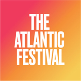
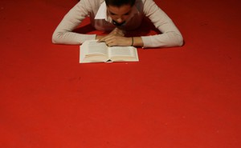
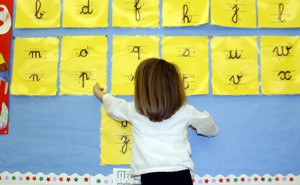
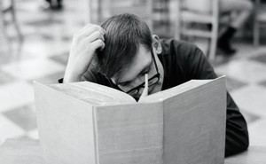

Why Some People Become Lifelong Readers

 [Education](https://www.theatlantic.com/education/)

# Why Some People Become Lifelong Readers

A lot rides on how parents present the activity to their kids.

[Joe Pinsker](https://www.theatlantic.com/author/joe-pinsker/)
  Sep 19, 2019

Chris J. Ratcliffe / Getty

They can be identified by their independent-bookstore tote bags, their “Book Lover” mugs, or—most reliably—by the bound, printed stacks of paper they flip through on their lap. They are, for lack of a more specific term, readers.

Joining their tribe seems simple enough: Get a book, read it, and voilà! You’re a reader—no tote bag necessary. But behind that simple process is a question of motivation—of why some people grow up to derive great pleasure from reading, while others don’t. That *why* is consequential—leisure reading has been linked to a range of good [academic](https://www.theguardian.com/books/booksblog/2013/sep/16/reading-improves-childrens-brains) and [professional](https://www.sciencedaily.com/releases/2011/05/110504150539.htm) outcomes—as well as difficult to fully explain. But a chief factor seems to be the household one is born into, and the culture of reading that parents create within it.

The can’t-miss event for Atlantic readers

See our journalism come to life at The Atlantic Festival, September 24-26 in Washington, D.C.

 

 [Buy Now](https://adclick.g.doubleclick.net/pcs/click%3Fxai%3DAKAOjsuhwB3HJTXQHUAeu1_fiK_1exCcgJ3quywJUPJe254J1utBKlGO9M5V6W-ocQu7AC6ENOAboBHESYyYoW8caiGTNQT7pdInnBj2yL0-iAJFIyzEK0i-L-H57cInVPo2O-a8G8lB6mmu_8rl7bvjErDEj63GljwHzCJ7RI3Nmc55ic9A3xRtzXtdyMTXilLEQ_1TjLe9qiH8pMr7xWLektT6xov1IbbDrLWbYLoBo8_CujCVN8H0k1Qio6MABwXUEp5REApkh20EKfQg2l86N3LuSvUpD0sarEwmYaI%26sig%3DCg0ArKJSzKdHC_Z0TunsEAE%26urlfix%3D1%26adurl%3Dhttps://www.theatlanticfestival.com/?utm_source=INJ-TAF-092419)

*[*[Read: The adults who treat reading like homework](https://www.theatlantic.com/education/archive/2019/06/do-people-finish-their-goodreads-reading-challenges/591184/)*]*

The size of the American reading public varies depending on one’s definition of *reading*. In 2017, [about 53 percent](https://www.arts.gov/sites/default/files/2017-sppapreviewREV-sept2018.pdf) of American adults (roughly 125 million people) read at least one book not for school or for work in the previous 12 months, according to the National Endowment for the Arts (NEA). Five years earlier, the NEA ran [a more detailed survey](https://www.arts.gov/sites/default/files/2012-sppa-feb2015.pdf), and found that 23 percent of American adults were “light” readers (finishing one to five titles per year), 10 percent were “moderate” (six to 11 titles), 13 percent were “frequent” (12 to 49 titles), and a dedicated 5 percent were “avid” (50 books and up).

## More Stories

-

 

###   [People Underestimate How Fun It Is to Do the Same Thing Twice](https://www.theatlantic.com/family/archive/2019/04/rereading-books-rewatching-movies-decisions/587416/)

 [Joe Pinsker](https://www.theatlantic.com/author/joe-pinsker/)

-

 

###   [Why American Students Haven't Gotten Better at Reading in 20 Years](https://www.theatlantic.com/education/archive/2018/04/-american-students-reading/557915/)

 [Natalie Wexler](https://www.theatlantic.com/author/natalie-wexler/)

-

 

###   [The Adults Who Treat Reading Like Homework](https://www.theatlantic.com/education/archive/2019/06/do-people-finish-their-goodreads-reading-challenges/591184/)

 [Julie Beck](https://www.theatlantic.com/author/julie-beck/)

-

 

###   [The Books of College Libraries Are Turning Into Wallpaper](https://www.theatlantic.com/ideas/archive/2019/05/college-students-arent-checking-out-books/590305/)

 [Dan Cohen](https://www.theatlantic.com/author/dan-cohen/)

Advertisement

“Every society has some group of people—somewhere between a minuscule amount and half the adults—that read a lot in their leisure time,” says Wendy Griswold, a sociologist at Northwestern University who studies reading. Griswold refers to this group as [“the reading class,”](https://www.press.uchicago.edu/ucp/books/book/chicago/R/bo5568025.html) and—adding up the NEA’s “frequents” and “avids,” and considering rates of serious reading in other similarly wealthy countries—reckons that about 20 percent of adults belong to the U.S.’s reading class. She said that a larger proportion of the American population qualified as big readers between the mid-19th and mid-20th centuries—an era of reading that was made possible by advances in printing technology and then, eventually, snuffed out by television.

Some people are much more likely than others to become members of the reading class. “The patterns are [very, very predictable](https://www.arts.gov/sites/default/files/ADP18-DemographicTables.xlsx),” Griswold told me. First, and most intuitively, the more education someone has, the more likely they are to be a reader. Beyond that, she said, “urban people read more than rural people,” “affluence is associated with reading,” and “young girls read earlier” than boys do and “continue to read more in adulthood.” Race matters, too: The NEA’s data indicate that 60 percent of white American adults reported reading a book in the last year outside of work or school, which was a higher rate than for African Americans (47 percent), Asians (45 percent), and Hispanic people (32 percent). (Some of these correlations could simply reflect the strong connection between education and reading.)

Of course, possessing any of these characteristics doesn’t guarantee that someone will or won’t become a reader. Personality also seems to play a role. “Introverts seem to be [a little bit more likely](https://journals.sagepub.com/doi/abs/10.1177/009365097024005003) to do a lot of leisure-time reading,” Daniel Willingham, a professor of psychology at the University of Virginia, told me.

Willingham also talked about the importance, which many researchers have examined, of the number of books in one’s childhood home. Studies looking at “family scholarly culture” have found that children who grew up surrounded by books tend [to attain higher levels of education](https://www.sciencedirect.com/science/article/pii/S0276562410000090) and [to be better readers](https://www.sciencedirect.com/science/article/pii/S0049089X18300607) than those who didn’t, even after controlling for their parents’ education.

The mere presence of books is not magically transformative. “The question is, I take a child who’s not doing very well in school, and I put 300 books in their house—now what happens?,” Willingham said. “Almost certainly the answer is, not a lot. So what is it? Either what are people doing with those books, or is this sort of a temperature read of a much broader complex of attitudes and behaviors and priorities that you find in that home?”

It is almost tautological to observe that being a reader sets a child up for academic success, since so much of school is reading. And that means-to-an-end argument in support of reading says nothing of the many joys it can bring. But even though plenty of people simply don’t enjoy reading (or have trouble enjoying it, possibly because of a learning or attention disorder), it’s a vital skill. It may be dispiriting that people have little, if any, say over many of the predictors of whether they or their children will be readers, but thankfully, there are also a number of other factors that are within people’s control.

Advertisement

Advertisement

As Willingham explains in his book [*Raising Kids Who Read*](http://www.wiley.com/WileyCDA/WileyTitle/productCd-1118769724.html), three variables have a lot of influence over whether someone becomes a lifelong reader. First, a child needs to be a “fluent decoder,” he told me—that is, able to smoothly “go from print on the page to words in the mind.” This is something that schools teach, but parents can help with it by reading to and with their kids—especially when that reading involves wordplay, which particularly helps kids with the challenge of identifying the “individual speech sounds” that make up a word.

Second, Willingham said, these fluent decoders benefit from having wide-ranging background knowledge about the world. “The main predictor of whether a child or an adult understands a text is [how much](https://www.theatlantic.com/education/archive/2018/04/-american-students-reading/557915/)[they already know](https://www.theatlantic.com/education/archive/2018/04/-american-students-reading/557915/)[about the topic](https://www.theatlantic.com/education/archive/2018/04/-american-students-reading/557915/),” Willingham noted. So parents can try to arm their kids with information about the world that will help them interpret whatever they come across in print, or make sure their kids have some familiarity with whatever it is they’re reading about.

Once those two things are in place, the final component is “motivation—you have to have a positive attitude toward reading and a positive self-image as a reader,” Willingham said.

That third ingredient is a central focus of [*How to Raise a Reader*](https://www.workman.com/products/how-to-raise-a-reader-1), a book released earlier this month by Pamela Paul and Maria Russo, the editor and the children’s-books editor, respectively, of *The New York Times Book Review*. “So many parents are stressed out by [all the](https://www.sciencedirect.com/science/article/pii/S0885200617301795)  [research out there](https://journals.sagepub.com/doi/10.1177/0961000610390992) that says that reading is tied to things like academic success, testing success, executive function, and emotional well-being,” Paul told me. “Knowing all of that makes parents think, ‘Okay, my kid *has* to be a reader.’” That mentality can lead them to frame reading to their children as an obligation. “Kids basically perceive that right off the bat—children know, for example, if you’re trying to get them to eat something that’s good for them,” Paul said; the aim is to present reading not as “spinach,” but as “chocolate cake.”

Reading will seem more like chocolate cake if it’s something that parents themselves take part in happily and regularly. “When I’m sitting there on my couch, reading a book, and my kids are doing their own thing, I like to think, ‘I’m parenting right now—they can see me reading this book,’” Russo told me. Similarly, Paul said that if “right after dinner, the first thing you do is scroll through your phone, open up your laptop, or watch TV,” kids are likely to take note. Parents are constantly sending their children messages with how they choose to spend their free time.

Parents don’t have to have grown up avid readers themselves to raise avid readers. Paul and Russo both suggested a bunch of things that parents can do to make reading seem exciting and worthwhile: talk about books during meals or car rides, indicating that they’re just as compelling a subject of conversation as the day’s events; make regular stops at libraries and bookstores, and stay a while; and give books as birthday gifts.

Advertisement

Paul also advised that parents seed books throughout the house, not stash them “preciously in your own bedroom, away from everyone else, or in one [specific] area of the house.” It may seem expensive to assemble a large home library, but Paul points out that it’s cheap to buy used books and free to borrow lots of them. “You don’t need a lot of money to fill your home with books … [and] it’s very hard to have a bored child when there are always books around,” she said.

At one point in our interview, Russo referred to reading as a “private pleasure-delivery system,” which seems like a key way to think about getting kids to read: There are, as so many parents are all too aware, loads of benefits to being able to read in terms of later-in-life outcomes, but the focus should be on helping kids discover the intrinsic value in it, in the moment. After that, other good things will come.

**We want to hear what you think about this article. [Submit a letter](https://www.theatlantic.com/contact/letters/) to the editor or write to letters@theatlantic.com.**

 [Joe Pinsker](https://www.theatlantic.com/author/joe-pinsker/) is a staff writer at *The Atlantic, *where he covers families and education.

[  Twitter](https://twitter.com/jpinsk)