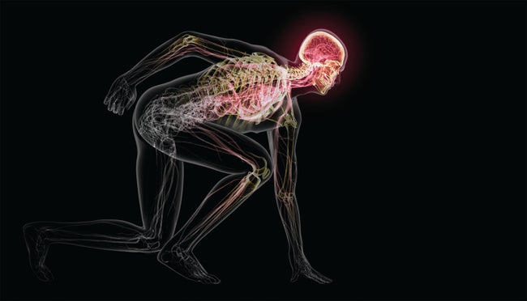
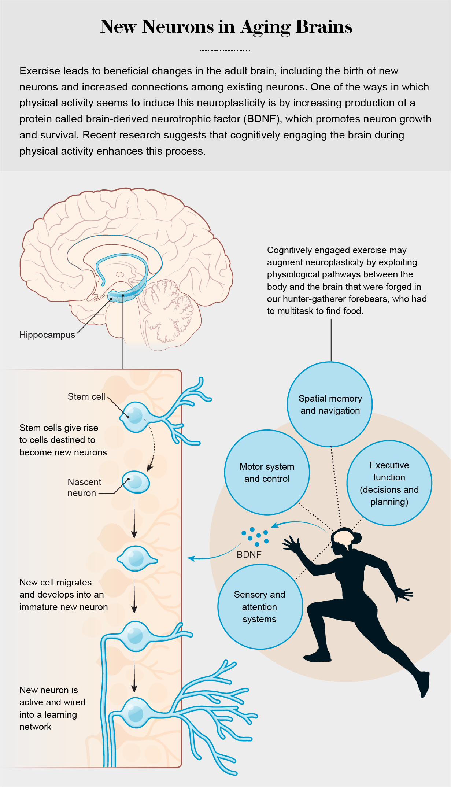
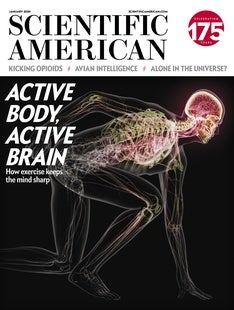

Why Your Brain Needs Exercise - Scientific American

Credit: Bryan Christie Design

# Why Your Brain Needs Exercise

The evolutionary history of humans explains why physical activity is important for brain health

[facebookShare on Facebook](https://www.scientificamerican.com/article/why-your-brain-needs-exercise/#)[Share on Twitter](https://www.scientificamerican.com/article/why-your-brain-needs-exercise/#)[Share via Email](https://www.scientificamerican.com/email-this-article/?contentid=3C438A58-AF71-4B1B-B693C851A3337E0B)

January 1, 2020

#### AUTHORS

**[David A. Raichlen](https://www.scientificamerican.com/author/david-a-raichlen/)** is a professor of biological sciences and director of the evolutionary biology of exercise laboratory at the University of Southern California. His research focuses on the biomechanics and physiology of exercise from an evolutionary perspective.* Credit: Nick Higgins*

**[Gene E. Alexander](https://www.scientificamerican.com/author/gene-e-alexander/)** is a professor of psychology and psychiatry and director of the brain imaging, behavior and aging laboratory at the University of Arizona. He studies the aging brain in both healthy adults and those suffering from neurodegenerative disease.* Credit: Nick Higgins*

### In Brief

- **It is by now well established that exercise **has positive effects on the brain, especially as we age.
- **Less clear has been why physical activity** affects the brain in the first place.
- **Key events in the evolutionary history** of humans may have forged the link between exercise and brain function.
- **Cognitively challenging exercise may benefit** the brain more than physical activity that makes fewer cognitive demands.

In the 1990s researchers announced a series of discoveries that would upend a bedrock tenet of neuroscience. For decades the mature brain was understood to be incapable of growing new neurons. Once an individual reached adulthood, the thinking went, the brain began losing neurons rather than gaining them. But evidence was building that the adult brain could, in fact, generate new neurons. In one particularly striking experiment with mice, scientists found that simply running on a wheel led to the birth of new neurons in the hippocampus, a brain structure that is associated with memory. Since then, other studies have established that exercise also has positive effects on the brains of humans, especially as we age, and that it may even help reduce the risk of Alzheimer’s disease and other neurodegenerative conditions. But the research raised a key question: Why does exercise affect the brain at all?

Physical activity improves the function of many organ systems in the body, but the effects are usually linked to better athletic performance. For example, when you walk or run, your muscles demand more oxygen, and over time your cardiovascular system responds by increasing the size of the heart and building new blood vessels. The cardiovascular changes are primarily a response to the physical challenges of exercise, which can enhance endurance. But what challenge elicits a response from the brain?

Answering this question requires that we rethink our views of exercise. People often consider walking and running to be activities that the body is able to perform on autopilot. But research carried out over the past decade by us and others would indicate that this folk wisdom is wrong. Instead exercise seems to be as much a cognitive activity as a physical one. In fact, this link between physical activity and brain health may trace back millions of years to the origin of hallmark traits of humankind. If we can better understand why and how exercise engages the brain, perhaps we can leverage the relevant physiological pathways to design novel exercise routines that will boost people’s cognition as they age—work that we have begun to undertake.

Advertisement

## Flexing the Brain

To explore why exercise benefits the brain, we need to first consider which aspects of brain structure and cognition seem most responsive to it. When researchers at the Salk Institute for Biological Studies in La Jolla, Calif., led by Fred Gage and Henriette Van Praag, showed in the 1990s that running increased the birth of new hippocampal neurons in mice, they noted that this process appeared to be tied to the production of a protein called brain-derived neurotrophic factor (BDNF). BDNF is produced throughout the body and in the brain, and it promotes both the growth and the survival of nascent neurons. The Salk group and others went on to demonstrate that exercise-induced neurogenesis is associated with improved performance on memory-related tasks in rodents. The results of these studies were striking because atrophy of the hippocampus is widely linked to memory difficulties during healthy human aging and occurs to a greater extent in individuals with neurodegenerative diseases such as Alzheimer’s. The findings in rodents provided an initial glimpse of how exercise could counter this decline.

Following up on this work in animals, researchers carried out a series of investigations that determined that in humans, just like in rodents, aerobic exercise leads to the production of BDNF and augments the structure—that is, the size and connectivity—of key areas of the brain, including the hippocampus. In a randomized trial conducted at the University of Illinois at Urbana-Champaign by Kirk Erickson and Arthur Kramer, 12 months of aerobic exercise led to an increase in BDNF levels, an increase in the size of the hippocampus and improvements in memory in older adults.

Other investigators have found associations between exercise and the hippocampus in a variety of observational studies. In our own study of more than 7,000 middle-aged to older adults in the U.K., published in 2019 in *Brain Imaging and Behavior*, we demonstrated that people who spent more time engaged in moderate to vigorous physical activity had larger hippocampal volumes. Although it is not yet possible to say whether these effects in humans are related to neurogenesis or other forms of brain plasticity, such as increasing connections among existing neurons, together the results clearly indicate that exercise can benefit the brain’s hippocampus and its cognitive functions.

Researchers have also documented clear links between aerobic exercise and benefits to other parts of the brain, including expansion of the prefrontal cortex, which sits just behind the forehead. Such augmentation of this region has been tied to sharper executive cognitive functions, which involve aspects of planning, decision-making and multitasking—abilities that, like memory, tend to decline with healthy aging and are further degraded in the presence of Alzheimer’s. Scientists suspect that increased connections between existing neurons, rather than the birth of new neurons, are responsible for the beneficial effects of exercise on the prefrontal cortex and other brain regions outside the hippocampus.

## Upright and Active

With mounting evidence that aerobic exercise can boost brain health, especially in older adults, the next step was to figure out exactly what cognitive challenges physical activity poses that trigger this adaptive response. We began to think that examining the evolutionary relation between the brain and the body might be a good place to start. Hominins (the group that includes modern humans and our close extinct relatives) split from the lineage leading to our closest living relatives, chimpanzees and bonobos, between six million and seven million years ago. In that time, hominins evolved a number of anatomical and behavioral adaptations that distinguish us from other primates. We think two of these evolutionary changes in particular bound exercise to brain function in ways that people can make use of today.

Advertisement

Credit: Tami Tolpa

First, our ancestors shifted from walking on all fours to walking upright on just their hind legs. This bipedal posture means that there are times when our bodies are precariously balanced over one foot rather than two or more limbs like in other apes. To accomplish this task, our brains must coordinate a great deal of information and, in the process, make adjustments to muscle activity throughout the body to maintain our balance. While coordinating these actions, we must also watch out for any environmental obstacles. In other words, simply because we are bipedal, our brains may be more cognitively challenged than those of our quadrupedal ancestors.

Second, the hominin way of life changed to incorporate higher levels of aerobic activity. Fossil evidence indicates that in the early stages of human evolution, our ancestors were probably relatively sedentary bipedal apes who ate mainly plants. By some two million years ago, however, as habitats dried out under a cooling climate, at least one group of ancestral humans began to forage in a new way, hunting animals and gathering plant foods. Hunting and gathering dominated human subsistence strategies for nearly two million years until the advent of farming and herding around 10,000 years ago. With Herman Pontzer of Duke University and Brian Wood of the University of California, Los Angeles, we have shown that because of the long distances traversed in search of food, hunting and gathering involves much more aerobic activity than seen in other apes.

Increased demands on the brain accompanied this shift toward a more physically active routine. When out foraging afar, hunter-gatherers must survey their surroundings to make sure they know where they are. This kind of spatial navigation relies on the hippocampus, the same brain region that benefits from exercise and that tends to atrophy as we get older. In addition, they have to scan the landscape for signs of food, using sensory information from their visual and auditory systems. They must remember where they have been before and when certain kinds of food were available. The brain uses this information from both short- and long-term memory, allowing people to make decisions and plan their routes—cognitive tasks that are supported by the hippocampus and the prefrontal cortex, among other regions. Hunter-gatherers also often forage in groups, in which case they may have conversations while their brains are maintaining their balance and keeping them spatially located in their environment. All of this multitasking is controlled, in part, by the prefrontal cortex, which also tends to diminish with age.

Although any foraging animal must navigate and figure out where to find food, hunter-gatherers have to perform these functions during fast-paced treks that can extend over more than 20 kilometers. At high speeds, multitasking becomes even more difficult and requires faster information processing. From an evolutionary perspective, it would make sense to have a brain ready to respond to an array of challenges during and after foraging to maximize the chances of success in finding food. But the physiological resources required to build and maintain such a brain—including those that support the birth and survival of new neurons—cost the body energy, meaning that if we do not regularly make use of this system, we are likely to lose these benefits.

This evolutionary neuroscience perspective on exercise and the brain, which we detailed in an article published in 2017 in *Trends in Neurosciences*, has profound implications for humans today. In our modern society, we do not need to engage in aerobic physical activity to find food for survival. The brain atrophy and attendant cognitive declines that commonly occur during aging may be partly related to our sedentary habits.

Ad

[](https://googleads.g.doubleclick.net/aclk?sa=l&ai=Crv99vIgDXuj9KcOVgAfQoZDACerW1-Rav96isvcHwI23ARABIJbzylJgu76ug9AKoAGE6JuTA8gBAakCyvCSFMsqtj7gAgCoAwHIA5sEqgSVAk_Qsb4c9PHGGMDrA1f30qgkIu-xnN_IpsT0d3GWBWrLZgTSY9VifvqqCotigfbSJCXrFUpdNcjpGpQyMAG4jkULt0AtqWKSWvqloRi_mJk4_3X3XHjd7wJ9A0_YGob9KKvUME8Q_Ov1PG6eV7IUyonPQEN2iKECfUvKTypbPPs6bGMwrIb8ZMHLuR0gZk68JFDeVwa2bNrGjYDDGfGUbZvKDDQ1T5OsEgvQcbcmopnKhtu6eCcYmRbjqCLZ3-0EzGdjuZkdfmDaNw4vHDYtr9CQiHWOU4xBHbCGTw-z_eRtCHO50DqOgKARknchceDfPu7n0G0txKBNRkiUKgV_yIgXSjoj_2o8gO7j19-9XVArhdK4uGjABIzA4vSwAeAEAaAGUYAH5JfkbKgHjs4bqAfVyRuoB5PYG6gHugaoB_LZG6gHpr4bqAfs1RuoB_PRG6gH7NUb2AcB0ggJCIzjgBAQARgdsQnvguj3mCABMoAKA8gLAdgTAogUBA&ae=1&num=1&sig=AOD64_3MECCl4p-mRj3hqZoYsjO_0YbH8g&client=ca-pub-1276375982453943&adurl=http://www.surge.co.uk%3Fgclid%3DEAIaIQobChMI6MvE6ZbR5gIVwwrgCh3QEASYEAEYASAAEgJqovD_BwE)

[Leading EMS Personal Training](https://googleads.g.doubleclick.net/aclk?sa=l&ai=Crv99vIgDXuj9KcOVgAfQoZDACerW1-Rav96isvcHwI23ARABIJbzylJgu76ug9AKoAGE6JuTA8gBAakCyvCSFMsqtj7gAgCoAwHIA5sEqgSVAk_Qsb4c9PHGGMDrA1f30qgkIu-xnN_IpsT0d3GWBWrLZgTSY9VifvqqCotigfbSJCXrFUpdNcjpGpQyMAG4jkULt0AtqWKSWvqloRi_mJk4_3X3XHjd7wJ9A0_YGob9KKvUME8Q_Ov1PG6eV7IUyonPQEN2iKECfUvKTypbPPs6bGMwrIb8ZMHLuR0gZk68JFDeVwa2bNrGjYDDGfGUbZvKDDQ1T5OsEgvQcbcmopnKhtu6eCcYmRbjqCLZ3-0EzGdjuZkdfmDaNw4vHDYtr9CQiHWOU4xBHbCGTw-z_eRtCHO50DqOgKARknchceDfPu7n0G0txKBNRkiUKgV_yIgXSjoj_2o8gO7j19-9XVArhdK4uGjABIzA4vSwAeAEAaAGUYAH5JfkbKgHjs4bqAfVyRuoB5PYG6gHugaoB_LZG6gHpr4bqAfs1RuoB_PRG6gH7NUb2AcB0ggJCIzjgBAQARgdsQnvguj3mCABMoAKA8gLAdgTAogUBA&ae=1&num=1&sig=AOD64_3MECCl4p-mRj3hqZoYsjO_0YbH8g&client=ca-pub-1276375982453943&adurl=http://www.surge.co.uk%3Fgclid%3DEAIaIQobChMI6MvE6ZbR5gIVwwrgCh3QEASYEAEYASAAEgJqovD_BwE)

[EMS Provides A Total Body Workout Tailored To Your Ability And Fitness Goals.](https://googleads.g.doubleclick.net/aclk?sa=l&ai=Crv99vIgDXuj9KcOVgAfQoZDACerW1-Rav96isvcHwI23ARABIJbzylJgu76ug9AKoAGE6JuTA8gBAakCyvCSFMsqtj7gAgCoAwHIA5sEqgSVAk_Qsb4c9PHGGMDrA1f30qgkIu-xnN_IpsT0d3GWBWrLZgTSY9VifvqqCotigfbSJCXrFUpdNcjpGpQyMAG4jkULt0AtqWKSWvqloRi_mJk4_3X3XHjd7wJ9A0_YGob9KKvUME8Q_Ov1PG6eV7IUyonPQEN2iKECfUvKTypbPPs6bGMwrIb8ZMHLuR0gZk68JFDeVwa2bNrGjYDDGfGUbZvKDDQ1T5OsEgvQcbcmopnKhtu6eCcYmRbjqCLZ3-0EzGdjuZkdfmDaNw4vHDYtr9CQiHWOU4xBHbCGTw-z_eRtCHO50DqOgKARknchceDfPu7n0G0txKBNRkiUKgV_yIgXSjoj_2o8gO7j19-9XVArhdK4uGjABIzA4vSwAeAEAaAGUYAH5JfkbKgHjs4bqAfVyRuoB5PYG6gHugaoB_LZG6gHpr4bqAfs1RuoB_PRG6gH7NUb2AcB0ggJCIzjgBAQARgdsQnvguj3mCABMoAKA8gLAdgTAogUBA&ae=1&num=1&sig=AOD64_3MECCl4p-mRj3hqZoYsjO_0YbH8g&client=ca-pub-1276375982453943&adurl=http://www.surge.co.uk%3Fgclid%3DEAIaIQobChMI6MvE6ZbR5gIVwwrgCh3QEASYEAEYASAAEgJqovD_BwE)

[](https://googleads.g.doubleclick.net/aclk?sa=l&ai=Crv99vIgDXuj9KcOVgAfQoZDACerW1-Rav96isvcHwI23ARABIJbzylJgu76ug9AKoAGE6JuTA8gBAakCyvCSFMsqtj7gAgCoAwHIA5sEqgSVAk_Qsb4c9PHGGMDrA1f30qgkIu-xnN_IpsT0d3GWBWrLZgTSY9VifvqqCotigfbSJCXrFUpdNcjpGpQyMAG4jkULt0AtqWKSWvqloRi_mJk4_3X3XHjd7wJ9A0_YGob9KKvUME8Q_Ov1PG6eV7IUyonPQEN2iKECfUvKTypbPPs6bGMwrIb8ZMHLuR0gZk68JFDeVwa2bNrGjYDDGfGUbZvKDDQ1T5OsEgvQcbcmopnKhtu6eCcYmRbjqCLZ3-0EzGdjuZkdfmDaNw4vHDYtr9CQiHWOU4xBHbCGTw-z_eRtCHO50DqOgKARknchceDfPu7n0G0txKBNRkiUKgV_yIgXSjoj_2o8gO7j19-9XVArhdK4uGjABIzA4vSwAeAEAaAGUYAH5JfkbKgHjs4bqAfVyRuoB5PYG6gHugaoB_LZG6gHpr4bqAfs1RuoB_PRG6gH7NUb2AcB0ggJCIzjgBAQARgdsQnvguj3mCABMoAKA8gLAdgTAogUBA&ae=1&num=1&sig=AOD64_3MECCl4p-mRj3hqZoYsjO_0YbH8g&client=ca-pub-1276375982453943&adurl=http://www.surge.co.uk%3Fgclid%3DEAIaIQobChMI6MvE6ZbR5gIVwwrgCh3QEASYEAEYASAAEgJqovD_BwE)

[surge.co.uk](https://googleads.g.doubleclick.net/aclk?sa=l&ai=Crv99vIgDXuj9KcOVgAfQoZDACerW1-Rav96isvcHwI23ARABIJbzylJgu76ug9AKoAGE6JuTA8gBAakCyvCSFMsqtj7gAgCoAwHIA5sEqgSVAk_Qsb4c9PHGGMDrA1f30qgkIu-xnN_IpsT0d3GWBWrLZgTSY9VifvqqCotigfbSJCXrFUpdNcjpGpQyMAG4jkULt0AtqWKSWvqloRi_mJk4_3X3XHjd7wJ9A0_YGob9KKvUME8Q_Ov1PG6eV7IUyonPQEN2iKECfUvKTypbPPs6bGMwrIb8ZMHLuR0gZk68JFDeVwa2bNrGjYDDGfGUbZvKDDQ1T5OsEgvQcbcmopnKhtu6eCcYmRbjqCLZ3-0EzGdjuZkdfmDaNw4vHDYtr9CQiHWOU4xBHbCGTw-z_eRtCHO50DqOgKARknchceDfPu7n0G0txKBNRkiUKgV_yIgXSjoj_2o8gO7j19-9XVArhdK4uGjABIzA4vSwAeAEAaAGUYAH5JfkbKgHjs4bqAfVyRuoB5PYG6gHugaoB_LZG6gHpr4bqAfs1RuoB_PRG6gH7NUb2AcB0ggJCIzjgBAQARgdsQnvguj3mCABMoAKA8gLAdgTAogUBA&ae=1&num=1&sig=AOD64_3MECCl4p-mRj3hqZoYsjO_0YbH8g&client=ca-pub-1276375982453943&adurl=http://www.surge.co.uk%3Fgclid%3DEAIaIQobChMI6MvE6ZbR5gIVwwrgCh3QEASYEAEYASAAEgJqovD_BwE)

[Visit Site](https://googleads.g.doubleclick.net/aclk?sa=l&ai=Crv99vIgDXuj9KcOVgAfQoZDACerW1-Rav96isvcHwI23ARABIJbzylJgu76ug9AKoAGE6JuTA8gBAakCyvCSFMsqtj7gAgCoAwHIA5sEqgSVAk_Qsb4c9PHGGMDrA1f30qgkIu-xnN_IpsT0d3GWBWrLZgTSY9VifvqqCotigfbSJCXrFUpdNcjpGpQyMAG4jkULt0AtqWKSWvqloRi_mJk4_3X3XHjd7wJ9A0_YGob9KKvUME8Q_Ov1PG6eV7IUyonPQEN2iKECfUvKTypbPPs6bGMwrIb8ZMHLuR0gZk68JFDeVwa2bNrGjYDDGfGUbZvKDDQ1T5OsEgvQcbcmopnKhtu6eCcYmRbjqCLZ3-0EzGdjuZkdfmDaNw4vHDYtr9CQiHWOU4xBHbCGTw-z_eRtCHO50DqOgKARknchceDfPu7n0G0txKBNRkiUKgV_yIgXSjoj_2o8gO7j19-9XVArhdK4uGjABIzA4vSwAeAEAaAGUYAH5JfkbKgHjs4bqAfVyRuoB5PYG6gHugaoB_LZG6gHpr4bqAfs1RuoB_PRG6gH7NUb2AcB0ggJCIzjgBAQARgdsQnvguj3mCABMoAKA8gLAdgTAogUBA&ae=1&num=1&sig=AOD64_3MECCl4p-mRj3hqZoYsjO_0YbH8g&client=ca-pub-1276375982453943&adurl=http://www.surge.co.uk%3Fgclid%3DEAIaIQobChMI6MvE6ZbR5gIVwwrgCh3QEASYEAEYASAAEgJqovD_BwE)

Advertisement

But simply exercising more may not realize the full potential of physical activity for keeping brain decline at bay. Indeed, our model suggests that even people who already get a lot of aerobic activity may want to rethink their routines. It is possible that we might not always exercise in ways that take full advantage of our evolved mechanisms for sustaining brain performance.

Credit: Tami Tolpa

Think about the ways in which many of us get our aerobic exercise. Often we go to gyms and use a stationary exercise machine; the most cognitively demanding task in such a workout might be deciding what channel to watch on the built-in television. What is more, these machines remove some of the demands of maintaining balance and adjusting speed, among many other intrinsic cognitive challenges of movement through a changing environment.

What if this form of exercise is shortchanging us? Our ancestors evolved in an unpredictable world. What if we could modify our exercise routines to include cognitive challenges like those faced by our hunter-gatherer forebears? If we can augment the effects of exercise by including a cognitively demanding activity, then perhaps we can increase the efficacy of exercise regimens aimed at boosting cognition during aging and potentially even alter the course of neurodegenerative diseases such as Alzheimer’s.

## Move and Think

In fact, a growing body of research suggests that exercise that is cognitively stimulating may indeed benefit the brain more than exercise that does not make such cognitive demands. For example, Gerd Kempermann and his colleagues at the Center for Regenerative Therapies Dresden in Germany explored this possibility by comparing the growth and survival of new neurons in the mouse hippocampus after exercise alone or after exercise combined with access to a cognitively enriched environment. They found an additive effect: exercise alone was good for the hippocampus, but combining physical activity with cognitive demands in a stimulating environment was even better, leading to even more new neurons. Using the brain during and after exercise seemed to trigger enhanced neuron survival.

We and others have recently begun to extend these studies from animals to humans—with encouraging results. For example, researchers have been exploring combining exercise and cognitive challenges in individuals experiencing notable cognitive decline. Cay Anderson-Hanley of Union College in Schenectady, N.Y., has tested simultaneous exercise and cognitive interventions in people with mild cognitive impairment, a condition associated with increased risk for Alzheimer’s. More work certainly needs to be done in populations such as this one before we can draw any firm conclusions, but the results so far suggest that people who are already experiencing some cognitive decline may benefit from exercising while playing a mentally demanding video game. In studies of healthy adults, Anderson-Hanley and her colleagues have also shown that simultaneously exercising and playing a cognitive challenging video game may elicit a greater increase in circulating BDNF than exercise alone. These findings further bolster the idea that BDNF is instrumental in bringing about exercise-induced brain benefits.

Advertisement

In our own work, we have developed a game designed to specifically challenge aspects of cognition that tend to decline with age and that are probably needed during foraging. In the game, players spatially navigate and complete attention and memory tasks while cycling at a moderate aerobic intensity level. To evaluate the potential of this approach to boost cognitive performance in healthy older adults, we are comparing a group exercising while playing the game with a group exercising without the game, a group playing the game without exercising, and a control group that only watches nature videos. The results to date are promising.

Many other research groups are testing combinations of exercise and cognitive tasks. In the near future, we will probably have a better idea of how best to deploy them to support and enhance cognition in both healthy individuals and those experiencing disease-related cognitive decline.

In addition to specially designed interventions similar to the ones described here, it is possible that participation in sports that require combinations of cognitive and aerobic tasks may be a way to activate these brain benefits. For example, we recently showed that collegiate cross-country runners who train extensively on outdoor trails have increased connectivity among brain regions associated with executive cognitive functions compared with healthy but more sedentary young adults. Future work will help us understand whether these benefits are also greater than those seen in runners who train in less complex settings—on a treadmill, for instance.

Much remains to be discovered. Although it is still too early to make specific prescriptions for combining exercise and cognitive tasks, we can say with certainty that exercise is a key player in preserving brain function as we age. The U.S. Department of Health and Human Services guidelines suggest that people should engage in aerobic exercise for at least 150 minutes a week at a moderate intensity or at least 75 minutes a week at a vigorous intensity (or an equivalent combination of the two). Meeting or exceeding these exercise recommendations is good for the body and may improve brain health.

Clinical trials will tell us much more about the efficacy of cognitively engaged exercise—what kinds of mental and physical activities are most impactful, for example, and the optimal intensity and duration of exercise for augmenting cognition. But in light of the evidence we have so far, we believe that with continued careful research we can target physiological pathways linking the brain and the body and exploit our brain’s evolved adaptive capacity for exercise-induced plasticity during aging. In the end, working out both the body and the brain during exercise may help keep the mind sharp for life.

Ad

[](https://googleads.g.doubleclick.net/aclk?sa=l&ai=CeUb9WskDXpn7FYHg7gOEv4_4BOrW1-Rav96isvcHwI23ARABIJbzylJgu76ug9AKoAGE6JuTA8gBAakClnXkHLKYtT7gAgCoAwHIA5sEqgSPAk_QId7ViOZc8xiXh9ELcu-NBc5NMrJ4yXr0V_Mt-QihUIZlSGouWBlCxw3SnTmmDhFaEMBCIxRRCoNLvuktXOzFFDaTHZO4zqBbDIwjXuIKaZPzvdfAcAnEVQbtCTCWfjqpmaBnliDyLqCQHZppktbZ1oSt10mtzeUJX6XshwLuaoIXi3OMkquSq0u5V6da4HSh3-B_FIoGQlVmyAwLIU8cgNWTD2eKZoCU10ZbOv3R-s7YaNsLIC2YuEQbz2zX7cO2bYWcfU1UwZgnP_Pa8Bh8FicpoizvqXwRqpQLGInoOxkxWGvfDU6S3pufYlOWQI9Le88HCICQMADyMmYNb-8bZD9ELtcacPyDShNVBOvABIzA4vSwAeAEAaAGUYAH5JfkbKgHjs4bqAfVyRuoB5PYG6gHugaoB_LZG6gHpr4bqAfs1RuoB_PRG6gH7NUb2AcB0ggJCIzjgBAQARgdsQnvguj3mCABMoAKA8gLAdgTAogUBA&ae=1&num=1&sig=AOD64_0x8dUyEcgx-SMbaCNs3TgFegSQcQ&client=ca-pub-1276375982453943&adurl=http://www.surge.co.uk%3Fgclid%3DEAIaIQobChMImZCcudTR5gIVAbB7Ch2E3wNPEAEYASAAEgLB4PD_BwE)

[Leading EMS Personal Training](https://googleads.g.doubleclick.net/aclk?sa=l&ai=CeUb9WskDXpn7FYHg7gOEv4_4BOrW1-Rav96isvcHwI23ARABIJbzylJgu76ug9AKoAGE6JuTA8gBAakClnXkHLKYtT7gAgCoAwHIA5sEqgSPAk_QId7ViOZc8xiXh9ELcu-NBc5NMrJ4yXr0V_Mt-QihUIZlSGouWBlCxw3SnTmmDhFaEMBCIxRRCoNLvuktXOzFFDaTHZO4zqBbDIwjXuIKaZPzvdfAcAnEVQbtCTCWfjqpmaBnliDyLqCQHZppktbZ1oSt10mtzeUJX6XshwLuaoIXi3OMkquSq0u5V6da4HSh3-B_FIoGQlVmyAwLIU8cgNWTD2eKZoCU10ZbOv3R-s7YaNsLIC2YuEQbz2zX7cO2bYWcfU1UwZgnP_Pa8Bh8FicpoizvqXwRqpQLGInoOxkxWGvfDU6S3pufYlOWQI9Le88HCICQMADyMmYNb-8bZD9ELtcacPyDShNVBOvABIzA4vSwAeAEAaAGUYAH5JfkbKgHjs4bqAfVyRuoB5PYG6gHugaoB_LZG6gHpr4bqAfs1RuoB_PRG6gH7NUb2AcB0ggJCIzjgBAQARgdsQnvguj3mCABMoAKA8gLAdgTAogUBA&ae=1&num=1&sig=AOD64_0x8dUyEcgx-SMbaCNs3TgFegSQcQ&client=ca-pub-1276375982453943&adurl=http://www.surge.co.uk%3Fgclid%3DEAIaIQobChMImZCcudTR5gIVAbB7Ch2E3wNPEAEYASAAEgLB4PD_BwE)

[EMS Provides A Total Body Workout Tailored To Your Ability And Fitness Goals.](https://googleads.g.doubleclick.net/aclk?sa=l&ai=CeUb9WskDXpn7FYHg7gOEv4_4BOrW1-Rav96isvcHwI23ARABIJbzylJgu76ug9AKoAGE6JuTA8gBAakClnXkHLKYtT7gAgCoAwHIA5sEqgSPAk_QId7ViOZc8xiXh9ELcu-NBc5NMrJ4yXr0V_Mt-QihUIZlSGouWBlCxw3SnTmmDhFaEMBCIxRRCoNLvuktXOzFFDaTHZO4zqBbDIwjXuIKaZPzvdfAcAnEVQbtCTCWfjqpmaBnliDyLqCQHZppktbZ1oSt10mtzeUJX6XshwLuaoIXi3OMkquSq0u5V6da4HSh3-B_FIoGQlVmyAwLIU8cgNWTD2eKZoCU10ZbOv3R-s7YaNsLIC2YuEQbz2zX7cO2bYWcfU1UwZgnP_Pa8Bh8FicpoizvqXwRqpQLGInoOxkxWGvfDU6S3pufYlOWQI9Le88HCICQMADyMmYNb-8bZD9ELtcacPyDShNVBOvABIzA4vSwAeAEAaAGUYAH5JfkbKgHjs4bqAfVyRuoB5PYG6gHugaoB_LZG6gHpr4bqAfs1RuoB_PRG6gH7NUb2AcB0ggJCIzjgBAQARgdsQnvguj3mCABMoAKA8gLAdgTAogUBA&ae=1&num=1&sig=AOD64_0x8dUyEcgx-SMbaCNs3TgFegSQcQ&client=ca-pub-1276375982453943&adurl=http://www.surge.co.uk%3Fgclid%3DEAIaIQobChMImZCcudTR5gIVAbB7Ch2E3wNPEAEYASAAEgLB4PD_BwE)

[](https://googleads.g.doubleclick.net/aclk?sa=l&ai=CeUb9WskDXpn7FYHg7gOEv4_4BOrW1-Rav96isvcHwI23ARABIJbzylJgu76ug9AKoAGE6JuTA8gBAakClnXkHLKYtT7gAgCoAwHIA5sEqgSPAk_QId7ViOZc8xiXh9ELcu-NBc5NMrJ4yXr0V_Mt-QihUIZlSGouWBlCxw3SnTmmDhFaEMBCIxRRCoNLvuktXOzFFDaTHZO4zqBbDIwjXuIKaZPzvdfAcAnEVQbtCTCWfjqpmaBnliDyLqCQHZppktbZ1oSt10mtzeUJX6XshwLuaoIXi3OMkquSq0u5V6da4HSh3-B_FIoGQlVmyAwLIU8cgNWTD2eKZoCU10ZbOv3R-s7YaNsLIC2YuEQbz2zX7cO2bYWcfU1UwZgnP_Pa8Bh8FicpoizvqXwRqpQLGInoOxkxWGvfDU6S3pufYlOWQI9Le88HCICQMADyMmYNb-8bZD9ELtcacPyDShNVBOvABIzA4vSwAeAEAaAGUYAH5JfkbKgHjs4bqAfVyRuoB5PYG6gHugaoB_LZG6gHpr4bqAfs1RuoB_PRG6gH7NUb2AcB0ggJCIzjgBAQARgdsQnvguj3mCABMoAKA8gLAdgTAogUBA&ae=1&num=1&sig=AOD64_0x8dUyEcgx-SMbaCNs3TgFegSQcQ&client=ca-pub-1276375982453943&adurl=http://www.surge.co.uk%3Fgclid%3DEAIaIQobChMImZCcudTR5gIVAbB7Ch2E3wNPEAEYASAAEgLB4PD_BwE)

[surge.co.uk](https://googleads.g.doubleclick.net/aclk?sa=l&ai=CeUb9WskDXpn7FYHg7gOEv4_4BOrW1-Rav96isvcHwI23ARABIJbzylJgu76ug9AKoAGE6JuTA8gBAakClnXkHLKYtT7gAgCoAwHIA5sEqgSPAk_QId7ViOZc8xiXh9ELcu-NBc5NMrJ4yXr0V_Mt-QihUIZlSGouWBlCxw3SnTmmDhFaEMBCIxRRCoNLvuktXOzFFDaTHZO4zqBbDIwjXuIKaZPzvdfAcAnEVQbtCTCWfjqpmaBnliDyLqCQHZppktbZ1oSt10mtzeUJX6XshwLuaoIXi3OMkquSq0u5V6da4HSh3-B_FIoGQlVmyAwLIU8cgNWTD2eKZoCU10ZbOv3R-s7YaNsLIC2YuEQbz2zX7cO2bYWcfU1UwZgnP_Pa8Bh8FicpoizvqXwRqpQLGInoOxkxWGvfDU6S3pufYlOWQI9Le88HCICQMADyMmYNb-8bZD9ELtcacPyDShNVBOvABIzA4vSwAeAEAaAGUYAH5JfkbKgHjs4bqAfVyRuoB5PYG6gHugaoB_LZG6gHpr4bqAfs1RuoB_PRG6gH7NUb2AcB0ggJCIzjgBAQARgdsQnvguj3mCABMoAKA8gLAdgTAogUBA&ae=1&num=1&sig=AOD64_0x8dUyEcgx-SMbaCNs3TgFegSQcQ&client=ca-pub-1276375982453943&adurl=http://www.surge.co.uk%3Fgclid%3DEAIaIQobChMImZCcudTR5gIVAbB7Ch2E3wNPEAEYASAAEgLB4PD_BwE)

[Visit Site](https://googleads.g.doubleclick.net/aclk?sa=l&ai=CeUb9WskDXpn7FYHg7gOEv4_4BOrW1-Rav96isvcHwI23ARABIJbzylJgu76ug9AKoAGE6JuTA8gBAakClnXkHLKYtT7gAgCoAwHIA5sEqgSPAk_QId7ViOZc8xiXh9ELcu-NBc5NMrJ4yXr0V_Mt-QihUIZlSGouWBlCxw3SnTmmDhFaEMBCIxRRCoNLvuktXOzFFDaTHZO4zqBbDIwjXuIKaZPzvdfAcAnEVQbtCTCWfjqpmaBnliDyLqCQHZppktbZ1oSt10mtzeUJX6XshwLuaoIXi3OMkquSq0u5V6da4HSh3-B_FIoGQlVmyAwLIU8cgNWTD2eKZoCU10ZbOv3R-s7YaNsLIC2YuEQbz2zX7cO2bYWcfU1UwZgnP_Pa8Bh8FicpoizvqXwRqpQLGInoOxkxWGvfDU6S3pufYlOWQI9Le88HCICQMADyMmYNb-8bZD9ELtcacPyDShNVBOvABIzA4vSwAeAEAaAGUYAH5JfkbKgHjs4bqAfVyRuoB5PYG6gHugaoB_LZG6gHpr4bqAfs1RuoB_PRG6gH7NUb2AcB0ggJCIzjgBAQARgdsQnvguj3mCABMoAKA8gLAdgTAogUBA&ae=1&num=1&sig=AOD64_0x8dUyEcgx-SMbaCNs3TgFegSQcQ&client=ca-pub-1276375982453943&adurl=http://www.surge.co.uk%3Fgclid%3DEAIaIQobChMImZCcudTR5gIVAbB7Ch2E3wNPEAEYASAAEgLB4PD_BwE)

Advertisement

This article was originally published with the title "Why Your Brain Needs Exercise" in Scientific American 322, 1, 26-31 (January 2020)

doi:10.1038/scientificamerican0120-26
[View This Issue](https://www.scientificamerican.com/magazine/sa/2020/01-01/)

### More to Explore

**Exercise, APOE Genotype, and the Evolution of the Human Lifespan.** David A. Raichlen and Gene E. Alexander in *Trends in Neurosciences*, Vol. 37, No. 5, pages 247–255; May 2014.

**Adaptive Capacity: An Evolutionary Neuroscience Model Linking Exercise, Cognition, and Brain Health.** David A. Raichlen and Gene E. Alexander in *Trends in Neurosciences*, Vol. 40, No. 7, pages 408–421; July 2017.

**Differential Associations of Engagement in Physical Activity and Estimated Cardiorespiratory Fitness with Brain Volume in Middle-Aged to Older Adults.** David A. Raichlen et al. in *Brain Imaging and Behavior*. Published online June 17, 2019. https://link.springer.com/article/10.1007%2Fs11682-019-00148-x

### From our Archives

**Evolved to Exercise.** Herman Pontzer; January 2019.

## Read This Next

[ Physics ### Superstrong Fibers Could Be Hairy Situation  9 hours ago — Susanne Bard](https://www.scientificamerican.com/podcast/episode/superstrong-fibers-could-be-hairy-situation/)

[ Evolution ### The Weapons of Sexual Rivalry  21 hours ago — Kendall Powell and Knowable Magazine](https://www.scientificamerican.com/article/the-weapons-of-sexual-rivalry1/)

[ Medical & Biotech ### Artificial Intelligence Is Rushing Into Patient Care - And Could Raise Risks  22 hours ago — Liz Szabo and Kaiser Health News](https://www.scientificamerican.com/article/artificial-intelligence-is-rushing-into-patient-care-and-could-raise-risks/)

[(L)](https://blogs.scientificamerican.com/cross-check/baba-ram-dass-and-the-tale-of-the-acid-gobbling-guru/)

[(L)](https://blogs.scientificamerican.com/cross-check/baba-ram-dass-and-the-tale-of-the-acid-gobbling-guru/)

[Behavior & Society ### Baba Ram Dass and the Tale of the Acid-Gobbling Guru](https://blogs.scientificamerican.com/cross-check/baba-ram-dass-and-the-tale-of-the-acid-gobbling-guru/)

[23 hours ago — John Horgan |](https://blogs.scientificamerican.com/cross-check/baba-ram-dass-and-the-tale-of-the-acid-gobbling-guru/)[Opinion](https://www.scientificamerican.com/section/opinion/)

[(L)](https://blogs.scientificamerican.com/observations/a-human-approach-for-universal-health-coverage/)

[(L)](https://blogs.scientificamerican.com/observations/a-human-approach-for-universal-health-coverage/)

[Public Health ### A Human Approach for Universal Health Coverage](https://blogs.scientificamerican.com/observations/a-human-approach-for-universal-health-coverage/)

[December 24, 2019 — Carl Manlan |](https://blogs.scientificamerican.com/observations/a-human-approach-for-universal-health-coverage/)[Opinion](https://www.scientificamerican.com/section/opinion/)

[ EARTH ### Cave Arachnids' Modern Range Matches Ancient Glacier Outline  December 24, 2019 — Joshua Rapp Learn](https://www.scientificamerican.com/article/cave-arachnids-modern-range-matches-ancient-glacier-outline/)

#### NEWSLETTERS

Sign up for *Scientific American*’s free newsletters.

[(L)](https://www.scientificamerican.com/page/newsletter-sign-up/?origincode=2018_sciam_ArticlePromo_NewsletterSignUp)

