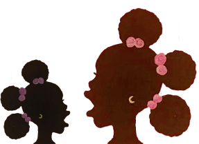

Why dark-skinned black girls like me aren't getting married

[Shades of Black](https://www.theguardian.com/us-news/series/shades-of-black)

# Why dark-skinned black girls like me aren't getting married

Dream McClinton: ‘We are not as valued as our lighter skinned counterparts.’ Illustration: Debra Cartwright

Black women in the US marry less than others - and the numbers are even lower for darker skinned black women. Is colorism – favoring lighter skin – to blame? **  [Dream McClinton](https://www.theguardian.com/profile/dream-mcclinton)** puts herself on the line to report

- Read our entire [Shades of black](https://www.theguardian.com/us-news/series/shades-of-black) series
- Have you experienced colorism? [Share your story here](https://guardiannewsandmedia.formstack.com/forms/colorism_reader_questions)

Mon 8 Apr 2019 06.00 BSTLast modified on Mon 8 Apr 2019 17.53 BST

- 
- 
- 

Shares

5,759

I take a deep breath and ready my fingers. I admonish myself for being theatrical about something so mundane. Another deep breath.

“Here we go,” I mutter, pressing enter.

My profile has been created. It seems simple enough: swipe left to dismiss, swipe right to express interest.

The first eligible bachelor appears – not my type, I swipe left. Then another follows – too young, I swipe left again. Ten swipes in, and I find myself texting my eldest sister this was a bad idea. A feeling of vexation settles over me.

I didn’t think I would ever have to use a dating app, but men don’t talk to me any other way.

.

     Shades of black

Guardian US launches a week-long series on the politics of skin color in the black American community. Colorism - the discrimination faced by darker-skinned people, often from within their own community - remains a taboo. Our reports, essays and first-person pieces will look at the roots and impact of this rarely discussed prejudice

 [- My toxic love affair with skin lightening creams](https://www.theguardian.com/lifeandstyle/2019/apr/08/bleaching-creams-skin-toxic-love-affair)  [- Why we asked 27 black women to speak out on taboo of colorism](https://www.theguardian.com/lifeandstyle/2019/apr/08/colorism-series-editors-note-why-we-asked-black-women-taboo)

 [Read more ](https://www.theguardian.com/us-news/series/shades-of-black)

 .

I’ve spent so much time trying to understand what is so unattractive about me that men shun me. At first, I thought it was because I was intimidating – a word I’ve heard used to describe me. For a while, I concluded I was “not that interesting,” a line I subsequently used as my biography on social media. But those explanations won’t do.

The real issue is staring me right in the face: my deep mahogany skin.

Colorism – the prejudice based on skin tone – has stunted the romantic lives of millions of dark-skinned black women, including me. We are not as valued as our lighter-skinned counterparts when seeking romantic partners, our dating pool constricted because of something as arbitrary as shoe size.

Like other systems of racial inequality, American colorism was born out of slavery. As slave masters raped enslaved women, their lighter-skinned illegitimate offspring were given preferential treatment over their darker counterparts, often working in the house as opposed to the fields. This order has since been perpetuated by systemic racism and internalized by black people. It remains alive even now, insidiously snaking into my life.

I have many memories of being degraded because of my complexion, the most piercing is from middle school: two girls giggled in my Georgia history class during the showing of a documentary about slavery. As the film explained the origins of skin tone prejudice, one girl – biracial, hazel-eyed and the only other black girl in class – whispered that she would have been a house slave, but that I would have been a field slave. As the famous image of [whipped Peter](https://en.wikipedia.org/wiki/Gordon_(slave)#/media/File:Scourged_back_by_McPherson_%26_Oliver,_1863,_retouched.jpg) played on screen, I sank down in my chair, silently greeting the weight of oppression on my 12-year-old shoulders.

In many ways, nothing has changed since that day. Dark skin still not only comes with the expectation of lower class but lessened beauty, not to mention uncleanliness, lesser intelligence and a diminished attractiveness. Meanwhile, everywhere we look, women like me see successful black men coupled with fair-skinned female partners who pass the [paper bag test](https://www.ferris.edu/HTMLS/news/jimcrow/question/2014/february.htm) – a remnant of the Reconstruction era, where the only black people worthy of attention had to be lighter than a paper bag. This “test” was even instituted in places such as historically black colleges and universities as an informal part of the admissions process.

Today, this gradation discrimination remains. “It’s typical to see light-skinned black women as representing beauty in the black community and therefore being highly desirable for high-status spouses,” says Dr Margaret Hunter, who teaches sociology at Oakland’s Mills College and has studied the relationship between marriage and colorism for over two decades. Hunter sums it up like this: “Black women in general marry less than other races but darker-skinned black women marry men of lower social status than the lightest-skinned black women.”

## The lighter the shade, the higher the probability of marriage

Jasmine Turner, owner of BlackMatchMade, a Chicago-based matchmaking company, agrees this affects all black women. “Honestly, I think black women tend to lower their standards because they’re finding challenges in dating. Now I’m finding that black women are like ‘You know what, as long as he has a good job and he’s a good person …’ No matter how successful they are, they’re open to dating him.”

I’ve never been one to settle. I’ve taken this attitude to the app, only searching for men who are gainfully employed and fairly decent-looking. But I definitely understand what she means. Previously, dating has made me feel like I must drop some of my must-have criteria – a college education, a steady job, and able and willing to pay for the first date – in order to find a match. My mother has even scolded me for it, telling me to raise my standards: “I’ve been on a lot of dates, and no girl should ever pay for a first date!”

But my feelings of a necessary drop in standards have been validated by research from Dr Darrick Hamilton, a professor of economics and sociology at Ohio State University. Hamilton aggregated information from the 2003 Multi-City Study of Urban Equality to identify why so many dark-skinned women who date men remain bachelorettes. His assessment was designed to show how the imbalance of eligible black males – taking into account high incarceration rates and a limited labor market – affects the marriage market.

His research shows that a scarcity in available “high-status” husbands (defined as higher levels of education, not growing up on public assistance, coming from neighborhoods that had less crime), effectively leave black men in control of the dating selection process. His data concluded 55% of light-skinned women were married while only 23% of dark-skinned women had jumped the broom.

“[Black men] have unnatural power within marriage markets that enables them to bid up cursory characteristics like skin shade,” Hamilton told me over the phone. In other words, the lighter the female, the higher the probability of marriage. “One of the results that we found was that [darker-complexioned] black women who have ‘higher status’ faced a greater penalty in marriage markets than those with a lower socioeconomic status.”

According to his research, I am the epitome of the “high-status” option. College educated, familial middle class background, age 16-30, able-bodied. But according to the equation, I haven’t the “social capital” (read: skin tone) to seek a quality match.

But before even entertaining thoughts of marriage, I have to get past the dating stage. Turner says she often sees black men pass up perfectly eligible dark-skinned women. “Black men will say, ‘complexion doesn’t matter’, but they might give that lighter complexion woman who is very comparable to a darker-complexion woman a chance, when they wouldn’t give that darker-skinned woman a chance.”

The effects play out in the lives of women like me and my friend Larissa. We usually like to talk about sci-fi books and traveling, but today I ask her if she’s ever felt diminished by men due to her complexion. “Sometimes, I can kinda feel their eyes sliding off of me to go the pretty white girl next to me, or even the fairer-skinned Yara Shahidi type,” she says, a twinge of sadness in her voice. While she sees herself getting married, she doesn’t know if she will end up with a black man. “I don’t necessarily see myself walking down the aisle with a black guy. Not because I’ve written them off or because I don’t want to, but just realistically, based on how the dating life has been treating me and how I’ve been approached.”

Play Video

5:55

   'People don't even look at me': eight black women discuss politics of light and dark skin – video

Julia Wadley of North Carolina’s matchmaking service EliSimone, which caters to a mostly black clientele, has observed this dynamic in her field. “I’ve had colleagues who were like, ‘Hey, I have a black client and he’s open to any race’. I’m like ‘Oh, OK, great! I’ll send you a couple of matches who fit what he’s looking for. Then they’ll come back and say, ‘She’s too ethnic looking’.”

I know exactly what she means, but I ask anyway: “What would ‘too ethnic’ mean, in terms of look?”

“Dark skin. Someone who is probably brown to dark skin. Someone with natural hair. Someone who is over the size of six,” she answers. “I would bet $5,000 every single one of my black colleagues have had that happen. Where they’ll come back and say, ‘Uh, well, he’s only looking for someone who is very fair’; or, ‘He’s looking for someone who is light-skinned’.”

Still, Wadley tells me, she hoped I’m not writing a “woe is me, nobody wants dark-skinned girls” article. I wince hearing it, hoping for the same, deep down. But this topic doesn’t lend itself to optimism.

## ‘It made me feel like I would never be wanted’

Writing this piece, a memory I had long forgotten resurfaces. At university, on the line for the security check-in for dorms, I bumped into a friend of my former roommate. I inquired about something someone had said. Immediately, his face changed from joy to anger. “You’re too dark to be talking to me like this, Dream,” he sneered. Hurt to the point of rage, I bristled and walked away. We never had a conversation again.

I aimlessly skim the app late one night, swiping left, right, right, left. I’ve only made a few matches since downloading it the week before. Then, I come across a profile. “I only date light-skinned women…” reads his bio, even though his skin tone matches mine. I wasn’t going to swipe right in the first place – he was not cute – but I still feel the bristle of my sophomore year. I roll my eyes, and swipe to the next one.

I would like to think I’ve grown up since that 19-year-old who was insulted at the gate of my dorm. My dark skin is not something to be ashamed of, even if past lovers made it clear they were ashamed to be associated with me because of it. I’ve been all of it before – I’m dating someone but there’s a secrecy to our relationship: hands that only hold yours in private, a reluctance to present you to family and friends, kisses that only meet your lips when no one else can see.

I hate that I’ve had to beg for legitimacy in my intimate relationships. I hate that my friends have had to do so too. I want love, but my self-esteem is too high a price to pay.

Sharlene and I met at a Kendrick Lamar concert during our freshman year of college and we’ve stayed in contact ever since. Knowing she’s shared similar sentiments about dating in the past, I get in touch, hoping to round out my perspective on the matter. “I feel like dark-skinned women were just the women that men had behind closed doors. They weren’t trophy wives enough for you to show to the world. Somebody wouldn’t want to show me off but, next thing you know, they’ve got somebody lighter and they’re showing *them *off … It made me feel like I would never be wanted.”

Deflated, I talk to Elizabeth, my former sophomore-year roommate, who is now in her third year of law school. I ask if a partner has said anything rude to her because of her skin tone. She names a man I know, to my dismay. “There was just a comment that he made one time. [He said] ‘I want a white family’.” She laughs: “It was just so weird to me because you’re telling me you want a white family. I can’t give you that! Like, why are you talking to me?”

“I want a white family.” The words stick with me for the rest of the day, weighing me down like a bale of cotton. It brings tears to my eyes. I wonder: are dark-skinned women just the placeholders until they meet their desired match? Do all these men really just want white families?

A few nights into the app, another guy pops up on my screen – decent looking and seemingly gainfully employed. I’m mildly interested. His profile bio is just one line: “The darker the berry, the sweeter the juice.”

My immediate thoughts warn me of a possible fetish. [Dating](https://www.theguardian.com/lifeandstyle/dating) with dark skin often comes with a double-edged sword: we are unwanted, except by men who want to create an experience out of us, leaving our personhood out of the equation altogether. We become empty objects, vehicles for pleasure, rather than multi-dimensional beings.

Hunter vocalizes this sentiment. “At the same time, there’s also a kind of fetishization of darker skin. So sometimes you’ll hear people say ‘I only like dark-skinned women’ or that ‘dark skin is sexy’ or something like that,” she tells me. “Not that those things aren’t true or good, but they also kind of objectifying or sexualizing in a way that isn’t necessarily the solution to the discrimination. It’s an inversion, basically.”

The bachelor on my screen shares my mahogany skin tone. But I’m wary he, like other black men, may fall victim to this form of objectification. I remember how Sharlene expressed her frustrations with her beauty being seen as skin deep. “We can’t get just get a regular compliment,” she laments. “I know that people think that calling me chocolate all the time, or talking about ‘your skin is beautiful’ is a compliment. But why can’t I just be beautiful?”

I hear what she and Dr Hunter are saying, but my choices are few. I feel limited; I was made to feel this way. In the end, I swipe right. My screen darkens, proclaiming a match has been made. We chat, but the spark isn’t there.

But three weeks after joining the app, I finally hit a stride and start having more fun. I’ve matched with someone who seems promising. He’s smart, we work in the same industry, and our conversations online have been pleasant. I ask him to meet, and he agrees.

We are meeting at a food hall; for me, it’s a short walk and a train across town but feels like a world away. A slew of hopes run through me on the way over. I hope I’ll be just as attracted to him in person as I am online. I hope he won’t murder me.

I approach the hall, take a deep breath, and ready my fingers to pull the door open. “Here we go,” I whisper to myself.

-

*Share your experience of colorism: use the hashtag #ShadesofBlack on social media*

##  Since you’re here…

… we have a small favour to ask. More people around the world are reading The Guardian’s independent, investigative journalism than ever before. We’ve now been funded by over one million readers. And unlike many news organisations, we have chosen an approach that allows us to keep our journalism open to all. We believe that each one of us deserves access to accurate information with integrity at its heart.

The Guardian is editorially independent, meaning we set our own agenda. Our journalism is free from commercial bias and not influenced by billionaire owners, politicians or shareholders. No one edits our editor. No one steers our opinion. This is important as it enables us to give a voice to those less heard, challenge the powerful and hold them to account. It’s what makes us different to so many others in the media, at a time when factual, honest reporting is critical.

Every contribution we receive from readers like you, big or small, goes directly into funding our journalism. This support enables us to keep working as we do – but we must maintain and build on it for every year to come. **Support The Guardian from as little as £1 – and it only takes a minute. Thank you.**

 [Support The Guardian](https://support.theguardian.com/uk/contribute?REFPVID=ju9k0oxa2z0youle1le2&INTCMP=gdnwb_copts_memco_2019-03-29_contrbs_glbl_epc_cpy_supercontrol_super_epic&acquisitionData=%7B%22source%22%3A%22GUARDIAN_WEB%22%2C%22componentId%22%3A%22gdnwb_copts_memco_2019-03-29_contrbs_glbl_epc_cpy_supercontrol_super_epic%22%2C%22componentType%22%3A%22ACQUISITIONS_EPIC%22%2C%22campaignCode%22%3A%22gdnwb_copts_memco_2019-03-29_contrbs_glbl_epc_cpy_supercontrol_super_epic%22%2C%22abTest%22%3A%7B%22name%22%3A%222019-03-29_contrbs_glbl_epc_cpy_supercontrol%22%2C%22variant%22%3A%22super_epic%22%7D%2C%22referrerPageviewId%22%3A%22ju9k0oxa2z0youle1le2%22%2C%22referrerUrl%22%3A%22https%3A%2F%2Fwww.theguardian.com%2Flifeandstyle%2F2019%2Fapr%2F08%2Fdark-skinned-black-girls-dont-get-married%22%7D)

 

Topics

- [Shades of Black/](https://www.theguardian.com/us-news/series/shades-of-black)
- [Dating/](https://www.theguardian.com/lifeandstyle/dating)
- [Race/](https://www.theguardian.com/world/race)
- [features/](https://www.theguardian.com/tone/features)
- 
- 
- 
- [Share on LinkedIn](http://www.linkedin.com/shareArticle?mini=true&title=Why%20dark-skinned%20black%20girls%20like%20me%20aren%27t%20getting%20married&url=https%3A%2F%2Fwww.theguardian.com%2Flifeandstyle%2F2019%2Fapr%2F08%2Fdark-skinned-black-girls-dont-get-married)
- [Share on Pinterest](http://www.pinterest.com/pin/find/?url=https%3A%2F%2Fwww.theguardian.com%2Flifeandstyle%2F2019%2Fapr%2F08%2Fdark-skinned-black-girls-dont-get-married)
- [Reuse this content](https://syndication.theguardian.com/automation/?url=https%3A%2F%2Fwww.theguardian.com%2Flifeandstyle%2F2019%2Fapr%2F08%2Fdark-skinned-black-girls-dont-get-married&type=article&internalpagecode=5944763)