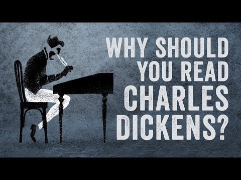

Why should you read Charles Dickens? - Iseult Gillespie - YouTube

Why should you read Charles Dickens? - Iseult Gillespie
https://www.youtube.com/watch?v=5czA_L_eOp4
[TED-Ed](https://www.youtube.com/channel/UCsooa4yRKGN_zEE8iknghZA)
234,327 views views
Published on Dec 21, 2017

|     |
| --- |
| [(L)](https://www.youtube.com/watch?v=5czA_L_eOp4) |

Description

Check out our Patreon page: [https://www.patreon.com/teded](https://www.youtube.com/redirect?redir_token=XUQthp9Tm5e8jkIlja7Wusdz1oJ8MTUxNDg4OTU1N0AxNTE0ODAzMTU3&q=https%3A%2F%2Fwww.patreon.com%2Fteded&event=video_description&v=5czA_L_eOp4)View full lesson: [https://ed.ted.com/lessons/why-should...](https://www.youtube.com/redirect?redir_token=XUQthp9Tm5e8jkIlja7Wusdz1oJ8MTUxNDg4OTU1N0AxNTE0ODAzMTU3&q=https%3A%2F%2Fed.ted.com%2Flessons%2Fwhy-should-you-read-charles-dickens-iseult-gillespie&event=video_description&v=5czA_L_eOp4)The starving orphan seeking a second helping of gruel. The spinster wasting away in her tattered wedding dress. The stone-hearted miser plagued by the ghost of Christmas past. More than a century after his death, these remain recognizable figures from the work of Charles Dickens. But what are the features of Dickens’ writing that make it so special? Iseult Gillespie investigates.

Lesson by Iseult Gillespie, directed by Compote Collective. Thank you so much to our patrons for your support! Without you this video would not be possible! Hoang Viet, Sarah Yaghi, Peter Liu, Joris Debonnet, Bruno Pinho, Tim Armstrong, Katie Dean, Javier Aldavaz, Sage Curie, Husain Mohammad, Ahmad Hyari, Quinn Shen, Dmitry Neverov, Mrinalini , Fabian Amels, Antony Lee, Faiza Imtiaz, Noa Shore, Dominik Kugelmann, Max Shuai Tang, Alexander Walls, Tyler Yoshizumi, Sharon Chou, Jarrel Cacdac, Chris , Eunsun Kim, Noel Situ, Tushar Sharma, Juliana , Juan , eden sher, Della Palacios, Sarah Burns, Rahul Kamath, Philippe Spoden, Silas Schwarz, Samuel Doerle, Ishaq Al Kooheji, Mihail Radu Pantilimon, sammie goh, Janie Jackson, Hoai Nam Tran, Joe Sims, Lex Azevedo, Kiara Taylor, Jeff Hanevich, Be Owusu, Bryan Blankenburg, Elaine Fitzpatrick, Lorenzo Margiotta, Misaki Sato, Clair Chen, Mehmet Sencer KARADAYI, Yoga Trapeze Wanderlust, Miami Beach Family, Srikote Naewchampa, Louisa Lee, Vignan Velivela, Ophelia Gibson Best, Ezgi Yersu, Claudia Mayfield, Elizabeth Cruz, Ivan Tsenov, David PetroviÄ, Robson Martinho, Oyuntsengel Tseyen-Oidov, Marc Veale, Ayala Ron, Latora Slydell, Sydney Evans, Jose Henrique Leopoldo e Silva, Peter Koebel, Manognya Chakrapani, Activated Classroom Teaching, Joy Love Om, Exal Enrique Cisneros Tuch, Bev Millar, Filip Dabrowski, Patrick leaming, nai tzu yang, Victor E Karhel, Simon Holst Ravn, Mattia Veltri, Christophe Dessalles, Manav parmar, Zhexi Shan, Craig Sheldon, Martin Lõhmus, Phyllis Dubrow, Ricardo Diaz, Martin Stephen, QIUJING L BU, Michael James Busa, Begum Tutuncu, Joe Giamartino, Umar Farooq, Travis Wehrman, Rakshit Kothari, Ghassan Alhazzaa, Andreas Voltios, Anthony Kudolo, Peter Owen, Aleksandar Srbinovski, Bernardo Paulo, Brittiny Elman, Znosheni Kedy, Aaron Henson, Joanne Luce, Julie Cummings-Debrot, Cas Jamieson, Boris Langvand, Andrew Sleugh, Dalton Valette, Quentin Le Menez, Fabio Peters, Minh Tran, Ex Foedus, Rodrigo Carballo, Bah Becerra, Ana Maria, Mridul Goswami, Joe Huang, Mayra Urbano, Clement , Dwight Tevuk , Gi Nam Lee, Jamerson Chingapanini, salman bheriyani, Ricki Daniel Marbun, MJ Tan Mingjie, Milad Mostafavi, Jun Cai, Bojana Golubovic, Patch Richy, Megan Douglas, Hugo Legorreta, Marc Bilodeau, Megan Whiteleather, Antonio Bianco, Renhe Ji, Tim Robinson, Sama aafghani, Lyn-z Schulte, Jhuval , Kris Siverhus, Clarence E. Harper Jr., Mauro Pellegrini, Kack-Kyun Kim, Jose Mamattah, Runarm , Kiarash Asar, Bartlomiej Czubak, Carolyn Corwin, Querida Owens, Roz AR, rakesh Katragadda.