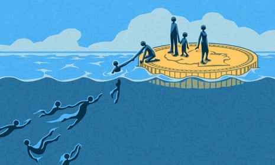

Why universal basic income could help us fight the next wave of economic shocks | John Harris | Opinion | The Guardian

[Opinion](https://www.theguardian.com/uk/commentisfree)

[Universal basic income](https://www.theguardian.com/society/universal-basic-income)

# Why universal basic income could help us fight the next wave of economic shocks

*[John Harris*](https://www.theguardian.com/profile/johnharris)

The coronavirus crisis has put insecurity at the heart of tens of millions of lives

[Coronavirus – latest updates](https://www.theguardian.com/world/live/2020/mar/14/coronavirus-live-updates-uk-us-australia-italy-europe-school-shutdown-sport-events-cancelled-latest-update-news)

[See all our coronavirus coverage](https://www.theguardian.com/world/coronavirus-outbreak)

[@johnharris1969](https://twitter.com/johnharris1969)

Sun 3 May 2020 11.58 BSTLast modified on Sun 3 May 2020 12.48 BST

- 
- 
- 

Shares

51

Illustration: Matt Kenyon/The Guardian

Until six weeks ago many hung on to the vague idea that people’s relationship with work divided them along binary lines: into winners and precarious losers; “aspirational” types and those who were dependent on the state; and those who had either adjusted to globalisation or were the casualties of it.

But if any of this was ever true, the coronavirus crisis has surely consigned most of it to history. Insecurity is now at the heart of tens of millions of lives. Put another way, the “[precariat](https://www.theguardian.com/world/2019/may/15/cash-credits-and-crisis-life-in-the-new-european-precariat)” has suddenly expanded to denote a potentially universal condition.

Late last week I chatted to people in Plymouth. Most spoke via webcam from their homes, which outwardly suggested comfort and material security. But one was a specialist in oven-cleaning and another was a plumber and heating specialist: both were waiting for chancellor Rishi Sunak’s package for self-employed people to materialise, and were deeply worried about the future. Another ran a nail and beauty business from her house and feared that even if she was eventually allowed to reopen, people might be too scared to come there. On and on they went: everyone expressing anxiety and uncertainty, thereby joining the millions of people who experienced those things long before the outbreak began.

 

##   [Coronavirus: the week explained - sign up for our email newsletter]()

   

Read more

 [(L)](https://www.theguardian.com/world/2020/mar/18/coronavirus-the-week-explained-sign-up-for-our-email-newsletter)

As regular news of the soaring [need for food banks](https://www.theguardian.com/society/2020/may/01/uk-food-banks-face-record-demand-in-coronavirus-crisis) highlight a mounting social crisis,**  **the government has begun its frenzy of [furloughing](https://www.theguardian.com/money/2020/apr/20/fears-of-flood-as-uks-covid-19-furlough-scheme-opens), [loans](https://www.theguardian.com/business/2020/apr/30/uk-treasury-rushes-to-finalise-coronavirus-bounce-back-loan-scheme) for small businesses, as well as individuals. But these things do not solve basic matters of poverty (the furlough rate of 80% of wages is [bad news for anyone already on low pay](https://www.bbc.co.uk/news/uk-wales-52447142)), and there are plenty of people who have already fallen through the cracks: workers who have been made redundant and are now enduring the five-week wait for universal credit, and people who have been self-employed for less than a year, or have paid themselves in dividends. Besides, as things stand, the furloughing schemes are set to finish at the end of June. Even if some miracle occurs and people are then able to start earning again, that will still leave a massive question unanswered: what will we do in the event of another disaster like this?

Advertisement

So, a familiar idea has once again returned: that of a [universal basic income](https://www.theguardian.com/society/universal-basic-income) (or UBI), whereby all of us would be entitled to a regular payment from the state, enough to cover such basics as food and heating. Ten days ago, the left-inclined pressure group Compass organised a [letter](https://www.ft.com/content/6fdaf216-8324-11ea-b555-37a289098206), signed by more than 100 MPs and peers from seven parties, calling for a “recovery basic income” that would be “sufficient to provide economic security”. An accompanying [paper](https://www.compassonline.org.uk/publications/meeting-the-economic-and-livelihood-crisis-from-a-recovery-basic-income-to-a-permanent-income-floor/) sets out the case for these short-term measures being followed by a permanent basic income – set at a starting rate of £60 a week per working-age adult and £40 per child (or £10,400 per year for a family of four), with additional unemployment, housing and disability benefits maintained. Over time, this “income floor” could rise to £100 per adult.

This would obviously take a large share of public spending, but through policies such as converting the current personal tax allowance into a cash payment, UBI’s advocates insist the tax system could be remodelled to ease the cost. Besides, this might not be quite the hard sell some would suggest: after the bailing-out of the banks and the government’s munificent response to the current crisis, radical spending plans are surely not the political taboo they once were.

In Scotland, the SNP is [enthusiastic](https://www.scotsman.com/news/politics/snp-makes-renewed-call-universal-basic-income-be-introduced-2532379), reflecting a mood in some other countries pointing in a comparable direction. As if to remind us that not everyone involved has idealistic intentions, the Trump administration is currently distributing a one-off payment of $1,200 (£950) to millions of US citizens, while such forward-thinking democrats as Alexandria Ocasio-Cortez [make the case](https://www.washingtonexaminer.com/news/take-dramatic-action-aoc-calls-for-universal-basic-income-as-response-to-coronavirus) for an American UBI.

In Spain, the governing coalition of the Socialist party and radical-left movement Podemos has pledged to introduce [regular payments](https://english.elpais.com/economy_and_business/2020-04-19/spains-guaranteed-minimum-income-scheme-will-come-with-55bn-price-tag.html) to its poorest citizens. Podemos has long advocated full UBI, and clearly sees this first move as a big step in that direction.

As with many radical ideas, the notion of a basic income is surrounded by tensions. Aside from the cost, in societies plagued by populism and arguments about who is entitled to what, UBI would be an obvious source of conflict. Even if many people are instinctively in favour, they also worry about the visions attached to the idea – of an imagined workless society in which we all somehow get the chance to be artists and coders, usually put forward by people with apparently no grasp of the damage that inactivity can do to people (as vividly proved by lockdown). For that reason, some people are keener on the idea of [universal](https://www.theguardian.com/business/2017/oct/11/uk-universal-basic-services-jonathan-portes)[basic](https://www.theguardian.com/business/2017/oct/11/uk-universal-basic-services-jonathan-portes)[services](https://www.theguardian.com/business/2017/oct/11/uk-universal-basic-services-jonathan-portes), with legal entitlements to core things such as housing, education and transport. But this seems like a false choice: if we are going to maximise our collective resilience, we should surely consider both.

The centrality to human wellbeing of work will remain; the dangers of simply surrendering to the supposed inevitabilities of automation are obvious. But right now we need to think hard about a set of realities that the 20th century did not prepare us for. This crisis is likely be repeated. Covid-19, after all, is just the latest sign of the horrors let loose by human incursion into parts of the natural world. Even once the current disaster is somehow dealt with, the catastrophe of climate change – which itself [increases the danger](https://www.nationalgeographic.com/news/2017/06/vibrio-zika-west-nile-malaria-diseases-spreading-climate-change/) of disease, as tropical illnesses start to threaten new places – will speed on. This latest economic crash arrives only 12 years after the last one. We live, in short, in an age of ongoing shocks, and it is time we began to prepare.

As and when that happens, debates about how to change what we get from the state will only be one part of the conversation. As the public response to this crisis proves, another key aspect of our changed reality is the amazing amount of local self-help the outbreak has triggered, and how important it is that this does not disappear.

But if you are going to enable people to care for their family, friends and neighbours and involve themselves in their community, many of them will need the freedom to do the kind of work that currently brings no financial reward. Which brings us back to a basic income – and a question that, whatever people’s doubts, needs to be asked with a real urgency. If unprecedented times demand drastic answers, isn’t this where we should begin?

• John Harris is a Guardian columnist

##  News is under threat …

… just when we need it the most. Right now, millions of readers around the world are coming to the Guardian in search of honest, authoritative, fact-based reporting that can help them understand the biggest challenge we face in our lifetime. Our journalism is available to everyone, across the world, bringing people together to face down this pandemic. But at this crucial time, news organisations are facing a cruel financial double blow: with fewer people able to leave their homes, and fewer news vendors in operation, we’re seeing a reduction in newspaper sales across the UK. Advertising revenue continues to fall steeply, while businesses feel the pinch. We believe we can overcome these challenges together, but we need you more than ever.

You’ve read 127 articles in the last six months. We believe every one of us deserves equal access to vital public service journalism. So, unlike many others, we made a different choice: to keep Guardian journalism open for all, regardless of where they live or what they can afford to pay. This would not be possible without financial contributions from those who can afford to pay, who now support our work from 180 countries around the world.

We have upheld our editorial independence in the face of the disintegration of traditional media – with social platforms giving rise to misinformation, the seemingly unstoppable rise of big tech and independent voices being squashed by commercial ownership. The Guardian’s independence means we can set our own agenda and voice our own opinions. Our journalism is free from commercial and political bias – never influenced by billionaire owners or shareholders. This makes us different. It means we can challenge the powerful without fear and give a voice to those less heard.

Reader financial support has meant we can keep investigating, disentangling and interrogating. It has protected our independence, which has never been so critical. We are so grateful.

We need your support so we can keep delivering quality journalism that’s open and independent. And that is here for the long term. Every reader contribution, however big or small, is so valuable.

 **Support the Guardian from as little as £1 – and it only takes a minute. Thank you.**

 [Support The Guardian](https://support.theguardian.com/uk/contribute?REFPVID=k9r09vpaa6xi3qe6h38n&INTCMP=gdnwb_copts_memco_2020-05-01_EPIC_ROUND3__UK_WITH_ARTICLE_COUNT_V1_SUPERCONTROL&acquisitionData=%7B%22source%22%3A%22GUARDIAN_WEB%22%2C%22componentId%22%3A%22gdnwb_copts_memco_2020-05-01_EPIC_ROUND3__UK_WITH_ARTICLE_COUNT_V1_SUPERCONTROL%22%2C%22componentType%22%3A%22ACQUISITIONS_EPIC%22%2C%22campaignCode%22%3A%22gdnwb_copts_memco_2020-05-01_EPIC_ROUND3__UK_WITH_ARTICLE_COUNT_V1_SUPERCONTROL%22%2C%22abTest%22%3A%7B%22name%22%3A%222020-05-01_EPIC_ROUND3__UK_WITH_ARTICLE_COUNT%22%2C%22variant%22%3A%22V1_SUPERCONTROL%22%7D%2C%22referrerPageviewId%22%3A%22k9r09vpaa6xi3qe6h38n%22%2C%22referrerUrl%22%3A%22https%3A%2F%2Fwww.theguardian.com%2Fcommentisfree%2F2020%2Fmay%2F03%2Funiversal-basic-income-coronavirus-shocks%22%7D)

Remind me in July

 

Topics

- [Universal basic income/](https://www.theguardian.com/society/universal-basic-income)
- [Opinion/](https://www.theguardian.com/uk/commentisfree)
- [Economic policy/](https://www.theguardian.com/politics/economy)
- [Coronavirus outbreak/](https://www.theguardian.com/world/coronavirus-outbreak)
- [Benefits/](https://www.theguardian.com/society/benefits)
- [comment/](https://www.theguardian.com/tone/comment)
- 
- 
- 
- [Share on LinkedIn](http://www.linkedin.com/shareArticle?mini=true&title=Why%20universal%20basic%20income%20could%20help%20us%20fight%20the%20next%20wave%20of%20economic%20shocks%20%7C%20John%20Harris&url=https%3A%2F%2Fwww.theguardian.com%2Fcommentisfree%2F2020%2Fmay%2F03%2Funiversal-basic-income-coronavirus-shocks)
- [Share on Pinterest](http://www.pinterest.com/pin/find/?url=https%3A%2F%2Fwww.theguardian.com%2Fcommentisfree%2F2020%2Fmay%2F03%2Funiversal-basic-income-coronavirus-shocks)
- [Reuse this content](https://syndication.theguardian.com/automation/?url=https%3A%2F%2Fwww.theguardian.com%2Fcommentisfree%2F2020%2Fmay%2F03%2Funiversal-basic-income-coronavirus-shocks&type=blog&internalpagecode=7364669)