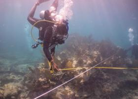
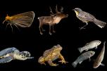
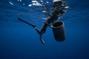
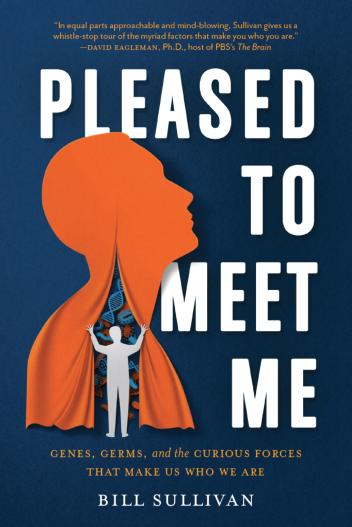
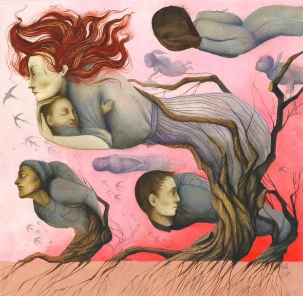
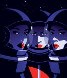
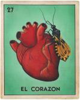

Why we like what we like: A scientist’s surprising findings

Illustration: David Plunkert

Illustration: David Plunkert

[Science & Innovation](https://www.nationalgeographic.com/science)  Short

# Why we like what we like: A scientist’s surprising findings

## Your genes, your germs, and your environment all may influence your tastes in food—as well as partners and politics.

6 Minute Read

 

 

 

 [ ![](data:image/svg+xml,%3csvg xmlns='http://www.w3.org/2000/svg' class='mt_icon js-evernote-checked' data-evernote-id='10'%3e%3ctitle data-evernote-id='921' class='js-evernote-checked'%3elinkAsset 48%3c/title%3e%3cg data-name='Layer 2' data-evernote-id='922' class='js-evernote-checked'%3e%3cg data-name='Layer 1' data-evernote-id='923' class='js-evernote-checked'%3e%3cpath d='M11.42 15.57a.9.9 0 0 1-.42-.11 5.55 5.55 0 0 1-1.3-1 5.68 5.68 0 0 1 0-8l4.81-4.81a5.67 5.67 0 1 1 8 8L19.16 13a.9.9 0 1 1-1.27-1.27l3.36-3.36a3.88 3.88 0 0 0 0-5.48 4 4 0 0 0-5.48 0L11 7.74a3.88 3.88 0 0 0 0 5.48 3.76 3.76 0 0 0 .88.66.9.9 0 0 1-.43 1.69z' data-evernote-id='924' class='js-evernote-checked'%3e%3c/path%3e%3cpath d='M5.67 24.19a5.67 5.67 0 0 1-4-9.68l3.28-3.28a.9.9 0 0 1 1.26 1.27l-3.28 3.28a3.88 3.88 0 0 0 0 5.48 4 4 0 0 0 5.48 0l4.81-4.81a3.88 3.88 0 0 0 0-5.48 3.77 3.77 0 0 0-.88-.66.9.9 0 1 1 .85-1.58 5.54 5.54 0 0 1 1.3 1 5.68 5.68 0 0 1 0 8l-4.81 4.8a5.63 5.63 0 0 1-4.01 1.66z' data-evernote-id='925' class='js-evernote-checked'%3e%3c/path%3e%3c/g%3e%3c/g%3e%3c/svg%3e)](https://www.nationalgeographic.com/science/2019/08/why-we-like-what-we-like-a-scientists-surprising-findings/#)

By **Bill Sullivan**

* * *

>  This story appears in the > [> September 2019](https://www.nationalgeographic.com/magazine/2019/09)>  issue of *> National Geographic*>  magazine.

There may be nothing more self-defining than our tastes. Whether in food, wine, romantic partners, or political candidates, our tastes represent our identity. So it made sense to me that my likes and dislikes were formed through careful deliberation and rational decision-making—that is, through choices where I wielded some control.

Then I became acquainted with *Toxoplasma gondii.* In my research at the Indiana University School of Medicine, I observed how the single-celled *T. gondii* parasite can change the behavior of the host it infects. It can make rats unafraid of cats, and some studies show that it may cause personality changes (such as increased anxiety) in humans.

These studies made me wonder if there are other things happening under our radar that could be shaping who we are, programming our likes and dislikes. As I dug into the scientific literature, I hit upon this astonishing and unsettling truth: Our actions are governed by hidden biological forces—which is to say that we have little or no control over our personal tastes. Our behaviors and preferences are profoundly influenced by our genetic makeup, by factors in our environment that affect our genes, and by other genes forced into our systems by the innumerable microbes that dwell inside us.

I realize that this sounds ridiculous. We’re taught that we can be whatever we want to be, do whatever we want to do. Intuitively, it feels like we pick and choose the foods we like, who we give our heart to, or which buttons we press in the voting booth. To suggest that we are just meat robots under the influence of unseen forces is crazy talk!

Several years ago I would have agreed. But after being grilled at one too many cookouts as to why I don’t like many of the vegetables that most people find enjoyable, I felt like something was wrong with me. I am green with envy watching people willingly eat things like broccoli, because if someone tries to pass it to me, my body recoils in horror. Why don’t I relish broccoli?

I wasn’t choosing to hate these vegetables, so I set out to learn what could explain my aversion. Luckily, science was on the case. Researchers have found that about 25 percent of people might hate broccoli for the same reason I do. These people—my people—are called supertasters. We have variations in genes that build our taste bud receptors. One of those genes, *TAS2R38,* recognizes bitter chemicals like thioureas, which are plentiful in broccoli. My DNA gives me taste bud receptors that register thiourea compounds as revoltingly bitter. This may be DNA’s way of deterring me from eating harmful plants. It’s clearly the reason that, as television’s [*Seinfeld *character said of his frenemy Newman](https://www.youtube.com/watch?v=-NKsob8FKsQ), I wouldn’t eat broccoli if it were deep fried in chocolate sauce.

Advertisement

### Are you really just a pile of genes?

Technically, yes. But embedded within your genome, there are many potential versions of you. The person you see in the mirror is just one of them, fished out by the unique things you’ve been exposed to since conception. The new science of epigenetics is the study of how chemical changes made to DNA, or proteins that interact with DNA, can affect gene activity. DNA can be modified by environmental factors in ways that can profoundly affect development and behavior. Recently, it’s also been shown that the microbes in your body—aka your microbiome—can be a significant environmental factor that affects myriad behaviors, from overeating to depression. In sum, we are our genes—but our genes cannot be evaluated outside the context of our environment. Genes are the piano keys, but the environment plays the song. *—BS*

**This explanation** of why I hate broccoli is both vindicating and disturbing. I am relieved that my distaste for cruciferous vegetables is not my fault—I did not get to go gene shopping before I was conceived. But the relief soon turns to alarm as I wonder: What other things that define who I am are beyond my command? How much of me is really due to me?

How about my taste in women? Surely that must be under my control. Let’s start with the basics: Why am I attracted to women instead of men? This was not a conscious decision that I made while sitting on the beach one evening contemplating life; I was born this way. The genetic components to human sexuality are still muddy, but it is clear that it’s not a choice.

Regardless of our sexual orientation, we seem to have an innate sense of the attributes we find desirable in a mate. Features such as a shapely mouth, sparkling eyes, and lush hair are widely appreciated as attractive. And studies show that more attractive people are likelier to get a job, make more money, find a mate—even be found “not guilty” if on trial.

 Death-defying DNA  During his 50-year heavy metal music career, Ozzy Osbourne has become famous for his alcohol and drug binges. To learn what allowed Osbourne to survive cocaine for breakfast and four bottles of cognac a day for decades, scientists analyzed his DNA in 2010. They found a never ​before seen mutation in a gene that’s involved in breaking down alcohol. They also found variations in genes linked to drug absorptions, addiction, and alcoholism—variations that would make Osbourne six times as likely as an average person to crave alcohol and 1.3 times as likely to have a cocaine addiction. *—BS*   Photo: Terje Dokken, Gonzales Photo/Alamy

Evolutionary psychologists remind us that at our core, virtually everything we do emerges from a subconscious urge to survive and reproduce our genes, or lend support to others (such as family) who carry genes like our own. They further postulate that many of the physical traits that we consider attractive are signs of physical health and fitness—in other words, good genes to let swim in our pool.

Science has also provided a little comfort as to why your amorous advances are sometimes spurned. A famous study had women sniffing the underarms of T-shirts worn by men and then ranking the odor. The more similar the men’s and women’s immune system genes were, the worse the T-shirt stank to the women. There is a sound evolutionary explanation for this: If parental immune genes are too similar, the offspring will not be as well equipped to fight pathogens. In this case, genes used odor receptors as a proxy to size up whether a potential mate’s DNA is a good match. Studies like this affirm that chemistry between people really is a thing. Perhaps we should not take another’s romantic disinterest personally but view it more like organ rejection.

Somewhat distressed at the level of control genes seem to exert over our choices in life, I investigated an area that I was sure would be impervious to the reach of DNA: our taste in political leaders. It’s easy to imagine genes playing a role in whether someone is right- or left-handed, but whether a person leans politically to the right or left? I thought not. Yet as unlikely as it seems, the votes are in, and DNA has scored another victory.

Today’sPopular Stories

[(L)](https://www.nationalgeographic.com/culture/2019/08/diving-unfolding-history-wrecked-slave-ships/?cmpid=int_org=ngp::int_mc=website::int_src=ngp::int_cmp=substest::int_add=substestcontrol::int_rid=)

[Culture & History](https://www.nationalgeographic.com/culture)
Diving into the unfolding history of wrecked slave ships

[(L)](https://www.nationalgeographic.com/animals/2019/07/endangered-species-in-every-US-state-interactive-map/?cmpid=int_org=ngp::int_mc=website::int_src=ngp::int_cmp=substest::int_add=substestcontrol::int_rid=)

[Animals](https://www.nationalgeographic.com/animals)
See a different endangered animal in every U.S. state

[(L)](https://www.nationalgeographic.com/adventure/2019/08/great-pacific-garbage-patch-swim-science/?cmpid=int_org=ngp::int_mc=website::int_src=ngp::int_cmp=substest::int_add=substestcontrol::int_rid=)

[Exploration & Adventure](https://www.nationalgeographic.com/adventure)
This is what it's like to swim through the Great Pacific Garbage Patch

Scientists have uncovered distinct personality traits that tend to be associated with people on opposite ends of the political spectrum. In general, liberals tend to be more open-minded, creative, and novelty seeking; conservatives tend to be more orderly and conventional, and to prefer stability. Identical twins separated at birth and raised in different environments typically find their political stances in agreement when reunited, suggesting a genetic component to our political compass. Several studies suggest that variations in our dopamine D4 receptor gene *(DRD4) *influence whether we vote red or blue. Dopamine is a key neurotransmitter in the brain, associated with our reward and pleasure center; variations in *DRD4 *have been tied to novelty seeking and risktaking, behaviors more commonly associated with liberals.

Other research has shown that certain areas in the brain are different for liberals and conservatives, and this may affect how they respond to stressful stimuli. For example, conservatives tend to have a larger amygdala, the fear center of the brain, and have stronger physiological reactions to unpleasant photos or sounds. Considered together, these biological differences may partially explain why it’s so difficult for a liberal or conservative to get the other to “see the light.” You’re asking people not just to change their mind but also to resist their biology.

**These examples are** just the tip of the iceberg. The truth is, every human behavior—from addiction to attraction to anxiety—is tethered to a genetic anchor. This is not to say that we’re destined to be slaves of our DNA, however. DNA has built human beings a brain so magnificent that it has figured out DNA’s game. And with the advent of gene editing, we have become the first species capable of revising our genetic instructions.

Science has shown that you are not who you think you are. There are biological gremlins driving every action and personality trait that you assumed were of your own volition. This realization is disheartening at first, but knowledge is power. Knowing the molecular basis of our adverse behaviors should put us in a better position to curb or remedy them; accepting that other people have little choice in how they came to be should engender more empathy and compassion. Perhaps, with the confidence that we are *not* in total control, we can resist the urge to praise or blame and seek understanding instead.

>   **> Bill Sullivan**>  is a professor of pharmacology and microbiology at the Indiana University School of Medicine, where he studies infectious disease and genetics. His book *> Pleased to Meet Me: Genes, Germs, and the Curious Forces That Make Us Who We Are*>  is available where books are sold and at *> [> shopng.com/books](https://shop.nationalgeographic.com/products/pleased-to-meet-me)> .*

Advertisement

 [Share](https://www.nationalgeographic.com/science/2019/08/why-we-like-what-we-like-a-scientists-surprising-findings/#)

 [Tweet](https://www.nationalgeographic.com/science/2019/08/why-we-like-what-we-like-a-scientists-surprising-findings/#)

 [Email](https://www.nationalgeographic.com/science/2019/08/why-we-like-what-we-like-a-scientists-surprising-findings/#)

 [Copy](https://www.nationalgeographic.com/science/2019/08/why-we-like-what-we-like-a-scientists-surprising-findings/#)

More on This Topic

[(L)](https://www.nationalgeographic.com/science/2019/08/humans-not-glaciers-wiped-out-ice-age-cave-bears-ancient-dna-shows/)

Humans, not glaciers, likely doomed Ice Age cave bears

[(L)](https://www.nationalgeographic.com/science/2019/07/enigmatic-skull-may-be-oldest-modern-human-out-of-africa/)

Enigmatic skull may be the oldest modern human outside Africa. But questions abound.

[(L)](https://www.nationalgeographic.com/science/2019/06/neanderthals-spread-across-europe-asia-gets-new-twist-from-ancient-dna/)

Ancient DNA reveals new twists in Neanderthal migration

More from this series

[(L)](https://www.nationalgeographic.com/magazine/2019/08/we-all-are-migrants-in-the-21st-century/)

In the 21st century, we are all migrants

Humans are in motion across time as well as geography. Why must we be divided, the migrant versus the native?

[(L)](https://www.nationalgeographic.com/magazine/2019/07/space-travel-four-ways-women-are-a-better-fit-than-men/)

Here’s why women may be the best suited for spaceflight

[(L)](https://www.nationalgeographic.com/magazine/2019/06/chagas-disease-spread-by-kissing-bug-infects-thousands-in-united-states/)

A little-known parasite infects 300,000 people in the U.S.

[(L)](https://www.nationalgeographic.com/magazine/2019/05/ashes-to-diamonds-reefs-rockets-how-we-will-memorialize-dead/)

From diamonds to rockets, mourning the dead has gotten high-tech