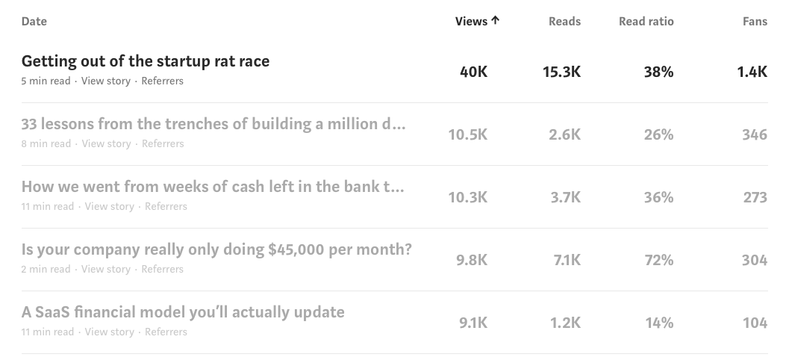
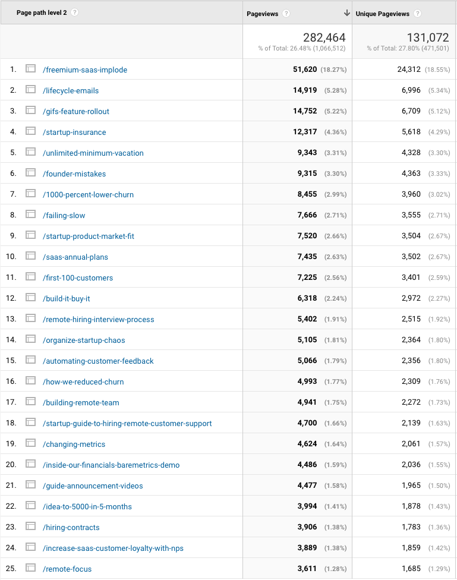

Why we transitioned from Medium back to our own blog - Baremetrics

# Why we transitioned from Medium back to our own blog

Josh Pigford on January 24, 2018

*[Founder's Journey](https://itunes.apple.com/us/podcast/founders-journey/id957952675) is a weekly podcast where we take each article we write and record an audio version with commentary. **A [rating on iTunes](https://itunes.apple.com/us/podcast/founders-journey/id957952675) goes a long way.** Subscribe via [iTunes](https://itunes.apple.com/us/podcast/founders-journey/id957952675) or [RSS](https://baremetrics.com/podcast/feed).*

*Where* to publish something has become a difficult decision for a lot of businesses. You read so many stories about using various channels to distribute content and grow traffic, it’s hard to know what does and doesn’t work. Medium, in particular, has become a major player in the world of startup content, but is it really that great?

I’ve certainly been tempted by the prospect of loads of traffic and tons of likes (or “fans” as Medium calls them now). But how does that translate in to something meaningful for the business?

This is our story of how we’ve used Medium, what worked, what didn’t and what our strategy is now, after kicking the proverbial tires for a couple of years.

## Growing with content marketing

Before Baremetrics, at previous companies I’d started, I’d dabbled in content marketing. But not the quality stuff…the mass-produced, pay-somebody-$20-to-knock-out-500-words-around-a-random-SEO-keyword kind of stuff. As you can imagine, I got nothing out of it. Totally worthless, across the board.

So when I started Baremetrics, I knew I wanted to do things differently.

My first step towards this actually started before I even launched Baremetrics. I [live-tweeted a lot of the process](https://twitter.com/i/moments/788809454565396480) of getting Baremetrics launched and was very open from the start with how the business was doing.

Early on I decided to make “transparency” a core part of the business, both in how we operated and also our strategy around marketing. Three months after launching, I [made all of our numbers public](https://baremetrics.com/blog/inside-our-financials-baremetrics-demo), and from then on just started sharing everything I could think of.

That was my entire content marketing strategy early on: **share it all**.

That stance really helped grow the blog pretty quickly. I was publishing weekly about all the things I was trying and it got quite a bit of momentum, making the blog a place people checked regularly and came to expect new content from each week.

## Then came Medium

About two years in, I found myself reading a ton of content on Medium and various businesses were moving their publications to Medium (the most prominent of which, in my mind, was [Basecamp’s Signal v. Noise](https://m.signalvnoise.com/signal-v-noise-moves-to-medium-c8083ce19686)).

I’d pumped out dozens and dozens of articles on our own blog to pretty great success, but Medium started looking like some really green grass on the other side. Not just from the “Ooooo, traffic!” prospect, but Medium also has a pretty active community, and I selfishly wanted the endorphin rush.

I wasn’t really sure how to approach it. Should we wholesale move over every article from our blog to Medium? Do we post new content to Medium and repost to our own blog later? How would we even technically handle that from an SEO duplicate-content standpoint? Would it cannibalize newsletter signups?

Lots of questions, but very little data out there. Not because people hadn’t done it, but because so much of it is based on your goals and what you actually want to get out of it.

## The switch

What originally sealed the deal on making the switch to Medium was when I posted [an email I’d received from an investor](https://medium.com/baremetrics-founders-journey/is-your-company-really-only-doing-45-000-per-month-a2098bf29bf5). That gave me my first taste of success on Medium.

Our game plan was to post all new content to our Medium publication and set it up on a subdomain (blog.baremetrics.com). We’d keep the old blog, and then just post links to the new content as it was created. We’d also slowly transition past content over to the Medium publication as well.

For most of 2017, all new blog posts went directly to Medium. Honestly, it was really enjoyable. Publishing on Medium is so effortless. Formatting content and uploading images takes basically zero time. It’s really the best web-based publishing experience I’ve had to date.

I didn’t pay a whole lot of attention to stats. I just knew we were getting lots of likes and highlights and it was generating meaningful discussion, so it felt like a win.

## Second guessing the switch

After about a year of posting on Medium, traffic on our own marketing site was (rightfully) taking a hit. Newsletter signups were also slumping and there was just palpably less “buzz” around Baremetrics content in general.

I realized Medium is really great about surfacing content, but it removes the *face* of it. It neutralizes all content to basically be author-agnostic. It’s like Walmart or Amazon in that you can buy from thousands of different brands, but you rarely actually know what brand you’re buying…you just know “I got it from Amazon.”

Same with content on Medium. Sure, you can see who the author is or what publication it’s on, but ultimately your takeaway is “I read this article on Medium”, and that’s not what I wanted. I wanted to get back to people saying “I read this article on Baremetrics”.

On top of that, the amount of views a given article would get ultimately weren’t that impressive. At least not much/any more than our own blog (given we’d already built up a nice readership).

As an example, our top posts on Medium had total Views in the 8-10k range (with our best ever getting around 40k, though that’s an outlier).

After those top 5, the Views dropped off pretty drastically to just 500-1k per article.

Whereas our own blog, beforehand, we were getting multiples of that on basically every article.

The numbers just didn’t make sense. Yes, I could put *more* into Medium and try to build up readership even more. The guys at Basecamp regularly get 250k+ views on their content. But doing that helps *Medium* the most in the long run. They’ve been fumbling left and right trying to figure out how to make Medium sustainable, and I’m just not convinced they’ll always do what’s best for us and our business.

## Switching back

Now I didn’t want to throw out distribution on Medium entirely. There can definitely be some benefit to *syndicating* content there. It’s essentially another distribution channel to expose people to our content.

So we needed a game plan on how we could still make use of Medium as a distribution channel without cannibalizing our own readership or SEO work.

That game plan consisted of two main things.

### Removing the custom domain

We decided to stop using “blog.baremetrics.com” on Medium and redirected all of those URLs back to the same content on “baremetrics.com/blog”. This process was relatively painless.

Ahead of time I added all the missing content from Medium to our own blog, then I setup 301 Redirects. I pointed “blog.baremetrics.com” to our marketing site, which runs on WordPress, and using the fantastic [Redirection plugin](https://redirection.me/) was able to monitor any 404 errors from those Medium redirects and immediately create the necessary 301 Redirects from that.

The only hiccup here is that you have to email Medium support to remove the custom domain (something I didn’t realize beforehand), so there was about a 12-hour period where all the articles on Medium weren’t accessible due to Medium forcing the incorrect URL.

### Republishing new content to Medium

Going forward, we are still going to publish to Medium, but with two big caveats.

1. We’ll publish new content two weeks later to Medium (so the initial publishing of the content is able to get solidified as the primary source from an SEO standpoint).

2. We’ll use Medium’s [Import tool](https://medium.com/p/import) to publish the content. Medium buries this thing, but what it does is lets us republish on Medium and have them set the [canonical URL](https://support.google.com/webmasters/answer/139066?hl=en) to the original post on your own website. That’s a big kick from the SEO side of things as it tells Google that your original post is the main one and should be given preference in search results.

With this method we still own the original content, get the benefits of being the primary source and get the distribution benefits of Medium!

By making ourselves the original, authoritative source, we’re able to control the whole experience *for the long term* and *to our benefit* instead of potential *short term wins* to *Medium’s benefit*.

## What about you?

So what about you? What’s worked for you as you build up content and readership?