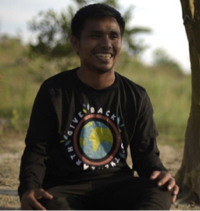
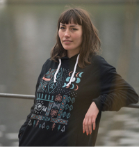

Why we're saying no to Google

 

- [Home](https://blog.ecosia.org/)

- [Projects](https://blog.ecosia.org/tag/projects/)

- [News](https://blog.ecosia.org/tag/news/)

- [Money](https://blog.ecosia.org/ecosia-financial-reports-tree-planting-receipts/)

- [Podcast](https://blog.ecosia.org/tag/podcast/)

- [Shop](https://ecosia.co/merchblogpage)

- 

# Why we're saying no to Google

 12.Aug 2019

For a long time, Google used its dominant market position to push its own search engine to Android users. In 2018, the [EU fined Google € 4.34 billion](https://europa.eu/rapid/press-release_IP-18-4581_en.htm) for anti-competitive practices that disadvantaged other search engines. In other words, Google wasn't playing fair.

To comply with EU regulation, Google has to give Android users the freedom to choose their search engine. But the newly suggested method is unethical and anti-competitive. Google wants other search engines to [participate in an auction](https://www.android.com/choicescreen/), with only the highest bidders granted access to Android's new 'choice screen'. Google will then invoice and charge competitors for each user who selects a non-Google search option via the choice screen.

The current, pre-auction choice screen

## We're saying no

Ecosia will **not** be taking part in Google's revenue-making auction. We are calling on Google to cease damaging, monopolistic behavior. Android users deserve the option to freely choose their search engine, and that choice should not be auctioned off to the highest bidder. Google has chosen to give discrimination a different form and make everyone else but themselves pay, which isn’t something we can accept.

We use our revenue to plant trees in areas affected by deforestation or desertification, not to get into expensive and unnecessary bidding wars with other search engines. We will be discussing our options with the EU Commission - it should be up to Android users which search engine they use, and absolutely not up to Google.

We have three main reasons why we won't be participating in Google’s auction:

## Fundamental rights should never be auctioned off

It is unethical for a company with a dominant market position like Google to discriminate access to it. Google's attempt to auction access rights to Android is an insult to the European Commission and to the principle of equality in front of the law.

## Purpose-driven search engines will be crowded out by profit-hungry rivals

Alternative search engines that focus on privacy or specific causes are unlikely to be able to competitively bid in this suggested auction set-up. This setup favors profit-orientated partners, many of whom have access to higher monetizing Google ads.

## Google is trying to create artificial scarcity

By artificially limiting user options, Google is creating scarcity where there is none. This will unnecessarily increase costs for alternative search engines, and will keep new entrants from growing market share.

For these reasons, we believe Google should not go ahead with the auction. Share this article if you agree!

 [News](https://blog.ecosia.org/tag/news/)

- 

- 

- 

- 

- 

- [ ![](data:image/svg+xml,%3csvg xmlns='http://www.w3.org/2000/svg' class='icon__cnt js-evernote-checked' data-evernote-id='515'%3e%3cpath d='M24 30.2c0 .2.1.5.1.8 0 1.4-.5 2.6-1.5 3.6l-2 2c-1 1-2.2 1.5-3.6 1.5-2.8 0-5.1-2.3-5.1-5.1 0-1.4.5-2.6 1.5-3.6l2-2c1-1 2.2-1.5 3.6-1.5.3 0 .5 0 .8.1l1.5-1.5c-.7-.3-1.5-.4-2.3-.4-1.9 0-3.6.7-4.9 2l-2 2c-1.3 1.3-2 3-2 4.9 0 3.8 3.1 6.9 6.9 6.9 1.9 0 3.6-.7 4.9-2l2-2c1.3-1.3 2-3 2-4.9 0-.8-.1-1.6-.4-2.3L24 30.2z' data-evernote-id='191' class='js-evernote-checked'%3e%3c/path%3e%3cpath d='M33 10.1c-1.9 0-3.6.7-4.9 2l-2 2c-1.3 1.3-2 3-2 4.9 0 .8.1 1.6.4 2.3l1.5-1.5c0-.2-.1-.5-.1-.8 0-1.4.5-2.6 1.5-3.6l2-2c1-1 2.2-1.5 3.6-1.5 2.8 0 5.1 2.3 5.1 5.1 0 1.4-.5 2.6-1.5 3.6l-2 2c-1 1-2.2 1.5-3.6 1.5-.3 0-.5 0-.8-.1l-1.5 1.5c.7.3 1.5.4 2.3.4 1.9 0 3.6-.7 4.9-2l2-2c1.3-1.3 2-3 2-4.9 0-3.8-3.1-6.9-6.9-6.9z' data-evernote-id='192' class='js-evernote-checked'%3e%3c/path%3e%3cpath d='M20 31c-.3 0-.5-.1-.7-.3-.4-.4-.4-1 0-1.4l10-10c.4-.4 1-.4 1.4 0s.4 1 0 1.4l-10 10c-.2.2-.4.3-.7.3z' data-evernote-id='193' class='js-evernote-checked'%3e%3c/path%3e%3c/svg%3e)](https://blog.ecosia.org/google-android-choice-screen-auction-eu-ecosia/#)

* * *

* * *

 

###   [Christian](https://blog.ecosia.org/author/christian/)

CEO and founder

### Recent Posts

 [*1. *      ### Why is Brazil's Amazon Forest burning up?   21.Aug.2019](https://blog.ecosia.org/brazils-amazon-rainforest-is-burning-up/)  [*2. *      ### Tree-Planting Update: Episode 19   16.Aug.2019](https://blog.ecosia.org/tree-planting-update-episode-19-ethiopia-dila/)  [*3. *      ### Ecosia takes radical steps to support climate activism   15.Aug.2019](https://blog.ecosia.org/ecosia-support-climate-activism-civil-disobedience/)  [*4. *      ### Our tree counter just got faster   14.Aug.2019](https://blog.ecosia.org/ecosia-tree-counter-revenue-growth-august-2019/)  [*5. *      ### Why “carbon neutral” is not enough: Ecosia has built its own solar plants   01.Aug.2019](https://blog.ecosia.org/why-carbon-neutral-is-not-enough-ecosia-has-built-its-own-solar-plants/)

### Shop

We plant 20 trees for every T-Shirt sold

     

 [ Shop now](https://ecosia.teemill.com/)

### Let's plant some trees

 [ ![](data:image/svg+xml,%3csvg class='c-widget-install__icons c-widget-install__chrome js-evernote-checked' xmlns='http://www.w3.org/2000/svg' width='40' height='40' viewBox='0 0 40 40' style='display: inline%3b' data-evernote-id='593'%3e %3cpath fill='%23FFF' d='M19.9108138%2c0.022296544 C23.4782609%2c-0.00743218135 26.8301747%2c0.88442958 29.9665552%2c2.69788183 C33.4150873%2c4.68970643 36.0312152%2c7.45447789 37.8149387%2c10.9921962 L21.270903%2c10.122631 C18.892605%2c9.98885173 16.7075437%2c10.5425492 14.7157191%2c11.7837235 C12.7238945%2c13.0248978 11.3489409%2c14.7305834 10.5908584%2c16.9007804 L4.43701226%2c7.44704571 C6.33965069%2c5.08361204 8.65105909%2c3.25901152 11.3712375%2c1.97324415 C14.0914158%2c0.687476774 16.9379413%2c0.0371609067 19.9108138%2c0.022296544 Z M3.25529543%2c9.05239688 L10.7692308%2c23.8350056 C11.8394649%2c25.9606094 13.4076551%2c27.5733928 15.4738016%2c28.6733556 C17.539948%2c29.7733185 19.7175771%2c30.1077666 22.006689%2c29.6767001 L16.8784838%2c39.7324415 C13.7272389%2c39.2419175 10.8658491%2c38.0713489 8.29431438%2c36.2207358 C5.72277964%2c34.3701226 3.69751022%2c32.0215533 2.21850613%2c29.1750279 C0.739502044%2c26.3285024 0%2c23.2701598 0%2c20 C0%2c16.0312152 1.08509848%2c12.3820141 3.25529543%2c9.05239688 Z M38.6176143%2c12.8205128 C39.4797473%2c15.0501672 39.9219621%2c17.3578595 39.9442586%2c19.7435897 C39.9665552%2c22.12932 39.6060944%2c24.4035674 38.8628763%2c26.5663322 C38.1196581%2c28.729097 36.9825344%2c30.7506503 35.451505%2c32.6309922 C33.9204757%2c34.5113341 32.092159%2c36.0683761 29.9665552%2c37.3021182 C26.5477518%2c39.2790784 22.8465255%2c40.163508 18.8628763%2c39.9554069 L27.8929766%2c26.06466 C29.2010405%2c24.1174285 29.8141955%2c21.9583798 29.7324415%2c19.5875139 C29.6506875%2c17.2166481 28.8591602%2c15.1542178 27.3578595%2c13.400223 L38.6176143%2c12.8205128 Z M19.9777035%2c13.2664437 C21.8357488%2c13.2664437 23.4225195%2c13.9241918 24.7380156%2c15.2396878 C26.0535117%2c16.5551839 26.7112598%2c18.1419547 26.7112598%2c20 C26.7112598%2c21.8580453 26.0535117%2c23.4448161 24.7380156%2c24.7603122 C23.4225195%2c26.0758082 21.8357488%2c26.7335563 19.9777035%2c26.7335563 C18.1196581%2c26.7335563 16.5328874%2c26.0758082 15.2173913%2c24.7603122 C13.9018952%2c23.4448161 13.2441472%2c21.8580453 13.2441472%2c20 C13.2441472%2c18.1419547 13.9018952%2c16.5551839 15.2173913%2c15.2396878 C16.5328874%2c13.9241918 18.1196581%2c13.2664437 19.9777035%2c13.2664437 Z' data-evernote-id='594' class='js-evernote-checked'%3e%3c/path%3e %3c/svg%3e)![](data:image/svg+xml,%3csvg class='c-widget-install__icons c-widget-install__firefox js-evernote-checked' xmlns='http://www.w3.org/2000/svg' width='40' height='40' viewBox='0 0 40 40' data-evernote-id='595'%3e %3cpath fill='%23FFF' d='M19.0495647%2c9.14145175e-06 C13.4027736%2c-0.00578184751 8.11318529%2c2.74012623 4.89846347%2c7.34606723 C4.38255781%2c6.56122386 3.91251043%2c5.21334069 3.7042374%2c3.85029146 C2.34568582%2c5.17732131 1.74761741%2c7.60389017 1.97308729%2c10.841843 C1.8679954%2c10.982129 0.0011812064%2c13.3821573 0.0011812064%2c15.6400038 C-0.00646184044%2c15.6400038 0.0241103469%2c16.1518582 0.0604148194%2c16.2921442 L1.19540728%2c15.4030342 C0.794147316%2c16.4020981 0.568677434%2c18.5424076 0.599249622%2c19.6684873 C0.658483235%2c22.0381834 0.838094836%2c25.2609702 3.3450142%2c28.8515338 C7.10730401%2c33.6800267 11.9224235%2c35.619386 17.6164934%2c35.9606223 C23.3105633%2c36.2942755 28.356885%2c34.5236385 32.3656631%2c30.0363819 C35.0827662%2c26.7339733 36.6266617%2c24.1405778 37.3814125%2c20.5575972 C37.9106935%2c18.0551981 38.1342527%2c15.2779142 37.9183366%2c13.3290761 C37.746368%2c14.1670007 37.3355543%2c15.0030295 36.9037221%2c15.5812353 C36.8502208%2c13.4333427 36.7241105%2c11.107249 36.1260421%2c9.42002531 C35.709496%2c8.28636267 35.0674801%2c6.67117776 34.2764248%2c5.62851146 C34.6413803%2c7.06549521 34.5057162%2c8.36788021 34.51527%2c9.18305569 C33.7828952%2c6.61987059 31.9144361%2c4.52677336 29.4383761%2c3.49578491 C26.4574736%2c1.22812585 22.8058635%2c-0.000620121786 19.0495647%2c9.14145175e-06 Z M19.0495647%2c1.89576607 C20.5418696%2c1.89576607 21.9825839%2c2.14790174 23.3487785%2c2.54790645 C23.17681%2c2.68060944 23.0201275%2c2.85122756 22.8710881%2c2.84364453 C25.3646321%2c3.53938732 27.0747639%2c4.15361257 27.29068%2c4.68063299 C26.3716036%2c4.5175979 25.5136716%2c4.57636636 24.7818498%2c4.85693839 C30.0135154%2c6.90246011 32.7076894%2c10.3375717 32.4248967%2c13.1508749 C32.0427443%2c12.5593988 31.0969173%2c11.6039373 30.514135%2c11.3157822 C31.3128334%2c14.4039703 31.5822508%2c16.6466507 30.9325918%2c18.6618403 C30.4835628%2c17.3139571 29.8052424%2c15.4466366 29.4383761%2c15.1660646 C29.9466387%2c19.3063977 29.5205389%2c23.4163987 27.6479924%2c25.4145265 C27.827604%2c24.7130964 27.8486224%2c23.5339356 27.7683704%2c22.7490923 C25.5652621%2c26.0287517 23.5360332%2c27.5036506 20.7214812%2c27.6079173 C19.1011553%2c27.6003342 17.1311599%2c27.0145453 17.138803%2c27.0145453 C15.6904456%2c26.5330231 14.3853954%2c25.7178476 13.4357468%2c24.5254165 C15.3847237%2c25.067603 17.3776482%2c25.3709241 18.5718743%2c24.7642819 L21.3195496%2c23.1054946 C21.6329145%2c22.9860619 21.8717597%2c22.9727916 22.1545525%2c23.1054946 C22.7449778%2c23.023977 22.9456078%2c22.7339262 22.7526209%2c22.2144888 C22.4165685%2c21.7736228 21.9883036%2c21.4101604 21.4972504%2c21.1490734 C20.2953813%2c20.5272651 19.0419216%2c20.6239487 17.7349606%2c21.4448115 C16.489144%2c22.14245 14.6165975%2c21.4448115 13.3172796%2c20.9139996 C12.8395891%2c20.7130493 11.5861295%2c19.7272557 11.4657515%2c18.9575784 C11.3319981%2c18.0988005 11.630077%2c17.4542432 12.3026651%2c17.6532976 C12.1077674%2c17.6400273 14.2726604%2c18.017283 15.2872749%2c18.305438 C15.2872749%2c17.1736711 14.6376159%2c16.0400085 14.331894%2c15.1660646 C15.2796318%2c14.2940164 16.5350023%2c13.7366638 17.2572702%2c13.3290761 C18.1323991%2c12.900635 18.0559686%2c12.0399614 17.7349606%2c11.8484899 C16.5713068%2c11.9603396 15.7057317%2c11.7290572 15.7057317%2c11.7290572 C15.1790569%2c11.546335 14.6925827%2c11.2651086 14.2726604%2c10.9006115 L13.4357468%2c10.1309342 C13.4357468%2c10.1309342 13.1166496%2c9.87121546 13.137668%2c9.71576339 C13.4510329%2c7.67972045 14.9968391%2c6.36027363 16.0038105%2c5.68727992 C14.1389071%2c5.91666651 12.4306861%2c6.74700804 10.9288274%2c8.17640876 C9.92185601%2c7.81242343 8.3301915%2c7.44275083 6.98692602%2c7.75934224 C9.87426507%2c4.05527541 14.3299414%2c1.8893979 19.0495647%2c1.89576607 Z' transform='translate(1 2)' data-evernote-id='596' class='js-evernote-checked'%3e%3c/path%3e %3c/svg%3e)![](data:image/svg+xml,%3csvg class='c-widget-install__icons c-widget-install__safari js-evernote-checked' xmlns='http://www.w3.org/2000/svg' width='40' height='40' viewBox='0 0 40 40' data-evernote-id='597'%3e %3cpath fill='%23FFF' d='M19%2c0 C8.51515152%2c8.74721171e-16 0%2c8.51515152 0%2c19 C0%2c29.4848485 8.51515152%2c38 19%2c38 C29.4848485%2c38 38%2c29.4848485 38%2c19 C38%2c8.51515152 29.4848485%2c0 19%2c0 Z M19%2c37.3939394 C8.84848485%2c37.3939394 0.606060606%2c29.1515152 0.606060606%2c19 C0.606060606%2c8.84848485 8.84848485%2c0.606060606 19%2c0.606060606 C29.1515152%2c0.606060606 37.3939394%2c8.84848485 37.3939394%2c19 C37.3939394%2c29.1515152 29.1515152%2c37.3939394 19%2c37.3939394 Z M19%2c2.03030303 L19.3030303%2c2.03030303 L19.3030303%2c4.75757576 L19%2c4.75757576 L19%2c2.03030303 Z M19%2c32.9393939 L19.3030303%2c32.9393939 L19.3030303%2c35.6666667 L19%2c35.6666667 L19%2c32.9393939 Z M21.7848485%2c2.39181818 L22.0833333%2c2.44424242 L21.6069697%2c5.16030303 L21.3084848%2c5.10787879 L21.7848485%2c2.39181818 Z M16.2139394%2c35.5218182 L15.9154545%2c35.4693939 L16.3918182%2c32.7533333 L16.690303%2c32.8057576 L16.2139394%2c35.5218182 Z M24.5990909%2c3.12121212 L24.8836364%2c3.22515152 L23.9384848%2c5.81575758 L23.6539394%2c5.71181818 L24.5990909%2c3.12121212 Z M13.3957576%2c34.7918182 L13.1112121%2c34.6878788 L14.0563636%2c32.0972727 L14.3409091%2c32.2012121 L13.3957576%2c34.7918182 Z M16.2333333%2c2.37818182 L16.709697%2c5.09454545 L16.4112121%2c5.1469697 L15.9348485%2c2.43060606 L16.2333333%2c2.37818182 Z M21.7706061%2c35.5393939 L21.2942424%2c32.8233333 L21.5927273%2c32.7709091 L22.0690909%2c35.4869697 L21.7706061%2c35.5393939 Z M13.3948485%2c3.09939394 L14.3393939%2c5.69 L14.0545455%2c5.79393939 L13.11%2c3.20333333 L13.3948485%2c3.09939394 Z M24.5975758%2c34.7942424 L23.6530303%2c32.2036364 L23.9378788%2c32.099697 L24.8824242%2c34.690303 L24.5975758%2c34.7942424 Z M10.7139394%2c4.33575758 L12.0981818%2c6.72090909 L11.8360606%2c6.8730303 L10.4518182%2c4.48787879 L10.7139394%2c4.33575758 Z M27.2936364%2c33.5957576 L25.9157576%2c31.2072727 L26.1781818%2c31.0557576 L27.5560606%2c33.4442424 L27.2936364%2c33.5957576 Z M8.31757576%2c5.96787879 L10.0887879%2c8.08151515 L9.85666667%2c8.27606061 L8.08545455%2c6.16242424 L8.31757576%2c5.96787879 Z M29.6878788%2c31.9293939 L27.9166667%2c29.8157576 L28.1487879%2c29.6212121 L29.92%2c31.7348485 L29.6878788%2c31.9293939 Z M6.21454545%2c8.02606061 L8.32818182%2c9.79727273 L8.13363636%2c10.0293939 L6.02%2c8.25818182 L6.21454545%2c8.02606061 Z M31.7787879%2c29.8739394 L29.6651515%2c28.1030303 L29.859697%2c27.8709091 L31.9733333%2c29.6418182 L31.7787879%2c29.8739394 Z M4.5330303%2c10.4306061 L6.92151515%2c11.8084848 L6.77%2c12.0709091 L4.38151515%2c10.6930303 L4.5330303%2c10.4306061 Z M33.4645455%2c27.5027273 L31.0760606%2c26.1248485 L31.2275758%2c25.8624242 L33.6160606%2c27.240303 L33.4645455%2c27.5027273 Z M3.25090909%2c13.0809091 L5.84151515%2c14.0254545 L5.73757576%2c14.310303 L3.1469697%2c13.3657576 L3.25090909%2c13.0809091 Z M34.7457576%2c24.8418182 L32.1551515%2c23.8972727 L32.2590909%2c23.6124242 L34.849697%2c24.5569697 L34.7457576%2c24.8418182 Z M2.47242424%2c15.8854545 L5.18848485%2c16.3618182 L5.13606061%2c16.660303 L2.42%2c16.1839394 L2.47242424%2c15.8854545 Z M35.5230303%2c22.0321212 L32.8069697%2c21.5557576 L32.8593939%2c21.2572727 L35.5754545%2c21.7336364 L35.5230303%2c22.0321212 Z M2.33333333%2c18.6969697 L5.06060606%2c18.6969697 L5.06060606%2c19 L2.33333333%2c19 L2.33333333%2c18.6969697 Z M33.2424242%2c18.6969697 L35.969697%2c18.6969697 L35.969697%2c19 L33.2424242%2c19 L33.2424242%2c18.6969697 Z M2.41727273%2c21.7263636 L5.13333333%2c21.25 L5.18575758%2c21.5484848 L2.46969697%2c22.0248485 L2.41727273%2c21.7263636 Z M35.5784848%2c16.1890909 L32.8624242%2c16.6654545 L32.81%2c16.3669697 L35.5260606%2c15.8906061 L35.5784848%2c16.1890909 Z M3.15575758%2c24.5715152 L5.74636364%2c23.6269697 L5.85030303%2c23.9118182 L3.25969697%2c24.8563636 L3.15575758%2c24.5715152 Z M34.8406061%2c13.3393939 L32.25%2c14.2839394 L32.1460606%2c13.9990909 L34.7366667%2c13.0545455 L34.8406061%2c13.3393939 Z M4.37333333%2c27.2178788 L6.76181818%2c25.84 L6.91333333%2c26.1024242 L4.52484848%2c27.480303 L4.37333333%2c27.2178788 Z M33.6233333%2c10.6966667 L31.2348485%2c12.0745455 L31.0833333%2c11.8121212 L33.4718182%2c10.4342424 L33.6233333%2c10.6966667 Z M8.12666667%2c27.8930303 L8.32121212%2c28.1251515 L6.20787879%2c29.8966667 L6.01333333%2c29.6645455 L8.12666667%2c27.8930303 Z M31.9778788%2c8.28242424 L29.8642424%2c10.0536364 L29.669697%2c9.82151515 L31.7833333%2c8.05030303 L31.9778788%2c8.28242424 Z M8.08%2c31.7509091 L9.85121212%2c29.6372727 L10.0833333%2c29.8318182 L8.31212121%2c31.9454545 L8.08%2c31.7509091 Z M29.9254545%2c6.18545455 L28.1542424%2c8.29909091 L27.9221212%2c8.10454545 L29.6933333%2c5.99090909 L29.9254545%2c6.18545455 Z M10.4724242%2c33.440303 L11.8566667%2c31.0551515 L12.1187879%2c31.2072727 L10.7345455%2c33.5924242 L10.4724242%2c33.440303 Z M27.5354545%2c4.46242424 L26.1575758%2c6.85090909 L25.8951515%2c6.69939394 L27.2730303%2c4.31090909 L27.5354545%2c4.46242424 Z M17.6748485%2c2.20151515 L17.8069697%2c3.68030303 L17.5051515%2c3.70727273 L17.3730303%2c2.22848485 L17.6748485%2c2.20151515 Z M20.329697%2c35.6993939 L20.1975758%2c34.2206061 L20.4993939%2c34.1936364 L20.6315152%2c35.6724242 L20.329697%2c35.6993939 Z M14.7875758%2c2.68727273 L15.1827273%2c4.15 L14.890303%2c4.22909091 L14.4951515%2c2.76636364 L14.7875758%2c2.68727273 Z M23.2%2c35.2469697 L22.8048485%2c33.7842424 L23.0972727%2c33.7051515 L23.4924242%2c35.1678788 L23.2%2c35.2469697 Z M12.0381818%2c3.65212121 L12.6784848%2c5.02545455 L12.4039394%2c5.15363636 L11.7636364%2c3.78030303 L12.0381818%2c3.65212121 Z M25.9772727%2c34.2593939 L25.330303%2c32.8893939 L25.6042424%2c32.76 L26.2512121%2c34.13 L25.9772727%2c34.2593939 Z M9.46515152%2c5.10484848 L10.3306061%2c6.34848485 L10.0818182%2c6.52151515 L9.21636364%2c5.27787879 L9.46515152%2c5.10484848 Z M28.5287879%2c32.8178788 L27.6630303%2c31.5742424 L27.9118182%2c31.4012121 L28.7775758%2c32.6448485 L28.5287879%2c32.8178788 Z M7.20515152%2c6.95818182 L8.25515152%2c8.00818182 L8.04090909%2c8.22242424 L6.99090909%2c7.17242424 L7.20515152%2c6.95818182 Z M30.7945455%2c30.9409091 L29.7445455%2c29.8909091 L29.9587879%2c29.6766667 L31.0087879%2c30.7266667 L30.7945455%2c30.9409091 Z M5.30454545%2c9.20121212 L6.54818182%2c10.0669697 L6.37515152%2c10.3157576 L5.13151515%2c9.45 L5.30454545%2c9.20121212 Z M32.7012121%2c28.7245455 L31.4575758%2c27.8590909 L31.6306061%2c27.610303 L32.8742424%2c28.4757576 L32.7012121%2c28.7245455 Z M3.82575758%2c11.7269697 L5.19909091%2c12.3669697 L5.07121212%2c12.6415152 L3.69787879%2c12.0015152 L3.82575758%2c11.7269697 Z M34.1842424%2c26.1981818 L32.8142424%2c25.5512121 L32.9436364%2c25.2772727 L34.3136364%2c25.9242424 L34.1842424%2c26.1981818 Z M2.79636364%2c14.4424242 L4.25909091%2c14.8372727 L4.18%2c15.129697 L2.71727273%2c14.7348485 L2.79636364%2c14.4424242 Z M35.1951515%2c23.4542424 L33.7324242%2c23.0590909 L33.8115152%2c22.7666667 L35.2742424%2c23.1618182 L35.1951515%2c23.4542424 Z M2.25969697%2c17.3263636 L3.73848485%2c17.4584848 L3.71151515%2c17.760303 L2.23272727%2c17.6281818 L2.25969697%2c17.3263636 Z M35.7354545%2c20.5745455 L34.2566667%2c20.4424242 L34.2836364%2c20.1406061 L35.7624242%2c20.2727273 L35.7354545%2c20.5745455 Z M2.23212121%2c20.279697 L3.71090909%2c20.1475758 L3.73787879%2c20.4493939 L2.25909091%2c20.5815152 L2.23212121%2c20.279697 Z M35.7630303%2c17.6524242 L34.2842424%2c17.7845455 L34.2572727%2c17.4827273 L35.7360606%2c17.3506061 L35.7630303%2c17.6524242 Z M2.71575758%2c23.1742424 L4.17848485%2c22.7790909 L4.25757576%2c23.0715152 L2.79484848%2c23.4666667 L2.71575758%2c23.1742424 Z M35.2766667%2c14.7618182 L33.8139394%2c15.1566667 L33.7348485%2c14.8642424 L35.1975758%2c14.4693939 L35.2766667%2c14.7618182 Z M3.70666667%2c25.9357576 L5.08%2c25.2954545 L5.20818182%2c25.57 L3.83484848%2c26.210303 L3.70666667%2c25.9357576 Z M34.2760606%2c11.980303 L32.9027273%2c12.620303 L32.7748485%2c12.3457576 L34.1481818%2c11.7057576 L34.2760606%2c11.980303 Z M5.14515152%2c28.4851515 L6.38878788%2c27.619697 L6.56181818%2c27.8684848 L5.31818182%2c28.7339394 L5.14515152%2c28.4851515 Z M32.8587879%2c9.42363636 L31.6151515%2c10.2893939 L31.4421212%2c10.0406061 L32.6857576%2c9.17484848 L32.8587879%2c9.42363636 Z M9.48060606%2c32.8157576 L9.23181818%2c32.6424242 L10.0975758%2c31.3990909 L10.3463636%2c31.5724242 L9.48060606%2c32.8157576 Z M28.5133333%2c5.10878788 L28.7612121%2c5.2830303 L27.89%2c6.52272727 L27.6421212%2c6.34848485 L28.5133333%2c5.10878788 Z M12.03%2c34.26 L11.7560606%2c34.1306061 L12.4027273%2c32.7606061 L12.6766667%2c32.89 L12.03%2c34.26 Z M25.9669697%2c3.67393939 L26.2409091%2c3.80333333 L25.5942424%2c5.17363636 L25.320303%2c5.04424242 L25.9669697%2c3.67393939 Z M14.7872727%2c35.22 L14.4948485%2c35.1409091 L14.889697%2c33.6781818 L15.1821212%2c33.7572727 L14.7872727%2c35.22 Z M23.2009091%2c2.68060606 L23.4933333%2c2.75969697 L23.0984848%2c4.22242424 L22.8060606%2c4.14333333 L23.2009091%2c2.68060606 Z M17.6766667%2c35.7087879 L17.3748485%2c35.6818182 L17.5069697%2c34.2030303 L17.8087879%2c34.23 L17.6766667%2c35.7087879 Z M20.3087879%2c2.20090909 L20.6106061%2c2.22787879 L20.4787879%2c3.70666667 L20.1769697%2c3.67969697 L20.3087879%2c2.20090909 Z M17.4242424%2c17.4242424 L6.15151515%2c31.7575758 L20.7575758%2c20.7575758 L31.7575758%2c6.15151515 L17.4242424%2c17.4242424 Z' transform='translate(1 1)' data-evernote-id='598' class='js-evernote-checked'%3e%3c/path%3e %3c/svg%3e)Add Ecosia toChrome](https://chrome.google.com/webstore/detail/ecosia-the-search-engine/eedlgdlajadkbbjoobobefphmfkcchfk)  [ ![](data:image/svg+xml,%3csvg xmlns='http://www.w3.org/2000/svg' width='35' height='40' viewBox='0 0 35 40' data-evernote-id='603' class='js-evernote-checked'%3e %3cg fill='none' fill-rule='evenodd' data-evernote-id='604' class='js-evernote-checked'%3e %3cpath fill='%23000' fill-rule='nonzero' d='M3.50547731%2c18.3923706 L-4.4408921e-16%2c18.3923706 L0%2c4.35967302 C0%2c3.16076294 0.429055816%2c2.13442325 1.28716745%2c1.28065395 C2.14527908%2c0.42688465 3.17683881%2c0 4.38184664%2c0 L27.1674491%2c0 C28.372457%2c0 29.4040167%2c0.42688465 30.2621283%2c1.28065395 C31.12024%2c2.13442325 31.5492958%2c3.16076294 31.5492958%2c4.35967302 L31.5492958%2c34.0054496 C31.5492958%2c35.2043597 31.12024%2c36.2306994 30.2621283%2c37.0844687 C29.4040167%2c37.938238 28.372457%2c38.3651226 27.1674491%2c38.3651226 L7.07942097%2c38.3651226 L9.77699531%2c38.3651226 L9.77699531%2c31.3896458 L27.1674491%2c31.3896458 C27.4047992%2c31.3896458 27.6101982%2c31.3033606 27.7836463%2c31.1307902 C27.9570944%2c30.9582198 28.0438185%2c30.7538601 28.0438185%2c30.5177112 L28.0438185%2c4.35967302 C28.0438185%2c4.12352407 27.9570944%2c3.9191644 27.7836463%2c3.74659401 C27.6101982%2c3.57402361 27.4047992%2c3.48773842 27.1674491%2c3.48773842 L4.38184664%2c3.48773842 C4.14449661%2c3.48773842 3.93909755%2c3.57402361 3.76564945%2c3.74659401 C3.59220136%2c3.9191644 3.50547731%2c4.12352407 3.50547731%2c4.35967302 L3.50547731%2c18.3923706 Z M17.5273865%2c34.8773842 C17.5273865%2c34.4050863 17.3539384%2c33.9963669 17.0070423%2c33.6512262 C16.6601461%2c33.3060854 16.2493479%2c33.133515 15.7746479%2c33.133515 C15.2999478%2c33.133515 14.8891497%2c33.3060854 14.5422535%2c33.6512262 C14.1953573%2c33.9963669 14.0219092%2c34.4050863 14.0219092%2c34.8773842 C14.0219092%2c35.3496821 14.1953573%2c35.7584015 14.5422535%2c36.1035422 C14.8891497%2c36.448683 15.2999478%2c36.6212534 15.7746479%2c36.6212534 C16.2493479%2c36.6212534 16.6601461%2c36.448683 17.0070423%2c36.1035422 C17.3539384%2c35.7584015 17.5273865%2c35.3496821 17.5273865%2c34.8773842 Z' transform='translate(3.45)' data-evernote-id='605' class='js-evernote-checked'%3e%3c/path%3e %3cpath fill='%23000' fill-rule='nonzero' d='M7.7435446%2c37.8746594 C7.7435446%2c37.5093665 7.61281666%2c37.1966536 7.35136077%2c36.9365208 C7.08990488%2c36.6763879 6.77560153%2c36.5463215 6.4084507%2c36.5463215 C6.04129988%2c36.5463215 5.72699653%2c36.6763879 5.46554064%2c36.9365208 C5.20408475%2c37.1966536 5.07335681%2c37.5093665 5.07335681%2c37.8746594 C5.07335681%2c38.2399523 5.20408475%2c38.5526652 5.46554064%2c38.812798 C5.72699653%2c39.0729309 6.04129988%2c39.2029973 6.4084507%2c39.2029973 C6.77560153%2c39.2029973 7.08990488%2c39.0729309 7.35136077%2c38.812798 C7.61281666%2c38.5526652 7.7435446%2c38.2399523 7.7435446%2c37.8746594 Z M11.2147887%2c35.2179837 L11.2147887%2c23.5286104 C11.2147887%2c23.3847071 11.1619413%2c23.2601754 11.0562463%2c23.1550153 C10.9505514%2c23.0498552 10.8253863%2c22.9972752 10.6807512%2c22.9972752 L2.13615023%2c22.9972752 C1.99151506%2c22.9972752 1.86635001%2c23.0498552 1.76065508%2c23.1550153 C1.65496014%2c23.2601754 1.60211268%2c23.3847071 1.60211268%2c23.5286104 L1.60211268%2c35.2179837 C1.60211268%2c35.3618869 1.65496014%2c35.4864186 1.76065508%2c35.5915787 C1.86635001%2c35.6967388 1.99151506%2c35.7493188 2.13615023%2c35.7493188 L10.6807512%2c35.7493188 C10.8253863%2c35.7493188 10.9505514%2c35.6967388 11.0562463%2c35.5915787 C11.1619413%2c35.4864186 11.2147887%2c35.3618869 11.2147887%2c35.2179837 Z M8.01056338%2c21.1376022 C8.01056338%2c20.9604905 7.92155712%2c20.8719346 7.7435446%2c20.8719346 L5.07335681%2c20.8719346 C4.89534429%2c20.8719346 4.80633803%2c20.9604905 4.80633803%2c21.1376022 C4.80633803%2c21.3147139 4.89534429%2c21.4032698 5.07335681%2c21.4032698 L7.7435446%2c21.4032698 C7.92155712%2c21.4032698 8.01056338%2c21.3147139 8.01056338%2c21.1376022 Z M12.8169014%2c20.8719346 L12.8169014%2c37.8746594 C12.8169014%2c38.4502725 12.6055115%2c38.9483992 12.1827318%2c39.3690395 C11.7599521%2c39.7896798 11.2592919%2c40 10.6807512%2c40 L2.13615023%2c40 C1.55760955%2c40 1.05694933%2c39.7896798 0.634169601%2c39.3690395 C0.211389867%2c38.9483992 0%2c38.4502725 0%2c37.8746594 L0%2c20.8719346 C0%2c20.2963215 0.211389867%2c19.7981948 0.634169601%2c19.3775545 C1.05694933%2c18.9569142 1.55760955%2c18.746594 2.13615023%2c18.746594 L10.6807512%2c18.746594 C11.2592919%2c18.746594 11.7599521%2c18.9569142 12.1827318%2c19.3775545 C12.6055115%2c19.7981948 12.8169014%2c20.2963215 12.8169014%2c20.8719346 Z' data-evernote-id='606' class='js-evernote-checked'%3e%3c/path%3e %3c/g%3e %3c/svg%3e)Install the mobile app](https://info.ecosia.org/mobile?tt=3e7fade0)

### Dig deeper...

 [(L)](https://blog.ecosia.org/ecosia-has-planted-50-million-trees/)

 [News](https://blog.ecosia.org/tag/news/)

       

##   [50! Million! Trees!](https://blog.ecosia.org/ecosia-has-planted-50-million-trees/)

 [ 50 million trees means 2.5 million tonnes of CO2 removed from the atmosphere. But it means so much more…](https://blog.ecosia.org/ecosia-has-planted-50-million-trees/)

 13.Feb 2019
/[Joshi](https://blog.ecosia.org/author/joshi/)

 

 [Uganda](https://blog.ecosia.org/tag/uganda/)

       

##   [Jane Goodall on why there is still hope](https://blog.ecosia.org/jane-goodall-foundation-ecosia-chimpanzees-tree-planting-uganda/)

 [ Pieter sat down with primatologist Dr. Jane Goodall to talk chimpanzees, forest corridors and why we need to change attitudes.](https://blog.ecosia.org/jane-goodall-foundation-ecosia-chimpanzees-tree-planting-uganda/)

 05.Jan 2018
/[Pieter](https://blog.ecosia.org/author/pieter/)

 [(L)](https://blog.ecosia.org/california-wildfires/)

 [News](https://blog.ecosia.org/tag/news/)

       

##   [After the California wildfires, doing nothing isn't an option](https://blog.ecosia.org/california-wildfires/)

 [ The press is no longer reporting on the fires – but the destruction they have left in their wake hasn't gone away.](https://blog.ecosia.org/california-wildfires/)

 29.Nov 2018
/[Joshi](https://blog.ecosia.org/author/joshi/)

© 2019 The Ecosia Blog

- 

- 

- [ ![](data:image/svg+xml,%3csvg xmlns='http://www.w3.org/2000/svg' class='icon__cnt js-evernote-checked' data-evernote-id='749'%3e%3cpath d='M25 12c-3.53 0-3.973.015-5.36.078-1.384.063-2.329.283-3.156.604a6.372 6.372 0 0 0-2.302 1.5 6.372 6.372 0 0 0-1.5 2.303c-.321.826-.54 1.771-.604 3.155C12.015 21.027 12 21.47 12 25c0 3.53.015 3.973.078 5.36.063 1.384.283 2.329.604 3.155.333.855.777 1.58 1.5 2.303a6.372 6.372 0 0 0 2.302 1.5c.827.32 1.772.54 3.156.604 1.387.063 1.83.078 5.36.078 3.53 0 3.973-.015 5.36-.078 1.384-.063 2.329-.283 3.155-.604a6.371 6.371 0 0 0 2.303-1.5 6.372 6.372 0 0 0 1.5-2.303c.32-.826.54-1.771.604-3.155.063-1.387.078-1.83.078-5.36 0-3.53-.015-3.973-.078-5.36-.063-1.384-.283-2.329-.605-3.155a6.372 6.372 0 0 0-1.499-2.303 6.371 6.371 0 0 0-2.303-1.5c-.826-.32-1.771-.54-3.155-.604C28.973 12.015 28.53 12 25 12m0 2.342c3.471 0 3.882.014 5.253.076 1.267.058 1.956.27 2.414.448.607.236 1.04.517 1.495.972.455.455.736.888.972 1.495.178.458.39 1.146.448 2.414.062 1.37.076 1.782.076 5.253s-.014 3.882-.076 5.253c-.058 1.268-.27 1.956-.448 2.414a4.028 4.028 0 0 1-.972 1.495 4.027 4.027 0 0 1-1.495.972c-.458.178-1.147.39-2.414.448-1.37.062-1.782.076-5.253.076s-3.883-.014-5.253-.076c-1.268-.058-1.956-.27-2.414-.448a4.027 4.027 0 0 1-1.495-.972 4.03 4.03 0 0 1-.972-1.495c-.178-.458-.39-1.146-.448-2.414-.062-1.37-.076-1.782-.076-5.253s.014-3.882.076-5.253c.058-1.268.27-1.956.448-2.414.236-.607.517-1.04.972-1.495a4.028 4.028 0 0 1 1.495-.972c.458-.178 1.146-.39 2.414-.448 1.37-.062 1.782-.076 5.253-.076' data-evernote-id='250' class='js-evernote-checked'%3e%3c/path%3e%3cpath d='M25 18a7 7 0 1 0 0 14 7 7 0 0 0 0-14m0 11.5a4.5 4.5 0 1 1 0-9 4.5 4.5 0 0 1 0 9m8.7-11.4a1.6 1.6 0 1 1-3.2 0 1.6 1.6 0 0 1 3.2 0' data-evernote-id='251' class='js-evernote-checked'%3e%3c/path%3e%3c/svg%3e)](https://www.instagram.com/ecosia/)

- 

- 