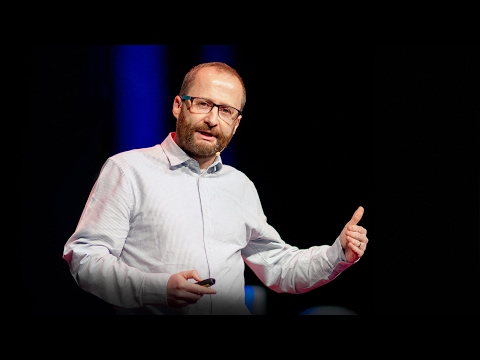

Why you should love statistics | Alan Smith - YouTube

Why you should love statistics | Alan Smith
https://www.youtube.com/watch?v=ogeGJS0GEF4
[TED](https://www.youtube.com/channel/UCAuUUnT6oDeKwE6v1NGQxug)
138,105 views views
Published on Feb 22, 2017

|     |
| --- |
| [(L)](https://www.youtube.com/watch?v=ogeGJS0GEF4) |

Description

Think you're good at guessing stats? Guess again. Whether we consider ourselves math people or not, our ability to understand and work with numbers is terribly limited, says data visualization expert Alan Smith. In this delightful talk, Smith explores the mismatch between what we know and what we think we know.

TEDTalks is a daily video podcast of the best talks and performances from the TED Conference, where the world's leading thinkers and doers give the talk of their lives in 18 minutes (or less). Look for talks on Technology, Entertainment and Design -- plus science, business, global issues, the arts and much more. Find closed captions and translated subtitles in many languages at [http://www.ted.com/translate](https://www.youtube.com/redirect?event=video_description&v=ogeGJS0GEF4&q=http%3A%2F%2Fwww.ted.com%2Ftranslate&redir_token=KPv5Lg-V7sp5cI3lBLLCHaFQr198MTUxNDkyNjcwNEAxNTE0ODQwMzA0)Follow TED news on Twitter: [http://www.twitter.com/tednews](https://www.youtube.com/redirect?event=video_description&v=ogeGJS0GEF4&q=http%3A%2F%2Fwww.twitter.com%2Ftednews&redir_token=KPv5Lg-V7sp5cI3lBLLCHaFQr198MTUxNDkyNjcwNEAxNTE0ODQwMzA0)Like TED on Facebook: [https://www.facebook.com/TED](https://www.youtube.com/redirect?event=video_description&v=ogeGJS0GEF4&q=https%3A%2F%2Fwww.facebook.com%2FTED&redir_token=KPv5Lg-V7sp5cI3lBLLCHaFQr198MTUxNDkyNjcwNEAxNTE0ODQwMzA0)Subscribe to our channel: [http://www.youtube.com/user/TEDtalksD...](http://www.youtube.com/user/TEDtalksDirector)