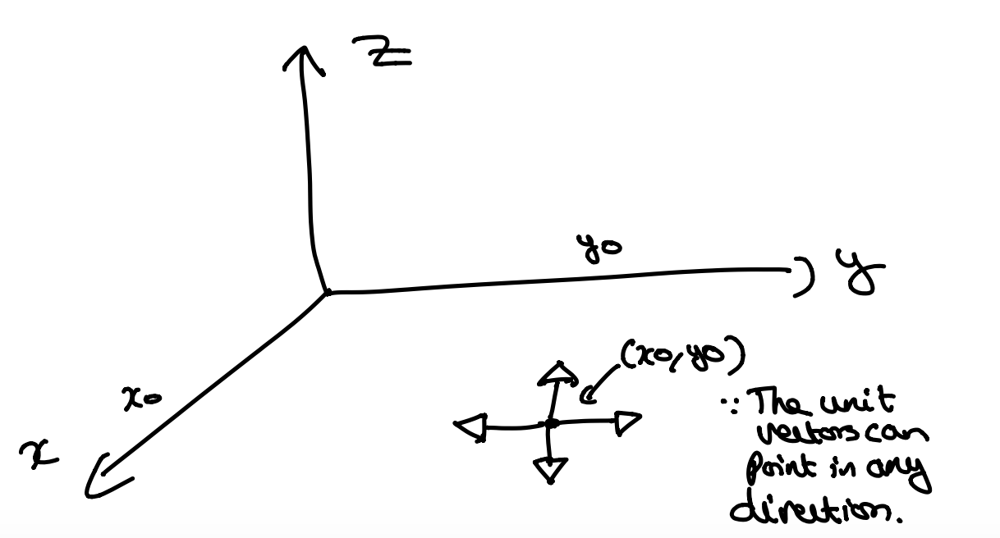
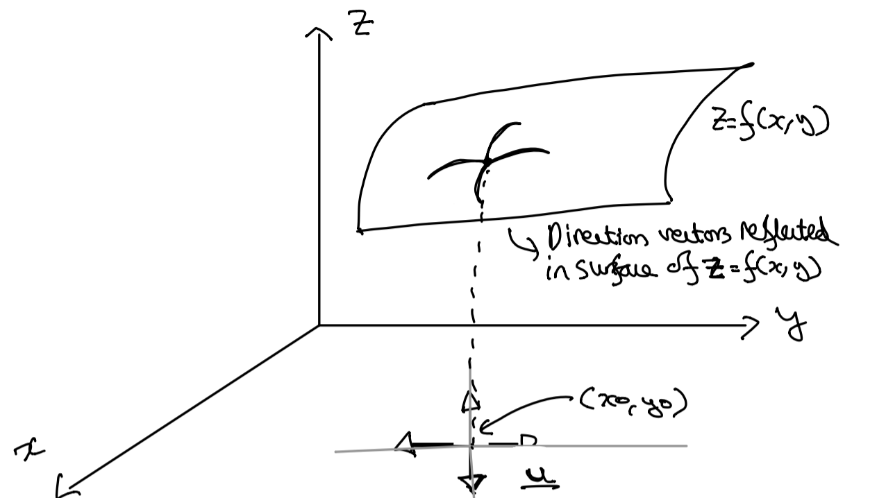
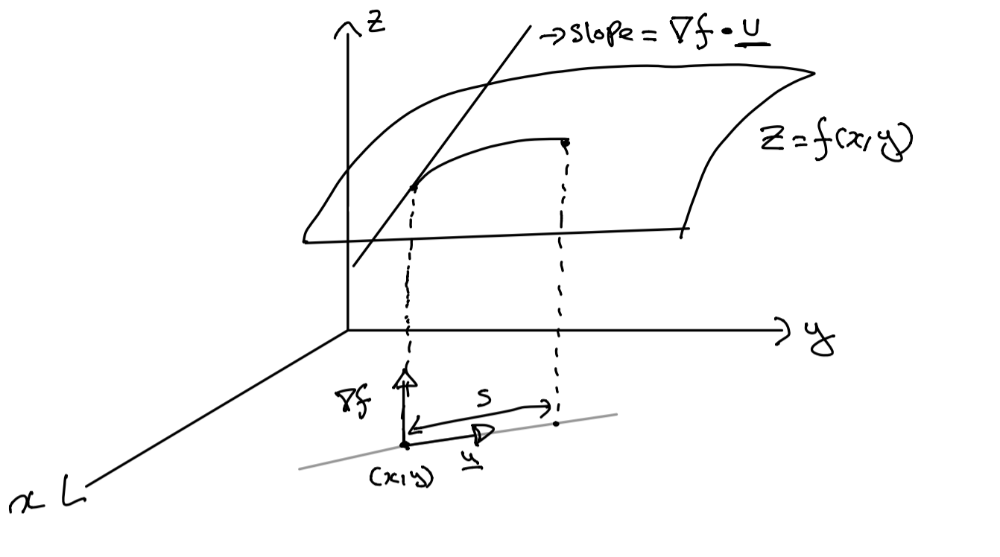

Why “Gradient” Descent? – The Science of Data

Recently I was thinking about the gradient descent algorithm and I was bothered was one question – *Why* do we go in the direction of the (negative) gradient?

Gradient descent is an algorithm which attempts to converge to a minimum of a given function. It does this by taking incremental steps in the direction of the (negative) gradient which it computes using partial derivatives. If some nice conditions hold (like convexity), the algorithm will converge to the minimum. Part of why this algorithm is so effective is because by moving in the direction of the (negative) gradient, it is claimed that the largest decrease in the function f(\mathbf{x})*f*(x) will be attained.

But it’s not obvious to me at all that the same direction as the (negative) gradient leads to the largest decrease in the value of the function f(\mathbf{x})*f*(x). So I did what any self respecting person would do – I asked my mother. Once that failed I went back to a calculus textbook to see what I can find. Here’s what I found. (Note: There will be some very horrendous drawings in this post).

## Setting up the apparatus – Directional Derivatives

It turns out that you can’t really answer this question properly unless you first understand directional derivatives so let’s introduce the idea.

We know that the partial derivatives of a function tell us the instantaneous rate of change of that function in directions **parallel **to the coordinate axes. **Directional derivatives** allow the computation of the rates of change for a function with respect to distance in **any direction**.

Suppose that we wish to compute the instantaneous rate of change of a function f(x,y)*f*(*x*,*y*) with respect to distance from a point (x_0, y_0)(*x*0​,*y*0​) in some direction. Since there are infinitely many directions from (x_0, y_0)(*x*0​,*y*0​) in which we could move, we need a method for describing a **specific direction **which starts at (x_0, y_0)(*x*0​,*y*0​). One way to determine a direction is to use a unit vector \mathbf{u}u (a unit vector has length 1, ||\mathbf{u}|| = 1∣∣u∣∣=1)

=1+2

whose initial point is (x_0, y_0)(*x*0​,*y*0​) and points in a **desired direction**. A very crude illustration is

This unit vector determines a line l*l* in the xy-plane that can be expressed parametrically as

(1) x = x_0 + su_1*x*=*x*0​+*s**u*1​  and y = y_0 + su_2*y*=*y*0​+*s**u*2​

where s*s* is the arc length parameter that has it’s reference point at (x_0, y_0)(*x*0​,*y*0​) and has positive values in the direction of \mathbf{u}u. If s = 0*s*=0, the point (x, y)(*x*,*y*) is equivalent to the reference point x_0, y_0)*x*0​,*y*0​). As s*s* increases, the point (x, y)(*x*,*y*) moves farther away from (x_0, y_0)(*x*0​,*y*0​) along a line l*l* in the direction of \mathbf{u}u.

On the line l*l*, the variable z = f(x = x_0 + su_1, y = y_0 + su_2)*z*=*f*(*x*=*x*0​+*s**u*1​,*y*=*y*0​+*s**u*2​) is a function of the parameter s*s*. The value of the derivative \frac{dz}{ds}|_{s=0}*d**s**d**z*​∣*s*=0​ gives an instantaneous rate of change of f(x, y) = z*f*(*x*,*y*)=*z* with respect to **distance **from (x_0, y_0)(*x*0​,*y*0​) in the direction of \mathbf{u}u.

**Definition: **If f(x,y)*f*(*x*,*y*) is a function of x*x* and y*y*, and if \mathbf{u} = u_1\mathbf{i} + u_2\mathbf{j}u=*u*1​i+*u*2​j is a unit vector, then the direction derivative of f*f* in the direction of \mathbf{u}u at (x_0, y_0)(*x*0​,*y*0​) is denoted by D_{\mathbf{u}}f(x_0, y_0)*D*u​*f*(*x*0​,*y*0​) and is defined by

(2) D_{\mathbf{u}}f(x_0, y_0) = \frac{d}{ds}[f(x_0 + su_1, y_0 + su_2)]|_{s=0}*D*u​*f*(*x*0​,*y*0​)=*d**s**d*​[*f*(*x*0​+*s**u*1​,*y*0​+*s**u*2​)]∣*s*=0​

Geometrically, D_{\mathbf{u}}f(x_0, y_0)*D*u​*f*(*x*0​,*y*0​) can be interpreted as **the slope of the surface z = f(x,y) in the direction of the unit vector u **at the point (x_0, y_0, f(x_0, y_0))(*x*0​,*y*0​,*f*(*x*0​,*y*0​)). Visually this looks like

For a function that is differentiable at a given point, directional derivatives exist in **every direction **from the point and can be computed directly in terms of the first-order partial derivatives of the function.

Directional derivatives can also be expressed in terms of a dot product of partial derivatives (I am omitting some mathematical working here but they’re available upon request).

(3) D_{\mathbf{u}}f(x, y) = \nabla f(x, y) \cdot \mathbf{u}*D*u​*f*(*x*,*y*)=∇*f*(*x*,*y*)⋅u

Where \nabla f(x, y)∇*f*(*x*,*y*) is a vector of partial derivatives. (3) can be interpreted to mean that the slope of the surface z = f(x,y)*z*=*f*(*x*,*y*) at the point (x_0, y_0)(*x*0​,*y*0​) in the direction of \textbf{u}u is the dot product of the gradient with \mathbf{u}u.

## What’s So Special About the Gradient?

Here is the key insight. We can rewrite (3) as

(4) D_{\mathbf{u}}f(x, y) = \nabla f(x, y) \cdot \mathbf{u} = ||\nabla f(x,y)|| \cdot ||\mathbf{u}|| \cdot cos(\theta) = ||\nabla f(x,y)|| \cdot cos(\theta)*D*u​*f*(*x*,*y*)=∇*f*(*x*,*y*)⋅u=∣∣∇*f*(*x*,*y*)∣∣⋅∣∣u∣∣⋅*c**o**s*(*θ*)=∣∣∇*f*(*x*,*y*)∣∣⋅*c**o**s*(*θ*)

where \theta*θ* is the angle between \nabla f(x,y)∇*f*(*x*,*y*) and \mathbf{u}u. The above is true because we note the following identities:

1. \mathbf{u} \cdot \mathbf{v} = ||\mathbf{u}|| \cdot ||\mathbf{v}|| \cdot cos(\theta)u⋅v=∣∣u∣∣⋅∣∣v∣∣⋅*c**o**s*(*θ*)

2. ||\mathbf{u}|| = 1∣∣u∣∣=1

The equation (4) tells us that the **maximum **value of the directional derivative D_{\mathbf{u}}f(x, y)*D*u​*f*(*x*,*y*) is obtained when \theta = 0*θ*=0 (which is ||\nabla f(x,y)||∣∣∇*f*(*x*,*y*)∣∣). In other words, when \mathbf{u}u is in the direction of the gradient \nabla f(x,y)∇*f*(*x*,*y*) (because the angle between them is 0) we experience the greatest **increase** in the directional derivative.

This property follows because of the nature of the Cosine function. It reaches its maximum cos(\theta) = 1*c**o**s*(*θ*)=1 when \theta = 0*θ*=0 and it’s minimum cos(\theta) = -1*c**o**s*(*θ*)=−1 when \theta = \pi*θ*=*π*.

Geometrically, this means that the surface z= f(x,y)*z*=*f*(*x*,*y*) has its **maximum slope **at a point (x,y)(*x*,*y*) in the direction of the gradient, and the value of that maximum slope is ||\nabla f(x,y) ||∣∣∇*f*(*x*,*y*)∣∣.

Similarly, we can reason that the **minimum value **of D_{\mathbf{u}}f(x, y)*D*u​*f*(*x*,*y*) is -||\nabla f(x,y)||−∣∣∇*f*(*x*,*y*)∣∣ and this minimum occurs when \theta = \pi*θ*=*π*. In other words, when \mathbf{u}u is the opposite direction to the gradient \nabla f(x,y)∇*f*(*x*,*y*) we experience the greatest **decrease** in the directional derivative.

Geometrically, this means that the surface z= f(x,y)*z*=*f*(*x*,*y*) has its **minimum slope **at a point (x,y)(*x*,*y*) in the direction **opposite **to the gradient and the value of that minimum slope is -||\nabla f(x,y)||−∣∣∇*f*(*x*,*y*)∣∣.

## Tying it Together

There we have it – going back to calculus basics is what solved my confusion. The directional derivative is the object we use to reason about moving along or moving within functions. This depends on the dot product which in turn depends on the Cosine function which allows us to see how maximum and minimum values of change are attained if we play with values of \theta*θ*.

Just to be sure I played with different \theta*θ* values and indeed found that the gradient vector is what leads to the maximum directional derivative in all my toy examples. I intend to write more about calculus and gradient descent in the future because it’s such a pivotal algorithm in applied Machine Learning.

## References

1. Anton, Biven and Davis – Calculus

2. https://math.oregonstate.edu/home/programs/undergrad/CalculusQuestStudyGuides/vcalc/grad/grad.html

### Share this:

- [Twitter](https://scienceofdata.org/2019/11/24/why-gradient-descent/?share=twitter&nb=1)
- [Facebook](https://scienceofdata.org/2019/11/24/why-gradient-descent/?share=facebook&nb=1)

-

### Like this:

[Like](https://widgets.wp.com/likes/#)

- 

One blogger likes this.