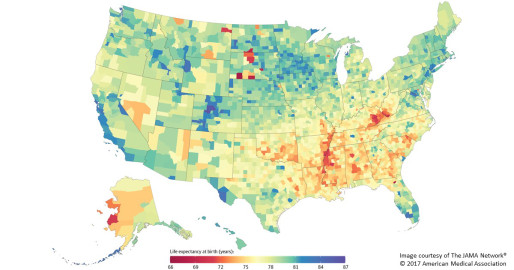

Widening Gap in U.S. Life Expectancy

# Widening Gap in U.S. Life Expectancy

Posted on [May 16, 2017](https://directorsblog.nih.gov/2017/05/16/widening-gap-in-u-s-life-expectancy/) by [Dr. Francis Collins](https://directorsblog.nih.gov/author/collinsfs/)

Caption: Life expectancy at birth by county, 2014. Life expectancy into 80s (blue), 70s (green, yellow, orange), 60s (red).

Americans are living longer than ever before, thanks in large part to NIH-supported research. But a new, heavily publicized study shows that recent gains in longevity aren’t being enjoyed equally in all corners of the United States. In fact, depending on where you live in this great country, life expectancy can vary more than 20 years—a surprisingly wide gap that has widened significantly in recent decades.

Researchers attribute this disturbing gap to a variety of social and economic influences, as well as differences in modifiable behavioral and lifestyle factors, such as obesity, inactivity, and tobacco use. The findings serve as a sobering reminder that, despite the considerable progress made possible by biomedical science, more research is needed to figure out better ways of addressing health disparities and improving life expectancy for all Americans.

In the new study published in *JAMA Internal Medicine*, a research team, partially funded by NIH, found that the average American baby born in 2014 can expect to live to about age 79 [1]. That’s up from a national average of about 73 in 1980 and around 68 in 1950. However, babies born in 2014 in remote Oglala Lakota County, SD, home to the Pine Ridge Indian Reservation, can expect to live only about 66 years. That’s in stark contrast to a child born about 400 miles away in Summit County, CO, where life expectancy at birth now exceeds age 86.

Earlier studies suggested that Americans living in some parts of the country were living more than a decade longer than others [2]. In the new study, a team led by Christopher Murray, director of the Institute for Health Metrics and Evaluation at the University of Washington, Seattle, wanted to get a closer look at those disparities. To fill in as much geographical detail as possible, they mapped life expectancies county by county—the smallest unit for which death records are routinely available—from 1980 to 2014.

Their findings reveal wide differences across the United States, which in some cases rival those of developed and undeveloped countries overseas. Some of the lowest life expectancies are clustered in struggling counties in eastern Kentucky, southwest West Virginia, parts of Alabama, and western Mississippi. The absolute lowest life expectancies in the nation were found in parts of North and South Dakota, most often in counties with large Native American communities.

Thirteen counties across the United States actually have lower life expectancies now than they did in 1980. Life expectancy in Owsley County, KY, for example, dropped from age 72 to age 70.

Residents of central Colorado are living the longest. In addition, certain counties in Alaska, New York, Florida, and Virginia have also made impressive gains in life expectancy in recent decades, as has the District of Columbia.

There were some other bright spots. The data show that the risk of dying before age 5 has dropped across the country. The differences between the counties with the highest and lowest childhood mortality have also narrowed.

In contrast, more than 1 in 10 U.S. counties saw an increased risk of death for adults aged 25 to 45 during the study’s time frame. There are also wide and growing differences among counties in the risk of death for Americans over age 45.

The differences in life span across the country can be explained in part by socioeconomic factors, including race, education, and income, and access to health care. But nearly three-fourths of the variation in longevity is accountable to behavioral and metabolic risk factors, including obesity, exercise, smoking, alcohol and drug addiction, blood pressure, and diabetes.

Changing these factors can be challenging, but it’s certainly doable. Indeed, no matter where you live, you can influence your longevity by making healthy lifestyle choices: don’t smoke, use alcohol in moderation, eat right, and exercise regularly.

**References:**

[1] [Inequalities in life expectancy among US counties, 1980 to 2014](http://jamanetwork.com/journals/jamainternalmedicine/fullarticle/2626194). Dwyer-Lindgren L et al. JAMA Internal Medicine. 2017 May 8.

[2] [Left behind: widening disparities for males and females in US county life expectancy, 1985-2010](https://www.ncbi.nlm.nih.gov/pubmed/23842281). Wang H, Schumacher AE, Levitz CE, Mokdad AH, Murray CJ. Popul Health Metr. 2013 Jul 10;11(1):8.

**Links:**

[Healthy People 2020](https://www.healthypeople.gov/) (U.S. Department of Health and Human Services)

[Christopher Murray](http://www.healthdata.org/about/christopher-jl-murray) (University of Washington, Seattle)

[US Health Map](https://vizhub.healthdata.org/subnational/usa) (University of Washington, Seattle)

*NIH Support: National Institute on Aging*

- [396Share on Facebook (Opens in new window)396](https://directorsblog.nih.gov/2017/05/16/widening-gap-in-u-s-life-expectancy/?share=facebook&nb=1)
- [Click to share on Twitter (Opens in new window)](https://directorsblog.nih.gov/2017/05/16/widening-gap-in-u-s-life-expectancy/?share=twitter&nb=1)
- [Click to share on Google+ (Opens in new window)](https://directorsblog.nih.gov/2017/05/16/widening-gap-in-u-s-life-expectancy/?share=google-plus-1&nb=1)
- [110Click to share on LinkedIn (Opens in new window)110](https://directorsblog.nih.gov/2017/05/16/widening-gap-in-u-s-life-expectancy/?share=linkedin&nb=1)
- [Click to share on Pinterest (Opens in new window)](https://directorsblog.nih.gov/2017/05/16/widening-gap-in-u-s-life-expectancy/?share=pinterest&nb=1)
- [Click to email (Opens in new window)](https://directorsblog.nih.gov/2017/05/16/widening-gap-in-u-s-life-expectancy/?share=email&nb=1)
- [Click to print (Opens in new window)](https://directorsblog.nih.gov/2017/05/16/widening-gap-in-u-s-life-expectancy/#print)
- [More](https://directorsblog.nih.gov/2017/05/16/widening-gap-in-u-s-life-expectancy/#)

-

### *Related*

[A View of the U.S. Obesity Epidemic](https://directorsblog.nih.gov/2012/11/07/a-view-of-the-u-s-obesity-epidemic/)In "Health"

[Weighing in on Sugary Drinks](https://directorsblog.nih.gov/2012/11/13/weighing-in-on-sugary-drinks/)In "Health"

[LabTV: Curious About Improving American Indian Health](https://directorsblog.nih.gov/2015/11/24/labtv-curious-about-improving-american-indian-health/)In "Health"

This entry was posted in [Health](https://directorsblog.nih.gov/category/health/), [Science](https://directorsblog.nih.gov/category/science/) and tagged [Alabama](https://directorsblog.nih.gov/tag/alabama/), [alcohol](https://directorsblog.nih.gov/tag/alcohol/), [behavior](https://directorsblog.nih.gov/tag/behavior/), [childhood mortality](https://directorsblog.nih.gov/tag/childhood-mortality/), [Colorado](https://directorsblog.nih.gov/tag/colorado/), [epidemiology](https://directorsblog.nih.gov/tag/epidemiology/), [exercise](https://directorsblog.nih.gov/tag/exercise/), [geographical disparities](https://directorsblog.nih.gov/tag/geographical-disparities/), [health](https://directorsblog.nih.gov/tag/health-2/), [health disparities](https://directorsblog.nih.gov/tag/health-disparities/), [health metrics](https://directorsblog.nih.gov/tag/health-metrics/), [inequalities](https://directorsblog.nih.gov/tag/inequalities/), [Kentucky](https://directorsblog.nih.gov/tag/kentucky/), [life expectancy](https://directorsblog.nih.gov/tag/life-expectancy/), [lifestyle](https://directorsblog.nih.gov/tag/lifestyle/), [longevity](https://directorsblog.nih.gov/tag/longevity/), [Mississippi](https://directorsblog.nih.gov/tag/mississippi/), [Native American Indian](https://directorsblog.nih.gov/tag/native-american-indian/), [North Dakota](https://directorsblog.nih.gov/tag/north-dakota/), [obesity](https://directorsblog.nih.gov/tag/obesity/), [Oglala Lakota County](https://directorsblog.nih.gov/tag/oglala-lakota-county/), [Pine Ridge Indian Reservation](https://directorsblog.nih.gov/tag/pine-ridge-indian-reservation/), [smoking](https://directorsblog.nih.gov/tag/smoking/), [socioeconomics](https://directorsblog.nih.gov/tag/socioeconomics/), [South Dakota](https://directorsblog.nih.gov/tag/south-dakota/), [Summit County](https://directorsblog.nih.gov/tag/summit-county/), [U.S. counties](https://directorsblog.nih.gov/tag/u-s-counties/), [West Virginia](https://directorsblog.nih.gov/tag/west-virginia/). Bookmark the [permalink](https://directorsblog.nih.gov/2017/05/16/widening-gap-in-u-s-life-expectancy/).