Wikipedia:Unusual articles - Wikipedia

# Wikipedia:Unusual articles

From Wikipedia, the free encyclopedia

Jump to:[navigation](https://en.wikipedia.org/wiki/Wikipedia:Unusual_articles#mw-head),[search](https://en.wikipedia.org/wiki/Wikipedia:Unusual_articles#p-search)

"WP:UA" redirects here. For the Usernames for administrator attention notice board, see [WP:UAA](https://en.wikipedia.org/wiki/Wikipedia:UAA). For WikiProject Ukraine, see [WP:UKRAINE](https://en.wikipedia.org/wiki/Wikipedia:UKRAINE).

|     |     |
| --- | --- |
|  | This page **contains material which is kept because it is considered humorous**. Please do not take it seriously. |

|     |     |
| --- | --- |
|  | **Please note** Articles about things considered unusual may be accepted in Wikipedia if they otherwise fulfill the [criteria for inclusion](https://en.wikipedia.org/wiki/Wikipedia:Criteria_for_inclusion). This page is not an article, and the only criterion for inclusion is consensus that an article fits on this page. Lists of unusual things in Wikipedia mainspace (see [Category:Lists of things considered unusual](https://en.wikipedia.org/wiki/Category:Lists_of_things_considered_unusual)) should have an external reference for each entry that specifically classifies it as unusual, not to make it a [point of view (POV) fork](https://en.wikipedia.org/wiki/Wikipedia:Content_forking) of [original research](https://en.wikipedia.org/wiki/Wikipedia:Or). Still, all such lists risk being deleted for lack of a neutral definition of what counts as "unusual". |

[Shortcuts](https://en.wikipedia.org/wiki/Wikipedia:Shortcut):

- [WP:UA](https://en.wikipedia.org/w/index.php?title=Wikipedia:UA&redirect=no)
- [WP:ODD](https://en.wikipedia.org/w/index.php?title=Wikipedia:ODD&redirect=no)
- [WP:UNUSUAL](https://en.wikipedia.org/w/index.php?title=Wikipedia:UNUSUAL&redirect=no)
- [WP:WEIRD](https://en.wikipedia.org/w/index.php?title=Wikipedia:WEIRD&redirect=no)

[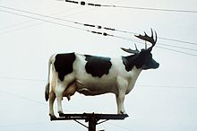](https://en.wikipedia.org/wiki/File:Cow-on_pole,_with_antlers.jpeg)

[(L)](https://en.wikipedia.org/wiki/File:Cow-on_pole,_with_antlers.jpeg)

A cow with antlers atop a pole. Wikipedia contains other images and articles that are [similarly shocking](https://en.wikipedia.org/wiki/Sibilance) or [udderly amoosing](https://en.wikipedia.org/wiki/Pun).

There are over five million articles in the English Wikipedia. These are the ones that Wikipedians have identified as being a bit unusual. These articles are verifiable, valuable contributions to the encyclopedia, but are a bit odd, whimsical, or something you would not expect to find in *[Encyclopædia Britannica](https://en.wikipedia.org/wiki/Encyclop%C3%A6dia_Britannica)*. We should take special care to meet the highest standards of an encyclopedia with these articles lest they make Wikipedia appear *[idiosyncratic](https://en.wiktionary.org/wiki/idiosyncratic)*. If you wish to add articles to this list, the article in question should preferably meet one or more of these criteria:

- The article is something a reasonable person would not expect to find in a standard encyclopedia.
- The subject is a highly unusual combination of concepts, such as [cosmic latte](https://en.wikipedia.org/wiki/Cosmic_latte), [death from laughter](https://en.wikipedia.org/wiki/Death_from_laughter), etc.
- The subject is a clear anomaly—something that defies common sense, common expectations or common knowledge, such as [Bir Tawil](https://en.wikipedia.org/wiki/Bir_Tawil), [Märket](https://en.wikipedia.org/wiki/M%C3%A4rket), [Phineas Gage](https://en.wikipedia.org/wiki/Phineas_Gage), [List of snow events in Florida](https://en.wikipedia.org/wiki/List_of_snow_events_in_Florida), etc.
- The subject is well-documented for unexpected notoriety or an unplanned [cult following](https://en.wikipedia.org/wiki/Cult_following) at extreme levels, such as [Ampelmännchen](https://en.wikipedia.org/wiki/Ampelm%C3%A4nnchen) or [All your base are belong to us](https://en.wikipedia.org/wiki/All_your_base_are_belong_to_us).
- The subject is a notorious [hoax](https://en.wikipedia.org/wiki/Hoax), such as [Sokal affair](https://en.wikipedia.org/wiki/Sokal_affair) or [Mary Toft](https://en.wikipedia.org/wiki/Mary_Toft).
- The subject would normally be found amusing, though serious.
- The article is a list or collection of articles or subjects meeting the criteria above.

This definition is not precise; some articles may still be considered unusual even if they do not fit these guidelines.

To keep the list of interest to readers, each entry on this list should be an article on its own (not merely a section in a less unusual article) and of decent quality, in large meeting [Wikipedia's manual of style](https://en.wikipedia.org/wiki/Wikipedia:Manual_of_style). For unusual contributions that are of greater levity, see [Wikipedia:Silly Things](https://en.wikipedia.org/wiki/Wikipedia:Silly_Things). *A star () indicates a [featured article](https://en.wikipedia.org/wiki/Wikipedia:Featured_articles). A plus () indicates a [good article](https://en.wikipedia.org/wiki/Wikipedia:Good_articles).*

## Contents

 [[hide]()]

- [1  Places and infrastructure](https://en.wikipedia.org/wiki/Wikipedia:Unusual_articles#Places_and_infrastructure)
    - [1.1  Americas](https://en.wikipedia.org/wiki/Wikipedia:Unusual_articles#Americas)
    - [1.2  Africa](https://en.wikipedia.org/wiki/Wikipedia:Unusual_articles#Africa)
    - [1.3  Antarctica](https://en.wikipedia.org/wiki/Wikipedia:Unusual_articles#Antarctica)
    - [1.4  Asia](https://en.wikipedia.org/wiki/Wikipedia:Unusual_articles#Asia)
    - [1.5  Europe](https://en.wikipedia.org/wiki/Wikipedia:Unusual_articles#Europe)
    - [1.6  Oceania](https://en.wikipedia.org/wiki/Wikipedia:Unusual_articles#Oceania)
    - [1.7  Geography](https://en.wikipedia.org/wiki/Wikipedia:Unusual_articles#Geography)
- [2  History](https://en.wikipedia.org/wiki/Wikipedia:Unusual_articles#History)
- [3  Mathematics and numbers](https://en.wikipedia.org/wiki/Wikipedia:Unusual_articles#Mathematics_and_numbers)
    - [3.1  Dates and timekeeping](https://en.wikipedia.org/wiki/Wikipedia:Unusual_articles#Dates_and_timekeeping)
- [4  Language](https://en.wikipedia.org/wiki/Wikipedia:Unusual_articles#Language)
    - [4.1  Weird names](https://en.wikipedia.org/wiki/Wikipedia:Unusual_articles#Weird_names)
- [5  Science](https://en.wikipedia.org/wiki/Wikipedia:Unusual_articles#Science)
    - [5.1  Physics](https://en.wikipedia.org/wiki/Wikipedia:Unusual_articles#Physics)
    - [5.2  Earth sciences](https://en.wikipedia.org/wiki/Wikipedia:Unusual_articles#Earth_sciences)
    - [5.3  Chemistry and material science](https://en.wikipedia.org/wiki/Wikipedia:Unusual_articles#Chemistry_and_material_science)
    - [5.4  Space and astronomy](https://en.wikipedia.org/wiki/Wikipedia:Unusual_articles#Space_and_astronomy)
    - [5.5  Medicine and health](https://en.wikipedia.org/wiki/Wikipedia:Unusual_articles#Medicine_and_health)
        - [5.5.1  Individual patients and staff](https://en.wikipedia.org/wiki/Wikipedia:Unusual_articles#Individual_patients_and_staff)
    - [5.6  Nervous system and behaviour](https://en.wikipedia.org/wiki/Wikipedia:Unusual_articles#Nervous_system_and_behaviour)
    - [5.7  Animals](https://en.wikipedia.org/wiki/Wikipedia:Unusual_articles#Animals)
        - [5.7.1  Chickens](https://en.wikipedia.org/wiki/Wikipedia:Unusual_articles#Chickens)
        - [5.7.2  Squirrels](https://en.wikipedia.org/wiki/Wikipedia:Unusual_articles#Squirrels)
        - [5.7.3  Mammals](https://en.wikipedia.org/wiki/Wikipedia:Unusual_articles#Mammals)
        - [5.7.4  Individual animals](https://en.wikipedia.org/wiki/Wikipedia:Unusual_articles#Individual_animals)
    - [5.8  Names in biology](https://en.wikipedia.org/wiki/Wikipedia:Unusual_articles#Names_in_biology)
    - [5.9  Plants](https://en.wikipedia.org/wiki/Wikipedia:Unusual_articles#Plants)
- [6  Technology, inventions and products](https://en.wikipedia.org/wiki/Wikipedia:Unusual_articles#Technology.2C_inventions_and_products)
    - [6.1  Hygiene and sanitation](https://en.wikipedia.org/wiki/Wikipedia:Unusual_articles#Hygiene_and_sanitation)
    - [6.2  Clothing and accessories](https://en.wikipedia.org/wiki/Wikipedia:Unusual_articles#Clothing_and_accessories)
    - [6.3  Transport](https://en.wikipedia.org/wiki/Wikipedia:Unusual_articles#Transport)
    - [6.4  Computing](https://en.wikipedia.org/wiki/Wikipedia:Unusual_articles#Computing)
- [7  Popular culture, entertainment and the arts](https://en.wikipedia.org/wiki/Wikipedia:Unusual_articles#Popular_culture.2C_entertainment_and_the_arts)
    - [7.1  Art](https://en.wikipedia.org/wiki/Wikipedia:Unusual_articles#Art)
    - [7.2  Comics and animation](https://en.wikipedia.org/wiki/Wikipedia:Unusual_articles#Comics_and_animation)
    - [7.3  Literature](https://en.wikipedia.org/wiki/Wikipedia:Unusual_articles#Literature)
    - [7.4  Music](https://en.wikipedia.org/wiki/Wikipedia:Unusual_articles#Music)
    - [7.5  Film](https://en.wikipedia.org/wiki/Wikipedia:Unusual_articles#Film)
    - [7.6  Television](https://en.wikipedia.org/wiki/Wikipedia:Unusual_articles#Television)
    - [7.7  Video games](https://en.wikipedia.org/wiki/Wikipedia:Unusual_articles#Video_games)
    - [7.8  Internet memes and online culture](https://en.wikipedia.org/wiki/Wikipedia:Unusual_articles#Internet_memes_and_online_culture)
    - [7.9  Festivals](https://en.wikipedia.org/wiki/Wikipedia:Unusual_articles#Festivals)
- [8  Food](https://en.wikipedia.org/wiki/Wikipedia:Unusual_articles#Food)
    - [8.1  Beverages](https://en.wikipedia.org/wiki/Wikipedia:Unusual_articles#Beverages)
    - [8.2  Restaurants](https://en.wikipedia.org/wiki/Wikipedia:Unusual_articles#Restaurants)
- [9  Sports](https://en.wikipedia.org/wiki/Wikipedia:Unusual_articles#Sports)
    - [9.1  Animals in sports](https://en.wikipedia.org/wiki/Wikipedia:Unusual_articles#Animals_in_sports)
    - [9.2  Athletes](https://en.wikipedia.org/wiki/Wikipedia:Unusual_articles#Athletes)
    - [9.3  Sport teams and associations](https://en.wikipedia.org/wiki/Wikipedia:Unusual_articles#Sport_teams_and_associations)
    - [9.4  Games and strategy contests](https://en.wikipedia.org/wiki/Wikipedia:Unusual_articles#Games_and_strategy_contests)
- [10  Folklore](https://en.wikipedia.org/wiki/Wikipedia:Unusual_articles#Folklore)
    - [10.1  Cryptozoology and animal folklore](https://en.wikipedia.org/wiki/Wikipedia:Unusual_articles#Cryptozoology_and_animal_folklore)
- [11  Society, economy and law](https://en.wikipedia.org/wiki/Wikipedia:Unusual_articles#Society.2C_economy_and_law)
    - [11.1  Politics and government](https://en.wikipedia.org/wiki/Wikipedia:Unusual_articles#Politics_and_government)
    - [11.2  Business and economics](https://en.wikipedia.org/wiki/Wikipedia:Unusual_articles#Business_and_economics)
    - [11.3  Law, law enforcement and crime](https://en.wikipedia.org/wiki/Wikipedia:Unusual_articles#Law.2C_law_enforcement_and_crime)
    - [11.4  Punishments](https://en.wikipedia.org/wiki/Wikipedia:Unusual_articles#Punishments)
- [12  Religion and spirituality](https://en.wikipedia.org/wiki/Wikipedia:Unusual_articles#Religion_and_spirituality)
- [13  Military](https://en.wikipedia.org/wiki/Wikipedia:Unusual_articles#Military)
    - [13.1  Wars, operations and battles](https://en.wikipedia.org/wiki/Wikipedia:Unusual_articles#Wars.2C_operations_and_battles)
    - [13.2  Weapons and military equipment](https://en.wikipedia.org/wiki/Wikipedia:Unusual_articles#Weapons_and_military_equipment)
- [14  Death](https://en.wikipedia.org/wiki/Wikipedia:Unusual_articles#Death)
- [15  Questions](https://en.wikipedia.org/wiki/Wikipedia:Unusual_articles#Questions)
- [16  Unusual featured pictures](https://en.wikipedia.org/wiki/Wikipedia:Unusual_articles#Unusual_featured_pictures)
- [17  See also](https://en.wikipedia.org/wiki/Wikipedia:Unusual_articles#See_also)
- [18  External links](https://en.wikipedia.org/wiki/Wikipedia:Unusual_articles#External_links)

## Places and infrastructure[[edit](https://en.wikipedia.org/w/index.php?title=Wikipedia:Unusual_articles/Places_and_infrastructure&action=edit&section=T-1)]

[(L)](https://en.wikipedia.org/wiki/File:Wales_but_not_part_of_the_UK.JPG)

[Ever want to start your own country?](https://en.wikipedia.org/wiki/Micronations)

[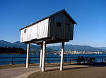](https://en.wikipedia.org/wiki/File:Vancouver_Folly_coal_harbour.jpg)

[(L)](https://en.wikipedia.org/wiki/File:Vancouver_Folly_coal_harbour.jpg)

Good golly, Miss Molly – jus' love your [folly](https://en.wikipedia.org/wiki/Folly)!

|     |     |
| --- | --- |
| **[Folly](https://en.wikipedia.org/wiki/Folly)** | Buildings prized for their uselessness. |
| **[Gravity hill](https://en.wikipedia.org/wiki/Gravity_hill)** | A hill that gives the illusion of objects rolling *up* it. |
| **[List of Eiffel Tower replicas](https://en.wikipedia.org/wiki/List_of_Eiffel_Tower_replicas)** | Not as unique as you might have thought. |
| **[List of fictional island nations](https://en.wikipedia.org/wiki/List_of_fictional_island_nations)** | These islands have not been mistaken for submarines. |
| **[List of missing landmarks in Spain](https://en.wikipedia.org/wiki/List_of_missing_landmarks_in_Spain)** | Over 60 interesting buildings, including larger castles, royal palaces, leaning towers, city gates which were completely or partially demolished and no longer exist, with their respective articles and images. |
| **[List of tautological place names](https://en.wikipedia.org/wiki/List_of_tautological_place_names)** | Place names that contain [truisms](https://en.wikipedia.org/wiki/Truism) and say what they are. |
| **[Pizza farm](https://en.wikipedia.org/wiki/Pizza_farm)** | All the ingredients of pizza, grown in one convenient location! |
| **[Spite house](https://en.wikipedia.org/wiki/Spite_house)** | Various houses built solely out of spite for their neighbors. |
| **[Leaning Tower of Suurhusen](https://en.wikipedia.org/wiki/Leaning_Tower_of_Suurhusen)** | Beating the world-famous Leaning Tower of Pisa by 1.22 degrees. |
| **[Nail house](https://en.wikipedia.org/wiki/Nail_house)** | A tiny house completely surrounded by a hole in the ground from a massive construction project. |

### Americas[[edit](https://en.wikipedia.org/w/index.php?title=Wikipedia:Unusual_articles/Places_and_infrastructure&action=edit&section=T-2)]

[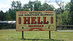](https://en.wikipedia.org/wiki/File:NWS_Hell_MI.jpg)

[(L)](https://en.wikipedia.org/wiki/File:NWS_Hell_MI.jpg)

"I don't care, you can name it [Hell](https://en.wikipedia.org/wiki/Hell,_Michigan) for all I care…"

[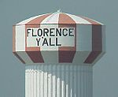](https://en.wikipedia.org/wiki/File:Florence-yall.jpg)

[(L)](https://en.wikipedia.org/wiki/File:Florence-yall.jpg)

["That says "MALL"... doesn't it...?"](https://en.wikipedia.org/wiki/Florence_Y%27all_Water_Tower)

[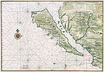](https://en.wikipedia.org/wiki/File:California_island_Vinckeboons5.jpg)

[(L)](https://en.wikipedia.org/wiki/File:California_island_Vinckeboons5.jpg)

When [California hadn't quite joined the United States](https://en.wikipedia.org/wiki/Island_of_California).

[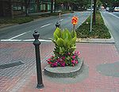](https://en.wikipedia.org/wiki/File:Mill_Ends_Park.jpg)

[(L)](https://en.wikipedia.org/wiki/File:Mill_Ends_Park.jpg)
[Mill Ends Park](https://en.wikipedia.org/wiki/Mill_Ends_Park),
the smallest park in the world.

[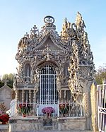](https://en.wikipedia.org/wiki/File:Tombeau_Facteur_Cheval.JPG)

[(L)](https://en.wikipedia.org/wiki/File:Tombeau_Facteur_Cheval.JPG)
[A postman](https://en.wikipedia.org/wiki/Ferdinand_Cheval)'s labor of love.

|     |     |
| --- | --- |
| **[Agloe, New York](https://en.wikipedia.org/wiki/Agloe,_New_York)** | A fictional town in [New York](https://en.wikipedia.org/wiki/New_York). |
| **[Aroma of Tacoma](https://en.wikipedia.org/wiki/Aroma_of_Tacoma)** | "[What an incredible *smell* you've discovered](https://en.wikipedia.org/wiki/Star_Wars_(film))" could have been this Washington city's motto? |
| **[Avenue Road](https://en.wikipedia.org/wiki/Avenue_Road)** | Is this thoroughfare in [Toronto](https://en.wikipedia.org/wiki/Toronto) an avenue or is it a road? |
| **[Badlands Guardian](https://en.wikipedia.org/wiki/Badlands_Guardian)** | A natural topographic feature in Canada, which, when viewed from above, looks remarkably like a human wearing a [Native American](https://en.wikipedia.org/wiki/First_Nations) headdress and earbuds. |
| **[Beatosu and Goblu](https://en.wikipedia.org/wiki/Beatosu_and_Goblu)** | Two non-existent [Ohio](https://en.wikipedia.org/wiki/Ohio) towns that appeared on [Michigan](https://en.wikipedia.org/wiki/Michigan)'s official highway map as a reference to the [University of Michigan](https://en.wikipedia.org/wiki/University_of_Michigan) and their rivals, [Ohio State University](https://en.wikipedia.org/wiki/Ohio_State_University). |
| **[Bubbly Creek](https://en.wikipedia.org/wiki/Bubbly_Creek)** | The branch of the [Chicago River](https://en.wikipedia.org/wiki/Chicago_River) that is so contaminated with blood from the [Stock Yards](https://en.wikipedia.org/wiki/Union_Stock_Yards) that it bubbles to this day. |
| **[Centralia, Pennsylvania](https://en.wikipedia.org/wiki/Centralia,_Pennsylvania)** | A town that's been on fire since 1962. |
| **[Clinton Road (New Jersey)](https://en.wikipedia.org/wiki/Clinton_Road_(New_Jersey))** | In addition to having the longest traffic light in the country, the road is also notorious for reported occurrences of paranormal activity. |
| **[Dixie Square Mall](https://en.wikipedia.org/wiki/Dixie_Square_Mall)** | A [shopping mall](https://en.wikipedia.org/wiki/Shopping_mall) that stood abandoned for over twice as long as it was in business, until it was finally demolished in 2012. It was featured in the 1980 film *[The Blues Brothers](https://en.wikipedia.org/wiki/The_Blues_Brothers_(film))* and became a popular target for [urban explorers](https://en.wikipedia.org/wiki/Urban_explorers). |
| **[Florence Y'all Water Tower](https://en.wikipedia.org/wiki/Florence_Y%27all_Water_Tower)** | A [Northern](https://en.wikipedia.org/wiki/Northern_Kentucky)  [Kentucky](https://en.wikipedia.org/wiki/Kentucky) town's unique "welcome" sign. |
| **[Former counties, cities, and towns of Virginia](https://en.wikipedia.org/wiki/Former_counties,_cities,_and_towns_of_Virginia)** | All the places that are no longer found in [Virginia](https://en.wikipedia.org/wiki/Virginia), USA, such as Illinois County, and a few that never were (including [Walton's Mountain](https://en.wikipedia.org/wiki/Walton%27s_Mountain)). |
| **[Free Stamp](https://en.wikipedia.org/wiki/Willard_Park_(Cleveland_park))** | A really big stamp in [Cleveland, Ohio](https://en.wikipedia.org/wiki/Cleveland,_Ohio). |
| **[Greater Green River Intergalactic Spaceport](https://en.wikipedia.org/wiki/Greater_Green_River_Intergalactic_Spaceport)** | Consists entirely of a deeply rutted unmanned strip of soil/gravel and a windsock. |
| **[Hell](https://en.wikipedia.org/wiki/Hell,_Michigan) and [Paradise, Michigan](https://en.wikipedia.org/wiki/Paradise,_Michigan)** | See also [Purgatory](https://en.wikipedia.org/wiki/Purgatory_Correctional_Facility). |
| **[Interstate 180 (Wyoming)](https://en.wikipedia.org/wiki/Interstate_180_(Wyoming))** | An [Interstate Highway](https://en.wikipedia.org/wiki/Interstate_Highway_System) that isn't really a freeway at all. |
| **[Republic of Indian Stream](https://en.wikipedia.org/wiki/Republic_of_Indian_Stream)** | An area of land in northern [New Hampshire](https://en.wikipedia.org/wiki/New_Hampshire), USA, that was an independent country from 1832 to 1835. |
| **[Island of California](https://en.wikipedia.org/wiki/Island_of_California)** | The third largest [U.S. State](https://en.wikipedia.org/wiki/U.S._State) was formerly an island – on paper. |
| **[Jackass Mountain](https://en.wikipedia.org/wiki/Jackass_Mountain)** | Named – probably – for a [muletrain](https://en.wikipedia.org/wiki/Mule) that fell off the edge of the canyon. |
| **[Jackass Flats](https://en.wikipedia.org/wiki/Jackass_Flats)** | Was the aptly named test site for the world's first (and so far only) [nuclear powered rocket engines](https://en.wikipedia.org/wiki/Project_Rover) |
| **[Jerimoth Hill](https://en.wikipedia.org/wiki/Jerimoth_Hill)** | The highest natural point in [Rhode Island](https://en.wikipedia.org/wiki/Rhode_Island). For years, one of the toughest highpoints in the U.S. to scale, not because of its 812-foot (247 m) height, but because of an angry old man who lived nearby. |
| **[List of Las Vegas casinos that never opened](https://en.wikipedia.org/wiki/List_of_Las_Vegas_casinos_that_never_opened)** | What happened on the drawing board stayed on the drawing board. |
|   **[M-185 (Michigan highway)](https://en.wikipedia.org/wiki/M-185_(Michigan_highway))** | The only state highway in the country that bans motor vehicles. |
| **[Mary Ellis grave](https://en.wikipedia.org/wiki/Mary_Ellis_grave)** | A grave that found itself in the middle of a movie theater parking lot. |
| **[Michigan left](https://en.wikipedia.org/wiki/Michigan_left)** | Directions are more complicated in Michigan. |
| **[Mill Ends Park](https://en.wikipedia.org/wiki/Mill_Ends_Park)** | The smallest park in the world – 452 in2 (0.292 m2) – is in [Portland, Oregon](https://en.wikipedia.org/wiki/Portland,_Oregon). |
| **[Mojave phone booth](https://en.wikipedia.org/wiki/Mojave_phone_booth)** | A public phone booth that stood for several years in the middle of a desert, miles away from any roads or other structures. |
| **[Mollie's Nipple](https://en.wikipedia.org/wiki/Mollie%27s_Nipple)** | There are at least seven of them. |
| **[North, South Carolina](https://en.wikipedia.org/wiki/North,_South_Carolina)** | Hardly near the border with [North Carolina](https://en.wikipedia.org/wiki/North_Carolina), rather more in the middle. Also home of the [North Auxiliary Airfield](https://en.wikipedia.org/wiki/North_Auxiliary_Airfield). |
| **[Pyramid mausoleums in North America](https://en.wikipedia.org/wiki/List_of_pyramid_mausoleums_in_North_America)** | Arizona Governor [George Hunt](https://en.wikipedia.org/wiki/George_W._P._Hunt) will hereafter be addressed as "Pharaoh George I". |
| **[Ragged Ass Road](https://en.wikipedia.org/wiki/Ragged_Ass_Road_(street))** | Misunderstood more often by airline staff than the people they ferry. |
| **[Republic of Molossia](https://en.wikipedia.org/wiki/Republic_of_Molossia)** | A one-person micronation in [Nevada](https://en.wikipedia.org/wiki/Nevada), USA which takes the meaning of the phrase "[a man's home is his castle](https://en.wikipedia.org/wiki/Castle_Doctrine_in_the_United_States)" to new extremes. |
| **[Monowi](https://en.wikipedia.org/wiki/Monowi,_Nebraska)** | A village in Nebraska with a population of one. Hi, Elsie! |
| **[Nitt Witt Ridge](https://en.wikipedia.org/wiki/Nitt_Witt_Ridge)** | A house in [California](https://en.wikipedia.org/wiki/California), built out of beer cans, abalone shells, car parts, and other garbage previously tossed out by local residents, is now a historic landmark. |
| **[Point Roberts, Washington](https://en.wikipedia.org/wiki/Point_Roberts,_Washington)** | When defining international boundaries, sometimes a straight line isn't the best solution. |
| **[Raising of Chicago](https://en.wikipedia.org/wiki/Raising_of_Chicago)** | During the 1850s, the city was raised on jacks, building by building. |
| **[Rio Rico, Texas](https://en.wikipedia.org/wiki/Rio_Rico,_Tamaulipas)** | A city that was ceded by the United States to Mexico in 1977 due to an earlier diversion of the Rio Grande. |
| **[Rough and Ready, California](https://en.wikipedia.org/wiki/Rough_and_Ready,_California)** | A currently populated, unincorporated mining town in the United States that seceded from the Union in 1850, forming the "Great Republic of Rough and Ready". Secession was rescinded less than three months later when its citizens noticed that they could not celebrate US independence. |
| **[Sam Kee Building](https://en.wikipedia.org/wiki/Sam_Kee_Building)** | Known as the world's narrowest commercial building. |
| **[S.N.P.J., Pennsylvania](https://en.wikipedia.org/wiki/S.N.P.J.,_Pennsylvania)** | A municipality consisting solely of a [Slovenian](https://en.wikipedia.org/wiki/Slovenia) fraternity's recreation center, established (in part) to get around [liquor laws](https://en.wikipedia.org/wiki/Alcohol_laws_of_Pennsylvania). |
| **[Spiral Island](https://en.wikipedia.org/wiki/Spiral_Island)** | An artificial island, now destroyed, built from thousands of empty floating plastic bottles. |
| **[Tower of Wooden Pallets](https://en.wikipedia.org/wiki/Tower_of_Wooden_Pallets)** | Now replaced by an apartment building, its site remains City of Los Angeles Historic Cultural Monument no. 184. |
| **[Truth or Consequences, New Mexico](https://en.wikipedia.org/wiki/Truth_or_Consequences,_New_Mexico)** | A town that got its name from a game show. |
| **[Wedge](https://en.wikipedia.org/wiki/Wedge_(border))** | It's harder than you think to construct the state of [Delaware](https://en.wikipedia.org/wiki/Delaware) with a ruler and compass. |
|   **[World's littlest skyscraper](https://en.wikipedia.org/wiki/World%27s_littlest_skyscraper)** | The result of a [fraudulent](https://en.wikipedia.org/wiki/Fraud) investment scheme, it's a four-story brick building constructed in 1920 in downtown [Wichita Falls](https://en.wikipedia.org/wiki/Wichita_Falls,_Texas), [Texas](https://en.wikipedia.org/wiki/Texas), that has only one room on each of its four floors. |
| **[Winchester Mystery House](https://en.wikipedia.org/wiki/Winchester_Mystery_House)** | A house believed to be haunted by the ghosts of individuals killed by [Winchester rifles](https://en.wikipedia.org/wiki/Winchester_rifle). |

### Africa[[edit](https://en.wikipedia.org/w/index.php?title=Wikipedia:Unusual_articles/Places_and_infrastructure&action=edit&section=T-3)]

|     |     |
| --- | --- |
| **[Bir Tawil](https://en.wikipedia.org/wiki/Bir_Tawil)** | One of the few places on Earth not claimed by any country. An American claimed it in 2014 as the Kingdom of North Sudan so he could make his daughter a princess. |
| **[Mountains of Kong](https://en.wikipedia.org/wiki/Mountains_of_Kong)** | A trans-African mountain range that existed only on Western maps of the 19th century. |
| **[Null Island](https://en.wikipedia.org/wiki/Null_Island)** | A fictional island in the Gulf of Guinea, at 0°N 0°E. |
| **[Republic of Benin (1967)](https://en.wikipedia.org/wiki/Republic_of_Benin_(1967))** | The shortest-lived state in history; it was independent for only seven hours (07:00 to 14:00 on [19 September](https://en.wikipedia.org/wiki/19_September)  [1967](https://en.wikipedia.org/wiki/1967)). |

### Antarctica[[edit](https://en.wikipedia.org/w/index.php?title=Wikipedia:Unusual_articles/Places_and_infrastructure&action=edit&section=T-4)]

|     |     |
| --- | --- |
| **[Emilio Palma](https://en.wikipedia.org/wiki/Emilio_Palma)** | An Argentine national who is the first person known to be born on the continent of Antarctica. |
| **[Scouting in the Antarctic](https://en.wikipedia.org/wiki/Scouting_in_the_Antarctic)** | Always prepared for glaciers and penguins. |

### Asia[[edit](https://en.wikipedia.org/w/index.php?title=Wikipedia:Unusual_articles/Places_and_infrastructure&action=edit&section=T-5)]

[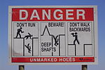](https://en.wikipedia.org/wiki/File:Coober_Pedy_Warning_sign_02427.jpg)

[(L)](https://en.wikipedia.org/wiki/File:Coober_Pedy_Warning_sign_02427.jpg)

Watch your step around [Coober Pedy](https://en.wikipedia.org/wiki/Coober_Pedy).

[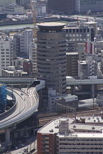](https://en.wikipedia.org/wiki/File:Building_penetrated_by_an_expressway_001_OSAKA_JPN.jpg)

[(L)](https://en.wikipedia.org/wiki/File:Building_penetrated_by_an_expressway_001_OSAKA_JPN.jpg)

[A skyscraper](https://en.wikipedia.org/wiki/Gate_Tower_Building) with en-suite highway.

|     |     |
| --- | --- |
| **[Camp Bonifas](https://en.wikipedia.org/wiki/Camp_Bonifas)** | The bunkers on this golf course feature machine-guns and landmines. |
| **[Gate Tower Building](https://en.wikipedia.org/wiki/Gate_Tower_Building)** | A skyscraper in Japan that has a highway passing through its fifth, sixth and seventh floors. |
| **[Jewish Autonomous Oblast](https://en.wikipedia.org/wiki/Jewish_Autonomous_Oblast)** | In the depth of Eastern [Siberia](https://en.wikipedia.org/wiki/Siberia) there's a place with street names in [Yiddish](https://en.wikipedia.org/wiki/Yiddish), even though 95% of its population is not Jewish. |
| [3eeceb88fd35472ca4cb5db223c1c531dce1ac01](../_resources/c9301caeddda509c68ee3b33563beac2.png)  **[Kowloon Walled City](https://en.wikipedia.org/wiki/Kowloon_Walled_City)** | A former Chinese enclave in Hong Kong, known for its extremely high population density, food courts which served dog meat, and claustrophobic dwellings. |
| **[Love Land](https://en.wikipedia.org/wiki/Love_Land_(South_Korea))** | An erotic-themed sculpture park on [Jeju](https://en.wikipedia.org/wiki/Jeju-do) island in South Korea. |
|   **[Ryugyong Hotel](https://en.wikipedia.org/wiki/Ryugyong_Hotel)** | Once, it would have been the world's tallest hotel – except it lacked windows, fittings, or fixtures for over twenty years. |
| **[Seikan Tunnel Tappi Shakō Line](https://en.wikipedia.org/wiki/Seikan_Tunnel_Tappi_Shak%C5%8D_Line)** | The Closed funicular that connects a underground train station inside the [Seikan Tunnel](https://en.wikipedia.org/wiki/Seikan_Tunnel) with a museum. |
| **[Shingō, Aomori](https://en.wikipedia.org/wiki/Shing%C5%8D,_Aomori)** | [Did you know](https://en.wikipedia.org/wiki/Wikipedia:DYK) that Jesus escaped his crucifixion and raised a family in Japan? |
| **[Wonderland Amusement Park (Beijing)](https://en.wikipedia.org/wiki/Wonderland_Amusement_Park_(Beijing))** | The largest abandoned amusement park in Asia. |
| **[Hallstatt (China)](https://en.wikipedia.org/wiki/Hallstatt_(China))** | Proof that China is the world champion, when it comes to copying things, even when that thing is a town in Austria. |
| **[X-Seed 4000](https://en.wikipedia.org/wiki/X-Seed_4000)** | The tallest building ever designed, standing 4 kilometres (2.5 mi) tall and housing 500 000 to 1 000 000 people on 800 floors. It is, however, "never meant to be built". |
| **[San Serriffe](https://en.wikipedia.org/wiki/San_Serriffe)** | A lesser known island in the Indian Ocean, subject of the April 1, 1977 Guardian newspaper edition. |

### Europe[[edit](https://en.wikipedia.org/w/index.php?title=Wikipedia:Unusual_articles/Places_and_infrastructure&action=edit&section=T-6)]

[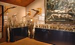](https://en.wikipedia.org/wiki/File:Husavik_Phallusmuseum.jpg)

[(L)](https://en.wikipedia.org/wiki/File:Husavik_Phallusmuseum.jpg)

[Make sure you're covered](https://en.wikipedia.org/wiki/Icelandic_Phallological_Museum).

[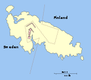](https://en.wikipedia.org/wiki/File:M%C3%A4rket_Island_map.svg)

[(L)](https://en.wikipedia.org/wiki/File:M%C3%A4rket_Island_map.svg)

Careful where you put [that lighthouse](https://en.wikipedia.org/wiki/M%C3%A4rket), Eugene...

[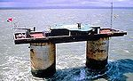](https://en.wikipedia.org/wiki/File:Sealand_fortress.jpg)

[(L)](https://en.wikipedia.org/wiki/File:Sealand_fortress.jpg)

Welcome to the [Principality of Sealand](https://en.wikipedia.org/wiki/Principality_of_Sealand).

[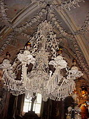](https://en.wikipedia.org/wiki/File:Sedlec-Ossuary.jpg)

[(L)](https://en.wikipedia.org/wiki/File:Sedlec-Ossuary.jpg)

A chandelier, decorating the [Sedlec Ossuary](https://en.wikipedia.org/wiki/Sedlec_Ossuary), made from human bones.

|     |     |
| --- | --- |
| **[Argleton](https://en.wikipedia.org/wiki/Argleton)** | A non-existent town in [Lancashire](https://en.wikipedia.org/wiki/Lancashire), [England](https://en.wikipedia.org/wiki/England), that appeared on [Google Maps](https://en.wikipedia.org/wiki/Google_Maps). |
| **[Baarle-Hertog](https://en.wikipedia.org/wiki/Baarle-Hertog)** and **[Baarle-Nassau](https://en.wikipedia.org/wiki/Baarle-Nassau)** | Two municipalities, one of Belgium and one of the Netherlands, that [surround each other twice and many times over](https://en.wikipedia.org/wiki/Enclave_and_exclave). Some houses and shops are in both countries. |
| **[Barcelona Supercomputing Center](https://en.wikipedia.org/wiki/Barcelona_Supercomputing_Center)** | A supercomputer in a medieval chapel. |
| **[Beans and Bacon mine](https://en.wikipedia.org/wiki/Beans_and_Bacon_mine)** | With such little ventilation, visitors may want to avoid any source of ignition. Nearby mines are not to be outdone and have the following names: Mule Spinner, Frogs Hole, Cackle Mackle and Wanton Legs. |
| **[Bielefeld Conspiracy](https://en.wikipedia.org/wiki/Bielefeld_Conspiracy)** | The *Bielefeld-Verschwörung* tries to hide the horrible truth about a city in [Westphalia](https://en.wikipedia.org/wiki/Westphalia), [Germany](https://en.wikipedia.org/wiki/Germany) that doesn't exist... well, maybe. |
| **[Brennender Berg](https://en.wikipedia.org/wiki/Brennender_Berg)** | A German coal mine on fire since 1688. |
| **[Büsingen am Hochrhein](https://en.wikipedia.org/wiki/B%C3%BCsingen_am_Hochrhein)** | A German town that is [fully contained](https://en.wikipedia.org/wiki/Exclave) within Switzerland. |
| **[Carpatho-Ukraine](https://en.wikipedia.org/wiki/Carpatho-Ukraine)** | The second shortest-lived state in history (see [Benin Republic in Nigeria](https://en.wikipedia.org/wiki/Republic_of_Benin_(1967))); it was independent for only 24 hours. |
| **[Cheap](https://en.wikipedia.org/wiki/Cheap_(ward))** | Not very cheap once you consider it's in the centre of the [City of London](https://en.wikipedia.org/wiki/City_of_London). |
| **[Colletto Fava](https://en.wikipedia.org/wiki/Colletto_Fava)** | A 1,500-metre (4,900 ft) hill with a 61-metre (200 ft) stuffed pink [bunny](https://en.wikipedia.org/wiki/Rabbit) on top. |
| **[Ebenezer Place, Wick](https://en.wikipedia.org/wiki/Ebenezer_Place,_Wick)** | The world's shortest street. |
| **[Fallen Monument Park](https://en.wikipedia.org/wiki/Fallen_Monument_Park)** | A [Russian](https://en.wikipedia.org/wiki/Russia) park best known for its toppled statues. |
| **[Ferdinand Cheval](https://en.wikipedia.org/wiki/Ferdinand_Cheval)** | A postman, who, for thirty-three years, collected stones while making his rounds and used them to build a [surreal](https://en.wikipedia.org/wiki/Surrealism)  *Palais Idéal* ("Ideal Palace") of astonishing proportions and intricate detail. |
| **[Forest swastika](https://en.wikipedia.org/wiki/Forest_swastika)** | A gigantic [swastika](https://en.wikipedia.org/wiki/Swastika) made of [larch](https://en.wikipedia.org/wiki/Larch) trees that went unnoticed for nearly sixty years. |
|   **[Gropecunt Lane](https://en.wikipedia.org/wiki/Gropecunt_Lane)** | A street name found in English towns and cities during the [Middle Ages](https://en.wikipedia.org/wiki/Middle_Ages). |
| **[Hell, Norway](https://en.wikipedia.org/wiki/Hell,_Norway)** | A town known not only for its name, also for being the birthplace of the [only Norwegian Miss Universe](https://en.wikipedia.org/wiki/Mona_Grudt). |
|   **[Icelandic Phallological Museum](https://en.wikipedia.org/wiki/Icelandic_Phallological_Museum)** | A museum in [Iceland](https://en.wikipedia.org/wiki/Iceland) solely devoted to the collection of [penis](https://en.wikipedia.org/wiki/Penis) specimens and penis-related art. |
| **[JASON reactor](https://en.wikipedia.org/wiki/JASON_reactor)** | The only nuclear reactor in a 17th-century building. |
| **[Llanfairpwllgwyngyll](https://en.wikipedia.org/wiki/Llanfairpwllgwyngyll)** | Or Llanfair­pwllgwyngyll­gogery­chwyrn­drobwll­llan­tysilio­gogo­goch, if you want to get technical. |
| **[Magic Roundabout](https://en.wikipedia.org/wiki/Magic_Roundabout_(Swindon))** | Only in the United Kingdom would you find a large [roundabout](https://en.wikipedia.org/wiki/Roundabout) with five [mini-roundabouts](https://en.wikipedia.org/wiki/Roundabout#Mini_roundabouts). (Not to be confused with the "Magic Roundabout"s in [Colchester](https://en.wikipedia.org/wiki/Magic_Roundabout_(Colchester)), [Hemel Hempstead](https://en.wikipedia.org/wiki/Magic_Roundabout_(Hemel_Hempstead)) or [High Wycombe](https://en.wikipedia.org/wiki/Magic_Roundabout_(High_Wycombe)) – or, for that matter, [this "Magic Roundabout"](https://en.wikipedia.org/wiki/The_Magic_Roundabout).) |
| **[Märket](https://en.wikipedia.org/wiki/M%C3%A4rket)** | A lighthouse built on this island led to a redefinition of the border between [Sweden](https://en.wikipedia.org/wiki/Sweden) and [Finland](https://en.wikipedia.org/wiki/Finland). |
| **[Monte Kaolino](https://en.wikipedia.org/wiki/Monte_Kaolino)** | A [ski resort](https://en.wikipedia.org/wiki/Ski_resort) without snow. |
| **[Neutral Moresnet](https://en.wikipedia.org/wiki/Neutral_Moresnet)** | A tiny [European](https://en.wikipedia.org/wiki/Europe) region – approximately 1.4 square miles (3.6 km2) – that existed for a century as [neutral territory](https://en.wikipedia.org/wiki/Neutral_country) between [Germany](https://en.wikipedia.org/wiki/Germany) and [Belgium](https://en.wikipedia.org/wiki/Belgium). |
| **[Other World Kingdom](https://en.wikipedia.org/wiki/Other_World_Kingdom)** | A [micronation](https://en.wikipedia.org/wiki/Micronation) and [BDSM](https://en.wikipedia.org/wiki/BDSM) resort whose ultimate goal is "absolute [matriarchy](https://en.wikipedia.org/wiki/Matriarchy)" – for all men to be enslaved by women. |
| **[Pole and Hungarian cousins be](https://en.wikipedia.org/wiki/Pole_and_Hungarian_cousins_be)** | A two-nation proverb often cited, usually while drinking, in both [Poland](https://en.wikipedia.org/wiki/Poland) and [Hungary](https://en.wikipedia.org/wiki/Hungary). |
| **[Principality of Sealand](https://en.wikipedia.org/wiki/Principality_of_Sealand)** | A [micronation](https://en.wikipedia.org/wiki/Micronation) located 6 miles (9.7 km) off the coast of [Suffolk](https://en.wikipedia.org/wiki/Suffolk), [England](https://en.wikipedia.org/wiki/England), whose population rarely exceeds ten. |
| **[Reality Checkpoint](https://en.wikipedia.org/wiki/Reality_Checkpoint)** | A lamp-post with its own name. |
| **[Sedlec Ossuary](https://en.wikipedia.org/wiki/Sedlec_Ossuary)** | A Christian chapel decorated by the bones of approximately 40,000 people. |
| **[Shit Brook](https://en.wikipedia.org/wiki/Shit_Brook)** | A [culverted](https://en.wikipedia.org/wiki/Culvert) stream in [Much Wenlock](https://en.wikipedia.org/wiki/Much_Wenlock), England. |
| **[Shitterton](https://en.wikipedia.org/wiki/Shitterton)** | A [hamlet](https://en.wikipedia.org/wiki/Hamlet_(place)) in England with a formerly collectible sign. |
| **[Smallest House in Great Britain](https://en.wikipedia.org/wiki/Smallest_House_in_Great_Britain)** | Only 5.49 square metres (59.1 sq ft) in size. |
| **[Spreuerhofstraße](https://en.wikipedia.org/wiki/Spreuerhofstra%C3%9Fe)** | The world's narrowest street. |
| **[UFO-Memorial Ängelholm](https://en.wikipedia.org/wiki/UFO-Memorial_%C3%84ngelholm)** | A memorial to a reputed UFO landing in Sweden. |
| **[Weißwurstäquator](https://en.wikipedia.org/wiki/Wei%C3%9Fwurst%C3%A4quator)** | The "White Sausage Equator" in Germany. |

### Oceania[[edit](https://en.wikipedia.org/w/index.php?title=Wikipedia:Unusual_articles/Places_and_infrastructure&action=edit&section=T-7)]

[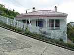](https://en.wikipedia.org/wiki/File:Baldwinstreet.jpg)

[(L)](https://en.wikipedia.org/wiki/File:Baldwinstreet.jpg)

[Baldwin Street, Dunedin](https://en.wikipedia.org/wiki/Baldwin_Street,_Dunedin).

[(L)](https://en.wikipedia.org/wiki/File:Coober_Pedy_Warning_sign_02427.jpg)

Watch your step around [Coober Pedy](https://en.wikipedia.org/wiki/Coober_Pedy).

|     |     |
| --- | --- |
| **[Baldwin Street, Dunedin](https://en.wikipedia.org/wiki/Baldwin_Street)** | A short suburban road in [Dunedin](https://en.wikipedia.org/wiki/Dunedin), [New Zealand](https://en.wikipedia.org/wiki/New_Zealand), reputedly the world's steepest street. |
| **[Cardrona Bra Fence](https://en.wikipedia.org/wiki/Cardrona_Bra_Fence)** | An eccentric tourist attraction in New Zealand. |
| **[Coober Pedy, South Australia](https://en.wikipedia.org/wiki/Coober_Pedy)** | A mining town where most of the residents live underground. |
| **[Mount Typo](https://en.wikipedia.org/wiki/Mount_Typo)** | The mountain of [typographical error](https://en.wikipedia.org/wiki/Typographical_error)‌s. |
| **[Whanganui River](https://en.wikipedia.org/wiki/Whanganui_River)** | A river in New Zealand that is legally a person. |

### Geography[[edit](https://en.wikipedia.org/w/index.php?title=Wikipedia:Unusual_articles/Places_and_infrastructure&action=edit&section=T-8)]

|     |     |
| --- | --- |
| **[Breast-shaped hill](https://en.wikipedia.org/wiki/Breast-shaped_hill)** | If every tower is phallic... |

See also

- [Wikipedia:Unusual place names](https://en.wikipedia.org/wiki/Wikipedia:Unusual_place_names)

## History[[edit](https://en.wikipedia.org/w/index.php?title=Wikipedia:Unusual_articles/History&action=edit&section=T-1)]

[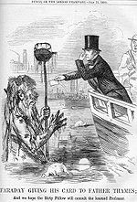](https://en.wikipedia.org/wiki/File:FaradayFatherThames.jpg)

[(L)](https://en.wikipedia.org/wiki/File:FaradayFatherThames.jpg)

The [infrastructural shortcomings of Faraday's times](https://en.wikipedia.org/wiki/Great_Stink) proved especially overpowering in the summer of 1858.

|     |     |
| --- | --- |
| **[Puyi](https://en.wikipedia.org/wiki/Puyi)** | He became The last Emperor of China at the age of TWO, and died as an ordinary citizen ending a 2,133 year rule of China's emperors. |
| **[Daughter of Emperor Xiaoming of Northern Wei](https://en.wikipedia.org/wiki/Daughter_of_Emperor_Xiaoming_of_Northern_Wei)** | A female monarch existed in [Chinese history](https://en.wikipedia.org/wiki/Chinese_history) before [Wu Zetian](https://en.wikipedia.org/wiki/Wu_Zetian)? |
| **[World War II postal acronyms](https://en.wikipedia.org/wiki/World_War_II_postal_acronyms)** | Every Naked Girl Loves A Naked Dick. |
|   ***[The Great Stink](https://en.wikipedia.org/wiki/Great_Stink)*** | An actual 19th century event in the history of [London](https://en.wikipedia.org/wiki/London), where the stench of human stool emanating from the [River Thames](https://en.wikipedia.org/wiki/River_Thames) was so overpowering, that it interfered with the work of the [House of Commons](https://en.wikipedia.org/wiki/House_of_Commons_of_the_United_Kingdom) and is claimed to have ground the city to a halt. Kickstarted the [London sewerage system](https://en.wikipedia.org/wiki/London_sewerage_system). |
| **[The Miracle of 1511](https://en.wikipedia.org/wiki/The_Miracle_of_1511)** | When the people of [Brussels](https://en.wikipedia.org/wiki/Brussels) protested against their rulers by building satirical and pornographic [snowmen](https://en.wikipedia.org/wiki/Snowman). |
| **[Great Molasses Flood](https://en.wikipedia.org/wiki/Great_Molasses_Flood)** | A storage tank burst and flooded the streets of [Boston](https://en.wikipedia.org/wiki/Boston) with a 25 foot (7.6 meter) high wave of molasses. |
| **[Yang Kyoungjong](https://en.wikipedia.org/wiki/Yang_Kyoungjong)** | The Korean defence of [Normandy](https://en.wikipedia.org/wiki/Normandy) |
| **[Tank Man](https://en.wikipedia.org/wiki/Tank_Man)** | An unidentified man who achieved widespread recognition after standing in front, and blocking the procession of a column of tanks, the morning after the bloody suppression of the [1989 Tiananmen Square protests](https://en.wikipedia.org/wiki/Tiananmen_Square_protests_of_1989). |
| **[Dancing Plague of 1518](https://en.wikipedia.org/wiki/Dancing_Plague_of_1518)** | In 1518 around 400 people took to dancing for days without rest, and, over the period of about one month, some of those affected died of heart attack, stroke, or exhaustion. |
| **[Abul-Abbas](https://en.wikipedia.org/wiki/Abul-Abbas)** | An Asian elephant given to [Charlemagne](https://en.wikipedia.org/wiki/Charlemagne) by the Abbasid caliph [Harun al-Rashid](https://en.wikipedia.org/wiki/Harun_al-Rashid). |
| **[Cadaver Synod](https://en.wikipedia.org/wiki/Cadaver_Synod)** | A deceased Pope was exhumed and put on trial! |
| **[Pope Benedict IX](https://en.wikipedia.org/wiki/Pope_Benedict_IX)** | He became pope at twenty, and later sold the papacy. He was pope three times. |
| **[Kottabos](https://en.wikipedia.org/wiki/Kottabos)** | The worlds first drinking game. Care to play? All you need is a bronze "lamp stand" with a tiny statuette on top and some wine. |
| **[Defenestrations of Prague](https://en.wikipedia.org/wiki/Defenestrations_of_Prague)** | When was the last time throwing someone out of a window started a war? |
| **[Sacred Band of Thebes](https://en.wikipedia.org/wiki/Sacred_Band_of_Thebes)** | An elite fighting force consisting of a hand-picked groups of 150 pairs of male lovers |

## Mathematics and numbers[[edit](https://en.wikipedia.org/w/index.php?title=Wikipedia:Unusual_articles/Mathematics_and_numbers&action=edit&section=T-1)]

[(L)](https://en.wikipedia.org/wiki/File:Beghilos.svg)

"BEGhIL0S", "hELL0", "B00BLESS", etc. – there are many words that can be [spelled on a calculator](https://en.wikipedia.org/wiki/Calculator_spelling).

[(L)](https://en.wikipedia.org/wiki/File:Dagen_h.png)

[The day](https://en.wikipedia.org/wiki/Dagen_H) Sweden turned to the right side.

[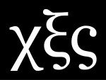](https://en.wikipedia.org/wiki/File:666_greek_number_notation.svg)

[(L)](https://en.wikipedia.org/wiki/File:666_greek_number_notation.svg)

[Be afraid. Be very afraid.](https://en.wikipedia.org/wiki/Hexakosioihexekontahexaphobia)

[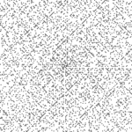](https://en.wikipedia.org/wiki/File:Ulam_1.png)

[(L)](https://en.wikipedia.org/wiki/File:Ulam_1.png)
See the [spiral within?](https://en.wikipedia.org/wiki/Ulam_spiral)

|     |     |
| --- | --- |
| **[−0](https://en.wikipedia.org/wiki/Signed_zero)** | Zero has a negative flavor in the worlds of [computing](https://en.wikipedia.org/wiki/Computing), [experimental science](https://en.wikipedia.org/wiki/Experiment) and [statistical mechanics](https://en.wikipedia.org/wiki/Statistical_mechanics). |
|  **[0.999...](https://en.wikipedia.org/wiki/0.999...)** | An infinitely long way to write 1. |
| **[2 + 2 = 5](https://en.wikipedia.org/wiki/2_%2B_2_%3D_5)** | ...or perhaps it equals *[1984](https://en.wikipedia.org/wiki/Nineteen_Eighty-Four)*... |
| **[Belphegor's prime](https://en.wikipedia.org/wiki/Belphegor%27s_prime)** | A truly devilish number |
| **[Calculator spelling](https://en.wikipedia.org/wiki/Calculator_spelling)** | Remember these from school? |
| **[The Complexity of Songs](https://en.wikipedia.org/wiki/The_Complexity_of_Songs)** | A treatise on the [computational complexity](https://en.wikipedia.org/wiki/Computational_complexity_theory) of [songs](https://en.wikipedia.org/wiki/Song) by venerable computer scientist [Donald Knuth](https://en.wikipedia.org/wiki/Donald_Knuth). |
| **[Erdős–Bacon number](https://en.wikipedia.org/wiki/Erd%C5%91s%E2%80%93Bacon_number)** | A combination of the [degrees of separation](https://en.wikipedia.org/wiki/Six_degrees_of_separation) from actor [Kevin Bacon](https://en.wikipedia.org/wiki/Kevin_Bacon) and mathematician [Paul Erdős](https://en.wikipedia.org/wiki/Paul_Erd%C5%91s). |
| **[Extravagant number](https://en.wikipedia.org/wiki/Extravagant_number)** | Don't take it shopping. Not very friendly with the [frugal number](https://en.wikipedia.org/wiki/Frugal_number) either. |
| **[Graham's number](https://en.wikipedia.org/wiki/Graham%27s_number)** | A number so large that the [observable universe](https://en.wikipedia.org/wiki/Observable_universe) is not big enough to write it in full in [decimal notation](https://en.wikipedia.org/wiki/Decimal_notation). |
| **[Happy number](https://en.wikipedia.org/wiki/Happy_number)** | Not just a cheery song on the radio. |
| **[Hexakosioihexekontahexaphobia](https://en.wikipedia.org/wiki/Hexakosioihexekontahexaphobia)** | For *beast*ly people bored of [triskaidekaphobia](https://en.wikipedia.org/wiki/Triskaidekaphobia). |
| **[Illegal prime](https://en.wikipedia.org/wiki/Illegal_prime)** | Does the US government forbid knowledge of the existence of certain prime numbers? |
| **[Illumination Problem](https://en.wikipedia.org/wiki/Illumination_problem)** | A room with a bit of a shadow. |
| **[Indiana Pi Bill](https://en.wikipedia.org/wiki/Indiana_Pi_Bill)** | A notorious attempt to legislate the value of [pi](https://en.wikipedia.org/wiki/Pi). |
| **[Infinite monkey theorem](https://en.wikipedia.org/wiki/Infinite_monkey_theorem)** | An infinite number of monkeys typing on an infinite number of typewriters will ([almost surely](https://en.wikipedia.org/wiki/Almost_surely)) produce all possible written texts. |
| **[Interesting number paradox](https://en.wikipedia.org/wiki/Interesting_number_paradox)** | Either all natural numbers are interesting or else none of them are. |
| **[Look-and-say sequence](https://en.wikipedia.org/wiki/Look-and-say_sequence)** | Also known as the Cuckoo's Egg. |
| **[Mathematical fallacy](https://en.wikipedia.org/wiki/Mathematical_fallacy)** | Trying to prove that 2 = 1 or that 1 < 0. |
| **[Monty Hall problem](https://en.wikipedia.org/wiki/Monty_Hall_problem)** | The [counter-intuitive](https://en.wikipedia.org/wiki/Counter-intuitive) way to prevail when playing *[Let's Make a Deal](https://en.wikipedia.org/wiki/Let%27s_Make_a_Deal)*. |
| **[Narcissistic number](https://en.wikipedia.org/wiki/Narcissistic_number)** | The pluperfect digital invariant says "Count *me* in"! |
| **[Nothing up my sleeve number](https://en.wikipedia.org/wiki/Nothing_up_my_sleeve_number)** | A number which is "above suspicion". |
| **[Numbers station](https://en.wikipedia.org/wiki/Numbers_station)** | *[Six bars of [The Lincolnshire Poacher](https://en.wikipedia.org/wiki/The_Lincolnshire_Poacher) play]*  "¡Atención! ¡Atención! One, four, seventeen, twenty-four..." |
| **[Minkowski's question mark function](https://en.wikipedia.org/wiki/Minkowski%27s_question_mark_function)** | A function with an unusual notation and possessing unusual [fractal properties](https://en.wikipedia.org/wiki/Fractal). |
| **[Ramanujan summation](https://en.wikipedia.org/wiki/Ramanujan_summation)** | A way to define a value for a divergent series. For example, |
| **[Spaghetti sort](https://en.wikipedia.org/wiki/Spaghetti_sort)** | An algorithm for sorting rods of spaghetti. |
| **[Triskaidekaphobia](https://en.wikipedia.org/wiki/Triskaidekaphobia)** | Fear of the number [13](https://en.wikipedia.org/wiki/13_(number)). |
| **[Ulam spiral](https://en.wikipedia.org/wiki/Ulam_spiral)** | A bored mathematician discovers an unusual numerical pattern while doodling. |
| **[Undecimber](https://en.wikipedia.org/wiki/Undecimber)** | In [Java](https://en.wikipedia.org/wiki/Java_(programming_language)), the thirteenth month of the year. |
| **[Vampire number](https://en.wikipedia.org/wiki/Vampire_number)** | Integers with real bite; some even have multiple pairs of fangs. |
| **[Will Rogers phenomenon](https://en.wikipedia.org/wiki/Will_Rogers_phenomenon)** | When moving an element from one set to another set raises – counter-intuitively – the [average](https://en.wikipedia.org/wiki/Average) values of both sets. Also known as the *Will Rogers [paradox](https://en.wikipedia.org/wiki/Paradox)*. |
| **[Zeroth](https://en.wikipedia.org/wiki/Zero-based_numbering)** | An [ordinal number](https://en.wikipedia.org/wiki/Ordinal_number_(linguistics)) popular in computing and related cultures. |

### Dates and timekeeping[[edit](https://en.wikipedia.org/w/index.php?title=Wikipedia:Unusual_articles/Mathematics_and_numbers&action=edit&section=T-2)]

[(L)](https://en.wikipedia.org/wiki/File:Chocolate_Pi_Pie,_March_2010.jpg)
A soon-to-be bye-bye [pi pie](https://en.wikipedia.org/wiki/Pi_Day).

[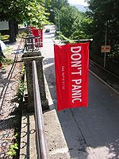](https://en.wikipedia.org/wiki/File:Towelday-Innsbruck.jpg)

[(L)](https://en.wikipedia.org/wiki/File:Towelday-Innsbruck.jpg)
Don't panic – it's [Towel Day](https://en.wikipedia.org/wiki/Towel_Day).

|     |     |
| --- | --- |
| **[Ruth Belville](https://en.wikipedia.org/wiki/Ruth_Belville)** | She followed her parents in the business of selling people [Greenwich Mean Time](https://en.wikipedia.org/wiki/Greenwich_Mean_Time). |
| **[Chrismukkah](https://en.wikipedia.org/wiki/Chrismukkah)** | A fictional Christmas-Hanukkah hybrid, popularized by the television show *[The O.C.](https://en.wikipedia.org/wiki/The_O.C.)* |
| **[February 30](https://en.wikipedia.org/wiki/February_30)** | Not as fictional as you might think. |
| **[Festivus](https://en.wikipedia.org/wiki/Festivus)** | December 23: Holiday celebrated by the [Costanza](https://en.wikipedia.org/wiki/George_Costanza) family on the television show *[Seinfeld](https://en.wikipedia.org/wiki/Seinfeld)*, since appropriated by many. |
| **[International Talk Like a Pirate Day](https://en.wikipedia.org/wiki/International_Talk_Like_a_Pirate_Day)** | [Shiver my timbers](https://en.wikipedia.org/wiki/Shiver_my_timbers) (a-harrr!) every [September 19](https://en.wikipedia.org/wiki/September_19). |
| **[January 0](https://en.wikipedia.org/wiki/January_0)** | Thought the day before [New Year's Day](https://en.wikipedia.org/wiki/January_1) would be in the previous year? Think again... |
| **[Manhattanhenge](https://en.wikipedia.org/wiki/Manhattanhenge)** | Twice every year, the setting sun aligns with Manhattan's street grid. |
| **[Mole Day](https://en.wikipedia.org/wiki/Mole_Day)** | The [Avogadro constant](https://en.wikipedia.org/wiki/Avogadro_constant) is celebrated on October 23rd starting at exactly 6:02 am. |
| **[Phantom time hypothesis](https://en.wikipedia.org/wiki/Phantom_time_hypothesis)** | A theory by [Heribert Illig](https://en.wikipedia.org/wiki/Heribert_Illig) that the Early Middle Ages (614–911) never occurred. Therefore, it is now 1720 rather than 2017. |
| **[Pi Day](https://en.wikipedia.org/wiki/Pi_Day)** | The day – March 14 – on which the constant [π](https://en.wikipedia.org/wiki/Pi) is celebrated. |
| **[Tau Day](https://en.wikipedia.org/wiki/Tau_Day)** | The day – June 28 – on which the constant [𝞃](https://en.wikipedia.org/wiki/Tau) is celebrated. |
| **[Square Root Day](https://en.wikipedia.org/wiki/Square_Root_Day)** | Any date when the day and month are both the [square root](https://en.wikipedia.org/wiki/Square_root) of the last two digits of the year (the next being 5th May 2025). |
| **[Star Wars Day](https://en.wikipedia.org/wiki/Star_Wars_Day)** | [May the 4th](https://en.wikipedia.org/wiki/May_4) be with you. |
| **[Towel Day](https://en.wikipedia.org/wiki/Towel_Day)** | [Don't forget to bring a towel](https://en.wikipedia.org/wiki/The_Hitchhiker%27s_Guide_to_the_Galaxy), [terrible](https://en.wikipedia.org/wiki/Terrible_Towel) or otherwise. |
| **[Winterval](https://en.wikipedia.org/wiki/Winterval)** | A word created as an alternative name for all the holidays at the end of a calendar year. It came to prominence after [Birmingham City Council](https://en.wikipedia.org/wiki/Government_of_Birmingham) (the English city) used it in 1998. |
| **[Year 2038 problem](https://en.wikipedia.org/wiki/Year_2038_problem)** | The computing problem that will arise due to the [Unix time](https://en.wikipedia.org/wiki/Unix_time) representation used in many computers. |
| **[Year 10,000 problem](https://en.wikipedia.org/wiki/Year_10,000_problem)** | The collective name for all potential [software bugs](https://en.wikipedia.org/wiki/Software_bug) that will emerge as the need to express years with five digits arises. |
| **[Year zero](https://en.wikipedia.org/wiki/0_(year))** | Was there a year between [1 BC](https://en.wikipedia.org/wiki/1_BC) and [AD 1](https://en.wikipedia.org/wiki/AD_1)? |

## Language[[edit](https://en.wikipedia.org/w/index.php?title=Wikipedia:Unusual_articles/Language&action=edit&section=T-1)]

[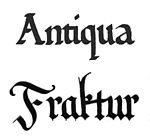](https://en.wikipedia.org/wiki/File:Schriftzug_Antiqua%2BFraktur.jpg)

[(L)](https://en.wikipedia.org/wiki/File:Schriftzug_Antiqua%2BFraktur.jpg)

Which of these typefaces do you think [Hitler preferred](https://en.wikipedia.org/wiki/Antiqua%E2%80%93Fraktur_dispute)?

[(L)](https://en.wikipedia.org/wiki/File:Tastatur-Umlaute-deutsch.jpg)

["Which këÿs för this heävy plästic müsïc?"](https://en.wikipedia.org/wiki/Heavy_metal_umlaut)

[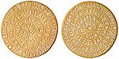](https://en.wikipedia.org/wiki/File:PhaistosDiskLarge.jpg)

[(L)](https://en.wikipedia.org/wiki/File:PhaistosDiskLarge.jpg)
The [Phaistos Disc](https://en.wikipedia.org/wiki/Phaistos_Disc).

[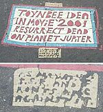](https://en.wikipedia.org/wiki/File:Toynbee_tile_at_franklin_square_2002.jpg)

[(L)](https://en.wikipedia.org/wiki/File:Toynbee_tile_at_franklin_square_2002.jpg)

[Toynbee tiles](https://en.wikipedia.org/wiki/Toynbee_tiles) found in downtown Washington, D.C.

[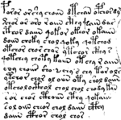](https://en.wikipedia.org/wiki/File:Voynich.png)

[(L)](https://en.wikipedia.org/wiki/File:Voynich.png)

The [Voynich manuscript](https://en.wikipedia.org/wiki/Voynich_manuscript) is written in an undeciphered script.

|     |     |
| --- | --- |
| **[Antiqua–Fraktur dispute](https://en.wikipedia.org/wiki/Antiqua%E2%80%93Fraktur_dispute)** | A dispute over which typeface was more "German". At first, the [Nazis](https://en.wikipedia.org/wiki/Nazism) were for Fraktur... |
| **[Apples and oranges](https://en.wikipedia.org/wiki/Apples_and_oranges)** | According to scholars, comparing the two may be easier than previously thought. |
| **[Arcaicam Esperantom](https://en.wikipedia.org/wiki/Arcaicam_Esperantom)** | How do you make things look "old" in an constructed language? By inventing a new one! |
| **[Buffalo buffalo Buffalo buffalo buffalo buffalo Buffalo buffalo](https://en.wikipedia.org/wiki/Buffalo_buffalo_Buffalo_buffalo_buffalo_buffalo_Buffalo_buffalo).** | A meaningful, grammatical construction that has inspired linguists to talk about bullying amongst New York's bison population. |
| **[Colorless green ideas sleep furiously](https://en.wikipedia.org/wiki/Colorless_green_ideas_sleep_furiously)** | A sentence contrived by [Noam Chomsky](https://en.wikipedia.org/wiki/Noam_Chomsky) to demonstrate that a sentence can be grammatical yet nonsensical. |
| **[Controversies about the word "niggardly"](https://en.wikipedia.org/wiki/Controversies_about_the_word_%22niggardly%22)** | How a simple word can cause so much controversy. |
| **[Cryptophasia](https://en.wikipedia.org/wiki/Cryptophasia)** | The secret language of identical twins, also called [idioglossia](https://en.wikipedia.org/wiki/Idioglossia). |
| **[Disambiguation (disambiguation)](https://en.wikipedia.org/wiki/Disambiguation_(disambiguation))** | For when you're really not sure what you mean.[*[disambiguation needed](http://dispenser.homenet.org/~dispenser/cgi-bin/dab_solver.py?page=Wikipedia:Unusual_articles&editintro=Template:Disambiguation_needed/editintro&client=Template:Dn)*] |
| **[Dord](https://en.wikipedia.org/wiki/Dord)** | A nonexistent English word, supposedly meaning "[density](https://en.wikipedia.org/wiki/Density)", which was listed in the second edition of *[Webster's New International Dictionary](https://en.wikipedia.org/wiki/Webster%27s_New_International_Dictionary,_Second_Edition)* from 1935 to 1939. |
| **[The Dozens](https://en.wikipedia.org/wiki/The_Dozens)** | A usually good-natured [African American](https://en.wikipedia.org/wiki/African_American) ritual in which two competitors, usually male, exchange [trash-talk](https://en.wikipedia.org/wiki/Trash-talk) until one has no [comeback](https://en.wikipedia.org/wiki/Wit). |
| **[Engrish](https://en.wikipedia.org/wiki/Engrish)** | Attempts by East Asian people – especially the [Japanese](https://en.wikipedia.org/wiki/Japanese_people) – to construct English words and phrases. |
| **[Etaoin shrdlu](https://en.wikipedia.org/wiki/Etaoin_shrdlu)** | Cryptic echoes from the days of [hot metal typesetting](https://en.wikipedia.org/wiki/Hot_metal_typesetting). |
| **[Faggin-Nazzi alphabet](https://en.wikipedia.org/wiki/Faggin-Nazzi_alphabet)** | What? That's its real name. What did you [think it was about](https://en.wikipedia.org/wiki/Gay_Nazi_Party)? |
| **[Faux Cyrillic](https://en.wikipedia.org/wiki/Faux_Cyrillic)** | Give text some of that Яussiaи flavour. |
| **[Fictitious entry](https://en.wikipedia.org/wiki/Fictitious_entry)** | The content may be fictitious, but the entry is a fact. |
| **[Fnord](https://en.wikipedia.org/wiki/Fnord)** | Deliberately misleading, irrelevant or false information meant to suggest [conspiracy](https://en.wikipedia.org/wiki/Conspiracy_theory). A popular word among [Discordians](https://en.wikipedia.org/wiki/Discordianism). |
| **[Ghoti](https://en.wikipedia.org/wiki/Ghoti)** | As good an argument as any for [English spelling reform](https://en.wikipedia.org/wiki/English_spelling_reform). |
| **[How now brown cow](https://en.wikipedia.org/wiki/How_now_brown_cow)** | A way to greet those well versed in rhetoric. |
| **[Hyphen War](https://en.wikipedia.org/wiki/Hyphen_War)** | A dash between [communism](https://en.wikipedia.org/wiki/Communism) and [independence](https://en.wikipedia.org/wiki/Independence). |
| **[Inherently funny word](https://en.wikipedia.org/wiki/Inherently_funny_word)** | Some influential comedians have long regarded certain words in the [English language](https://en.wikipedia.org/wiki/English_language) as humorous because of their sound or resemblance to other words. *[Poodle](https://en.wikipedia.org/wiki/Poodle)*, *[wankel](https://en.wikipedia.org/wiki/Wankel_engine)*, *[ni](https://en.wikipedia.org/wiki/Knights_who_say_Ni)*... |
| **[Intentionally blank page](https://en.wikipedia.org/wiki/Intentionally_blank_page)** | The self-refuting meta-reference that is "This page intentionally left blank". |
| **[James while John had had had had had had had had had had had a better effect on the teacher](https://en.wikipedia.org/wiki/James_while_John_had_had_had_had_had_had_had_had_had_had_had_a_better_effect_on_the_teacher)** | [Repetition](https://en.wikipedia.org/wiki/Repetition_(rhetorical_device)) gone wrong. |
| **[Latin profanity](https://en.wikipedia.org/wiki/Latin_profanity)** | Latin for the profane. |
| [(L)](https://en.wikipedia.org/wiki/File:Featured_article_star.svg)  **[List of English words containing Q not followed by U](https://en.wikipedia.org/wiki/List_of_English_words_containing_Q_not_followed_by_U)** | A [Scrabbler](https://en.wikipedia.org/wiki/Scrabble)'s dream article. |
| **[Lion-Eating Poet in the Stone Den](https://en.wikipedia.org/wiki/Lion-Eating_Poet_in_the_Stone_Den)** | A 92-character poem written in Classical Chinese, in which every syllable has the sound "shi" (in different tones) when read in modern Mandarin Chinese. |
| **[List of ethnic slurs](https://en.wikipedia.org/wiki/List_of_ethnic_slurs)** | Ever wondered why they got so angry at you? |
| **[List of lists of lists](https://en.wikipedia.org/wiki/List_of_lists_of_lists)** | Lists which list lists, also list lists. |
| **[List of English words without rhymes](https://en.wikipedia.org/wiki/List_of_English_words_without_rhymes)** | Does anything rhyme with *orange*? Or *silver*? |
| **[Longest word in English](https://en.wikipedia.org/wiki/Longest_word_in_English)** | *[Floccinaucinihilipilification](https://en.wikipedia.org/wiki/Floccinaucinihilipilification)*, *[supercalifragilisticexpialidocious](https://en.wikipedia.org/wiki/Supercalifragilisticexpialidocious)* and other contenders. |
| **[Mamihlapinatapai](https://en.wikipedia.org/wiki/Mamihlapinatapai)** | The Guinness World Record holder for the "most succinct word".[[1]](https://en.wikipedia.org/wiki/Wikipedia:Unusual_articles#cite_note-1) |
| **[Martian language](https://en.wikipedia.org/wiki/Martian_language)** | Chinese language + Internet = new language. |
| **[Maternal insult](https://en.wikipedia.org/wiki/Maternal_insult)** | What is this article about? Your mom! |
| **[Metal umlaut](https://en.wikipedia.org/wiki/Metal_umlaut)** | Gïvë thë lögö för ÿöür [hëävy mëtäl](https://en.wikipedia.org/wiki/Heavy_metal_music) bänd ä töügh [Gërmänïc](https://en.wikipedia.org/wiki/Germanic_languages) fëël. |
| **[Phaistos Disc](https://en.wikipedia.org/wiki/Phaistos_Disc)** | Ancient [spirals](https://en.wikipedia.org/wiki/Spiral) of undeciphered [hieroglyphs](https://en.wikipedia.org/wiki/Logogram). |
| **[Placeholder name](https://en.wikipedia.org/wiki/Placeholder_name)** | You know, thingamajigs, doohickeys, whatchamacallits... |
| **[Pompatus](https://en.wikipedia.org/wiki/Pompatus)** | All [Steve Miller](https://en.wikipedia.org/wiki/Steve_Miller_(musician))'s fault. |
| **[RAS syndrome](https://en.wikipedia.org/wiki/RAS_syndrome)** | ...which is itself an example of [RAS](https://en.wikipedia.org/wiki/RAS_syndrome). |
| **[Russenorsk](https://en.wikipedia.org/wiki/Russenorsk)** | A Slavic-Scandinavian hybrid that lasted only 150 years. |
| **[Robert Shields](https://en.wikipedia.org/wiki/Robert_Shields_(diarist))** | You think *you* are hooked on recording every detail of your life..? |
| **[Shibboleth](https://en.wikipedia.org/wiki/Shibboleth)** | A type of slang used to identify an individual to a very specific region. usually with accompanied with value judgements. Also, a funny word. |
| **[Shit happens](https://en.wikipedia.org/wiki/Shit_happens)** | A statement of philosophical existentialism boiled down to two words. |
| **[Thinking about the immortality of the crab](https://en.wikipedia.org/wiki/Thinking_about_the_immortality_of_the_crab)** | A colorful Spanish idiom for [daydreaming](https://en.wikipedia.org/wiki/Daydreaming); try using this one if your teacher notices you becoming inattentive in class. |
| **[Toynbee tiles](https://en.wikipedia.org/wiki/Toynbee_tiles)** | Tiles found embedded in [asphalt](https://en.wikipedia.org/wiki/Asphalt), usually sporting cryptic messages. |
| **[Unknown unknown](https://en.wikipedia.org/wiki/There_are_known_knowns)** | Things that we don't know we don't know. |
| **[Voynich manuscript](https://en.wikipedia.org/wiki/Voynich_manuscript)** | An undeciphered illustrated book written six hundred or so years ago, by an anonymous author using an unidentified alphabet. |

1. **[Jump up ^](https://en.wikipedia.org/wiki/Wikipedia:Unusual_articles#cite_ref-1)**  Matthews, Peter; [McWhirter, Norris](https://en.wikipedia.org/wiki/Norris_McWhirter), eds. (1994). [*The Guinness Book of Records*](https://books.google.com/books?id=qQhj-D1WpkcC). Bantam Books. p. 392. [ISBN](https://en.wikipedia.org/wiki/International_Standard_Book_Number) [978-0-553-56561-4](https://en.wikipedia.org/wiki/Special:BookSources/978-0-553-56561-4).

### Weird names[[edit](https://en.wikipedia.org/w/index.php?title=Wikipedia:Unusual_articles/Language&action=edit&section=T-2)]

|     |     |
| --- | --- |
| **[Praise-God Barebone](https://en.wikipedia.org/wiki/Praise-God_Barebone)** | Christened Unless-Jesus-Christ-Had-Died-For-Thee-Thou-Hadst-Been-Damned Barebone; not to be confused with his son [Nicholas If-Jesus-Christ-Had-Not-Died-For-Thee-Thou-Hadst-Been-Damned Barbon](https://en.wikipedia.org/wiki/Nicholas_Barbon). |
| **[Cesar Chavez](https://en.wikipedia.org/wiki/Cesar_Chavez_(Arizona_politician))** | Formerly Scott Fistler, this white, right-wing, pro-business politician changed his name to match the [Hispanic, left‑wing labor activist](https://en.wikipedia.org/wiki/Cesar_Chavez) in an attempt to get more votes. |
| **[Mansfield Smith-Cumming](https://en.wikipedia.org/wiki/Mansfield_Smith-Cumming)** | The first head of [MI6](https://en.wikipedia.org/wiki/MI6), whose name [became appropriate](https://en.wikipedia.org/wiki/Aptonym) as he promoted the use of [semen](https://en.wikipedia.org/wiki/Semen) as [invisible ink](https://en.wikipedia.org/wiki/Invisible_ink). |
| **[Cox–Zucker machine](https://en.wikipedia.org/wiki/Cox%E2%80%93Zucker_machine)** | Algorithm named after its inventors. |
| **[Deportivo Wanka](https://en.wikipedia.org/wiki/Deportivo_Wanka)** | An unfortunately named Peruvian football team whose strips are remarkably popular in Britain. |
| **[Donaudampfschiffahrtsgesellschaft](https://en.wikipedia.org/wiki/Donaudampfschiffahrtsgesellschaft)** | An officials' association in pre-war [Vienna](https://en.wikipedia.org/wiki/Vienna), [Austria](https://en.wikipedia.org/wiki/Austria) of a shipping company for transporting passengers and cargo on the [Danube](https://en.wikipedia.org/wiki/Danube). |
| **[John le Fucker](https://en.wikipedia.org/wiki/John_le_Fucker)** | His surname probably didn't mean what you think it might mean. |
| **[Argélico Fucks](https://en.wikipedia.org/wiki/Arg%C3%A9lico_Fucks)** | A [Brazilian](https://en.wikipedia.org/wiki/Brazil) footballer with a socially problematic last name. An unforgettable newspaper headline once declared "Fucks Off to [Benfica](https://en.wikipedia.org/wiki/S.L._Benfica)". |
| **[Gregor Fučka](https://en.wikipedia.org/wiki/Gregor_Fu%C4%8Dka)** | A [Slovenian](https://en.wikipedia.org/wiki/Slovenia)-born [Italian](https://en.wikipedia.org/wiki/Italy) basketball player with a similar problem. |
| **[Tiny Kox](https://en.wikipedia.org/wiki/Tiny_Kox)** | A [Dutch](https://en.wikipedia.org/wiki/Dutch_people) politician. |
| **[Jennifer 8. Lee](https://en.wikipedia.org/wiki/Jennifer_8._Lee)** | A former *New York Times* reporter whose middle name is the number eight. |
| **[Leone Sextus Tollemache](https://en.wikipedia.org/wiki/Leone_Sextus_Tollemache)** | Or Leone Sextus Denys Oswolf Fraudatifilius Tollemache-Tollemache de Orellana Plantagenet Tollemache-Tollemache to his friends. |
| **[List of examples of Stigler's law](https://en.wikipedia.org/wiki/List_of_examples_of_Stigler%27s_law)** | Bode didn't discover Bode's Law, Pascal didn't discover Pascal's Triangle. |
| **[List of people with reduplicated names](https://en.wikipedia.org/wiki/List_of_people_with_reduplicated_names)** | ...such as [Boutros Boutros-Ghali](https://en.wikipedia.org/wiki/Boutros_Boutros-Ghali) and ([see below](https://en.wikipedia.org/wiki/Wikipedia:Unusual_articles#Neville)) Neville Neville. |
| **[Seán Dublin Bay Rockall Loftus](https://en.wikipedia.org/wiki/Se%C3%A1n_Dublin_Bay_Rockall_Loftus)** | An Irish politician who changes his name to emphasize political affiliations. |
| **[Pro-Life (politician)](https://en.wikipedia.org/wiki/Pro-Life_(politician))** | An American who did the same. |
| **[Metta World Peace](https://en.wikipedia.org/wiki/Metta_World_Peace)** | An NBA player who wants to promote World Peace. |
|  **[Mannanafnanefnd](https://en.wikipedia.org/wiki/Icelandic_Naming_Committee)** | A committee in [Iceland](https://en.wikipedia.org/wiki/Iceland) that determines whether a name is suitable for integration into the [Icelandic language](https://en.wikipedia.org/wiki/Icelandic_language). Apparently voted yes about themselves. |
| **[Neville Neville](https://en.wikipedia.org/wiki/Neville_Neville)** | The father of English footballers [Phil Neville](https://en.wikipedia.org/wiki/Phil_Neville) and [Gary Neville](https://en.wikipedia.org/wiki/Gary_Neville). |
| **[Richard Plantagenet Campbell Temple-Nugent-Brydges-Chandos-Grenville, 3rd Duke of Buckingham and Chandos](https://en.wikipedia.org/wiki/Richard_Temple-Nugent-Brydges-Chandos-Grenville,_3rd_Duke_of_Buckingham_and_Chandos)** | A warning to us all about taking [double-barrelled surnames](https://en.wikipedia.org/wiki/Double-barrelled_surname) too far... |
| **[Roger Fuckebythenavele](https://en.wikipedia.org/wiki/Roger_Fuckebythenavele)** | Perhaps the first use of the word [fuck](https://en.wikipedia.org/wiki/Fuck). |
| **[States Rights Gist](https://en.wikipedia.org/wiki/States_Rights_Gist)** | A [Confederate](https://en.wikipedia.org/wiki/Confederate_States_of_America) general during the [US Civil War](https://en.wikipedia.org/wiki/US_Civil_War). |
| **[Thursday October Christian I](https://en.wikipedia.org/wiki/Thursday_October_Christian_I)** | The son of [Fletcher Christian](https://en.wikipedia.org/wiki/Fletcher_Christian), leader of the [mutiny on the *Bounty*](https://en.wikipedia.org/wiki/Mutiny_on_the_Bounty). |
| **[Tokyo Sexwale](https://en.wikipedia.org/wiki/Tokyo_Sexwale)** | Despite not being Japanese or a [sperm whale](https://en.wikipedia.org/wiki/Moby-Dick), he has control over the global diamond industry. |
| **[Wolfe+585, Senior](https://en.wikipedia.org/wiki/Wolfe%2B585,_Senior)** | Longest name ever given. |

## Science[[edit](https://en.wikipedia.org/w/index.php?title=Wikipedia:Unusual_articles/Science&action=edit&section=T-1)]

[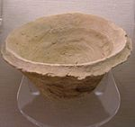](https://en.wikipedia.org/wiki/File:Marlik_clay_bowl_REM.JPG)

[(L)](https://en.wikipedia.org/wiki/File:Marlik_clay_bowl_REM.JPG)
[The sound of ancient pottery](https://en.wikipedia.org/wiki/Archaeoacoustics).

[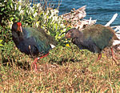](https://en.wikipedia.org/wiki/File:Takahe_and_chick.jpg)

[(L)](https://en.wikipedia.org/wiki/File:Takahe_and_chick.jpg)
[Not dead, just resting](https://en.wikipedia.org/wiki/Lazarus_taxon).

|     |     |
| --- | --- |
| **[Archaeoacoustics](https://en.wikipedia.org/wiki/Archaeoacoustics)** | Can ancient [pottery](https://en.wikipedia.org/wiki/Pottery) be used to play back recorded voices from the distant past? |
| **[Ota Benga](https://en.wikipedia.org/wiki/Ota_Benga)** | The tragic story of a [Pygmy](https://en.wikipedia.org/wiki/Pygmy) man from the [Belgian Congo](https://en.wikipedia.org/wiki/Belgian_Congo) who was briefly exhibited in the [Bronx Zoo](https://en.wikipedia.org/wiki/Bronx_Zoo). |
| **[Buttered toast phenomenon](https://en.wikipedia.org/wiki/Buttered_toast_phenomenon)** | But only if you're eating at a table. |
| **[Buttered cat paradox](https://en.wikipedia.org/wiki/Buttered_cat_paradox)** | If a cat always lands on its feet and toast always lands buttered-side-down, what if...? |
| **[Vladimir Demikhov](https://en.wikipedia.org/wiki/Vladimir_Demikhov)** | Eminent Soviet biologist and father of the canine head transplant. |
| **[Natasha Demkina](https://en.wikipedia.org/wiki/Natasha_Demkina)** | Russian girl who claims to have [X-ray vision](https://en.wikipedia.org/wiki/X-ray_vision). |
| **[Drake's Plate of Brass](https://en.wikipedia.org/wiki/Drake%27s_Plate_of_Brass)** | A [forgery](https://en.wikipedia.org/wiki/Forgery)-related practical joke that went horribly awry. |
| **[Elvis taxon](https://en.wikipedia.org/wiki/Elvis_taxon)** | A [taxon](https://en.wikipedia.org/wiki/Taxon) (species, genus, family, etc.) that is believed to be extinct but is falsely claimed by someone to still exist. |
| **[Lazarus taxon](https://en.wikipedia.org/wiki/Lazarus_taxon)** | Leaping Lazarus! Somewhat like [Monty Python](https://en.wikipedia.org/wiki/Monty_Python)'s *[Dead Parrot](https://en.wikipedia.org/wiki/Dead_Parrot)*, it's not really dead, it's just resting. |
| **[List of Ig Nobel Prize winners](https://en.wikipedia.org/wiki/List_of_Ig_Nobel_Prize_winners)** | [Nobel Prize](https://en.wikipedia.org/wiki/Nobel_Prize) meets *[Weird Science](https://en.wikipedia.org/wiki/Weird_Science_(TV_series))*. Result: Award-winning papers like "Injuries Due to Falling Coconuts" and "Chickens Prefer Beautiful Humans". |
| **['Pataphysics](https://en.wikipedia.org/wiki/%27Pataphysics)** | A parody of science that purports to study what lies beyond the realm of [metaphysics](https://en.wikipedia.org/wiki/Metaphysics). |
| **[Pathological science](https://en.wikipedia.org/wiki/Pathological_science)** | A pejorative term for scientific ideas that will simply not "go away", long after they are given up on as wrong by the majority of scientists in the field. |
| **[Project Steve](https://en.wikipedia.org/wiki/Project_Steve)** | A wildly successful list of scientists in which all signatories (1) [support evolution](https://en.wikipedia.org/wiki/Level_of_support_for_evolution), (2) oppose [intelligent design](https://en.wikipedia.org/wiki/Intelligent_design), and (3) are named Steve or a variation of that name (Steven, Stephan, Stephanie, etc.). |
| **[Raven paradox](https://en.wikipedia.org/wiki/Raven_paradox)** | First, you'll grant that all ravens are black, yes...? |
| **[Sokal affair](https://en.wikipedia.org/wiki/Sokal_affair)** | Physicist [Alan Sokal](https://en.wikipedia.org/wiki/Alan_Sokal) demonstrates that at least some [postmodernists](https://en.wikipedia.org/wiki/Postmodernism) can't see an [emperor with no clothes](https://en.wikipedia.org/wiki/The_Emperor%27s_New_Clothes#Use_as_an_idiom). |
| **["Women are wonderful" effect](https://en.wikipedia.org/wiki/%22Women_are_wonderful%22_effect)** | A phenomenon found in psychological and sociological research which suggests that people associate more positive attributes with the general social category of women compared to men. |

### Physics[[edit](https://en.wikipedia.org/w/index.php?title=Wikipedia:Unusual_articles/Science&action=edit&section=T-2)]

[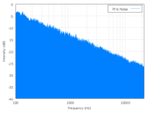](https://en.wikipedia.org/wiki/File:Pink_noise_spectrum.png)

[(L)](https://en.wikipedia.org/wiki/File:Pink_noise_spectrum.png)

This blue-looking [noise is actually pink](https://en.wikipedia.org/wiki/Colors_of_noise).

[(L)](https://en.wikipedia.org/wiki/File:Pauli.jpg)

"Shit! It's Professor Pauli! Quick, [pack that stuff away](https://en.wikipedia.org/wiki/Pauli_effect)!"

|     |     |
| --- | --- |
| **[Colors of noise](https://en.wikipedia.org/wiki/Colors_of_noise)** | Including [white](https://en.wikipedia.org/wiki/White_noise), [pink](https://en.wikipedia.org/wiki/Pink_noise), purple, blue... |
| **[David Hahn](https://en.wikipedia.org/wiki/David_Hahn)** | A 17-year-old, known as the *Radioactive Boy Scout*, who irradiated his back yard attempting to build a [nuclear](https://en.wikipedia.org/wiki/Nuclear_reactor)  [breeder reactor](https://en.wikipedia.org/wiki/Fast_breeder) from spare parts. |
| **[Demon core](https://en.wikipedia.org/wiki/Demon_core)** | A two-time [radioactive killer](https://en.wikipedia.org/wiki/Radiation_sickness). |
| **[Fictional elements, isotopes and atomic particles](https://en.wikipedia.org/wiki/List_of_fictional_elements,_materials,_isotopes_and_atomic_particles)** | Not actual periodic elements. Many end in '-ite'. Some of the elements may indeed be minerals. |
| **[Flying ice cube](https://en.wikipedia.org/wiki/Flying_ice_cube)** | They happen to live inside the computers of scientists trying to simulate molecules. |
| **[The Hum](https://en.wikipedia.org/wiki/The_Hum)** | A phenomenon involving a persistent and invasive low-frequency noise of a humming character and unknown origin, not audible to all people, reported in various geographical locations. |
| **[List of unusual units of measurement](https://en.wikipedia.org/wiki/List_of_unusual_units_of_measurement)** | Fortnights and nibbles, super feet and Sagans. |
| **[Magic smoke](https://en.wikipedia.org/wiki/Magic_smoke)** | An alternative theory of [integrated circuits](https://en.wikipedia.org/wiki/Integrated_circuit): once the smoke is released they no longer work. |
| **[Oh-My-God particle](https://en.wikipedia.org/wiki/Oh-My-God_particle)** | Proof that physicists have a dramatic flair. |
| **[Pauli effect](https://en.wikipedia.org/wiki/Pauli_effect)** | Something in the lab not working? Technical difficulties? [Blame](https://en.wikipedia.org/wiki/Pauli_effect)  [this guy](https://en.wikipedia.org/wiki/Wolfgang_Pauli). |
| **[Quantum suicide and immortality](https://en.wikipedia.org/wiki/Quantum_suicide_and_immortality)** | An infinite number of parallel universes means that any one person will always live forever. |
| **[Ranque-Hilsch vortex tube](https://en.wikipedia.org/wiki/Vortex_tube)** | What happens when you blow in a hole in a tube? Hot air comes out one end and cold air comes out the other. No consensus reached on why it happens yet. |
| **[Smoot](https://en.wikipedia.org/wiki/Smoot)** | A [strange unit of distance](https://en.wikipedia.org/wiki/List_of_strange_units_of_measurement) used to measure the Harvard Bridge. |
| **[Sound of fingernails scraping chalkboard](https://en.wikipedia.org/wiki/Chalkboard_scraping)** | Urrrgggh! |

### Earth sciences[[edit](https://en.wikipedia.org/w/index.php?title=Wikipedia:Unusual_articles/Science&action=edit&section=T-3)]

[(L)](https://en.wikipedia.org/wiki/File:Flat_Earth.png)

"[It's flat](https://en.wikipedia.org/wiki/Flat_Earth_society) and that's all there is to it."

[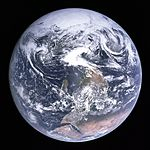](https://en.wikipedia.org/wiki/File:Apollo17WorldReversed.jpg)

[(L)](https://en.wikipedia.org/wiki/File:Apollo17WorldReversed.jpg)

"No, [this](https://en.wikipedia.org/wiki/Blue_Marble) definitely isn't flat, but it's the [other way](https://en.wikipedia.org/wiki/Reversed_map)!"

|     |     |
| --- | --- |
| ***[Aachenosaurus](https://en.wikipedia.org/wiki/Aachenosaurus)*** | A fossil plant that was mistakenly identified as a dinosaur. |
| **[Bloop](https://en.wikipedia.org/wiki/Bloop)** | Does a mystery sound from the bottom of the sea indicate that [Cthulhu](https://en.wikipedia.org/wiki/Cthulhu) may awake...? |
| **[Expanding Earth](https://en.wikipedia.org/wiki/Expanding_Earth)** | A theory that the Earth is growing. |
| **[Flat Earth Society](https://en.wikipedia.org/wiki/Flat_Earth_Society)** | A society, originally British, that holds the belief that the Earth is flat, not spherical. |
| [(L)](https://en.wikipedia.org/wiki/File:Featured_article_star.svg)  **[Snow in Florida](https://en.wikipedia.org/wiki/Snow_in_Florida)** | Yes, snow is not unknown in the "Sunshine State". |
| **[Mumbai "sweet" seawater incident](https://en.wikipedia.org/wiki/2006_Mumbai_sweet_seawater_incident)** | Salty creek becomes sweet for one tide cycle. |
| **[Raining animals](https://en.wikipedia.org/wiki/Raining_animals)** | When it's literally raining cats and dogs. |
|  **[Red rain in Kerala](https://en.wikipedia.org/wiki/Red_rain_in_Kerala)** | Did blood rain from the sky? |
| **[South-up map orientation](https://en.wikipedia.org/wiki/South-up_map_orientation)** | The crew of [Apollo 17](https://en.wikipedia.org/wiki/Apollo_17) snapped Earth with Antarctica on top. NASA followed Ptolemy and rotated it "back". |
| [(L)](https://en.wikipedia.org/wiki/File:Featured_article_star.svg)  **[S. A. Andrée's Arctic balloon expedition of 1897](https://en.wikipedia.org/wiki/S._A._Andr%C3%A9e%27s_Arctic_balloon_expedition_of_1897)** | An ill-fated attempt to reach the [North Pole](https://en.wikipedia.org/wiki/North_Pole). |
| **[Roy Sullivan](https://en.wikipedia.org/wiki/Roy_Sullivan)** | An unlucky [park ranger](https://en.wikipedia.org/wiki/Park_ranger) who was hit by [lightning](https://en.wikipedia.org/wiki/Lightning) on seven separate occasions. He survived them all, but came to his own tragic end. |
| **[Waffle House Index](https://en.wikipedia.org/wiki/Waffle_House_Index)** | The U.S. government's alternative measure of disaster impact. |

### Chemistry and material science[[edit](https://en.wikipedia.org/w/index.php?title=Wikipedia:Unusual_articles/Science&action=edit&section=T-4)]

[(L)](https://en.wikipedia.org/wiki/File:Vannmolekyl.png)
Warning: [It's LETHAL](https://en.wikipedia.org/wiki/Dihydrogen_monoxide_hoax).

[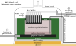](https://en.wikipedia.org/wiki/File:Hall-Heroult_cell_schematic.svg)

[(L)](https://en.wikipedia.org/wiki/File:Hall-Heroult_cell_schematic.svg)

Thankfully this is now done in specialised reactors, but [at first](https://en.wikipedia.org/wiki/Hall%E2%80%93H%C3%A9roult_process)...

[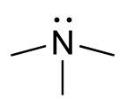](https://en.wikipedia.org/wiki/File:Trimethylamine_chemical_structure.png)

[(L)](https://en.wikipedia.org/wiki/File:Trimethylamine_chemical_structure.png)

At last – the look of BO. [Sounds fishy?](https://en.wikipedia.org/wiki/Trimethylaminuria)

|     |     |
| --- | --- |
| **[Dihydrogen monoxide](https://en.wikipedia.org/wiki/Dihydrogen_monoxide_hoax)** | A commonly used chemical that can be deadly to all forms of plant and animal life, contributing to [global warming](https://en.wikipedia.org/wiki/Global_warming), [erosion](https://en.wikipedia.org/wiki/Erosion), [acid rain](https://en.wikipedia.org/wiki/Acid_rain), and countless other maladies. Or... that's what they want you to think. |
| **[Hall–Héroult process](https://en.wikipedia.org/wiki/Hall%E2%80%93H%C3%A9roult_process)** | Invented in a wooden shed, uses temperatures over 1,000 °C (1,830 °F). |
| **[List of chemical compounds with unusual names](https://en.wikipedia.org/wiki/List_of_chemical_compounds_with_unusual_names)** | Some a consequence of their constituents or origins, others simply the work of whimsical chemists. |
| **[Mole Day](https://en.wikipedia.org/wiki/Mole_Day)** | A day in celebration of [Avogadro's number](https://en.wikipedia.org/wiki/Avogadro%27s_number), 6.02×1023. |
| **[Thomas Midgley, Jr.](https://en.wikipedia.org/wiki/Thomas_Midgley,_Jr.)** | Inventor of two of the world's most severe pollutants – and a machine that killed him. |
| **[Nanoputian](https://en.wikipedia.org/wiki/Nanoputian)** | A series of organic molecules having a structure that looks human. |
| **[New car smell](https://en.wikipedia.org/wiki/New_car_smell)** | Ahh, that new car smell. |
| **[Pykrete](https://en.wikipedia.org/wiki/Pykrete)** | A bullet-resistant frozen-water compound. |
| **[Red mercury](https://en.wikipedia.org/wiki/Red_mercury)** | A fictional substance which can create immense nuclear explosions in very small quantities. |
| **[Thiotimoline](https://en.wikipedia.org/wiki/Thiotimoline)** | A fictional chemical which dissolves *before* it comes into contact with water. |
| **[Trimethylaminuria](https://en.wikipedia.org/wiki/Trimethylaminuria)** | Do you smell something fishy? It may be you! |
| **[Unobtainium](https://en.wikipedia.org/wiki/Unobtainium)** | A term used to describe any material with properties that are unlikely or impossible for any real material to possess. |

### Space and astronomy[[edit](https://en.wikipedia.org/w/index.php?title=Wikipedia:Unusual_articles/Science&action=edit&section=T-5)]

[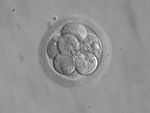](https://en.wikipedia.org/wiki/File:Embryo,_8_cells.jpg)

[(L)](https://en.wikipedia.org/wiki/File:Embryo,_8_cells.jpg)

[All watched over by machines of loving grace](https://en.wikipedia.org/wiki/Embryo_space_colonization).

[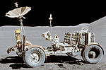](https://en.wikipedia.org/wiki/File:Apollo15LunarRover.jpg)

[(L)](https://en.wikipedia.org/wiki/File:Apollo15LunarRover.jpg)

"Of course, it [never reached the Moon](https://en.wikipedia.org/wiki/Moon_landing_conspiracy_theories)..."

[(L)](https://en.wikipedia.org/wiki/File:Satellites_For_Sale_-_GPN-2000-001036.jpg)

[(L)](https://en.wikipedia.org/wiki/File:Satellites_For_Sale_-_GPN-2000-001036.jpg)

[Inevitable?](https://en.wikipedia.org/wiki/Space_advertising)

|     |     |
| --- | --- |
| **[Cosmic latte](https://en.wikipedia.org/wiki/Cosmic_latte)** | The average colour of the Universe: a slightly beige white. |
| **[Embryo space colonization](https://en.wikipedia.org/wiki/Embryo_space_colonization)** | A proposal for colonizing space using embryos raised by robots. |
| **[Extraterrestrial real estate](https://en.wikipedia.org/wiki/Extraterrestrial_real_estate)** | Want to buy a housing plot on the [Moon](https://en.wikipedia.org/wiki/Moon)? |
| **[Fallen Astronaut](https://en.wikipedia.org/wiki/Fallen_Astronaut)** | A small statuette which is the only sculpture on the [moon](https://en.wikipedia.org/wiki/Moon). |
| **[Hot, dust-obscured galaxies](https://en.wikipedia.org/wiki/Hot,_dust-obscured_galaxies)** | Hot DOGs, anyone? |
| **[List of hypothetical Solar System objects](https://en.wikipedia.org/wiki/List_of_hypothetical_Solar_System_objects)** | The planets that could have been. You think [Pluto](https://en.wikipedia.org/wiki/Pluto) had it rough? At least it got its fifteen minutes of astronomical fame. |
| **[Lunarcrete](https://en.wikipedia.org/wiki/Lunarcrete)** | Perfect for building your own cut-price moon base. |
| **[Matrioshka brain](https://en.wikipedia.org/wiki/Matrioshka_brain)** | Star-sized computer. |
| **[Milkdromeda](https://en.wikipedia.org/wiki/Milkdromeda)** | The birth of a future galaxy, and the death of our own. |
| **[The Moon is made of green cheese](https://en.wikipedia.org/wiki/The_Moon_is_made_of_green_cheese)** | Scientific consensus says it isn't, but are there people who think so? |
| **[Moon landing conspiracy theories](https://en.wikipedia.org/wiki/Moon_landing_conspiracy_theories)** | Fake photos, slow-motion cameras and secret studios. All directed by [Stanley Kubrick](https://en.wikipedia.org/wiki/Stanley_Kubrick). |
| **[Moon Museum](https://en.wikipedia.org/wiki/Moon_Museum)** | Only two people have ever seen its exhibits in person. |
| **[Nazi UFOs](https://en.wikipedia.org/wiki/Nazi_UFOs)** | Did the Luftwaffe, in fact, explore the final frontier and make contact with alien races? Whether the secret Nazi base is on the Moon or in Antarctica, the truth is apparently out there. |
| **[Sex in space](https://en.wikipedia.org/wiki/Sex_in_space)** | And when you've exhausted [the list](https://en.wikipedia.org/wiki/List_of_sex_positions), here's something new to try! |
| **[Space advertising](https://en.wikipedia.org/wiki/Space_advertising)** | Plans to launch giant billboards into space. |
| **[Solway Firth Spaceman](https://en.wikipedia.org/wiki/Solway_Firth_Spaceman)** | "Wasn't there when I took the pic – honest!" |
| **[Sylacauga (meteorite)](https://en.wikipedia.org/wiki/Sylacauga_(meteorite))** | The first fallen [meteorite](https://en.wikipedia.org/wiki/Meteorite) in recorded history to have verifiably injured a human. |
| **[Timekeeping on Mars](https://en.wikipedia.org/wiki/Timekeeping_on_Mars)** | How Martians know when they are. |
| **[Writing in space](https://en.wikipedia.org/wiki/Writing_in_space)** | How do you write in space? |

### Medicine and health[[edit](https://en.wikipedia.org/w/index.php?title=Wikipedia:Unusual_articles/Science&action=edit&section=T-6)]

[(L)](https://en.wikipedia.org/wiki/File:Cuban_Wet_Nurse_-_Curt_Teich_1903.jpg)
[(L)](https://en.wikipedia.org/wiki/File:Cuban_Wet_Nurse_-_Curt_Teich_1903.jpg)

[Suckling on a tasty goat](https://en.wikipedia.org/wiki/Human-animal_breastfeeding).

[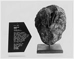](https://en.wikipedia.org/wiki/File:Lithopedion_(calcified_foetus).jpg)

[(L)](https://en.wikipedia.org/wiki/File:Lithopedion_(calcified_foetus).jpg)
Well, [stone](https://en.wikipedia.org/wiki/Lithopedion) me...

[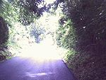](https://en.wikipedia.org/wiki/File:Brightcontrast.jpg)

[(L)](https://en.wikipedia.org/wiki/File:Brightcontrast.jpg)
Quick – [grab a tissue](https://en.wikipedia.org/wiki/Photic_sneeze_reflex)!

[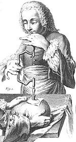](https://en.wikipedia.org/wiki/File:Trepanation_illustration_France_1800s.jpg)

[(L)](https://en.wikipedia.org/wiki/File:Trepanation_illustration_France_1800s.jpg)

Got one of those headaches [that just won't go away?](https://en.wikipedia.org/wiki/Trepanning)

[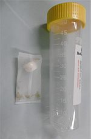](https://en.wikipedia.org/wiki/File:Larven_der_Lucillia_sericata_im_BioBag.jpg)

[(L)](https://en.wikipedia.org/wiki/File:Larven_der_Lucillia_sericata_im_BioBag.jpg)

The pharmacy called, your [maggot prescription](https://en.wikipedia.org/wiki/Maggot_therapy) is ready for pick-up

[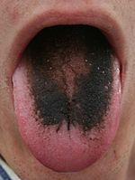](https://en.wikipedia.org/wiki/File:Black_tongue.jpg)

[(L)](https://en.wikipedia.org/wiki/File:Black_tongue.jpg)
[Man, just brush your teeth!](https://en.wikipedia.org/wiki/Black_hairy_tongue)

[(L)](https://en.wikipedia.org/wiki/File:DrYoungsIdealRectalDilators_Advertisement_DetroitMedicalJournal_August1905.jpg)

Put [them](https://en.wikipedia.org/wiki/Dr._Young%27s_Ideal_Rectal_Dilators) where the sun doesn't shine.

|     |     |
| --- | --- |
| **[Accessory breast](https://en.wikipedia.org/wiki/Accessory_breast)** | Some people have more than two. |
| **[Alien hand syndrome](https://en.wikipedia.org/wiki/Alien_hand_syndrome)** | An unusual neurological disorder, also known as "[Dr. Strangelove](https://en.wikipedia.org/wiki/Dr._Strangelove_or:_How_I_Learned_to_Stop_Worrying_and_Love_the_Bomb) syndrome", whereby one of the sufferer's hands seems to take on a life of its own. |
| **[Autofellatio](https://en.wikipedia.org/wiki/Autofellatio)** | Acts of oral self-stimulation. |
| **[Black hairy tongue](https://en.wikipedia.org/wiki/Black_hairy_tongue)** | Really? |
| **[Bristol stool scale](https://en.wikipedia.org/wiki/Bristol_stool_scale)** | Taking a close look at a toilet bowl for the sake of science. The scale was inspired by eye charts. |
| **[Cello scrotum](https://en.wikipedia.org/wiki/Cello_scrotum)** | Don't worry, boys, it's a hoax. |
| **[ChIA-PET](https://en.wikipedia.org/wiki/ChIA-PET)** | Chromatin Interaction Analysis by Paired-End Tag Sequencing, that is. |
| **[Dimples of Venus](https://en.wikipedia.org/wiki/Dimples_of_Venus)** | For fans of those dimples you don't find on a face. |
| **[Dr. Young's Ideal Rectal Dilators](https://en.wikipedia.org/wiki/Dr._Young%27s_Ideal_Rectal_Dilators)** | Forcibly withdrawn after officials clamped down on them. |
| **[Eigengrau](https://en.wikipedia.org/wiki/Eigengrau)** | The color seen by the eye in perfect darkness. |
| **[Fart lighting](https://en.wikipedia.org/wiki/Fart_lighting)** | The act of igniting gases produced by human flatulence. |
| **[Five-second rule](https://en.wikipedia.org/wiki/Five-second_rule)** | The belief that food dropped on the floor is safe to eat only as long as it's picked up within five seconds. |
| **[Gerbilling](https://en.wikipedia.org/wiki/Gerbilling)** | An urban legend about a sexual practice purportedly observed by some male celebrities. |
| **[Gynecomastia](https://en.wikipedia.org/wiki/Gynecomastia)** | Also known as "man boobs" or "moobs". |
| **[Hair-grooming syncope](https://en.wikipedia.org/wiki/Hair-grooming_syncope)** | Who knew that brushing your hair could be deadly? |
| **[Hamster zona-free ovum test](https://en.wikipedia.org/wiki/Hamster_zona-free_ovum_test)** | A test – sometimes called a "hamster test" – involving human semen, hamster eggs and a petri dish. |
| **[Human–animal breastfeeding](https://en.wikipedia.org/wiki/Human%E2%80%93animal_breastfeeding)** | If you have breast milk to spare, a puppy, piglet or monkey would like to hear from you. |
| **[Human penis size](https://en.wikipedia.org/wiki/Human_penis_size)** | Scientific data on average size, racial variations, surgical enlargement and urban legends. |
| **[Hypertrichosis](https://en.wikipedia.org/wiki/Hypertrichosis)** | Also known as "Human [Werewolf](https://en.wikipedia.org/wiki/Werewolf)  [Syndrome](https://en.wikipedia.org/wiki/Syndrome)". |
| **[Hypoalgesic effect of swearing](https://en.wikipedia.org/wiki/Hypoalgesic_effect_of_swearing)** | As [Redd Foxx](https://en.wikipedia.org/wiki/Redd_Foxx) once observed, "if you've never said 'shit', come back with me after the show and I'll slam my car door on your hand'". And you *will* feel better. |
| **[Jenkem](https://en.wikipedia.org/wiki/Jenkem)** | Huffing the gas from fermented human feces for a hallucinating effect. |
| **[Koro](https://en.wikipedia.org/wiki/Koro_(medicine))** | A condition where one (mistakenly) believes that his or her genitals are slowly disappearing. |
| **[Licorice poisoning](https://en.wikipedia.org/wiki/Licorice_poisoning)** | Candy that needs a warning label by the Surgeon General. |
| **[Lithopedion](https://en.wikipedia.org/wiki/Lithopedion)** | The rare condition of an unborn fetus calcifying. |
| **[Maggot therapy](https://en.wikipedia.org/wiki/Maggot_therapy)** | Those hungry, wriggling little larvae will clean up festering wounds because they are hungry. |
| **[Male lactation](https://en.wikipedia.org/wiki/Male_lactation)** | Given the right conditions, just about any male can do it. Fancy a try, boys? |
| **[Male pregnancy](https://en.wikipedia.org/wiki/Male_pregnancy)** | For now, it's just a [seahorse](https://en.wikipedia.org/wiki/Seahorse) thing, but... |
| **[Maple syrup urine disease](https://en.wikipedia.org/wiki/Maple_syrup_urine_disease)** | For once, a sweet smell you don't want your infants exuding. |
| **[Medical students' disease](https://en.wikipedia.org/wiki/Medical_students%27_disease)** | A condition frequently reported in medical students who perceive themselves to be experiencing the symptoms of the diseases they are studying. |
| **[Mellified Man](https://en.wikipedia.org/wiki/Mellified_Man)** | A legendary medicinal substance from Arabia. |
| **[Möbius syndrome](https://en.wikipedia.org/wiki/M%C3%B6bius_syndrome)** | A disease, most envied by [poker](https://en.wikipedia.org/wiki/Poker) players, that makes [facial expressions](https://en.wikipedia.org/wiki/Facial_expressions) impossible. |
| **[Mucophagy](https://en.wikipedia.org/wiki/Mucophagy)** | The consumption of [mucus](https://en.wikipedia.org/wiki/Mucus). |
| **[Nacirema](https://en.wikipedia.org/wiki/Nacirema)** | An obscure New World tribe with some interesting practices. |
| **[National Masturbation Day](https://en.wikipedia.org/wiki/National_Masturbation_Day)** | There is a day dedicated to protect the right to [masturbate](https://en.wikipedia.org/wiki/Masturbate)! |
| **[Navel lint](https://en.wikipedia.org/wiki/Navel_lint)** | A study proves that most belly button fluff is blue and that women are less likely to have it. |
| **[Nasal sebum](https://en.wikipedia.org/wiki/Nasal_sebum)** | Yes, that stuff on the surface of your nose. |
| **[Osteo-odonto-keratoprosthesis](https://en.wikipedia.org/wiki/Osteo-odonto-keratoprosthesis)** | A tooth in the eye (is worth two in the foot?). |
| **[Paleofeces](https://en.wikipedia.org/wiki/Paleofeces)** | Our ancestors' [poop](https://en.wikipedia.org/wiki/Feces). Worth a close look, apparently. |
| **[Parasitic twin](https://en.wikipedia.org/wiki/Parasitic_twin)** | A medical condition where one of two [conjoined twins](https://en.wikipedia.org/wiki/Conjoined_twin) lacks essential organs and must rely on the other for survival, often leeching its blood. An especially rare variant of this, *fetus in fetu*, involves one partially formed fetus developing within the body of the other. |
| **[Persistent genital arousal disorder](https://en.wikipedia.org/wiki/Persistent_genital_arousal_disorder)** | Not as funny as it may sound. |
| **[Photic sneeze reflex](https://en.wikipedia.org/wiki/Photic_sneeze_reflex)** | People who sneeze when suddenly exposed to bright light. |
| **[Puppy pregnancy syndrome](https://en.wikipedia.org/wiki/Puppy_pregnancy_syndrome)** | A condition found in remote regions of India in which people believe they have conceived a puppy shortly after being bitten by a dog. |
| **[Rapunzel syndrome](https://en.wikipedia.org/wiki/Rapunzel_syndrome)** | Chewing on your hair is one thing, but actually eating it can have some untoward results. |
| **[Retained surgical instruments](https://en.wikipedia.org/wiki/Retained_surgical_instruments)** | Instruments, that is, which surgeons say patients "keep" after operations. |
| **[Schmidt sting pain index](https://en.wikipedia.org/wiki/Schmidt_sting_pain_index)** | An [entomologist](https://en.wikipedia.org/wiki/Entomology) is stung by just about everything known to sting and, en route, describes the pain involved in terms of a four-point comparative scale. |
| **[Self-inflicted caesarean section](https://en.wikipedia.org/wiki/Self-inflicted_caesarean_section)** | In 2004 Inés Ramírez Pérez performed a successful Caesarean section on herself using a kitchen knife and hard liquor. |
| **[Thumb twiddling](https://en.wikipedia.org/wiki/Thumb_twiddling)** | Maybe this *is* unusual to you. |
| **[Trepanation](https://en.wikipedia.org/wiki/Trepanning)** | A form of surgery where a hole is drilled or scraped into the skull. It was thought that such a procedure could cure problems like [epilepsy](https://en.wikipedia.org/wiki/Epilepsy) or allow a person to enter into a higher state of consciousness. |
| **[Uncombable hair syndrome](https://en.wikipedia.org/wiki/Uncombable_hair_syndrome)** | Not just a bad hair day. |

#### Individual patients and staff[[edit](https://en.wikipedia.org/w/index.php?title=Wikipedia:Unusual_articles/Science&action=edit&section=T-7)]

|     |     |
| --- | --- |
| **[Abigail and Brittany Hensel](https://en.wikipedia.org/wiki/Abigail_and_Brittany_Hensel)** | [Conjoined twins](https://en.wikipedia.org/wiki/Conjoined_twins) with separate heads but joined bodies. |
| **[Stubbins Ffirth](https://en.wikipedia.org/wiki/Stubbins_Ffirth)** | An American trainee doctor who went to unusual lengths in his quest to prove that yellow fever is not contagious. |
| **[Phineas Gage](https://en.wikipedia.org/wiki/Phineas_Gage)** | A 19th-century construction worker who survived a three-foot-long (0.91 m) tamping iron going through his skull. His resultant behavioral changes have made him an important figure in the development of [neuroscience](https://en.wikipedia.org/wiki/Neuroscience). |
| **[Robert Liston](https://en.wikipedia.org/wiki/Robert_Liston)** | A 19th-century Scottish surgeon who, among other things, performed what has been described as "The only operation in history with a 300 percent mortality". |
| **[Lina Medina](https://en.wikipedia.org/wiki/Lina_Medina)** | A [Peruvian](https://en.wikipedia.org/wiki/Peru) girl who gave birth to a son when she was five years old, becoming the youngest human mother on record. |
| **[Chandre Oram](https://en.wikipedia.org/wiki/Chandre_Oram)** | A man in India with a 13-inch (33 cm) [tail](https://en.wikipedia.org/wiki/Human_tail#Human_tails). |
| **[Adam Rainer](https://en.wikipedia.org/wiki/Adam_Rainer)** | The only person known to be both a dwarf and a giant. |
| [(L)](https://en.wikipedia.org/wiki/File:Featured_article_star.svg)  **[Mary Toft](https://en.wikipedia.org/wiki/Mary_Toft)** | An English woman who hoaxed doctors into believing that she had given birth to rabbits. |

### Nervous system and behaviour[[edit](https://en.wikipedia.org/w/index.php?title=Wikipedia:Unusual_articles/Science&action=edit&section=T-8)]

[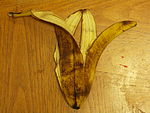](https://en.wikipedia.org/wiki/File:Thepeel.jpg)

[(L)](https://en.wikipedia.org/wiki/File:Thepeel.jpg)
Can you [get high on this](https://en.wikipedia.org/wiki/Bananadine)?

[(L)](https://en.wikipedia.org/wiki/File:Hazard_E_no_border.svg)

[Ever woken up thinking this has just happened?](https://en.wikipedia.org/wiki/Exploding_head_syndrome)

[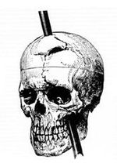](https://en.wikipedia.org/wiki/File:Phineas_gage_-_1868_skull_diagram.jpg)

[(L)](https://en.wikipedia.org/wiki/File:Phineas_gage_-_1868_skull_diagram.jpg)

This skull's owner didn't even get a headache – but he was [a changed man](https://en.wikipedia.org/wiki/Phineas_Gage).

[(L)](https://en.wikipedia.org/wiki/File:Alaska_ANWR_Canning_River.jpg)

[It's... beautiful... Just... beautiful!](https://en.wikipedia.org/wiki/Stendhal_syndrome)

|     |     |
| --- | --- |
| **[Anton-Babinski syndrome](https://en.wikipedia.org/wiki/Anton-Babinski_syndrome)** | People who are blind but convinced they can see. |
| **[Bananadine](https://en.wikipedia.org/wiki/Bananadine)** | Exactly how psychedelic are those dried banana peels? |
| **[Capgras delusion](https://en.wikipedia.org/wiki/Capgras_delusion)** | When you're sure a friend or loved one is an impostor. |
| **[Charles Bonnet syndrome](https://en.wikipedia.org/wiki/Charles_Bonnet_syndrome)** | Millions of perfectly sane people are having freakish hallucinations – and just not admitting it. |
| **[Coregasm](https://en.wikipedia.org/wiki/Coregasm)** | An orgasm caused by exercising of the core abdominal muscles. |
| **[Cotard delusion](https://en.wikipedia.org/wiki/Cotard_delusion)** | Suffered by people, very much alive, who believe they're dead. |
| **[Dancing mania](https://en.wikipedia.org/wiki/Dancing_mania)** | Unknown forces cause large groups of people to dance hysterically until dropping from exhaustion in multiple incidents in Europe from the 13th to 17th centuries. |
| **[Donkey punch](https://en.wikipedia.org/wiki/Donkey_punch)** | Allegedly a sex move involving punching one's partner in the back of the head during intercourse. |
| **[Electromagnetic hypersensitivity](https://en.wikipedia.org/wiki/Electromagnetic_hypersensitivity)** | For those allergic to [Wi-Fi](https://en.wikipedia.org/wiki/Wi-Fi). |
| **[Exploding head syndrome](https://en.wikipedia.org/wiki/Exploding_head_syndrome)** | Ever woken up after an hour or two of sleep thinking you've just heard a massive explosion? |
| **[Female hysteria](https://en.wikipedia.org/wiki/Female_hysteria)** | A once-common diagnosis of a range of symptoms in women, cured through masturbation to orgasm. |
| **[Foreign accent syndrome](https://en.wikipedia.org/wiki/Foreign_accent_syndrome)** | A rare medical condition whereby sufferers speak their native language with a foreign accent. |
| **[Fregoli delusion](https://en.wikipedia.org/wiki/Fregoli_delusion)** | The belief that different people are actually one person in disguise. |
| **[Homicidal sleepwalking](https://en.wikipedia.org/wiki/Homicidal_sleepwalking)** | A real [parasomnia](https://en.wikipedia.org/wiki/Parasomnia) that has been [successfully](https://en.wikipedia.org/wiki/R._v._Parks) used as a defence in court. |
| **[Jumping Frenchmen of Maine](https://en.wikipedia.org/wiki/Jumping_Frenchmen_of_Maine)** | Like Tourette's syndrome, but more Gallic. |
| **[Klüver–Bucy syndrome](https://en.wikipedia.org/wiki/Kl%C3%BCver%E2%80%93Bucy_syndrome)** | A behavioral disorder with some very odd symptoms, including "hypersexuality" and a desire to examine objects with the mouth. Named after two doctors who gave psychotropic drugs to lobotomized monkeys. |
| **[Mariko Aoki phenomenon](https://en.wikipedia.org/wiki/Mariko_Aoki_phenomenon)** | A Japanese expression referring to an urge to defecate that is suddenly felt after entering bookstores. |
| **[MK-ULTRA](https://en.wikipedia.org/wiki/Project_MKULTRA)** | When a late-night radio host claims to have been brainwashed by the CIA, you may want to think twice. |
| **[Paris Syndrome](https://en.wikipedia.org/wiki/Paris_Syndrome)** | Particularly common among Japanese tourists. Not to be confused with [Jerusalem Syndrome](https://en.wikipedia.org/wiki/Jerusalem_Syndrome) or [Stockholm Syndrome](https://en.wikipedia.org/wiki/Stockholm_Syndrome). |
| **[Penis panic](https://en.wikipedia.org/wiki/Penis_panic)** | A colloquial term referring to a type of [mass hysteria](https://en.wikipedia.org/wiki/Mass_hysteria) or [panic](https://en.wikipedia.org/wiki/Panic) where males grow fearful of [removal](https://en.wikipedia.org/wiki/Penis_removal) or shrinking of the [penis](https://en.wikipedia.org/wiki/Penis). |
| **[Rosenhan experiment](https://en.wikipedia.org/wiki/Rosenhan_experiment)** | Sane mental patients. |
| **[Sleep sex](https://en.wikipedia.org/wiki/Sleep_sex)** | A form of [parasomnia](https://en.wikipedia.org/wiki/Parasomnia) (similar to sleepwalking) that causes people to engage in sexual acts while they are asleep. |
| **[Stendhal syndrome](https://en.wikipedia.org/wiki/Stendhal_syndrome)** | A psychosomatic illness that causes rapid heartbeat, dizziness, fainting, confusion and even hallucinations when an individual is exposed to art or natural beauty. |
| **[Tanganyika laughter epidemic](https://en.wikipedia.org/wiki/Tanganyika_laughter_epidemic)** | What happens when contagious laughter becomes an actual epidemic. |
| **[Target fixation](https://en.wikipedia.org/wiki/Target_fixation)** | To become so fixated on an object you are trying to avoid that you collide with it. |
| **[Tip of the tongue](https://en.wikipedia.org/wiki/Tip_of_the_tongue)** | A memory-related phenomenon familiar to us all. |
| **[The Truman Show delusion](https://en.wikipedia.org/wiki/The_Truman_Show_delusion)** | Those afflicted feel they are being watched all the time by a television audience, like Jim Carrey in the 1998 movie *[The Truman Show](https://en.wikipedia.org/wiki/The_Truman_Show)*. |
| **[Urophagia](https://en.wikipedia.org/wiki/Urophagia)** | The consumption of urine. |

### Animals[[edit](https://en.wikipedia.org/w/index.php?title=Wikipedia:Unusual_articles/Science&action=edit&section=T-9)]

[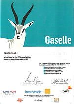](https://en.wikipedia.org/wiki/File:Pro_Tech_AS_Gaselle_2010.jpg)

[(L)](https://en.wikipedia.org/wiki/File:Pro_Tech_AS_Gaselle_2010.jpg)
A major in Antelopology

[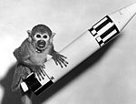](https://en.wikipedia.org/wiki/File:Baker.jpg)

[(L)](https://en.wikipedia.org/wiki/File:Baker.jpg)

To boldly go where no monkey has gone before. [Well, where a few monkeys have gone before](https://en.wikipedia.org/wiki/Animals_in_space).

[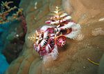](https://en.wikipedia.org/wiki/File:Christmas_Tree_Worm.jpg)

[(L)](https://en.wikipedia.org/wiki/File:Christmas_Tree_Worm.jpg)

Santa's little [underwater worms](https://en.wikipedia.org/wiki/Christmas_tree_worm).

[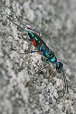](https://en.wikipedia.org/wiki/File:Ampulex_compressa.jpg)

[(L)](https://en.wikipedia.org/wiki/File:Ampulex_compressa.jpg)
The ['roachmeister](https://en.wikipedia.org/wiki/Emerald_cockroach_wasp).

[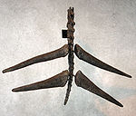](https://en.wikipedia.org/wiki/File:Thagomizer_01.jpg)

[(L)](https://en.wikipedia.org/wiki/File:Thagomizer_01.jpg)
[*The Far Side* of a stegosaurus](https://en.wikipedia.org/wiki/Thagomizer).

[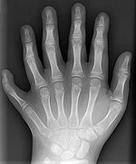](https://en.wikipedia.org/wiki/File:Polydactyly_01_Lhand_AP.jpg)

[(L)](https://en.wikipedia.org/wiki/File:Polydactyly_01_Lhand_AP.jpg)
Can only wear mittens, not gloves

|     |     |
| --- | --- |
| ***[Adactylidium](https://en.wikipedia.org/wiki/Adactylidium)*** | A mite with a very unusual life cycle. |
| **[Animals in space](https://en.wikipedia.org/wiki/Animals_in_space)** | An annotated list of the various animals used in space programs. |
| **[Animal attacks](https://en.wikipedia.org/wiki/Animal_attacks)** | Not kidding: death by beavers, bunnies, squirrels, cats and other things you should not have as pets. |
| **[Apophallation](https://en.wikipedia.org/wiki/Apophallation)** | Are you a snail and can't extract your penis? Amputate and change your gender. |
| **[Bobbit worm](https://en.wikipedia.org/wiki/Bobbit_worm)** | "Armed with sharp teeth, it is known to attack with such speeds that its prey is sometimes sliced in half." As if being a three-foot (0.91 m) worm were not impressive enough. |
| **[Candiru](https://en.wikipedia.org/wiki/Candiru)** | Lodged in and extracted from human penises. |
| **[Christmas tree worm](https://en.wikipedia.org/wiki/Spirobranchus_giganteus)** | A worm that looks like... a Christmas tree. |
| **[Depopulation of cockroaches in the ex-USSR countries](https://en.wikipedia.org/wiki/Depopulation_of_cockroaches_in_the_ex-USSR_countries)** | A great ecological problem indeed complete with fifteen references in Russian. |
| ***[Epomis](https://en.wikipedia.org/wiki/Epomis)*** | A deceptive beetle larva that entices its own predators by feigning prey-like movements in order to eat its predator. |
| **[Exploding toads](https://en.wikipedia.org/wiki/Exploding_toad)** | An as-yet unexplained phenomenon observed in April 2005 in [Germany](https://en.wikipedia.org/wiki/Germany) and [Denmark](https://en.wikipedia.org/wiki/Denmark). Suggested as a possible weapons delivery system. |
| **[Exploding whale](https://en.wikipedia.org/wiki/Exploding_whale)** | The next time a whale washes on shore in one Oregon county, the authorities will leave the dynamite at home. |
| **[Hallucinogenic fish](https://en.wikipedia.org/wiki/Hallucinogenic_fish)** | No, the fish are not trippin'; they will cause hallucinations if ingested. It is not known if hallucinations will occur if one fish consumes another. |
| **[List of animals displaying homosexual behavior](https://en.wikipedia.org/wiki/List_of_animals_displaying_homosexual_behavior)** | Everything from salmon to seagulls to dragonflies. |
| **[List of animals with fraudulent diplomas](https://en.wikipedia.org/wiki/List_of_animals_with_fraudulent_diplomas)** | Your pet may be smarter than you. |
| **[London Underground mosquito](https://en.wikipedia.org/wiki/London_Underground_mosquito)** | A species of [mosquito](https://en.wikipedia.org/wiki/Mosquito) that lives in underground railways. |
|  **[Love dart](https://en.wikipedia.org/wiki/Love_dart)** | Hermaphroditic snails play [Cupid](https://en.wikipedia.org/wiki/Cupid). |
| **[Monkey selfie](https://en.wikipedia.org/wiki/Monkey_selfie)** | Is a [selfie](https://en.wikipedia.org/wiki/Selfie) taken by the critically-endangered [Celebes crested macaque](https://en.wikipedia.org/wiki/Celebes_crested_macaque) eligible for copyright? The Wikipedia article in question focuses on the copyright claim and is the subject of a lawsuit by the owner of the camera on which the images were taken. |
| **[Nightingale excrement as facial](https://en.wikipedia.org/wiki/Uguisu_no_fun)** | Droppings of a nightingale variety used in facials. Some claim that it helps with acne. Project Medicine states that the references are **not** MEDRS. (MEDical Reliable Source) |
| **[Orbiting Frog Otolith](https://en.wikipedia.org/wiki/Orbiting_Frog_Otolith)** | A NASA frog experiment, sending two bullfrogs into space to test their sense of balance. |
| ***[Paracerceis sculpta](https://en.wikipedia.org/wiki/Paracerceis_sculpta)*** | A species of [isopod](https://en.wikipedia.org/wiki/Isopod) that has some males that mimic females and others that mimic juveniles, allowing them to mate without the alpha males realising what is going on behind their backs. |
| **[Pasilalinic-sympathetic compass](https://en.wikipedia.org/wiki/Pasilalinic-sympathetic_compass)** | Telepathic communication is not possible in snails no matter how far apart they may be. Nothing else has been ruled out. |
| **[Penis fencing](https://en.wikipedia.org/wiki/Penis_fencing)** | A (literal) figurative variety of cockfighting between some species of [flatworm](https://en.wikipedia.org/wiki/Flatworm). |
| **[Prostitution among animals](https://en.wikipedia.org/wiki/Prostitution_among_animals)** | Did you know that [prostitution](https://en.wikipedia.org/wiki/Prostitution) exists among animals? |
| **[Stephens Island wren](https://en.wikipedia.org/wiki/Stephens_Island_wren)** | Made extinct by feral cats, possibly the offspring of one pregnant female. |
| **[Stray animals at Indian airports](https://en.wikipedia.org/wiki/Stray_animals_at_Indian_airports)** | Talk about wild protesters! |
| **[Supernumerary body part](https://en.wikipedia.org/wiki/Supernumerary_body_part)** | Having an extra body part, be it as simple as an [eleventh finger](https://en.wikipedia.org/wiki/Polydactyly) or as extreme as a [second head](https://en.wikipedia.org/wiki/Polycephaly)! |
| **[Suriname toad](https://en.wikipedia.org/wiki/Suriname_toad)** | The mother's back is where the eggs are embedded and where they develop. |
| **[Thagomizer](https://en.wikipedia.org/wiki/Thagomizer)** | A feature of *[Stegosaurus](https://en.wikipedia.org/wiki/Stegosaurus)* anatomy named after a *[Far Side](https://en.wikipedia.org/wiki/The_Far_Side)* comic strip. |
| **[Tongue-eating louse](https://en.wikipedia.org/wiki/Tongue-eating_louse)** | A parasitic crustacean that, when female (they are hermaphroditic), attaches to and then destroys a fish's tongue, hooks itself to the remaining stub and becomes the fish's new tongue. |
| **[Traumatic insemination](https://en.wikipedia.org/wiki/Traumatic_insemination)** | A form of mating in invertebrates in which the male stabs the female in the abdomen with his penis, and injects his sperm through the wound. |
| **[Whale fall](https://en.wikipedia.org/wiki/Whale_fall)** | The ecological consequences associated with a dead whale sinking to the seafloor. |
| **[Worm charming](https://en.wikipedia.org/wiki/Worm_charming)** | No spade? No worries! There's a better way to get hold of earthworms. |

#### Chickens[[edit](https://en.wikipedia.org/w/index.php?title=Wikipedia:Unusual_articles/Science&action=edit&section=T-10)]

[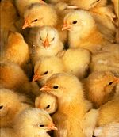](https://en.wikipedia.org/wiki/File:Morechicks.jpg)

[(L)](https://en.wikipedia.org/wiki/File:Morechicks.jpg)

Can *you*  [tell the girls and boys apart](https://en.wikipedia.org/wiki/Chick_sexing)?

|     |     |
| --- | --- |
| **[Chicken eyeglasses](https://en.wikipedia.org/wiki/Chicken_eyeglasses)** | Tiny spectacles for chicks, to stop them from seeing red. |
| **[Chicken Dance](https://en.wikipedia.org/wiki/Chicken_Dance), [Chicken (dance)](https://en.wikipedia.org/wiki/The_Chicken_(dance))** | There is a huge difference. |
| **[Chicken gun](https://en.wikipedia.org/wiki/Chicken_gun)** | Valuable for the mitigation of damage from [bird strikes](https://en.wikipedia.org/wiki/Bird_strike). The chicken carcass must be thawed first, though. |
| **[Chicken hypnotism](https://en.wikipedia.org/wiki/Chicken_hypnotism)** | Have you ever wanted to hypnotize a chicken? If not, why not? |
| **[Chicken or the egg](https://en.wikipedia.org/wiki/Chicken_or_the_egg)** | Which came first? |
| **[Chicken sexer](https://en.wikipedia.org/wiki/Chick_sexing)** | A person who has been specially trained to determine the sex of [chicken](https://en.wikipedia.org/wiki/Chicken) hatchlings. |
| **[Chicken Powered Nuclear Bomb](https://en.wikipedia.org/wiki/Blue_Peacock)** | A British project to lay nuclear mines in West Germany during the Cold War |
| **[Empathy in chickens](https://en.wikipedia.org/wiki/Empathy_in_chickens)** | Have some empathy when eating crunchy chicken nuggets. |
| **[Hollywood Freeway chickens](https://en.wikipedia.org/wiki/Hollywood_Freeway_chickens)** | A colony of [feral chickens](https://en.wikipedia.org/wiki/Feral_chicken) that have been living underneath a highway off-ramp since 1970. |
| **[Mike the Headless Chicken](https://en.wikipedia.org/wiki/Mike_the_Headless_Chicken)** | A rooster that lived for 18 months with its head cut off. |
| **[Tastes like chicken](https://en.wikipedia.org/wiki/Tastes_like_chicken)** | But baked, grilled, or fried? |
| **[Chicken and duck blood soup](https://en.wikipedia.org/wiki/Chicken_and_duck_blood_soup)** | Heads and feet included. |
| **[Cannibalism in poultry](https://en.wikipedia.org/wiki/Cannibalism_in_poultry)** | See: [tastes like chicken](https://en.wikipedia.org/wiki/Tastes_like_chicken). |

#### Squirrels[[edit](https://en.wikipedia.org/w/index.php?title=Wikipedia:Unusual_articles/Science&action=edit&section=T-11)]

[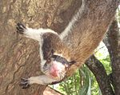](https://en.wikipedia.org/wiki/File:Scary_Squirrel,_Habanara_(cropped).jpg)

[(L)](https://en.wikipedia.org/wiki/File:Scary_Squirrel,_Habanara_(cropped).jpg)

A very scary squirrel

|     |     |
| --- | --- |
| **[Squirrel induced power outages in Pennsylvania](https://en.wikipedia.org/wiki/Squirrel_induced_power_outages_in_Pennsylvania)** | Purhaps you should reconsider that summer visit to Gettysburg. |
| **[Squirrel attacks](https://en.wikipedia.org/wiki/Squirrel_attacks)** | Did you know that insurance companies have a medical code for this? Co-pays vary by insurance plan. |
| **[Squirrel-sponsored cyberterrorism](https://en.wikipedia.org/wiki/Squirrel-sponsored_cyberterrorism)** | Homeland Security hasn't got a clue |

#### Mammals[[edit](https://en.wikipedia.org/w/index.php?title=Wikipedia:Unusual_articles/Science&action=edit&section=T-12)]

[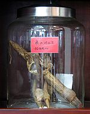](https://en.wikipedia.org/wiki/File:Yokohama_Chinese_Medicine_Deer_Penis.jpg)

[(L)](https://en.wikipedia.org/wiki/File:Yokohama_Chinese_Medicine_Deer_Penis.jpg)

Dried [deer penis](https://en.wikipedia.org/wiki/Deer_penis).

[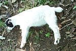](https://en.wikipedia.org/wiki/File:Fainted.jpg)

[(L)](https://en.wikipedia.org/wiki/File:Fainted.jpg)

[This goat has fainted. It has ceased to stand](https://en.wikipedia.org/wiki/Fainting_goat).

[(L)](https://en.wikipedia.org/wiki/File:Astrid_com_orelhonas-crop.jpg)
[(L)](https://en.wikipedia.org/wiki/File:Astrid_com_orelhonas-crop.jpg)

Flash photograph of an [odd-eyed cat](https://en.wikipedia.org/wiki/Odd-eyed_cat).

[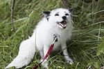](https://en.wikipedia.org/wiki/File:Georgian_white_Russian_domesticated_Red_Fox.jpg)

[(L)](https://en.wikipedia.org/wiki/File:Georgian_white_Russian_domesticated_Red_Fox.jpg)

Georgian white Russian domesticated Fox

|     |     |
| --- | --- |
| **[Berserk llama syndrome](https://en.wikipedia.org/wiki/Berserk_llama_syndrome)** | The result of being too friendly with llamas. |
| **[(L)](https://en.wikipedia.org/wiki/File:Featured_article_star.svg)  [Chief Mouser to the Cabinet Office](https://en.wikipedia.org/wiki/Chief_Mouser_to_the_Cabinet_Office)** | ...otherwise known as the cat who lives at the [official residence](https://en.wikipedia.org/wiki/Official_residence) of the [Prime Minister of the United Kingdom](https://en.wikipedia.org/wiki/Prime_Minister_of_the_United_Kingdom). |
| **[Cow magnet](https://en.wikipedia.org/wiki/Cow_magnet)** | A plastic-coated magnet fed to cows to prevent gut damage by ingested bits of metal, aka [hardware disease](https://en.wikipedia.org/wiki/Hardware_disease). |
|  **[Cow tipping](https://en.wikipedia.org/wiki/Cow_tipping)** | This actually takes up to 14 people to make it happen. |
| **[Danish Protest Pig](https://en.wikipedia.org/wiki/Danish_Protest_Pig)** | A pig bred to look like the [flag of Denmark](https://en.wikipedia.org/wiki/Flag_of_Denmark), to circumvent prohibition of the flag. |
| **[Deer penis](https://en.wikipedia.org/wiki/Deer_penis)** | It is said to enhance sexual potency in men and was banned by the Chinese government from the [2008 Olympics](https://en.wikipedia.org/wiki/2008_Summer_Olympics). |
| **[Diving horse](https://en.wikipedia.org/wiki/Diving_horse)** | A short-lived attraction during the 1880s. |
| **[Domesticated silver fox](https://en.wikipedia.org/wiki/Domesticated_silver_fox)** | Soviet Russia subsidizes the breeding of silver foxes. |
| **[Fainting goat](https://en.wikipedia.org/wiki/Fainting_goat)** | A breed of goat whose muscles freeze for about 10 seconds when it is startled. |
| **[Globster](https://en.wikipedia.org/wiki/Globster)** | Blobs of organic matter found washed up on beaches, which are frequently as mysterious as they are disgusting. |
| **[Guided rat](https://en.wikipedia.org/wiki/Guided_rat)** | Implanted electrodes let researchers "steer the animal over an obstacle course, making it twist, turn and even jump on demand". |
| **[Hardware disease](https://en.wikipedia.org/wiki/Hardware_disease)** | A condition in bovines caused by ingesting stray bits of metal. |
| **[Odd-eyed cat](https://en.wikipedia.org/wiki/Odd-eyed_cat)** | One of the [national treasures](https://en.wikipedia.org/wiki/National_treasure) of [Turkey](https://en.wikipedia.org/wiki/Turkey). As owned by [Muhammad](https://en.wikipedia.org/wiki/Muhammad). |
| **[Overtoun Bridge](https://en.wikipedia.org/wiki/Overtoun_Bridge)** | A bridge from which [dogs](https://en.wikipedia.org/wiki/Dog) keep leaping to their death. |
| **[Panda pornography](https://en.wikipedia.org/wiki/Panda_pornography)** | Pornographic movies created to achieve sexual arousal for [Giant pandas](https://en.wikipedia.org/wiki/Giant_panda), which have been proven to be unaffected by the popular drug [Viagra](https://en.wikipedia.org/wiki/Viagra). |
| **[Street dogs in Moscow](https://en.wikipedia.org/wiki/Street_dogs_in_Moscow)** | Some of them have figured out how to commute using the subway system. |
| **[The dog ate my homework](https://en.wikipedia.org/wiki/The_dog_ate_my_homework)** | Instead of a pathetic excuse for an article, an article about a pathetic excuse. |
| **[Weasel war dance](https://en.wikipedia.org/wiki/Weasel_war_dance)** | The behavior of extremely excited ferrets who are enjoying themselves too much. |

#### Individual animals[[edit](https://en.wikipedia.org/w/index.php?title=Wikipedia:Unusual_articles/Science&action=edit&section=T-13)]

[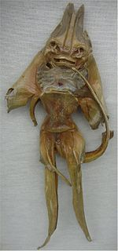](https://en.wikipedia.org/wiki/File:Jenny_Haniver1218.jpg)

[(L)](https://en.wikipedia.org/wiki/File:Jenny_Haniver1218.jpg)
[Jenny Haniver](https://en.wikipedia.org/wiki/Jenny_Haniver).

[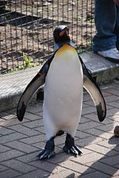](https://en.wikipedia.org/wiki/File:Nils_Olav_wide.jpg)

[(L)](https://en.wikipedia.org/wiki/File:Nils_Olav_wide.jpg)
Colonel-in-Chief Sir [Nils Olav](https://en.wikipedia.org/wiki/Nils_Olav).

[(L)](https://en.wikipedia.org/wiki/File:Tilred.jpg)

[Tillamook Cheddar](https://en.wikipedia.org/wiki/Tillamook_Cheddar_(dog)), artist.

|     |     |
| --- | --- |
| **[Adwaita](https://en.wikipedia.org/wiki/Adwaita)** | Possibly the oldest creature of modern times, this 255 year-old [tortoise](https://en.wikipedia.org/wiki/Tortoise) was the former pet of [Robert Clive](https://en.wikipedia.org/wiki/Robert_Clive) of the [British East India Company](https://en.wikipedia.org/wiki/British_East_India_Company). |
| **[Benson](https://en.wikipedia.org/wiki/Benson_(fish))** | A fish. A big fish. Called Benson. |
| **[Jack Black](https://en.wikipedia.org/wiki/Jack_Black_(rat_catcher))** | [Queen Victoria](https://en.wikipedia.org/wiki/Queen_Victoria)'s officially appointed [rat-catcher](https://en.wikipedia.org/wiki/Rat-catcher) and [mole](https://en.wikipedia.org/wiki/Mole_(animal)) destroyer. |
|  **[Bubbles](https://en.wikipedia.org/wiki/Bubbles_(chimpanzee))** | A chimpanzee who used human toilet facilities, [moonwalked](https://en.wikipedia.org/wiki/Moonwalk_(dance)), and (allegedly) attempted suicide. |
| **[Bummer and Lazarus](https://en.wikipedia.org/wiki/Bummer_and_Lazarus)** | Two stray dogs that roamed the streets of San Francisco, California in the early 1860s and were exempted from local ordinances. |
| **[Casper](https://en.wikipedia.org/wiki/Casper_(cat))** | A cat famed for traveling on a bus around [Plymouth](https://en.wikipedia.org/wiki/Plymouth), England. |
| **[Cat Mandu](https://en.wikipedia.org/wiki/Cat_Mandu)** | The late co-leader of one of Britain's more unusual political parties. |
| **[Domino Day 2005 sparrow](https://en.wikipedia.org/wiki/Domino_Day_2005_sparrow)** | A sparrow that ruined a Domino exhibition, was killed and became a legal case. |
| **[Dusty the Klepto Kitty](https://en.wikipedia.org/wiki/Dusty_the_Klepto_Kitty)** | Redefining the term "cat burglar". |
| **[Enumclaw horse sex case](https://en.wikipedia.org/wiki/Enumclaw_horse_sex_case)** | An unfortunate case of a horse riding a man, as opposed to a man riding a horse. |
| **[George](https://en.wikipedia.org/wiki/George_(lobster))** | A lobster weighing 20 pounds (9.1 kg), estimated to be 140 years old. |
| **[Handsome Dan](https://en.wikipedia.org/wiki/Handsome_Dan)** | The various incarnations of [Yale University](https://en.wikipedia.org/wiki/Yale_University)'s athletic [mascot](https://en.wikipedia.org/wiki/Mascot). "In personal appearance he seemed like a cross between an alligator and a horned frog...". |
| **[Henry the Hexapus](https://en.wikipedia.org/wiki/Henry_the_Hexapus)** | An octopus missing two arms due to an unfortunate birth defect. |
| **[Hoover the talking seal](https://en.wikipedia.org/wiki/Hoover_the_talking_seal)** | Hoover. A seal. Which talked. |
| **[Jack](https://en.wikipedia.org/wiki/Jack_(chacma_baboon))** | A Baboon who took over for his paraplegic owner as an employee of the Cape government railway. Reportedly never erred.[*[citation needed](https://en.wikipedia.org/wiki/Wikipedia:Citation_needed)*] |
| **[Jenny Haniver](https://en.wikipedia.org/wiki/Jenny_Haniver)** | A grotesque-looking [sea monster](https://en.wikipedia.org/wiki/Sea_monster) made from the corpse of a [ray](https://en.wikipedia.org/wiki/Batoidea). |
| **[Jonathan](https://en.wikipedia.org/wiki/Jonathan_(tortoise))** | He made the reverse of the 5p of [Saint Helena](https://en.wikipedia.org/wiki/Saint_Helena). What have you done? |
| **[Khanzir](https://en.wikipedia.org/wiki/Khanzir)** | Possibly the world's loneliest pig. Even more lonely during the swine flu outbreak. |
| **[Lily Flagg](https://en.wikipedia.org/wiki/Lily_Flagg)** | A Jersey cow who made a lot of butter and got a sizable neighborhood named for her. |
| **[Lin Wang](https://en.wikipedia.org/wiki/Lin_Wang)** | A Taiwanese elephant made famous for his participation in the [Second Sino-Japanese War](https://en.wikipedia.org/wiki/Second_Sino-Japanese_War). |
| **[Mary](https://en.wikipedia.org/wiki/Mary_(elephant))** | Makes the phrase "hung like an elephant" take on a whole new meaning. |
| **[Nigger](https://en.wikipedia.org/wiki/Nigger_(dog))** | A black dog whose portrayal in *[The Dam Busters](https://en.wikipedia.org/wiki/The_Dam_Busters_(film))* (1955) somehow had to be edited out, overdubbed, or renamed. Nigger's grave remains [unredacted](https://en.wikipedia.org/wiki/Unredacted), though. |
| **[Nils Olav](https://en.wikipedia.org/wiki/Nils_Olav)** | A [King Penguin](https://en.wikipedia.org/wiki/King_Penguin) who is [Colonel-in-Chief](https://en.wikipedia.org/wiki/Colonel-in-Chief) of the [Royal Norwegian Guard](https://en.wikipedia.org/wiki/Royal_Norwegian_Guard). |
| **[Nim Chimpsky](https://en.wikipedia.org/wiki/Nim_Chimpsky)** | A [chimpanzee](https://en.wikipedia.org/wiki/Chimpanzee), subject of long-running studies into [animal language acquisition](https://en.wikipedia.org/wiki/Animal_language_acquisition), named punningly for linguist [Noam Chomsky](https://en.wikipedia.org/wiki/Noam_Chomsky). |
| **[Oscar the Cat](https://en.wikipedia.org/wiki/Oscar_(therapy_cat))** | A [hospice](https://en.wikipedia.org/wiki/Hospice_care_in_the_United_States)  [cat](https://en.wikipedia.org/wiki/Cat) who was featured in the *[New England Journal of Medicine](https://en.wikipedia.org/wiki/New_England_Journal_of_Medicine)* for his purported ability to predict the impending death of terminally ill patients. |
| **[Osama bin Laden (elephant)](https://en.wikipedia.org/wiki/Osama_bin_Laden_(elephant))** | An elusive elephant who terrorized the jungle of Assam. He was eventually shot, but there are those who question the official story of his death. [Much like his famous namesake](https://en.wikipedia.org/wiki/Osama_bin_Laden_death_conspiracy_theories). (Please do not judge all elephants based on the behavior of this one rogue specimen.) |
| **[Owen and Mzee](https://en.wikipedia.org/wiki/Owen_and_Mzee)** | Hippo and tortoise that befriended each other after the [2004 Indian Ocean Tsunami](https://en.wikipedia.org/wiki/2004_Indian_Ocean_Tsunami). |
| **[Paul](https://en.wikipedia.org/wiki/Paul_the_Octopus)** | A now-deceased psychic octopus who could predict the winner of football games, notably during the [2010 FIFA World Cup](https://en.wikipedia.org/wiki/2010_FIFA_World_Cup). |
| **[Ravens of the Tower of London](https://en.wikipedia.org/wiki/Ravens_of_the_Tower_of_London)** | [Ravens](https://en.wikipedia.org/wiki/Common_Raven) used as [soldiers](https://en.wikipedia.org/wiki/Soldiers) in the [Tower of London](https://en.wikipedia.org/wiki/Tower_of_London) |
| **[River Thames whale](https://en.wikipedia.org/wiki/River_Thames_whale)** | In 2006, a Northern Bottlenose swam into [London](https://en.wikipedia.org/wiki/London) and on to the front pages of the British newspapers. |
| **[Rose](https://en.wikipedia.org/wiki/Rose_(goat))** | A goat that was married to a Sudanese man in 2006. |
| **[St Guinefort](https://en.wikipedia.org/wiki/Saint_Guinefort)** | A 13th-century French dog unofficially [venerated](https://en.wikipedia.org/wiki/Veneration) as a saint until the 1930s. |
| **[Tama](https://en.wikipedia.org/wiki/Tama_(cat))** | The official station master of a railway station in Japan. |
| **[Tamworth Two](https://en.wikipedia.org/wiki/Tamworth_Two)** | In 1998, two [pigs](https://en.wikipedia.org/wiki/Pig) escaped from an [abattoir](https://en.wikipedia.org/wiki/Abattoir) in [Wiltshire](https://en.wikipedia.org/wiki/Wiltshire) and made news, both in the [United Kingdom](https://en.wikipedia.org/wiki/United_Kingdom) and worldwide. (Their story was turned into a TV movie in 2003.) |
| **[Tillamook Cheddar](https://en.wikipedia.org/wiki/Tillamook_Cheddar_(dog))** | The world's most successful and widely shown animal artist. |
| **[Timothy](https://en.wikipedia.org/wiki/Timothy_(tortoise))** | A [tortoise](https://en.wikipedia.org/wiki/Tortoise) that was present during the bombardment of [Sevastopol](https://en.wikipedia.org/wiki/Sevastopol) during the [Crimean War](https://en.wikipedia.org/wiki/Crimean_War) in 1854 and survived until 2004. |
| **[Tirpitz](https://en.wikipedia.org/wiki/Tirpitz_(pig))** | A [pig](https://en.wikipedia.org/wiki/Pig) who survived the sinking of one warship, to become the mascot on one of the ships that had sunk his first home. Tragically he was then auctioned off and eaten. |
| **[Topsy (elephant)](https://en.wikipedia.org/wiki/Topsy_(elephant))** | An elephant that was electrocuted, as the event was filmed by the [Edison Manufacturing Company](https://en.wikipedia.org/wiki/Edison_Manufacturing_Company). |
|  **[William Windsor](https://en.wikipedia.org/wiki/William_Windsor_(goat))** | A [Cashmere goat](https://en.wikipedia.org/wiki/Cashmere_goat) that is a [lance corporal](https://en.wikipedia.org/wiki/Lance_Corporal) in the [British Army](https://en.wikipedia.org/wiki/British_Army)'s 1st Battalion of the [Royal Welsh](https://en.wikipedia.org/wiki/Royal_Welsh) infantry. |
| **[Wojtek](https://en.wikipedia.org/wiki/Wojtek_(soldier_bear))** | A soldier of the 22nd Artillery Supply Company of the [Polish II Corps](https://en.wikipedia.org/wiki/Polish_II_Corps) who also happened to be a [Syrian Brown Bear](https://en.wikipedia.org/wiki/Syrian_Brown_Bear). He enjoyed beer and cigarettes. |
| **[Yvonne](https://en.wikipedia.org/wiki/Yvonne_(cow))** | A runaway [cow](https://en.wikipedia.org/wiki/Cattle) with a €10,000 bounty. |

### Names in biology[[edit](https://en.wikipedia.org/w/index.php?title=Wikipedia:Unusual_articles/Science&action=edit&section=T-14)]

[(L)](https://en.wikipedia.org/wiki/File:Eristalis_gatesi.jpg)

[Bill Gates' flower fly](https://en.wikipedia.org/wiki/Bill_Gates%27_flower_fly).

[(L)](https://en.wikipedia.org/wiki/File:SMAD3_SMAD4_COMPLEX.png)

['SMAD, mad, mad, (mad), (mad) name?](https://en.wikipedia.org/wiki/Mothers_against_decapentaplegic_homolog_3)

|     |     |
| --- | --- |
| ***[Anophthalmus hitleri](https://en.wikipedia.org/wiki/Anophthalmus_hitleri)*** | Rare blind beetle named after [Adolf Hitler](https://en.wikipedia.org/wiki/Adolf_Hitler), poached by collectors of Hitler memorabilia. |
| ***[Aptostichus stephencolberti](https://en.wikipedia.org/wiki/Aptostichus_stephencolberti)*** | A [trapdoor spider](https://en.wikipedia.org/wiki/Trapdoor_spider) named after [Stephen Colbert](https://en.wikipedia.org/wiki/Stephen_Colbert). Naturally, because he asked for it. |
| **[Bill Gates' flower fly](https://en.wikipedia.org/wiki/Bill_Gates%27_flower_fly)** | A [flower fly](https://en.wikipedia.org/wiki/Flower_fly), *Eristalis gatesi*, named after [Bill Gates](https://en.wikipedia.org/wiki/Bill_Gates). |
| **[GoldenPalace.com Monkey](https://en.wikipedia.org/wiki/Madidi_Titi)** | A new species of monkey that was officially named after the [GoldenPalace.com](https://en.wikipedia.org/wiki/GoldenPalace.com) internet casino. |
| **[List of names for the Wild Turkey](https://en.wikipedia.org/wiki/List_of_names_for_the_Wild_Turkey)** | Not included: "the Wild Turkey". |
| **[Mothers against decapentaplegic](https://en.wikipedia.org/wiki/Mothers_against_decapentaplegic)** | Actually, it's a protein. |
| **[Pikachurin](https://en.wikipedia.org/wiki/Pikachurin)** | An [extracellular matrix](https://en.wikipedia.org/wiki/Extracellular_matrix)-like [retinal](https://en.wikipedia.org/wiki/Retina) protein named after [Pikachu](https://en.wikipedia.org/wiki/Pikachu). |
| **[Scrotum humanum](https://en.wikipedia.org/wiki/Megalosaurus#.22Scrotum_humanum.22)** | Nothing to do with trouser snakes, but lizards of an entirely different scale. |
| **[Setaceous Hebrew Character](https://en.wikipedia.org/wiki/Setaceous_Hebrew_Character)** | A European moth with wing markings bearing a chance resemblance to a letter in the [Hebrew alphabet](https://en.wikipedia.org/wiki/Hebrew_alphabet). |
| - **[Covered smut](https://en.wikipedia.org/wiki/Covered_smut_(barley))** · - **[False loose smut](https://en.wikipedia.org/wiki/False_loose_smut)** · - **[Loose smut](https://en.wikipedia.org/wiki/Loose_smut)** | You may snicker now, but if you had any of these, I guarantee you wouldn't be laughing much. |
| **[Sonic hedgehog](https://en.wikipedia.org/wiki/Sonic_hedgehog)** | A protein in the vertebrate hedgehog family that was officially named after [Sega](https://en.wikipedia.org/wiki/Sega)'s video game character [Sonic the Hedgehog](https://en.wikipedia.org/wiki/Sonic_the_Hedgehog_(character)). |
|  **[Spongiforma squarepantsii](https://en.wikipedia.org/wiki/Spongiforma_squarepantsii)** | A type of mushroom named after [SpongeBob SquarePants](https://en.wikipedia.org/wiki/SpongeBob_SquarePants_(character)). |
| ***[Strigiphilus garylarsoni](https://en.wikipedia.org/wiki/Strigiphilus_garylarsoni)*** | A biting [louse](https://en.wikipedia.org/wiki/Louse) named for cartoonist [Gary Larson](https://en.wikipedia.org/wiki/Gary_Larson) of *[Far Side](https://en.wikipedia.org/wiki/Far_Side)* fame. |
| **[Zombie taxon](https://en.wikipedia.org/wiki/Zombie_taxon)** | [Paleontology](https://en.wikipedia.org/wiki/Paleontology) of the undead. |
| ***[Zyzyxia lundellii](https://en.wikipedia.org/wiki/Zyzyxia_lundellii)*** and ***[Zyzzyva](https://en.wikipedia.org/wiki/Zyzzyva)*** | The last plant name and animal name in the dictionary, respectively. |

See also

- [List of organisms named after famous people](https://en.wikipedia.org/wiki/List_of_organisms_named_after_famous_people)
- [List of U.S. state dinosaurs](https://en.wikipedia.org/wiki/List_of_U.S._state_dinosaurs)  (does not include any of the [List of U.S. state fossils](https://en.wikipedia.org/wiki/List_of_U.S._state_fossils))
- [List of historical pigs](https://en.wikipedia.org/wiki/List_of_historical_pigs)

### Plants[[edit](https://en.wikipedia.org/w/index.php?title=Wikipedia:Unusual_articles/Science&action=edit&section=T-15)]

[(L)](https://en.wikipedia.org/wiki/File:The_Queens_Giant_in_2013.jpg)

The [Queens Giant](https://en.wikipedia.org/wiki/Queens_Giant) – the oldest living thing in the [New York metropolitan area](https://en.wikipedia.org/wiki/New_York_metropolitan_area).

|     |     |
| --- | --- |
| **[Arbre du Ténéré](https://en.wikipedia.org/wiki/Arbre_du_T%C3%A9n%C3%A9r%C3%A9)** | A solitary acacia that was once the most isolated tree on Earth before being run over by a drunken Libyan truck driver. |
| **[Gernikako Arbola](https://en.wikipedia.org/wiki/Gernikako_Arbola)** | The Basque national tree, centre of a number of political disputes, once put under armed guard. |
| **[Axe murder incident](https://en.wikipedia.org/wiki/Axe_murder_incident)** | A popular tree once nearly caused a war between North and South Korea. |
| **[Bialbero de Casorzo](https://en.wikipedia.org/wiki/Bialbero_de_Casorzo)** | A cherry tree that grows upon a mulberry tree in Italy. |
| **[Chandelier Tree](https://en.wikipedia.org/wiki/Chandelier_Tree)** | A 300-foot-tall (91 m) redwood with a giant hole cut through the middle for cars to drive through. |
| **[Moon trees](https://en.wikipedia.org/wiki/Moon_tree)** | Trees planted from seeds that were taken into space by [Apollo 14](https://en.wikipedia.org/wiki/Apollo_14). |
| ***[Nepenthes lowii](https://en.wikipedia.org/wiki/Nepenthes_lowii)*** | A plant that lures animals to release their droppings into a pitcher. |
| **[Penis Plant](https://en.wikipedia.org/wiki/Echinopsis_lageniformis)** | A cactus the Germans call *Frauenglück*, or "Women's Joy". |
| **[Queens Giant](https://en.wikipedia.org/wiki/Alley_Pond_Park#Queens_Giant)** | A [tulip tree](https://en.wikipedia.org/wiki/Liriodendron_tulipifera) located in northeastern [Queens](https://en.wikipedia.org/wiki/Queens), [New York City](https://en.wikipedia.org/wiki/New_York_City), that is confirmed to be the oldest living thing in the New York metropolitan area, as well as the tallest tree in the NY metro area. As of 2005, it is up to 450 years old and 134 feet (41 m) tall. It was alive before the birth of [Shakespeare](https://en.wikipedia.org/wiki/Shakespeare). |
| **[Tree of Knowledge (Australia)](https://en.wikipedia.org/wiki/Tree_of_Knowledge_(Australia))** | Killed by ignorance. |
|  **[Tree That Owns Itself](https://en.wikipedia.org/wiki/Tree_That_Owns_Itself)** | An oak tree in [Athens, Georgia](https://en.wikipedia.org/wiki/Athens,_Georgia) which is popularly regarded as owning itself. |

See also

- [List of famous trees](https://en.wikipedia.org/wiki/List_of_trees)

## Technology, inventions and products[[edit](https://en.wikipedia.org/w/index.php?title=Wikipedia:Unusual_articles/Technology,_inventions_and_products&action=edit&section=T-1)]

[(L)](https://en.wikipedia.org/wiki/File:Dreamachine_still_lit.jpg)

It's [hypnagogic hallucination heaven](https://en.wikipedia.org/wiki/Dreamachine).

[(L)](https://en.wikipedia.org/wiki/File:Ottosdal1.jpg)

Long-lost remnant of a cricket game? [Made by ancient intelligent life? A mysterious natural phenomenon?](https://en.wikipedia.org/wiki/Klerksdorp_sphere)

[(L)](https://en.wikipedia.org/wiki/File:Bundesarchiv_Bild_183-R01996,_Brieftaube_mit_Fotokamera_cropped.jpg)

World War I [pigeon photography](https://en.wikipedia.org/wiki/Pigeon_photography).

[(L)](https://en.wikipedia.org/wiki/File:Merryweather.jpg)

Cower, you leeches, in the presence of the [Tempest Prognosticator](https://en.wikipedia.org/wiki/Tempest_Prognosticator)!

|     |     |
| --- | --- |
| **[Antikythera mechanism](https://en.wikipedia.org/wiki/Antikythera_mechanism)** | An [analog computer](https://en.wikipedia.org/wiki/Analog_computer) built in [Ancient Greece](https://en.wikipedia.org/wiki/Ancient_Greece). |
| ***[Canard Digérateur](https://en.wikipedia.org/wiki/Canard_Dig%C3%A9rateur)*** | Or "Digesting Duck", an [automaton](https://en.wikipedia.org/wiki/Automaton) built to simulate a duck eating, digesting, and excreting. |
|  **[Centennial Light](https://en.wikipedia.org/wiki/Centennial_Light)** | A hundred-year-old [light bulb](https://en.wikipedia.org/wiki/Light_bulb) that has been burning nonstop for 30 years. |
| **[Clocky](https://en.wikipedia.org/wiki/Clocky)** | An [alarm clock](https://en.wikipedia.org/wiki/Alarm_clock) that hides from its owner. |
| **[Digital sundial](https://en.wikipedia.org/wiki/Digital_sundial)** | Unlike an [analog sundial](https://en.wikipedia.org/wiki/Sundial), a clock that indicates the current time with numerals formed by the sunlight striking it. |
| **[Dreamachine](https://en.wikipedia.org/wiki/Dreamachine)** | A device made with a [light bulb](https://en.wikipedia.org/wiki/Light_bulb) and a [record](https://en.wikipedia.org/wiki/Record_player) turntable that reportedly induces [lucid dreaming](https://en.wikipedia.org/wiki/Lucid_dreaming). (And you thought the makers of *[Die Another Day](https://en.wikipedia.org/wiki/Die_Another_Day)* made it up. There's still no news about invisible [Aston Martin V12 Vanquishes](https://en.wikipedia.org/wiki/Aston_Martin_V12_Vanquish).) |
| **[Electronic voice phenomenon](https://en.wikipedia.org/wiki/Electronic_voice_phenomenon)** | Alleged spiritual voices heard in [white noise](https://en.wikipedia.org/wiki/White_noise) and radio interference. |
| **[Hedy Lamarr](https://en.wikipedia.org/wiki/Hedy_Lamarr)** | Film actress co-invents communication system later used in [cell phones](https://en.wikipedia.org/wiki/Cell_phone), [Wi-Fi](https://en.wikipedia.org/wiki/Wi-Fi) and other forms of wireless technologies. |
| **[History of perpetual motion machines](https://en.wikipedia.org/wiki/History_of_perpetual_motion_machines)** | The concept has eluded and baffled the greatest minds for thousands of years – and will continue to elude anyone who tries to build one. |
| **[Klerksdorp sphere](https://en.wikipedia.org/wiki/Klerksdorp_sphere)** | Spheres with three parallel grooves dated to be three billion years old... Evidence of ancient intelligent life? An unusual natural phenomenon? Who knows... |
| **[Knork](https://en.wikipedia.org/wiki/Knork)** | In contrast to the spork (see below), here's a knife/fork combo. |
| **[List of inventors killed by their own inventions](https://en.wikipedia.org/wiki/List_of_inventors_killed_by_their_own_inventions)** | Perilous parachutes, lethal lighthouses and murderous motorcycles! |
| **[Marvin Heemeyer](https://en.wikipedia.org/wiki/Marvin_Heemeyer)** | Why it's always a bad idea to put the guy next door out of business if he has a ten-ton armor-plated bulldozer in his garage. |
| **[The Mississauga Blob](https://en.wikipedia.org/wiki/The_Mississauga_Blob)** | A flaming object that fell from the heavens onto a back-yard picnic table in [Mississauga, Ontario](https://en.wikipedia.org/wiki/Mississauga,_Ontario), Canada in 1979. The mystery of its true nature drew worldwide attention and speculation. Turns out it was a [frisbee](https://en.wikipedia.org/wiki/Frisbee). |
| **[Mosquito laser](https://en.wikipedia.org/wiki/Mosquito_laser)** | A bug zapper with a difference. |
| **[One red paperclip](https://en.wikipedia.org/wiki/One_red_paperclip)** | A man's small piece of metal turns out to be worth more than expected. |
| **[Parking chair](https://en.wikipedia.org/wiki/Parking_chair)** | Using household objects to reserve parking spaces. |
| [(L)](https://en.wikipedia.org/wiki/File:Featured_article_star.svg)**[Pigeon photography](https://en.wikipedia.org/wiki/Pigeon_photography)** | Pigeons were used by the Germans for aerial surveillance in World War I, and apparently also in World War II. Not to forget the CIA's own pigeon camera. |
| **[Project Cybersyn](https://en.wikipedia.org/wiki/Project_Cybersyn)** | [Chilean](https://en.wikipedia.org/wiki/Chile) robo-socialism control chamber invented by a [Brit](https://en.wikipedia.org/wiki/Briton) with a gigantic beard. |
| **[Royal Mail rubber band](https://en.wikipedia.org/wiki/Royal_Mail_rubber_band)** | One billion are used every year and often seen littering the streets of UK cities. |
| **[Russian floating nuclear power station](https://en.wikipedia.org/wiki/Russian_floating_nuclear_power_station)** | Self-contained, low-capacity, floating nuclear power plants. |
| **[Spork](https://en.wikipedia.org/wiki/Spork)** | A cross between a spoon and a fork. Not to be confused with a [knork](https://en.wikipedia.org/wiki/Knork). |
| **[Tempest Prognosticator](https://en.wikipedia.org/wiki/Tempest_Prognosticator)** | [Meteorology](https://en.wikipedia.org/wiki/Meteorology) by frightened [annelid](https://en.wikipedia.org/wiki/Annelid). |
| **[Turboencabulator](https://en.wikipedia.org/wiki/Turboencabulator)** | A device whose sole function is to expose technological ignorance. |
| **[Uncanny valley](https://en.wikipedia.org/wiki/Uncanny_valley)** | How to measure your emotional response to [androids](https://en.wikipedia.org/wiki/Android_(robot)). |
| **[Wheat lamp](https://en.wikipedia.org/wiki/Wheat_lamp)** | A type of lamp used by miners that is unrelated to wheat. |
| **[Wrap rage](https://en.wikipedia.org/wiki/Wrap_rage)** | Ever been driven mad by packaging that just won't open? |
| **[Xianxingzhe](https://en.wikipedia.org/wiki/Xianxingzhe)** | A Chinese robot, according to the Japanese, that will save its country from corporate capitalism with its crotch cannon. |

### Hygiene and sanitation[[edit](https://en.wikipedia.org/w/index.php?title=Wikipedia:Unusual_articles/Technology,_inventions_and_products&action=edit&section=T-2)]

[(L)](https://en.wikipedia.org/wiki/File:JapaneseToiletBidet.jpg)

[Toilets in Japan](https://en.wikipedia.org/wiki/Toilets_in_Japan) have some special features.

|     |     |
| --- | --- |
| **["Darkie" toothpaste](https://en.wikipedia.org/wiki/Darlie)** | Racist toothpaste from Taiwan. |
| **[Groom of the Stool](https://en.wikipedia.org/wiki/Groom_of_the_Stool)** | The most intimate Royal office. |
| **[Hotel toilet-paper folding](https://en.wikipedia.org/wiki/Hotel_toilet-paper_folding)** | Ever wondered why it was so? |
| **[Interactive Urinal Communicator](https://en.wikipedia.org/wiki/Interactive_Urinal_Communicator)** | A talking [urinal](https://en.wikipedia.org/wiki/Urinal) made for advertising purposes. |
|  **[iLoo](https://en.wikipedia.org/wiki/ILoo)** | Microsoft's attempt to bring you the internetz inside the [portable public loo](https://en.wikipedia.org/wiki/Portable_toilet). |
| **[Committee to End Pay Toilets in America](https://en.wikipedia.org/wiki/Committee_to_End_Pay_Toilets_in_America)** | A 1970s organization whose campaign was to end [pay toilets](https://en.wikipedia.org/wiki/Pay_toilets) in [the United States of America](https://en.wikipedia.org/wiki/The_United_States_of_America). |
| **[Japanese toilets](https://en.wikipedia.org/wiki/Toilets_in_Japan)** | The most advanced toilets in the world with computers, nozzles and flashing lights. |
| **[Lloyds Bank turd](https://en.wikipedia.org/wiki/Lloyds_Bank_coprolite)** | Possibly the largest example of fossilised human feces ever found, discovered under the future site of a [Lloyds Bank](https://en.wikipedia.org/wiki/Lloyds_Bank) in England. |
| **[Stainless steel soap](https://en.wikipedia.org/wiki/Stainless_steel_soap)** | Metallic soap that removes odours from the hands. |
| **[Toilet-related injury](https://en.wikipedia.org/wiki/Toilet-related_injury)** | Not all injuries and deaths linked to [toilets](https://en.wikipedia.org/wiki/Toilet) are urban legends. |
| **[Toilet paper orientation](https://en.wikipedia.org/wiki/Toilet_paper_orientation)** | On the pros and cons of letting toilet paper hang *over* or *under* the roll. |
| **[Whizzinator](https://en.wikipedia.org/wiki/Whizzinator)** | A fake [penis](https://en.wikipedia.org/wiki/Penis) used to beat drug tests (complete with dried urine, heater, syringe). Comes in white, tan, Latino, brown, and black |
| **[World Toilet Day](https://en.wikipedia.org/wiki/World_Toilet_Day)** | International [holiday](https://en.wikipedia.org/wiki/Holiday) declared by the [United Nations](https://en.wikipedia.org/wiki/United_Nations). |

### Clothing and accessories[[edit](https://en.wikipedia.org/w/index.php?title=Wikipedia:Unusual_articles/Technology,_inventions_and_products&action=edit&section=T-3)]

|     |     |
| --- | --- |
| **[Koteka](https://en.wikipedia.org/wiki/Koteka)** | An unusual traditional garment of western [New Guinea](https://en.wikipedia.org/wiki/New_Guinea), also known as the "penis gourd". |
|  **[Meat dress of Lady Gaga](https://en.wikipedia.org/wiki/Meat_dress_of_Lady_Gaga)** | A dress made of flank steak. Currently preserved as jerky in the Rock and Roll Hall of Fame. |
| **[Muffin top](https://en.wikipedia.org/wiki/Muffin_top)** | A marketing mishap, many well-meaning young women, and vanity came together to form this demographic. |
| **[Shoe tossing](https://en.wikipedia.org/wiki/Shoe_tossing)** | The practice of throwing footwear, whether for humorous or political purposes. |
| **[Sweater curse](https://en.wikipedia.org/wiki/Sweater_curse)** | Think your loved one will be pleased if you knit them a sweater? Think again. |
| **[Three Wolf Moon](https://en.wikipedia.org/wiki/Three_Wolf_Moon)** | A [T-shirt](https://en.wikipedia.org/wiki/T-shirt) with [wolves](https://en.wikipedia.org/wiki/Wolf) howling at the moon that gained popularity after one person wrote a [parodic review](https://en.wikipedia.org/wiki/Customer_review_comedy) for it on [Amazon.com](https://en.wikipedia.org/wiki/Amazon.com). |
| **[Tin foil hat](https://en.wikipedia.org/wiki/Tin_foil_hat)** | Headgear which allegedly prevents a person from having their minds read or controlled. |

### Transport[[edit](https://en.wikipedia.org/w/index.php?title=Wikipedia:Unusual_articles/Technology,_inventions_and_products&action=edit&section=T-4)]

[(L)](https://en.wikipedia.org/wiki/File:Ampelmaenner.jpg)
East German [Ampelmännchen](https://en.wikipedia.org/wiki/Ampelm%C3%A4nnchen).

.jpg)

[(L)](https://en.wikipedia.org/wiki/File:Missilemail_(cropped).jpg)
[Not so snail-mail](https://en.wikipedia.org/wiki/Rocket_mail) after all, eh?

[(L)](https://en.wikipedia.org/wiki/File:FLoatingInstrumentPlatform.jpg)
"Sinking? [We're not sinking!](https://en.wikipedia.org/wiki/RP_FLIP)"

[(L)](https://en.wikipedia.org/wiki/File:Vomitcomet.jpg)

Don't reach for that sick bag ['til you're back on the floor](https://en.wikipedia.org/wiki/Vomit_Comet).

[(L)](https://en.wikipedia.org/wiki/File:Wallsend_platfom_2_02.jpg)
[(L)](https://en.wikipedia.org/wiki/File:Wallsend_platfom_2_02.jpg)

[The train now approaching *Suggestus II* will leave at *tertia hora*](https://en.wikipedia.org/wiki/Wallsend_Metro_station).

|     |     |
| --- | --- |
| **[Ampelmännchen](https://en.wikipedia.org/wiki/Ampelm%C3%A4nnchen)** | The [East German](https://en.wikipedia.org/wiki/East_Germany) "traffic-light little-man" (*Ampelmännchen*). |
| **[British Rail flying saucer](https://en.wikipedia.org/wiki/British_Rail_flying_saucer)** | Is it a bird? Is it a plane? No, it's the 10:13 to Venus. |
| **[Dagen H](https://en.wikipedia.org/wiki/Dagen_H)** | September 3, 1967: The day that Sweden changed its [traffic directionality](https://en.wikipedia.org/wiki/Driving_side). |
| **[Dymaxion car](https://en.wikipedia.org/wiki/Dymaxion_car)** | A 1933 [concept car](https://en.wikipedia.org/wiki/Concept_car) with 3 wheels. It was 20 feet (6.1 m) long, carried up to 11 passengers, could go at speeds of up to 120 miles per hour (190 km/h), and had a steering wheel that turned the car in the opposite direction. |
| **[Experiment](https://en.wikipedia.org/wiki/Experiment_(horse-powered_boat))** | A boat with eight horse-powers. Literally. |
| **[Get Out and Push Railroad](https://en.wikipedia.org/wiki/Get_Out_and_Push_Railroad)** | Just what it sounds like. |
| **[Gimli Glider](https://en.wikipedia.org/wiki/Gimli_Glider)** | A confusion over [units](https://en.wikipedia.org/wiki/Units_of_measurement) leads to a [Boeing 767](https://en.wikipedia.org/wiki/Boeing_767) plane running out of fuel mid-flight and becoming a [glider](https://en.wikipedia.org/wiki/Glider_aircraft). |
| **[Human mail](https://en.wikipedia.org/wiki/Human_mail)** | Why buy an expensive ticket when you can go by [mail](https://en.wikipedia.org/wiki/Mail)? |
| **[Iron Dobbin](https://en.wikipedia.org/wiki/Iron_Dobbin)** | A mechanical horse made in 1933 for the Italian Fascist Youth Movement. |
| **[Jesus nut](https://en.wikipedia.org/wiki/Jesus_nut)** | Not your local [Bible-thumping preacher](https://en.wikipedia.org/wiki/List_of_religious_slurs) but the bolt on the top of a helicopter that connects it to the rotor blades. |
| **[Loose wheel nut indicator](https://en.wikipedia.org/wiki/Loose_wheel_nut_indicator)** | Yes, those little yellow tags you see on truck wheels really *do* have a purpose. |
| **[Mile High Club](https://en.wikipedia.org/wiki/Mile_High_Club)** | Soaring members. |
| **[Mehran Karimi Nasseri](https://en.wikipedia.org/wiki/Mehran_Karimi_Nasseri)** | An Iranian refugee who lived in [Charles de Gaulle Airport](https://en.wikipedia.org/wiki/Charles_de_Gaulle_Airport) from 1988 until 2006. |
| **[Miss Belvedere](https://en.wikipedia.org/wiki/Miss_Belvedere)** | A car buried in a [time capsule](https://en.wikipedia.org/wiki/Time_capsule) in 1957 and unearthed in 2007, only to discover that it had suffered 50 years of water damage underground and wouldn't start. |
| **[Passenger train toilets](https://en.wikipedia.org/wiki/Passenger_train_toilets)** | Why passengers must be discouraged from flushing or using toilets while the train is at a station. |
| **[Peel P50](https://en.wikipedia.org/wiki/Peel_P50)** | The world's smallest production car. |
| **[Reliant Regal](https://en.wikipedia.org/wiki/Reliant_Regal)** | A three-wheeled car formerly manufactured in England that could be driven with a motorcycle license. |
| **[Rocket mail](https://en.wikipedia.org/wiki/Rocket_mail)** | The delivery of mail by rocket or missile, attempted by various organisations in many different countries, with varying levels of success. |
| **[RP FLIP](https://en.wikipedia.org/wiki/RP_FLIP)** | A manned ship designed to be capsized at a 90° angle for weeks on end. |
| **[School bus yellow](https://en.wikipedia.org/wiki/School_bus_yellow)** | A color especially formulated for use on [school buses](https://en.wikipedia.org/wiki/School_bus) in the United States. |
| **[Screw-propelled vehicle](https://en.wikipedia.org/wiki/Screw-propelled_vehicle)** | Get there by screwing. |
| **[Shipping container architecture](https://en.wikipedia.org/wiki/Shipping_container_architecture)** | The concept and art of using [intermodal containers](https://en.wikipedia.org/wiki/Intermodal_container) to build stuff. |
| **[Society for the Prevention of Calling Sleeping Car Porters "George"](https://en.wikipedia.org/wiki/Society_for_the_Prevention_of_Calling_Sleeping_Car_Porters_%22George%22)** | An association formed to oppose the custom of addressing railway [sleeping car](https://en.wikipedia.org/wiki/Sleeping_car) porters as "George" regardless of their actual name. |
| **[South Pointing Chariot](https://en.wikipedia.org/wiki/South_Pointing_Chariot)** | An ancient Chinese mechanical compass which took a millennium to reproduce. |
| **[Train surfing](https://en.wikipedia.org/wiki/Train_surfing)** | A respectable and practical as drying one's hair in most parts of the world. |
| **[Unused highway](https://en.wikipedia.org/wiki/Unused_highway)** | Lost highways, unloved and unused. |
| **[Vomit Comet](https://en.wikipedia.org/wiki/Vomit_Comet)** | Lack of gravity is not good for the stomach. |
| **[Wallsend Metro station](https://en.wikipedia.org/wiki/Wallsend_Metro_station)** | All railroads lead to Rome. With "no smoking" signs, although [tobacco](https://en.wikipedia.org/wiki/Tobacco) was unknown to ancient Romans... |

### Computing[[edit](https://en.wikipedia.org/w/index.php?title=Wikipedia:Unusual_articles/Technology,_inventions_and_products&action=edit&section=T-5)]

[(L)](https://en.wikipedia.org/wiki/File:Einrad.jpg)

Could a unicycle [balance itself?](https://en.wikipedia.org/wiki/Self-balancing_unicycle)

|     |     |
| --- | --- |
| **[Blinkenlights](https://en.wikipedia.org/wiki/Blinkenlights)** | DAS KOMPUTERMASCHINE IST NICHT FÜR DER GEFINGERPOKEN UND MITTENGRABEN! |
| **[The Book of Mozilla](https://en.wikipedia.org/wiki/The_Book_of_Mozilla)** | A well-known computer [Easter egg](https://en.wikipedia.org/wiki/Easter_egg_(media)) found in the [Netscape](https://en.wikipedia.org/wiki/Netscape_Navigator) and [Mozilla](https://en.wikipedia.org/wiki/Mozilla) series of browsers. |
| **[Brainfuck](https://en.wikipedia.org/wiki/Brainfuck)** | Not what you think it is – unless, maybe, you’re a computer [geek](https://en.wikipedia.org/wiki/Geek)... |
| **[Brian's Brain](https://en.wikipedia.org/wiki/Brian%27s_Brain)** | He's so smart, he has his own [cellular automaton](https://en.wikipedia.org/wiki/Cellular_automaton). |
| **[Bush hid the facts](https://en.wikipedia.org/wiki/Bush_hid_the_facts)** | Revelations of a vast right-wing conspiracy, or just a glitch? |
| **[Chudnovsky brothers](https://en.wikipedia.org/wiki/Chudnovsky_brothers)** | A pair of mathematicians who built a [supercomputer](https://en.wikipedia.org/wiki/Supercomputer) out of spare parts. |
| **[Esoteric programming language](https://en.wikipedia.org/wiki/Esoteric_programming_language)** | Refers to [programming languages](https://en.wikipedia.org/wiki/Programming_language) designed as a test of the boundaries of computer programming language design, as a proof of concept, or as jokes, and not with the intention of being adopted for real-world programming. |
| **[Evil bit](https://en.wikipedia.org/wiki/Evil_bit)** | Indicates if a packet has been sent with malicious intent, so that it can be ignored. |
| **[Guru Meditation error](https://en.wikipedia.org/wiki/Guru_meditation)** | If you thought the [blue screen of death](https://en.wikipedia.org/wiki/Blue_screen_of_death) was bad, this computer error would hamper your quest to reach [Nirvana](https://en.wikipedia.org/wiki/Nirvana). |
| **[Hyper Text Coffee Pot Control Protocol](https://en.wikipedia.org/wiki/Hyper_Text_Coffee_Pot_Control_Protocol)** | Protocol for controlling and monitoring coffee pots. Attempting to use a teapot while brewing coffee will yield you the "HTTP 418: I'm a teapot" error message. |
| **[I Am Rich](https://en.wikipedia.org/wiki/I_Am_Rich)** | You must be if you could afford this US$999.99 [iPhone](https://en.wikipedia.org/wiki/IPhone) application that did, well, not very much of anything. |
| **[iFart Mobile](https://en.wikipedia.org/wiki/IFart_Mobile)** | Setting the precedent for useless iPhone apps everywhere. |
| **[IP over Avian Carriers](https://en.wikipedia.org/wiki/IP_over_Avian_Carriers)** | An [Internet protocol](https://en.wikipedia.org/wiki/Internet_protocol) for sending data packets using [homing pigeons](https://en.wikipedia.org/wiki/Homing_pigeons). |
| **[iSmell](https://en.wikipedia.org/wiki/ISmell)** | A computer [peripheral](https://en.wikipedia.org/wiki/Peripheral) designed to emit smells for websites and emails, later named one of the "Worst Tech Products" by *[PC Magazine](https://en.wikipedia.org/wiki/PC_Magazine)*. |
| **[Leet](https://en.wikipedia.org/wiki/Leet)** | T3h 1@ngu/\&e 0f [H@xx0rz](https://en.wikipedia.org/wiki/Security_hacker). |
| **[Lenna](https://en.wikipedia.org/wiki/Lenna)** | How an image of a nude *[Playboy](https://en.wikipedia.org/wiki/Playboy)* model became the industry-standard [digital image](https://en.wikipedia.org/wiki/Digital_image)  [compression](https://en.wikipedia.org/wiki/Image_compression) test subject. |
| **[lp0 on fire](https://en.wikipedia.org/wiki/Lp0_on_fire)** | Want to panic a [Unix](https://en.wikipedia.org/wiki/Unix) user? Display an error that their printer is on fire. |
| **[MacQuarium](https://en.wikipedia.org/wiki/MacQuarium)** | Vintage [Macintosh](https://en.wikipedia.org/wiki/Macintosh) computers-turned-[fishtanks](https://en.wikipedia.org/wiki/Aquarium). |
| **[MONIAC Computer](https://en.wikipedia.org/wiki/MONIAC_Computer)** | A water-based [analogue](https://en.wikipedia.org/wiki/Analog_signal) computer used to model the [United Kingdom](https://en.wikipedia.org/wiki/United_Kingdom) economy, bringing a new meaning to the term *[liquidity](https://en.wikipedia.org/wiki/Liquidity)*. |
| **[On the Cruelty of Really Teaching Computer Science](https://en.wikipedia.org/wiki/On_the_Cruelty_of_Really_Teaching_Computer_Science)** | A 1990 academic paper which argues that [computer programming](https://en.wikipedia.org/wiki/Computer_programming) should be understood as a branch of mathematics, and that the formal [provability](https://en.wikipedia.org/wiki/Mathematical_proof) of a program is a major criterion for correctness. |
| **[Reality distortion field](https://en.wikipedia.org/wiki/Reality_distortion_field)** | Surely an obscure quantum-physics phenomenon? Nope! |
| **[Scunthorpe problem](https://en.wikipedia.org/wiki/Scunthorpe_problem)** | [Spam filtering](https://en.wikipedia.org/wiki/Anti-spam_techniques) based on [text strings](https://en.wikipedia.org/wiki/String_(computer_science)) can cause problems. Just ask the residents of S****horpe. |
| **[Self-balancing unicycle](https://en.wikipedia.org/wiki/Self-balancing_unicycle)** | The ongoing academic effort to teach robots to ride unicycles. |
| **[Shellshock](https://en.wikipedia.org/wiki/Shellshock_(software_bug))** | Worse than a [heartbleed](https://en.wikipedia.org/wiki/Internal_bleeding). |
| **[Trojan room coffee pot](https://en.wikipedia.org/wiki/Trojan_room_coffee_pot)** | The fascinating target of the world's first [webcam](https://en.wikipedia.org/wiki/Webcam): a coffee machine at the computer science department of [Cambridge University](https://en.wikipedia.org/wiki/University_of_Cambridge). |
| **[Utah teapot](https://en.wikipedia.org/wiki/Utah_teapot)** | A [3D](https://en.wikipedia.org/wiki/3D_computer_graphics) model which has become a standard reference object (and something of an [in-joke](https://en.wikipedia.org/wiki/In-joke)) in the [computer graphics](https://en.wikipedia.org/wiki/Computer_graphics) community. |

## Popular culture, entertainment and the arts[[edit](https://en.wikipedia.org/w/index.php?title=Wikipedia:Unusual_articles/Popular_culture,_entertainment_and_the_arts&action=edit&section=T-1)]

[(L)](https://en.wikipedia.org/wiki/File:Scary_clown.jpg)
Ha ha ha... ha... [gulp](https://en.wikipedia.org/wiki/Evil_clown).

.jpg)

[(L)](https://en.wikipedia.org/wiki/File:Wonderferret_gurns_(cropped).jpg)
[Gurned](https://en.wikipedia.org/wiki/Gurn).

_at_concert.jpeg)

[(L)](https://en.wikipedia.org/wiki/File:Joseph_Pujol_(Le_Petomane)_at_concert.jpeg)

C'est [Le Pétomane](https://en.wikipedia.org/wiki/Le_P%C3%A9tomane) – who "performed" for royalty.

.png)

[(L)](https://en.wikipedia.org/wiki/File:Aron_Ralston_(brightened).png)

[How far](https://en.wikipedia.org/wiki/Aron_Ralston) would you go to save yourself?

|     |     |
| --- | --- |
| **[The Aristocrats](https://en.wikipedia.org/wiki/The_Aristocrats_(joke))** | A joke considered to be both "the world's funniest" and "the world's worst". Also a 2005 documentary of the same name. |
|  **[Bigipedia](https://en.wikipedia.org/wiki/Bigipedia)** | A unique experiment in "broadwebcasting", *Bigipedia* is the website on your radio. In association with Chianto—"Officially recognised by the [EU](https://en.wikipedia.org/wiki/European_Union) as a wine-type product or by-product". |
| **[Boys are stupid, throw rocks at them! controversy](https://en.wikipedia.org/wiki/Boys_are_stupid,_throw_rocks_at_them!_controversy)** | T-shirt slogan aimed towards young women, rocks aimed towards young men. |
|  **[George P. Burdell](https://en.wikipedia.org/wiki/George_P._Burdell)** | A fictitious student officially enrolled at [Georgia Tech](https://en.wikipedia.org/wiki/Georgia_Institute_of_Technology) in 1927, and, except for his "service" in World War II, has been continuously enrolled at the school ever since. |
| **[Hundeprutterutchebane](https://en.wikipedia.org/wiki/Hundeprutterutchebane)** | Translates to Dog Fart Switchback. |
| [(L)](https://en.wikipedia.org/wiki/File:Featured_article_star.svg)  **[The Bus Uncle](https://en.wikipedia.org/wiki/The_Bus_Uncle)** | A [Hong Kong](https://en.wikipedia.org/wiki/Hong_Kong) resident gets into an uncomfortably tense argument with a fellow passenger—all caught on video. |
| **[Conan the Librarian](https://en.wikipedia.org/wiki/Conan_the_Librarian)** | A perennial parody of [Conan the Barbarian](https://en.wikipedia.org/wiki/Conan_the_Barbarian) that has appeared in film, television, comics, and fan fiction. |
| **[Croydon facelift](https://en.wikipedia.org/wiki/Croydon_facelift)** | A hairstyle peculiar to parts of England. |
| **[Cultural depictions of Napoleon](https://en.wikipedia.org/wiki/Cultural_depictions_of_Napoleon)** | Fictional characters believing they are Napoleon are often used to suggest mental ill health. |
| **[Cuteness in Japanese culture](https://en.wikipedia.org/wiki/Kawaii)** | It's not just [Hello Kitty](https://en.wikipedia.org/wiki/Hello_Kitty) and [Pikachu](https://en.wikipedia.org/wiki/Pikachu). |
| **[Evil clown](https://en.wikipedia.org/wiki/Evil_clown)** | A recent development in American [popular culture](https://en.wikipedia.org/wiki/Popular_culture) in which the playful trope of the [clown](https://en.wikipedia.org/wiki/Clown) is rendered as disturbing through the use of dark humor and horror elements. |
| **[Evil Overlord List](https://en.wikipedia.org/wiki/Evil_Overlord_List)** | How to avoid the movie clichés. |
| **[Flash mob](https://en.wikipedia.org/wiki/Flash_mob)** | Wherein a group of people quickly meet up, engage in a random action such as a [pillow fight](https://en.wikipedia.org/wiki/Pillow_fight_flash_mob), then disappear just as quickly. |
| **[Fuck for Forest](https://en.wikipedia.org/wiki/Fuck_for_Forest)** | Do your bit to save the [rainforest](https://en.wikipedia.org/wiki/Rainforest)—have an [orgy](https://en.wikipedia.org/wiki/Orgy)! |
| **[Garden hermit](https://en.wikipedia.org/wiki/Garden_hermit)** | In case you are in need of some backyard friends. |
| **[Ghost-riding](https://en.wikipedia.org/wiki/Ghost-riding)** | One of the latest trends to be popularized by [hyphy culture](https://en.wikipedia.org/wiki/Hyphy). |
| **[Great Stork Derby](https://en.wikipedia.org/wiki/Great_Stork_Derby)** | What could possibly be in the will of a notorious practical joker? |
| **[Gurn](https://en.wikipedia.org/wiki/Gurn)** | A Western term for creating odd appearances of the face. |
| **[Human rainbow](https://en.wikipedia.org/wiki/Human_rainbow)** | A huge gathering of colours. |
| **[Issei Sagawa](https://en.wikipedia.org/wiki/Issei_Sagawa)** | Writer, commentator, minor celebrity, murderer, and cannibal. |
| **[Kayfabe](https://en.wikipedia.org/wiki/Kayfabe)** | In professional wrestling, the portrayal of events within the industry as real. |
| **[Killer toys](https://en.wikipedia.org/wiki/Killer_toys)** | When children's toys attack! |
| **[Love padlocks](https://en.wikipedia.org/wiki/Love_padlocks)** | A fence in the southern [Hungarian](https://en.wikipedia.org/wiki/Hungary) town of [Pécs](https://en.wikipedia.org/wiki/P%C3%A9cs) where lovers clamp [padlocks](https://en.wikipedia.org/wiki/Padlock). |
| **[Masturbate-a-thon](https://en.wikipedia.org/wiki/Masturbate-a-thon)** | It's okay – it's for charity! |
| **[Meta-joke](https://en.wikipedia.org/wiki/Meta-joke)** | A joke that refers to itself as the joke. |
| **[Metafiction](https://en.wikipedia.org/wiki/Metafiction)** | Fiction about fiction. |
| **[Mooning the Cog](https://en.wikipedia.org/wiki/Mooning_the_Cog)** | Bad weather isn't the only reason to avoid the summit of [Mount Washington](https://en.wikipedia.org/wiki/Mount_Washington_(New_Hampshire)). |
| **[Nazi chic](https://en.wikipedia.org/wiki/Nazi_chic)** | The approving use of Nazi-era style, imagery, and paraphernalia in clothing and popular culture. |
| **[No soap radio](https://en.wikipedia.org/wiki/No_soap_radio)** | A prank joke intended to fool one of its listeners into believing that it is a joke. |
| **[Obay](https://en.wikipedia.org/wiki/Obay)** | A fictional mind-control drug that's at the center of a viral marketing campaign. |
| **[Pen spinning](https://en.wikipedia.org/wiki/Pen_spinning)** | An activity in which assorted tricks are used to manipulate a pen in aesthetically pleasing ways. |
| **[Le Pétomane](https://en.wikipedia.org/wiki/Le_P%C3%A9tomane)** | A French entertainer famous in [Victorian](https://en.wikipedia.org/wiki/Victorian_era) times for being able to [break wind](https://en.wikipedia.org/wiki/Flatulence) at will. Practitioners of this... art are called [flatulists](https://en.wikipedia.org/wiki/Flatulist). |
| **[Aron Ralston](https://en.wikipedia.org/wiki/Aron_Ralston)** | One tough guy who, to escape from death, cut off his own arm with a dull knife after a [boulder](https://en.wikipedia.org/wiki/Boulder) fell on it. |
| **[Real-life superhero](https://en.wikipedia.org/wiki/Real-life_superhero)** | All you need is a cape and a dream. |
| **[Sardarji jokes](https://en.wikipedia.org/wiki/Sardarji_jokes)** | Popular jokes in [India](https://en.wikipedia.org/wiki/India), based on stereotypes of [Sikhs](https://en.wikipedia.org/wiki/Sikh). |
| **[List of school pranks](https://en.wikipedia.org/wiki/List_of_school_pranks)** | Have you tried them all out? |
| **[Treacle mining](https://en.wikipedia.org/wiki/Treacle_mining)** | The fictitious mining of [treacle](https://en.wikipedia.org/wiki/Treacle) (molasses) in a raw form similar to coal. |
| **[Larry Walters](https://en.wikipedia.org/wiki/Larry_Walters)** | Successfully piloted a lawn chair to 16,000 feet (4,900 m) over Los Angeles. |
| **[The World Famous Bushman](https://en.wikipedia.org/wiki/The_World_Famous_Bushman)** | A street entertainer in San Francisco who makes a living by pretending to be a bush. |
| **[You kids get off my lawn!](https://en.wikipedia.org/wiki/You_kids_get_off_my_lawn!)** | I'm gonna call your parents, you kids! |

### Art[[edit](https://en.wikipedia.org/w/index.php?title=Wikipedia:Unusual_articles/Popular_culture,_entertainment_and_the_arts&action=edit&section=T-2)]

[(L)](https://en.wikipedia.org/wiki/File:Oxford_shark.jpg)
*[The Headington Shark](https://en.wikipedia.org/wiki/The_Headington_Shark)*.

[(L)](https://en.wikipedia.org/wiki/File:La_Princesse.jpg)
*[La Princesse](https://en.wikipedia.org/wiki/La_Princesse)*.

[(L)](https://en.wikipedia.org/wiki/File:BigApple_Thulimbah.jpg)

New York is not the only *[Big Apple](https://en.wikipedia.org/wiki/Australia%27s_big_things)*.

|     |     |
| --- | --- |
| **[Artist's Shit](https://en.wikipedia.org/wiki/Artist%27s_Shit)** | A quite literal and humorous meta-art. |
| **[A Woman Hitting a Neo-Nazi With Her Handbag](https://en.wikipedia.org/wiki/A_Woman_Hitting_a_Neo-Nazi_With_Her_Handbag)** | A very famous photo taken in Sweden. |
| **[Australia's big things](https://en.wikipedia.org/wiki/Australia%27s_big_things)** | Giant folk art as tourist traps. |
| **[Banksy](https://en.wikipedia.org/wiki/Banksy)** | A graffiti artist who smuggles his works into world-class museums. |
| **[Bog Standard Gallery](https://en.wikipedia.org/wiki/Bog_Standard_Gallery)** | It's a museum... inside a [portable toilet](https://en.wikipedia.org/wiki/Portable_toilet). |
| **[Boll Weevil Monument](https://en.wikipedia.org/wiki/Boll_Weevil_Monument)** | The only known monument built to honor an agricultural pest. |
| ***[Bottle Rack](https://en.wikipedia.org/wiki/Bottle_Rack)*** | A modern art piece created by Dada artist [Marcel Duchamp](https://en.wikipedia.org/wiki/Marcel_Duchamp). His sister, who mistook it for trash, threw it out. |
| **[Chamber of Art and Curiosities](https://en.wikipedia.org/wiki/Chamber_of_Art_and_Curiosities)** | A [cabinet of curiousities](https://en.wikipedia.org/wiki/Cabinet_of_curiousities) created by [Ferdinand II, Archduke of Austria](https://en.wikipedia.org/wiki/Ferdinand_II,_Archduke_of_Austria) in the 16th century. |
| **[Earring Magic Ken](https://en.wikipedia.org/wiki/Earring_Magic_Ken)** | How Barbie's boyfriend, in an attempt to look cooler, became a gay icon. |
| **[Dinny the Dinosaur](https://en.wikipedia.org/wiki/Dinny_the_Dinosaur)** | A larger-than-life, 150 ton sculpture of a brontosaurus in the desert of Southern California west of Palm Springs. Dinny's companion is "Mr. Rex," a 150 ton sculpture of a Tyrannosaurus Rex. |
| **[Fourth plinth, Trafalgar Square](https://en.wikipedia.org/wiki/Fourth_plinth,_Trafalgar_Square)** | The horse is missing. |
| **[Fremont Troll](https://en.wikipedia.org/wiki/Fremont_Troll)** | An 18 foot, 13,000 pound concrete sculpture of a troll clutching a VW beetle located in Fremont. |
| **[Garden gnome liberationists](https://en.wikipedia.org/wiki/Garden_gnome_liberationists)** | Vive la révolution des gnomes! |
| **[Gävle goat](https://en.wikipedia.org/wiki/G%C3%A4vle_goat)** | A giant straw [Yuletide](https://en.wikipedia.org/wiki/Yuletide) goat that is the target of frequent arson attacks and vandalism. |
| ***[Hahn/Cock](https://en.wikipedia.org/wiki/Hahn/Cock)*** | A giant blue [cock](https://en.wikipedia.org/wiki/Rooster) in Trafalgar Square. |
| **[The Headington Shark](https://en.wikipedia.org/wiki/The_Headington_Shark)** | [Oxford](https://en.wikipedia.org/wiki/Oxford) man has had a 25-foot (7.6 m) long sculpture of a [shark](https://en.wikipedia.org/wiki/Shark) embedded headfirst into the roof of his unassuming house since 1986. |
| **[Howard Hallis](https://en.wikipedia.org/wiki/Howard_Hallis)** | An artist who attempted to draw the "Picture of Everything", a massive painting containing drawings of thousands of people and items, both real and imaginary. |
| **[Katrina refrigerator](https://en.wikipedia.org/wiki/Katrina_refrigerator)** | Loot this! Free meal inside! |
|  **[Knitta Please](https://en.wikipedia.org/wiki/Knitta_Please)** | [NY](https://en.wikipedia.org/wiki/New_York_City)  [Hip hop](https://en.wikipedia.org/wiki/Hip_hop) graffiti knitters. |
| ***[La Princesse](https://en.wikipedia.org/wiki/La_Princesse)*** | A 15-metre (50 ft) mechanical spider which stomped about [Liverpool](https://en.wikipedia.org/wiki/Liverpool) in 2008. |
| ***[Le Rêve](https://en.wikipedia.org/wiki/Le_R%C3%AAve_(Picasso))*** | A [Picasso](https://en.wikipedia.org/wiki/Pablo_Picasso) painting that purportedly would have sold for a record price had its owner, [Steve Wynn](https://en.wikipedia.org/wiki/Steve_Wynn_(developer)), not accidentally poked a hole in it, and which eventually did sell for a different record price. |
| **[Largest photographs in the world](https://en.wikipedia.org/wiki/Largest_photographs_in_the_world)** | Includes information on print and digital photos that are reputedly the world's largest. |
| **[Mexican Perforation](https://en.wikipedia.org/wiki/Mexican_Perforation)** | A French artistic movement that expresses itself in underground places. |
| [(L)](https://en.wikipedia.org/wiki/File:Featured_article_star.svg)  **[Museum of Bad Art](https://en.wikipedia.org/wiki/Museum_of_Bad_Art)** | A Museum "dedicated to the collection, preservation, and exhibition of really awful artwork". |
| **[Paintings by Adolf Hitler](https://en.wikipedia.org/wiki/Paintings_by_Adolf_Hitler)** | The [Nazi](https://en.wikipedia.org/wiki/Nazi) dictator and perpetrator of one of the worst [genocides](https://en.wikipedia.org/wiki/Genocide) was also a painter. |
| **[Phallic architecture](https://en.wikipedia.org/wiki/Phallic_architecture)** | Does the [Washington Monument](https://en.wikipedia.org/wiki/Washington_Monument), [Ypsilanti Water Tower](https://en.wikipedia.org/wiki/Ypsilanti_Water_Tower) or *[Peoples Daily](https://en.wikipedia.org/wiki/Peoples_Daily_China)* building remind you of something? |
| **[Portland International Airport carpet](https://en.wikipedia.org/wiki/Portland_International_Airport_carpet)** | A carpet design so famous that it gained a cult following. |
| **[Pink Lady](https://en.wikipedia.org/wiki/Pink_Lady_(art))** | In 1966, a woman secretly painted a 60-foot (18 m) tall portrait of a nude woman over a tunnel and sued when the county tried to take it down. |
| **[Abel Ramírez Águilar](https://en.wikipedia.org/wiki/Abel_Ram%C3%ADrez_%C3%81guilar)** | A Mexican sculptor who made a name for himself in ice and snow sculpture after winning gold at the 1992 Winter Olympics. |
| **[Roundabout dog](https://en.wikipedia.org/wiki/Roundabout_dog)** | Seen any dog on the loose while out driving lately? Chances are it's a roundabout dog. |
| ***[Sacred Cod](https://en.wikipedia.org/wiki/Sacred_Cod)*** | There's also a "Holy Mackerel", [Batman](https://en.wikipedia.org/wiki/Batman_(TV_series)#.22Holy_.......2C_Batman.21.22). |
| **[Scandinavian Institute of Comparative Vandalism](https://en.wikipedia.org/wiki/Scandinavian_Institute_of_Comparative_Vandalism)** | Mine is better than yours. |
| **[Superlambanana](https://en.wikipedia.org/wiki/Superlambanana)** | A statue in [Liverpool](https://en.wikipedia.org/wiki/Liverpool) that's half-lamb, half-banana. |
| **[Tillie](https://en.wikipedia.org/wiki/Tillie_(murals))** | An odd painting of a grinning face, that used to be on the [Palace Amusements](https://en.wikipedia.org/wiki/Palace_Amusements) building in [Asbury Park, New Jersey](https://en.wikipedia.org/wiki/Asbury_Park,_New_Jersey) before it was demolished. |

### Comics and animation[[edit](https://en.wikipedia.org/w/index.php?title=Wikipedia:Unusual_articles/Popular_culture,_entertainment_and_the_arts&action=edit&section=T-3)]

[(L)](https://en.wikipedia.org/wiki/File:Jenny_PublicDomain1.jpg)

[Jenny Everywhere](https://en.wikipedia.org/wiki/Jenny_Everywhere) – at your service and in your hands.

|     |     |
| --- | --- |
| **[Acme Corporation](https://en.wikipedia.org/wiki/Acme_Corporation)** | Their products have been used and endorsed by all the best cartoon characters. |
| ***[Afghanis-tan](https://en.wikipedia.org/wiki/Afghanis-tan)*** | [Central Asian](https://en.wikipedia.org/wiki/Central_Asia) history has never been cuter. ([Osama bin Laden](https://en.wikipedia.org/wiki/Osama_bin_Laden) makes an appearance as a turban-wearing stray cat.) |
| ***[Archie Meets the Punisher](https://en.wikipedia.org/wiki/Archie_Meets_the_Punisher)*** | The team-up you thought would never happen.... |
| ***[Arseface](https://en.wikipedia.org/wiki/Arseface)*** | A comic book character from none other than [DC Comics](https://en.wikipedia.org/wiki/DC_Comics). |
| ***[Bobobo-bo Bo-bobo](https://en.wikipedia.org/wiki/Bobobo-bo_Bo-bobo)*** | Name of a Japanese [manga](https://en.wikipedia.org/wiki/Manga) (comic) whose subject matter is as surreal as its title. |
| **[Cartoon physics](https://en.wikipedia.org/wiki/Cartoon_physics)** | In [animation](https://en.wikipedia.org/wiki/Animation), [humour](https://en.wikipedia.org/wiki/Humour) takes precedence over the ordinary [laws of physics](https://en.wikipedia.org/wiki/Physical_law). |
| **[Censored Eleven](https://en.wikipedia.org/wiki/Censored_Eleven)** | A group of [Looney Tunes](https://en.wikipedia.org/wiki/Looney_Tunes) and [Merrie Melodies](https://en.wikipedia.org/wiki/Merrie_Melodies) cartoons pulled from [syndication](https://en.wikipedia.org/wiki/Broadcast_syndication) due to their racist depictions of [black people](https://en.wikipedia.org/wiki/Black_people). |
| **[Clan McDuck](https://en.wikipedia.org/wiki/Clan_McDuck)** | A fictional family in the style of a [Scottish clan](https://en.wikipedia.org/wiki/Scottish_clan), from which a great number of [Walt Disney Company](https://en.wikipedia.org/wiki/Walt_Disney_Company)'s [comic book](https://en.wikipedia.org/wiki/Comic_book)  [characters](https://en.wikipedia.org/wiki/Fictional_character) held their origin.. |
| **[Comic book death](https://en.wikipedia.org/wiki/Comic_book_death)** | Comic book characters have a tendency to rarely, if ever, stay dead. |
| **[Goofy holler](https://en.wikipedia.org/wiki/Goofy_holler)** | A stock [Disney](https://en.wikipedia.org/wiki/Disney) sound effect. |
| **[Gorillas in comics](https://en.wikipedia.org/wiki/Gorillas_in_comics)** | A curious abundance of gorillas in comic book plots during the [Silver Age of Comics](https://en.wikipedia.org/wiki/Silver_Age_of_Comics). |
| **[Homosexuality in the Batman franchise](https://en.wikipedia.org/wiki/Homosexuality_in_the_Batman_franchise)** | For half a century, [Batman](https://en.wikipedia.org/wiki/Batman) and [Dick Grayson](https://en.wikipedia.org/wiki/Dick_Grayson) have been rumored to have a relationship. |
| **[Jenny Everywhere](https://en.wikipedia.org/wiki/Jenny_Everywhere)** | An [open-source](https://en.wikipedia.org/wiki/Open-source)  [webcomic](https://en.wikipedia.org/wiki/Webcomic) character. |
| ***[The Metric Marvels](https://en.wikipedia.org/wiki/The_Metric_Marvels)*** | Nothing says 1970s in the USA more than a spinoff of *[Schoolhouse Rock](https://en.wikipedia.org/wiki/Schoolhouse_Rock)* with superheroes who teach the [metric system](https://en.wikipedia.org/wiki/Metric_system). |
| **[Moe anthropomorphism](https://en.wikipedia.org/wiki/Moe_anthropomorphism)** | In this time and age even a washing machine can be the girl of your dreams. |
| **[Mr. Immortal](https://en.wikipedia.org/wiki/Mr._Immortal)** | A [Marvel Comics](https://en.wikipedia.org/wiki/Marvel_Comics) superhero with no special powers except [immortality](https://en.wikipedia.org/wiki/Immortality), who has been killed in ways including crushing, burning, self-impalement on giant novelty scissors, bear trap, cannon, chainsaw, piranhas, ferrets, spear, and python, and alcohol poisoning (three times). Prone to fits of rage upon returning to life. |
| **[Tentacle erotica](https://en.wikipedia.org/wiki/Tentacle_erotica)** | Human-[cephalopod](https://en.wikipedia.org/wiki/Cephalopod) sexual relations, popular in [hentai](https://en.wikipedia.org/wiki/Hentai). |
| ***[Uncle Grandpa](https://en.wikipedia.org/wiki/Uncle_Grandpa)*** | An animated series. About everyone in the world's magical uncle **and** grandpa. Think about that. |

### Literature[[edit](https://en.wikipedia.org/w/index.php?title=Wikipedia:Unusual_articles/Popular_culture,_entertainment_and_the_arts&action=edit&section=T-4)]

[(L)](https://en.wikipedia.org/wiki/File:112gripes.jpg)
[Only 112?](https://en.wikipedia.org/wiki/112_Gripes_About_the_French)

[(L)](https://en.wikipedia.org/wiki/File:StandingMingLion.jpg)

"Shíshì shīshì Shī Shì, shì shī, shì shí shí shī... [help!!](https://en.wikipedia.org/wiki/Lion-Eating_Poet_in_the_Stone_Den)

[(L)](https://en.wikipedia.org/wiki/File:Pamela.1742.cropped.png)

Reading this list is [its own reward](https://en.wikipedia.org/wiki/List_of_works_with_the_subtitle_%22Virtue_Rewarded%22).

[(L)](https://en.wikipedia.org/wiki/File:Marlowe-Portrait-1585.jpg)

[Was this man also William Shakespeare?](https://en.wikipedia.org/wiki/Marlovian_theory)

[(L)](https://en.wikipedia.org/wiki/File:William_McGonagall.jpg)

["Beautiful railway bridge of the silv'ry Tay Alas! I am very sorry to say That ninety lives have been taken away On the last sabbath day of 1879 Which will be remember'd for a very long time."](https://en.wikipedia.org/wiki/William_McGonagall)

[(L)](https://en.wikipedia.org/wiki/File:MUJA_04.jpg)

T-rexes getting frisky, possibly with the help of [dinosaur erotica](https://en.wikipedia.org/wiki/Dinosaur_erotica)

|     |     |
| --- | --- |
| ***[112 Gripes About the French](https://en.wikipedia.org/wiki/112_Gripes_About_the_French)*** | A handbook produced to help American soldiers understand the French. |
| ***[Aldiborontiphoskyphorniostikos](https://en.wikipedia.org/wiki/Aldiborontiphoskyphorniostikos)*** | Published in 1825 as a Victorian children's book and described as "a round game for merry parties", the object of the game was to quickly recite alphabetical tongue-twisting mock-Latin gibberish. |
| **[Anthropodermic bibliopegy](https://en.wikipedia.org/wiki/Anthropodermic_bibliopegy)** | The practice of binding books in human skin. |
| ***[Atlanta Nights](https://en.wikipedia.org/wiki/Atlanta_Nights)*** | A group of science fiction authors get together and deliberately write an absolutely horrible novel to fool and embarrass a "[vanity publisher](https://en.wikipedia.org/wiki/Vanity_publisher)". |
| ***[The Book of Heroic Failures](https://en.wikipedia.org/wiki/The_Book_of_Heroic_Failures)*** | A book which glorifies failure. Started off The [Not Terribly Good Club of Great Britain](https://en.wikipedia.org/wiki/Not_Terribly_Good_Club_of_Great_Britain). The book was a success and thus declared a "failure as a failure". |
| [(L)](https://en.wikipedia.org/wiki/File:Featured_article_star.svg)  **[Bookseller/Diagram Prize for Oddest Title of the Year](https://en.wikipedia.org/wiki/Bookseller/Diagram_Prize_for_Oddest_Title_of_the_Year)** | Who can forget such classics as *Greek Rural Postmen and Their Cancellation Numbers*, *How to Avoid Huge Ships* or *Natural Bust Enlargement with Total Power: How to Increase the Other 90% of Your Mind to Increase the Size of Your Breasts*? |
| ***[La Bougie du Sapeur](https://en.wikipedia.org/wiki/La_Bougie_du_Sapeur)*** | A French newspaper published every [February 29th](https://en.wikipedia.org/wiki/February_29). |
| **[Bulwer-Lytton Fiction Contest](https://en.wikipedia.org/wiki/Bulwer-Lytton_Fiction_Contest)** | A contest to find "the opening sentence to the worst of all possible novels". |
| **[Dinosaur erotica](https://en.wikipedia.org/wiki/Dinosaur_erotica)** | Have you ever been *Taken by a T-Rex* or *Ravished by a Triceratops*? |
| **[Lyttle Lytton Contest](https://en.wikipedia.org/wiki/Lyttle_Lytton_Contest)** | Like the Bulwer-Lytton Fiction Contest, but "Lyttler" |
| **[Death poem](https://en.wikipedia.org/wiki/Death_poem)** | The urge to have famous last words, taken to its logical, carefully rewritten extreme. |
| ***[Fart Proudly](https://en.wikipedia.org/wiki/Fart_Proudly)*** | An essay written by [Benjamin Franklin](https://en.wikipedia.org/wiki/Benjamin_Franklin) about [flatulence](https://en.wikipedia.org/wiki/Flatulence). |
| **[Henry Darger](https://en.wikipedia.org/wiki/Henry_Darger)** | Writer of a 15,000-page manuscript along with several thousand watercolor paintings and other drawings illustrating the story, who went to Mass several times daily. |
| **[Early American editions of *The Hobbit*](https://en.wikipedia.org/wiki/Early_American_editions_of_The_Hobbit)** | Now collectors' items because of their printing differences. |
| ***[English As She Is Spoke](https://en.wikipedia.org/wiki/English_As_She_Is_Spoke)*** | A 19th-century [Portuguese](https://en.wikipedia.org/wiki/Portuguese_language)–[English](https://en.wikipedia.org/wiki/English_language) conversational guide and phrase book that is regarded as a classic of unintentional humour since it was apparently the product of translating a Portuguese–French phrase book by non-English-speaking Portuguese with the help of a French–English phrase book. |
| **[Evil laugh](https://en.wikipedia.org/wiki/Evil_laugh)** | "Mua-ha-haha-ha-haaa" and the like. |
| ***[The Eye of Argon](https://en.wikipedia.org/wiki/The_Eye_of_Argon)*** | An infamously bad [heroic fantasy](https://en.wikipedia.org/wiki/Fantasy)  [novella](https://en.wikipedia.org/wiki/Novella), written in 1970 by Jim Theis and circulated anonymously in [science fiction fandom](https://en.wikipedia.org/wiki/Science_fiction_fandom) since then. |
| ***[The First Blast of the Trumpet Against the Monstrous Regiment of Women](https://en.wikipedia.org/wiki/The_First_Blast_of_the_Trumpet_Against_the_Monstrous_Regiment_of_Women)*** | A 1558 diatribe by [John Knox](https://en.wikipedia.org/wiki/John_Knox) against [Mary, Queen of Scots](https://en.wikipedia.org/wiki/Mary,_Queen_of_Scots) and [Mary Tudor](https://en.wikipedia.org/wiki/Mary_I_of_England). |
| **"[For sale: baby shoes, never worn](https://en.wikipedia.org/wiki/For_sale:_baby_shoes,_never_worn)"** | Supposedly the shortest story possible in the English language, though [Ernest Hemingway](https://en.wikipedia.org/wiki/Ernest_Hemingway) had nothing to do with it. |
| ***[Gadsby](https://en.wikipedia.org/wiki/Gadsby_(novel))*** | A 50,110-word long book famous for not using the letter "e". |
| **[Grammarians' War](https://en.wikipedia.org/wiki/Grammarians%27_War)** | At the start of the 16th century, British schoolmasters were insulting one another. In Latin, of course. |
| **[Hitler Diaries](https://en.wikipedia.org/wiki/Hitler_Diaries)** | A sensational discovery in 1983, which turned out to be an elaborate hoax. |
| ***[I, Libertine](https://en.wikipedia.org/wiki/I,_Libertine)*** | A non-existent novel that was the subject of a hoax intended to criticize the manner in which best-seller lists are determined. |
| ***[Lecherous Limericks](https://en.wikipedia.org/wiki/Lecherous_Limericks)*** | Dirty limericks... by [Isaac Asimov](https://en.wikipedia.org/wiki/Isaac_Asimov). |
| **[Lesbian vampire](https://en.wikipedia.org/wiki/Lesbian_vampire)** | They don't bite...necks. |
| "**[Lion-Eating Poet in the Stone Den](https://en.wikipedia.org/wiki/Lion-Eating_Poet_in_the_Stone_Den)**" | A poem written by a Chinese poet in Classical Chinese. It can be read and understood by all who understand the language, even though it consists entirely of the word "shi" repeated 92 times in different tones. |
| **[List of works with the subtitle "Virtue Rewarded"](https://en.wikipedia.org/wiki/List_of_works_with_the_subtitle_%22Virtue_Rewarded%22)** | For some reason the "Virtue Punished" books never sell.... |
| **[Lobby Lud](https://en.wikipedia.org/wiki/Lobby_Lud)** | "You are ____ and I claim my five pounds". |
| **[Magical negro](https://en.wikipedia.org/wiki/Magical_negro)** | A racist [stock character](https://en.wikipedia.org/wiki/Stock_character) who helps out white protagonists. |
| **[Marlovian theory](https://en.wikipedia.org/wiki/Marlovian_theory)** | A theory which states that [Christopher Marlowe](https://en.wikipedia.org/wiki/Christopher_Marlowe)'s unnatural death was a hoax and that he continued to write and publish under the pseudonym "[William Shakespeare](https://en.wikipedia.org/wiki/William_Shakespeare)". |
| **[William McGonagall](https://en.wikipedia.org/wiki/William_McGonagall)** | A writer widely held to be the worst poet in the English language. |
| ***[Men in Aida](https://en.wikipedia.org/wiki/Men_in_Aida)*** | A homoerotic [homophonic translation](https://en.wikipedia.org/wiki/Homophonic_translation) of Homer: "Men in Aida, they appeal, eh? A day, O Achilles." |
| ***[Naked Came the Stranger](https://en.wikipedia.org/wiki/Naked_Came_the_Stranger)*** | Journalists prove a point when their intentionally awful sex novel becomes a bestseller. Later the basis of a porn film starring Darby Lloyd Rains. |
| **[Order of the Occult Hand](https://en.wikipedia.org/wiki/Order_of_the_Occult_Hand)** | "It was as if an occult hand had edited this Wikipedia article." |
| ***[On Bullshit](https://en.wikipedia.org/wiki/On_Bullshit)*** | A very serious essay by [Harry Frankfurt](https://en.wikipedia.org/wiki/Harry_Frankfurt) sketching a philosophical theory of, well, [bullshit](https://en.wikipedia.org/wiki/Bullshit). |
| **[Ossian](https://en.wikipedia.org/wiki/Ossian)** | "The greatest poet that has ever existed", according to [Jefferson](https://en.wikipedia.org/wiki/Thomas_Jefferson). But he didn't. |
| **[Philip M. Parker](https://en.wikipedia.org/wiki/Philip_M._Parker)** | Writer of “The 2007-2012 Outlook for Tufted Washable Scatter Rugs, Bathmats and Sets That Measure 6-Feet by 9-Feet or Smaller in India” and thousands of other works... by means of a computer program. |
| **[Political interpretations of The Wonderful Wizard of Oz](https://en.wikipedia.org/wiki/Political_interpretations_of_The_Wonderful_Wizard_of_Oz)** | Understanding the political context of the mid-to-late 1890s in the United States will give you a different understanding of the gold, silver and emerald symbolism, among other things. |
| ***[Rolling Stone (Uganda)](https://en.wikipedia.org/wiki/Rolling_Stone_(Uganda))*** | The Uganda version of *[Rolling Stone](https://en.wikipedia.org/wiki/Rolling_Stone)* is kinda different from the US version. It doesn't cover music, but does list the names of alleged homosexuals, calling for their deaths. |
| **[Amanda McKittrick Ros](https://en.wikipedia.org/wiki/Amanda_McKittrick_Ros)** | The McGonagall of prose. [J. R. R. Tolkien](https://en.wikipedia.org/wiki/J._R._R._Tolkien) and [C. S. Lewis](https://en.wikipedia.org/wiki/C._S._Lewis) competed as to who could read her longest without laughing. |
| **[Saddam Hussein's novels](https://en.wikipedia.org/wiki/Saddam_Hussein%27s_novels)** | Crimes against literature? |
| **[Shakespearean authorship](https://en.wikipedia.org/wiki/Shakespeare_authorship_question)** | A great conspiracy that concealed the identity of the true author of "Shakespeare's" works, implying that all contemporary references to Shakespeare's authorship were fraudulent or mistaken. |
| **[Shakespeare Apocrypha](https://en.wikipedia.org/wiki/Shakespeare_Apocrypha)** | Anti-Stratfordians can take heart that there *really are* works attributed to Shakespeare that weren't written by him! |
| ***[Striking and Picturesque Delineations of the Grand, Beautiful, Wonderful, and Interesting Scenery Around Loch-Earn](https://en.wikipedia.org/wiki/Striking_and_Picturesque_Delineations_of_the_Grand,_Beautiful,_Wonderful,_and_Interesting_Scenery_Around_Loch-Earn)*** | Angus McDiarmad, a native Scots-Gaelic speaker, writes a book on a Scottish Highland area with the help of an English dictionary to great comic effect and is termed "the world's worst author". |
| ***[Le Train de Nulle Part](https://en.wikipedia.org/wiki/Le_Train_de_Nulle_Part)*** | A French novel, 233 pages long, written without verbs. |

### Music[[edit](https://en.wikipedia.org/w/index.php?title=Wikipedia:Unusual_articles/Popular_culture,_entertainment_and_the_arts&action=edit&section=T-5)]

[(L)](https://en.wikipedia.org/wiki/File:Halberstadt_St-Burchardi-Kirche.jpg)

Have [some time](https://en.wikipedia.org/wiki/As_Slow_As_Possible) on your hands?

[(L)](https://en.wikipedia.org/wiki/File:Quintephone_brainwave_regen_poster_colour.jpg)

Let your [brain control the music](https://en.wikipedia.org/wiki/Electroencephalophone).

[(L)](https://en.wikipedia.org/wiki/File:Escopetarra.jpg)
[Make music, not war](https://en.wikipedia.org/wiki/Escopetarra).

[(L)](https://en.wikipedia.org/wiki/File:GuentherZ_10-2003_Wien01_Heldenplatz_Alouette3-1469.jpg)

Example of an instrument [recently added](https://en.wikipedia.org/wiki/Helikopter-Streichquartett) to the inventory.

[(L)](https://en.wikipedia.org/wiki/File:Lou_reed.jpg)

Lou Reed's *[Metal Machine Music](https://en.wikipedia.org/wiki/Metal_Machine_Music)* – joke, grudge or conceptual art? All three, probably.

[(L)](https://en.wikipedia.org/wiki/File:Koebel.jpg)
[I got a fever...](https://en.wikipedia.org/wiki/More_cowbell)
[(L)](https://en.wikipedia.org/wiki/File:William_Shatner.jpg)
[(L)](https://en.wikipedia.org/wiki/File:William_Shatner.jpg)

Purveyor of the [worst music of all time](https://en.wikipedia.org/wiki/William_Shatner%27s_musical_career)?

|     |     |
| --- | --- |
| **[2001 Clear Channel memorandum](https://en.wikipedia.org/wiki/2001_Clear_Channel_memorandum)** | America banning "[Learn to Fly](https://en.wikipedia.org/wiki/Learn_to_Fly)" by [Foo Fighters](https://en.wikipedia.org/wiki/Foo_Fighters) from radio airplay after 9/11 is an odd choice. Though "[What a Wonderful World](https://en.wikipedia.org/wiki/What_a_Wonderful_World)" by [Louis Armstrong](https://en.wikipedia.org/wiki/Louis_Armstrong) brings to mind more questions. |
| **[27 Club](https://en.wikipedia.org/wiki/27_Club)** | A number of prominent musicians have died at this age, though statisticians attribute the "club" to [apophenia](https://en.wikipedia.org/wiki/Apophenia) - seeing patterns in random data. No one has debunked the related [white lighter myth](https://en.wikipedia.org/wiki/White_lighter_myth), though. |
| ***[4′33″](https://en.wikipedia.org/wiki/4%E2%80%B233%E2%80%B3)*** | A three-piece movement composed by [John Cage](https://en.wikipedia.org/wiki/John_Cage) in which the instruments are instructed not to play a single note |
| **[Animutation](https://en.wikipedia.org/wiki/Animutation)** | The practice of taking lyrics of foreign songs, "mishearing" them into English, and producing a [Flash](https://en.wikipedia.org/wiki/Macromedia_Flash) video to go along with it. |
| ***[As Slow As Possible](https://en.wikipedia.org/wiki/As_Slow_As_Possible)*** | A piece of music by [John Cage](https://en.wikipedia.org/wiki/John_Cage) to be performed until 2640. |
| **[*Bleach* (American band Bleach album)](https://en.wikipedia.org/wiki/Bleach_(American_band_Bleach_album))** **[*Bleach* (Japanese band Bleach album)](https://en.wikipedia.org/wiki/Bleach_(Japanese_band_Bleach_album))** | What happens to Wikipedia article titles when two different bands with the same exact name both release self-titled albums. |
| ***[The Boy Bands Have Won](https://en.wikipedia.org/wiki/The_Boy_Bands_Have_Won)*** | Actually, this album's full title is "The Boy Bands Have Won" followed by a further 151 words. As of August 2009, it holds the record for the longest album title. |
| **[Rosemary Brown](https://en.wikipedia.org/wiki/Rosemary_Brown_(spiritualist))** | A spiritualist who claimed that dead composers dictated new musical works to her. |
| **[Cat organ](https://en.wikipedia.org/wiki/Cat_organ)** | A keyboard instrument in which the keys cause cats to miaow. |
| **[Rodolfo Chikilicuatre](https://en.wikipedia.org/wiki/Rodolfo_Chikilicuatre)** | A Spanish comedian's most popular character who, thanks to [a TV network](https://en.wikipedia.org/wiki/LaSexta) and an online voting system, managed to make it to the [Eurovision Song Contest 2008](https://en.wikipedia.org/wiki/Eurovision_Song_Contest_2008) finals with his parody song "[Baila el Chiki-chiki](https://en.wikipedia.org/wiki/Baila_el_Chiki-chiki)". |
| ***[Cigarettes and Valentines](https://en.wikipedia.org/wiki/Cigarettes_and_Valentines)*** | An entire record by [Green Day](https://en.wikipedia.org/wiki/Green_Day) whose master tracks were stolen. |
| **[Curse of the ninth](https://en.wikipedia.org/wiki/Curse_of_the_ninth)** | The superstition that any composer of symphonies, from Beethoven onwards, will die soon after writing their own Ninth Symphony. |
| ***[Danger Mouse and Sparklehorse Present: Dark Night of the Soul](https://en.wikipedia.org/wiki/Danger_Mouse_and_Sparklehorse_Present:_Dark_Night_of_the_Soul)*** | Due to a legal dispute, this album was released with a blank CD-R. |
| **[Dark Side of the Rainbow](https://en.wikipedia.org/wiki/Dark_Side_of_the_Rainbow)** | What happens when you mix [Pink Floyd](https://en.wikipedia.org/wiki/Pink_Floyd) and *[The Wizard of Oz](https://en.wikipedia.org/wiki/The_Wizard_of_Oz_(1939_film))*? |
| **[Das erste Wiener Gemüseorchester](https://en.wikipedia.org/wiki/Das_erste_Wiener_Gem%C3%BCseorchester)** | An Austrian orchestra whose musical instruments are made solely from vegetables. |
| **[Earworm](https://en.wikipedia.org/wiki/Earworm)** | It's got a hook in you. |
| **[Electroencephalophone](https://en.wikipedia.org/wiki/Electroencephalophone)** | A musical instrument controlled by brainwaves. |
| **[Escopetarra](https://en.wikipedia.org/wiki/Escopetarra)** | The [Colombian](https://en.wikipedia.org/wiki/Colombia) gun-guitar. |
| **[Elvis sightings](https://en.wikipedia.org/wiki/Elvis_sightings)** | There are many who still believe. |
| ***[Elvis' Greatest Shit](https://en.wikipedia.org/wiki/Elvis%27_Greatest_Shit)*** | Not the one he was trying to pass the night he allegedly died. |
| ***[Euro-Vision](https://en.wikipedia.org/wiki/Euro-Vision)*** | The Belgian entry of the [Eurovision Song Contest 1980](https://en.wikipedia.org/wiki/Eurovision_Song_Contest_1980) whose lyrics spoke precisely of [the event in which they took part](https://en.wikipedia.org/wiki/Eurovision_Song_Contest). |
| ***[Hatebeak](https://en.wikipedia.org/wiki/Hatebeak)*** | The thing that should not beak. |
| **[Greenlandic hip hop](https://en.wikipedia.org/wiki/Music_of_Greenland#Hip_hop)** | Yes. *Greenlandic* hip hop. |
| **[Joyce Hatto](https://en.wikipedia.org/wiki/Joyce_Hatto)** | A pianist who had many doctored recordings falsely attributed to her long after she stopped performing in public. |
| **[Helikopter-Streichquartett](https://en.wikipedia.org/wiki/Helikopter-Streichquartett)** | A [string quartet](https://en.wikipedia.org/wiki/String_quartet) by [Karlheinz Stockhausen](https://en.wikipedia.org/wiki/Karlheinz_Stockhausen) that must be played in four circling [helicopters](https://en.wikipedia.org/wiki/Helicopters), the sound remixed, chopper sounds and all, for an audience on the ground. |
| "**[Hitler Has Only Got One Ball](https://en.wikipedia.org/wiki/Hitler_Has_Only_Got_One_Ball)**" | Was [der Führer](https://en.wikipedia.org/wiki/Adolf_Hitler) only half a man? |
| **[Industrial musical](https://en.wikipedia.org/wiki/Industrial_musical)** | A musical production performed for the employees of a business, intended to create a feeling of being part of a team, and/or to educate and motivate the management and salespeople to improve sales and profit. |
| **[Jandek](https://en.wikipedia.org/wiki/Jandek)** | A prolific and pseudonymous singer/songwriter active since 1978 who only grants the occasional interview and has never provided any biographical information. |
| "**[Jeg har set en rigtig negermand](https://en.wikipedia.org/wiki/Jeg_har_set_en_rigtig_negermand)**" | A Danish #1 single from 1970, extolling the virtues of racial equality while calling a "negro man" "black as a bucket of tar". |
| **[Florence Foster Jenkins](https://en.wikipedia.org/wiki/Florence_Foster_Jenkins)** | An American [soprano](https://en.wikipedia.org/wiki/Soprano) famous for her singing ability or lack thereof. |
| ***[Leck mich im Arsch](https://en.wikipedia.org/wiki/Leck_mich_im_Arsch)*** | A [canon](https://en.wikipedia.org/wiki/Canon_(music)), whose title translates as "[Lick Me in the Arse](https://en.wikipedia.org/wiki/Analingus)", by [Wolfgang Amadeus Mozart](https://en.wikipedia.org/wiki/Wolfgang_Amadeus_Mozart). |
| ***[The Lillywhite Sessions](https://en.wikipedia.org/wiki/The_Lillywhite_Sessions)*** | Never officially released, and yet fans and critics can argue that it's the best "album" by the [Dave Matthews Band](https://en.wikipedia.org/wiki/Dave_Matthews_Band). |
| **[List of musical works in unusual time signatures](https://en.wikipedia.org/wiki/List_of_musical_works_in_unusual_time_signatures)** | What's the most absurd time signature you can imagine? 59/48? ⅔/2? How about 32/2/4? |
| **[List of silent musical compositions](https://en.wikipedia.org/wiki/List_of_silent_musical_compositions)** | Not to be confused with "[The Sound of Silence](https://en.wikipedia.org/wiki/The_Sound_of_Silence)", these songs don't have really much to hear. |
| **[List of songs topping polls for worst songs](https://en.wikipedia.org/wiki/List_of_songs_topping_polls_for_worst_songs)** | We built this city on not being very good. |
| **[Literal music video](https://en.wikipedia.org/wiki/Literal_music_video)** | What happens when you replace the lyrics in a music video with lyrics that describe what's actually happening in the music video? Hilarity ensues. |
| **[Loudness war](https://en.wikipedia.org/wiki/Loudness_war)** | Why recorded music is getting "louder" over time. |
| **[Manualism](https://en.wikipedia.org/wiki/Manualism_(hand_music))** | The little-known art of playing music by squeezing air through the hands. |
| ***[Metal Machine Music](https://en.wikipedia.org/wiki/Metal_Machine_Music)*** | A 1974 album by [Lou Reed](https://en.wikipedia.org/wiki/Lou_Reed) that consists of 64 minutes of [audio feedback](https://en.wikipedia.org/wiki/Audio_feedback), widely believed to have either been an elaborate joke, or an attempt by Reed to escape from a record label contract. |
| ***[The Monty Python Matching Tie and Handkerchief](https://en.wikipedia.org/wiki/The_Monty_Python_Matching_Tie_and_Handkerchief)*** | A three-sided [LP](https://en.wikipedia.org/wiki/LP_record). |
| **[More cowbell](https://en.wikipedia.org/wiki/More_cowbell)** | I got a fever, and the only prescription... is more cowbell! |
| ***[The Most Unwanted Song](https://en.wikipedia.org/wiki/The_Most_Unwanted_Song)*** | Featuring operatic rapping, a children's choir urging listeners to go to [Wal-Mart](https://en.wikipedia.org/wiki/Wal-Mart), bagpipes, cowboy music, and political slogans shouted through a [bullhorn](https://en.wikipedia.org/wiki/Bullhorn). |
| **[MP4](https://en.wikipedia.org/wiki/MP4_(band))** | Rock music and politics do mix. |
| **[Musical saw](https://en.wikipedia.org/wiki/Musical_saw)** | The least favourite instrument of [Ronnie Wood](https://en.wikipedia.org/wiki/Ronnie_Wood), [The Hollies](https://en.wikipedia.org/wiki/The_Hollies) and [The Screaming Trees](https://en.wikipedia.org/wiki/The_Screaming_Trees). |
| ***[Musikalisches Würfelspiel](https://en.wikipedia.org/wiki/Musikalisches_W%C3%BCrfelspiel)*** | A system written by [Wolfgang Amadeus Mozart](https://en.wikipedia.org/wiki/Wolfgang_Amadeus_Mozart), in which the musical piece is decided randomly by playing dice. |
| **[My Way killings](https://en.wikipedia.org/wiki/My_Way_killings)** | You can get killed for singing [Frank Sinatra](https://en.wikipedia.org/wiki/Frank_Sinatra)'s [signature tune](https://en.wikipedia.org/wiki/My_Way_(song)) in the Philippines. |
| **[Nyah nyah nyah nyah nyah nyah](https://en.wikipedia.org/wiki/Nyah_nyah_nyah_nyah_nyah_nyah)** | If you can see someone's underwear, here's the tune to tell them by. |
| **[P Funk mythology](https://en.wikipedia.org/wiki/P_Funk_mythology)** | The whimsical universe surrounding the [P Funk](https://en.wikipedia.org/wiki/P_Funk) all stars. |
| **[Paul is dead](https://en.wikipedia.org/wiki/Paul_is_dead)** | Was [Paul McCartney](https://en.wikipedia.org/wiki/Paul_McCartney) replaced by a lookalike in the 1960s? |
| **[Pink Floyd pigs](https://en.wikipedia.org/wiki/Pink_Floyd_pigs)** | The band's recurring props and references. |
| **[PopMart Tour](https://en.wikipedia.org/wiki/PopMart_Tour)** | Take an unfinished studio album, hold a press conference at [Kmart](https://en.wikipedia.org/wiki/Kmart), and put on a show in countries around the world, complete with a spinning mirrorball lemon, a giant martini olive, a large golden arch, and the largest video screen ever toured. That would be [U2](https://en.wikipedia.org/wiki/U2)'s 1997–98 tour in a nutshell. |
| **[Publius Enigma](https://en.wikipedia.org/wiki/Publius_Enigma)** | A mystery wrapped in an enigma related to [Pink Floyd](https://en.wikipedia.org/wiki/Pink_Floyd), which has remained unsolved since it appeared on [Usenet](https://en.wikipedia.org/wiki/Usenet) in 1994. |
| **[Ready 'N Steady](https://en.wikipedia.org/wiki/Ready_%27N_Steady)** | A song mentioned in a top songs list of a notable magazine, that was long-believed by some to be non-existent because collectors were unable to find a recording or further information on it until 33 years after it was written. |
| **[The Shaggs](https://en.wikipedia.org/wiki/The_Shaggs)** | None of this band's members really wanted to form a band, nor did they really have any musical talent, but hey, a fortune teller predicted success, so off they went... |
| **[William Shatner's musical career](https://en.wikipedia.org/wiki/William_Shatner%27s_musical_career)** | His rendition of [Lucy in the Sky with Diamonds](https://en.wikipedia.org/wiki/Lucy_in_the_Sky_with_Diamonds) regularly wins radio station competitions to find the "worst music of all time". |
| **[William Stirrat](https://en.wikipedia.org/wiki/William_Stirrat)** | A man who claimed to have written "[Unchained Melody](https://en.wikipedia.org/wiki/Unchained_Melody)" under the [pen name](https://en.wikipedia.org/wiki/Pen_name)  [Hy Zaret](https://en.wikipedia.org/wiki/Hy_Zaret), despite the fact that Zaret was an actual person who did write the song. |
| **[Thai Elephant Orchestra](https://en.wikipedia.org/wiki/Thai_Elephant_Orchestra)** | An orchestra of elephants playing specially designed instruments. |
| **"[To Anacreon in Heaven](https://en.wikipedia.org/wiki/To_Anacreon_in_Heaven)"** | An 18th-century drinking song whose melody was later adopted for "[The Star-Spangled Banner](https://en.wikipedia.org/wiki/The_Star-Spangled_Banner)". |
| **[Tromboon](https://en.wikipedia.org/wiki/Tromboon)** | An unusual instrument, with an even more unusual [(L)](https://en.wikipedia.org/wiki/File:Tromboon-sample.ogg) [sound](https://upload.wikimedia.org/wikipedia/commons/a/a9/Tromboon-sample.ogg) ([help](https://en.wikipedia.org/wiki/Wikipedia:Media_help)·[info](https://en.wikipedia.org/wiki/File:Tromboon-sample.ogg)). |
| **[Ugly stick](https://en.wikipedia.org/wiki/Ugly_stick)** | An instrument in [Newfoundland](https://en.wikipedia.org/wiki/Newfoundland_and_Labrador), an insult everywhere else. |
| **[Up to eleven](https://en.wikipedia.org/wiki/Up_to_eleven)** | This article is one louder. |
| **"[Ventolin](https://en.wikipedia.org/wiki/Ventolin_(EP))"** | Abrasive single by [Cornish](https://en.wikipedia.org/wiki/Cornwall) electronic musician Richard D. James, otherwise known as [Aphex Twin](https://en.wikipedia.org/wiki/Aphex_Twin). |
| **"[You Suffer](https://en.wikipedia.org/wiki/You_Suffer)"** | At a full 1.316 seconds in length, the shortest song of all time. |
| **[The Zimmers](https://en.wikipedia.org/wiki/The_Zimmers)** | A rock band made up of elderly musicians. The lead singer is 90 years old. |
| **[Zombeatles](https://en.wikipedia.org/wiki/Zombeatles)** | [Paul](https://en.wikipedia.org/wiki/Paul_is_dead) is undead. |

### Film[[edit](https://en.wikipedia.org/w/index.php?title=Wikipedia:Unusual_articles/Popular_culture,_entertainment_and_the_arts&action=edit&section=T-6)]

[(L)](https://en.wikipedia.org/wiki/File:Ewok_SWExhibition.jpg)

Now starring in [a horror film](https://en.wikipedia.org/wiki/Return_of_the_Jedi#Filming) not near you.

[(L)](https://en.wikipedia.org/wiki/File:Empire_State_Building_from_the_Top_of_the_Rock.jpg)

"*[yawn]*... Yup, [it's still there](https://en.wikipedia.org/wiki/Empire_(1964_film))."

|     |     |
| --- | --- |
| ***[An Alan Smithee Film: Burn Hollywood Burn](https://en.wikipedia.org/wiki/An_Alan_Smithee_Film:_Burn_Hollywood_Burn)*** | A movie about a director who makes a bad movie, but can't remove his name from the credits because his real name is [Alan Smithee](https://en.wikipedia.org/wiki/Alan_Smithee). In reality, the movie about the movie was so bad that director [Arthur Hiller](https://en.wikipedia.org/wiki/Arthur_Hiller) was credited as Alan Smithee to disguise himself from the production. |
| **[Big Dumb Object](https://en.wikipedia.org/wiki/Big_Dumb_Object)** | A mysterious object (usually of [extraterrestrial](https://en.wikipedia.org/wiki/Extraterrestrial_life) origin) in a film that is there simply to cause a [sense of wonder](https://en.wikipedia.org/wiki/Sense_of_wonder). |
| ***[Blue Harvest](https://en.wikipedia.org/wiki/Return_of_the_Jedi#Filming)*** | The best way to keep away the [paparazzi](https://en.wikipedia.org/wiki/Paparazzi) away from your movie: give the movie a fake title, like this one used by [George Lucas](https://en.wikipedia.org/wiki/George_Lucas) for *[Return of the Jedi](https://en.wikipedia.org/wiki/Return_of_the_Jedi)*. |
| ***[The Canadian Conspiracy](https://en.wikipedia.org/wiki/The_Canadian_Conspiracy)*** | A [mockumentary](https://en.wikipedia.org/wiki/Mockumentary) released in 1985 that asserts that Canada is subverting the United States by taking over its media. |
| ***[Conspiracy 58](https://en.wikipedia.org/wiki/Conspiracy_58)*** | A [mockumentary](https://en.wikipedia.org/wiki/Mockumentary) that claimed that the [1958 World Cup](https://en.wikipedia.org/wiki/1958_FIFA_World_Cup) was never actually held. Despite being revealed as a hoax at the end, people still believed it. |
| ***[The Cure for Insomnia](https://en.wikipedia.org/wiki/The_Cure_for_Insomnia)*** | A movie that runs for 85 hours. Not the longest movie ever screened though (see below). |
| ***[The Day the Clown Cried](https://en.wikipedia.org/wiki/The_Day_the_Clown_Cried)*** | A notorious unreleased film about the Holocaust – hey, it's a comedy! |
| **[Dump months](https://en.wikipedia.org/wiki/Dump_months)** | [Jason Friedberg and Aaron Seltzer](https://en.wikipedia.org/wiki/Jason_Friedberg_and_Aaron_Seltzer)'s favorite time of the year |
| ***[Empire](https://en.wikipedia.org/wiki/Empire_(1964_film))*** | A film by [Andy Warhol](https://en.wikipedia.org/wiki/Andy_Warhol) consisting entirely of eight hours of still footage of the [Empire State Building](https://en.wikipedia.org/wiki/Empire_State_Building). |
| ***[First on the Moon](https://en.wikipedia.org/wiki/First_on_the_Moon)*** | Proof that the Soviets got there, thirty years before Armstrong and Aldrin [didn't](https://en.wikipedia.org/wiki/Apollo_moon_landing_hoax_accusations). |
| ***[I Killed My Lesbian Wife, Hung Her on a Meat Hook, and Now I Have a Three-Picture Deal at Disney](https://en.wikipedia.org/wiki/I_Killed_My_Lesbian_Wife,_Hung_Her_on_a_Meat_Hook,_and_Now_I_Have_a_Three-Picture_Deal_at_Disney)*** | "I knew I wanted to be a director, and I did a couple of short films, and this is the only one that haunts me." —[Ben Affleck](https://en.wikipedia.org/wiki/Ben_Affleck), Academy Award winner |
| ***[Jesus Christ Vampire Hunter](https://en.wikipedia.org/wiki/Jesus_Christ_Vampire_Hunter)*** | What happens when you mix Jesus, lesbians and vampires in a film? |
| **[Kin-yan Lee](https://en.wikipedia.org/wiki/Kin-yan_Lee)** | A Hong Kong actor repeatedly cast in [Stephen Chow](https://en.wikipedia.org/wiki/Stephen_Chow) films as a nose-picking, bearded transvestite. |
| ***[Logistics (film)](https://en.wikipedia.org/wiki/Logistics_(film))*** | The [world's longest movie](https://en.wikipedia.org/wiki/List_of_longest_films_by_running_time) ever made, it follows the entire five week process of making and selling a pedometer in reverse chronological order. |
| ***[The Longest Most Meaningless Movie in the World](https://en.wikipedia.org/wiki/The_Longest_Most_Meaningless_Movie_in_the_World)*** | A movie that runs for 48 hours. Despite its title, it isn't the [world's longest movie](https://en.wikipedia.org/wiki/List_of_longest_films_by_running_time), but the jury's still out on whether it's the most meaningless.... |
| ***[Manos: The Hands of Fate](https://en.wikipedia.org/wiki/Manos:_The_Hands_of_Fate)*** | A low-budget film created by a fertilizer salesman from Texas, which is largely considered to be [the worst film of all time](https://en.wikipedia.org/wiki/List_of_films_considered_the_worst). |
| ***[Modern Times Forever (Stora Enso Building, Helsinki)](https://en.wikipedia.org/wiki/Modern_Times_Forever_(Stora_Enso_Building,_Helsinki))*** | The second longest film ever shot: ten whole days of one decaying building *[Life After People](https://en.wikipedia.org/wiki/Life_After_People)*-style and first screened in front of itself. The directors [have a point](https://en.wikipedia.org/wiki/Superflex). |
| ***[Monster a Go-Go](https://en.wikipedia.org/wiki/Monster_a_Go-Go)*** | The film that was released to drive-ins when it was only halfway completed. In order to get around this, the ending consists of narration explaining what happened to the main characters and the titular monster. |
| ***[Night of the Day of the Dawn of the Son of the Bride of the Return of the Revenge of the Terror of the Attack of the Evil, Mutant, Alien, Flesh Eating, Hellbound, Zombified Living Dead Part 2: In Shocking 2-D](https://en.wikipedia.org/wiki/Night_of_the_Day_of_the_Dawn_of_the_Son_of_the_Bride_of_the_Return_of_the_Revenge_of_the_Terror_of_the_Attack_of_the_Evil,_Mutant,_Alien,_Flesh_Eating,_Hellbound,_Zombified_Living_Dead_Part_2:_In_Shocking_2-D)*** | As if that wasn't bad enough, it spawned [a sequel](https://en.wikipedia.org/wiki/Night_of_the_Day_of_the_Dawn_of_the_Son_of_the_Bride_of_the_Return_of_the_Revenge_of_the_Terror_of_the_Attack_of_the_Evil,_Mutant,_Hellbound,_Flesh-Eating_Subhumanoid_Zombified_Living_Dead,_Part_3). |
| **[Oscar bait](https://en.wikipedia.org/wiki/Oscar_bait)** | [There are certain rules](https://en.wikipedia.org/wiki/Scream_(1996_film)) one follows when making an Oscar film. Including [mental illness](https://en.wikipedia.org/wiki/Mental_illness), [the Holocaust](https://en.wikipedia.org/wiki/The_Holocaust) and [Meryl Streep](https://en.wikipedia.org/wiki/Streep) in your film also helps. |
| ***[Pulgasari](https://en.wikipedia.org/wiki/Pulgasari)*** | A [Godzilla](https://en.wikipedia.org/wiki/Godzilla)-esque film, supposedly an allegory for unchecked capitalism, created by [Kim Jong-il](https://en.wikipedia.org/wiki/Kim_Jong-il) and a director whom he kidnapped. |
| ***[Roundhay Garden Scene](https://en.wikipedia.org/wiki/Roundhay_Garden_Scene)*** | The first ever [moving picture](https://en.wikipedia.org/wiki/Moving_picture), which lasted for an epic two seconds. |
| **[Shaken, not stirred](https://en.wikipedia.org/wiki/Shaken,_not_stirred)** | Why [007](https://en.wikipedia.org/wiki/James_Bond_(character)) prefers his martini shaken. |
| **[Space Nazis](https://en.wikipedia.org/wiki/Space_Nazis)** | "Take me to your [Führer](https://en.wikipedia.org/wiki/F%C3%BChrer)!" |
| **[Spaghetti trees](https://en.wikipedia.org/wiki/Spaghetti_trees)** | Place a sprig of spaghetti in a tin of tomato sauce and hope for the best. |
| ***[SSSSSSS](https://en.wikipedia.org/wiki/SSSSSSS)*** | [Dirk Benedict](https://en.wikipedia.org/wiki/Dirk_Benedict) and snakes. Long before [the day](https://en.wikipedia.org/wiki/Snakes_on_a_Plane) of [Samuel L. Jackson](https://en.wikipedia.org/wiki/Samuel_L._Jackson). |
| **[Stay Puft Marshmallow Man](https://en.wikipedia.org/wiki/Stay_Puft_Marshmallow_Man)** | Large marshmallow mascot seen in the film *[Ghostbusters](https://en.wikipedia.org/wiki/Ghostbusters)*. |
| **[Stinking badges](https://en.wikipedia.org/wiki/Stinking_badges)** | Something nobody needs. Possibly the most frequently quoted and misquoted line from a movie ever. |
| ***[Surf Nazis Must Die](https://en.wikipedia.org/wiki/Surf_Nazis_Must_Die)*** | A film for anyone who thought the Space Nazi trope was insensitive. |
| ***[Taylor Mead's Ass](https://en.wikipedia.org/wiki/Taylor_Mead%27s_Ass)*** | A film consisting entirely 70 minutes of [Taylor Mead](https://en.wikipedia.org/wiki/Taylor_Mead)'s buttocks. |
| **[Wilhelm scream](https://en.wikipedia.org/wiki/Wilhelm_scream)** | A stock sound effect first recorded in 1951 and used in dozens of films (including all seven *[Star Wars](https://en.wikipedia.org/wiki/Star_Wars)* films, two [*Lord of the Rings* films](https://en.wikipedia.org/wiki/The_Lord_of_the_Rings_film_trilogy) and *[Kill Bill](https://en.wikipedia.org/wiki/Kill_Bill)*). |

### Television[[edit](https://en.wikipedia.org/w/index.php?title=Wikipedia:Unusual_articles/Popular_culture,_entertainment_and_the_arts&action=edit&section=T-7)]

[(L)](https://en.wikipedia.org/wiki/File:Great_white_shark_south_africa.jpg)

The end of you(r sitcom) [looms](https://en.wikipedia.org/wiki/Jumping_the_shark).

[(L)](https://en.wikipedia.org/wiki/File:Max_Headroom_broadcast_signal_intrusion.jpg)

The spooky [intrusion of someone disguised as Max Headroom](https://en.wikipedia.org/wiki/Max_Headroom_broadcast_signal_intrusion_incident) on Chicago TV.

[(L)](https://en.wikipedia.org/wiki/File:Kintyre.PNG)

The Mull of Kintyre. [Almost indecent](https://en.wikipedia.org/wiki/Mull_of_Kintyre_test), apparently.

|     |     |
| --- | --- |
| ***[Al Murray's Compete for the Meat](https://en.wikipedia.org/wiki/Al_Murray%27s_Compete_for_the_Meat)*** | A British game show where the top prize is a [frozen chicken](https://en.wikipedia.org/wiki/Chicken_(food)) and the second prize is some [sausages](https://en.wikipedia.org/wiki/Sausage). |
| ***[Alternative 3](https://en.wikipedia.org/wiki/Alternative_3)*** | An April Fools joke by an [ITV](https://en.wikipedia.org/wiki/ITV_(TV_network)) science show leads many to believe that scientists were being kidnapped to prepare for the colonization of Mars. |
| **[Anti-Barney Humor](https://en.wikipedia.org/wiki/Anti-Barney_Humor)** | An article for all [Barney & Friends](https://en.wikipedia.org/wiki/Barney_%26_Friends) haters. |
| ***[Australia's Naughtiest Home Videos](https://en.wikipedia.org/wiki/Australia%27s_Naughtiest_Home_Videos)*** | Forget *[Turn-On](https://en.wikipedia.org/wiki/Turn-On)* – this never even made it to the end of its only episode. |
| "**[Dennō Senshi Porygon](https://en.wikipedia.org/wiki/Denn%C5%8D_Senshi_Porygon)**" | An episode of the "harmless" *[Pokémon](https://en.wikipedia.org/wiki/Pok%C3%A9mon_(anime))* cartoon that caused seizures in almost 700 children. |
| **[Flemish Secession hoax](https://en.wikipedia.org/wiki/Flemish_Secession_hoax)** | Our regular programming is now interrupted to declare independence from Belgium. |
| **[Friday night death slot](https://en.wikipedia.org/wiki/Friday_night_death_slot)** | Where TV shows go to die. |
| **[Guy Goma](https://en.wikipedia.org/wiki/Guy_Goma)** | A man who came to the [BBC](https://en.wikipedia.org/wiki/BBC) for a job interview is instead interviewed on [its news channel](https://en.wikipedia.org/wiki/BBC_News_(TV_channel)) about the [Apple Corps v. Apple Computer](https://en.wikipedia.org/wiki/Apple_Corps_v._Apple_Computer) lawsuit. |
| **[Greg Packer](https://en.wikipedia.org/wiki/Greg_Packer)** | A man on the street, no matter which street you're talking about. |
| ***[Heil Honey I'm Home!](https://en.wikipedia.org/wiki/Heil_Honey_I%27m_Home!)*** | Hitler has his own sitcom. |
| ***[I Wanna Marry "Harry"](https://en.wikipedia.org/wiki/I_Wanna_Marry_%22Harry%22)*** | Would [Prince Harry](https://en.wikipedia.org/wiki/Prince_Harry) need a reality TV show in the USA to find a wife? The contestants thought so. |
| **[Jumping the shark](https://en.wikipedia.org/wiki/Jumping_the_shark)** | Metaphor for the point at which one can speak of a TV show as having had its best days behind it. |
|  ***[K Foundation Burn a Million Quid](https://en.wikipedia.org/wiki/K_Foundation_Burn_a_Million_Quid)*** | Why did the [K Foundation](https://en.wikipedia.org/wiki/K_Foundation) burn a million pounds in cash? |
|  **[Michael Larson](https://en.wikipedia.org/wiki/Michael_Larson)** | A man who won over $100,000 in [an American quiz show](https://en.wikipedia.org/wiki/Press_Your_Luck) because he was able to notice a pattern in the flashing lights on the "Big Board." |
| **[Max Headroom broadcast signal intrusion incident](https://en.wikipedia.org/wiki/Max_Headroom_broadcast_signal_intrusion_incident)** | TV signals in [Chicago](https://en.wikipedia.org/wiki/Chicago) are twice overpowered on 22 November 1987 by broadcasts featuring a person (possibly a male) disguised as the 1980s virtual TV character [Max Headroom](https://en.wikipedia.org/wiki/Max_Headroom_(character)). The source of the broadcasts and the people involved remain unknown. Ten years previously, [the sound during a broadcast by the UK's Southern Television is replaced](https://en.wikipedia.org/wiki/Southern_Television_broadcast_interruption_hoax) by a voice claiming to be an extraterrestrial named "Vrillon". |
| ***[Monkey Tennis](https://en.wikipedia.org/wiki/Monkey_tennis)*** | Hypothetically, the worst television programme it is possible to make. |
| **[Mull of Kintyre test](https://en.wikipedia.org/wiki/Mull_of_Kintyre_test)** | When can a human [penis](https://en.wikipedia.org/wiki/Penis) be shown on [British](https://en.wikipedia.org/wiki/United_Kingdom) television? |
| **[Odagiri effect](https://en.wikipedia.org/wiki/Odagiri_effect)** | Turns out that women find sexy men on TV shows quite appealing. |
| **[Smell-O-Vision](https://en.wikipedia.org/wiki/Smell-O-Vision)** | A system designed to enhance films with odors. Used once for the 1960 film *[Scent of Mystery](https://en.wikipedia.org/wiki/Scent_of_Mystery)* and never again. |
| **[Soap Opera Rapid Aging Syndrome](https://en.wikipedia.org/wiki/Soap_Opera_Rapid_Aging_Syndrome)** | A tragic condition suffered by some young characters on [soap operas](https://en.wikipedia.org/wiki/Soap_opera). |
| ***[Tomorrow's Pioneers](https://en.wikipedia.org/wiki/Tomorrow%27s_Pioneers)*** | A [Palestinian](https://en.wikipedia.org/wiki/Culture_of_Palestine) children's show produced by [Hamas](https://en.wikipedia.org/wiki/Hamas) and co-hosted by various [costumed characters](https://en.wikipedia.org/wiki/Costumed_character), including one resembling [Mickey Mouse](https://en.wikipedia.org/wiki/Mickey_Mouse). Most of said costumed characters are killed by Jews in some violent manner. |
| ***[Turn-On](https://en.wikipedia.org/wiki/Turn-On)*** | An ABC comedy series that was cancelled even before the first episode had finished. |
| **[Very special episode](https://en.wikipedia.org/wiki/Very_special_episode)** | A genre of television episodes with controversial life lessons interweaved into the storyline, popularized by *[Blossom](https://en.wikipedia.org/wiki/Blossom_(TV_series))*. |
|  **[Wank Week](https://en.wikipedia.org/wiki/Wank_Week)** | A [Channel 4](https://en.wikipedia.org/wiki/Channel_4) project for all those who think there aren't enough jerks on TV. |
| **[Tommy Westphall](https://en.wikipedia.org/wiki/Tommy_Westphall)** | How a child with autism, and [Detective Munch](https://en.wikipedia.org/wiki/John_Munch), are responsible for more than 200 TV series. |
| **[TV pickup](https://en.wikipedia.org/wiki/TV_pickup)** | Britons regularly cause massive power surges by simultaneously making tea during program breaks. |
| **[Steve Wiebe](https://en.wikipedia.org/wiki/Steve_Wiebe)** | The star of a film about him setting the world's [high score](https://en.wikipedia.org/wiki/High_score)... for *[Donkey Kong](https://en.wikipedia.org/wiki/Donkey_Kong_(video_game))*. |
| ***[Who's your Daddy?](https://en.wikipedia.org/wiki/Who%27s_Your_Daddy%3F_(TV_series))*** | To win $100,000 adoptees have to pick their biological father out of twenty five men. |

### Video games[[edit](https://en.wikipedia.org/w/index.php?title=Wikipedia:Unusual_articles/Popular_culture,_entertainment_and_the_arts&action=edit&section=T-8)]

[(L)](https://en.wikipedia.org/wiki/File:Jardim_Gramacho.jpg)

ET and Pac-Man's [final resting-place](https://en.wikipedia.org/wiki/Atari_video_game_burial)?

[(L)](https://en.wikipedia.org/wiki/File:Lewis_Exh1-20-533_cropped_color-balanced.jpg)

[Think you can do what he supposedly did?](https://en.wikipedia.org/wiki/JFK:_Reloaded)

|     |     |
| --- | --- |
|  **[Atari video game burial](https://en.wikipedia.org/wiki/Atari_video_game_burial)** | Are your video games not selling? Why not do what Atari did—bury them in a [New Mexican](https://en.wikipedia.org/wiki/New_Mexico) landfill? |
| ***[Big Rigs: Over the Road Racing](https://en.wikipedia.org/wiki/Big_Rigs:_Over_the_Road_Racing)*** | A racing video game that is [considered one of the worst of all time](https://en.wikipedia.org/wiki/List_of_video_games_notable_for_negative_reception) due to its [opponents that don't move](https://en.wikipedia.org/wiki/Artificial_intelligence), the ability to [drive through buildings](https://en.wikipedia.org/wiki/Collision_detection) and [accelerate infinitely in reverse](https://en.wikipedia.org/wiki/Video_game_physics), and a notorious "YOU'RE WINNER !" [*[sic](https://en.wikipedia.org/wiki/Sic)*] message after each race. |
| **[Boss key](https://en.wikipedia.org/wiki/Boss_key)** | A special [key](https://en.wikipedia.org/wiki/Computer_keyboard) or key combination used in [computer games](https://en.wikipedia.org/wiki/Computer_game) to quickly hide the game from superiors or coworkers. |
| ***[CleverPet Inc](https://en.wikipedia.org/wiki/CleverPet_Inc)*** | Ever had a dog bored at home and jealous of your game playing? Try this video game console for dogs that rewards pet treats for winning puzzles! |
| ***[Communist Mutants from Space](https://en.wikipedia.org/wiki/Communist_Mutants_from_Space)*** | A [Cold War](https://en.wikipedia.org/wiki/Cold_War)  [Space Invaders](https://en.wikipedia.org/wiki/Space_Invaders) clone in which you do battle with the Mother Creature, driven mad by radioactive [vodka](https://en.wikipedia.org/wiki/Vodka). |
| ***[Corrupted Blood incident](https://en.wikipedia.org/wiki/Corrupted_Blood_incident)*** | An unintentional virtual epidemic in *[World of Warcraft](https://en.wikipedia.org/wiki/World_of_Warcraft)*, which became an important medical case study. |
| ***[Don't Buy This](https://en.wikipedia.org/wiki/Don%27t_Buy_This)*** | A rare example of truth in advertising. |
| **[Gibs](https://en.wikipedia.org/wiki/Gib_(video_gaming))** | The little bits of gore you get when someone or something in a video game explodes. |
| ***[Great Giana Sisters](https://en.wikipedia.org/wiki/Great_Giana_Sisters)*** | A game that was withdrawn from the shelves virtually as soon as it went on them. |
| ***[Hong Kong 97](https://en.wikipedia.org/wiki/Hong_Kong_97_(game))*** | A video game where the dead [Deng Xiaoping](https://en.wikipedia.org/wiki/Deng_Xiaoping) is a [weapon of mass destruction](https://en.wikipedia.org/wiki/Weapons_of_mass_destruction). |
| ***[JFK: Reloaded](https://en.wikipedia.org/wiki/JFK:_Reloaded)*** | A video game released in 2004 where the player gets to assassinate president [John F. Kennedy](https://en.wikipedia.org/wiki/John_F._Kennedy). |
|  ***[Kanye Zone](https://en.wikipedia.org/wiki/Kanye_Zone)*** | Can you keep the disembodied head of rapper [Kanye West](https://en.wikipedia.org/wiki/Kanye_West) out of his "zone"? |
|  **[MissingNo.](https://en.wikipedia.org/wiki/MissingNo.)** | A [Pokémon species](https://en.wikipedia.org/wiki/List_of_Pok%C3%A9mon) that only appears as the result of a [glitch](https://en.wikipedia.org/wiki/Glitch), and has since been the subject of many [sociological](https://en.wikipedia.org/wiki/Sociology) studies. |
| ***[Phalanx](https://en.wikipedia.org/wiki/Phalanx_(video_game))*** | Who knew that putting an old man playing a [banjo](https://en.wikipedia.org/wiki/Banjo) in a video game that had nothing to do with him would make for an effective marketing campaign? |
| ***[Penn & Teller's Smoke and Mirrors](https://en.wikipedia.org/wiki/Penn_%26_Teller%27s_Smoke_and_Mirrors)*** | A compendium of computer games all created to allow the owner to scam his or her friends. Includes "Desert Bus": a painstakingly realistic 8 hour bus journey from [Tucson, Arizona](https://en.wikipedia.org/wiki/Tucson,_Arizona) to [Las Vegas](https://en.wikipedia.org/wiki/Las_Vegas,_Nevada) through a featureless desert in real time. |
| ***[Polybius](https://en.wikipedia.org/wiki/Polybius_(video_game))*** | An arcade game that supposedly causes its players to go insane. |
| **[Tetris effect](https://en.wikipedia.org/wiki/Tetris_effect)** | A psychological effect where *Tetris* players start arranging blocks in the real world. |
| **[Video games notable for negative reception](https://en.wikipedia.org/wiki/Video_games_notable_for_negative_reception)** | And we were so sure *Aquaman: Battle for Atlantis* would be a hit! |

### Internet memes and online culture[[edit](https://en.wikipedia.org/w/index.php?title=Wikipedia:Unusual_articles/Popular_culture,_entertainment_and_the_arts&action=edit&section=T-9)]

[(L)](https://en.wikipedia.org/wiki/File:Vladimir_Putin-2.jpg)

Hey! [Tovarich](https://en.wikipedia.org/wiki/Comrade) ! [How does one patch KDE2 under FreeBSD?](https://en.wikipedia.org/wiki/How_does_one_patch_KDE2_under_FreeBSD%3F)

[(L)](https://en.wikipedia.org/wiki/File:Hitler_portrait_crop.jpg)
You can find this guy on talk pages filled with contentious discussions.

|     |     |
| --- | --- |
| **[All your base are belong to us](https://en.wikipedia.org/wiki/All_your_base_are_belong_to_us)** | A phrase that originated in the [1989 video game](https://en.wikipedia.org/wiki/1989_in_video_gaming)  *[Zero Wing](https://en.wikipedia.org/wiki/Zero_Wing)* and sparked an Internet phenomenon in 2001 and 2002. |
| **[Boobquake](https://en.wikipedia.org/wiki/Boobquake)** | Female users of [social networking websites](https://en.wikipedia.org/wiki/Social_network_service) agree to determine whether their scandalous clothing can cause [earthquakes](https://en.wikipedia.org/wiki/Earthquake). |
| **[Bronies](https://en.wikipedia.org/wiki/My_Little_Pony:_Friendship_Is_Magic_fandom)** | You thought *My Little Pony* could never be loved by rugged grown men. Wrong. |
| **[Carstuckgirls.com](https://en.wikipedia.org/wiki/Carstuckgirls.com)** | An erotic(?) website devoted to women trying to free their cars from various obstacles. |
| **[Cute cat theory of digital activism](https://en.wikipedia.org/wiki/Cute_cat_theory_of_digital_activism)** | "[Web 1.0](https://en.wikipedia.org/wiki/Web_1.0) was invented to allow physicists to share research papers. [Web 2.0](https://en.wikipedia.org/wiki/Web_2.0) was created to allow people to share pictures of cute cats." — [Ethan Zuckerman](https://en.wikipedia.org/wiki/Ethan_Zuckerman) |
| **[Every time you masturbate... God kills a kitten](https://en.wikipedia.org/wiki/Every_time_you_masturbate..._God_kills_a_kitten)** | If that's not a good enough reason why you shouldn't, I don't know what is. |
| **[Godwin's law](https://en.wikipedia.org/wiki/Godwin%27s_law)** | Every long, protracted online discussion always ends with comparisons of others to Hitler. Really... |
| **[The Hampster Dance](https://en.wikipedia.org/wiki/The_Hampster_Dance)** | A web page featuring dancing hamsters set to music. The music (itself a [sample](https://en.wikipedia.org/wiki/Sampling_(music))) was sampled in [a song](https://en.wikipedia.org/wiki/Cognoscenti_vs._Intelligentsia), and made No.4 in the [United Kingdom](https://en.wikipedia.org/wiki/UK_Singles_Chart) in [1999](https://en.wikipedia.org/wiki/1999_in_British_music). |
| **[How does one patch KDE2 under FreeBSD?](https://en.wikipedia.org/wiki/How_does_one_patch_KDE2_under_FreeBSD%3F)** | An [Internet meme](https://en.wikipedia.org/wiki/Internet_meme) in Russian internet culture. Various [heads of state](https://en.wikipedia.org/wiki/Head_of_state) at Internet press conferences were asked this question – here are their answers. |
|  **[Internet Watch Foundation and Wikipedia](https://en.wikipedia.org/wiki/Internet_Watch_Foundation_and_Wikipedia)** | Talk about a major violation of [WP:CENSOR](https://en.wikipedia.org/wiki/Wikipedia:CENSOR)  *and*  [WP:POINT](https://en.wikipedia.org/wiki/Wikipedia:POINT)... |
| **[Numa Numa](https://en.wikipedia.org/wiki/Numa_Numa_(video))** | Or how a fat kid dancing to the [O-Zone](https://en.wikipedia.org/wiki/O-Zone) song "[Dragostea din tei](https://en.wikipedia.org/wiki/Dragostea_din_tei)" in front of his computer became very popular. |
| **[O RLY?](https://en.wikipedia.org/wiki/O_RLY%3F)** | The sarcastic owl image that is becoming increasingly ubiquitous on the 'net. |
| **[OS-tan](https://en.wikipedia.org/wiki/OS-tan)** | A small Internet phenomenon where certain types of software (including various Microsoft and Linux operating systems) are depicted as young [anime](https://en.wikipedia.org/wiki/Anime) women. |
| **[Polandball](https://en.wikipedia.org/wiki/Polandball)** | A comic genre with balls and other bits for different countries doing what *real* countries do. |
| **[Rickrolling](https://en.wikipedia.org/wiki/Rickrolling)** | Careful: that link you're about to click on might take you to a video of [Rick Astley](https://en.wikipedia.org/wiki/Rick_Astley)'s *[Never Gonna Give You Up](https://en.wikipedia.org/wiki/Never_Gonna_Give_You_Up)*. |
| **[Mark V Shaney](https://en.wikipedia.org/wiki/Mark_V_Shaney)** | A fake [Usenet](https://en.wikipedia.org/wiki/Usenet) user whose computer-generated postings were created using [Markov chain](https://en.wikipedia.org/wiki/Markov_chain) techniques. |
| **[Shock site](https://en.wikipedia.org/wiki/Shock_site)** | Don't look! (No, really.) |
| **[John Titor](https://en.wikipedia.org/wiki/John_Titor)** | The name of a purported [time traveller](https://en.wikipedia.org/wiki/Time_travel) from the year 2036. He posted on several time travel-related [Internet](https://en.wikipedia.org/wiki/Internet)  [bulletin boards](https://en.wikipedia.org/wiki/Bulletin_board) during 2000/2001. |
| **[Tourist guy](https://en.wikipedia.org/wiki/Tourist_guy)** | The picture of a Hungarian man on [9/11](https://en.wikipedia.org/wiki/9/11). |
| **[Unusual eBay listings](https://en.wikipedia.org/wiki/Unusual_eBay_listings)** | Those strange things people sell on the Internet... |
| **[Very erotic very violent](https://en.wikipedia.org/wiki/Very_erotic_very_violent)** | How erotic and violent would it be? |

See also [List of Internet memes](https://en.wikipedia.org/wiki/List_of_Internet_memes).

### Festivals[[edit](https://en.wikipedia.org/w/index.php?title=Wikipedia:Unusual_articles/Popular_culture,_entertainment_and_the_arts&action=edit&section=T-10)]

[(L)](https://en.wikipedia.org/wiki/File:Piano_chinois_pour_enfant.jpg)

One from [Schroeder](https://en.wikipedia.org/wiki/Schroeder_(Peanuts))'s [collection](https://en.wikipedia.org/wiki/Toy_piano)?

|     |     |
| --- | --- |
| **[Testicle Festival](https://en.wikipedia.org/wiki/Testicle_Festival)** | "Would you like to supersize those?" |
| **[Kanamara Matsuri](https://en.wikipedia.org/wiki/Kanamara_Matsuri)** | A phallus festival in Kawasaki, Japan. |
| **[Toy piano festival](https://en.wikipedia.org/wiki/Toy_piano#History)** | A [concerto](https://en.wikipedia.org/wiki/Concerto) of [toy pianos](https://en.wikipedia.org/wiki/Toy_piano). |
| **[Mexico City Alebrije Parade](https://en.wikipedia.org/wiki/Mexico_City_Alebrije_Parade)** | Parade and contest of giant [alebrijes](https://en.wikipedia.org/wiki/Alebrijes) ("colorful monsters"). |

See also

- [List of Hitchcock cameo appearances](https://en.wikipedia.org/wiki/List_of_Hitchcock_cameo_appearances)
- [List of films that most frequently use the word "fuck"](https://en.wikipedia.org/wiki/List_of_films_that_most_frequently_use_the_word_%22fuck%22)
- [List of films considered the worst](https://en.wikipedia.org/wiki/List_of_films_considered_the_worst)
- [List of television series canceled after one episode](https://en.wikipedia.org/wiki/List_of_television_series_canceled_after_one_episode)
- [List of television series canceled before airing an episode](https://en.wikipedia.org/wiki/List_of_television_series_canceled_before_airing_an_episode)

## Food[[edit](https://en.wikipedia.org/w/index.php?title=Wikipedia:Unusual_articles/Food&action=edit&section=T-1)]

[(L)](https://en.wikipedia.org/wiki/File:Eating_Comp_21aug2005.jpg)

Nom nom nom [burp](https://en.wikipedia.org/wiki/Competitive_eating) nom nom nom nom...

[(L)](https://en.wikipedia.org/wiki/File:Singapore_MRT_Fines.jpg)

No [durians](https://en.wikipedia.org/wiki/Durian). (But no fine if you have some anyway?)

[(L)](https://en.wikipedia.org/wiki/File:Turducken_quartered_cross-section.jpg)

[Engastration](https://en.wikipedia.org/wiki/Engastration) – here in the form of [turducken](https://en.wikipedia.org/wiki/Turducken).

[(L)](https://en.wikipedia.org/wiki/File:Fried_spiders_Skuon_Cambodia.jpg)
[Fried spiders](https://en.wikipedia.org/wiki/Fried_spider) on sale.
(May include excrement.)

[(L)](https://en.wikipedia.org/wiki/File:Modern_Toilet_Restaurant2.jpg)

Meal time at a [Modern Toilet](https://en.wikipedia.org/wiki/Modern_Toilet) restaurant.

[(L)](https://en.wikipedia.org/wiki/File:Dead_Opossum.jpg)
[Mmmm, roadkill](https://en.wikipedia.org/wiki/Roadkill_cuisine).

[(L)](https://en.wikipedia.org/wiki/File:Foulke-sufc.jpg)

Did William here [eat them all](https://en.wikipedia.org/wiki/Who_Ate_All_the_Pies%3F)?

|     |     |
| --- | --- |
| **[Alferd Packer](https://en.wikipedia.org/wiki/Alferd_Packer)** | Before Dahmer there was Packer... |
| **[Ayds](https://en.wikipedia.org/wiki/Ayds)** | Ayds was a great way to lose weight, until the mid-1980s... |
| **[Banana production in Iceland](https://en.wikipedia.org/wiki/Banana_production_in_Iceland)** | Weirder than [Björk](https://en.wikipedia.org/wiki/Bj%C3%B6rk)? |
| **[Bird's nest soup](https://en.wikipedia.org/wiki/Edible_bird%27s_nest)** | Asian delicacy. |
| **[Boneless Fish](https://en.wikipedia.org/wiki/Boneless_Fish)** | A frozen fish scaled, gutted and deboned, then glued to its original shape using a food-grade [enzyme](https://en.wikipedia.org/wiki/Enzyme). |
| **[British Rail sandwich](https://en.wikipedia.org/wiki/British_Rail_sandwich)** | A culinary match to the quality of the train service. |
| **[Cannabis foods](https://en.wikipedia.org/wiki/Cannabis_foods)** | Various foods containing [cannabis](https://en.wikipedia.org/wiki/Cannabis). |
| **[Carmine](https://en.wikipedia.org/wiki/Carmine)** | A common [food dye](https://en.wikipedia.org/wiki/Food_dye) manufactured from insects. |
| **[Casu marzu](https://en.wikipedia.org/wiki/Casu_marzu)** | Italian "[maggot](https://en.wikipedia.org/wiki/Maggot) cheese" – cheese designed to be eaten while it is infested with [cheese fly](https://en.wikipedia.org/wiki/Cheese_fly) larvae. |
| **[Century egg](https://en.wikipedia.org/wiki/Century_egg)** | A Chinese dish which involves preserving a duck, chicken or quail egg for several weeks to several months before eating. |
| **[Chubby bunny](https://en.wikipedia.org/wiki/Chubby_bunny)** | A common (but sometimes lethal) game played with [marshmallows](https://en.wikipedia.org/wiki/Marshmallow). |
| **[Competitive eating](https://en.wikipedia.org/wiki/Competitive_eating)** | In which the main goal is the quick and vast consumption of food. |
| **[Cockle bread](https://en.wikipedia.org/wiki/Cockle_bread)** | Bread made by English women in the seventeenth century that involved kneading and pressing against the woman's [vulva](https://en.wikipedia.org/wiki/Vulva). |
| **[Deep-fried Mars bar](https://en.wikipedia.org/wiki/Deep-fried_Mars_bar)** | A Scottish delicacy. |
| **[Deep-fried Twinkies](https://en.wikipedia.org/wiki/Deep-fried_Twinkies)** | America's answer to the above. |
| [(L)](https://en.wikipedia.org/wiki/File:Featured_article_star.svg)  **[Charles Domery](https://en.wikipedia.org/wiki/Charles_Domery)** | A Polish soldier noted for his unusually large appetite. While imprisoned in England, he remained ravenous despite being put on ten times the rations of other inmates, eating the prison cat, at least twenty rats and, on a regular basis, the prison candles. |
| [(L)](https://en.wikipedia.org/wiki/File:Featured_article_star.svg)  **[Durian](https://en.wikipedia.org/wiki/Durian)** | King of fruits. King of smells? |
| **[Engastration](https://en.wikipedia.org/wiki/Engastration)** | Dishes consisting of animals stuffed into each other. [Turducken](https://en.wikipedia.org/wiki/Turducken) and [whole stuffed camel](https://en.wikipedia.org/wiki/Whole_stuffed_camel) are prominent examples. |
| **[Eyes (cheese)](https://en.wikipedia.org/wiki/Eyes_(cheese))** | There are eyes in the cheese, but no cheese in the eyes. |
| **[Flies graveyard](https://en.wikipedia.org/wiki/Flies_graveyard)** | A delicacy in the United Kingdom. |
| **[Fried spider](https://en.wikipedia.org/wiki/Fried_spider)** | Exactly as it sounds – and a regional delicacy in [Cambodia](https://en.wikipedia.org/wiki/Cambodia). |
| **[Hitler bacon](https://en.wikipedia.org/wiki/Hitlerszalonna)** | Can it possibly be [kosher](https://en.wikipedia.org/wiki/Kosher)? |
| **[Hufu](https://en.wikipedia.org/wiki/Hufu)** | For all you vegetarian cannibals out there, the [tofu](https://en.wikipedia.org/wiki/Tofu) product designed to look and taste like human flesh. |
| **[Human placentophagy](https://en.wikipedia.org/wiki/Human_placentophagy)** | The consumption of a newborn's placenta is common among mammals; humans do it too. |
| **[Ketchup as a vegetable](https://en.wikipedia.org/wiki/Ketchup_as_a_vegetable)** | Makes junk food seem healthier. |
| **[Kosher locust](https://en.wikipedia.org/wiki/Kosher_locust)** | Can Jews eat grasshoppers? |
| **[Luther burger](https://en.wikipedia.org/wiki/Luther_burger)** | Described as the "cardiologist's worst nightmare" |
| **[Lychee and Dog Meat Festival](https://en.wikipedia.org/wiki/Lychee_and_Dog_Meat_Festival)** | Vegans are the only group who can oppose this festival without any fear of hypocrisy. |
| **[Michel Lotito](https://en.wikipedia.org/wiki/Michel_Lotito)** | Known as *Monsieur Mangetout* (or "Mr Eat-all"). |
| **[Milbenkäse](https://en.wikipedia.org/wiki/Milbenk%C3%A4se)** | A type of German cheese containing live mites, which are eaten along with the cheese. |
| **[Monkey brain](https://en.wikipedia.org/wiki/Monkey_brain)** | A Chinese delicacy that has been made famous through films. |
| **[Pieing](https://en.wikipedia.org/wiki/Pieing)** | A slapstick stunt, or a kind of political protest. |
| **[Products produced from The Simpsons](https://en.wikipedia.org/wiki/Products_produced_from_The_Simpsons)** | Fictional trademarks gone real. |
| **[Rhubarb Triangle](https://en.wikipedia.org/wiki/Rhubarb_Triangle)** | A recipe or a dangerous area to fly through? |
| **[Roadkill cuisine](https://en.wikipedia.org/wiki/Roadkill_cuisine)** | Yes, *Skunk a la Michelin* sounds tasty to some people. |
| **[Sannakji](https://en.wikipedia.org/wiki/Sannakji)** | Small octopuses eaten alive with sesame oil. |
| **[Sealed crustless sandwich](https://en.wikipedia.org/wiki/Sealed_crustless_sandwich)** | A [patented](https://en.wikipedia.org/wiki/Patent)  [peanut butter and jelly sandwich](https://en.wikipedia.org/wiki/Peanut_butter_and_jelly_sandwich). |
|  **[Spoo](https://en.wikipedia.org/wiki/Spoo)** | The most delicious foodstuff amongst all alien species of [Babylon 5](https://en.wikipedia.org/wiki/Babylon_5). |
|  **[Stargazy pie](https://en.wikipedia.org/wiki/Stargazy_pie)** | A [Cornish](https://en.wikipedia.org/wiki/Cornish_cuisine) fish pie that looks back at you. |
| **[Stinky tofu](https://en.wikipedia.org/wiki/Stinky_tofu)** | Fermented soybean curd is apparently a delicacy for some people. One external link describes its scent as "a used tampon baking in the desert." |
| **[Surströmming](https://en.wikipedia.org/wiki/Surstr%C3%B6mming)** | A Swedish dish consisting of rotten herring, said to have the worst smell in the world. |
| **[Takeru Kobayashi](https://en.wikipedia.org/wiki/Takeru_Kobayashi)** | A slightly built Japanese competitive eater. He has consumed 63 Nathan's Famous hot dogs and buns in 12 minutes and holds a host of eating records for other foods. |
| [(L)](https://en.wikipedia.org/wiki/File:Featured_article_star.svg)  **[Tarrare](https://en.wikipedia.org/wiki/Tarrare)** | A French showman and soldier noted for his unusual eating habits. Among other things, he ate a meal intended for 15 people in a single sitting, ate live cats, snakes, lizards and puppies, and swallowed an eel whole without chewing. |
| **[Tim Tam Slam](https://en.wikipedia.org/wiki/Tim_Tam_Slam)** | An [Australian](https://en.wikipedia.org/wiki/Australia) method for drinking tea through [Tim Tam](https://en.wikipedia.org/wiki/Tim_Tam)  [biscuits](https://en.wikipedia.org/wiki/Biscuit). |
| **[Tomatina](https://en.wikipedia.org/wiki/Tomatina)** | A gigantic food fight with a ham-topped greased pole as the start. |
| **[Sonya Thomas](https://en.wikipedia.org/wiki/Sonya_Thomas)** | What weighs 105 pounds (48 kg) and eats more hot dogs in 12 minutes than most people do all summer? |
| **[United States military chocolate](https://en.wikipedia.org/wiki/United_States_military_chocolate)** | Originally designed to taste "little better than a boiled potato". Not much has changed. |
| **[Unusually shaped vegetable](https://en.wikipedia.org/wiki/Unusually_shaped_vegetable)** | "While some examples are just oddly shaped, others are heralded for their amusing appearance, often representing a body part such as the buttocks." |
| **[Vegetarianism of Adolf Hitler](https://en.wikipedia.org/wiki/Vegetarianism_of_Adolf_Hitler)** | [Hitler](https://en.wikipedia.org/wiki/Hitler) believed that a vegetarian diet could both alleviate his personal health problems and spiritually renew the Aryan race. |
| **[Who Ate All the Pies?](https://en.wikipedia.org/wiki/Who_Ate_All_the_Pies%3F)** | A [chant](https://en.wikipedia.org/wiki/Football_chant) sung by [football](https://en.wikipedia.org/wiki/Football_(soccer)) fans in [England](https://en.wikipedia.org/wiki/England) and [Scotland](https://en.wikipedia.org/wiki/Scotland), aimed at supposedly overweight footballers, officials or opposing supporters. |

### Beverages[[edit](https://en.wikipedia.org/w/index.php?title=Wikipedia:Unusual_articles/Food&action=edit&section=T-2)]

[(L)](https://en.wikipedia.org/wiki/File:Asian_Palm_Civet_Over_A_Tree.jpg)

Some coffee, sir? ...... [Coming right (up) out](https://en.wikipedia.org/wiki/Kopi_Luwak), sir.

[(L)](https://en.wikipedia.org/wiki/File:Diet_Coke_Mentos.jpg)

[Dispatch that unwanted soda in style](https://en.wikipedia.org/wiki/Soda_and_candy_eruption).

|     |     |
| --- | --- |
| **[Beer goggles](https://en.wikipedia.org/wiki/Beer_goggles)** | Does drinking a certain beverage make other people more attractive to you? |
| **[Civet coffee](https://en.wikipedia.org/wiki/Kopi_Luwak)** | Not coffee made from [civets](https://en.wikipedia.org/wiki/Civet), but rather from ordinary coffee beans the civet has, well, excreted. |
| **[Cola wars](https://en.wikipedia.org/wiki/Cola_wars)** | A marketing battle between [Coca-Cola](https://en.wikipedia.org/wiki/Coca-Cola) and [Pepsi](https://en.wikipedia.org/wiki/Pepsi). |
| **[Fucking Hell](https://en.wikipedia.org/wiki/Fucking_Hell)** | A German beer named after the Austrian village of [Fucking](https://en.wikipedia.org/wiki/Fucking,_Austria). |
| **[Gay Fuel](https://en.wikipedia.org/wiki/Gay_Fuel)** | An [energy drink](https://en.wikipedia.org/wiki/Energy_drink) marketed towards the gay community. |
| **[Grapefruit juice effect](https://en.wikipedia.org/wiki/Grapefruit_juice_effect)** | Be careful – that delicious food item could be dangerous to prescription-drug users. |
| **[H2NO](https://en.wikipedia.org/wiki/H2NO)** | Why drink tap water, when you can pay to have a cool, refreshing glass of Coca-Cola or freshly chilled bottled tap water? |
| **[If-by-whiskey](https://en.wikipedia.org/wiki/If-by-whiskey)** | A famous speech successfully both attacking and defending [booze](https://en.wikipedia.org/wiki/Alcoholic_beverage). |
| **[ISO 3103](https://en.wikipedia.org/wiki/ISO_3103)** | The [ISO](https://en.wikipedia.org/wiki/International_Organization_for_Standardization) standard cup of [tea](https://en.wikipedia.org/wiki/Tea). |
| **[OpenCola](https://en.wikipedia.org/wiki/OpenCola_(drink))** | The world's first [open-source](https://en.wikipedia.org/wiki/Open-source) beverage. |
| **[Snake wine](https://en.wikipedia.org/wiki/Snake_wine)** | A type of Vietnamese wine that includes a whole venomous snake in the bottle. |
| **[Soda and candy eruption](https://en.wikipedia.org/wiki/Soda_and_candy_eruption)** | [Diet Coke](https://en.wikipedia.org/wiki/Diet_Coke) + [Mentos](https://en.wikipedia.org/wiki/Mentos) = [geyser](https://en.wikipedia.org/wiki/Geyser). |
| **[Vodka eyeballing](https://en.wikipedia.org/wiki/Vodka_eyeballing)** | Here's looking at you, kid. |

### Restaurants[[edit](https://en.wikipedia.org/w/index.php?title=Wikipedia:Unusual_articles/Food&action=edit&section=T-3)]

|     |     |
| --- | --- |
| **[Conflict Kitchen](https://en.wikipedia.org/wiki/Conflict_Kitchen)** | A [Pittsburgh](https://en.wikipedia.org/wiki/Pittsburgh) take-out restaurant, exclusively serving ethnic foods from countries in which the United States is in conflict. |
| **[Cross Cafe](https://en.wikipedia.org/wiki/Cross_Cafe)** | A Hitler-themed Indian restaurant, formerly known as "Hitlers' Cross" [*[sic](https://en.wikipedia.org/wiki/Sic)*]. |
| **[Dinner in the Sky](https://en.wikipedia.org/wiki/Dinner_in_the_Sky)** | Enjoy a delicious meal—suspended 150 feet (46 m) in the air. |
| **[Fortezza Medicea restaurant](https://en.wikipedia.org/wiki/Fortezza_Medicea_restaurant)** | Eloquent, fine dining in a high-security prison. |
| **[Hamburger University](https://en.wikipedia.org/wiki/Hamburger_University)** | Where [McDonald's](https://en.wikipedia.org/wiki/McDonald%27s) employees learn their stuff. |
| **[Heart Attack Grill](https://en.wikipedia.org/wiki/Heart_Attack_Grill)** | Noted for its 8,000-calorie "Quadruple Bypass Burger". |
| **[Ithaa](https://en.wikipedia.org/wiki/Ithaa)** | The world's first underwater restaurant. |
| **[Kayabukiya Tavern](https://en.wikipedia.org/wiki/Kayabukiya_Tavern)** | A Japanese restaurant where guests are served by employed monkeys. |
| **[MaDonal](https://en.wikipedia.org/wiki/MaDonal)** | A [McDonald's](https://en.wikipedia.org/wiki/McDonald%27s) knock-off in [Iraq](https://en.wikipedia.org/wiki/Iraq). |
| **[McDonald's urban legends](https://en.wikipedia.org/wiki/McDonald%27s_urban_legends)** | Is that worm meat in your Big Mac? |
| **[Modern Toilet](https://en.wikipedia.org/wiki/Modern_Toilet)** | A restaurant chain whose furniture and decor is based on – yes – toilets. |
| **[Original Spanish Kitchen](https://en.wikipedia.org/wiki/Original_Spanish_Kitchen)** | A [Los Angeles](https://en.wikipedia.org/wiki/Los_Angeles) restaurant that suddenly and unexpectedly closed in 1961, giving rise to an [urban legend](https://en.wikipedia.org/wiki/Urban_legend) about the fate of its proprietors. The restaurant's contents – even as far as the [place settings](https://en.wikipedia.org/wiki/Table_setting) – remained untouched for decades. |
| **[Pyongyang](https://en.wikipedia.org/wiki/Pyongyang_(restaurant_chain))** | A restaurant chain whose sole proprietor is the [Government of North Korea](https://en.wikipedia.org/wiki/Government_of_North_Korea). |

## Sports[[edit](https://en.wikipedia.org/w/index.php?title=Wikipedia:Unusual_articles/Sports&action=edit&section=T-1)]

[(L)](https://en.wikipedia.org/wiki/File:Schachboxen1.jpg)

[You take my knight? I'll punch your face!](https://en.wikipedia.org/wiki/Chess_boxing)

[(L)](https://en.wikipedia.org/wiki/File:Professional_Hamster_Racing_Track.jpg)
[Hamsters are go!](https://en.wikipedia.org/wiki/Hamster_racing)

[(L)](https://en.wikipedia.org/wiki/File:2007_swifts_creek_lawnmower_races04_edit.jpg)

[Lawn mowers are go!](https://en.wikipedia.org/wiki/Lawn_mower_racing)

[(L)](https://en.wikipedia.org/wiki/File:Octopusvulgaris.jpg)
[PETA wouldn't like it](https://en.wikipedia.org/wiki/Legend_of_the_Octopus).

[(L)](https://en.wikipedia.org/wiki/File:Pillowhit.jpg)
[Pillow Fight League](https://en.wikipedia.org/wiki/Pillow_Fight_League).

[(L)](https://en.wikipedia.org/wiki/File:Kaninhoppning-king_of_joyride.jpg)

Jump rabbit, jump rabbit, [jump jump jump](https://en.wikipedia.org/wiki/Rabbit_show_jumping)...

[(L)](https://en.wikipedia.org/wiki/File:Melb_cup_07_041.jpg)
[Snails are go!](https://en.wikipedia.org/wiki/Snail_racing)

[(L)](https://en.wikipedia.org/wiki/File:Estonian_Carry_style.jpg)
The "Estonian Carry". [Mmm](https://en.wikipedia.org/wiki/Wife_carrying).

|     |     |
| --- | --- |
| **[Artistic roller skating](https://en.wikipedia.org/wiki/Artistic_roller_skating)** | All the grace and charm of figure skating...but with roller skates. |
| **[AS Adema 149–0 SO l'Emyrne](https://en.wikipedia.org/wiki/AS_Adema_149%E2%80%930_SO_l%27Emyrne)** | Taking [own goals](https://en.wikipedia.org/wiki/Own_goal) to the extreme. |
|  **[Australia 31–0 American Samoa](https://en.wikipedia.org/wiki/Australia_31%E2%80%930_American_Samoa)** | The most lopsided "fair" match in association football history since World War I. |
| **[Australian Football International Cup](https://en.wikipedia.org/wiki/Australian_Football_International_Cup)** | The "World Cup" of Australian rules football...in which Australia does not participate. |
| **[Baseball metaphors for sex](https://en.wikipedia.org/wiki/Baseball_metaphors_for_sex)** | *[Basic Instinct](https://en.wikipedia.org/wiki/Basic_Instinct)*...? No, Baseball Instinct. |
| **[Bat and trap](https://en.wikipedia.org/wiki/Bat_and_trap)** | An English bat-and-ball pub game. |
| **[Bladderball](https://en.wikipedia.org/wiki/Bladderball)** | [Yale University](https://en.wikipedia.org/wiki/Yale_University)'s contribution to the world of team sports. |
| **[British Baseball](https://en.wikipedia.org/wiki/British_Baseball)** | Not [Baseball in the United Kingdom](https://en.wikipedia.org/wiki/Baseball_in_the_United_Kingdom), but an [intermediate species](https://en.wikipedia.org/wiki/Intermediate_species) between cricket and baseball played in the hinterlands of Wales and Western England. |
| **[Bog snorkelling](https://en.wikipedia.org/wiki/Bog_snorkelling)** | The noble art of competitive [snorkelling](https://en.wikipedia.org/wiki/Snorkelling) through cold, noxious bog water. |
| **[Bottle-kicking](https://en.wikipedia.org/wiki/Bottle-kicking)** | A ruleless drunken rugby-like sport played every Easter Monday since the 1700s in [Hallaton](https://en.wikipedia.org/wiki/Hallaton), [Leicestershire](https://en.wikipedia.org/wiki/Leicestershire). |
| **[Butt fumble](https://en.wikipedia.org/wiki/Butt_fumble)** | Be careful where you run with that ball, [Mark](https://en.wikipedia.org/wiki/Mark_Sanchez). |
| **[Chess boxing](https://en.wikipedia.org/wiki/Chess_boxing)** | A sport that alternates rounds of [speed chess](https://en.wikipedia.org/wiki/Speed_chess) and [boxing](https://en.wikipedia.org/wiki/Boxing). |
| **[Collision in Korea](https://en.wikipedia.org/wiki/Collision_in_Korea)** | A WCW pay per view event in 1995 wasn't so unusual. A professional wrestling match in *North Korea*, however, is a once in a lifetime event. |
| **[Cooper's Hill Cheese-Rolling and Wake](https://en.wikipedia.org/wiki/Cooper%27s_Hill_Cheese-Rolling_and_Wake)** | An annual event held each [May](https://en.wikipedia.org/wiki/May) at [Cooper's Hill](https://en.wikipedia.org/wiki/Brockworth,_Gloucestershire) near [Gloucester](https://en.wikipedia.org/wiki/Gloucester). |
| [(L)](https://en.wikipedia.org/wiki/File:Featured_article_star.svg)  **[Disco Demolition Night](https://en.wikipedia.org/wiki/Disco_Demolition_Night)** | What could go wrong with encouraging people to bring unwanted disco albums to a baseball doubleheader and blowing up the records between games? |
| **[Dwarf tossing](https://en.wikipedia.org/wiki/Dwarf_tossing)** | A sporting competition where padded [dwarfs](https://en.wikipedia.org/wiki/Dwarfism) are thrown by competitors. |
| **[Dwile flonking](https://en.wikipedia.org/wiki/Dwile_flonking)** | A sport that gives a new meaning to the term "drinking game". |
| **[Eton wall game](https://en.wikipedia.org/wiki/Eton_wall_game)** | A sport played annually on [St. Andrew's Day](https://en.wikipedia.org/wiki/St._Andrew%27s_Day) on a 5-by-110-metre (16 ft × 361 ft) field. The last goal was scored in 1909. |
| **[Extreme ironing](https://en.wikipedia.org/wiki/Extreme_ironing)** | A sport whereby participants take an ironing board to a remote location and iron a few items of clothing. |
| **[Fair catch kick](https://en.wikipedia.org/wiki/Fair_catch_kick)** | A little-known way to score points in American football left over from rugby. It was last used successfully in the pro game in 1976. |
| **[Fierljeppen](https://en.wikipedia.org/wiki/Fierljeppen)** | A [Frisian](https://en.wikipedia.org/wiki/Friesland) sport where the objective is to jump over a trench. |
| **[Football tennis](https://en.wikipedia.org/wiki/Football_tennis)** | [Wimbledon](https://en.wikipedia.org/wiki/The_Championships,_Wimbledon) meets [Wembley](https://en.wikipedia.org/wiki/Wembley_Stadium)... in [Czechoslovakia](https://en.wikipedia.org/wiki/Czechoslovakia). |
| [(L)](https://en.wikipedia.org/wiki/File:Featured_article_star.svg)**[*Heidi* Game](https://en.wikipedia.org/wiki/Heidi_Game)** | The last-minute comeback in this American football game wasn't seen by television viewers, as the network cut off the game to show the children's film *[Heidi](https://en.wikipedia.org/wiki/Heidi_(1968_film))*. |
| **[Henley-on-Todd Regatta](https://en.wikipedia.org/wiki/Henley-on-Todd_Regatta)** | An Australian boat race that is cancelled when there is water in the river. |
| **[International Rutabaga Curling Championship](https://en.wikipedia.org/wiki/International_Rutabaga_Curling_Championship)** | Rutabaga curling originated in the frosty December climes of [Ithaca, New York](https://en.wikipedia.org/wiki/Ithaca,_New_York). |
| **[Isner–Mahut match at the 2010 Wimbledon Championships](https://en.wikipedia.org/wiki/Isner%E2%80%93Mahut_match_at_the_2010_Wimbledon_Championships)** | A record-breaking 11 hour, 5 minute tennis match at the [2010 Wimbledon Championships](https://en.wikipedia.org/wiki/2010_Wimbledon_Championships). |
| **[Lawn mower racing](https://en.wikipedia.org/wiki/Lawn_mower_racing)** | Leaves the lawn in a very poor condition. |
| **[Lingerie Football League](https://en.wikipedia.org/wiki/Legends_Football_League)** | "Uniforms consist of helmets, shoulder pads, elbow pads, knee pads, garter belts, bras, and panties." Renamed the Legends Football League in 2013, with the garters, bras, and panties replaced by slightly more modest performance sportswear. |
| **[Mall walking](https://en.wikipedia.org/wiki/Mall_walking)** | Usually done with larger groups of senior citizens. |
| **[Muggle Quidditch](https://en.wikipedia.org/wiki/Muggle_Quidditch)** | An international real-life sport, without magic objects. |
| **[Mythical national championship](https://en.wikipedia.org/wiki/Mythical_national_championship)** | When is a champion not exactly a champion? |
| **[New Testament athletic metaphors](https://en.wikipedia.org/wiki/New_Testament_athletic_metaphors)** | Blessed are the healthy in heart... |
| **[Pillow Fight League](https://en.wikipedia.org/wiki/Pillow_Fight_League)** | The first rule of Pillow Fight League is that you do not discuss Pillow Fight League. |
| **[Plainfield Teacher's College](https://en.wikipedia.org/wiki/Plainfield_Teacher%27s_College)** | Their football team was un-beaten, un-tied...and non-existent. |
| **[The Play (Stanford vs. California)](https://en.wikipedia.org/wiki/The_Play_(Stanford_vs._California))** | Before going onto the field for your postgame musical performance, make sure the game is over. |
| **[Rocket Racing League](https://en.wikipedia.org/wiki/Rocket_Racing_League)** | A racing league intending to use rocket-powered aircraft to race a closed-circuit air racetrack. |
| **[Smiggin Holes 2010 Winter Olympic bid](https://en.wikipedia.org/wiki/Smiggin_Holes_2010_Winter_Olympic_bid)** | During the [2002 Winter Olympics](https://en.wikipedia.org/wiki/2002_Winter_Olympics), [the two Australian comedians](https://en.wikipedia.org/wiki/Roy_and_HG) who gave the world Fatso the Fat-Arsed Wombat (see above) launched a bid to host the [2010 Winter Olympics](https://en.wikipedia.org/wiki/2010_Winter_Olympics) in [New South Wales](https://en.wikipedia.org/wiki/New_South_Wales), [Australia](https://en.wikipedia.org/wiki/Australia). |
| **[Sports-related curses](https://en.wikipedia.org/wiki/Sports-related_curses)** | A variety of excuses for bad performance. |
| **[Stoolball](https://en.wikipedia.org/wiki/Stoolball)** | An ancestor of cricket (a game it resembles), baseball, and rounders. |
| **[Ten Cent Beer Night](https://en.wikipedia.org/wiki/Ten_Cent_Beer_Night)** | A Major League Baseball game that tried to attract fans with a beer promotion got progressively worse, until an all-out riot broke out at [Cleveland Stadium](https://en.wikipedia.org/wiki/Cleveland_Stadium). |
| **[Traditions and anecdotes associated with the Stanley Cup](https://en.wikipedia.org/wiki/Traditions_and_anecdotes_associated_with_the_Stanley_Cup)** | An [ice hockey](https://en.wikipedia.org/wiki/Ice_hockey) trophy with a long history of abuse, superstition, and tests of [buoyancy](https://en.wikipedia.org/wiki/Buoyancy). |
| **[Underarm bowling incident of 1981](https://en.wikipedia.org/wiki/Underarm_bowling_incident_of_1981)** | An infamous end to an [international cricket](https://en.wikipedia.org/wiki/One_Day_International) match that was arguably [not cricket](https://en.wikipedia.org/wiki/It%27s_Not_Cricket) at all. |
| **[Wellie wanging](https://en.wikipedia.org/wiki/Wellie_wanging)** | Competitors are required to hurl a Wellington boot as far as possible |
| **[Wife-carrying](https://en.wikipedia.org/wiki/Wife_carrying)** | One need not carry one's *own* wife to take part, although you may want to run away as fast as possible afterwards. |
| **[Wooden spoon](https://en.wikipedia.org/wiki/Wooden_spoon_(award))** | A [Cambridge University](https://en.wikipedia.org/wiki/Cambridge_University) tradition adopted by rugby league and rugby union, the Wooden Spoon is awarded to the last-placed team in a competition. |
| **[Yukigassen](https://en.wikipedia.org/wiki/Yukigassen)** | Competitive snowball fighting. |
| **[Zui Quan](https://en.wikipedia.org/wiki/Zui_Quan)** | An ancient [martial art](https://en.wikipedia.org/wiki/Martial_art) wherein one imitates the motions of a drunkard. |

### Animals in sports[[edit](https://en.wikipedia.org/w/index.php?title=Wikipedia:Unusual_articles/Sports&action=edit&section=T-2)]

|     |     |
| --- | --- |
| **[Buzkashi](https://en.wikipedia.org/wiki/Buzkashi)** | Something like [rugby](https://en.wikipedia.org/wiki/Rugby_union), played on horseback, with a dead goat. |
| **[Conger cuddling](https://en.wikipedia.org/wiki/Conger_cuddling)** | The "most fun a person could have with a dead fish". |
| **[Egg tapping](https://en.wikipedia.org/wiki/Egg_tapping)** | One holds a hard-boiled egg and taps the egg of another participant with one's own egg intending to break the other's, without breaking one's own. |
| **[Fatso the Fat-Arsed Wombat](https://en.wikipedia.org/wiki/Fatso_the_Fat-Arsed_Wombat)** | [Sydney's](https://en.wikipedia.org/wiki/2000_Summer_Olympics)  *other* Olympic mascot. |
|  **[Ferret legging](https://en.wikipedia.org/wiki/Ferret_legging)** | A sport that involves putting two live [ferrets](https://en.wikipedia.org/wiki/Ferret) inside one's trousers with the cuffs and belt clinched firmly and no underpants worn. Current record is 5 hours 26 minutes. |
| **[Fox tossing](https://en.wikipedia.org/wiki/Fox_tossing)** | A popular sport in 17th and 18th century Europe that involved tossing foxes and other live animals as high as possible into the air. |
| **[Goose pulling](https://en.wikipedia.org/wiki/Goose_pulling)** | Hang a live goose from a rope, gallop under it on a horse and pull its head off. What could be simpler? |
| **[Hamster racing](https://en.wikipedia.org/wiki/Hamster_racing)** | A uniquely British response to [foot and mouth](https://en.wikipedia.org/wiki/Foot_and_mouth) disease. |
| **[Kudu dung spitting](https://en.wikipedia.org/wiki/Kudu_dung_spitting)** | Games for conservationists. |
| **[Legend of the Octopus](https://en.wikipedia.org/wiki/Legend_of_the_Octopus)** | If you're going to an ice hockey game in Detroit, be sure to bring your octopus. |
| **[Octopus wrestling](https://en.wikipedia.org/wiki/Octopus_wrestling)** | A sport which once attracted crowds of thousands to watch free divers wrestle [North Pacific Giant Octopus](https://en.wikipedia.org/wiki/North_Pacific_Giant_Octopus) from the waters of the [Puget Sound](https://en.wikipedia.org/wiki/Puget_Sound). |
| **[Pig Olympics](https://en.wikipedia.org/wiki/Pig_Olympics)** | An international contest between pigs. |
| **[Rabbit show jumping](https://en.wikipedia.org/wiki/Rabbit_show_jumping)** | Watership up, [Watership Down](https://en.wikipedia.org/wiki/Watership_Down). Watership up, Watership Down. Watership... |
| **[Robot jockey](https://en.wikipedia.org/wiki/Robot_jockey)** | Robots designed to ride dromedary camels. |
| **[Snail racing](https://en.wikipedia.org/wiki/Snail_racing)** | Ready, steady, slow! |
| **[Squirrel fishing](https://en.wikipedia.org/wiki/Squirrel_fishing)** | A sport of skill and patience. |
| **[Teddy bear toss](https://en.wikipedia.org/wiki/Teddy_bear_toss)** | A [Christmas](https://en.wikipedia.org/wiki/Christmas) tradition in minor league [ice hockey](https://en.wikipedia.org/wiki/Ice_hockey). |
| **[Turkey bowling](https://en.wikipedia.org/wiki/Turkey_bowling)** | So much for "don't play with your food". |
|  **[Vinkenzetting](https://en.wikipedia.org/wiki/Vinkenzetting)** | [Finch](https://en.wikipedia.org/wiki/Common_Chaffinch)-singing in [Belgium](https://en.wikipedia.org/wiki/Belgium). More competitive than you might think. |
| **[Yak racing](https://en.wikipedia.org/wiki/Yak_racing)** | A spectator sport held at traditional festivals in Tibet and Mongolia, among other places. |

### Athletes[[edit](https://en.wikipedia.org/w/index.php?title=Wikipedia:Unusual_articles/Sports&action=edit&section=T-3)]

[(L)](https://en.wikipedia.org/wiki/File:Philadelphia_City_Hall-zoom.JPG)
Beware [the wrath](https://en.wikipedia.org/wiki/Curse_of_Billy_Penn)!

[(L)](https://en.wikipedia.org/wiki/File:Devon_Harris_in_2013.jpg)

Ironically, [his team](https://en.wikipedia.org/wiki/Jamaica_national_bobsled_team) didn't finish as the best [1988 Winter Olympics](https://en.wikipedia.org/wiki/1988_Winter_Olympics) bobsled team from the Caribbean.

[(L)](https://en.wikipedia.org/wiki/File:Olympictorche-Berlin.jpg)

[A briefs history of Olympic Flame running](https://en.wikipedia.org/wiki/1956_Olympic_Flame_hoax).

[(L)](https://en.wikipedia.org/wiki/File:JacktheRipper1888.jpg)

"Hey, how are we doing [this season](https://en.wikipedia.org/wiki/London_Rippers)?"

[(L)](https://en.wikipedia.org/wiki/File:Windsor_Swastikas_hockey_team_Dark_Outfits_1910.jpg)

[The Swastikas, eh?](https://en.wikipedia.org/wiki/Windsor_Swastikas)

|     |     |
| --- | --- |
| **[1956 Olympic Flame hoax](https://en.wikipedia.org/wiki/1956_Olympic_Flame_hoax)** | Why the [Olympic Flame](https://en.wikipedia.org/wiki/Olympic_Flame) is pants. |
| **[Ali Dia](https://en.wikipedia.org/wiki/Ali_Dia_(footballer))** | A guy who tricked his way into English soccer team [Southampton F.C.](https://en.wikipedia.org/wiki/Southampton_F.C.) by claiming he had won 12 caps for [Senegal](https://en.wikipedia.org/wiki/Senegal_national_football_team), was related to [George Weah](https://en.wikipedia.org/wiki/George_Weah) and had played for [Paris St Germain](https://en.wikipedia.org/wiki/Paris_Saint-Germain_FC). In 2007, *[The Times](https://en.wikipedia.org/wiki/The_Times)* branded him the worst-ever player in top-flight soccer. |
| **[Paula Barila Bolopa](https://en.wikipedia.org/wiki/Paula_Barila_Bolopa)** | A swimmer from [Equatorial Guinea](https://en.wikipedia.org/wiki/Equatorial_Guinea), who – much like Eric Moussambani below – competed in the [Sydney Olympics](https://en.wikipedia.org/wiki/2000_Summer_Olympics). Her time in the 50m freestyle is apparently the longest in Olympic history. |
| **[Steve Bartman](https://en.wikipedia.org/wiki/Steve_Bartman_incident)** | A [Chicago Cubs](https://en.wikipedia.org/wiki/Chicago_Cubs) fan best known as a scapegoat for the Cubs' failure to advance to the [World Series](https://en.wikipedia.org/wiki/World_Series) in [2003](https://en.wikipedia.org/wiki/2003_National_League_Championship_Series). |
| **[Philip Boit](https://en.wikipedia.org/wiki/Philip_Boit)** | How many other [Kenyan](https://en.wikipedia.org/wiki/Kenya) skiiers can you name? |
| **[Curse of Billy Penn](https://en.wikipedia.org/wiki/Curse_of_Billy_Penn)** | How [a skyscraper](https://en.wikipedia.org/wiki/Liberty_Place) in [Philadelphia](https://en.wikipedia.org/wiki/Philadelphia) kept [the city's sports teams](https://en.wikipedia.org/wiki/Sports_in_Philadelphia) from winning championships for over 20 years. |
|  **[Curse of the Colonel](https://en.wikipedia.org/wiki/Curse_of_the_Colonel)** | Colonel [Harland Sanders](https://en.wikipedia.org/wiki/Harland_Sanders) wreaks revenge from beyond the grave on a [Japanese baseball team](https://en.wikipedia.org/wiki/Hanshin_Tigers). |
| **[Dock Ellis](https://en.wikipedia.org/wiki/Dock_Ellis)** | Baseball pitcher who, among other things, threw a no-hitter while under influence of [LSD](https://en.wikipedia.org/wiki/Lysergic_acid_diethylamide), and once tried to hit every batter in the [Cincinnati Reds](https://en.wikipedia.org/wiki/Cincinnati_Reds) lineup. |
| **[Eddie "The Eagle" Edwards](https://en.wikipedia.org/wiki/Eddie_%22The_Eagle%22_Edwards)** | A British sportsman famous for coming last in the 1988 Winter Olympics ski-jump competition. |
| **[Eddie Gaedel](https://en.wikipedia.org/wiki/Eddie_Gaedel)** | A 65-pound (29 kg) baseball player, 3 ft 7 in (1.09 m) tall. Career on‑base percentage: 1.000. |
| **[Dolly Gray impostor](https://en.wikipedia.org/wiki/Dolly_Gray_impostor)** | Possibly the least known [NFL](https://en.wikipedia.org/wiki/NFL) football player in history. |
| **[Prince Hubertus of Hohenlohe-Langenburg](https://en.wikipedia.org/wiki/Prince_Hubertus_of_Hohenlohe-Langenburg)** | A blue blooded Alpine skier, from the frozen wastes of [Mexico City](https://en.wikipedia.org/wiki/Mexico_City). |
| **[Jeffrey Maier](https://en.wikipedia.org/wiki/Jeffrey_Maier)** | The twelve-year-old who helped the [Yankees](https://en.wikipedia.org/wiki/1996_New_York_Yankees_season) win the pennant. |
| **[Mendoza Line](https://en.wikipedia.org/wiki/Mendoza_Line)** | Baseball's standard for underperformance. |
| **[Eric Moussambani](https://en.wikipedia.org/wiki/Eric_Moussambani)** | A swimmer from [Equatorial Guinea](https://en.wikipedia.org/wiki/Equatorial_Guinea) who, in the [Sydney Olympics](https://en.wikipedia.org/wiki/2000_Summer_Olympics), took twice as long as anyone else in the 100m freestyle. |
| **[Fuahea Semi](https://en.wikipedia.org/wiki/Fuahea_Semi)** | As though being a [luger](https://en.wikipedia.org/wiki/Luge) from [Tonga](https://en.wikipedia.org/wiki/Tonga) wasn't unusual enough, he tricked the world's media and the [International Luge Federation](https://en.wikipedia.org/wiki/International_Luge_Federation) for more than two years into believing that he bore the same name as a [German lingerie firm](https://en.wikipedia.org/wiki/Bruno_Banani). |
| **[Shizo Kanakuri](https://en.wikipedia.org/wiki/Shizo_Kanakuri)** | An Olympic marathon runner who took a 54-year detour. |
| **[Taro Tsujimoto](https://en.wikipedia.org/wiki/Taro_Tsujimoto)** | An imaginary ice hockey player drafted because [a manager](https://en.wikipedia.org/wiki/Punch_Imlach) was reportedly "fed up with the slow drafting process via the telephone". |

### Sport teams and associations[[edit](https://en.wikipedia.org/w/index.php?title=Wikipedia:Unusual_articles/Sports&action=edit&section=T-4)]

|     |     |
| --- | --- |
| **[Atlanta Black Crackers](https://en.wikipedia.org/wiki/Atlanta_Black_Crackers)** | A [Negro League baseball](https://en.wikipedia.org/wiki/Negro_League_baseball) team named like many others after a local white baseball team, but in this case the [Atlanta Crackers](https://en.wikipedia.org/wiki/Atlanta_Crackers) were named after a racial nickname. |
| **[East Africa rugby union team](https://en.wikipedia.org/wiki/East_Africa_rugby_union_team)** | Did this rugby team really select a [future dictator](https://en.wikipedia.org/wiki/Idi_Amin) to play for them? |
| **[Jamaican bobsled team](https://en.wikipedia.org/wiki/Jamaica_national_bobsled_team)** | The real life inspiration for the film *[Cool Runnings](https://en.wikipedia.org/wiki/Cool_Runnings)*. |
| **[London Rippers](https://en.wikipedia.org/wiki/London_Rippers)** | A Canadian minor league baseball team that modeled its logo and mascot after [Jack the Ripper](https://en.wikipedia.org/wiki/Jack_the_Ripper). Local feminists were not amused, but [Rush Limbaugh](https://en.wikipedia.org/wiki/Rush_Limbaugh) came to the team's defense. |
| **[Mongolia national baseball team](https://en.wikipedia.org/wiki/Mongolia_national_baseball_team)** | They've only scored 3 runs at the [Asian Games](https://en.wikipedia.org/wiki/Asian_Games). Without ever *finishing* a game, because of the [mercy rule](https://en.wikipedia.org/wiki/Mercy_rule). |
| **[Oorang Indians](https://en.wikipedia.org/wiki/Oorang_Indians)** | An all-[Native American](https://en.wikipedia.org/wiki/Native_Americans_in_the_United_States)  [National Football League](https://en.wikipedia.org/wiki/National_Football_League) team put together as a marketing gimmick to sell [Airedale Terriers](https://en.wikipedia.org/wiki/Airedale_Terrier) and known more for its halftime dog shows than for its football play. |
| **[Sark national football team](https://en.wikipedia.org/wiki/Sark_national_football_team)** | Also known as *The Bad Lions*, the only national team that failed to ever score a goal. |
| **[Tropical nations at the Winter Olympics](https://en.wikipedia.org/wiki/Tropical_nations_at_the_Winter_Olympics)** | More than just Jamaican bobsledders. |
| **[Windsor Swastikas](https://en.wikipedia.org/wiki/Windsor_Swastikas)** | A Canadian ice hockey team with a well-known logo. |

### Games and strategy contests[[edit](https://en.wikipedia.org/w/index.php?title=Wikipedia:Unusual_articles/Sports&action=edit&section=T-5)]

[(L)](https://en.wikipedia.org/wiki/File:Game_of_go_-_placing_a_white_stone.jpg)

Careful where you place that stone – [your innards may not approve](https://en.wikipedia.org/wiki/Blood-vomiting_game).

[(L)](https://en.wikipedia.org/wiki/File:MorningtonCrescent_roundel.jpg)
[(L)](https://en.wikipedia.org/wiki/File:MorningtonCrescent_roundel.jpg)

Sloane Square... Bond Street... [Mornington Crescent](https://en.wikipedia.org/wiki/Mornington_Crescent_(game))!

|     |     |
| --- | --- |
|  **[The Game](https://en.wikipedia.org/wiki/The_Game_(mind_game))** | A [mind game](https://en.wikipedia.org/wiki/Mind_game) in which players try not to think about The Game – which means that, by reading this, you just lost The Game. |
| **[Blood-vomiting game](https://en.wikipedia.org/wiki/Blood-vomiting_game)** | "Go" is serious business. |
|  **[Guyball](https://en.wikipedia.org/wiki/Guyball)** | A game involving a topmiler; where you do not leave the parish; stickles can be random, orthodox or alternate; and you are encouraged to splice the Matterhorn. |
| ***[Ghettopoly](https://en.wikipedia.org/wiki/Ghettopoly)*** | An unauthorized version of [Monopoly](https://en.wikipedia.org/wiki/Monopoly_(game)) that played on [Black](https://en.wikipedia.org/w/index.php?title=Black_stereotypes&action=edit&redlink=1) and other [stereotypes](https://en.wikipedia.org/wiki/Stereotypes). The [NAACP](https://en.wikipedia.org/wiki/NAACP) was not amused. |
| **[Human chess](https://en.wikipedia.org/wiki/Human_chess)** | Enacted by costumed "pieces" on a scaled-up chessboard. |
| **[Kancho](https://en.wikipedia.org/wiki/Kancho)** | A Japanese children's game that simulates anal probing. |
| **[Mornington Crescent (game)](https://en.wikipedia.org/wiki/Mornington_Crescent_(game))** | A deceptively tricky game of navigating the [London Underground](https://en.wikipedia.org/wiki/London_Underground)—don't be caught in knip! |
| **[Poole versus HAL 9000](https://en.wikipedia.org/wiki/Poole_versus_HAL_9000)** | "I'm sorry, Frank, I think you missed it..." |
| **[Taikyoku shogi](https://en.wikipedia.org/wiki/Taikyoku_shogi)** | Japanese 'ultimate chess', with over 400 pieces per side. |
| **[USA Rock Paper Scissors League](https://en.wikipedia.org/wiki/USA_Rock_Paper_Scissors_League)** | Organised finger sport. |
| **[*War on Terror, The Boardgame*](https://en.wikipedia.org/wiki/War_on_Terror_(game))** | A boardgame satire of the real "[War on Terror](https://en.wikipedia.org/wiki/War_on_Terror)" that has proved so popular, it has ended up in national museums, in a TV sitcom, as part of a military training simulation and as a teaching aid in higher education institutions. |

## Folklore[[edit](https://en.wikipedia.org/w/index.php?title=Wikipedia:Unusual_articles/Folklore&action=edit&section=T-1)]

[(L)](https://en.wikipedia.org/wiki/File:Bigfoot_trap.jpg)

A [trap for something with large paws](https://en.wikipedia.org/wiki/Bigfoot_trap).

[(L)](https://en.wikipedia.org/wiki/File:The_ya-te-veo.jpg)
[Wood you like dinner?](https://en.wikipedia.org/wiki/Man-eating_tree)

[(L)](https://en.wikipedia.org/wiki/File:Jack6.jpg)
[Spring Heeled Jack](https://en.wikipedia.org/wiki/Spring_Heeled_Jack).

|     |     |
| --- | --- |
| **[Bird people](https://en.wikipedia.org/wiki/List_of_avian_humanoids)** | The widely recurring motif in legends and fiction of birds who are people, or people who are birds. |
| **[Behind the sofa](https://en.wikipedia.org/wiki/Behind_the_sofa)** | Where young [British](https://en.wikipedia.org/wiki/Great_Britain) children hid from menacing scenes in [sci-fi](https://en.wikipedia.org/wiki/Sci-fi) TV, now recalled humorously and nostalgically by British adults. |
| **[Bigfoot trap](https://en.wikipedia.org/wiki/Bigfoot_trap)** | Believed to be the world's only [Bigfoot](https://en.wikipedia.org/wiki/Bigfoot) trap. |
| [(L)](https://en.wikipedia.org/wiki/File:Featured_article_star.svg)  **[Cottingley Fairies](https://en.wikipedia.org/wiki/Cottingley_Fairies)** | A successful photographic hoax in 1910s England. |
| **[Flying ointment](https://en.wikipedia.org/wiki/Flying_ointment)** | A hallucinogenic ointment said to be used by witches in the [Early Modern](https://en.wikipedia.org/wiki/Early_modern_period) period. |
| **[Global Orgasm](https://en.wikipedia.org/wiki/Global_Orgasm)** | Make love, not war... all over the world! |
| **[Kaspar Hauser](https://en.wikipedia.org/wiki/Kaspar_Hauser)** | A German youth who claimed to have grown up in the total isolation of a darkened cell, and was once thought to be linked to the princely [House of Baden](https://en.wikipedia.org/wiki/House_of_Baden). |
| **[Icelandic Elf School](https://en.wikipedia.org/wiki/Icelandic_Elf_School)** | Possibly the only school granting elf-spotting degrees. (Though certificates are also available from [John Oliver](https://en.wikipedia.org/wiki/John_Oliver_(comedian)).) |
| **[Liver-Eating Johnson](https://en.wikipedia.org/wiki/Liver-Eating_Johnson)** | A 19th-century mountain man with a penchant for revenge and the consumption of livers. |
| **[Machine elf](https://en.wikipedia.org/wiki/Machine_elf)** | An entity that people claim they become aware of after having taken [tryptamine](https://en.wikipedia.org/wiki/Tryptamine) based [psychedelic drugs](https://en.wikipedia.org/wiki/Psychedelic_drug) such as [DMT](https://en.wikipedia.org/wiki/Dimethyltryptamine). |
| **[Man-eating tree](https://en.wikipedia.org/wiki/Man-eating_tree)** | A [cryptobotanical](https://en.wikipedia.org/wiki/Cryptobotany) anomaly claimed to have been seen by early travellers to [Madagascar](https://en.wikipedia.org/wiki/Madagascar) and elsewhere. |
| **[Monkey-man of New Delhi](https://en.wikipedia.org/wiki/Monkey-man_of_New_Delhi)** | Reports in 2001 of a strange monkey-like creature appearing in [New Delhi](https://en.wikipedia.org/wiki/New_Delhi) at night and attacking people. |
| **[Phantom social workers](https://en.wikipedia.org/wiki/Phantom_social_workers)** | Mysterious claims of "[social workers](https://en.wikipedia.org/wiki/Social_worker)" seeking to abduct infants and children. |
| **[Proverbs commonly attributed to be Chinese](https://en.wikipedia.org/wiki/Proverbs_commonly_attributed_to_be_Chinese)** | ...although they're probably not. |
| **[Reptilian humanoid](https://en.wikipedia.org/wiki/Reptilian_humanoid)** | A recurring theme in fiction, especially science fiction, [pseudoscientific theories](https://en.wikipedia.org/wiki/List_of_pseudoscientific_theories) and [conspiracy theories](https://en.wikipedia.org/wiki/Conspiracy_theories). |
| **[Rods](https://en.wikipedia.org/wiki/Rod_(cryptozoology))** | Photographic anomalies which some think are undiscovered flying creatures or miniature UFOs. |
| **[Russian reversal](https://en.wikipedia.org/wiki/Russian_reversal)** | In Soviet Russia, Wikipedia edits YOU! |
| **[Spring Heeled Jack](https://en.wikipedia.org/wiki/Spring_Heeled_Jack)** | A mysterious character said to have existed in [England](https://en.wikipedia.org/wiki/England) during the [Victorian age](https://en.wikipedia.org/wiki/Victorian_age). |
| **[Telling the bees](https://en.wikipedia.org/wiki/Telling_the_bees)** | An alternative explanation for the declining bee population. |
| **[Tsukumogami](https://en.wikipedia.org/wiki/Tsukumogami)** | According to Japanese folklore, if you keep your straw sandals (or any other household items) around for 100 years, they may become "alive and aware" and develop eyes and sharp teeth. |
| **[Vagina dentata](https://en.wikipedia.org/wiki/Vagina_dentata)** | The tooth, and nothing but the hole tooth. |
| **[Vampire pumpkins and watermelons](https://en.wikipedia.org/wiki/Vampire_pumpkins_and_watermelons)** | A folk legend from the [Balkan](https://en.wikipedia.org/wiki/Balkans)  [peninsula](https://en.wikipedia.org/wiki/Peninsula) of south-eastern [Europe](https://en.wikipedia.org/wiki/Europe) based upon the idea that any inanimate object left outside during the night of a full [moon](https://en.wikipedia.org/wiki/Moon) will become a vampire. |
| **[Vril](https://en.wikipedia.org/wiki/Vril)** | A belief that aliens controlled Nazi Germany and helped Hitler and others to escape to the South Pole when the war was lost. |
| **[Well to Hell](https://en.wikipedia.org/wiki/Well_to_Hell_hoax)** | A 9-mile (14 km) [borehole](https://en.wikipedia.org/wiki/Borehole) drilled by Soviet scientists uncovers the sounds of millions of damned souls. Hot stuff. |
| **[Witch window](https://en.wikipedia.org/wiki/Witch_window)** | A superstitious practice in the State of [Vermont](https://en.wikipedia.org/wiki/Vermont) to prevent witches from flying through open windows at night. |

#### Cryptozoology and animal folklore[[edit](https://en.wikipedia.org/w/index.php?title=Wikipedia:Unusual_articles/Folklore&action=edit&section=T-2)]

[(L)](https://en.wikipedia.org/wiki/File:Bonnacon.jpg)
Looks a load of [Bonnacon](https://en.wikipedia.org/wiki/Bonnacon) to me...

[(L)](https://en.wikipedia.org/wiki/File:Allghoikhorkhoi.jpg)

Pieter Dirkx's imagining of the [Mongolian death worm](https://en.wikipedia.org/wiki/Mongolian_death_worm).

.jpg)

[(L)](https://en.wikipedia.org/wiki/File:Vegetable_lamb_(Lee,_1887).jpg)

That's either one fast-growing [plant, or...](https://en.wikipedia.org/wiki/Vegetable_Lamb_of_Tartary)

|     |     |
| --- | --- |
| **[Bonnacon](https://en.wikipedia.org/wiki/Bonnacon)** | A mythical ox which flings burning dung at its enemies from its rear and horn. |
| **[Cattle mutilation](https://en.wikipedia.org/wiki/Cattle_mutilation)** | The alleged killing and subsequent [mutilation](https://en.wikipedia.org/wiki/Mutilation) of [cattle](https://en.wikipedia.org/wiki/Cattle), [sheep](https://en.wikipedia.org/wiki/Sheep) or [horses](https://en.wikipedia.org/wiki/Horse) by unknown perpetrators. Some say they may be [aliens](https://en.wikipedia.org/wiki/Extraterrestrial_life). |
| **[Chupacabra](https://en.wikipedia.org/wiki/Chupacabra)** | A [cryptoid](https://en.wikipedia.org/wiki/Cryptoid), generally reported in Latin America, that preys on livestock. |
| **[Dog spinning](https://en.wikipedia.org/wiki/Dog_spinning)** | Do Bulgarians really twizzle their domestic canines to foretell prosperity? The British [Green Party](https://en.wikipedia.org/wiki/Green_Party_of_England_and_Wales) thinks so, and they're not happy about it. |
| **[Drop bear](https://en.wikipedia.org/wiki/Drop_bear)** | A fictitious [Australian](https://en.wikipedia.org/wiki/Australia)  [marsupial](https://en.wikipedia.org/wiki/Marsupial) supposedly related to the [koala](https://en.wikipedia.org/wiki/Koala). |
| **[Fearsome critters](https://en.wikipedia.org/wiki/Fearsome_critters)** | North American lumberjack folklore, with [Axhandle hounds](https://en.wikipedia.org/wiki/Axhandle_hound) and [jackalopes](https://en.wikipedia.org/wiki/Jackalope). |
| **[Flying pig](https://en.wikipedia.org/wiki/Flying_pig)** | The classic impossibility has been officially proved possible by the [Internet Engineering Task Force](https://en.wikipedia.org/wiki/Internet_Engineering_Task_Force): "With sufficient thrust, pigs fly just fine." |
| **[Gef the talking mongoose](https://en.wikipedia.org/wiki/Gef_the_talking_mongoose)** | A [poltergeist](https://en.wikipedia.org/wiki/Poltergeist)-like creature which claimed to have been an 80-year-old [Indian](https://en.wikipedia.org/wiki/India)  [mongoose](https://en.wikipedia.org/wiki/Mongoose), alleged to have haunted a [Manx](https://en.wikipedia.org/wiki/Isle_of_Man) cottage during the 1930s. |
| **[Humanzee](https://en.wikipedia.org/wiki/Humanzee)** | A hypothetical([?](https://en.wikipedia.org/wiki/Oliver_the_Chimp)) human/chimpanzee [hybrid](https://en.wikipedia.org/wiki/Hybrid_(biology)). |
| **[Hodag](https://en.wikipedia.org/wiki/Hodag)** | The animal of Rhinelander, Wisconsin and has been confronted by Scooby Doo |
| **[Jersey Devil](https://en.wikipedia.org/wiki/Jersey_Devil)** | A mythological creature said to inhabit the New Jersey [Pine Barrens](https://en.wikipedia.org/wiki/Pine_Barrens_(New_Jersey)). |
| **[Liver bird](https://en.wikipedia.org/wiki/Liver_bird)** | A legendary cormorant or eagle that is the symbol of a major English city. |
| **[Lluvia de Peces](https://en.wikipedia.org/wiki/Lluvia_de_Peces)** | It's raining fish in [Honduras](https://en.wikipedia.org/wiki/Honduras). |
| **[Mongolian death worm](https://en.wikipedia.org/wiki/Mongolian_death_worm)** | A large, bright red worm that kills using acid and electrical discharges – allegedly. |
| **[Montauk Monster](https://en.wikipedia.org/wiki/Montauk_Monster)** | Actually a decaying raccoon... or is it? |
| **[Pacific Northwest Tree Octopus](https://en.wikipedia.org/wiki/Pacific_Northwest_Tree_Octopus)** | An endangered creature, whose major predator is the [sasquatch](https://en.wikipedia.org/wiki/Bigfoot). Apparently. |
| **[Phantom kangaroos](https://en.wikipedia.org/wiki/Phantom_kangaroos)** | They're not just found in Australia. |
| **[Pickled dragon](https://en.wikipedia.org/wiki/Pickled_dragon)** | A publicity stunt that landed a contract. |
| **[Popobawa](https://en.wikipedia.org/wiki/Popobawa)** | A bat-winged monster from [Zanzibar](https://en.wikipedia.org/wiki/Zanzibar) said to [sodomize](https://en.wikipedia.org/wiki/Sodomy) people during election campaigns. |
| **[(L)](https://en.wikipedia.org/wiki/File:Featured_article_star.svg)  [Pig-faced women](https://en.wikipedia.org/wiki/Pig-faced_women)** | A lesson never to compare a person's children to pigs when pregnant, lest you be cursed. |
| **[Rat king](https://en.wikipedia.org/wiki/Rat_king_(folklore))** | Not the rodent monarch familiar from *[The Nutcracker](https://en.wikipedia.org/wiki/The_Nutcracker)*, but a rare (some say nonexistent) phenomenon in which a group of [rats](https://en.wikipedia.org/wiki/Rat) grow up with their tails tangled in a knot. |
| **[Rhinogradentia](https://en.wikipedia.org/wiki/Rhinogradentia)** | A fictitious mammal [order](https://en.wikipedia.org/wiki/Order_(biology)) documented by an equally fictitious German naturalist. |
| **[Sidehill gouger](https://en.wikipedia.org/wiki/Sidehill_gouger)** | Fictional creatures said to inhabit the [Rocky Mountains](https://en.wikipedia.org/wiki/Rocky_Mountains) of [British Columbia](https://en.wikipedia.org/wiki/British_Columbia) and the southwestern sandhills of [Saskatchewan](https://en.wikipedia.org/wiki/Saskatchewan). |
| **[Spherical cow](https://en.wikipedia.org/wiki/Spherical_cow)** | "Consider a spherical cow in a vacuum..." |
| **[Vegetable Lamb of Tartary](https://en.wikipedia.org/wiki/Vegetable_Lamb_of_Tartary)** | Money might not grow on trees, but maybe sheep do. |

## Society, economy and law[[edit](https://en.wikipedia.org/w/index.php?title=Wikipedia:Unusual_articles/Society,_economy_and_law&action=edit&section=T-1)]

[(L)](https://en.wikipedia.org/wiki/File:White_paper_bag.svg)
[Eating chocolate cake in a bag](https://en.wikipedia.org/wiki/Bagism).

[(L)](https://en.wikipedia.org/wiki/File:AngelPalacios.jpg)

Comrade! Your hair is not [trimmed in accordance with the socialist lifestyle](https://en.wikipedia.org/wiki/Let%27s_trim_our_hair_in_accordance_with_the_socialist_lifestyle)!

[(L)](https://en.wikipedia.org/wiki/File:Soup_Spoon.jpg)

At the heart of [an international incident](https://en.wikipedia.org/wiki/Montreal-Philippines_cutlery_controversy).

|     |     |
| --- | --- |
| **[Bagism](https://en.wikipedia.org/wiki/Bagism)** | A social ideology created by the [Beatle](https://en.wikipedia.org/wiki/Beatle)  [John Lennon](https://en.wikipedia.org/wiki/John_Lennon) and his wife [Yoko Ono](https://en.wikipedia.org/wiki/Yoko_Ono) which involves wearing a bag over one's entire body to promote peace and equality. |
| **[Banned in Boston](https://en.wikipedia.org/wiki/Banned_in_Boston)** | Boston now has a reputation as a liberal city, but it wasn't always so ... |
| **[Beard Liberation Front](https://en.wikipedia.org/wiki/Beard_Liberation_Front)** | A British interest group which campaigns in support of [beards](https://en.wikipedia.org/wiki/Beard) and opposes discrimination against those who wear them. |
| **[Biotic Baking Brigade](https://en.wikipedia.org/wiki/Biotic_Baking_Brigade)** | [Pie-throwing](https://en.wikipedia.org/wiki/Pieing) anarchists. |
| **[Burning money](https://en.wikipedia.org/wiki/Burning_money)** | Which can provide for behaviour modification, political notoriety and a warm fireplace. (See also *K Foundation Burn a Million Quid* in [the "Television and film" section above](https://en.wikipedia.org/wiki/Wikipedia:Unusual_articles#Television_and_film).) |
| **[Frank Chu](https://en.wikipedia.org/wiki/Frank_Chu)** | All he wants is royalties for being featured in a real life soap opera broadcast in 12 galaxies - or was it 785,249,000,000,000? |
| **[Fedspeak](https://en.wikipedia.org/wiki/Fedspeak)** | A deliberately confusing, carefully rehearsed cryptic language, whose delphic dialect is used to effectively prevent the understanding of Fed policy. |
| **[Fourth International Posadist](https://en.wikipedia.org/wiki/Fourth_International_Posadist)** | [Trotskyism](https://en.wikipedia.org/wiki/Trotskyism) and UFOs. Yes, really. |
| **[Guerrilla gardening](https://en.wikipedia.org/wiki/Guerrilla_gardening)** | "Quick... torch on... plant those carrots!" |
| **[Go Topless Day](https://en.wikipedia.org/wiki/Go_Topless_Day)** | A day to advocate [topfreedom](https://en.wikipedia.org/wiki/Topfreedom) for women |
| ***[Let's trim our hair in accordance with the socialist lifestyle](https://en.wikipedia.org/wiki/Let%27s_trim_our_hair_in_accordance_with_the_socialist_lifestyle)*** | A [television show](https://en.wikipedia.org/wiki/Television_show) produced by the [communist government](https://en.wikipedia.org/wiki/Communist_state) of [North Korea](https://en.wikipedia.org/wiki/North_Korea) intended to educate the public on good and bad hairstyles. |
| **[Đorđe Martinović](https://en.wikipedia.org/wiki/%C4%90or%C4%91e_Martinovi%C4%87)** | How the [insertion of a beer bottle](https://en.wikipedia.org/wiki/Rectal_foreign_body) into the [rectum](https://en.wikipedia.org/wiki/Rectum) of a Serbian farmer caused a major ethnic and political controversy in [Serbia](https://en.wikipedia.org/wiki/Serbia) in 1985 and contributed to the collapse of [Yugoslavia](https://en.wikipedia.org/wiki/Socialist_Federal_Republic_of_Yugoslavia). |
| **[Montreal-Philippines cutlery controversy](https://en.wikipedia.org/wiki/Montreal-Philippines_cutlery_controversy)** | A 7-year-old boy's eating habits became an international incident. |
| **[(L)](https://en.wikipedia.org/wiki/File:Featured_article_star.svg) [Emperor Norton](https://en.wikipedia.org/wiki/Emperor_Norton)** | Emperor Norton I, the man who claimed to be "Emperor of the United States and Protector of Mexico" in 1859. |
| **[Pink Pistols](https://en.wikipedia.org/wiki/Pink_Pistols)** | They're here, they're queer – and they're armed to the teeth. |
| **[Reply of the Zaporozhian Cossacks](https://en.wikipedia.org/wiki/Reply_of_the_Zaporozhian_Cossacks)** | Amongst other insults and profanity, it supposedly told [Sultan Mehmed IV](https://en.wikipedia.org/wiki/Sultan_Mehmed_IV) of the [Ottoman Empire](https://en.wikipedia.org/wiki/Ottoman_Empire) to fuck his mother. |
| **[Sentinelese people](https://en.wikipedia.org/wiki/Sentinelese_people)** | An [autonomous](https://en.wikipedia.org/wiki/Autonomy)  [stone-age](https://en.wikipedia.org/wiki/Stone_age) human tribe which completely avoids contact with the outside world. |
| **[Socialist Patients' Collective](https://en.wikipedia.org/wiki/Socialist_Patients%27_Collective)** | An organization that charged that diseases were caused by capitalism. |

### Politics and government[[edit](https://en.wikipedia.org/w/index.php?title=Wikipedia:Unusual_articles/Society,_economy_and_law&action=edit&section=T-2)]

[(L)](https://en.wikipedia.org/wiki/File:Flag_of_Key_West,_Florida.svg)
All hail the [Conch Republic](https://en.wikipedia.org/wiki/Conch_Republic) !

[(L)](https://en.wikipedia.org/wiki/File:John_F._Kennedy,_White_House_photo_portrait,_looking_up.jpg)

[I am a jelly donut](https://en.wikipedia.org/wiki/Ich_bin_ein_Berliner)?

[(L)](https://en.wikipedia.org/wiki/File:Southern_swamp_rabbit_baby.jpg)

Not a [killer rabbit](https://en.wikipedia.org/wiki/Jimmy_Carter_rabbit_incident) after all.

[(L)](https://en.wikipedia.org/wiki/File:Southern_Chivalry.jpg)

A senator uses [an old debating trick](https://en.wikipedia.org/wiki/Legislative_violence).

[(L)](https://en.wikipedia.org/wiki/File:To_Chi_Fat_She_1.jpg)

A work by the "[Kowloon emperor](https://en.wikipedia.org/wiki/Tsang_Tsou_Choi)".

|     |     |
| --- | --- |
| [(L)](https://en.wikipedia.org/wiki/File:Featured_article_star.svg)  **[Alaska Mental Health Enabling Act](https://en.wikipedia.org/wiki/Alaska_Mental_Health_Enabling_Act)** | An apparently innocuous piece of congressional legislation that became the subject of outrageous but widely believed conspiracy theories in 1956. |
| **[Animals as electoral candidates](https://en.wikipedia.org/wiki/Animals_as_electoral_candidates)** | Why be ruled by some monkey when you can get a real chimp, rhino or pig into office? |
| **[Bald–hairy](https://en.wikipedia.org/wiki/Bald%E2%80%93hairy)** | Russian leadership has alternated between bald and hairy leaders since 1825. |
| **[Ruth Ellen Brosseau](https://en.wikipedia.org/wiki/Ruth_Ellen_Brosseau)** | An assistant bar manager who was [elected](https://en.wikipedia.org/wiki/Canadian_federal_election,_2011) to [Canada's parliament](https://en.wikipedia.org/wiki/Parliament_of_Canada) from [Quebec](https://en.wikipedia.org/wiki/Quebec) despite having never visited [the district](https://en.wikipedia.org/wiki/Berthier%E2%80%94Maskinong%C3%A9), barely speaking [the language](https://en.wikipedia.org/wiki/Quebec_French) and spending part of the election campaign in Las Vegas. She proved to be a competent politician and was re-elected in 2015. |
| [(L)](https://en.wikipedia.org/wiki/File:Featured_article_star.svg)  **[Brown Dog affair](https://en.wikipedia.org/wiki/Brown_Dog_affair)** | Political scandal that resulted in police protection for the statue of a dog |
| **[Bushism](https://en.wikipedia.org/wiki/Bushism)** | Any of a number of peculiar words, phrases, pronunciations, malapropisms, semantic or linguistic errors that have occurred in the public speaking of former [United States President](https://en.wikipedia.org/wiki/President_of_the_United_States_of_America)  [George W. Bush](https://en.wikipedia.org/wiki/George_W._Bush). |
| **[Conch Republic](https://en.wikipedia.org/wiki/Conch_Republic)** | As a protest against the actions by the [United States federal government](https://en.wikipedia.org/wiki/United_States_federal_government), [Key West](https://en.wikipedia.org/wiki/Key_West,_Florida) in [Florida](https://en.wikipedia.org/wiki/Florida)  [seceded](https://en.wikipedia.org/wiki/Secession) from and then declared war on the United States, surrendered one minute later and then applied for one billion dollars in foreign aid. |
| **[Donald Duck Party](https://en.wikipedia.org/wiki/Donald_Duck_Party)** | A non-existent political party, at occasions among the top ten parties in [Swedish parliamentary elections](https://en.wikipedia.org/wiki/Swedish_parliamentary_elections). |
| **[Eddie Eagle](https://en.wikipedia.org/wiki/Eddie_Eagle)** | The [National Rifle Association](https://en.wikipedia.org/wiki/National_Rifle_Association)'s controversial mascot who is supposed to teach kids gun safety. What, you didn't know the NRA had a mascot? |
| **[Euromyth](https://en.wikipedia.org/wiki/Euromyth)** | Paranoid and imaginative speculations about the bureaucratic excesses of the [European Union](https://en.wikipedia.org/wiki/European_Union). |
| **[Flatulence tax](https://en.wikipedia.org/wiki/Flatulence_tax)** | When you keep a lot of cattle, you're contributing significantly to the [greenhouse effect](https://en.wikipedia.org/wiki/Greenhouse_effect) ... aren't you? |
| **[Gatton by-election, 1803](https://en.wikipedia.org/wiki/Gatton_by-election,_1803)** | Two candidates, only one ballot cast, in this [by-election](https://en.wikipedia.org/wiki/By-election) in one of the UK's most notorious [rotten boroughs](https://en.wikipedia.org/wiki/Rotten_borough) of the early 19th century. |
| **[Jón Gnarr](https://en.wikipedia.org/wiki/J%C3%B3n_Gnarr)** | An Icelandic comedian who started the satirical [Best Party](https://en.wikipedia.org/wiki/Best_Party), and became the mayor of [Reykjavik](https://en.wikipedia.org/wiki/Reykjavik). |
| **[Greek Ecologists](https://en.wikipedia.org/wiki/Greek_Ecologists)** | A Green party which uses nudity in its political campaigns. |
| **[H'Angus](https://en.wikipedia.org/wiki/H%27Angus)** | A monkey football mascot who was elected mayor of [Hartlepool](https://en.wikipedia.org/wiki/Hartlepool), England, with a platform of "free bananas for all schoolchildren". |
| **[Ich bin ein Berliner](https://en.wikipedia.org/wiki/Ich_bin_ein_Berliner)** | [President Kennedy](https://en.wikipedia.org/wiki/John_F._Kennedy) did not call himself a jelly donut in front of a German audience. |
| **[J. Posadas](https://en.wikipedia.org/wiki/J._Posadas)** | Argentine [Trotskyist](https://en.wikipedia.org/wiki/Trotskyist) who advocated nuclear war, whose Cuban group tried to organize a march to liberate [Guantanomo Bay](https://en.wikipedia.org/w/index.php?title=Guantanomo_Bay&action=edit&redlink=1) from the United States and, most notoriously, propounded theories that [UFOs](https://en.wikipedia.org/wiki/UFO) were evidence of socialism on other planets. Posadas used to sign his articles "Long Live Posadas!". |
| **[Jakob Maria Mierscheid](https://en.wikipedia.org/wiki/Jakob_Maria_Mierscheid)** | A fictitious politician in the German Bundestag since 1979, originally introduced in the 1920s by Weimar Social Democrats to avoid paying restaurant bills. Discovered the [Mierscheid Law](https://en.wikipedia.org/wiki/Mierscheid_Law). |
| **[Jennifer Gale](https://en.wikipedia.org/wiki/Jennifer_Gale)** | A homeless transgender woman who gained some measure of fame for repeatedly running for public office in Austin, Texas and for singing during city council meetings. |
| **[Jimmy Carter rabbit incident](https://en.wikipedia.org/wiki/Jimmy_Carter_rabbit_incident)** | Former U.S. President [Jimmy Carter](https://en.wikipedia.org/wiki/Jimmy_Carter)'s scrape with a "killer" rabbit. |
| **[Kasongo Ilunga](https://en.wikipedia.org/wiki/Kasongo_Ilunga)** | Although elected Minister of Foreign Trade for the [Democratic Republic of the Congo](https://en.wikipedia.org/wiki/Democratic_Republic_of_the_Congo), no one knows whether Ilunga exists or not. |
| **[Ku Klux Klan titles and vocabulary](https://en.wikipedia.org/wiki/Ku_Klux_Klan_titles_and_vocabulary)** | If you ever find yourself an alien in the Klavern and someone asks "AYAK?" remember to answer "AKIA". Its all "CABARK". |
| **[Pedro Lascuráin](https://en.wikipedia.org/wiki/Pedro_Lascur%C3%A1in)** | A President for less than an hour. |
| **[Legislative violence](https://en.wikipedia.org/wiki/Legislative_violence)** | Where politicians actively fight for what they believe in. |
| **[List of Kim Jong-il's titles](https://en.wikipedia.org/wiki/List_of_Kim_Jong-il%27s_titles)** |     |
| **[Lord Bloody Wog Rolo](https://en.wikipedia.org/wiki/Lord_Bloody_Wog_Rolo)** | Australian political personality and founder of the British Ultra Loyalist League Serving Historical Interests Today. |
| **[Marxist-Leninist Party of the Netherlands](https://en.wikipedia.org/wiki/Marxist-Leninist_Party_of_the_Netherlands)** | A fake [Maoist](https://en.wikipedia.org/wiki/Maoism) political party set up by [the BVD](https://en.wikipedia.org/wiki/General_Intelligence_and_Security_Service) in order to spy on the Chinese government. Fooled [Zhou Enlai](https://en.wikipedia.org/wiki/Zhou_Enlai), and may have helped facilitate [Richard Nixon's tour of China](https://en.wikipedia.org/wiki/1972_Nixon_visit_to_China). |
| **[McGillicuddy Serious Party](https://en.wikipedia.org/wiki/McGillicuddy_Serious_Party)** | A [satirical](https://en.wikipedia.org/wiki/Satire)  [political party](https://en.wikipedia.org/wiki/Political_party) in [New Zealand](https://en.wikipedia.org/wiki/New_Zealand). |
| ***[Merkel-Raute](https://en.wikipedia.org/wiki/Merkel-Raute)*** | More than one German leader has been known for a distinctive hand gesture |
| **[Antanas Mockus](https://en.wikipedia.org/wiki/Antanas_Mockus)** | The surprisingly effective mayor of [Bogota](https://en.wikipedia.org/wiki/Bogota), [Colombia](https://en.wikipedia.org/wiki/Colombia) known for civically-targeted publicity pranks. |
| **[Niuas Nobles' constituency](https://en.wikipedia.org/wiki/Niuas_Nobles%27_constituency)** | An [electoral constituency](https://en.wikipedia.org/wiki/Electoral_constituency) consisting of just three voters, who elect one of their number to one of the twenty-six seats in the [Legislative Assembly of Tonga](https://en.wikipedia.org/wiki/Legislative_Assembly_of_Tonga). |
| **[New shoes on budget day](https://en.wikipedia.org/wiki/New_shoes_on_budget_day)** | One of [Canada](https://en.wikipedia.org/wiki/Canada)'s less grand political traditions. |
| **[Nuisance candidate](https://en.wikipedia.org/wiki/Nuisance_candidate)** | In the Philippines political candidates can be disqualified for bringing the election into disrepute, having a name which confuses voters or not actually intending to run for office. |
| **[Official Monster Raving Loony Party](https://en.wikipedia.org/wiki/Official_Monster_Raving_Loony_Party)** | Among other policies, this [British](https://en.wikipedia.org/wiki/United_Kingdom) political party advocates the banning of [semicolons](https://en.wikipedia.org/wiki/Semicolon) as "no-one knows how to use them". |
| **[Old Sarum](https://en.wikipedia.org/wiki/Old_Sarum_(UK_Parliament_constituency))** | A notorious [rotten borough](https://en.wikipedia.org/wiki/Rotten_borough) in Great Britain which, before 1832, was entitled to elect two members of Parliament even though it had only eleven voters and no residents. |
| **[Patrol 36](https://en.wikipedia.org/wiki/Patrol_36)** | The most famous group of [Neo-Nazi Israelis](https://en.wikipedia.org/wiki/Neo-Nazism#Israel). |
| **[List of people who have lived at airports](https://en.wikipedia.org/wiki/List_of_people_who_have_lived_at_airports)** | Wish you were here? |
| **[Polish Beer-Lovers' Party](https://en.wikipedia.org/wiki/Polish_Beer-Lovers%27_Party)** | One of the major political powers in [Poland](https://en.wikipedia.org/wiki/Poland) in the early 1990s. |
| **[Resignation from the British House of Commons](https://en.wikipedia.org/wiki/Resignation_from_the_British_House_of_Commons)** | Illegal since 1624. |
| **[Rhinoceros Party of Canada (1963–1993)](https://en.wikipedia.org/wiki/Rhinoceros_Party_of_Canada_(1963%E2%80%931993))** | A former [political party](https://en.wikipedia.org/wiki/Political_party) in [Canada](https://en.wikipedia.org/wiki/Canada), which often promised outlandishly impossible schemes designed to amuse and entertain the voting public. |
| **[Richard Nixon mask](https://en.wikipedia.org/wiki/Richard_Nixon_mask)** | One of the United States' most popular masks. |
| **[Günter Schabowski](https://en.wikipedia.org/wiki/G%C3%BCnter_Schabowski)** | A Freudian slip of this East German official started the demolition of the [Berlin Wall](https://en.wikipedia.org/wiki/Berlin_Wall). |
| **[Screaming Lord Sutch](https://en.wikipedia.org/wiki/Screaming_Lord_Sutch)** | British musician, founder of the [Official Monster Raving Loony Party](https://en.wikipedia.org/wiki/Official_Monster_Raving_Loony_Party). Holds the record for losing all 40 elections in which he stood. |
| **[Shanghai Fugu Agreement](https://en.wikipedia.org/wiki/Shanghai_Fugu_Agreement)** | A completely fictitious [international treaty](https://en.wikipedia.org/wiki/International_treaty) accepted by the [German state](https://en.wikipedia.org/wiki/States_of_Germany) of [Hesse](https://en.wikipedia.org/wiki/Hesse) in 1985. |
| **[Statue of Lenin (Seattle)](https://en.wikipedia.org/wiki/Statue_of_Lenin_(Seattle))** | How a statue of [Lenin](https://en.wikipedia.org/wiki/Vladimir_Lenin) made its way from [Czechoslovakia](https://en.wikipedia.org/wiki/Czechoslovakia) to [Seattle’s Fremont neighborhood](https://en.wikipedia.org/wiki/Fremont,_Seattle). |
| **[Ilona Staller](https://en.wikipedia.org/wiki/Ilona_Staller)** | A [Hungarian](https://en.wikipedia.org/wiki/Hungary) porn star elected to the [Italian Parliament](https://en.wikipedia.org/wiki/Italian_Parliament). |
| [(L)](https://en.wikipedia.org/wiki/File:Featured_article_star.svg)  **[Stephen Colbert at the 2006 White House Correspondents' Association Dinner](https://en.wikipedia.org/wiki/Stephen_Colbert_at_the_2006_White_House_Correspondents%27_Association_Dinner)** | A controversial performance, directed, amongst others, toward [an uncomfortable President](https://en.wikipedia.org/wiki/George_W._Bush) nearby. |
| **[Texas Legation](https://en.wikipedia.org/wiki/Texas_Legation)** | Don't worry, you're not the only one that doesn't pay their rent! |
| **[Tsang Tsou Choi](https://en.wikipedia.org/wiki/Tsang_Tsou_Choi)** | From the 1970s to his death, he claimed to be the "[Kowloon](https://en.wikipedia.org/wiki/Kowloon) emperor". |
| **[John C. Turmel](https://en.wikipedia.org/wiki/John_C._Turmel)** | With a record of no wins and 86 losses in campaigns since 1979, he's probably the world's least-successful would-be politician. |
| ***[Why I Want to Fuck Ronald Reagan](https://en.wikipedia.org/wiki/Why_I_Want_to_Fuck_Ronald_Reagan)*** | A fictitious scientific study by [J.G. Ballard](https://en.wikipedia.org/wiki/J.G._Ballard) supposedly circulated at the [1980 Republican Convention](https://en.wikipedia.org/wiki/1980_Republican_National_Convention) which, among other things, compared the face of [Ronald Reagan](https://en.wikipedia.org/wiki/Ronald_Reagan) to a penile erection. |
| **[Nicolás Zúñiga y Miranda](https://en.wikipedia.org/wiki/Nicol%C3%A1s_Z%C3%BA%C3%B1iga_y_Miranda)** | Mexican eccentric who participated in the presidential elections no less than ten times. He always lost but claimed to be the victor, and considered himself to be the country's president for several decades. |

### Business and economics[[edit](https://en.wikipedia.org/w/index.php?title=Wikipedia:Unusual_articles/Society,_economy_and_law&action=edit&section=T-3)]

[(L)](https://en.wikipedia.org/wiki/File:EURion.svg)

Orion in the sky, [EURion](https://en.wikipedia.org/wiki/EURion_constellation) on your money.

[(L)](https://en.wikipedia.org/wiki/File:Yap_Stone_Money.jpg)

...we're going to need [a bigger wallet](https://en.wikipedia.org/wiki/Rai_stone).

|     |     |
| --- | --- |
| **[Alien abduction insurance](https://en.wikipedia.org/wiki/Alien_abduction_insurance)** | As one insurance broker said, "Let’s face it – insurance is so tedious that if I can enlighten my dreary life with a bit of humor every now and again, I will." |
| **[BackpackersXpress](https://en.wikipedia.org/wiki/BackpackersXpress)** | It's hard to see what went wrong with this proposal to fly Boeing 747s full of singing, dancing backpackers between Australia and the UK. |
| **[Big Mac Index](https://en.wikipedia.org/wiki/Big_Mac_Index)** | Big Mac economics. |
| **[Billboard-Utilising Graffitists Against Unhealthy Promotions](https://en.wikipedia.org/wiki/Billboard_Utilising_Graffitists_Against_Unhealthy_Promotions)** | Or "BUGA-UP" for short. An Australian group of subversive artists who live up to their self-description by defacing [tobacco](https://en.wikipedia.org/wiki/Tobacco_advertising) and [alcohol billboard advertisements](https://en.wikipedia.org/wiki/Alcohol_advertising) to promote healthy living. |
| **[Ting Hai effect](https://en.wikipedia.org/wiki/Ting_Hai_effect)** | A sudden drop in the stock market that follows whenever Hong Kong actor [Adam Cheng](https://en.wikipedia.org/wiki/Adam_Cheng) stars in a new TV show. |
| **[EURion constellations](https://en.wikipedia.org/wiki/EURion_constellation)** | Not-so-secret recognition patterns you can find on banknotes. |
| **[Ghetto tourism](https://en.wikipedia.org/wiki/Ghetto_tourism)** | And if you look to your left you will see an [impoverished minority neighborhood](https://en.wikipedia.org/wiki/Ghetto). |
| ***[Men's Underwear Index](https://en.wikipedia.org/wiki/Men%27s_Underwear_Index)*** | An economic indicator popularised by Alan Greenspan. |
| **[Merchant marine of Switzerland](https://en.wikipedia.org/wiki/Merchant_marine_of_Switzerland)** | A landlocked country with a significant commercial fleet. |
| **[Rai stones](https://en.wikipedia.org/wiki/Rai_stones)** | Stone money, some of which is 3 meters (10 ft) in diameter, and weighs 4 metric tons (8,800 lb). |
| **[Swastika Laundry](https://en.wikipedia.org/wiki/Swastika_Laundry)** | A laundry service whose electric vans cheerfully displayed the notorious symbol around [Dublin](https://en.wikipedia.org/wiki/Dublin) until the 1960s. |
| **[Tanganyika groundnut scheme](https://en.wikipedia.org/wiki/Tanganyika_groundnut_scheme)** | A scheme, stymied by a lack of water, to grow peanuts where none had been grown before. |
|  ***[Us Tareyton smokers would rather fight than switch!](https://en.wikipedia.org/wiki/Us_Tareyton_smokers_would_rather_fight_than_switch!)*** | An ad campaign that figured the best way to sell cigarettes is to show all the consumers with black eyes. |

### Law, law enforcement and crime[[edit](https://en.wikipedia.org/w/index.php?title=Wikipedia:Unusual_articles/Society,_economy_and_law&action=edit&section=T-4)]

[(L)](https://en.wikipedia.org/wiki/File:Ibanez_ArtCore_FWD60.jpg)

An [acoustic kitty](https://en.wikipedia.org/wiki/Acoustic_Kitty). Well, almost.

_-_geograph.org.uk_-_1400907.jpg)

[(L)](https://en.wikipedia.org/wiki/File:Often_Licked,_Never_Beaten_(2)_-_geograph.org.uk_-_1400907.jpg)

Not my first thought when you said "[armored personnel carrier](https://en.wikipedia.org/wiki/Glasgow_Ice_Cream_Wars)".

[(L)](https://en.wikipedia.org/wiki/File:Tomate_252.jpg)
A fruit or a vegetable?
A vegetable or a fruit?
[A vegetable](https://en.wikipedia.org/wiki/Nix_v._Hedden).

|     |     |
| --- | --- |
| **[2007 Boston bomb scare](https://en.wikipedia.org/wiki/2007_Boston_bomb_scare)** | A [guerilla marketing](https://en.wikipedia.org/wiki/Guerilla_marketing) campaign for an animated TV series that quickly became a [homeland security](https://en.wikipedia.org/wiki/Homeland_security) issue. |
| **[Acoustic Kitty](https://en.wikipedia.org/wiki/Acoustic_Kitty)** | A failed [CIA](https://en.wikipedia.org/wiki/CIA) experiment at using a cat for covert surveillance. |
| **[Angie Sanclemente Valencia](https://en.wikipedia.org/wiki/Angie_Sanclemente_Valencia)** | A former lingerie model alleged to have run one of the largest drug cartels in the world. |
| **[A moron in a hurry](https://en.wikipedia.org/wiki/A_moron_in_a_hurry)** | A real legal doctrine used in [passing-off](https://en.wikipedia.org/wiki/Passing_off) law. |
| **[Animal trial](https://en.wikipedia.org/wiki/Animal_trial)** | Historically, the law in some areas of Europe subjected animals to criminal liability for their conduct. |
|  **[Baby Jesus theft](https://en.wikipedia.org/wiki/Baby_Jesus_theft)** | When a child is gone... |
| ***[Batman v. Commissioner](https://en.wikipedia.org/wiki/Batman_v._Commissioner)*** | Batman said his teenage son was his partner. The Commissioner wasn't having any of it. |
| ***[Beard tax](https://en.wikipedia.org/wiki/Beard_tax)*** | Used to be imposed in England and Russia. |
| **[Bowling Green massacre](https://en.wikipedia.org/wiki/Bowling_Green_massacre)** | A nonexistent massacre mentioned by the Trump administration, subject to parody. |
| **[Cicada 3301](https://en.wikipedia.org/wiki/Cicada_3301)** | Criminals or puzzle enthusiasts? |
| **[Free Bench](https://en.wikipedia.org/wiki/Free_Bench)** | An unusual English legal custom permitting a widow to inherit her deceased husband's land. In one version, she would have to ride into court backwards on a black ram while reciting a [nonsense verse](https://en.wikipedia.org/wiki/Nonsense_verse). |
| ***[FTC v. Balls of Kryptonite](https://en.wikipedia.org/wiki/FTC_v._Balls_of_Kryptonite)*** | In some ways the U.S. government *is* more powerful than Superman... |
| **[Glasgow Ice Cream Wars](https://en.wikipedia.org/wiki/Glasgow_Ice_Cream_Wars)** | In 1984, violent conflicts between ice-cream vendors left six people dead. |
| **[Guano Islands Act](https://en.wikipedia.org/wiki/Guano_Islands_Act)** | This strange piece of legislation enables citizens of the U.S. to take possession of islands containing guano deposits. |
| ***[Jarvis v Swans Tours Ltd](https://en.wikipedia.org/wiki/Jarvis_v_Swans_Tours_Ltd)*** | A legal complaint about the lack of *[gemütlichkeit](https://en.wikipedia.org/wiki/Gem%C3%BCtlichkeit)* during a Swiss Christmas holiday. |
| **[Not proven](https://en.wikipedia.org/wiki/Not_proven)** | A controversial [Scots law](https://en.wikipedia.org/wiki/Scots_law) verdict for those neither guilty nor innocent. |
| **[Lawsuits against the Devil](https://en.wikipedia.org/wiki/Lawsuits_against_the_Devil)** | Who would you think had the best lawyers? |
| **[Lawsuits against God](https://en.wikipedia.org/wiki/Lawsuits_against_God)** | A notoriously apathetic defendant, he/she/it has never turned up for one of his/her/its hearings. |
| ***[Leonard v. Pepsico, Inc.](https://en.wikipedia.org/wiki/Leonard_v._Pepsico,_Inc.)*** | Would you expect to be able to swap 7 million points (worth $700,000) for a [Harrier jump jet](https://en.wikipedia.org/wiki/AV-8B_Harrier_II) (worth $22 million)? This man did and took [Pepsi](https://en.wikipedia.org/wiki/Pepsi) to court when they failed to supply him one. Unsurprisingly – to everyone except him – he lost the case. |
| **[Lesbian rule](https://en.wikipedia.org/wiki/Lesbian_rule)** | Not the replacement for the [Patriarchy](https://en.wikipedia.org/wiki/Patriarchy), but an archaic term meaning legal flexibility (and originally a building tool from [Lesbos](https://en.wikipedia.org/wiki/Lesbos)). |
| **[*The Matrix* defense](https://en.wikipedia.org/wiki/The_Matrix_defense)** | A claim that the defendant committed a crime under the belief of being inside a [simulated reality](https://en.wikipedia.org/wiki/Simulated_reality). The defense has been successful more than once. |
| ***[Memoirs v. Massachusetts](https://en.wikipedia.org/wiki/Memoirs_v._Massachusetts)*** | A U.S. Supreme Court case concerning whether the 1749 book *[Fanny Hill](https://en.wikipedia.org/wiki/Fanny_Hill)* was entitled to First Amendment protection. One of the dissenting opinions contained an extensive discussion of the supposedly pornographic content. |
| **[McMartin preschool trial](https://en.wikipedia.org/wiki/McMartin_preschool_trial)** | The most expensive trial in U.S. history, a sexual abuse trial in which hundreds of children made bizarre allegations of flying and killing giraffes, orgies at car washes, flying in hot-air balloons, and being flushed down toilets into secret underground rooms where they were abused. They also claimed [Chuck Norris](https://en.wikipedia.org/wiki/Chuck_Norris) was a [Satanic Cult leader](https://en.wikipedia.org/wiki/Satanic_ritual_abuse). |
| ***[Miles v. City Council of Augusta, Georgia](https://en.wikipedia.org/wiki/Miles_v._City_Council_of_Augusta,_Georgia)*** | Can a city require a business license for a talking cat, and does the cat have free-speech rights? |
| ***[Mormon sex in chains case](https://en.wikipedia.org/wiki/Mormon_sex_in_chains_case)*** | The religious rape case that became a movie and involved the cloning of a dog. |
| ***[Nix v. Hedden](https://en.wikipedia.org/wiki/Nix_v._Hedden)*** | The [U.S. Supreme Court](https://en.wikipedia.org/wiki/Supreme_Court_of_the_United_States) decides that the [tomato](https://en.wikipedia.org/wiki/Tomato) is a vegetable, not a fruit. |
| **[Old Deluder Satan Law](https://en.wikipedia.org/wiki/Old_Deluder_Satan_Law)** | How 17th-century [Massachusetts](https://en.wikipedia.org/wiki/Massachusetts) sought to rid itself of the [Prince of Darkness](https://en.wikipedia.org/wiki/Satan). |
| **[Perry Mason moment](https://en.wikipedia.org/wiki/Perry_Mason_moment)** | "[Mr. Menendez](https://en.wikipedia.org/wiki/Menendez_brothers), did you know [Big 5](https://en.wikipedia.org/wiki/Big_5_Sporting_Goods) stopped selling handguns in 1986?" |
| **[Prohibition of death](https://en.wikipedia.org/wiki/Prohibition_of_death)** | There are really some places where death is illegal. (Although it is unknown what happens to anyone who breaks this law.) |
| **[Sada Abe](https://en.wikipedia.org/wiki/Sada_Abe)** | Sensational journalism—from the Land of the Rising Sun. |
| **[Small penis rule](https://en.wikipedia.org/wiki/Small_penis_rule)** | A technique used by authors to avoid libel lawsuits. |
| ***[Stambovsky v. Ackley](https://en.wikipedia.org/wiki/Stambovsky_v._Ackley)*** | Also known as the "Ghostbusters case", the court ruled that a house in [Nyack, New York](https://en.wikipedia.org/wiki/Nyack,_New_York) was legally haunted by [ghosts](https://en.wikipedia.org/wiki/Ghost). |
| **[Taxation of illegal income in the United States](https://en.wikipedia.org/wiki/Taxation_of_illegal_income_in_the_United_States)** | Don't worry: you can deduct your illegal activity expenses. |
| **[Twinkie defense](https://en.wikipedia.org/wiki/Twinkie_defense)** | When you don't want to go to jail. |
| **[Keron Thomas](https://en.wikipedia.org/wiki/Keron_Thomas)** | In 1993, aged sixteen, he posed as a [motorman](https://en.wikipedia.org/wiki/Motorman) on the [New York City Subway](https://en.wikipedia.org/wiki/New_York_City_Subway) and managed to operate a scheduled passenger train for over three hours. |
| ***[Toy Biz v. United States](https://en.wikipedia.org/wiki/Toy_Biz_v._United_States)*** | Are the [X-Men](https://en.wikipedia.org/wiki/X-Men) humans under U.S. law? |
| ***[Trial of the Pyx](https://en.wikipedia.org/wiki/Trial_of_the_Pyx)*** | Whence the British Pound lands in court every year. |
| ***[Whipping Tom](https://en.wikipedia.org/wiki/Whipping_Tom)*** | On seeing an unaccompanied woman, he would grab her, lift her dress, and slap her buttocks repeatedly before fleeing. He would sometimes accompany his attacks by shouting "Spanko!". |
| ***[United States ex rel. Gerald Mayo v. Satan and His Staff](https://en.wikipedia.org/wiki/United_States_ex_rel._Gerald_Mayo_v._Satan_and_His_Staff)*** | Who has jurisdiction over Satan? |
|  ***[United States v. Approximately 64,695 Pounds of Shark Fins](https://en.wikipedia.org/wiki/United_States_v._Approximately_64,695_Pounds_of_Shark_Fins)*** | The fins won a case that turned on whether buying something from someone counts as "aiding or assisting" them. |

### Punishments[[edit](https://en.wikipedia.org/w/index.php?title=Wikipedia:Unusual_articles/Society,_economy_and_law&action=edit&section=T-5)]

[(L)](https://en.wikipedia.org/wiki/File:Schandton.jpg)

"Had [a little too much to drink](https://en.wikipedia.org/wiki/Drunkard%27s_cloak), have we, sir?"

|     |     |
| --- | --- |
| **[Drunkard's cloak](https://en.wikipedia.org/wiki/Drunkard%27s_cloak)** | Attire for the village drunk. |
| [(L)](https://en.wikipedia.org/wiki/File:Featured_article_star.svg)  **[Hanged, drawn and quartered](https://en.wikipedia.org/wiki/Hanged,_drawn_and_quartered)** | Dark Ages punishment for high treason. |
| **[Rough music](https://en.wikipedia.org/wiki/Rough_music)** | A form of vigilantism, more loud than violent. |
| **[Scold's bridle](https://en.wikipedia.org/wiki/Scold%27s_bridle)** | A [muzzle](https://en.wikipedia.org/wiki/Muzzle_(device)) for the nagging wife. |

See also

- [List of fictional U.S. Presidents](https://en.wikipedia.org/wiki/List_of_fictional_U.S._Presidents)
- [List of unnamed fictional United States Presidents](https://en.wikipedia.org/wiki/List_of_unnamed_fictional_United_States_Presidents)
- [List of frivolous political parties](https://en.wikipedia.org/wiki/List_of_frivolous_political_parties)
- [List of nicknames used by George W. Bush](https://en.wikipedia.org/wiki/List_of_nicknames_used_by_George_W._Bush)
- [List of political catch phrases](https://en.wikipedia.org/wiki/List_of_political_catch_phrases)
- [List of scandals with "-gate" suffix](https://en.wikipedia.org/wiki/List_of_scandals_with_%22-gate%22_suffix)

## Religion and spirituality[[edit](https://en.wikipedia.org/w/index.php?title=Wikipedia:Unusual_articles/Religion_and_spirituality&action=edit&section=T-1)]

[(L)](https://en.wikipedia.org/wiki/File:Caganer_back.png)

The rear of [a *bona fide* Catalan decoration](https://en.wikipedia.org/wiki/Caganer).

[(L)](https://en.wikipedia.org/wiki/File:John_Frum_flag_raising.jpg)

A [John Frum](https://en.wikipedia.org/wiki/John_Frum)  [cargo cult](https://en.wikipedia.org/wiki/Cargo_cult) ceremonial flag raising.

[(L)](https://en.wikipedia.org/wiki/File:Fluffy_white_bunny_rabbit.jpg)

Can be a [hare-y](https://en.wikipedia.org/wiki/Fluffy_bunny_(Wicca)) matter in Wicca.

[(L)](https://en.wikipedia.org/wiki/File:Jerusalem_Dominus_flevit_BW_1.JPG)

Sometimes Jerusalem can be [too much](https://en.wikipedia.org/wiki/Jerusalem_Syndrome).

[(L)](https://en.wikipedia.org/wiki/File:Fac2Fig1.jpg)

A representation of [Kolob](https://en.wikipedia.org/wiki/Kolob) (reference numeral 1).

.jpg)

[(L)](https://en.wikipedia.org/wiki/File:The_African_Spurred_Tortoise,_The_Live_Turtle_%26_Tortoise_Museum,_Chinese_Garden,_Singapore_(3775102306).jpg)

[I'm sure she knows more than she's letting on](https://en.wikipedia.org/wiki/Turtles_all_the_way_down).

[(L)](https://en.wikipedia.org/wiki/File:Wickedbible.jpg)

"Thou shalt commit adultery." [So says the Bible](https://en.wikipedia.org/wiki/Wicked_Bible).

[(L)](https://en.wikipedia.org/wiki/File:Xenu_space_plane.jpg)

An artist's impression of one of [Xenu](https://en.wikipedia.org/wiki/Xenu)'s space planes.

|     |     |
| --- | --- |
| **[As a dog returns to his vomit, so a fool repeats his folly](https://en.wikipedia.org/wiki/As_a_dog_returns_to_his_vomit,_so_a_fool_repeats_his_folly)**. | An oldie but a goodie from the Bible. |
| **[Asher yatzar](https://en.wikipedia.org/wiki/Asher_yatzar)** | A Jewish blessing, read to praise the ability to excrete urine or faeces. |
| **[Axinomancy](https://en.wikipedia.org/wiki/Axinomancy)** | Foretelling the future by looking at an axe or hatchet. |
| **[Banquet of Chestnuts](https://en.wikipedia.org/wiki/Banquet_of_Chestnuts)** | Enough to make even the most committed and diehard [Roman Catholic](https://en.wikipedia.org/wiki/Roman_Catholic_Church) agree that the church was in a pretty poor state at the time of the [Reformation](https://en.wikipedia.org/wiki/Reformation). |
| **[Ben Hana](https://en.wikipedia.org/wiki/Ben_Hana)** | A homeless man in [Wellington](https://en.wikipedia.org/wiki/Wellington), [New Zealand](https://en.wikipedia.org/wiki/New_Zealand) who worshiped the [Māori](https://en.wikipedia.org/wiki/M%C4%81ori_culture)  [sun-god](https://en.wikipedia.org/wiki/Solar_deity)  [Ra](https://en.wikipedia.org/wiki/Tama-nui-te-r%C4%81) (not to be confused with the [ancient Egyptian](https://en.wikipedia.org/wiki/Ancient_Egypt) sun-god [Ra](https://en.wikipedia.org/wiki/Ra)). |
| **[Bible errata](https://en.wikipedia.org/wiki/Bible_errata)** | A typesetter's complaint finds justification in [Psalm 119](https://en.wikipedia.org/wiki/Psalm_119). |
| **[Cadaver Synod](https://en.wikipedia.org/wiki/Cadaver_Synod)** | In [897](https://en.wikipedia.org/wiki/897), [Pope Stephen VI](https://en.wikipedia.org/wiki/Pope_Stephen_VI) had the body of his predecessor [Pope Formosus](https://en.wikipedia.org/wiki/Pope_Formosus) exhumed, dressed in papal [vestments](https://en.wikipedia.org/wiki/Vestment) and then seated on a throne while he read charges against it and conducted a trial. |
| **[Caganer](https://en.wikipedia.org/wiki/Caganer)** | A traditional [Catalan](https://en.wikipedia.org/wiki/Catalan_people) statue, similar to a [garden gnome](https://en.wikipedia.org/wiki/Garden_gnome), that depicts a person [defecating](https://en.wikipedia.org/wiki/Defecation). Often included in Catalan [nativity scenes](https://en.wikipedia.org/wiki/Nativity_scene) or other Christmas decorations. |
| **[Cargo cult](https://en.wikipedia.org/wiki/Cargo_cult)** | [Tribal](https://en.wikipedia.org/wiki/Tribe) rites and rituals developed in the belief they will attract the goods, wealth and materials – the "cargo" – of a more technologically advanced and affluent culture. |
| **[Christmas in Nazi Germany](https://en.wikipedia.org/wiki/Christmas_in_Nazi_Germany)** | The [Nazi Party](https://en.wikipedia.org/wiki/Nazi_Party) reinvented [Christmas](https://en.wikipedia.org/wiki/Christmas) by removing a certain baby boy raised in the [Jewish](https://en.wikipedia.org/wiki/Judaism) faith. |
| **[Criticism of Mother Teresa](https://en.wikipedia.org/wiki/Criticism_of_Mother_Teresa)** | Seriously? Yep, seriously. Her detractors include [Christopher Hitchens](https://en.wikipedia.org/wiki/Christopher_Hitchens), [Tariq Ali](https://en.wikipedia.org/wiki/Tariq_Ali) and devout [Hindus](https://en.wikipedia.org/wiki/Hindus). |
| **[Disconnection](https://en.wikipedia.org/wiki/Disconnection)** | The result of a poor signal with [Scientology](https://en.wikipedia.org/wiki/Scientology). |
| **[Harold Davidson](https://en.wikipedia.org/wiki/Harold_Davidson)** | A 1930s [Church of England](https://en.wikipedia.org/wiki/Church_of_England) clergyman, known as "The Prostitutes' [Padre](https://en.wikipedia.org/wiki/Military_chaplain)", who was [defrocked](https://en.wikipedia.org/wiki/Defrocking) and later died after being mauled by a toothless lion. |
| **[Descent from Adam and Eve](https://en.wikipedia.org/wiki/Descent_from_Adam_and_Eve)** | Some living people actually claim to have traced their genealogy all the way back to [Adam and Eve](https://en.wikipedia.org/wiki/Adam_and_Eve). |
| **[Flirty Fishing](https://en.wikipedia.org/wiki/Flirty_Fishing)** | Sharing the Gospel through prostitution. |
| **[Fluffy bunny](https://en.wikipedia.org/wiki/Fluffy_bunny_(Wicca))** | A controversial [epithet](https://en.wikipedia.org/wiki/Epithet) in [Wicca](https://en.wikipedia.org/wiki/Wicca). |
|  **[Flying Spaghetti Monster](https://en.wikipedia.org/wiki/Flying_Spaghetti_Monster)** | The basis of a [satirical religion](https://en.wikipedia.org/wiki/Parody_religion) created to make fun of [Intelligent Design](https://en.wikipedia.org/wiki/Intelligent_design). |
| **[Gambling on papal elections](https://en.wikipedia.org/wiki/Gambling_on_papal_elections)** | How much you wanna bet he's going to be Catholic? |
| **[Gang Bing](https://en.wikipedia.org/wiki/Gang_Bing)** | After his act of self-[castration](https://en.wikipedia.org/wiki/Castration), he became the [patron saint](https://en.wikipedia.org/wiki/Patron_saint) of [eunuchs](https://en.wikipedia.org/wiki/Eunuch). |
| **[The Great Disappointment](https://en.wikipedia.org/wiki/The_Great_Disappointment)** | Hundreds of people were convinced the world would end on a very specific date. Turns out they were wrong. [Ahem.](https://en.wikipedia.org/wiki/2012_phenomenon) |
| **[Holy Prepuce](https://en.wikipedia.org/wiki/Holy_Prepuce)** | One of several [relics](https://en.wikipedia.org/wiki/Relic) purported to be associated with [Jesus](https://en.wikipedia.org/wiki/Jesus). Also known as The Holy Foreskin. (See also [Circumcision of Jesus](https://en.wikipedia.org/wiki/Circumcision_of_Jesus).) |
| **[Homosexuality and voodoo](https://en.wikipedia.org/wiki/Homosexuality_and_voodoo)** | Surely a troll, you say? No! A perfectly legitimate article! |
| **[Incident (Scientology)](https://en.wikipedia.org/wiki/Incident_(Scientology))** | Bubble Gum Incident, Obscene Dog Incident, Bodies in pawn, blah, blah... |
| **[Invisible Pink Unicorn](https://en.wikipedia.org/wiki/Invisible_Pink_Unicorn)** | Best buds with the [Flying Spaghetti Monster](https://en.wikipedia.org/wiki/Flying_Spaghetti_Monster) |
| **[Immovable Ladder](https://en.wikipedia.org/wiki/Immovable_Ladder)** | A ladder in Jerusalem that can't be moved unless the Catholic and Orthodox churches come together. (Though it has been moved twice.) |
| **[Islamic toilet etiquette](https://en.wikipedia.org/wiki/Islamic_toilet_etiquette)** | The large number of rules to be followed by [Muslims](https://en.wikipedia.org/wiki/Muslim) when relieving themselves. |
| **[Islamic views on anal sex](https://en.wikipedia.org/wiki/Islamic_views_on_anal_sex)** | There are fatwas for everything. Even [Grand Ayatollah](https://en.wikipedia.org/wiki/Grand_Ayatollah)  [Sistani](https://en.wikipedia.org/wiki/Ayatollah_Sistani) weighed in on the issue. |
| **[Jedi census phenomenon](https://en.wikipedia.org/wiki/Jedi_census_phenomenon)** | A phenomenon in which 390,000 British citizens listed their religion as "[Jedi Knight](https://en.wikipedia.org/wiki/Jedi)" on a 2001 [census](https://en.wikipedia.org/wiki/Census) form, which would've made it the fourth-largest religion in [England and Wales](https://en.wikipedia.org/wiki/England_and_Wales). |
| **[Jerusalem Syndrome](https://en.wikipedia.org/wiki/Jerusalem_Syndrome)** | For some people, a visit there is just too much. |
| **[Jesus H. Christ](https://en.wikipedia.org/wiki/Jesus_H._Christ)** | Does it stand for Henry? |
| **[Jewish pope Andreas](https://en.wikipedia.org/wiki/Jewish_pope_Andreas)** | A Jewish pope..? |
| **[Johnson cult](https://en.wikipedia.org/wiki/Johnson_cult)** | Was US President [Lyndon B. Johnson](https://en.wikipedia.org/wiki/Lyndon_B._Johnson) worshiped as a god in [Papua New Guinea](https://en.wikipedia.org/wiki/Papua_New_Guinea)? |
| **[Kachchhera](https://en.wikipedia.org/wiki/Kachchhera)** | Sikh underwear. |
| **[Kolob](https://en.wikipedia.org/wiki/Kolob)** | Which star does God live on? |
| **[List of UFO religions](https://en.wikipedia.org/wiki/List_of_UFO_religions)** | Our Father, which art in spaceship... |
| **[Love Jihad](https://en.wikipedia.org/wiki/Love_Jihad)** | Where Muslim boys try to romance non-Muslim girls for conversion to Islam. |
| **[Matshishkapeu](https://en.wikipedia.org/wiki/Matshishkapeu)** | The "fart man" of [Innu](https://en.wikipedia.org/wiki/Innu) mythology. Don't cross him or he'll make you constipated. |
| **[The Miracle of the Sun](https://en.wikipedia.org/wiki/The_Miracle_of_the_Sun)** | 70,000 people in Portugal gather to witness a miracle and are treated to an inexplicable solar event. |
| **[Non-canonical books referenced in the Bible](https://en.wikipedia.org/wiki/Non-canonical_books_referenced_in_the_Bible)** | The Bible refers to lost books – even [pagan](https://en.wikipedia.org/wiki/Pagan) ones – much more than you'd think. |
| **[Open source religion](https://en.wikipedia.org/wiki/Open_source_religion)** | And we're not talking about the [Church of Emacs](https://en.wikipedia.org/wiki/Editor_war#Humor) either. |
| **[Pope Joan](https://en.wikipedia.org/wiki/Pope_Joan)** | Medieval documents cite the existence of a female pope – proof of a Vatican cover up or a blasphemous slur? |
| **[Pope Michael](https://en.wikipedia.org/wiki/David_Bawden)** | Elected [Pope](https://en.wikipedia.org/wiki/Pope) in 1990 by a group of Conclavist or post-[Sedevacantist](https://en.wikipedia.org/wiki/Sedevacantism) Catholics to fill the vacancy they consider to have been caused by the death of Pope [Pius XII](https://en.wikipedia.org/wiki/Pius_XII) in 1958. |
| **[Prince Philip Movement](https://en.wikipedia.org/wiki/Prince_Philip_Movement)** | A religious movement on the island of [Tanna](https://en.wikipedia.org/wiki/Tanna_(island)) in [Vanuatu](https://en.wikipedia.org/wiki/Vanuatu) which holds that [Queen Elizabeth II](https://en.wikipedia.org/wiki/Elizabeth_II_of_the_United_Kingdom)'s husband, [Prince Philip, Duke of Edinburgh](https://en.wikipedia.org/wiki/Prince_Philip,_Duke_of_Edinburgh), is a divine being. |
| **[Pseudoskepticism](https://en.wikipedia.org/wiki/Pseudoskepticism)** | The philosophical or scientific argument that tries to appear [skeptical](https://en.wikipedia.org/wiki/Skeptical), but really is trying to prove a position, as in "[I don’t see enough evidence that we landed on the moon](https://en.wikipedia.org/wiki/Moon_landing_conspiracy_theories)". |
| **[Pornocracy](https://en.wikipedia.org/wiki/The_Rule_of_the_Harlots)** | The period of the papacy in the early 10th century, beginning with [Pope Sergius III](https://en.wikipedia.org/wiki/Pope_Sergius_III) from 904 and ending with the death of [Pope John XII](https://en.wikipedia.org/wiki/Pope_John_XII) in 963. During this period, the popes were under the influence of corrupt women (though not necessarily [prostitutes](https://en.wikipedia.org/wiki/Prostitution)), especially [Theodora](https://en.wikipedia.org/wiki/Theodora_(10th_century)) and her daughter, [Marozia](https://en.wikipedia.org/wiki/Marozia). This period is also called the "Rule of the Harlots". |
| **[Religion in Antarctica](https://en.wikipedia.org/wiki/Religion_in_Antarctica)** | There's no continent on Earth without organized belief. |
| **[Reincarnation Application](https://en.wikipedia.org/wiki/Reincarnation_Application)** | Must be filed by all [living Buddha](https://en.wikipedia.org/wiki/Tulku) within the [People's Republic of China](https://en.wikipedia.org/wiki/People%27s_Republic_of_China) before they are allowed to [reincarnate](https://en.wikipedia.org/wiki/Reincarnation). |
| **[Religious pareidolia](https://en.wikipedia.org/wiki/Perceptions_of_religious_imagery_in_natural_phenomena)** | A tendency to see religious imagery in the textures of corn chips, cinnamon rolls, toast, clouds, etc. |
| **[Rumspringa](https://en.wikipedia.org/wiki/Rumspringa)** | [Amish](https://en.wikipedia.org/wiki/Amish) Gone Wild. |
| **[St. Priapus Church](https://en.wikipedia.org/wiki/St._Priapus_Church)** | A religion based on the worship of the [phallus](https://en.wikipedia.org/wiki/Phallus). |
| **[Space opera in Scientology scripture](https://en.wikipedia.org/wiki/Space_opera_in_Scientology_scripture)** | [L. Ron Hubbard](https://en.wikipedia.org/wiki/L._Ron_Hubbard)'s history of the universe, including alien Invader Forces, "little orange-colored bombs that would talk" and brainwashing episodes in "a railway carriage quite like a British railway coach with compartments". |
| **[Taghairm](https://en.wikipedia.org/wiki/Taghairm)** | A couple of uncomfortable methods of fortune telling. |
| **[Tiberius Iulius Abdes Pantera](https://en.wikipedia.org/wiki/Tiberius_Iulius_Abdes_Pantera)** | Was Jesus' father buried in Germany? |
| **[Turtles all the way down](https://en.wikipedia.org/wiki/Turtles_all_the_way_down)** | A myth about the nature of the universe, or perhaps a myth about a myth about the nature of the universe. |
| **[Unfulfilled Christian religious predictions](https://en.wikipedia.org/wiki/Unfulfilled_Christian_religious_predictions)** | Doomsdays that didn't. |
| **[United Nation of Islam](https://en.wikipedia.org/wiki/United_Nation_of_Islam)** | Royall, Allah in Person claims to have spent the 1980s in a spaceship with angels who informed him that he was God and instructed him on how to govern the world. Public records say he was a truck driver. |
| **[Universe people](https://en.wikipedia.org/wiki/Universe_people)** | Specific cult in Czech Republic and Slovakia. |
| **[Who is a Jew?](https://en.wikipedia.org/wiki/Who_is_a_Jew%3F)** | For those having trouble identifying a Jew. |
| **[Wicked Bible](https://en.wikipedia.org/wiki/Wicked_Bible)** | A 1631 reprint of the [King James Bible](https://en.wikipedia.org/wiki/Authorized_King_James_Version), which contained an infamous printing mistake. |
| [(L)](https://en.wikipedia.org/wiki/File:Featured_article_star.svg)  **[Xenu](https://en.wikipedia.org/wiki/Xenu)** | An ancient interstellar dictator who unleashed a genocide which created [Christianity](https://en.wikipedia.org/wiki/Christianity) and [psychiatry](https://en.wikipedia.org/wiki/Psychiatry) and whose story is "calculated to kill (by pneumonia etc.) anyone who attempts to solve it". |
| **[Zipporah at the inn](https://en.wikipedia.org/wiki/Zipporah_at_the_inn)** | [God](https://en.wikipedia.org/wiki/God) apparently tries (and fails) to kill [Moses](https://en.wikipedia.org/wiki/Moses). |

See also

- [List of sexually active popes](https://en.wikipedia.org/wiki/List_of_sexually_active_popes)
- [List of Buddha claimants](https://en.wikipedia.org/wiki/List_of_Buddha_claimants)
- [List of messiah claimants](https://en.wikipedia.org/wiki/List_of_messiah_claimants)
- [List of names for the Biblical nameless](https://en.wikipedia.org/wiki/List_of_names_for_the_Biblical_nameless)
- [List of people who have claimed to be Jesus](https://en.wikipedia.org/wiki/List_of_people_who_have_claimed_to_be_Jesus)
- [List of people who have been considered deities](https://en.wikipedia.org/wiki/List_of_people_who_have_been_considered_deities)

## Military[[edit](https://en.wikipedia.org/w/index.php?title=Wikipedia:Unusual_articles/Military&action=edit&section=T-1)]

[(L)](https://en.wikipedia.org/wiki/File:Anglo-Zanzibar_War_without_gunfire.svg)

[An entire war](https://en.wikipedia.org/wiki/Anglo-Zanzibar_War) in one diagram (and less than one hour).

[(L)](https://en.wikipedia.org/wiki/File:Dickin_Medal.jpg)

For Gallantry – [if you're an animal](https://en.wikipedia.org/wiki/Dickin_Medal)...

[(L)](https://en.wikipedia.org/wiki/File:Sergeant_Stubby.jpg)

...such as [Sergeant Stubby](https://en.wikipedia.org/wiki/Sergeant_Stubby) here, World War I's most decorated war dog.

.jpg)

[(L)](https://en.wikipedia.org/wiki/File:USS_Eldridge_DE-173_(1944).jpg)
[Now you see it...](https://en.wikipedia.org/wiki/Philadelphia_Experiment)

[(L)](https://en.wikipedia.org/wiki/File:War_Plan_Red.svg)

Should the United States ever want [to go to war against the British Empire](https://en.wikipedia.org/wiki/War_Plan_Red)...

|     |     |
| --- | --- |
| **[3rd Dental Battalion](https://en.wikipedia.org/wiki/3rd_Dental_Battalion)** | Even [Marines](https://en.wikipedia.org/wiki/United_States_Marines) have to keep their teeth clean. |
| **[Adrian Carton de Wiart](https://en.wikipedia.org/wiki/Adrian_Carton_de_Wiart)** | Fought in two World Wars, shot repeatedly, survived a plane crash, escaped a POW camp, married a countess, and amputated his own fingers when his doctor refused. Also looked like a pirate. |
| **[Bat bomb](https://en.wikipedia.org/wiki/Bat_bomb)** | World War II experimental incendiary weapon employing bats as drones. |
| **[Boot Monument](https://en.wikipedia.org/wiki/Boot_Monument)** | In celebration of [Benedict Arnold](https://en.wikipedia.org/wiki/Benedict_Arnold)'s foot. |
| **[Jack Churchill](https://en.wikipedia.org/wiki/Jack_Churchill)** | A British soldier who fought through [World War II](https://en.wikipedia.org/wiki/World_War_II) armed with a bow and arrows and a [claymore](https://en.wikipedia.org/wiki/Claymore). |
| **[D-Day Daily Telegraph crossword security alarm](https://en.wikipedia.org/wiki/D-Day_Daily_Telegraph_crossword_security_alarm)** | Crossword puzzles: A major danger to national security. |
| **[Devil Eyes](https://en.wikipedia.org/wiki/Devil_Eyes)** | A [psychological warfare](https://en.wikipedia.org/wiki/Psychological_warfare) program designed by the [CIA](https://en.wikipedia.org/wiki/Central_Intelligence_Agency) to distribute [Osama bin Laden](https://en.wikipedia.org/wiki/Osama_bin_Laden)  [action figures](https://en.wikipedia.org/wiki/Action_figures) throughout [South Asia](https://en.wikipedia.org/wiki/South_Asia). The faces, when heated, were designed to peel off and reveal a demonic face underneath. They were made by [Hasbro](https://en.wikipedia.org/wiki/Hasbro), the same company behind the [G. I. Joe](https://en.wikipedia.org/wiki/G._I._Joe) toys. |
| **[Dickin Medal](https://en.wikipedia.org/wiki/Dickin_Medal)** | Only awarded to animals. |
| **[Dreadnought hoax](https://en.wikipedia.org/wiki/Dreadnought_hoax)** | A practical joke at the expense of the [Royal Navy](https://en.wikipedia.org/wiki/Royal_Navy), inspiring the influential [Bloomsbury Group](https://en.wikipedia.org/wiki/Bloomsbury_Group). |
| **[Line-crossing ceremony](https://en.wikipedia.org/wiki/Line-crossing_ceremony)** | An [initiation rite](https://en.wikipedia.org/wiki/Initiation_rite) performed when a ship crosses the [equator](https://en.wikipedia.org/wiki/Equator). |
| **[List of wartime crossdressers](https://en.wikipedia.org/wiki/List_of_wartime_crossdressers)** | Because war demands proper fashion. |
| **[Miss Russian Army](https://en.wikipedia.org/wiki/Miss_Russian_Army)** | A [beauty contest](https://en.wikipedia.org/wiki/Beauty_contest) minus the swimsuit competition but plus the automatic weapons drills. |
| **[Montauk Project](https://en.wikipedia.org/wiki/Montauk_Project)** | Real military science experiment or urban legend? Maybe the civilians who were in full view of the military base will be able to tell you. |
| **[Moro Islamic Liberation Front](https://en.wikipedia.org/wiki/Moro_Islamic_Liberation_Front)** | A rebel, some might say terrorist, group in the Southern Philippines who may or may not be aware that their initials are also an acronym for [mom I'd like to...](https://en.wikipedia.org/wiki/MILF_pornography) |
| **[Nebraska Admiral](https://en.wikipedia.org/wiki/Nebraska_Admiral)** | The [landlocked](https://en.wikipedia.org/wiki/Landlocked_country)  [U.S. state](https://en.wikipedia.org/wiki/U.S._state) of [Nebraska](https://en.wikipedia.org/wiki/Nebraska) and its "Great Navy". |
| **[NORAD Tracks Santa](https://en.wikipedia.org/wiki/NORAD_Tracks_Santa)** | A tradition with the American and Canadian military to track [Santa Claus](https://en.wikipedia.org/wiki/Santa_Claus) for children. |
| **[Hiroo Onoda](https://en.wikipedia.org/wiki/Hiroo_Onoda)** | A Japanese soldier who hid out in the Philippines during World War II, refusing to surrender until 1974. |
| **[Philadelphia Experiment](https://en.wikipedia.org/wiki/Philadelphia_Experiment)** | An alleged experiment in 1943 involving electromagnetic technology to render vessels invisible. |
| **[Portuguese Fireplace](https://en.wikipedia.org/wiki/Portuguese_Fireplace)** | A fireplace in the middle of the [New Forest](https://en.wikipedia.org/wiki/New_Forest). |
| **[Sacred Band of Thebes](https://en.wikipedia.org/wiki/Sacred_Band_of_Thebes)** | An ancient Greek army consisting of homosexual couples. |
| **[Sergeant Stubby](https://en.wikipedia.org/wiki/Sergeant_Stubby)** | The only dog to be promoted to sergeant through combat. |
| **[Siachen Glacier](https://en.wikipedia.org/wiki/Siachen_Glacier)** | The world's highest battlefield, with very predictable terrain. |
| **[Stanislav Petrov](https://en.wikipedia.org/wiki/Stanislav_Petrov)** | Potentially averted a nuclear war. |
| **[The terrorists have won](https://en.wikipedia.org/wiki/The_terrorists_have_won)** | Or have they? |
| **[Truelove Eyre](https://en.wikipedia.org/wiki/Eyre_legend)** | A man who supposedly saved [William the Conqueror](https://en.wikipedia.org/wiki/William_the_Conqueror)'s life during the [Battle of Hastings](https://en.wikipedia.org/wiki/Battle_of_Hastings). |
| **[Vasiliy Arkhipov](https://en.wikipedia.org/wiki/Vasili_Arkhipov)** | Another guy who potentially averted nuclear war. |

### Wars, operations and battles[[edit](https://en.wikipedia.org/w/index.php?title=Wikipedia:Unusual_articles/Military&action=edit&section=T-2)]

|     |     |
| --- | --- |
| [(L)](https://en.wikipedia.org/wiki/File:Featured_article_star.svg)  **[Anglo-Zanzibar War](https://en.wikipedia.org/wiki/Anglo-Zanzibar_War)** | The world's shortest war. The Sultan of Zanzibar capitulated after forty-five minutes. |
| **[Battle for Castle Itter](https://en.wikipedia.org/wiki/Battle_for_Castle_Itter)** | American and German soldiers team up against the Nazis in a battle for a [medieval castle](https://en.wikipedia.org/wiki/Castle_Itter). |
| **[Bahia Incident](https://en.wikipedia.org/wiki/Bahia_Incident)** | Did you know that the American Civil War also took place in [Brazil](https://en.wikipedia.org/wiki/Brazil)?. |
| **[Battle of Domažlice](https://en.wikipedia.org/wiki/Battle_of_Doma%C5%BElice)** | A [Hussite](https://en.wikipedia.org/wiki/Hussites) army routs the twice as numerous [crusading Holy Roman army](https://en.wikipedia.org/wiki/Hussite_Wars) with [the power of singing](https://en.wikipedia.org/wiki/Kto%C5%BE_js%C3%BA_bo%C5%BE%C3%AD_bojovn%C3%ADci). |
| **[Battle of Kiska](https://en.wikipedia.org/wiki/Battle_of_Kiska)** | In 1943, 7,800 American and Canadian troops invade the island of Kiska which had been occupied by Japan since 1942. Allied forces suffer 122 dead, 300 injured and lose one destroyer due to mines, difficult terrain and friendly fire before realising that the Japanese had secretly abandoned the island two weeks prior. |
| **[Battle of Tanga](https://en.wikipedia.org/wiki/Battle_of_Tanga)** | A [World War I](https://en.wikipedia.org/wiki/World_War_I) battle where 8,000 British troops were defeated by a German-led force of 1,100 [Askaris](https://en.wikipedia.org/wiki/Askari) – aided by swarms of angry bees. |
| **[Emu War](https://en.wikipedia.org/wiki/Emu_War)** | A military operation undertaken in [Western Australia](https://en.wikipedia.org/wiki/Western_Australia) against hordes of [emus](https://en.wikipedia.org/wiki/Emu), or, how large flightless bird triumphs over modernized army. |
| **[Football war](https://en.wikipedia.org/wiki/Football_war)** | A six-day war fought between [El Salvador](https://en.wikipedia.org/wiki/El_Salvador) and [Honduras](https://en.wikipedia.org/wiki/Honduras) in 1969 that was triggered by a game of [football (soccer)](https://en.wikipedia.org/wiki/Football_(soccer)). |
| [(L)](https://en.wikipedia.org/wiki/File:Featured_article_star.svg)  **[If Day](https://en.wikipedia.org/wiki/If_Day)** | A simulated Nazi invasion of the Canadian city of [Winnipeg](https://en.wikipedia.org/wiki/Winnipeg), complete with book-burning, arrests of politicians, and newspaper censorship. |
| **[Gombe Chimpanzee War](https://en.wikipedia.org/wiki/Gombe_Chimpanzee_War)** | A four-year war, fought between two groups of chimpanzees in Tanzania. |
|  **[Operation "Pig Bristle"](https://en.wikipedia.org/wiki/Operation_Pig_Bristle)** | A daring air force operation to transport 25 tonnes of pig bristles from [Chongqing](https://en.wikipedia.org/wiki/Chongqing) in China to [Hong Kong](https://en.wikipedia.org/wiki/Hong_Kong) during the [Chinese Civil War](https://en.wikipedia.org/wiki/Chinese_Civil_War). The bristles were shipped to Australia to be made into paint brushes. |
| **[Operation "Tamarisk"](https://en.wikipedia.org/wiki/Operation_Tamarisk)** | Claimed to be the most successful intelligence operation in the Cold War; emptying supplies of Soviet Union toilet paper, forcing them to use documents, and retrieving these documents after use. |
| **[Pastry War](https://en.wikipedia.org/wiki/Pastry_War)** | Looting a pastry shop? This means war! |
| **[Pig War (1859)](https://en.wikipedia.org/wiki/Pig_War_(1859))** | A war between the United States and the British Empire that almost erupted over one dead [pig](https://en.wikipedia.org/wiki/Pig). |
| **[Three Hundred and Thirty Five Years' War](https://en.wikipedia.org/wiki/Three_Hundred_and_Thirty_Five_Years%27_War)** | A "war" that lasted 335 years without a single shot being fired, between the [Netherlands](https://en.wikipedia.org/wiki/Netherlands) and the tiny [Isles of Scilly](https://en.wikipedia.org/wiki/Isles_of_Scilly). |
| [(L)](https://en.wikipedia.org/wiki/File:Featured_article_star.svg)**[Toledo War](https://en.wikipedia.org/wiki/Toledo_War)** | A war between the [State of Ohio](https://en.wikipedia.org/wiki/State_of_Ohio) and the [Michigan Territory](https://en.wikipedia.org/wiki/Michigan_Territory) that resulted in one injury and over a century of bitterness. |
| **[Toyota War](https://en.wikipedia.org/wiki/Toyota_War)** | A war between last phase of the [Chadian–Libyan conflict](https://en.wikipedia.org/wiki/Chadian%E2%80%93Libyan_conflict), Named after the Toyota trucks that were used in the battle. |
| **[War of the Bucket](https://en.wikipedia.org/wiki/War_of_the_Bucket)** | Started when [Modenese](https://en.wikipedia.org/wiki/Modena) soldiers stole a bucket from a city well in [Bologna](https://en.wikipedia.org/wiki/Bologna). |
| **[War of Jenkins' Ear](https://en.wikipedia.org/wiki/War_of_Jenkins%27_Ear)** | A nine-year war, started when Captain [Robert Jenkins](https://en.wikipedia.org/wiki/Robert_Jenkins_(master_mariner)) complained that the Spanish Coastguard had cut off his ear. |
| **[War of the Stray Dog](https://en.wikipedia.org/wiki/Incident_at_Petrich)** | Greek soldier chases his pooch across the Bulgaria border. Warfare nearly ensues. |
| **[War of the Insane](https://en.wikipedia.org/wiki/War_of_the_Insane)** | [Hmong](https://en.wikipedia.org/wiki/Hmong_people) revolt against taxing by the [French](https://en.wikipedia.org/wiki/France)  [colonial](https://en.wikipedia.org/wiki/Colonialism) administration in [Indochina](https://en.wikipedia.org/wiki/French_Indochina) lasting from 1918 to 1921. |
| **[War Plan Red](https://en.wikipedia.org/wiki/War_Plan_Red)** | [U.S.](https://en.wikipedia.org/wiki/United_States_of_America) war plans from the 1930s to invade [Canada](https://en.wikipedia.org/wiki/Canada) in the unlikely event of war with the [United Kingdom](https://en.wikipedia.org/wiki/United_Kingdom). Also see the counterpart war plan [Defence Scheme No. 1](https://en.wikipedia.org/wiki/Defence_Scheme_No._1) (the Canadian war plan to invade the United States). |

### Weapons and military equipment[[edit](https://en.wikipedia.org/w/index.php?title=Wikipedia:Unusual_articles/Military&action=edit&section=T-3)]

[(L)](https://en.wikipedia.org/wiki/File:AntonovA40.jpg)
The [Antonov A-40](https://en.wikipedia.org/wiki/Antonov_A-40) flying tank.

[(L)](https://en.wikipedia.org/wiki/File:Vespamilitare.jpg)

The [Bazooka Vespa](https://en.wikipedia.org/wiki/Bazooka_Vespa) – the ultimate in [Mod](https://en.wikipedia.org/wiki/Mod_(lifestyle)) warfare.

[(L)](https://en.wikipedia.org/wiki/File:Eclipse_program_QF-106_aircraft_in_flight,_view_from_tanker.jpg)

[No pilot](https://en.wikipedia.org/wiki/Cornfield_Bomber) required?

|     |     |
| --- | --- |
| **[Anti-tank dog](https://en.wikipedia.org/wiki/Anti-tank_dog)** | Failed Soviet weapon of the [Second World War](https://en.wikipedia.org/wiki/Second_World_War). |
| **[Antonov A-40](https://en.wikipedia.org/wiki/Antonov_A-40)** | The "flying tank", an experimental Soviet tank with wings and tailboom, meant to glide into the battlefield, ready for combat. Trials were unsuccessful. |
| **[Bat bomb](https://en.wikipedia.org/wiki/Bat_bomb)** | A [World War II](https://en.wikipedia.org/wiki/World_War_II) plan to bomb [Japan](https://en.wikipedia.org/wiki/Japan) with [bats](https://en.wikipedia.org/wiki/Bat) carrying tiny [incendiary bombs](https://en.wikipedia.org/wiki/Incendiary_bomb). |
| **[Bazooka Vespa](https://en.wikipedia.org/wiki/Bazooka_Vespa)** | Placing France at the cutting edge of weapons system design. |
| **[Bicycle infantry](https://en.wikipedia.org/wiki/Bicycle_infantry)** | Soldiers have occasionally been trained to use the bicycle for military purposes. |
| **[Chicken-powered nuclear bomb](https://en.wikipedia.org/wiki/Blue_Peacock)** | In a cunningly misnamed project, domestic chickens were set to wage nuclear warfare. |
| **[Cornfield Bomber](https://en.wikipedia.org/wiki/Cornfield_Bomber)** | An [F-106 jet fighter](https://en.wikipedia.org/wiki/Convair_F-106_Delta_Dart) made a perfect [gear](https://en.wikipedia.org/wiki/Undercarriage)-up landing in a farmer's field – *after* the pilot had [ejected](https://en.wikipedia.org/wiki/Ejection_seat) at 15,000 feet (4,600 m). |
| **[Double-barreled cannon](https://en.wikipedia.org/wiki/Double-barreled_cannon)** | A failed civil war era attempt to create a weapon of mass destruction. Now a monument in Athens, GA. |
| **[Explosive rat](https://en.wikipedia.org/wiki/Explosive_rat)** | A World War II weapon designed to cause [boiler explosions](https://en.wikipedia.org/wiki/Boiler_explosion). Never used, yet still a success. |
| **[Gay bomb](https://en.wikipedia.org/wiki/Gay_bomb)** | A speculative non-lethal chemical weapon that could be dropped on enemy troops to cause "homosexual behaviour". Not to be confused with the [fag bomb](https://en.wikipedia.org/wiki/Fag_bomb). |
| **[Grand Panjandrum](https://en.wikipedia.org/wiki/Panjandrum)** | Britain's World War II [Catherine wheel](https://en.wikipedia.org/wiki/Catherine_wheel_(firework)) of death. |
| **[Human torpedo](https://en.wikipedia.org/wiki/Human_torpedo)** | Secret naval weapons of World War II. |
| **[Most-wanted Iraqi playing cards](https://en.wikipedia.org/wiki/Most-wanted_Iraqi_playing_cards)** | A set of [playing cards](https://en.wikipedia.org/wiki/Playing_cards) created by U.S. Army soldiers featuring the most-wanted Iraqis, with [Saddam Hussein](https://en.wikipedia.org/wiki/Saddam_Hussein) as the [Ace of spades](https://en.wikipedia.org/wiki/Ace_of_spades). |
| **[Project Habakkuk](https://en.wikipedia.org/wiki/Project_Habakkuk)** | A [British](https://en.wikipedia.org/wiki/United_Kingdom) plan to construct an [aircraft carrier](https://en.wikipedia.org/wiki/Aircraft_carrier) out of [ice](https://en.wikipedia.org/wiki/Ice) ([pykrete](https://en.wikipedia.org/wiki/Pykrete)). |
| **[Project Pigeon](https://en.wikipedia.org/wiki/Project_Pigeon)** | Bombs guided by pigeon pecks. |
| **[Puckle gun](https://en.wikipedia.org/wiki/Puckle_gun)** | A gun with square bullets to be used against non-Christian enemies. |
|  **[Sticky bomb](https://en.wikipedia.org/wiki/Sticky_bomb)** | The most unpopular weapon the British soldier has ever been asked to use. |
| **[Tachanka](https://en.wikipedia.org/wiki/Tachanka)** | Twentieth century [chariot](https://en.wikipedia.org/wiki/Chariot) used in combat. |
| **[Tsar Tank](https://en.wikipedia.org/wiki/Tsar_Tank)** | An [Imperial Russian](https://en.wikipedia.org/wiki/Imperial_Russia) tank designed as a [tricycle](https://en.wikipedia.org/wiki/Tricycle) with nine-metre wheels. |
| **[U.S. Navy Marine Mammal Program](https://en.wikipedia.org/wiki/U.S._Navy_Marine_Mammal_Program)** | A U.S. Navy program which studies the military use of [Bottlenose Dolphins](https://en.wikipedia.org/wiki/Bottlenose_Dolphin) and [California Sea Lions](https://en.wikipedia.org/wiki/California_Sea_Lion). |
| **[Who me?](https://en.wikipedia.org/wiki/Who_me%3F)** | A [top secret](https://en.wikipedia.org/wiki/Classified_information)  [stench](https://en.wikipedia.org/wiki/Stench) weapon designed to be unobtrusively sprayed on [German](https://en.wikipedia.org/wiki/Germany) officers by [French Resistance](https://en.wikipedia.org/wiki/French_Resistance) members. |
| **[Zanbatō](https://en.wikipedia.org/wiki/Zanbat%C5%8D)** | An enormous Japanese sword that does not exist. |

See also

- [List of military disasters](https://en.wikipedia.org/wiki/List_of_military_disasters)
- [List of wars extended by diplomatic irregularity](https://en.wikipedia.org/wiki/List_of_wars_extended_by_diplomatic_irregularity)

## Death[[edit](https://en.wikipedia.org/w/index.php?title=Wikipedia:Unusual_articles/Death&action=edit&section=T-1)]

[(L)](https://en.wikipedia.org/wiki/File:Crushed_by_elephant.png)
[Execution by elephant](https://en.wikipedia.org/wiki/Execution_by_elephant).

[(L)](https://en.wikipedia.org/wiki/File:Brookwood_Coffin_Ticket.jpg)

[All aboard the Necropolis line](https://en.wikipedia.org/wiki/London_Necropolis_railway_station) – at least, those that can.

[(L)](https://en.wikipedia.org/wiki/File:Safetycoffin.jpg)

Don't panic – you're in a [safety coffin](https://en.wikipedia.org/wiki/Safety_coffin).

[(L)](https://en.wikipedia.org/wiki/File:Skeletonskyburial.jpg)
Vultures enjoying a [sky burial](https://en.wikipedia.org/wiki/Sky_burial).

[(L)](https://en.wikipedia.org/wiki/File:Valentich_disappearance.png)

One moment he was here, [the next...](https://en.wikipedia.org/wiki/Valentich_disappearance)

|     |     |
| --- | --- |
| **[Boston Molasses Disaster](https://en.wikipedia.org/wiki/Boston_Molasses_Disaster)** | Twenty-one people died in 1919 when a huge tank at a confectionery factory burst, sending a wave of [molasses](https://en.wikipedia.org/wiki/Molasses) down the streets of [Boston](https://en.wikipedia.org/wiki/Boston,_Massachusetts). |
| **[Coffin birth](https://en.wikipedia.org/wiki/Coffin_birth)** | When a pregnant woman dies, the decomposition of her body can result in a gas build-up that causes the fetus inside her to be expelled. |
| **[Collyer brothers](https://en.wikipedia.org/wiki/Collyer_brothers)** | When [packratting](https://en.wikipedia.org/wiki/Compulsive_hoarding) was taken to a tragic extreme. |
| **[Death by coconut](https://en.wikipedia.org/wiki/Death_by_coconut)** | Coconuts can be fatal. |
| **[Death by GPS](https://en.wikipedia.org/wiki/Death_by_GPS)** | Turn-by-turn directions to the afterlife. |
| **[Death during consensual sex](https://en.wikipedia.org/wiki/Death_during_consensual_sex)** | A fine product of GLAM Wiki Boot Camp DC 2013 |
| **[Death from laughter](https://en.wikipedia.org/wiki/Death_from_laughter)** | Don't laugh – it's happened. |
| **[Death erection](https://en.wikipedia.org/wiki/Death_erection)** | It *is* possible to die happy, even if you've lived a less-than-stellar life. |
| **[Death by misadventure](https://en.wikipedia.org/wiki/Death_by_misadventure)** | Death probably due after one saying "Hold my beer, and watch this!" |
| **[Defenestration](https://en.wikipedia.org/wiki/Defenestration)** | The time-honoured tradition of throwing people out of windows. |
| **[Dyatlov Pass Incident](https://en.wikipedia.org/wiki/Dyatlov_Pass_Incident)** | A group of Russian hikers attempt to escape an unknown horror on "Death Mountain." |
| **[Euthanasia Coaster](https://en.wikipedia.org/wiki/Euthanasia_Coaster)** | A roller coaster intended to kill its passengers. |
| [(L)](https://en.wikipedia.org/wiki/File:Featured_article_star.svg)  **[Execution by elephant](https://en.wikipedia.org/wiki/Execution_by_elephant)** | An unusual form of [capital punishment](https://en.wikipedia.org/wiki/Capital_punishment) used throughout history. (See also [History of elephants in Europe](https://en.wikipedia.org/wiki/History_of_elephants_in_Europe).) |
| **[Fan death](https://en.wikipedia.org/wiki/Fan_death)** | A persistent [urban legend](https://en.wikipedia.org/wiki/Urban_legend) in [South Korea](https://en.wikipedia.org/wiki/South_Korea), where the media – and even medical professionals – regularly report on people dying because they left a fan running in a closed room. |
| **[Generalissimo Francisco Franco is still dead](https://en.wikipedia.org/wiki/Generalissimo_Francisco_Franco_is_still_dead)** | An early catch phrase used on *[Saturday Night Live](https://en.wikipedia.org/wiki/Saturday_Night_Live)*, based upon the dictator's lengthy death. |
| **[Ghost bike](https://en.wikipedia.org/wiki/Ghost_bike)** | Bicycle rider *in memoriam*. |
| **[Hell bank note](https://en.wikipedia.org/wiki/Hell_bank_note)** | Apparently, the Chinese afterlife is subject to [hyperinflation](https://en.wikipedia.org/wiki/Hyperinflation). |
| **[Jack the Stripper](https://en.wikipedia.org/wiki/Jack_the_Stripper)** | The *other* unidentified [serial killer](https://en.wikipedia.org/wiki/Serial_killer) named Jack. |
| **[Joyce Vincent](https://en.wikipedia.org/wiki/Joyce_Vincent)** | A woman who sat dead in her home with the TV and heater running for three years until her corpse was found. |
| **[Kick the bucket](https://en.wikipedia.org/wiki/Kick_the_bucket)** | A heated argument lies behind the origin of this idiom. |
| **[Lal Bihari](https://en.wikipedia.org/wiki/Lal_Bihari)** | An Indian, who, among other things, ran for elected office despite the notable handicap of being officially dead. |
| **[List of expressions related to death](https://en.wikipedia.org/wiki/List_of_expressions_related_to_death)** | "Go home in a box", "go bung", "hop the stick", ... |
| **[List of postal killings](https://en.wikipedia.org/wiki/List_of_postal_killings)** | "Don't let Walter Hobbs deceive you, this life is not all shiny bins and fun", ... |
| **[London Beer Flood](https://en.wikipedia.org/wiki/London_Beer_Flood)** | Nine people drowned by a flood of over 300,000 gallons of beer. |
| **[London Necropolis railway station](https://en.wikipedia.org/wiki/London_Necropolis_railway_station)** | Single tickets only, unless you're a mourner or other visitor. |
| **[Lord Uxbridge's leg](https://en.wikipedia.org/wiki/Lord_Uxbridge%27s_leg)** | The grisly afterlife of a leg lost during the [Battle of Waterloo](https://en.wikipedia.org/wiki/Battle_of_Waterloo), formerly owned by [Henry Paget, 1st Marquess of Anglesey](https://en.wikipedia.org/wiki/Henry_Paget,_1st_Marquess_of_Anglesey). |
| **[Maschalismos](https://en.wikipedia.org/wiki/Maschalismos)** | The act of mutilating the dead to prevent them from rising again. |
| **[Michael Malloy](https://en.wikipedia.org/wiki/Michael_Malloy)** | A man who could not get killed by drinks. |
|  **[Oliver Cromwell's head](https://en.wikipedia.org/wiki/Oliver_Cromwell%27s_head)** | This English political leader's head has an interesting journey after its owner is posthumously executed. |
| **[Poe Toaster](https://en.wikipedia.org/wiki/Poe_Toaster)** | Not a kitchen appliance, but a mysterious figure who paid an annual tribute to American author [Edgar Allan Poe](https://en.wikipedia.org/wiki/Edgar_Allan_Poe). |
| **[Post-mortem photography](https://en.wikipedia.org/wiki/Post-mortem_photography)** | Back in the early days of photography it was common to take pictures of recently deceased loved ones, propped up to look as if they were alive. |
| **[Republican marriage](https://en.wikipedia.org/wiki/Republican_marriage)** | A form of execution in which a naked man and woman are tied together and drowned. (What did you think it was?) |
| **[Rookwood Cemetery railway line, Sydney](https://en.wikipedia.org/wiki/Rookwood_Cemetery_railway_line,_Sydney)** | A former railway line that served a [cemetery](https://en.wikipedia.org/wiki/Cemetery) near [Sydney](https://en.wikipedia.org/wiki/Sydney). |
| **[Richard Chase](https://en.wikipedia.org/wiki/Richard_Chase)** | The only way to stop the [Nazi](https://en.wikipedia.org/wiki/Nazi)-controlled [UFOs](https://en.wikipedia.org/wiki/UFO) from poisoning your [macaroni and cheese](https://en.wikipedia.org/wiki/Macaroni_and_cheese) is to inject yourself with animal blood and eat human brains. |
| **[Safety coffin](https://en.wikipedia.org/wiki/Safety_coffin)** | Coffins manufactured just in case their tenant is not actually dead before being buried. |
| **[Salish Sea human foot discoveries](https://en.wikipedia.org/wiki/Salish_Sea_human_foot_discoveries)** | Dismembered feet keep washing up. |
| **[Sky burial](https://en.wikipedia.org/wiki/Sky_burial)** | It's not really a form of burial. Also known as *jhator* which means "giving alms to the birds." |
| **[Sogen Kato](https://en.wikipedia.org/wiki/Sogen_Kato)** | Regarded as the oldest man in [Tokyo](https://en.wikipedia.org/wiki/Tokyo), he turns out to have died at age 79. |
| **[Sokushinbutsu](https://en.wikipedia.org/wiki/Sokushinbutsu)** | A practice of self-mummification among Buddhist monks. |
| **[Space burial](https://en.wikipedia.org/wiki/Space_burial)** | Around 150 people have had their remains interred in space. Or would that be ex-terred? |
| **[Spontaneous human combustion](https://en.wikipedia.org/wiki/Spontaneous_human_combustion)** | The sudden burning of a person's body without any apparent source of ignition. |
| **[Suicide booth](https://en.wikipedia.org/wiki/Suicide_booth)** | A common feature in the world of tomorrow. |
| **[Taman Shud Case](https://en.wikipedia.org/wiki/Taman_Shud_Case)** | A dead man is found on an Australian beach with no identification and a bizarre fragment of a book in his pocket. To this day, his identity and cause of death are still unknown. |
| **[Toilet-related injury](https://en.wikipedia.org/wiki/Toilet-related_injury)** | As if [constipation](https://en.wikipedia.org/wiki/Constipation) wasn't enough. |
| **[Uttar Pradesh Association of Dead People](https://en.wikipedia.org/wiki/Uttar_Pradesh_Association_of_Dead_People)** | A group of Indians suffering more from theft than cardiac failure. |
| **[Valentich disappearance](https://en.wikipedia.org/wiki/Valentich_disappearance)** | An Australian pilot disappeared in the ocean, having seen a strange object above his aircraft. No trace of either his body or the aircraft have been found. |
| **[Video-Enhanced Grave Marker](https://en.wikipedia.org/wiki/Video-Enhanced_Grave_Marker)** | Graves with video screens and speakers on them. |
| [(L)](https://en.wikipedia.org/wiki/File:Featured_article_star.svg)  **[Voluntary Human Extinction Movement](https://en.wikipedia.org/wiki/Voluntary_Human_Extinction_Movement)** | "May we live long and die out!" |

See also

- [List of premature obituaries](https://en.wikipedia.org/wiki/List_of_premature_obituaries)
- [List of unusual deaths](https://en.wikipedia.org/wiki/List_of_unusual_deaths)

## Questions[[edit](https://en.wikipedia.org/w/index.php?title=Wikipedia:Unusual_articles/Questions&action=edit&section=T-1)]

[(L)](https://en.wikipedia.org/wiki/File:Andelik.jpg)

"[Get thee onto that pin!](https://en.wikipedia.org/wiki/How_many_angels_can_dance_on_the_head_of_a_pin%3F)"

Wikipedia is not afraid to tackle the tough questions:

|     |     |
| --- | --- |
| **[How many angels can dance on the head of a pin?](https://en.wikipedia.org/wiki/How_many_angels_can_dance_on_the_head_of_a_pin%3F)** | A proverbial question of theology. |
| **[If a tree falls in a forest](https://en.wikipedia.org/wiki/If_a_tree_falls_in_a_forest)** | [Philosophy](https://en.wikipedia.org/wiki/Philosophy) meets the logging industry. |
| ***[Voulez-vous coucher avec moi ?](https://en.wikipedia.org/wiki/Voulez-vous_coucher_avec_moi_%3F)*** | [Lady Marmalade](https://en.wikipedia.org/wiki/Lady_Marmalade) wasn't the only one asking this. |
| **[Where's the beef?](https://en.wikipedia.org/wiki/Where%27s_the_beef%3F)** | In 1984, people thought this was really funny for some reason. |
| **[Why did the chicken cross the road?](https://en.wikipedia.org/wiki/Why_did_the_chicken_cross_the_road%3F)** | People have asked this for over 150 years. |

## Unusual featured pictures[[edit](https://en.wikipedia.org/w/index.php?title=Wikipedia:Unusual_articles&action=edit&section=1)]

[Wikipedia:Featured Pictures](https://en.wikipedia.org/wiki/Wikipedia:Featured_Pictures) contains some unusual images.

- 

[Lawn mower racing](https://en.wikipedia.org/wiki/Lawn_mower_racing)

- 

Train wreck at [Montparnasse](https://en.wikipedia.org/wiki/Gare_Montparnasse)

- 

The Agassiz statue, [Stanford University](https://en.wikipedia.org/wiki/Stanford_University), California. April 1906

- 

Grenville [Diptych](https://en.wikipedia.org/wiki/Diptych)

- 

Medieval [trepanation](https://en.wikipedia.org/wiki/Trepanation)

- 

[Polydactyly](https://en.wikipedia.org/wiki/Polydactyly)

- 

[Isometric projection](https://en.wikipedia.org/wiki/Isometric_projection) flaw

- [Play media](https://upload.wikimedia.org/wikipedia/commons/f/f2/Tacoma_Narrows_Bridge_destruction.ogv)

Collapse of the [Tacoma Narrows bridge](https://en.wikipedia.org/wiki/Tacoma_Narrows_bridge)

- 

Defecating [seagull](https://en.wikipedia.org/wiki/Seagull)

- 

[Indecency](https://en.wikipedia.org/wiki/Indecency)

- 

Aerial turning house

- 

Tank treads on an airplane

- _09633u.jpg)

[Salvador Dali](https://en.wikipedia.org/wiki/Salvador_Dali)

- 

Maintenance of [Mount Rushmore](https://en.wikipedia.org/wiki/Mount_Rushmore)

- 

One million colors

- 

Keep your hands to yourself!

- 

Like a fly on...

- 

An elaborate [flat Earth](https://en.wikipedia.org/wiki/Flat_Earth) map drawn in 1893

- .jpg)

[Vegetable Lamb of Tartary](https://en.wikipedia.org/wiki/Vegetable_Lamb_of_Tartary)

- 

[Carrots](https://en.wikipedia.org/wiki/Carrot) of many colors

- 

[Professional regurgitator](https://en.wikipedia.org/wiki/Professional_regurgitator)  [Hadji Ali](https://en.wikipedia.org/wiki/Hadji_Ali) at work

## See also[[edit](https://en.wikipedia.org/w/index.php?title=Wikipedia:Unusual_articles&action=edit&section=2)]

- [Most popular "Did you know?" items](https://en.wikipedia.org/wiki/Wikipedia:DYK/TOP)
- [Category:Adages](https://en.wikipedia.org/wiki/Category:Adages)
- [Category:Conspiracy theories](https://en.wikipedia.org/wiki/Category:Conspiracy_theories)
- [Category:Famous body parts](https://en.wikipedia.org/wiki/Category:Body_parts_of_individual_people)
- [Category:Flatulence](https://en.wikipedia.org/wiki/Category:Flatulence)
- [Category:Hoaxes](https://en.wikipedia.org/wiki/Category:Hoaxes)
- [Category:Internet memes](https://en.wikipedia.org/wiki/Category:Internet_memes)
- [Category:Ironic and humorous awards](https://en.wikipedia.org/wiki/Category:Ironic_and_humorous_awards)
- [Category:Profanity](https://en.wikipedia.org/wiki/Category:Profanity)

## External links[[edit](https://en.wikipedia.org/w/index.php?title=Wikipedia:Unusual_articles&action=edit&section=3)]

|     |     |
| --- | --- |
|  | Wikimedia Commons has media related to ***[Commons:Unusual media](https://commons.wikimedia.org/wiki/Category:Commons:Unusual_media)***. |

- [Funcyclopedia](http://funcyclopedia.blogspot.com/)
- Regan, Jim (February 11, 2005). ["Remarkable Wikipedia has "unusual" corners"](http://www.usatoday.com/tech/news/2005-02-11-wacky-wiki_x.htm). *[CSMonitor.com](https://en.wikipedia.org/wiki/The_Christian_Science_Monitor)*. Halifax, Nova Scotia: [USA Today](https://en.wikipedia.org/wiki/USA_Today). Archived from [the original](http://www.csmonitor.com/2005/0211/p25s01-stin.html) on February 11, 2005. Retrieved 28 March 2011.
- Miller, Andrew (January 25, 2011). ["The Least Essential Wikipedia Pages"](http://www.somethingawful.com/d/comedy-goldmine/worthless-wikipedia-pages.php?page=1). [Something Awful](https://en.wikipedia.org/wiki/Something_Awful). Retrieved 28 March 2011.
- Frater, Jamie (March 21, 2011). ["10 Interesting And Unusual Wikipedia Articles"](http://listverse.com/2011/03/21/10-interesting-and-unusual-wikipedia-articles/). Jamie Frater. Retrieved 28 March 2011.
- Lih, Andrew (May–June 2006). ["Wikipedia Unusual Articles"](http://www.andrewlih.com/blog/category/unusual-article/). [andrewlih.com](https://en.wikipedia.org/wiki/Andrew_Lih). Retrieved 28 March 2011.
- ["Interesting and unusual Wikipedia articles"](http://boards.straightdope.com/sdmb/archive/index.php/t-521191.html). [The Straight Dope](https://en.wikipedia.org/wiki/The_Straight_Dope). June 2009. Archived from [the original](http://boards.straightdope.com/sdmb/showthread.php?t=521191) on 2011. Retrieved 28 March 2011.
- Archive of [A Random Collection of Unusual Articles on Wikipedia](https://web.archive.org/web/20110830232920/http://thenethernet.com/missions/a_random_collection_of_unusual_articles_on_wikipedia_part_2) game on [The Nethernet](https://en.wikipedia.org/wiki/The_Nethernet)

| [[hide](https://en.wikipedia.org/wiki/Wikipedia:Unusual_articles#)] - [v](https://en.wikipedia.org/wiki/Template:List_resources) · - [t](https://en.wikipedia.org/wiki/Template_talk:List_resources) · - [e](https://en.wikipedia.org/w/index.php?title=Template:List_resources&action=edit) [Lists in Wikipedia](https://en.wikipedia.org/wiki/Portal:Contents) |
| --- |
| - [Countries and Territories](https://en.wikipedia.org/wiki/Lists_of_countries_and_territories)     - ([Topics](https://en.wikipedia.org/wiki/Lists_of_country-related_topics)) · - [Glossaries](https://en.wikipedia.org/wiki/Portal:Contents/Glossaries) · - [Indices](https://en.wikipedia.org/wiki/Portal:Contents/Indices) · - [Lists](https://en.wikipedia.org/wiki/Portal:Contents/Lists) · - [Outlines](https://en.wikipedia.org/wiki/Portal:Contents/Outlines) · - [People](https://en.wikipedia.org/wiki/Lists_of_people) · - [Timelines](https://en.wikipedia.org/wiki/List_of_timelines) |

[Categories](https://en.wikipedia.org/wiki/Help:Category):

- [Wikipedia humor](https://en.wikipedia.org/wiki/Category:Wikipedia_humor)