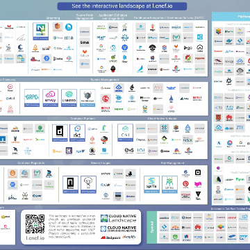

Will Kubernetes Collapse Under the Weight of Its Complexity? | Blog | InfluxData

Will Kubernetes Collapse Under the Weight of Its Complexity? | Blog | InfluxData

https://www.influxdata.com/blog/will-kubernetes-collapse-under-the-weight-of-its-complexity/

A few weeks ago, I attended and spoke at KubeCon EU. It was a massive event attended by around 4,700 people...However, I felt there was an underlying problem with the whole spectacle: everyone I talked to was either an operator or an SRE. Where were all the application developers?