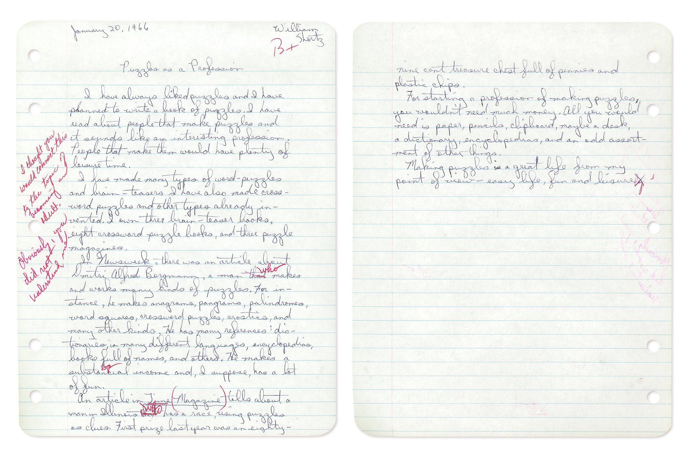
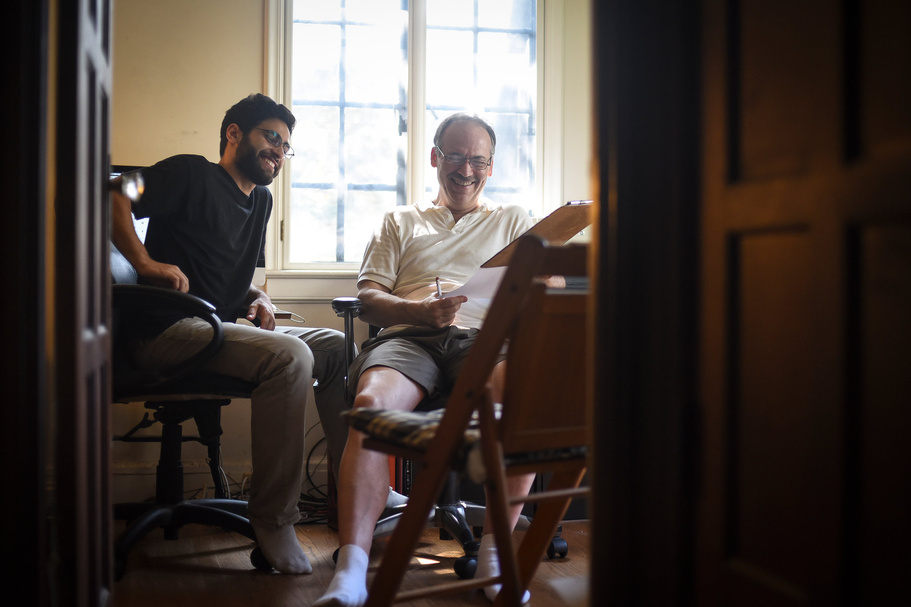
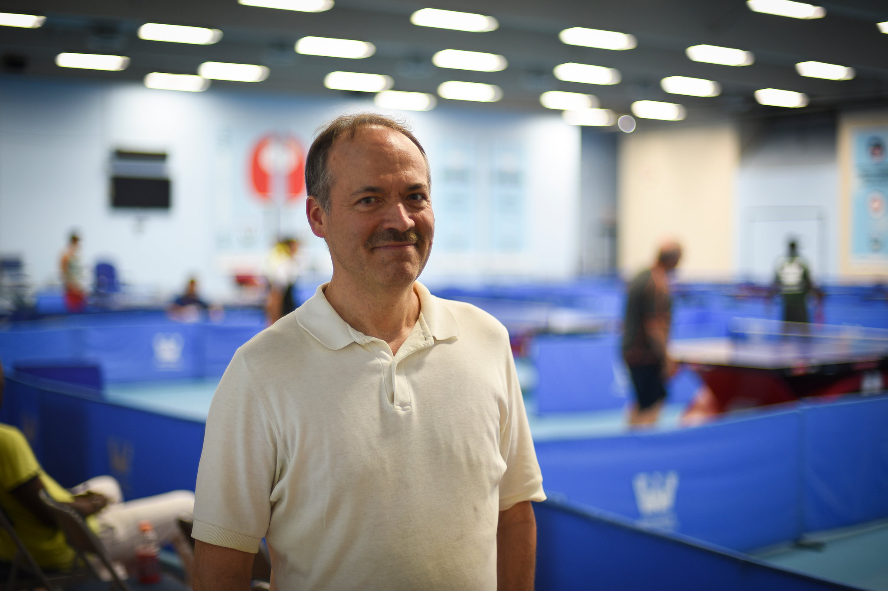
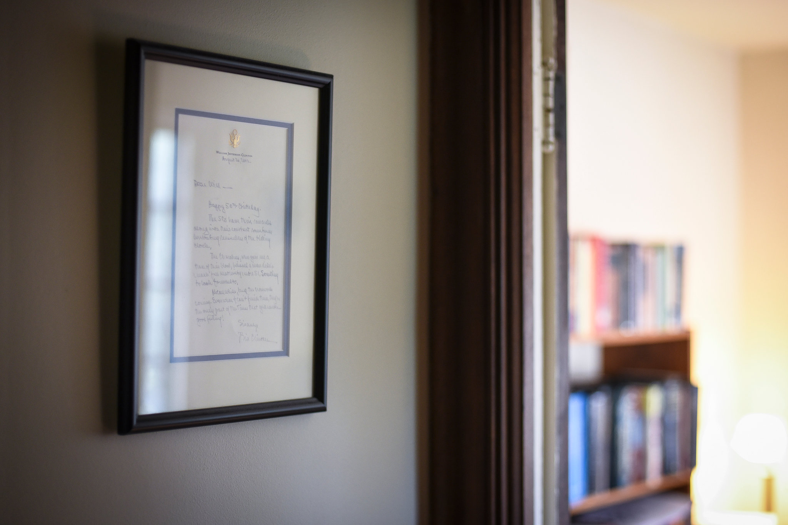
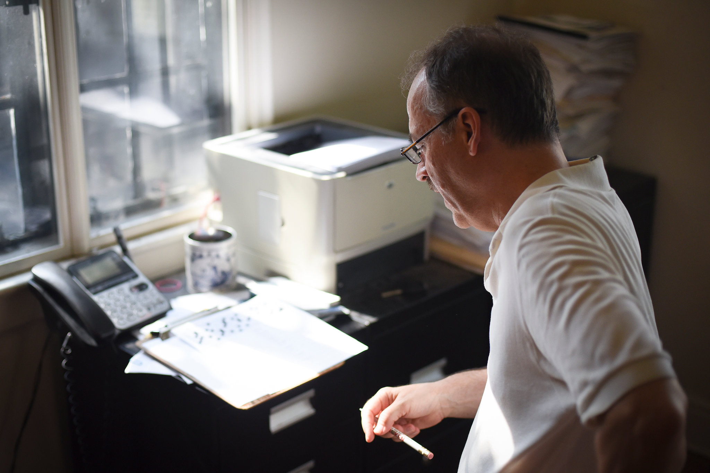

Will Shortz: A Profile of a Lifelong Puzzle Master

###   [Times Insider](https://www.nytimes.com/section/insider)

# Will Shortz: A Profile of a Lifelong Puzzle Master

By [STEPHEN HILTNER](https://www.nytimes.com/by/stephen-hiltner)AUG. 1, 2017

[Continue reading the main story](https://www.nytimes.com/2017/08/01/insider/will-shortz-a-profile-of-a-lifelong-puzzle-master.html?emc=edit_ne_20170802&nl=evening-briefing&nlid=72982178&te=1&_r=0#story-continues-1)Share This Page

- [**Share](#)
- [**Tweet](#)
- [**Pin](#)
- [**Email](#)
- [**More](#)
- [**Save](#)

 Photo

 

**

 Will Shortz at his home in Pleasantville, N.Y. — with a 1929 Sunday puzzle supplement for Hearst newspapers.    Credit Stephen Hiltner/The New York Times

“I’m a little embarrassed by the state of this room,” said Will Shortz, The New York Times’s crossword editor, as he waded through a seemingly endless array of puzzle ephemera in his upstairs library. “The problem is, I recently lent part of my collection for use at an exhibition. I got everything back, but I haven’t put it all away yet.”

He paused, looking up from a stack of old magazines.
“Well, it’s more than that, of course,” he said. “Things are just — piling up.”

Indeed they are. Mr. Shortz’s collection includes more than 25,000 puzzle books and magazines, dating to 1534, along with pamphlets, small mechanical puzzles and other ephemeral items. It overwhelms the décor of his home in Pleasantville, N.Y., where he lives and works. A clock in his office is — well, its face is a crossword puzzle. (The hands? Two stubby pencils.) A display case in the living room holds, among other treasures, the first crossword puzzle ever published — in a 1913 Sunday “Fun” section of The New York World. Even the tiled floor in the upstairs bathroom, made of small black and white squares, calls to mind a crossword grid.

 Photo

 

**

 Mr. Shortz’s library abounds with stacks of puzzles, books and periodicals.    Credit Stephen Hiltner/The New York Times

The collection is the embodiment of a lifelong obsession with puzzles. In fact, aside from a law degree earned at least in part to mollify his parents — which he undertook after completing a self-designed undergraduate degree in enigmatology — Mr. Shortz has spent his professional life pursuing little else.

And that law degree, by the way? “Everyone else took trial advocacy, but I didn’t have to; I knew I was never going to argue a case in court,” he said with a grin. “I took two courses on intellectual property. For one, I wrote a paper on copyright protection for puzzles and games.”

 [Continue reading the main story](https://www.nytimes.com/2017/08/01/insider/will-shortz-a-profile-of-a-lifelong-puzzle-master.html?emc=edit_ne_20170802&nl=evening-briefing&nlid=72982178&te=1&_r=0#story-continues-3)

## [Times Insider](https://www.nytimes.com/section/insider)

### Welcome to the Newsroom.

- [ ##    You’re in the Army Now — and at Gettysburg, No Less   AUG 2](https://www.nytimes.com/2017/08/02/insider/youre-in-the-army-now-and-at-gettysburg-no-less.html?rref=collection%2Fsectioncollection%2FTimes%20Insider)

- [ ##    What We’re Reading   AUG 1](https://www.nytimes.com/2017/08/01/insider/what-were-reading.html?rref=collection%2Fsectioncollection%2FTimes%20Insider)

- [ ##    Scarred Dog Sentenced to Death. Reporter Haunted.   JUL 31](https://www.nytimes.com/2017/07/31/insider/scarred-dog-sentenced-to-death-reporter-haunted.html?rref=collection%2Fsectioncollection%2FTimes%20Insider)

- [ ##    A Pentagon Correspondent Keeps Sight of the Person Inside the Uniform   JUL 30](https://www.nytimes.com/2017/07/30/insider/a-pentagon-correspondent-keeps-sight-of-the-person-inside-the-uniform-transgender.html?rref=collection%2Fsectioncollection%2FTimes%20Insider)

- [ ##    For Female Baseball Reporter, Writing About, and Making, History   JUL 29](https://www.nytimes.com/2017/07/29/insider/claire-smith-first-woman-baseball-reporter-hall-of-fame-spink-award.html?rref=collection%2Fsectioncollection%2FTimes%20Insider)

[See More »](https://www.nytimes.com/section/insider)

## **Recent Comments

## mumbogumbo

4 hours ago
What a great story, with many possible twists, turns and other puzzles to come.

## Drew Kopf

4 hours ago

King Solomon put it this way in Ecclesiastes Chapter 3 Verse 22: "I have seen that nothing is right unless a man enjoys his creations."The...

## sayitstr8

5 hours ago

fascinated to see that his name ends in a zed. nominative determinism? was that the single detail that originally caught his attention. Love...

- See All Comments
- Write a comment

 Photo
 
**

 Small mechanical puzzles are scattered among the books.    Credit Stephen Hiltner/The New York Times

Even among his colleagues, Mr. Shortz’s singular obsession is something of a rarity: At The Times, journalistic expertise is usually not tied to a single beat. An editor on the national desk, for example, may very well leap to the food desk; after a stint covering the markets, a business reporter might ship overseas to cover international news from Hong Kong.

 [Continue reading the main story](https://www.nytimes.com/2017/08/01/insider/will-shortz-a-profile-of-a-lifelong-puzzle-master.html?emc=edit_ne_20170802&nl=evening-briefing&nlid=72982178&te=1&_r=0#story-continues-5)

Advertisement

[Continue reading the main story](https://www.nytimes.com/2017/08/01/insider/will-shortz-a-profile-of-a-lifelong-puzzle-master.html?emc=edit_ne_20170802&nl=evening-briefing&nlid=72982178&te=1&_r=0#story-continues-6)

Mr. Shortz’s career, though, has followed a less circuitous path.

“When I was a kid, I imagined a life where I’d be sitting in an attic somewhere, making my little puzzles for $15 each, somehow surviving,” he said. “I actually wrote a paper in eighth grade about what I wanted to do with my life, and it was to be a professional puzzle maker.”

(The paper earned him a B+. “I thought you would connect this to the topic of becoming an adult,” his teacher wrote.)

 [Continue reading the main story](https://www.nytimes.com/2017/08/01/insider/will-shortz-a-profile-of-a-lifelong-puzzle-master.html?emc=edit_ne_20170802&nl=evening-briefing&nlid=72982178&te=1&_r=0#story-continues-7)

 Photo
 
**

 A 13-year-old William Shortz wrote a paper titled “Puzzles as a Profession.”

After a brief postgraduate stint at Penny Press and a 15-year run at Games magazine, Mr. Shortz joined The Times as crossword editor in 1993. His aim, from the start, was to draw in a younger and more diverse audience.

“When I began at The Times, *everyone* had an opinion about my style of editing,” he said. “I was 36 years younger than my predecessor, and so, to me, things were kind of old and stuffy. I wanted to be a little more modern, to embrace everybody.” (As a general rule, anything that appears elsewhere in The Times — from operatic trivia to the latest in pop culture — is fair game in the crossword.)

 [Continue reading the main story](https://www.nytimes.com/2017/08/01/insider/will-shortz-a-profile-of-a-lifelong-puzzle-master.html?emc=edit_ne_20170802&nl=evening-briefing&nlid=72982178&te=1&_r=0#story-continues-9)

 Photo
 
**

 Joel Fagliano, The Times’s digital puzzles editor, and Mr. Shortz edit the clues for an acrostic.    Credit Stephen Hiltner/The New York Times

Mr. Shortz spends his working hours selecting and editing the puzzles that, nowadays, appear in a variety of genres: in print, on [nytimes.com](http://nytimes.com/) and on The Times’s iOS and Android apps. He’s assisted by Joel Fagliano, the digital puzzles editor, who also constructs the mini crosswords that appear every day on the New York Times app and in print on Page A3.

Evaluating puzzle submissions can be tricky, since even minor errors in the grid can be difficult to fix without edits spiderwebbing outward. More often than not, if a grid proves problematic, the puzzle is rejected. It’s relatively common, however, for Mr. Shortz and Mr. Fagliano to extensively rework a given puzzle’s clues.

“The bad puzzles, we can tell within 10 or 15 seconds,” Mr. Shortz said. “The really good ones — you can tell in a minute or two if it’s great. It’s the ones in the middle that take the most time.”

Everyone who submits a puzzle gets a reply, yes or no. “And we try to say something about the puzzle, too — what we like about it, or what we don’t like,” Mr. Shortz explained. “It could just be as simple as: The theme didn’t excite us enough.”

 Photo
 
**

 A stack of crosswords sits in the upstairs hallway of Mr. Shortz’s home.    Credit Stephen Hiltner/The New York Times

Around 75 crossword submissions land on Mr. Shortz’s desk every week. Each is read at least twice — once by Mr. Shortz, and once by either Mr. Fagliano or a dedicated puzzles intern. After a puzzle is accepted, it’s assigned a day of the week (the puzzles increase in difficulty as the week progresses) and is slated for publication.

“Mondays should be all — or virtually all — familiar vocabulary, and a straightforward theme,” Mr. Shortz explained. “That doesn’t mean it can’t be sophisticated, but it has to be straightforward.”

“Tuesday and Wednesday, the vocabulary can be a little harder, and the themes can be a little more playful — with puns and other sorts of wordplay. Thursday is our hardest theme day. We’ll do tricks, some serious tricks, or some more advanced wordplay. Friday and Saturday puzzles tend to be themeless.” And Sunday, of course, is the larger grid — 21 by 21.

 [Continue reading the main story](https://www.nytimes.com/2017/08/01/insider/will-shortz-a-profile-of-a-lifelong-puzzle-master.html?emc=edit_ne_20170802&nl=evening-briefing&nlid=72982178&te=1&_r=0#story-continues-12)

 Photo
 
**

 Mr. Fagliano has worked with Mr. Shortz since 2011. “I kept a journal the first summer I interned here, because I thought I’d look back on it and say, ‘That was that crazy summer that I worked for Will Shortz!’” he said. “But I kept coming back — we just work really well together.”    Credit Stephen Hiltner/The New York Times

The general quality of crossword puzzles, Mr. Shortz contends, has markedly improved in the last few decades. “It used to be that, for constructors, the only feedback they got on a puzzle was from the editor,” he explained. Nowadays, with all the online crossword communities — there are at least four daily blogs about the New York Times crossword — aspiring puzzle makers can engage more easily with their peers.

Technologies have changed, too. “It used to be if you were making crosswords, you’d have a dictionary, a thesaurus, an almanac and maybe a word list,” he said. “Now there are programs and databases that help make crosswords better — with better vocabulary and better theme examples.”

 Photo
 
**

 Mr. Shortz consults a concordance to the works of William Shakespeare while editing an acrostic.    Credit Stephen Hiltner/The New York Times

Mr. Shortz indulges his fascination with puzzle in others ways, too — by hosting the puzzles segment [every Sunday on NPR](http://www.npr.org/series/4473090/sunday-puzzle), and by serving as program director for the National Puzzlers’ League convention. He is also the founder and director of the American Crossword Puzzle Tournament.

And, in addition to puzzles, he has another great love: [table tennis](https://www.youtube.com/watch?v=M2O07f7Rusk). With a friend, Robert Roberts, Mr. Shortz opened the Westchester Table Tennis Center in 2011. The club, which Mr. Shortz owns and Mr. Roberts manages, has more than 150 members and has hosted a range of events, from the North American Championships to a weekly series, held on Wednesday evenings, for players with Parkinson’s disease.

 [Continue reading the main story](https://www.nytimes.com/2017/08/01/insider/will-shortz-a-profile-of-a-lifelong-puzzle-master.html?emc=edit_ne_20170802&nl=evening-briefing&nlid=72982178&te=1&_r=0#story-continues-15)

 Photo
 
**

 Mr. Shortz at his table tennis center in Pleasantville.    Credit Stephen Hiltner/The New York Times

Through his championing of puzzles — and with public appearances on programs like “The Oprah Winfrey Show” and “The Simpsons” — Mr. Shortz has earned admiring fans the world over.

In fact, outside his office hangs a framed letter from former President Bill Clinton, sent in 2002, in celebration of Mr. Shortz’s 50th birthday.

After alluding to the Cherokees — who, Mr. Clinton writes, “believed a man didn’t reach full maturity until 51” — the letter concludes with a friendly presidential dictate.

“Keep the crosswords coming,” it reads. “Even when I can’t finish them, they’re the only part of The Times that guarantees good feeling!”

 [Continue reading the main story](https://www.nytimes.com/2017/08/01/insider/will-shortz-a-profile-of-a-lifelong-puzzle-master.html?emc=edit_ne_20170802&nl=evening-briefing&nlid=72982178&te=1&_r=0#story-continues-17)

 Photo
 
**

 A letter sent to Mr. Shortz from former President Bill Clinton. “Keep the crosswords coming,” it reads. “Even when I can’t finish them, they’re the only part of The Times that guarantees good feeling!”    Credit Stephen Hiltner/The New York Times

Ultimately, though, his celebrity seems to have had little impact on a fascination, and a career, that took root remarkably early in life.

Whether discussing the world’s first crossword book (published by Simon & Schuster, in 1924, which started their company), or reminiscing about the creative influence of his mother (Wilma, who wrote [children’s stories](https://www.abebooks.com/Storms-Fury-Horse-Stories-Highlights-Children/1392932939/bd) and articles about horses), or showing off a century-old magazine full of Sam Loyd puzzles (his “childhood hero”), Mr. Shortz, who is 64, exudes an infectious, boyish enthusiasm that registers as uncannily genuine.

“I’m very lucky,” he said, when asked to reflect on the course of his career.

“I tell people: If you can, figure out what you love to do the most — and then see if you can make a living doing it.”

 [Continue reading the main story](https://www.nytimes.com/2017/08/01/insider/will-shortz-a-profile-of-a-lifelong-puzzle-master.html?emc=edit_ne_20170802&nl=evening-briefing&nlid=72982178&te=1&_r=0#story-continues-19)

 Photo
 
**

   Credit Stephen Hiltner/The New York Times

*Follow Stephen Hiltner on Twitter: [@sahiltner](https://twitter.com/sahiltner).*

A version of this article appears in print on August 2, 2017, on Page A2 of the New York edition with the headline: Will Shortz, a Lifelong Puzzle Master.   [Order Reprints](http://www.nytreprints.com/)|  [Today's Paper](http://www.nytimes.com/pages/todayspaper/index.html)|[Subscribe](http://www.nytimes.com/subscriptions/Multiproduct/lp839RF.html?campaignId=48JQY)

 [Continue reading the main story](https://www.nytimes.com/2017/08/01/insider/will-shortz-a-profile-of-a-lifelong-puzzle-master.html?emc=edit_ne_20170802&nl=evening-briefing&nlid=72982178&te=1&_r=0#whats-next)