Winning Blackjack using Machine Learning – Towards Data Science

# Winning Blackjack using Machine Learning

## A Practical Example of a Genetic Algorithm

[Greg Sommerville](https://towardsdatascience.com/@gregsommerville1)
Feb 12·15 min read

One of the great things about machine learning is that there are so many different approaches to solving problems. *Neural networks *are great for finding patterns in data, resulting in predictive capabilities that are truly impressive. *Reinforcement learning *uses rewards-based concepts, improving over time. And then there’s the approach called a *genetic algorithm*.

A genetic algorithm (GA) uses principles from evolution to solve problems. It works by using a population of potential solutions to a problem, repeatedly selecting and breeding the most successful candidates until the ultimate solution emerges after a number of generations.

To demonstrate how effective this approach is, we will use it to solve a complex problem — the creation of a strategy for playing the casino game [Blackjack](https://en.wikipedia.org/wiki/Blackjack)(also known as “21”).

The term “strategy” in this case means a guide for player actions that covers all situations. The goal is to find a strategy that is the very best possible, resulting in maximized winnings over time.

* * *

*...*

#### **About this “Winning” Strategy**

Of course, in reality there is no winning strategy for Blackjack — the rules are set up so the house always has an edge. If you play long enough, you *will* lose money.

Knowing that, the best possible strategy is the one that minimizes losses. Using such a strategy allows a player to stretch a bankroll as far as possible while hoping for a run of short-term good luck. That’s really the only way to profit at Blackjack.

As you might imagine, Blackjack has been studied by mathematicians and computer scientists for a long, long time. Back in the 1960s, a mathematician named [Edward O. Thorp](https://en.wikipedia.org/wiki/Edward_O._Thorp) authored a book called *Beat the Dealer*, which included charts showing the optimal “Basic” strategy.

That optimal strategy looks something like this:

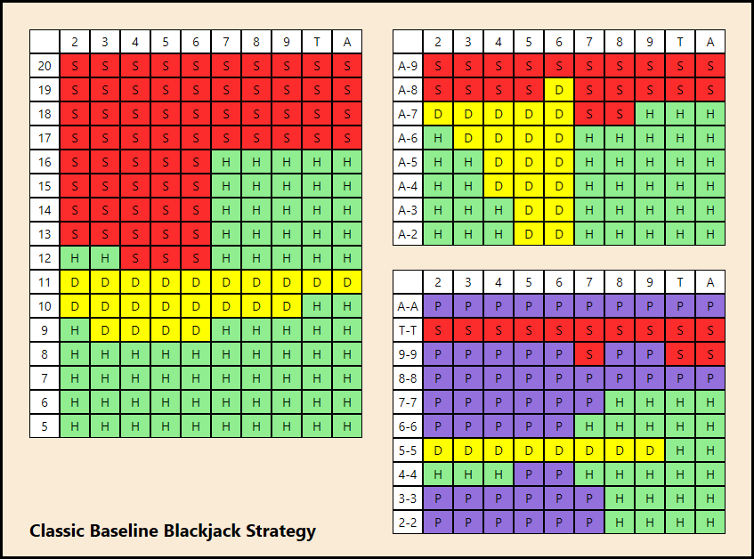

Optimal Strategy for Blackjack
The three tables represent a complete strategy for playing Blackjack.

The tall table on the left is for *hard hands*, the table in the upper right is for *soft hands*, and the table in the lower right is for *pairs*.

If you aren’t familiar with Blackjack, a soft hand is a hand with an Ace that can count as 1 or 11, without the total hand value exceeding 21. A pair is self-explanatory, and a hard hand is basically everything else, reduced to a total hand value.

The columns along the tops of the three tables are for the dealer upcard, which influences strategy. Notice that the upcard ranks don’t include Jack, Queen or King. That’s because those cards all count as 10, so they are all grouped together with the Ten (“T”) to simplify the tables.

To use the tables, a player would first determine if they have a pair, soft hand or hard hand, then look in the appropriate table using the row corresponding to their hand holding, and the column corresponding to the dealer upcard.

The cell in the table will be “H” when the correct strategy is to hit, “S” when the correct strategy is to stand, “D” for double-down, and (in the pairs table only) “P” for split.

Knowing the optimal solution to a problem like this is actually very helpful. Comparing the results from a GA to the known solution will demonstrate how effective the technique is.

Finally, there’s one other thing to get out of the way before we go any further, and that’s the idea of *nondeterminism*. That means that if the same GA code is run twice in a row, two different results will be returned. That’s something that happens with genetic algorithms due to their inherent randomness. It’s unusual for software to act this way, but in this case it’s just part of the approach.

* * *

*...*

#### **How a Genetic Algorithm Works**

Genetic algorithms are fun to use because they’re so easy to understand: you start with a population of (initially, completely random) potential solutions, and then let evolution do its thing to find a solution.

That evolutionary process is driven by comparing candidate solutions. Each candidate has a fitness score that indicates how good it is. That score is calculated once per generation for all candidates, and can be used to compare them to each other.

In the case of a Blackjack strategy, the fitness score is pretty straightforward: if you play N hands of Blackjack using the strategy, how much money do you have when done? (Due to the house edge, all strategies will lose money, which means all fitness scores will be negative. A higher fitness score for a strategy merely means it lost less money than others might have.)

Once an effective fitness function is created, the next decision when using a GA is how to do selection.

There are a number of different selection techniques to control how much a selection is driven by fitness score vs. randomness. One simple approach is called *Tournament Selection*, and it works by picking N random candidates from the population and using the one with the best fitness score. It’s simple and effective.

Once two parents are selected, they are crossed over to form a child. This works just like regular sexual reproduction — genetic material from both parents are combined. Since the parents were selected with an eye to fitness, the goal is to pass on the successful elements from both parents.

Naturally, in this case the “genetic material” is simply 340 cells from the three tables that each strategy has. A cell in the child is populated by choosing the corresponding cell from one of the two parents. Oftentimes, crossover is done proportional to the relative fitness scores, so one parent could end up contributing many more table cells than the other if they had a significantly better fitness score.

Finally, just like in nature, it’s important to have diversity in a population. Populations that are too small or too homogenous always perform worse than bigger and more diverse populations.

Genetic diversity is important, because if you don’t have enough, it’s easy to get stuck in something called a *local minimum*, which is basically a solution that performs better than any similar alternatives, but is inferior to other solutions that are significantly dissimilar to it.

To avoid that problem, genetic algorithms sometimes use mutation (the introduction of completely new genetic material) to boost genetic diversity, although larger initial populations also help.

* * *

*...*

#### **Results Using a GA**

One of the cool things about GAs is simply watching them evolve a solution. The first generation is populated with completely random solutions. This is the very best solution (based on fitness score) from 750 candidates in generation 0 (the first, random generation):

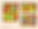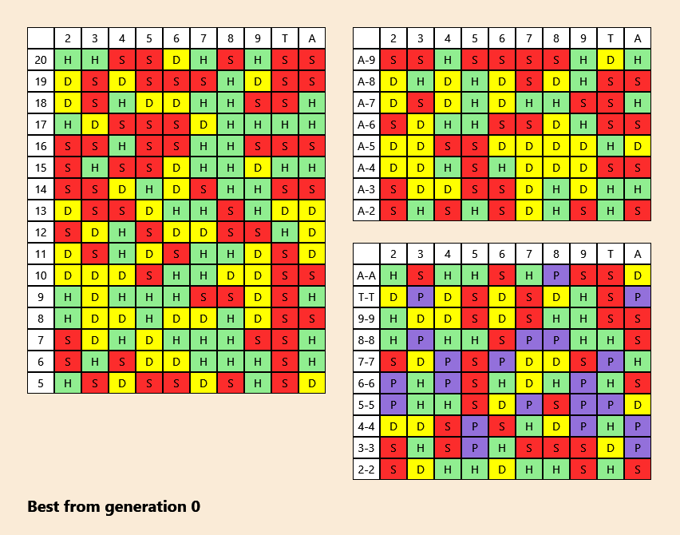

Randomly generated candidate from Gen 0

As you can see, it’s completely random. By generation 12, some things are starting to take shape:

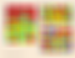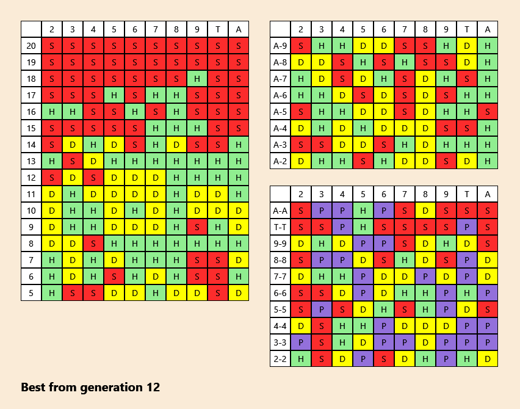

With only 12 generations experience, the most successful strategies are those that Stand with a hard 20, 19, 18, and possibly 17. That part of the strategy develops first because it happens so often and it has a fairly unambiguous result. Basic concepts get developed first with GAs, with the details coming in later generations.

The other hints of quality in the strategy are the hard 11 and hard 10 holdings. According to the optimal strategy those should be mostly Double-Down, so it’s encouraging to see so much yellow there.

The pairs and soft hand tables develop last because those hands happen so infrequently. A player is dealt a pair only 6% of the time, for example.

By generation 33, things are starting to become clear:

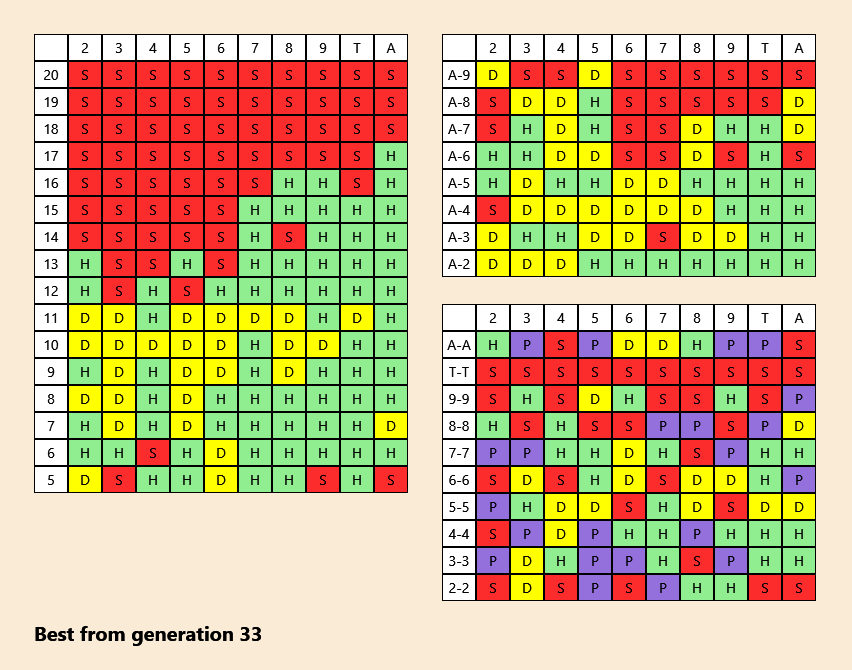

By generation 100, the hard hand table on the left is completely stabilized — it doesn’t change from generation to generation. The soft hand and pairs tables are getting more refined:

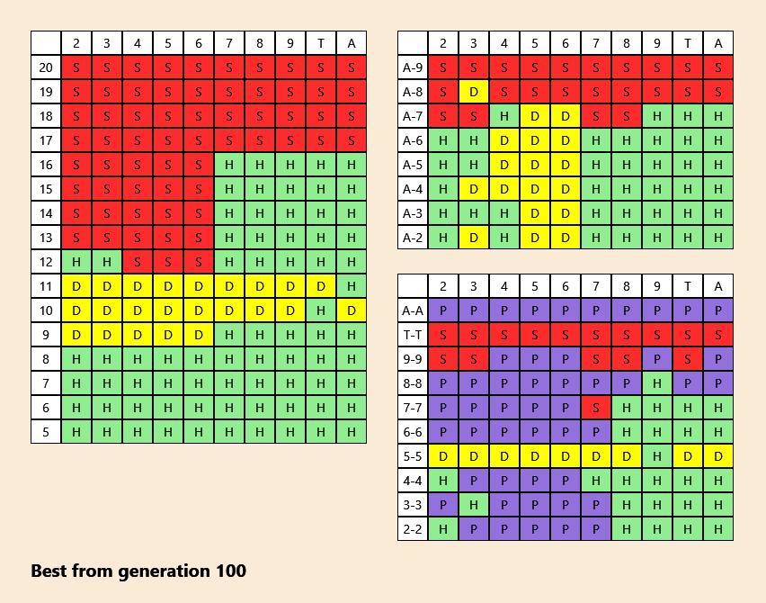

And then the final generations are used to refine the strategies. The changes from generation to generation are much smaller at this stage, since it’s really just the process of working out the smallest details.

Finally, the best solution found over 237 generations:

As you can see, the final result is not exactly the same as the optimal solution, but it’s very, very close. The hard hands in particular (the table on the left) are almost exactly correct. The soft hands and pairs tables have a few more cells that don’t match, but that’s likely because those hand types occur far less than hard hands.

In terms of outcome, playing the optimal strategy for 500,000 hands at $5 per hand would result in a loss of $176,040. Using the computer-generated strategy would result in a loss of $176,538, a difference of $498 over half a million hands.

There’s an [animated GIF](https://github.com/GregSommerville/machine-learning-blackjack-solution/blob/master/images/animatedsolution.gif)that shows the evolution of this strategy over 237 generations, but be aware that it’s 19 MB in size, so you may not wish to view it over a phone.

The source code for the software that produced these images is [open source](https://github.com/GregSommerville/machine-learning-blackjack-solution). It’s a desktop application for Windows written in C# with WPF.

* * *

*...*

#### Combinatorial Implications

As impressive as the resulting strategy is, we need to put it into context by thinking about the scope of the problem. An optimal strategy for Blackjack is expressed by filling each of the 340 table cells (spread across the three tables) with the best choice for each holding/dealer upcard combination — either stand, hit, double-down, or split.

In terms of combinations, there are 4¹⁰⁰ possible pair strategies, 3⁸⁰ possible soft hand strategies, and 3¹⁶⁰ possible hard hand strategies, for a grand total of 5 x 10¹⁷⁴ possible strategies for Blackjack:

4¹⁰⁰ x 3⁸⁰ x 3¹⁶⁰ = 5 x 10¹⁷⁴ possible Blackjack strategies

In this case the genetic algorithm found a close-to-optimal solution in a solution space of 5 x 10¹⁷⁴ possible answers. Running on a standard desktop computer, it took about 75 minutes. During that run, about 178,000 strategies were evaluated.

* * *

*...*

#### Testing Fitness

Genetic algorithms are essentially driven by fitness functions. Without a good way to compare candidates to each other, there’s no way the evolutionary process can work.

The idea of a fitness function is simple. Even though we may not know the optimal solution to a problem, we do have a way to measure potential solutions against each other. The fitness function reflects the relative fitness levels of the candidates passed to it, so the scores can effectively be used for selection.

For the purposes of finding a Blackjack strategy, a fitness function is straightforward — it’s a function that returns the expected final earnings after using the strategy over a certain number of hands.

But how many hands is enough?

As it turns out, you need to play a lot of hands with a strategy to determine its quality. Because of the innate randomness of a deck of cards, many hands need to be played so the randomness evens out across the candidates.

That’s especially important when our GA gets close to a final solution. In early generations, it’s not a problem if the fitness scores are not exact, because the difference between a bad candidate and a good candidate is usually quite large and the convergence to the final solution continues without a problem.

However, once the GA gets into the later generations, the candidate strategies being compared will have only minor differences, so it’s important to get accurate expected winnings from a fitness function.

Luckily, it’s pretty straightforward to find the right number of hands needed. Using a single strategy, multiple tests are run, resulting in a set of fitness scores. The variations from run to run for the same strategy will reveal how much variability there is, which is driven in part by the number of hands tested. The more hands played, the smaller the variations will be.

By measuring the standard deviation of the set of scores we get a sense of how much variability we have across the set for a test of N hands. But as we experiment with different numbers of hands played per test, we can’t compare standard deviations, for the following reason:

Standard deviation is scaled to the underlying data. We can’t compare fitness scores (or standard deviations thereof) from tests using different numbers of hands because a higher number of hands played results in a corresponding increase in the fitness score.

Put it another way: say a strategy wins 34% of the time. If you run it for 25,000 hands versus 50,000 hands, you’ll have different totals at the end. That’s why you can’t simply compare fitness scores that result from different test conditions. And if you can’t compare the raw values, you can’t compare the standard deviations.

We solve this by dividing the standard deviation by the average fitness score for each of the test values (the number of hands played, that is). That gives us something called the *coefficient of variation*, which can be compared to other test values, regardless of the number of hands played.

The chart here that demonstrates how the variability shrinks as we play more hands:

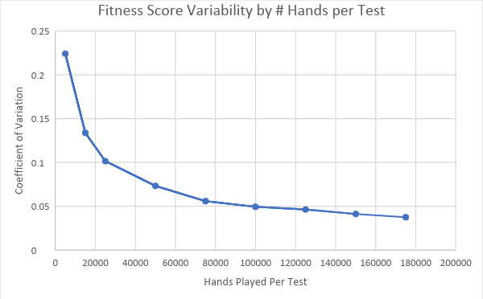

There are a couple of observations from the chart. First, testing with only 5,000 or 10,000 hands is not sufficient. There will be large swings in fitness scores reported for the same strategy at these levels. In fact, it looks like a minimum of 100,000 hands is probably reasonable, because that is the point at which the variability starts to flatten out.

Could we run with 500,000 or more hands per test? Of course. It reduces variability and increases the accuracy of the fitness function. In fact, the coefficient of variation for 500,000 hands is 0.0229, which is significantly better than 0.0494 for 100,000 hands. But that improvement is definitely a case of diminishing returns: the number of tests had to be increased 5x just to get half the variability.

Given those findings, the fitness function for a strategy will need to play at least 100,000 hands of Blackjack, using the following rules (common in real-world casinos):

- •Using 4 decks of cards shuffled together
- •Dealer is required to hit until they have 17 (soft or hard)
- •You can double down on a hand that you split
- •There is no insurance
- •Blackjack pays 3:2

* * *

*...*

#### Genetic Algorithm Configurations

One of the unusual aspects to working with a GA is that it has so many settings that need to be configured. The following items can be configured for a run:

- •Population Size
- •Selection Method
- •Mutation Rate and Impact
- •Termination Conditions

Varying each of these gives different results. The best way to settle on values for these settings is simply to experiment.

**Population Size**

Here’s a chart of the average candidate fitness per generation for the different population sizes:

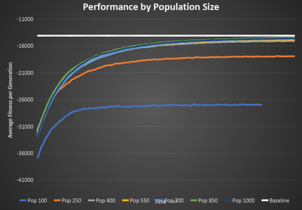

The X axis of this chart is the generation number (with a maximum of 200), and the Y axis is the average fitness score per generation. The first few generations aren’t shown to emphasize the differences as we reach the later generations.

The flat white line along the top of the chart is the fitness score for the known, optimal baseline strategy.

The first thing to notice is that the two smallest populations (having only 100 and 250 candidates respectively, shown in blue and orange) performed the worst of all sizes.

The lack of genetic diversity in those small populations results in poor final fitness scores, along with a slower process of finding a solution. Clearly, having a large enough population to ensure genetic diversity is important.

On the other hand, there aren’t too many differences between populations of 400, 550, 700, 850 and 1000.

This is a similar situation to choosing the number of hands to test with — if you pick a value that’s too small, the test isn’t accurate, but once you exceed a certain level, the differences are minor.

#### Selection Methods

The process of finding good candidates for crossover is called selection, and there are a number of ways to do it. Tournament selection has already been covered. Here are two other approaches:

*Roulette Wheel Selection* selects candidates proportionate to their fitness scores. Imagine a pie chart with three wedges of size 1, 2, and 5. The wedge with the value 5 will be selected 5/8 of the time, the wedge with value 2 will be selected 2/8 of the time, and the wedge with value 1 will be selected 1/8 of the time. That’s the basic idea behind Roulette Wheel selection. The size of each candidate’s wedge is proportional to their fitness score compared to the total score of all candidates.

One of the problems with that selection method is that sometimes certain candidates will have such a small fitness score that they never get selected. If, by luck, there are a couple of candidates that have fitness scores far higher than the others, they may be disproportionately selected, which reduces genetic diversity.

The solution is to use *Ranked Selection*, which works by sorting the candidates by fitness, then giving the worst candidate a score of 1, the next worse a score of 2, and so forth, all the way up to the best candidate, which receives a score equal to the population size. Once this fitness score adjustment is complete, Roulette Wheel selection is used.

Here’s a graph that compares the average fitness per generation using a variety of selection methods:

As you can see, tourney selection converges on an optimal solution very quickly — in fact, the bigger the tourney size, the faster the average fitness score improves. That makes sense, because if you’re choosing 7 random candidates and using the best, the quality is going to be much higher than doing the same while choosing only 2.

Even though it had the fastest initial improvement, Tourney 7 ends up producing the worst results. That makes sense, because although a big tourney size results in rapid improvement, it also limits the genetic pool to only the best. Needed genetic diversity is lost, and in the long run it doesn’t perform as well.

The best performers look to be Tourney 2, Tourney 3, and Tourney 4. Given a population of 700, these numbers provide good long-term results.

#### Elitism

There’s another concept in genetic algorithms called *elitism*. It’s the idea that when building a new generation, first sort the population by fitness, and then pass in a certain percentage of the best candidates directly into the next generation without alteration. After that is done, normal crossover begins.

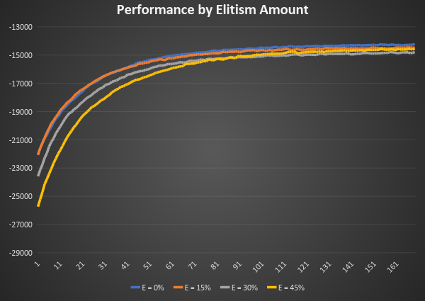

This chart shows the effects of four different elitism rates (later generations only, to show the details). Clearly no elitism or 15% are reasonable, although 0% looks a bit better.

There’s one thing that’s surprising about this chart — the higher the elitism was, the slower the convergence was to solution. You might think that deliberately including the best from each generation would speed things up, but in fact it looks like using only crossed-over candidates gives the best results, and is also the fastest.

#### Mutations

Keeping genetic diversity high is important, and mutation is an easy way to introduce that.

There are two factors relating to mutation: how often does it happen, and how much of an impact does it have when it does happen?

A *mutation rate* controls how often a newly created candidate will be mutated. The mutation is done immediately after creation via crossover.

The *mutation impact* controls how much a candidate is mutated, in terms of percentage of its cells that will be randomly changed. All three tables (hard hands, soft hands and pairs) are mutated the same percentage.

Starting with a fixed impact rate of 10%, here are the effects of different mutation rates:

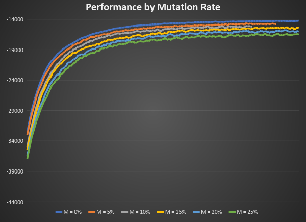

It is clear that mutation does not help for this problem — the more candidates are affected by mutation, the worse the results. It follows that trying different mutation impact values is not required — 0% mutation rate is clearly the best for this problem.

#### Termination Conditions

Knowing when to quit a genetic algorithm can be tricky. Some situations call for a fixed number of generations, but for this problem the solution was to look for stagnation — in other words, the genetic algorithm stops when it detects that the candidates are no longer improving.

The condition used for this test was that if there was no improvement in the overall best strategy (or a generation’s average score) for 25 generations in a row, then the process terminates and the best result found to that point is used as the final solution.

### Wrapping Up

Genetic algorithms are a powerful technique for solving complex problems, and they have the benefit of being easy to understand. For problems with huge solution spaces due to combinatorial factors, they are extremely effective.

For more information about GA, please start with this [Wikipedia article](https://en.wikipedia.org/wiki/Genetic_algorithm) or the [PluralSight (paid) course](https://www.pluralsight.com/courses/genetic-algorithms-genetic-programming)I wrote that covers the topic in far greater detail.