Work is a Queue of Queues

# Work is a Queue of Queues

Do you ever get that feeling like no matter how hard you work, you just can’t keep up?

This isn’t a problem uniquely faced by modern knowledge workers. It’s also a characteristic of certain software systems. This state — of being perpetually behind on intended work-in-progress — can fall naturally out of the data structures used to design a software system. Perhaps by learning something about these data structures, we can learn something about the nature of work itself.

Let’s start with the basics. In computer science, one of the most essential data structures is **the stack**. Here’s the definition from Wikipedia:

**

>  … a stack is a data type that serves as a collection of elements, with two principal operations: (1) “push”, which adds an element to the collection; and (2) “pop”, which removes the most recently added element that was not yet removed. The order in which elements come off [is known as] LIFO, [or last in, first out]. Additionally, a “peek” operation may give access to the top without modifying the stack.

**

From here on out, we’ll use the computer science (mathematical) function call notation, `f()`, whenever we reference one of the operations supported by a given data structure. So, for example, to refer to the “push” operation described above, we’ll notate it as `push()`.

I remember learning the definition of a stack in college and being a little surprised at “LIFO” behavior. That is, if you `push()` three items onto a stack — 1, 2, and 3 — when you `pop()` the stack, you’ll get the last item you added — in this case, 3. This means the last item, 3, is the first one `pop()`‘ed off the stack. Put another way, the first item you put on the stack, 1, only gets processed once you `pop()` all the other items — 3, 2 — off the stack, and then `pop()` once more to (finally) remove item 1.

Practically speaking, this seems like a “frenetic” or “unfair” way to do work — you’re basically saying that the last item always gets first service, and so, if items are `push()`’ed onto the stack faster than they are `pop()`’ed, some items will never be serviced (like poor item 1, above).

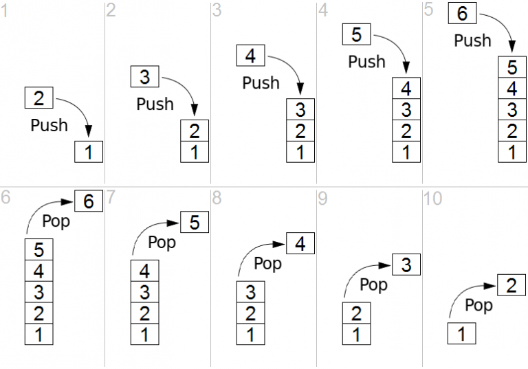

That’s when you tend to learn that stacks aren’t usually used to track “work-in-progress”. Instead, they are used to do structured processing , e.g. stack machines, or stack-based programming languages.

The alternative data structure to the stack which allows you to do work “fairly” is **the queue**, defined thusly:

**

>  … a queue is a collection in which the entities in the collection are kept in order and the principal (or only) operations on the collection are the addition of entities to the rear terminal position, known as “enqueue”, and removal of entities from the front terminal position, known as “dequeue”. This makes the queue a FIFO data structure, [or, first-in, first-out].

**

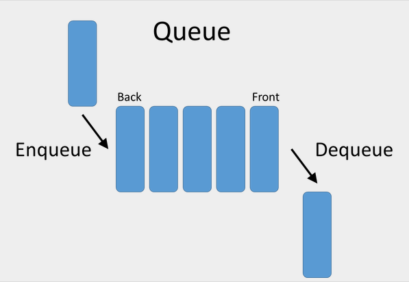

In modern work, we tend to think about work in queues, because this seems like the “fair” data structure. For example, your list of bugs is typically managed like a queue: the bugs are serviced in such a way that the longer ago the bug was filed, the more likely it is to have been either completed or discarded, whereas more-recently-filed bugs can wait for triage.

Some teams even assign priorities, which makes it behave more like a **priority queue**.

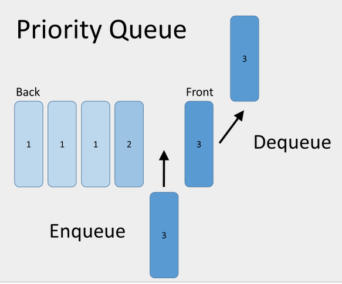

Email is interesting, because most people *wish* email were a queue, and many people try to turn email into a queue using a number of tools and practices, but, in its standard implementation, email behaves much more like a stack. (Some people joke that “email is your to-do list, but made by other people.”)

But just thinking in terms of the general default workflow, we can recognize that the latest email you receive goes to the *top* of your inbox. And you tend to `pop()` and `peek()` items at the top of your inbox. That means some unlucky emails can end up at the bottom of the stack, and if your intake of new emails overtakes your ability to process the stack, some emails will be altogether neglected. Just like “poor item 1” in the stack we worked through above. This feels even worse when you reflect on how anyone else can `push()` items onto your stack, but only you can `pop()` items.

[Slack](https://slack.com/?utm_source=amontalenti) (and other real-time communication tools) are likewise much closer to a stack. But with an even odder behavior. I might describe it as a “fixed-length stack with item drop-off”. That is, items are `push()`’ed onto your stack during the workday, and you have to decide whether to `peek()` or `pop()` the stack at any given moment in time. But, as more and more items are `push()`’ed onto the stack, older items start to automatically get expired or removed from the stack. The stack can only have 500-or-so items on it (this being the typical “scrollback” that people can tolerate before getting annoyed or bored) and old items are simply discarded.

Software project plans, meanwhile, are typically assembled as a kind of queue of queues. Let me explain what I mean.

First, some queues are organized: bugs, product ideas, customer requests, team technical debt payback projects, experiments. Then, a person or group — typically a product manager — tries to create a “queue of queues”, or a single unified queue — the project plan — made up of items from the many smaller queues.

You might decide that certain big bugs very much need to be fixed in the next iteration. Certain technical debt projects cannot wait, due to their risk. And, with the remaining estimated time and capacity available, you attempt to create an ordered list of items among product ideas and customer requests.

Once a product manager stares at this list, it has to be further ordered to remove bottlenecks and dependencies — some parts of the plan may need to be done before other parts. And then, the plan begins — and we track its progress by how close to empty the queue gets. We cut scope by dropping items out of the queue, and we prevent anxiety by splitting large queue items into many smaller queue items, representing their sub-parts.

It’s interesting to reflect on the fact that, in our work life, stacks and queues are almost like mortal enemies.

That is, if you’re working from the ordered queue of items — and you have settled on the queue and its order being roughly correct — then the worst thing you can do is `peek()` at items or `pop()` items off the various stacks in your work life. These items haven’t formally entered the work queue, and only have “priority” due to their recency, which is a very arbitrary thing.

The ideal situation would be that once you’ve decided to work on a given queue, as an individual or a team, all the stack-based workflows would shift from `push()`’ing onto your stack and gaining your attention, to merely `enqueue()`’ing onto your backlog queue, to get your *ordered* attention at a *later* date.

The “kanban” concept of flow reflects on this a lot with regard to teams. It tries to limit “work-in-progress” (WIP) to those items that a team has capacity to handle, and it suggests isolating a team from other sources of new work which might distract from pushing the WIP items to completion.

It rightly recognizes that in many workplaces, a team is desperately trying to work through its committed FIFO items, but being told to pay attention to a parallel LIFO workstream. And that this tends to lead to missed deadlines, death marches, as well as work dissatisfaction.

**

>   *> Effective executives have learned to ask systematically and without coyness: “What do I do that wastes your time without contributing to your effectiveness?” To ask this question, and to ask it without being afraid of the truth, is a mark of the effective executive.*

>  -Peter Drucker
**

I’ve personally found myself in a situation where I have to apply this thinking even to the work of a single person: myself. This only happened to me in the last few years, where several new “item stacks” began to appear before me.

Yes, I have the common technology executive problem of a busy e-mail inbox and Slack @-mention list. Those are universal as a company’s size scales and as an executive has to apply the [“Andy Grove algorithm”](https://apenwarr.ca/log/20190926) for keeping the wheels of the organization turning.

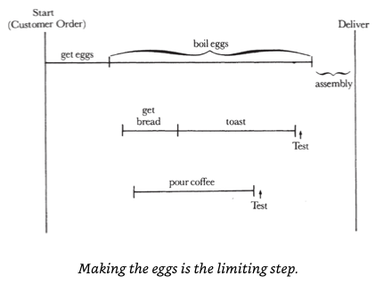*Andy Grove talks a lot about the process of management in his famous book, “High-Output Management”. Here, he uses the simple analogy of “how to prepare breakfast” to talk about the idea of identifying “limiting steps” in any parallel process, e.g. in this case, boiling eggs.*

But, there’s more than just the overflowing inbox in email and the never-ending stream of Slack.

My calendar is also a stack: it’s block-scheduled with 1:1 meetings with staff, work anniversaries, performance reviews, prospective sales conversations, partner checkpoints, hiring calls, board meetings, investor update calls, and so on. Lots of `push()` and `peek()`, with a rate of `pop()` necessarily limited by the passage of time.

Especially in dealings with external parties, the effect of “calendar stack intake flow” is pernicious: it’s very hard to tell an important customer or partner, “Yes, I’d love to meet with you — but you’ll need to wait until my queues clear out in the next 2-3 months.” It’s even harder to tell this to an employee who has a sensitive work-related issue that can’t be handled elsewhere in the organization.

To tackle these problems, I’ve applied my hacker brain, perhaps unsurprisingly. (“When all you have is a hammer.”) I started with email, and asked myself, “How can I automate email and turn it into a proper FIFO work queue?” I did this with a couple of tricks.

I wrote a JavaScript [“Google Apps Script”](https://developers.google.com/apps-script) program that has a JSON configuration file that aggressively filters my inbox, using one of three label types: `@@now`, `@later`, and `@never`. This script [uses the GMail API](https://developers.google.com/apps-script/reference/gmail/) and runs against my inbox every 15 minutes and automatically cleans the whole thing, using a number of advanced GMail search queries and a nice system of nested labels. I borrowed the “now” vs “later” terminology from David Allen’s “GTD” framework. The `@@now` label is an indication that this is an email worth responding to immediately. I have very specific filters (rules) that identify these emails: for example, emails addressed from my co-founder or executive team, and addressed to me, alone. Or, an email from one of our critical alerting systems. I have 50+ such rules, and I change them over time. Here is a view of just ~15 lines of this 800-line script:

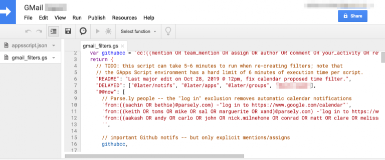

An example of a `@later` message would be a message addressed to a team’s email group, a product release email, a usage/cost report, or an email newsletter subscription. As for `@never`, that’s mostly spam, but might also include record-keeping emails like invoices and bills.

I gave the `@@now` label the “double-at-sign (@@)” prefix on purpose: it’s the only label with such a prefix in GMail. As a result, the hotkey `x l @ @` for me serves as a shorthand to label a given email message as “now”. (Also: the `@@` prefix makes sure it always appears at the top of my label list, making it easy to use conveniently in mobile contexts.) As a result, once my email inbox is cleaned out, I can scan it looking for items I didn’t identify as “now”, but which could benefit from a response soon. I then hit `x l @ @` and hit `ENTER` to label that message as `@@now`. You can see a little glimpse into my `@@now` messages in GMail below, which includes a mixture of automatically-marked messages to process today, as well as manually triaged ones:

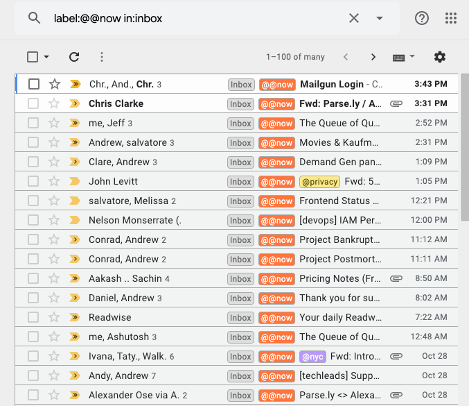

I use the `@@now` label search to look at my items. I also prefer to look at the items in *chronological order* (remember: I want a FIFO queue), starting from the bottom, rather than the GMail default of *reverse chronological* (the default of a LIFO stack).

Implementing this system had a profound effect on my relationship with email. Prior, email was something that gave me a lot of daily anxiety. I received hundreds of messages per day, and on some very bad days, it might even have been thousands. (Yes, alert fatigue is very real.) But, now my actual inbox usually gets a few hundred `@later` items, and only a handful of `@now` items, as well as a handful more of items that I need to manually filter/triage.

Once I had properly converted my email inbox from a stack to a queue, and quantified its effect in terms of tens of saved hours per month, I started to look for this pattern everywhere.

In Slack, I found a simple solution, in a somewhat underutilized feature that Slack has called [“Starred Items”](https://slack.com/help/articles/201331016). You see, you can mark every message in Slack with a “Star”. Doing so has only one effect: it shows up in your own “Starred Items” list, which is revealed via a star icon in the top-right of the app. Here is how one of my starred items looks in the Slack app:

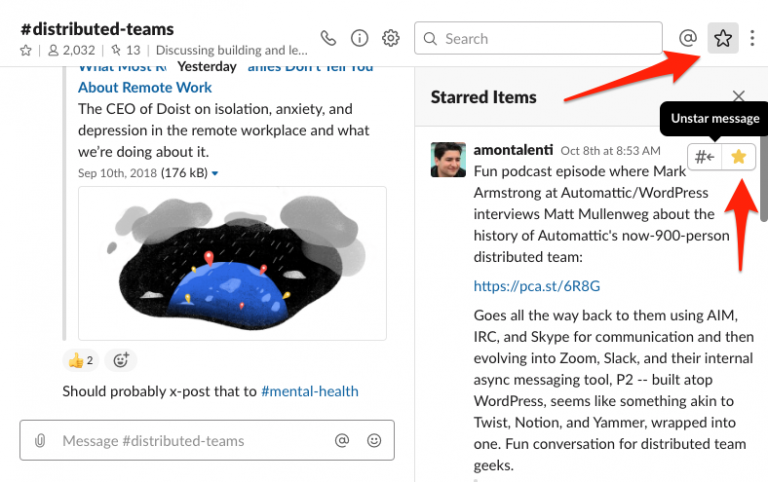

The reason this is nice is that the items are shown in the starred items list in reverse chronological message order. (It’d be great if you could reverse this order, but, alas.) What this lets me do, though, is to “sample the stream” (or, tame that fixed-length stack I mentioned earlier). As I come across items, especially from my @-mentions and DMs, I can star them. And now they are all in one place, I can scan the starred item list to take action on each of them. Typically, I’ll convert the Slack message either into an email action, or a task in one of my other “queues of record”, like Todoist.

What’s also nice is that if you unstar an item, it’s like removing it from your temporary Slack queue. Once you have taken action on all your starred items, you’re at “Slack inbox zero”. Yes, I recognize the irony of “turning Slack into an inbox” when its whole market positioning is “the end of email”. But remember, email was a stack, too, before I tamed it with automation.

So, where else do my work queues live? For me personally, there are four other places: (1) [GitHub](https://github.com/?utm_source=amontalenti) — which has issues, pull requests, and project boards, and this is also where all my team’s work lives. (2) [Todoist](https://todoist.com/?utm_source=amontalenti) — this is where my personal and professional to-do list lives, and it also serves as my GTD-style “thought inbox”. (3) [Notion](https://notion.so/?utm_source=amontalenti) — which is where my team’s knowledge base and wiki lives, as well as our project plans in kanban board form. And (4) [Trello](https://trello.com/?utm_source=amontalenti) — which is a historical/personal relic, where I maintain a “crapban board” that’s shared with my wife for personal errands, vacation plans, and life events. So those are the work queues that live *beyond* my life of email, calendar, and real-time chat. Here is the current view of my “crapban board” in Trello:

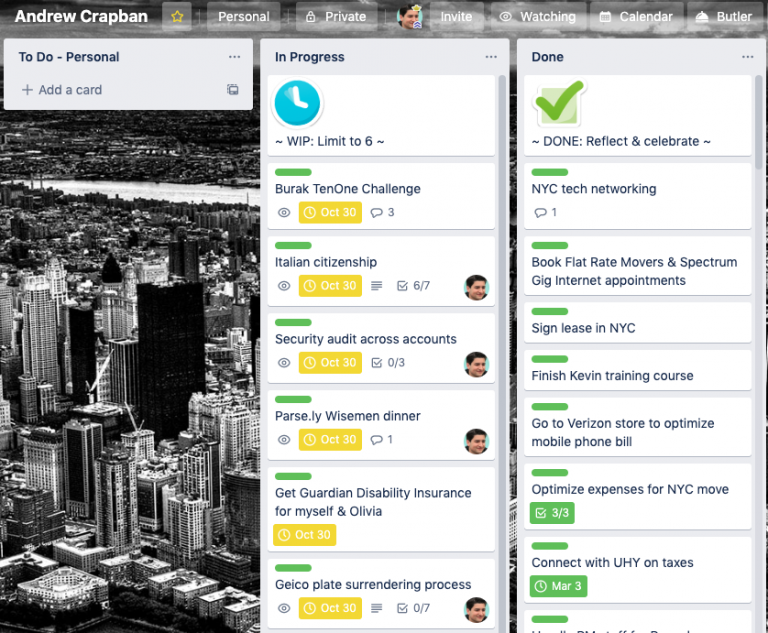

As might be exceedingly obvious at this point, if I’m to survive this onslaught of stacks and queues, I have to create a “master queue”. It’s not good enough to merely convert every stack to a queue. That’s a good start, but now I still have several queues to contend with. I need “the queue of queues” that manages all of my work, across all my queues.

Historically, what I used for that was a single Todoist view — called simply “Today” — since it was quite easy to add tasks there, re-order them, and link to other systems from there. Here is how that looks in Todoist:

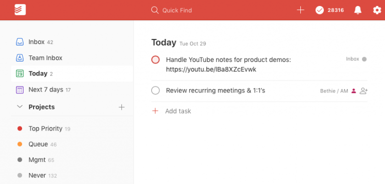

Lately, I’ve been treating Todoist more like an intake/staging area, and been using a tool called [Sunsama](https://sunsama.com/?utm_source=amontalenti) to plan out my work days. Basically, Sunsama is a personal kanban system that lets you visually lay out your work tasks alongside your calendar, treating your calendar as the main constraint. And it automatically links to tools I was already using — namely Google Calendar, GitHub, Trello, and Todoist — making it easier for me to get the global “queue of queues” view. Here is how that looks:

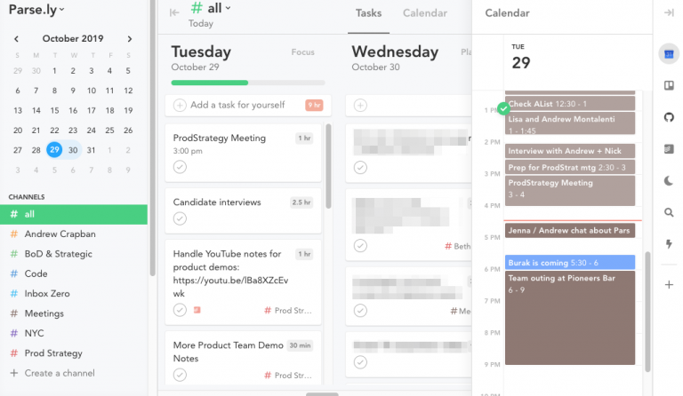

My daily habit has therefore become: (1) review my email inbox, and process items in the queue there, adding Todoist tasks as necessary (convert email stack into email message & task queue); (2) process Slack notifications and star relevant items (convert Slack stack into a Slack message & task queue); (3) organize and plan my day in Sunsama across my Google Calendar, Todoist, and even other systems like Trello and GitHub, treating working hours and my calendar as a constraint. Sometimes, I’ll plan two or three days ahead, but usually this is a daily ritual.

Once I finish my daily planning ritual, I “burn the bridges”. The Sunsama personal kanban view becomes the only place I look for “what I’m doing today”. And I let all the other work stacks in my life accumulate, without `peek()`ing or `pop()`ing. The only exception, of course, would be an emergency, outage, or something like that. I also use [Toggl](https://toggl.com/?utm_source=amontalenti) to track my actual time spent, as a way of keeping my time estimates honest. Here’s a view of my trailing 30-day time tracking:

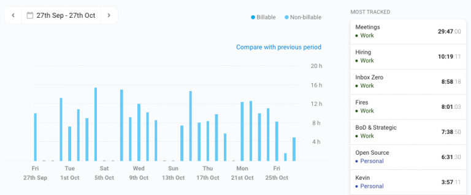

Sunsama is a nicely-designed personal kanban tool, but I have seen people achieve the same organizing principal using their calendar itself, a simple written list of daily priorities, or an isolated digital task list that is habitually emptied every day. The key thing is that you actually perform a daily planning ritual with a realistic set of tasks, and that you actually “burn the bridges” and ignore the stacks! Sunsama has a UX around this that can help turn it into a pleasant daily habit.

Getting things done is about draining your committed work queue to zero. What I’ve learned is that too much of our modern work life is set up like a bunch of stacks, when we should really have a single queue.

This isn’t too big a deal when the rate of stack item `push()`’ing is low and manageable, but it can spiral out of control when stacks grow unbounded, leading to stack overflow.

The way I have managed my own personal work also has implications for how I manage teams. Almost by definition, any modern software team with more than a handful of people has this problem. To tame the work, we need to learn to `enqueue()`, re-order, commit, and `dequeue()` with focus and satisfaction, even as a team. We also need to let the rest of world `enqueue()` into our backlog, rather than `push()`’ing onto one or more monitored stacks.

Mastery of your focus and attention is really a matter of committing you and your team to a single work queue, and ensuring that other work items “get in line”. If your team operates off a single queue, and each individual operates off their own single queue of personal tasks, then you truly do get “continuous flow”, and everything hums. Queues all the way down leads to continuous completion of works-in-progress, which is, after all, The Goal.

I’ve come to realize that this requires an active management process. The default behavior of our work tools has a “frecency” bias that behaves like an unruly stack — frequent item `push()`, and recent item `peek()` and `pop()`. It takes leadership to create the unified queue, and to create the workflows that de-prioritize frequent/recent requests into a backlog queue.

Hopefully this reflection will get you to start thinking about how to recognize when a given workflow is behaving too much like a stack (or list of stacks), and how you might be able to hack it to behave more like a queue (or queue of queues).

I’d love to hear your tips and tricks on [@amontalenti on Twitter](https://twitter.com/@amontalenti), or in the comments!

* * *

### Tools mentioned in this post

- [Starred Items in Slack](https://slack.com/help/articles/201331016) — turns a Slack stream of messages into a queue
- [GitHub](https://github.com/?utm_source=amontalenti) — issues, pull requests, and project boards
- [Todoist](https://todoist.com/?utm_source=amontalenti) — personal and professional to-do list, GTD-style “thought inbox”
- [Notion](https://notion.so/?utm_source=amontalenti) — team’s knowledge base and wiki, as well as project plans in kanban board form
- [Trello](https://trello.com/?utm_source=amontalenti) — personal “crapban board” for personal errands, vacation plans, and life events
- [Sunsama](https://sunsama.com/?utm_source=amontalenti) — visual personal kanban system representing my daily “queue of queues”
- [GMail Service + API in Google Apps Script](https://developers.google.com/apps-script/reference/gmail) — can help tame an unruly inbox… with JavaScript!

### Acknowledgements

*Thank you to Jeff Bordogna, Ashutosh Priyadarshy, and Aakash Shah for reviewing and providing feedback on earlier drafts of this essay.*

Posted on [November 4, 2019](https://amontalenti.com/2019/11/04/work-is-a-queue-of-queues)Author [Andrew Montalenti](https://amontalenti.com/author/pixelmonkey)Categories [Personal](https://amontalenti.com/category/personal), [Programming](https://amontalenti.com/category/programming), [Technology](https://amontalenti.com/category/technology)