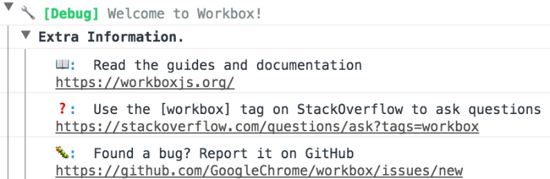

Workbox  |  Tools for Web Developers       |  Google Developers

star_border
star_border
star_border
star_border
star_border

#  Workbox

- [Contents](https://developers.google.com/web/tools/workbox/#top_of_page)
- [Get Started](https://developers.google.com/web/tools/workbox/#get_started)
    - [Choose your build tool to get started:](https://developers.google.com/web/tools/workbox/#choose_your_build_tool_to_get_started)
    - [Not using a build tool?](https://developers.google.com/web/tools/workbox/#not_using_a_build_tool)
    - [Want to work directly in your service worker?](https://developers.google.com/web/tools/workbox/#want_to_work_directly_in_your_service_worker)

-
    -
    -
    -
    -
-
-

 

Workbox is a collection of libraries and build tools that make it easy to store your website’s files locally, on your users’ devices. Consider Workbox if you want to:

- Make your site work offline.
- Improve load performance on repeat-visits. Even if you don’t want to go fully-offline, you can use Workbox to store and serve common files locally, rather than from the network.

[Learn more](https://developers.google.com/web/tools/workbox/overview)

## [arrow_upward](https://developers.google.com/web/tools/workbox/#top_of_page)Get Started

### Choose your build tool to get started:

     

### Not using a build tool?

Install our command-line interface:
hdr_strong
content_copy

`$ npm install workbox-cli --global[[NEWLINE]][[NEWLINE]]# Generate a service worker with some smart defaults[[NEWLINE]]$ workbox generate:sw[[NEWLINE]]`

### Want to work directly in your service worker?

We support that too with workbox-sw.
hdr_strong
content_copy
`$ npm install --save workbox-sw[[NEWLINE]]`
Then reference the file from your service worker:
hdr_strong
content_copy

`importScripts('/node_modules/workbox-sw/build/workbox-sw.vX.X.X.prod.js');[[NEWLINE]]`

## [arrow_upward](https://developers.google.com/web/tools/workbox/#top_of_page)Features

### Easy precaching

hdr_strong
content_copy

`importScripts('/node_modules/workbox-sw/build/workbox-sw.vX.X.X.prod.js');[[NEWLINE]][[NEWLINE]]const workboxSW = new WorkboxSW();[[NEWLINE]]workboxSW.precache([[[NEWLINE]]  {[[NEWLINE]]    url: '/index.html',[[NEWLINE]]    revision: 'bb121c',[[NEWLINE]]  }, {[[NEWLINE]]    url: '/styles/main.css',[[NEWLINE]]    revision: 'acd123',[[NEWLINE]]  }, {[[NEWLINE]]    url: '/scripts/main.js',[[NEWLINE]]    revision: 'a32caa',[[NEWLINE]]  }[[NEWLINE]]]);[[NEWLINE]]`

### Comprehensive caching strategies

hdr_strong
content_copy

`const workboxSW = new WorkboxSW();[[NEWLINE]]const networkFirst = workboxSW.strategies.networkFirst();[[NEWLINE]]workboxSW.router.registerRoute('/schedule', networkFirst);[[NEWLINE]]`

- Cache only
- Cache first, falling back to network
- Cache, with network update
- Network only
- Network first, falling back to cache

### Powerful debugging support

### The next version of sw-precache & sw-toolbox

Workbox is a rethink of our previous service worker libraries with a focus on modularity. It aims to reduce friction with a unified interface, while keeping the overall library size small. Same great features, easier to use and cross-browser compatible.

## [arrow_upward](https://developers.google.com/web/tools/workbox/#top_of_page)A Progress Web App Migration @ Google I/O 2017

In this talk Ewa discusses how she migrated womentechmakers.com's existing site to a PWA and she uses Workbox to help with the service worker development.

Except as otherwise noted, the content of this page is licensed under the [Creative Commons Attribution 3.0 License](http://creativecommons.org/licenses/by/3.0/), and code samples are licensed under the [Apache 2.0 License](http://www.apache.org/licenses/LICENSE-2.0). For details, see our [Site Policies](https://developers.google.com/terms/site-policies). Java is a registered trademark of Oracle and/or its affiliates.

Last updated October 18, 2017.