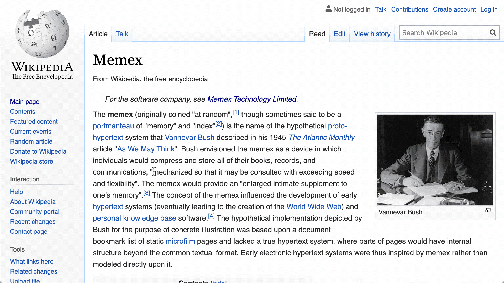
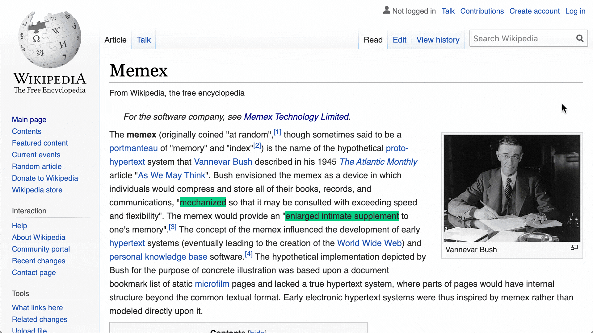
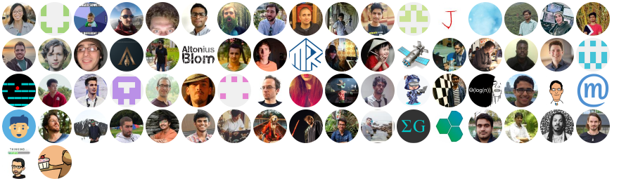

WorldBrain/Memex: Browser Extension to full-text search your browsing history & bookmarks.

# WorldBrain's Memex

## Table Of Content

1. [Memex Features](https://github.com/WorldBrain/Memex#memex-features)

2. [Changelog and Roadmap](https://github.com/WorldBrain/Memex#changelog--roadmap)

3. [Contributing](https://github.com/WorldBrain/Memex#contributing)

    1. [Report Bugs & Feature Requests](https://github.com/WorldBrain/Memex#bugs--feature-requests)

    2. [Getting started as a developer](https://github.com/WorldBrain/Memex#getting-started-as-a-developer)

4. [License](https://github.com/WorldBrain/Memex#license)
5. [Our Funders](https://github.com/WorldBrain/Memex#funders)

# Memex Features

A browser extension to eliminate time spent bookmarking, retracing steps to recall an old webpage, or copy-pasting notes into scattered documents. Its name and functionalities are heavily inspired by [Vannevar Bush's vision of a Memex](http://memex.link/S1zVMgKzX/en.wikipedia.org/wiki/Memex).

## Full-Text Search in Web History & Bookmarks:

Search with every word of all websites & PDFs you visited & filter by time, domain, tags or bookmarks.

## Highlights, Notes & Annotations:

Add notes to websites and pieces of text in them

## Tags, Lists, Bookmarks

Add bookmarks, tags or sort websites into lists on the fly.

## All Data stored locally

All personal data is stored and processed on your own computer and will **never** leave your computer without you either sharing, syncing or backing it up to an external cloud. For more info please see our [privacy policy](https://worldbrain.io/privacy)

## Mobile apps for iOS & Android + Encrypted Sync

With [Memex Go](https://getmemex.com/) you can save & organise content on the go. Sync is end2end encrypted with [TweetNaCl](https://github.com/dchest/tweetnacl-js)

## No VC money, no Exit: Your data & attention stays yours

Memex is funded without VC money or selling shares. Instead we are funded with a model called "Steward Ownership". This model ensures that the company can never be sold and our investors are rewarded with a capped profit share. This way we will never get the incentives to optimise our company for maximising growth & shareholder profits to the expense of your privacy, provider freedom or attention. More about our choice you find [in this post](https://community.worldbrain.io/t/why-worldbrain-io-does-not-take-venture-capital/75).

## Other:

⛅Backup and restore your data to any of your favorite cloud providers & Google Drive

Import bookmarks and history from other services
⌨ Keyboard Shortcuts for everything
Tab manager: add all open tabs to a collection or tag

## Changelog & Roadmap:

See a list of our past updates and upcoming features [here](https://worldbrain.io/roadmap).

# Contributing

## Near term features where contributions are welcome

⭐️Archiving websites + reader mode + offline-viewing on mobile
⭐️Mobile Annotations
⭐️Support for Brave and Firefox on mobile
⭐️API to import/export your data & integrate with other apps
⭐️Bulk tag, delete, add to lists & bookmark of items
⭐️Nested Collections

Drop by in our [team chat](https://join.slack.com/t/worldbrain/shared_invite/enQtOTcwMjQxNTgyNTE4LTRhYTAzN2QwNmM3ZjQwMGE5MzllZDM3N2E5OTFjY2FmY2JmOTY3ZWJhNGEyNWRiMzU5NTZjMzU0MWJhOTA2ZDA) if you're interested in contributing to those features.***Experience in React or React Native & Test Driven Development required***

## Bugs & Feature Requests

Head over to our [community forums](https://community.worldbrain.io/) to post your requests.

## Getting started as a developer

[Click here](https://github.com/WorldBrain/Memex/blob/develop/GETTING-STARTED.md#installation) for all instructions on how to build Memex so you can hack on it.

## Contributors

### Code Contributors

This project exists thanks to all the people who contribute. [[Contribute](https://github.com/WorldBrain/Memex/blob/develop/CONTRIBUTING.md)].

### Financial Contributors

Become a financial contributor and help us sustain our community. [[Contribute](https://opencollective.com/worldbrain/contribute)]

#### Individuals

#### Organizations

Support this project with your organization. Your logo will show up here with a link to your website. [[Contribute](https://opencollective.com/worldbrain/contribute)]

# License

Memex is MIT licensed. View full [License](https://github.com/WorldBrain/Memex/blob/develop/License)

# Funders

WorldBrain.io, the company behind Memex, has been funded by a set of courageous investors & grant givers. See a full & up-to-date list [here](https://www.notion.so/worldbrain/The-Worldbrain-io-Team-9ca5429f6a5c480289386a5cb49f173c#480df7140d124dc68595316dd666fd9a).