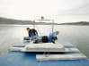
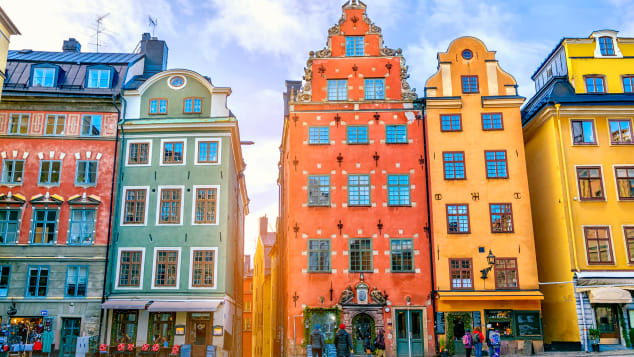
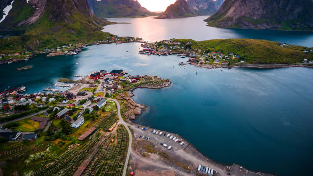
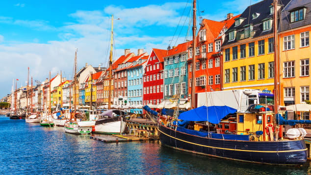
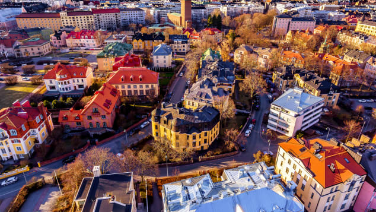

World's happiest country for 2019 revealed

[Biz and Leisure](https://edition.cnn.com/specials/success/biz-leisure)

# This is the world's happiest country in 2019

Katia Hetter, CNN • Updated 26th March 2019
FacebookTwitterEmail


Current Time 2:30
/
Duration Time 2:30
Loaded: 0%

Progress: 0%2:30
 Progress: 0%

Up next

A lifelong affair with China's Great Wall
02:29

Irish island of Arranmore asks Americans to move there
01:10

10-year-old girl conquers Yosemite's El Capitan
00:53

Hollywood's Most Iconic Theatre
02:58

Rescue elephants get new life at Kenyan orphanage
03:26

Healthy Travel Tips with Tone it Up
02:29

Official 'Thrones' scotch is here just in time to soothe
02:40

The Thai startup putting food tourism on the map
01:56

Rage rooms are all the rage
01:37

Catching Wolffish in the Arctic Circle
02:30
(CNN) — Finland has a lot to celebrate.

Not only does it have a [capital city bursting with gastronomic creativity](https://www.cnn.com/travel/article/helsinki-coolest-city-finland/index.html), the spectacular Northern Lights and [Santa Claus's year-round home](https://www.cnn.com/travel/article/levi-ice-hotel-luvattumaa/index.html) (plus the reindeer support staff) in Lapland. It's also the happiest country in the world for the second year in a row, according to the latest [World Happiness Report](http://worldhappiness.report/).

It's followed by Denmark, Norway, Iceland and The Netherlands.

The world's happiest country likes ice swimming.
Juho Kuva

The World Happiness Report was released by the Sustainable Development Solutions Network for the United Nations on March 20, the date that the United Nations has declared to be the [International Day of Happiness](http://www.un.org/en/events/happinessday/).

The report ranks countries on six key variables that support well-being: income, freedom, trust, healthy life expectancy, social support and generosity.

"The top 10 countries tend to rank high in all six variables, as well as emotional measures of well-being," says report co-editor John Helliwell, a professor emeritus of economics at the University of British Columbia.

Related content

[Ice swimming embraced by people of happiest country in the world](https://edition.cnn.com/travel/article/ice-swimming-finland/index.html)

And that's not just about the native-born residents of those countries.

"It's true that last year all Finns were happier than rest of the countries' residents, but their immigrants were also happiest immigrants in the world," says Helliwell. "It's not about Finnish DNA. It's the way life is lived in those countries."

They pay high taxes for a social safety net, they trust their government, they live in freedom and they are generous with each other. "They do care about each other," he says. "That's the kind of place people want to live."

Related content

[Defrosted Finland: How a land of 'sorrow' got happy](https://edition.cnn.com/travel/article/finland-reasons-to-be-happy/index.html)

Differences among the top eight countries are small enough that jostling among the top five is expected every year.

Switzerland came in sixth place, followed by Sweden, New Zealand, Canada (the only country in the Americas) and Austria.

The 2019 list only changed a little, with Austria nudging Australia out of the top 10 list. Australia dropped one spot to 11th place.

### Support in difficult times

- 

- 

- 

- 

- 

- 

- 

- 

- 

- 

- 

- 

1/12

**The world's 10 happiest countries. **Austria nudged Australia out of the top 10 list this year, While Salzburg is famous for its ties to the real-life "Sound of Music" von Trapp family, it was also home to Wolfgang Amadeus Mozart and the Mirabell Gardens shown here (see the historic Fortress Hohensalzburg in the background).

Shutterstock

Ranking high in happiness doesn't protect a country's people from violence or trauma, as the recent attacks on mosques in Christchurch, New Zealand show. But the response of New Zealand's people to the attacks does.

New Zealand came in eighth place this year, as it did last year.

"What stands out about the happiest and most well connected societies is their resilience and ability to deal with bad things," says Helliwell. "After the 2011 earthquake and now the terrorist attack in Christchurch -- with high social capital, where people are connected -- people rally and help each other and (after the earthquake) rebuild immediately."

### The US rank is dropping

The most popular US national park, Great Smoky Mountains National Park is a happy place for many visitors.

Shutterstock

The United States came in 19th place, dropping one spot since last year and a total of five spots since 2017.

Except for its 10th place ranking for income, the US doesn't rank in the top 10 on measures that make up a happy country in the UN report. They include 12th place for generosity, 37th place for social support, 61st place for freedom and 42nd place for corruption.

Addiction is partly to blame, says report co-author Jeffrey Sachs, director of the Sustainable Development Solutions Network, who wrote a chapter focused on the US epidemic of addictions and unhappiness in America, a rich country where happiness has been declining.

Related content

[Link between social media and depression stronger in teen girls than boys, study says](https://edition.cnn.com/2019/01/03/health/social-media-depression-girls-study/index.html)

This year's report provides sobering evidence of how addictions are causing considerable unhappiness and depression in the US," says Sachs, in a press release. "Addictions come in many forms, from substance abuse to gambling to digital media. The compulsive pursuit of substance abuse and addictive behaviors is causing severe unhappiness."

Social connections are weakening in the US as social media usage is raising anxiety, especially among adolescents, says Helliwell.

### Superpowers are not super happy

The United Kingdom rose three spots to 15th place this year.
Leon Neal/Getty Images

No other super powers made it into the top 10 rankings, either. The United Kingdom came in 15th place, up from 18th place, while Germany came in 17th place, down from 15th. Japan came in 58th place (down from 54th), Russia came in 68th place (down from 59th) and China came in 93rd place (down from 86th).

People in South Sudan are the most unhappy with their lives, according to the survey of 156 countries, followed by Central African Republic (155), Afghanistan (154), Tanzania (153) and Rwanda (152).

Bolstered by population growth, overall world happiness has fallen over the past few years, which has mostly been fueled by a sustained drop in India, which came in 140th place this year (versus 133rd place in 2018). There has also been an increase of negative emotions, which were also measured and include worry, sadness and anger.

### It began with Bhutan

The prime minister of tiny Bhutan is credited with launching World Happiness Day.

Shutterstock

The prime minister of the tiny country of Bhutan proposed a World Happiness Day to the United Nations in 2011, which brought international attention to happiness as a metric. Bhutan came in 95th place (up two spots from last year) in this year's report.

Related content

[5 reasons Bhutan is worth the $250 daily fee](https://edition.cnn.com/travel/article/visiting-bhutan/index.html)

In 2012, the United Nations General Assembly [declared March 20 as World Happiness Day](http://www.un.org/en/ga/search/view_doc.asp?symbol=%20A/RES/66/281), recognizing "the relevance of happiness and well-being as universal goals and aspirations in the lives of human beings around the world and the importance of their recognition in public policy objectives."

This report is the seventh to come out since 2012. The rankings of the world's happiest countries came from an analysis of data from surveys in 156 countries, including the Gallup World Poll starting in 2005-2006.

### World's happiest countries

1. Finland
2. Denmark
3. Norway
4. Iceland
5. Netherlands
6. Switzerland
7. Sweden
8. New Zealand
9. Canada
10. Australia

### World's least happy countries

1. South Sudan
2. Central African Republic
3. Afghanistan
4. Tanzania
5. Rwanda
6. Yemen
7. Malawi
8. Syria
9. Botswana
10. Haiti

Paid Content

- [       Sustainability - getting better all the time  Sponsored: ING Wholesale Banking](https://view.ingwb.com/sustainability-getting-better-all-the-time?utm_source=Outbrain&utm_medium=DynamicAd&utm_campaign=The_View_12&obOrigUrl=true)
- [

 [eyJpdSI6ImZjMTg2MjU2NTZkZGVhMzE1ZmI1ZGI4MWVkYjIxNmMzY2ViN2MyOWRjYmI2NzljYWI3MjUyYWYxZDc0YWEyMmMiLCJ3Ijo0MDAsImgiOjI0MCwiZCI6MS41LCJjcyI6MCwiZiI6NH0.webp](../_resources/1c928ff5e708250c43a4c7852baa9454.webp)    14 Surprising Discounts UK Seniors Only Get If They Ask!  Sponsored: www.money-hero.org](https://xhyizyp.com/path/lp.php?trvid=10342&trvx=054b18f3&OutbrainClickId=$ob_click_id$&campid=00b6cd9f6b0a3fbb6f09221e406a8b145e&creaid=007ba464970d6280e1ba9cd7b6b914a826&atitle=14+Surprising+Discounts+UK+Seniors+Only+Get+If+They+Ask%21&dtitle=Money-Hero.Org+-+Helping+you+keep+more+cash+in+your+pocket%21&pubidx=$section_name$&obOrigUrl=true)

[(L)](https://www.outbrain.com/what-is/default/en)

- [

 [eyJpdSI6IjQxODA1OTkzOTY3MmQ4YjBmMDNjMjNhMWNkYzEwYjFiNDQ0ZmI3YTEzNDdhNGZmN2M2MDk5YmZhMTYwMjNlMWEiLCJ3Ijo0MDAsImgiOjIyNCwiZCI6MS41LCJjcyI6MCwiZiI6NH0.webp](../_resources/a93da2d18ece10f07d02f758a822da74.webp)    How People In The UK Secretly Make A Second Income In 2019?  Sponsored: financialmentor.co](https://financialmentor.co/investment-banking-manual/?id=c2k92f&s1=00f78676eb32e7b452aff8a003c036295d&s2=$publisher_id$&s3=0070f84aa824d88f47439ffda37cac9d2f&s4=$publisher_name$_$section_name$&s5=$section_id$&source=outbrain)

- [

 [eyJpdSI6ImZjNjMwMTdmZGJiYmViNTI3ZDQ4YWEwMjMwMzg4NmRjNjZmNWUyMDM5YzdhMzBmYzk4Y2QzMzBjNTMzMzEzNDkiLCJ3Ijo0MDAsImgiOjI0MCwiZCI6MS41LCJjcyI6MCwiZiI6NH0.webp](../_resources/6c65a988e1d6eb7dbdc7512663c9d15f.webp)    Play this for 1 minute and see why everyone is addicted!  Sponsored: Throne](https://plarium.com/landings/en/throne/pastoral_f002?plid=133078&pxl=outbrain&PublisherID=00dd609bb2219484df52a1f6497e555bf1&placement=$publisher_name$_$section_id$&adpartnerset=00e60e7c67a4cda698b604a7d21d07f166&clickID=$ob_click_id$)

- [

 [eyJpdSI6IjU4ZmZhYTY1YWE2NmVjY2I2NjI0NzEwYTA2ODRkYzJkYWNjYzkwMGM2YWJjZDAxMzFhMTFlMmVmM2Q5YmFkYmYiLCJ3Ijo0MDAsImgiOjI0MCwiZCI6MS41LCJjcyI6MCwiZiI6NH0.webp](../_resources/2a7de961d124a58014d6ae0f00f7062d.webp)    Converse At Incredible Price For Few Days  Sponsored: www.veepee.uk](https://contentfor.me/19yhk33?nap_site=$publisher_name$)

- [    

 [eyJpdSI6IjljZDFhMGJiNGQzYTM4ZWI2NTFkNGU0NzVlNTc4OGM1MzdjYjI2ZmIxODFlNzRmZjAzNzk2NWE0YTRhM2NkODEiLCJ3Ijo1MDAsImgiOjMwMCwiZCI6MS4wLCJjcyI6MCwiZiI6NH0.webp](../_resources/9622002a9c5cb49f214c3e7b48fa44c9.webp)    Style  Pride 2019: A colorful history of the rainbow flag](http://edition.cnn.com/style/article/pride-rainbow-flag-design-history/index.html)

- [    

 [eyJpdSI6IjZkNzgyM2VlMjFmM2FjZjgxYWE1NjRjNDY0OGQ0ZWMyM2I3YzljYTdkYjRlN2ZjZDdjMDZlNzc0MzMyNzBkYWUiLCJ3Ijo0MDAsImgiOjIyNiwiZCI6MS41LCJjcyI6MCwiZiI6NH0.webp](../_resources/4402aac8237f52cbab42d3fa848924e1.webp)    Travel  Disney World increases price of annual passes…](http://edition.cnn.com/travel/article/disney-world-annual-pass-increase-florida/index.html)

- [    [eyJpdSI6IjBlZDhjYjQwYzMwMDExODY4MzI5MGFmMTE1ZmZkODc2MzhkNjM2NGI1MzM1NTUxODAxMDViN2YxM2FjM2QwNDkiLCJ3Ijo0MDAsImgiOjI0MCwiZCI6MS41LCJjcyI6MCwiZiI6NH0.webp](../_resources/db03ca7ad0e256f37b022c0498993f67.png)

 [eyJpdSI6IjYzMWQ1ZjI3ZmZmNWZmZTA2ZjM0OTY0ODc0NDFhOTgwMTFhNjRlNDcyOTkyZGJkNjc4MDEwZGJkODEzYzM3YjEiLCJ3Ijo0MDAsImgiOjIyNiwiZCI6MS41LCJjcyI6MCwiZiI6NH0.webp](../_resources/b609c103a7e55e82b910effacef1f1e6.webp)    Style  Mexico accuses Carolina Herrera fashion house of…](http://edition.cnn.com/style/article/carolina-herrera-mexico-cultural-appropriation-scli-intl/index.html)

- [    [eyJpdSI6ImY3ZDQyYmQxNTNlOGRhYTk4NDk5MDY4NmNlMGE3ODgzNWNiNTMyOTNhYjk4ZTkyNTA4N2Y3MjRiZGM3NTY3NGIiLCJ3Ijo0MDAsImgiOjI0MCwiZCI6MS41LCJjcyI6MCwiZiI6NH0.webp](../_resources/db03ca7ad0e256f37b022c0498993f67.png)

 [eyJpdSI6ImJjNjk1ZGYxMzk4Y2VkZDU2MWE0YzdkYzZmMWZkMDkyNTJjNTFhZjYzYzE5MGI0MzczZjczYWQzODI0ZDE4ZWYiLCJ3Ijo0MDAsImgiOjIyNCwiZCI6MS41LCJjcyI6MCwiZiI6NH0.webp](../_resources/25bfc6c41ac3465d43bb58e98bcb4621.webp)    Style  Baby Phat could be coming back very soon, teases…](http://edition.cnn.com/style/article/baby-phat-forever-21-comeback-trnd/index.html)

- [    

 [55KK5SYLSFEK5CQZBX8PRO](../_resources/c020983e7456a0147f77985ebb996723.webp)    Travel  The tree thought to have inspired Dr. Seuss' 'The…](http://edition.cnn.com/2019/06/16/us/lorax-tree-falls-trnd/index.html)

- [

 [eyJpdSI6ImQyMDg3MDU5ZmZkZWExOWVkZWE3NGNiZTM2ZDVjMWZhZjhiODZmZGE1YWQ5OWZkZTExNDU5ZWFjZDE1ZDM5ZmIiLCJ3Ijo0MDAsImgiOjIyNCwiZCI6MS41LCJjcyI6MCwiZiI6NH0.webp](../_resources/2bb5b1a4c95d074afed9ce36409fbe18.webp)    Mac Users Guide (2019) - The Only Antivirus Provider…  Sponsored: Antivirus Best 10 - The Best Antivirus Products Reviewed](http://clickit.atrrat.com/ea675cf8-b379-4127-9ab7-06a7ff3264d9?source=$origsrcid$&ADID=Mac+Users+Guide+%282019%29+-+The+Only+Antivirus+Provider+You+Should+Use.&sectionid=$section_id$&sectionname=$section_name$&publisherid=$publisher_id$&publishername=$publisher_name$&adtitle=Mac+Users+Guide+%282019%29+-+The+Only+Antivirus+Provider+You+Should+Use.)

- [

 [eyJpdSI6Ijc5MGU5NWMyM2Q5ODk1MmE0OWFiMGQ4NDk1YjJjNzMzNzRiZDMzM2VlNTY2NjliM2I2NzM3MmU0OTIzNDRmZmEiLCJ3Ijo1MDAsImgiOjMwMCwiZCI6MS4wLCJjcyI6MCwiZiI6NH0.webp](../_resources/ee9c7fad193438e10f44f9b36d3ba782.webp)    Hey Mac users - Important Step If Your Photos Are On…  Sponsored: www.talktechdaily.com](http://www.talktechdaily.com/photo-stick/?flux_fts=lazixcallzczaoztixexpoxpxottallzoocxqb6a84&h=3&ia=photostick3-1&kw=ob-ps-003&c1=$publisher_name$&c2=$section_name$&c3=$publisher_id$&c4=0025a64e37393755b9ac1cc8121b600e0c&c6=000f70cade46c2346c5d6e9a958fdd84b6&c7=$section_id$&c5=PhotoStickD+EN+Mac&eid=$ob_click_id$)

- [     Things The Cabin Crew Notice About Passengers In 3 SecondsSponsored:PostFun](http://www.postfun.com/travel/flight-attendants-reveal-secrets-of-flying-and-what-its-really-like-working-for-an-airline/?utm_campaign=flg-d-uk-c-0-0-181126-pu-ob-c7-a1&utm_term=aa_flg.JPG&utm_source=ob&utm_medium=$section_id$-ob&utm_content=00a5ea7a6ac8c3a90d1cd4c45e3bda968d)
- [     The new kind of car club: Join now for £9.98 instead of £29 + £20 free driving credit!Sponsored:DriveNow](https://ad1.adfarm1.adition.com/redi?sid=3602603&kid=2400668&bid=8251127)
- [     Camden: Born Before 1959? You're Eligible For These 10 Senior OffersSponsored:Expert Market](https://theseed.com/top-senior-offers/?utm_campaign=007799b7f025b553eaa341b4097b3c9a05&utm_content=004a842fb59843e0d5e14705dfa51f5256&cid=5c4eeb6dc73c7&utm_source=outbrain&utm_medium=%24section_id%24&campaign=5c4eeb6dc73c7-Listicle-UK-D&content=%24%7Bregion%3Acapitalized%7D%24%3A+Born+Before+1958%3F+You%27re+Eligible+For+These+10&source=outbrain&network=%24section_name%24&title=%24%7Bregion%3Acapitalized%7D%24%3A+Born+Before+1958%3F+You%27re+Eligible+For+These+10&utm_campaign=007799b7f025b553eaa341b4097b3c9a05&utm_content=0040791c59096bad17587cba63eb3bbd13&cid=5cd575267c915&utm_source=outbrain&utm_medium=$section_id$&campaign=5c4eeb6dc73c7-Listicle-UK-D&content=%24%7Bregion%7D%24%3A+Born+Before+1959%3F+You%27re+Eligible+For+These+10+Senior+Offe&source=outbrain&network=$section_name$&title=%24%7Bregion%7D%24%3A+Born+Before+1959%3F+You%27re+Eligible+For+These+10+Senior+Offe)

- [              Style  Striking photos show environmental decline…](http://edition.cnn.com/style/article/ganges-environment-photographs/index.html)
- [              Travel  Passenger opens plane exit instead of toilet](http://edition.cnn.com/travel/article/plane-door-manchester-airport-scli-intl/index.html)

- [    [eyJpdSI6IjZlYzVkMjBkNjc2YTg1MDcwOWYyNmEyNzc0NzdhOWVlYWUxYjA1MjhhNmU3NTVkOGEwZTk0NzlkMDg1YzdjNzQiLCJ3IjoyMDAsImgiOjExMywiZCI6MS41LCJjcyI6MCwiZiI6NH0.webp](../_resources/db03ca7ad0e256f37b022c0498993f67.png)            Style  Zanele Muholi captures powerful portraits of…](http://edition.cnn.com/style/article/zanele-muholi-lgbt-photographer/index.html)
- [    [eyJpdSI6IjRmNTkxNWZjNzY5OGM3MWUyMjRkMDRlZWRkNjM4YWMzMTJlYWE5YmZmN2JmOTM2NmE2OTQ1OTI4NGI4ODE1ODYiLCJ3Ijo0MDAsImgiOjI0MCwiZCI6MS41LCJjcyI6MCwiZiI6NH0.webp](../_resources/db03ca7ad0e256f37b022c0498993f67.png)            Style  The $450 million question: Where is the 'Salvator…](http://edition.cnn.com/style/article/salvator-mundi-leonardo-da-vinci-whereabouts/index.html)
- [    [eyJpdSI6ImJjN2ViNDUwZTNmMmU5NmQ2YmUyNmFhY2I2MGU5MDFiZGQyMGNmYTRiNzM5NzA0N2FhMWRhNTYyNjA0ZWM5Y2IiLCJ3Ijo0MDAsImgiOjIyNCwiZCI6MS41LCJjcyI6MCwiZiI6NH0.webp](../_resources/db03ca7ad0e256f37b022c0498993f67.png)            Travel  A new species of 'cat fox' may be prowling a French…](http://edition.cnn.com/2019/06/19/europe/cat-fox-species-corsica-france-trnd/index.html)

- [     Can You Pass This Very British Food Quiz?Sponsored:HowStuffWorks](https://play.howstuffworks.com/quiz/can-you-pass-this-very-british-food-quiz?acct=00f6a7d2cf2656566c6578c8d8ce8c3a03&utm_medium=paid&utm_source=outbrain&utm_term=$section_id$&pbid=$publisher_id$&pbn=$publisher_name$&scn=$section_name$&adid=00dd798ddd4fa02b20bff07fd679f62d0f&mkcpgn=ba72d4f8d94a49e38dd989101d4909db&sg_uid=ba72d4f8d94a49e38dd989101d4909db)
- [     The Only Antivirus Providers Mac Users Should…Sponsored:My Antivirus Review](http://clickit.atrrat.com/ea675cf8-b379-4127-9ab7-06a7ff3264d9?source=$origsrcid$&ADID=Place-Here&sectionid=$section_id$&sectionname=$section_name$&publisherid=$publisher_id$&publishername=$publisher_name$&adtitle=The+Only+Antivirus+Providers+Mac+Users+Should+Consider+Using+%282019%29)

- [     Camden Residents Going Bananas Over Huge Savings Made With New Funeral PlanSponsored:Coverscanner](https://www.coverscanner.co.uk/5of-desk/?utm_source=Outbrain&utm_ad=006f90e3e10d4e57f9bc1ce54c71e38957&utm_term=$origsrcid$&utm_section=$section_name$)
- [     Beyond EVs: how to make hydrogen the auto fuel of the futureSponsored:ING Wholesale Banking](https://view.ingwb.com/beyond-evs-how-to-make-hydrogen-the-auto-fuel-of-the-future?utm_source=Outbrain&utm_medium=DynamicAd&utm_campaign=The_View_12)
- [      The Human-Centred AI ConferenceSponsored:EGG London](https://d.adroll.com/r/ISRFVJ4CYZEJLCRYPCOWW4/2ZZCFVO2FVF4BDBCQC8NAT/55KK5SYLSFEK5CQZBX8PRO/26Q6OZB3SFGOVIZLRKYE3W.re?adroll_network=outbrain&adroll_subnetwork=r&adroll_ad_payload=__HIAvkBkwHFAubIAuIAAY1Sz4sURxSe6V11w2oCGxgxpxB_nLZnq7umunqWLMuuu6PuLIwzC8nMYNJUV9XMNPYv-8eol5CcRJJDBEmCXkT2lPwViQUbYtcEIRIE8ZBThCSIR0FijQcPehHqwfdePd73va_qUWlxRlQQajbRTm97p7HZRCfb_fWufbbTmhUV02pbrf463Gmcan1ypr_dafY24acLwh9lWXwcrh03G-pw5mVeFFZpqCIKVCVLyJj7CpAk86jPFboYJT5L9RGJY4-nmU6jPMwSBfU89DLO9JBMh6S6CYy66vdCxi9VR1ngHxFnp3Tp8tKSH4VMEfHhsMpIRrzz-ZRwaRQFfDXPAieN8oTylTXWiXz_xLQSKHF5sBInL7OMJ8HKRe5-ICpb3TMncaPd6aJTvf5WbWMTdjY3GkiUE1tUTqNttN7CrfbWBl4_3e21rakhy5PSO-ajj8UcVdM9xpNVcXiqFlgGcGjMx9BJ1eYZH15u7C1o_117svtg969__v9GPP_-pz_-_nq--cs5-e-x_Eae6pwoDwx2SRxM8jD0wqEDbWwUV8V7r7lZ3BBaa624Ofns4Hfniltv3t8uFbsLxW_igEtcZrp2cXdv_-y1ySz49nFRKBk_P9m9_-eVx_eevpJRPNt7d-YrMcfHnnLTyeTyD8Xz66CKkCzPiHIoy0fF0TqFCNhsUB9YtgEBgYgCGyOMIaTIoHR5bMjysbfr07qTUtmfkVpPHEovxPnQGWPHsB1Tav07Uvv8pa9SCyal1cp1qV2Q9-tS-0KAIQkC4nhBnEQxTxyq_g5ni7phVQ1smIugalq4ho1FHVatml1TRF-KeVAFAECIMMRS-1V8CGiNQNMlmJimNQDYdjG2CLLrlGKDMMV0Vxxgl0MSeFRqk4el9z0dmABjMoCcUgPbtAak9ruYi_LMTYgXytntO3Lfj2Je6UpjTjP1fHL_SHwEAGbIZYTbNU7qA9tCEGCXIF5HhJh1xsgLxAweJNNlAqRFRoEaAOw&cpm=AAAAAF0Mllx87FqWPNFIdSLxOTIY-3j5Ct40iA)

 [eyJpdSI6IjhiMzliODc4OWQ0ZGI3MmZjYjY3MjBiNmY1ZWUzNGQwOWRiOTY2MjA2MGVlZjU4M2JiODkxNmUwZGRlOTZmMGUiLCJ3Ijo0MDAsImgiOjI0MCwiZCI6MS41LCJjcyI6MCwiZiI6NH0.webp](../_resources/a60852f204ed8028c1c58808b746d115.bin)

 [eyJpdSI6IjlhOTk1NWIzOTI2Zjk0ZWM3ZDY0NGU5MWM4MWVlNWViNWFmYTlkYTY2NjEwODE4ZjhhZTNmODZhZjYzOTZhN2QiLCJ3IjoyMDAsImgiOjExMywiZCI6MS41LCJjcyI6MCwiZiI6NH0.webp](../_resources/779cf1fa341f32838178128d8b58da34.gif)

- [              Style  Yetunde Ayeni-Babaeko captures the beauty of…](http://edition.cnn.com/style/article/world-albinism-day-yetunde-babaeko-intl/index.html)
- [              Travel  April the giraffe is heading into retirement](http://edition.cnn.com/2019/06/07/us/april-giraffe-retire-birth-control-trnd/index.html)

Paid Content

- [Chiropractors Baffled: Simple Stretch Relieves Years of Back…*healthtoday.online*](https://adoclk.com/www/delivery/clk.php?zoneid=18851&pub_clickid=$ob_click_id$&pub_siteid=00431fbf17d2b10a462ab452e2b69a52de|005d76a2ee5ea7f3a5fd17d2db61ef0b3d|$section_id$&obOrigUrl=true)
- [Most wine drinkers in the UK don't know these 5 simple Dos and…*Naked Wines*](https://www.nakedwines.com/nakdobp16_j?cid=uk&utm_source=outbrain&utm_medium=native&utm_campaign=%24br-naked%24ct-uk%24ba-prospecting%24sa-ob_uk%24ca-ob_nonlal_uk%24ob-conv%24cr-content%24pn-apr2019_5_hacks_d&utm_content=Most+wine+drinkers+in+the+UK+don%27t+know+these+5+simple+Dos+and+Don%27ts.&utm_term=$publisher_name$_$section_name$&obOrigUrl=true)
- [Doctor Amazed: Simple Tip Relieves Years of Joint Pain (Try…*The Health Reports 24*](https://siteloading.com/path/lp.php?trvid=10265&trvx=4d26a51d&clid=$ob_click_id$&caid=00870bcd83999662bd3ecd07b7aefc6a10&cid=00728070d9bf67f8a854a14f510e810032&at=Doctor+Amazed%3A+Simple+Tip+Relieves+Years+of+Joint+Pain+%28Try+Tonight%29&dt=Joint+Fuel&pid=$publisher_id$&pn=$publisher_name$&sn=$section_name$&sid=$section_id$&obOrigUrl=true)
- [[Gallery] Genius Russian Boy Shares A Prediction About Space…*HonestToPaws*](http://honesttopaws.com/russian-kid-mars-hc-htp/?as=2030039017835&utm_source=outbrain&utm_medium=cpc&utm_campaign=russian-kid-mars-hc-htp_htp_uk_english_desktop_c1_t1_v20190330_b122_g1gs&utm_term=003b6a13515d3335640ca84e7f2d60765f&utm_content=$section_id$&obOrigUrl=true)

More from CNN

- [The SkyDeck ledge of the Willis Tower cracks under visitors' feet](http://edition.cnn.com/2019/06/12/us/willis-tower-skydeck-cracks-trnd/index.html?iid=ob_article_footer_expansion&obOrigUrl=true)
- [Spirit Airlines passenger banned for life after vaping on flight](http://edition.cnn.com/2019/06/08/us/spirit-airlines-passenger-banned-vaping/index.html?iid=ob_article_footer_expansion&obOrigUrl=true)
- [A restaurant got a rare blue lobster in its shipment. Instead of…](http://edition.cnn.com/2019/06/14/us/blue-lobster-arnolds-bar-massachussetts-trnd/index.html?iid=ob_article_footer_expansion&obOrigUrl=true)
- [40,000-year-old severed wolf's head discovered in Siberia](http://edition.cnn.com/2019/06/11/europe/russia-wolf-head-scli-intl/index.html?iid=ob_article_footer_expansion&obOrigUrl=true)

[By](https://www.outbrain.com/what-is/default/en)

More from CNN

- [     Legendary Italian director Franco…](http://edition.cnn.com/style/article/franco-zeffirelli-dies-obit-intl/index.html?obOrigUrl=true)
- [     Airbus launches 'longest range…](http://edition.cnn.com/travel/article/airbus-single-aisle-long-range-plane-scli-intl/index.html?obOrigUrl=true)
- [     Global air travel's…](http://edition.cnn.com/travel/article/alcock-and-brown-monument-ireland/index.html?obOrigUrl=true)
- [     Royal Ascot: Tracking…](http://edition.cnn.com/style/article/royal-family-royal-ascot-history/index.html?obOrigUrl=true)
- [     Leonardo da Vinci: Artist…](http://edition.cnn.com/style/article/da-vinci-handbag-intl-scli/index.html?obOrigUrl=true)

[(L)](https://www.outbrain.com/what-is/default/en)

[A year of the world'sBest BeachesThere's a perfect beach for every week of the year. Join us on a 12-month journey to see them all Go to the best beaches    ](https://www.cnn.com/interactive/travel/best-beaches)

More from CNN

- [

 [eyJpdSI6IjI3MzM3NWEzNmQwNmI5M2M1NTQ0YTg3MjM5ZThjYTU4YjBiMjdhMDg5OTMwMGRlYjA3ZTAzYTVjNDNhMjljZWUiLCJ3Ijo0MDAsImgiOjIyNCwiZCI6MS41LCJjcyI6MCwiZiI6NH0.webp](../_resources/ebe5ffc8383bb4e97f301fc0e718e11a.webp)    A restaurant got a rare blue lobster in its shipment. Instead of cooking it, the owner is donating it to an aquarium](http://edition.cnn.com/2019/06/14/us/blue-lobster-arnolds-bar-massachussetts-trnd/index.html?obOrigUrl=true)

- [

 [eyJpdSI6IjlhOWUwMDAwYjBmMmFjNGNiOTY2NjI1NTczNDhjYjRiMzA1NTNiYTkyZDY3NjM4MTdiZTc4YzAyZDVkZTc0YjMiLCJ3Ijo0MDAsImgiOjI0MCwiZCI6MS41LCJjcyI6MCwiZiI6NH0.webp](../_resources/6066668e8383336309dec07e81e77fb3.webp)    Airbus launches 'longest range' narrow plane](http://edition.cnn.com/travel/article/airbus-single-aisle-long-range-plane-scli-intl/index.html?obOrigUrl=true)

- [

 [eyJpdSI6ImQwZTcxNmNhYzAxODI4MTgzNmQwMDk5OGY5NjYzODNiYTY0MjYwNzY5YmZkYmY2NmQ3Y2M4YzI2ZGNhOGJlZGIiLCJ3Ijo0MDAsImgiOjI0MCwiZCI6MS41LCJjcyI6MCwiZiI6NH0.webp](../_resources/cf4dd1d8ddc385461968d92d722268ec.webp)    'Harry Potter' fans battle crowds and lightning in…](http://edition.cnn.com/travel/article/harry-potter-ride-10-hour-wait-trnd/index.html?obOrigUrl=true)

- [

 [eyJpdSI6IjYyMmE3Njk1ZTk2YmM0MjEwMGQ2MjBjZWU5Y2Y2MWJkOGQwOTNiZDI0NTZiZjQyZDU5MWI3Y2FiOWYxMWJkZTEiLCJ3IjoyMDAsImgiOjExMywiZCI6MS41LCJjcyI6MCwiZiI6NH0.webp](../_resources/a40114b0fe465e6a98fe2e2988a555ee.webp)    Rare wave-shaped clouds roll over Virginia](http://edition.cnn.com/travel/article/rare-wave-cloud-formation-trnd/index.html?obOrigUrl=true)

- [

 [eyJpdSI6IjhkZjMzOGU3MzViYzkzZWI0N2E0ZTg1OWFmNDYyMjQ0NDI4NjVlM2I4MThiYThlYzI3YWVjMDk3YWU5ZTI3MjciLCJ3IjoyMDAsImgiOjExMywiZCI6MS41LCJjcyI6MCwiZiI6NH0.webp](../_resources/e1a2b213d1349e7c3749128dfb0aef79.webp)    Legendary Italian director Franco Zeffirelli dies aged 96](http://edition.cnn.com/style/article/franco-zeffirelli-dies-obit-intl/index.html?obOrigUrl=true)

[(L)](https://www.outbrain.com/what-is/default/en)

Paid Content

- [

 [eyJpdSI6Ijc5MGU5NWMyM2Q5ODk1MmE0OWFiMGQ4NDk1YjJjNzMzNzRiZDMzM2VlNTY2NjliM2I2NzM3MmU0OTIzNDRmZmEiLCJ3Ijo0MDAsImgiOjIyNiwiZCI6MS41LCJjcyI6MCwiZiI6NH0.webp](../_resources/e910a8ab755a90df7453faab61737d53.webp)    If You're Over 50 & Own a Computer, This Game is a Must-Have!  *Vikings*](https://plarium.com/landings/en/vikings/village_steps_m_prelp001_2?plid=102600&pxl=outbrain&PublisherID=00edc12fe8e9a7f29e9a39477ab1e547ed&placement=$publisher_name$_$section_id$&adpartnerset=009c2494c354d2fef17ae8cc7ed99b47f8&clickID=$ob_click_id$&obOrigUrl=true)

- [

 [eyJpdSI6ImMzOGExNDJkYTczZWZhMzE3ZWJhNWFhNTJmMzM4MDhkMzYyNzQxZWYxNmExMjkwOTM3YTQyZTYxN2ZlZWE5OTMiLCJ3Ijo0MDAsImgiOjI0MCwiZCI6MS41LCJjcyI6MCwiZiI6NH0.webp](../_resources/d239b7e4d52e568adfe1a27e466635bb.webp)    Most wine drinkers in the UK don't know these 5 simple Dos and Don'ts....  *Naked Wines*](https://www.nakedwines.com/nakdobp16_j?cid=uk&utm_source=outbrain&utm_medium=native&utm_campaign=%24br-naked%24ct-uk%24ba-prospecting%24sa-ob_uk%24ca-ob_nonlal_uk%24ob-conv%24cr-content%24pn-apr2019_5_hacks_d&utm_content=Most+wine+drinkers+in+the+UK+don%27t+know+these+5+simple+Dos+and+Don%27ts.&utm_term=$publisher_name$_$section_name$&obOrigUrl=true)

- [     14 Surprising Discounts UK Seniors Only Get If They Ask!*www.money-hero.org*](https://xhyizyp.com/path/lp.php?trvid=10342&trvx=054b18f3&OutbrainClickId=$ob_click_id$&campid=00b6cd9f6b0a3fbb6f09221e406a8b145e&creaid=007ba464970d6280e1ba9cd7b6b914a826&atitle=14+Surprising+Discounts+UK+Seniors+Only+Get+If+They+Ask%21&dtitle=Money-Hero.Org+-+Helping+you+keep+more+cash+in+your+pocket%21&pubidx=$section_name$&obOrigUrl=true)

[By](https://www.outbrain.com/what-is/default/en)

More from CNN

 [      'Zombie snakes' in North Carolina are a lot less…      *  *](http://edition.cnn.com/2019/06/11/us/zombie-snakes-north-carolina-trnd/index.html?iid=ob_article_organicsidebar_expansion&obOrigUrl=true)  [      China unveils 600km/h maglev train prototype      *  *](http://edition.cnn.com/travel/article/china-highspeed-maglev-prototype/index.html?iid=ob_article_organicsidebar_expansion&obOrigUrl=true)  [      People are evacuating after the crash. Here's…      *  *](http://edition.cnn.com/us/live-news/manhattan-helicopter-crash-june-2019/h_c910e27f47d6e3404febdbf6ebdff193?iid=ob_article_organicsidebar_expansion&obOrigUrl=true)  [      Body of a 6-year-old girl from India is found in…      *  *](http://edition.cnn.com/2019/06/14/us/arizona-indian-girl-body-found-in-the-desert/index.html?iid=ob_article_organicsidebar_expansion&obOrigUrl=true)