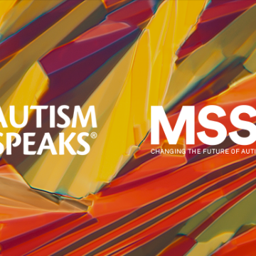

World’s largest autism genome database shines new light on many ‘autisms’

World’s largest autism genome database shines new light on many ‘autisms’

https://www.autismspeaks.org/science/science-news/world%E2%80%99s-largest-autism-genome-database-shines-new-light-many-%E2%80%98autisms%E2%80%99

Latest study from the Autism Speaks MSSNG program identifies 18 new autism-linked genes, deepening understanding of autism's broad spectrum