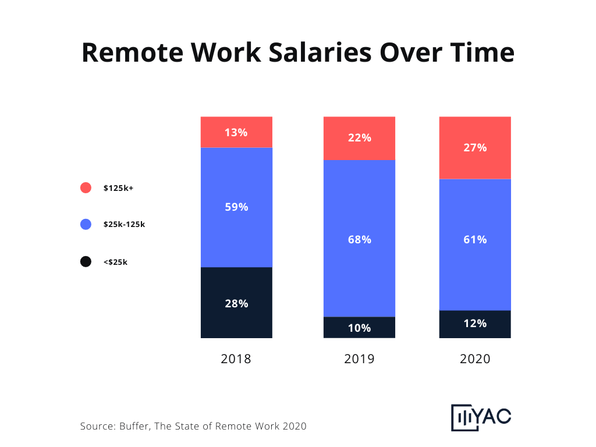

Yac Blog - The Shifting State of Remote Work | Buffer

 

[Pricing](https://www.yac.chat/pricing)

Features

[Blog](https://www.yac.chat/blog)[Our Story](https://www.yac.chat/our-story)[Contact US](https://www.yac.chat/contact-us)

[BACK TO BLOGS](https://www.yac.chat/blog)

# The Shifting State of Remote Work

An exploration of what has changed and what has remained the same over the last three years in remote work.

[By Hunter McKinley](https://twitter.com/huntermoonshot/)
February 4, 2020
[(L)](https://www.yac.chat/blog/the-shifting-state-of-remote-work#)

For each of the last three years, Buffer has shared a research report on the state of remote work. Conducted by surveying a few thousand remote workers from around the world, the primary goal was to understand [“what trends are growing across the remote work landscape?”](https://lp.buffer.com/state-of-remote-work-2020).

And while each report is fascinating in isolation, the reports become even more interesting when combined together. Since many of the questions posed to survey respondents have remained the same over the years, we can start to observe trends in the shifting behaviour and interests of remote workers.

All the surveys asked remote workers about a number of high-level topics, including:

- the benefits they gained and challenges they faced with remote work
- the most common locations they chose to work from
- their employers stance on remote work
- and even their salary as a remote worker

Let’s explore what has changed and what has remained the same over the last three years.

### Benefits of Remote Work

In Buffer’s 2018 State of Remote Work report, the two biggest remote work benefits that respondents cited were the ability to have a flexible schedule (43% of respondents), and the ability to spend more time with family (15% of respondents).

Both of those benefits were among the top four cited benefits of remote work in 2020, but two additional benefits also gained steam among remote workers in the last two years.

The flexibility to work from anywhere, and the fact that no commute is necessary are growing benefits that remote workers are starting to appreciate. In fact, the flexibility to work from anywhere (26%) and not having to commute (21%) are now more important benefits to remote workers than the ability to spend more time with family (11%).

### Challenges with Remote Work

While the benefits of remote work are shifting over the years, the challenges have remained consistent across all three years. The biggest challenges remote workers face today are:

- communication and collaboration (20%)
- loneliness (20%)
- the fear of not being able to unplug from work (18%)

The fact that communication still remains the most prominent source of pain for remote workers around the world illustrates the need for better communication tools that go beyond emails, Slack, and video conferencing. In fact, that’s exactly why we built [Yac](https://www.yac.chat/).

### Where Do Remote Workers Work From?

Despite the recent explosion of co-working spaces in cities all over America, only 7% of remote workers actually chose to work from one as a primary work location. Surprisingly, this is unchanged from 7% in 2018.

Almost all remote workers surveyed (80%) choose their home as their primary work location. Coffee shops are only primary work locations for roughly 3% of the remote workers surveyed, while 27% said they use coffee shops as secondary work locations.

This trend makes sense, given the large portion of survey respondents who complained of loneliness as remote workers. Coffee shops offer an opportunity to get out of the house and meet people, but aren’t ideal for conference calls or for doing focused work.

### Company Stance On Remote Work

In Buffer’s [2018 report](https://open.buffer.com/state-remote-work-2018/#actuallywork), they noted that companies took one of two approaches to remote work. Either companies had 90% or more remote workers, or they had 10% or fewer remote workers. There wasn’t much of a middle ground.

But Buffer’s latest report tells a different story. It shows that companies now occupy the entire spectrum of remote work adoption. 30% of respondents said their companies were entirely remote, 43% of respondents said their company is split among remote and on-location workers, and all other respondents had varying levels of remote work freedom.

This spectrum of remote work adoption is promising. It shows that companies are seriously considering how the concept of remote work fits into their business, rather than defaulting to an all-or-none approach.

As remote work continues to become more prevalent across the world, companies have to design remote work programs that give employees the freedom to work across time and space without limiting employee productivity and communication.

If you’re skeptical of the claim that remote work is in fact becoming more common, take a look at [this chart](https://trends.google.com/trends/explore?date=all&q=remote%20work).

### Remote Worker Salaries

But perhaps the most interesting change occurring across Buffer’s three years of remote worker data is the salaries reported by remote workers.

In 2018, Buffer reported that 28% of the remote workers surveyed made less than $25k per year. 59% made between $25k and $125k, while the remaining 13% made over $125k per year.

In 2019, only 10% reported making under $25k, while 68% were between $25k and $125k and 22% made over $125k.

Finally, in the most recent report just 12.1% of remote workers reported making under $25k per year, 61.5% were between $25k and $125k, and a record 26.4% of remote workers reported making over $125k per year.

The percentage of remote workers making over $125k has gone from 13% to 26.4%, more than double than the previous 2 years.

This is a shocking transition across the highest paid tier of remote workers, and one that offers a few possible explanations.

One explanation is that Buffer’s sample population may have changed over the years. However, Buffer sampled well over 1,000 employees in each annual report and doesn’t provide any indication that their sampling technique meaningfully deviated from past years.

Another possible explanation is that as more companies are adopting remote work, more valuable jobs are being run by remote workers. A company that may have only hired small teams of part-time contractors or remote support staff in years past, may now offer their senior employees and executives the opportunity to work remotely.

We don’t have a clear-cut answer, but the most recent remote work study from [Owl Labs](https://www.owllabs.com/state-of-remote-work/2019)supports the second hypothesis that more valuable jobs are moving to remote positions.

They found that remote workers earn salaries over $100k at a rate 2.2x higher than on-site workers do.

### What Comes Next?

Overall, the concept of remote work is picking up steam. Companies are getting serious about developing remote work programs for their employees, and in turn, higher-paying jobs are becoming available to remote workers.

However, Buffer’s annual remote work surveys show that there are still major roadblocks preventing some workers from going remote. Communication is the number one challenge remote workers face, limiting their personal effectiveness and company productivity.

That’s why we built Yac. To improve communication for remote teams and help employees all over the world do their best work from anywhere. [Check out what we’re building!](https://www.yac.chat/)

[By Hunter McKinley](https://twitter.com/huntermoonshot/)
May 6, 2019

###### Explore

- [Testimonials](https://www.yac.chat/blog/the-shifting-state-of-remote-work#)
- [Pricing](https://www.yac.chat/pricing)

###### Resources

- [Blog](https://www.yac.chat/blog)
- [Airpods App Store](https://www.airpodsappstore.com/)

###### Company

- [Our Story](https://makersweekly.io/2019/04/justin-mitchell-yac/?Yac.website)
- [Contact Us](https://www.yac.chat/contact-us)
- [115 N Stewart Ave Suite 1 Kissimmee, Florida 34741](https://goo.gl/maps/2157DrdaJWLRHXQm9)

###### Products

- [BRB](https://www.brb.chat/)
- [Backtrack](https://www.backtrack.team/)
- 

© 2019 YAC Media Inc.