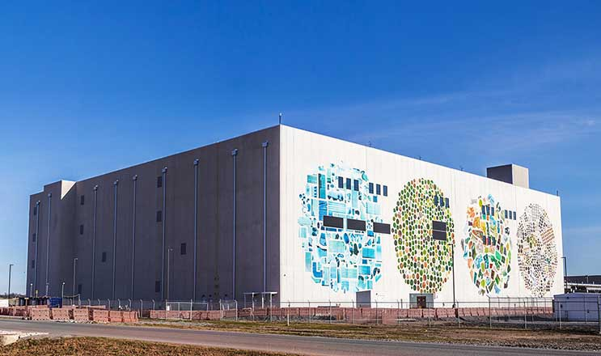
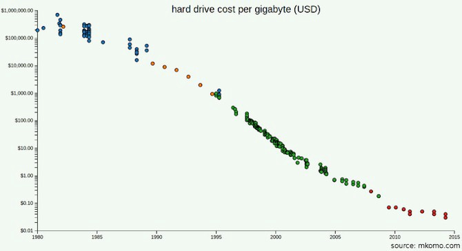

You Are Not Google – Bradfield

# You Are Not Google

[Ozan Onay](https://blog.bradfieldcs.com/@ozanonay)
Jun 7, 2017·7 min read

Software engineers go crazy for the most ridiculous things. We like to think that we’re hyper-rational, but when we have to choose a technology, we end up in a kind of frenzy — bouncing from one person’s Hacker News comment to another’s blog post until, in a stupor, we float helplessly toward the brightest light and lay prone in front of it, oblivious to what we were looking for in the first place.

This is not how rational people make decisions, but it *is* how software engineers decide to use MapReduce.

As Joe Hellerstein sideranted to [his undergrad databases class](https://archive.org/details/ucberkeley_webcast_NSKvCVFmk2E) (54 min in):

> The thing is there’s like 5 companies in the world that run jobs that big. For everybody else… you’re doing all this I/O for fault tolerance that you didn’t really need. People got kinda Google mania in the 2000s: “we’ll do everything the way Google does because we also run the world’s largest internet data service” [tilts head sideways and waits for laughter]

How many stories are your data center buildings? Google chose to stop at 4, for this one in Mayes County, Oklahoma.

Having more fault tolerance than you need might sound fine, but consider the cost: not only would you be doing much more I/O, you might be switching from a mature system—with stuff like transactions, indexes, and query optimizers—to something relatively threadbare. What a [major step backwards](https://homes.cs.washington.edu/~billhowe/mapreduce_a_major_step_backwards.html). How many Hadoop users make these tradeoffs consciously? How many of those users make these tradeoffs wisely?

MapReduce/Hadoop is a soft target at this point because even the cargo culters have realized that the planes ain’t en route. But the same observation can be made more broadly: if you’re using a technology that originated at a large company, but your use case is very different, it’s unlikely that you arrived there deliberately; no, it’s more likely you got there through a ritualistic belief that imitating the giants would bring the same riches.

Ok, so yes: this is another “don’t cargo cult” article. But wait! I have a helpful checklist for you, one you can use to make better decisions.

#### Cool Tech? UNPHAT.

Next time you find yourself Googling some cool new technology to (re)build your architecture around, I urge you to stop and follow **UNPHAT** instead:

1. 1.Don’t even start considering solutions until you **Understand** the problem. Your goal should be to “solve” the problem mostly within the *problem* domain, not the solution domain.

2. 2.**eNumerate **multiple candidate solutions. Don’t just start prodding at your favorite!

3. 3.Consider a candidate solution, then**  **read the** Paper** if there is one.

4. 4.Determine the** Historical context** in which the candidate solution was designed or developed.

5. 5.Weigh **Advantages** against disadvantages. *Determine what was de-prioritized* to achieve what *was *prioritized.

6. 6.**Think!** Soberly and humbly ponder how well this solution fits your problem. *What fact would need to be different for you to change your mind? *For instance, how much smaller would the data need to be before you’d elect *not* to use Hadoop?

#### You Are Also Not Amazon

It’s pretty straightforward to apply UNPHAT. Consider my recent conversation with a company that briefly considered using Cassandra for a read-heavy workflow over data that was loaded in nightly:

Having read the Dynamo paper, and knowing Cassandra to be a close derivative, I understood that these distributed databases prioritize *write availability* (Amazon wanted the “add to cart” action to never fail). I also appreciated that they did this by compromising consistency, as well as basically every feature present in a traditional RDBMS. But the company I was speaking with *did not *need to prioritize write availability since the access pattern called for one big write per day.

Amazon sells a lot of stuff. If “add to cart” occasionally failed, they would lose a lot of money. Is your use case the same?

This company considered Cassandra because the PostgreSQL query in question was taking minutes, which they figured was a hardware limitation. After a few questions, we determined that the table was around 50 million rows and 80 bytes wide, so would take around 5 seconds to to be read in its entirety off SSD, if a full FileScan were needed. That’s slow, but it’s 2 orders of magnitudes faster than the actual query.

At this point, I really wanted to ask more questions (understand the problem!) and had started weighing up about 5 strategies for when the problem grew (enumerate multiple candidate solutions!), but it was already pretty clear that Cassandra would have been the wrong solution entirely. All they needed was some patient tuning, perhaps re-modeling some of the data, *maybe* (but probably not) another technology choice… but certainly not the high-write availability key value store that Amazon created for its shopping cart!

#### Furthermore, You Are Not LinkedIn

I was surprised to discover that one student’s company had chosen to architect their system around Kafka. This was surprising because, as far as I could tell, their business processed just a few dozen very high value transactions per day—perhaps a few hundred on a good day. *At this throughput, the primary datastore could be a human writing into a physical book.*

In comparison, Kafka was designed to handle the throughput of all the analytics events at LinkedIn: a monumental number. Even a couple of years ago, this amounted to [around 1 trillion events per day, with peaks of over 10 million messages per second](https://engineering.linkedin.com/kafka/running-kafka-scale). I understand that Kafka is still useful for lower throughput workloads, but 10 orders of magnitude lower?

The sun, while massive, is only 6 orders of magnitude larger than earth.

Perhaps the engineers really *did* make an informed decision based on their expected needs and a good understanding of the rationale of Kafka. But my guess is that they fed off the community’s (generally justifiable) enthusiasm around Kafka and put little thought into whether it was the right fit for the job. I mean… 10 orders of magnitude!

#### You Are Not Amazon, Again

More popular than Amazon’s distributed datastore is the architectural pattern they credit with enabling them to scale: service-oriented architecture. As Werner Vogels pointed out in [this 2006 interview by Jim Gray](https://queue.acm.org/detail.cfm?id=1142065), Amazon realized in 2001 that they were struggling to scale their front end, and that a service-oriented architecture ended up helping. This sentiment reverberated from one engineer to another, until startups with just a few engineers and barely any users started splintering their brochureware app into nanoservices.

But by the time Amazon decided to move to SOA, [they had around 7,800 employees and did over $3 billion in sales](http://media.corporate-ir.net/media_files/irol/97/97664/reports/2001annualreport.pdf).

The Bill Graham Auditorium in San Francisco has capacity for 7,000 people. Amazon had around 7,800 employees when it moved to SOA.

That’s not to say you should hold off on SOA until you reach the 7,800 employee mark… just, *think*  *for yourself*. Is it the best solution to your problem? What is your problem exactly, and what are other ways you could solve it?

If you tell me that your 50-person engineering organization would grind to a halt without SOA, I’m going to wonder why so many larger companies do just fine with a large but well-organized single application.

#### Even Google Is Not Google

Use of large scale dataflow engines like Hadoop and Spark can be particularly funny: very often a traditional DBMS is better suited to the workload, and sometimes the volume of data is so small that it could even fit *in memory. *Did you know you can buy a terabyte of RAM for around $10,000? Even if you had a billion users, this would give you 1kB *of RAM* per user to work with.

Perhaps this isn’t enough for your workload, and you will need to read and write back to disk. But do you need to read and write back to literally thousands of disks? How much data do you have exactly? GFS and MapReduce were created to deal with the problem of computing over *the entire web*, such as… rebuilding a search index over *the entire web*.

Hard drives prices are now much lower than they were in 2003, the year the GFS paper was published.

Perhaps you have read the GFS and MapReduce papers and appreciate that part of the problem for Google wasn’t capacity but throughput: they distributed storage because it was taking too long to stream bytes off disk. But what’s the throughput of the devices you’ll be using in 2017? Considering that you won’t need nearly as many of them as Google did, can you just buy better ones? What would it cost you to use SSDs?

Maybe you expect to scale. But have you done the math? Are you likely to accumulate data faster than the rate at which SSD prices will go down? How much would your business need to grow before all your data would no longer fit on one machine? As of 2016, Stack Exchange served 200 million requests per day, [backed by just four SQL servers](https://nickcraver.com/blog/2016/02/17/stack-overflow-the-architecture-2016-edition/): a primary for Stack Overflow, a primary for everything else, and two replicas.

Again, you may go through a process like UNPHAT and still decide to use Hadoop or Spark. The decision may even be the right one. What’s important is that you *actually use the right tool for the job*. Google knows this well: once they decided that MapReduce wasn’t the right tool for building the index, they stopped using it.

#### First, Understand the Problem

My message isn’t new, but maybe it’s the version that speaks to you, or maybe UNPHAT is memorable enough for you to apply it. If not, you might try Rich Hickey’s talk [Hammock Driven Development](https://www.youtube.com/watch?v=f84n5oFoZBc), or the Polya book [*How to Solve It*](https://www.amazon.com/How-Solve-Mathematical-Princeton-Science/dp/069111966X), or Hamming’s course [*The Art of Doing Science and Engineering*](https://www.youtube.com/playlist?list=PL2FF649D0C4407B30). What we’re all imploring you to do is to **think**! And to actually understand the problem you are trying to solve. In Polya’s galvanic words:

> It is foolish to answer a question that you do not understand. It is sad to work for an end that you do not desire.