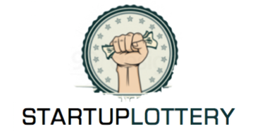
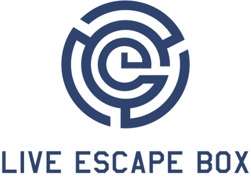
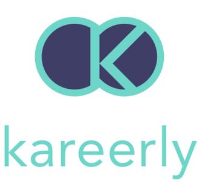
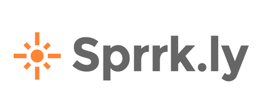

You don't need to be a coder

# Build software by pointing and clicking

##

You don't need to be a coder
See what you can do!

###

Bubble is a powerful general-purpose visual framework for creating web applications.

##

Built on Bubble

Join [126,447 builders](https://bubble.is/community) and build software without code.

Our users have built marketplaces, social networks, CRMs, database management apps, etc.

Fun fact: Bubble is [built on Bubble](https://bubble.is/page?type=page&name=index&id=meta_public&tab=tabs-1).

The Startup Lottery is a startup idea competition. 100 people chip in €50 and the best idea gets the €5,000.

ValueMyPlace is a set of data-analytic and client on-boarding tools built for the UK Property Industry, that draw on millions of pricing data points.

Live Escape Box is the first gift boxes that gathers the best escape games of France, with more than 250 partner rooms for you to play!

QritiQ is a private community of designers sharing their work and collecting constructive feedback.

Kareerly is an Airbnb for career exploration. We connect career seekers with professionals to give them an up close view to any career they want.

Sprrk.ly is quick micro-survey creator. A bit like Survey Monkey, but all about images. People can answer in seconds, whilst waiting in the queue for the supermarket checkout.

Design HVAC Experts processes all aspects of a service based company, from handling new orders to project management, invoicing and even payroll (case study).

Qoins helps people pay off their debt with the spare change from bank transactions. For example, spending $5.35 would send $0.65 towards paying off debt.

RefR autopilots your social media with personalised curation. The magic happens when the content we curate starts generating leads for our users.

Usercard is a directory for social network usernames, built to make finding total social presences a reliable experience.

BubbleWits uses the Bubble platform to build beautiful, fully functional web and mobile apps a few times faster and less costly.

The Startup Lottery is a startup idea competition. 100 people chip in €50 and the best idea gets the €5,000.

ValueMyPlace is a set of data-analytic and client on-boarding tools built for the UK Property Industry, that draw on millions of pricing data points.

Live Escape Box is the first gift boxes that gathers the best escape games of France, with more than 250 partner rooms for you to play!