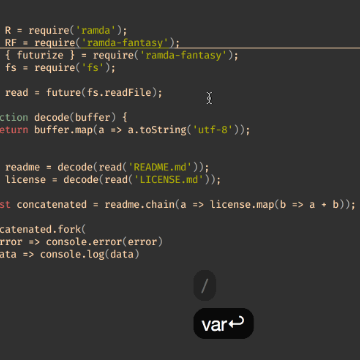

You don’t need more than one cursor in vim – Christoph Hermann – Medium

You don’t need more than one cursor in vim – Christoph Hermann – Medium

https://medium.com/@schtoeffel/you-don-t-need-more-than-one-cursor-in-vim-2c44117d51db

Sublime text first introduced multiple cursor editing (as far as I know). Meaning editing code at multiple positions at the same time…