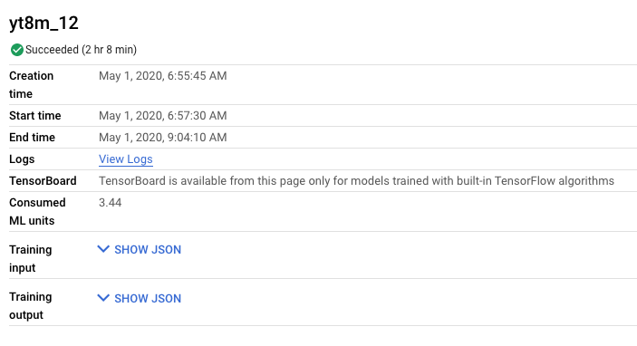
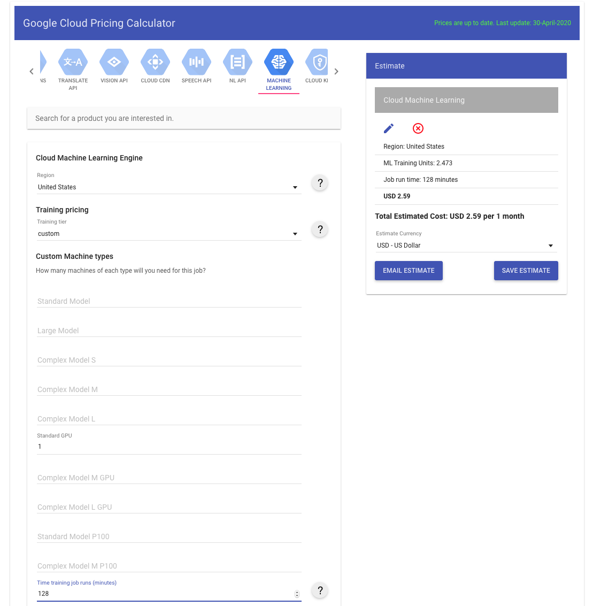
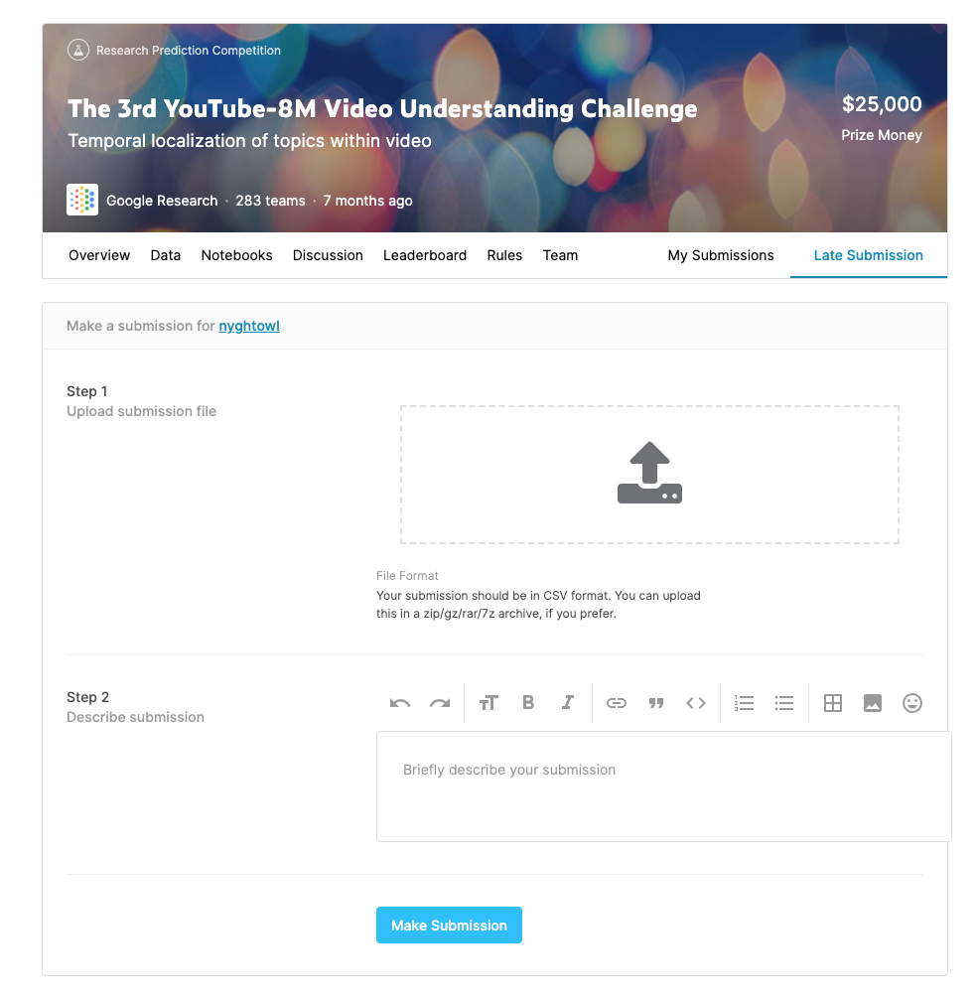
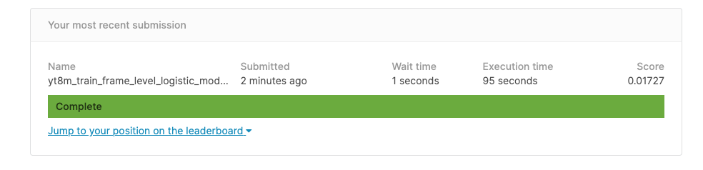
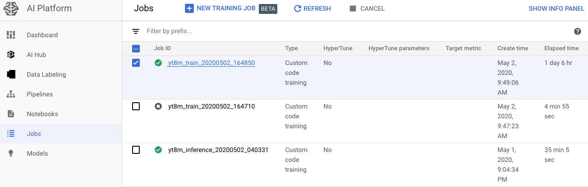
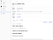
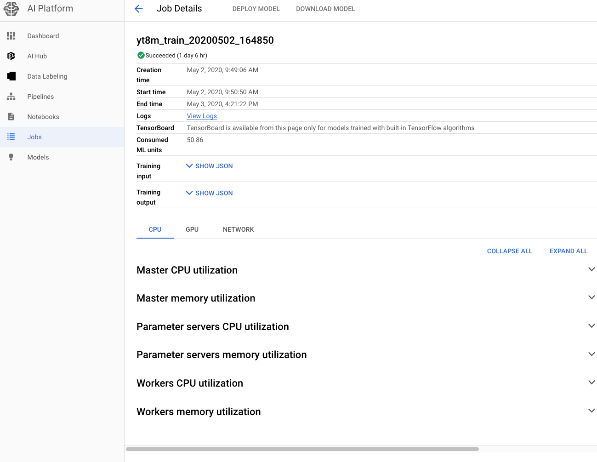
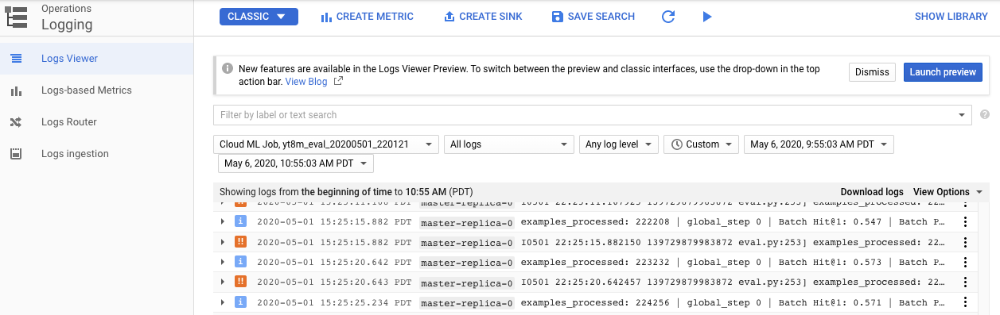

YouTube-8M on AI Platform - Google Cloud - Community - Medium

# YouTube-8M on AI Platform

[Warrick](https://medium.com/@nyghtowl?source=post_page-----f0a0f8688ce9----------------------)

[May 8](https://medium.com/google-cloud/youtube-8m-on-ai-platform-f0a0f8688ce9?source=post_page-----f0a0f8688ce9----------------------) · 10 min read

Continuing the YouTube-8M exploration and blog series, this post walks through how to use AI Platform to train, evaluate and run predictions for the this dataset. Not surprising, it sets up servers faster than the server I manually configured.

The posts prior to this one provide an overview of the YouTube-8M project, data and computer vision modeling. This research has been used to further computer vision in relation to video datasets over the last several years.

Below, steps through how to setup and run the example code provided by the project on Cloud AI Platform as well as how to monitor it. There are time comparisons to my previous setup and I also include costs for each job.

# AI Platform

AI Platform is a managed service that makes it easy to spin up configured servers and train machine learning models on Cloud. You code what you want to run using TensorFlow Keras or TensorFlow Estimator, choose the machine type and then run it on AI Platform. The platform will handle configuration, and spinning up and down the servers as needed to run your code. You can train and run predictions off the platform.

# Getting Started

There are a couple setup steps to get started using AI Platform with YouTube-8M. You have to enable the API, setup software on the computer/server where you will run commands to engage with the platform, download the codebase and make the data accessible.

## API

Enable the Google AI Platform API in your GC console.

Setup local environment variables that you need for the job you are going to run.

BUCKET_NAME=[*Name of the bucket for data*]JOB_NAME=[*Name for the job that will run in AI Platform*]

## Software

Wherever you plan to run the commands to spin up your Cloud AI Platform jobs, makes sure to have the following installed:

- [Google Cloud Platform account setup and configured](https://nyghtowl.com/here-we-go-again-gcp-setup-cli-access-ff37fb539a6a)
- [Python 3.6+ installed](https://nyghtowl.com/first-contact-cloud-compute-engine-virtual-machine-setup-8d17ec55cfdf)
- [TensorFlow 1.14 installed](https://nyghtowl.com/first-contact-cloud-compute-engine-virtual-machine-setup-8d17ec55cfdf)

Check the versions that are installed.
python --version
python -c 'import tensorflow as tf; print(tf.__version__)'Data

## Codebase

Download the YouTube-8M codebase onto your computer.
cd ~/yt8m/code && git clone https://github.com/google/youtube-8m.git
Run commands from this directory level.
~/yt8m/code

## Data

You need the data to do the modeling and this project fortunately already has the data processed and compressed into TFRecords. This [blog post](https://nyghtowl.com/youtube-8m-dataset-c2ee9c79d136) provides more information on the dataset. In order to use this data with AI Platform, your dataset needs to be accessible in something like Cloud Storage or the equivalent that AI Platform can access.

***Input Data***

Fortunately the dataset is already publicly available on Cloud Storage so you can access the different files using *gsutil*. You can setup environment variables pointing to these public buckets.

TRAIN_BUCKET='gs://us.data.yt8m.org/2/frame/train/train*.tfrecord'
VALIDATE_BUCKET='gs://us.data.yt8m.org/3/frame/validate/validate*.tfrecord'
TEST_BUCKET='gs://us.data.yt8m.org/3/frame/test/test*.tfrecord'

You can also put your data into your project’s Cloud Storage. This command enables pushes from your local files to a bucket.

gsutil -q -m cp -r [*LOCAL FOLDER PATH*] gs://[*TRAIN BUCKET NAME*]

Then you can use the your bucket address for the data inputs in the commands below. Note, I used -q for quiet to keep it from listing each file as it loaded and -m to make it parallel and faster to upload.

***Output Data***

Create a bucket or buckets to hold output data like models, logs and any other files generated from your jobs.

Commands you can use to make an output bucket. You can make variations.
OUTPUT_BUCKET=gs://${USER}_yt8m_train_bucketgsutil mb $OUTPUT_BUCKET

## Estimating Cost | Pricing

To understand what running a job like this on AI Platform will cost, the [AI & ML Products Resources link](https://cloud.google.com/ai-platform/training/pricing) has a great rundown on pricing. Below I step through the machine configuration that was used on AI Platform and how the cost is calculated

**Machine Configuration**

To see how YouTube-8M has defined the cloud setup, checkout the [cloudml-gpu.yaml](https://github.com/google/youtube-8m/blob/master/cloudml-gpu.yaml)for the configuration details and to make changes. The current configuration is set to a* CUSTOM scaleTier* and a *standard_gpu master Type. *This is actually the same as the* BASIC_GPU scaleTier*.

A *standard_gpu* type is a standard machine type using a Compute Engine with an n1-standard-8 (8 vCPUS, 30GB memory, 257 TB max total PD storage size) and includes 1 NVIDIA Tesla K80 GPU. In comparison before using AI Platform, I manually configured a n1-standard-8 that does not include a GPU. It took several days to manually configure the server vs less than 10 minutes to spin up an instance on AI Platform.

This [page](https://cloud.google.com/ai-platform/training/docs/machine-types) provides more details about machine types. Note, you can change the configuration in AI Platform to use multiple GPUs as well as to split and run training over multiple workers/servers. Adding more GPUs and workers can potentially reduce training time when you have more complex models (more calculations) and large datasets to process. However, for simpler models or less data it may not be much faster.

**Cost Breakdown**

According to the pricing resource guide, the *standard_gpu* type is $0.8300 price per hour based on base price and number of training units. For this machine type, the price is based on 1.6939 training units. The base price per hour for one training unit is $0.49 ($0.83/1.6939) or $0.0081 per minute.

Running a job on AI Platform charges in 1 minute increments and there is a minimum of 10 minutes per job so it would be a $0.08 minimum with the current configuration. Note all this is as of the date of this posting and in the Americas location.

Use this equation, to calculate the training cost using *Consumed ML units*.
Consumed ML units * base price

*Consume ML units* can be found in the *Job Details *page and shows how many machine learning training units are being used with the duration of the job factored in.

An example job using 3.44 ML units (128 mins) with a base prices of $0.49.
3.44 * $0.49 = $1.69

This [pricing calculator](https://cloud.google.com/products/calculator) can also help with the cost estimation. I found it runs a little high which can be helpful and slightly satisfactory when the actual cost is lower. Choose *Machine Learning *from the list of products (find the logo like at the top of this post) and fill out the form as it relates to your setup. Click on *Add Estimate* to get the results on the right. This is how my example looks.

I’ve stepped through pricing above because I include about what it cost to run the job in each example in the next sections. And let’s face it, that is a key question when determining what you are using.

# Train

Once you have your local terminal and data setup, you can start thinking of training the model. Training involves figuring out the algorithm you want to use and coding up that model and then running the data through the algorithm to create a model specific to this problem.

I used the example code YouTube-8M project which includes frame-level logistic regression and deep bag of frame model options. This [previous post](https://medium.com/@nyghtowl/youtube-8m-training-inference-eb37ac5f708f) provides an overview of the models.

## Frame-level

For the Frame-level model, run the following commands from your terminal.

JOB_NAME_FRAME_TRAIN=yt8m_train_frame_$(date +%Y%m%d_%H%M%S)gcloud --verbosity=debug ai-platform jobs submit training \

$JOB_NAME_FRAME_TRAIN --package-path=youtube-8m \
--module-name=youtube-8m.train \
--staging-bucket=$OUTPUT_BUCKET \
--config=youtube-8m/cloudml-gpu.yaml \
-- --train_data_pattern=$TRAIN_BUCKET \
--frame_features --model=FrameLevelLogisticModel \
--feature_names="rgb,audio" --feature_sizes="1024,128" \
--train_dir=$OUTPUT_BUCKET/$JOB_NAME_FRAME_TRAIN --start_new_model

Note, the empty `--` flag marks the end of the `gcloud and ai-platform` specific flags and the start of the `ARGS / flags`that you want to pass to the application. Checkout this [link](https://cloud.google.com/sdk/gcloud/reference/beta/ai-platform/jobs/submit/training) for more information on the ai-platform flags.

The above command ran in about 13 hours and cost about $11. It was not an improvement over my CPU only server.

## DBoF | Deep Bag of Frame

For the DBoF model, run this command to train.

JOB_NAME_DBOF_TRAIN=yt8m_train_dbof_$(date +%Y%m%d_%H%M%S)gcloud --verbosity=debug ai-platform jobs submit training \

$JOB_NAME_DBOF_TRAIN --package-path=youtube-8m \
--module-name=youtube-8m.train \
--staging-bucket=$OUTPUT_BUCKET \
--config=youtube-8m/cloudml-gpu.yaml \
-- --train_data_pattern=$TRAIN_BUCKET \
--frame_features --model=DbofModel --feature_names='rgb,audio' \
--feature_sizes='1024,128' \
--train_dir=$OUTPUT_BUCKET/$JOB_NAME_DBOF_TRAIN --start_new_model

The above command ran in about 33 hours whereas I was not able to get the training to complete on the CPU server because it did not have enough processing power. This job cost about $28.

# Evaluate

In order to improve the model’s performance, it’s important to test the model. This is an opportunity to verify how the model generalized and tune it to improve it.

## Frame-level

Use these commands to evaluate the frame-level model.

JOB_NAME_FRAME_EVAL=yt8m_eval_$(date +%Y%m%d_%H%M%S)gcloud --verbosity=debug ai-platform jobs \

submit training $JOB_NAME_FRAME_EVAL \
--package-path=youtube-8m --module-name=youtube-8m.eval \
--staging-bucket=$OUTPUT_BUCKET \
--config=youtube-8m/cloudml-gpu.yaml \
-- --eval_data_pattern=$VALIDATE_BUCKET \
--frame_features --model=FrameLevelLogisticModel \
--feature_names='rgb,audio' --feature_sizes='1024,128' \
--train_dir=$OUTPUT_BUCKET/$JOB_NAME_FRAME_TRAIN --segment_labels \
--run_once=True

The above command ran in 24 minutes and 52 seconds and the job cost about $0.27. This actually took a couple minutes more than the CPU only server. This is a good example of where depending on how large the dataset is and how complex the model, you may not need as much compute power to get the job done. Plus, using a GPU or TPU becomes more beneficial when you have more data to process.

## DBoF

Use this command to evaluate the DBoF model.

JOB_NAME_DBOF_EVAL=yt8m_eval_dbof_$(date +%Y%m%d_%H%M%S)gcloud --verbosity=debug ai-platform jobs \

submit training $JOB_NAME_DBOF_EVAL \
--package-path=youtube-8m --module-name=youtube-8m.eval \
--staging-bucket=$OUTPUT_BUCKET \
--config=youtube-8m/cloudml-gpu.yaml \
-- --eval_data_pattern=$VALIDATE_BUCKET \
--frame_features --model=DbofModel --feature_names='rgb,audio' \
--feature_sizes='1024,128' \
--train_dir=$OUTPUT_BUCKET/$JOB_NAME_DBOF_TRAIN --segment_labels \
--run_once=True

The above command ran in 1 hour and 20 minutes and cost about $1.03. There is nothing to compare to my CPU only server since I wasn’t able to complete training on DBoF.

# Predict | Inference

Once the model performs at a level that meets your threshold, setup the model to run inference. This code base is built to output a prediction file to submit to Kaggle. You can submit this file to Kaggle’s competition to get an idea of how you preformed.

## Frame-level

Use this command to run inference on the frame-level model and get predictions.

JOB_NAME_FRAME_TEST=yt8m_inference_frame_$(date +%Y%m%d_%H%M%S);gcloud --verbosity=debug ai-platform jobs \

submit training $JOB_NAME_FRAME_TEST \
--package-path=youtube-8m --module-name=youtube-8m.inference \
--staging-bucket=$OUTPUT_BUCKET \
--config=youtube-8m/cloudml-gpu.yaml \
-- --input_data_pattern=$TEST_BUCKET \
--train_dir=$OUTPUT_BUCKET/$JOB_NAME_FRAME_TRAIN \
--segment_labels \
--output_file=$OUTPUT_BUCKET/$JOB_NAME_FRAME_TEST/predictions.csv

The above command ran in 35minutes and 5 seconds and cost about $0.41. This was twice the time of my CPU only server example. Granted we ran a one off result and usually you will put a model in production and run data in batches or streaming. Still the compute needed for predictions is usually less than for training.

## DBoF

Use this command to run inference on the DBoF model and get predictions.

JOB_NAME_DBOF_TEST=yt8m_inference_dbof_$(date +%Y%m%d_%H%M%S);gcloud --verbosity=debug ai-platform jobs \

submit training $JOB_NAME_DBOF_TEST \
--package-path=youtube-8m --module-name=youtube-8m.inference \
--staging-bucket=$OUTPUT_BUCKET \
--config=youtube-8m/cloudml-gpu.yaml \
-- --input_data_pattern=$TEST_BUCKET \
--train_dir=$OUTPUT_BUCKET/$JOB_NAME_DBOF_TRAIN --segment_labels \
--output_file=$OUTPUT_BUCKET/$JOB_NAME_DBOF_TEST/predictions.csv
The above command ran in about 43 minutes and 17 seconds and cost about $0.51.

## Kaggle Analysis

One you’ve got the *predictions.csv* file you can submit it to [Kaggle site](https://www.kaggle.com/c/youtube8m-2019/submit) under *Late Submission*.

It will give you a score and show your position on the leader board.

Both frame-level and DBoF examples I submitted to Kaggle scored about the same. It outputs the above screen shot. This is not a surprising result considering this is public code and ones I expect many have tried.

# AI Platform Job Status & Logs

There are a couple different ways to observe how the jobs are progressing on AI Platform when you are running them as well as to get insights after they are done. You can check out the progress in your terminal or in Google Cloud Console.

## Local Terminal

After running these commands you’ll get a status that the job is spinning up and commands and links to view more about status.

The following describes the current status of your job in your terminal:
gcloud ai-platform jobs describe $JOB_NAME

One output from this is state. There is also a command to stream the logs in your terminal.

gcloud ai-platform jobs stream-logs $JOB_NAME

## Google Cloud Console

In Google Cloud Console, I was able to observe the performance of the training, evaluation and inference jobs in *Jobs* under *AI Platform *section.

You can see these jobs are already complete and you can see how long they ran. The *Elapsed time* is updated as the job is running.

Click on the job to get more details on its performance.

Also, you can get detailed log information under *(Operations) Logging* and the *Logs Viewer*.

I like to keep windows with the AI Platform Jobs and the Log Viewer open to track progress and monitor for any errors.

## Cancel a Job

If there is a job you need to cancel then you can do that from the console or from your terminal.

gcloud ai-platform jobs cancel $JOB_NAME

Once the job is complete, it will store the output files to the path you gave it and terminate the servers.

# Wrap up

This was an overview of running the YouTube-8M computer vision dataset on AI Platform. You can see how to setup to run AI Platform, how to estimate costs and roughly what they look like for this dataset and example models. It steps through how train, evaluate and run predictions on the sample TensorFlow code base that is provided as well as how to submit those predictions to the previous Kaggle competition. If you want to experiment with AI Platform and computer vision this is an example you can use.