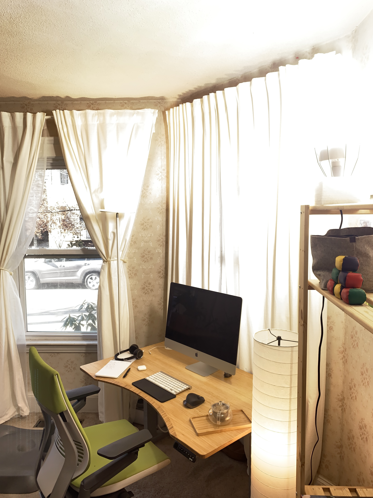
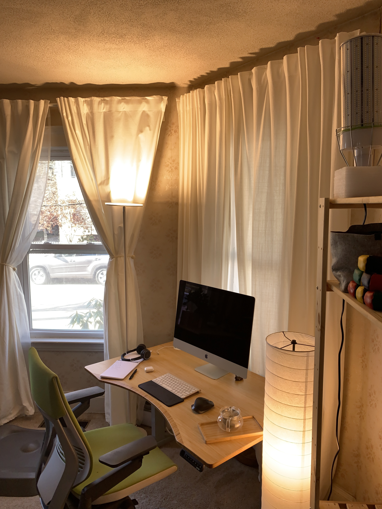
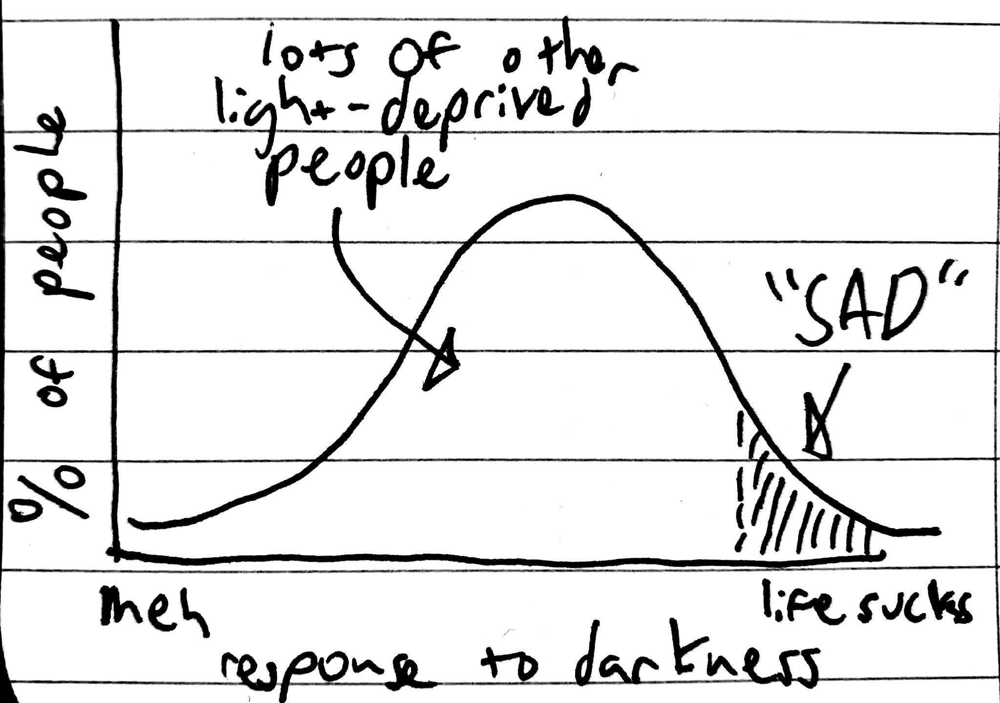
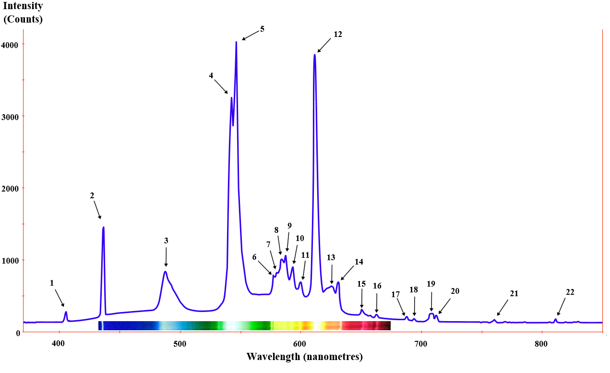
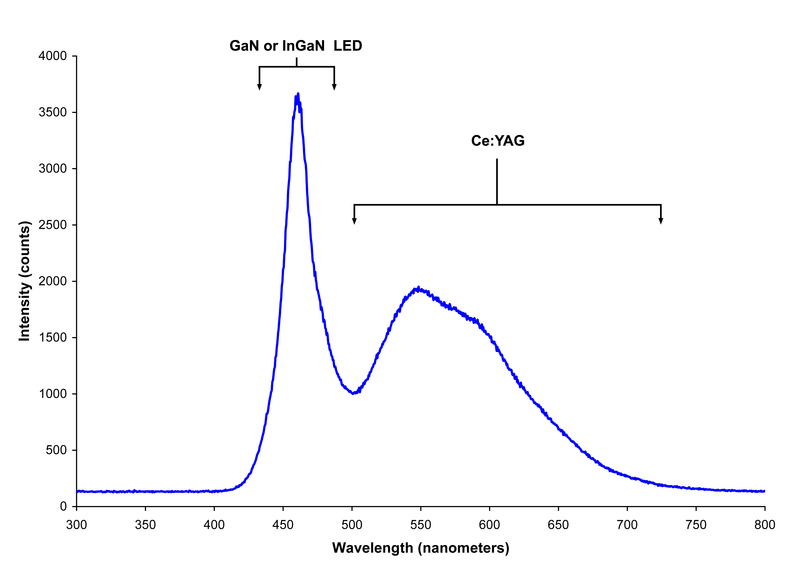

Your room can be as bright as the outdoors | benkuhn.net

 [home](https://www.benkuhn.net/) • [read more](https://www.benkuhn.net/more/) • [about](https://www.benkuhn.net/about/) • [blogroll](https://www.benkuhn.net/blogroll/)

# Your room can be as bright as the outdoors

November 2019

This is my first winter in Boston after coming back from Senegal. The sun sets at around 4:15 now, and it’s suddenly become *extremely* salient how hard it is for me to focus after dark.

I’d vaguely noticed this in the past, and dealt with it by shifting my sleep schedule earlier (or just being unproductive). But I’m waking up around 6:30 now and I already struggle to stay up for evening events. So finally, inspired by [some](https://meaningness.com/metablog/sad-light-led-lux)  [blog](https://www.lesswrong.com/posts/zsG9yKcriht2doRhM/inadequacy-and-modesty)  [posts](https://www.lesswrong.com/posts/hC2NFsuf5anuGadFm/how-to-build-a-lumenator), I decided to give up on chasing natural sunlight and make my own instead.

I bought an extremely bright “corn cob” style bulb. It emits as much light as about 40 incandescents, and produces enough waste heat that it needs an internal cooling fan to dissipate it. I put it next to my desk, in my peripheral vision (it’s somewhat uncomfortable to look at directly). According to my questionably-accurate iPhone light meter, its reflection off the curtains in front of me is brighter than the actual sunlight coming in from the outdoors (at 600 lux), and overall light levels in my interior went from 50 to 400 lux (“sunrise or sunset on a clear day”). ([source](https://en.wikipedia.org/wiki/Lux)).

The effect was huge: I became dramatically more productive between 3:30pm and whenever I turned off the light. Instead of having a strong urge to stop working whenever it got dark out, I was able to keep working my normal summer schedule, stopping just before dinner. I estimate the lamp bought me between half an hour and two hours a day, depending on how overcast it was.

To try to capture the difference, I used a manual camera app to take before and after photos of my desk with the same exposure and white balance. The phone camera doesn’t really capture the full effect since the dynamic range is so small, but hopefully it conveys a little bit of the amazingness:

Drag the white triangle to compare.

Everyone who’s visited my house after I installed the bulb has remarked on how cheery our living room now is, some of them before noticing the light. My partner and several friends are buying their own.

For reference, here’s the stuff I bought (note that the bulb is on sale today):

- [The cheapest-per-lumen “corn bulb” I could find on Amazon](https://amzn.to/35uO93c), $100 for 30,000 lumens. Note that this one has a built-in cooling fan that runs decently loud (45db at 1m according to my questionably-accurate iPhone sound level meter). If that bothers you (it kinda bothers me), you can buy two of the 120w ones, which don’t mention fans in the description.
- [Basic E39 “mogul” fixture](https://amzn.to/2OooCTG) rated for 250 watts. Note that the clamp does nothing with this bulb because it’s too heavy—just take it off.

Originally I stabilized the fixture by wedging it inside a piece of the lamp’s packing foam (see picture), but today I realized that I could rest the metal guard inside an empty 2lb yogurt container instead, which is better because it leaves room for the power cord to run.

- If you want to use the bulb as an overhead light or existing lamp fixture, instead try [these E26 to E39 adapters](https://amzn.to/33tSt1c). (Note that the bulb is large enough that it may not fit in many existing fixtures.)

* * *

⁂
Why doesn’t everybody do this?!

All the blog posts were written by/about people who were described as having “crippling” seasonal depression. I’ve never been depressed, which is why it took me so long to give it a try (or even notice the correlation between light and productivity).

In retrospect, that was silly. “Seasonal affect disorder” makes it sound like it’s a discrete thing that you have or don’t, but probably everyone has noticed they’re more lethargic on cloudy days. A better model might be that seasonal depression is just the tail end of a curve in how people respond to light:

Typical indoor light levels run from [100-500 lux](https://www.engineeringtoolbox.com/light-level-rooms-d_708.html), which *at the high end* is about as bright as sunrise outdoors, and about 100x dimmer than [daylight](https://en.wikipedia.org/wiki/Daylight). Other than “we’ve been doing it for a while,” there seems to be no reason to expect that being in a 100x dimmer environment all day *wouldn’t* be awful. Indoor darkness seems to be one of those things that we don’t question only because it’s been that way forever.

Until recently, though, questioning it would have been somewhat academic, because it was too expensive to buy (and power) enough bulbs to do anything about it. My bulb is an LED bulb, for which cost per lumen has been falling about 20% per year for the last 50 years ([source](https://en.wikipedia.org/wiki/Haitz%27s_law)). LEDs only passed fluorescents in efficiency recently, but they’re still dropping fast. 10 years ago a bulb as bright as mine might have cost $1,000 instead of $100.

But as of recently, it’s totally practical to fill your entire house with light that’s as bright as full daylight. Ambient daylight in the shade is about 10k lux, or 10k lumens per square meter. For a 70 m2 apartment, that would be 700k lumens. The bulb I bought is $100 for 35k lumens, so $2k would buy sunlight for the entire apartment. (In another 10 years, if LEDs don’t hit physical limits, it’ll be $200!)

* * *

⁂
To close, some ultra-bright-lamp FAQs:

- **How is this different from “light therapy lamps”?** Light therapy lamps are *weak*. They only give you a reasonable amount of light if you point them directly at your face from around a foot away. A high-power corn bulb makes your entire room much brighter, thus providing a much better simulation of daylight. See [“You need more lumens.”](https://meaningness.com/metablog/sad-light-lumens)
- **Isn’t this expensive to run?** It draws about 2 kWh per day (assuming 8h of usage), which costs about $0.30 at typical rates. This is comparable to one day of a modern fridge or one load of laundry. Power is cheap, folks!
- **Isn’t using this much power bad for the planet?** Coal has a carbon intensity of about 1 kg CO2e / kWh ([source](http://shrinkthatfootprint.com/electricity-emissions-around-the-world)), so one coal-powered lamp-day produces 2 kg, approximately one-third to one-half of a cheeseburger ([source](http://www.openthefuture.com/cheeseburger_CF.html)).
- **Isn’t 5000K very “cold” light?** “Cold” lights (above 2700k, the typical incandescent color temperature) have a bad reputation, but 5000K is actually less cold than the sun (which is about 5500-6500K), which clearly does not have a bad reputation. My totally non-validated theory is that people don’t like cold light because most cold lights (historically, mostly fluorescents) have much worse [color rendering](https://en.wikipedia.org/wiki/Color_rendering_index) than incandescents: that is, they emit light only in discrete parts of the visible spectrum, which changes the relative appearance of colors and makes everything look weird. For instance, compare the two example spectra of a fluorescent vs. an incandescent:

Left: fluorescent ([source](https://commons.wikimedia.org/wiki/File:Fluorescent_lighting_spectrum_peaks_labeled_with_colored_peaks_added.png)); right: LED ([source](https://commons.wikimedia.org/wiki/File:White_LED.png))

- **Doesn’t it make it hard to sleep?** Yup, bulbs this bright suppress my sleepiness dramatically (that’s partly the point!). I shut it off every day when I’m done working, usually at 6pm, about 3 hours before bedtime.
- **What are the downsides?** The lamp flickers when other current-hungry appliances turn on,[1](https://www.benkuhn.net/lux#fn:wiring) has a loud fan, looks ugly, is hard to set up a nice fixture for, doesn’t have an on/off switch (I just unplug it), and doesn’t make it easy to provide even illumination throughout a space. I’m working on building a DIY ultra-bright lighting setup that I expect to be way more effective on all these dimensions—stay tuned.

* * *

⁂

1. One HN commenter [points out](https://news.ycombinator.com/item?id=21661136) that this may be a problem with my house’s electrical wiring. Thanks! [↩](https://www.benkuhn.net/lux#fnref:wiring)

* * *

Enjoyed this post? Subscribe:

Hello, noscript user! This iframe will give you visual feedback :)

Or follow the [RSS.](https://www.benkuhn.net/rss/) Or comment:

  email me replies

format comments in [markdown](http://daringfireball.net/projects/markdown/syntax).

Hello, noscript user! This iframe will give you visual feedback :)

Steve Bennett

[November 28 at 7 PM](https://www.benkuhn.net/lux#comment-0)

I found it fascinating how different your experience from me. For instance: “but probably everyone has noticed they’re more lethargic on cloudy days” - no, those are the days I feel super energised, full of possibility etc. Whereas really sunny days make me want to hide.

Similarly “there seems to be no reason to expect that being in a 100x dimmer environment all day wouldn’t be awful” - not for me. I pull my blinds down, wish I had better curtains, and even shut my internal doors to minimise the light leaking into my study. Anyway, I love that we are all different :)

Drew

[November 28 at 7 PM](https://www.benkuhn.net/lux#comment-0-0)

Can confirm, this is me too. I love a dark room.

teknopaul

[November 29 at 3 AM](https://www.benkuhn.net/lux#comment-0-1)

I’m much more productive in winter months. Work best at night. I use intense white light to wake myself up, but I prefer the evenings to be like siting by an open fire: red light, low down,

Steve

[November 29 at 4 AM](https://www.benkuhn.net/lux#comment-0-2)

Great article but yes I’ll concur with this thread - I use Philips Hue and have most of the lights fairly dim, with a candle like hue throughout winter. Great atmosphere and makes me very creative.

Ben

[November 29 at 10 AM](https://www.benkuhn.net/lux#comment-0-3)

Same here. I find the premise completely alien. I love working at night when the bright sun isn’t inviting me outside.

 [▽ reply]()

* * *

Jonathan Drkae

[November 28 at 8 PM](https://www.benkuhn.net/lux#comment-1)

check out https://microsunlamps.com/how-a-microsun-works/ as I believe it is a very similar (better?) version

Ben

[November 28 at 10 PM](https://www.benkuhn.net/lux#comment-1-0)

These look prettier, but are 1/5 as bright for twice the price.

 [▽ reply]()

* * *

cdw

[November 28 at 9 PM](https://www.benkuhn.net/lux#comment-2)

“cold lights”: I think there’re two things going on here. 1. People are worried about how lights will mess with their circadian rhythms, and 2. “cool color” means “blue”; “warm color” means “yellow/orange/red”. (Yes, I know this is the opposite of the actual Wien’s law.)

 [▽ reply]()

* * *

Bobby

[November 28 at 10 PM](https://www.benkuhn.net/lux#comment-3)

What is the CRI of the corn bulb? I noticed low-CRI LEDs are much more depressing than high-CRI lights. High CRI lights are virtually indistinguishable from sunlight.

Ben

[November 29 at 7 AM](https://www.benkuhn.net/lux#comment-3-0)

It is allegedly 80 according to the product page–not that I particularly trust CRI measurements from random no-name Amazon sellers…

I do think a higher CRI bulb would be a pretty big improvement, but it seems to be hard to find the combination of high CRI, high temperature and lots of lumens. My coworker got excited by [Yuji high bay lights](https://store.yujiintl.com/products/high-cri-95-high-bay-ufo-led-light-pack-1pcs) but they are ~6x the cost per lumen of the bulb.

Now that the light has transitioned from “random experiment” to “expect to use forever” it’s probably going to be worth it for me though.

 [▽ reply]()

* * *

Lewis Edwards

[November 28 at 11 PM](https://www.benkuhn.net/lux#comment-4)

I’ve been playing with the concept of simulating daylight too. Repurposing the Fresnel lenses from old LCD screens allows you to create fake depth and a much more convincing daylight effect. Highly recommended for this type of project.

 [▽ reply]()

* * *

Leo R. Comerford

[November 28 at 11 PM](https://www.benkuhn.net/lux#comment-5)

See also the worldwide [“epidemic” of myopia](https://www.nature.com/news/the-myopia-boom-1.17120), which may be caused by inadequate light during the day during childhood. Increasing artificial lighting in classrooms is a more realistic alternative to [rebuilding](https://journals.plos.org/plosone/article?id=10.1371/journal.pone.0181772) all of them (see also this [WSJ article](https://www.wsj.com/articles/the-mysterious-spike-in-nearsighted-children-1429543997) to which I no longer have access).

 [▽ reply]()

* * *

Paul Phillips

[November 29 at 2 AM](https://www.benkuhn.net/lux#comment-6)

250W for a light bulb is insane these days.

 [▽ reply]()

* * *

Juhani

[November 29 at 3 AM](https://www.benkuhn.net/lux#comment-7)

I live “a bit” further north, at 60 degrees.

By my experience, you do want a lot of lumen, but at the same time you do want to keep the light pleasant and soft, that means a large illuminating area. An example of such a light in action is a photography light box. To my knowledge you want a high lux, but rather low nit, that seems to be more important than excellent cri. One possibility is to point the high powered light to a (white) ceiling.

 [▽ reply]()

* * *

MattGoldenberg

[November 29 at 8 AM](https://www.benkuhn.net/lux#comment-8)

Has your ability to fall asleep, or sleep quality been impacted at all?

Ben

[November 29 at 9 AM](https://www.benkuhn.net/lux#comment-8-0)

I always turn the light off when I’m done working, about 3h before bed usually. So far, that’s worked fine.

 [▽ reply]()

* * *

Mo

[November 29 at 4 PM](https://www.benkuhn.net/lux#comment-9)

Could you add a graph of the spectrum of non-clouded sunlight?

 [▽ reply]()