Yours for the making - Instructables

# Yours for the making

Instructables is a community for people who like to make things. Come explore, share, and make your next project with us!

## Step-by-step

We make it easy to learn how to make anything, one step at a time. From the stovetop to the workshop, you are sure to be inspired by the awesome projects that are shared everyday.

## Made By You

Instructables are created by you. No matter who you are, we all have secret skills to share. Come join our community of curious makers, innovators, teachers, and life long learners who love to share what they make.

## A Happy Place

Making things makes people happy. We can't prove it, but we know it to be true. Find your happy place, and join one of the friendliest online communities anywhere.

* * *

## Explore Projects

[### Circuits E](https://www.instructables.com/circuits/)

**[Time Measure (Tape Measure Clock)](https://www.instructables.com/id/Time-Measure-Tape-Measure-Clock/)** by [scealux](https://www.instructables.com/member/scealux/) in [Arduino](https://www.instructables.com/circuits/arduino/projects/)

**[Keyboard Cap Micro Watercolor Bots](https://www.instructables.com/id/Keyboard-Cap-Micro-Watercolor-Bots/)** by [smdavee](https://www.instructables.com/member/smdavee/) in [Robots](https://www.instructables.com/circuits/robots/projects/)

[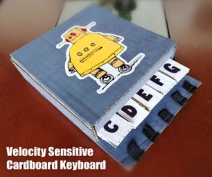](https://www.instructables.com/id/Velocity-Sensitive-Cardboard-Keyboard/)

**[Velocity Sensitive Cardboard Keyboard](https://www.instructables.com/id/Velocity-Sensitive-Cardboard-Keyboard/)** by [i95sarmiento](https://www.instructables.com/member/i95sarmiento/) in [Arduino](https://www.instructables.com/circuits/arduino/projects/)

[### Workshop E](https://www.instructables.com/workshop/)

[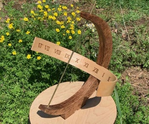](https://www.instructables.com/id/The-Equatorial-Sundial/)

**[The Equatorial Sundial](https://www.instructables.com/id/The-Equatorial-Sundial/)** by [JohnW539](https://www.instructables.com/member/JohnW539/) in [CNC](https://www.instructables.com/workshop/cnc/projects/)

**[Build Your Own Hardwood Built-In Bookcases!](https://www.instructables.com/id/Build-Your-Own-Hardwood-Built-In-Bookcases/)** by [justmightdiy](https://www.instructables.com/member/justmightdiy/) in [Shelves](https://www.instructables.com/workshop/shelves/projects/)

[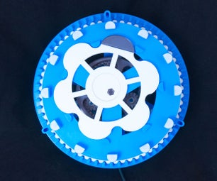](https://www.instructables.com/id/Cycloidal-Gear-Clock/)

**[Cycloidal Gear Clock](https://www.instructables.com/id/Cycloidal-Gear-Clock/)** by [EammonL](https://www.instructables.com/member/EammonL/) in [3D Printing](https://www.instructables.com/workshop/3d-printing/projects/)

[### Craft E](https://www.instructables.com/craft/)

[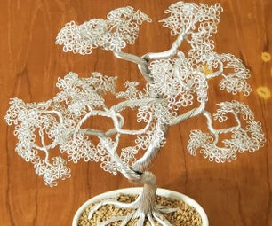](https://www.instructables.com/id/Aluminum-Wire-Tree/)

**[Aluminum Wire Tree](https://www.instructables.com/id/Aluminum-Wire-Tree/)** by [Dan_Makes](https://www.instructables.com/member/Dan_Makes/) in [Art](https://www.instructables.com/craft/art/projects/)

**[How to Sculpt a Coral Reef Mermaid Crown](https://www.instructables.com/id/How-to-Sculpt-a-Coral-Reef-Mermaid-Crown/)** by [RefiningDesigning](https://www.instructables.com/member/RefiningDesigning/) in [Clay](https://www.instructables.com/craft/clay/projects/)

**[Foxy Book-light / Bookmark From Junk Drawer Finds](https://www.instructables.com/id/Foxy-Book-light-Bookmark-From-Junk-Drawer-Finds/)** by [TechnoChic](https://www.instructables.com/member/TechnoChic/) in [Paper](https://www.instructables.com/craft/paper/projects/)

[### Cooking E](https://www.instructables.com/cooking/)

[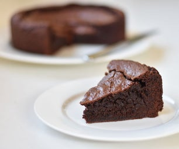](https://www.instructables.com/id/Pantry-Staples-Chocolate-Fudge-Cake/)

**[Pantry Staples Chocolate Fudge Cake](https://www.instructables.com/id/Pantry-Staples-Chocolate-Fudge-Cake/)** by [bakingenvy](https://www.instructables.com/member/bakingenvy/) in [Cake](https://www.instructables.com/cooking/cake/projects/)

[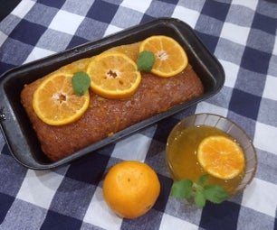](https://www.instructables.com/id/Zesty-Orange-Loaf-Cake/)

**[Zesty Orange Loaf Cake](https://www.instructables.com/id/Zesty-Orange-Loaf-Cake/)** by [sangeetajha](https://www.instructables.com/member/sangeetajha/) in [Cake](https://www.instructables.com/cooking/cake/projects/)

**[Sugared cruffins with triple berry quick-jam](https://www.instructables.com/id/Sugared-Cruffins-With-Triple-Berry-Quick-jam/)** by [PieBaby89](https://www.instructables.com/member/PieBaby89/) in [Bread](https://www.instructables.com/cooking/bread/projects/)

[### Living E](https://www.instructables.com/living/)

[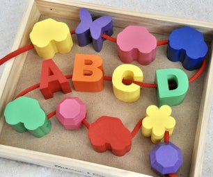](https://www.instructables.com/id/Large-Toy-Beads/)

**[Large Toy Beads](https://www.instructables.com/id/Large-Toy-Beads/)** by [Penolopy Bulnick](https://www.instructables.com/member/Penolopy+Bulnick/) in [Kids](https://www.instructables.com/living/kids/projects/)

[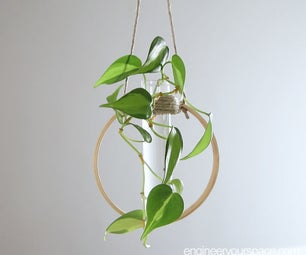](https://www.instructables.com/id/DIY-Test-Tube-Plant-Propagation-Station-Mothers-Da/)

**[DIY Test Tube Plant Propagation Station - Mother's Day Gift](https://www.instructables.com/id/DIY-Test-Tube-Plant-Propagation-Station-Mothers-Da/)** by [EYSpace](https://www.instructables.com/member/EYSpace/) in [Gardening](https://www.instructables.com/living/gardening/projects/)

[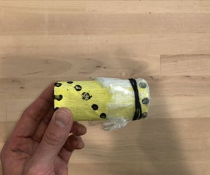](https://www.instructables.com/id/Kazoo-MakerEd-at-Home/)

**[Kazoo](https://www.instructables.com/id/Kazoo-MakerEd-at-Home/)** by [iTeachmakerbus](https://www.instructables.com/member/iTeachmakerbus/) in [Education](https://www.instructables.com/living/education/projects/)

[### Outside E](https://www.instructables.com/outside/)

[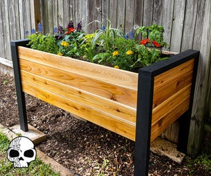](https://www.instructables.com/id/How-Make-a-DIY-Raised-Planter-Box/)

**[How to Make a DIY Raised Planter Box](https://www.instructables.com/id/How-Make-a-DIY-Raised-Planter-Box/)** by [WickedMakers](https://www.instructables.com/member/WickedMakers/) in [Backyard](https://www.instructables.com/outside/backyard/projects/)

[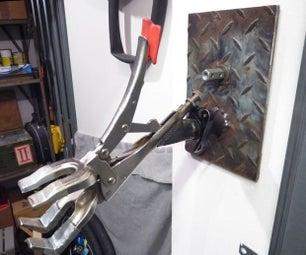](https://www.instructables.com/id/Wall-Mounted-Bike-Repair-Stand-With-Heavy-Duty-Cla/)

**[Wall Mounted Bike Repair Stand With Heavy Duty Clamp](https://www.instructables.com/id/Wall-Mounted-Bike-Repair-Stand-With-Heavy-Duty-Cla/)** by [Diggler45](https://www.instructables.com/member/Diggler45/) in [Bikes](https://www.instructables.com/outside/bikes/projects/)

[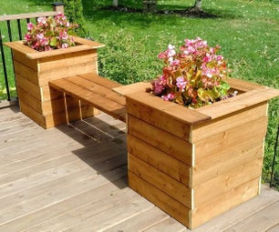](https://www.instructables.com/id/Simple-Planter-Bench/)

**[Simple Planter Bench](https://www.instructables.com/id/Simple-Planter-Bench/)** by [TheGrantAlexander](https://www.instructables.com/member/TheGrantAlexander/) in [Backyard](https://www.instructables.com/outside/backyard/projects/)

[### Teachers E](https://www.instructables.com/teachers/)

**[Shoelace Charms](https://www.instructables.com/id/Shoelace-Charms/)** by [Penolopy Bulnick](https://www.instructables.com/member/Penolopy+Bulnick/) in [3D Printing](https://www.instructables.com/workshop/3d-printing/projects/)

[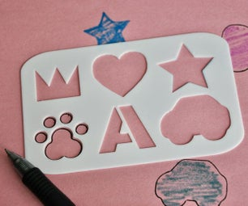](https://www.instructables.com/id/Easy-3D-Print-Stencil/)

**[Easy 3D Print Stencil](https://www.instructables.com/id/Easy-3D-Print-Stencil/)** by [Penolopy Bulnick](https://www.instructables.com/member/Penolopy+Bulnick/) in [Art](https://www.instructables.com/craft/art/projects/)

[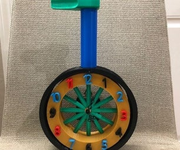](https://www.instructables.com/id/Unicycle-Clock/)

**[Unicycle Clock](https://www.instructables.com/id/Unicycle-Clock/)** by [dharmawidjajaoei](https://www.instructables.com/member/dharmawidjajaoei/) in [3D Printing](https://www.instructables.com/workshop/3d-printing/projects/)