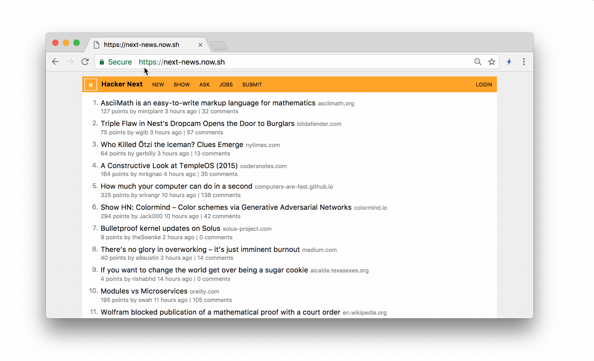

ZEIT – Next.js 2.0

[(L)](https://zeit.co/)

[About](https://zeit.co/about)[Blog](https://zeit.co/blog)[Now](https://zeit.co/now)[World](https://zeit.co/world)[Api](https://zeit.co/api)[OSS](https://zeit.co/oss)[Docs](https://zeit.co/docs)

[Day](https://zeit.co/day)[Download](https://zeit.co/download)[Chat](https://zeit.chat/)[Login](https://zeit.co/login)

Monday, March 27th 2017 (7d ago)
Next.js 2.0

Arunoda Susiripala ([@arunoda](http://twitter.com/arunoda))

Naoyuki Kanezawa ([@nkzawa](http://twitter.com/nkzawa))

Tim Neutkens ([@timneutkens](http://twitter.com/timneutkens))

More than 3.1 million developers read our [announcement post](https://zeit.co/blog/next) of [Next.js](https://github.com/zeit/next.js). More than 110 contributors have submitted patches, examples or improved our documentation. Over 10,000 developers have starred us on [GitHub](https://github.com/zeit/next.js).

Today, we are proud to introduce Next 2.0 to the world. What follows is a quick summary of every new feature and improvement we have made.

### [React Made Easy and Simple](https://zeit.co/blog/next2#react-made-easy-and-simple)

Next.js is a very slim yet powerful framework. Place React components in a ``pages`` directory and running ``next``, and you'll get automatic code splitting, routing, hot code reloading and universal (server-side and client-side) rendering.

The "Hello World" of Next.js, as presented in our [introductory](https://zeit.co/blog/next) post.

It's easy because it's one command for development (``next``), and two others (``next build`` and ``next start``) for a production-ready app.

It's simple because it composes really well. It plays well with the rest of the React and JavaScript (npm) ecosystems.

It's also very small. Check out the [README](https://github.com/zeit/next.js): the entire framework's documentation is a 5 minute read.

NEW! Want to learn step-by-step, by example? Check out the [Learn Next.js](https://learnnextjs.com/) tutorial!

### [Programmatic API](https://zeit.co/blog/next2#programmatic-api)

When we launched Next.js, there was no way to do dynamic routing or load your custom server code. We did this because we believe in shipping early and often.

Now, you can run ``node index.js`` to boot up your own custom server and take full control of the routing and rendering pipeline. This enables powerful features like [fancy URLs](https://github.com/zeit/next.js/tree/master/examples/custom-server-express) or [custom caching schemes](https://github.com/zeit/next.js/tree/master/examples/ssr-caching).

	const express = require('express')
	const next = require('next')

	const dev = process.env.NODE_ENV !== 'production'
	const app = next({ dev })
	const handle = app.getRequestHandler()

	app.prepare().then(() => {
	  const server = express()

	  **server.get('/r/:subreddit', (req, res) => {
	    return app.render(req, res, '/b', {
	      ...req.query,
	      subreddit: req.params.subreddit
	    })
	  })**

	  server.get('*', handle)
	  server.listen(3000)
	})

Implementing Reddit-style fancy URLs with Express and Next.js

### [Bring Your Own React](https://zeit.co/blog/next2#bring-your-own-react)

To start a project, you now need to bring in ``next`` and two extra deps: ``react`` and ``react-dom``.

$ npm install --save next react react-dom

This has tremendous benefits, at the tiny cost of two extra parameters in the initial `install` to set up your project:

- -You can pin React to the version that you know works well on your project
- -It makes Next.js codebase clean and pluggable
- -You can update React independently of us. e.g: no waiting for a Next.js release after React gets updated
- -You can experiment with alternative implementations of the React API. We have examples for [Inferno](https://github.com/zeit/next.js/tree/master/examples/using-inferno) and [Preact](https://github.com/zeit/next.js/tree/master/examples/using-preact)!

### [Component CSS Support](https://zeit.co/blog/next2#component-css-support)

Our mission is to make Next.js as familiar as possible to developers on the Web Platform. To that end, ``next/css`` is now deprecated in favor of ``styled-jsx``, a Babel transformation that gives us scoped (isolated) full CSS support.

This is what a component with CSS that's local, conflict-free, server-rendered and injected once per instance looks like:

	export default () => (
	  

	    
hi there

	    
	  

	)

The styles for ``p`` only apply to the JSX tags defined statically within the scope

You can read more about ``styled-jsx`` on its [GitHub](https://github.com/zeit/styled-jsx) repository.

### [Pre-fetching](https://zeit.co/blog/next2#pre-fetching)

We implemented the ``prefetch`` attribute for the ``<Link>`` component.

	export default () => (
	  

	    <Link href="/next-page" **prefetch**>Go to the next page</Link>
	  

	)

And just like that, you get the performance of a "SPA", without the initial download and expensive bootup penalty of big bundles. Combined with server rendering, this typically means extraordinary performance with very little effort.

### [Next News](https://zeit.co/blog/next2#next-news)

We think a better "Hello World" app than TodoMVC is actually… Hacker News!

Our implementation, [Next News](https://github.com/now-examples/next-news), is fully server-rendered, queries the data over Firebase and updates in realtime as new votes come in. Check out the demo at [next-news.now.sh](https://next-news.now.sh/).

Navigating around Next News is snappy!

To show off our ability to both partially or fully server render, while having the freedom to execute arbitrary codepaths on the client (upon ``componentDidMount``), notice that we show a "Loading…" message when loading an item on the client, but not when we server-render. This makes us a less strict *clone*, but it's for a good cause.

We also went as far as replicating the style-less HN login page. Each [top-level component](https://github.com/now-examples/next-news/blob/master/pages/login.js) (page) in Next.js defines the *entirety of the document*. There's no notion of global layouts or configuration, only [composition](https://github.com/now-examples/next-news/blob/master/pages/jobs.js#L18) via React's component system, which gives you great flexibility.

### [More Examples](https://zeit.co/blog/next2#more-examples)

We've very thankful to our community for having submitted so many examples of backends (Express, HAPI, Koa…), styling systems (cxs, glamor, styled-components…), testing systems (jest), type systems (TypeScript and Flow), data fetching (Apollo) and many others.

[Hello WorldBasic setup of Next.js with a few pages and links.](https://github.com/zeit/next.js/tree/master/examples/hello-world)

[Basic CSSHow to style basic components using <style jsx>.](https://github.com/zeit/next.js/tree/master/examples/basic-css)

[Custom ServerSetting up a custom Node.js `http.Server` to handle requests.](https://github.com/zeit/next.js/tree/master/examples/custom-server)

[Custom Server (Express)Setting up a custom Express server to handle requests.](https://github.com/zeit/next.js/tree/master/examples/custom-server-express)

[Custom Server (Koa)Setting up a custom Koa server to handle requests.](https://github.com/zeit/next.js/tree/master/examples/custom-server-hapi)

[Custom Server (Hapi)Setting up a custom Hapi server to handle requests.](https://github.com/zeit/next.js/tree/master/examples/custom-server-hapi)

[Data FetchingHow to use `getInitialProps` for basic data fetching with `fetch`.](https://github.com/zeit/next.js/tree/master/examples/data-fetch)

[Head ElementsHow to populate the <head> of the page using `next/head`.](https://github.com/zeit/next.js/tree/master/examples/head-elements)

[Layout ComponentHow to set up a layout component to avoid repetition among pages.](https://github.com/zeit/next.js/tree/master/examples/layout-component)

[Nested ComponentsHow to setup a components folder and reuse React components.](https://github.com/zeit/next.js/tree/master/examples/nested-components)

[Parameterized RoutingHow to set up custom routes, such as /blog/:id for posts.](https://github.com/zeit/next.js/tree/master/examples/parameterized-routing)

[Progressive RenderHow to avoid server-rendering certain parts of your page.](https://github.com/zeit/next.js/tree/master/examples/progressive-render)

[Shared ModulesHow to set up a module that's shared between pages and persists state.](https://github.com/zeit/next.js/tree/master/examples/shared-modules)

[SSR CachingHow to cache the resulting HTML of a page to avoid re-rendering.](https://github.com/zeit/next.js/tree/master/examples/ssr-caching)

[SVG ComponentsHow to include SVG components, such as icons, in your pages.](https://github.com/zeit/next.js/tree/master/examples/svg-components)

[Inferno RendererHow to use Inferno as a substitute for React.](https://github.com/zeit/next.js/tree/master/examples/using-inferno)

[Preact RendererHow to use Preact as a substitute for React.](https://github.com/zeit/next.js/tree/master/examples/using-preact)

[Custom RoutingHow to use next/router API for advanced imperative routing.](https://github.com/zeit/next.js/tree/master/examples/using-router)

[AMPHow to set up a custom `<Document>` to render AMP.](https://github.com/zeit/next.js/tree/master/examples/with-amp)

[ApolloHow to use the Apollo framework for GraphQL data fetching.](https://github.com/zeit/next.js/tree/master/examples/with-apollo)

[Custom Babel configHow to extend the default Babel configuration.](https://github.com/zeit/next.js/tree/master/examples/with-custom-babel-config)

[FlowHow to set up the Flow type system for your components.](https://github.com/zeit/next.js/tree/master/examples/with-flow)

[TypeScriptHow to set up the TypeScript type system for your components.](https://github.com/zeit/next.js/tree/master/examples/with-typescript)

[AphroditeHow to use Aphrodite for component styling.](https://github.com/zeit/next.js/tree/master/examples/with-aphrodite)

[CXSHow to use CXS for component styling.](https://github.com/zeit/next.js/tree/master/examples/with-csx)

[External Scoped CSSHow to set up support for .css files and LESS / SCSS.](https://github.com/zeit/next.js/tree/master/examples/with-external-scoped-css)

[FelaHow to use Fela for component styling.](https://github.com/zeit/next.js/tree/master/examples/with-fela)

[GlamorHow to use Glamor for component styling.](https://github.com/zeit/next.js/tree/master/examples/with-glamor)

[Global StylesheetHow to use PostCSS and SASS to compile a global stylesheet.](https://github.com/zeit/next.js/tree/master/examples/with-global-stylesheet)

[JestHow to use Jest for testing.](https://github.com/zeit/next.js/tree/master/examples/with-jest)

[LoadingHow to set up a slim progress bar for page transitions indicators.](https://github.com/zeit/next.js/tree/master/examples/with-loading)

[MobXHow to use MobX for automatic global state management.](https://github.com/zeit/next.js/tree/master/examples/with-mobx)

[Next-RoutesUsing the `next-routes` helper package for easier dynamic routes.](https://github.com/zeit/next.js/tree/master/examples/with-next-routes)

[PrefetchingHow to use the built-in page prefetching functionality.](https://github.com/zeit/next.js/tree/master/examples/with-prefetching)

[Pretty URL RoutingAnother example of custom pretty routes.](https://github.com/zeit/next.js/tree/master/examples/with-pretty-url-routing)

[React HelmetHow to use React Helmet for advanced `<head>` management.](https://github.com/zeit/next.js/tree/master/examples/with-react-helmet)

[React IntlHow to translate your React components to other languages.](https://github.com/zeit/next.js/tree/master/examples/with-react-intl)

[React MDExample of Next.js with Material Design via `react-md`.](https://github.com/zeit/next.js/tree/master/examples/with-react-md)

[ReduxHow to use the well-known Redux for global state management.](https://github.com/zeit/next.js/tree/master/examples/with-redux)

[RefnuxHow to use a Redux alternative for global state management.](https://github.com/zeit/next.js/tree/master/examples/with-refnux)

[Scoped PostCSSAn alternative option to set up PostCSS.](https://github.com/zeit/next.js/tree/master/examples/with-scoped-stylesheets-and-postcss)

[Shallow RoutingHow to add entries to the history stack without page / data fetching.](https://github.com/zeit/next.js/tree/master/examples/with-shallow-routing)

[Styled ComponentsHow to use Styled Components for styling.](https://github.com/zeit/next.js/tree/master/examples/with-styled-components)

[Styled-JSX with PostCSSHow to use PostCSS to process `<style jsx>` tags.](https://github.com/zeit/next.js/tree/master/examples/with-styled-jsx-postcss)

[Styled StyletronHow to use Styletron for styling.](https://github.com/zeit/next.js/tree/master/examples/with-styletron)

[Universal ConfigurationSets up a shared ENV configuration between server and client.](https://github.com/zeit/next.js/tree/master/examples/with-universal-configuration)

[URL Object RoutingSets up a helper to use objects with `<Link>` for URLs.](https://github.com/zeit/next.js/tree/master/examples/with-url-object-routing)

[Webpack Bundle AnalyzerShows you how to use a tool to visualize your bundle allocation.](https://github.com/zeit/next.js/tree/master/examples/with-webpack-bundle-analyzer)

### [Scalable HMR (Hot Module Replacement)](https://zeit.co/blog/next2#scalable-hmr-(hot-module-replacement))

Out of the box, Webpack watches and recompiles your entire project upon any change. We found that HMR was therefore not scaling well as our projects grew in number of code-splitting entry points and components.

We deployed a new lazy compilation mechanism that only subscribes to the pages that you're actually working on (i.e.: all the component trees currently rendered).

In our tests, this has made compilation 10 to 20 times faster for large projects.

### [A Smaller Build](https://zeit.co/blog/next2#a-smaller-build)

We've made some important improvements to how builds work:

- -We set up Webpack common chunks to avoid shipping repeated code across components
- -We use hashes to make the initial bundle files be cached permanently on clients, making page loads faster
- -We added provisions to make sure an app works correctly

The best part? Every Next.js app is now smaller and more efficient.

|     | 1.0 | **2.0** | delta |
| --- | --- | --- | --- |
| Document size (server rendered) | **21.7kb** | **13.3kb** | **1.64x***smaller* |
| Total Bundle Size (client) | **321kb** | **214kb** | **1.50x***smaller* |
| Total Bundle Size (client) (gzipped) | **84.2kb** | **68.4kb** | **1.23x***smaller* |

Data for a basic site with the Next.js and React bundled

We are working on making Next.js much smaller and we have identified many opportunities for optimization already.

The React team is also working on size optimizatons for [React Fiber](https://gist.github.com/duivvv/2ba00d413b8ff7bc1fa5a2e51c61ba43), which we will begin testing soon.

### [Fully Extensible](https://zeit.co/blog/next2#fully-extensible)

Many of the examples above introduce new features to the code or the build process. This is possible because Next.js gives you complete control over Babel's and Webpack's configuration.

To extend Babel, we let you apply Next.js' settings as a preset.

	{
	  "name': "my-next-app",
	  […]
	  "babel": {
	    "presets": ["next/babel"],
	    "plugins": [[
	      "transform-define",
	      "./env-config.js"
	    ]]
	  }
	}

``babel-plugin-transform-define`` will let you to replace any JS expression mapped in ``env-config.js`` at compile time

To extend webpack or tweak other settings, you can define a `next.config.js` file. Check out the [README](https://github.com/zeit/next.js#custom-configuration) for the complete documentation.

### [Featured at ReactConf](https://zeit.co/blog/next2#featured-at-reactconf)

Our CEO [Guillermo Rauch](https://twitter.com/rauchg) presented Next.js at ReactConf in Santa Clara a few weeks ago. Check it out!

### [The Road to 3.0](https://zeit.co/blog/next2#the-road-to-3.0)

We attribute our success with this release to having released early, iterated frequently and listened to our community. But something extremely important as well was making our roadmap and priorities clear and public.

Here are some of the goals for the coming releases on our way to 3.0:

#### [Improved HMR](https://zeit.co/blog/next2#improved-hmr)

We are still working on a few improvements to hot module replacement. Some errors don't have accurate locations and there are a few issues with recovering from errors in certain scenarios.

#### [Faster Dev Compilation](https://zeit.co/blog/next2#faster-dev-compilation)

We are investigating ways to continue to optimize the development experience. Since both Node.js and modern browsers that developers use iterate so quickly, we can skip large portions of the compilation step for really fast reloads.

#### [Seamless Support for Lazy ``import()``](https://zeit.co/blog/next2#seamless-support-for-lazy-[object-object])

This will allow for server-rendered pages that expose different JS components according to the data they used, for example. In addition, once the component mounts on the client, you can load any component you want, lazily.

*Note:* this already partially works, but we will continue to refine it an document it.

#### [React Fiber](https://zeit.co/blog/next2#react-fiber)

We are looking forward to testing and ensuring Next.js works perfectly with the upcoming React engine: Fiber. This will potentially introduce new opportunities, like the ability to *stream HTML from the server* as it is generated.

#### [Static Exports](https://zeit.co/blog/next2#static-exports)

You should be able to *server-render to files* via a ``next export`` command. In other words, you'll be able to statically export your application to HTML files.

### [Ready for Production](https://zeit.co/blog/next2#ready-for-production)

Aside from this very website, we are very happy many others in the industry have adopted Next.js. Here are some that have [let us know](https://github.com/zeit/next.js/issues/1458).

- -[Npm, inc.](https://www.npmjs.com/search)
- -[Scale API](https://www.scaleapi.com/)
- -[Open Collective](https://opencollective.com/)
- -[Tutor Bro](https://tutorbro.com/)
- -[Ritoplz](https://ritoplz.com/)
- -[Upsum News](https://upsum.news/)
- -[Skys Limo](https://skyslimo.com/)
- -[Project R](https://project-r.construction/)
- -[Linklet](https://linklet.ml/)

If you have shipped Next.js to production or are planning to, please let us know. We are always hanging out on the ``#next`` channel in our [Public Slack community](https://zeit.chat/).

We are bringing together the Next.js community at our one-day conference [ZEIT Day](https://zeit.co/day) on April 29th in San Francisco. It's a unique opportunity to meet other users and learn more about it from its creators!

Copyright © 2017 Zeit, Inc. All rights reserved.

- [(L)](https://github.com/zeit/)
- [(L)](https://twitter.com/zeithq)
- [Privacy Policy](https://zeit.co/privacy)
- [Terms of Service](https://zeit.co/terms)
- [team@zeit.co](https://zeit.co/blog/next2mailto:team@zeit.co)

[(L)](https://zeit.co/blog/next2#)Window size:  x
Viewport size:  x