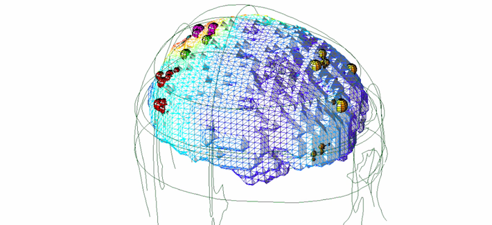
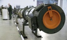
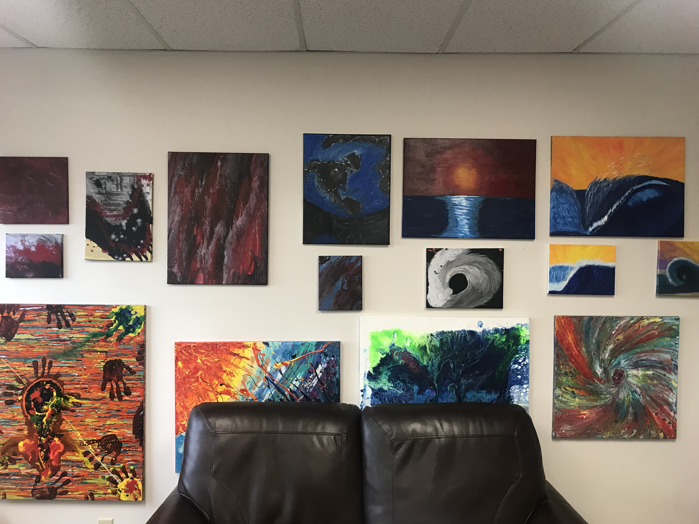

Zap: How Electric Therapy Is Curing Navy SEALs of PTSD … And Could Remake Brain Science

#   Zap: How Electric Therapy Is Curing Navy SEALs of PTSD … And Could Remake Brain Science

 

-      By Patrick Tucker    Technology Editor   [Read bioE](https://www.defenseone.com/voices/patrick-tucker/8219/?oref=d-article-author)

January 20, 2019

 Topics

- [  Technology](https://www.defenseone.com/topic/technology/?oref=d-article-topics)

 [ Newport Brain Treatment Lab](#)

   [AA  Font size +](https://www.defenseone.com/technology/2019/01/zap-how-electric-therapy-curing-navy-seals-ptsd-and-could-remake-brain-science/154301/?oref=d-topstory&utm_medium=email&utm_source=other&utm_campaign=opencourse.GdeNrll1EeSROyIACtiVvg.announcements~opencourse.GdeNrll1EeSROyIACtiVvg.x77T7CYDEemiXg7JX7E0yA#)  [Print](https://www.defenseone.com/technology/2019/01/zap-how-electric-therapy-curing-navy-seals-ptsd-and-could-remake-brain-science/154301/print/)

- [  Facebook](https://www.facebook.com/dialog/feed?picture=https%3A%2F%2Fcdn.defenseone.com%2Fmedia%2Fimg%2Fupload%2F2019%2F01%2F18%2FScreen_Shot_2019-01-18_at_2.37.08_PM%2Fopen-graph.png&redirect_uri=https%3A%2F%2Fwww.defenseone.com&link=https%3A%2F%2Fwww.defenseone.com%2Ftechnology%2F2019%2F01%2Fzap-how-electric-therapy-curing-navy-seals-ptsd-and-could-remake-brain-science%2F154301%2F&app_id=1546266055584988&display=popup)

- [  Twitter](https://twitter.com/share?url=https%3A%2F%2Fwww.defenseone.com%2Ftechnology%2F2019%2F01%2Fzap-how-electric-therapy-curing-navy-seals-ptsd-and-could-remake-brain-science%2F154301%2F&text=Zap%3A+How+Electric+Therapy+Is+Curing+Navy+SEALs+of+PTSD+%E2%80%A6+And+Could+Remake+Brain+Science&via=defenseone)

- [  LinkedIn](http://www.linkedin.com/shareArticle?url=https%3A%2F%2Fwww.defenseone.com%2Ftechnology%2F2019%2F01%2Fzap-how-electric-therapy-curing-navy-seals-ptsd-and-could-remake-brain-science%2F154301%2F&mini=true&summary=Hundreds+of+vets+have+tried+out+an+experimental+new+treatment+that+could+change+how+the+world+addresses+mental+disorders.&source=DefenseOne.com&title=Zap%3A+How+Electric+Therapy+Is+Curing+Navy+SEALs+of+PTSD+%E2%80%A6+And+Could+Remake+Brain+Science)

- [  Email this article](https://www.defenseone.com/technology/2019/01/zap-how-electric-therapy-curing-navy-seals-ptsd-and-could-remake-brain-science/154301/?oref=d-topstory&utm_medium=email&utm_source=other&utm_campaign=opencourse.GdeNrll1EeSROyIACtiVvg.announcements~opencourse.GdeNrll1EeSROyIACtiVvg.x77T7CYDEemiXg7JX7E0yA#)

      Hundreds of vets have tried out an experimental new treatment that could change how the world addresses mental disorders.

**Tony didn’t know what to expect when **he walked into the Brain Treatment Center in San Diego, California, last spring. The former Navy SEAL only knew that he needed help. His service in Iraq and Afghanistan was taking a heavy toll on his mental and physical wellbeing. He had trouble concentrating, remembering, and was given to explosive bursts of anger. “If somebody cut me off driving, I was ready to kill ’em at the drop of a hat,” he said. And after he got into a fistfight on the side of a California road, his son looking on from the car, he decided he was willing to try anything — even an experimental therapy that created an electromagnetic field around his brain.

####   Most Read

1.   1  [   The US Military Is Chopping Up Its Iron Man Suit For Parts](https://www.defenseone.com/technology/2019/02/us-military-chopping-its-iron-man-suit-parts/154706/?oref=d-mostread)

2.   2  [   Two Ways the Venezuelan Crisis Might End](https://www.defenseone.com/ideas/2019/02/two-ways-venezuelan-crisis-might-end/154715/?oref=d-mostread)

3.   3  [   DOD: Big companies move too slowly; SOCOM’s shopping list; 2020 budget reveal slips to March and more.](https://www.defenseone.com/business/2019/02/dod-big-companies-move-too-slowly-socoms-shopping-list-2020-budget-reveal-slips-march-and-more/154724/?oref=d-mostread)

 Subscribe

*Receive daily email updates:*

Subscribe to the Defense One daily.

Be the first to receive updates.

 

What Tony and several other former U.S. Special Operations Forces personnel received Newport Brain Research Laboratory, located at the Center, was a new treatment for brain disorders, one that might just revolutionize brain-based medicine. Though the FDA clinical trials to judge its efficacy and risks are ongoing, the technique could help humanity deal with a constellation of its most common mental disorders — depression, anxiety, aggressiveness, attention deficit, and others—and do so without drugs. And if its underpinning theory proves correct, it could be among the biggest breakthroughs in the treatment of mental health since the invention of the EEG a century ago.

At the lab, Tony (whose name has been changed to protect his identity) met Dr. Erik Won, president and CEO of the Newport Brain Research Laboratory, the company that’s innovating Magnetic EEG/ECG-guided Resonant Therapy, or MeRT. Won’s team strapped cardiac sensors on Tony and placed an electroencephalography cap on his skull to measure his brain’s baseline electrical activity. Then came the actual therapy. Placing a flashlight-sized device by Tony’s skull, they induced an electromagnetic field that senta small burst of current to his brain. Over the course of 20 minutes, they moved the device around his cranium, delivering jolts that, at their most aggressive, felt like a firm finger tapping.

For Tony, MeRT’s effects were obvious and immediate. He walked out of the first session to a world made new. “Everything looked different,” he told me. “My bike looked super shiny.”

He began to receive MeRT five times a week— each session lasting about an hour, with waiting room time — and quickly noticed a change in his energy. “I was super boosted,” he said. His mood changed as well.

####   Don't Miss

- [      US Navy Re-Evaluating 355-Ship Goal](https://www.defenseone.com/business/2019/02/us-navy-re-evaluating-355-ship-goal/154591/?oref=d-dontmiss)

- [      US Navy Places First 2-Carrier Order in Three Decades](https://www.defenseone.com/business/2019/01/us-navy-places-first-2-carrier-order-three-decades/154566/?oref=d-dontmiss)

- [     The Unpredictable Rise of China](https://www.defenseone.com/ideas/2019/02/unpredictable-rise-china/154619/?oref=d-dontmiss)

- [     Expect a Missile Race After the INF Demise](https://www.defenseone.com/technology/2019/01/expect-missile-race-after-inf-demise/154577/?oref=d-dontmiss)

- [     Toward a New Framework for the INF](https://www.defenseone.com/ideas/2019/01/inf-treaty-doomed-we-need-new-arms-control-framework/154428/?oref=d-dontmiss)

Today, he admits that he still has moments of frustration but says that anger is no longer his “go-to emotion.” He’s developed the ability to cope. He still wants help with his memory, but his life is very different. He’s taken up abstract painting and welding, two hobbies he had no interest in at all before the therapy. He’s put in a new kitchen. Most importantly, his sleep is very different: better.

Tony’s experience was similar to those of five other special-operations veterans who spoke with *Defense One. *All took part in a double-blind randomized clinical trial that sought to determine how well MeRT treats Persistent Post-Concussion Symptoms and Post-Traumatic Stress Disorder, or PTSD. Five out of the six were former Navy SEALS.

In many ways, SEALS represent the perfect test group for experimental brain treatment. They enter the service in superb health and then embark on a course of training that heightens mental and physical strength and alertness. Then comes their actual jobs, which involve a lot of “breaching”: getting into a place that the enemy is trying to keep you out of. It could be a compound in Abbottabad, Pakistan—or every single door in that compound. Breaching is so central to SEAL work that it’s earned them the nickname[“door kickers.”](http://armedforcesjournal.com/more-than-door-kickers/) But it often involves not so much kicking as explosives at closer-than-comfortable range. “I got blown up a lot in training,” says Tony, and a lot afterwards as well. Put those two factors together and you have a population with a high functioning baseline but with a lot of incidents of persistent post-concussive syndrome, often on top of heavy combat-related PTSD and other forms of trauma.

One by one, these former SEALs found their way to Won’s lab. One — let’s call him Bill — sought to cure his  debilitating headaches. Another, Ted, a SEAL trainer, had no severe symptoms but wanted to see whether the therapy could improve his natural physical state and performance. A fourth, Jim, also a former SEAL, suffered from severe inability to concentrate, memory problems, and low affect, which was destroying his work performance. “I was forcing myself to act normal,” Jim said. “I didn’t feel like I was good at anything.”

Yet another, a former member of the Air Force Security Forces named Cathy, had encountered blasts and a “constant sound of gunfire” during her deployments to Iraq and Afghanistan. She suffered from memory problems, depression, anger, bouts of confusion, and migraines so severe she had to build a darkroom in her house.

Like Cathy, the rest had difficulty sleeping. Even Ted, who had no severe PTSD-related problems, reported that he “slept like crap,” before the treatment began.

All said that they saw big improvements after a course of therapy that ran five days a week for about four weeks. Bill reported that his headaches were gone, as did Cathy, who said her depression and mood disorders had lessened considerably. Jim’s memory and concentration improved so dramatically that he had begun pursuing a second master’s degree and won a spot on his college’s football team. Ted said he was feeling “20 years younger” physically and found himself better able to keep pace with the younger SEALS he was training. All of it, they say, was a result of small, precisely delivered, pops of electricity to the brain. Jim said the lab had also successfully treated back and limb pain by targeting the peripheral nervous system with the same technique.

Inside the Brain Treatment Center in San Diego, the location of the Newport Brain Research Lab, a wall displays paintings of patients who have undergone MeRT therapy, the tone, mood, and control in the paintings evolves as the patient continues through the treatment.

Won, a former U.S. Navy Flight Surgeon, and his team have treated more than 650 veterans using MeRT. The walls of the lab are adorned with acrylic paintings from veterans who have sought treatment. The colors, themes, and objects in the paintings evolve, becoming brighter, more optimistic, some displaying greater motor control, as the painter progresses through the therapy.

The lab is about one-third of the way through a [double-blind clinical trial](https://clinicaltrials.gov/ct2/show/NCT02990793) that may lead to FDA approval, and so Won was guarded in what he could say about the results of their internal studies. But he said that his team had conducted a separate randomized trial on 86 veterans. After two weeks, 40 percent saw changes in their symptoms; after four weeks, 60 did, he said.

“It’s certainly not a panacea,” said Won. “There are people with residual symptoms, people that struggle…I would say the responses are across the board. Some sleep better. Some would say, very transformative.” (Won doesn’t even categorize the treatment as “curing,” as that has a very specific meaning in neurology and mental health, so much as “helping to treat.”)

Won believes the question might ultimately be not “Does MeRT work?” but “What therapies can it replace?”

“I think, in the future, there will be a discussion about whether this should be first-line management. What can we do to address the functional issues at play? There’s a whole lot of science to do before we get there,” he said.

**Your Brain is Electric**

The idea that electricity, properly administered, could treat illness goes back to 1743 when a German physician named Johann Gottlob Kruger of the University of Halle successfully treated a harpsichordist with arthritis via electrical stimulation to the hand. John Wesley, the father of Methodism, also experimented with electricity as a therapeutic and declared it “[The nearest an Universal medicine of any yet known in the world](https://play.google.com/store/books/details?id=91xXAAAAcAAJ&rdid=book-91xXAAAAcAAJ&rdot=1).”

But the idea remained mostly an idea with no real science to back it up, until the 20th century.

Enter Hans Berger, a German scientist who wanted to show that human beings were capable of telepathy via an unseen force he referred to as “psychic energy.” He believed this energy derived from an invisible relationship between blood flow, metabolism, emotion, and the sensation of pain and thought that if he could find physical evidence that psychic energy existed, perhaps humanity could learn to control it.

To test his theory, he needed a way to record the brain’s electrical activity.In 1924, he applied a [galvanometer](https://en.wikipedia.org/wiki/String_galvanometer) a tool originally built to measure the heart’s electrical activity, to the skull of a young brain-surgery patient. The galvanometer was essentially a string of silver-coated [quartz](https://en.wikipedia.org/wiki/Quartz) filament flanked by magnets. The filament would move as it encountered electromagnetic activity, which could be graphed. Berger discovered that the brain produced electrical oscillations at varying strengths. He dubbed the larger ones, of 8 to 12 Hz, the alpha waves, the smaller ones beta waves, and named the graphing of these waves an electroencephalogram, or EEG.

Berger’s telepathy theories never panned out, but the EEG became a healthcare staple, used to detect abnormal brain activity, predict potential seizures, and more.

The separate notion that electricity could be used to treat mental disorder entered wide medical practice with the invention of electroconvulsive therapy, or ECT, in Italy in the 1930s. ECT — more commonly called [shock therapy](https://www.scientificamerican.com/article/electroconvulsive-therapy-a-history-of-controversy-but-also-of-help/) — used electricity to induce a seizure in the patient. Its use spread rapidly across psychiatry as it seemed to not only meliorate depression but also to temporarily pacify patients who suffered from psychosis and other disorders. Before long, doctors in mental institutions were prescribing it commonly to subdue troublesome patiets and even as a “cure” for homosexuality. The practice soon became associated with institutional cruelty.

In the 1990s, a handful of researchers, independent of another, realized that electricity at much lower voltages could be used to help with motor function in[Parkinson’s patients](https://www.biologicalpsychiatryjournal.com/article/0006-3223(95)92243-B/pdf) and as an aid for depression. But there was a big difference between their work and that of earlier practitioners of ECT: they used magnetic fields rather than jolts of electricity. This allowed them to activate brain regions without sending high currents through the skull. Seizures, it seemed, weren’t necessary.

In 2008, researchers began to experiment with what was then called transcranial magnetic stimulation to treat PTSD. Since then, it’s been approved as a treatment for depression. Won and his colleagues don’t use it in the same way that doctors do when they’re looking for something simple and easy to spot, like potential signs of a seizure or head trauma. Won uses EEG/ECG biometrics to find the subject’s baseline frequency, essentially the “normal” state to return her or him to, and also to precisely target the areas of the brain that will respond to stimulation in the right way.

**YOU Have a Signature. Your Signature is YOU**

No two people experience mental health disorders in the same way. Some PTSD sufferers have memory problems; others, depression; still others, uncontrollable anger. But people that are diagnosed with depression[are more likely](https://adaa.org/about-adaa/press-room/facts-statistics) to suffer from another, separate mental health issue, such as anxiety, attention deficit, or something else.

A data visualization of brain electrical activity mapped via EEG. Courtesy of the Newport Brain Research Lab

The theory that underpins MeRT posits that many of these problems share a common origin: a person’s brain has lost the beat of its natural information-processing rhythm, what Won calls the “dominant frequency.”

Your dominant frequency is how many times per second your brain pulses alpha waves. “We’re all somewhere between 8 and 13 hertz. What that means is that we encode information 8 to 13 times per second. You’re born with a signature. There are pros and cons to all of those. If you’re a slower thinker, you might be more creative. If you’re faster, you might be a better athlete,” Won says.

Navy SEALS tend to have higher-than-average dominant frequencis, around 11 or 13 Hz. But physical and emotional trauma can disrupt that, causing the back of the brain and the front of the brain to emit electricity at different rates. The result: lopsided brain activity. MeRT seeks to detect arrhythmia, find out which regions are causing it, and nudge the off-kilter ones back onto the beat.

“Let’s just say in the left dorsal lateral prefrontal cortex, towards the front left side of the brain, if that’s cycling at 2 hertz, where we are 3 or 4 standard deviations below normal, you can pretty comfortably point to that and say that these neurons aren’t firing correctly. If we target that area and say, ‘We are going to nudge that area back to, say, 11 hertz,’ some of those symptoms may improve,” says Won. “In the converse scenario, in the right occipital parietal lobe where, if you’ve taken a hit, you may be cycling too fast. Let’s say it’s 30 hertz. You’re taking in too much information, oversampling your environment. And if you’re only able to process it using executive function 11 times per second, that information overload might manifest as anxiety.”

If the theory behind MeRT is true, it could explain, at least partially, why a person may suffer from many mental-health symptoms: anxiety, depression, attention deficits, etc. The pharmaceutical industry treats them with separate drugs, but they all may have a similar cause, and thus be treatable with one treatment. That, anyway, is what Won’s preliminary results are suggesting.

“You don’t see these type of outcomes with psychopharma or these other types of modalities, so it was pretty exciting,” he said.

There are lots of transcranial direct stimulation therapies out there, with few results to boast of. What distinguishes MeRT from other attempts to treat mental disorders with electrical fields is the use of EEG as a guide. It’s the difference between trying to fix something with the aid of a manual versus just winging it.

If the clinical trials bear out and the FDA approves of MeRT as an effective treatment for concussion and/or PTSD, many more people will try it. The dataset will grow, furthering the science. If that happens, the world will soon know whether or not there is a better therapeutic for mood and sleep disorders than drugs; and a huge portion of the pharmaceutical industry will wake up to earth-changing news.

But there’s more. Won believes that MeRT may have uses for nominally healthy brains, such as improving attention, memory, and reaction time, as Ted discovered. It’s like the eyesight thing, the sudden, stark visual clarity. “These were unexpected findings, but we’re hearing it enough that we want to do more studies.”

Performance enhancement is “not something that we’re ardently chasing,” says Won. ”Our core team is about saving lives. But so many of our veterans are coming back asking.”

Already, there’s evidence to suggest that it could work. “What we’ve noticed in computerized neuro-psych batteries is that reaction times improve. Complex cognitive processing tasks can improve both in terms of speed to decision and the number of times you are right versus wrong. Those are all things we want to quantify and measure with good science,” he says.

What is one person’s therapy, in the years ahead, could be another person’s mental health regimen. Signs of that future are already here. Like so many strange portents, their origin is the tech field.

More and more high-level executives, including at technology companies, are seeking him out, asking to be strapped in and zapped for a few weeks. “That’s been a recent evolution. There’s a company” — he declined to name it — “a lot of programmers, engineers, etc. … One of their C-suite members got treatment and was so blown away that they want all of their key team members to get it…They’re ruthlessly competitive…They want an edge.”

So[ does the American military](https://www.defenseone.com/technology/2017/07/tomorrow-soldier-how-military-altering-limits-human-performance/139374/).

- Patrick Tucker is technology editor for Defense One. He’s also the author of The Naked Future: What Happens in a World That Anticipates Your Every Move? (Current, 2014). Previously, Tucker was deputy editor for The Futurist for nine years. Tucker has written about emerging technology in Slate, ...   [Full bioE](https://www.defenseone.com/voices/patrick-tucker/8219/?oref=d-article-author)

- [  Facebook](https://www.facebook.com/dialog/feed?picture=https%3A%2F%2Fcdn.defenseone.com%2Fmedia%2Fimg%2Fupload%2F2019%2F01%2F18%2FScreen_Shot_2019-01-18_at_2.37.08_PM%2Fopen-graph.png&redirect_uri=https%3A%2F%2Fwww.defenseone.com&link=https%3A%2F%2Fwww.defenseone.com%2Ftechnology%2F2019%2F01%2Fzap-how-electric-therapy-curing-navy-seals-ptsd-and-could-remake-brain-science%2F154301%2F&app_id=1546266055584988&display=popup)

- [  Twitter](https://twitter.com/share?url=https%3A%2F%2Fwww.defenseone.com%2Ftechnology%2F2019%2F01%2Fzap-how-electric-therapy-curing-navy-seals-ptsd-and-could-remake-brain-science%2F154301%2F&text=Zap%3A+How+Electric+Therapy+Is+Curing+Navy+SEALs+of+PTSD+%E2%80%A6+And+Could+Remake+Brain+Science&via=defenseone)

- [  LinkedIn](http://www.linkedin.com/shareArticle?url=https%3A%2F%2Fwww.defenseone.com%2Ftechnology%2F2019%2F01%2Fzap-how-electric-therapy-curing-navy-seals-ptsd-and-could-remake-brain-science%2F154301%2F&mini=true&summary=Hundreds+of+vets+have+tried+out+an+experimental+new+treatment+that+could+change+how+the+world+addresses+mental+disorders.&source=DefenseOne.com&title=Zap%3A+How+Electric+Therapy+Is+Curing+Navy+SEALs+of+PTSD+%E2%80%A6+And+Could+Remake+Brain+Science)

- [  Email this article](https://www.defenseone.com/technology/2019/01/zap-how-electric-therapy-curing-navy-seals-ptsd-and-could-remake-brain-science/154301/?oref=d-topstory&utm_medium=email&utm_source=other&utm_campaign=opencourse.GdeNrll1EeSROyIACtiVvg.announcements~opencourse.GdeNrll1EeSROyIACtiVvg.x77T7CYDEemiXg7JX7E0yA#)

 

[Show Comments](https://www.defenseone.com/technology/2019/01/zap-how-electric-therapy-curing-navy-seals-ptsd-and-could-remake-brain-science/154301/?oref=d-topstory&utm_medium=email&utm_source=other&utm_campaign=opencourse.GdeNrll1EeSROyIACtiVvg.announcements~opencourse.GdeNrll1EeSROyIACtiVvg.x77T7CYDEemiXg7JX7E0yA#)

By using this service you agree not to post material that is obscene, harassing, defamatory, or otherwise objectionable. Although Defenseone.com does not monitor comments posted to this site (and has no obligation to), it reserves the right to delete, edit, or move any material that it deems to be in violation of this rule.

[« Previous](https://www.defenseone.com/ideas/2019/01/lets-make-last-shutdown-please/154299/?oref=d-previouspost)

#### [Let’s Make This the Last Shutdown. Please.](https://www.defenseone.com/ideas/2019/01/lets-make-last-shutdown-please/154299/?oref=d-previouspost)

[Next »](https://www.defenseone.com/ideas/2019/01/shutdown-great-news-russia/154310/?oref=d-nextpost)

#### [The Shutdown Is Great News for Russia](https://www.defenseone.com/ideas/2019/01/shutdown-great-news-russia/154310/?oref=d-nextpost)