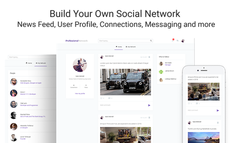
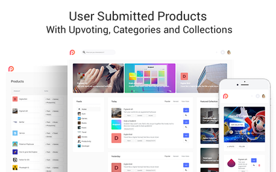
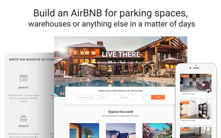
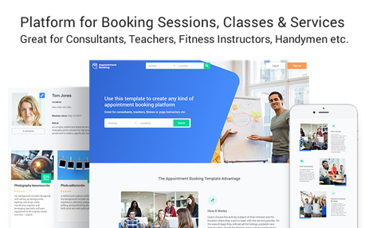
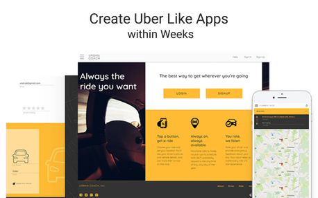
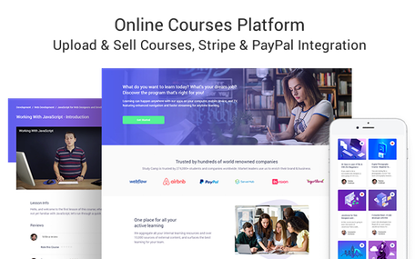
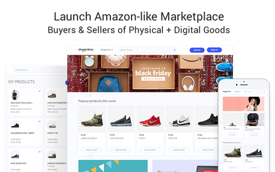
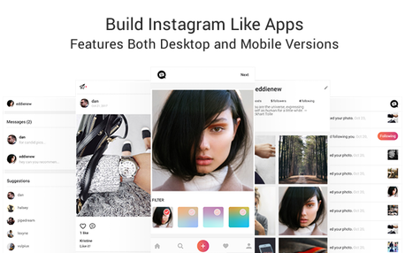
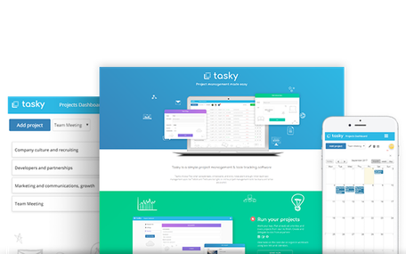
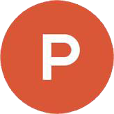

Zeroqode - no-code templates for Bubble

# Build Your App 10x Faster

##

With No-code App Templates for [Bubble](https://bubble.is/?ref=9BJPDWAH).
[built by bubble_b2-01.svg](../_resources/b953fedc1e508f2b11f2bb57d270b64f.bin)
For Founders
Launch your MVP in 2-3 weeks at a fraction of cost
[Read more](https://zeroqode.com/founders)
[courses-01.svg](../_resources/f5b287f2c191c9af8ceb779428b6fa80.bin)
For Designers
Bring your pixel perfect, responsive designs to life
[Read more](https://zeroqode.com/designers)
[native-02-01.svg](../_resources/4be4087177b5387d7be2f14bfea7e884.bin)
For Developers
Same results as coding but much faster. Use code only when needed
[Read more](https://zeroqode.com/developers)
How it works
Building apps without code is easier, faster and a lot more fun!
Buy Bubble Template
[backends-02-01.svg](../_resources/409a1184cdde7ab2b5bdd46544d8e23f.bin)
[main_picture125-01.svg](../_resources/f92f0cfa350f6599a6de6a8d6e157da2.png)
Modify Anything Without Code
[main_picture123-01.svg](../_resources/55d9e28abdef07a45f71119aa7380a03.bin)
Launch Your Product!
[Learn more about Bubble](https://zeroqode.com/bubble)
Latest app templates

Unique ready-made App templates made by professional Bubble designers and visual programmers

Showing 9 / 28

Linkedin Clone

This template is similar to Linkedin and can be used for creating any kind of social network. It is...

$377

Product Hunt Clone

This template replicates most of Product Hunt’s main functionality! Users can upload products...

$257

AirBNB Clone

This template is a well functioning and beautifully designed AirBNB style accomodation rentals app...

$377

Bookings & Appointments

This is an amazing template that will allow you launch a platform to bring users and service...

$377

Uber Clone

Amazing ride sharing template that replicates all Uber's functionality! Features both rider's and...

$377

Udemy Clone

Amazing online learning platform similar to Udemy. This responsive platform allows any user to sell...

$377

Amazon Clone

This template replicates Amazon's main functionality, that is brings buyers and sellers...

$377

Instagram Clone

This template is a clone of Instagram and looks great both on mobile & desktop devices. It comes...

$377

Project Management App

Tasky is about project management and task management. You create projects, tasks...

Free
Showing 9 / 28
[Google Sheets API-2-01.svg](../_resources/19c32eefe50a23e94db3b98f46bd09c3.bin)
More Templates Coming Soon... Join to be notified!

Occasional tips about building products and startups without code delivered straight to your inbox

[backends-04-01.svg](../_resources/69ab57e5aab3bcfad16525760ccaa58f.bin)
No-Code Courses
Learn how to build web and mobile apps without code.
[zeroqode-for-developers-white2-01.svg](../_resources/e33040d86d5f225800ff5f494fc8d8d6.bin)
Native apps
Seamlessly convert your existing web app into native Android and iOS.
[courses_3-01.svg](../_resources/dce798814564656f007c6bd96ebc9fc5.bin)
Cloud Backend
Deploy backend without code and connect your app in a matter of days
[backend-01.svg](../_resources/1be5bf721d597c2836f7937a8b87c6d9.bin)
Google Sheets API
Use Google Sheets via REST API as a database or CMS.
What other templates should we build?

Your feedback would help us prioritize our development roadmap. Submit your own entry or upvote an existing one

[native-05-01.svg](../_resources/5bca664ce88668c62143a46a7bc0db1d.bin)
[zeroqode_logo_last.svg](../_resources/f1935bcac5d9471cce2ba3ce33f90962.bin)
[zeroquode_logo_2x.svg](../_resources/409a1184cdde7ab2b5bdd46544d8e23f.bin)
[built by bubble_b-05-01.svg](../_resources/55d9e28abdef07a45f71119aa7380a03.bin)

[zeroqode-for-founders-blue-01.svg](../_resources/eb14b333ee8969885cb8f198c044578c.bin)

[arrow2-01.svg](../_resources/b512d2ba641fd58e998169b09e3b88ce.bin)
[native-01.svg](../_resources/8d778033bf5e9f567c9c818abe4f59c3.bin)
[main_picture120-01.svg](../_resources/a0ba632dda3ff208f0c755fd1efcc294.bin)
[main_picture122_delails-01.svg](../_resources/e0b91fd2ca8a5a1a7c60787d3e75ab3b.bin)
[main_picture124-01.svg](../_resources/805804dc131227e4a67cae56e30173cd.bin)
[built_by_bubble.svg](../_resources/b953fedc1e508f2b11f2bb57d270b64f.bin)
[zeroqode-for-designers-blue-01.svg](../_resources/f5b287f2c191c9af8ceb779428b6fa80.bin)
[paperplane-large-02-01.svg](../_resources/4be4087177b5387d7be2f14bfea7e884.bin)

[Google Sheets API-04-01.svg](../_resources/19c32eefe50a23e94db3b98f46bd09c3.bin)
[arrow-01.svg](../_resources/f1935bcac5d9471cce2ba3ce33f90962.bin)

