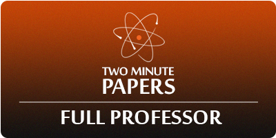
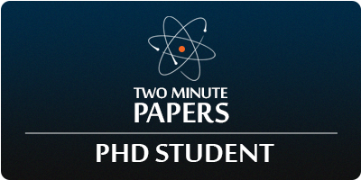
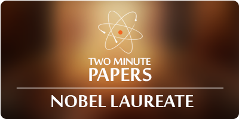
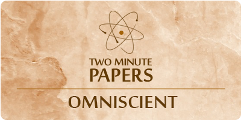

[Update] Early access - Everybody Can Make DeepFakes Now! | Károly Zsolnai-Fehér on Patreon

##### Current Tier

###### Full Professor

$5 per month

Full Professors are the backbone of University committees. You are presented several options for future episodes and will get to decide which topics should be next!

**Decide the topic of the next episode! (plus all of the above)**

##### Other tiers

###### PhD student

$3 per month

Doctoral candidate students are granted access to arcane knowledge - early access to upcoming video episodes. **Ad-free. **You'll also be forgiven for not being able to pronounce my name. Whew!

**View upcoming episodes *****16 to 24 hours in advance!***** (plus all of the above)**

[Join $3 Tier](https://www.patreon.com/join/TwoMinutePapers/checkout?rid=351603)

###### Nobel Laureate

$25 per month

Nobel Laureates are distinguished supporters of Two Minute Papers whose names will be added to the video description box. Please note that we will use your name that you registered on Patreon - if you wish to use something else, please drop us a message! You will appear in the description box of every episode published in your months of support. For business inquiries, please contact us privately.

**Appear in the description box of every episode in a given month! (plus all of the above)**

[Join $25 Tier](https://www.patreon.com/join/TwoMinutePapers/checkout?rid=482655)

###### Omniscient

$100 per month

**This shouldn't even be a category, but if you still decide to sign up, please know that your contribution helps us improving the show immensely and we are really grateful for your support.**

[Join $100 Tier](https://www.patreon.com/join/TwoMinutePapers/checkout?rid=3368251)