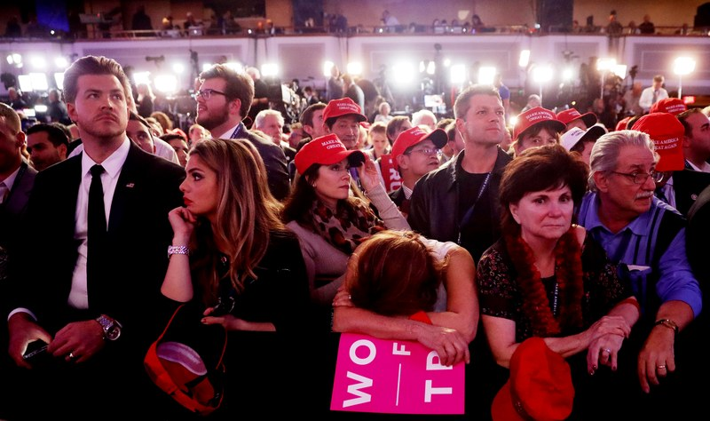
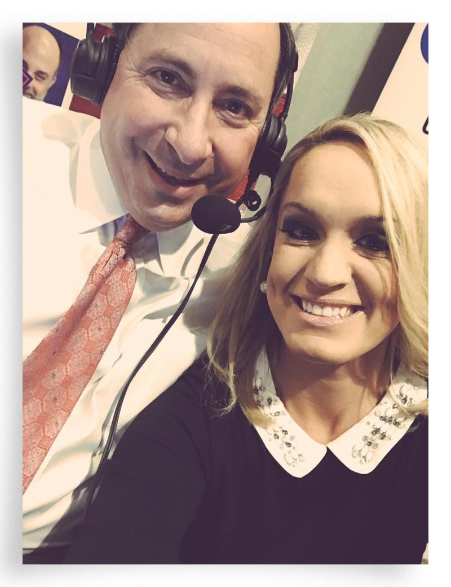
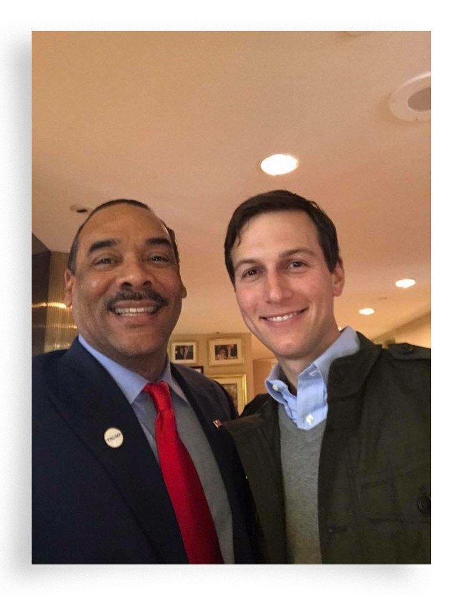
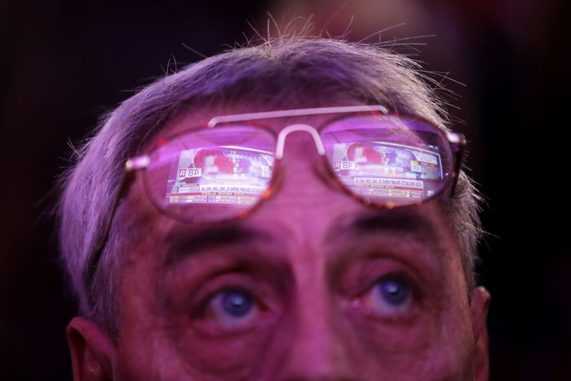
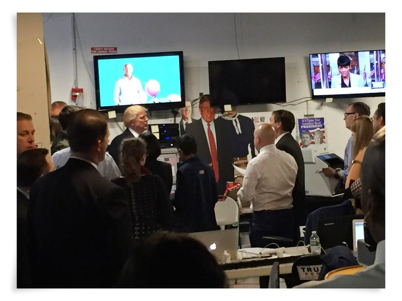
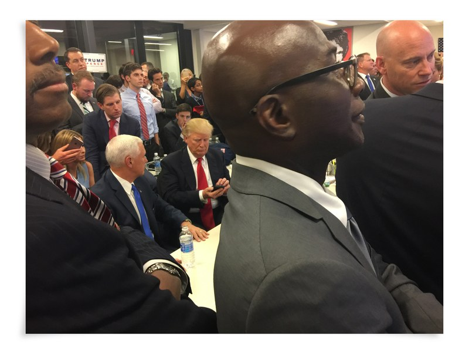
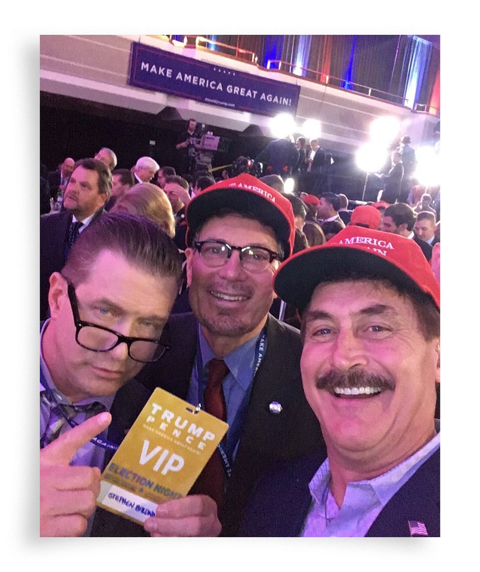
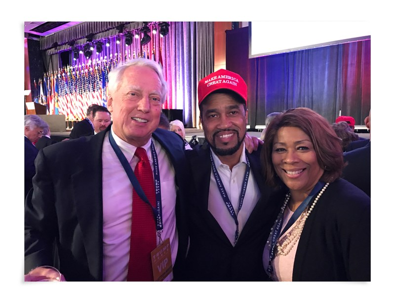
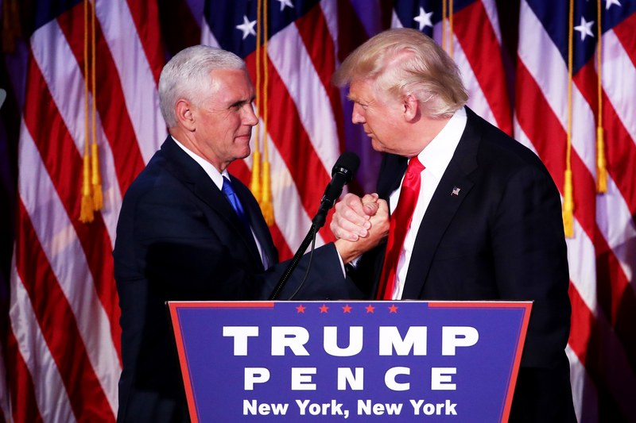

"He Thought He Was Going to Lose": Inside Donald Trump's Election Night War Room

Photo Illustration: Getty
[Culture](https://www.gq.com/culture)

# Inside Donald Trump's Election Night War Room

[(L)](https://www.facebook.com/sharer/sharer.php?u=https%3A%2F%2Fwww.gq.com%2Fstory%2Finside-donald-trumps-election-night-war-room&t=Inside%20Donald%20Trump%27s%20Election%20Night%20War%20Room%20%7C%20GQ)

[(L)](https://twitter.com/share?text=Inside%20Donald%20Trump%27s%20Election%20Night%20War%20Room%20%7C%20GQ&url=https%3A%2F%2Fwww.gq.com%2Fstory%2Finside-donald-trumps-election-night-war-room)

By
[Ben Schreckinger](https://www.gq.com/contributor/ben-schreckinger)
2 days ago

Nobody saw it coming. Not the pundits or the pollsters, not even the Donald himself. From the backrooms of Trump Tower to the studios at Fox News to the VIP lounges of his victory bash, this is the story of Donald Trump's Election Day—perhaps the wildest, weirdest 24 hours in American politics—as told by dozens of the people who found themselves at the center of it..........................................

#### I. "So that's our plan. She'll be calling you."

*On the eve of Election Day, candidate Donald Trump holds rallies in five states—concluding his campaign for the presidency in Grand Rapids, Michigan.*

**Kellyanne Conway,**  *Trump campaign manager:* We're flying from New Hampshire to Michigan, and I get an e-mail. And it's from Robby Mook [Hillary Clinton's campaign manager]. Robby's a very nice guy and very talented. He said, "It's been a real pleasure, I was happy to be campaign managers together," and then he said, "Here's how we'd like to approach tomorrow night: Within 15 minutes of the AP calling the race for Mr. Trump, Secretary Clinton will call him to congratulate him. [Or] Within 15 minutes of the AP calling the race for Secretary Clinton, she will take to the stage and accept, so in other words, we hope to hear from Mr. Trump in that window."

So I read it to Mr. Trump, and he said, "Did you respond?" And I said, "No, I'm not going to respond." I said, "This is a good system, I'll respond later or tomorrow. We have a lot going on." At some point the next day, I responded to Robby. He said, "Your point of contact is Huma Abedin." And he gave me her number. So I was showing Steve Bannon and others [the note]—I only showed them—and I handed it to Mr. Trump. I wanted him to read it. And I said, "So that's our plan. She'll be calling you."

* * *

.........................................

[(L)](https://www.facebook.com/sharer/sharer.php?u=https%3A%2F%2Fwww.gq.com%2Fstory%2Finside-donald-trumps-election-night-war-room&t=681416131CH00002_Republican)

[(L)](https://www.pinterest.com/pin/create/button/?url=https%3A%2F%2Fwww.gq.com%2Fstory%2Finside-donald-trumps-election-night-war-room&media=https%3A%2F%2Fmedia.gq.com%2Fphotos%2F5a00e94507e8e92ddab895f5%2F1%3A1%2Fw_680%2Cc_limit%2Felection-night-oral-history-7-getty.jpg&description=681416131CH00002_Republican)

Chip Somodevilla/Getty

#### II. "It's going to look pretty bad, but we were still confident."

*At the final rally of the campaign—which doesn't conclude until after 1 A.M.—Trump tells his supporters that today is "our Independence Day." He and his exhausted entourage leave Michigan, trailing Hillary Clinton consistently in national polls.*

**Kellyanne Conway:** We got back on Trump Air, and we'd already eaten dinner. We're flying back and I have a blanket on me, and I'm sitting across from Jared [Kushner] and we're both kind of dozing off, feeling guilty about dozing off because now it's Election Day. And I look down and I have a pack of Vienna Fingers in one hand and a pack of Cheetos in the other hand and I'm like, "God, my diet's gone to pot. This guy better win because this is awful."

I remember getting to the Hilton at 4:30 or 5 A.M. and then saying, "Oh, my God, we're going to be up all night for the election," and basically sleeping in until like 9, since like for the first time since I was in second grade.

**Steve Bannon,**  *Trump campaign chairman:* When I got off the plane from Michigan in the morning, I told him, "You’re going to win the presidency today." I walked down the street, got back to the house at like 5 o’clock in the morning, got a little sleep, took a shower, back in about 8, 9 o’clock.

**Matt Mowers,**  *national field coordinator and battleground states director:* Trump Tower, I think I was there just before 5 A.M. We had a war room set up on the fifth floor—that unfinished floor in Trump Tower that was the original campaign headquarters.

[(L)](https://www.facebook.com/sharer/sharer.php?u=https%3A%2F%2Fwww.gq.com%2Fstory%2Finside-donald-trumps-election-night-war-room&t=election-night-oral-history-1-snh.jpg)

[(L)](https://www.pinterest.com/pin/create/button/?url=https%3A%2F%2Fwww.gq.com%2Fstory%2Finside-donald-trumps-election-night-war-room&media=https%3A%2F%2Fmedia.gq.com%2Fphotos%2F5a00e0a03c1d3945a9ce273c%2F1%3A1%2Fw_680%2Cc_limit%2Felection-night-oral-history-1-snh.jpg&description=election-night-oral-history-1-snh.jpg)

John Fredericks and Scottie Nell Hughes
Courtesy of Scottie Nell Hughes

**Scottie Nell Hughes,**  *Trump campaign media surrogate:* I woke up bright and early. It was 4 A.M. I headed over to Trump Tower. John Fredericks, out of Virginia, had his radio station going there. He actually had set up a little radio booth.

**John Fredericks**, *conservative radio host:* Ivanka gave us the exclusive opportunity to—we were the only media that was in the Trump campaign headquarters live.

**Doug Deason,**  *son of Dallas billionaire Darwin Deason, a GOP mega-donor:* I was with Andy Beal; he's the chairman and CEO of Beal Bank, and he's one of the wealthiest people in the country. Andy and I walked over late that morning, Election Day morning. We were literally flies on the wall at that point. But we hung out in the war room and watched what was going on there, and then we hung out in Don Jr.'s office, and he and Tommy Hicks [son of Dallas businessman Tom Hicks] and Gentry Beach [a Dallas investor and close friend of Don Jr.] and Charlie Kirk [conservative millennial activist] were just, you know, doing radio interviews, one after another.

**Sean Spicer,**  *RNC communications director:* Your job is to feed the punditry beast, if you will. I was over at Fox. I had done an interview at Fox News, at Fox Business, and Bill Shine [Fox News co-president] had come down and said, "Do you have a few minutes?" I went up to talk to him, and he had gathered [Fox News executive] Suzanne Scott, [Fox Business executive] Brian Jones, Rupert [Murdoch], you know, and then said, "Hey, can you give us the lay of the land?" We went through the different states, what we had done, what our apparatus was on the ground, what the internal data showed.

*11:15 A.M.—After casting his own ballot in the gym of a Manhattan school just blocks from Trump Tower, Donald Trump, wearing a bright blue tie and a confident smile, visits his campaign headquarters.*

**John Fredericks:** He came out of the elevator, and we were set up right there. He was there with Ivanka and Melania. And he did a triple-take, and he's like, "Fredericks!" And I'm like, "Hey, Mr. Trump!" And I'm like, "Hey, you're going to win, you know that, right?" He says, "From your lips to God's ears, John."

* * *

.........................................

#### III. "The computer guys are already saying that he's going to win."

*Trump rides the elevator up to his office on the 26th floor, where he busies himself with a variety of chores: tending to some business affairs, filming last-minute get-out-the-vote messages for social media, and kibitzing with friends and family. In the early afternoon, he invites in the leaders of his National Diversity Coalition.*

**Pastor Darrell Scott,**  *CEO, National Diversity Coalition for Trump:* Keith [longtime Trump bodyguard Keith Schiller] is there. Keith says, "The boss is back, you want to go holler at him?" I say, "Yeah!" So I go up. He was in his office, and he was relaxed. He's got blueprints, he's got drawings, he's got checks to sign, he's got paperwork; it was like throwing a fish in water. And he looked fresh as a daisy, man. I said to myself, "Hey, if he's not nervous and wound up, why should I be nervous and wound up?"

He was like, "Look, what do I have to lose? I'm gambling with house money. You know what I mean? If I win, great, I want to win; if I lose, what's my default position? The CEO of Trump International."

**Bruce LeVell,**  *executive director, National Diversity Coalition for Trump:* Melania came in, and Melania was really nice. She was thanking us for how we stand up for her husband on TV and defend the family.

**Darrell Scott:** I asked her how Barron was doing. I asked her how he was taking it. She said, "I try to keep him away from the television. That way he doesn't see the negativity."

**Bruce LeVell:** I said hello to Jared, who came in—me and Jared did a dap, you know, "Hey, what's up, how's it going, we're going to do this."

[(L)](https://www.facebook.com/sharer/sharer.php?u=https%3A%2F%2Fwww.gq.com%2Fstory%2Finside-donald-trumps-election-night-war-room&t=election-night-oral-history-4-BL.jpg)

[(L)](https://www.pinterest.com/pin/create/button/?url=https%3A%2F%2Fwww.gq.com%2Fstory%2Finside-donald-trumps-election-night-war-room&media=https%3A%2F%2Fmedia.gq.com%2Fphotos%2F5a00e5201a8b7955878ac0c7%2F1%3A1%2Fw_680%2Cc_limit%2Felection-night-oral-history-4-BL.jpg&description=election-night-oral-history-4-BL.jpg)

Bruce Levell and Jared Kushner
Courtesy of Bruce Levell

**Darrell Scott:** I went back down to the 14th floor and see Brad Parscale [digital director] again. And I say, "Brad, how we looking?" Brad took me into his office, pulled out his computer—he had the biggest computer in the world—and was going down, showing me stats, here, here, here, here, here, we over-performed, over-performed, over-performed.

**Katrina Pierson,**  *Trump campaign national spokesperson:* Brad was just running through all the scenarios that he had. We need these, we're good here, we're great here, we're going to have to watch this. I remember there was a piece of Florida he was watching. I forgot what they called it.

**Darrell Scott:** You know, nothing's a sure thing, but everybody was cautiously optimistic.

**Matt Sheldon,**  *political publicist* (at his office in Lower Manhattan): Pastor Scott had sent us a photo, and he was sitting at the desk with Trump in his office, and he was giving like a thumbs-up. And I said, "Darrell, what's going on over there?" And he said, "It's a really relaxed mood over there. The computer guys are already saying that he's going to win. [Parscale's] throwing a paper airplane right now across the room."

**John Fredericks:** None of the operatives that came from the Republican National Committee thought Trump was going to win. Every single one of the RNC operatives thought they were going to lose. I guess Nevada early voting had come in, [and staffers] were walking around with their heads down, saying it was over, we were not going to win.

**Katrina Pierson:** A lot of the staff just seemed really unsure, and I was extremely stressed out about it. The TV said, "Hillary's going to be the president, it's her moment, Trump's numbers are terrible."

There were staff—not our original staff—but there were just staffers there that just had a look on their face, like, like what they were seeing on TV was true. Like, he wasn't going to win, and he's down ten points in the polls.

I felt like I was the only one that was knowing he was going to win. I said to myself, "Am I in a bubble? Because it doesn't seem like anybody is as confident as I am."

* * *

.........................................

[(L)](https://www.facebook.com/sharer/sharer.php?u=https%3A%2F%2Fwww.gq.com%2Fstory%2Finside-donald-trumps-election-night-war-room&t=681416131AA00220_Republican)

[(L)](https://www.pinterest.com/pin/create/button/?url=https%3A%2F%2Fwww.gq.com%2Fstory%2Finside-donald-trumps-election-night-war-room&media=https%3A%2F%2Fmedia.gq.com%2Fphotos%2F5a00e73198002d2e253671c8%2F1%3A1%2Fw_680%2Cc_limit%2Felection-night-oral-history-5-Getty.jpg&description=681416131AA00220_Republican)

Chip Somodevilla/Getty

#### IV. "He thought he was going to lose."

**Frank Luntz,**  *Republican messaging guru* (unaffiliated with the Trump campaign): I was given access to the Fox News exit poll at three minutes after five. The numbers had Hillary Clinton winning Wisconsin, Pennsylvania—states that Trump eventually won. And it wasn't even close. It looked like she was going to win big.

**Chris Wallace,**  *Fox News Sunday anchor:* The first big moment was about 5:15, 5:30, when all of the top people at Fox News—the executives, the anchors, the researchers—we all went into this huge conference room and they presented the first wave of exit polls.

**Bret Baier,**  *Fox News chief political anchor:* We were asking questions about different elements of the exit polls to our decision team, and it was clear that they were saying, "You know, this is not definitive, but it really looks like Clinton will pull it out by about 11 P.M. Eastern time."

**Frank Luntz:** At 5:01, all the narratives were written: Hillary Clinton was elected president. It's supposed to be a really closely guarded secret. Probably a hundred people were aware, because they prepare their graphics, they prepare all their material. I have a photograph [of a graphic]: "Fox News declares Hillary Clinton elected president."

[The Trump campaign] saw the numbers, and they knew what I knew, which is that up to this point the exit polling had never been this wrong, so the assumption was that she was going to win.

**Chris Wallace:** I spoke to President-elect Trump in an interview I did with him in December, a month later, and he said that going into election night, and after his people had read the exit polls, they thought he was going to lose, too. He thought he was going to lose. That was just the accepted wisdom.

**Boris Epshteyn,**  *Trump campaign senior adviser:* The first numbers started coming in, and then there was this effort organized to have the president and I think Don Jr. and Ivanka and Eric call into local stations. So they made calls into local stations in some of the battleground states. It was something that I think made some difference.

* * *

.........................................

#### V. "We're having pizza and we're just hanging out."

*As night falls, supporters of Hillary Clinton—who is also spending the evening in New York City—descend on Manhattan's Javits Center, for what they expect will be a victory party. Little notice has been taken of reports that the Clinton campaign has cancelled a fireworks display it had planned. The evening is already energized with the sense that history could soon be made—and celebrated under the Javits Center's glass ceiling.*

*Meanwhile, three blocks from Trump Tower, in a nondescript ballroom at the Midtown Hilton, the organizers of Trump's election night event seem to have more modest plans. In a room dominated by a large press pen and risers for camera crews, there's little space for supporters. The guest list has been restricted to friends of the campaign and their guests. As the first invitees arrive, the room feels like it's set up more for a press conference than a victory party.*

**Shalabh "Shalli" Kumar,**  *industrialist and Republican mega-donor:* Most people [at the Hilton] were concerned because one of the channels had started to broadcast the results of the exit polls. So the mood was not positive, let's say.

**Charles Johnson,**  *alt-right activist:* I went first to the Hilton around five-ish, six-ish, and then I was like, "Oh man, it's pretty dead, it's pretty boring. Fuck it, let's go to the Proud Boys thing," which was downtown. So we said, "All right."

*(The Proud Boys—a pro-Trump "Western chauvinist" fraternity founded by VICE media's estranged co-founder, Gavin McInnes—are hosting an election night party at Gaslight lounge in New York's Meatpacking District.)*

**Charles Johnson:** I saw Martin Shkreli there, and I was like, "Martin, I think you're going to go to jail. I don't want to be mean to you." He was kind of indignant, like, "No, man." I was like, "I hope you're having a good time, because you're going to prison." I wasn't trying to be a dick about it. And then Gavin came by and I was like, "Hey, he's going to jail," and he was like, "Don't say that!"

> “We were considering a whole bunch of other recounts in other areas and different places. At one point, I was about to have a flight booked to New Hampshire.” —Matt Mowers

**Boris Epshteyn:** Around 7, I walked over [to the Hilton]. First returns were already coming out. We were down in Florida. And I went over and did a couple of [television] hits, and I remember looking up at the screen in the Hilton while doing that and seeing Florida ping-ponging. When I saw it ping-ponging, I gained a lot of confidence, because it meant that the panhandle was coming our way.

*By early evening, returns in East Coast battleground states are trickling in—and looking surprisingly strong for Trump.*

**Sean Spicer:** A group of us gathered on the fifth floor of Trump Tower in what could be described as basically an oversized utility room. Stepien's going through key counties, Florida in particular—Broward, Miami Dade, southern Florida. What's in, what's not. I would say that at least through 7:30, 8 o'clock, it was a very cautiously optimistic view.

**Matt Mowers:** [Deputy campaign manager Dave] Bossie, Jared was in and out, Reince [Priebus, chairman of the RNC] was in and out, Chris Christie came by for a while. Stepien was in there, [deputy national political director] Justin Clark was in there. Then again, it was myself, [battleground states directors] Wells Griffith, Brian Jack.

**Sean Spicer:** When we started to see a combination of Virginia and North Carolina and Pennsylvania, everything was going in the right direction, even Virginia, which, according to all the public polls and punditry, we were supposed to get killed on. It kept getting closer.

**Matt Mowers:** At one point, Florida looked like it was going to be really close. And then Don McGahn [campaign counsel], Stepien, Mike Roman [head of the campaign's "election protection" effort] were all [wondering] whether we were going to have to take the plane to Florida to prepare for a possible recount.

At one point they asked me if I was able to hop onto a plane that night if we had to send a crew down. And once Florida broke, we were considering a whole bunch of other recounts in other areas and different places. At one point, I was about to have a flight booked to New Hampshire. I think it was a 7 A.M. flight—the earliest for New Hampshire the next day.

*While Trump's staff mulls over the early results, Trump monitors them from his residence at the top of Trump Tower.*

**Kellyanne Conway:** He was calling me, and at about 8:30 or 9 o'clock, I said, "I think it's a good time for you to come down." I said, you know, "We're having pizza and we're just hanging out and we're watching the returns and they're going to start calling states for you—and they're going to start coming in quick succession for both of you."

**Sean Spicer:** So he called Ivanka and had some kind of conversation with her about where everyone was and what everyone was doing. And she said, "Hey, we're down on 5," and the president said, "Okay, well, I'm going to 14, meet me there." And so everybody decamped from 5 and went to 14, and Stepien moved his operation up to there as well—takes the projector and whatever else, moves it up into a little alcove on 14.

**Matt Mowers:** Bob Mercer [campaign donor] was there at the time. He was around for a lot. Rebekah [Mercer] was there for it. Of course, Bannon would be rolling through as well.

**Kellyanne Conway:** So [Trump] walked in, and everybody says, "Oh, he's here." And then all his family started filing in.

*With little fanfare, Trump strolls to a section of the war room normally reserved for the campaign's communication staffers. There, he parks himself in front of a wall of televisions.*

[(L)](https://www.facebook.com/sharer/sharer.php?u=https%3A%2F%2Fwww.gq.com%2Fstory%2Finside-donald-trumps-election-night-war-room&t=election-night-oral-history-2-mm.jpg)

[(L)](https://www.pinterest.com/pin/create/button/?url=https%3A%2F%2Fwww.gq.com%2Fstory%2Finside-donald-trumps-election-night-war-room&media=https%3A%2F%2Fmedia.gq.com%2Fphotos%2F5a00e1c2196d3f6684ae0660%2F1%3A1%2Fw_680%2Cc_limit%2Felection-night-oral-history-2-mm.jpg&description=election-night-oral-history-2-mm.jpg)

Donald Trump in the war room.
Courtesy of Matt Mowers

**Boris Epshteyn:** I got back to the Tower, and there were definitely more people on 14 than we were used to. The president was in the front, the First Lady was next to him, the vice president was next to him, his family was next to them. The president was like, "Hey, Boris is here!"

**Armstrong Williams,**  *business manager for Ben Carson:* We went over to Fifth Avenue, where the security was just unbelievable. But fortunately they were very kind to us and they let the driver get to the front of the building. We go through the security and we get on this elevator, we go up, and we walk into this room, and I was surprised at how few people were in there. I just thought it would be packed like sardines, and it wasn't. And there was the candidate, his running mate, their wives, Jared, Bannon, everybody—I mean, they were all there. I wouldn't be surprised if there were 65 people in the room. It was very intimate. And then the Carsons, myself. Priebus was there. He did a lot of whispering in back rooms, I did notice that. A lot of huddling. Exchanging notes, all that kind of stuff.

I remember walking in and Trump giving me a high-five. I was like, "What?"

* * *

.........................................

#### VI. "Oh, my God, I can't believe this is happening."

*By 9 P.M., the predictions of a Hillary Clinton cakewalk have vanished—and across the political world, a growing sense of uncertainty sets in about how the night is about to unfold. Over on Sixth Avenue, at the studios of Fox News, the realization is dawning that an upset could be under way.*

**Bret Baier:** We went on a commercial break, and I remember turning to Chris Wallace on the set and saying, "This doesn't look like where we were!.... These numbers are not lining up with the exit-poll numbers."

**Chris Wallace:** I think it was 9:04. I was the first network anchor to go on the air, and I said, "I'm open to the possibility that Donald Trump could be the next president of the United States." And we had a big crowd outside of the studio at Fox News headquarters, and they started cheering.

**Bret Baier:** The Associated Press moved a wire: "Chris Wallace says it could be Donald Trump." And I turned to him and said, "I think that was my idea! During the commercial break."

**Frank Luntz** (at CBS News headquarters): You can see such a different look on the faces of the anchors at 7 P.M. on the air, versus what you saw on their faces at 9 P.M.

**Charles Johnson:** A friend of mine had been right behind Chris Christie, and he was reading Chris Christie's texts—he was like shoulder-surfing him—and he saw a text from Frank Luntz to Chris Christie being like, "Oh, my God, I can't believe this is happening." *(Frank Luntz decline to comment.)*

**Bret Baier:** I had been texting people throughout the night, and at the Trump campaign, our people were saying that at about 9:30 in the evening, there were Trump campaign people coming to them with cards and their Gmail accounts, saying, "Please keep in touch. Let us know if something opens up," thinking that they were going to lose.

> "It's like, if you can imagine playing the lottery and scratching off the winning number, the winning scenario, and scratching off the next one and being like, 'Oh, my God, I got one more…'" —Sean Spicer

**Kellyanne Conway:** It all started to change. I was getting a lot of texts and e-mails, I was showing the president without showing him the sources, from people in the media, print and electronic, saying this is what we're learning now from some of the early returns.

**Sean Spicer:** It's like, if you can imagine playing the lottery and scratching off the winning number, the winning scenario, and scratching off the next one and being like, "Oh, my God, I got one more… But it's happening in real time. Where you're like, "It looks like North Carolina's going to go, oh, my God! Pennsylvania's starting to move..."

**Armstrong Williams:** Bannon and Kellyanne and those were very assured, but the president was very cautious. He was very cautious. We talked. We were standing across from him with Dr. Carson, and we kept talking back and forth, and I mean, he was very cautious. Very.

*9:30 P.M.—After showing Trump as the underdog for months, *The New York Times*'s Upshot projects he has a 51 percent chance of winning.*

**Kellyanne Conway:** Nate Cohn [of *The New York Times*'s Upshot] kept changing [his projection], we kept showing [Trump], "Look at *The New York Times.*"

[(L)](https://www.facebook.com/sharer/sharer.php?u=https%3A%2F%2Fwww.gq.com%2Fstory%2Finside-donald-trumps-election-night-war-room&t=election-night-oral-history-6-AW.jpg)

[(L)](https://www.pinterest.com/pin/create/button/?url=https%3A%2F%2Fwww.gq.com%2Fstory%2Finside-donald-trumps-election-night-war-room&media=https%3A%2F%2Fmedia.gq.com%2Fphotos%2F5a00e82786f6024c37a46d55%2F1%3A1%2Fw_680%2Cc_limit%2Felection-night-oral-history-6-AW.jpg&description=election-night-oral-history-6-AW.jpg)

Donald Trump, Pence, and team.
Courtesy of Armstrong Williams

**Armstrong Williams:** I can tell you, it wasn't until *The New York Times* said there's a 48 percent chance that Trump's going to win, there's a 60 percent chance, there's a 70 percent chance, there's an 80 percent chance—it wasn't until the guy said 90 percent that the president broke out in a smile.

**Kellyanne Conway:** Of everyone in that room, certainly of the senior team and his family, he was the one most guarded and least self-congratulatory.

**Armstrong Williams:** He was very cautious, brother. That is a fact. He was not buying into anything people were saying. He was going to sit there—and he sat in the same place! I don't know if he ever really moved much.

**Bret Baier:** I would get up and go talk to our decision desk, and they were saying, you know, there are some surprises here.

* * *

.........................................

#### VII. "No one put [Trump] in a better mood than Don King. That's a fact."

[(L)](https://www.facebook.com/sharer/sharer.php?u=https%3A%2F%2Fwww.gq.com%2Fstory%2Finside-donald-trumps-election-night-war-room&t=election-night-oral-history-9-MR.jpg)

[(L)](https://www.pinterest.com/pin/create/button/?url=https%3A%2F%2Fwww.gq.com%2Fstory%2Finside-donald-trumps-election-night-war-room&media=https%3A%2F%2Fmedia.gq.com%2Fphotos%2F5a00ec3acaa2637175aa5926%2F1%3A1%2Fw_680%2Cc_limit%2Felection-night-oral-history-9-MR.jpg&description=election-night-oral-history-9-MR.jpg)

Stephen Baldwin and friends
Courtesy of Matt Rich

*As 10 P.M. approaches, the victory celebration at the Midtown Hilton begins to gather energy—and a colorful cast of Trump supporters files into the ballroom. At one point, the [alt-right provocateur Milo Yiannopoulos](https://www.gq.com/story/alt-right-supreme-hoodie), wearing aviators indoors at night, begins lecturing a gaggle of reporters, shouting that the election results trickling in are, already, a repudiation of their profession.*

**Scottie Nell Hughes:** Milo was a big, interesting run-in. I had never actually gotten to see Milo in person. Bigger than life. And that wasn't—it was a positive and a negative running into him.

**Matt Sheldon:** Jeanine Pirro, Judge Jeanine. She was there, she was in a really great mood. I remember I said to Stephen [Baldwin], I said, "If he wins, your brother is going to have a job for a long time to come," and he laughed, and I said, "Have you talked to your brother?" and he said, "No, we're in complete radio silence right now about the election. We're not talking."

**Scottie Nell Hughes:** It was a very eclectic group of everybody who for the past year had put their necks on the line for President Trump.

**John Catsimatidis Jr.,**  *son of the billionaire grocery magnate:* I remember Laura Ingraham there, Michael Lindell, the My Pillow guy. One of the nicest guys I've ever met.

**Michael Lindell,**  *My Pillow inventor:* I saw my friend Joe Piscopo. I ran into him right away. Sarah Palin.

[(L)](https://www.facebook.com/sharer/sharer.php?u=https%3A%2F%2Fwww.gq.com%2Fstory%2Finside-donald-trumps-election-night-war-room&t=election-night-oral-history-10-BL.jpg)

[(L)](https://www.pinterest.com/pin/create/button/?url=https%3A%2F%2Fwww.gq.com%2Fstory%2Finside-donald-trumps-election-night-war-room&media=https%3A%2F%2Fmedia.gq.com%2Fphotos%2F5a00ecd2caa2637175aa5928%2F1%3A1%2Fw_680%2Cc_limit%2Felection-night-oral-history-10-BL.jpg&description=election-night-oral-history-10-BL.jpg)

Robert Trump, the president's brother, left
Courtesy of Bruce Levell

**Bruce LeVell:** We were there, Judge Jeanine, and Robert [Trump], just the really core surrogates, Diamond and Silk, Omarosa, Pastor Darrell Scott, my wife and I. Robert was cool. We had a great time. He reminded me a lot of the POTUS, in a way. Just that real sharp-edge talk, you know, just real quick and witty.

**Doug Deason:** There was a main party downstairs, and there was a VIP party upstairs, and then there was a kind of—I don't know what you'd call it—a double VIP or elite VIP or super VIP party in a room off to the side, so I spent most of the time in there.

I'd gone out and I'm wandering around the VIP—the regular VIP area—and I looked over and I see David Koch. And he's kind of wandering around by himself, kind of wandering around, he's looking for that [super VIP] room.

He's very—number one, he's tall, number two, he's deaf in his left ear, and it was loud, so I wasn't going to go up to him and be like, "Hey, David." I just kind of watched him a little bit, and he finally wanders over to that room. You know, there were literally eight or nine billionaires in that room. Carl Icahn came in, Wilbur Ross was there, Harold Hamm, Andy Beal.

> "I turned to my friend and I said, "Oh, my God. I work for the president of the United States.” —Katrina Pierson

**John Catsimatidis Jr.:** When the night started to turn around and it looked like Trump was going to win and the markets started tanking, it was at that point that I actually saw Carl Icahn leave the party. Then a Bloomberg article came out the day after saying that he put a billion dollars to work when the market had collapsed.

*Sometime around 10 P.M., a staffer at Trump Tower is sent to a studio space on the fifth floor to fetch a professional video camera to capture scenes of the historic victory.*

**Sean Spicer:** We realized we were close to winning. We were like, "Shit, someone get the camera."

**Katrina Pierson** (at the Hilton): I don't remember if it was North Carolina or Ohio at first, but after they both came in, I knew it was done. And I turned to my friend—my friends came in from Texas—and I turned to my friend Debbie and I said, "Oh, my God. I work for the president of the United States." And she goes, "Oh, my gosh, oh my gosh!"

**Frank Luntz:** I went to the taping of Stephen Colbert and Colbert came out and said, "Do we have any indication that what we are seeing now isn't going to end up this way at the end of the night?" And I said, "No."

We were supposed to shut off our phones for the taping, and I got texted. Colbert had just started. Someone had been interacting with the exit-poll people, and they told me that they had a huge percentage of refusals—much higher than anyone had expected, and no one had taken that into account. There was a fatal flaw in the exit number. It was the rejection rate, and they believed the rejection rate was overwhelmingly Donald Trump voters who refused to participate. At 11:10 P.M. I realized, nuh-uh, Donald Trump's going to be the next president.

*11:35 P.M.—Fox News calls Iowa, Wisconsin for Trump.*

**Matt Mowers:** Once North Carolina, Ohio, and Iowa were called, you started to hear that folks in the comms room were erupting in applause and cheers and people were saying, "Are we ready to go to the victory party?"

I just remember Stepien and I looking at each other and saying, "Guys, we haven't won yet." And, at the moment, Wisconsin was called, and that brings us to 269. I said, "Wait a minute. Let me double-check something," and I called up our guys in Maine and confirmed that we had at least the Second Congressional District. I said, "Worse comes to worst, we're going to end up at 270 even if nothing else breaks our way."

**Armstrong Williams:** I remember someone called, and Jared gave [Trump] the phone, and Trump looked at me and said, "Armstrong, your brother's on the phone!" I said, "My brother? What are you talking about?" And it was Don King calling. Of all the people that called, no one put him in a better mood than Don King. That's a fact. Don King put him in a very good mood.

*11:55 P.M.—Among the well-wishers and Trump associates eager to join in the celebration is Felix Sater, a Russian-born entrepreneur and sometime business partner of Trump's, who's helped locate potential real estate deals in the former Soviet Union. (Since the election, Sater's links to Russia have come under scrutiny as it's been revealed that he offered, in 2015, to [broker a relationship](https://www.nytimes.com/2017/08/28/us/politics/trump-tower-putin-felix-sater.html) between Trump and Russian president Vladimir Putin—one that he said could win Trump the White House. "I will get Putin on this program and we will get Donald elected," Mr. Sater wrote to Trump's lawyer.)*

*Publicly, Trump has long sought to distance himself from Sater—even testifying in a 2013 deposition that he wouldn't recognize Sater if the two men were in the same room together. On election night, they would have a chance to test that proposition.*

*From his home on Long Island, Sater orders a late-night ride from a car service. His destination: the invite-only victory party at the Midtown Hilton.*

**Driver** (name withheld): I picked him up from his house on Long Island. And then, you know, I said, "Hi, how are you? And he said, "Do you know who I am?" And I said, "No, I don't really know you." He showed me his business card. I think, to show me that he's VIP, an important person, and second, to tell me that he was happy that he won the election, because it's unexpected.

So we talked about the election night. After that he just picked up his phone, and he talked all the way from Long Island to New York. He was talking to somebody in the Russian language.

* * *

.........................................

#### VIII. "Holy shit. We might have won this thing."

*As Election Day gives way to November 9, Trump retreats from the 14th floor to his residence—taking with him his family and a small group of aides including Steve Bannon, Stephen Miller, Kellyanne Conway, and Chris Christie. By now, he is expecting to receive a concession call from Clinton, and he needs to review and adjust the address he plans to deliver soon to the nation.*

**Boris Epshteyn:** Around midnight maybe is when the president went up to the residence with family and a few of the senior staff.

**Kellyanne Conway:** Okay, so we go up to the residence, and then he's working on his acceptance speech, and he changed a lot of it. It was already in his own voice, but taking a good fresh look at it and realizing he was going to be the next president of the United States, he changed a lot of it. Where he said, "I'm going to be the president of all Americans, including those who do not support me, and there are a few of you." He added that.

**Matt Mowers:** Now the problem was after Wisconsin was called, no one wanted to call anything else for a while. Pennsylvania was still too close. But we knew we had Maine at that point. So it was around midnight that it was tentative, but it was kind of like, "Holy shit. We might have won this thing."

**Erik Prince,**  *conservative entrepreneur and founder of Blackwater:* Dave Bossie comes out and yells: "Hey, if you wanna see the next president give an acceptance speech, get over to the Hilton!" So that was a moment that kind of broke up the crowd and people started scooting over to the Hilton, and that was obviously a bit chaotic getting in, because there were a lot of people already in there waiting.

**Sean Spicer:** We all walked over in a big bunch. Like a huge pack of us.

**A.J. Delgado,**  *Trump campaign senior adviser:* I broke down just in the middle of the street, in this dark street, just on the way to the Hilton, just crying like a little girl just because of the amount of work and the amount of emotion that had gone into stumping for this candidate for a year, to realize that it did all pay off.

**Driver:** I dropped [Sater] off at the Hilton hotel on Sixth Avenue and 54th Street. He called the hotel, and he made a room reservation so he can stay over that night. *

*A person familiar with Sater's movements that night confirms that he attends the party—and that once inside the ballroom, he even gives an interview to one of the many television news crews roaming the event. It's not clear if that footage ever airs. (Sater declined to comment for this story, citing the advice of counsel. The White House did not answer e-mailed questions about the status of Trump's relationship with Sater at the time of the election.)*

*1:35 A.M.—Pennsylvania declared for Trump. He has now locked down 264 electoral votes and is ahead in Wisconsin, Michigan, and Arizona. Around this time, Trump leaves his Tower for the Midtown Hilton.*

**Armstrong Williams:** Well, the president was asking the Carsons to come over, and I remember Dr. Carson whispering to me that he can't, he had to go to the hotel to go to bed.

I grabbed [Trump's] hand, and as we were walking out I said, "You're the president of the United States!" He said, "How 'bout that?" That's all he said, "How 'bout that?" As if he were shocked!

**Frank Luntz:** The mood was stunned. I talked to friends at ABC, NBC News, and FOX News, some of them who loved Clinton and some of them who didn't. I didn't talk to anyone who was pro-Trump in any of these organizations. I don't know anybody at one network who was on the air as an analyst who voted for Trump.

There were tears, and the most common comment I got in these calls was, "What am I going to tell my daughter when she wakes up? How do I explain this to my children?" People who wanted to talk to me because they were dumbfounded by what was happening. It's hard to realize now, with a year having passed, just how impossible this outcome was for the people who were responsible for reporting it.

**Bret Baier:** As the night went on, the conversation started turning to, "How did this happen? How did most people miss it?" I think almost all the people on the set woke up that day thinking Hillary Clinton was going to win. I would say almost all at the network, except Sean Hannity and Laura Ingraham and Monica Crowley maybe, for the most part, just looking at numbers, they thought Hillary Clinton was going to win.

**Al Baldasaro,**  *Trump campaign New Hampshire co-chairman:* I was outside [the Hilton] smoking a cigarette about 1:30 in the morning, and one of the Secret Service guys I know came up to me and said, "Hey, Al, you're going to have to go on upstairs." He said Trump's going to be over there in about 45 minutes, and that means we have to lock down the place. That told me right then and there that Trump was the next president.

*2:03 A.M.—Clinton campaign chairman John Podesta addresses the crowd at the Javits Center: "Several states are too close to call, so we're not going to have anything more to say tonight." He does not concede the race on Clinton's behalf.*

**Kellyanne Conway:** Then John Podesta comes out. We're just getting ready to leave for the Hilton. He comes out and says, "Ladies and gentlemen, we're not going to say anything else tonight, get a good night's sleep, we'll talk again in the morning." And so the decision was made that we would just do what we were supposed to do. We would just take the show on the road to the Hilton.

**Erik Prince:** Secretary Clinton was not going to be making any statement that night—still too close, too much detail, all the rest. I heard from some old contacts in the Secret Service that the reason why she didn't come out and make a statement that night was because she had been sedated.

(*In an e-mail, Nick Merrill, Clinton's spokesperson, calls this claim "preposterous." He says, "It’s about as credible as the rest of the crap conspiracy-theory nonsense Erik Prince pushes."*)

**Darrell Scott:** They came and lined some of us up, to go stand on stage with the president. Katrina Pierson, Omarosa, whatever, we want you onstage with the president. Hillary refused—even when the projections came out that Trump would win—she refused to concede. So until she concedes, the president can't come out. So we stood there for an hour! Waiting to go on stage! So after that, some of us said we're going to go sit down, I can't stand no longer, my legs are weak.

*2:30 A.M.—Wisconsin declared for Trump, sealing victory.*

**Erik Prince:** I was waiting, waiting. The networks didn't want to call it. It was midnight, it's one o'clock, it's 1:30, it's 2 o'clock.

> "I handed [Trump] the phone, and I said to Governor Pence, 'Make sure she concedes.’" — Kellyanne Conway

**Charles Johnson:** Fox refused to call it. And then they put us on TV, and I would start the chant, "Call it! Call it! Call it!"

**Kellyanne Conway:** It was decided Governor Pence would go to the stage and say, "Thank you to all of our supporters. We're waiting on election results, we know that we won Pennsylvania, we know that we won, but she's not conceding yet, etc."

Jason Miller, our comms director, holds up his phone and goes, "The AP just called it." And I said, "Which state?" and he goes, "The whole thing."

So as we're going through all of that, my phone is ringing, but I have it out like this, and it's on silent. And Governor Christie's son Patrick says, "Kellyanne, your phone is ringing." I look at it and it says "Abedin," and I'm like, "Shut up, everyone!"

And they all look over, and I'm like, "This is Kellyanne," and she said, "Hey Kelly, it's Huma! How are you?" I'm like, "Huma, what's up?" Like, "How are you?" And she said—because she's very nice and we're fine—she said, "Secretary Clinton was hoping to talk to Mr. Trump," and I said, now? And she said, "If he's available," and I said he's available.

I handed him the phone and I said, "Congratulations, Mr. President-elect." And then Don Jr. took me up in his arms. And I'm not really sure why—we're all delirious—and I said, "I think we should all hug more." Anyway. So I handed him the phone, and I said to Governor Pence, "Make sure she concedes." He had to hear that from her. And she did. She called him and she congratulated him and she conceded the election to him.

*2:35 A.M.—Clinton's concession is reported in the media.*
*2:40 A.M.—Fox News declares Trump the 45th president of the United States.*

* * *

.........................................

[(L)](https://www.facebook.com/sharer/sharer.php?u=https%3A%2F%2Fwww.gq.com%2Fstory%2Finside-donald-trumps-election-night-war-room&t=681416131AA00176_Republican)

[(L)](https://www.pinterest.com/pin/create/button/?url=https%3A%2F%2Fwww.gq.com%2Fstory%2Finside-donald-trumps-election-night-war-room&media=https%3A%2F%2Fmedia.gq.com%2Fphotos%2F5a00ef781a8b7955878ac0cc%2F1%3A1%2Fw_680%2Cc_limit%2Felection-night-oral-history-12-Getty.jpg&description=681416131AA00176_Republican)

Mark Wilson/Getty

#### IX. "That night was unbelievable and unrealistic. And I'm actually living it."

**Chris Wallace:** We were in this very modern studio, which had these huge graphic screens, and then I saw it, you know, "Donald Trump Elected President."

**Bret Baier:** I remember everyone sitting on the set and just staring at it for a while, wide-eyed.

**Chris Wallace:** I remember—and you know nobody had been more ahead of the curve in predicting this might happen as the night went on—just looking at that and almost wondering whether this was a dream. Was this really happening? I remember asking myself, being so stunned by the fact.

**Shalabh "Shalli" Kumar:** As soon as it was announced, our team broke out into our traditional Bhangra dance in the hotel. It's a very happy, celebratory dance form. A lot of people stopped by to see what was going on.

**Boris Epshteyn:** I sensed such a shock in the media. I just remember looking up, because you guys were in the risers, right? I just remember looking up and just sensing this complete, like, "What just happened? We were here to witness a funeral, we're witnessing a wedding. Or the birth of a new president."

*2:50 A.M.—Trump takes the stage to deliver his victory address.*

**Darrell Scott:** I was right near the front, because Brad Parscale, you know how tall he is, Brad looked out over that whole assembly. He looked at me, we locked eyes, and he said, "I told you."

**Frank Luntz:** I watched it from the office of David Rhodes, who's the president of CBS News. I was the only one in his office. He had all four TVs on to the different news programs. He was not in there. Nobody else was around. I went in there and I shut the doors because I really didn't want to talk to anyone.

**Katrina Pierson:** We were on the stage all together. I'm just standing there looking at all the people, and of course [Trump] points to the back room where all the cameras are, and I'm just smiling at all of them. Even thinking about it now, going from where I came from to where I was standing in that moment, that night was unbelievable and unrealistic. And I'm actually living it. I did have a self-reflective moment of, "Wow, I'm here." I thought about just growing up as a child with a 15-year-old mother who became addicted to drugs.

*After delivering his victory speech, Trump worked his way through a crowd of supporters directly in front of the stage before disappearing through a side door, stage left.*

**Michael Lindell:** Forever etched in my mind will be Rudy Giuliani hugging me and saying, "Wow, he won! He did it!" And then Mr. Trump came down and thanked us all, went right down the line.

**Erik Prince:** I remember texting congratulations to Steve [Bannon]. I said to Steve, "Congratulations, where are you?" And he said, "I'm going to bed, I have a meeting at 8 o'clock tomorrow."

**Matt Sheldon:** My wife was in Russia, so I remember speaking on the phone. I guess the people in Russia were very happy; they wanted Trump to win. I remember her family was very happy. It was probably three in the morning where we were.

> "Was this really happening? I remember asking myself, being so stunned by the fact.” —Chris Wallace

**Matt Mowers:** Most of us stayed back [at Trump Tower] during the speech, just trying to really go through and figure out what the exact margins were, figure out what the exact states were. Stepien, Clark, Rick Dearborn, me, Wells, a few others, just to see where the final chips were going to fall in some places, because we also had to make sure that Democrat state parties weren't going to try to file recounts.

But it's funny. Then a few of us walked over. I think it was probably around 3 A.M. or whenever he was finishing his speech. We walked over to the Hilton finally and walked through it. I remember seeing Kellyanne in the lobby still.

*3:19 A.M.—Trump and his inner circle descend to a garage area, where the president-elect's motorcade awaits. Far from the cameras and crowds, the group engages in a final, private celebration.*

**Katrina Pierson:** [Trump] waved at me, pulled me over, said thank you, and then gave me a hug, a kiss on the cheek.

Don Jr. was standing there, and he was shaking hands and giving people hugs and just thanking everybody that was around him at that moment. He looked relieved. There was a sense of relief that it was over.

*3:29 A.M.—Trump arrives home at Trump Tower, where he takes a call from the White House. On the line is President Obama, who has phoned to offer his congratulations to the new president-elect.*

**Scottie Nell Hughes:** I went straight over to CNN to do *New Day* the following morning. They start *New Day* at 3 A.M. I went on live with them, and that was probably one of the hardest segments I've ever done, because I was facing Hilary Rosen. I sincerely felt she was scared as a member of the LGBTQ community. She was scared of President Trump. And I had to go on air and comfort her and tell her she had nothing to fear with President Trump being elected.

That was one of the most heartfelt moments I've ever had to do on television, because I did get to see the fear that they felt. And I did get to see the tears in the green room, where I knew that if Trump had lost, those same [people] would have probably been, like I said, tap dancing on our graves.

**Bret Baier:** We convinced a bar a couple blocks away to stay open, even though they were closing down, an Irish place right around the block from headquarters. We just all had a beer and toasted the night being a broadcast success and how surreal the whole thing was, and then I remember telling people that night, "Well, at least now it will slow down." I was wrong.

**Matt Mowers:** A bunch of us went to the Whiskey Trader that night. They kept it open. They maybe did last call 15 minutes later, so everyone could pack up their drinks.

**Erik Prince:** I ended up taking a bunch of people, Charles [Johnson] and a bunch of random people—one of the Baldwin brothers—out to a diner, and we had breakfast at like 5:30 in the morning.

**Armstrong Williams:** It was a fun night. Especially the Don King part.

* * *

.........................................

#### X. "I just turned on CNN for a second, just so I could see their faces."

*6:36 A.M.—The sun rises on a very different world.*

**Matt Mowers:** I maybe slept for an hour. I was back at the Tower I think by 7, 7:30. You've got the transition team kind of rolling in. The folks who have actually been building it. So they start showing up for meetings. You've got campaign staff kind of around, looking around for direction about what to do. It was pretty empty.

**Katrina Pierson:** I woke up around 8. And I just turned on CNN for a second, just so I could see their faces. I put it on mute. I just wanted to see the looks on their faces.

**Matt Mowers:** It started filling up by 8:30, 9 o'clock, and you've got a mix of people who knew they had a job to do. So Christie, Kellyanne, Bannon, Pence was there pretty early, because they were all starting to set up meetings. And [Ed] McMullen, who's from South Carolina, who's helping out with the transition, got in then. You had some folks that wanted nothing to do with anything that day, so they all just went and started getting brunch, having a Bloody Mary, and then another chunk of staff was staying behind trying to figure out what we needed to do to set up a government.

**Sean Spicer:** I went and got a lottery ticket that morning, at 9 A.M. I just thought, "Wow, let's see how long this lasts."

*11:40 A.M.—Hillary Clinton addresses her supporters from the Wyndham New York Hotel in Midtown, saying, "We have still not shattered that highest and hardest glass ceiling, but someday someone will."*

**Steve Bannon:** I had no interest in seeing her concession speech. I have no interest in a damn thing with their campaign because I don’t think they knew what they were doing.

**A.J. Delgado:** I remember walking up to the Tower, and the streets were kind of empty, obviously, because then they really had it blocked off. And the Peninsula [Hotel] had a ton of barricades around it, and it was, we were told, because Hillary's camp had basically rented out a few of the top floors and the rooftop. And why the Peninsula? It was because apparently they wanted to celebrate facing Trump Tower. And you walked by and it looked ghostly. A lot of it was empty, because they had rented out so much of it.

It was just this glaring symbolism of this campaign that had so much money, had so much going for it, so much of the media behind it. I think it was almost like a *Titanic* type of, "Your hubris got the best of you. And you forgot to actually campaign, and you forgot about the actual voter. And now look, the Peninsula is empty and I'm walking to Trump Tower. And we just had an election night victory party and you just conceded."

*12:19 P.M.—President Obama addresses the nation from the White House Rose Garden saying, "Everybody is sad when their side loses an election. But the day after, we have to remember that we're actually all on one team."*

**Katrina Pierson:** I go in his office, and I go, "Mr. President." He goes, "Can you believe it?"

**Ben Schreckinger**  *is a* GQ *correspondent in Washington, D.C.*
*Additional reporting by Luisa Rollenhagen.*
*Interviews have been lightly edited and condensed for clarity.*

* * *

.........................................

###### Watch Now:

#### Trump Is Lying About Russia