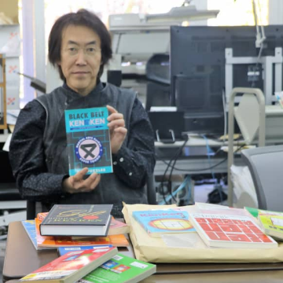

'Teaching without teaching': Creator of KenKen puzzles cultivates young minds through math and fun | The Japan Times

'Teaching without teaching': Creator of KenKen puzzles cultivates young minds through math and fun | The Japan Times

https://www.japantimes.co.jp/news/2019/01/18/national/teaching-without-teaching-creator-kenken-puzzles-cultivates-young-minds-math-fun/#.XEMlCs_7R24

Mathematics teacher and puzzle creator Tetsuya Miyamoto says he's probably watched Bruce Lee's "Enter the Dragon" at least 20 times. Miyamoto, whose numeri