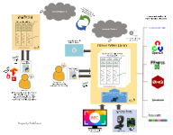
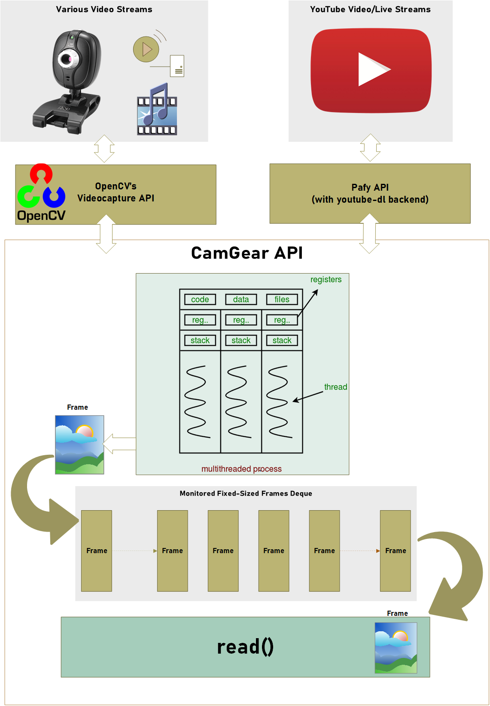
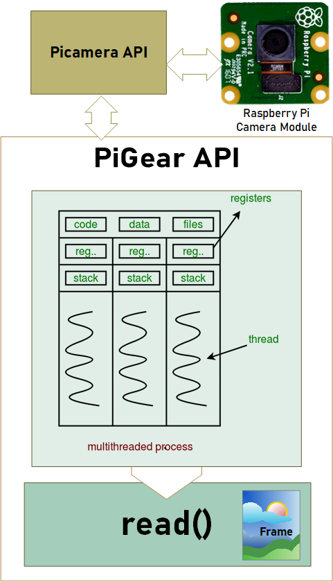
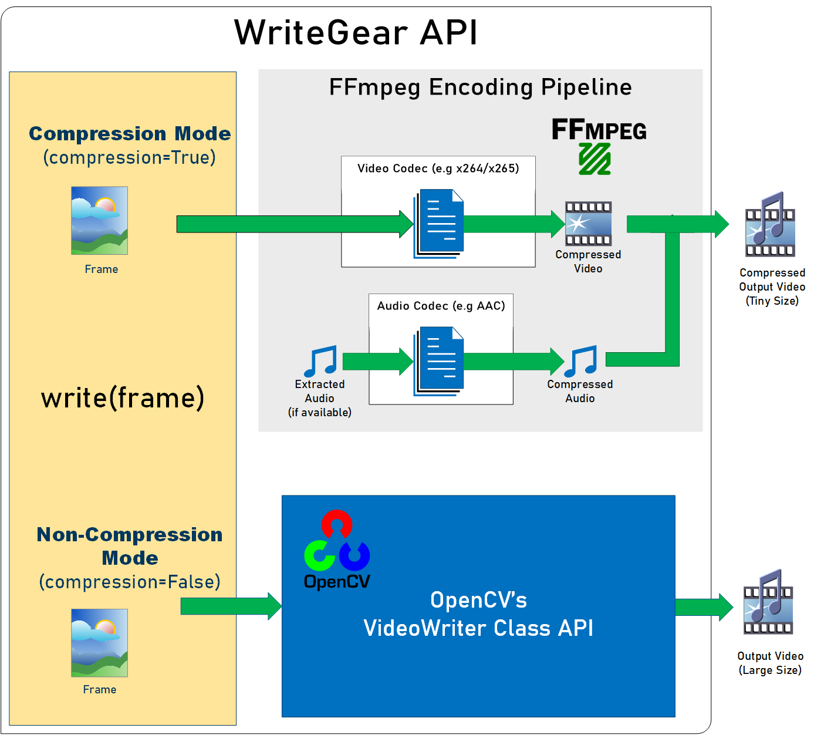
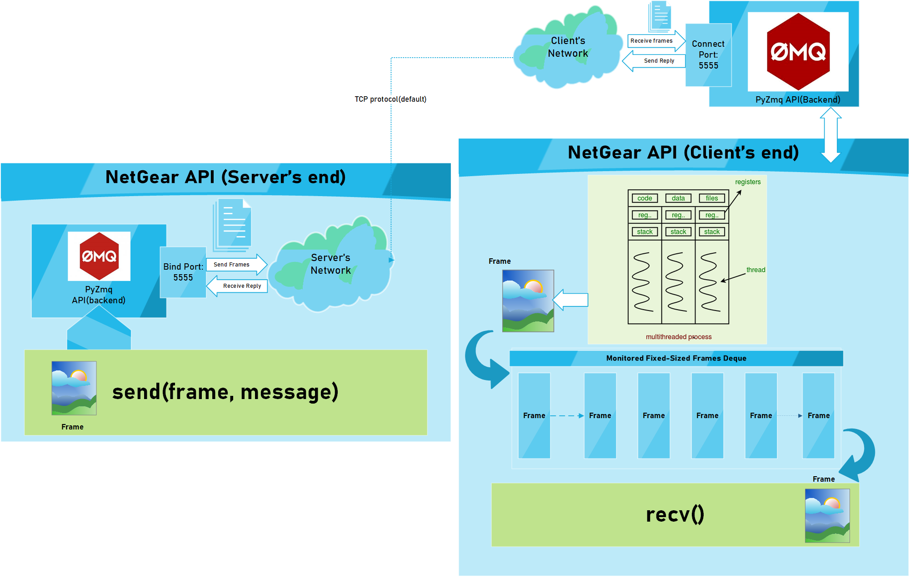

abhiTronix/vidgear: Most Powerful multi-threaded Video Processing Python framework powerpacked with unique trailblazing features.

#   

##   

[Releases](https://github.com/abhiTronix/vidgear/releases/latest)   |   [Gears](https://github.com/abhiTronix/vidgear#gears)   |   [Wiki Documentation](https://github.com/abhiTronix/vidgear/wiki)   |   [Installation](https://github.com/abhiTronix/vidgear#installation)   |   [License](https://github.com/abhiTronix/vidgear#license)

    

[![68747470733a2f2f696d672e736869656c64732e696f2f707970692f762f766964676561722e7376673f7374796c653d666f722d7468652d6261646765266c6f676f3d646174613a696d6167652f706e673b6261736536342c6956424f5277304b47676f414141414e53556845556741414143414141414167434159414141427a656e72304141414243306c45515652596864575650516f434d5243465836485932676861695a5558734c573045447942726257744e2f45554873485457466e5979434c3467786962565a5a6c5a7a4b546e577a30515a706b3572307649646b462f6b4250414d4f4b656464452b4351504b6f633559743563546a424d645153774451546f5767424a416e336a6d6871676c746170415636453662355531374d4747415561556a3037546669634d6649425a44563676786f77426d314250395762535145346f356839496a504a6d793733544550444478566d6f5a64517251356a52686c7939513874674d55586b4949576e306f4734475951664158517a7a3150476f4369516e644d37623452674a61792f68377a424c5433684153676f4b6a616d514a4d72654b66306766754147795974584549414b634c2f44737331356971366f685867686f7a4c5969414d78507541437774495434796551557841614c725a77416f7147524b476b377144535954665951384c75596e4141414141456c46546b5375516d4343](../_resources/075521b448926c4f301a480a6c472772.png)](https://pypi.org/project/vidgear/)  [![68747470733a2f2f696d672e736869656c64732e696f2f62616467652f5361792532305468616e6b732d212d3145414544422e7376673f7374796c653d666f722d7468652d6261646765266c6f676f3d64617461253341696d616765253246737667253242786d6c2533426261736536342532435044393462577767646d567963326c76626a30694d5334774969426c626d4e765a476c755a7a3069565652474c546769507a343863335a6e49476c6b50534a7a646d63794969423361575230614430694e6a51314969426f5a576c6e61485139496a55344e534967646d567963326c76626a30694d5334774969423462577875637a30696148523063446f764c336433647935334d793576636d63764d6a41774d43397a646d6369506941385a7942705a443069624746355a584978496a3467494478775958526f49476c6b50534a775958526f4d6a51784e7949675a443069625449354e79347a494455314d4334344e324d744d544d754e7a63314c5445314c6a517a4e6930304f4334784e7a45744e4455754e544d744e7a59754e444d314c5459324c6a67334e4330344d7934334e4451744e6a4d754d6a51794c546b314c6a45304d6930334d69347a4f5451744d5449354c6a45304c5445774d7934334c5459794c6a59344e5330314e7934334d6930344f53347a4d4459744d5445314c6a63784c5467354c6a49784e4330784f5451754d7a51674d4334774e4451314d5449744d7a67754d7a6730494449754e6a59774f4330314d7934784e7a49674d544d754e4445744e7a55754e7a6b33494445344c6a497a4e79307a4f43347a4f4459674e4455754d5330324e6934354d446b674e7a6b754e4451314c5467304c6a4d314e5341794e43347a4d6a55744d5449754d7a553249444d324c6a4d794d7930784e7934344e4455674e7a59754f5451304c5445344c6a4133494451794c6a51354d7930774c6a497a4e44677a494455784c6a517a4f5341304c6a63784f5463674e7a59754e444d31494445344c6a51314d69417a4d4334304d6a55674d5459754e7a4530494459784c6a6330494455794c6a517a4e6941324f4334794d544d674e7a63754f44457862444d754f546b344d5341784e5334324e7a49674f5334344e546b324c5449784c6a55344e574d314e5334334d5459744d5449784c6a6b334944497a4d7934324c5445794d4334784e5341794f5455754e53417a4c6a417a4d5459674d546b754e6a4d3449444d354c6a41334e6941794d5334334f5451674d5449794c6a5578494451754d7a67774d5341784e6a6b754e5445744d6a49754e7a4531494459784c6a4d774f5330324e53347a4f4341784d4467754d4455744d5459304c6a4178494445334f5334324f4330324e4334324f4445674e4459754f5463304c54457a4e7934344f4341784d5467754d4455744d5451794c6a6b34494445794f4334774d7930314c6a6b784e5455674d5445754e5467344c5441754d6a67794d5459674d5334344d5455354c5449324c6a51774f4330794e7934304e6a46364969426d615778735053496a5a4751314d44526d496938253242494477765a7a34384c334e325a7a34253344](../_resources/ed15362e818a3aab4a70d627129ee0ea.png)](https://saythanks.io/to/abhiTronix)  

VidGear is a powerful python Video Processing library built with multi-threaded [**Gears**](https://github.com/abhiTronix/vidgear#gears) each with a unique set of trailblazing features. These APIs provides a easy-to-use, highly extensible, and multi-threaded wrapper around many underlying state-of-the-art libraries such as *[OpenCV ➶](https://github.com/opencv/opencv), [FFmpeg ➶](https://www.ffmpeg.org/), [picamera ➶](https://github.com/waveform80/picamera), [pafy ➶](https://github.com/mps-youtube/pafy), [pyzmq ➶](https://github.com/zeromq/pyzmq) and [python-mss ➶](https://github.com/BoboTiG/python-mss)*

The following **functional block diagram** clearly depicts the functioning of VidGear library:

 

# Table of Contents

[**TL;DR**](https://github.com/abhiTronix/vidgear#tldr)
[**Gears: What are these?**](https://github.com/abhiTronix/vidgear#gears)

- [**CamGear**](https://github.com/abhiTronix/vidgear#camgear)
- [**PiGear**](https://github.com/abhiTronix/vidgear#pigear)
- [**VideoGear**](https://github.com/abhiTronix/vidgear#videogear)
- [**ScreenGear**](https://github.com/abhiTronix/vidgear#screengear)
- [**WriteGear**](https://github.com/abhiTronix/vidgear#writegear)
- [**NetGear**](https://github.com/abhiTronix/vidgear#netgear)

[**Installation**](https://github.com/abhiTronix/vidgear#installation)

- [**Prerequisites**](https://github.com/abhiTronix/vidgear#prerequisites)
- [**1 - PyPI Install**](https://github.com/abhiTronix/vidgear#option-1-pypi-install)
- [**2 - Release Archive Download**](https://github.com/abhiTronix/vidgear#option-2-release-archive-download)
- [**3 - Clone Repo**](https://github.com/abhiTronix/vidgear#option-3-clone-the-repo)

[**New-Release SneekPeak: v0.1.6**](https://github.com/abhiTronix/vidgear#new-release-sneekpeak--vidgear-016)

[**Documentation**](https://github.com/abhiTronix/vidgear#documentation)
**For Developers/Contributors**

- [**Testing**](https://github.com/abhiTronix/vidgear#testing)
- [**Contributing**](https://github.com/abhiTronix/vidgear#contributing)

**Additional Info**

- [**Supported Python legacies**](https://github.com/abhiTronix/vidgear#supported-python-legacies)
- [**Changelog**](https://github.com/abhiTronix/vidgear#changelog)
- [**Citing**](https://github.com/abhiTronix/vidgear#citing)
- [**License**](https://github.com/abhiTronix/vidgear#license)

# TL;DR

#### What is vidgear?

***> "VidGear is an > [> ultrafast➶](https://github.com/abhiTronix/vidgear/wiki/FAQ-&-Troubleshooting#2-vidgear-is-ultrafast-but-how)> , compact, flexible and easy-to-adapt complete Video Processing Python Library."***

#### What does it do?

***> "VidGear can read, write, process, send & receive video frames from various devices in real-time."***

#### What is its purpose?

***> "Built with simplicity in mind, VidGear lets programmers and software developers to easily integrate and perform complex Video Processing tasks in their existing or new applications, without going through various underlying library's documentation and using just a few lines of code. Beneficial for both, if you're new to programming with Python language or already a pro at it."***

**For more advanced information, see the [*Wiki Documentation ➶*](https://github.com/abhiTronix/vidgear/wiki).**

# Gears

**> VidGear is built with various **> Multi-Threaded APIs**>   *> (a.k.a Gears)*>  each with some unique function/mechanism.**

Each of these API is designed exclusively to handle/control different device-specific video streams, network streams, and media encoders. These APIs provides an easy-to-use, highly extensible, and a multi-threaded wrapper around various underlying libraries to exploit their features and functions directly while providing robust error-handling.

**These Gears can be classified as follows:**
**A. VideoCapture Gears:**

- [**CamGear:**](https://github.com/abhiTronix/vidgear#camgear)  *Targets various IP-USB-Cameras/Network-Streams/YouTube-Video-URL.*
- [**PiGear:**](https://github.com/abhiTronix/vidgear#pigear)  *Targets various Raspberry Pi Camera Modules.*
- [**ScreenGear:**](https://github.com/abhiTronix/vidgear#screengear)  *Enables ultra-fast Screen Casting.*
- [**VideoGear:**](https://github.com/abhiTronix/vidgear#videogear)  *A common API with Video Stabilizer wrapper.*

**B. VideoWriter Gear:**

- [**WriteGear:**](https://github.com/abhiTronix/vidgear#writegear)  *Handles easy Lossless Video Encoding and Compression.*

**C. Network Gear:**

- [**NetGear:**](https://github.com/abhiTronix/vidgear#netgear)  *Targets synchronous/asynchronous video frames transferring between interconnecting systems over the network.*

## CamGear

*> CamGear can grab ultra-fast frames from diverse range of devices/streams, which includes almost any IP/USB Cameras, multimedia video file format (> [*> upto 4k tested*](https://github.com/abhiTronix/vidgear/blob/e0843720202b0921d1c26e2ce5b11fadefbec892/vidgear/tests/benchmark_tests/test_benchmark_playback.py#L65)> ), various network stream protocols such as `http(s), rtp, rstp, rtmp, mms, etc.`> , plus support for live Gstreamer's stream pipeline and YouTube video/livestreams URLs.*

CamGear provides a flexible, high-level multi-threaded wrapper around `OpenCV's`  [VideoCapture class](https://docs.opencv.org/master/d8/dfe/classcv_1_1VideoCapture.html#a57c0e81e83e60f36c83027dc2a188e80) with access almost all of its available parameters and also employs [`pafy`](https://github.com/mps-youtube/pafy) python APIs for live [YouTube streaming](https://github.com/abhiTronix/vidgear/wiki/CamGear#2-camgear-api-with-live-youtube-piplineing-using-video-url). Furthermore, CamGear implements exclusively on [**Threaded Queue mode**](https://github.com/abhiTronix/vidgear/wiki/Threaded-Queue-Mode) for ultra-fast, error-free and synchronized frame handling.

**Following simplified functional block diagram depicts CamGear API's generalized working:**

 

### CamGear API Guide:

[**>>> Usage Guide**](https://github.com/abhiTronix/vidgear/wiki/CamGear#camgear-api)

## VideoGear

*> VideoGear API provides a special internal wrapper around VidGear's exclusive > [**> Video Stabilizer**](https://github.com/abhiTronix/vidgear/wiki/Stabilizer-Class)>  class.*

Furthermore, VideoGear API can provide internal access to both [CamGear](https://github.com/abhiTronix/vidgear#camgear) and [PiGear](https://github.com/abhiTronix/vidgear#pigear) APIs separated by a special flag. Thereby, *this API holds the exclusive power for any incoming VideoStream from any source, whether it is live or not, to access and stabilize it directly with minimum latency and memory requirements.*

**Below is a snapshot of a VideoGear Stabilizer in action:**

 

 *Original Video Courtesy [@SIGGRAPH2013](http://liushuaicheng.org/SIGGRAPH2013/database.html)*

Code to generate above VideoGear API Stabilized Video(*See more detailed usage examples [here](https://github.com/abhiTronix/vidgear/wiki/Real-time-Video-Stabilization#usage)*):

# import librariesfrom vidgear.gears import VideoGearimport numpy as npimport cv2

stream_stab = VideoGear(source='test.mp4', stabilize  =  True).start() # To open any valid video stream with `stabilize` flag set to True.stream_org = VideoGear(source='test.mp4').start() # open same stream without stabilization for comparison# infinite loopwhile  True:

frame_stab = stream_stab.read() # read stabilized frames  # check if frame is None  if frame_stab is  None: #if True break the infinite loop  break  #read original frame frame_org = stream_org.read() #concatenate both frames output_frame = np.concatenate((frame_org, frame_stab), axis=1) #put text cv2.putText(output_frame, "Before", (10, output_frame.shape[0] -  10),cv2.FONT_HERSHEY_SIMPLEX, 0.6, (0,255,0), 2)

cv2.putText(output_frame, "After", (output_frame.shape[1]//2+10, frame.shape[0] -  10),cv2.FONT_HERSHEY_SIMPLEX, 0.6, (0,255,0), 2)

cv2.imshow("Stabilized Frame", output_frame) # Show output window key = cv2.waitKey(1) &  0xFF  # check for 'q' key-press  if key ==  ord("q"): #if 'q' key-pressed break out  breakcv2.destroyAllWindows()# close output windowstream_org.stop()

stream_stab.stop()# safely close video streams.

### VideoGear API Guide:

[**>>> Usage Guide**](https://github.com/abhiTronix/vidgear/wiki/VideoGear#videogear-api)

## PiGear

*> PiGear is similar to CamGear but made to support various Raspberry Pi Camera Modules *> (such as > [> OmniVision OV5647 Camera Module](https://github.com/techyian/MMALSharp/wiki/OmniVision-OV5647-Camera-Module)>  and > [> Sony IMX219 Camera Module](https://github.com/techyian/MMALSharp/wiki/Sony-IMX219-Camera-Module)> )*> .*

PiGear provides a flexible multi-threaded wrapper around complete [**picamera**](https://github.com/waveform80/picamera) python library to interface with these modules correctly, and also grants the ability to exploit its various features like `brightness, saturation, sensor_mode, etc.` effortlessly.

Best of all, PiGear API provides excellent Error-Handling with features like a threaded internal timer that keeps active track of any frozen threads and handles hardware failures/frozen threads robustly thereby will exit safely if any failure occurs. So now if you accidently pulled your camera module cable out when running PiGear API in your script, instead of going into possible kernel panic/frozen threads, API exit safely to save resources.

**Following simplified functional block diagram depicts PiGear API:**

 

### PiGear API Guide:

[**>>> Usage Guide**](https://github.com/abhiTronix/vidgear/wiki/PiGear#pigear-api)

## ScreenGear

*> ScreenGear API act as Screen Recorder, that can grab frames from your monitor in real-time either by define an area on the computer screen or fullscreen at the expense of insignificant latency. It also provide seemless support for capturing frames from multiple monitors.*

ScreenGear provides a high-level multi-threaded wrapper around [**python-mss**](https://github.com/BoboTiG/python-mss) python library API and also supports a easy and flexible direct internal parameter manipulation.

**Below is a snapshot of a ScreenGear API in action:**

 

Code to generate the above result:

# import librariesfrom vidgear.gears import ScreenGearimport cv2

stream = ScreenGear().start()# infinite loopwhile  True:

frame = stream.read() # read frames  # check if frame is None  if frame is  None: #if True break the infinite loop  break cv2.imshow("Output Frame", frame) # Show output window key = cv2.waitKey(1) &  0xFF  # check for 'q' key-press  if key ==  ord("q"): #if 'q' key-pressed break out  breakcv2.destroyAllWindows()# close output windowstream.stop()# safely close video stream.

### ScreenGear API Guide:

[**>>> Usage Guide**](https://github.com/abhiTronix/vidgear/wiki/ScreenGear#screengear-api)

## WriteGear

*> WriteGear handles various powerful Writer Tools that provide us the freedom to do almost anything imagine with multimedia files.*

WriteGear API provide a complete, flexible & robust wrapper around [**FFmpeg**](https://www.ffmpeg.org/), a leading multimedia framework. With WriteGear, we can process real-time video frames into a lossless compressed format with any suitable specification in just few easy [lines of codes](https://github.com/abhiTronix/vidgear/wiki/Compression-Mode:-FFmpeg#1-writegear-bare-minimum-examplecompression-mode). These specifications include setting any video/audio property such as `bitrate, codec, framerate, resolution, subtitles,  etc.` easily as well complex tasks such as multiplexing video with audio in real-time(see this [example wiki](https://github.com/abhiTronix/vidgear/wiki/Working-with-Audio#a-live-audio-input-to-writegear-class)). Best of all, WriteGear grants the freedom to play with any FFmpeg parameter with its exclusive custom Command function(see this [example wiki](https://github.com/abhiTronix/vidgear/wiki/Custom-FFmpeg-Commands-in-WriteGear-API#custom-ffmpeg-commands-in-writegear-api)), while handling all errors robustly.

In addition to this, WriteGear also provides flexible access to [**OpenCV's VideoWriter API**](https://docs.opencv.org/master/dd/d9e/classcv_1_1VideoWriter.html#ad59c61d8881ba2b2da22cff5487465b5) which provides some basic tools for video frames encoding but without compression.

**WriteGear primarily operates in the following two modes:**

- **Compression Mode:** In this mode, WriteGear utilizes [**`FFmpeg's`**](https://www.ffmpeg.org/) inbuilt encoders to encode lossless multimedia files. It provides us the ability to exploit almost any available parameters available within FFmpeg, with so much ease and flexibility and while doing that it robustly handles all errors/warnings quietly. **You can find more about this mode [here](https://github.com/abhiTronix/vidgear/wiki/Compression-Mode:-FFmpeg)**.
- **Non-Compression Mode:** In this mode, WriteGear utilizes basic OpenCV's inbuilt [**VideoWriter API**](https://docs.opencv.org/3.4/d8/dfe/classcv_1_1VideoCapture.html). Similar to compression mode, WriteGear also supports all parameters manipulation available within OpenCV's VideoWriter API. But this mode lacks the ability to manipulate encoding parameters and other important features like video compression, audio encoding, etc. **You can learn about this mode [here](https://github.com/abhiTronix/vidgear/wiki/Non-Compression-Mode:-OpenCV)**.

**Following functional block diagram depicts WriteGear API's generalized working:**

 

### WriteGear API Guide:

[**>>> Usage Guide**](https://github.com/abhiTronix/vidgear/wiki/WriteGear#writegear-api)

## NetGear

*> NetGear is exclusively designed to transfer video frames synchronously and asynchronously between interconnecting systems over the network in real-time.*

NetGear implements a high-level wrapper around [**PyZmQ**](https://github.com/zeromq/pyzmq) python library that contains python bindings for [ZeroMQ](http://zeromq.org/) - a high-performance asynchronous distributed messaging library that aim to be used in distributed or concurrent applications. It provides a message queue, but unlike message-oriented middleware, a ZeroMQ system can run without a dedicated message broker.

NetGear provides seamless support for bidirectional data transmission between receiver(client) and sender(server) through bi-directional synchronous messaging patterns such as zmq.PAIR *(ZMQ Pair Pattern)* & zmq.REQ/zmq.REP *(ZMQ Request/Reply Pattern)*.

NetGear also supports real-time frame Encoding/Decoding compression capabilities for optimizing performance while sending the frames directly over the network, by encoding the frame before sending it and decoding it on the client's end automatically in real-time.

For security, NetGear implements easy access to ZeroMQ's powerful, smart & secure Security Layers, that enables strong encryption on data, and unbreakable authentication between the Server and the Client with the help of custom certificates/keys and brings easy, standardized privacy and authentication for distributed systems over the network.

Best of all, NetGear can robustly handle Multiple Servers devices at once, thereby providing access to seamless Live Streaming of the multiple device in a network at the same time.

**NetGear as of now seamlessly supports three ZeroMQ messaging patterns:**

- [**`zmq.PAIR`**](https://learning-0mq-with-pyzmq.readthedocs.io/en/latest/pyzmq/patterns/pair.html)  *(ZMQ Pair Pattern)*
- [**`zmq.REQ/zmq.REP`**](https://learning-0mq-with-pyzmq.readthedocs.io/en/latest/pyzmq/patterns/client_server.html)  *(ZMQ Request/Reply Pattern)*
- [**`zmq.PUB/zmq.SUB`**](https://learning-0mq-with-pyzmq.readthedocs.io/en/latest/pyzmq/patterns/pubsub.html)  *(ZMQ Publish/Subscribe Pattern)*

**Following functional block diagram depicts generalized functioning of NetGear API:**

 

### NetGear API Guide:

[**>>> Usage Guide**](https://github.com/abhiTronix/vidgear/wiki/NetGear#netgear-api)

# New Release SneekPeak : VidGear 0.1.6

- ***⚠️ Python 2.7 legacy support [dropped in v0.1.6](https://github.com/abhiTronix/vidgear/issues/29) !***
- **NetGear API:**
    - Added powerful ZMQ Authentication & Data Encryption features for NetGear API
    - Added robust Multi-Server support for NetGear API.
    - Added exclusive Bi-Directional Mode for bidirectional data transmission.
    - Added frame-compression support with on-the-fly flexible encoding/decoding.
    - Implemented new *Publish/Subscribe(`zmq.PUB/zmq.SUB`)* pattern for seamless Live Streaming in NetGear API.
- **PiGear API:**
    - Added new threaded internal timing function for PiGear to handle any hardware failures/frozen threads
    - PiGear will not exit safely with `SystemError` if Picamera ribbon cable is pulled out to save resources.
- **WriteGear API:** Added new `execute_ffmpeg_cmd` function to pass a custom command to its internal FFmpeg pipeline.
- **Stabilizer class:** Added new *Crop and Zoom* feature.
- ***Added VidGear's official native support for MacOS environment and [many more...](https://github.com/abhiTronix/vidgear/blob/master/changelog.md)***

# Installation

## Prerequisites:

Before installing VidGear, you must verify that the following dependencies are met:

- ⚠️ Must be using only [**supported Python legacies**](https://github.com/abhiTronix/vidgear#supported-python-legacies) and also [**pip**](https://pip.pypa.io/en/stable/installing/) already installed and configured.
- **`OpenCV:`** VidGear must require OpenCV(3.0+) python enabled binaries to be installed on your machine for its core functions. For its installation, you can follow these online tutorials for [linux](https://www.pyimagesearch.com/2018/05/28/ubuntu-18-04-how-to-install-opencv/) and [raspberry pi](https://www.pyimagesearch.com/2018/09/26/install-opencv-4-on-your-raspberry-pi/), otherwise, install it via pip:

pip3 install -U opencv-python #or install opencv-contrib-python similarly

- **`FFmpeg:`** VidGear must require FFmpeg for its powerful video compression and encoding capabilities.  Follow this [**FFmpeg wiki page**](https://github.com/abhiTronix/vidgear/wiki/FFmpeg-Installation) for its installation.
- **`picamera:`** Required if using Raspberry Pi Camera Modules(*such as OmniVision OV5647 Camera Module*) with your Raspberry Pi machine. You can easily install it via pip:

pip3 install picamera

Also, make sure to enable Raspberry Pi hardware-specific settings prior to using this library.

- **`mss:`** Required for using Screen Casting. Install it via pip:

pip3 install mss

- **`pyzmq:`** Required for transferring live video frames through *ZeroMQ messaging system* over the network. Install it via pip:

pip3 install pyzmq

- **`pafy:`** Required for direct YouTube Video streaming capabilities. Both [`pafy`](https://github.com/mps-youtube/pafy) and latest only [`youtube-dl`](https://github.com/ytdl-org/youtube-dl/)(*as pafy's backend*) libraries must be installed via pip as follows:

pip3 install pafy
pip3 install -U youtube-dl

## Available Installation Options:

### Option 1: PyPI Install

> Best option for **> quickly**>  getting VidGear installed.
pip3 install vidgear

### Option 2: Release Archive Download

> Best option if you want a **> compressed archive**> .

VidGear releases are available for download as packages in the [latest release](https://github.com/abhiTronix/vidgear/releases/latest).

### Option 3: Clone the Repository

> Best option for trying **> latest patches(*> maybe experimental*> ), Pull Requests**> , or **> contributing**>  to development.

You can clone this repository's `testing` branch for development and thereby can install as follows:

git clone https://github.com/abhiTronix/vidgear.git cd vidgear
git checkout testing
sudo pip3 install .

# Documentation

The full documentation for all VidGear classes and functions can be found in the link below:

- [Wiki Documentation - English](https://github.com/abhiTronix/vidgear/wiki)

# Testing

- **Prerequisites:** Testing VidGear require some *additional dependencies & data* which can be downloaded manually as follows:
    - **Clone & Install [Testing Branch](https://github.com/abhiTronix/vidgear#option-3-clone-the-repo)**
    - **Download few additional python libraries:**

pip3 install six
pip3 install pytest

    - **Download Test Dataset:** To perform tests, additional *test dataset* is required, which can be downloaded *(to temp dir)* by running [*bash script*](https://github.com/abhiTronix/vidgear/blob/testing/scripts/bash/prepare_dataset.sh) as follows:

chmod +x scripts/bash/prepare_dataset.sh

.scripts/bash/prepare_dataset.sh #for Windows, use `sh scripts/bash/prepare_dataset.sh`

- **Run Tests:** Then various VidGear tests can be run with `pytest`(*in VidGear's root folder*) as below:

pytest -sv #-sv for verbose output.

# Contributing

See [**contributing.md**](https://github.com/abhiTronix/vidgear/blob/master/contributing.md).

# Supported Python legacies

- **Python 3+ are only supported legacies for installing Vidgear v0.1.6 and above.**
- **⚠️ Python 2.7 legacy support [dropped in v0.1.6](https://github.com/abhiTronix/vidgear/issues/29).**

# Changelog

See [**changelog.md**](https://github.com/abhiTronix/vidgear/blob/master/changelog.md)

# Citing

**Here is a Bibtex entry you can use to cite this project in a publication:**
@misc{vidgear,
Title = {vidgear},
Author = {Abhishek Thakur},
howpublished = {\url{https://github.com/abhiTronix/vidgear}} }

# License

**Copyright © abhiTronix 2019**

This library is licensed under the **[Apache 2.0 License](https://github.com/abhiTronix/vidgear/blob/master/LICENSE)**.