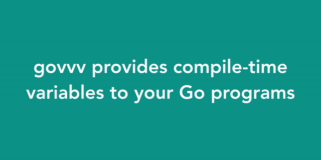
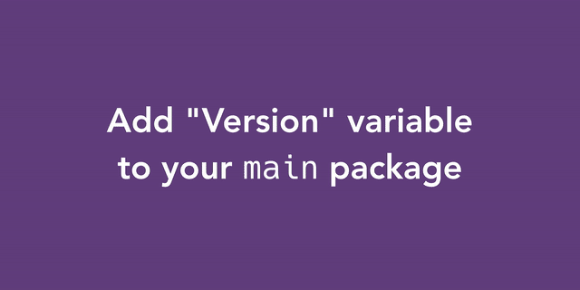

ahmetb/govvv

###    README.md

# [(L)](https://github.com/ahmetb/govvv#govvv)govvv

The simple Go binary versioning tool that wraps the `go build` command.

Stop worrying about `-ldflags` and **`go get github.com/ahmetb/govvv`** now.

## [(L)](https://github.com/ahmetb/govvv#build-variables)Build Variables

Variable
Description
Example
**[object Object]**
short commit hash of source tree
[object Object]
**[object Object]**
current branch name the code is built off
[object Object]
**[object Object]**
whether there are uncommitted changes
[object Object] or [object Object]
**[object Object]**
output of [object Object]
[object Object],
[object Object],
 [object Object]
**[object Object]**
RFC3339 formatted UTC date
[object Object]
**[object Object]**

contents of [object Object] file, if exists, or the value passed via the [object Object] option

[object Object]

## [(L)](https://github.com/ahmetb/govvv#using-govvv-is-easy)Using govvv is easy

Just add the build variables you want to the `main` package and run:
old
✨ new ✨
[object Object]
[object Object]
[object Object]
[object Object]

## [(L)](https://github.com/ahmetb/govvv#version-your-app-with-govvv)Version your app with govvv

Create a `VERSION` file in your build root directory and add a `Version`variable to your `main` package.

Do you have your own way of specifying `Version`? No problem:

## [(L)](https://github.com/ahmetb/govvv#govvv-lets-you-specify-custom--ldflags)govvv lets you specify custom `-ldflags`

Your existing `-ldflags` argument will still be preserved:

	govvv build -ldflags "-X main.BuildNumber=$buildnum" myapp

and the `-ldflags` constructed by govvv will be appended to your flag.

## [(L)](https://github.com/ahmetb/govvv#dont-want-to-depend-on-govvv-its-fine)Don’t want to depend on `govvv`? It’s fine!

You can just pass a `-print` argument and `govvv` will just print the`go build` command with `-ldflags` for you and will not execute the go tool:

	$ govvv build -print
	go build \
	    -ldflags \
	    "-X main.GitCommit=57b9870 -X main.GitBranch=dry-run -X main.GitState=dirty -X main.Version=0.1.0 -X main.BuildDate=2016-08-08T20:50:21Z"

Still don’t want to wrap the `go` tool? Well, try `-flags` to retrieve the LDFLAGS govvv prepares:

	$ go build -ldflags="$(govvv -flags)"

## [(L)](https://github.com/ahmetb/govvv#want-to-use-a-different-package)Want to use a different package?

You can pass a `-pkg` argument with the full package name, and `govvv` will set the build variables in that package instead of `main`. For example:

	# build with govvv
	$ govvv build -pkg github.com/myacct/myproj/mypkg

	# build with go
	$ go build -ldflags="$(govvv -flags -pkg $(go list ./mypkg))"

## [(L)](https://github.com/ahmetb/govvv#want-to-use-a-different-version)Want to use a different version?

You can pass a `-version` argument with the desired version, and `govvv` will use the specified version instead of obtaining it from the `./VERSION` file. For example:

	# build with govvv
	$ govvv build -version 1.2.3

	# build with go
	$ go build -ldflags="$(govvv -flags -version 1.2.3)"

## [(L)](https://github.com/ahmetb/govvv#try-govvv-today)Try govvv today

	$ go get github.com/ahmetb/govvv

* * *

govvv is distributed under [Apache 2.0 License](https://github.com/ahmetb/govvv/blob/master/LICENSE).

Copyright 2016 Ahmet Alp Balkan

* * *

[[68747470733a2f2f7472617669732d63692e6f72672f61686d6574622f676f7676762e7376673f6272616e63683d6d6173746572](../_resources/af3359b6a330e8be6d21e0274c77bc30.bin)](https://travis-ci.org/ahmetb/govvv)