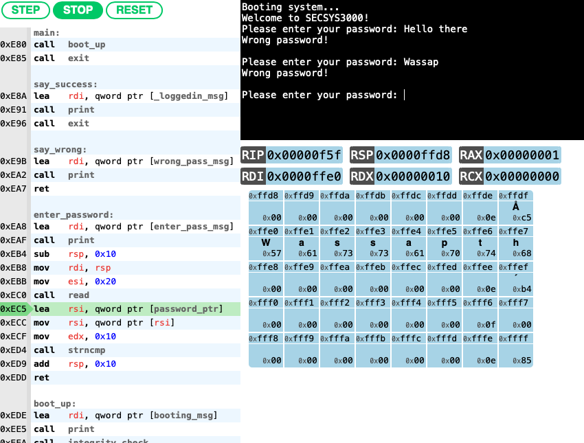

bordplate/js86: HTML-embeddable x86_64 emulator

# Emulator

Embeddable visual pseudo x86-64 emulator written in JavaScript. Made for easily embedding a CPU emulator into a web page so that it can be easily used to make tutorials or demos. Uses interrupts to tie into JavaScript code.

It is important to note that this emulator only implements a very limited subset of instructions.

## Binary formats and compilation

The emulator has simple support for [Mach-O binaries](https://en.wikipedia.org/wiki/Mach-O) (but not FAT archives) and raw binary files.

### Raw binaries

Compile raw binaries with `nasm -f bin <filename>`.

### Mach-O files

The Mach-O loader has very simple DYLD-style linking (it actually does DYLD-style linking no matter what you do to the binary).

Mach-O compilation examples for assembly is in `compile-machos.sh`. You can compile from C (or other languages that compile to assembly), but there is no proper support for the C standard library yet, and don't be surprised if your compiler generates instructions this emulator can't yet run.

# Usage

## Minimum imports

Minimum script imports are `capstone-x86.min.js` and `Emulator.js` (must be set to type 'module'). Probably should include the stylesheet`InteractiveEmulator.css` under the folder `Styles` as well.

Example:

<link  rel="stylesheet"  href="Emulator/Styles/InteractiveEmulator.css" />

## Libraries

Mach-O binaries can load libraries. All external libraries must have a JavaScript helper script to inject some information and helper functions into the Mach-O loader.

## HTML Tag

After importing the scripts and styles, add the emulator to the HTML using the custom tag `cpu-emulator`.

Custom attributes:
`cpu-binary`: Path to the binary you want to load. (Required)

`loader`: Type of loader you want to use, e.g. "MachO" or "Raw". "Raw" is default. (Optional)

`code-size`: Maximum address you want to show instructions for in the assembly view. By default it shows as much as possible (the entire binary size for raw binaries, the .text section for Mach-O binaries) (Optional)

`memory-size`: Size of the memory you want the emulator to have. (Optional)

`stack-watch`: Can be either `dynamic` or a fixed address of the point in stack you want to watch. `dynamic` follows `RSP`. (Optional)

`watched-registers`: Registers you want to "watch" (add to the UI), split by `,`. Should probably be lowercase. (Optional)`run-speed`: Milliseconds to wait before progressing to next instruction when in continous "run"-mode. Defaults to 500ms. (Optional)

`show-console`: `true` or `false` value, whether or not to show the console. Defaults to `true` (Optional)

## Building/bundling

Because of the Capstone library dependency it has been impossible for me to find any way to minify and bundle the code properly. I've had some luck with [rollup](https://rollupjs.org/guide/en/) before, but it doesn't work properly with loaders (for Mach-O or raw binary) because they're loaded lazily.

# Third-party frameworks and code

[Capstone](http://www.capstone-engine.org/)

[Capstone.js](https://github.com/AlexAltea/capstone.js) by [Alexandro Sanchez](https://github.com/AlexAltea)

[node-int64](https://github.com/broofa/node-int64) by [Robert Kieffer](https://github.com/broofa)

[Pretty CSS buttons](https://codepen.io/derekmorash/) by Derek Morash

[js-struct](https://github.com/andrewimm/js-struct) by [andrewimm](https://github.com/andrewimm)