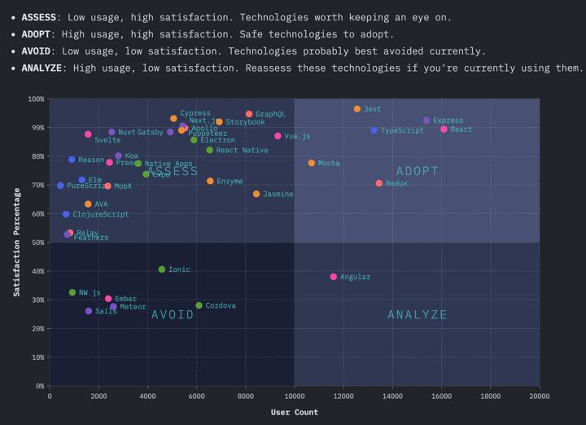

davidea.st - Sampling bias, FDR, and The State of JS

[ #### davidea.st](https://davidea.st/)

## Sampling bias, FDR, and The State of JS

#### tldr — An inference is only valid if the sample size is representative of the population of interest.

### A history lesson in sample size

In 1936 [The Literary Digest](https://en.wikipedia.org/wiki/The_Literary_Digest) conducted a straw poll on the Presidential Race between Alfred Landon and Franklin Roosevelt.

The Literary Digest polled 10 million (yes, million) Americans of which 2.4 million responded. First, you have to understand that 2.4 million people is an absurd sample size. Even today most scientific polls have a sample size of a thousand. Given the responses to the poll, the Digest concluded that Landon would win the election in a landslide. *Narrator: He did not win.*

In fact, the exact opposite happened. Franklin Roosevelt won with 60% of the popular vote and gathered 523 electoral college votes by winning 46 of 48 states. Landon ended up with 8 electoral college votes even losing Kansas, the state of which he was the Governor.

**So what happened?** How could a poll with such a large sample size be so wrong? It all comes down to the make up of the sample.

### What's in a sample?

A sample is a representation of a population of interest. A large number of responses are not required nor encouraged. The best analogy I have heard for a sample came from a [Coursera class given by professors at Duke University.](https://www.coursera.org/learn/probability-intro?specialization=statistics)

*> "Sampling is like tasting a dish to see if it is ready. When tasting, it is called exploratory analysis. Making an inference is when you generalize something about the whole population from the sample. For the inference to be valid you need a representative sample of the population. - **> Professor Mine Çetinkaya-Rundel**> "*

The key parts here are about the inference based on the sample. To infer that "Landon will beat Roosevelt", you need a representative sample. When you don't have a representative sample this is often due to **sampling bias**.

### Sampling bias

Whenever you see a poll the first thing you should ask yourself is: **"What is the population of interest, and what is the sample?"** In the case of The Literary Digest, the population of interest was the American voters. **But who exactly made up their gaudy 2.4 million person sample?**

The Literary Digest polled people mainly from three sources: their readers, registered automobile owners, and telephone users. Now remember. This took place in 1936, during a period in American history known as The Great Depression. If you could afford a car, telephone, or even a magazine subscription you were a wealthy American. Wealthier Americans were more likely to vote for Landon. This is a text book example of **sampling bias**.

Not only did the Digest have a bad sampling source, they were most guilty of a sampling bias called [non-response](https://en.wikipedia.org/wiki/Participation_bias). Non-response is when a non-random fraction of the randomly sampled population responds. The sample was saturated with wealthy Americans and lacked responses from poorer Americans affected by the Depression.

The Digest's inference was not valid because their sample was not representative of the population of interest. So what's the point? Why talk about a poll that happened over 80 years ago?

### The State of JS

Recently, the results of [The State of JS were released](https://2019.stateofjs.com/). The State of JS is a survey about trends in JavaScript. The goal is to understand what tools and other factors are trending with users of JavaScript.

Visually, the results of the survey are amazing. The data visualizations are absolutely beautiful. I don't know the team, but they are obviously talented and passionate. I can't imagine the amount of time it took to put this all together.

I'm writing about this topic because the survey is controversial. Mostly because it involves JavaScript developers and we do controversy better than anyone. But mainly, the controversy comes from the ability to make an inference from the survey's results. **"Is framework A more popular than framework B?"**

The survey attempts to make an inference from the results in a quadrant grid of: "Adopt", "Assess", "Avoid", and "Analyze". The purpose of the chart being to advise developers of what frameworks and tools to use. In a nutshell, this is their inference. The way I see it, this inference boils down to: Adopt mostly React based tools. Avoid, assess, and analyze basically everything else.

**How much confidence can we put into this inference?** An inference is only valid if the survey has a representative sample of the population. Let's start with the basic question. **"What is the population of interest, and what is the sample?"** Population of interest: People who have used JavaScript. What was the sample?

### The State of JS sample

This survey was open for anyone to take. The team provided a great deal of transparency of their respondent's demographics. Over 21,000 responses were recorded. They reported their main three sources (69% of responses) were from previous survey takers, Twitter, and email. I'm not entirely sure what they mean by email, but I am assuming they mean emails they sent out. I'm also not sure how that is different from previous survey takers.

**The majority of responses came from America (23%)** and Western European countries. There was also a large drop off in responses from even the first to second country. The country with **the second largest responses came from Great Britain (6%)**.

The survey responses were **dominatly male (91%)**.

To me, at a brief glance this looks like a case of non-response. There are a lot of demographics we haven't heard from. Non-response is most likely when there is a low response rate. Because of this, it's not surprising that the survey was saturated with positive opinions towards one tool: React.

**How do we know if results are valid?** That's easy enough for an election. There's just one way to find out. Who won? Somewhat similar to an election, we can look at actual results. We can scan the internet to see what people are actually using.

### Surveys vs. Observational Studies

An **observational study** is the act of collecting data in way that does not directly interfere with how the data arose. You merely observe actions or a set of data and draw conclusions. In a survey you ask someone to (hopefully) report the truth of their actions or opinions. Whereas, an observational study goes into the data and reports on the outcomes.

What if we could "scan" the web and report on what is actually being used? This would lack the opinions of the developers, but it could give us a picture of what developers build with.

As it turns out, such a study exists.

### The 2019 Web Almanac

The [Web Almanac](https://almanac.httparchive.org/en/2019/) is the [HTTP Archive's](https://httparchive.org/) annual state of the web report. If you're not familiar, the HTTP Archive is an open source project who states: *"We periodically crawl the top sites on the web and record detailed information about fetched resources, used web platform APIs and features, and execution traces of each page. We then crunch and analyze this data to identify trends..."*

This is close to being the observational study equivalent of The State of JS survey.

So what did the Web Almanac study? The report consists of tests from 5.8 million websites and processed 20.9 terrabytes of data. So while it is not the "entire web", it is representative of the top websites people visit.

### What did the Web Almanac find?

According to the Web Almanac, React was reported as the ["most frequently used framework."](https://almanac.httparchive.org/en/2019/javascript#frameworks-and-ui-libraries) This corresponds with the responses of The State of JS. However, what it does not correspond with is the percentage of use. React is the most popular but only 4.6% of usage. AngularJS (not Angular) came in second with 2.0%, and all together frameworks represented just 10.4% of the results.

**NOTE:** The Web Almanac was a huge effort, but it was not without its own flaws. The detection strategy of [The Web Almanac was to inspect global variables](https://github.com/HTTPArchive/almanac.httparchive.org/pull/592). However, this is not a perfect strategy because many (very many) framework apps use module bundlers, like webpack. This removes global variables and obviously will significantly reduce the usage rate for all frameworks.

Even if the framework detection strategy was better, React would likely not be the ["most frequently used library".](https://almanac.httparchive.org/en/2019/javascript#open-source-libraries-and-frameworks) I think we all know who takes the cake.

### jQuery

jQuery is the most frequently used library, it represented 85% of usage. This is not surprising. Wordpress (30% of the web) includes jQuery by default and jQuery is commonly used with a global variable, making it easy to detect. jQuery's usage does not tell us developers opinions about using it either, which a survey can do.

However, jQuery was completely absent from the State of JS survey.

The lack of jQuery makes sense. The State of JS is not designed to show us what developers are actually using. Rather, it is designed to **tell us what JavaScript users think about newer tools**. When I say "new" I mean new compared to jQuery. Including mostly newer and trendier tools creates a large rift. The survey neglects to include a library that is used on 85% of some of the most popular websites.

This doesn't mean that they are wrong in recommending React. But the survey lacks some of the most highly used tools on the web. This creates a biased tone, which I don't believe was the intention of the team.

And fortunately improving the survey is fairly straightfoward.

### How can The State of JS improve?

In my opinion the State of JS can improve with three efforts.

#### 1. Provide a more diverse set of tools

jQuery still dominates the web. But what do developers think about using it? There are countless amounts of JavaScript developers maintaining sites with tons of jQuery code. What do they think about it? How much do they use other frameworks? Would they like to upgrade?

Look at the landscape of what libraries and frameworks exist on the web and make that representative in the survey. While this will not directly affect the sample, it will make the options representative for the sample.

This isn't exclusive to older tools as well. A quick scan of npm and the Web Almanac shows that a lot of newer tools aren't being included in the survey either. [Sails](https://sailsjs.com/) was included in the survey, but [Firebase](https://firebase.google.com/) was not. *Strong Disclaimer: I work at Firebase and have so for 5+ years.* Firebase [did about 16x npm downloads in 2019](https://www.npmtrends.com/firebase-vs-sails) as Sails (24.2m to 1.5m). While npm downloads are not the best indicator of success they are a strong indicator of interest and use.

Having a "write-in" line is not an adequate "catch all" in my opinion.

#### 2. Provide a better outreach effort

Again, the sample of the survey is not representative of the population. There are many developers who have not taken the survey before and are not on Twitter or Reddit. These developers need to be heard from. But how do we get to them?

Reach out to companies directly. Reach out to schools to receive answers from students and professors. Target countries with low response sizes, reach out to their local JavaScript communities. Contact organizations like [Girls Who Code](https://girlswhocode.com/), [Women Techmakers](https://www.womentechmakers.com/), and [Vue Vixens](https://www.vuevixens.org/). Make a concerted effort to get more diverse voices in the door.

#### 3. Provide only observations. Remove the "Adopt, Analyze, Avoid, Assess" chart

This is an opinion based survey with an unrepresentative sample size. It's irresponsible to provide advice. I don't think the team means to do this either. It's great to show what the respondents think, as shown in the "Changes Over Time" chart. However, I would not want to work at a company that selected a tool simply because a survey said it was popular.

### David, what do you actually think?

I think the survey is great. It's beautiful. It's interesting. It teaches me a lot. However, I take it all with a grain of salt, because it is not representative of the population of interest.

I don't use it to say "React is better than Angular" or "We should rewrite our REST API to GraphQL because it's trending."

The survey provides alot of insight into what *a group of* JavaScript users think. You can't ignore that a lot of these opinions exist. This is really valuable. But you can't use it for a blanket statement. Because just like we learned with Landon vs. FDR, you can be really really wrong with even a large amount of data.

The State of JS is an amazing project. I want to make it clear that I have nothing but respect and admiration for the team.

The point is that I don't believe you can make a valid inference from the survey's results. Nor should you care to.

I'm not even sure if that's the goal of the survey. The survey does not advertise itself as scientific. So don't get mad at the team, don't get mad at the results. Click around the graphs. Enjoy the beautiful charts. Respect and admire the hard work. Dive into the data and see what looks interesting. But please, don't use this as cannon fodder for framework wars.

#### Previous

[Easy Service Workers with Workbox.js](https://davidea.st/articles/easy-service-workers-with-workboxjs)

## [Go Home](https://davidea.st/)