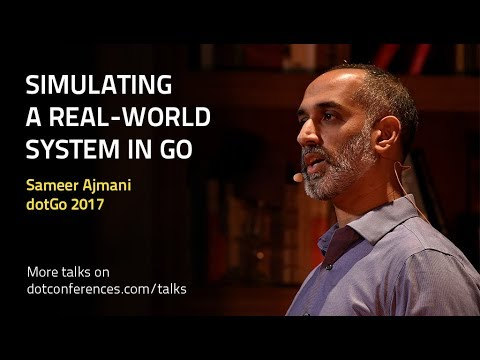

dotGo 2017 - Sameer Ajmani - Simulating a real-world system in Go - YouTube

dotGo 2017 - Sameer Ajmani - Simulating a real-world system in Go
https://www.youtube.com/watch?v=_YK0viplIl4
[dotconferences](https://www.youtube.com/channel/UCSRhwaM00ay0fasnsw6EXKA)
1,916 views views
Published on Dec 14, 2017

|     |
| --- |
| [(L)](https://www.youtube.com/watch?v=_YK0viplIl4) |

Description

Filmed at [https://2017.dotgo.eu](https://www.youtube.com/redirect?redir_token=lH3j4LGphxuUE7NERCTI7QlxvNd8MTUxNjU1MzczM0AxNTE2NDY3MzMz&q=https%3A%2F%2F2017.dotgo.eu&v=_YK0viplIl4&event=video_description) on November 6th in Paris. More talks on [https://dotconferences.com/talks](https://www.youtube.com/redirect?redir_token=lH3j4LGphxuUE7NERCTI7QlxvNd8MTUxNjU1MzczM0AxNTE2NDY3MzMz&q=https%3A%2F%2Fdotconferences.com%2Ftalks&v=_YK0viplIl4&event=video_description)Go's concurrency model makes it easy to develop scalable servers and data pipelines. Many of the patterns we use in developing concurrent code mirror structures in real-world systems. In this talk, Sameer presents a simulation of a small real world system and shows how variations in the design impact the system's performance.

Top Comments

Chris Dillon  | This was incredibly interesting. Well explained and approachable, especially the metaphors around buffers and real-world. I will find this very valuable when imagining my own Go projects.

1 month ago

jupiter909  | Great video!
1 month ago