eriklindernoren/Keras-GAN

# Keras-GAN

## About

Keras implementations of Generative Adversarial Networks (GANs) suggested in research papers. If dense layers produce reasonable results for a given model I will often prefer them over convolutional layers. The reason is that I would like to enable people without GPUs to test these implementations out. These models are in some cases simplified versions of the ones ultimately described in the papers, but I have chosen to focus on getting the core ideas covered instead of getting every layer configuration right. However, because of this the results will not always be as nice as in the papers.

## Table of Contents

## Installation

	$ git clone https://github.com/eriklindernoren/Keras-GAN
	$ cd Keras-GAN
	$ sudo pip3 install -r requirements.txt

## Implementations

### AC-GAN

Implementation of Auxiliary Classifier Generative Adversarial Network.
[Code](https://github.com/eriklindernoren/Keras-GAN/blob/master/acgan/acgan.py)
Paper: https://arxiv.org/abs/1610.09585

 [(L)](https://camo.githubusercontent.com/cce74f4b9bbe9ce54cdc607ae9bb63adcbc1cf71/687474703a2f2f6572696b6c696e6465726e6f72656e2e73652f696d616765732f616367616e2e676966)

[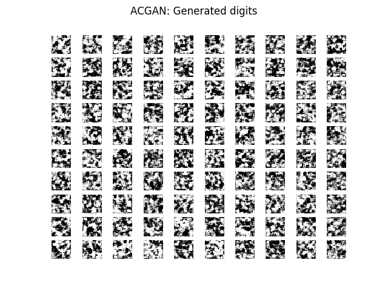](https://camo.githubusercontent.com/cce74f4b9bbe9ce54cdc607ae9bb63adcbc1cf71/687474703a2f2f6572696b6c696e6465726e6f72656e2e73652f696d616765732f616367616e2e676966)

### Adversarial Autoencoder

Implementation of Adversarial Autoencoder.

[Code](https://github.com/eriklindernoren/Keras-GAN/blob/master/aae/adversarial_autoencoder.py)

Paper: https://arxiv.org/abs/1511.05644

 [(L)](https://camo.githubusercontent.com/779b52cd081c86b71c20b467d9f9c5b8428fdcce/687474703a2f2f6572696b6c696e6465726e6f72656e2e73652f696d616765732f6161652e706e67)

[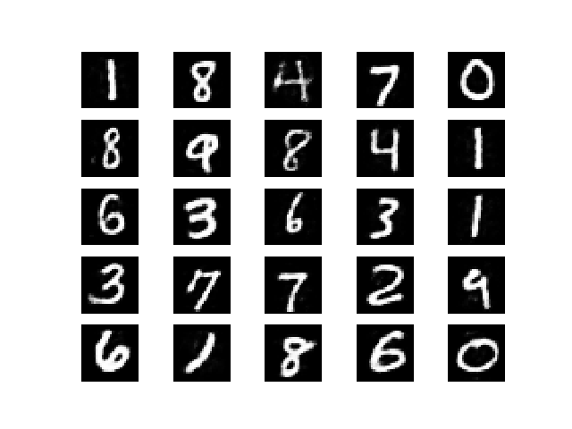](https://camo.githubusercontent.com/779b52cd081c86b71c20b467d9f9c5b8428fdcce/687474703a2f2f6572696b6c696e6465726e6f72656e2e73652f696d616765732f6161652e706e67)

### BiGAN

Implementation of Bidirectional Generative Adversarial Network.
[Code](https://github.com/eriklindernoren/Keras-GAN/blob/master/bigan/bigan.py)
Paper: https://arxiv.org/abs/1605.09782

### BGAN

Implementation of Boundary-Seeking Generative Adversarial Networks.
[Code](https://github.com/eriklindernoren/Keras-GAN/blob/master/bgan/bgan.py)
Paper: https://arxiv.org/abs/1702.08431

### CC-GAN

Implementation of Semi-Supervised Learning with Context-Conditional Generative Adversarial Networks.

[Code](https://github.com/eriklindernoren/Keras-GAN/blob/master/ccgan/ccgan.py)
Paper: https://arxiv.org/abs/1611.06430

 [(L)](https://camo.githubusercontent.com/b51ab42392a414d871d34ea5f849b2f5ed9297b6/687474703a2f2f6572696b6c696e6465726e6f72656e2e73652f696d616765732f636367616e2e706e67)

[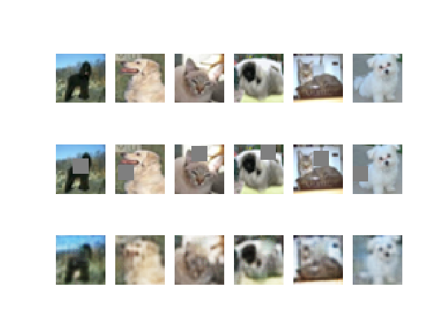](https://camo.githubusercontent.com/b51ab42392a414d871d34ea5f849b2f5ed9297b6/687474703a2f2f6572696b6c696e6465726e6f72656e2e73652f696d616765732f636367616e2e706e67)

### CGAN

Implementation of Conditional Generative Adversarial Nets.
[Code](https://github.com/eriklindernoren/Keras-GAN/blob/master/cgan/cgan.py)
Paper:https://arxiv.org/abs/1411.1784

 [(L)](https://camo.githubusercontent.com/6e35c52d78db25763be5b95cfd5962839618a2d6/687474703a2f2f6572696b6c696e6465726e6f72656e2e73652f696d616765732f6367616e2e676966)

[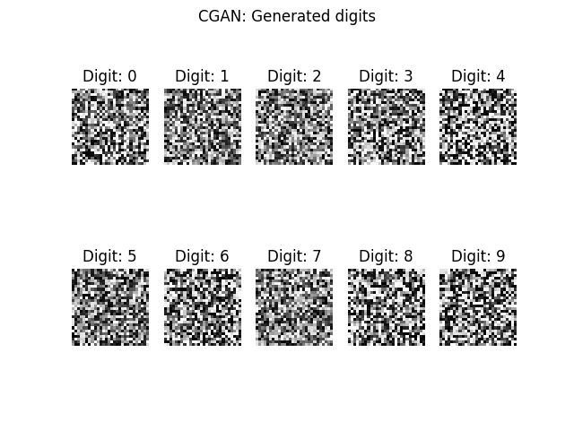](https://camo.githubusercontent.com/6e35c52d78db25763be5b95cfd5962839618a2d6/687474703a2f2f6572696b6c696e6465726e6f72656e2e73652f696d616765732f6367616e2e676966)

### Context Encoder

Implementation of Context Encoders: Feature Learning by Inpainting.

[Code](https://github.com/eriklindernoren/Keras-GAN/blob/master/context_encoder/context_encoder.py)

Paper: https://arxiv.org/abs/1604.07379

 [(L)](https://camo.githubusercontent.com/971e6c68c7b95644d5f266d09f84c9f7c9f53af0/687474703a2f2f6572696b6c696e6465726e6f72656e2e73652f696d616765732f636f6e746578745f656e636f6465722e706e67)

[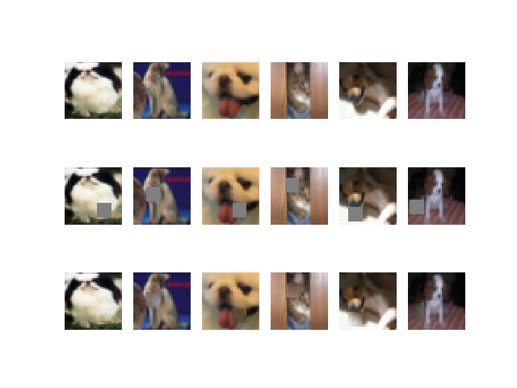](https://camo.githubusercontent.com/971e6c68c7b95644d5f266d09f84c9f7c9f53af0/687474703a2f2f6572696b6c696e6465726e6f72656e2e73652f696d616765732f636f6e746578745f656e636f6465722e706e67)

### CoGAN

Implementation of Coupled generative adversarial networks.
[Code](https://github.com/eriklindernoren/Keras-GAN/blob/master/cogan/cogan.py)
Paper: https://arxiv.org/abs/1606.07536

### CycleGAN

Implementation of Unpaired Image-to-Image Translation using Cycle-Consistent Adversarial Networks.

[Code](https://github.com/eriklindernoren/Keras-GAN/blob/master/cyclegan/cyclegan.py)

Paper: https://arxiv.org/abs/1703.10593

 [(L)](https://camo.githubusercontent.com/c653ddc55471557b851a7059540e80799fad7e29/687474703a2f2f6572696b6c696e6465726e6f72656e2e73652f696d616765732f6379636c6567616e2e706e67)

	$ cd cyclegan
	$ bash download_dataset.sh apple2orange
	$ python3 cyclegan.py

 [(L)](https://camo.githubusercontent.com/5f2aef482aaab6607da02b7f42433278f2692900/687474703a2f2f6572696b6c696e6465726e6f72656e2e73652f696d616765732f6379636c6567616e5f6769662e676966)

[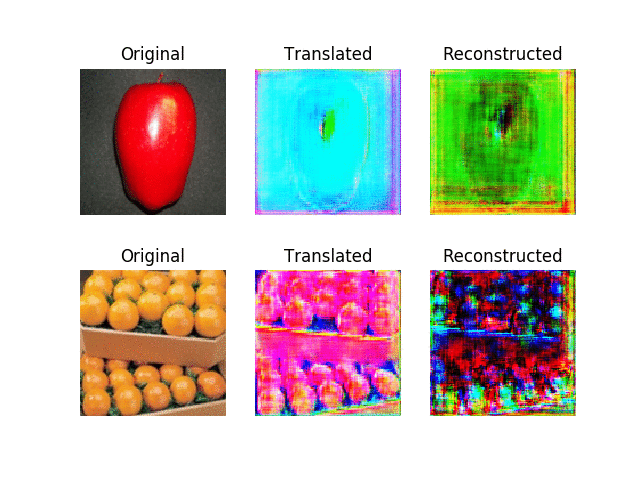](https://camo.githubusercontent.com/5f2aef482aaab6607da02b7f42433278f2692900/687474703a2f2f6572696b6c696e6465726e6f72656e2e73652f696d616765732f6379636c6567616e5f6769662e676966)

### DCGAN

Implementation of Deep Convolutional Generative Adversarial Network.
[Code](https://github.com/eriklindernoren/Keras-GAN/blob/master/dcgan/dcgan.py)
Paper: https://arxiv.org/abs/1511.06434

 [(L)](https://camo.githubusercontent.com/baacffd8f153f8774a37bec4f3f3a026d10e6c8c/687474703a2f2f6572696b6c696e6465726e6f72656e2e73652f696d616765732f646367616e322e706e67)

[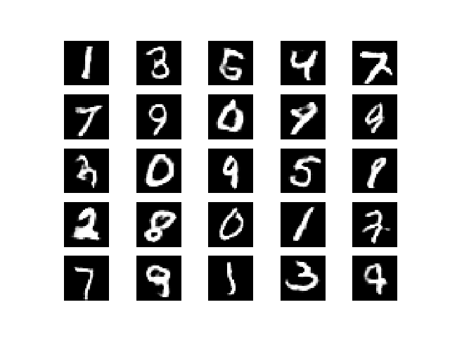](https://camo.githubusercontent.com/baacffd8f153f8774a37bec4f3f3a026d10e6c8c/687474703a2f2f6572696b6c696e6465726e6f72656e2e73652f696d616765732f646367616e322e706e67)

### DualGAN

Implementation of DualGAN: Unsupervised Dual Learning for Image-to-Image Translation.

[Code](https://github.com/eriklindernoren/Keras-GAN/blob/master/dualgan/dualgan.py)

Paper: https://arxiv.org/abs/1704.02510

### GAN

Implementation of Generative Adversarial Network with a MLP generator and discriminator.

[Code](https://github.com/eriklindernoren/Keras-GAN/blob/master/gan/gan.py)
Paper: https://arxiv.org/abs/1406.2661

 [(L)](https://camo.githubusercontent.com/8598ab93ae1b1b7e033dca29c1677256012ae5ef/687474703a2f2f6572696b6c696e6465726e6f72656e2e73652f696d616765732f67616e2e706e67)

[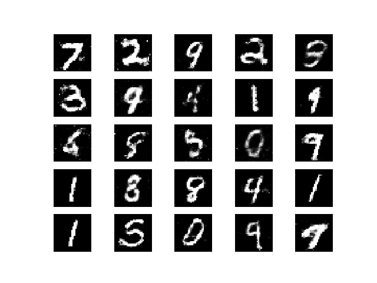](https://camo.githubusercontent.com/8598ab93ae1b1b7e033dca29c1677256012ae5ef/687474703a2f2f6572696b6c696e6465726e6f72656e2e73652f696d616765732f67616e2e706e67)

### InfoGAN

Implementation of InfoGAN: Interpretable Representation Learning by Information Maximizing Generative Adversarial Nets.

[Code](https://github.com/eriklindernoren/Keras-GAN/blob/master/infogan/infogan.py)

Paper: https://arxiv.org/abs/1606.03657

 [(L)](https://camo.githubusercontent.com/3819fc732fd957a1938287ce61c8c7b81db80768/687474703a2f2f6572696b6c696e6465726e6f72656e2e73652f696d616765732f696e666f67616e2e706e67)

[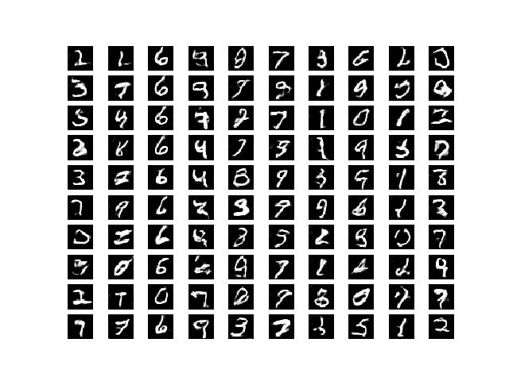](https://camo.githubusercontent.com/3819fc732fd957a1938287ce61c8c7b81db80768/687474703a2f2f6572696b6c696e6465726e6f72656e2e73652f696d616765732f696e666f67616e2e706e67)

### LSGAN

Implementation of Least Squares Generative Adversarial Networks.
[Code](https://github.com/eriklindernoren/Keras-GAN/blob/master/lsgan/lsgan.py)
Paper: https://arxiv.org/abs/1611.04076

### Pix2Pix

Implementation of Unpaired Image-to-Image Translation with Conditional Adversarial Networks.

[Code](https://github.com/eriklindernoren/Keras-GAN/blob/master/pix2pix/pix2pix.py)

Paper: https://arxiv.org/abs/1611.07004

 [(L)](https://camo.githubusercontent.com/e8c023b62678aa244f1a474bf643c66c45ef0feb/687474703a2f2f6572696b6c696e6465726e6f72656e2e73652f696d616765732f706978327069785f6172636869746563747572652e706e67)

	$ cd pix2pix
	$ bash download_dataset.sh facades
	$ python3 pix2pix.py

 [(L)](https://camo.githubusercontent.com/38a93e7620daa4cdaf4913b4a41371c6e002a539/687474703a2f2f6572696b6c696e6465726e6f72656e2e73652f696d616765732f70697832706978322e706e67)

[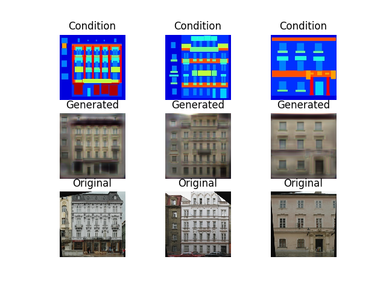](https://camo.githubusercontent.com/38a93e7620daa4cdaf4913b4a41371c6e002a539/687474703a2f2f6572696b6c696e6465726e6f72656e2e73652f696d616765732f70697832706978322e706e67)

### SGAN

Implementation of Semi-Supervised Generative Adversarial Network.
[Code](https://github.com/eriklindernoren/Keras-GAN/blob/master/sgan/sgan.py)
Paper: https://arxiv.org/abs/1606.01583

 [(L)](https://camo.githubusercontent.com/5d354155374f767e94d1477c23aa9f0e861c4982/687474703a2f2f6572696b6c696e6465726e6f72656e2e73652f696d616765732f7367616e2e706e67)

[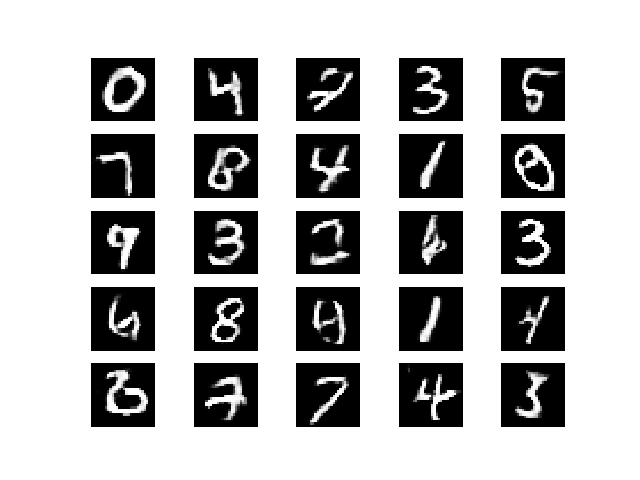](https://camo.githubusercontent.com/5d354155374f767e94d1477c23aa9f0e861c4982/687474703a2f2f6572696b6c696e6465726e6f72656e2e73652f696d616765732f7367616e2e706e67)

### SRGAN

Implementation of Photo-Realistic Single Image Super-Resolution Using a Generative Adversarial Network.

[Code](https://github.com/eriklindernoren/Keras-GAN/blob/master/srgan/srgan.py)
Paper: https://arxiv.org/abs/1609.04802

 [(L)](https://camo.githubusercontent.com/07288b4b467fbf547c6757a448f8e786bf20f295/687474703a2f2f6572696b6c696e6465726e6f72656e2e73652f696d616765732f737570657272657367616e2e706e67)

[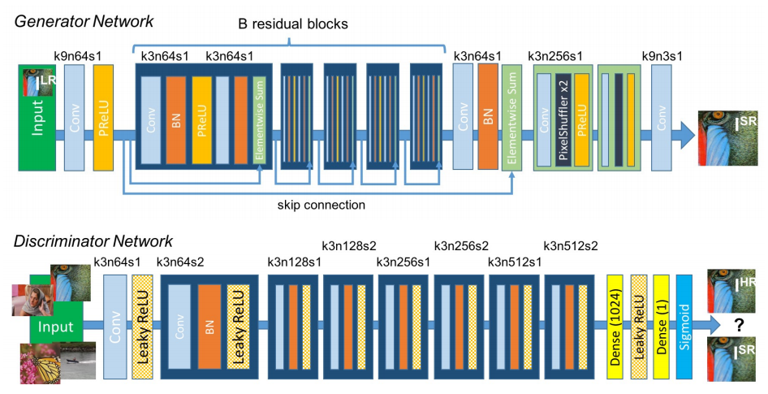](https://camo.githubusercontent.com/07288b4b467fbf547c6757a448f8e786bf20f295/687474703a2f2f6572696b6c696e6465726e6f72656e2e73652f696d616765732f737570657272657367616e2e706e67)

 [(L)](https://camo.githubusercontent.com/bd65a6411ebc3b2e8db9d0f9e892a91bfdb5e8f1/687474703a2f2f6572696b6c696e6465726e6f72656e2e73652f696d616765732f737267616e2e706e67)

[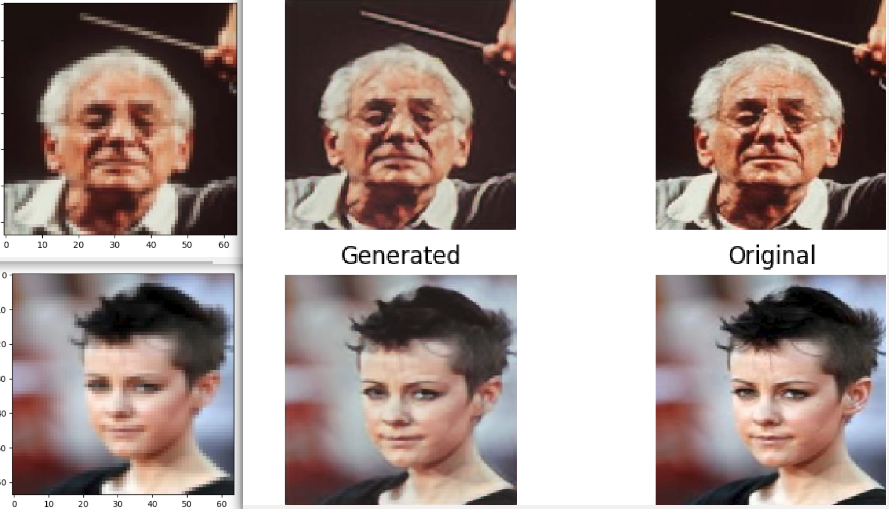](https://camo.githubusercontent.com/bd65a6411ebc3b2e8db9d0f9e892a91bfdb5e8f1/687474703a2f2f6572696b6c696e6465726e6f72656e2e73652f696d616765732f737267616e2e706e67)

### WGAN

Implementation of Wasserstein GAN (with DCGAN generator and discriminator).
[Code](https://github.com/eriklindernoren/Keras-GAN/blob/master/wgan/wgan.py)
Paper: https://arxiv.org/abs/1701.07875

 [(L)](https://camo.githubusercontent.com/bfe90879e5eb4a3e80fa8c8d1f9ad2fb7dfbd419/687474703a2f2f6572696b6c696e6465726e6f72656e2e73652f696d616765732f7767616e322e706e67)

[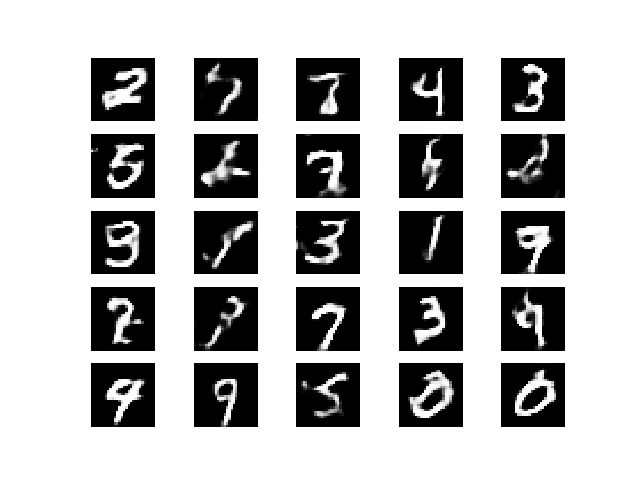](https://camo.githubusercontent.com/bfe90879e5eb4a3e80fa8c8d1f9ad2fb7dfbd419/687474703a2f2f6572696b6c696e6465726e6f72656e2e73652f696d616765732f7767616e322e706e67)