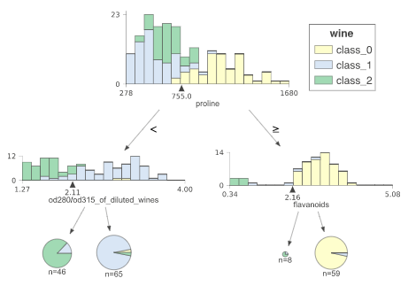
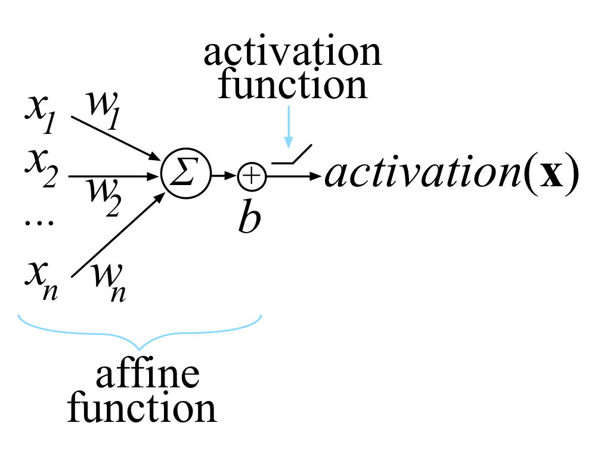
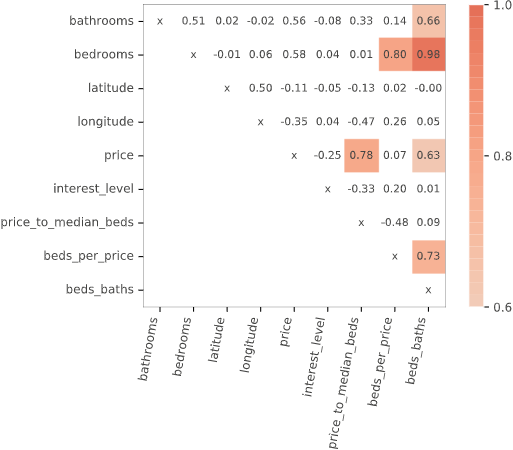

explained.ai

# Articles

## [A Stratification Approach to Partial Dependence for Codependent Variables](https://arxiv.org/abs/1907.06698)

Model interpretability is important to machine learning practitioners, and a key component of interpretation is the characterization of partial dependence of the response variable on any subset of features used in the model. The two most common strategies (linear models and PDP/ICE plots) for assessing partial dependence suffer from a number of critical weaknesses. In this academic paper, we introduce a new strategy, called **StratPD**, that does not depend on a user's fitted model, provides accurate results in the presence codependent variables, and is applicable to high dimensional settings. The strategy works by stratifying a data set into groups of observations that are similar, except in the variable of interest, through the use of a decision tree. Any fluctuations of the response variable within a group is likely due to the variable of interest. [Complete source code repo](https://github.com/parrt/stratx) is available and you can "pip install stratx".

## [How to visualize decision trees](https://explained.ai/decision-tree-viz/index.html)

(See [video](https://www.youtube.com/watch?v=4FC1D9SuDBc&feature=youtu.be) discussion.) Decision trees are the fundamental building block of gradient boosting machines and Random Forests(tm), probably the two most popular machine learning models for structured data. Visualizing decision trees is a tremendous aid when learning how these models work and when interpreting models. Unfortunately, current visualization packages are rudimentary and not immediately helpful to the novice. For example, we couldn't find a library that visualizes how decision nodes split up the feature space. So, we've created a general package called [dtreeviz](https://github.com/parrt/dtreeviz) for scikit-learn decision tree visualization and model interpretation.

## [How to explain gradient boosting](https://explained.ai/gradient-boosting/index.html)

Gradient boosting machines (GBMs) are currently very popular and so it's a good idea for machine learning practitioners to understand how GBMs work. The problem is that understanding all of the mathematical machinery is tricky and, unfortunately, these details are needed to tune the hyper-parameters. (Tuning the hyper-parameters is required to get a decent GBM model unlike, say, Random Forests.) Our goal in this article is to explain the intuition behind gradient boosting, provide visualizations for model construction, explain the mathematics as simply as possible, and answer thorny questions such as why GBM is performing “gradient descent in function space.”

## [The Matrix Calculus You Need For Deep Learning](https://explained.ai/matrix-calculus/index.html)

This article explains all of the matrix calculus you need in order to understand the training of deep neural networks. Most of us last saw calculus in school, but derivatives are a critical part of machine learning, particularly deep neural networks, which are trained by optimizing a loss function. Pick up a machine learning paper or the documentation of a library such as PyTorch and calculus comes screeching back into your life like distant relatives around the holidays. And it's not just any old scalar calculus that pops up--you need differential matrix calculus, the shotgun wedding of linear algebra and multivariate calculus. ([printable PDF at arxiv.org](https://arxiv.org/abs/1802.01528))

## [Beware Default Random Forest Importances](https://explained.ai/rf-importance/index.html)

Training a model that accurately predicts outcomes is great, but most of the time you don't just need predictions, you want to be able to interpret your model. The problem is that the scikit-learn Random Forest feature importance and R's default Random Forest feature importance strategies are biased. To get reliable results in Python, use permutation importance, provided here and in our [rfpimp](https://github.com/parrt/random-forest-importances) package (via pip). For R, use importance=T in the Random Forest constructor then type=1 in R's importance() function.

## [Towards a Universal Code Formatter through Machine Learning](http://www.antlr.org/papers/codebuff.pdf)

This academic paper describes a tool called [CodeBuff](https://github.com/antlr/codebuff) (github repo) that automatically derives code formatters for any given programming language without intervention from a language expert, abstracting the formatting rules from a representative corpus. CodeBuff illustrates how even the simplest machine learning model, *k*-nearest neighbor in this case, can perform very well given sufficiently rich features.

# Books

## [The Mechanics of Machine Learning](https://mlbook.explained.ai/)

[Terence Parr](http://parrt.cs.usfca.edu/) and [Jeremy Howard](http://www.fast.ai/about/#jeremy)

This book is a primer on machine learning for programmers trying to get up to speed quickly. You'll learn how machine learning works and how to apply it in practice. We focus on just a few powerful models (algorithms) that are extremely effective on real problems, rather than presenting a broad survey of machine learning algorithms as many books do. Co-author Jeremy used these few models to become the #1 competitor for two consecutive years at Kaggle.com. This narrow approach leaves lots of room to cover the models, training, and testing in detail, with intuitive descriptions and full code implementations.

*This is a book in progress; 9 chapters posted*.

# Videos

## [The visual interpretation of decision trees](https://www.youtube.com/watch?v=4FC1D9SuDBc&feature=youtu.be)

**Subtitle**: How to lead a fulfilling life by being dissatisfied.
November 30, 2018

This video is a lecture from the [USF seminar series in data science](https://www.meetup.com/USF-Seminar-Series-in-Data-Science), describing the article [How to visualize decision trees](https://explained.ai/decision-tree-viz/index.html) and Python package [dtreeviz](https://github.com/parrt/dtreeviz).

I finish up the lecture with some advice about how dissatisfaction can spur innovation.

# Libraries

## [dtreeviz](https://github.com/parrt/dtreeviz)

[dtreeviz](https://github.com/parrt/dtreeviz) is a python library for decision tree visualization and model interpretation inspired by an animation from R2D3: [A visual introduction to machine learning](http://www.r2d3.us/visual-intro-to-machine-learning-part-1/). With dtreeviz, you can visualize how the feature space is split up at decision nodes, how the training samples get distributed in leaf nodes and how the tree makes predictions for a specific observation. These operations are critical to for understanding how classification or regression decision trees work. See article [How to visualize decision trees](http://explained.ai/decision-tree-viz/index.html).

## [rfpimp](https://github.com/parrt/random-forest-importances)

The scikit-learn Random Forest feature importance and R's default Random Forest feature importance strategies are biased. To get reliable results in Python, use permutation importance, provided here and in our rfpimp package (via pip).

## [lolviz](https://github.com/parrt/lolviz)

A simple Python data-structure visualization tool that started out as a List Of Lists (lol) visualizer but now handles arbitrary object graphs, including function call stacks! lolviz tries to look out for and format nicely common data structures such as lists, dictionaries, linked lists, and binary trees. As of 1.4, lolviz also supports the display of [numpy](http://www.numpy.org/) 1D/2D ndarrays. This package is primarily for use in teaching and presentations with Jupyter notebooks, but could also be used for debugging data structures, such as decision trees or graphs.

# Resources

## [Statisticians say the darndest things](https://explained.ai/statspeak/index.html)

The nomenclature used by statisticians is peculiar to say the least, so I thought I'd put this document together. It's meant as good-natured teasing of my friends who are statisticians, but it might actually be useful to other computer scientists.