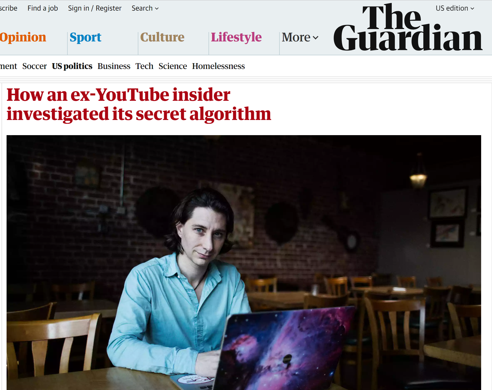
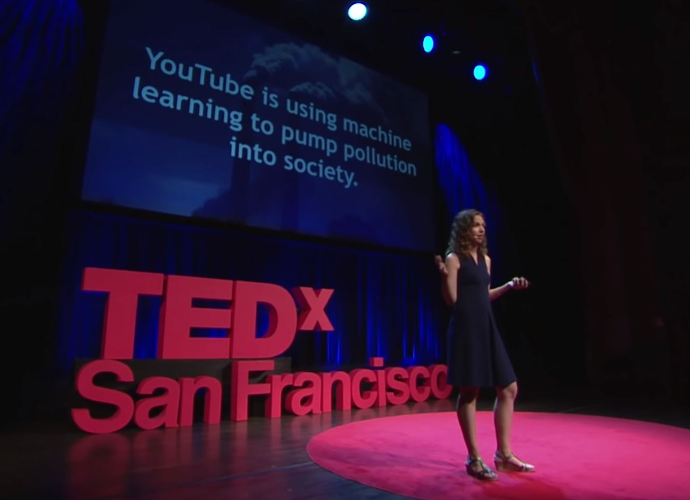
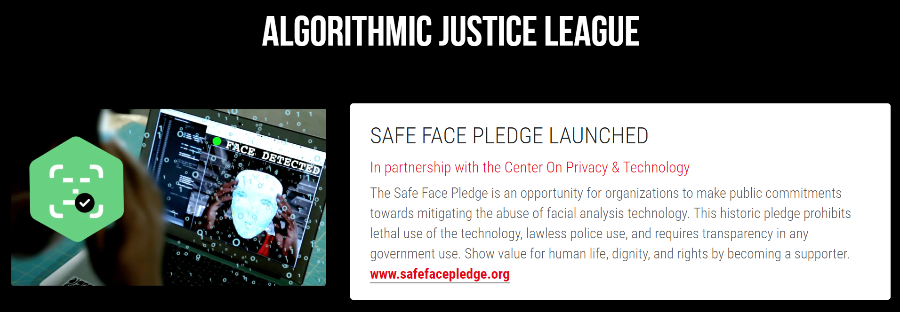
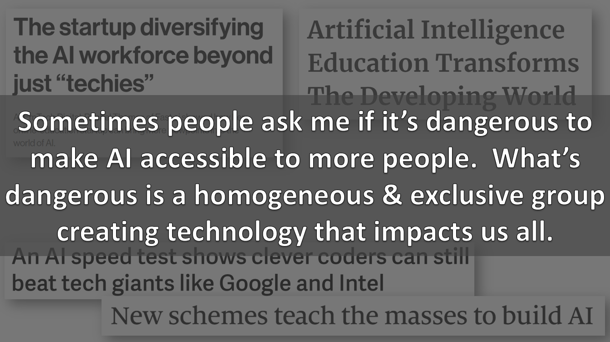
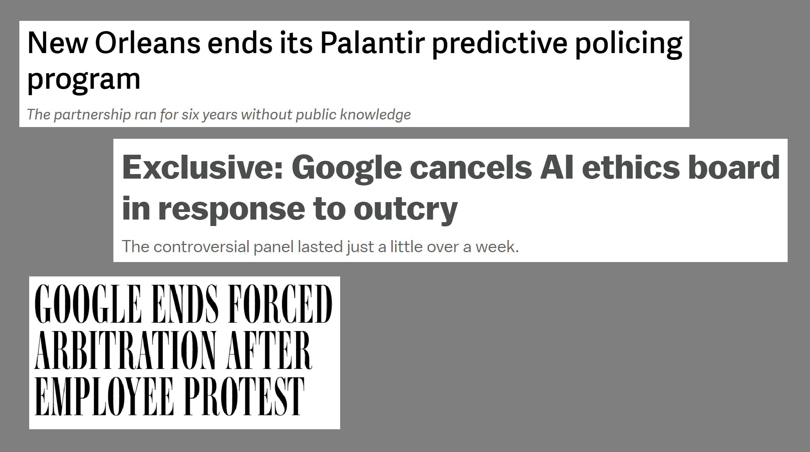

fast.ai · Making neural nets uncool again

### Our online courses (all are free and have no ads):

- [Practical Deep Learning for Coders](http://course.fast.ai/)

- [Cutting Edge Deep Learning for Coders](http://course18.fast.ai/part2.html)

- [Introduction to Machine Learning for Coders](http://course18.fast.ai/ml)

- [Computational Linear Algebra](https://github.com/fastai/numerical-linear-algebra/blob/master/README.md)

### Our software: [fastai v1 for PyTorch](http://docs.fast.ai/)

### fast.ai in the news:

- The Economist: [New schemes teach the masses to build AI](https://www.economist.com/business/2018/10/25/new-schemes-teach-the-masses-to-build-ai)

- MIT Tech Review: [The startup diversifying AI workforce beyond just "techies"](https://www.technologyreview.com/s/610633/the-startup-diversifying-the-ai-workforce-beyond-just-techies/)

- The New York Times: [Finally, a Machine That Can Finish Your Sentence](https://www.nytimes.com/2018/11/18/technology/artificial-intelligence-language.html)

- The Verge: [An AI speed test shows clever coders can still beat tech giants like Google and Intel](https://www.theverge.com/2018/5/7/17316010/fast-ai-speed-test-stanford-dawnbench-google-intel)

- MIT Tech Review: [A small team of student AI coders beats Google’s machine-learning code](https://www.technologyreview.com/s/611858/small-team-of-ai-coders-beats-googles-code/)

- Forbes: [Artificial Intelligence Education Transforms The Developing World](https://www.forbes.com/sites/mariyayao/2017/04/10/why-we-need-to-democratize-ai-machine-learning-education/#411324681197)

- ZDNet: [fast.ai's software could radically democratize AI](https://www.zdnet.com/article/fast-ais-new-software-could-radically-democratize-ai/)

* * *

#   [Was this Google Executive deeply misinformed or lying in the New York Times?](https://www.fast.ai/2019/05/28/google-nyt-mohan/)

 28 May 2019 *Rachel Thomas*

YouTube has played a significant role in radicalizing people into conspiracy theories that promote [white supremacy](https://www.cnn.com/2019/03/17/tech/youtube-facebook-twitter-radicalization-new-zealand/index.html), [anti-vaxxing](https://www.newsweek.com/youtube-anti-vaxxer-videos-conspiracy-theory-vaccines-alt-right-pipeline-1384042), [denial of mass shootings](https://www.nytimes.com/2018/02/21/business/media/youtube-conspiracy-video-parkland.html), [climate change denial](https://www.desmogblog.com/2019/02/24/youtube-video-serious-climate-science-denial-problem), and distrust of mainstream media, by aggressively recommending (and autoplaying) videos on these topics **to people who weren’t even looking for them**. YouTube recommendations account for [70% of time spent on the platform](https://www.cnet.com/news/youtube-ces-2018-neal-mohan/), and these recommendations **disproportionately** include harmful conspiracy theories. YouTube’s recommendation algorithm is trying to maximize watch time, and content that [convinces you the rest of the media is lying](https://medium.com/@guillaumechaslot/how-algorithms-can-learn-to-discredit-the-media-d1360157c4fa) will result in more time spent watching YouTube.

Given all this, you might expect that Google/YouTube takes these issues seriously and is working to address them. However, when the New York Times [interviewed YouTube’s most senior product executive](https://www.nytimes.com/2019/03/29/technology/youtube-online-extremism.html), Neal Mohan, he made a series of statements that, in my opinion, were highly misleading, perpetuated misconceptions, denied responsibility, and minimized an issue that has destroyed lives. Mohan has been a senior executive at Google for over 10 years and has 20 years of experience in the internet ad industry (which is Google/YouTube’s core business model). Google is well-known for carefully controlling its public image, yet Google has not issued any sort of retraction or correction of Mohan’s statements. Between Mohan’s expertise and Google’s control over its image, we can’t just dismiss this interview.

 
Headlines about YouTube from CNN, Newsweek, New York Times, & Bloomberg

- [Radicalization via YouTube](https://www.fast.ai/#radicalization)
- [What research has been done?](https://www.fast.ai/#research)
- [What did Neal Mohan get wrong?](https://www.fast.ai/mohan-wrong)

## Radicalization via YouTube

Worldwide, people watch [1 billion hours of YouTube per day](https://youtube.googleblog.com/2017/02/you-know-whats-cool-billion-hours.html) (yes, that says PER DAY). A large part of YouTube’s successs has been due to its recommendation system, in which a panel of recommended videos are shown to the user and the top video automatically begin playing once the previous video is over. This drives [70% of time spent on YouTube](https://www.cnet.com/news/youtube-ces-2018-neal-mohan/). Unfortunately, [these recommendations](https://www.buzzfeednews.com/article/carolineodonovan/down-youtubes-recommendation-rabbithole) are disproportionately for conspiracy theories promoting [white supremacy](https://www.cnn.com/2019/03/17/tech/youtube-facebook-twitter-radicalization-new-zealand/index.html), [anti-vaxxing](https://www.newsweek.com/youtube-anti-vaxxer-videos-conspiracy-theory-vaccines-alt-right-pipeline-1384042), [denial of mass shootings](https://www.nytimes.com/2018/02/21/business/media/youtube-conspiracy-video-parkland.html), [climate change denial](https://www.desmogblog.com/2019/02/24/youtube-video-serious-climate-science-denial-problem), and denying the accuracy of mainstream media sources. “*YouTube may be one of the most powerful radicalizing instruments of the 21st century*,” Professor [Zeynep Tufekci wrote in the New York Times](https://www.nytimes.com/2018/03/10/opinion/sunday/youtube-politics-radical.html). YouTube is owned by Google, which is earning billions of dollars by aggressively introducing vulnerable people to conspiracy theories, while the rest of society bears the [externalized costs](https://en.wikipedia.org/wiki/Externality).

What is going on? YouTube’s algorithm was built to [maximize how much time](https://medium.com/@guillaumechaslot/how-algorithms-can-learn-to-discredit-the-media-d1360157c4fa) people spend watching YouTube, and **conspiracy theorists watch significantly more YouTube than people who trust a variety of media sources**. Unfortunately, a recommendation system trying only to maximize time spent on its own platform will incentivize content that tells you **the rest of the media is lying**, as explained by [YouTube whistleblower Guillaume Chaslot](https://medium.com/@guillaumechaslot/how-algorithms-can-learn-to-discredit-the-media-d1360157c4fa).

## What research has been done on this?

Guillaume Chaslot, who has a PhD in artificial intelligence and previously worked at Google on YouTube’s recommendation system, wrote software which does a YouTube search with a “seed” phrase (such as “Donald Trump”, “Michelle Obama”, or “is the earth round or flat?”), and records what video is “Up Next” as the top recommendation, and then follows what video is “Up Next” next after that, and so on. The software does this with no viewing history (so that the recommendations are not influenced by user preferences), and repeats this thousands of times.

 
Photo of Guillaume Chaslot from the Guardian

Chaslot collected 8,000 videos from “Up Next” recommendations between August-November 2016: half came as part of the chain of recommendations after searching for “Clinton” and half after searching for “Trump”. When [Guardian reporters analyzed the videos](https://www.theguardian.com/technology/2018/feb/02/how-youtubes-algorithm-distorts-truth), they found that they were **6 times** as likely to be anti-Hillary Clinton (regardless of whether the user had searched for “Trump” or “Clinton”), and that many contained wild conspiracy theories:

*“There were dozens of clips stating Clinton had had a mental breakdown, reporting she had syphilis or Parkinson’s disease, accusing her of having secret sexual relationships, including with Yoko Ono. Many were even darker, fabricating the contents of WikiLeaks disclosures to make unfounded claims, accusing Clinton of involvement in murders or connecting her to satanic and paedophilic cults.”*

This is just one of many [themes that Chaslot has researched](https://algotransparency.org/en/science.html?candidat=is%20the%20earth%20flat%20or%20round?&file=ytrecos-science-2018-11-01). Chaslot’s quantitative research on YouTube’s recommendations has been covered by [The Wall Street Journal](https://www.wsj.com/articles/how-youtube-drives-viewers-to-the-internets-darkest-corners-1518020478), [NBC](https://youtu.be/lZH3CZ1e3eU), [MIT Tech Review](https://www.technologyreview.com/s/610760/an-ex-google-engineer-is-scraping-youtube-to-pop-our-filter-bubbles/?utm_source=AlgoTransparency&utm_medium=social&utm_content=2018-04-12&utm_campaign=Guillaume), [The Washington Post](https://www.washingtonpost.com/business/economy/we-studied-thousands-of-anonymous-posts-about-the-parkland-attack---and-found-a-conspiracy-in-the-making/2018/02/27/04a856be-1b20-11e8-b2d9-08e748f892c0_story.html), [Wired](https://www.wired.co.uk/article/youtube-for-kids-videos-problems-algorithm-recommend), and [elsewhere](https://algotransparency.org/en/press.html).

### In Feb 2018, Google Promised to Publish a Blog Post Refuting Chaslot (but still hasn't)

According to the [Columbia Journalism Review](https://www.cjr.org/analysis/algorithm-russia-facebook.php), *“When The Guardian [wrote about](https://www.theguardian.com/technology/2018/feb/02/how-youtubes-algorithm-distorts-truth) Chaslot’s research, he says representatives from Google and YouTube criticized his methodology and tried to convince the news outlet not to do the story, and **promising to publish a blog post refuting his claims. No such post was ever published.** Google said it ‘strongly disagreed’ with the research—but after Senator Mark Warner [raised concerns](https://www.theguardian.com/technology/2018/feb/05/senator-warns-youtube-algorithm-may-be-open-to-manipulation-by-bad-actors) about YouTube promoting what he called ‘outrageous, salacious, and often fraudulent content,’ Google thanked The Guardian for doing the story.” (emphasis mine)*

Why would Google claim that they had evidence refuting Chaslot’s research, and then never publish it? The Guardian story ran over a year ago, yet Google has still not produced their promised blog post. This suggests to me that Google was lying. It is important to keep this in mind when weighing the truthfulness of more recent claims by Google leaders regarding YouTube.

## What did Neal Mohan get wrong?

YouTube’s Chief Product Officer, Neal Mohan, was [interviewed in the New York Times](https://www.nytimes.com/2019/03/29/technology/youtube-online-extremism.html), where he seemed to deny a well-documented phenomenon, ignored that 70% of time spent on the site comes from autoplaying recommendations (instead blaming users for what videos they choose to click on), made a nonsensical “both sides” argument (even though YouTube has extremist videos, they also have non-extremist videos…?), and perpetuated misconceptions (suggesting that since extremism isn’t an explicit input to the algorithm, that the results can’t be biased towards extremism). In general, his answers often seemed evasive, failing to answer the question that had been asked, and at no point did he seem to take responsibility for any mistakes or harms caused by YouTube.

Even the reporter interviewing Mohan seemed surprised, at one point interrrupting him to clarify, *“Sorry, can I just interrupt you there for a second? Just let me be clear: You’re saying that there is no rabbit hole effect on YouTube?”* (The “rabbit hole effect” is when the recommendation system gradually recommends videos that are more and more extreme). In response, Mohan blamed users and still failed to give a straightforward answer.

As background, Mohan first began working in the internet ad industry in 1997 at DoubleClick, which was aquired by Google for $3.1 billion in 2008. Mohan then served as SVP of display and video ads for Google for 7 years, before switching into the role of Chief Product Officer for Google’s YouTube. YouTube’s primary source of revenue is ads, and in 2018, YouTube was estimated to be doing [$15 billion in annual sales](https://www.thestreet.com/investing/youtube-might-be-worth-over-100-billion-14586599) and to be worth as much as $100 billion. Mohan is so beloved by Google that they offered him [an additional $100 million in stock](https://techcrunch.com/2011/04/06/google-said-to-have-high-level-mole-at-twitter-makes-massive-counteroffers-to-retain-employees/) in 2013 to turn down a job offer from Twitter. All in all, this means that Mohan has 11 years of experience as a Google senior executive, and over 20 years of experience in the internet ad industry.

### All the data, evidence, & research shows that extremism drives engagement and that YouTube promotes extremism.

*“It is not the case that ‘extreme’ content drives a higher version of engagement or watch time than content of other types.”* –[Neal Mohan](https://www.nytimes.com/2019/03/29/technology/youtube-online-extremism.html)

Unfortunately, any recommendation system trying only to maximize time spent on its own platform will incentivize content that tells you **the rest of the media is lying**. A [2012 Google blog post](https://youtube-creators.googleblog.com/2012/08/youtube-now-why-we-focus-on-watch-time.html) and [a 2016 paper published by YouTube engineers](https://ai.google/research/pubs/pub45530) both confirm this: the YouTube algorithm was designed to maximize watch time. Ex-YouTube engineer Guillaume Chaslot explains [the dynamic in more detail here](https://medium.com/@guillaumechaslot/how-algorithms-can-learn-to-discredit-the-media-d1360157c4fa).

The issues of YouTube’s role in radicalization has been confirmed by investigations by the [Wall Street Journal](https://www.wsj.com/articles/how-youtube-drives-viewers-to-the-internets-darkest-corners-1518020478) and [the Guardian](https://www.theguardian.com/technology/2018/feb/02/how-youtubes-algorithm-distorts-truth), quantitative research projects such as [AlgoTransparency](https://algotransparency.org/en/science.html?candidat=is%20the%20earth%20flat%20or%20round?&file=ytrecos-science-2018-11-01), and by [20 current and former YouTube employees](https://www.bloomberg.com/news/features/2019-04-02/youtube-executives-ignored-warnings-letting-toxic-videos-run-rampant). Five senior personnel who quit Google/YouTube in the last 2 years privately [cited the failure of YouTube’s leadership](https://www.bloomberg.com/news/features/2019-04-02/youtube-executives-ignored-warnings-letting-toxic-videos-run-rampant) to address false, incendiary, and toxic content as their reason for leaving. **That Mohan would try to deny this seems as outlandish as many of the conspiracy theories promoted on YouTube.**

According to a [Bloomberg investigation](https://www.bloomberg.com/news/features/2019-04-02/youtube-executives-ignored-warnings-letting-toxic-videos-run-rampant), Google leaders have repeatedly rejected efforts of YouTube staff who sought to address or even just investigate the issue of false, incendiary, & toxic content *“One employee wanted to flag troubling videos, which fell just short of the hate speech rules, and stop recommending them to viewers. Another wanted to track these videos in a spreadsheet to chart their popularity. A third, fretful of the spread of “alt-right” video bloggers, created an internal vertical that showed just how popular they were. Each time they got the same basic response: Don’t rock the boat… In February of 2018, a video calling the Parkland shooting victims “crisis actors” went viral on YouTube’s trending page. Policy staff suggested soon after limiting recommendations on the page to vetted news sources. YouTube management rejected the proposal.”*

### 70% of YouTube views come from autoplaying its recommendations

*“I’m not saying that a user couldn’t click on one of those videos that are quote-unquote more extreme, consume that and then get another set of recommendations and sort of keep moving in one path or the other. All I’m saying is that it’s not inevitable.”* –[Neal Mohan](https://www.nytimes.com/2019/03/29/technology/youtube-online-extremism.html)

This statement ignores the way that YouTube’s autoplay works in conjunction with recommendations, which drives [70% of time that users spend on the site](https://www.cnet.com/news/youtube-ces-2018-neal-mohan/), according to a previous talk Neal Mohan gave. Yes, technically, it is not “inevitable”, but it is the mechanism driving 700 million hours of watched videos PER DAY (70% of 1 billion). Mohan’s statement suggests that users are *choosing* to click on extreme videos, whereas in most cases, videos are being *selected by YouTube and automaticaly begin playing* without any clicking required.

### Case study: Alex Jones

To understand the role of YouTube’s autoplaying recommendations, it is crucial to understand **the distinction between hosting content and promoting content**. To illustrate with an example, YouTube recommended Infowars director Alex Jones 15,000,000,000 times (before banning him in August 2018). If you are not familiar with Alex Jones, the Southern Poverty Law Center rates him as the most prolific conspiracy theorist of contemporary times. One of his conspiracy theories is that the 2012 Sandy Hook Elementary School shooting, in which 20 children were murdered, was faked, and that the parents of the murdered children are lying. This has resulted in a years long harassment campaign against these grieving parents– many of them have had to move multiple times to try to evade harassment and [one father recently committed suicide](https://www.nytimes.com/2019/03/25/nyregion/sandy-hook-father.html). Alex Jones also advocates for white supremacy, against vaccines, and that victims of the Parkland school shooting are “crisis actors”.

The issue is not that people were searching for Alex Jones videos; the issue is that **YouTube recommended (and often began autoplaying) Alex Jones videos 15,000,000,000 times to people who weren’t even looking for them**. More recently, [YouTube has been aggressively promoting content from Russia Today (RT)](https://www.wired.com/story/free-speech-is-not-the-same-as-free-reach/), a Russian state-owned propaganda outlet.

As computational propaganda expert [Renee DiResta wrote for Wired](https://www.wired.com/story/creating-ethical-recommendation-engines/), *“There is no First Amendment right to amplification—and the algorithm is already deciding what you see. Content-based recommendation systems and collaborative filtering are never neutral; they are always ranking one video, pin, or group against another when they’re deciding what to show you.”* Autoplaying conspiracy theories boosts YouTube’s revenue– as people are radicalized, they stop spending time on mainstream media outlets and spend more and more time on YouTube.

### Algorithms can be biased on variables that aren’t part of the dataset.

*“What I’m saying is that when a video is watched, you will see a number of videos that are then recommended. Some of those videos might have the perception of skewing in one direction or, you know, call it more extreme. There are other videos that skew in the opposite direction,”* Mohan gave a vague “both sides” defense, although it is unclear how less extreme videos balance out more extreme videos. He continued, *“And again, our systems are not doing this, because that’s not a signal that feeds into the recommendations.”*  **Mohan is suggesting that since extremism is not an explicit variable that is fed into the algorithm, the algorithm can’t be biased towards extremist material.** This is false, but a common and dangerous misconception.

Algorithms can be (and often are) biased on variables that are not a part of the dataset. In fact, this is what machine learning does: it picks out latent variables. For example, the COMPAS recidivism algorithm, used in many USA courtrooms as part of bail, sentencing, or parole decisions, was found to have [nearly twice as high a false positive rate for Black defendents](https://www.propublica.org/article/machine-bias-risk-assessments-in-criminal-sentencing) compared to white defendents. That is, 45% of Black defendents who were labeled as “high-risk” did not commit another crime; compared to 24% of white defendents. Race is not an input variable to this software, so by Mohan’s reasoning, there should be no problem.

Not only does ignoring factors like race, gender, or extremism not protect you from biased results, many machine learning experts recommend the opposite: you need to be measuring these quantities to ensure that you are not unjustly biased.

 

YouTube is using machine learning to pump pollution into society. From my TEDx talk.

Like many people around the world, I’m alarmed by the resurgence in white supremacist movements and continued denialism of climate change, and it sickens me to think how much money YouTube has earned by aggressively promoting such conspiracy theories to people who weren’t even looking for them. I spend most of my time studying AI ethics, and I have been including YouTube’s behavior as an example (of what not to do) in my keynote talks for the last 2 years. Even though I know the big tech companies won’t do the right thing unless forced to by meaningful regulation, I was still disheartened by this New York Times interview. Not only does Google/YouTube still not take these issues seriously, but it is insulting that they think the rest of us will be placated by their misleading corporate-speak and half-baked evasions.

## Related Resources

- [Five Things That Scare Me About AI](https://www.fast.ai/2019/01/29/five-scary-things/)

- [AI Ethics Resources](https://www.fast.ai/2018/09/24/ai-ethics-resources/)

- [What HBR Gets Wrong About Algorithms and Bias](https://www.fast.ai/2018/08/07/hbr-bias-algorithms/)

- [Artificial Intelligence needs all of us (TEDx SF)](https://www.youtube.com/watch?v=LqjP7O9SxOM&list=PLtmWHNX-gukLQlMvtRJ19s7-8MrnRV6h6)

- [Healthy Principles About Ethics & Bias In AI (PyBay Keynote)](https://www.youtube.com/watch?v=WC1kPtG8Iz8&list=PLtmWHNX-gukLQlMvtRJ19s7-8MrnRV6h6&index=4)

- [Analyzing & Preventing Unconscious Bias in Machine Learning (QCon.AI keynote)](https://www.infoq.com/presentations/unconscious-bias-machine-learning)

#   [Advice for Better Blog Posts](https://www.fast.ai/2019/05/13/blogging-advice/)

 13 May 2019 *Rachel Thomas*

A blog is like a resume, only better. I’ve been invited to give keynote talks based on my posts, and I know of people for whom blog posts have led to job offers. I’ve encouraged people to start blogging in [several of](http://www.fast.ai/2017/04/06/alternatives/)  [my previous](https://www.fast.ai/2017/12/18/personal-brand/)  [posts](https://medium.com/@racheltho/why-you-yes-you-should-blog-7d2544ac1045), and I even required students in my [computational linear algebra course](https://github.com/fastai/numerical-linear-algebra) to write a blog post (although they weren’t required to publish it), since good technical writing skills are useful in the workplace and in interviews. Also, explaining something you’ve learned to someone else is a way to cement your knowledge. I gave a list of tips for [getting started with your first blog post](https://medium.com/@racheltho/why-you-yes-you-should-blog-7d2544ac1045) previously, and I wanted to offer some more advanced advice here.

- [Who is your audience?](https://www.fast.ai/#audience)
- [Dos and don'ts](https://www.fast.ai/#do-dont)
- [Put the time in to do it well](https://www.fast.ai/#time)
- [Turn your academic paper into a blog post](https://www.fast.ai/#academic)
- [Getting started](https://www.fast.ai/#start)

## Who is your audience?

Advice that my speech coach gave me about [preparing talks](https://www.fast.ai/2017/12/18/personal-brand/), which I think also applies to writing, is to choose one particular person that you can think of as your target audience. **Be as specific as possible.** It’s great if this is a real person (and it is totally fine if they are not actually going to read your post or attend your talk), although it doesn’t have to be (you just need to be extra-thorough in making up details about them if it’s not). Either way, what is their background? What sort of questions or misconceptions might they have about the topic? At various points, the person I’m thinking of has been a friend or colleague, one of my students, or my younger self.

Being unclear about your audience can lead to a muddled post: for instance, I’ve seen blog posts that contain both beginner material (e.g. defining what training and test sets are) as well as very advanced material (e.g. describing complex new architectures). Experts would be bored and beginners would get lost.

## Dos and Don'ts

When you read other people’s blog posts, think about what works well. What did you like about it? And when you read blog posts that you don’t enjoy as much, think about why not? What would make the post more engaging for you? Note that not every post will appeal to every person. Part of having a target audience means that there are people who are not in your target audience, which is fine. And sometimes I’m not somebody else’s target audience. As with all advice, this is based on my personal experience and I’m sure that there are exceptions.

### Things that often work well:

- Bring together many useful resources (but don’t include everything! the value is in **your curation**)

- Do provide motivation and context. If you are going to explain how an algorithm works, first give some examples of real-world applications where it is used, or how it is different from other options.

- People are convinced by several different things: stories, statistics, research, and visuals. Try using a blend of these.

- If you’re using a lot of code, try writing in a Jupyter notebook (which can be [converted into a blog post](https://cduvallet.github.io/posts/2018/03/ipython-notebooks-jekyll)) or a [Kaggle Kernel](https://www.kaggle.com/kernels).

### Don’ts

- **Don’t reinvent the wheel.** If you know of a great explanation of something elsewhere, link to it! Include a quote or one sentence summary about the resource you’re linking to.

- **Don’t try to build everything up from first principles.** For example, if you want to explain the transformer architecture, don’t begin by defining machine learning. Who is your target audience? People already familiar with machine learning will lose interest, and those who are brand new to machine learning are probably not seeking out posts on the transformer architecture. You can assume that your reader already has a certain background (sometimes it is helpful to make this explicit).

- **Don’t be afraid to have an opinion.** For example, TensorFlow (circa 2016, before eager execution) [made me feel unintelligent](https://twitter.com/math_rachel/status/821044526571614208), even though everyone else seemed to be saying how awesome it was. I was pretty nervous [writing a blog post](https://www.fast.ai/2017/01/03/keras/) that said this, but a lot of people responded positively.

- **Don’t be too dull or dry.** If people lose interest, they will stop reading, so you want to hook them (and keep them hooked!)

- **Don’t plagiarize.** Always cite sources, and use quote marks around direct quotes. Do this even as you are first gathering sources and taking notes, so you don’t make a mistake later and forget which material is someone else’s. It is wrong to plagiarize the work of others and ultimately will hurt your reputation. Cite and link to people who have given you ideas.

- **Don’t be too general.** You don’t have to cover everything on a topic– focus on the part that interests (or frustrates) you most.

## Put the time in to do it well

As DeepMind researcher and University of Oxford PhD student [Andrew Trask advised](https://hackernoon.com/interview-with-deep-learning-researcher-and-leader-of-openmined-andrew-trask-77cd33570a8c), “*The secret to getting into the deep learning community is high quality blogging… Don’t just write something ok, either—take 3 or 4 full days on a post and try to make it as short and simple (yet complete) as possible.*” Honestly, I’ve spent far more than 3 or 4 days on [many of](https://www.fast.ai/2018/04/29/categorical-embeddings/)  [my most](https://www.fast.ai/2017/03/01/changing-careers/)  [popular](https://www.fast.ai/2018/07/23/auto-ml-3/)  [posts](https://www.fast.ai/2018/07/12/auto-ml-1/).

However, this doesn’t mean that you need to be a “naturally gifted” writer. I attended a poor, public high school in a small city in Texas, where I had few writing assignments and didn’t really learn to write a proper essay. An introductory English class my first semester of college highlighted how much I struggled with writing, and after that, I tried to avoid classes that would require much writing (part of the reason I studied math and computer science is that those were the only fields I knew of that involved minimal writing AND didn’t have lab sessions). It wasn’t until I was in my 30s and [wanted to start blogging](https://medium.com/tech-diversity-files/if-you-think-women-in-tech-is-just-a-pipeline-problem-you-haven-t-been-paying-attention-cb7a2073b996) that I began to practice writing. I typically go through many, many drafts, and do lots of revisions. As with most things, [skill is not innate](https://hbr.org/2007/07/the-making-of-an-expert); it is something you build through deliberate practice.

Note: I realize many people may not have time to blog– perhaps you are a parent, dealing with chronic illness, suffering burnout from a toxic job, or prefer to do other things in your free time– that’s alright! You can still have a successful career without blogging, this post is only for those who are interested.

## Write a blog version of your academic paper

The top item on my wish list for AI researchers is that more of them would write blog posts to accompany their papers:

Far more people may read your blog post than will read an academic paper. This is a chance to get your message to a broader audience, in a more conversational and accessible format. You can and should link to your academic paper from your blog post, so there’s no need to worry about including all the technical details. People will read your paper if they want more detail!

Check out these excellent pairs of academic papers and blog posts for inspiration:

- [Gender Shades](http://gendershades.org/overview.html) (blog post & visualization) and [Gender Shades: Intersectional Accuracy Disparities in Commercial Gender Classification](http://proceedings.mlr.press/v81/buolamwini18a/buolamwini18a.pdf) (paper), by Joy Buolamwini & Timnit Gebru

- [The Problem with “Biased Data”](https://medium.com/@harinisuresh/the-problem-with-biased-data-5700005e514c) (blog post) and [A Framework for Understanding Unintended Consequences of Machine Learning](https://arxiv.org/abs/1901.10002) (paper), by Harini Suresh & John Guttag

- [Introducing state of the art text classification with universal language models](http://nlp.fast.ai/) (blog post) and [Universal Language Model Fine-tuning for Text Classification](https://arxiv.org/abs/1801.06146) (paper), by Jeremy Howard & Sebastian Ruder

I usually advise new bloggers that your target audience could be you-6-months-ago. For grad students, you may need to change this to you-2-years-ago. Assume that unlike your paper reviewers, the reader of your blog post has not read the related research papers. Assume your audience is intelligent, but not in your subfield. What does it take to explain your research to a friend in a different field?

## Getting Started with your first post

Here are some tips I’ve [shared previously](https://medium.com/@racheltho/why-you-yes-you-should-blog-7d2544ac1045) to help you start your first post:

- Make a list of links to other blog posts, articles, or studies that you like, and write brief summaries or highlight what you particularly like about them. Part of my first blog post came from my making just such a list, because I couldn’t believe more people hadn’t read the posts and articles that I thought were awesome.

- Summarize what you learned at a conference you attended, or in a class you are taking.

- Any email you’ve written twice should be a blog post. Now, if I’m asked a question that I think someone else would also be interested in, I try to write it up.

- You are best positioned to help people one step behind you. The material is still fresh in your mind. Many experts have forgotten what it was like to be a beginner (or an intermediate) and have forgotten why the topic is hard to understand when you first hear it.

- What would have helped you a year ago? What would have helped you a week ago?

- If you’re wondering about the actual logistics, [Medium](https://medium.com/new-story) makes it super simple to get started. Another option is to use [Jekyll and Github pages](https://help.github.com/articles/using-jekyll-as-a-static-site-generator-with-github-pages/). I can personally recommend both, as I have 2 blogs and use one for each (my [other blog is here](https://medium.com/@racheltho)).

## Related Posts

- [Making Peace with Personal Branding](https://www.fast.ai/2017/12/18/personal-brand/)

- [Alternatives to a Degree to Prove Yourself in Deep Learning](https://www.fast.ai/2017/04/06/alternatives/)

- [A Discussion about Accessibility in AI at Stanford](https://www.fast.ai/2018/04/10/stanford-salon/)

#   [Decrappification, DeOldification, and Super Resolution](https://www.fast.ai/2019/05/03/decrappify/)

 03 May 2019 *Jason Antic (Deoldify), Jeremy Howard (fast.ai), and Uri Manor (Salk Institute)*

*We presented this work at the Facebook f8 conference. You can see this video of our talk here, or read on for more details and examples.*

# Decrappification, DeOldification, and Super Resolution

In this article we will introduce the idea of “decrappification”, a deep learning method implemented in [fastai](https://github.com/fastai/fastai) on [PyTorch](https://github.com/pytorch/pytorch) that can do some pretty amazing things, like… colorize classic black and white movies—even ones from back in the days of silent movies, like this:

The same approach can make your old family photos look like they were taken on a modern camera, and even improve the clarity of microscopy images taken with state of the art equipment at the [Salk Institute](https://www.salk.edu/), resulting in 300% more accurate cellular analysis.

## The genesis of decrappify

Generative models are models that generate music, images, text, and other complex data types. In recent years generative models have advanced at an astonishing rate, largely due to deep learning, and particularly due to [generative adversarial models](https://en.wikipedia.org/wiki/Generative_adversarial_network) (GANs). However, GANs are notoriously difficult to train, due to requiring a large amount of data, needing many GPUs and a lot of time to train, and being highly sensitive to minor hyperparameter changes.

fast.ai has been working in recent years towards making a range of models easier and faster to train, with a particular focus on using transfer learning. Transfer learning refers to pre-training a model using readily available data and quick and easy to calculate loss functions, and then fine-tuning that model for a task that may have fewer labels, or be more expensive to compute. This seemed like a potential solution to the GAN training problem, so in late 2018 fast.ai worked on a [transfer learning technique for generative modeling](https://course.fast.ai/videos/?lesson=7).

The pre-trained model that fast.ai selected was this: Start with an image dataset and “crappify” the images, such as reducing the resolution, adding jpeg artifacts, and obscuring parts with random text. Then train a model to “decrappify” those images to return them to their original state. fast.ai started with a model that was pre-trained for ImageNet classification, and added a [U-Net](https://arxiv.org/abs/1505.04597) upsampling network, adding various modern tweaks to the regular U-Net. A simple fast loss function was initially used: mean squared pixel error. This U-Net could be trained in just a few minutes. Then, the loss function was replaced was a combination of other loss functions used in the generative modeling literature (more details in the f8 video) and trained for another couple of hours. The plan was then to finally add a GAN for the last few epochs - however it turned out that the results were so good that fast.ai ended up not using a GAN for the final models.

 
Low resolution jpeg image (left) upsampled with decrappify (right)

## The genesis of DeOldify

DeOldify was developed at around the same time that fast.ai started looking at decrappification, and was designed to colorize black and white photos. Jason Antic watched the Spring 2018 fast.ai course that introduced GANs, U-Nets, and other techniques, and wondered about what would happen if they were combined for the purpose of colorization. Jason’s initial experiments with GANs were largely a failure, so he tried something else - the self-attention GAN (SAGAN). His ambition was to be able to successfully colorize real world old images with the noise, contrast, and brightness problems caused by film degradation. The model needed to be trained on photos with these problems simulated. To do this, he started with the images in the ImageNet dataset, converted them to b&w, and then added random contrast, brightness, and other changes. In other words, he was “crappifying” images too!

The results were amazing, and people all over the internet were talking about Jason’s new “DeOldify” program. Jeremy saw some of the early results and was excited to see that someone else was getting great results in image generation. He reached out to Jason to learn more. Jeremy and Jason soon realized that they were both using very similar techniques, but had both developed in some different directions too. So they decided to join forces and develop a decrappification process that included all of their best ideas.

 

'Migrant Mother' by Dorothea Lange (1936) colorized by DeOldify (right) and baseline algorithm (center)

The result of joining forces was a process that allowed GANs to be skipped entirely, and which can be trained on a gaming pc. All of Jason’s development was done on a Linux box in a dining room, and each experiment used only a single consumer GPU (a GeForce 1080Ti). The lack of impressive hardware and industrial resources didn’t prevent highly tangible progress. In fact, it probably encouraged it.

Jason then took the process even further, moving from still images to movies. He discovered that just a tiny bit of GAN fine-tuning on top of the process developed with fast.ai could create colorized movies in just a couple of hours, at a quality beyond any automated process that had been built before.

## The genesis of microscopy super-resolution

Meanwhile, Uri Manor, Director of the Waitt Advanced Biophotonics Core (WABC) at the Salk Institute, was looking for ways to simultaneously improve the resolution, speed, and signal-to-noise of the images taken by the WABC’s state of the art ZEISS scanning electron and laser scanning confocal microscopes. These three parameters are notably in tension with one another - a variant of the so-called “triangle of compromise”, the bane of existence for all photographers and imaging scientists alike. The advanced microscopes at the WABC are heavily used by researchers at the Salk (as well as several neighboring institutions including Scripps and UCSD) to investigate the ultrastructural organization and dynamics of life, ranging anywhere from carbon capturing machines in plant tissues to synaptic connections in brain circuits to energy generating mitochondria in cancer cells and neurons. The scanning electron microscope is distinguished by its ability to serially slice and image an entire block of tissue, resulting in a 3-dimensional volumetric dataset at nearly nanometer resolution. The so-called “Airyscan” scanning confocal microscopes at the WABC boast a cutting-edge array of 32 hexagonally packed detectors that facilitate fluorescence imaging at nearly double the resolution of a normal microscope while also providing 8-fold sensitivity and speed.

Thanks to the Wicklow AI Medical Research Initiative (WAMRI), Jeremy Howard and Fred Monroe were able to visit Salk to see some of the amazing work done there, and discuss opportunities to use deep learning to help with some of Salk’s projects. Upon meeting Uri, it was immediately clear that fast.ai’s techniques would be a great fit for Uri’s needs for higher resolution microscopy. Fred, Uri, and a Salk-led team of scientists ranging from UCSD to UT-Austin, worked together to bring the methods into the microscopy domain, and the results were stunning. Using carefully acquired high resolution images for training, the group validated “generalized” models for super-resolution processing of electron and fluorescence microscope images, enabling faster imaging with higher throughput, lower sample damage, and smaller file sizes than ever reported. Since the models are able to restore images acquired on relatively low-cost microscopes, this model also presents an opportunity to “democratize” high resolution imaging to those not working at elite institutions that can afford the latest cutting edge instrumentation.

For creating microscopy movies, Fred used a different approach to the one Jason used for classic Hollywood movies. Taking inspiration from this blog post about [stabilizing neural style transfer in video](https://medium.com/element-ai-research-lab/stabilizing-neural-style-transfer-for-video-62675e203e42), he was able to add a “stability” measure to the loss function being used for creating single image super-resolution. This stability loss measure encourages images with stable features in the face of small amounts of random noise. Noise injection is already part of the process to create training sets at Salk anyways - so this was an easy modification. This stability when combined with information about the preceding and following frames of video significantly reduces flicker and improves the quality of output when processing low resolution movies. See more details about the process in the section below - “Notes on Creating Super-resolution Microscopy Videos”.

## A deep dive into DeOldify

Let’s look at what’s going on behind the scenes of *DeOldify* in some detail. But first, here’s how you can use DeOldify yourself! The easiest way is to use these free Colab notebooks, that run you thru the whole process:

|     |     |
| --- | --- |
| [Image Colorization Notebook](https://colab.research.google.com/github/jantic/DeOldify/blob/master/ImageColorizerColab.ipynb) | [Video Colorization Notebook](https://colab.research.google.com/github/jantic/DeOldify/blob/master/VideoColorizerColab.ipynb) |

Or you can download the code and run it locally from the [GitHub repo](https://github.com/jantic/DeOldify).

### Advances in the state of the art

The Zhang et al “[Colorful Image Colorization](http://richzhang.github.io/colorization/)” model is currently popular, widely used, and was previously state of the art. What follows are original black and white photos (left), along with comparisons between the “Colorful Image Colorization” model (middle), and the latest version of [DeOldify](https://github.com/jantic/DeOldify) (right). Notice that the people and objects in the DeOldify photos are colorized more consistently, accurately, and in greater detail. Often, the images that DeOldify produces can be considered nearly photorealistic.

 
'Thanksgiving Maskers' (1911)
 
'Gypsy Camp, Maryland' (1925)

Additionally, high quality video colorization in DeOldify is made possible by advances in training that greatly increase stability and quality of rendering, largely brought about by employing NoGAN training. The following clips illustrate just how well DeOldify not only colorizes video (even special effects!), but also maintains temporal consistency across frames.

### The Design of DeOldify

There are a few key design decisions in DeOldify that make a significant impact on the quality of rendered images.

#### Self-Attention

One of the most important design choices of DeOldify is the use of self-attention, as implemented in the “[Self-Attention Generative Adversarial Networks](https://arxiv.org/abs/1805.08318)” (SAGAN) paper. The paper summarizes the motivation for using them:

“Traditional convolutional GANs generate high-resolution details as a function of only spatially local points in lower-resolution feature maps. In SAGAN, details can be generated using cues from all feature locations. Moreover, the discriminator can check that highly detailed features in distant portions of the image are consistent with each other.”

This same approach was adapted to the critic and [U-Net](https://arxiv.org/abs/1505.04597) based generators used in DeOldify. The motivation is simple: You want to have maximal continuity, consistency, and completeness in colorization, and self-attention is vital for this. This becomes a particularly apparent problem in models without self-attention when you attempt to colorize images containing large features such as ocean water. Often, you’ll see these large areas filled in with inconsistent coloration in such models.

 
Albert Einstein (1939)

Zhang et al “[Colorful Image Colorization](http://richzhang.github.io/colorization/)” model output is on the left, and DeOldify output is on the right. Notice that the water in the background, as well as the clothing of the man on the left, is much more consistently, completely, and correctly colorized in the DeOldify model. This is thanks in large part to self-attention, by which colorization decisions can easily take into account a more global context of features.

Self-attention also helps drive fantastic levels of detail in the colorizations.

 
'Woman relaxing in her living room' (1920, Sweden)

#### Reliable Feature Detection

In contrast to other colorization models, DeOldify uses custom U-Nets with pretrained resnet backbones for each of its generator models. These are based on Fast.AI’s well-designed DynamicUnet, with a few minor modifications. The deviations from standard U-Nets include the aforementioned self-attention, as well as the addition of spectral normalization. These changes were modeled after the work done in the “[Self-Attention Generative Adversarial Networks](https://arxiv.org/abs/1805.08318)” paper.

The “video” and “stable” models use a resnet101 backbone and the decoder side emphasizes width (number of filters) over depth (number of layers). This configuration has proven to support the most stable and reliable renderings seen so far. In contrast, the “artistic” model has a resnet34 backbone and the decoder side emphasizes depth over width. This configuration is great for creating interesting colorizations and highly detailed renders, but at the cost of being more inconsistent in rendering than the “stable” and “video” models.

There are two primary underlying motivations for using a pretrained U-Net. First, it saves unnecessary training time that a large task in colorization is already trained for free- object recognition. That’s ImageNet-based object recognition, which for a single GPU will take *at least* a few days to train from scratch. Instead, we’re just fine-tuning that pretrained network to fit our task, which is much less work. Additionally, the U-Net architecture, especially Fast.AI’s DynamicUnet, is simply superior in image generation applications. This is due to key detail preserving and enhancing features like cross connections from encoder to decoder, learnable blur, and pixel shuffle. The resnet backbone itself is well-suited for the task of scene feature recognition.

To further encourage robustness in dealing with old and low quality images and film, we train with fairly extreme brightness and contrast augmentations. We’ve also employed gaussian noise augmentation in video model training in order to reduce model sensitivity to meaningless noise (grain) in film.

When feature recognition fails, jarring render failures such as “zombie hands” can result.

 
An example of 'zombie hand' rendering failure from the movie “Psycho” (1960).

#### NoGAN Training

NoGAN is a new and exciting technique in GAN training that we developed, in pursuit of higher quality and more stable renders. How, and *how well*, it works is a bit surprising.

Here is the NoGAN training process:

1.   **Pretrain the Generator.** The generator is first trained in a more conventional and easier to control manner - with Perceptual Loss (aka Feature Loss) by itself. GAN training is not introduced yet. At this point you’re training the generator as best as you can in the easiest way possible. This takes up most of the time in NoGAN training. Keep in mind: this pretraining by itself will get the generator model far. Colorization will be well-trained as a task, albeit the colors will tend toward dull tones. Self-Attention will also be well-trained at the at this stage, which is very important.

2.   **Save Generated Images From Pretrained Generator.**

3.   **Pretrain the Critic as a Binary Classifier.** Much like in pretraining the generator, what we aim to achieve in this step is to get as much training as possible for the critic in a more “conventional” manner which is easier to control. And there’s nothing easier than a binary classifier! Here we’re training the critic as a binary classifier of real and fake images, with the fake images being those saved in the previous step. A helpful thing to keep in mind here is that you can simply use a pre-trained critic used for another image-to-image task and refine it. This has already been done for super-resolution, where the critic’s pretrained weights were loaded from that of a critic trained for colorization. All that is needed to make use of the pre-trained critic in this case is a little fine-tuning.

4.   **Train Generator and Critic in (Almost) Normal GAN Setting. Quickly!** This is the surprising part. It turns out that in this pretraining scenario, the critic will rapidly drive adjustments in the generator during GAN training. This happens during a narrow window of time before an “inflection point” of sorts is hit. After this point, there seems to be little to no benefit in training any further in this manner. In fact, if training is continued after this point, you’ll start seeing artifacts and glitches introduced in renderings.

In the case of DeOldify, training to this point requires iterating through only about 1% to 3% of ImageNet data (or roughly 2600 to 7800 iterations on a batch size of five). This amounts to just around 30-90 minutes of GAN training, which is in stark contrast to the three to five days of progressively-sized GAN training that was done previously. Surprisingly, during that short amount of training, the change in the quality of the renderings is dramatic. In fact, this makes up the entirety of GAN training for the video model. The “artistic” and “stable” models go one step further and repeat the the NoGAN training process steps 2-4 until there’s no more apparent benefit (around five repeats).

*Note:* a small but significant change to this GAN training that deviates from conventional GANs is the use of a loss threshold that must be met by the critic before generator training commences. Until then, the critic continues training to “catch up” in order to be able to provide the generator with constructive gradients. This catch up chiefly takes place at the beginning of GAN training which immediately follows generator and critic pretraining.

 
Progress of NoGAN training on a single video frame for colorization.

Note that the frame at 1.4% is considered to be just before the “inflection point” - after this point, artifacts and incorrect colorization start to be introduced. In this case, the actors’ skin becomes increasingly orange and oversaturated, which is undesirable. These were generated using a learning rate of 1e-5. The current video model of DeOldify was trained at a learning rate of 5e-6 to make it easier to find the “inflection point”.

Research on NoGAN training is still ongoing, so there are still quite a few questions to investigate. First, the technique seems to accommodate small batch sizes well. The video model was trained using a batch size of 5 (and the model uses batch normalization). However, there’s still the issue of artifacts and discoloration being introduced after the “inflection point”, and it’s suspected that this could be reduced or eliminated by mitigating batch size related issues. This could be done either by increasing batch size, or perhaps by using normalization that isn’t affected by batch size. It may very well be that once these issues are addressed, additional productive training can be accomplished before hitting a point of diminishing returns.

Another open question with NoGAN is how broadly applicable the approach is. It stands to reason that this should work well for most image-to-image tasks, and even perhaps non-image related training. However, this simply hasn’t yet been explored enough to draw strong conclusions. We did get interesting and impressive results on applying NoGAN to superresolution. In just fifteen minutes of direct GAN training (or 1500 iterations), the output of Fast.AI’s Part 1 Lesson 7 Feature Loss based super resolution training is noticeably sharpened (original lesson Jupyter notebook [here](https://github.com/fastai/course-v3/blob/master/nbs/dl1/lesson7-superres.ipynb)).

 
Progress of NoGAN training on a single image for super resolution.

Finally, the best practices for NoGAN training haven’t yet been fully explored. It’s worth mentioning again that the “artistic” and “stable” models were trained on not just one, but repeated cycles of NoGAN. What’s still unknown is just how many repeats are possible to still get a benefit, and how to make the training process less tedious by automatically detecting an early stopping point just before the “inflection point”. Right now, the determination of the inflection point is a manual process, and consists of a person visually assessing the generated images at model checkpoints. These checkpoints need to be saved at an interval of least every 0.1% of total data—otherwise, it is easily missed. This is definitely tedious, and prone to error.

### How Stable Video is Achieved

#### The Problem – A Flickering Mess

Just a few months ago, the technology to create well-colorized video seemed to be out of reach. If you took the original DeOldify model and merely colorized each frame just as you would any other image, the result was this—a flickering mess:

 
'Metropolis' (1927), rendered using the initial release of DeOldify.

The immediate solution that usually springs to mind is temporal modeling of some sort, whereby you enforce constraints on the model during training over a window of frames to keep colorization decisions more consistent. This would seem to make sense, but it does add a significant amount of complication, and the not-so-rare cases of changing scenes raises further questions about how to handle continuity. The rabbit hole deepens, and quickly. With these assumptions of needing temporal coherence enforced, the prospect of making seamless and flicker-free colorized video seemed quite far off. Luckily, it turns out these assumptions were wrong.

#### The Problems Melt Away with NoGAN

A surprising observation that we’ve made while developing DeOldify is that the colorization decisions are not at all arbitrary, even after GAN training and across different models. Rather, different models and training regimes keep arriving at almost the same solution, with only very minor variations in colorization. This even happens with the colorization of things you might expect to be unknowable and unconstrained by the luminance information in black and white photos: Clothing, cars, special effects in movies, etc. We’re not sure yet what exactly the model is learning to be able to more or less deterministically colorize images. But the bottom line is that temporal coherence concerns simply go away when you realize that there’s nothing to track—objects in frames will keep rendering the same regardless.

Additionally, it turns out that in NoGAN training the learning that takes place before the “inflection point” trains the generator in a very effective way. This is not only in terms of quickly achieving good colorization, but also without introducing artifacts, discoloration and inconsistency in generator renders. In other words, those artifacts and glitches in that “flickering mess” render of Metropolis above are coming from too much GAN training, and we can mitigate that pretty much completely with NoGAN!

 

'Metropolis' (1927), rendered using the new NoGAN-based release of DeOldify. Notice the much improved rendering situation!

NoGAN is the most significant element in achieving video render stability, but there’s a few additional design choices that also make an impact. For example, a larger resnet backbone (resnet101) makes a noticeable difference in how accurately and robustly features are detected, and therefore how consistently the frames are rendered as objects and scenes move. Another consideration is render resolution—increasing this makes a positive difference in some cases, but not nearly as big as one may expect. Most of the videos we’ve rendered have been done at resolutions ranging from 224px to 360px, and this tends to work just fine.

The end result of all this is that flicker-free, temporally consistent, and colorful video is achieved simply by rendering individual frame as if they were any other image! There is zero temporal modeling involved.

### The DeOldify Graveyard: Things That Didn’t Work

For every design experiment that actually worked, there were at least ten that didn’t. This list is not exhaustive by any stretch but it includes what we consider to be particularly helpful to know.

#### Wasserstein GAN (WGAN) and Its Variants

The original approach attempted in the development of DeOldify was to base the architecture on [Wasserstein GAN](https://arxiv.org/abs/1701.07875) (WGAN). It turns out the stability of the WGAN and its [subsequent improvements](https://arxiv.org/abs/1704.00028) were not sufficient for practical application in colorization. Training would work somewhat for a while, but would invariably diverge from a stable solution as GANs are known to do. To an extent, the results were entertaining. What actually did wind up working extremely well (the first time even) was modeling DeOldify after [Self-Attention Generative Adversarial Networks](https://arxiv.org/abs/1805.08318) instead.

 

Early DeOldify model based on Wasserstein GAN. That didn’t work out so well, though the results did sometimes seem to have some artistic merit.

#### Various Other Normalization Schemes

The following normalization variations were attempted. None of them worked nearly as well as having batch normalization and spectral normalization combined in the generator, and just spectral normalization in the critic.

- **Spectral Normalization Only in Generator.** This trained more slowly and was generally more unstable.

- **Batchnorm at Output of Generator.** This slowed down training significantly and didn’t seem to provide any real benefit.

- **Weight Normalization in Generator.** Ditto on the slowed training, and images didn’t turn out looking as good either. Interestingly however, it seems like weight normalization works the best when doing NoGAN training for super resolution.

#### Other Loss Functions

The interaction between the conventional (non-GAN) loss function and the GAN loss/training turns out to be crucial, yet tricky. For one, you have to weigh the non-GAN and GAN losses carefully, and it seems this can only come out of experimentation. The nice thing about NoGAN is that the iterations on this process are very quick relative to other GAN training regimes—it’s a matter of minutes instead of days to see the end result.

Another tricky aspect of the loss interaction is that you can’t just select any non-GAN loss function to work side by side with GAN loss. It turns out that Perceptual Loss (aka Feature Loss) empirically works best for this, especially in comparison to L1 and Mean Squared Error (MSE) loss.

It seems that since most of the emphasis in NoGAN training is in pretraining, it would be especially important to make sure that pretraining is taken as far as possible in rendering quality before making the switch to GAN. Perceptual Loss does just that—by itself, it produces the most colorful results of all the non-GAN losses attempted. In contrast, simpler loss functions such as MSE and L1 loss tend to produce dull colorizations as they encourage the networks to “play it safe” and bet on gray and brown by default.

 

Early DeOldify model using just Mean Squared Error (MSE) Loss. This loss fails to encourage interesting colorization.

Additions to perceptual loss were also attempted. Most notable were gram style loss and wasserstein distance. While the two cannot be ruled out and will be revisited in the future, the losses wound up encouraging strange orange and yellow discolorations when present in conjunction with GAN training. It’s suspected that the losses were simply not used effectively.

#### Reduced Number of Model Parameters

Something that tends to surprise people about DeOldify is the large model size. In the latest iteration, the “video” and “stable” models are set to a width of 1000 filters on the decoder side for most of the layers. The “artistic” model has the number of filters multiplied by 1.5 over the standard DynamicUnet configuration. Similarly, the critic is also rather hefty, with a starting width of 256 as opposed to the more conventional 64 or 128. Many experiments were done attempting to reduce the number of parameters, but they all generally ran into the same problem: The resulting renders were significantly less colorful.

## Creating Super-resolution Microscopy Videos

Finally, we’ll discuss some of the details of the approach used at the Salk Institute for creating high resolution microsopy videos. The high level overview of the steps involved in creating model to produce high resolution microscopy videos from low resolution sequences is:

- Acquire high resolution source material for training and low resolution material to be improved.

- Develop a *crappifier* function

- Create low res training dataset of image-tuples (groups of 3 images)

- Create two training sets, A and B, by applying the crappifier to each image-tuple twice

- Train the model on both training sets simultaneously with “stability” loss

- Use the trained model to generate high resolution videos by running it across real low resolution source material

### Acquisition of Source Material

At Salk we have been fortunate because we have produced decent results using only synthetic low resolution data. This is important because it is time consuming and rare to have perfectly aligned pairs of high resolution and low resolution images - and that would be even harder or impossible with video (live cells). In this case the files were acquired in proprietary czi format. Fortunately there is a python based tool for reading this format [here](https://pypi.org/project/czifile/).

### Developing a Crappifier

In order to produce synthetic training data we need a “crappifier” function. This is a function that transforms a high resolution image into a low resolution image that approximates the real low resolution images we will be working with once our model is trained. The crappifier injects some randomness in the forms of both gaussian and poisson noise. These are both present in microscopy images. We were influenced in this design by the excellent work done by the [CSBDeep](https://github.com/csbdeep/csbdeep) team.

The crappifier can be simple but does materially impact both the quality and characteristics of output. For example, we found that if our crappifier injected too much high frequency noise into the training data, the trained model would have a tendency to eliminate thin and fine structures like those of neurons.

### Generating the Synthetic Low Resolution Data for Training

The next step is to bundle sequences of images and their target together for training like this:

This image shows an example from a training where we are using 5 sequential images ( **t-2, t-1, t 0, t+1, t+2**) - to predict a single super-resolution output image (also at time **t 0** )

For the movies we used bundles of 3 images and predicted the high resolution image at the corresponding middle time. In other words, we predicted super-resolution at time **t0** with low resolution images from times **t-1**, **t 0** and **t+1**.

We chose 3 images because that conveniently allowed us to easily use pre-existing super-resolution network architectures, data loaders and loss functions that were written for 3 channels of input.

### Creating a *Second* Set of Low Resolution Data

To use stability loss we actually have to apply the crappifier function to the source material **twice** in order to create two parallel datasets. Because the crappifier injects *random* noise - the two datasets will differ from each other slightly - but have the same high resolution targets. A perfectly stable model would predict identical high resolution output images from both training datasets - while ignoring the random noise.

## Training the model with Stability Loss

In addition to the normal loss functions we would use for super-resolution, we need to choose a measure of stability loss. This is a measure of similarity of output generation when appy the model to each of the two training sets which as we explained previously differ only in their application of randomly applied noise.

Given the low resolution image sequence X that we will use to predict the true high resolution image T, we create X1 and X2 which result from to separate applications of the random noise generating crappifier function.

`X1 = crappifier(X) and X2 = crappifier(X)`
Given our trained model M, we then predict Y1 and Y2 as follows:
`Y1 = M(X1) and Y2  = M(X2)`

Giving us super resolutions `L1 = loss(Y1, T)` and `L2 = loss(Y2,T)`. Our stability loss is the difference between the predicted images. We used L1 loss but you could also use a feature loss or some other approach to measure the difference:

`LossStable = loss(Y1,Y2)`
Our final training loss is therefore: `loss = L1 + L2 + LossStable`

### Generating Movies

Now that we have a trained model, generating high resolution output from low resolution input is simply a matter of running the model across a sliding window of, in this case, three low resolution input images at a time. [Imageio](https://imageio.github.io/)in one convenient way to write out multiimage tif files or mp4 files.

Examples:

|     |     |     |
| --- | --- | --- |
| [Real low resolution input](https://youtu.be/Zm_iND5kn4k) | [Single frame of input and conventional loss](https://youtu.be/4lMkxPX6E6k) | [Multiple frames of input and stability loss penalty](https://youtu.be/nkmqiZf-xck) |

#   [16 Things You Can Do to Make Tech More Ethical, part 3](https://www.fast.ai/2019/05/03/ethics-action-3/)

 03 May 2019 *Rachel Thomas*

This post is part 3 in a series. Please check out [part 1 here](https://www.fast.ai/2019/04/22/ethics-action-1/) and [part 2 here](https://www.fast.ai/2019/04/25/ethics-action-2/).

In this series, I want to share actions you can take to have a practical, positive impact on making tech more ethical, and to highlight some real world examples. Some are big; some are small; not all of them will be relevant to your situation. Today’s post covers items 12-16 (see [part 1](https://www.fast.ai/2019/04/22/ethics-action-1/) for 1-5 and [part 2](https://www.fast.ai/2019/04/25/ethics-action-2/) for 6-11).

1. [Checklist for data projects](https://www.fast.ai/2019/04/22/ethics-action-1/#checklist)

2. [Conduct ethical risks sweeps](https://www.fast.ai/2019/04/22/ethics-action-1/#risks-sweep)

3. [Resist the tyranny of metrics](https://www.fast.ai/2019/04/22/ethics-action-1/#metrics)

4. [Choose a revenue model other than advertising](https://www.fast.ai/2019/04/22/ethics-action-1/#revenue)

5. [Have product & engineering sit with trust & safety](https://www.fast.ai/2019/04/22/ethics-action-1/#trust-safety)

6. [Advocate within your company](https://www.fast.ai/2019/04/25/ethics-action-2/#advocate)

7. [Organize with other employees](https://www.fast.ai/2019/04/25/ethics-action-2/#organize)

8. [Leave your company when internal advocacy no longer works](https://www.fast.ai/2019/04/25/ethics-action-2/#leave)

9. [Avoid non-disparagement agreements](https://www.fast.ai/2019/04/25/ethics-action-2/#avoid-nda)

10. [Support thoughtful regulations & legislation](https://www.fast.ai/2019/04/25/ethics-action-2/#regulations)

11. [Speak with reporters](https://www.fast.ai/2019/04/25/ethics-action-2/#reporters)

12. [Decide in advance what your personal values and limits are](https://www.fast.ai/#personal)

13. [Ask your company to sign the SafeFace Pledge](https://www.fast.ai/#safe-face)

14. [Increase diversity by ensuring that employees from under-represented groups are set up for success and prepared for promotions](https://www.fast.ai/#diverse-promotions)

15. [Increase diversity by overhauling your interviewing and onboarding processes](https://www.fast.ai/#diverse-interviewing)

16. [Share your success stories!](https://www.fast.ai/#share)

## Decide in advance what your personal values and limits are

Humans are excellent at post-hoc justifications. We make a decision or find ourselves in a situation, and we are masters at going back and constructing a justification for it. For example, [in a study](http://www.socialjudgments.com/docs/Uhlmann%20and%20Cohen%202005.pdf) where participants were asked to select between two applicants for police chief, if the male applicant had more street smarts and the female applicant had more formal education, evaluators decided that street smarts were the most important trait. If the genders were reversed, evaluators decided that formal education was the most important trait.

This propensity for post-hoc justifications can make it difficult for people to recognize that something they are profiting from might be unethical. One approach is to decide in advance what your personal values and limits are.

## Ask your company to sign the SafeFace Pledge

[Joy Buolamwini](https://www.poetofcode.com/) is founder of the [Algorithmic Justice League](https://www.ajlunited.org/) and an AI researcher at MIT Media Lab. Her research has shown that commercial computer vision products from [IBM, Microsoft](http://gendershades.org/overview.html), and [Amazon](https://www.nytimes.com/2019/01/24/technology/amazon-facial-technology-study.html) have much higher error rates on women with dark skin, compared to men with light skin. Joy’s work has been covered in over 230 news articles in 37 different countries. She created the [SafeFace Pledge](https://www.safefacepledge.org/), together with the [Georgetown Law Center on Privacy and Technology](https://www.law.georgetown.edu/privacy-technology-center/), for companies to commit to showing value for human life, dignity, and rights; addressing harmful bias; facilitating transparency; and embedding these commitments into business practices. Please note this pledge does not remove the need for [thoughtful regulation](https://www.fast.ai/2019/04/25/ethics-action-2/#regulations) and human rights protections concerning the use of facial recognition, but it is a great way for companies to commit to a set of healthy principles.

 
Launch of the SafeFace Pledge

I want to commend [Robbie.AI](https://robbie.ai/), [Yoti](http://www.yoti.com/), and [Simprints](http://www.simprints.com/) for already having signed the SafeFace Pledge. If your company is working on facial recognition technology, I hope that they will consider signing it as well. If you work at a larger company, you may need to [organize together](https://www.fast.ai/2019/04/25/ethics-action-2/#organize) with co-workers who share your values and concerns, to strategize about what steps would make it more likely for your company to sign.

## Increase diversity by ensuring that employees from underrepresented groups are set up for success and prepared for promotions

A [lack of diversity](https://www.fast.ai/2017/08/16/diversity-crisis/) in tech (especially in leadership roles) is part of what got us into [our current mess](https://www.fast.ai/2019/01/29/five-scary-things/). We need more people of color, women, people with disabilities, LGBTQ people, and others from backgrounds that have been disproportionately targeted with abuse, to [design and build technology](https://www.youtube.com/watch?v=LqjP7O9SxOM&list=PLtmWHNX-gukLQlMvtRJ19s7-8MrnRV6h6).

 
Slide from my TEDx talk

While it may feel easier to focus on teaching little girls how to code, this will not result in change if qualified women continue to [leave the tech industry](https://medium.com/tech-diversity-files/if-you-think-women-in-tech-is-just-a-pipeline-problem-you-haven-t-been-paying-attention-cb7a2073b996) at twice the rate that men do (in large part because of how they are treated, including a lack of advancement opportunities). As I wrote [in a previous post](https://medium.com/tech-diversity-files/the-real-reason-women-quit-tech-and-how-to-address-it-6dfb606929fd), *The first step, and the most important step, to improving diversity is to make sure that you are treating the women and people of color who already work at your company very well. This includes: appreciate their contributions, assign them to high impact projects, bring up their accomplishments in high level meetings, pay them equitably, provide chances to grow their skillset, listen to them, help them prepare for promotions, give them good managers, believe them about their experiences, and generally support them.*

 
Photo from #WOCinTechChat

## Increase diversity by overhauling your interviewing and onboarding processes

The interview process is [broken in tech](https://medium.com/@racheltho/how-to-make-tech-interviews-a-little-less-awful-c29f35431987), and people from underrepresented groups are disproportionately impacted by this dysfunction (this also means that your company is missing out on many great candidates!). A study involving [technical interviews with over 300 candidates](https://triplebyte.com/blog/three-hundred-programming-interviews-in-thirty-days#.i6dpqvvs5) and comparisons of where those candidates got offers/rejections concluded that instead of hiring programmers that have the skills the company needs, founders hire people that remind them of themselves.Since only 3% of VC funding goes to women and less than 1% goes to Black founders, how rare is it for a founder to think that a Black woman candidate reminds him of himself? This approach is frustrating for candidates, and inefficient for companies that end up not even hiring the people they most need. I share research on this topic, together with action items on [how to improve in this post](https://medium.com/@racheltho/how-to-make-tech-interviews-a-little-less-awful-c29f35431987).

 
Photo from #WOCinTechChat

Good onboarding is another necessary component for ensuring that people from diverse backgrounds are able to succeed. Engineer [Kate Heddleston noticed](https://soundcloud.com/fogcreek/kate-heddleston-how-to-onboard-software-engineers) that for employees starting with the same experience level, again and again men were getting promoted much faster than women. Lack of onboarding was the source of the difference. Valuable information is shared through informal social networks, and people who differ from the majority group (such as women, people of color, LGBTQ people, parents, and older employees) will have the most trouble integrating into these networks. [Comprehensive onboarding](https://www.kateheddleston.com/blog/onboarding-and-the-cost-of-team-debt) is necessary to make sure that everyone has the information they need to succeed at their jobs.

## Share your success stories!

News is biased towards the negative and the outrageous. If you achieve success, no matter the size of your win, please share it to inspire and encourage others. If there are lessons you learn that could be useful to others, please share them! Here are some tips on how to [get started with blogging](https://medium.com/@racheltho/why-you-yes-you-should-blog-7d2544ac1045) or [public speaking](https://www.fast.ai/2017/12/18/personal-brand/), as two possible ways to share your success with a broader audience.

This list may be overwhelming, so please just choose one concrete action you can take to get started. I am still in the early stages of developing further ideas and plans of what we can do to address scary applications of AI that encode bias, lack ways to correct mistakes, contribute to surveillance, promote extremist content, and more. If you are working on projects to address these, please let me know, and please stay tuned for additional updates.

## Other fast.ai posts on tech ethics

- [Five Things That Scare Me About AI](https://www.fast.ai/2019/01/29/five-scary-things/)

- [AI Ethics Resources](https://www.fast.ai/2018/09/24/ai-ethics-resources/)

- [What HBR Gets Wrong About Algorithms and Bias](https://www.fast.ai/2018/08/07/hbr-bias-algorithms/)

- [What you need to know about Facebook and Ethics](https://www.fast.ai/2018/04/19/facebook/)

#   [16 Things You Can Do to Make Tech More Ethical, part 2](https://www.fast.ai/2019/04/25/ethics-action-2/)

 25 Apr 2019 *Rachel Thomas*

*This post is part 2 in a 3-part series. Please check out [part 1](https://www.fast.ai/2019/04/22/ethics-action-1/) and [part 3](https://www.fast.ai/2019/05/03/ethics-action-3/) as well*.

We’ve seen the litany of moral failure from tech company executives: paying off [tens of millions of dollars](https://www.theverge.com/2019/3/11/18260712/google-amit-singhal-andy-rubin-payout-lawsuit-accused-sexual-harassment) to executives accused of sexual harrassment (while sending victims away with nothing); firing women directly after they’ve had [cancer treaments, major surgeries, or stillbirths](https://twitter.com/math_rachel/status/1087831726636724224); being told they were [contributing to genocide](https://www.wired.com/story/how-facebooks-rise-fueled-chaos-and-confusion-in-myanmar/) and not responding to mitigate this; allowing top executives to [evade responsibility](https://www.bloomberg.com/news/features/2019-04-02/youtube-executives-ignored-warnings-letting-toxic-videos-run-rampant) and make [deeply misleading statements](https://twitter.com/math_rachel/status/1112140404822962176) in the New York Times; and more. Clearly, these executives are not going to lead us in AI ethics, when they are failing at “regular” ethics. The people who created [our current problems](https://www.fast.ai/2019/01/29/five-scary-things/) will not be the ones to solve them, and it is up to the rest of us to act. In this series, I want to share actions you can take to have a practical, positive impact, and to highlight some real world examples. Some are big; some are small; not all of them will be relevant to your situation. Today’s post covers items 6-11 (see [part 1](https://www.fast.ai/2019/04/22/ethics-action-1/) for 1-5 and [part 3](https://www.fast.ai/2019/05/03/ethics-action-3/) for 12-16).

1. [Checklist for data projects](https://www.fast.ai/2019/04/22/ethics-action-1/#checklist)

2. [Conduct ethical risks sweeps](https://www.fast.ai/2019/04/22/ethics-action-1/#risks-sweep)

3. [Resist the tyranny of metrics](https://www.fast.ai/2019/04/22/ethics-action-1/#metrics)

4. [Choose a revenue model other than advertising](https://www.fast.ai/2019/04/22/ethics-action-1/#revenue)

5. [Have product & engineering sit with trust & safety](https://www.fast.ai/2019/04/22/ethics-action-1/#trust-safety)

6. [Advocate within your company](https://www.fast.ai/#advocate)
7. [Organize with other employees](https://www.fast.ai/#organize)

8. [Leave your company when internal advocacy no longer works](https://www.fast.ai/#leave)

9. [Avoid non-disparagement agreements](https://www.fast.ai/#avoid-nda)

10. [Support thoughtful regulations & legislation](https://www.fast.ai/#regulations)

11. [Speak with reporters](https://www.fast.ai/#reporters)

12. [Decide in advance what your personal values and limits are](https://www.fast.ai/2019/05/03/ethics-action-3/#personal)

13. [Ask your company to sign the SafeFace Pledge](https://www.fast.ai/2019/05/03/ethics-action-3/#safe-face)

14. [Increase diversity by ensuring that employees from underrepresented groups are set up for success](https://www.fast.ai/2019/05/03/ethics-action-3/#diverse-promotions)

15. [Increase diversity by overhauling your interviewing and onboarding processes](https://www.fast.ai/2019/05/03/ethics-action-3/#diverse-interviewing)

16. [Share your success stories!](https://www.fast.ai/2019/05/03/ethics-action-3/#share)

 

Some positive news: New Orleans canceled its program with Palantir, Google ending forced arbitration, and Google canceled 'AI ethics' board which included a bigot

##  Advocate within your company

Liz Fong-Jones was an engineer at Google for 11 years and remains a leader in the field of site reliability engineering. In a post about [her recent decision to leave Google](https://medium.com/s/story/google-workers-lost-a-leader-but-the-fight-will-continue-c487aa5fd2ba), she shares some of the strategies she used over the years to advocate for change from within the company. For instance, when Google announced in 2010 a real-name policy for Google+, which would be harmful for some teachers, therapists, LGBT+ people, and other vulnerable people, Liz put together a list of ways that the policy was misguided and could encourage abuse. Many of her colleagues joined her, and a group of employees was successful in gaining a seat at the negotiating table. In response to negative public feedback about the real-name policy, Google executives sought increased feedback from these employees and later removed the policy.

## Employee Organizing (both internally and externally)

Much of the work Liz did falls under the category of employee organizing. Labor movements are most effective when they have clear goals and overarching principles, as opposed to simply being reactionary. There have been numerous recent employee movements and protests which have been successful:

- Last year, Survey Monkey began offering [full benefits to contract workers](https://www.northbaybusinessjournal.com/home/9105526-181/employment-benefits), in response to pressure from it’s full-time employees (contract workers are often treated like a lower caste by tech companies).

- Google [ended forced arbitration](https://www.wired.com/story/google-ends-forced-arbitration-after-employee-protest/) (which often prevents victims of sexual harassment or discrimination from seeking justice) after 20,000 employees participated in a [protest of how](https://www.thecut.com/2018/11/google-walkout-organizers-explain-demands.html) the company has mishandled harassment cases and supported abusers. (See below for a note about how Google is now retaliating against the organizers).

- After Google appointed the anti-trans, anti-LGBTQ, and anti-immigrant president of the Heritage Foundation to it’s AI Ethics board, [over 2,000 Google employees](https://medium.com/@against.transphobia/googlers-against-transphobia-and-hate-b1b0a5dbf76) signed a petition calling for her removal. Google ended up canceling the entire board, less than a week after they’d first announced it.

Just this week, news broke that [Google has retaliated](https://www.wired.com/story/google-walkout-organizers-say-theyre-facing-retaliation/?mbid=social_twitter_onsiteshare) against the organizers of the Google Walkout, telling organizer Meredith Whittaker that she would have to “abandon” her work on AI ethics and her role at the AI Now Institute (which she co-founded), and another organizer, Claire Stapleton, received a demotion, lost half her reports, and was told to go on sick leave even though she isn’t sick. This is a common strategy by companies to attempt to intimidate employees in order to discourage them from organizing (and it highlights that companies do see such collective organizing as a threat). It is important that we show support and solidarity for organizing employees.

## Leave your company when internal advocacy no longer works

Liz Fong-Jones writes that such tactics have proved less effective at Google more recently, and that she has been deeply troubled by the direction Google is heading in, with the harassment and doxxing of LGBT+ employees to white supremacist sites, putting profits above ethics in its business in China and the Middle East, and the huge financial payouts given to executives accused of sexually harassed subordinates. *“I can no longer bail out a raft with a teaspoon while those steering punch holes in it,”* Liz wrote about her decision to leave Google after 11 years.

Another tech industry employee who has followed this approach is Mark Luckie. Black users are one of the most engaged demographics on Facebook, yet Facebook often unjustly [removes their content](https://www.revealnews.org/article/how-activists-of-color-lose-battles-against-facebooks-moderator-army/) or wrongly [suspends their accounts](https://techcrunch.com/2017/08/02/another-black-activist-ijeoma-oluo-is-suspended-by-facebook-for-posting-about-racism/). Mark advocated for Black users and Black employees during his time working at Facebook, and eventually published a post [Facebook is failing its black employees and its black users](https://www.facebook.com/notes/mark-s-luckie/facebook-is-failing-its-black-employees-and-its-black-users/1931075116975013/) when he left.

For parents who are supporting children, non-US residents who are reliant on work visas, people with chronic health conditions, and many others, quitting a job without another one lined up is often not an option. Don’t worry, nobody is requiring that you do that. In the tech industry, a large number of companies are hiring and there is almost no stigma for switching jobs. As I wrote in a [previous post about toxic jobs](https://code.likeagirl.io/toxic-jobs-low-self-esteem-interviewing-6c4650a3c28a), people in the tech industry consistently underestimate their employability, how in-demand their skills are, and how many options they have.

## Avoid non-disparagement agreements (if needed and when possible)

When the [DataCamp CEO was accused of sexually assaulting](https://motherboard.vice.com/en_us/article/597p7z/datacamp-teachers-boycott-their-own-classes-following-sexual-misconduct-by-executive) one of his employees, the only repercussion for the assailant was a single day of sensitivity training (for more background on this, please read the posts by [Noam Ross](https://noamross.github.io/datacamp-sexual-assault/) and [Julia Silge](https://juliasilge.com/blog/datacamp-misconduct/) on how instructors spent months collectively organizing for increased accountability and transparency, but DataCamp failed to engage in good faith). DataCamp employees Dhavide Aruliah and Greg Wilson brought up concerns internally about the mishandling of this case and how it set a precedent that executives could do what they want with impunity. Both Dhavide and Greg were fired within days of raising their concerns. They were offered severance packages which would have required them to sign agreements silencing them about what happened. Both declined this severance pay, which is what makes it possible now for them to speak out publicly (especially as DataCamp continues to handle the case poorly, by [failing to engage](https://juliasilge.com/blog/datacamp-misconduct/) with concerned DataCamp instructors, and by writing a [victim-blaming “apology”](https://twitter.com/dataandme/status/1113939480300355584) with settings so that [search engines won’t index it](https://twitter.com/noamross/status/1116709899159916544)).

I appreciate all the DataCamp instructors who are organizing and calling for boycotts of their own courses, and I admire Dhavide and Greg for turning down a month’s salary so that they could continue to speak up. Please read their posts [here](https://dhavide.github.io/a-note-to-our-commuity-on-building-trust.html) and [here](http://third-bit.com/2019/04/15/an-exchange-with-datacamp.html). Not everyone can afford to turn down a severance package. That’s okay– not every item on this list applies to every situation, so do what you need to take care of yourself. However, if you can afford it, this can be a powerful tool.

## Speak with reporters

Last year, the Verge reported on [a secret program in New Orleans where Palantir](https://www.theverge.com/2018/2/27/17054740/palantir-predictive-policing-tool-new-orleans-nopd) had been testing out it’s predictive policing technology for the previous 6 years. The program was so secretive that even city council members weren’t aware of it prior to the article. There was a public outcry in response to the Verge’s article, and two weeks later, [New Orleans chose not to renew its contract with Palantir](https://www.theverge.com/2018/3/15/17126174/new-orleans-palantir-predictive-policing-program-end). This is a win! I’m grateful to the reporters at the Verge who investigated this, and to the sources who bravely tipped off them off and spoke out about this (including one anonymous law enforcement official). Speaking to a journalist about your employer can be scary, but it can also be an effective strategy for enacting change.

I’m also grateful to the [20 current and former YouTube employees](https://www.theverge.com/2018/3/15/17126174/new-orleans-palantir-predictive-policing-program-end) who spoke to reporters about the failure of YouTube (part of Google) leadership to act on toxic, extremist, & false videos, even as numerous employees raised alarms. I hope that you are financially supporting high quality journalism (through paid subscriptions or [donations](https://donate.propublica.org/give/141278/#!/donation/checkout), depending on the outlet) if it is within your means to do so.

## Support Thoughtful Regulations & Legislation

For years, I’ve had others in the tech industry look at me with shock and disgust when I say that I support thoughtful regulation. Well-enforced regulations are crucial and necessary to protect human rights and to ensure the well-being of society. Furthermore, regulations can even encourage innovation by ensuring stability and fair competition.

I’m so grateful for all the regulations that make our lives better in the USA, including the FDA, EPA, Civil Rights Act, Fair Housing Act, Pregnancy Discrimination Act, Americans with Disabilities Act, Age Discrimination in Employment Act, National Research Act, Family Medical Leave Act, and Freedom of Information Act. The Voting Rights Act was crucial, and I’m angry that it was gutted in 2013. I’m grateful that California passed a stricter vaccination law in 2015. I’m grateful for car safety standards. These laws did not occcur in a vaccum, and I am grateful to the activists and advocates that worked for years (and in many cases, decades) to get these regulations passed.

The regulations and acts I listed above could all be improved. Some of them are not enforced well enough, and some are currently under attack. Some of them don’t go far enough. My point is not that they are perfect; my point is that regulations can be good and helpful. Yes, there are plenty of regulations that are stupid or harmful, but I talk to far too many people in the tech industry who have concluded that ALL regulations are bad or destined to fail.

Getting thoughtful regulation passed will be challenging, but we need to protect human rights, and to counterbalance the huge power that corporations currently have. We also need to be skeptical of how corporate leaders often say one thing while the lobbyists they employ work towards the opposite. The tech giants are currently earning a ton of money (while externalizing many costs to society) and we can not underestimate how hard they will fight against meaningful changes that would impact their profits.

## To be continued...

This post is the second in a series. You can find [part 1 here](https://www.fast.ai/2019/04/22/ethics-action-1/) and [part 3 here](https://www.fast.ai/2019/05/03/ethics-action-3/). The problems we are facing can be overwhelming, so it may help to choose a single item from this list as a good way to start. I encourage you to choose one thing you will do, and to make a commitment now.

## Other fast.ai posts on tech ethics

- [Five Things That Scare Me About AI](https://www.fast.ai/2019/01/29/five-scary-things/)

- [AI Ethics Resources](https://www.fast.ai/2018/09/24/ai-ethics-resources/)

- [What HBR Gets Wrong About Algorithms and Bias](https://www.fast.ai/2018/08/07/hbr-bias-algorithms/)

- [What you need to know about Facebook and Ethics](https://www.fast.ai/2018/04/19/facebook/)

- [A Conversation about Tech Ethics with the New York Times Chief Data Scientist](https://www.fast.ai/2019/03/04/ethics-framework/)